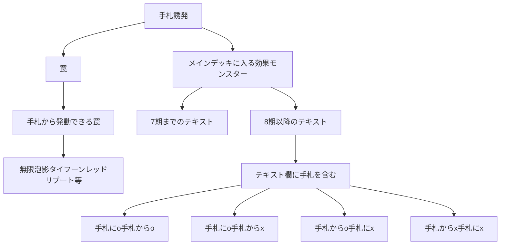

2024/06/30 17:00時点

## 手札から発動できる罠
遊戯王wikiを参照。

https://yugioh-wiki.net/index.php?%A1%D4%A5%C7%A5%EB%A5%BF%A1%A6%A5%AF%A5%ED%A5%A6%A1%DD%A5%A2%A5%F3%A5%C1%A1%A6%A5%EA%A5%D0%A1%BC%A5%B9%A1%D5#list

## 1期〜7期テキスト（①を含まない）
方法が見つからなかった。

遊戯王OCG検索ページで現在まで一度も再録されていないカードだけを表示するのは難しい...

遊戯王ニューロンでマイナス検索をしたいけどできない🥲

## 「手札に」も「手札から」も含む
406件ある。

https://ocg-card.com/list/result/?cate_0=効果モンスター&cate-op_0=3&cate_1=儀式モンスター&cate-op_1=3&text_0=①&text-p_0=1&text-op_0=1&text_1=手札&text-p_1=1&text-op_1=1&text_2=手札に&text-p_2=1&text-op_2=1&text_3=手札から&text-p_3=1&text-op_3=1&dup=1&sort=2&max=10
 <details>
```
赫の聖女カルテシア（新イラスト）
白の聖女エクレシア（新イラスト）
深淵の獣ルベリオン
深淵の獣マグナムート
スプライト・ジェット
スプライト・ブルー
スプリガンズ・キット
セリオンズ“リリー”ボレア
セリオンズ“リーパー”ファム
教導の神徒
教導の聖女エクレシア
青き眼の賢士（3枚）
エクス・ライゼオル
ソード・ライゼオル
ユニオン・パイロット
六武衆の指南番
六武衆の破戒僧
悪魔獣デビルゾア
心宿りし青眼竜
浮上するビッグ・ジョーズ
瀑征竜－タイダル（SPECIAL BLUE Ver.）
Emダメージ・ジャグラー
アビス・シャーク
灰流うらら（2枚）
黄金卿エルドリッチ（3枚）
EM：Pグレニャード
Live☆Twin キスキル・フロスト
銀河戦士（2枚）
サイバー・ダーク・キメラ
トリックスター・フーディ
銀河眼の時源竜
祈りの女王－コスモクイーン
魔を刻むデモンスミス
白き森のリゼット
オネスト
苗と霞の春化精
雷獣龍－サンダー・ドラゴン
雷電龍－サンダー・ドラゴン
雷源龍－サンダー・ドラゴン
サンダー・ドラゴン
魔弾の射手 カスパール
ハーピィ・クィーン
真紅眼の黒星竜
アブソルーター・ドラゴン
DDグリフォン
DDスワラル・スライム
フォトン・ジャンパー
TG ブースター・ラプトル
TG ワーウルフ
TG ストライカー
メルフィー・ラッシィ
メルフィー・ワラビィ
メルフィー・パピィ
メルフィー・キャシィ
斬機サーキュラー
幻影騎士団サイレントブーツ
彼岸の悪鬼 スカラマリオン
古代の機械素体
EMモンキーボード
希望皇アストラル・ホープ
ZS－昇華賢者
ZS－武装賢者
ジャンク・コンバーター
E-HERO アダスター・ゴールド
幻想の見習い魔導師
ランカの蟲惑魔
蒼穹の機界騎士
紫宵の機界騎士
時花の賢者－フルール・ド・サージュ
応戦するG
妖精伝姫－シンデレラ
幻惑の見習い魔術師
タロンズ・オブ・シュリーレン
光道の龍
竜騎兵ガーゴイルⅡ
蕾禍ノ鎧石竜
蕾禍ノ毬首
古代の機械巨人－アルティメット・パウンド
アストログラフ・マジシャン
未来の柱－キアノス
トイ・ソルジャー
精霊獣 ペトルフィン
インフェルノイド・ベルゼブル
A・ジェネクス・バードマン（新イラストもあり）
氷結界の虎将 ウェイン
ゴブリン降下部隊
粛声の竜賢聖サウラヴィス
粛声の竜賢姫サフィラ
幻魔の召喚神
スピリット・オブ・ユベル
GP－キャプテン・キャリー
ゴーティスの陰影スノーピオス
迷宮に潜むシャドウ・グール
真炎王 ポニクス
ドロール＆ロックバード
焔征竜－ブラスター
炎王獣 バロン
悪魔の聲
天使の聲
古聖戴サウラヴィス
メメント・メイス
ポワソニエル・ド・ヌーベルズ
VS 蛟龍
覇王門の魔術師
未界域のネッシー
バスター・ビースト
風来王 ワイルド・ワインド
シンクローン・リゾネーター
ヴィジョン・リゾネーター
覇王眷竜オッドアイズ
地縛超神官
地縛囚人 ストーン・スィーパー
アルカナフォースXV－THE DEVIL
火霊媒師ヒータ
天極輝士－熊斗竜巧α
ヴェーダ＝カーランタ
コーンフィールド コアトル
バーニング・ドラゴン
VS 龍帝ヴァリウス
VS ヘヴィ・ボーガー
風霊媒師ウィン
幸魂
恐楽園の死配人 ＜Arlechino＞
星騎士 リュラ
超重僧兵ビッグベン－K
超重武者バイ－Q
ダーク・オネスト（SPECIAL BLUE ver.）
ヴィジョン・リチュア
シャドウ・リチュア
空牙団の剣士 ビート
先史遺産クリスタル・スカル
魔轟神クシャノ
勇気の天使ヴィクトリカ
智の賢者－ヒンメル
武の賢者－アーカス
慈愛の賢者－シエラ
ドラゴンメイド・ルフト
ドラゴンメイド・フランメ
ドラゴンメイド・ティルル
ドラゴンメイド・フルス
ドラゴンメイド・エルデ
召喚師アレイスター
弾丸特急バレット・ライナー
リブロマンサー・ファイア
リブロマンサー・エージェント
リブロマンサー・Gボーイ
騎甲虫スティンギー・ランス
騎甲虫アサルト・ローラー
焔聖騎士－リナルド
R－ACEファイア・アタッカー
R－ACEエアホイスター
暗黒界の術師 スノウ
暗黒界の龍神 グラファ
暗黒界の門番 ゼンタ
暗黒界の魔神王 レイン
道化鳥ラフィンパフィン
テセア聖霊器
竜剣士マジェスティP
クシャトリラ・オーガ
クシャトリラ・ユニコーン
クシャトリラ・フェンリル
究極宝玉獣レインボー・ドラゴン
Gゴーレム・ペブルドッグ
Gゴーレム・ロックハンマー
らくがきじゅう－すてご
鉄球魔神ゴロゴーン
ファラオニック・アドベント
アマゾネスの斥候
古尖兵ケルベク
宿神像ケルドウ
D・リモコン
ガジェット・ゲーマー
D・スキャナン
深淵の暗殺者
アビス・ソルジャー（2枚）
アトランティスの戦士（3枚）
地霊媒師アウス
はぐれ・もけもけ
ジェムナイト・クォーツ
花と野原の春化精
丘と芽吹の春化精
E・HERO スピリット・オブ・ネオス
沼地の魔神王
白銀の城の狂時計
白銀の城の召使い アリアンナ
SRベイゴマックス
リバースポッド
バーバリアン０号
外法の騎士
音響戦士ギタリス
H・C モーニング・スター
スケアクロー・ライヒハート
EMジェントルード
パペット・キング
EMバロックリボー
海晶乙女パスカルス
デス・クラーケン
悪魔嬢アリス
S－Force レトロアクティヴ
オッドアイズ・ペンデュラムグラフ・ドラゴン
極星工イーヴァルディ
極星獣グリンブルスティ
マジクリボー
ジョーカーズ・ナイト
聖殿の水遣い
No－P.U.N.K.オーガ・ナンバー
天空の使者 ゼラディアス
大天使クリスティア
命の代行者 ネプチューン
パペット・クィーン
うにの軍貫
光波複葉機
ドラゴンロイド
クリバビロン
クリベー
クリブー
サイバー・ダーク・クロー
サイバー・ダーク・カノン
サイバー・ファロス
森の聖獣 カルピポニカ
ガスタ・ヴェズル
いくらの軍貫
ベアルクティ－ミクタナス
ベアルクティ－ミクポーラ
溟界の滓－ナイア
光の天穿バハルティヤ
ホーリーナイツ・シエル
海造賊－黒翼の水先人
武神－マヒトツ
紅蓮薔薇の魔女
ミレニアム・アイズ・イリュージョニスト
千年の血族
ホーリーナイツ・フラムエル
夢魔鏡の使徒－ネイロイ
セイクリッド・カドケウス
メタルフォーゼ・バニッシャー
魔轟神マルコシア
S－Force 乱破小夜丸
アームド・ドラゴン LV１０－ホワイト
アームド・ドラゴン・サンダー LV５
アームド・ドラゴン・サンダー LV７
泥岩の霊長－マンドストロング
バラガール
俊炎星－ゾウセイ
魔轟神グリムロ
嵐征竜－テンペスト
ドラグニティ－レムス
機巧牙－御神尊真神
U.A.リベロスパイカー
双天脚の鴻鵠
RR－ヒール・イーグル
花札衛－桜－
人造人間－サイコ・ジャッカー
ガーディアン・スライム
コアキメイル・サプライヤー
ネメシス・キーストーン
メルフィー・ポニィ
メルフィー・フェニィ
暗黒騎士ガイアソルジャー
混沌の召喚神
幻魔皇ラビエル－天界蹂躙拳
六花精ボタン
鬼ガエル
ネメシス・コリドー
ネメシス・アンブレラ
ネメシス・フラッグ
剛鬼アイアン・クロー
ローズ・プリンセス
捕食植物スパイダー・オーキッド
ダーク・シムルグ
破壊剣士の伴竜
ドシン＠イグニスター
ヒヤリ＠イグニスター
焔聖騎士－ローラン
クロノダイバー・リューズ
ワルキューレ・アルテスト
剛鬼ヘッドバット
チョバムアーマー・ドラゴン
太陽の神官
占い魔女 フウちゃん
天威龍－ヴィシュダ
天威龍－アーダラ
妖仙獣 飯綱鞭
神聖魔導王 エンディミオン
ウィッチクラフト・ピットレ
ウィッチクラフト・ポトリー
無限起動ドラグショベル
無限起動キャンサークレーン
アンクリボー
レモン・マジシャン・ガール
方界超帝インディオラ・デス・ボルト
方界帝ヴァルカン・ドラグニー
方界帝ゲイラ・ガイル
アップル・マジシャン・ガール
星遺物の守護竜メロダーク
颶風龍－ビュフォート・ノウェム
ユニコールの影霊衣
ブリューナクの影霊衣
メガリス・ハギト
メガリス・オフィエル
超量士ホワイトレイヤー
クロス・ポーター
真竜皇アグニマズドV
転生炎獣フォクシー
転生炎獣ミーア
転生炎獣ラクーン
堕天使アムドゥシアス
ハーピィ・オラクル
孤高除獣
守護竜ガルミデス
スピードローダー・ドラゴン
ロード・オブ・ドラゴン－ドラゴンの統制者－
ゴキポール
プロフィビット・スネーク
レイテンシ
魔界劇団－メロー・マドンナ
クリフォトン
怪鳥グライフ
星遺物－『星冠』
星辰のパラディオン
剛鬼ムーンサルト
SIMMタブラス
オッドアイズ・ファンタズマ・ドラゴン
影王デュークシェード
悪王アフリマ
空牙団の英雄 ラファール
空牙団の参謀 シール
エレメントセイバー・ナル
エレメントセイバー・マカニ
剛鬼マンジロック
バックアップ・オペレーター
剛鬼スープレックス
トリックスター・リリーベル
水精鱗－ディニクアビス
水精鱗－メガロアビス
デスペラード・リボルバー・ドラゴン
魔導獣 ガルーダ
超天新龍オッドアイズ・レボリューション・ドラゴン
ヘカテリス
SPYRAL－ダンディ
魔弾の射手 ドクトル
六武衆の師範
星遺物－『星鎧』
ジェスター・コンフィ
デューテリオン
時械巫女
DDD運命王ゼロ・ラプラス
真竜凰マリアムネ
EMスカイ・ピューピル
EMスカイ・マジシャン
星読みの魔術師
SRドミノバタフライ
月光黒羊
ファーニマル・オウル
ファーニマル・ドッグ
捕食植物セラセニアント
混沌の使者
霊魂鳥－忍鴉
サイバー・チュチュボン
EMダグ・ダガーマン
Kozmo－フェルブラン
Kozmo－ドロッセル
光波鏡騎士
マジック・ストライダー
トゥーン・ブラック・マジシャン
レッド・ミラー
DD魔導賢者ニコラ
EMギッタンバッタ
RR－ペイン・レイニアス
トランス・デーモン
DD魔導賢者ガリレイ
DDケルベロス
DD魔導賢者ニュートン
超量士レッドレイヤー
RR－ファジー・レイニアス
風帝家臣ガルーム
地帝家臣ランドローブ
冥帝エレボス
U.A.コリバルリバウンダー
U.A.ドレッドノートダンカー
U.A.ストロングブロッカー
U.A.フィールドゼネラル
U.A.カストディアン
U.A.ファンタジスタ
U.A.パーフェクトエース
U.A.マイティスラッガー
彼岸の悪鬼 ハックルスパー
音響戦士マイクス
イグナイト・スティンガー
イグナイト・アヴェンジャー
DDD覇龍王ペンドラゴン
オッドアイズ・セイバー・ドラゴン
妖仙獣 大幽谷響
ファーニマル・シープ
薔薇の聖騎士
サンダー・シーホース
インフェルニティ・デーモン
ラッシュ・ウォリアー
妖仙獣 辻斬風
霊魂鳥神－彦孔雀
妖仙獣 鎌参太刀
妖仙獣 鎌弐太刀
妖仙獣 鎌壱太刀
H・C 強襲のハルベルト
アーティファクト－チャクラム
クラウソラスの影霊衣
```
</details>

## 「手札に」を含むが「手札から」を含まない
733件ある。

https://ocg-card.com/list/result/?cate_0=効果モンスター&cate-op_0=3&cate_1=儀式モンスター&cate-op_1=3&text_0=①&text-p_0=1&text-op_0=1&text_1=手札&text-p_1=1&text-op_1=1&text_2=手札に&text-p_2=1&text-op_2=1&text_3=手札から&text-p_3=1&text-op_3=2&dup=1&sort=2&max=10

<details>
```
デスピアの導化アルベル（新イラスト）
鉄獣鳥 メルクーリエ
氷水艇キングフィッシャー
氷水のエジル
悲劇のデスピアン
スプリガンズ・バンガー
スプリガンズ・ロッキー
鉄獣戦線 ナーベル
太古の白石
伝説の白石
深淵の青眼龍
ブルーアイズ・ジェット・ドラゴン
Lマジマージ
ツルプルプルン
ドレイク・シャーク
黒き森のウィッチ
ライトハンド・シャーク
Emカップ・トリッカー
Emウォーター・ダンサー
Emファイヤー・ダンサー
ギミック・パペット－キラーナイト
カット・イン・シャーク
クリアー・ファントム
サイバー・ドラゴン・ヘルツ（2枚）
サイバー・ドラゴン・コア（3枚）
トリックスター・キャンディナ
トリックスター・マンジュシカ
トリックスター・リリーベル
B－バスター・ドレイク
A－アサルト・コア
星雲龍ネビュラ
輝光竜セイファート
時空の雲篭
召喚神エクゾディア
ドラ・ドラ
竜輝巧－νII
幻禄の天盃龍
白き森のシルヴィ
ギミック・パペット－ブラッディ・ドール
ミレニアム・アブソリューター
ミレニアムーン・メイデン
千年王朝の盾
千年の宝を守りしゴーレム
千年の眠りから覚めし原人
クリッター
暗黒竜 コラプサーペント
輝白竜 ワイバースター
竜輝巧－アルζ
竜輝巧－バンα
マドルチェ・メッセンジェラート
マドルチェ・マジョレーヌ
BF－幻耀のスズリ
BF－嵐砂のシャマール
BF－精鋭のゼピュロス
ハーピィ・パフューマー
ハーピィ・ハーピスト
黒鋼竜
伝説の黒石
DD魔導賢者ケプラー
フォトン・オービタル
フォトン・バニッシャー
銀河の魔導師
炎王妃 ウルカニクス
RR－ペイン・レイニアス
RR－トリビュート・レイニアス
RR－ミミクリー・レイニアス
幻影騎士団ダスティローブ
古代の機械飛竜
古代の機械箱
ファイアウォール・ファントム
パラレルエクシード
コード・ジェネレーター
レディ・デバッガー
虹彩の魔術師
EMドクロバット・ジョーカー
賤竜の魔術師
EMペンデュラム・マジシャン
ズバババンチョー－GC
ジェット・シンクロン
V・HERO ヴァイオン
E・HERO シャドー・ミスト
E・HERO エアーマン
合体竜ティマイオス
マジシャンズ・ソウルズ
マジシャンズ・ロッド
共振虫
カズーラの蟲惑魔
トリオンの蟲惑魔
プティカの蟲惑魔
ウィッチクラフトゴーレム・アルル
妖精伝姫－カグヤ
憑依覚醒－大稲荷火
憑依覚醒－デーモン・リーパー
円喚妖精キクロス
月牙龍－クレセント・ドラゴン
天魔の聲選姫
天盃龍パイドラ
幻奏の歌姫クープレ
幻奏の歌姫ルフラン
粛声なる竜神サフィラ
古代の機械暗黒巨人
トリコロール・ガジェット
幻奏の歌姫ソプラノ
ライトロード・メイデン ミネルバ
幸魂
スターダスト・シンクロン
暗黒の招来神
マイクロ・コーダー
荒魂
輝ける星の竜
神聖なる魔術師
超重武者ドウC－N
森の聖獣 キティテール
魔竜将ディアボリカ
電極獣アニオン
電極獣カチオン
ミラァと燐寸之仔
影霊獣使い－セフィラウェンディ
精霊獣 カンナホーク
レアル・ジェネクス・オラクル
レアル・ジェネクス・アクセラレーター
レアル・ジェネクス・マグナ
レアル・ジェネクス・クラッシャー
レアル・ジェネクス・ターボ
ジェネクス・ブラスト
ジェネクス・ニュートロン
ジェネクス・パワー・プランナー
ジェネクス・ウンディーネ
レアル・ジェネクス・ウンディーネ
氷結界の舞姫
氷結界の神精霊
氷結界の決起隊
プリンシパグ
メメント・ウラモン
ゴーティスの月夜サイクス
蛇眼の炎燐
百鬼羅刹 特攻ダグ
白曼波
RR－ノアール・レイニアス
サクリファイス・D・ロータス
ペンデュラム・ウィッチ
マジェスペクター・ラクーン
炎魔の触媒
ゴーティスの守人イーノック
獣王アルファ
真竜皇アグニマズドV
炎王神獣 キリン
重騎士プリメラ
メメント・エンウィッチ
陀羅威
ブラック・ホール・ドラゴン
ホルスの先導－ハーピ
ホルスの栄光－イムセティ
スネークアイ・オーク
スネークアイ・エクセル
ヴェーダ＝ウパニシャッド
覇王眷竜ライトヴルム
EM天空の魔術師
マンジュ・ゴッド
サイキック・リフレクター
ソウル・リゾネーター
オルターガイスト・メリュシーク
オルターガイスト・シルキタス
覇王眷竜ダークヴルム
覇王門零
バフォメット
地縛囚人 ライン・ウォーカー
カブレラストーン
アショカ・ピラー
ヘルカイトプテラ
オッドアイズ・ペンデュラム・ドラゴン（新イラスト）
BK グラスジョー
BK アッパーカッター
ヴォルカニック・ロケット
ヴォルカニック・バレット
ヴォルカニック・トルーパー
サラマングレイト・オブ・ファイア
強欲なポッド
火天獣－キャンドル
百戦王 ベヒーモス
破械神シャバラ
夢現の寝姫－ネムレリア・レアリゼ
オルターガイスト・マルウィスプ
大翼のバフォメット
幻爪の王ガゼル
百獣王 ベヒーモス
聖なる魔術師
珠玉獣－アルゴザウルス
三眼の死霊
魔神儀－タリスマンドラ
魔神儀－キャンドール
VS Dr.マッドラヴ
伝説の剣闘士 カオス・ソルジャー
イリュージョン・オブ・カオス
粛声なる守護者ローガーディアン
霊魂鳥影－彦孔雀
霊魂鳥影－姫孔雀
アラヒメの御巫
バラムニエル・ド・ヌーベルズ
ブエリヤベース・ド・ヌーベルズ
VS ラゼン
魂喰いオヴィラプター
ペンデュラムーン
死天使ハーヴェスト
刀皇－都牟羽沓薙
珠の御巫フゥリ
ピュアリィ・リリィ
マナドゥム・リウムハート
ドドレミコード・キューティア
八俣大蛇
八汰烏
光の王 マルデル
リチュア・アビス
魔界劇団－ビッグ・スター
竜剣士ラスターP
六花のひとひら
H・C クラスプ・ナイフ
先史遺産ネブラ・ディスク
武神－ヤマト
海神の依代
新鋭の女戦士
ネコーン
薔薇占術師
プレイング・マンティス
ドラゴンメイド・チェイム
ドラゴンメイド・パルラ
ドラゴンメイド・ラドリー
ドラゴンメイド・ナサリー
無頼特急バトレイン
Couple of Aces
チョウジュ・ゴッド
震天のマンティコア
呪眼の死徒 サリエル
ダイダラボッチ
騎甲虫ライト・フラッパー
機巧鳥－常世宇受賣長鳴
剣の御巫ハレ
ピュアリィ
R－ACEハイドラント
R－ACEイントルーダー
暗黒界の斥候 スカー
沈黙狼－カルーポ
キュウドウ魂 HAN－SHI
空牙団の積荷 レクス
竜剣士ダイナマイトP
竜剣士イグニスP
占術姫ビブリオムーサ
銃の忍者－火光
獣の忍者－獏
BF－刻夜のゾンダ
忍者マスター HANZO
宝玉の先導者
EMオッドアイズ・プリースト
水晶ドクロ
A宝玉獣 コバルト・イーグル
アマゾネス王女
アマゾネス霊術師
アマゾネスの銀剣使い
D・スマホン
魔犬オクトロス
黒蠍－棘のミーネ（2枚）
ソニックバード（2枚）
センジュ・ゴッド
ペンギン・ナイトメア
闇の仮面
ハイドランダー・オービット
スカー・ヴェンデット
邪悪なるワーム・ビースト
カイザー・グライダー
リバイバルゴーレム
N・グラン・モール
白銀の城の竜飾灯
ヴァリアンツM－マーキス
ヴァリアンツの武者－北条
ヴァリアンツの弓引－西園
ヴァリアンツの巫女－東雲
ボティス
EM稀代の決闘者
絶海のマーレ
戦華の暴－董穎
捕食植物ブフォリキュラ
捕食植物ビブリスプ
ヴィサス＝スタフロスト
結晶の大賢者サンドリヨン
劫火の翼竜 ゴースト・ワイバーン
劫火の眠り姫 ゴースト・スリーパー
ラミア
パペット・ポーン
妖醒龍ラルバウール
竜魔導の守護者
伝説のフィッシャーマン二世
海竜神－リバイアサン
大要塞クジラ
アビス・シャーク
ピースリア
サイバー・エンジェル－弁天－
サイバース・セイジ
リヴェンデット・エグゼクター
イビリチュア・ネーレイマナス
オオヒメの御巫
熟練の栗魔導士
絶神鳥シムルグ
夢魔鏡の逆徒－ネイロイ
ヴァンパイアの幽鬼
ゴーストリック・セイレーン
ディメンション・コンジュラー
ウォークライ・フォティア
ミュートリアル・アームズ
ミュートリアル・ミスト
ミュートリアル・ビースト
被検体ミュートリアST－４６
被検体ミュートリアM－０５
インペリアル・バウアー
No－P.U.N.K.セアミン
Jo－P.U.N.K.Mme.スパイダー
Ga－P.U.N.K.ワゴン
神秘の代行者 アース
イーバ
魂の造形家
迷犬メリー
重起士道－ゴルドナイト
ホーリーナイツ・オルビタエル
ペンギン忍者
ふわんだりぃず×えんぺん
ふわんだりぃず×とっかん
ふわんだりぃず×すとりー
ふわんだりぃず×いぐるん
ふわんだりぃず×ろびーな
デュアルウィール・ドラゴン
聖なる守り手
魔道化リジョン
ペンギン・ソルジャー
ガガガシスター
聖騎士の槍持ち
花騎士団の駿馬
聖騎士の盾持ち
クリビー
魔導騎士ギルティア－ソウル・スピア
LL－コバルト・スパロー
LL－セレスト・ワグテイル
LL－ベリル・カナリー
聖騎士ジャンヌ
SRビーダマシーン
SR吹持童子
木花咲弥
先史遺産アカンバロの土偶
先史遺産メガラ・グローヴ
クロノダイバー・テンプホエーラー
失楽の魔女
和魂
惑星探査車
クリスタル・ガール
ソドレミコード・グレーシア
ミドレミコード・エリーティア
溟界王－アロン
溟界の昏闇－アレート
溟界の漠－ゾーハ
溟界の漠－フロギ
憑依装着－ライナ（新イラストもあり）
地久神－カルボン
天魔神 シドヘルズ
スクラップ・ラプター
ロクスローズ・ドラゴン
光波異邦臣
マシンナーズ・メタルクランチ
ワルキューレ・シグルーン
カクリヨノチザクラ
シェル・ナイト
ホーリーナイツ・レイエル
妖精伝姫－ラチカ
魔知ガエル
ワイトベイキング
ダイカミナリ・ジャイクロプス
マシンナーズ・アンクラスペア
パラメタルフォーゼ・メルキャスター
S－Force グラビティーノ
背護衛
いたずら風のフィードラン
夢魔鏡の乙女－イケロス
トリック・デーモン
ドラグニティ－コルセスカ
巌帯の美技－ゼノギタム
憑依覚醒－ラセンリュウ
憑依覚醒－ガギゴバイト
双天拳の熊羆
電脳堺麟－麟々
電脳堺豸－豸々
電脳堺悟－老々
電脳堺媛－瑞々
輪廻竜サンサーラ
ダーク・アリゲーター
否定ペンギン
極氷獣ポーラ・ペンギン
アーマード・ホワイトベア
風化戦士
魔鏡導士サイコ・バウンダー
トランソニックバード
ヴァレルロード・R・ドラゴン
魔鍵砲－ガレスヴェート
魔鍵銃－バトスバスター
機皇枢インフィニティ・コア
ホールディング・レッグス
マシンナーズ・リザーブレイク
悦楽の堕天使
呪われし竜－カース・オブ・ドラゴン
暗黒の召喚神
ブロックドラゴン
マシンナーズ・パゼストレージ
レフティ・ドライバー
マシンナーズ・ディフェンダー
マシンナーズ・ピースキーパー
マシンナーズ・ギアフレーム
マジカル・ハウンド
轟の王 ハール
戦華の智－諸葛孔
戦華の詭－賈文
深海のセントリー
深海のアーチザン
海晶乙女バシランリマ
剛鬼ガッツ
コードブレイカー・ゼロデイ
眩月龍セレグレア
オルターガイスト・フィジアラート
オルターガイスト・プークエリ
クリバンデット
イェシャドール－セフィラナーガ
シャドール・ハウンド
シャドール・ドラゴン
シャドール・ヘッジホッグ
魔界劇団－ワイルド・ホープ
烈風帝ライザー
終焉龍 カオス・エンペラー
オッドアイズ・ウィザード・ドラゴン
バトル・サバイバー
執愛のウヴァループ
カラクリ法師 九七六参
戦華の妙－魯敬
戦華の美－周公
戦華の仲－孫謀
アチチ＠イグニスター
ドヨン＠イグニスター
ピカリ＠イグニスター
化合獣カーボン・クラブ
騎士デイ・グレファー
ワルキューレ・フィアット（イラスト2種）
ワルキューレ・ドリット
ワルキューレ・ツヴァイト
ダイナレスラー・システゴ
ティンダングル・ジレルス
コード・エクスポーター
ダイナレスラー・マーシャルアンペロ
海晶乙女ブルータン
霊廟の守護者
スーパイ
怨念の邪悪霊
抹殺の邪悪霊
B・F－毒針のニードル
V・HERO グラビート
霞の谷の巨神鳥
メギストリーの儀術師
レプティレス・ヒュドラ
烈風の覇者シムルグ
護神鳥シムルグ
招神鳥シムルグ
魔妖仙獣 独眼群主
妖仙獣 侍郎風
魔妖仙獣 大刃禍是
転生炎獣コヨーテ
魔導書士 バテル
混沌の黒魔術師
聖なる解呪師
マジカル・アブダクター
エンプレス・オブ・エンディミオン
創聖魔導王 エンディミオン
呪眼の死徒 メドゥサ
無限起動ハーヴェスター
クリスタル・ドラゴン
方界超獣バスター・ガンダイル
方界獣ブレード・ガルーディア
方界獣ダーク・ガネックス
ベリー・マジシャン・ガール
Sin パラドクスギア
機怪神エクスクローラー
ダイナレスラー・エスクリマメンチ
転生炎獣フェネック
ドレッド・ドラゴン
爆風トカゲ
ハネハネ
オッドアイズ・セイバー・ドラゴン
EMスマイル・マジシャン
フォーマッド・スキッパー
転生炎獣ファルコ
立炎星－トウケイ
スクラップ・オルトロス
ハーピィ・ダンサー
疾走の暗黒騎士ガイア
メガリス・フール
竜姫神サフィラ
ウォーターリヴァイアサン＠イグニスター
マジシャン・オブ・ブラックカオスMAX
月光彩雛
月光黄鼬
レッドローズ・ドラゴン
サイバー・プチ・エンジェル
サイバー・エッグ・エンジェル
彩宝龍
転生炎獣ウルヴィー
キャシー・イヴL2
ゴブリンゾンビ
冥界騎士トリスタン
イモータル・ルーラー
グローアップ・ブルーム
ケンドウ魂 KAI－DEN
カラテ魂 KURO－OBI
スモウ魂 YOKO－ZUNA
F.A.カーナビゲーター
ネフティスの語り手
ネフティスの祈り手
幻妖フルドラ
魔神儀－ブックストーン
魔神儀－ペンシルベル
雷劫龍－サンダー・ドラゴン
魔界劇団－ダンディ・バイプレイヤー
魔界劇団－プリティ・ヒロイン
ハイバネーション・ドラゴン
時械神メタイオン
鉄の騎士
闇霊神オブルミラージュ
オービタル ７
EMクレイブレイカー
死王リッチーロード
ヴァンパイアの眷属
ヴァンパイアの使い魔
E・HERO ブレイズマン
ボイコットン
オルターガイスト・ピクシール
ティンダングル・トリニティ
剛鬼ハッグベア
ヴァンパイア・ソーサラー
剛鬼ツイストコブラ
魔導雑貨商人
ガベージコレクター
水晶機巧－シストバーン
レアメタルフォーゼ・ビスマギア
秘竜星－セフィラシウゴ
聖騎士ボールス
海皇の竜騎隊
甲虫装機 センチピード
ヴェルズ・ケルキオン
ジェムナイト・ラズリー
オーバーテクス・ゴアトルス
デスマニア・デビル
魔導獣 マスターケルベロス
魔導獣 バジリスク
紫宵の機界騎士
翠嵐の機界騎士
ティンダングル・イントルーダー
ティンダングル・アポストル
おジャマ・ブルー
解放のアリアドネ
救済のレイヤード
智天使ハーヴェスト
力天使ヴァルキリア
天空賢者ミネルヴァ
天空聖騎士アークパーシアス
サブテラーの導師
SPYRAL GEAR－ドローン
「RESORT」 STAFF－チャーミング
SPYRAL－ミスティ
SPYRAL－グレース
SPYRAL－ジーニアス
影六武衆－キザル
影六武衆－ゲンバ
旋風機ストリボーグ
天岩戸
メタファイズ・ネフティス
クローラー・ランヴィエ
クローラー・レセプター
スニッフィング・ドラゴン
次元合成師
金華猫
ROMクラウディア
エクスプレスロイド
真紅眼の幼竜
青竜の召喚士
ウェポンサモナー（2枚）
魔界劇団カーテン・ライザー
星遺物－『星杯』
星杯の妖精リース
剛鬼ライジングスコーピオ
影霊衣の術士 シュリット
影霊衣の巫女 エリアル
電子光虫－LEDバグ
サイバー・エンジェル－荼吉尼－
サイバー・エンジェル－韋駄天－
ヴェンデット・バスタード
リヴェンデット・スレイヤー
嵐竜の聖騎士
サイバース・マジシャン
輝神鳥ヴェーヌ
真竜拳士ダイナマイトK
真竜戦士イグニスH
真竜導士マジェスティM
捕食植物ダーリング・コブラ
EMユーゴーレム
ONiサンダー
月読命
黄昏の忍者－シンゲツ
超重武者ダイ－８
WW－グラス・ベル
エッジインプ・チェーン
ファーニマル・オクト
河伯
霊魂鳥－伝鳩
霊魂鳥－巫鶴
十二獣ラビーナ
EMリターンタンタン
マインフィールド
ギアギアングラー
Kozmo－ダークプラネット
Kozmo－ダークエクリプサー
D-HERO ディシジョンガイ
水晶機巧－スモーガー
EMハンサムライガー
沈黙の魔導剣士－サイレント・パラディン
電磁石の戦士β
電磁石の戦士α
イエロー・ガジェット
レッド・ガジェット
グリーン・ガジェット
EMコン
レッカーパンダ
天照大神
DD魔導賢者トーマス
EMセカンドンキー
EMロングフォーン・ブル
EMキングベアー
エクリプス・ワイバーン
創世の預言者
裏風の精霊
アモルファージ・ノーテス
青き眼の祭司
月光白兎
魔帝アングマール
DDプラウド・シュバリエ
DDリリス
青き眼の巫女
超量士ブルーレイヤー
RR－ネクロ・ヴァルチャー
幻影騎士団クラックヘルム
不知火の武士
不知火の鍛師
ダイナミスト・プテラン
破壊剣－ウィザードバスターブレード
シンクロ・フュージョニスト
天帝アイテール
スピリチューアル・ウィスパー
P・M・キャプチャー
PSYフレームギア・α
聖戦士カオス・ソルジャー
Dr.フランゲ
禁忌の壺
ブンボーグ００６
マジェスペクター・ユニコーン
マジェスペクター・フォックス
マジェスペクター・クロウ
マジェスペクター・キャット
宵闇の騎士
開闢の騎士
超戦士の魂
RR－スカル・イーグル
EMヘイタイガー
アクアアクトレス・アロワナ
アクアアクトレス・テトラ
占術姫クリスタルウンディーネ
占術姫アローシルフ
不幸を告げる黒猫
魔装戦士 ドラゴディウス
矮星竜 プラネター
アロマージ－カナンガ
幻奏の音女タムタム
ダッカー（2枚）
海皇子 ネプトアビス
超重武者グロウ－V
EMスプリングース
EMガンバッター
EMハンマーマンモ
キラー・スネーク
アマゾネスの鎖使い
BF－上弦のピナーカ
音響戦士サイザス
フロント・オブザーバー
影霊衣の舞姫
妖仙獣 凶旋嵐
クリフォート・エイリアス
超重武者装留イワトオシ
EMトランプ・ウィッチ
霊魂鳥神－姫孔雀
虚竜魔王アモルファクターP
オッドアイズ・グラビティ・ドラゴン
精霊獣 ペトルフィン
影霊衣の戦士 エグザ
影霊衣の大魔道士
妖仙獣 閻魔巳裂
聖騎士パーシヴァル
森羅の葉心棒 ブレイド
魔界発冥界行きバス
セイクリッド・ソンブレス
セイクリッド・シェラタン
ジェムレシス
XX－セイバー ダークソウル
XX－セイバー レイジグラ
おねだりゴブリン
ブンボーグ００２
レスキューラット
星因士 ベテルギウス
クリフォート・アーカイブ
ファーニマル・ラビット
ファーニマル・キャット
ファーニマル・ベア
幻奏の音姫ローリイット・フランソワ
EMトランポリンクス
E・HERO フォレストマン
E・HERO オーシャン
マジック・ハンド
名工 虎鉄
光天使セプター
どぐう
電池メン－角型
星因士 デネブ
黄龍の召喚士
魔装戦士 ヴァンドラ
魔装聖龍 イーサルウェポン
```
</details>

## 「手札から」を含むが「手札に」を含まない
904件ある。

https://ocg-card.com/list/result/?cate_0=効果モンスター&cate-op_0=3&cate_1=儀式モンスター&cate-op_1=3&text_0=①&text-p_0=1&text-op_0=1&text_1=手札&text-p_1=1&text-op_1=1&text_2=手札に&text-p_2=1&text-op_2=2&text_3=手札から&text-p_3=1&text-op_3=1&dup=1&sort=2&max=10

<details>

```
氷水帝エジル・ラーン
アルギロスの落胤
深淵の獣バルドレイク
深淵の獣ドルイドヴルム
深淵の獣サロニール
セリオンズ・イレギュラー
セリオンズ“エンプレス”アラシア
スプライト・キャロット
スプライト・レッド
スプライト・ピクシーズ
セリオンズ“キング”レギュラス
セリオンズ“デューク”ユール
セリオンズ“ブルズ”アイン
氷水帝コスモクロア
氷水のトレモラ
氷水のアクティ
相剣瑞獣－純鈞
相剣軍師－龍淵
黒衣竜アルビオン
軒轅の相剣師
妖眼の相剣師
喜劇のデスピアン
鉄獣戦線 ケラス
教導の天啓アディン
教導の鉄槌テオ
教導の騎士フルルドリス
教導の大神祇官
教導枢機テトラドラグマ
ロード・オブ・ドラゴン－ドラゴンの独裁者－（2枚）
白き霊龍
アイス・ライゼオル
ノード・ライゼオル
混沌なる魅惑の女王
EMスカイ・マジシャン・ガール
ジャイアント・タコーン
リンクスレイヤー
Emハットトリッカー
ギミック・パペット－ビスク・ドール
ランタン・シャーク
Emウィンド・サッカー
古代の機械像
特異点の悪魔
増殖するG（2枚）
Live☆Twin リィラ・トリート
壊星壊獣ジズキエル
サイバー・ドラゴン・ネクステア
サイバー・ドラゴン（3枚）
トリックスター・キャロベイン
C－クラッシュ・ワイバーン
X－クロス・キャノン
無限竜シュヴァルツシルト
機雷化するクリボー
マルチャミー・プルリア
無孔砲塔－ディセイブラスター
シビレルダケ
至天の魔王ミッシング・バロウズ
メメント・スリーピィ
蕾禍ノ姫邪眼
白き森のルシア
鎧騎士竜－ナイト・アームド・ドラゴン－
闇と消滅の竜
光と昇華の竜
黒き魔術師－ブラック・マジシャン
D.D.クロウ
魔轟神ルリー
雷鳥龍－サンダー・ドラゴン
魔弾の射手 スター
魔弾の射手 ザ・キッド
マドルチェ・プティンセスール
BF－無頼のヴァータ
BF－下弦のサルンガ
ハーピィズペット竜－セイント・ファイアー・ギガ
ハーピィ・チャネラー
レッドアイズ・ダークネスメタルドラゴン
ノクトビジョン・ドラゴン
ヴァレット・キャリバー
DDオルトロス
銀河眼の光子竜
TG ギア・ゾンビ
白銀の城のラビュリンス（SPECIAL PURPLE Ver.）
ウィッチクラフトマスター・ヴェール（SPECIAL PURPLE Ver.）
アロマージ－ローリエ
アロマセラフィ－アンゼリカ
RR－ストラングル・レイニアス
RR－バニシング・レイニアス
彼岸の悪鬼 ガトルホッグ
彼岸の悪鬼 グラバースニッチ
バックアップ・セクレタリー
クロノグラフ・マジシャン
調弦の魔術師
慧眼の魔術師
ZW－天馬双翼剣
ドドドドワーフ－GG
希望皇オノマトピア
ドッペル・ウォリアー
D-HERO ダークエンジェル
E・HERO オネスティ・ネオス
アーティファクト－モラルタ
薔薇恋人
粘糸壊獣クモグス
怪粉壊獣ガダーラ
ジーナの蟲惑魔
アトラの蟲惑魔
キノの蟲惑魔
サタンクロース
エフェクト・ヴェーラー
妖精伝姫－ターリア
ランリュウ
稲荷火
ジゴバイト
デーモン・イーター
冷える火
ディノベーダー・ドクス
ライトロード・デーモン ヴァイス
GP－アサシネーター
ヘルグレイブ・スクワーマー
天盃龍チュンドラ
蕾禍ノ矢筈天牛
原罪のディアベルゼ
古代の機械司令
古代の機械戦車兵
マシマシュマロン
破壊竜ガンドラG
アサルト・シンクロン
原始生命態ニビル
ディメンション・アトラクター
ダイナレスラー・パンクラトプス
守護神官マハード
破滅竜ガンドラX
コード・オブ・ソウル
甲虫合体ゼクスタッガー
若い忍者
水月のアデュラリア
閃刀姫－ロゼ（新イラスト）
紅蓮王 フレイム・クライム
エレクトロ・ガンナー
トイ・タンク
クリボー
精霊獣使い レラ
インフェルノイド・リリス
インフェルノイド・シャイターン
インフェルノイド・ヴァエル
インフェルノイド・アスタロス
インフェルノイド・ルキフグス
A・ジェネクス・リバイバー
A・ジェネクス・ケミストリ
レアル・ジェネクス・コーディネイター
ジェネクス・ワーカー
レアル・ジェネクス・チューリング
氷結界の随身
氷結界の依巫
氷結界の伝道師
氷結界の軍師
氷結界の封魔団
氷結界の交霊師
氷結界の剣士 ゲオルギアス
呪炎王 バースト・カースド
幻蝋館の使者
異星戦隊 ビッグ・バン
バーサーク・デーモン
タイム・リワインダー
マジェスペクター・ポーキュパイン
アロマリリス－ロザリーナ
ホルスの黒炎神
ゴーティスの朧キーフ
百鬼羅刹 冷血ミアンダ
白鰯
RR－ブルーム・ヴァルチャー
ガイストーチ・ゴーレム
クロクロークロウ
ゴブリンドバーグ
SPYRAL－ダブルフェイク
彗星の将－ワンモア・ザ・ナイト
ミナイルカ
岩竜ベアロック
地底王の尖兵
渾然たる闘牛詩－オルフェブル
GP－RB
GP－Nヘッド
GP－リオン
ゴーティスの兆イグジープ
ゴーティスの紅玉ゼップ
ゴーティスの灯ペイシス
嚇灼の魔神
怒炎壊獣ドゴラン
炎征竜－バーナー
炎王獣 キリン
炎王獣 ヤクシャ
炎王獣 ガルドニクス
炎王獣 ハヌマーン
儚無みずき
守護天霊ロガエス
召喚僧サモンプリースト
メメント・ゴブリン
メメント・ダークソード
メメント・シーホース
メメント・ホーン・ドラゴン
白銀の城の執事 アリアス
エレキハダマグロ
スネークアイ・ワイトバーチ
黒魔女ディアベルスター
ヴィサス＝サンサーラ
ジャンク・ドラゴンセント
キリビ・レディ
未界域のチュパカブラ
使神官－アスカトル
奇術王 ムーン・スター
レッド・ウルフ
バトルフェーダー
バイス・ドラゴン
クリムゾン・リゾネーター
レッド・リゾネーター
クリエイト・リゾネーター
オルターガイスト・マルチフェイカー
サテライト・シンクロン
幻創のミセラサウルス
BK プロモーター
BK チーフセコンド
転生炎獣スピニー
転生炎獣ガゼル
転生炎獣ティガー
転生炎獣ウィーゼル
R－ACEプリベンター
焔聖騎士－リッチャルデット
マナドゥム・トリッド
双頭竜キング・レックス
雙極の破械神
ブースト・ウォリアー
VS プルトンHG
VS パンテラ
超越竜メテオロス
ゼノ・メテオロス
銀河眼の残光竜
未界域のジャッカロープ
BF－毒風のシムーン
屋敷わらし
アーティファクト－ロンギヌス
V・HERO ファリス
百檎龍－リンゴブルム
フルアクティブ・デュプレックス
ネムレリアの夢守り－クエット
ネムレリアの夢守り－オレイエ
マナドゥム・ミーク
マナドゥム・ヒアレス
超重神童ワカ－U４
超重武者オン－３２
紅恋の麗傑－ブラダマンテ
超重武者テンB－N
天獄の王（SPECIAL BLUE ver.）
BF－残夜のクリス
魔轟神クルス
堕天使イシュタム
ファーニマル・ペンギン
八雷天神
クロニクル・マジシャン
アウトバースト・ドラゴン
アストラル・クリボー
DDDD超次元統皇ゼロ・パラドックス
分裂するマザー・スパイダー
ガード・マンティス
閃術兵器－H.A.M.P.
工作列車シグナル・レッド
除雪機関車ハッスル・ラッセル
重機貨列車デリックレーン
潜伏するG
流星連打−シロクロイド
円喚師フェアリ
王の呪 ヴァラ
ジャイアント・メサイア
混沌核
混沌殻
ティアラメンツ・クシャトリラ
スケアクロー・クシャトリラ
クシャトリラ・ライズハート
ギャラクリボー
カオスハンター
C戦場の指揮官 コロネル
竜咬蟲
フラワーダイノ
異次元の強襲艦
リブロマンサー・マジガール
騎甲虫スケイル・ボム
R－ACEタービュランス
R－ACEファイア・エンジン
未界域のツチノコ
未界域のモスマン
暗黒界の導師 セルリ
暗黒界の策士 グリン
暗黒界の刺客 カーキ
暗黒界の狩人 ブラウ
暗黒界の尖兵 ベージ
暗黒界の軍神 シルバ
暗黒界の武神 ゴルド
暗黒界の闘神 ラチナ
暗黒界の鬼神 ケルト
暗黒界の魔神 レイン
暗黒界の隠者 パアル
迷宮城の白銀姫
蟲の忍者－蜜
宙の忍者－鳥帷
接触するG
リンクアップル
天雷星センコウ
地雷星トドロキ
夢蝉スイミンミン
ドリーム・シャーク
ダイナ・ベース
アマゾネスの戦士長
予見者ゾルガ
古衛兵アギド
剣神官ムドラ
ガジェット・ドライバー
ガジェット・トレーラー
水界の秘石－カトリン
クローラー・ソゥマ
六花のしらひめ
赤しゃりの軍貫
ブリリアント・ローズ
山と雪解の春化精
森と目覚の春化精
ティアラメンツ・レイノハート
ティアラメンツ・シェイレーン
ティアラメンツ・ハゥフニス
マジック・ランプ
ジェムナイト・オブシディア
白銀の城の召使い アリアーヌ
白銀の城の魔神像
白昼のスナイパー
H・C ナックル・ナイフ
スケアクロー・アクロア
スケアクロー・ベロネア
スケアクロー・アストラ
EMレディアンジュ
H・C サウザンド・ブレード
ジャック・ア・ボーラン
ウィッチクラフト・ジェニー
ウィッチクラフト・ハイネ
ウィッチクラフト・シュミッタ
華信龍－ノウルーズ・エリーズ
カオス・グレファー
暗黒騎士ガイアオリジン
EMクラシックリボー
劫火の槍術士 ゴースト・ランサー
呪念の化身ウルボヌス
ブラックマンバ
アーティファクト－デスサイズ
多次元壊獣ラディアン
雷撃壊獣サンダー・ザ・キング
海晶乙女シーホース
海晶乙女スリーピーメイデン
海晶乙女スプリンガール
電気海月－フィサリア－
エクシーズ・リモーラ
サイレント・アングラー
マタタビ仙狸
マッド・ハッカー
游覧艇サブマリード
模拘撮星人 エピゴネン
地葬星カイザ
破壊の代行者 ヴィーナス
変異体ミュートリア
S－Force ラプスウェル
合体竜ティマイオス
プルーフ・プルフラス
ジャブィアント・パンダ
聖座天嗣ストン
妖竜マハーマ
ウォークライ・ガトス
被検体ミュートリアGB－８８
サイコウィールダー
流離のグリフォンライダー
遺跡の魔鉱戦士
エクソシスター・イレーヌ
エクソシスター・ステラ
エクソシスター・エリス
No－P.U.N.K.フォクシー・チューン
朱光の宣告者
死の代行者 ウラヌス
奇跡の代行者 ジュピター
マスター・ヒュペリオン
ニャータリング
ペンギン僧侶
ペンギン勇士
しらうおの軍貫
レプティレス・コアトル
レプティレス・ニャミニ
魔導ギガサイバー
コドモドラゴン
見習い魔笛使い
光波双顎機
ZW－荒鷲激神爪
クリボーン
虹クリボー
ブリキンギョ
カゲトカゲ
スカル・マイスター
ドドドウィッチ
ガガガクラーク
サイレンス・シーネットル
カイザー・グライダー－ゴールデン・バースト
ホーリー・エルフ－ホーリー・バースト・ストリーム
LL－ターコイズ・ワーブラー
LL－サファイア・スワロー
フルール・シンクロン
花騎士団の白馬
SRカールターボ
SRバンブー・ホース
SRタケトンボーグ
サイバー・ドラゴン・フィーア
絆醒師セームベル
スロワースワロー
驚楽園の助手 ＜Delia＞
機巧猪－伊服岐雹荒神
機巧菟－稻羽之淤岐素
想い集いし竜
パイル・アームド・ドラゴン
ベアルクティ－メガビリス
ベアルクティ－メガタナス
ベアルクティ－メガポーラ
ベアルクティ－ミクビリス
ドドレミコード・クーリア
レドレミコード・ドリーミア
溟界の滓－ヌル
朔夜しぐれ（新イラストもあり）
幻創龍ファンタズメイ（新イラストもあり）
浮幽さくら（イラスト2種）
S－Force エッジ・レイザー
S－Force ドッグ・タッグ
ダンマリ＠イグニスター
驚楽園の支配人 ＜∀rlechino＞
聖刻龍－シユウドラゴン
小天使テルス
エンジェルO１
ホーリーナイツ・アステル
聖夜に煌めく竜
聖種の影芽
聖蔓の乙女
クロノダイバー・アジャスター
ヴァンパイア・フロイライン
風の天翼ミラドーラ
電子光虫－レジストライダー
魔轟神獣アバンク
WW－フリーズ・ベル
S－Force オリフィス
アームド・ドラゴン・サンダー LV３
スクリプトン
寿炎星－リシュンマオ
海造賊－金髪の訓練生
海造賊－青髭の海技士
夢魔鏡の夢魔－イケロス
混沌のヴァルキリア
混沌の創世神
起動兵長コマンドリボルバー
トゥーン・ハーピィ・レディ（イラスト2種）
霞の谷の幼怪鳥
WW－アイス・ベル
法典の大賢者クロウリー
電脳堺嫦－兎々
こけコッコ
ドラグニティ－アキュリス
ドラグニティ－セナート
ドラグニティアームズ－ミスティル
ドラグニティ－レガトゥス
コウ・キューピット
U.A.プレイングマネージャー
インフェルニティ・ワイルドキャット
幻影騎士団ステンドグリーブ
インフェルニティ・ビショップ
複写機塊コピーボックル
遮断機塊ブレイカーバンクル
電幻機塊コンセントロール
極氷獣ブリザード・ウルフ
ヌメロン・ウォール
コアキメイル・ドラゴ
地球巨人 ガイア・プレート
サイコ・ギガサイバー
脅威の人造人間－サイコ・ショッカー
機皇神マシニクル∞
機皇帝ワイゼル∞－S・アブソープション
ジュラゲド
処刑人－マキュラ
龍狸燈
機巧辰－高闇御津羽靇
焔聖騎士－オリヴィエ
焔聖騎士－アストルフォ
魔轟神獣ケルベラル
彼岸の悪鬼 ファーファレル
ヘルウェイ・パトロール
トラゴエディア
怒気土器
六花精スノードロップ
六花精プリム
魔救の分析者
魔救の探索者
魔救の追求者
マシンナーズ・ソルジャー
マシンナーズ・ラディエーター
トリシューラの影霊衣
アラドヴァルの影霊衣
巧炎星－エランセイ
マシンナーズ・エアレイダー
白棘鱏
海亀壊獣ガメシエル
ガッチリ＠イグニスター
グッサリ＠イグニスター
氷天禍チルブレイン
機巧狐－宇迦之御魂稲荷
獣神王バルバロス
戦華の来－張遠
戦華の孟－曹徳
深海のミンストレル
フィッシュボーグ－アーチャー
変容王 ヘル・ゲル
フレイム・バッファロー
E・HERO ソリッドマン
聖なる影 ケイウス
武神器－ハバキリ
幻獣機オライオン
ホワイトローズ・ドラゴン
ドドドバスター
クイック・シンクロン
マジシャン・オブ・ブラック・イリュージョン
楽天禍カルクラグラ
機巧蹄－天迦久御雷
戦華の雄－張徳
戦華の義－関雲
ドンヨリボー＠イグニスター
紅蓮魔闘士
ゴッドフェニックス・ギア・フリード
ノーマテリア
対壊獣用決戦兵器メカサンダー・キング
黄色い忍者
アヴァロンの魔女モルガン
聖騎士コルネウス
未界域のオゴポゴ
未界域のワーウルフ
未界域のサンダーバード
未界域のビッグフット
ダイナレスラー・イグアノドラッカ
俊足なカバ バリキテリウム
バランサーロード
鉄の王 ドヴェルグス
斬機サブトラ
斬機アディオン
スモーク・モスキート
ダーク・グレファー
独法師
ホップ・イヤー飛行隊
礫岩の霊長－コングレード
機巧嘴－八咫御先
無限起動ブルータルドーザー
星遺物－『星鍵』
天威龍－アシュナ
アロマージ－マジョラム
剣闘獣ウェスパシアス
剣闘獣サジタリィ
破械童子アルハ
ダイナレスラー・バーリオニクス
海晶乙女クラウンテイル
捕食植物オフリス・スコーピオ
限界竜シュヴァルツシルト
鉄騎龍ティアマトン
デフラドラグーン
ゲートウェイ・ドラゴン
チェックサム・ドラゴン
捕食植物ヘリアンフォリンクス
ギミック・パペット－ハンプティ・ダンプティ
ギミック・パペット－死の木馬
ギミック・パペット－マグネ・ドール
死神官－スーパイ
E-HERO ヘル・ブラット
カース・ネクロフィア
B・F－連撃のツインボウ
B・F－追撃のダート
B・F－必中のピン
TG メタル・スケルトン
TG ドリル・フィッシュ
占い魔女 チーちゃん
占い魔女 アンちゃん
占い魔女 スィーちゃん
占い魔女 エンちゃん
占い魔女 ヒカリちゃん
飛鯉
満天禍コルドー
巨大戦艦 ブラスターキャノン・コア
天威龍－ナハタ
天威龍－マニラ
天威龍－シュターナ
ダイナレスラー・ラアムブラキオ
海晶乙女シースター
クロス・デバッガー
レスキュー・インターレーサー
速攻のかかし
サイバース・ホワイトハット
ウィジェット・キッド
神光の宣告者
メガリス・アラトロン
メガリス・ベトール
メガリス・ファレグ
メガリス・オク
スレッショルド・ボーグ
ドライブレイブ
ローグ・オブ・エンディミオン
対峙するG
呪眼の眷属 バジリウス
ウィッチクラフト・エーデル
無限起動スクレイパー
無限起動トレンチャー
無限起動ロックアンカー
クリアクリボー
チョコ・マジシャン・ガール
暗黒騎士ガイアロード
エルフの聖剣士
ゴールド・ガジェット
シルバー・ガジェット
キウイ・マジシャン・ガール
ディープアイズ・ホワイト・ドラゴン
カイザー・ブラッド・ヴォルス
ネオ・カイザー・グライダー
エクシーズ・スライドルフィン
夢幻転星イドリース
空牙団の伝令 フィロ
ネオフレムベル・レディ
ダイナレスラー・マーシャルアンガ
ダイナレスラー・コエロフィシラット
オーバーフロー・ドラゴン
グリッド・スィーパー
竜の尖兵
切り込み隊長
EMクリボーダー
転生炎獣Bバイソン
転生炎獣フォウル
真六武衆－カゲキ
極星天ヴァルキュリア
エレクトリック・ワーム
月光翠鳥
夜薔薇の騎士
闇薔薇の妖精
炎天禍サンバーン
封狼雷坊
サイコトラッカー
星遺物－『星櫃』
転生炎獣フォクサー
転生炎獣パロー
傀儡虫
冥界の麗人イゾルデ
牛頭鬼
ゾンビ・マスター
茫漠の死者
煌々たる逆転の女神
ヴェンデット・ヘルハウンド
骸の魔妖－夜叉
ネフティスの護り手
超装甲兵器ロボ ブラックアイアンG
星遺物－『星杖』
オルフェゴール・カノーネ
銀河剣聖
失楽の聖女
護封剣の剣士
リンク・インフライヤー
サイバース・コンバーター
ビットルーパー
サルベージェント・ドライバー
デフコンバード
BF－突風のオロシ
BF－黒槍のブラスト
インタラプト・レジスタンス
天昇星テンマ
地翔星ハヤテ
天穹のパラディオン
百獣のパラディオン
神樹のパラディオン
魔境のパラディオン
剛鬼ヘルトレーナー
スカル・コンダクター
ヴェルズ・マンドラゴ
空牙団の叡智 ウィズ
空牙団の闘士 ブラーヴォ
空牙団の舵手 ヘルマー
空牙団の飛哨 リコン
空牙団の撃手 ドンパ
急ぎ兎馬
妖海のアウトロール
番猫－ウォッチキャット
エレメントセイバー・ウィラード
エレメントセイバー・モーレフ
エレメントセイバー・ラパウィラ
エレメントセイバー・マロー
エレメントセイバー・アイナ
星遺物－『星槍』
トリックスター・シャクナージュ
トリックスター・マンドレイク
ゼンマイシャーク
怨念の魂 業火
フォトン・アドバンサー
アンチエイリアン
水晶機巧－サルファフナー
魔導法士 ジュノン
聖刻龍－トフェニドラゴン
マジシャン・オブ・カオス
甲虫装機 ギガマンティス
スレイブタイガー
デーモンの将星
アームド・ドラゴン LV７
アームド・ドラゴン LV５
代打バッター
寄生虫パラノイド
アーティファクト－ミョルニル
燈影の機界騎士
ティンダングル・ベース・ガードナー
弾帯城壁龍
ストライピング・パートナー
ロックアウト・ガードナー
ハネワタ
異次元の精霊
紫光の宣告者
緑光の宣告者
天空勇士ネオパーシアス
サブテラーマリス・エルガウスト
サブテラーマリス・グライオース
サブテラーマリス・ボルティニア
サブテラーマリス・アルラボーン
サブテラーマリス・バレスアッシュ
サブテラーマリス・アクエドリア
サブテラーマリス・ジブラタール
サブテラーマリス・リグリアード
六武衆の真影
晴天気ベンガーラ
雨天気ラズラ
魔弾の悪魔 ザミエル
魔弾の射手 ワイルド
魔弾の射手 カラミティ
真六武衆－キザン
水精鱗－ネレイアビス
メタファイズ・タイラント・ドラゴン
オルターガイスト・クンティエリ
ダーク・エンジェル
トリックスター・ナルキッス
ブート・スタッガード
バックリンカー
クリボール
真紅眼の遡刻竜
剣闘獣ノクシウス
アマゾネスの斥候
黄昏の忍者－ジョウゲン
RR－ラダー・ストリクス
超重武者オタス－K
EMオッドアイズ・ディゾルヴァー
オッドアイズ・ランサー・ドラゴン
パーリィナイツ
雷仙神
捕食植物バンクシアオーガ
ハック・ワーム
剣闘獣アウグストル
機動要犀 トリケライナー
俊足のギラザウルス
光天使スローネ
BF－疾風のゲイル
ファイヤークラッカー
巨大戦艦 ビッグ・コアMk－Ⅲ
SR５６プレーン
SRビードロ・ドクロ
EMレビュー・ダンサー
曲芸の魔術師
BF－白夜のグラディウス
黄昏の中忍－ニチリン
捕食植物スキッド・ドロセーラ
SRパッシングライダー
真竜皇リトスアジムD
十二獣サラブレード
花札衛－桜に幕－
WW－スノウ・ベル
SR－OMKガム
マジック・ストライカー
ハードアームドラゴン
Kozmo－ダーク・エルファイバー
Kozmo－パーヴィッド
Kozmo－シーミウズ
Kozmo－ダーク・ローズ（イラスト2種）
Kozmo－フォルミート
Kozmo－グリンドル
堕天使ゼラート
堕天使マスティマ
D-HERO ダイナマイトガイ
D-HERO ドリルガイ
グレイドル・スライムJr.
化合獣オキシン・オックス
真竜皇バハルストスF
水晶機巧－プラシレータ
水晶機巧－クオン
EMオールカバー・ヒッポ
蛇神ゲー
ファミリア・ナイト
電磁石の戦士γ
花札衛－桐－
花札衛－柳－
花札衛－芒－
光波翼機
レッド・ノヴァ
EMユニ
トラミッド・スフィンクス
マジシャンズ・ローブ
レッド・ガードナー
BF－朧影のゴウフウ
EMライフ・ソードマン
EMラディシュ・ホース
EMバリアバルーンバク
EMスライハンド・マジシャン
レッドアイズ・トゥーン・ドラゴン
電子光虫－ウェブソルダー
青き眼の護人
RR－ブースター・ストリクス
RR－アベンジ・ヴァルチャー
月光紫蝶
SRパチンゴーカート
THE トリッキー
超量士グリーンレイヤー
RR－シンギング・レイニアス
RR－ラスト・ストリクス
幻影騎士団フラジャイルアーマー
刻印の調停者
ダイナミスト・レックス
ダイナミスト・ケラトプス
ダイナミスト・ブラキオン
BF－砂塵のハルマッタン
幻奏の音女スコア
幻奏の歌姫ソロ
超重武者ココロガマ－A
超重武者ジシャ－Q
EMレインゴート
イリュージョン・スナッチ
炎帝家臣ベルリネス
氷帝家臣エッシャー
雷帝家臣ミスラ
邪帝家臣ルキウス
名匠 ガミル
極星邪狼フェンリル
極星邪龍ヨルムンガンド
彼岸の悪鬼 バルバリッチャ
彼岸の悪鬼 ドラゴネル
彼岸の悪鬼 ハロウハウンド
彼岸の悪鬼 リビオッコ
彼岸の悪鬼 アリキーノ（イラスト2種）
彼岸の悪鬼 ラビキャント
SRメンコート
アーティファクト－ヴァジュラ
A BF－霧雨のクナイ
超重武者ヒキャ－Q
超重武者ヌス－１０
EMヘルプリンセス
アクアアクトレス・グッピー
BF－熱風のギブリ
トゥーン・サイバー・ドラゴン
Emスティルツ・シューター
Emフレイム・イーター
クリスタル・ローズ
超重武者タイマ－２
トライデント・ウォリアー
カイザー・シースネーク
剣聖の影霊衣－セフィラセイバー
超重武者装留バスター・ガントレット
超重武者ビッグワラ－G
ゼータ・レティキュラント
獣神機王バルバロスUr
オレイカルコス・シュノロス
ジャンク・ジャイアント
ダーク・シムルグ
アンノウン・シンクロン
ターボ・シンクロン
コアキメイル・オーバードーズ
超重武者装留マカルガエシ
超重武者ホラガ－E
超重武者カゲボウ－C
BF－月影のカルート
BF－極夜のダマスカス
聖騎士の三兄弟
武神器－イオツミ
デーモンの巨神
武神器－マフツ
DDD反骨王レオニダス
セイクリッド・グレディ
XX－セイバー ボガーナイト
超重武者装留ファイヤー・アーマー
幻奏の音女カノン
プリミティブ・バタフライ
E・HERO バブルマン
オボミ
プロミネンス・ハンド
ガーディアン・デスサイス
ガーディアン・エアトス
光天使スケール
星因士 ベガ
幻奏の音姫プロディジー・モーツァルト
彼岸の鬼神 ヘルレイカー
sophiaの影霊衣
グングニールの影霊衣
ディサイシブの影霊衣
カタストルの影霊衣
ヴァルキュルスの影霊衣
崇光なる宣告者
幻奏の音女ソナタ
玄武の召喚士
白虎の召喚士
魔装戦士 テライガー
```

</details>

## 「手札から」も「手札に」も含まない
469件ある。

https://ocg-card.com/list/result/?cate_0=効果モンスター&cate-op_0=3&cate_1=儀式モンスター&cate-op_1=3&text_0=①&text-p_0=1&text-op_0=1&text_1=手札&text-p_1=1&text-op_1=1&text_2=手札に&text-p_2=1&text-op_2=2&text_3=手札から&text-p_3=1&text-op_3=2&dup=1&sort=2&max=10

<details>

```
アルバスの落胤（新イラスト）
深淵の獣アルベル
氷水艇エーギロカシス
深淵の獣アルバ・ロス
深淵の相剣龍
氷水のティノーラ
相剣師－莫邪
覇蛇大公ゴルゴンダ
デスピアの大導劇神
デスピアの凶劇
スプリガンズ・ブラザーズ
スプリガンズ・ピード
スプリガンズ・キャプテン サルガス
鉄獣戦線 フラクトール
青眼の亜白龍
白き乙女
パルマ・ライゼオル
夢幻吸収体
原石竜インペリアル・ドラゴン
メタル・デビルゾアX
レッドアイズ・ブラックフルメタルドラゴン
OToNaRiサンダー
オッドアイズ・アドバンス・ドラゴン
ゾンビキャリア
氷霊神ムーラングレイス
魅惑の女王 LV５
魅惑の女王 LV３
Emヒグルミ
クリスタル・シャーク
クリアー・バイス・ドラゴン
沈黙の魔術師－サイレント・マジシャン
地縛神 スカーレッド・ノヴァ
クリアー・レイジ・ゴーレム
屍界のバンシー
Live☆Twin リィラ（3枚）
Live☆Twin キスキル（3枚）
Evil★Twins キスキル・リィラ
トリックスター・アクアエンジェル
Y－ドラゴン・イアヘッド
螺旋竜バルジ
五月豹
ブルーミー
白き森のアステーリャ
ギミック・パペット－カトル・スクリーム
銀河戦竜
闇黒の魔王ディアボロス
竜輝巧－ルタδ
竜輝巧－エルγ
BF－雪撃のチヌーク
真紅き魂
ヴァレット・リチャージャー
DDラミア
古代の機械竜
オシリスの天空竜
斬機シグマ
幻影騎士団ティアースケイル
トワイライトロード・シャーマン ルミナス
ライトロード・サモナー ルミナス
ユベル－Das Abscheulich Ritter
古代の機械猟犬
レボリューション・シンクロン
スターダスト・トレイル
E・HERO リキッドマン
サンダー・ハンド
憑依装着－ウィン（イラスト2種）
憑依装着－ヒータ（イラスト2種）
憑依装着－エリア（イラスト2種）
憑依装着－アウス（イラスト2種）
フィッシュボーグ－ハープナー
ワイトロード
亡龍の戦慄－デストルドー（SPECIAL BLUE Ver.）
究極封印神エクゾディオス
ワイトプリンス
妖精伝姫－シラユキ
幽鬼うさぎ
ハネクリボー LV６
賢瑞官カルダーン
エルロン
インフェルノイド・ベルフェゴル
インフェルノイド・ネヘモス
インフェルノイド・アドラメレク
インフェルノイド・アシュメダイ
氷結界の照魔師
氷結界の虎将 ライホウ
氷結界の風水師
インフェルニティ・クイーン
ユベル
無窮機竜カルノール
闇の守護神－ダーク・ガーディアン
百鬼羅刹 神速ブーン
迷宮の重魔戦車
炎王獣 ガネーシャ
The blazing MARS
聖炎王 ガルドニクス
重騎兵エメトⅥ
従騎士トゥルーデア
冥骸合竜－メメントラル・テクトリカ
幻日灯火
凶導の白き天底
竜儀巧－メテオニス＝DAD
溟界神－ネフェルアビス
蛇眼の炎龍
魔法妖精 バーガンディ
レッド・スプリンター
ボーン・デーモン
フォトン・デルタ・ウィング
ヴォルカニック・バックショット
ヴォルカニック・リムファイア
ヴォルカニック・エンペラー
ダンディ・ホワイトライオン
鳴いて時鳥
クリック＆エコー
魔星のウルカ
邪炎帝王テスタロス
エヴォルド・フォリス
ネムレリアの夢喰い－レヴェイユ
焔聖騎士－テュルパン
オルターガイスト・ペリネトレータ
爆炎帝テスタロス
究極伝導恐獣
ラーの翼神竜－球体形
魔界発現世行きデスガイド
ワナビー！
無限起動ロードローラー
超重武者装留ガイア・ブースター
樹冠の甲帝ベアグラム（SPECIAL BLUE ver.）
人攻智能ME－PSY－YA（SPECIAL BLUE ver.）
ヴァレット・コーダー
霊道士チャンシー
爆走特急ロケット・アロー
銀翼のAXE－サリー
呪眼の眷属 バジリコック
魔界劇団－リバティ・ドラマチスト
昆虫機甲鎧
メンタル・チューナー
カオス・ウィッチ－混沌の魔女－
トリアス・ヒエラルキア
騎甲虫スカウト・バギー
R－ACEインパルス
トークンコレクター
魔轟神レイヴン
暗黒界の狂王 ブロン
精霊冥騎－急還馬
インフェルノクインサーモン
宝玉の守護者
宝玉獣 サファイア・ペガサス
N・アクア・ドルフィン
らくがきじゅう－てらの
オイリーゼミ
A宝玉獣 サファイア・ペガサス
ロイヤル・ストレート・スラッシャー
アマゾネスペット仔虎
メタモルポット
魂を削る死霊
デス・コアラ
地獄詩人ヘルポエマー
エクソシスター・マルファ
ティアラメンツ・メイルゥ
クロス・キーパー
ブレイドナイト
白銀の城の火吹炉
スターダスト・ヴルム
No－P.U.N.K.ディア・ノート
アルグールマゼラ
タツネクロ
氷の魔妖－雪娘
プロキシー・ホース
超重禽属コカトリウム
太陽の魔術師エダ
EMオッドアイズ・バトラー
混源龍レヴィオニア
あまびえさん
城塞クジラ
枯鰈葉リプレース
カオス・ネフティス
天融星カイキ
磁石の戦士δ
マテリアクトル・ギガドラ
ウォークライ・ウェント（イラスト2種）
ウォークライ・バシレオス
アルカナ トライアンフジョーカー
Uk－P.U.N.K.娑楽斎
創造の代行者 ヴィーナス
生きる偲びのシルキィ
英知の代行者 マーキュリー
マジェスティ・ヒュペリオン
不屈の獣僕
大魔鍵－マフテアル
ふわんだりぃず×すのーる
創世の竜騎士
アサルトワイバーン
熟練の黒魔術師（2枚）
D-HERO ディバインガイ
バグリエル・ド・ヌーベルズ
フォアグラシャ・ド・ヌーベルズ
ポワレティス・ド・ヌーベルズ
コンフィラス・ド・ヌーベルズ
イビリチュア・ガストクラーケ
聖占術姫タロットレイ
白竜の聖騎士（3枚）
音響戦士ギータス
ZW－阿修羅副腕
ZW－風神雲龍剣
ZW－雷神猛虎剣
ZW－天風精霊翼
クリバー
SR電々大公
機巧蛇－叢雲遠呂智
サイバー・ヴァリー
サイバー・ドラゴン・ツヴァイ
アタッチメント・サイバーン
氷河のアクア・マドール
鎧竜－アームド・ドラゴン－
溟界妃－アミュネシア
ダークアイ・ナイトメア
王家の守護者スフィンクス
ZW－極星神馬聖鎧
天魔神 ノーレラス
インフェルニティ・ポーン
インフェルニティ・セイジ
フリント・クラッガー
破壊竜ガンドラ－ギガ・レイズ
沈黙の剣士－サイレント・ソードマン
ラーの翼神竜－不死鳥
黄金の邪教神
アームド・ドラゴン LV１０
おジャマ・ピンク
契珖のヴルーレセンス
WW－ブリザード・ベル
アームド・ドラゴン・サンダー LV１０
魁炎星－シーブ
海造賊－赤髭の航海士
海造賊－白髭の機関士
起動提督デストロイリボルバー
トゥーン・カオス・ソルジャー
竜輝巧－ラスβ
聖魔の大賢者エンディミオン
絶火の大賢者ゾロア
ドラグニティアームズ－レヴァテイン
ドラグニティアームズ－グラム
貪食魚グリーディス
インフェルニティ・コンジュラー
レイダーズ・ウィング
レプティア・エッグ
百万喰らいのグラットン
ラーの使徒
機皇帝スキエル∞
機皇帝グランエル∞
機皇帝ワイゼル∞
リアクター・スライム
レッドポータン
エッジインプ・サイズ
砲撃のカタパルト・タートル
魔道騎士ガイア
マッド・リローダー
カオス・コア
ユニゾンビ
六花精ヘレボラス
六花精エリカ
六花精シクラン
魔救の奇石－ラプタイト
魔救の奇石－レオナイト
ライティ・ドライバー
督戦官コヴィントン
マシンナーズ・カノン
マシンナーズ・メガフォーム
マシンナーズ・フォートレス
宣告者の神巫
破械童子サラマ
天雷震龍－サンダー・ドラゴン
レフトハンド・シャーク
ティンダングル・ドールス
シャドール・ビースト
戦華の徳－劉玄
昇華騎士－エクスパラディン
黄竜の忍者
斬機ディヴィジョン
異次元の哨戒機
燎星のプロメテオン
エヴォルド・メガキレラ
破械童子ラキア
海晶乙女マンダリン
GO－DDD神零王ゼロゴッド・レイジ
ギガプラント
星杯の守護竜
バックグランド・ドラゴン
捕食植物サンデウ・キンジー
捕食植物ドロソフィルム・ヒドラ
地縛神 Wiraqocha Rasca
E-HERO シニスター・ネクロム
B・F－早撃ちのアルバレスト
ビック・バイパー T３０１
ダークネス・シムルグ
フォーチュンレディ・パスティー
ダイナレスラー・マーシャルアンキロ
テクスチェンジャー
ドラコネット
マジカル・コンダクター
鎧竜の聖騎士
ネフティスの繋ぎ手
サーヴァント・オブ・エンディミオン
PSYフレームギア・γ
Sin トゥルース・ドラゴン
Sin レインボー・ドラゴン
暗黒方界神クリムゾン・ノヴァ
マシュマカロン
真紅眼の亜黒竜
守護神官マナ
バスター・スナイパー
相愛のアンブレカム
ゴッドアイズ・ファントム・ドラゴン
転生炎獣モル
堕天使ルシフェル
プランキッズ・ロック
不知火の武部
守護竜アンドレイク
守護竜プロミネシス
ネオスペース・コネクター
闇より出でし絶望
F.A.ウィップクロッサー
ヴェンデット・ストリゲス
シノビネクロ
プランキッズ・ドロップ
プランキッズ・ランプ
プランキッズ・パルス
ネフティスの導き手
ネフティスの悟り手
通販売員
墓守の霊術師
銀河の修道師
コード・ラジエーター
青き眼の乙女
シンデレラ
魔神童
魔晶龍ジルドラス
コスモブレイン
ファーニマル・エンジェル
怨邪帝ガイウス
戦慄の凶皇－ジェネシス・デーモン
シャドウ・ヴァンパイア
超古深海王シーラカンス
九尾の狐
同族感染ウィルス
シーアーカイバー
甲虫装機 ホーネット
甲虫装機 ダンセル
エア・サーキュレーター
アームド・ドラゴン LV３
幻想魔術師・ノー・フェイス
電送擬人エレキネシス
雀姉妹
星遺物－『星盾』
ティンダングル・エンジェル
フリック・クラウン
SPYRAL GEAR－ラスト・リゾート
SPYRAL－ボルテックス
サブテラーの妖魔
サブテラーの刀匠
極天気ランブラ
幻獣機ライテン
クローラー・グリア
デュアル・アセンブルム
クラインアント
ウォーター・ドラゴン－クラスター
トワイライトロード・ファイター ライコウ
トワイライトロード・ソーサラー ライラ
トワイライトロード・ジェネラル ジェイン
バオバブーン
ハウスダストン
調律の魔術師
法眼の魔術師
刻剣の魔術師
混沌帝龍 －終焉の使者－
エッジインプ・シザー
ワイトプリンセス
横綱犬
創星神 tierra
十二獣ヴァイパー
十二獣モルモラット
対壊獣用決戦兵器スーパーメカドゴラン
堕天使テスカトリポカ
D３
怒気土器
PSYフレーム・マルチスレッダー
化合獣ハイドロン・ホーク
超重武者装留チュウサイ
闇・道化師のペーテン（2枚）
磁石の戦士マグネット・バルキリオン
電磁石の戦士マグネット・ベルセリオン
サイレント・マジシャン LV４
サイレント・ソードマン LV５
魔神儀の創造主－クリオルター
魔神儀－カリスライム
ネフティスの蒼凰神
ネフティスの祀り手
終焉の覇王デミス
破滅の美神ルイン
終焉の悪魔デミス
破滅の天使ルイン
デーモンの降臨
サイレント・ソードマン LV３
眠れる巨人ズシン
The suppression PLUTO
The grand JUPITER
黒竜の忍者
巨竜の守護騎士
巨竜の聖騎士
サイコロプス
ジャンクリボー
DDD極智王カオス・アポカリプス
不知火の宮司
破壊剣－アームズバスターブレード
破壊剣－ドラゴンバスターブレード
EMビッグバイトタートル
炎帝テスタロス
天帝従騎イデア
犬タウルス
にん人
X－レイ・ピアース
凶星の魔術師
PSYフレームギア・ε
PSYフレームギア・δ
PSYフレームギア・β
ミラー・リゾネーター
覚醒の暗黒騎士ガイア
竜宮のツガイ
熟練の赤魔術士
グレイドル・スライム
RR－ワイルド・ヴァルチャー
超重武者装留シャイン・クロー
超重武者装留ダブル・ホーン
音響戦士ベーシス
絶望神アンチホープ
邪神官チラム・サバク
X－セイバー エアベルン
貴竜の魔術師
トゥーン・ヂェミナイ・エルフ
占術姫コインノーマ
魔装戦士 ドラゴノックス
魔神アーク・マキナ
獄落鳥
サイバー・ジムナティクス
ナイトメアテーベ（2枚）
魔轟神アシェンヴェイル
ブンボーグ００４
炎獣の影霊衣－セフィラエグザ
エッジインプ・トマホーク
エッジインプ・ソウ
リグラス・リーパー
森の番人グリーン・バブーン
切り盛り隊長
熟練の青魔道士
EMフレンドンキー
フラボット
聖騎士エクター・ド・マリス
聖剣を抱く王妃ギネヴィア
番犬－ウォッチドッグ
森の聖獣 ヴァレリフォーン
闇竜星－ジョクト
星因士 プロキオン
アポクリフォート・キラー
超重武者装留ビッグバン
超重武者装留ブレイク・アーマー
超重武者装留グレート・ウォール
ジャンク・アンカー
カーボネドン
疾風の暗黒騎士ガイア
超戦士カオス・ソルジャー
黒竜の聖騎士
```

</details>

## 備考
「遊戯王OCGカード検索ページ」の注意点。
メインデッキに入る効果モンスターを指定したいとき。
「効果モンスター どれか含む」＆「儀式モンスター どれか含む」にする必要がある。
「効果モンスター」の項目はエクシーズモンスター等を除外してくれるが、儀式モンスターも除外してしまうため。