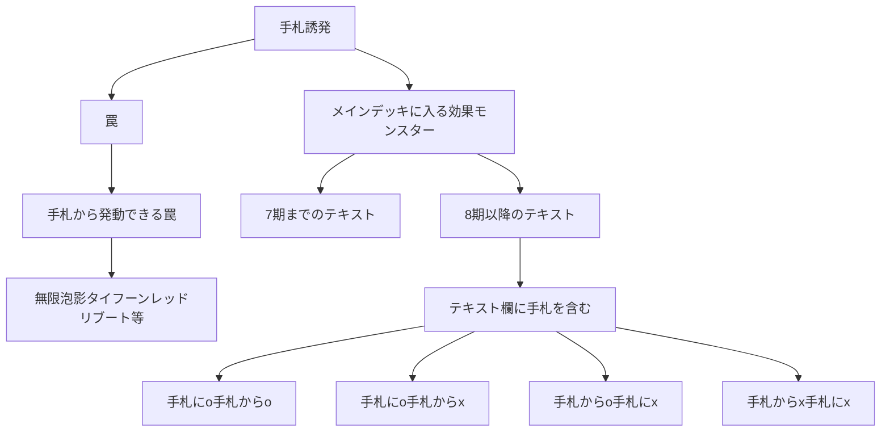

2024/06/30 17:00時点

## 手札から発動できる罠
遊戯王wikiを参照。

https://yugioh-wiki.net/index.php?%A1%D4%A5%C7%A5%EB%A5%BF%A1%A6%A5%AF%A5%ED%A5%A6%A1%DD%A5%A2%A5%F3%A5%C1%A1%A6%A5%EA%A5%D0%A1%BC%A5%B9%A1%D5#list

## 1期〜7期テキスト（①を含まない）
方法が見つからなかった。

遊戯王OCG検索ページで現在まで一度も再録されていないカードだけを表示するのは難しい...

遊戯王ニューロンでマイナス検索をしたいけどできない🥲

## 「手札に」も「手札から」も含む
404件ある。

https://ocg-card.com/list/result/?cate_0=効果モンスター&cate-op_0=3&cate_1=儀式モンスター&cate-op_1=3&text_0=①&text-p_0=1&text-op_0=1&text_1=手札&text-p_1=1&text-op_1=1&text_2=手札に&text-p_2=1&text-op_2=1&text_3=手札から&text-p_3=1&text-op_3=1&dup=1&sort=2&max=10

## 「手札に」を含むが「手札から」を含まない
732件ある。

https://ocg-card.com/list/result/?cate_0=効果モンスター&cate-op_0=3&cate_1=儀式モンスター&cate-op_1=3&text_0=①&text-p_0=1&text-op_0=1&text_1=手札&text-p_1=1&text-op_1=1&text_2=手札に&text-p_2=1&text-op_2=1&text_3=手札から&text-p_3=1&text-op_3=2&dup=1&sort=2&max=10

## 「手札から」を含むが「手札に」を含まない
900件ある。

https://ocg-card.com/list/result/?cate_0=効果モンスター&cate-op_0=3&cate_1=儀式モンスター&cate-op_1=3&text_0=①&text-p_0=1&text-op_0=1&text_1=手札&text-p_1=1&text-op_1=1&text_2=手札に&text-p_2=1&text-op_2=2&text_3=手札から&text-p_3=1&text-op_3=1&dup=1&sort=2&max=10

## 「手札から」も「手札に」も含まない
467件ある。

https://ocg-card.com/list/result/?cate_0=効果モンスター&cate-op_0=3&cate_1=儀式モンスター&cate-op_1=3&text_0=①&text-p_0=1&text-op_0=1&text_1=手札&text-p_1=1&text-op_1=1&text_2=手札に&text-p_2=1&text-op_2=2&text_3=手札から&text-p_3=1&text-op_3=2&dup=1&sort=2&max=10

## 備考
「遊戯王OCGカード検索ページ」の注意点。
メインデッキに入る効果モンスターを指定したいとき。
「効果モンスター どれか含む」＆「儀式モンスター どれか含む」にする必要がある。
「効果モンスター」の項目はエクシーズモンスター等を除外してくれるが、儀式モンスターも除外してしまうため。