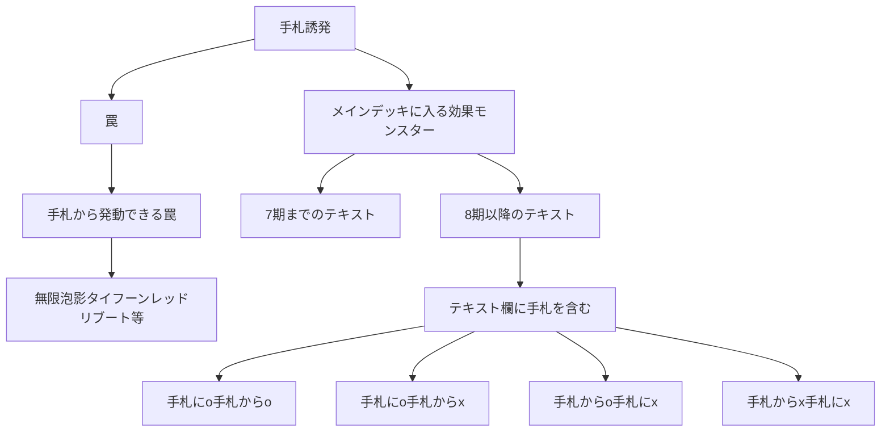

2024/07/15 23:00更新

## 概要

こんにちは。遊戯王プレイヤーのmira（@mirayugioh@mstdn.jp）です。

この記事では遊戯王の手札誘発をすべて網羅する試みについて取りあげています。

## 経緯

2024年7月、とあるツイートを拝見。

「ソピアのネクロスを大会で使ってみた」という趣旨のツイートでした。

「こんな面白いカードがあるのか！」と思ったのと同時に、

「こういう隠れた手札誘発が他にもあるのでは？」という疑問が。

「増殖するG」や「灰流うらら」は誰でも知っているカードですが、

「ティアマトン」や「ミラドーラ」、「エクストラヴェーラー」となると知らない人も一定数いる。

そういうカードを含めて完全網羅したものがほしいと思い立ちました。

## 調査方法

カードテキスト欄に「手札」とものを洗い出しました。

将来的には、手札誘発かどうかを一つずつ目視で判定していきたいです。

「手札」だけだと量が膨大なので、「手札に」と「手札から」に分割しました。イメージ図があるのでどうぞ。



調査にあたっては遊戯王wiki様、遊戯王カード検索様を参考にしました。

なお、2024/07/15 22:00時点の情報です。この日時以降に手札誘発が増えたら更新しないといけません。


## 「手札に」も「手札から」も含む
406件あります。

https://ocg-card.com/list/result/?cate_0=効果モンスター&cate-op_0=3&cate_1=儀式モンスター&cate-op_1=3&text_0=①&text-p_0=1&text-op_0=1&text_1=手札&text-p_1=1&text-op_1=1&text_2=手札に&text-p_2=1&text-op_2=1&text_3=手札から&text-p_3=1&text-op_3=1&dup=1&sort=2&max=10
 <details>  <summary>カード名リスト</summary>
 
```

赫の聖女カルテシア
白の聖女エクレシア
深淵の獣ルベリオン
深淵の獣マグナムート
スプライト・ジェット
スプライト・ブルー
スプリガンズ・キット
セリオンズ“リリー”ボレア
セリオンズ“リーパー”ファム
教導の神徒
教導の聖女エクレシア
青き眼の賢士
エクス・ライゼオル
ソード・ライゼオル
ユニオン・パイロット
六武衆の指南番
六武衆の破戒僧
悪魔獣デビルゾア
心宿りし青眼竜
浮上するビッグ・ジョーズ
瀑征竜－タイダル
Emダメージ・ジャグラー
アビス・シャーク
灰流うらら
黄金卿エルドリッチ
EM：Pグレニャード
Live☆Twin キスキル・フロスト
銀河戦士
サイバー・ダーク・キメラ
トリックスター・フーディ
銀河眼の時源竜
祈りの女王－コスモクイーン
魔を刻むデモンスミス
白き森のリゼット
オネスト
苗と霞の春化精
雷獣龍－サンダー・ドラゴン
雷電龍－サンダー・ドラゴン
雷源龍－サンダー・ドラゴン
サンダー・ドラゴン
魔弾の射手 カスパール
ハーピィ・クィーン
真紅眼の黒星竜
アブソルーター・ドラゴン
DDグリフォン
DDスワラル・スライム
フォトン・ジャンパー
TG ブースター・ラプトル
TG ワーウルフ
TG ストライカー
メルフィー・ラッシィ
メルフィー・ワラビィ
メルフィー・パピィ
メルフィー・キャシィ
斬機サーキュラー
幻影騎士団サイレントブーツ
彼岸の悪鬼 スカラマリオン
古代の機械素体
EMモンキーボード
希望皇アストラル・ホープ
ZS－昇華賢者
ZS－武装賢者
ジャンク・コンバーター
E-HERO アダスター・ゴールド
幻想の見習い魔導師
ランカの蟲惑魔
蒼穹の機界騎士
紫宵の機界騎士
時花の賢者－フルール・ド・サージュ
応戦するG
妖精伝姫－シンデレラ
幻惑の見習い魔術師
タロンズ・オブ・シュリーレン
光道の龍
竜騎兵ガーゴイルⅡ
蕾禍ノ鎧石竜
蕾禍ノ毬首
古代の機械巨人－アルティメット・パウンド
アストログラフ・マジシャン
未来の柱－キアノス
トイ・ソルジャー
精霊獣 ペトルフィン
インフェルノイド・ベルゼブル
A・ジェネクス・バードマン
氷結界の虎将 ウェイン
ゴブリン降下部隊
粛声の竜賢聖サウラヴィス
粛声の竜賢姫サフィラ
幻魔の召喚神
スピリット・オブ・ユベル
GP－キャプテン・キャリー
ゴーティスの陰影スノーピオス
迷宮に潜むシャドウ・グール
真炎王 ポニクス
ドロール＆ロックバード
焔征竜－ブラスター
炎王獣 バロン
悪魔の聲
天使の聲
古聖戴サウラヴィス
メメント・メイス
ポワソニエル・ド・ヌーベルズ
VS 蛟龍
覇王門の魔術師
未界域のネッシー
バスター・ビースト
風来王 ワイルド・ワインド
シンクローン・リゾネーター
ヴィジョン・リゾネーター
覇王眷竜オッドアイズ
地縛超神官
地縛囚人 ストーン・スィーパー
アルカナフォースXV－THE DEVIL
火霊媒師ヒータ
天極輝士－熊斗竜巧α
ヴェーダ＝カーランタ
コーンフィールド コアトル
バーニング・ドラゴン
VS 龍帝ヴァリウス
VS ヘヴィ・ボーガー
風霊媒師ウィン
幸魂
恐楽園の死配人 ＜Arlechino＞
星騎士 リュラ
超重僧兵ビッグベン－K
超重武者バイ－Q
ダーク・オネスト
ヴィジョン・リチュア
シャドウ・リチュア
空牙団の剣士 ビート
先史遺産クリスタル・スカル
魔轟神クシャノ
勇気の天使ヴィクトリカ
智の賢者－ヒンメル
武の賢者－アーカス
慈愛の賢者－シエラ
ドラゴンメイド・ルフト
ドラゴンメイド・フランメ
ドラゴンメイド・ティルル
ドラゴンメイド・フルス
ドラゴンメイド・エルデ
召喚師アレイスター
弾丸特急バレット・ライナー
リブロマンサー・ファイア
リブロマンサー・エージェント
リブロマンサー・Gボーイ
騎甲虫スティンギー・ランス
騎甲虫アサルト・ローラー
焔聖騎士－リナルド
R－ACEファイア・アタッカー
R－ACEエアホイスター
暗黒界の術師 スノウ
暗黒界の龍神 グラファ
暗黒界の門番 ゼンタ
暗黒界の魔神王 レイン
道化鳥ラフィンパフィン
テセア聖霊器
竜剣士マジェスティP
クシャトリラ・オーガ
クシャトリラ・ユニコーン
クシャトリラ・フェンリル
究極宝玉獣レインボー・ドラゴン
Gゴーレム・ペブルドッグ
Gゴーレム・ロックハンマー
らくがきじゅう－すてご
鉄球魔神ゴロゴーン
ファラオニック・アドベント
アマゾネスの斥候
古尖兵ケルベク
宿神像ケルドウ
D・リモコン
ガジェット・ゲーマー
D・スキャナン
深淵の暗殺者
アビス・ソルジャー
アトランティスの戦士
地霊媒師アウス
はぐれ・もけもけ
ジェムナイト・クォーツ
花と野原の春化精
丘と芽吹の春化精
E・HERO スピリット・オブ・ネオス
沼地の魔神王
白銀の城の狂時計
白銀の城の召使い アリアンナ
SRベイゴマックス
リバースポッド
バーバリアン０号
外法の騎士
音響戦士ギタリス
H・C モーニング・スター
スケアクロー・ライヒハート
EMジェントルード
パペット・キング
EMバロックリボー
海晶乙女パスカルス
デス・クラーケン
悪魔嬢アリス
S－Force レトロアクティヴ
オッドアイズ・ペンデュラムグラフ・ドラゴン
極星工イーヴァルディ
極星獣グリンブルスティ
マジクリボー
ジョーカーズ・ナイト
聖殿の水遣い
No－P.U.N.K.オーガ・ナンバー
天空の使者 ゼラディアス
大天使クリスティア
命の代行者 ネプチューン
パペット・クィーン
うにの軍貫
光波複葉機
ドラゴンロイド
クリバビロン
クリベー
クリブー
サイバー・ダーク・クロー
サイバー・ダーク・カノン
サイバー・ファロス
森の聖獣 カルピポニカ
ガスタ・ヴェズル
いくらの軍貫
ベアルクティ－ミクタナス
ベアルクティ－ミクポーラ
溟界の滓－ナイア
光の天穿バハルティヤ
ホーリーナイツ・シエル
海造賊－黒翼の水先人
武神－マヒトツ
紅蓮薔薇の魔女
ミレニアム・アイズ・イリュージョニスト
千年の血族
ホーリーナイツ・フラムエル
夢魔鏡の使徒－ネイロイ
セイクリッド・カドケウス
メタルフォーゼ・バニッシャー
魔轟神マルコシア
S－Force 乱破小夜丸
アームド・ドラゴン LV１０－ホワイト
アームド・ドラゴン・サンダー LV５
アームド・ドラゴン・サンダー LV７
泥岩の霊長－マンドストロング
バラガール
俊炎星－ゾウセイ
魔轟神グリムロ
嵐征竜－テンペスト
ドラグニティ－レムス
機巧牙－御神尊真神
U.A.リベロスパイカー
双天脚の鴻鵠
RR－ヒール・イーグル
花札衛－桜－
人造人間－サイコ・ジャッカー
ガーディアン・スライム
コアキメイル・サプライヤー
ネメシス・キーストーン
メルフィー・ポニィ
メルフィー・フェニィ
暗黒騎士ガイアソルジャー
混沌の召喚神
幻魔皇ラビエル－天界蹂躙拳
六花精ボタン
鬼ガエル
ネメシス・コリドー
ネメシス・アンブレラ
ネメシス・フラッグ
剛鬼アイアン・クロー
ローズ・プリンセス
捕食植物スパイダー・オーキッド
ダーク・シムルグ
破壊剣士の伴竜
ドシン＠イグニスター
ヒヤリ＠イグニスター
焔聖騎士－ローラン
クロノダイバー・リューズ
ワルキューレ・アルテスト
剛鬼ヘッドバット
チョバムアーマー・ドラゴン
太陽の神官
占い魔女 フウちゃん
天威龍－ヴィシュダ
天威龍－アーダラ
妖仙獣 飯綱鞭
神聖魔導王 エンディミオン
ウィッチクラフト・ピットレ
ウィッチクラフト・ポトリー
無限起動ドラグショベル
無限起動キャンサークレーン
アンクリボー
レモン・マジシャン・ガール
方界超帝インディオラ・デス・ボルト
方界帝ヴァルカン・ドラグニー
方界帝ゲイラ・ガイル
アップル・マジシャン・ガール
星遺物の守護竜メロダーク
颶風龍－ビュフォート・ノウェム
ユニコールの影霊衣
ブリューナクの影霊衣
メガリス・ハギト
メガリス・オフィエル
超量士ホワイトレイヤー
クロス・ポーター
真竜皇アグニマズドV
転生炎獣フォクシー
転生炎獣ミーア
転生炎獣ラクーン
堕天使アムドゥシアス
ハーピィ・オラクル
孤高除獣
守護竜ガルミデス
スピードローダー・ドラゴン
ロード・オブ・ドラゴン－ドラゴンの統制者－
ゴキポール
プロフィビット・スネーク
レイテンシ
魔界劇団－メロー・マドンナ
クリフォトン
怪鳥グライフ
星遺物－『星冠』
星辰のパラディオン
剛鬼ムーンサルト
SIMMタブラス
オッドアイズ・ファンタズマ・ドラゴン
影王デュークシェード
悪王アフリマ
空牙団の英雄 ラファール
空牙団の参謀 シール
エレメントセイバー・ナル
エレメントセイバー・マカニ
剛鬼マンジロック
バックアップ・オペレーター
剛鬼スープレックス
トリックスター・リリーベル
水精鱗－ディニクアビス
水精鱗－メガロアビス
デスペラード・リボルバー・ドラゴン
魔導獣 ガルーダ
超天新龍オッドアイズ・レボリューション・ドラゴン
ヘカテリス
SPYRAL－ダンディ
魔弾の射手 ドクトル
六武衆の師範
星遺物－『星鎧』
ジェスター・コンフィ
デューテリオン
時械巫女
DDD運命王ゼロ・ラプラス
真竜凰マリアムネ
EMスカイ・ピューピル
EMスカイ・マジシャン
星読みの魔術師
SRドミノバタフライ
月光黒羊
ファーニマル・オウル
ファーニマル・ドッグ
捕食植物セラセニアント
混沌の使者
霊魂鳥－忍鴉
サイバー・チュチュボン
EMダグ・ダガーマン
Kozmo－フェルブラン
Kozmo－ドロッセル
光波鏡騎士
マジック・ストライダー
トゥーン・ブラック・マジシャン
レッド・ミラー
DD魔導賢者ニコラ
EMギッタンバッタ
RR－ペイン・レイニアス
トランス・デーモン
DD魔導賢者ガリレイ
DDケルベロス
DD魔導賢者ニュートン
超量士レッドレイヤー
RR－ファジー・レイニアス
風帝家臣ガルーム
地帝家臣ランドローブ
冥帝エレボス
U.A.コリバルリバウンダー
U.A.ドレッドノートダンカー
U.A.ストロングブロッカー
U.A.フィールドゼネラル
U.A.カストディアン
U.A.ファンタジスタ
U.A.パーフェクトエース
U.A.マイティスラッガー
彼岸の悪鬼 ハックルスパー
音響戦士マイクス
イグナイト・スティンガー
イグナイト・アヴェンジャー
DDD覇龍王ペンドラゴン
オッドアイズ・セイバー・ドラゴン
妖仙獣 大幽谷響
ファーニマル・シープ
薔薇の聖騎士
サンダー・シーホース
インフェルニティ・デーモン
ラッシュ・ウォリアー
妖仙獣 辻斬風
霊魂鳥神－彦孔雀
妖仙獣 鎌参太刀
妖仙獣 鎌弐太刀
妖仙獣 鎌壱太刀
H・C 強襲のハルベルト
アーティファクト－チャクラム
クラウソラスの影霊衣

```

</details>

<details>  
 <summary>カード名・効果リスト</summary>

```

[
  {
    "name": "赫の聖女カルテシア",
    "text": "このカード名の①②③の効果はそれぞれ１ターンに１度しか使用できない。①：自分のフィールドまたは墓地に「アルバスの落胤」が存在する場合に発動できる。このカードを手札から特殊召喚する。②：お互いのメインフェイズに発動できる。自分の手札・フィールドから、レベル８以上の融合モンスターカードによって決められた融合素材モンスターを墓地へ送り、その融合モンスター１体をEXデッキから融合召喚する。③：このターンに融合モンスターが自分の墓地へ送られている場合、エンドフェイズに発動できる。墓地のこのカードを手札に加える。"
  },
  {
    "name": "白の聖女エクレシア",
    "text": "このカード名の、①の方法による特殊召喚は１ターンに１度しかできず、②③の効果はそれぞれ１ターンに１度しか使用できない。①：相手フィールドのモンスターの数が自分フィールドのモンスターより多い場合、このカードは手札から特殊召喚できる。②：自分・相手のメインフェイズに、このカードをリリースして発動できる。手札・デッキから「相剣」モンスターまたは「アルバスの落胤」１体を特殊召喚する。③：このターンに融合モンスターが自分の墓地へ送られている場合、エンドフェイズに発動できる。墓地のこのカードを手札に加える。"
  },
  {
    "name": "深淵の獣ルベリオン",
    "text": "このカードは通常召喚できない。「深淵の獣ルベリオン」は１ターンに１度、自分フィールドのレベル６以上のドラゴン族・闇属性モンスター１体をリリースした場合のみ手札・墓地から特殊召喚できる。このカード名の①②の効果はそれぞれ１ターンに１度しか使用できない。①：このカードを手札から墓地へ送って発動できる。デッキから「深淵の獣ルベリオン」以外の「ビーステッド」モンスター１体を手札に加える。②：自分メインフェイズに発動できる。デッキから「烙印」永続魔法・永続罠カード１枚を選んで自分フィールドに表側表示で置く。"
  },
  {
    "name": "深淵の獣マグナムート",
    "text": "このカード名の①②の効果はそれぞれ１ターンに１度しか使用できない。①：自分または相手の墓地の、光・闇属性モンスター１体を対象として発動できる。そのモンスターを除外し、このカードを手札から特殊召喚する。相手フィールドにモンスターが存在する場合、この効果は相手ターンでも発動できる。②：このカードが特殊召喚に成功した場合に発動できる。このターンのエンドフェイズに、自分のデッキ・墓地から「深淵の獣マグナムート」以外のドラゴン族モンスター１体を選んで手札に加える。"
  },
  {
    "name": "スプライト・ジェット",
    "text": "このカード名の、①の方法による特殊召喚は１ターンに１度しかできず、②の効果は１ターンに１度しか使用できない。①：自分フィールドにレベル２またはランク２のモンスターが存在する場合、このカードは手札から特殊召喚できる。②：このカードが特殊召喚に成功した場合に発動できる。デッキから「スプライト」魔法・罠カード１枚を手札に加える。"
  },
  {
    "name": "スプライト・ブルー",
    "text": "このカード名の、①の方法による特殊召喚は１ターンに１度しかできず、②の効果は１ターンに１度しか使用できない。①：自分フィールドにレベル２またはランク２のモンスターが存在する場合、このカードは手札から特殊召喚できる。②：このカードが特殊召喚に成功した場合に発動できる。デッキから「スプライト・ブルー」以外の「スプライト」モンスター１体を手札に加える。"
  },
  {
    "name": "スプリガンズ・キット",
    "text": "このカード名の①②の効果はそれぞれ１ターンに１度しか使用できない。①：自分のフィールド・墓地に「アルバスの落胤」を融合素材とする融合モンスターが存在する場合に発動できる。このカードを手札から特殊召喚する。②：このカードが召喚・特殊召喚に成功した場合に発動できる。自分のデッキ・墓地のカード及び除外されている自分のカードの中から、「烙印」魔法・罠カード１枚を選んで手札に加える。その後、手札を１枚選んでデッキの一番下に戻す。"
  },
  {
    "name": "セリオンズ“リリー”ボレア",
    "text": "このカード名の①②の効果はそれぞれ１ターンに１度しか使用できない。①：自分の墓地の、「セリオンズ」モンスターまたは植物族モンスター１体を対象として発動できる。このカードを手札から特殊召喚し、対象のモンスターを装備カード扱いとしてこのカードに装備する。②：自分の手札・フィールドからカード１枚を墓地へ送って発動できる。デッキから「セリオンズ」魔法・罠カード１枚を手札に加える。③：このカードを装備した「セリオンズ」モンスターは、攻撃力が７００アップし、このカード名の②の効果を得る。"
  },
  {
    "name": "セリオンズ“リーパー”ファム",
    "text": "このカード名の①②の効果はそれぞれ１ターンに１度しか使用できない。①：自分の墓地の、「セリオンズ」モンスターまたは水族モンスター１体を対象として発動できる。このカードを手札から特殊召喚し、対象のモンスターを装備カード扱いとしてこのカードに装備する。②：相手ターンに、自分の魔法＆罠ゾーンの「セリオンズ」カード１枚と相手フィールドのカード１枚を対象として発動できる。そのカードを持ち主の手札に戻す。③：このカードを装備した「セリオンズ」モンスターは、攻撃力が７００アップし、このカード名の②の効果を得る。"
  },
  {
    "name": "教導の神徒",
    "text": "このカード名の①②③の効果はそれぞれ１ターンに１度しか使用できない。①：融合・S・X・リンクモンスターが自分または相手の墓地へ送られた場合に発動できる。このカードを手札から特殊召喚する。②：このカードが手札からの特殊召喚に成功した場合、「教導の神徒」以外の自分の墓地の「ドラグマ」カード１枚を対象として発動できる。そのカードを手札に加える。③：相手モンスターの攻撃宣言時に発動できる。自分フィールドの全ての「ドラグマ」モンスターの攻撃力は５００アップする。"
  },
  {
    "name": "教導の聖女エクレシア",
    "text": "このカード名の①②の効果はそれぞれ１ターンに１度しか使用できない。①：EXデッキから特殊召喚されたモンスターがフィールドに存在する場合に発動できる。このカードを手札から特殊召喚する。②：このカードが召喚・特殊召喚に成功した場合に発動できる。デッキから「教導の聖女エクレシア」以外の「ドラグマ」カード１枚を手札に加える。この効果の発動後、ターン終了時まで自分はEXデッキからモンスターを特殊召喚できない。③：このカードはEXデッキから特殊召喚されたモンスターとの戦闘では破壊されない。"
  },
  {
    "name": "青き眼の賢士",
    "text": "このカード名の②の効果は１ターンに１度しか使用できない。①：このカードが召喚した時に発動できる。デッキから「青き眼の賢士」以外の光属性・レベル１チューナー１体を手札に加える。②：このカードを手札から捨て、自分フィールドの効果モンスター１体を対象として発動できる。そのモンスターを墓地へ送り、デッキから「ブルーアイズ」モンスター１体を特殊召喚する。"
  },
  {
    "name": "エクス・ライゼオル",
    "text": "このカード名の、①の方法による特殊召喚は１ターンに１度しかできず、②の効果は１ターンに１度しか使用できない。①：このカードはEXデッキのXモンスター１体を墓地へ送り、手札から特殊召喚できる。この方法で特殊召喚したターン、自分はランク４のXモンスターしかEXデッキから特殊召喚できない。②：このカードが召喚・特殊召喚した場合、レベル４・ランク４のモンスター以外の表側表示モンスターが自分フィールドに存在しなければ発動できる。デッキから雷族・炎属性モンスター１体を手札に加える。"
  },
  {
    "name": "ソード・ライゼオル",
    "text": "このカード名の、①の方法による特殊召喚は１ターンに１度しかできず、②の効果は１ターンに１度しか使用できない。①：自分のフィールドか墓地に「ライゼオル」モンスターが存在する場合、このカードは手札から特殊召喚できる。この方法で特殊召喚したターン、自分はランク４のXモンスターしかEXデッキから特殊召喚できない。②：このカードが召喚・特殊召喚した場合に発動できる。デッキから炎族・光属性モンスター１体を手札に加える。"
  },
  {
    "name": "ユニオン・パイロット",
    "text": "このカード名の②の効果は１ターンに１度しか使用できない。①：１ターンに１度、以下の効果を１つ発動できる。●自分フィールドの効果モンスター１体を対象とし、このカードを装備魔法カード扱いで装備する。装備モンスターが戦闘・効果で破壊される場合、代わりにこのカードを破壊する。●装備状態のこのカードを特殊召喚する。②：装備状態のこのカードを手札に戻して発動できる。自分のモンスター１体に、装備可能な除外状態のユニオンモンスター１体を、その効果による装備魔法カード扱いで装備し、このカードを自分の手札から特殊召喚する。"
  },
  {
    "name": "六武衆の指南番",
    "text": "このカード名の、①の方法による特殊召喚は１ターンに１度しかできず、②③の効果はそれぞれ１ターンに１度しか使用できない。①：自分フィールドに「六武衆の指南番」以外の「六部衆」モンスターが存在する場合、このカードは手札から特殊召喚できる。②：このカードがフィールドから墓地へ送られた場合に発動できる。自分のデッキ・墓地から「六武衆」カード１枚を手札に加える。③：このカードを素材としてS召喚した「六武衆」モンスターは以下の効果を得る。●相手フィールドのモンスターの攻撃力は５００ダウンする。"
  },
  {
    "name": "六武衆の破戒僧",
    "text": "このカード名の、①の方法による特殊召喚は１ターンに１度しかできず、②③の効果はそれぞれ１ターンに１度しか使用できない。①：自分フィールドに「六武衆の破戒僧」以外の「六部衆」モンスターが存在する場合、このカードは手札から特殊召喚できる。②：このカードがフィールドから墓地へ送られた場合に発動できる。デッキから「六武衆」速攻魔法カード１枚を手札に加える。③：このカードを素材としてS召喚した「六武衆」モンスターは以下の効果を得る。●相手フィールドのモンスターのレベルは１つ下がる。"
  },
  {
    "name": "悪魔獣デビルゾア",
    "text": "このカード名の②③の効果はそれぞれ１ターンに１度しか使用できない。①：相手フィールドにモンスターが存在する場合、このカードはリリースなしで召喚できる。②：このカードが手札に存在する場合に発動できる。このカードを守備表示で特殊召喚する。自分の墓地に「メタル化・強化反射装甲」が存在しない場合、さらに相手が自身の手札からモンスター１体を特殊召喚できる。③：自分メインフェイズに発動できる。デッキから「メタル化」罠カード１枚を自分フィールドにセットする。"
  },
  {
    "name": "心宿りし青眼竜",
    "text": "このカード名はルール上「ミレニアム」カードとしても扱う。このカード名の、①の効果は１ターンに１度しか使用できず、③の効果は自分が「千年の十字」を発動したデュエル中に１度だけ使用できる。①：このカードを手札から捨てて発動できる。デッキから「千年の十字」１枚を手札に加える。②：このカードのコントロールは変更できない。③：このカードが墓地に存在する状態で、相手がレベル８以上か攻撃力３０００以上のモンスターを召喚・特殊召喚した場合に発動できる。そのモンスターを墓地へ送り、このカードを特殊召喚する。"
  },
  {
    "name": "浮上するビッグ・ジョーズ",
    "text": "このカード名の①②の効果はそれぞれ１ターンに１度しか使用できない。①：魔法カードが発動したターンの自分メインフェイズに発動できる。このカードを手札から特殊召喚する。この効果の発動後、ターン終了時まで自分はXモンスターしかEXデッキから特殊召喚できない。②：このカードが召喚・特殊召喚した場合に発動できる。デッキから魚族の「シャーク」モンスター１体を手札に加える。③：このカードを水属性モンスターのX召喚に使用する場合、このカードのレベルを３か５として扱う事ができる。"
  },
  {
    "name": "瀑征竜－タイダル",
    "text": "このカード名の①〜④の効果は１ターンに１度、いずれか１つしか使用できない。①：手札からこのカードと水属性モンスター１体を墓地へ捨てて発動できる。デッキからモンスター１体を墓地へ送る。②：ドラゴン族か水属性のモンスターを自分の手札・墓地から２体除外して発動できる。このカードを手札・墓地から特殊召喚する。③：このカードが特殊召喚されている場合、相手エンドフェイズに発動する。このカードを手札に戻す。④：このカードが除外された場合に発動できる。デッキからドラゴン族・水属性モンスター１体を手札に加える。"
  },
  {
    "name": "Emダメージ・ジャグラー",
    "text": "このカード名の③の効果は１ターンに１度しか使用できない。①：自分にダメージを与える魔法・罠・モンスターの効果が発動した時、このカードを手札から捨てて発動できる。その発動を無効にし破壊する。②：自分・相手のバトルフェイズに、このカードを手札から捨てて発動できる。このターン、自分が受ける戦闘ダメージは１度だけ０になる。③：墓地のこのカードを除外して発動できる。デッキから「Emダメージ・ジャグラー」以外の「Em」モンスター１体を手札に加える。"
  },
  {
    "name": "アビス・シャーク",
    "text": "このカード名の①の効果は１ターンに１度しか使用できない。①：自分フィールドのモンスターが水属性モンスターのみの場合に発動できる。このカードを手札から特殊召喚し、デッキから「アビス・シャーク」以外のレベル３～５の魚族モンスター１体を手札に加える。このターン、自分は水属性モンスターしか特殊召喚できず、自分の「No.」モンスターがモンスターとの戦闘で相手に与える戦闘ダメージは１度だけ倍になる。②：このカードを「No.」モンスターのX召喚に使用する場合、このカードのレベルを３か４として扱う事ができる。"
  },
  {
    "name": "灰流うらら",
    "text": "このカード名の効果は１ターンに１度しか使用できない。①：以下のいずれかの効果を含む魔法・罠・モンスターの効果が発動した時、このカードを手札から捨てて発動できる。その効果を無効にする。●デッキからカードを手札に加える効果●デッキからモンスターを特殊召喚する効果●デッキからカードを墓地へ送る効果"
  },
  {
    "name": "黄金卿エルドリッチ",
    "text": "このカード名の①②の効果はそれぞれ１ターンに１度しか使用できない。①：手札からこのカードと魔法・罠カード１枚を墓地へ送り、フィールドのカード１枚を対象として発動できる。そのカードを墓地へ送る。②：このカードが墓地に存在する場合、自分フィールドの魔法・罠カード１枚を墓地へ送って発動できる。このカードを手札に加える。その後、手札からアンデット族モンスター１体を特殊召喚できる。この効果で特殊召喚したモンスターは相手ターン終了時まで、攻撃力・守備力が１０００アップし、効果では破壊されない。"
  },
  {
    "name": "EM：Pグレニャード",
    "text": "このカード名の、①の方法による特殊召喚は１ターンに１度しかできず、②の効果は１ターンに１度しか使用できない。①：フィールドまたは自分か相手の墓地にLモンスターが存在する場合、このカードは手札から特殊召喚できる。②：このカードが手札・墓地に存在し、自分フィールドのリンク２モンスターが、墓地へ送られた場合または表側で除外された場合、このカードを除外し、相手フィールドのカード１枚を対象として発動できる。そのカードを手札に戻す。"
  },
  {
    "name": "Live☆Twin キスキル・フロスト",
    "text": "このカード名の、①の方法による特殊召喚は１ターンに１度しかできず、②の効果は１ターンに１度しか使用できない。①：自分フィールドに「リィラ」モンスターが存在する場合、このカードは手札から特殊召喚できる。②：相手がカードの効果でデッキからカードを手札に加えた場合、自分フィールドに「イビルツイン」モンスターが存在していれば、墓地のこのカードを除外して発動できる。自分は１枚ドローする。"
  },
  {
    "name": "銀河戦士",
    "text": "このカード名の②の効果は１ターンに１度しか使用できない。①：手札から他の光属性モンスター１体を墓地へ送って発動できる。このカードを手札から守備表示で特殊召喚する。②：このカードが特殊召喚した時に発動できる。デッキから「ギャラクシー」モンスター１体を手札に加える。"
  },
  {
    "name": "サイバー・ダーク・キメラ",
    "text": "このカード名の①②の効果はそれぞれ１ターンに１度しか使用できない。①：手札から魔法・罠カード１枚を捨てて発動できる。デッキから「パワー・ボンド」１枚を手札に加える。このターン、自分はドラゴン族・機械族の「サイバー」モンスターしか融合素材にできず、自分がモンスターを融合召喚する場合に１度だけ、自分の墓地のモンスターを除外して融合素材とする事もできる。②：このカードが墓地へ送られた場合に発動できる。同名カードが自分の墓地に存在しない「サイバー・ダーク」モンスター１体をデッキから墓地へ送る。"
  },
  {
    "name": "トリックスター・フーディ",
    "text": "このカード名の①②の効果はそれぞれ１ターンに１度しか使用できない。①：自分フィールドに「トリックスター」融合・Lモンスターのいずれかが存在する場合に発動できる。このカードを手札から特殊召喚する。②：このカードが「トリックスター」LモンスターのL素材として墓地へ送られた場合に発動できる。デッキから「トリックスター・フュージョン」か「トリックスター・ディフュージョン」１枚を手札に加える。"
  },
  {
    "name": "銀河眼の時源竜",
    "text": "このカード名の①②の効果はそれぞれ１ターンに１度しか使用できない。①：自分・相手ターンに、フィールドにドラゴン族Xモンスターが存在する場合に発動できる。このカードを手札から自分か相手のフィールドに特殊召喚する。②：このカードが召喚・特殊召喚した場合に発動する。このカードの元々の持ち主は、自身のデッキから「タキオン」魔法・罠カード１枚を手札に加える。③：自分か相手のドラゴン族Xモンスターの攻撃宣言時に発動する。フィールドのこのカードをそのモンスターのX素材とする。"
  },
  {
    "name": "祈りの女王－コスモクイーン",
    "text": "このカード名の①②の効果はそれぞれ１ターンに１度しか使用できない。①：フィールド魔法カードが発動した場合に発動できる。このカードを手札から守備表示で特殊召喚する。②：フィールドゾーンの表側表示カード１枚を対象とし、そのコントローラーによって以下の効果を発動できる。●自分：対象のカードを破壊し、破壊したカードとはカード名が異なるフィールド魔法カード１枚をデッキから手札に加える。●相手：対象のカードの効果をターン終了時まで無効にし、デッキからフィールド魔法カード１枚を手札に加える。"
  },
  {
    "name": "魔を刻むデモンスミス",
    "text": "このカード名の①②③の効果はそれぞれ１ターンに１度しか使用できない。①：このカードを手札から捨てて発動できる。デッキから「デモンスミス」魔法・罠カード１枚を手札に加える。②：自分フィールドの「デモンスミス」装備カード１枚とフィールドのモンスター１体を対象として発動できる。そのカードを墓地へ送る。③：このカードが墓地に存在する場合、自分の墓地から他の悪魔族・光属性モンスター１体をデッキ・EXデッキに戻して発動できる。このカードを特殊召喚する。"
  },
  {
    "name": "白き森のリゼット",
    "text": "このカード名の①②の効果はそれぞれ１ターンに１度しか使用できない。①：自分の手札・フィールドから魔法・罠カード１枚を墓地へ送って発動できる。このカードを手札から特殊召喚する。その後、デッキから「白き森のリゼット」以外の「白き森」モンスター１体を手札に加える。②：このカードが墓地に存在する状態で、相手ターンに自分フィールドに魔法使い族・光属性チューナーが特殊召喚された場合に発動できる。このカードを手札に加える。"
  },
  {
    "name": "オネスト",
    "text": "①：自分メインフェイズに発動できる。フィールドの表側表示のこのカードを手札に戻す。②：自分の光属性モンスターが戦闘を行うダメージステップ開始時からダメージ計算前までに、このカードを手札から墓地へ送って発動できる。そのモンスターの攻撃力はターン終了時まで、戦闘を行う相手モンスターの攻撃力分アップする。"
  },
  {
    "name": "苗と霞の春化精",
    "text": "このカード名の①の効果は１ターンに１度しか使用できない。①：このカードと、モンスター１体か「春化精」カード１枚を手札から捨てて発動できる。デッキから「苗と霞の春化精」以外の天使族・地属性モンスター１体を手札に加える。その後、自分の墓地から地属性モンスター１体を特殊召喚できる。このターン、自分は地属性以外のモンスターの効果を発動できない。②：このカードがモンスターゾーンに存在する限り、「春化精」モンスター以外のフィールドのモンスターの攻撃力は６００ダウンする。"
  },
  {
    "name": "雷獣龍－サンダー・ドラゴン",
    "text": "このカード名の①②の効果は１ターンに１度、いずれか１つしか使用できない。①：このカードを手札から捨てて発動できる。「雷獣龍－サンダー・ドラゴン」以外の自分の墓地・除外状態の「サンダー・ドラゴン」カード１枚を手札に加える。②：このカードが除外された場合、またはフィールドから墓地へ送られた場合に発動できる。デッキから「サンダー・ドラゴン」モンスター１体を守備表示で特殊召喚する。この効果で特殊召喚したモンスターはエンドフェイズに手札に戻る。"
  },
  {
    "name": "雷電龍－サンダー・ドラゴン",
    "text": "このカード名の①②の効果は１ターンに１度、いずれか１つしか使用できない。①：自分・相手ターンに、このカードを手札から捨てて発動できる。デッキから「雷電龍－サンダー・ドラゴン」１体を手札に加える。②：このカードが除外された場合、またはフィールドから墓地へ送られた場合に発動できる。デッキから「雷電龍－サンダー・ドラゴン」以外の「サンダー・ドラゴン」カード１枚を手札に加える。"
  },
  {
    "name": "雷源龍－サンダー・ドラゴン",
    "text": "このカード名の①②の効果は１ターンに１度、いずれか１つしか使用できない。①：自分・相手ターンに、このカードを手札から捨て、自分フィールドの雷族モンスター１体を対象として発動できる。そのモンスターの攻撃力は５００アップする。②：このカードが除外された場合、またはフィールドから墓地へ送られた場合に発動できる。デッキから「雷源龍－サンダー・ドラゴン」１体を手札に加える。"
  },
  {
    "name": "サンダー・ドラゴン",
    "text": "①：このカードを手札から捨てて発動できる。デッキから「サンダー・ドラゴン」を２体まで手札に加える。"
  },
  {
    "name": "魔弾の射手 カスパール",
    "text": "このカード名の②の効果は１ターンに１度しか使用できない。①：このカードがモンスターゾーンに存在する限り、自分・相手ターンに自分は「魔弾」魔法・罠カードを手札から発動できる。②：このカードと同じ縦列で魔法・罠カードが発動した場合に発動できる。その発動したカードとはカード名が異なる「魔弾」カード１枚をデッキから手札に加える。"
  },
  {
    "name": "ハーピィ・クィーン",
    "text": "①：このカードのカード名は、フィールド・墓地に存在する限り「ハーピィ・レディ」として扱う。②：このカードを手札から墓地へ捨てて発動できる。デッキから「ハーピィの狩場」１枚を手札に加える。"
  },
  {
    "name": "真紅眼の黒星竜",
    "text": "このカード名の①②の効果はそれぞれ１ターンに１度しか使用できない。①：手札・デッキからレベル５以上の通常モンスター１体を墓地へ送って発動できる。このカードを手札から特殊召喚する。その後、このカードのレベルを１つ上げる。②：このターンに墓地へ送られていないこのカードを墓地から除外して発動できる。自分のデッキ・墓地から「真紅眼融合」１枚を手札に加える。"
  },
  {
    "name": "アブソルーター・ドラゴン",
    "text": "このカード名の、①の方法による特殊召喚は１ターンに１度しかできず、②の効果は１ターンに１度しか使用できない。①：自分フィールドに「ヴァレット」モンスターが存在する場合、このカードは手札から特殊召喚できる。②：このカードが墓地へ送られた場合に発動できる。デッキから「ヴァレット」モンスター１体を手札に加える。"
  },
  {
    "name": "DDグリフォン",
    "text": "このカード名の①②③のモンスター効果はそれぞれ１ターンに１度しか使用できない。①：自分フィールドに「DD」モンスターが存在する場合に発動できる。このカードを手札から守備表示で特殊召喚する。②：このカードがP召喚した場合、手札から「DD」カードか「契約書」カード１枚を捨てて発動できる。自分は１枚ドローする。③：このカードが墓地から特殊召喚した場合に発動できる。デッキから「DDグリフォン」以外の「DD」カード１枚を手札に加える。"
  },
  {
    "name": "DDスワラル・スライム",
    "text": "このカード名の①②の効果はそれぞれ１ターンに１度しか使用できない。①：このカードが手札に存在する場合に発動できる。このカードを含む手札のモンスターを融合素材とし、「DDD」融合モンスター１体を融合召喚する。②：墓地のこのカードを除外して発動できる。手札から「DD」モンスター１体を特殊召喚する。"
  },
  {
    "name": "フォトン・ジャンパー",
    "text": "このカード名の①②の効果はそれぞれ１ターンに１度しか使用できない。①：相手モンスターの攻撃宣言時に発動できる。このカードを手札から特殊召喚する。その後、バトルフェイズを終了する。この効果を発動した場合、次の自分バトルフェイズをスキップする。②：このカードが墓地へ送られた場合に発動できる。デッキから「フォトン」魔法・罠カードか「ギャラクシー」魔法・罠カード１枚を手札に加える。"
  },
  {
    "name": "TG ブースター・ラプトル",
    "text": "このカード名の①の方法による特殊召喚は１ターンに１度しかできない。①：自分フィールドに「TG」モンスターが存在する場合、このカードは手札から特殊召喚できる。②：フィールドのこのカードが破壊され墓地へ送られたターンのエンドフェイズに発動できる。デッキから「TG ブースター・ラプトル」以外の「TG」モンスター１体を手札に加える。"
  },
  {
    "name": "TG ワーウルフ",
    "text": "①：レベル４以下のモンスターが特殊召喚された時に発動できる。このカードを手札から特殊召喚する。②：フィールドのこのカードが破壊され墓地へ送られたターンのエンドフェイズに発動できる。デッキから「TG ワーウルフ」以外の「TG」モンスター１体を手札に加える。"
  },
  {
    "name": "TG ストライカー",
    "text": "①：相手フィールドにのみモンスターが存在する場合、このカードは手札から特殊召喚できる。②：フィールドのこのカードが破壊され墓地へ送られたターンのエンドフェイズに発動できる。デッキから「TG ストライカー」以外の「TG」モンスター１体を手札に加える。"
  },
  {
    "name": "メルフィー・ラッシィ",
    "text": "このカード名の①②の効果はそれぞれ１ターンに１度しか使用できない。①：「メルフィー・ラッシィ」以外の自分フィールドの表側表示の獣族モンスターが手札に戻った自分・相手ターンに発動できる。このカードを手札から特殊召喚する。その後、このカードと手札の「メルフィー」モンスターのみを素材としてS召喚を行う事ができる。②：自分エンドフェイズにこのカードが墓地に存在する場合、自分フィールドの獣族Xモンスター１体を対象として発動できる。このカードをそのモンスターのX素材とする。"
  },
  {
    "name": "メルフィー・ワラビィ",
    "text": "このカード名の①②の効果はそれぞれ１ターンに１度しか使用できない。①：相手がモンスターを召喚・特殊召喚した場合、またはこのカードが相手モンスターの攻撃対象に選択された場合に発動できる。このカードを手札に戻す。その後、デッキから「メルフィー・ワラビィ」以外の「メルフィー」モンスター２体を特殊召喚できる（同名カードは１枚まで）。②：自分エンドフェイズに発動できる。このカードを手札から特殊召喚する。"
  },
  {
    "name": "メルフィー・パピィ",
    "text": "このカード名の①②の効果はそれぞれ１ターンに１度しか使用できない。①：相手がモンスターを召喚・特殊召喚した場合、またはこのカードが相手モンスターの攻撃対象に選択された場合に発動できる。このカードを手札に戻す。その後、「メルフィー・パピィ」を除く、レベル２以下の獣族モンスター１体をデッキから特殊召喚できる。②：自分エンドフェイズに発動できる。このカードを手札から特殊召喚する。"
  },
  {
    "name": "メルフィー・キャシィ",
    "text": "このカード名の①②の効果はそれぞれ１ターンに１度しか使用できない。①：相手がモンスターを召喚・特殊召喚した場合、またはこのカードが相手モンスターの攻撃対象に選択された場合に発動できる。このカードを手札に戻す。その後、デッキから「メルフィー・キャシィ」以外の獣族モンスター１体を手札に加える事ができる。②：自分エンドフェイズに発動できる。このカードを手札から特殊召喚する。"
  },
  {
    "name": "斬機サーキュラー",
    "text": "このカード名の①②の効果はそれぞれ１ターンに１度しか使用できない。①：デッキから「斬機サーキュラー」以外の「斬機」モンスター１体を墓地へ送って発動できる。このカードを手札から特殊召喚する。この効果の発動後、ターン終了時まで自分はモンスター１体でしか攻撃できない。②：このカードがモンスターゾーンに存在する状態で、自分フィールドに「斬機」モンスターが召喚・特殊召喚された場合に発動できる。デッキから「斬機」魔法・罠カード１枚を手札に加える。"
  },
  {
    "name": "幻影騎士団サイレントブーツ",
    "text": "このカード名の、①の方法による特殊召喚は１ターンに１度しかできず、②の効果は１ターンに１度しか使用できない。①：自分フィールドに「幻影騎士団」モンスターが存在する場合、このカードは手札から特殊召喚できる。②：墓地のこのカードを除外して発動できる。デッキから「ファントム」魔法・罠カード１枚を手札に加える。"
  },
  {
    "name": "彼岸の悪鬼 スカラマリオン",
    "text": "このカード名の①③の効果は１ターンに１度、いずれか１つしか使用できない。①：自分フィールドに魔法・罠カードが存在しない場合に発動できる。このカードを手札から特殊召喚する。②：自分フィールドに「彼岸」モンスター以外のモンスターが存在する場合にこのカードは破壊される。③：このカードが墓地へ送られたターンのエンドフェイズに発動できる。デッキから「彼岸の悪鬼 スカラマリオン」以外の悪魔族・闇属性・レベル３モンスター１体を手札に加える。"
  },
  {
    "name": "古代の機械素体",
    "text": "このカード名の①の効果は１ターンに１度しか使用できない。①：手札を１枚捨てて発動できる。「古代の機械巨人」１体またはそのカード名が記された魔法・罠カード１枚をデッキから手札に加える。②：このカードが攻撃する場合、相手はダメージステップ終了時まで魔法・罠カードを発動できない。③：表側表示のこのカードが相手の効果でフィールドから離れた場合に発動できる。手札から「古代の機械巨人」「古代の機械巨人－アルティメット・パウンド」を合計３体まで召喚条件を無視して特殊召喚する。"
  },
  {
    "name": "EMモンキーボード",
    "text": "①：このカードを手札から捨てて発動できる。手札の「EM」モンスターか「オッドアイズ」モンスター１体を相手に見せる。このターン、そのモンスター及び自分の手札の同名モンスターのレベルを１つ下げる。"
  },
  {
    "name": "希望皇アストラル・ホープ",
    "text": "このカード名の①②の効果はそれぞれ１ターンに１度しか使用できない。①：フィールドにXモンスターが存在する場合に発動できる。このカードを手札から特殊召喚する。②：自分の手札・フィールドからこのカード以外のカード１枚を墓地へ送って発動できる。デッキから以下のカードの内いずれか１枚を手札に加える。●「エクシーズ」魔法・罠カード●「オノマト」魔法・罠カード●「ゼアル」魔法・罠カード●「ナンバーズ」魔法・罠カード"
  },
  {
    "name": "ZS－昇華賢者",
    "text": "このカード名の②の効果は１ターンに１度しか使用できない。①：自分フィールドにカードが存在しない場合、このカードは手札から特殊召喚できる。②：フィールドのこのカードを素材としてX召喚した「希望皇ホープ」モンスターは以下の効果を得る。●このカードがX召喚した場合に発動できる。デッキから「RUM」通常魔法カード１枚を手札に加える。"
  },
  {
    "name": "ZS－武装賢者",
    "text": "このカード名の②の効果は１ターンに１度しか使用できない。①：自分フィールドのモンスターが「ZS－武装賢者」以外のレベル４モンスター１体のみの場合、このカードは手札から特殊召喚できる。②：フィールドのこのカードを素材としてX召喚した「希望皇ホープ」モンスターは以下の効果を得る。●このカードがX召喚した場合に発動できる。デッキから「ZW」モンスター１体を手札に加える。"
  },
  {
    "name": "ジャンク・コンバーター",
    "text": "このカード名の①②の効果はそれぞれ１ターンに１度しか使用できない。①：手札からこのカードとチューナー１体を捨てて発動できる。デッキから「シンクロン」モンスター１体を手札に加える。②：このカードがS素材として墓地へ送られた場合、自分の墓地のチューナー１体を対象として発動できる。そのモンスターを守備表示で特殊召喚する。このターン、この効果で特殊召喚したモンスターの効果は発動できない。"
  },
  {
    "name": "E-HERO アダスター・ゴールド",
    "text": "このカード名の①の効果は１ターンに１度しか使用できない。①：このカードを手札から捨てて発動できる。「E-HERO アダスター・ゴールド」を除く、「ダーク・フュージョン」またはそのカード名が記されたカード１枚をデッキから手札に加える。②：自分フィールドに融合モンスターが存在しない場合、このカードは攻撃できない。"
  },
  {
    "name": "幻想の見習い魔導師",
    "text": "①：このカードは手札を１枚捨てて、手札から特殊召喚できる。②：このカードが召喚・特殊召喚した場合に発動できる。デッキから「ブラック・マジシャン」１体を手札に加える。③：他の自分の魔法使い族・闇属性モンスターが相手モンスターと戦闘を行うダメージ計算時に、手札・フィールドのこのカードを墓地へ送って発動できる。その自分のモンスターの攻撃力・守備力はそのダメージ計算時のみ２０００アップする。"
  },
  {
    "name": "ランカの蟲惑魔",
    "text": "①：このカードが召喚した時に発動できる。デッキから「蟲惑魔」モンスター１体を手札に加える。②：このカードはモンスターゾーンに存在する限り、「ホール」通常罠カード及び「落とし穴」通常罠カードの効果を受けない。③：自分・相手ターンに１度、自分フィールドの裏側表示の魔法・罠カード１枚を対象として発動できる。その裏側表示カードを手札に戻す。その後、手札から魔法・罠カード１枚をセットできる。"
  },
  {
    "name": "蒼穹の機界騎士",
    "text": "このカード名の、①の方法による特殊召喚は１ターンに１度しかできず、②の効果は１ターンに１度しか使用できない。①：同じ縦列にカードが２枚以上存在する場合、このカードはその縦列の自分フィールドに手札から特殊召喚できる。②：このカードが手札から召喚・特殊召喚した場合に発動できる。このカードと同じ縦列の相手のカードの数だけ、デッキから「蒼穹の機界騎士」以外の「ジャックナイツ」モンスターを手札に加える（同名カードは１枚まで）。"
  },
  {
    "name": "紫宵の機界騎士",
    "text": "このカード名の、①の方法による特殊召喚は１ターンに１度しかできず、②の効果は１ターンに１度しか使用できない。①：同じ縦列にカードが２枚以上存在する場合、このカードはその縦列の自分フィールドに手札から特殊召喚できる。②：自分・相手ターンに、自分フィールドの「ジャックナイツ」モンスター１体を対象として発動できる。そのモンスターを次の自分ターンのスタンバイフェイズまで除外し、デッキから「紫宵の機界騎士」以外の「ジャックナイツ」モンスター１体を手札に加える。"
  },
  {
    "name": "時花の賢者－フルール・ド・サージュ",
    "text": "このカード名の①②の効果はそれぞれ１ターンに１度しか使用できない。①：自分フィールドのモンスターを含むフィールドのカード２枚を対象として発動できる。このカードを手札から特殊召喚し、対象のカードを破壊する。②：このカードがフィールドから墓地へ送られた場合、自分の墓地の他のモンスター１体を対象として発動できる。そのモンスターをデッキに戻す。その後、自分のデッキ・墓地から植物族・レベル１モンスター１体を手札に加える。"
  },
  {
    "name": "応戦するG",
    "text": "①：モンスターを特殊召喚する効果を含む魔法カードを相手が発動した時に発動できる。このカードを手札から特殊召喚する。②：このカードの①の効果で特殊召喚したこのカードがモンスターゾーンに存在する限り、墓地へ送られるカードは墓地へは行かず除外される。③：このカードがフィールドから墓地へ送られた場合に発動できる。「応戦するG」を除く、攻撃力１５００以下の昆虫族・地属性モンスター１体をデッキから手札に加える。"
  },
  {
    "name": "妖精伝姫－シンデレラ",
    "text": "①：このカードがモンスターゾーンに存在する限り、お互いにフィールドの他のモンスターを魔法カードの効果の対象にできない。②：１ターンに１度、手札から魔法カード１枚を捨てて発動できる。自分の手札・デッキ・墓地から装備魔法カード１枚をこのカードに装備する。その装備魔法カードはエンドフェイズに手札に戻る。"
  },
  {
    "name": "幻惑の見習い魔術師",
    "text": "このカード名の、①の方法による特殊召喚は１ターンに１度しかできず、②の効果は１ターンに１度しか使用できない。①：このカードは手札を１枚捨てて、手札から特殊召喚できる。②：このカードが召喚・特殊召喚した場合に発動できる。「幻惑の見習い魔術師」以外の幻想魔族モンスター１体をデッキから手札に加える。③：このカードがモンスターと戦闘を行う場合、その２体はその戦闘では破壊されない。"
  },
  {
    "name": "タロンズ・オブ・シュリーレン",
    "text": "このカード名の①③の効果はそれぞれ１ターンに１度しか使用できない。①：相手ターンに、「タロンズ・オブ・シュリーレン」以外の自分フィールドの悪魔族・幻想魔族モンスター１体を対象として発動できる。そのモンスターを手札に戻し、このカードを手札から特殊召喚する。②：このカードがモンスターと戦闘を行う場合、その２体はその戦闘では破壊されない。③：自分のカードを対象とする効果を相手が発動した時、相手フィールドのモンスター１体を対象として発動できる。フィールドのこのカードを手札に戻し、そのモンスターを破壊する。"
  },
  {
    "name": "光道の龍",
    "text": "このカード名の①②③の効果はそれぞれ１ターンに１度しか使用できない。①：自分の墓地に「ライトロード」モンスターが存在する場合に発動できる。このカードを手札から特殊召喚する。②：このカードが特殊召喚した場合に発動できる。デッキから「光道の龍」以外の「ライトロード」カード１枚を墓地へ送る。③：このカードが墓地へ送られた場合に発動できる。デッキから攻撃力３０００／守備力２６００のドラゴン族モンスター１体を手札に加える。"
  },
  {
    "name": "竜騎兵ガーゴイルⅡ",
    "text": "このカード名の①②③の効果はそれぞれ１ターンに１度しか使用できない。①：自分フィールドの表側表示の「センチュリオン」カード１枚を墓地へ送って発動できる。このカードを手札から特殊召喚する。このターン、自分は「竜騎兵ガーゴイルⅡ」を特殊召喚できない。②：このカードがS素材として墓地へ送られた場合に発動できる。このカードを手札に加える。③：このカードが永続罠カード扱いの場合、自分・相手のメインフェイズに発動できる。このカードを特殊召喚する。その後、このカードのレベルを４つ下げる事ができる。"
  },
  {
    "name": "蕾禍ノ鎧石竜",
    "text": "このカード名の、①の方法による特殊召喚は１ターンに１度しかできず、②の効果は１ターンに１度しか使用できない。①：このカードは自分の墓地の昆虫族・植物族・爬虫類族モンスター１体を除外し、手札から特殊召喚できる。②：手札から昆虫族・植物族・爬虫類族モンスター１体を捨て、昆虫族・植物族・爬虫類族モンスター以外の相手フィールドの表側表示モンスター１体を対象として発動できる。そのモンスターを手札に戻す。"
  },
  {
    "name": "蕾禍ノ毬首",
    "text": "このカード名の、①の方法による特殊召喚は１ターンに１度しかできず、②の効果は１ターンに１度しか使用できない。①：このカードは手札の昆虫族・植物族・爬虫類族モンスター１体を墓地へ送り、手札から特殊召喚できる。②：このカードが召喚・特殊召喚した場合に発動できる。「蕾禍ノ毬首」以外の自分のデッキ・除外状態の「蕾禍」カードを２枚まで手札に加える（同名カードは１枚まで）。その後、自分の手札を１枚選んで除外する。このターン、自分は昆虫族・植物族・爬虫類族モンスターしか特殊召喚できない。"
  },
  {
    "name": "古代の機械巨人－アルティメット・パウンド",
    "text": "このカードは特殊召喚できない。①：このカードが守備表示モンスターを攻撃した場合、その守備力を攻撃力が超えた分だけ相手に戦闘ダメージを与える。②：１ターンに２度まで、このカードの攻撃でモンスターを破壊した時、手札から機械族モンスター１体を捨てて発動できる。このカードは続けて攻撃できる。③：フィールドのこのカードが戦闘・効果で破壊された場合に発動できる。デッキから「融合」１枚を手札に加え、自分の墓地から他の「アンティーク・ギア」モンスター１体を手札に加える。"
  },
  {
    "name": "アストログラフ・マジシャン",
    "text": "①：自分フィールドのカードが戦闘・効果で破壊された場合に発動できる。このカードを手札から特殊召喚する。その後、このターンに破壊された自分か相手のモンスター１体を選び、その同名モンスター１体をデッキから手札に加える事ができる。②：自分の手札・フィールド・墓地の、「ペンデュラム・ドラゴン」「エクシーズ・ドラゴン」「シンクロ・ドラゴン」「フュージョン・ドラゴン」モンスター１体ずつと、フィールドのこのカードを除外して発動できる。「覇王龍ズァーク」１体を融合召喚扱いでEXデッキから特殊召喚する。"
  },
  {
    "name": "未来の柱－キアノス",
    "text": "このカード名はルール上「閃刀」カードとしても扱う。このカード名の①②③の効果はそれぞれ１ターンに１度しか使用できない。①：手札から魔法カード１枚を捨てて発動できる。このカードを手札から特殊召喚する。②：このカードが召喚・特殊召喚した場合に発動できる。自分のデッキ・墓地から「閃刀姫－ロゼ」１体を特殊召喚する。このターン、自分は機械族モンスターしかEXデッキから特殊召喚できない。③：墓地のこのカードを除外して発動できる。自分の墓地・除外状態の「閃刀姫－ロゼ」１体を選び、手札に加えるか特殊召喚する。"
  },
  {
    "name": "トイ・ソルジャー",
    "text": "このカード名の②③の効果はそれぞれ１ターンに１度しか使用できない。①：このカードは魔法カード扱いで手札から魔法＆罠ゾーンにセットできる。②：魔法＆罠ゾーンにセットされたこのカードが墓地へ送られた場合に発動できる。このカードを特殊召喚する。③：このカードが召喚・特殊召喚した場合に発動できる。デッキから「トイ・ボックス」１枚を手札に加える。自分フィールドに「トイ・ボックス」が存在する場合、代わりに光属性・レベル４モンスター体を手札に加える事もできる。"
  },
  {
    "name": "精霊獣 ペトルフィン",
    "text": "自分は「精霊獣 ペトルフィン」を１ターンに１度しか特殊召喚できない。①：１ターンに１度、手札から「霊獣」カード１枚を除外し、相手フィールドのカード１枚を対象として発動できる。そのカードを手札に戻す。"
  },
  {
    "name": "インフェルノイド・ベルゼブル",
    "text": "このカードは通常召喚できない。自分フィールドの効果モンスターのレベル・ランクの合計が８以下の時、自分の手札・墓地の「インフェルノイド」モンスター１体を除外した場合のみ手札から特殊召喚できる。①：１ターンに１度、相手フィールドの表側表示カード１枚を対象として発動できる。そのカードを手札に戻す。②：相手ターンに１度、自分フィールドのモンスター１体をリリースし、相手の墓地のカード１枚を対象として発動できる。そのカードを除外する。"
  },
  {
    "name": "A・ジェネクス・バードマン",
    "text": "①：自分フィールドの表側表示モンスター１体を手札に戻して発動できる。このカードを手札から特殊召喚する。この効果を発動するために風属性モンスターを手札に戻した場合、このカードの攻撃力は５００アップする。この効果で特殊召喚したこのカードは、フィールドから離れた場合に除外される。"
  },
  {
    "name": "氷結界の虎将 ウェイン",
    "text": "このカード名の①②の効果はそれぞれ１ターンに１度しか使用できない。①：相手フィールドにモンスターが存在し、自分フィールドに「氷結界」モンスターが存在する場合に発動できる。このカードを手札から特殊召喚する。②：このカードが召喚・特殊召喚した場合に発動できる。デッキから「氷結界」魔法・罠カード１枚を手札に加える。③：このカードがモンスターゾーンに存在する限り、フィールドから相手の墓地へ送られる魔法・罠カードは墓地へは行かず除外される。"
  },
  {
    "name": "ゴブリン降下部隊",
    "text": "このカード名の①②の効果はそれぞれ１ターンに１度しか使用できない。①：このカードが手札から攻撃表示で特殊召喚した場合、相手フィールドの効果モンスター１体を対象として発動できる。このカードを守備表示にする。対象のモンスターの効果は、このカードが表側守備表示で存在する間は無効化される。②：このカードが墓地に存在する状態で、相手フィールドにモンスターが特殊召喚された場合、手札を１枚捨てて発動できる。このカードを手札に加える。"
  },
  {
    "name": "粛声の竜賢聖サウラヴィス",
    "text": "このカード名の、①の方法による特殊召喚は１ターンに１度しかできず、②の効果は１ターンに１度しか使用できない。①：このカードは自分の手札・墓地から儀式魔法カードを含む魔法カード２枚をデッキに戻し、手札から特殊召喚できる。②：相手がカードの効果を発動した時、フィールドのこのカードを手札に戻して発動できる。手札・デッキから戦士族・ドラゴン族で光属性の儀式モンスター１体を特殊召喚する。この効果で特殊召喚したモンスターは次のターンのエンドフェイズにデッキに戻る。"
  },
  {
    "name": "粛声の竜賢姫サフィラ",
    "text": "このカード名の①②の効果はそれぞれ１ターンに１度しか使用できない。①：このカードを手札から捨てて発動できる。デッキから儀式魔法カード１枚を墓地へ送る。その後、戦士族・ドラゴン族で光属性の儀式モンスター１体を自分のデッキ・墓地から手札に加える事ができる。②：墓地のこのカードを除外して発動できる。レベルの合計が儀式召喚するモンスターのレベル以上になるように、自分の手札・フィールドのモンスターをリリースし、手札から戦士族・ドラゴン族で光属性の儀式モンスター１体を儀式召喚する。"
  },
  {
    "name": "幻魔の召喚神",
    "text": "このカード名の①②の効果はそれぞれ１ターンに１度しか使用できない。①：このカードをリリースして発動できる。「神炎皇ウリア」「降雷皇ハモン」「幻魔皇ラビエル」のいずれか１体を自分のデッキ・墓地から手札に加える。その後、攻撃力と守備力の数値が同じ炎族・雷族・悪魔族のレベル１０モンスター１体を手札から召喚条件を無視して特殊召喚できる。この効果で特殊召喚したモンスターはこのターン直接攻撃できない。②：墓地のこのカードを除外して発動できる。デッキから「次元融合殺」１枚を手札に加える。"
  },
  {
    "name": "スピリット・オブ・ユベル",
    "text": "このカード名の①②の効果はそれぞれ１ターンに１度しか使用できない。①：相手モンスターの攻撃宣言時に発動できる。このカードを手札から特殊召喚する。②：このカードが特殊召喚した場合に発動できる。デッキから「ユベル」のカード名が記された魔法・罠カード１枚を選び、手札に加えるか自分フィールドにセットする。③：このカードは戦闘では破壊されず、このカードの戦闘で発生する自分への戦闘ダメージは０になる。④：このカードが破壊された場合に発動できる。自分の手札・デッキ・墓地・除外状態の「ユベル」１体を特殊召喚する。"
  },
  {
    "name": "GP－キャプテン・キャリー",
    "text": "このカード名の①②③の効果はそれぞれ１ターンに１度しか使用できない。①：自分のLPが相手より少ない場合に発動できる。このカードを手札から特殊召喚する。②：このカードが召喚・特殊召喚した場合に発動できる。デッキから「GP」罠カード１枚を手札に加える。③：このカードが墓地へ送られた場合、EXデッキから特殊召喚された自分フィールドの「GP」モンスター１体を対象として発動できる。自分の墓地から「GP」カードを３枚まで除外し、対象のモンスターの攻撃力を除外した数×５００アップする。"
  },
  {
    "name": "ゴーティスの陰影スノーピオス",
    "text": "このカード名の①②③の効果はそれぞれ１ターンに１度しか使用できない。①：自分・相手のメインフェイズに、自分の手札・墓地から魚族モンスター２体を除外して発動できる。このカードを手札から特殊召喚する。②：このカードが特殊召喚した場合、フィールドの表側表示カード１枚を対象として発動できる。そのカードはフィールドから離れた場合に除外される。③：このカードが除外された場合、自分の墓地から魚族モンスター１体を除外して発動できる。このカードを手札に加える。"
  },
  {
    "name": "迷宮に潜むシャドウ・グール",
    "text": "このカード名の①②の効果はそれぞれ１ターンに１度しか使用できない。①：このカードを手札から捨てて発動できる。デッキから「ラビリンス・ウォール」カード１枚を手札に加える。②：相手モンスターが戦闘を行うダメージステップ開始時、自分フィールドに「ラビリンス・ウォール」カードが存在する場合、墓地のこのカードを除外して発動できる。その相手モンスターを破壊する。"
  },
  {
    "name": "真炎王 ポニクス",
    "text": "このカード名の①②③の効果はそれぞれ１ターンに１度しか使用できない。①：元々の属性が炎属性となる自分のモンスターが戦闘・効果で破壊された場合に発動できる。このカードを手札から特殊召喚する。②：このカードが召喚・特殊召喚した場合に発動できる。デッキから「炎王」魔法・罠カード１枚を手札に加える。③：このカードが破壊され墓地へ送られた場合、次のスタンバイフェイズに発動する。墓地のこのカードを手札に加える。"
  },
  {
    "name": "ドロール＆ロックバード",
    "text": "①：自分・相手ターンに、相手がドローフェイズ以外でデッキからカードを手札に加えた場合、このカードを手札から墓地へ送って発動できる。このターン、お互いにデッキからカードを手札に加える事はできない。"
  },
  {
    "name": "焔征竜－ブラスター",
    "text": "このカード名の①〜④の効果は１ターンに１度、いずれか１つしか使用できない。①：手札からこのカードと炎属性モンスター１体を墓地へ捨て、フィールドのカード１枚を対象として発動できる。それを破壊する。②：ドラゴン族か炎属性のモンスターを自分の手札・墓地から２体除外して発動できる。このカードを手札・墓地から特殊召喚する。③：このカードが特殊召喚されている場合、相手エンドフェイズに発動する。このカードを手札に戻す。④：このカードが除外された場合に発動できる。デッキからドラゴン族・炎属性モンスター１体を手札に加える。"
  },
  {
    "name": "炎王獣 バロン",
    "text": "①：自分フィールドの表側表示の「炎王」モンスターが効果で破壊された場合に発動できる。このカードを手札から特殊召喚する。②：このカードが効果で破壊され墓地へ送られた場合、次のスタンバイフェイズに発動する。デッキから「炎王獣 バロン」以外の「炎王」カード１枚を手札に加える。"
  },
  {
    "name": "悪魔の聲",
    "text": "このカード名の①②のモンスター効果はそれぞれ１ターンに１度しか使用できない。①：このカードが手札に存在する場合、手札から他のカード１枚を捨てて発動できる。デッキから「天使の聲」１体を選び、このカードとそのカードを自分のPゾーンに置く。②：このカードが召喚・特殊召喚したターンの自分メインフェイズに、自分の墓地から「ヴァルモニカ」通常魔法・通常罠カード１枚を除外して発動できる。その魔法・罠カード発動時のダメージを受ける方の効果を適用する。"
  },
  {
    "name": "天使の聲",
    "text": "このカード名の①②のモンスター効果はそれぞれ１ターンに１度しか使用できない。①：このカードが手札に存在する場合、手札から他のカード１枚を捨てて発動できる。デッキから「悪魔の聲」１体を選び、このカードとそのカードを自分のPゾーンに置く。②：このカードが召喚・特殊召喚したターンの自分メインフェイズに、自分の墓地から「ヴァルモニカ」通常魔法・通常罠カード１枚を除外して発動できる。その魔法・罠カード発動時のLPを回復する方の効果を適用する。"
  },
  {
    "name": "古聖戴サウラヴィス",
    "text": "「精霊の祝福」により降臨①：自分フィールドのモンスターを対象とする魔法・罠・モンスターの効果を相手が発動した時、このカードを手札から捨てて発動できる。その発動を無効にする。②：相手がモンスターを特殊召喚する際に、フィールドのこのカードを手札に戻して発動できる。その特殊召喚を無効にし、そのモンスターを除外する。"
  }
]
[
  {
    "name": "Gゴーレム・ロックハンマー",
    "text": "このカード名の①②の効果はそれぞれ１ターンに１度しか使用できない。①：このカードが手札に存在する場合、手札から他のサイバース族モンスター１体を捨てて発動できる。このターン、このカードのレベルは２つ下がる。②：このカードをリリースして発動できる。自分フィールドに「Gゴーレムトークン」（サイバース族・地・星１・攻／守０）３体を守備表示で特殊召喚する。この効果の発動後、ターン終了時まで自分はサイバース族モンスターしか特殊召喚できない。"
  },
  {
    "name": "メメント・メイス",
    "text": "このカード名の①②の効果はそれぞれ１ターンに１度しか使用できない。①：相手メインフェイズに、自分フィールドに「冥骸合竜－メメントラル・テクトリカ」が存在する場合、このカードを手札から捨て、相手フィールドの表側表示モンスター１体を対象として発動できる。そのモンスターのコントロールをエンドフェイズまで得る。②：自分メインフェイズに発動できる。自分フィールドの「メメント」モンスター１体を破壊し、デッキから「メメント・メイス」以外の「メメント」カード１枚を手札に加える。"
  },
  {
    "name": "ポワソニエル・ド・ヌーベルズ",
    "text": "このカード名の①のモンスター効果は１ターンに１度しか使用できない。①：このカードが召喚・特殊召喚した場合、以下の効果から１つを選択して発動できる。●レベル１の儀式モンスター１体または「レシピ」カード１枚をデッキから手札に加える。●自分の墓地から「レシピ」カードを任意の数だけ除外し、その数と同じレベルを持つ「ヌーベルズ」儀式モンスター１体を手札から特殊召喚する。②：フィールドのこのカードがリリースされEXデッキに表側で加わった場合に発動できる。このカードを自分のPゾーンに置く。"
  },
  {
    "name": "VS 蛟龍",
    "text": "このカード名の①②の効果は、それぞれ１ターンに１度しか使用できず、同一チェーン上では発動できない。①：自分が「VS」カードの効果を発動するために手札を見せた場合に発動できる。このカードを手札から特殊召喚する。②：自分・相手ターンに、以下から１つ選択し、その属性の手札のモンスターを１体ずつ相手に見せて発動できる。●炎：フィールドのモンスター１体の表示形式を変更する。●炎・炎：デッキから「VS 蛟龍」以外の「VS」カード１枚を手札に加える。"
  },
  {
    "name": "覇王門の魔術師",
    "text": "このカード名の①②のモンスター効果はそれぞれ１ターンに１度しか使用できない。①：自分のPゾーンに「覇王門の魔術師」以外の「覇王門」カードが存在する場合に発動できる。手札・EXデッキから「ペンデュラム・ドラゴン」「エクシーズ・ドラゴン」「シンクロ・ドラゴン」「フュージョン・ドラゴン」モンスターの内１体を墓地へ送り、このカードを手札から特殊召喚する。②：このカードが特殊召喚した場合に発動できる。魔法使い族モンスターを除く、「覇王龍ズァーク」のカード名が記されたカード１枚をデッキから手札に加える。"
  },
  {
    "name": "未界域のネッシー",
    "text": "このカード名の②の効果は１ターンに１度しか使用できない。①：手札のこのカードを相手に見せて発動できる。自分の全ての手札の中から、相手がランダムに１枚選び、自分はそのカードを捨てる。それが「未界域のネッシー」以外だった場合、さらに手札から「未界域のネッシー」１体を特殊召喚し、自分は１枚ドローする。②：このカードが手札から捨てられた場合に発動できる。デッキから「未界域のネッシー」以外の「未界域」カード１枚を手札に加える。"
  },
  {
    "name": "バスター・ビースト",
    "text": "①：このカードを手札から墓地へ捨てて発動できる。デッキから「バスター・モード」１枚を手札に加える。"
  },
  {
    "name": "風来王 ワイルド・ワインド",
    "text": "①：自分フィールドに攻撃力１５００以下の悪魔族チューナーが存在する場合、このカードは手札から特殊召喚できる。この方法で特殊召喚したターン、自分はSモンスターしかEXデッキから特殊召喚できない。②：このターンに墓地へ送られていないこのカードを墓地から除外して発動できる。デッキから攻撃力１５００以下の悪魔族チューナー１体を手札に加える。"
  },
  {
    "name": "シンクローン・リゾネーター",
    "text": "このカード名の①の方法による特殊召喚は１ターンに１度しかできない。①：フィールドにSモンスターが存在する場合、このカードは手札から特殊召喚できる。②：このカードがフィールドから墓地へ送られた場合、「シンクローン・リゾネーター」以外の自分の墓地の「リゾネーター」モンスター１体を対象として発動できる。そのモンスターを手札に加える。"
  },
  {
    "name": "ヴィジョン・リゾネーター",
    "text": "このカード名の、①の方法による特殊召喚は１ターンに１度しかできず、②の効果は１ターンに１度しか使用できない。①：フィールドにレベル５以上の闇属性モンスターが存在する場合、このカードは手札から特殊召喚できる。②：このカードが墓地へ送られた場合に発動できる。デッキから「レッド・デーモンズ・ドラゴン」のカード名が記された魔法・罠カード１枚を手札に加える。"
  },
  {
    "name": "覇王眷竜オッドアイズ",
    "text": "①：自分フィールドの「覇王眷竜」モンスター２体をリリースして発動できる。このカードを手札から特殊召喚する。②：自分のPモンスターが相手モンスターと戦闘を行う場合、相手に与える戦闘ダメージは倍になる。③：自分・相手のバトルフェイズにこのカードをリリースして発動できる。自分のEXデッキ（表側）から「覇王眷竜オッドアイズ」以外の「覇王眷竜」Pモンスターか「覇王門」Pモンスターを合計２体まで守備表示で特殊召喚する。"
  },
  {
    "name": "地縛超神官",
    "text": "このカード名の①②③の効果はそれぞれ１ターンに１度しか使用できない。①：Sモンスターが自分のフィールド・墓地の両方に存在する場合に発動できる。このカードを手札から特殊召喚する。②：自分メインフェイズに発動できる。自分のデッキ・墓地から「地縛神」モンスター１体を手札に加える。③：このカードが既にモンスターゾーンに存在する状態で、「地縛神」モンスターが召喚された場合に発動できる。相手のLPは３０００になる。"
  },
  {
    "name": "地縛囚人 ストーン・スィーパー",
    "text": "このカード名の、①の方法による特殊召喚は１ターンに１度しかできず、②の効果は１ターンに１度しか使用できない。①：フィールドゾーンにカードが存在する場合、このカードは手札から特殊召喚できる。②：このカードを手札から捨てて発動できる。デッキからレベル３以下の悪魔族チューナー１体を手札に加える。この効果の発動後、ターン終了時まで自分は融合・SモンスターしかEXデッキから特殊召喚できない。"
  },
  {
    "name": "アルカナフォースXV－THE DEVIL",
    "text": "①：このカードを手札から捨てて発動できる。自分のデッキ・墓地から「光の結界」１枚を手札に加える。②：このカードが召喚・反転召喚・特殊召喚した場合に発動する。コイントスを１回行い、その裏表によってこのカードは以下の効果を得る。●表：このカードが戦闘を行う攻撃宣言時、フィールドのモンスター１体を対象として発動できる。そのモンスターを破壊し、そのコントローラーに５００ダメージを与える。●裏：このカードが戦闘を行う攻撃宣言時に発動する。フィールドのモンスターを全て破壊する。"
  },
  {
    "name": "火霊媒師ヒータ",
    "text": "このカード名はルール上「霊使い」カードとしても扱う。このカード名の①②の効果はそれぞれ１ターンに１度しか使用できない。①：手札からこのカードと炎属性モンスター１体を捨てて発動できる。このカード以外の捨てたモンスターより攻撃力が高い炎属性モンスター１体をデッキから手札に加える。この効果の発動後、ターン終了時まで自分は炎属性以外のモンスターの効果を発動できない。②：自分の炎属性モンスターが戦闘で破壊された時に発動できる。このカードを手札から特殊召喚する。"
  },
  {
    "name": "天極輝士－熊斗竜巧α",
    "text": "このカード名はルール上「ベアルクティ」カード、「ドライトロン」カードとしても扱う。このカードは通常召喚できず、カードの効果でのみ特殊召喚できる。このカード名の効果は１ターンに１度しか使用できない。①：「天極輝士－熊斗竜巧α」を除く、「ベアルクティ」モンスターか「ドライトロン」モンスターが自分フィールドに存在する場合に発動できる。このカードを手札から特殊召喚する。その後、デッキから「ベアルクティ」魔法・罠カードか「ドライトロン」魔法・罠カード１枚を手札に加える事ができる。"
  },
  {
    "name": "ヴェーダ＝カーランタ",
    "text": "このカード名の①②の効果はそれぞれ１ターンに１度しか使用できない。①：フィールドのカードが効果で破壊された場合、フィールドに「ヴィサス＝スタフロスト」が存在していれば発動できる。このカードを手札から特殊召喚する。その後、自分のデッキ・墓地から「新世壊」1枚を手札に加える事ができる。②：このカード以外の自分のモンスターが効果で破壊された場合、相手フィールドのモンスター１体を対象として発動できる。そのモンスターを破壊し、その元々の攻撃力分このカードの攻撃力をターン終了時までアップする。"
  },
  {
    "name": "コーンフィールド コアトル",
    "text": "このカード名の①③の効果はそれぞれ１ターンに１度しか使用できない。①：このカードを手札から捨てて発動できる。「コーンフィールド コアトル」以外の「合成獣融合」のカード名が記されたモンスター１体をデッキから手札に加える。②：このカードがモンスターと戦闘を行う場合、その２体はその戦闘では破壊されない。③：自分フィールドに「有翼幻獣キマイラ」が存在し、自分フィールドのカードを対象とする効果を相手が発動した時、フィールド・墓地のこのカードを除外して発動できる。その効果を無効にし破壊する。"
  },
  {
    "name": "バーニング・ドラゴン",
    "text": "このカード名の①②の効果はそれぞれ１ターンに１度しか使用できない。①：このカードが手札に存在し、相手フィールドにモンスターが２体以上存在する場合に発動できる。このカードを特殊召喚する。②：このカードが召喚・特殊召喚に成功した場合、手札から魔法カード１枚を捨てて発動できる。フィールドの魔法・罠カードを全て破壊する。"
  },
  {
    "name": "VS 龍帝ヴァリウス",
    "text": "このカード名の①②の効果は、それぞれ１ターンに１度しか使用できず、同一チェーン上では発動できない。①：自分・相手のメインフェイズに、ドラゴン族以外の自分フィールドの「VS」モンスター１体を対象として発動できる。そのモンスターを手札に戻し、このカードを手札から特殊召喚する。②：自分・相手ターンに、以下から１つ選択し、その属性の手札のモンスターを１体ずつ相手に見せて発動できる。●地：このターン、表側表示のこのカードは相手が発動した効果を受けない。●地・炎・闇：フィールドの他のカード１枚を選んで破壊する。"
  },
  {
    "name": "VS ヘヴィ・ボーガー",
    "text": "このカード名の①②の効果は、それぞれ１ターンに１度しか使用できず、同一チェーン上では発動できない。①：自分・相手のメインフェイズに、機械族以外の自分フィールドの「VS」モンスター１体を対象として発動できる。そのモンスターを手札に戻し、このカードを手札から特殊召喚する。②：自分・相手ターンに、以下から１つ選択し、その属性の手札のモンスターを１体ずつ相手に見せて発動できる。●闇：自分はデッキから１枚ドローする。●地・炎：相手に１５００ダメージを与える。"
  },
  {
    "name": "風霊媒師ウィン",
    "text": "このカード名はルール上「霊使い」カードとしても扱う。このカード名の①②の効果はそれぞれ１ターンに１度しか使用できない。①：手札からこのカードと風属性モンスター１体を捨てて発動できる。デッキから「風霊媒師ウィン」以外の守備力１５００以下の風属性モンスター１体を手札に加える。この効果の発動後、ターン終了時まで自分は風属性以外のモンスターの効果を発動できない。②：自分の風属性モンスターが戦闘で破壊された時に発動できる。このカードを手札から特殊召喚する。"
  },
  {
    "name": "幸魂",
    "text": "このカードは特殊召喚できない。このカード名の①③の効果はそれぞれ１ターンに１度しか使用できない。①：手札のこのカードを相手に見せて発動できる。手札からスピリットモンスター１体を召喚する。②：このカードが召喚・リバースしたターンのエンドフェイズに発動する。このカードを持ち主の手札に戻す。③：このカードがリリースされた場合、自分の墓地のスピリットモンスター１体を対象として発動する。そのモンスターを手札に加える。"
  },
  {
    "name": "恐楽園の死配人 ＜Arlechino＞",
    "text": "このカード名の①②の効果はそれぞれ１ターンに１度しか使用できない。①：自分フィールドに「アメイズメント」モンスターが存在する場合に発動できる。このカードを手札から特殊召喚する。その後、自分のデッキ・墓地から「アメイズメント・ファミリーフェイス」１枚を手札に加える事ができる。②：相手ターンに、フィールドの他の効果モンスター１体を対象として発動できる。このカードを持ち主のデッキに戻し、デッキから「驚楽園の支配人 ＜∀rlechino＞」１体を特殊召喚する。その後、対象のモンスターの攻撃力を０にする。"
  },
  {
    "name": "星騎士 リュラ",
    "text": "このカード名はルール上「セイクリッド」カードとしても扱う。このカード名の①②の効果はそれぞれ１ターンに１度しか使用できない。①：自分フィールドに「星騎士 リュラ」以外の「テラナイト」、「セイクリッド」モンスターが召喚された場合に発動できる。このカードを手札から特殊召喚する。②：このカードが召喚・反転召喚・特殊召喚に成功した場合に発動できる。デッキから「テラナイト」魔法カード１枚を手札に加える。"
  },
  {
    "name": "超重僧兵ビッグベン－K",
    "text": "このカード名はルール上「超重武者」カードとしても扱う。このカード名の①②のモンスター効果はそれぞれ１ターンに１度しか使用できない。①：自分の墓地に魔法・罠カードが存在しない場合に発動できる。手札・デッキから「超重武者ビッグベン－K」１体を墓地へ送り、このカードを手札から特殊召喚する。②：このカードがS素材としてEXデッキに表側表示で加わった場合に発動できる。このカードを自分のPゾーンに置く。"
  },
  {
    "name": "超重武者バイ－Q",
    "text": "このカード名の①の効果は１ターンに１度しか使用できない。①：自分の墓地に魔法・罠カードが存在しない場合、このカードを手札から捨てて発動できる。デッキから「超重武者バイ－Q」以外の「超重武者」モンスター１体を手札に加える。②：１ターンに１度、自分フィールドの機械族モンスター１体を対象として発動できる。そのモンスターのレベルを２つ上げる。"
  },
  {
    "name": "ダーク・オネスト",
    "text": "①：１ターンに１度、自分メインフェイズに発動できる。フィールドの表側表示のこのカードを持ち主の手札に戻す。②：自分の闇属性モンスターが相手モンスターと戦闘を行うダメージステップ開始時からダメージ計算前までに、このカードを手札から墓地へ送って発動できる。その相手モンスターの攻撃力はターン終了時まで、その攻撃力分ダウンする。"
  },
  {
    "name": "ヴィジョン・リチュア",
    "text": "①：水属性の儀式モンスター１体を儀式召喚する場合、このカード１枚で儀式召喚に必要な分のリリースとして使用できる。②：このカードを手札から捨てて発動できる。デッキから「リチュア」儀式モンスター１体を手札に加える。"
  },
  {
    "name": "シャドウ・リチュア",
    "text": "①：水属性の儀式モンスター１体を儀式召喚する場合、このカード１枚で儀式召喚に必要な分のリリースとして使用できる。②：このカードを手札から捨てて発動できる。デッキから「リチュア」儀式魔法カード１枚を手札に加える。"
  },
  {
    "name": "空牙団の剣士 ビート",
    "text": "このカード名の①②の効果はそれぞれ１ターンに１度しか使用できない。①：自分メインフェイズに発動できる。手札から「空牙団の剣士 ビート」以外の「空牙団」モンスター１体を特殊召喚する。②：このカードが既にモンスターゾーンに存在する状態で、自分フィールドにこのカード以外の「空牙団」モンスターが特殊召喚された場合に発動できる。デッキから「空牙団の剣士 ビート」以外の「空牙団」モンスター１体を手札に加える。"
  },
  {
    "name": "先史遺産クリスタル・スカル",
    "text": "このカード名の効果は１ターンに１度しか使用できない。①：自分フィールドに「先史遺産」モンスターが存在する場合、このカードを手札から墓地へ捨てて発動できる。自分のデッキ・墓地から「先史遺産クリスタル・スカル」以外の「先史遺産」モンスター１体を選んで手札に加える。"
  },
  {
    "name": "魔轟神クシャノ",
    "text": "①：このカードが墓地に存在する場合、手札から「魔轟神クシャノ」以外の「魔轟神」モンスター１体を墓地へ捨てて発動できる。このカードを手札に加える。"
  },
  {
    "name": "勇気の天使ヴィクトリカ",
    "text": "このカード名の①②の効果はそれぞれ１ターンに１度しか使用できない。①：このカードが特殊召喚に成功した場合に発動できる。手札からレベル５以上の光属性モンスター１体を特殊召喚し、自分はそのモンスターの元々の攻撃力分のLPを失う。この効果で特殊召喚したモンスターの攻撃力はターン終了時まで倍になる。②：モンスターゾーンのこのカードが破壊された場合、自分の墓地からこのカード以外の天使族モンスター１体を除外して発動できる。除外したモンスターとレベルが同じ天使族モンスター１体をデッキから手札に加える。"
  },
  {
    "name": "智の賢者－ヒンメル",
    "text": "このカード名はルール上「閃刀」カードとしても扱う。このカード名の①②③の効果はそれぞれ１ターンに１度しか使用できない。①：手札から魔法カード１枚を捨てて発動できる。このカードを手札から特殊召喚する。②：自分フィールドのリンクモンスターを対象とする効果を相手が発動した時、自分の墓地から魔法カード２枚を除外して発動できる。その効果を無効にする。③：このカードが戦闘・効果で破壊され墓地へ送られた場合、除外されている自分の「閃刀」魔法カード１枚を対象として発動できる。そのカードを手札に加える。"
  },
  {
    "name": "武の賢者－アーカス",
    "text": "このカード名はルール上「閃刀」カードとしても扱う。このカード名の①②③の効果はそれぞれ１ターンに１度しか使用できない。①：手札から魔法カード１枚を捨てて発動できる。このカードを手札から特殊召喚する。②：自分フィールドのリンクモンスターが戦闘・効果で破壊される場合、代わりに自分の墓地の魔法カード１枚を除外できる。③：このカードが戦闘・効果で破壊され墓地へ送られた場合、除外されている自分の「閃刀」魔法カード１枚を対象として発動できる。そのカードを手札に加える。"
  },
  {
    "name": "慈愛の賢者－シエラ",
    "text": "このカード名はルール上「閃刀」カードとしても扱う。このカード名の①②③の効果はそれぞれ１ターンに１度しか使用できない。①：手札から魔法カード１枚を捨てて発動できる。このカードを手札から特殊召喚する。②：自分の墓地から魔法カード１枚を除外して発動できる。このカードのコントロールを相手に移し、自分の墓地から「閃刀姫」モンスター１体を選んで特殊召喚する。③：このカードが戦闘・効果で破壊され墓地へ送られた場合、除外されている自分の「閃刀」魔法カード１枚を対象として発動できる。そのカードを手札に加える。"
  },
  {
    "name": "ドラゴンメイド・ルフト",
    "text": "このカード名の①③の効果はそれぞれ１ターンに１度しか使用できない。①：このカードを手札から捨て、フィールドの表側表示モンスター１体を対象として発動できる。このターン、その表側表示モンスターのフィールドで発動する効果を発動できない。②：自分フィールドに融合モンスターが存在する限り、このカードは効果では破壊されない。③：自分・相手のバトルフェイズ終了時に発動できる。このカードを持ち主の手札に戻し、手札からレベル３の「ドラゴンメイド」モンスター１体を特殊召喚する。"
  },
  {
    "name": "ドラゴンメイド・フランメ",
    "text": "このカード名の①③の効果はそれぞれ１ターンに１度しか使用できない。①：このカードを手札から捨て、自分フィールドの「ドラゴンメイド」モンスター１体を対象として発動できる。そのモンスターの攻撃力はターン終了時まで２０００アップする。この効果は相手ターンでも発動できる。②：自分フィールドに融合モンスターが存在する限り、このカードは効果では破壊されない。③：自分・相手のバトルフェイズ終了時に発動できる。このカードを持ち主の手札に戻し、手札からレベル３の「ドラゴンメイド」モンスター１体を特殊召喚する。"
  },
  {
    "name": "ドラゴンメイド・ティルル",
    "text": "このカード名の①②の効果はそれぞれ１ターンに１度しか使用できない。①：このカードが召喚・特殊召喚に成功した場合に発動できる。デッキから「ドラゴンメイド・ティルル」以外の「ドラゴンメイド」モンスター１体を手札に加える。その後、手札から「ドラゴンメイド」モンスター１体を選んで墓地へ送る。②：自分・相手のバトルフェイズ開始時に発動できる。このカードを持ち主の手札に戻し、自分の手札・墓地からレベル８の「ドラゴンメイド」モンスター１体を選んで特殊召喚する。"
  },
  {
    "name": "ドラゴンメイド・フルス",
    "text": "このカード名の①③の効果はそれぞれ１ターンに１度しか使用できない。①：このカードを手札から捨て、自分または相手の墓地のモンスター１体を対象として発動できる。そのモンスターを持ち主のデッキに戻す。②：自分フィールドに融合モンスターが存在する限り、このカードは効果では破壊されない。③：自分・相手のバトルフェイズ終了時に発動できる。このカードを持ち主の手札に戻し、手札からレベル２の「ドラゴンメイド」モンスター１体を特殊召喚する。"
  },
  {
    "name": "ドラゴンメイド・エルデ",
    "text": "このカード名の①③の効果はそれぞれ１ターンに１度しか使用できない。①：このカードを手札から捨てて発動できる。手札からレベル４以下の「ドラゴンメイド」モンスター１体を特殊召喚する。この効果は相手ターンでも発動できる。②：自分フィールドに融合モンスターが存在する限り、このカードは効果では破壊されない。③：自分・相手のバトルフェイズ終了時に発動できる。このカードを持ち主の手札に戻し、手札からレベル２の「ドラゴンメイド」モンスター１体を特殊召喚する。"
  },
  {
    "name": "召喚師アレイスター",
    "text": "①：このカードを手札から墓地へ送り、自分フィールドの融合モンスター１体を対象として発動できる。そのモンスターの攻撃力・守備力はターン終了時まで１０００アップする。この効果は相手ターンでも発動できる。②：このカードが召喚・リバースした場合に発動できる。デッキから「召喚魔術」１枚を手札に加える。"
  },
  {
    "name": "弾丸特急バレット・ライナー",
    "text": "このカード名の①③の効果はそれぞれ１ターンに１度しか使用できない。①：自分フィールドのモンスターが機械族・地属性モンスターのみの場合に発動できる。このカードを手札から特殊召喚する。②：このカードの攻撃宣言の際に、自分はこのカード以外の自分フィールドのカード２枚を墓地へ送らなければならない。③：このカードが墓地へ送られたターンのエンドフェイズに、「弾丸特急バレット・ライナー」以外の自分の墓地の機械族モンスター１体を対象として発動できる。そのモンスターを手札に加える。"
  },
  {
    "name": "リブロマンサー・ファイア",
    "text": "このカード名の①②の効果はそれぞれ１ターンに１度しか使用できない。①：手札の儀式モンスター１体を相手に見せて発動できる。このカードを手札から特殊召喚する。②：このカードが特殊召喚に成功した場合に発動できる。デッキから「リブロマンサー・ファイア」以外の「リブロマンサー」モンスター１体を手札に加える。"
  },
  {
    "name": "リブロマンサー・エージェント",
    "text": "このカード名の①②の効果はそれぞれ１ターンに１度しか使用できない。①：手札の儀式モンスター１体を相手に見せて発動できる。このカードを手札から特殊召喚する。②：「リブロマンサー・エージェント」以外の自分の墓地の「リブロマンサー」カード１枚を対象として発動できる。そのカードを手札に加える。この効果で魔法・罠カードを手札に加えた場合、さらに自分の手札を１枚選んでデッキの一番下に戻す。"
  },
  {
    "name": "リブロマンサー・Gボーイ",
    "text": "このカード名の①②の効果はそれぞれ１ターンに１度しか使用できない。①：手札の儀式モンスター１体を相手に見せて発動できる。このカードを手札から特殊召喚する。②：このカードが特殊召喚に成功した場合に発動できる。デッキから「リブロマンサー」魔法カード１枚を手札に加える。"
  },
  {
    "name": "騎甲虫スティンギー・ランス",
    "text": "このカード名の①②の効果はそれぞれ１ターンに１度しか使用できない。①：自分・相手のメインフェイズに、自分の墓地の昆虫族モンスター１体と相手の墓地のモンスター１体を対象として発動できる。このカードを手札から特殊召喚し、対象のモンスターを持ち主のデッキの一番下に戻す。②：このカードが召喚・特殊召喚に成功した場合に発動できる。デッキから「ビートルーパー」魔法・罠カード１枚を手札に加える。"
  },
  {
    "name": "騎甲虫アサルト・ローラー",
    "text": "このカード名の、①の方法による特殊召喚は１ターンに１度しかできず、③の効果は１ターンに１度しか使用できない。①：このカードは自分の墓地の昆虫族モンスター１体を除外し、手札から特殊召喚できる。②：このカードの攻撃力は、自分フィールドの他の昆虫族モンスターの数×２００アップする。③：このカードが戦闘で破壊された時に発動できる。デッキから「騎甲虫アサルト・ローラー」以外の「ビートルーパー」モンスター１体を手札に加える。"
  },
  {
    "name": "焔聖騎士－リナルド",
    "text": "このカード名の、①の方法による特殊召喚は１ターンに１度しかできず、②の効果は１ターンに１度しか使用できない。①：自分フィールドに戦士族・炎属性モンスターが存在する場合、このカードは手札から特殊召喚できる。この方法で特殊召喚したこのカードはチューナーとして扱う。②：このカードが特殊召喚に成功した場合、自分の墓地のカード及び除外されている自分のカードの中から、「焔聖騎士－リナルド」以外の戦士族・炎属性モンスター１体または装備魔法カード１枚を対象として発動できる。そのカードを手札に加える。"
  },
  {
    "name": "R－ACEファイア・アタッカー",
    "text": "このカード名の①②の効果はそれぞれ１ターンに１度しか使用できない。①：自分フィールドに「R－ACEファイア・アタッカー」以外の「R－ACE」モンスターが召喚・特殊召喚された場合に発動できる。このカードを手札から特殊召喚する。②：ドロー以外の方法で相手の手札にカードが加わった場合に発動できる。自分はデッキから２枚ドローし、その後手札を１枚選んで捨てる。"
  },
  {
    "name": "R－ACEエアホイスター",
    "text": "このカード名の①②の効果はそれぞれ１ターンに１度しか使用できない。①：このカードが召喚・特殊召喚に成功した場合に発動できる。デッキから「R－ACE」魔法カード１枚を手札に加える。②：相手がフィールドのモンスターの効果を発動した時、手札・フィールドのこのカードをリリースして発動できる。手札から「R－ACEエアホイスター」以外の「R－ACE」モンスター１体を特殊召喚する。"
  },
  {
    "name": "暗黒界の術師 スノウ",
    "text": "①：このカードが効果で手札から墓地へ捨てられた場合に発動する。デッキから「暗黒界」カード１枚を手札に加える。相手の効果で捨てられた場合、発動時に相手の墓地のモンスター１体を対象にできる。その場合、さらに以下の効果を適用する。●対象のモンスターを自分フィールドに守備表示で特殊召喚する。"
  },
  {
    "name": "暗黒界の龍神 グラファ",
    "text": "①：このカードは「暗黒界の龍神 グラファ」以外の自分フィールドの「暗黒界」モンスター１体を持ち主の手札に戻し、墓地から特殊召喚する。②：このカードが効果で手札から墓地へ捨てられた場合、相手フィールドのカード１枚を対象として発動できる。その相手のカードを破壊する。相手の効果で捨てられた場合、さらに相手の手札をランダムに１枚選んで確認する。それがモンスターだった場合、そのモンスターを自分フィールドに特殊召喚できる。"
  },
  {
    "name": "暗黒界の門番 ゼンタ",
    "text": "自分は「暗黒界の門番 ゼンタ」を１ターンに１度しか特殊召喚できない。①：このカードを手札から墓地へ捨てて発動できる。デッキから「暗黒界の門」１枚を手札に加える。②：このカードが除外された場合、自分フィールドに「暗黒界」カードが存在していれば発動できる。このカードを特殊召喚する。"
  },
  {
    "name": "暗黒界の魔神王 レイン",
    "text": "①：このカードは自分フィールドのレベル７以下の「暗黒界」モンスター１体を持ち主の手札に戻し、墓地から特殊召喚できる。②：このカードが効果で手札から墓地へ捨てられた場合に発動できる。デッキから「暗黒界の魔神王 レイン」以外のレベル５以上の「暗黒界」モンスター１体を手札に加える。相手の効果で捨てられた場合、さらに自分のデッキ・墓地からレベル４以下の「暗黒界」モンスター１体を選んで自分または相手フィールドに特殊召喚できる。"
  },
  {
    "name": "道化鳥ラフィンパフィン",
    "text": "このカード名の①②の効果はそれぞれ１ターンに１度しか使用できない。①：フィールドに表側表示の魔法・罠カードが存在する場合に発動できる。このカードを手札から特殊召喚する。②：自分フィールドの鳥獣族モンスター１体をリリースし、フィールドの表側表示の魔法・罠カード１枚を対象として発動できる。その表側表示のカードを持ち主の手札に戻す。このターン、自分はこの効果で手札に戻したカード及びその同名カードの効果を発動できない。自分フィールドのモンスターが鳥獣族モンスターのみの場合、この効果は相手ターンでも発動できる。"
  },
  {
    "name": "テセア聖霊器",
    "text": "このカード名の①②の効果はそれぞれ１ターンに１度しか使用できない。①：自分フィールドに「勇者トークン」が存在する場合に発動できる。このカードを手札から特殊召喚する。②：「勇者トークン」のトークン名が記された手札のカード１枚を相手に見せて発動できる。通常魔法カード以外の、「勇者トークン」のトークン名が記された魔法カード１枚をデッキから手札に加える。この効果を発動するターン、自分は「勇者トークン」及びそのトークン名が記されたモンスターしか特殊召喚できない。"
  },
  {
    "name": "竜剣士マジェスティP",
    "text": "このカード名はルール上「マジェスペクター」カードとしても扱う。このカード名の②のモンスター効果は１ターンに１度しか使用できない。①：このカードを手札から捨てて発動できる。このターン、自分フィールドの「竜剣士」モンスターは相手の効果の対象にならず、相手の効果では破壊されない。この効果は相手ターンでも発動できる。②：このカードがP召喚または「竜剣士」カードの効果で特殊召喚に成功した場合に発動できる。デッキからフィールド魔法カード１枚を手札に加える。その後、自分の手札を１枚選んで捨てる。"
  },
  {
    "name": "クシャトリラ・オーガ",
    "text": "このカード名の②③の効果はそれぞれ１ターンに１度しか使用できない。①：自分フィールドにモンスターが存在しない場合、このカードは手札から特殊召喚できる。②：自分メインフェイズに発動できる。デッキから「クシャトリラ」罠カード１枚を手札に加える。③：このカードの攻撃宣言時、または相手がモンスターの効果を発動した場合に発動できる。相手のデッキの上からカードを5枚までめくり、その中から1枚を選んで裏側表示で除外する。残りのカードを元の順番でデッキの上に戻す。"
  },
  {
    "name": "クシャトリラ・ユニコーン",
    "text": "このカード名の②③の効果はそれぞれ１ターンに１度しか使用できない。①：自分フィールドにモンスターが存在しない場合、このカードは手札から特殊召喚できる。②：自分メインフェイズに発動できる。デッキから「クシャトリラ」魔法カード１枚を手札に加える。③：このカードの攻撃宣言時、または相手がモンスターの効果を発動した場合に発動できる。相手のEXデッキを確認し、その内のモンスター１体を選んで裏側表示で除外する。"
  },
  {
    "name": "クシャトリラ・フェンリル",
    "text": "このカード名の②③の効果はそれぞれ１ターンに１度しか使用できない。①：自分フィールドにモンスターが存在しない場合、このカードは手札から特殊召喚できる。②：自分メインフェイズに発動できる。デッキから「クシャトリラ」モンスター１体を手札に加える。③：このカードの攻撃宣言時、または相手がモンスターの効果を発動した場合、相手フィールドの表側表示のカード１枚を対象として発動できる。そのカードを裏側表示で除外する。"
  },
  {
    "name": "究極宝玉獣レインボー・ドラゴン",
    "text": "このカード名の①③の効果はそれぞれ１ターンに１度しか使用できない。①：「宝玉獣」モンスターが戦闘を行う攻撃宣言時に発動できる。このカードを手札から特殊召喚する。②：表側表示のこのカードがモンスターゾーンで破壊された場合、墓地へ送らずに永続魔法カード扱いで自分の魔法＆罠ゾーンに表側表示で置く事ができる。③：永続魔法カード扱いのこのカードを除外して発動できる。デッキからレベル４以下の「宝玉獣」モンスター１体を効果を無効にして特殊召喚し、デッキから「究極宝玉神」モンスター１体を手札に加える。"
  },
  {
    "name": "Gゴーレム・ペブルドッグ",
    "text": "このカード名の①②の効果はそれぞれ１ターンに１度しか使用できない。①：このカードが召喚・特殊召喚に成功した場合に発動できる。デッキから「Gゴーレム・ペブルドッグ」１体を選び、手札に加えるか特殊召喚する。この効果の発動後、ターン終了時まで自分はサイバース族モンスターしか特殊召喚できない。②：このカードが手札から墓地へ送られた場合に発動できる。デッキから「Gゴーレム」カード１枚を手札に加える。"
  },
  {
    "name": "らくがきじゅう－すてご",
    "text": "このカード名の①②の効果はそれぞれ１ターンに１度しか使用できない。①：自分フィールドのモンスターが、存在しない場合または恐竜族モンスターのみの場合に発動できる。このカードを手札から特殊召喚する。②：このカードが召喚・特殊召喚に成功した場合に発動できる。デッキから「らくがきちょう」魔法・罠カード１枚を手札に加える。その後、自分の手札を１枚選んで捨てる。"
  },
  {
    "name": "鉄球魔神ゴロゴーン",
    "text": "このカード名の①②③の効果はそれぞれ１ターンに１度しか使用できない。①：モンスターが戦闘を行ったダメージステップ終了時に発動できる。このカードを手札から特殊召喚する。②：手札及び自分フィールドにセットされたカードの中から、罠カード1枚を墓地へ送って発動できる。このカードと同じ縦列の他のモンスターを全て破壊する。③：モンスターゾーンのこのカードが戦闘・効果で破壊され墓地へ送られた場合、自分の墓地のカード1枚を対象として発動できる。サイコロを1回振る。６が出た場合、対象のカードを手札に加える。"
  },
  {
    "name": "ファラオニック・アドベント",
    "text": "このカード名の①③の効果はそれぞれ１ターンに１度しか使用できない。①：自分フィールドのモンスター１体をリリースして発動できる。このカードを手札から特殊召喚する。②：このカードの攻撃力は、お互いのフィールド・墓地の永続罠カードの数×３００アップする。③：自分フィールドの天使族・悪魔族・爬虫類族モンスター１体をリリースして発動できる。デッキから永続罠カード１枚を手札に加える。この効果の発動後、ターン終了時まで自分はモンスターを特殊召喚できない。"
  },
  {
    "name": "アマゾネスの斥候",
    "text": "このカード名の①の効果は１ターンに１度しか使用できない。①：このカード以外の手札の「アマゾネス」モンスター１体を相手に見せて発動できる。このカードを手札から特殊召喚する。②：このカードが戦闘で破壊され墓地へ送られた時、「アマゾネスの斥候」以外の自分の墓地の「アマゾネス」モンスター１体を対象として発動できる。そのモンスターを手札に加えるかデッキに戻す。"
  },
  {
    "name": "古尖兵ケルベク",
    "text": "このカード名の①②の効果はそれぞれ１ターンに１度しか使用できない。①：手札・デッキからカードが相手の墓地へ送られた場合、相手フィールドの特殊召喚されたモンスター１体を対象として発動できる。このカードを手札から特殊召喚する。その後、対象のモンスターを持ち主の手札に戻す。②：このカードが手札・デッキから墓地へ送られた場合に発動できる。お互いのデッキの上からカードを５枚墓地へ送る。その後、自分の墓地に「現世と冥界の逆転」が存在する場合、自分の墓地から罠カード１枚を選んで自分フィールドにセットできる。"
  },
  {
    "name": "宿神像ケルドウ",
    "text": "このカード名の①②の効果はそれぞれ１ターンに１度しか使用できない。①：手札から他の天使族・地属性モンスター１体を捨てて発動できる。このカードを手札から特殊召喚する。その後、デッキから「現世と冥界の逆転」またはそのカード名が記されたカード１枚を手札に加える。②：自分・相手ターンに、フィールド・墓地のこのカードを除外し、自分・相手の墓地のカードを合計５枚まで対象として発動できる。そのカードをデッキに戻す。自分のフィールド及び墓地に「現世と冥界の逆転」が存在しない場合、この効果の対象は３枚までとなる。"
  },
  {
    "name": "D・リモコン",
    "text": "①：このカードは表示形式によって以下の効果を得る。●攻撃表示：１ターンに１度、自分の墓地の「D」モンスター１体を対象として発動できる。そのモンスターを除外し、レベルがそのモンスターと同じとなる「D」モンスター１体をデッキから手札に加える。●守備表示：１ターンに１度、自分メインフェイズに発動できる。自分の手札から「D」モンスター１体を選んで墓地へ送り、レベルがそのモンスターと同じとなる他の「D」モンスター１体を自分の墓地から選んで手札に加える。"
  },
  {
    "name": "ガジェット・ゲーマー",
    "text": "このカード名の①②の効果はそれぞれ１ターンに１度しか使用できない。①：このカードが召喚に成功した時に発動できる。デッキから機械族・レベル１モンスター１体を手札に加える。②：このカードをリリースして発動できる。手札から「D」モンスター１体を特殊召喚する。その後、手札・デッキから「ガジェット・トレーラー」１体を特殊召喚できる。"
  },
  {
    "name": "D・スキャナン",
    "text": "このカードは通常召喚できない。手札から「D」モンスター１体を除外した場合に特殊召喚できる。①：このカードは表示形式によって以下の効果を得る。●攻撃表示：１ターンに１度、自分メインフェイズに発動できる。デッキから「D」魔法・罠カード１枚を手札に加える。その後、手札を１枚選んでデッキの一番上に戻す。●守備表示：１ターンに１度、自分メインフェイズに発動できる。自分の墓地からレベル４以下の「D」モンスター１体を選んで手札に加える。その後、手札を１枚選んでデッキの一番上に戻す。"
  },
  {
    "name": "深淵の暗殺者",
    "text": "①：このカードがリバースした場合、相手フィールドのモンスター１体を対象として発動する。その相手モンスターを破壊する。②：このカードが手札から墓地へ送られた場合、「深淵の暗殺者」以外の自分の墓地のリバースモンスター１体を対象として発動する。そのモンスターを手札に加える。"
  },
  {
    "name": "アビス・ソルジャー",
    "text": "①：１ターンに１度、手札から水属性モンスター１体を墓地へ捨て、フィールドのカード１枚を対象として発動できる。そのカードを持ち主の手札に戻す。"
  },
  {
    "name": "アトランティスの戦士",
    "text": "①：このカードを手札から墓地へ捨てて発動できる。デッキから「伝説の都 アトランティス」１枚を手札に加える。"
  },
  {
    "name": "地霊媒師アウス",
    "text": "このカード名はルール上「霊使い」カードとしても扱う。このカード名の①②の効果はそれぞれ１ターンに１度しか使用できない。①：手札からこのカードと地属性モンスター１体を捨てて発動できる。元々の種族が捨てたモンスターのいずれかと同じで、攻撃力が１８５０以下の地属性モンスター１体をデッキから手札に加える。この効果の発動後、ターン終了時まで自分は地属性以外のモンスターの効果を発動できない。②：自分の地属性モンスターが戦闘で破壊された時に発動できる。このカードを手札から特殊召喚する。"
  },
  {
    "name": "はぐれ・もけもけ",
    "text": "①：このカードはフィールド・墓地に存在する限り、カード名が「もけもけ」となり、通常モンスターとして扱う。②：このカードを手札から捨てて発動できる。デッキから「はぐれ・もけもけ」以外の「もけもけ」カード１枚を手札に加える。"
  },
  {
    "name": "ジェムナイト・クォーツ",
    "text": "このカード名の①②の効果はそれぞれ１ターンに１度しか使用できない。①：相手フィールドにモンスターが存在する場合、このカードを手札から捨てて発動できる。デッキから「フュージョン」永続魔法カード１枚を選んで自分フィールドにセットする。このターン、自分は「ジェムナイト」モンスターしかEXデッキから特殊召喚できない。②：このカードが融合召喚の素材になり、墓地へ送られた場合または除外された場合に発動できる。自分の墓地から「ジェムナイト・クォーツ」以外の「ジェムナイト」モンスター１体を選んで手札に加える。"
  },
  {
    "name": "花と野原の春化精",
    "text": "このカード名の①の効果は１ターンに１度しか使用できない。①：このカードと、モンスター１体または「春化精」カード１枚を手札から捨てて発動できる。自分の墓地から「花と野原の春化精」以外の地属性モンスター１体を選んで手札に加える。その後、自分の墓地から地属性モンスター１体を選んで特殊召喚できる。このターン、自分は地属性以外のモンスターの効果を発動できない。②：このカードがモンスターゾーンに存在する限り、自分フィールドの「春化精」モンスターは相手の効果の対象にならない。"
  },
  {
    "name": "丘と芽吹の春化精",
    "text": "このカード名の①の効果は１ターンに１度しか使用できない。①：このカードと、モンスター１体または「春化精」カード１枚を手札から捨てて発動できる。デッキから「丘と芽吹の春化精」以外の「春化精」カード１枚を手札に加える。その後、自分の墓地から地属性モンスター１体を選んで特殊召喚できる。このターン、自分は地属性以外のモンスターの効果を発動できない。②：このカードがモンスターゾーンに存在する限り、自分フィールドの「春化精」モンスターは効果では破壊されない。"
  },
  {
    "name": "E・HERO スピリット・オブ・ネオス",
    "text": "このカード名の①②③の効果はそれぞれ１ターンに１度しか使用できない。①：相手モンスターの攻撃宣言時に発動できる。このカードを手札から守備表示で特殊召喚する。この効果で特殊召喚したこのカードは戦闘では破壊されない。②：このカードが特殊召喚に成功した場合に発動できる。デッキから「E・HERO」モンスターのカード名が記された魔法・罠カードまたは「融合」１枚を手札に加える。③：自分メインフェイズに発動できる。このカードを持ち主のデッキに戻し、デッキから「E・HERO」通常モンスター１体を特殊召喚する。"
  },
  {
    "name": "沼地の魔神王",
    "text": "①：手札・フィールド・墓地のこのカードは、融合モンスターカードにカード名が記された融合素材モンスター１体の代わりにできる。その際、他の融合素材モンスターは正規のものでなければならない。②：このカードを手札から墓地へ捨てて発動できる。デッキから「融合」１枚を手札に加える。"
  },
  {
    "name": "白銀の城の狂時計",
    "text": "このカード名の①②の効果はそれぞれ１ターンに１度しか使用できない。①：このカードを手札から捨てて発動できる。このターン、自分フィールドに「ラビュリンス」モンスターが存在する場合、自分は通常罠カード１枚をセットしたターンに発動できる。この効果は相手ターンでも発動できる。②：このカードが墓地に存在する状態で、「白銀の城の狂時計」以外の「ラビュリンス」カードの効果または通常罠カードを自分が発動するために、手札のカードが墓地へ送られた場合に発動できる。このカードを手札に加えるか特殊召喚する。"
  },
  {
    "name": "白銀の城の召使い アリアンナ",
    "text": "このカード名の①②の効果は１ターンに１度、いずれか１つしか使用できない。①：このカードが召喚・特殊召喚に成功した場合に発動できる。デッキから「白銀の城の召使い アリアンナ」以外の「ラビュリンス」カード１枚を手札に加える。②：自分の通常罠カードの効果でモンスターがフィールドから離れた場合に発動できる。自分はデッキから１枚ドローする。その後、以下の効果を適用できる。●手札から、悪魔族モンスター１体を特殊召喚するか、魔法・罠カード１枚をセットする。"
  },
  {
    "name": "SRベイゴマックス",
    "text": "このカード名の②の効果は１ターンに１度しか使用できない。①：自分フィールドにモンスターが存在しない場合、このカードは手札から特殊召喚できる。②：このカードが召喚・特殊召喚に成功した時に発動できる。デッキから「SRベイゴマックス」以外の「スピードロイド」モンスター１体を手札に加える。"
  },
  {
    "name": "リバースポッド",
    "text": "このカード名の効果は１ターンに１度しか使用できない。①：このカードがリバースした場合に発動する。このカード以外のフィールドのモンスターを全て裏側守備表示にする。その後、フィールドの表側表示の魔法・罠カードを全て持ち主の手札に戻す。さらに、お互いはそれぞれこの効果で自身の手札に戻ったカードの数まで手札から魔法・罠カードをセットできる。"
  },
  {
    "name": "バーバリアン０号",
    "text": "このカード名の①③の効果はそれぞれ１ターンに１度しか使用できない。①：このカードが召喚・特殊召喚に成功した場合に発動できる。デッキから「蛮族の狂宴LV５」１枚を手札に加える。②：このカードがモンスターゾーンに存在する限り、自分フィールドの「バーバリアン」モンスターの攻撃力は５００アップする。③：このカードをリリースして発動できる。手札から戦士族・レベル８モンスター１体を特殊召喚する。"
  },
  {
    "name": "外法の騎士",
    "text": "このカード名の①②の効果はそれぞれ１ターンに１度しか使用できない。①：自分フィールドに、モンスターが存在しない場合、または「勇者トークン」が存在する場合、自分・相手のメインフェイズに発動できる。このカードを手札から特殊召喚する。②：自分フィールドに「勇者トークン」が存在する場合、相手フィールドのカードを２枚まで対象として発動できる。このカードのコントロールを相手に移し、対象のカードを持ち主の手札に戻す。この効果は相手ターンでも発動できる。"
  },
  {
    "name": "音響戦士ギタリス",
    "text": "このカード名の①②のモンスター効果はそれぞれ１ターンに１度しか使用できない。①：自分のフィールドゾーンに「アンプリファイヤー」が存在する場合に発動できる。このカードを手札から特殊召喚する。②：このカードが召喚・特殊召喚に成功した場合、自分のPゾーンのカード１枚を対象として発動できる。そのカードを持ち主の手札に戻す。"
  },
  {
    "name": "H・C モーニング・スター",
    "text": "このカード名の①②③の効果はそれぞれ１ターンに１度しか使用できない。①：自分フィールドに戦士族モンスターが２体以上存在する場合に発動できる。このカードを手札から特殊召喚する。②：このカードが召喚・特殊召喚に成功した場合に発動できる。デッキから「ヒロイック」魔法・罠カード１枚を手札に加える。③：このカードが墓地に存在し、自分のLPが５００以下の場合に発動できる。このカードを効果を無効にして特殊召喚する。"
  },
  {
    "name": "スケアクロー・ライヒハート",
    "text": "このカード名の、①の方法による特殊召喚は１ターンに１度しかできず、②の効果は１ターンに１度しか使用できない。①：このカードは自分フィールドの「スケアクロー」モンスターの隣または同じ縦列の自分のメインモンスターゾーンに手札から特殊召喚できる。②：このカードが召喚・特殊召喚に成功した場合に発動できる。デッキから「スケアクロー」魔法・罠カード１枚を手札に加える。フィールドに守備表示モンスターが３体以上存在する場合、さらに自分はデッキから１枚ドローできる。"
  },
  {
    "name": "EMジェントルード",
    "text": "このカード名の①②のモンスター効果は１ターンに１度、いずれか１つしか使用できない。①：このカードが破壊された場合に発動できる。デッキから「EMジェントルード」以外の「EM」Pモンスター１体を選んで自分のPゾーンに置く。②：このカードがEXデッキに表側表示で存在する場合、手札からPモンスター１体を捨てて発動できる。このカードを手札に加える。その後、自分のPゾーンの、「EM」カードまたは「オッドアイズ」カード１枚を選んで持ち主の手札に戻す事ができる。"
  },
  {
    "name": "パペット・キング",
    "text": "①：相手がドロー以外の方法でデッキからモンスターを手札に加えた時に発動できる。このカードを手札から特殊召喚する。②：このカードの①の効果で特殊召喚に成功した場合、次の自分ターンのエンドフェイズに発動する。このカードを破壊する。"
  },
  {
    "name": "EMバロックリボー",
    "text": "①：自分のモンスターが戦闘で破壊された時に発動できる。このカードを手札から特殊召喚する。②：このカードがモンスターゾーンに存在する限り、相手は他のモンスターを攻撃対象に選択できない。③：このカードは攻撃された場合、ダメージステップ終了時に攻撃表示になる。"
  },
  {
    "name": "海晶乙女パスカルス",
    "text": "このカード名の①②の効果はそれぞれ１ターンに１度しか使用できない。①：このカードが召喚・特殊召喚に成功した場合に発動できる。手札から「海晶乙女パスカルス」以外の「マリンセス」モンスター１体を守備表示で特殊召喚する。②：墓地のこのカードを除外し、自分の墓地の「マリンセス」魔法・罠カード１枚を対象として発動できる。そのカードを手札に加える。この効果はこのカードが墓地へ送られたターンには発動できない。"
  },
  {
    "name": "デス・クラーケン",
    "text": "このカード名の①②の効果はそれぞれ１ターンに１度しか使用できない。①：フィールドに「海」が存在する場合、「デス・クラーケン」以外の自分フィールドの水属性モンスター１体と、相手フィールドのモンスター１体を対象として発動できる。このカードを手札から特殊召喚し、対象の自分のモンスターを持ち主の手札に戻し、対象の相手モンスターを破壊する。この効果は相手ターンでも発動できる。②：相手モンスターの攻撃宣言時に発動できる。このカードを持ち主の手札に戻し、その攻撃を無効にする。"
  },
  {
    "name": "悪魔嬢アリス",
    "text": "このカード名の①③の効果はそれぞれ１ターンに１度しか使用できない。①：自分の手札・墓地から罠カード１枚を除外して発動できる。このカードを手札から特殊召喚する。②：このカードが召喚に成功した時、自分の墓地の「悪魔嬢」モンスター１体を対象として発動できる。そのモンスターを特殊召喚する。③：このカードがリリースされた場合、または相手によって破壊された場合に発動できる。デッキから「悪魔嬢アリス」以外の攻撃力・守備力の合計が２０００となる悪魔族モンスター１体を手札に加える。"
  },
  {
    "name": "S－Force レトロアクティヴ",
    "text": "このカード名の①②③の効果はそれぞれ１ターンに１度しか使用できない。①：自分フィールドのモンスターを「S－Force」モンスターのリンク素材とする場合、手札のこのカードもリンク素材にできる。②：自分・相手のメインフェイズに発動できる。このカードを持ち主の手札に戻し、手札からレベル２以上の「S－Force」モンスター１体を特殊召喚する。③：自分フィールドの「S－Force」モンスターが効果を発動するために手札を除外する場合、代わりに墓地のこのカードを除外できる。"
  },
  {
    "name": "オッドアイズ・ペンデュラムグラフ・ドラゴン",
    "text": "「オッドアイズ・アドベント」により降臨。このカードは儀式召喚及び手札からのP召喚でのみ特殊召喚できる。①：相手がEXデッキからモンスターを特殊召喚する度に、相手に３００ダメージを与える。②：１ターンに１度、相手が魔法カードの効果を発動した時に発動できる。このカードを自分のPゾーンに置き、その相手の効果を無効にする。儀式召喚したこのカードをPゾーンに置いた場合、さらにEXデッキから「オッドアイズ」モンスター１体を特殊召喚できる。"
  }
]
[
  {
    "name": "極星工イーヴァルディ",
    "text": "このカード名の①②の効果はそれぞれ１ターンに１度しか使用できない。①：自分フィールドに「極神」モンスターまたは「極星」モンスターが存在する場合に発動できる。このカードを手札から特殊召喚する。②：このカードが召喚・特殊召喚に成功した場合に発動できる。デッキから「極星宝」カード１枚を手札に加える。"
  },
  {
    "name": "極星獣グリンブルスティ",
    "text": "このカードは「極星」チューナーの代わりとしてS素材にできる。このカード名の①②の効果はそれぞれ１ターンに１度しか使用できない。①：このカードが召喚・特殊召喚に成功した場合に発動できる。手札から「極星」モンスター１体を特殊召喚する。②：「極星獣グリンブルスティ」以外の自分の墓地の「極星」モンスター１体を対象として発動できる。そのモンスターを手札に加える。"
  },
  {
    "name": "マジクリボー",
    "text": "このカード名の①②の効果はそれぞれ１ターンに１度しか使用できない。①：戦闘または相手の効果で自分がダメージを受けたターンのメインフェイズ及びバトルフェイズに、このカードを手札から墓地へ送って発動できる。自分のデッキ・墓地から「ブラック・マジシャン」または「ブラック・マジシャン・ガール」１体を選んで特殊召喚する。この効果は相手ターンでも発動できる。②：自分フィールドの表側表示の魔法使い族モンスターが戦闘または相手の効果で破壊された場合に発動できる。墓地のこのカードを手札に加える。"
  },
  {
    "name": "ジョーカーズ・ナイト",
    "text": "このカード名の①②の効果はそれぞれ１ターンに１度しか使用できない。①：デッキから「クィーンズ・ナイト」「ジャックス・ナイト」「キングス・ナイト」の内１体を墓地へ送って発動できる。このカードを手札から特殊召喚する。この効果で特殊召喚したこのカードはエンドフェイズまで、墓地へ送ったモンスターと同名カードとして扱う。②：自分・相手のエンドフェイズに、このカード以外の自分の墓地の戦士族・光属性モンスター１体を対象として発動できる。そのモンスターをデッキに戻し、墓地のこのカードを手札に加える。"
  },
  {
    "name": "聖殿の水遣い",
    "text": "このカード名の①②③の効果はそれぞれ１ターンに１度しか使用できない。①：自分フィールドに「勇者トークン」が存在する場合に発動できる。このカードを手札から特殊召喚する。②：手札・墓地のこのカードを除外して発動できる。自分のデッキ・墓地から「アラメシアの儀」１枚を選んで手札に加える。③：自分フィールドに「勇者トークン」が存在する場合に発動できる。デッキから「勇者トークン」のトークン名が記されたフィールド魔法カード１枚を選んで自分のフィールドゾーンに表側表示で置く。"
  },
  {
    "name": "No－P.U.N.K.オーガ・ナンバー",
    "text": "このカード名の①②の効果はそれぞれ１ターンに１度しか使用できない。①：自分フィールドの「P.U.N.K.」モンスター１体をリリースして発動できる。このカードを手札から特殊召喚する。②：手札・フィールドのこのカードを墓地へ送って発動できる。デッキからレベル８以外の「P.U.N.K.」モンスター１体を手札に加える。③：１ターンに１度、相手がモンスターの効果を発動した時に発動できる。このカードの攻撃力はターン終了時まで、その相手モンスターの元々の攻撃力分アップする。"
  },
  {
    "name": "天空の使者 ゼラディアス",
    "text": "①：このカードを手札から墓地へ捨てて発動できる。デッキから「天空の聖域」１枚を手札に加える。②：フィールドに「天空の聖域」が存在しない場合にこのカードは破壊される。"
  },
  {
    "name": "大天使クリスティア",
    "text": "①：自分の墓地の天使族モンスターが４体のみの場合、このカードは手札から特殊召喚できる。②：このカードの①の方法で特殊召喚に成功した場合、自分の墓地の天使族モンスター１体を対象として発動する。その天使族モンスターを手札に加える。③：このカードがモンスターゾーンに存在する限り、お互いにモンスターを特殊召喚できない。④：フィールドの表側表示のこのカードが墓地へ送られる場合、墓地へは行かず持ち主のデッキの一番上に戻る。"
  },
  {
    "name": "命の代行者 ネプチューン",
    "text": "このカード名の①②の効果はそれぞれ１ターンに１度しか使用できない。①：このカードを手札から捨てて発動できる。自分の手札・墓地から「命の代行者 ネプチューン」以外の「代行者」モンスター１体を選んで特殊召喚する。フィールドまたは墓地に「天空の聖域」が存在する場合、特殊召喚するモンスターを「ヒュペリオン」モンスター１体にできる。相手ターン終了時まで、お互いにこの効果で特殊召喚したモンスターをリリースできない。②：このカードが除外された場合に発動できる。デッキから「天空の聖域」１枚を手札に加える。"
  },
  {
    "name": "パペット・クィーン",
    "text": "このカード名の②の効果は１ターンに１度しか使用できない。①：相手がドロー以外の方法でデッキからモンスターを手札に加えた時に発動できる。このカードを手札から特殊召喚する。②：このカードが召喚・特殊召喚に成功した場合に発動できる。自分の手札・墓地から戦士族・地属性・レベル７モンスター１体を選んで特殊召喚する。この効果で「パペット・キング」を特殊召喚した場合、自分フィールドの全ての戦士族・地属性モンスターの攻撃力は、次のターンの終了時まで１０００アップする。"
  },
  {
    "name": "うにの軍貫",
    "text": "このカード名の①②の効果はそれぞれ１ターンに１度しか使用できない。①：このカード以外の手札の「軍貫」カード１枚を相手に見せて発動できる。このカードを手札から特殊召喚する。その後、見せたカードによって以下の効果を適用する。●「しゃりの軍貫」：見せたモンスターを特殊召喚できる。●それ以外：見せたカードをデッキの一番下に戻す。②：自分フィールドの「軍貫」モンスター１体を対象として発動できる。そのモンスターのレベルを４または５にする。その後、デッキから「しゃりの軍貫」１体を手札に加える事ができる。"
  },
  {
    "name": "光波複葉機",
    "text": "このカード名の①③の効果はそれぞれ１ターンに１度しか使用できない。①：自分フィールドに「サイファー」モンスターが召喚・特殊召喚された場合に発動できる。このカードを手札から特殊召喚する。②：１ターンに１度、自分フィールドの「サイファー」モンスター２体を対象として発動できる。そのモンスターのレベルをターン終了時まで８にする。③：このカードが戦闘・効果で破壊され墓地へ送られた場合、墓地のこのカードを除外して発動できる。デッキから「サイファー」モンスター１体を手札に加える。"
  },
  {
    "name": "ドラゴンロイド",
    "text": "このカード名の①の効果は１ターンに１度しか使用できない。①：このカードを手札から捨て、以下の効果から１つを選択して発動できる。●デッキから風属性以外の「ロイド」モンスター１体を手札に加える。●このターン、融合モンスターを融合召喚する効果を含む効果を自分が発動した場合、その発動は無効化されず、その融合召喚成功時に相手は魔法・罠・モンスターの効果を発動できない。②：１ターンに１度、このカードが墓地に存在する場合に発動できる。墓地のこのカードはターン終了時までドラゴン族になる。"
  },
  {
    "name": "クリバビロン",
    "text": "このカード名の①③の効果は１ターンに１度、いずれか１つしか使用できない。①：自分の墓地のモンスターの数が相手の墓地のモンスターより多い場合に発動できる。このカードを手札から特殊召喚する。②：このカードの攻撃力・守備力は、自分のフィールド・墓地の「クリボー」モンスターの数×３００アップする。③：自分のメインフェイズ及びバトルフェイズに発動できる。このカードを持ち主の手札に戻し、自分の手札・墓地から「クリバー」「クリビー」「クリブー」「クリベー」「クリボー」を１体ずつ選んで攻撃表示で特殊召喚する。"
  },
  {
    "name": "クリベー",
    "text": "このカード名はルール上「クリボー」カードとしても扱う。①：このカードを手札から捨て、自分フィールドの「クリボー」モンスター１体を対象として発動できる。そのモンスターの攻撃力は１５００アップする。この効果は相手ターンでも発動できる。②：フィールドのこのカードと自分の手札・フィールドの「クリバー」「クリビー」「クリブー」「クリボー」を１体ずつリリースして発動できる。自分のデッキ・墓地から「クリバンデット」１体を選んで手札に加える。その後、手札から悪魔族モンスター１体を召喚できる。"
  },
  {
    "name": "クリブー",
    "text": "このカード名はルール上「クリボー」カードとしても扱う。①：相手モンスターの攻撃宣言時にこのカードを手札から捨てて発動できる。デッキから「クリブー」以外の「クリボー」モンスター１体を手札に加える。②：１ターンに１度、手札から罠カード１枚を捨て、相手フィールドの表側表示モンスター１体を対象として発動できる。そのモンスターの攻撃力はターン終了時まで１５００ダウンする。この効果は相手ターンでも発動できる。"
  },
  {
    "name": "サイバー・ダーク・クロー",
    "text": "このカード名の①②の効果はそれぞれ１ターンに１度しか使用できない。①：このカードを手札から捨てて発動できる。デッキから「サイバーダーク」魔法・罠カード１枚を手札に加える。②：このカードを装備したモンスターが戦闘を行うダメージ計算時に発動できる。自分のEXデッキからモンスター１体を墓地へ送る。③：モンスターに装備されているこのカードが墓地へ送られた場合、自分の墓地の「サイバー・ダーク」モンスター１体を対象として発動できる。そのモンスターを手札に加える。"
  },
  {
    "name": "サイバー・ダーク・カノン",
    "text": "このカード名の①②の効果はそれぞれ１ターンに１度しか使用できない。①：このカードを手札から捨てて発動できる。デッキから機械族の「サイバー・ダーク」モンスター１体を手札に加える。②：このカードを装備したモンスターが戦闘を行うダメージ計算時に発動できる。デッキからモンスター１体を墓地へ送る。③：モンスターに装備されているこのカードが墓地へ送られた場合に発動できる。自分はデッキから１枚ドローする。"
  },
  {
    "name": "サイバー・ファロス",
    "text": "このカード名の③の効果は１ターンに１度しか使用できない。①：このカードは自分フィールドの機械族モンスター１体をリリースして手札から特殊召喚できる。②：１ターンに１度、自分メインフェイズに発動できる。自分の手札・フィールドから、機械族の融合モンスターカードによって決められた融合素材モンスターを墓地へ送り、その融合モンスター１体をEXデッキから融合召喚する。③：自分の融合モンスターが戦闘で破壊された時、墓地のこのカードを除外して発動できる。デッキから「パワー・ボンド」１枚を手札に加える。"
  },
  {
    "name": "森の聖獣 カルピポニカ",
    "text": "このカード名の①②の効果はそれぞれ１ターンに１度しか使用できない。①：このカードが手札から墓地へ送られた場合、このカード以外の自分の墓地の獣族・獣戦士族・鳥獣族・昆虫族・植物族モンスターを合計２体対象として発動できる（同じ種族は１体まで）。そのモンスターをデッキに戻し、このカードを特殊召喚する。②：このカードが召喚・特殊召喚に成功した場合に発動できる。デッキから「森の聖獣 カルピポニカ」以外の「森の聖獣」モンスターまたは「森の聖霊」モンスター１体を手札に加える。"
  },
  {
    "name": "ガスタ・ヴェズル",
    "text": "このカード名の①②の効果はそれぞれ１ターンに１度しか使用できない。①：このカードが手札に存在し、フィールドの表側表示の「ガスタ」モンスターが、戦闘で破壊された場合、または自分の墓地へ送られた場合に発動できる。このカードを特殊召喚する。②：このカードが召喚・特殊召喚に成功した場合に発動できる。デッキから「ガスタ」モンスター１体を墓地へ送る。その後、手札から「ガスタ」モンスター１体を特殊召喚できる。"
  },
  {
    "name": "いくらの軍貫",
    "text": "このカード名の、①の方法による特殊召喚は１ターンに１度しかできず、②の効果は１ターンに１度しか使用できない。①：自分フィールドに「しゃりの軍貫」が存在する場合、このカードは手札から特殊召喚できる。②：自分メインフェイズに発動できる。自分のデッキの上からカードを３枚めくる。その中から「しゃりの軍貫」１体を選んで手札に加えるか特殊召喚できる。残りのカードはデッキに戻す。"
  },
  {
    "name": "ベアルクティ－ミクタナス",
    "text": "このカード名の①②の効果はそれぞれ１ターンに１度しか使用できない。①：自分・相手のメインフェイズに、手札からこのカード以外のレベル７以上のモンスター１体をリリースして発動できる。このカードを手札から特殊召喚する。この効果の発動後、ターン終了時まで自分はレベルを持つモンスターしか特殊召喚できない。②：このカードが特殊召喚に成功した場合、「ベアルクティ－ミクタナス」以外の自分の墓地の「ベアルクティ」モンスター１体を対象として発動できる。そのモンスターを手札に加える。"
  },
  {
    "name": "ベアルクティ－ミクポーラ",
    "text": "このカード名の①②の効果はそれぞれ１ターンに１度しか使用できない。①：自分・相手のメインフェイズに、手札からこのカード以外のレベル７以上のモンスター１体をリリースして発動できる。このカードを手札から特殊召喚する。この効果の発動後、ターン終了時まで自分はレベルを持つモンスターしか特殊召喚できない。②：このカードが特殊召喚に成功した場合に発動できる。デッキから「ベアルクティ－ミクポーラ」以外の「ベアルクティ」モンスター１体を手札に加える。"
  },
  {
    "name": "溟界の滓－ナイア",
    "text": "このカード名の①②の効果はそれぞれ１ターンに１度しか使用できない。①：このカードを手札から墓地へ送って発動できる。デッキから爬虫類族・光属性モンスター１体を墓地へ送る。②：このカードが召喚・特殊召喚に成功した場合に発動できる。デッキから「溟界」魔法・罠カード１枚を手札に加える。"
  },
  {
    "name": "光の天穿バハルティヤ",
    "text": "このカードは効果モンスター１体をリリースしてアドバンス召喚できる。このカード名の②の効果は１ターンに１度しか使用できない。①：このカードが手札に存在し、相手メインフェイズに相手がドロー以外の方法でデッキからカードを手札に加えた場合に発動できる。このカードをアドバンス召喚する。②：このカードが手札からの召喚・特殊召喚に成功した場合に発動できる。相手は自身の手札の数だけデッキの上からカードを裏側表示で除外する。その後、相手は手札を全てデッキに戻し、この効果で除外したカードを手札に加える。"
  },
  {
    "name": "ホーリーナイツ・シエル",
    "text": "このカード名の①②の効果はそれぞれ１ターンに１度しか使用できない。①：このカードが手札に存在する場合、「ホーリーナイツ・シエル」以外の自分フィールドの、「ホーリーナイツ」モンスターまたはドラゴン族・光属性・レベル７モンスター１体を持ち主の手札に戻して発動できる。このカードを特殊召喚する。②：自分フィールドにモンスターが存在しない場合、墓地のこのカードを除外して発動できる。手札からドラゴン族・光属性・レベル７モンスター１体を特殊召喚する。"
  },
  {
    "name": "海造賊－黒翼の水先人",
    "text": "このカード名の①②の効果はそれぞれ１ターンに１度しか使用できない。①：「海造賊－黒翼の水先人」以外の自分の墓地の「海造賊」モンスター１体を対象として発動できる。このカードを手札から特殊召喚し、対象のモンスターを手札に加える。このターン、自分は「海造賊」モンスターしか特殊召喚できない。②：このカードが手札・モンスターゾーンから墓地へ送られた場合、自分の魔法＆罠ゾーンの「海造賊」モンスターカード１枚を対象として発動できる。そのカードを守備表示で特殊召喚する。"
  },
  {
    "name": "武神－マヒトツ",
    "text": "このカード名の①②の効果はそれぞれ１ターンに１度しか使用できない。①：手札から他の「武神」カード１枚を墓地へ送って発動できる。このカードを手札から特殊召喚する。②：以下の効果から１つを選択して発動できる。●手札から「武神」モンスター１体を墓地へ送って発動できる。そのモンスターとはカード名が異なる「武神」モンスター１体を自分の墓地から選んで手札に加える。●自分の墓地から「武神」モンスター１体を除外して発動できる。そのモンスターとはカード名が異なる「武神」モンスター１体をデッキから墓地へ送る。"
  },
  {
    "name": "紅蓮薔薇の魔女",
    "text": "このカード名の①②の効果はそれぞれ１ターンに１度しか使用できない。①：このカードをリリースして発動できる。デッキから「黒薔薇の魔女」１体を手札に加え、デッキからレベル３以下の植物族モンスター１体を選んでデッキの一番上に置く。その後、手札から「黒薔薇の魔女」１体を召喚できる。②：墓地のこのカードを除外して発動できる。自分の墓地のモンスターまたは除外されている自分のモンスターの中から、「ブラック・ローズ・ドラゴン」または「ブラッド・ローズ・ドラゴン」１体を選んでEXデッキに戻す。"
  },
  {
    "name": "ミレニアム・アイズ・イリュージョニスト",
    "text": "このカード名の①②の効果はそれぞれ１ターンに１度しか使用できない。①：このカードを手札から捨て、相手フィールドの効果モンスター１体を対象として発動できる。自分フィールドの、「アイズ・サクリファイス」融合モンスターまたは「サクリファイス」１体を選び、その効果による装備カード扱いとして対象の相手の効果モンスターを装備する。この効果は相手ターンでも発動できる。②：フィールドに「アイズ・サクリファイス」融合モンスターまたは「サクリファイス」が特殊召喚された場合に発動する。墓地のこのカードを手札に加える。"
  },
  {
    "name": "千年の血族",
    "text": "このカード名の①②の効果はそれぞれ１ターンに１度しか使用できない。①：自分が戦闘・効果で１０００以上のダメージを受けた時に発動できる。このカードを手札から特殊召喚する。②：相手の墓地の攻撃力が？以外のモンスター１体を対象として発動できる。相手はデッキから攻撃力が？以外のモンスター１体を選ぶ事ができる。選ばなかった場合、または対象のモンスターの方が攻撃力が高い場合、対象のモンスターを自分フィールドに特殊召喚する。選んだモンスターはデッキに戻す。それ以外の場合、相手は選んだモンスターを手札に加える。"
  },
  {
    "name": "ホーリーナイツ・フラムエル",
    "text": "このカード名の①②の効果は１ターンに１度、いずれか１つしか使用できない。①：相手モンスターの攻撃宣言時に、手札・フィールドのこのカードを墓地へ送って発動できる。手札からドラゴン族・光属性・レベル７モンスター１体を特殊召喚する。②：墓地のこのカードを除外し、自分のフィールド・墓地のドラゴン族・光属性・レベル７モンスター１体を対象として発動できる。そのモンスターを持ち主の手札に戻す。この効果は相手ターンでも発動できる。"
  },
  {
    "name": "夢魔鏡の使徒－ネイロイ",
    "text": "このカード名の①②の効果はそれぞれ１ターンに１度しか使用できない。①：フィールドに「夢魔鏡」モンスターが存在する場合に発動できる。このカードを手札から特殊召喚する。その後、このカードを闇属性にできる。②：このカードが「夢魔鏡」モンスターの効果で特殊召喚に成功した場合に発動する。フィールドに「聖光の夢魔鏡」が存在する場合、相手フィールドの魔法・罠カード１枚を選んで持ち主の手札に戻す事ができる。フィールドに「闇黒の夢魔鏡」が存在する場合、自分はデッキから１枚ドローし、その後手札を１枚デッキに戻す。"
  },
  {
    "name": "セイクリッド・カドケウス",
    "text": "このカード名の①②の効果はそれぞれ１ターンに１度しか使用できない。①：自分フィールドに「セイクリッド・カドケウス」以外の「セイクリッド」モンスターが存在する場合に発動できる。このカードを手札から特殊召喚する。②：自分メインフェイズに発動できる。デッキから「セイクリッド」魔法・罠カード１枚を手札に加える。③：このカードを素材として持っている「セイクリッド」Xモンスターは以下の効果を得る。●このカードが光・闇属性モンスターと戦闘を行うダメージ計算前に発動できる。そのモンスターを除外する。"
  },
  {
    "name": "メタルフォーゼ・バニッシャー",
    "text": "このカード名の①②のモンスター効果はそれぞれ１ターンに１度しか使用できない。①：「メタルフォーゼ」カードを含む、自分フィールドの表側表示のカード２枚を対象として発動できる。そのカードを破壊し、このカードを手札から特殊召喚する。②：このカードが「メタルフォーゼ」カードの効果で特殊召喚に成功した場合、相手のフィールド・墓地のモンスター１体を対象として発動できる。そのモンスターを除外する。"
  },
  {
    "name": "魔轟神マルコシア",
    "text": "このカード名の①②の効果はそれぞれ１ターンに１度しか使用できない。①：このカードが手札に存在する場合に発動できる。「魔轟神」モンスターを含む、「魔轟神マルコシア」以外の手札のモンスターを２体まで捨て、このカードを特殊召喚する。この効果で特殊召喚したこのカードの攻撃力は、この効果で捨てたモンスターの数×２００アップする。②：このカードが手札から墓地へ捨てられた場合に発動する。デッキから「魔轟神」魔法・罠カード１枚を手札に加える。"
  },
  {
    "name": "S－Force 乱破小夜丸",
    "text": "このカード名の②の効果は１ターンに１度しか使用できない。①：このカードがモンスターゾーンに存在する限り、自分の「S－Force」モンスターの正面の相手モンスターは、自身と同じ縦列のモンスターしか攻撃対象に選択できない。②：手札から「S－Force」カード１枚を除外して発動できる。このカードを持ち主の手札に戻し、デッキから「S－Force 乱破小夜丸」以外の「S－Force」モンスター１体を守備表示で特殊召喚する。この効果は相手ターンでも発動できる。"
  },
  {
    "name": "アームド・ドラゴン LV１０－ホワイト",
    "text": "このカードは通常召喚できず、このカードの効果でのみ特殊召喚できる。このカード名の①の効果は１ターンに１度しか使用できない。①：レベルの合計が１０になるように自分のフィールド・墓地から「アームド・ドラゴン」モンスターを除外して発動できる。このカードを手札から特殊召喚する。その後、デッキから「白のヴェール」１枚を手札に加える事ができる。②：このカードのコントローラーが受ける効果ダメージは０になる。③：このカードが攻撃するダメージステップ開始時に発動できる。フィールドのカード１枚を選んで破壊する。"
  },
  {
    "name": "アームド・ドラゴン・サンダー LV５",
    "text": "このカード名の②③の効果はそれぞれ１ターンに１度しか使用できない。①：このカードのカード名は、フィールド・墓地に存在する限り「アームド・ドラゴン LV５」として扱う。②：手札からモンスター１体を墓地へ送って発動できる。フィールドのこのカードを墓地へ送り、手札・デッキからレベル７以下の「アームド・ドラゴン」モンスター１体を特殊召喚する。③：このカードがドラゴン族モンスターの効果を発動するために墓地へ送られた場合に発動できる。デッキからレベル５以上のドラゴン族・風属性モンスター１体を手札に加える。"
  },
  {
    "name": "アームド・ドラゴン・サンダー LV７",
    "text": "このカード名の②③の効果はそれぞれ１ターンに１度しか使用できない。①：このカードのカード名は、フィールド・墓地に存在する限り「アームド・ドラゴン LV７」として扱う。②：手札からモンスター１体を墓地へ送って発動できる。フィールドのこのカードを墓地へ送り、手札・デッキからレベル１０以下の「アームド・ドラゴン」モンスター１体を特殊召喚する。③：このカードがドラゴン族モンスターの効果を発動するために墓地へ送られた場合に発動できる。デッキから「アームド・ドラゴン」カード１枚を手札に加える。"
  },
  {
    "name": "泥岩の霊長－マンドストロング",
    "text": "このカード名の②の効果は１ターンに１度しか使用できない。①：このカードは魔法カード扱いとして手札から魔法＆罠ゾーンにセットできる。②：セットされているこのカードが相手の効果で破壊され墓地へ送られたターンのエンドフェイズに発動できる。このカードを特殊召喚する。その後、自分の墓地から「泥岩の霊長－マンドストロング」以外のモンスター１体を選んで手札に加える事ができる。"
  },
  {
    "name": "バラガール",
    "text": "このカード名の①②の効果は１ターンに１度、いずれか１つしか使用できない。①：自分フィールドの表側表示の植物族モンスターが墓地へ送られた場合に発動できる。このカードを手札から特殊召喚する。②：このカードが墓地に存在し、フィールドに植物族モンスターが存在する場合に発動できる。このカードを手札に加える。"
  },
  {
    "name": "俊炎星－ゾウセイ",
    "text": "このカード名の①②の効果はそれぞれ１ターンに１度しか使用できない。①：このカードが召喚・特殊召喚に成功した場合、自分フィールドの表側表示の「炎舞」魔法・罠カード１枚を墓地へ送って発動できる。手札から「俊炎星－ゾウセイ」以外の「炎星」モンスター１体を特殊召喚する。②：自分の墓地の「炎舞」魔法・罠カード１枚を対象として発動できる。そのカードをデッキに戻す。その後、デッキからレベル５以上の「炎星」モンスター１体を手札に加える事ができる。"
  },
  {
    "name": "魔轟神グリムロ",
    "text": "①：自分フィールドに「魔轟神」モンスターが存在する場合、このカードを手札から墓地へ送って発動できる。デッキから「魔轟神グリムロ」以外の「魔轟神」モンスター１体を手札に加える。"
  },
  {
    "name": "嵐征竜－テンペスト",
    "text": "このカード名の①～④の効果は１ターンに１度、いずれか１つしか使用できない。①：手札からこのカードと風属性モンスター１体を墓地へ捨てて発動できる。デッキからドラゴン族モンスター１体を手札に加える。②：ドラゴン族か風属性のモンスターを自分の手札・墓地から２体除外して発動できる。このカードを手札・墓地から特殊召喚する。③：このカードが特殊召喚されている場合、相手エンドフェイズに発動する。このカードを手札に戻す。④：このカードが除外された場合に発動できる。デッキからドラゴン族・風属性モンスター１体を手札に加える。"
  },
  {
    "name": "ドラグニティ－レムス",
    "text": "このカード名の①②の効果はそれぞれ１ターンに１度しか使用できず、このカードをS素材とする場合、「ドラグニティ」モンスターのS召喚にしか使用できない。①：このカードを手札から捨てて発動できる。デッキから「竜の渓谷」１枚を手札に加える。②：自分フィールドに「ドラグニティ」モンスターが存在する場合に発動できる。このカードを墓地から特殊召喚する。この効果で特殊召喚したこのカードは、フィールドから離れた場合に除外される。このターン、自分はドラゴン族モンスターしかEXデッキから特殊召喚できない。"
  },
  {
    "name": "機巧牙－御神尊真神",
    "text": "このカード名の②③の効果はそれぞれ１ターンに１度しか使用できない。①：除外されている自分のカードが６枚以上の場合、このカードはリリースなしで召喚できる。②：このカードが召喚・特殊召喚に成功した場合、手札からモンスター１体を捨てて発動できる。デッキから「機巧牙－御神尊真神」以外の、攻撃力と守備力の数値が同じモンスター１体を手札に加える。③：モンスターゾーンのこのカードが破壊された場合に発動できる。除外されている自分のカード６枚を選んでデッキに戻す。"
  },
  {
    "name": "U.A.リベロスパイカー",
    "text": "このカード名の、①の方法による特殊召喚は１ターンに１度しかできず、②の効果は１ターンに１度しか使用できない。①：このカードは「U.A.リベロスパイカー」以外の自分フィールドの「U.A.」モンスター１体を手札に戻し、手札から特殊召喚できる。②：相手メインフェイズに発動できる。手札のレベル５以上の「U.A.」モンスター１体をデッキに戻し、そのモンスターとはカード名が異なる「U.A.」モンスター１体をデッキから特殊召喚する。その後、フィールドのこのカードを持ち主の手札に戻す。"
  },
  {
    "name": "双天脚の鴻鵠",
    "text": "このカード名の①②の効果はそれぞれ１ターンに１度しか使用できない。①：「双天脚の鴻鵠」以外の自分フィールドの表側表示の「双天」モンスターが相手ターンに戦闘・効果で破壊された場合に発動できる。このカードを手札から特殊召喚する。その後、以下の効果を適用できる。●自分フィールドの「双天」モンスター１体を選んで破壊し、EXデッキから「双天」融合モンスター１体を特殊召喚する。②：このカードが召喚・特殊召喚に成功した場合に発動できる。デッキから「双天」罠カード１枚を手札に加える。"
  },
  {
    "name": "RR－ヒール・イーグル",
    "text": "このカード名の①②の効果はそれぞれ１ターンに１度しか使用できない。①：自分フィールドのモンスターが「RR」モンスターのみの場合に発動できる。このカードを手札から特殊召喚する。②：墓地のこのカードを除外し、自分の墓地の「RR」魔法・罠カード１枚を対象として発動できる。そのカードを手札に加える。"
  },
  {
    "name": "花札衛－桜－",
    "text": "①：自分フィールドにレベル２以下の「花札衛」モンスターが存在する場合に発動できる。このカードを手札から特殊召喚する。この効果の発動後、ターン終了時まで自分は「花札衛」モンスターしか召喚・特殊召喚できない。②：１ターンに１度、自分フィールドの「花札衛」モンスター１体をリリースして発動できる。自分はデッキから１枚ドローし、お互いに確認する。それが「花札衛」モンスターだった場合、デッキから「花札衛－桜－」以外の「花札衛」モンスター１体を手札に加えるか特殊召喚できる。違った場合、そのカードを墓地へ送る。"
  },
  {
    "name": "人造人間－サイコ・ジャッカー",
    "text": "このカード名の②の効果は１ターンに１度しか使用できない。①：このカードのカード名は、フィールド・墓地に存在する限り「人造人間－サイコ・ショッカー」として扱う。②：このカードをリリースして発動できる。デッキから「人造人間－サイコ・ジャッカー」以外の「人造人間」モンスター１体を手札に加える。その後、相手の魔法＆罠ゾーンにセットされたカードがある場合、それらを全て確認する。その中の罠カードの数まで手札から「人造人間」モンスターを特殊召喚できる。"
  },
  {
    "name": "ガーディアン・スライム",
    "text": "このカード名の①②③の効果はそれぞれ１ターンに１度しか使用できない。①：自分が戦闘・効果でダメージを受けた場合に発動できる。このカードを手札から特殊召喚する。②：このカードが相手モンスターと戦闘を行うダメージ計算時に発動できる。このカードの守備力はそのダメージ計算時のみ、その相手モンスターの攻撃力分アップする。③：このカードが手札・フィールドから墓地へ送られた場合に発動できる。デッキから「ラーの翼神竜」のカード名が記された魔法・罠カード１枚を手札に加える。"
  },
  {
    "name": "コアキメイル・サプライヤー",
    "text": "このカード名の①②の効果はそれぞれ１ターンに１度しか使用できない。①：自分フィールドの表側表示の岩石族モンスターが墓地へ送られた場合に発動できる。このカードを手札から特殊召喚する。②：このカードが特殊召喚に成功した場合に発動できる。デッキから「コアキメイル・サプライヤー」以外の「コアキメイルの鋼核」のカード名が記されたカードまたは「コアキメイルの鋼核」１枚を手札に加える。"
  },
  {
    "name": "ネメシス・キーストーン",
    "text": "このカード名の①②の効果はそれぞれ１ターンに１度しか使用できない。①：「ネメシス・キーストーン」以外の除外されている自分のモンスター１体を対象として発動できる。このカードを手札から特殊召喚し、対象のモンスターをデッキに戻す。②：このカードが除外されたターンのエンドフェイズに発動できる。このカードを手札に加える。"
  },
  {
    "name": "メルフィー・ポニィ",
    "text": "このカード名の①②の効果はそれぞれ１ターンに１度しか使用できない。①：相手がモンスターの召喚・特殊召喚に成功した場合、またはこのカードが相手モンスターの攻撃対象に選択された場合に発動できる。このカードを持ち主の手札に戻す。その後、自分の墓地から「メルフィー・ポニィ」以外のレベル２以下の獣族モンスター１体を選んで手札に加える事ができる。②：自分エンドフェイズに発動できる。このカードを手札から特殊召喚する。"
  },
  {
    "name": "メルフィー・フェニィ",
    "text": "このカード名の①②の効果はそれぞれ１ターンに１度しか使用できない。①：相手がモンスターの召喚・特殊召喚に成功した場合、またはこのカードが相手モンスターの攻撃対象に選択された場合に発動できる。このカードを持ち主の手札に戻す。その後、手札から「メルフィー・フェニィ」以外の獣族モンスター１体を特殊召喚できる。②：自分エンドフェイズに発動できる。このカードを手札から特殊召喚する。"
  },
  {
    "name": "暗黒騎士ガイアソルジャー",
    "text": "このカード名の①②③の効果はそれぞれ１ターンに１度しか使用できない。①：自分フィールドのドラゴン族の融合モンスター１体をリリースして発動できる。このカードを手札から特殊召喚する。この効果は相手ターンでも発動できる。②：このカードが特殊召喚に成功した場合、フィールドの攻撃表示モンスター１体を対象として発動できる。そのモンスターを守備表示にする。③：このカードをリリースして発動できる。デッキから「暗黒騎士ガイアソルジャー」以外のレベル７以上の戦士族モンスター１体を手札に加える。"
  },
  {
    "name": "混沌の召喚神",
    "text": "このカード名の①②の効果はそれぞれ１ターンに１度しか使用できない。①：このカードをリリースして発動できる。「神炎皇ウリア」「降雷皇ハモン」「幻魔皇ラビエル」のいずれか１体を手札から召喚条件を無視して特殊召喚する。②：墓地のこのカードを除外して発動できる。デッキから「失楽園」１枚を手札に加える。"
  },
  {
    "name": "幻魔皇ラビエル－天界蹂躙拳",
    "text": "このカードは通常召喚できない。自分フィールドのモンスター３体をリリースした場合のみ特殊召喚できる。このカード名の①②の効果はそれぞれ１ターンに１度しか使用できない。①：このカードを手札から捨て、自分フィールドの「幻魔皇ラビエル」１体を対象として発動できる。このターン、そのモンスターの攻撃力は倍になり、相手モンスター全てに１回ずつ攻撃できる。この効果は相手ターンでも発動できる。②：このカードが墓地に存在する場合、自分フィールドのモンスター１体をリリースして発動できる。このカードを手札に加える。"
  },
  {
    "name": "六花精ボタン",
    "text": "このカード名の①②の効果はそれぞれ１ターンに１度しか使用できない。①：自分フィールドの植物族モンスター１体をリリースして発動できる。このカードを手札から特殊召喚する。②：このカードが召喚または植物族モンスターの効果で特殊召喚に成功した場合に発動できる。デッキから「六花」魔法・罠カード１枚を手札に加える。"
  },
  {
    "name": "鬼ガエル",
    "text": "①：このカードは手札からこのカード以外の水属性モンスター１体を捨てて、手札から特殊召喚できる。②：このカードが召喚・反転召喚・特殊召喚に成功した時に発動できる。デッキ及び自分フィールドの表側表示モンスターの中から、レベル２以下の水族・水属性モンスター１体を選んで墓地へ送る。③：１ターンに１度、自分フィールドのモンスター１体を持ち主の手札に戻して発動できる。このターン、自分は通常召喚に加えて１度だけ、自分メインフェイズに「鬼ガエル」以外の「ガエル」モンスター１体を召喚できる。"
  },
  {
    "name": "ネメシス・コリドー",
    "text": "このカード名の①②の効果はそれぞれ１ターンに１度しか使用できない。①：「ネメシス・コリドー」以外の除外されている自分のモンスター１体を対象として発動できる。このカードを手札から特殊召喚し、対象のモンスターをデッキに戻す。②：「ネメシス・コリドー」以外の除外されている自分の「ネメシス」モンスター１体を対象として発動できる。そのモンスターを手札に加える。"
  },
  {
    "name": "ネメシス・アンブレラ",
    "text": "このカード名の①②の効果はそれぞれ１ターンに１度しか使用できない。①：「ネメシス・アンブレラ」以外の除外されている自分のモンスター１体を対象として発動できる。このカードを手札から特殊召喚し、対象のモンスターをデッキに戻す。②：「ネメシス・アンブレラ」以外の自分の墓地の「ネメシス」モンスター１体を対象として発動できる。そのモンスターを手札に加える。"
  },
  {
    "name": "ネメシス・フラッグ",
    "text": "このカード名の①②の効果はそれぞれ１ターンに１度しか使用できない。①：「ネメシス・フラッグ」以外の除外されている自分のモンスター１体を対象として発動できる。このカードを手札から特殊召喚し、対象のモンスターをデッキに戻す。②：自分メインフェイズに発動できる。デッキから「ネメシス・フラッグ」以外の「ネメシス」モンスター１体を手札に加える。"
  },
  {
    "name": "剛鬼アイアン・クロー",
    "text": "このカード名の①②の効果はそれぞれ１ターンに１度しか使用できない。①：自分の「剛鬼」モンスターが相手モンスターと戦闘を行うダメージステップ開始時からダメージ計算前までに、このカードを手札から墓地へ送って発動できる。その自分のモンスターはターン終了時まで、攻撃力が５００アップし、相手の効果を受けない。②：このカードがフィールドから墓地へ送られた場合に発動できる。デッキから「剛鬼アイアン・クロー」以外の「剛鬼」カード１枚を手札に加える。"
  },
  {
    "name": "ローズ・プリンセス",
    "text": "このカード名の①の方法による特殊召喚は１ターンに１度しかできない。①：相手フィールドにのみモンスターが存在する場合、このカードは手札から特殊召喚できる。この方法で特殊召喚したこのカードはチューナーとして扱う。②：このカードを手札から捨てて発動できる。デッキから「白薔薇の回廊」１枚を手札に加える。"
  },
  {
    "name": "捕食植物スパイダー・オーキッド",
    "text": "このカード名のモンスター効果は１ターンに１度しか使用できない。①：このカードが召喚・特殊召喚に成功したターンのエンドフェイズに、手札から植物族モンスター１体を捨てて発動できる。デッキからレベル４以下の植物族モンスター１体を手札に加える。"
  },
  {
    "name": "ダーク・シムルグ",
    "text": "①：このカードが手札に存在する場合、自分の墓地から闇属性と風属性のモンスターを１体ずつ除外して発動できる。このカードを特殊召喚する。②：このカードが墓地に存在する場合、手札から闇属性と風属性のモンスターを１体ずつ除外して発動できる。このカードを特殊召喚する。③：このカードがモンスターゾーンに存在する限り、このカードの属性は「風」としても扱う。④：このカードがモンスターゾーンに存在する限り、相手はカードをセットできない。"
  },
  {
    "name": "破壊剣士の伴竜",
    "text": "このカード名の②③の効果は１ターンに１度、いずれか１つしか使用できない。①：このカードが召喚に成功した時に発動できる。デッキから「破壊剣士の伴竜」以外の「破壊剣」カード１枚を手札に加える。②：このカードをリリースして発動できる。自分の手札・墓地から「バスター・ブレイダー」１体を選んで特殊召喚する。③：このカードが墓地に存在し、自分フィールドに「バスター・ブレイダー」が存在する場合、手札から「破壊剣」カード１枚を捨てて発動できる。このカードを特殊召喚する。"
  },
  {
    "name": "ドシン＠イグニスター",
    "text": "このカード名の①②の効果はそれぞれ１ターンに１度しか使用できない。①：自分フィールドに「＠イグニスター」モンスターが存在する場合に発動できる。このカードを手札から特殊召喚する。②：自分の墓地のサイバース族リンクモンスター１体を対象として発動できる。そのモンスターをEXデッキに戻し、デッキから「Aiラブ融合」１枚を手札に加える。"
  },
  {
    "name": "ヒヤリ＠イグニスター",
    "text": "このカード名の①②の効果はそれぞれ１ターンに１度しか使用できない。①：自分フィールドに「＠イグニスター」モンスターが存在する場合に発動できる。このカードを手札から特殊召喚する。②：このカード以外の自分フィールドのサイバース族モンスター１体をリリースして発動できる。デッキからレベル５以上の「＠イグニスター」モンスター１体を手札に加え、このカードのレベルをターン終了時まで４にする。この効果を発動するためにリンクモンスターをリリースした場合、さらにデッキから「Aiの儀式」１枚を手札に加える事ができる。"
  },
  {
    "name": "焔聖騎士－ローラン",
    "text": "このカード名の①②の効果はそれぞれ１ターンに１度しか使用できない。①：自分フィールドの表側表示モンスター１体を対象として発動できる。このカードを手札から攻撃力５００アップの装備カード扱いとしてその自分のモンスターに装備する。この効果は相手ターンでも発動できる。②：このカードが墓地へ送られたターンのエンドフェイズに発動できる。デッキから「焔聖騎士－ローラン」以外の戦士族・炎属性モンスター１体または装備魔法カード１枚を手札に加える。"
  },
  {
    "name": "クロノダイバー・リューズ",
    "text": "このカード名の①②の効果はそれぞれ１ターンに１度しか使用できない。①：自分フィールドのX素材を１つ取り除いて発動できる。このカードを手札から特殊召喚する。②：このカードが召喚・特殊召喚に成功した場合に発動できる。デッキから「クロノダイバー・リューズ」以外の「クロノダイバー」カード１枚を手札に加える。"
  },
  {
    "name": "ワルキューレ・アルテスト",
    "text": "このカード名の①②の効果はそれぞれ１ターンに１度しか使用できない。①：このカードが魔法カードの効果で手札から特殊召喚に成功した場合、自分の墓地の「時の女神の悪戯」１枚を対象として発動できる。そのカードを手札に加える。②：自分フィールドに「ワルキューレ・アルテスト」以外の「ワルキューレ」モンスターが存在する場合に発動できる。相手の墓地からモンスター１体を選んで除外する。その後、このカードの攻撃力はターン終了時まで、除外したモンスターの元々の攻撃力と同じになる。この効果は相手ターンでも発動できる。"
  },
  {
    "name": "剛鬼ヘッドバット",
    "text": "このカード名の①②の効果はそれぞれ１ターンに１度しか使用できない。①：このカードが手札にある場合、このカード以外の「剛鬼」モンスター１体を手札から墓地へ送り、自分フィールドの「剛鬼」モンスター１体を対象として発動できる。このカードを手札から守備表示で特殊召喚し、対象のモンスターの攻撃力をターン終了時まで８００アップする。②：このカードがフィールドから墓地へ送られた場合に発動できる。デッキから「剛鬼ヘッドバット」以外の「剛鬼」カード１枚を手札に加える。"
  },
  {
    "name": "チョバムアーマー・ドラゴン",
    "text": "このカード名の②の効果は１ターンに１度しか使用できない。①：相手モンスターの直接攻撃宣言時に発動できる。このカードを手札から攻撃表示で特殊召喚する。このターン、この効果で特殊召喚したこのカードは戦闘では破壊されず、このカードの戦闘で発生する自分への戦闘ダメージは半分になる。②：このカードがリンク素材として墓地へ送られた場合、このカード以外の自分の墓地の闇属性モンスター１体を対象として発動できる。そのモンスターを手札に加える。相手は自身の墓地のモンスター１体を選んで手札に加える事ができる。"
  },
  {
    "name": "太陽の神官",
    "text": "①：相手フィールドにのみモンスターが存在する場合、このカードは手札から特殊召喚できる。②：フィールドのこのカードが破壊され墓地へ送られた時に発動できる。デッキから「赤蟻アスカトル」または「スーパイ」１体を手札に加える。"
  },
  {
    "name": "占い魔女 フウちゃん",
    "text": "このカード名の①②の効果はそれぞれ１ターンに１度しか使用できない。①：このカードをドローした時、このカードを相手に見せて発動できる。このカードを手札から特殊召喚する。②：このカードが手札からの特殊召喚に成功した場合、除外されている自分の魔法使い族モンスター１体を対象として発動できる。そのモンスターを手札に加える。"
  },
  {
    "name": "天威龍－ヴィシュダ",
    "text": "このカード名の①②の効果はそれぞれ１ターンに１度しか使用できない。①：自分フィールドに効果モンスターが存在しない場合に発動できる。このカードを手札から特殊召喚する。②：自分フィールドに効果モンスター以外の表側表示モンスターが存在する場合、手札・墓地のこのカードを除外し、相手フィールドのカード１枚を対象として発動できる。そのカードを持ち主の手札に戻す。"
  },
  {
    "name": "天威龍－アーダラ",
    "text": "このカード名の①②の効果はそれぞれ１ターンに１度しか使用できない。①：自分フィールドに効果モンスターが存在しない場合に発動できる。このカードを手札から特殊召喚する。②：自分フィールドに効果モンスター以外の表側表示モンスターが存在する場合、手札・墓地のこのカードを除外し、このカード以外の除外されている自分の幻竜族モンスター１体を対象として発動できる。そのモンスターを手札に加える。"
  },
  {
    "name": "妖仙獣 飯綱鞭",
    "text": "このカード名の①②の効果はそれぞれ１ターンに１度しか使用できない。①：このカードを手札から捨てて発動できる。このターン、「妖仙獣」モンスターの召喚・特殊召喚成功時に相手は魔法・罠・モンスターの効果を発動できない。②：自分フィールドに他の「妖仙獣」モンスターが存在する場合に発動できる。自分はデッキから１枚ドローする。③：このカードを召喚したターンのエンドフェイズに発動する。このカードを持ち主の手札に戻す。"
  },
  {
    "name": "神聖魔導王 エンディミオン",
    "text": "①：このカードは自分フィールドの「魔法都市エンディミオン」に置かれている魔力カウンターを６つ取り除き、手札・墓地から特殊召喚できる。②：このカードの①の方法で特殊召喚に成功した場合、自分の墓地の魔法カード１枚を対象として発動する。そのカードを手札に加える。③：１ターンに１度、手札から魔法カード１枚を捨て、フィールドのカード１枚を対象として発動できる。そのカードを破壊する。"
  },
  {
    "name": "ウィッチクラフト・ピットレ",
    "text": "このカード名の①②の効果はそれぞれ１ターンに１度しか使用できない。①：自分・相手のメインフェイズに、このカードをリリースし、手札から魔法カード１枚を捨てて発動できる。デッキから「ウィッチクラフト・ピットレ」以外の「ウィッチクラフト」モンスター１体を特殊召喚する。②：墓地のこのカードを除外して発動できる。自分はデッキから１枚ドローし、その後手札から「ウィッチクラフト」カード１枚を選んで墓地へ送る。手札に「ウィッチクラフト」カードが無い場合、手札を全て除外する。"
  },
  {
    "name": "ウィッチクラフト・ポトリー",
    "text": "このカード名の①②の効果はそれぞれ１ターンに１度しか使用できない。①：自分・相手のメインフェイズに、このカードをリリースし、手札から魔法カード1枚を捨てて発動できる。デッキから「ウィッチクラフト・ポトリー」以外の「ウィッチクラフト」モンスター１体を特殊召喚する。②：自分の手札が０枚の場合、墓地のこのカードを除外し、自分の墓地の「ウィッチクラフト」カード１枚を対象として発動できる。そのカードを手札に加える。"
  },
  {
    "name": "無限起動ドラグショベル",
    "text": "このカード名の①②の効果はそれぞれ１ターンに１度しか使用できない。①：自分フィールドの機械族・地属性モンスター１体をリリースして発動できる。このカードを手札から守備表示で特殊召喚する。②：自分の墓地から機械族モンスター１体を除外して発動できる。デッキから「超信地旋回」１枚を手札に加える。"
  },
  {
    "name": "無限起動キャンサークレーン",
    "text": "このカード名の①②の効果はそれぞれ１ターンに１度しか使用できない。①：自分フィールドの機械族・地属性モンスター１体をリリースして発動できる。このカードを手札から守備表示で特殊召喚する。②：自分の墓地から機械族モンスター１体を除外して発動できる。デッキから「超接地展開」１枚を手札に加える。"
  },
  {
    "name": "アンクリボー",
    "text": "このカード名の①②の効果はそれぞれ１ターンに１度しか使用できない。①：相手モンスターの攻撃宣言時にこのカードを手札から捨て、このカード以外の自分または相手の墓地のモンスター１体を対象として発動できる。そのモンスターを自分フィールドに特殊召喚する。この効果で特殊召喚したモンスターはエンドフェイズに墓地へ送られる。②：このカードが戦闘・効果で破壊され墓地へ送られた場合に発動できる。このターンのエンドフェイズに、自分のデッキ・墓地から「死者蘇生」１枚を選んで手札に加える。"
  },
  {
    "name": "レモン・マジシャン・ガール",
    "text": "①：１ターンに１度、「レモン・マジシャン・ガール」以外の自分フィールドの「マジシャン・ガール」モンスター１体をリリースして発動できる。デッキから魔法使い族モンスター１体を手札に加える。②：１ターンに１度、このカードが攻撃対象に選択された場合に発動できる。手札から魔法使い族モンスター１体を効果を無効にして特殊召喚する。その後、攻撃対象をそのモンスターに移し替え、攻撃モンスターの攻撃力を半分にする。"
  },
  {
    "name": "方界超帝インディオラ・デス・ボルト",
    "text": "このカードは通常召喚できない。自分フィールドの「方界」モンスター３体を墓地へ送った場合のみ特殊召喚できる。①：この方法で特殊召喚したこのカードの攻撃力は２４００アップする。②：このカードが手札からの特殊召喚に成功した場合に発動する。相手に８００ダメージを与える。③：このカードが相手によって墓地へ送られた場合、自分の墓地の「方界」モンスターを３体まで対象として発動できる。そのモンスターを特殊召喚する。その後、自分のデッキ・墓地から「方界」カード１枚を選んで手札に加える事ができる。"
  },
  {
    "name": "方界帝ヴァルカン・ドラグニー",
    "text": "このカードは通常召喚できない。自分フィールドの「方界」モンスター２体を墓地へ送った場合に特殊召喚できる。①：この方法で特殊召喚したこのカードの攻撃力は１６００アップする。②：このカードが手札からの特殊召喚に成功した場合に発動する。相手に８００ダメージを与える。③：このカードが戦闘したダメージステップ終了時、自分の墓地の「方界胤ヴィジャム」を３体まで対象として発動できる。このカードを墓地へ送り、対象のモンスターを特殊召喚する。その後、デッキから「方界超帝インディオラ・デス・ボルト」１体を手札に加える事ができる。"
  },
  {
    "name": "方界帝ゲイラ・ガイル",
    "text": "このカードは通常召喚できない。自分フィールドの「方界」モンスター１体を墓地へ送った場合に特殊召喚できる。①：この方法で特殊召喚したこのカードの攻撃力は８００アップする。②：このカードが手札からの特殊召喚に成功した場合に発動する。相手に８００ダメージを与える。③：このカードが戦闘したダメージステップ終了時、自分の墓地の「方界胤ヴィジャム」を２体まで対象として発動できる。このカードを墓地へ送り、対象のモンスターを特殊召喚する。その後、デッキから「方界帝ヴァルカン・ドラグニー」１体を手札に加える事ができる。"
  },
  {
    "name": "アップル・マジシャン・ガール",
    "text": "①：１ターンに１度、このカードが攻撃対象に選択された場合に発動できる。手札からレベル５以下の魔法使い族モンスター１体を特殊召喚する。その後、攻撃対象をそのモンスターに移し替え、攻撃モンスターの攻撃力を半分にする。②：このカードが戦闘・効果で破壊された場合、このカード以外の自分の墓地の「マジシャン・ガール」モンスターを３体まで対象として発動できる（同名カードは１枚まで）。そのカードを手札に加える。"
  },
  {
    "name": "星遺物の守護竜メロダーク",
    "text": "このカード名の①③の効果はそれぞれ１ターンに１度しか使用できない。①：自分の手札・墓地から通常モンスター２体を除外して発動できる。このカードを手札から特殊召喚する。②：このカードがモンスターゾーンに存在する限り、相手フィールドのモンスターの攻撃力・守備力は、自分フィールドのドラゴン族モンスターの数×５００ダウンする。③：フィールドのこのカードが戦闘・効果で破壊された場合に発動できる。このカードとは元々の種族・属性が異なるレベル９モンスター１体を自分の墓地から選んで手札に加える。"
  },
  {
    "name": "颶風龍－ビュフォート・ノウェム",
    "text": "「褒誉の息吹」により降臨。このカード名の①②の効果はそれぞれ１ターンに１度しか使用できない。①：相手モンスターの直接攻撃宣言時にこのカードを手札から捨てて発動できる。その攻撃を無効にし、そのモンスターの効果は無効化される。②：相手フィールドの表側表示モンスター１体を対象として発動できる。そのモンスターとこのカードを持ち主の手札に戻す。この効果は相手ターンでも発動できる。"
  },
  {
    "name": "ユニコールの影霊衣",
    "text": "「影霊衣」儀式魔法カードにより降臨。このカードは儀式召喚でしか特殊召喚できない。このカード名の①の効果は１ターンに１度しか使用できない。①：このカードを手札から捨て、「ユニコールの影霊衣」以外の自分の墓地の「影霊衣」カード１枚を対象として発動できる。そのカードを手札に加える。②：このカードがモンスターゾーンに存在する限り、EXデッキから特殊召喚された表側表示モンスターの効果は無効化される。"
  },
  {
    "name": "ブリューナクの影霊衣",
    "text": "「影霊衣」儀式魔法カードにより降臨。「ブリューナクの影霊衣」以外のモンスターのみを使用した儀式召喚でしか特殊召喚できない。このカード名の①②の効果はそれぞれ１ターンに１度しか使用できない。①：このカードを手札から捨てて発動できる。デッキから「ブリューナクの影霊衣」以外の「影霊衣」モンスター１体を手札に加える。②：EXデッキから特殊召喚されたフィールドのモンスターを２体まで対象として発動できる。そのモンスターを持ち主のデッキに戻す。"
  },
  {
    "name": "メガリス・ハギト",
    "text": "「メガリス」カードにより降臨。このカード名の②の効果は１ターンに１度しか使用できない。①：このカードが儀式召喚に成功した場合に発動できる。デッキから「メガリス」魔法・罠カード１枚を手札に加える。②：自分メインフェイズに発動できる。レベルの合計が儀式召喚するモンスターのレベル以上になるように、フィールドのこのカードを含む自分の手札・フィールドのモンスターをリリースし、手札から儀式モンスター１体を儀式召喚する。"
  },
  {
    "name": "メガリス・オフィエル",
    "text": "「メガリス」カードにより降臨。このカード名の②の効果は１ターンに１度しか使用できない。①：このカードが儀式召喚に成功した場合に発動できる。デッキから「メガリス・オフィエル」以外の「メガリス」モンスター１体を手札に加える。②：自分メインフェイズに発動できる。レベルの合計が儀式召喚するモンスターのレベル以上になるように、フィールドのこのカードを含む自分の手札・フィールドのモンスターをリリースし、手札から儀式モンスター１体を儀式召喚する。"
  }
]
[
  {
    "name": "超量士ホワイトレイヤー",
    "text": "このカード名の①②③の効果はそれぞれ１ターンに１度しか使用できない。①：手札及び自分フィールドの表側表示モンスターの中から、光属性以外の「超量」モンスター１体を墓地へ送って発動できる。このカードを手札から守備表示で特殊召喚する。②：このカードが召喚・特殊召喚に成功した時に発動できる。デッキから「超量」モンスター１体を墓地へ送る。このカードの属性・レベルはそのモンスターと同じになる。③：このカードが墓地へ送られた場合に発動できる。自分のデッキ・墓地から「超量妖精アルファン」１体を選んで手札に加える。"
  },
  {
    "name": "クロス・ポーター",
    "text": "①：自分フィールドのモンスター１体を対象として発動できる。その自分のモンスターを墓地へ送り、手札から「N」モンスター１体を特殊召喚する。②：このカードが墓地へ送られた時に発動できる。デッキから「N」モンスター１体を手札に加える。"
  },
  {
    "name": "真竜皇アグニマズドV",
    "text": "このカード名の①②の効果はそれぞれ１ターンに１度しか使用できない。①：自分メインフェイズに発動できる。このカード以外の手札及び自分フィールドの表側表示モンスターの中から、炎属性モンスターを含むモンスター２体を選んで破壊し、このカードを手札から特殊召喚し、炎属性モンスター２体を破壊した場合、相手のフィールド・墓地からモンスター１体を選んで除外できる。②：このカードが効果で破壊された場合に発動できる。自分の墓地から炎属性以外の幻竜族モンスター１体を選んで手札に加える。"
  },
  {
    "name": "転生炎獣フォクシー",
    "text": "このカード名の①②の効果は１ターンに１度、いずれか１つしか使用できない。①：このカードが召喚に成功した時に発動できる。自分のデッキの上からカードを３枚めくる。その中から「サラマングレイト」カード１枚を選んで手札に加える事ができる。残りのカードはデッキに戻す。②：このカードが墓地に存在し、フィールドに表側表示の魔法・罠カードが存在する場合、手札から「サラマングレイト」カード１枚を捨てて発動できる。このカードを特殊召喚する。その後、フィールドの表側表示の魔法・罠カード１枚を選んで破壊できる。"
  },
  {
    "name": "転生炎獣ミーア",
    "text": "このカード名の①②の効果はそれぞれ１ターンに１度しか使用できない。①：このカードが通常のドロー以外の方法で手札に加わった場合、このカードを相手に見せて発動できる。このカードを手札から特殊召喚する。②：手札からこのカード以外の「サラマングレイト」カード１枚を捨てて発動できる。このカードを手札から特殊召喚する。"
  },
  {
    "name": "転生炎獣ラクーン",
    "text": "このカード名の②の効果は１ターンに１度しか使用できない。①：自分の「サラマングレイト」モンスターが相手モンスターの攻撃対象に選択された時、このカードを手札から墓地へ送り、その戦闘を行うモンスター２体を対象として発動できる。対象の相手モンスターの攻撃力分だけ自分のLPを回復する。このターン、対象の自分のモンスターは戦闘では破壊されない。②：このカードが墓地に存在し、自分の「サラマングレイト」モンスターが戦闘で相手モンスターを破壊し墓地へ送った時に発動できる。このカードを手札に加える。"
  },
  {
    "name": "堕天使アムドゥシアス",
    "text": "自分は「堕天使アムドゥシアス」を１ターンに１度しか特殊召喚できず、その①②の効果はそれぞれ１ターンに１度しか使用できない。①：手札からこのカードと「堕天使」カード１枚を捨て、自分の墓地の「堕天使」カード１枚を対象として発動できる。そのカードを手札に加える。②：１０００LPを払い、自分の墓地の「堕天使」魔法・罠カード１枚を対象として発動できる。その魔法・罠カードの効果を適用する。その後、墓地のそのカードをデッキに戻す。この効果は相手ターンでも発動できる。"
  },
  {
    "name": "ハーピィ・オラクル",
    "text": "このカード名の②③の効果はそれぞれ１ターンに１度しか使用できない。①：このカードのカード名は、フィールド・墓地に存在する限り「ハーピィ・レディ」として扱う。②：自分フィールドにレベル５以上の「ハーピィ」モンスターが存在する場合に発動できる。このカードを手札から特殊召喚する。③：このカードが召喚・特殊召喚に成功した場合に発動できる。このターンのエンドフェイズに、自分の墓地から「ハーピィ・レディ三姉妹」のカード名が記された魔法・罠カード１枚を選んで手札に加える。"
  },
  {
    "name": "孤高除獣",
    "text": "このカード名の①②の効果はそれぞれ１ターンに１度しか使用できない。①：このカードが召喚に成功した時、手札からモンスター１体を除外して発動できる。デッキからそのモンスターと同じ種族のモンスター１体を除外する。②：このカードが戦闘または相手の効果で破壊された場合、除外されている自分のモンスター１体を対象として発動できる。そのモンスターを手札に加える。"
  },
  {
    "name": "守護竜ガルミデス",
    "text": "このカード名の①②の効果はそれぞれ１ターンに１度しか使用できない。①：通常モンスターが自分の墓地へ送られた場合に発動できる。このカードを手札から特殊召喚する。②：このカードが墓地に存在する場合、手札からドラゴン族モンスター１体を墓地へ送って発動できる。このカードを手札に加える。"
  },
  {
    "name": "スピードローダー・ドラゴン",
    "text": "このカード名の①②の効果はそれぞれ１ターンに１度しか使用できない。①：自分が効果ダメージを受けた時に発動できる。このカードを手札から特殊召喚する。その後、自分が受けたダメージと同じ数値分のダメージを相手に与え、与えたダメージの半分だけ自分のLPを回復する。②：このカードがアドバンス召喚に成功した時に発動できる。デッキから「ヴァレット」モンスター２体を手札に加える（同名カードは１枚まで）。"
  },
  {
    "name": "ロード・オブ・ドラゴン－ドラゴンの統制者－",
    "text": "①：このカードはモンスターゾーンに存在する限り、カード名を「ロード・オブ・ドラゴン－ドラゴンの支配者－」として扱う。②：このカードが召喚に成功した時、手札から魔法・罠カード１枚を捨てて発動できる。デッキから「ドラゴンを呼ぶ笛」「ドラゴン・目覚めの旋律」「ドラゴン・復活の狂奏」のいずれか１枚を手札に加える。"
  },
  {
    "name": "ゴキポール",
    "text": "このカード名の効果は１ターンに１度しか使用できない。①：このカードが墓地へ送られた場合に発動できる。デッキからレベル４の昆虫族モンスター１体を手札に加える。この効果で通常モンスターを加えた場合、さらにそのモンスターを手札から特殊召喚できる。その後、この効果で特殊召喚したモンスターの攻撃力以上の攻撃力を持つ、フィールドのモンスター１体を選んで破壊できる。"
  },
  {
    "name": "プロフィビット・スネーク",
    "text": "このカード名の①②の効果はそれぞれ１ターンに１度しか使用できない。①：自分のサイバース族リンクモンスターが相手モンスターと戦闘を行うダメージステップ開始時に、このカードを手札から墓地へ送って発動できる。その相手モンスターを持ち主の手札に戻す。②：このカードが墓地に存在し、自分のサイバース族モンスターが戦闘で相手モンスターを破壊し墓地へ送った時、自分の墓地からカード１枚を除外し、自分の墓地のレベル４以下のサイバース族モンスター１体を対象として発動できる。そのモンスターを手札に加える。"
  },
  {
    "name": "レイテンシ",
    "text": "このカード名の①②の効果はそれぞれ１ターンに１度しか使用できない。①：このカードが効果で自分の墓地から手札に加わった場合に発動できる。このカードを手札から特殊召喚する。②：このカードの①の効果で特殊召喚したこのカードがリンク素材として墓地へ送られた場合に発動できる。自分はデッキから１枚ドローする。"
  },
  {
    "name": "魔界劇団－メロー・マドンナ",
    "text": "このカード名の①③のモンスター効果はそれぞれ１ターンに１度しか使用できない。①：自分のPモンスターが戦闘で破壊された時に発動できる。このカードを手札から特殊召喚する。②：このカードの攻撃力は自分の墓地の「魔界台本」魔法カードの数×１００アップする。③：「魔界台本」魔法カードの効果が発動した場合に発動できる。デッキからレベル４以下の「魔界劇団」Pモンスター１体を特殊召喚する。この効果で特殊召喚したモンスターはエンドフェイズに持ち主の手札に戻る。"
  },
  {
    "name": "クリフォトン",
    "text": "このカード名の②の効果は１ターンに１度しか使用できない。①：このカードを手札から墓地へ送り、２０００LPを払って発動できる。このターン、自分が受ける全てのダメージは０になる。この効果は相手ターンでも発動できる。②：このカードが墓地に存在する場合、手札から「クリフォトン」以外の「フォトン」モンスター１体を墓地へ送って発動できる。墓地のこのカードを手札に加える。"
  },
  {
    "name": "怪鳥グライフ",
    "text": "このカード名の②の効果は１ターンに１度しか使用できない。①：このカードを手札から捨てて発動できる。デッキから「シュトロームベルクの金の城」１枚を手札に加える。②：このカードが召喚・特殊召喚に成功した場合、相手の魔法＆罠ゾーンのカード１枚を対象として発動できる。そのカードを破壊する。"
  },
  {
    "name": "星遺物－『星冠』",
    "text": "このカード名の、①の方法による特殊召喚は１ターンに１度しかできず、③の効果は１ターンに１度しか使用できない。①：このカードはリンクモンスターのリンク先となる自分フィールドに手札から守備表示で特殊召喚できる。②：EXデッキから特殊召喚されたフィールドのモンスターが効果を発動した時、このカードをリリースして発動できる。その発動を無効にし破壊する。③：通常召喚したこのカードがリリースされた場合に発動できる。デッキから「星遺物」魔法・罠カード１枚を手札に加える。"
  },
  {
    "name": "星辰のパラディオン",
    "text": "このカード名の、①の方法による特殊召喚は１ターンに１度しかできず、②の効果は１ターンに１度しか使用できない。①：このカードはリンクモンスターのリンク先となる自分フィールドに手札から守備表示で特殊召喚できる。②：このカードがリンクモンスターのリンク先への召喚・特殊召喚に成功した場合、「星辰のパラディオン」以外の自分の墓地の「パラディオン」カード１枚を対象として発動できる。そのカードを手札に加える。"
  },
  {
    "name": "剛鬼ムーンサルト",
    "text": "このカード名の①②の効果はそれぞれ１ターンに１度しか使用できない。①：手札のこのカードを相手に見せ、「剛鬼ムーンサルト」以外の自分フィールドの「剛鬼」モンスター１体を対象として発動できる。このカードを手札から特殊召喚し、対象のモンスターを持ち主の手札に戻す。②：自分の墓地の「剛鬼」リンクモンスター１体を対象として発動できる。そのモンスターをEXデッキに戻す。その後、自分の墓地から「剛鬼」モンスター１体を選んで手札に加える事ができる。"
  },
  {
    "name": "SIMMタブラス",
    "text": "このカード名の効果は１ターンに１度しか使用できない。①：手札のこのカードを相手に見せ、自分の墓地のサイバース族・レベル４モンスター１体を対象として発動できる。リンク状態の自分のリンクモンスターのリンク先となる自分フィールドにこのカードを手札から特殊召喚し、対象のモンスターを手札に戻す。"
  },
  {
    "name": "オッドアイズ・ファンタズマ・ドラゴン",
    "text": "このカード名の①②のモンスター効果はそれぞれ１ターンに１度しか使用できない。①：自分のPゾーンにカードが２枚存在し、自分のEXデッキに表側表示の「オッドアイズ」Pモンスターが存在する場合に発動できる。このカードを手札から特殊召喚する。この効果を発動するターン、自分はP召喚できない。②：このカードが相手モンスターに攻撃するダメージ計算時に発動できる。その相手モンスターの攻撃力はそのダメージ計算時のみ、自分のEXデッキの表側表示のPモンスターの数×１０００ダウンする。"
  },
  {
    "name": "影王デュークシェード",
    "text": "このカード名の①②の効果はそれぞれ１ターンに１度しか使用できず、このカードの効果を発動するターン、自分は闇属性モンスターしか特殊召喚できない。①：自分フィールドの闇属性モンスターを任意の数だけリリースして発動できる。このカードを手札から特殊召喚する。この効果で特殊召喚したこのカードの攻撃力はリリースしたモンスターの数×５００アップする。②：このカードが召喚・特殊召喚に成功した場合、自分の墓地のレベル５以上の闇属性モンスター１体を対象として発動できる。そのモンスターを手札に加える。"
  },
  {
    "name": "悪王アフリマ",
    "text": "このカード名の②の効果は１ターンに１度しか使用できない。①：このカードを手札から捨てて発動できる。デッキから「闇黒世界－シャドウ・ディストピア－」１枚を手札に加える。②：自分フィールドの闇属性モンスター１体をリリースして発動できる。自分はデッキから１枚ドローする。この効果を発動するためにこのカード以外の闇属性モンスターをリリースした場合、ドローする代わりにデッキから守備力２０００以上の闇属性モンスター１体を手札に加える事ができる。"
  },
  {
    "name": "空牙団の英雄 ラファール",
    "text": "このカード名の①②の効果はそれぞれ１ターンに１度しか使用できない。①：このカードが特殊召喚に成功した場合に発動できる。「空牙団の英雄 ラファール」以外の自分フィールドの「空牙団」モンスターの種類の数だけ自分のデッキの上からカードをめくる。その中のカード１枚を選んで手札に加え、残りのカードはデッキに戻す。②：相手がモンスターの効果を発動した時、手札から「空牙団」カード１枚を捨てて発動できる。その発動を無効にする。"
  },
  {
    "name": "空牙団の参謀 シール",
    "text": "このカード名の①②の効果はそれぞれ１ターンに１度しか使用できない。①：自分メインフェイズに発動できる。手札から「空牙団の参謀 シール」以外の「空牙団」モンスター１体を特殊召喚する。②：このカードが既にモンスターゾーンに存在する状態で、自分フィールドにこのカード以外の「空牙団」モンスターが特殊召喚された場合、自分の墓地の「空牙団」モンスター１体を対象として発動できる。そのモンスターを手札に加える。"
  },
  {
    "name": "エレメントセイバー・ナル",
    "text": "①：１ターンに１度、手札から「エレメントセイバー」モンスター１体を墓地へ送り、自分の墓地の、「エレメントセイバー・ナル」以外の「エレメントセイバー」モンスターまたは「霊神」モンスター１体を対象として発動できる。そのモンスターを手札に加える。②：このカードが墓地に存在する場合、１ターンに１度、属性を１つ宣言して発動できる。墓地のこのカードはターン終了時まで宣言した属性になる。"
  },
  {
    "name": "エレメントセイバー・マカニ",
    "text": "①：１ターンに１度、手札から「エレメントセイバー」モンスター１体を墓地へ送って発動できる。デッキから「エレメントセイバー・マカニ」以外の「エレメントセイバー」モンスターまたは「霊神」モンスター１体を手札に加える。②：このカードが墓地に存在する場合、１ターンに１度、属性を１つ宣言して発動できる。墓地のこのカードはターン終了時まで宣言した属性になる。"
  },
  {
    "name": "剛鬼マンジロック",
    "text": "このカード名の③の効果は１ターンに１度しか使用できない。①：相手モンスターが攻撃した場合、そのダメージ計算時にこのカードを手札から捨てて発動できる。その戦闘で発生する自分への戦闘ダメージは半分になる。②：自分にダメージを与える効果を相手が発動した時、このカードを手札から捨てて発動できる（ダメージステップでも発動可能）。その効果で自分が受けるダメージは半分になる。③：このカードがフィールドから墓地へ送られた場合に発動できる。デッキから「剛鬼マンジロック」以外の「剛鬼」カード１枚を手札に加える。"
  },
  {
    "name": "バックアップ・オペレーター",
    "text": "このカード名の効果は１ターンに１度しか使用できない。①：自分のリンクモンスターのリンク先の表側表示モンスター１体を対象として発動できる。このカードを手札から特殊召喚し、対象のモンスターを持ち主の手札に戻す。この効果で特殊召喚したこのカードは、フィールドから離れた場合に除外される。"
  },
  {
    "name": "剛鬼スープレックス",
    "text": "このカード名の②の効果は１ターンに１度しか使用できない。①：このカードが召喚に成功した時に発動できる。手札から「剛鬼」モンスター１体を特殊召喚する。②：このカードがフィールドから墓地へ送られた場合に発動できる。デッキから「剛鬼スープレックス」以外の「剛鬼」カード１枚を手札に加える。"
  },
  {
    "name": "トリックスター・リリーベル",
    "text": "このカード名の①の効果は１ターンに１度しか使用できない。①：このカードがドロー以外の方法で手札に加わった場合に発動できる。このカードを手札から特殊召喚する。②：このカードは直接攻撃できる。③：このカードが相手に戦闘ダメージを与えた時、自分の墓地の「トリックスター」モンスター１体を対象として発動できる。そのモンスターを手札に加える。"
  },
  {
    "name": "水精鱗－ディニクアビス",
    "text": "このカード名の②の効果は１ターンに１度しか使用できない。①：手札からこのカード以外の水属性モンスター１体を墓地へ捨てて発動できる。このカードを手札から特殊召喚する。②：このカードの①の効果で特殊召喚に成功した時に発動できる。デッキからレベル４以下の「水精鱗」モンスター１体を手札に加える。"
  },
  {
    "name": "水精鱗－メガロアビス",
    "text": "①：手札からこのカード以外の水属性モンスター２体を墓地へ捨てて発動できる。このカードを手札から特殊召喚する。②：このカードの①の効果で特殊召喚に成功した時に発動できる。デッキから「アビス」魔法・罠カード１枚を手札に加える。③：このカード以外の自分フィールドの表側攻撃表示の水属性モンスター１体をリリースして発動できる。このターン、このカードは１度のバトルフェイズ中に２回攻撃できる。"
  },
  {
    "name": "デスペラード・リボルバー・ドラゴン",
    "text": "①：自分フィールドの機械族・闇属性モンスターが戦闘・効果で破壊された場合に発動できる。このカードを手札から特殊召喚する。②：１ターンに１度、自分・相手のバトルフェイズに発動できる。コイントスを３回行う。表が出た数までフィールドの表側表示モンスターを選んで破壊する。３回とも表だった場合、さらに自分はデッキから１枚ドローする。この効果を発動するターン、このカードは攻撃できない。③：このカードが墓地へ送られた場合に発動できる。コイントスを行う効果を持つレベル７以下のモンスター１体をデッキから手札に加える。"
  },
  {
    "name": "魔導獣 ガルーダ",
    "text": "このカード名の①のモンスター効果は１ターンに１度しか使用できない。①：相手がモンスターの召喚・特殊召喚に成功した時、自分フィールドの魔力カウンターを３つ取り除いて発動できる。このカードを手札から特殊召喚する。その後、相手が召喚・特殊召喚したそのモンスターを持ち主の手札に戻す。②：このカードがモンスターゾーンに存在する限り、自分または相手が魔法カードを発動する度に、このカードに魔力カウンターを１つ置く。"
  },
  {
    "name": "超天新龍オッドアイズ・レボリューション・ドラゴン",
    "text": "このカードは通常召喚できない。手札からのP召喚、または自分フィールドのドラゴン族の融合・S・Xモンスターを１体ずつリリースした場合のみ特殊召喚できる。①：このカードを手札から捨て、５００LPを払って発動できる。デッキからレベル８以下のドラゴン族Pモンスター１体を手札に加える。②：このカードの攻撃力・守備力は相手のLPの半分の数値分アップする。③：１ターンに１度、LPを半分払って発動できる。このカード以外のお互いのフィールド・墓地のカードを全て持ち主のデッキに戻す。"
  },
  {
    "name": "ヘカテリス",
    "text": "①：自分メインフェイズにこのカードを手札から墓地へ捨てて発動できる。デッキから「神の居城－ヴァルハラ」１枚を手札に加える。"
  },
  {
    "name": "SPYRAL－ダンディ",
    "text": "このカード名の①②の効果はそれぞれ１ターンに１度しか使用できない。①：このカードが手札に存在する場合、カードの種類（モンスター・魔法・罠）を宣言して発動できる。相手のデッキの一番上のカードをお互いに確認し、宣言した種類のカードだった場合、このカードを手札から特殊召喚する。②：このカードが「SPYRAL」カードの効果で特殊召喚に成功した場合、相手フィールドの魔法・罠カード１枚を対象として発動できる。そのカードを破壊する。"
  },
  {
    "name": "魔弾の射手 ドクトル",
    "text": "このカード名の②の効果は１ターンに１度しか使用できない。①：このカードがモンスターゾーンに存在する限り、自分・相手ターンに自分は「魔弾」魔法・罠カードを手札から発動できる。②：このカードと同じ縦列で魔法・罠カードが発動した場合に発動できる。その発動したカードとカード名が異なる「魔弾」カード１枚を自分の墓地から選んで手札に加える。"
  },
  {
    "name": "六武衆の師範",
    "text": "①：「六武衆の師範」は自分フィールドに１体しか表側表示で存在できない。②：自分フィールドに「六武衆」モンスターが存在する場合、このカードは手札から特殊召喚できる。③：このカードが相手の効果で破壊された場合、自分の墓地の「六武衆」モンスター１体を対象として発動する。そのモンスターを手札に加える。"
  },
  {
    "name": "星遺物－『星鎧』",
    "text": "このカード名の①②③の効果はそれぞれ１ターンに１度しか使用できない。①：モンスターが反転召喚に成功した時に発動できる。このカードを手札から特殊召喚する。②：このカードが召喚・特殊召喚に成功した場合に発動できる。デッキから「星遺物」カード１枚を手札に加える。③：通常召喚したこのカードが存在する場合、EXデッキから特殊召喚された相手フィールドの表側表示モンスター１体を対象として発動できる。そのモンスターとこのカードを持ち主の手札に戻す。この効果は相手ターンでも発動できる。"
  },
  {
    "name": "ジェスター・コンフィ",
    "text": "①：「ジェスター・コンフィ」は自分フィールドに１体しか表側表示で存在できない。②：このカードは手札から攻撃表示で特殊召喚できる。③：このカードの②の方法で特殊召喚した場合、次の相手エンドフェイズに相手フィールドの表側表示モンスター１体を対象として発動する。その相手の表側表示モンスターと表側表示のこのカードを持ち主の手札に戻す。"
  },
  {
    "name": "デューテリオン",
    "text": "このカード名の①②の効果はそれぞれ１ターンに１度しか使用できない。①：自分メインフェイズにこのカードを手札から捨てて発動できる。デッキから「ボンディング」魔法・罠カード１枚を手札に加える。②：このカードが召喚・特殊召喚に成功した場合、自分の墓地の「ハイドロゲドン」「オキシゲドン」「デューテリオン」のいずれか１体を対象として発動できる。そのモンスターを特殊召喚する。"
  },
  {
    "name": "時械巫女",
    "text": "①：自分フィールドにモンスターが存在しない場合、このカードは手札から特殊召喚できる。②：「時械神」モンスターをアドバンス召喚する場合、このカードは２体分のリリースにできる。③：このカードをリリースして発動できる。デッキから攻撃力０の「時械神」モンスター１体を手札に加える。④：墓地のこのカードを除外して発動できる。デッキから攻撃力０の「時械神」モンスター１体を召喚条件を無視して特殊召喚する。この効果を発動するターン、自分はこの効果以外ではモンスターを特殊召喚できない。"
  },
  {
    "name": "DDD運命王ゼロ・ラプラス",
    "text": "①：このカードは自分フィールドの「DDD」モンスター１体をリリースして手札から特殊召喚できる。②：このカードが相手モンスターと戦闘を行うダメージ計算前に発動できる。このカードの攻撃力はダメージステップ終了時まで、その相手モンスターの元々の攻撃力の倍になる。③：このカードが守備表示モンスターを攻撃した場合、その守備力を攻撃力が超えた分だけ戦闘ダメージを与える。④：このカードは１ターンに１度だけ戦闘では破壊されない。その際、自分が受ける戦闘ダメージは０になる。"
  },
  {
    "name": "真竜凰マリアムネ",
    "text": "「真竜凰マリアムネ」の①②の効果はそれぞれ１ターンに１度しか使用できない。①：自分メインフェイズに発動できる。このカード以外の手札及び自分フィールドの表側表示モンスターの中から、風属性モンスターを含むモンスター２体を破壊し、このカードを手札から特殊召喚し、風属性モンスター２体を破壊した場合、相手のデッキの上からカードを４枚除外できる。②：このカードが効果で破壊された場合に発動できる。デッキから風属性以外の幻竜族モンスター１体を手札に加える。"
  },
  {
    "name": "EMスカイ・ピューピル",
    "text": "「EMスカイ・ピューピル」の①の効果は１ターンに１度しか使用できない。①：自分フィールドのレベル５以上の「EM」モンスター１体を持ち主の手札に戻して発動できる。このカードを手札から特殊召喚する。この効果は相手ターンでも発動できる。②：このカードが相手モンスターと戦闘を行う場合、ダメージステップ終了時までそのモンスターの効果は無効化される。③：自分フィールドに他の「EM」モンスターが存在する場合、このカードが相手モンスターに攻撃するダメージ計算前に発動できる。その相手モンスターを破壊する。"
  },
  {
    "name": "EMスカイ・マジシャン",
    "text": "「EMスカイ・マジシャン」の②の効果は１ターンに１度しか使用できない。①：１ターンに１度、自分が魔法カードを発動した場合に発動する。このカードの攻撃力は３００アップする。②：自分フィールドの永続魔法カード１枚を対象として発動できる。そのカードを持ち主の手札に戻す。その後、手札から「魔術師」永続魔法カード１枚を発動できる。この効果は相手ターンでも発動できる。③：表側表示のこのカードがフィールドから離れた場合、フィールドのカード１枚を対象として発動できる。そのカードを破壊する。"
  },
  {
    "name": "星読みの魔術師",
    "text": "①：１ターンに１度、自分フィールドのPモンスター１体のみが相手の効果で自分の手札に戻った時に発動できる。その同名モンスター１体を手札から特殊召喚する。"
  },
  {
    "name": "SRドミノバタフライ",
    "text": "このカードをS素材とする場合、ドラゴン族・機械族の風属性モンスターのS召喚にしか使用できない。エクストラデッキから特殊召喚したこのカードは、S召喚に使用された場合に除外される。"
  },
  {
    "name": "月光黒羊",
    "text": "①：このカードを手札から捨て、以下の効果から１つを選択して発動できる。●「月光黒羊」以外の自分の墓地の「ムーンライト」モンスター１体を選んで手札に加える。●デッキから「融合」１枚を手札に加える。②：このカードが融合召喚の素材となって墓地へ送られた場合に発動できる。「月光黒羊」以外の、自分のエクストラデッキの表側表示の「ムーンライト」Pモンスターまたは自分の墓地の「ムーンライト」モンスター１体を選んで手札に加える。"
  },
  {
    "name": "ファーニマル・オウル",
    "text": "「ファーニマル・オウル」の①②の効果は１ターンに１度、いずれか１つしか使用できない。①：このカードが手札からの召喚・特殊召喚に成功した時に発動できる。デッキから「融合」１枚を手札に加える。②：５００LPを払って発動できる。自分の手札・フィールドから、「デストーイ」融合モンスターによって決められた融合素材モンスターを墓地へ送り、その融合モンスター１体をエクストラデッキから融合召喚する。"
  },
  {
    "name": "ファーニマル・ドッグ",
    "text": "「ファーニマル・ドッグ」の効果は１ターンに１度しか使用できない。①：このカードが手札からの召喚・特殊召喚に成功した時に発動できる。デッキから「エッジインプ・シザー」１体または「ファーニマル・ドッグ」以外の「ファーニマル」モンスター１体を手札に加える。"
  },
  {
    "name": "捕食植物セラセニアント",
    "text": "「捕食植物セラセニアント」の③の効果は１ターンに１度しか使用できない。①：相手モンスターの直接攻撃宣言時に発動できる。このカードを手札から特殊召喚する。②：このカードが相手モンスターと戦闘を行ったダメージ計算後に発動できる。その相手モンスターを破壊する。③：フィールドのこのカードが効果で墓地へ送られた場合、または戦闘で破壊された場合に発動できる。デッキから「捕食植物セラセニアント」以外の「プレデター」カード１枚を手札に加える。"
  },
  {
    "name": "混沌の使者",
    "text": "①：自分・相手のバトルフェイズにこのカードを手札から捨て、自分フィールドの「カオス・ソルジャー」モンスターまたは「暗黒騎士ガイア」モンスター１体を対象として発動できる。そのモンスターの攻撃力はターン終了時まで１５００アップし、このターンそのモンスターと戦闘を行う相手モンスターの攻撃力はダメージ計算時のみ元々の攻撃力になる。②：自分・相手のエンドフェイズにこのカードが墓地に存在する場合、自分の墓地からこのカード以外の光属性と闇属性のモンスターを１体ずつ除外して発動できる。このカードを手札に加える。"
  },
  {
    "name": "霊魂鳥－忍鴉",
    "text": "このカードは特殊召喚できない。①：１ターンに１度、このカードが相手モンスターと戦闘を行うダメージステップ開始時からダメージ計算前までに、手札からスピリットモンスター１体を捨てて発動できる。このカードの攻撃力・守備力はバトルフェイズ終了時まで、捨てたモンスターの攻撃力・守備力のそれぞれの数値分アップする。②：このカードが召喚・リバースしたターンのエンドフェイズに発動する。このカードを持ち主の手札に戻す。"
  },
  {
    "name": "サイバー・チュチュボン",
    "text": "①：このカードは自分の手札・フィールドから戦士族または天使族モンスター１体をリリースして手札から特殊召喚できる。②：このカードが儀式召喚のためにリリースされた場合、自分の墓地の儀式魔法カード１枚を対象として発動できる。そのカードを手札に加える。"
  },
  {
    "name": "EMダグ・ダガーマン",
    "text": "「EMダグ・ダガーマン」のモンスター効果は１ターンに１度しか使用できない。①：このカードがP召喚に成功したターンの自分メインフェイズに手札から「EM」モンスター１体を墓地へ送って発動できる。自分はデッキから１枚ドローする。"
  },
  {
    "name": "Kozmo－フェルブラン",
    "text": "「Kozmo－フェルブラン」の①の効果は１ターンに１度しか使用できない。①：フィールドのこのカードを除外して発動できる。手札からレベル２以上の「Kozmo」モンスター１体を特殊召喚する。この効果は相手ターンでも発動できる。②：自分・相手のエンドフェイズに５００LPを払って発動できる。デッキから「Kozmo」カード３種類を相手に見せ、相手はその中からランダムに１枚選ぶ。そのカード１枚を自分の手札に加え、残りは墓地へ送る。"
  },
  {
    "name": "Kozmo－ドロッセル",
    "text": "「Kozmo－ドロッセル」の①の効果は１ターンに１度しか使用できない。①：フィールドのこのカードを除外して発動できる。手札からレベル４以上の「Kozmo」モンスター１体を特殊召喚する。この効果は相手ターンでも発動できる。②：このカードが相手に戦闘ダメージを与えた時、５００LPを払って発動できる。デッキから「Kozmo」カード１枚を手札に加える。"
  },
  {
    "name": "光波鏡騎士",
    "text": "「光波鏡騎士」の②の効果は１ターンに１度しか使用できない。①：自分の「サイファー」モンスター１体が戦闘で破壊され自分の墓地へ送られた時、このカードを手札から捨てて発動できる。自分の手札・フィールドのカード１枚を選んで墓地へ送り、その破壊されたモンスターを特殊召喚する。②：このカードが墓地へ送られたターンのエンドフェイズに発動できる。デッキから「サイファー」カード１枚を手札に加える。"
  },
  {
    "name": "マジック・ストライダー",
    "text": "①：このカードが手札に存在する場合、自分及び相手フィールドの表側表示の魔法カードを１枚ずつ対象として発動できる。そのカードを除外し、このカードを手札から特殊召喚する。"
  },
  {
    "name": "トゥーン・ブラック・マジシャン",
    "text": "①：このカードは召喚・反転召喚・特殊召喚したターンには攻撃できない。②：自分フィールドに「トゥーン・ワールド」が存在し、相手フィールドにトゥーンモンスターが存在しない場合、このカードは直接攻撃できる。③：１ターンに１度、手札から「トゥーン」カード１枚を捨て、以下の効果から１つを選択して発動できる。●デッキから「トゥーン・ブラック・マジシャン」以外のトゥーンモンスター１体を召喚条件を無視して特殊召喚する。●デッキから「トゥーン」魔法・罠カード１枚を手札に加える。"
  },
  {
    "name": "レッド・ミラー",
    "text": "「レッド・ミラー」の①②の効果はそれぞれ１ターンに１度しか使用できない。①：相手モンスターの攻撃宣言時、このカードを手札から墓地へ送り、「レッド・ミラー」以外の自分の墓地の悪魔族・炎属性モンスター１体を対象として発動できる。そのモンスターを手札に加える。②：このカードが墓地に存在し、自分がS召喚に成功した場合に発動できる。墓地のこのカードを手札に加える。この効果はこのカードが墓地へ送られたターンには発動できない。"
  },
  {
    "name": "DD魔導賢者ニコラ",
    "text": "「DD魔導賢者ニコラ」のモンスター効果は１ターンに１度しか使用できない。①：このカードがPゾーンで破壊された場合、自分フィールドの「DDD」モンスター１体を対象として発動できる。そのモンスターを持ち主の手札に戻し、自分のエクストラデッキから表側表示の「DD」Pモンスターを２体まで選んで自分のPゾーンに置く。そのカードのP効果はこのターン発動できない。"
  },
  {
    "name": "EMギッタンバッタ",
    "text": "「EMギッタンバッタ」の③の効果は１ターンに１度しか使用できない。①：特殊召喚されたこのカードは１ターンに１度だけ戦闘では破壊されない。②：相手エンドフェイズに自分の墓地のレベル３以下の「EM」モンスター１体を対象として発動できる。このカードを墓地へ送り、そのモンスターを手札に加える。③：このカードが墓地に存在する状態で、「EM」モンスターが手札から自分の墓地へ送られた場合に発動できる。このカードを墓地から特殊召喚する。"
  },
  {
    "name": "RR－ペイン・レイニアス",
    "text": "「RR－ペイン・レイニアス」の効果は１ターンに１度しか使用できず、このカードをX召喚の素材とする場合、鳥獣族モンスターのX召喚にしか使用できない。①：このカードが手札に存在する場合、自分フィールドの「RR」モンスター１体を対象として発動できる。自分はそのモンスターの攻撃力か守備力の内、低い方の数値分のダメージを受け、このカードを手札から特殊召喚する。この効果で特殊召喚したこのカードのレベルは、対象のモンスターのレベルと同じになる。"
  },
  {
    "name": "トランス・デーモン",
    "text": "①：１ターンに１度、自分メインフェイズに発動できる。手札から悪魔族モンスター１体を捨て、このカードの攻撃力をターン終了時まで５００アップする。②：自分フィールドのこのカードが破壊され墓地へ送られた時、除外されている自分の闇属性モンスター１体を対象として発動できる。そのモンスターを手札に加える。"
  },
  {
    "name": "DD魔導賢者ガリレイ",
    "text": "「DD魔導賢者ガリレイ」のモンスター効果は１ターンに１度しか使用できない。①：このカードを手札から捨て、自分フィールドの、「DD」カードまたは「契約書」カード１枚を対象として発動できる。そのカードを持ち主の手札に戻す。この効果は相手ターンでも発動できる。"
  },
  {
    "name": "DDケルベロス",
    "text": "①：このカードが手札からのP召喚に成功した時、「DDケルベロス」以外の「DD」モンスターが自分フィールドに存在する場合に自分の墓地の永続魔法カード１枚を対象として発動できる。そのカードを手札に加える。"
  },
  {
    "name": "DD魔導賢者ニュートン",
    "text": "「DD魔導賢者ニュートン」のモンスター効果は１ターンに１度しか使用できない。①：このカードを手札から捨て、「DD魔導賢者ニュートン」以外の自分の墓地の、「DD」カードまたは「契約書」カード１枚を対象として発動できる。そのカードを手札に加える。"
  },
  {
    "name": "超量士レッドレイヤー",
    "text": "「超量士レッドレイヤー」の②③の効果はそれぞれ１ターンに１度しか使用できない。①：自分フィールドにモンスターが存在しない場合、このカードは手札から特殊召喚できる。②：このカードが召喚・特殊召喚に成功した時、自分の墓地の「超量」カード１枚を対象として発動できる。そのカードを手札に加える。③：このカードが墓地へ送られた場合、「超量士レッドレイヤー」以外の自分の墓地の「超量」モンスター１体を対象として発動できる。そのモンスターを特殊召喚する。この効果で特殊召喚したモンスターは効果を発動できない。"
  },
  {
    "name": "RR－ファジー・レイニアス",
    "text": "「RR－ファジー・レイニアス」の①②の効果はそれぞれ１ターンに１度しか使用できず、このカードの効果を発動するターン、自分は「RR」モンスターしか特殊召喚できない。①：自分フィールドに「RR－ファジー・レイニアス」以外の「RR」モンスターが存在する場合に発動できる。このカードを手札から特殊召喚する。②：このカードが墓地へ送られた場合に発動できる。デッキから「RR－ファジー・レイニアス」１体を手札に加える。"
  },
  {
    "name": "風帝家臣ガルーム",
    "text": "「風帝家臣ガルーム」の①②の効果はそれぞれ１ターンに１度しか使用できない。①：自分フィールドのアドバンス召喚されたモンスター１体を持ち主の手札に戻して発動できる。このカードを手札から特殊召喚する。このターン、自分はエクストラデッキからモンスターを特殊召喚できない。②：このカードがアドバンス召喚のためにリリースされた場合に発動できる。デッキから「風帝家臣ガルーム」以外の攻撃力８００／守備力１０００のモンスター１体を手札に加える。"
  },
  {
    "name": "地帝家臣ランドローブ",
    "text": "「地帝家臣ランドローブ」の①②の効果はそれぞれ１ターンに１度しか使用できない。①：相手フィールドの表側表示モンスター１体を対象として発動できる。このカードを手札から特殊召喚し、対象のモンスターを裏側守備表示にする。このターン、自分はエクストラデッキからモンスターを特殊召喚できない。②：このカードがアドバンス召喚のためにリリースされた場合、「地帝家臣ランドローブ」以外の自分の墓地の攻撃力８００／守備力１０００のモンスター１体を対象として発動できる。そのモンスターを手札に加える。"
  },
  {
    "name": "冥帝エレボス",
    "text": "このカードはアドバンス召喚したモンスター１体をリリースしてアドバンス召喚できる。①：このカードがアドバンス召喚に成功した時に発動できる。手札・デッキから「帝王」魔法・罠カード２種類を墓地へ送り、相手の手札・フィールド・墓地の中からカードを１枚選んでデッキに戻す。②：このカードが墓地にある場合、１ターンに１度、自分・相手のメインフェイズに手札から「帝王」魔法・罠カード１枚を捨て、自分の墓地の攻撃力２４００以上で守備力１０００のモンスター１体を対象として発動できる。そのモンスターを手札に加える。"
  },
  {
    "name": "U.A.コリバルリバウンダー",
    "text": "「U.A.コリバルリバウンダー」の①の方法による特殊召喚は１ターンに１度しかできず、②の効果は１ターンに１度しか使用できない。①：このカードは「U.A.コリバルリバウンダー」以外の自分フィールドの「U.A.」モンスター１体を手札に戻し、手札から特殊召喚できる。②：このカードが召喚または相手ターン中の特殊召喚に成功した場合に発動できる。手札・墓地から「U.A.コリバルリバウンダー」以外の「U.A.」モンスター１体を選んで特殊召喚する。"
  },
  {
    "name": "U.A.ドレッドノートダンカー",
    "text": "「U.A.ドレッドノートダンカー」の①の方法による特殊召喚は１ターンに１度しかできない。①：このカードは「U.A.ドレッドノートダンカー」以外の自分フィールドの「U.A.」モンスター１体を手札に戻し、手札から特殊召喚できる。②：このカードが守備表示モンスターを攻撃した場合、その守備力を攻撃力が超えた分だけ戦闘ダメージを与える。③：このカードが相手に戦闘ダメージを与えた時、フィールドのカード１枚を対象として発動できる。そのカードを破壊する。"
  },
  {
    "name": "U.A.ストロングブロッカー",
    "text": "「U.A.ストロングブロッカー」の①の方法による特殊召喚は１ターンに１度しかできない。①：このカードは「U.A.ストロングブロッカー」以外の自分フィールドの「U.A.」モンスター１体を手札に戻し、手札から特殊召喚できる。②：１ターンに１度、相手がモンスターを特殊召喚した時に発動できる。そのモンスターの表示形式を変更し、その効果を無効にする。"
  },
  {
    "name": "U.A.フィールドゼネラル",
    "text": "「U.A.フィールドゼネラル」の①の方法による特殊召喚は１ターンに１度しかできない。①：このカードは「U.A.フィールドゼネラル」以外の自分フィールドの「U.A.」モンスター１体を手札に戻し、手札から特殊召喚できる。②：このカード以外の自分フィールドの「U.A.」モンスターの攻撃宣言時に発動できる。このカードの攻撃力を８００ダウンし、自分の攻撃モンスターの攻撃力を８００アップする。"
  },
  {
    "name": "U.A.カストディアン",
    "text": "「U.A.カストディアン」の①の方法による特殊召喚は１ターンに１度しかできない。①：このカードは「U.A.カストディアン」以外の自分フィールドの「U.A.」モンスター１体を手札に戻し、手札から特殊召喚できる。②：相手ターンに１度、自分フィールドの「U.A.」モンスター１体を対象として発動できる。そのモンスターはこのターンに１度だけ戦闘・効果では破壊されない。"
  },
  {
    "name": "U.A.ファンタジスタ",
    "text": "「U.A.ファンタジスタ」の①の方法による特殊召喚は１ターンに１度しかできず、②の効果は１ターンに１度しか使用できない。①：このカードは「U.A.ファンタジスタ」以外の自分フィールドの「U.A.」モンスター１体を手札に戻し、手札から特殊召喚できる。②：このカード以外の自分フィールドの「U.A.」モンスター１体を対象として発動できる。その表側表示モンスターを手札に戻し、その後そのモンスターとカード名が異なる「U.A.」モンスター１体を手札から特殊召喚する。この効果は相手ターンでも発動できる。"
  },
  {
    "name": "U.A.パーフェクトエース",
    "text": "「U.A.パーフェクトエース」の①の方法による特殊召喚は１ターンに１度しか使用できない。①：このカードは「U.A.パーフェクトエース」以外の自分フィールドの「U.A.」モンスター１体を手札に戻し、手札から特殊召喚できる。②：相手ターンに１度、魔法・罠・モンスターの効果が発動した時、手札を１枚捨てて発動できる。その発動を無効にする。"
  },
  {
    "name": "U.A.マイティスラッガー",
    "text": "「U.A.マイティスラッガー」の①の方法による特殊召喚は１ターンに１度しか使用できない。①：このカードは「U.A.マイティスラッガー」以外の自分フィールドの「U.A.」モンスター１体を手札に戻し、手札から特殊召喚できる。②：このカードが攻撃する場合、相手はダメージステップ終了時まで魔法・罠・モンスターの効果を発動できない。"
  },
  {
    "name": "彼岸の悪鬼 ハックルスパー",
    "text": "「彼岸の悪鬼 ハックルスパー」の①③の効果は１ターンに１度、いずれか１つしか使用できない。①：自分フィールドに魔法・罠カードが存在しない場合に発動できる。このカードを手札から特殊召喚する。②：自分フィールドに「彼岸」モンスター以外のモンスターが存在する場合にこのカードは破壊される。③：このカードが墓地へ送られた場合、フィールドにセットされた魔法・罠カード１枚を対象として発動できる。セットされたそのカードを持ち主の手札に戻す。"
  },
  {
    "name": "音響戦士マイクス",
    "text": "①：このカードは自分フィールドの音響カウンターを３つ取り除き、手札から特殊召喚できる。②：このカードが召喚・特殊召喚に成功したターン、自分は通常召喚に加えて１度だけ、自分メインフェイズにモンスター１体を召喚できる。"
  },
  {
    "name": "イグナイト・スティンガー",
    "text": "①：自分フィールドの「イグナイト」カード３枚を対象として発動できる。そのカードを破壊し、このカードを手札から特殊召喚する。②：１ターンに１度、このカード以外の自分フィールドの「イグナイト」モンスター１体を対象として発動できる。そのカードを持ち主の手札に戻し、相手フィールドのモンスター１体を選んで持ち主のデッキの一番下に戻す。"
  },
  {
    "name": "イグナイト・アヴェンジャー",
    "text": "①：自分フィールドの「イグナイト」カード３枚を対象として発動できる。そのカードを破壊し、このカードを手札から特殊召喚する。②：１ターンに１度、このカード以外の自分フィールドの「イグナイト」モンスター１体を対象として発動できる。そのカードを持ち主の手札に戻し、相手フィールドの魔法・罠カード１枚を選んで持ち主のデッキの一番下に戻す。"
  },
  {
    "name": "DDD覇龍王ペンドラゴン",
    "text": "①：このカードが手札にある場合、自分メインフェイズに自分の手札・フィールドからドラゴン族モンスターと悪魔族モンスターを１体ずつリリースして発動できる。このカードを手札から特殊召喚する。②：１ターンに１度、自分メインフェイズに手札を１枚捨てて発動できる。このカードの攻撃力はターン終了時まで５００アップする。その後、フィールドの魔法・罠カード１枚を選んで破壊できる。"
  },
  {
    "name": "オッドアイズ・セイバー・ドラゴン",
    "text": "①：このカードが手札にある場合、自分メインフェイズに自分フィールドの光属性モンスター１体をリリースして発動できる。自分の手札・デッキ・フィールドから「オッドアイズ・ドラゴン」１体を墓地へ送り、このカードを手札から特殊召喚する。②：このカードが戦闘でモンスターを破壊し墓地へ送った時に発動できる。相手フィールドのモンスター１体を選んで破壊する。"
  },
  {
    "name": "妖仙獣 大幽谷響",
    "text": "「妖仙獣 大幽谷響」の①の効果は１ターンに１度しか使用できない。①：相手モンスターの直接攻撃宣言時に手札から「妖仙獣 大幽谷響」以外の「妖仙獣」モンスター１体を墓地へ送って発動できる。このカードを手札から特殊召喚する。②：このカードが相手モンスターと戦闘を行うダメージステップ開始時に発動できる。このカードの攻撃力・守備力はターン終了時まで、戦闘を行う相手モンスターの元々の攻撃力と同じになる。③：このカードが戦闘で破壊され墓地へ送られた時に発動できる。デッキから「妖仙獣」カード１枚を手札に加える。"
  },
  {
    "name": "ファーニマル・シープ",
    "text": "「ファーニマル・シープ」の②の効果は１ターンに１度しか使用できない。①：自分フィールドに「ファーニマル・シープ」以外の「ファーニマル」モンスターが存在する場合、このカードは手札から特殊召喚できる。②：このカード以外の自分フィールドの「ファーニマル」モンスター１体を持ち主の手札に戻して発動できる。自分の手札・墓地から「エッジインプ」モンスター１体を選んで特殊召喚する。"
  },
  {
    "name": "薔薇の聖騎士",
    "text": "「薔薇の聖騎士」の②の効果は１ターンに１度しか使用できない。①：このカードが戦闘で相手モンスターを破壊し墓地へ送った時、このカードをリリースして発動できる。手札・デッキから植物族モンスター１体を守備表示で特殊召喚する。②：このカードを手札から墓地へ送って発動できる。デッキからレベル７以上の植物族モンスター１体を手札に加える。"
  },
  {
    "name": "サンダー・シーホース",
    "text": "「サンダー・シーホース」の効果は１ターンに１度しか使用できず、この効果を発動するターン、自分はモンスターを特殊召喚できない。①：このカードを手札から捨てて発動できる。デッキから攻撃力１６００以下の雷族・光属性・レベル４の同名モンスター２体を手札に加える。"
  },
  {
    "name": "インフェルニティ・デーモン",
    "text": "①：手札が０枚の場合にこのカードをドローした時、このカードを相手に見せて発動できる。このカードを手札から特殊召喚する。②：このカードが特殊召喚に成功した時に発動できる。デッキから「インフェルニティ」カード１枚を手札に加える。この効果は自分の手札が０枚の場合に発動と処理ができる。"
  },
  {
    "name": "ラッシュ・ウォリアー",
    "text": "「ラッシュ・ウォリアー」の①②の効果はそれぞれ１ターンに１度しか使用できない。①：自分の「ウォリアー」Sモンスターが相手モンスターと戦闘を行うダメージ計算時、このカードを手札から墓地へ送って発動できる。その戦闘を行う自分のモンスターの攻撃力は、そのダメージ計算時のみ倍になる。②：墓地のこのカードを除外し、自分の墓地の「シンクロン」モンスター１体を対象として発動できる。そのモンスターを手札に加える。"
  },
  {
    "name": "妖仙獣 辻斬風",
    "text": "「妖仙獣 辻斬風」の①②の効果はそれぞれ１ターンに１度しか使用できない。①：自分の「妖仙獣」モンスターが相手モンスターと戦闘を行うダメージステップ開始時からダメージ計算時までに、このカードを手札から捨てて発動できる。その自分のモンスターの攻撃力はターン終了時まで１０００アップする。②：フィールドの「妖仙獣」モンスター１体を対象として発動できる。そのモンスターの攻撃力はターン終了時まで１０００アップする。③：このカードを召喚したターンのエンドフェイズに発動する。このカードを持ち主の手札に戻す。"
  },
  {
    "name": "霊魂鳥神－彦孔雀",
    "text": "「霊魂の降神」により降臨。このカードは儀式召喚でしか特殊召喚できない。①：このカードが儀式召喚に成功した場合に発動できる。相手フィールドのモンスターを３体まで選んで持ち主の手札に戻す。その後、手札からレベル４以下のスピリットモンスター１体を召喚条件を無視して特殊召喚できる。②：このカードが特殊召喚したターンのエンドフェイズに発動する。このカードを持ち主の手札に戻し、自分フィールドに「霊魂鳥トークン」（鳥獣族・風・星４・攻／守１５００）２体を特殊召喚する。"
  }
]
[
  {
    "name": "妖仙獣 鎌参太刀",
    "text": "「妖仙獣 鎌参太刀」の②の効果は１ターンに１度しか使用できない。①：このカードが召喚に成功した場合に発動できる。手札から「妖仙獣 鎌参太刀」以外の「妖仙獣」モンスター１体を召喚する。②：このカード以外の自分の「妖仙獣」モンスターが相手に戦闘ダメージを与えた時に発動できる。デッキから「妖仙獣 鎌参太刀」以外の「妖仙獣」カード１枚を手札に加える。③：このカードを召喚したターンのエンドフェイズに発動する。このカードを持ち主の手札に戻す。"
  },
  {
    "name": "妖仙獣 鎌弐太刀",
    "text": "①：このカードが召喚に成功した場合に発動できる。手札から「妖仙獣 鎌壱太刀」以外の「妖仙獣」モンスター１体を召喚する。②：このカードがフィールドに表側表示で存在する限り１度だけ、自分フィールドにこのカード以外の「妖仙獣」モンスターが存在する場合に相手フィールドの表側表示のカード１枚を対象として発動できる。そのカードを持ち主の手札に戻す。③：このカードを召喚したターンのエンドフェイズに発動する。このカードを持ち主の手札に戻す。"
  },
  {
    "name": "妖仙獣 鎌壱太刀",
    "text": "①：このカードが召喚に成功した場合に発動できる。手札から「妖仙獣 鎌壱太刀」以外の「妖仙獣」モンスター１体を召喚する。②：このカードがフィールドに表側表示で存在する限り１度だけ、自分フィールドにこのカード以外の「妖仙獣」モンスターが存在する場合に相手フィールドの表側表示のカード１枚を対象として発動できる。そのカードを持ち主の手札に戻す。③：このカードを召喚したターンのエンドフェイズに発動する。このカードを持ち主の手札に戻す。"
  },
  {
    "name": "H・C 強襲のハルベルト",
    "text": "①：相手フィールドにモンスターが存在し、自分フィールドにモンスターが存在しない場合、このカードは手札から特殊召喚できる。②：このカードが守備表示モンスターを攻撃した場合、その守備力を攻撃力が超えた分だけ戦闘ダメージを与える。③：このカードが相手に戦闘ダメージを与えた時に発動できる。デッキから「ヒロイック」カード１枚を手札に加える。"
  },
  {
    "name": "アーティファクト－チャクラム",
    "text": "①：このカードは魔法カード扱いとして手札から魔法＆罠ゾーンにセットできる。②：魔法＆罠ゾーンにセットされたこのカードが相手ターンに破壊され墓地へ送られた場合に発動する。このカードを特殊召喚する。③：自分フィールドの魔法・罠カードを破壊する効果が発動した時、自分フィールドにセットされた魔法・罠カード１枚を持ち主の手札に戻して発動できる。このカードを手札から特殊召喚する。"
  },
  {
    "name": "クラウソラスの影霊衣",
    "text": "「影霊衣」儀式魔法カードにより降臨。このカードは儀式召喚でしか特殊召喚できない。「クラウソラスの影霊衣」の①②の効果はそれぞれ１ターンに１度しか使用できない。①：このカードを手札から捨てて発動できる。デッキから「影霊衣」魔法・罠カード１枚を手札に加える。②：エクストラデッキから特殊召喚された、フィールドのモンスター１体を対象として発動できる。ターン終了時までそのモンスターの攻撃力は０になり、効果は無効化される。この効果は相手ターンでも発動できる。"
  }
]

```

</details>

## 「手札に」を含むが「手札から」を含まない
733件あります。

https://ocg-card.com/list/result/?cate_0=効果モンスター&cate-op_0=3&cate_1=儀式モンスター&cate-op_1=3&text_0=①&text-p_0=1&text-op_0=1&text_1=手札&text-p_1=1&text-op_1=1&text_2=手札に&text-p_2=1&text-op_2=1&text_3=手札から&text-p_3=1&text-op_3=2&dup=1&sort=2&max=10

<details>  
<summary>カード名リスト</summary>

```

デスピアの導化アルベル
鉄獣鳥 メルクーリエ
氷水艇キングフィッシャー
氷水のエジル
悲劇のデスピアン
スプリガンズ・バンガー
スプリガンズ・ロッキー
鉄獣戦線 ナーベル
太古の白石
伝説の白石
深淵の青眼龍
ブルーアイズ・ジェット・ドラゴン
Lマジマージ
ツルプルプルン
ドレイク・シャーク
黒き森のウィッチ
ライトハンド・シャーク
Emカップ・トリッカー
Emウォーター・ダンサー
Emファイヤー・ダンサー
ギミック・パペット－キラーナイト
カット・イン・シャーク
クリアー・ファントム
サイバー・ドラゴン・ヘルツ
サイバー・ドラゴン・コア
トリックスター・キャンディナ
トリックスター・マンジュシカ
トリックスター・リリーベル
B－バスター・ドレイク
A－アサルト・コア
星雲龍ネビュラ
輝光竜セイファート
時空の雲篭
召喚神エクゾディア
ドラ・ドラ
竜輝巧－νII
幻禄の天盃龍
白き森のシルヴィ
ギミック・パペット－ブラッディ・ドール
ミレニアム・アブソリューター
ミレニアムーン・メイデン
千年王朝の盾
千年の宝を守りしゴーレム
千年の眠りから覚めし原人
クリッター
暗黒竜 コラプサーペント
輝白竜 ワイバースター
竜輝巧－アルζ
竜輝巧－バンα
マドルチェ・メッセンジェラート
マドルチェ・マジョレーヌ
BF－幻耀のスズリ
BF－嵐砂のシャマール
BF－精鋭のゼピュロス
ハーピィ・パフューマー
ハーピィ・ハーピスト
黒鋼竜
伝説の黒石
DD魔導賢者ケプラー
フォトン・オービタル
フォトン・バニッシャー
銀河の魔導師
炎王妃 ウルカニクス
RR－ペイン・レイニアス
RR－トリビュート・レイニアス
RR－ミミクリー・レイニアス
幻影騎士団ダスティローブ
古代の機械飛竜
古代の機械箱
ファイアウォール・ファントム
パラレルエクシード
コード・ジェネレーター
レディ・デバッガー
虹彩の魔術師
EMドクロバット・ジョーカー
賤竜の魔術師
EMペンデュラム・マジシャン
ズバババンチョー－GC
ジェット・シンクロン
V・HERO ヴァイオン
E・HERO シャドー・ミスト
E・HERO エアーマン
合体竜ティマイオス
マジシャンズ・ソウルズ
マジシャンズ・ロッド
共振虫
カズーラの蟲惑魔
トリオンの蟲惑魔
プティカの蟲惑魔
ウィッチクラフトゴーレム・アルル
妖精伝姫－カグヤ
憑依覚醒－大稲荷火
憑依覚醒－デーモン・リーパー
円喚妖精キクロス
月牙龍－クレセント・ドラゴン
天魔の聲選姫
天盃龍パイドラ
幻奏の歌姫クープレ
幻奏の歌姫ルフラン
粛声なる竜神サフィラ
古代の機械暗黒巨人
トリコロール・ガジェット
幻奏の歌姫ソプラノ
ライトロード・メイデン ミネルバ
幸魂
スターダスト・シンクロン
暗黒の招来神
マイクロ・コーダー
荒魂
輝ける星の竜
神聖なる魔術師
超重武者ドウC－N
森の聖獣 キティテール
魔竜将ディアボリカ
電極獣アニオン
電極獣カチオン
ミラァと燐寸之仔
影霊獣使い－セフィラウェンディ
精霊獣 カンナホーク
レアル・ジェネクス・オラクル
レアル・ジェネクス・アクセラレーター
レアル・ジェネクス・マグナ
レアル・ジェネクス・クラッシャー
レアル・ジェネクス・ターボ
ジェネクス・ブラスト
ジェネクス・ニュートロン
ジェネクス・パワー・プランナー
ジェネクス・ウンディーネ
レアル・ジェネクス・ウンディーネ
氷結界の舞姫
氷結界の神精霊
氷結界の決起隊
プリンシパグ
メメント・ウラモン
ゴーティスの月夜サイクス
蛇眼の炎燐
百鬼羅刹 特攻ダグ
白曼波
RR－ノアール・レイニアス
サクリファイス・D・ロータス
ペンデュラム・ウィッチ
マジェスペクター・ラクーン
炎魔の触媒
ゴーティスの守人イーノック
獣王アルファ
真竜皇アグニマズドV
炎王神獣 キリン
重騎士プリメラ
メメント・エンウィッチ
陀羅威
ブラック・ホール・ドラゴン
ホルスの先導－ハーピ
ホルスの栄光－イムセティ
スネークアイ・オーク
スネークアイ・エクセル
ヴェーダ＝ウパニシャッド
覇王眷竜ライトヴルム
EM天空の魔術師
マンジュ・ゴッド
サイキック・リフレクター
ソウル・リゾネーター
オルターガイスト・メリュシーク
オルターガイスト・シルキタス
覇王眷竜ダークヴルム
覇王門零
バフォメット
地縛囚人 ライン・ウォーカー
カブレラストーン
アショカ・ピラー
ヘルカイトプテラ
オッドアイズ・ペンデュラム・ドラゴン
BK グラスジョー
BK アッパーカッター
ヴォルカニック・ロケット
ヴォルカニック・バレット
ヴォルカニック・トルーパー
サラマングレイト・オブ・ファイア
強欲なポッド
火天獣－キャンドル
百戦王 ベヒーモス
破械神シャバラ
夢現の寝姫－ネムレリア・レアリゼ
オルターガイスト・マルウィスプ
大翼のバフォメット
幻爪の王ガゼル
百獣王 ベヒーモス
聖なる魔術師
珠玉獣－アルゴザウルス
三眼の死霊
魔神儀－タリスマンドラ
魔神儀－キャンドール
VS Dr.マッドラヴ
伝説の剣闘士 カオス・ソルジャー
イリュージョン・オブ・カオス
粛声なる守護者ローガーディアン
霊魂鳥影－彦孔雀
霊魂鳥影－姫孔雀
アラヒメの御巫
バラムニエル・ド・ヌーベルズ
ブエリヤベース・ド・ヌーベルズ
VS ラゼン
魂喰いオヴィラプター
ペンデュラムーン
死天使ハーヴェスト
刀皇－都牟羽沓薙
珠の御巫フゥリ
ピュアリィ・リリィ
マナドゥム・リウムハート
ドドレミコード・キューティア
八俣大蛇
八汰烏
光の王 マルデル
リチュア・アビス
魔界劇団－ビッグ・スター
竜剣士ラスターP
六花のひとひら
H・C クラスプ・ナイフ
先史遺産ネブラ・ディスク
武神－ヤマト
海神の依代
新鋭の女戦士
ネコーン
薔薇占術師
プレイング・マンティス
ドラゴンメイド・チェイム
ドラゴンメイド・パルラ
ドラゴンメイド・ラドリー
ドラゴンメイド・ナサリー
無頼特急バトレイン
Couple of Aces
チョウジュ・ゴッド
震天のマンティコア
呪眼の死徒 サリエル
ダイダラボッチ
騎甲虫ライト・フラッパー
機巧鳥－常世宇受賣長鳴
剣の御巫ハレ
ピュアリィ
R－ACEハイドラント
R－ACEイントルーダー
暗黒界の斥候 スカー
沈黙狼－カルーポ
キュウドウ魂 HAN－SHI
空牙団の積荷 レクス
竜剣士ダイナマイトP
竜剣士イグニスP
占術姫ビブリオムーサ
銃の忍者－火光
獣の忍者－獏
BF－刻夜のゾンダ
忍者マスター HANZO
宝玉の先導者
EMオッドアイズ・プリースト
水晶ドクロ
A宝玉獣 コバルト・イーグル
アマゾネス王女
アマゾネス霊術師
アマゾネスの銀剣使い
D・スマホン
魔犬オクトロス
黒蠍－棘のミーネ
ソニックバード
センジュ・ゴッド
ペンギン・ナイトメア
闇の仮面
ハイドランダー・オービット
スカー・ヴェンデット
邪悪なるワーム・ビースト
カイザー・グライダー
リバイバルゴーレム
N・グラン・モール
白銀の城の竜飾灯
ヴァリアンツM－マーキス
ヴァリアンツの武者－北条
ヴァリアンツの弓引－西園
ヴァリアンツの巫女－東雲
ボティス
EM稀代の決闘者
絶海のマーレ
戦華の暴－董穎
捕食植物ブフォリキュラ
捕食植物ビブリスプ
ヴィサス＝スタフロスト
結晶の大賢者サンドリヨン
劫火の翼竜 ゴースト・ワイバーン
劫火の眠り姫 ゴースト・スリーパー
ラミア
パペット・ポーン
妖醒龍ラルバウール
竜魔導の守護者
伝説のフィッシャーマン二世
海竜神－リバイアサン
大要塞クジラ
アビス・シャーク
ピースリア
サイバー・エンジェル－弁天－
サイバース・セイジ
リヴェンデット・エグゼクター
イビリチュア・ネーレイマナス
オオヒメの御巫
熟練の栗魔導士
絶神鳥シムルグ
夢魔鏡の逆徒－ネイロイ
ヴァンパイアの幽鬼
ゴーストリック・セイレーン
ディメンション・コンジュラー
ウォークライ・フォティア
ミュートリアル・アームズ
ミュートリアル・ミスト
ミュートリアル・ビースト
被検体ミュートリアST－４６
被検体ミュートリアM－０５
インペリアル・バウアー
No－P.U.N.K.セアミン
Jo－P.U.N.K.Mme.スパイダー
Ga－P.U.N.K.ワゴン
神秘の代行者 アース
イーバ
魂の造形家
迷犬メリー
重起士道－ゴルドナイト
ホーリーナイツ・オルビタエル
ペンギン忍者
ふわんだりぃず×えんぺん
ふわんだりぃず×とっかん
ふわんだりぃず×すとりー
ふわんだりぃず×いぐるん
ふわんだりぃず×ろびーな
デュアルウィール・ドラゴン
聖なる守り手
魔道化リジョン
ペンギン・ソルジャー
ガガガシスター
聖騎士の槍持ち
花騎士団の駿馬
聖騎士の盾持ち
クリビー
魔導騎士ギルティア－ソウル・スピア
LL－コバルト・スパロー
LL－セレスト・ワグテイル
LL－ベリル・カナリー
聖騎士ジャンヌ
SRビーダマシーン
SR吹持童子
木花咲弥
先史遺産アカンバロの土偶
先史遺産メガラ・グローヴ
クロノダイバー・テンプホエーラー
失楽の魔女
和魂
惑星探査車
クリスタル・ガール
ソドレミコード・グレーシア
ミドレミコード・エリーティア
溟界王－アロン
溟界の昏闇－アレート
溟界の漠－ゾーハ
溟界の漠－フロギ
憑依装着－ライナ
地久神－カルボン
天魔神 シドヘルズ
スクラップ・ラプター
ロクスローズ・ドラゴン
光波異邦臣
マシンナーズ・メタルクランチ
ワルキューレ・シグルーン
カクリヨノチザクラ
シェル・ナイト
ホーリーナイツ・レイエル
妖精伝姫－ラチカ
魔知ガエル
ワイトベイキング
ダイカミナリ・ジャイクロプス
マシンナーズ・アンクラスペア
パラメタルフォーゼ・メルキャスター
S－Force グラビティーノ
背護衛
いたずら風のフィードラン
夢魔鏡の乙女－イケロス
トリック・デーモン
ドラグニティ－コルセスカ
巌帯の美技－ゼノギタム
憑依覚醒－ラセンリュウ
憑依覚醒－ガギゴバイト
双天拳の熊羆
電脳堺麟－麟々
電脳堺豸－豸々
電脳堺悟－老々
電脳堺媛－瑞々
輪廻竜サンサーラ
ダーク・アリゲーター
否定ペンギン
極氷獣ポーラ・ペンギン
アーマード・ホワイトベア
風化戦士
魔鏡導士サイコ・バウンダー
トランソニックバード
ヴァレルロード・R・ドラゴン
魔鍵砲－ガレスヴェート
魔鍵銃－バトスバスター
機皇枢インフィニティ・コア
ホールディング・レッグス
マシンナーズ・リザーブレイク
悦楽の堕天使
呪われし竜－カース・オブ・ドラゴン
暗黒の召喚神
ブロックドラゴン
マシンナーズ・パゼストレージ
レフティ・ドライバー
マシンナーズ・ディフェンダー
マシンナーズ・ピースキーパー
マシンナーズ・ギアフレーム
マジカル・ハウンド
轟の王 ハール
戦華の智－諸葛孔
戦華の詭－賈文
深海のセントリー
深海のアーチザン
海晶乙女バシランリマ
剛鬼ガッツ
コードブレイカー・ゼロデイ
眩月龍セレグレア
オルターガイスト・フィジアラート
オルターガイスト・プークエリ
クリバンデット
イェシャドール－セフィラナーガ
シャドール・ハウンド
シャドール・ドラゴン
シャドール・ヘッジホッグ
魔界劇団－ワイルド・ホープ
烈風帝ライザー
終焉龍 カオス・エンペラー
オッドアイズ・ウィザード・ドラゴン
バトル・サバイバー
執愛のウヴァループ
カラクリ法師 九七六参
戦華の妙－魯敬
戦華の美－周公
戦華の仲－孫謀
アチチ＠イグニスター
ドヨン＠イグニスター
ピカリ＠イグニスター
化合獣カーボン・クラブ
騎士デイ・グレファー
ワルキューレ・フィアット
ワルキューレ・ドリット
ワルキューレ・ツヴァイト
ダイナレスラー・システゴ
ティンダングル・ジレルス
コード・エクスポーター
ダイナレスラー・マーシャルアンペロ
海晶乙女ブルータン
霊廟の守護者
スーパイ
怨念の邪悪霊
抹殺の邪悪霊
B・F－毒針のニードル
V・HERO グラビート
霞の谷の巨神鳥
メギストリーの儀術師
レプティレス・ヒュドラ
烈風の覇者シムルグ
護神鳥シムルグ
招神鳥シムルグ
魔妖仙獣 独眼群主
妖仙獣 侍郎風
魔妖仙獣 大刃禍是
転生炎獣コヨーテ
魔導書士 バテル
混沌の黒魔術師
聖なる解呪師
マジカル・アブダクター
エンプレス・オブ・エンディミオン
創聖魔導王 エンディミオン
呪眼の死徒 メドゥサ
無限起動ハーヴェスター
クリスタル・ドラゴン
方界超獣バスター・ガンダイル
方界獣ブレード・ガルーディア
方界獣ダーク・ガネックス
ベリー・マジシャン・ガール
Sin パラドクスギア
機怪神エクスクローラー
ダイナレスラー・エスクリマメンチ
転生炎獣フェネック
ドレッド・ドラゴン
爆風トカゲ
ハネハネ
オッドアイズ・セイバー・ドラゴン
EMスマイル・マジシャン
フォーマッド・スキッパー
転生炎獣ファルコ
立炎星－トウケイ
スクラップ・オルトロス
ハーピィ・ダンサー
疾走の暗黒騎士ガイア
メガリス・フール
竜姫神サフィラ
ウォーターリヴァイアサン＠イグニスター
マジシャン・オブ・ブラックカオスMAX
月光彩雛
月光黄鼬
レッドローズ・ドラゴン
サイバー・プチ・エンジェル
サイバー・エッグ・エンジェル
彩宝龍
転生炎獣ウルヴィー
キャシー・イヴL2
ゴブリンゾンビ
冥界騎士トリスタン
イモータル・ルーラー
グローアップ・ブルーム
ケンドウ魂 KAI－DEN
カラテ魂 KURO－OBI
スモウ魂 YOKO－ZUNA
F.A.カーナビゲーター
ネフティスの語り手
ネフティスの祈り手
幻妖フルドラ
魔神儀－ブックストーン
魔神儀－ペンシルベル
雷劫龍－サンダー・ドラゴン
魔界劇団－ダンディ・バイプレイヤー
魔界劇団－プリティ・ヒロイン
ハイバネーション・ドラゴン
時械神メタイオン
鉄の騎士
闇霊神オブルミラージュ
オービタル ７
EMクレイブレイカー
死王リッチーロード
ヴァンパイアの眷属
ヴァンパイアの使い魔
E・HERO ブレイズマン
ボイコットン
オルターガイスト・ピクシール
ティンダングル・トリニティ
剛鬼ハッグベア
ヴァンパイア・ソーサラー
剛鬼ツイストコブラ
魔導雑貨商人
ガベージコレクター
水晶機巧－シストバーン
レアメタルフォーゼ・ビスマギア
秘竜星－セフィラシウゴ
聖騎士ボールス
海皇の竜騎隊
甲虫装機 センチピード
ヴェルズ・ケルキオン
ジェムナイト・ラズリー
オーバーテクス・ゴアトルス
デスマニア・デビル
魔導獣 マスターケルベロス
魔導獣 バジリスク
紫宵の機界騎士
翠嵐の機界騎士
ティンダングル・イントルーダー
ティンダングル・アポストル
おジャマ・ブルー
解放のアリアドネ
救済のレイヤード
智天使ハーヴェスト
力天使ヴァルキリア
天空賢者ミネルヴァ
天空聖騎士アークパーシアス
サブテラーの導師
SPYRAL GEAR－ドローン
「RESORT」 STAFF－チャーミング
SPYRAL－ミスティ
SPYRAL－グレース
SPYRAL－ジーニアス
影六武衆－キザル
影六武衆－ゲンバ
旋風機ストリボーグ
天岩戸
メタファイズ・ネフティス
クローラー・ランヴィエ
クローラー・レセプター
スニッフィング・ドラゴン
次元合成師
金華猫
ROMクラウディア
エクスプレスロイド
真紅眼の幼竜
青竜の召喚士
ウェポンサモナー
魔界劇団カーテン・ライザー
星遺物－『星杯』
星杯の妖精リース
剛鬼ライジングスコーピオ
影霊衣の術士 シュリット
影霊衣の巫女 エリアル
電子光虫－LEDバグ
サイバー・エンジェル－荼吉尼－
サイバー・エンジェル－韋駄天－
ヴェンデット・バスタード
リヴェンデット・スレイヤー
嵐竜の聖騎士
サイバース・マジシャン
輝神鳥ヴェーヌ
真竜拳士ダイナマイトK
真竜戦士イグニスH
真竜導士マジェスティM
捕食植物ダーリング・コブラ
EMユーゴーレム
ONiサンダー
月読命
黄昏の忍者－シンゲツ
超重武者ダイ－８
WW－グラス・ベル
エッジインプ・チェーン
ファーニマル・オクト
河伯
霊魂鳥－伝鳩
霊魂鳥－巫鶴
十二獣ラビーナ
EMリターンタンタン
マインフィールド
ギアギアングラー
Kozmo－ダークプラネット
Kozmo－ダークエクリプサー
D-HERO ディシジョンガイ
水晶機巧－スモーガー
EMハンサムライガー
沈黙の魔導剣士－サイレント・パラディン
電磁石の戦士β
電磁石の戦士α
イエロー・ガジェット
レッド・ガジェット
グリーン・ガジェット
EMコン
レッカーパンダ
天照大神
DD魔導賢者トーマス
EMセカンドンキー
EMロングフォーン・ブル
EMキングベアー
エクリプス・ワイバーン
創世の預言者
裏風の精霊
アモルファージ・ノーテス
青き眼の祭司
月光白兎
魔帝アングマール
DDプラウド・シュバリエ
DDリリス
青き眼の巫女
超量士ブルーレイヤー
RR－ネクロ・ヴァルチャー
幻影騎士団クラックヘルム
不知火の武士
不知火の鍛師
ダイナミスト・プテラン
破壊剣－ウィザードバスターブレード
シンクロ・フュージョニスト
天帝アイテール
スピリチューアル・ウィスパー
P・M・キャプチャー
PSYフレームギア・α
聖戦士カオス・ソルジャー
Dr.フランゲ
禁忌の壺
ブンボーグ００６
マジェスペクター・ユニコーン
マジェスペクター・フォックス
マジェスペクター・クロウ
マジェスペクター・キャット
宵闇の騎士
開闢の騎士
超戦士の魂
RR－スカル・イーグル
EMヘイタイガー
アクアアクトレス・アロワナ
アクアアクトレス・テトラ
占術姫クリスタルウンディーネ
占術姫アローシルフ
不幸を告げる黒猫
魔装戦士 ドラゴディウス
矮星竜 プラネター
アロマージ－カナンガ
幻奏の音女タムタム
ダッカー
海皇子 ネプトアビス
超重武者グロウ－V
EMスプリングース
EMガンバッター
EMハンマーマンモ
キラー・スネーク
アマゾネスの鎖使い
BF－上弦のピナーカ
音響戦士サイザス
フロント・オブザーバー
影霊衣の舞姫
妖仙獣 凶旋嵐
クリフォート・エイリアス
超重武者装留イワトオシ
EMトランプ・ウィッチ
霊魂鳥神－姫孔雀
虚竜魔王アモルファクターP
オッドアイズ・グラビティ・ドラゴン
精霊獣 ペトルフィン
影霊衣の戦士 エグザ
影霊衣の大魔道士
妖仙獣 閻魔巳裂
聖騎士パーシヴァル
森羅の葉心棒 ブレイド
魔界発冥界行きバス
セイクリッド・ソンブレス
セイクリッド・シェラタン
ジェムレシス
XX－セイバー ダークソウル
XX－セイバー レイジグラ
おねだりゴブリン
ブンボーグ００２
レスキューラット
星因士 ベテルギウス
クリフォート・アーカイブ
ファーニマル・ラビット
ファーニマル・キャット
ファーニマル・ベア
幻奏の音姫ローリイット・フランソワ
EMトランポリンクス
E・HERO フォレストマン
E・HERO オーシャン
マジック・ハンド
名工 虎鉄
光天使セプター
どぐう
電池メン－角型
星因士 デネブ
黄龍の召喚士
魔装戦士 ヴァンドラ
魔装聖龍 イーサルウェポン

```

</details>

 <details>  
 
 <summary>カード名・効果リスト</summary>

```

[
  {
    "name": "デスピアの導化アルベル",
    "text": "このカード名の①②の効果は１ターンに１度、いずれか１つしか使用できない。①：このカードが召喚・特殊召喚に成功した場合に発動できる。デッキから「烙印」魔法・罠カード１枚を手札に加える。②：このカードが墓地に存在する状態で、自分フィールドの表側表示の融合モンスターが相手の効果でフィールドから離れた場合、または戦闘で破壊された場合、相手フィールドの効果モンスター１体を対象として発動できる。このカードを特殊召喚し、対象のモンスターの効果をターン終了時まで無効にする。"
  },
  {
    "name": "鉄獣鳥 メルクーリエ",
    "text": "このカード名の①②の効果はそれぞれ１ターンに１度しか使用できない。①：自分フィールドに「アルバスの落胤」を融合素材とする融合モンスターが存在し、相手がモンスターの効果を発動した時、手札・フィールドのこのカードを墓地へ送って発動できる。その効果を無効にする。②：このカードが除外された場合に発動できる。「鉄獣鳥 メルクーリエ」を除く、「アルバスの落胤」１体またはそのカード名が記されたモンスター１体をデッキから手札に加える。"
  },
  {
    "name": "氷水艇キングフィッシャー",
    "text": "このカード名の③の効果は１ターンに１度しか使用できない。①：自分フィールドの水属性モンスター１体を対象として発動できる。自分の手札・フィールドからこのカードを装備カード扱いとしてそのモンスターに装備する。②：このカードを装備した「氷水」モンスターは守備表示のままで攻撃できる。その場合、装備モンスターは守備力を攻撃力として扱いダメージ計算を行う。③：装備モンスターの守備力以下の攻撃力を持つ相手フィールドのモンスター１体を対象として発動できる。このカードを特殊召喚し、対象のモンスターを手札に戻す。"
  },
  {
    "name": "氷水のエジル",
    "text": "このカード名の①②の効果はそれぞれ１ターンに１度しか使用できない。①：このカードが召喚・特殊召喚に成功した場合に発動できる。デッキから「氷水」魔法・罠カード１枚を手札に加える。②：このカードが相手の効果の対象になった時、または相手モンスターの攻撃対象に選択された時に発動できる。自分の手札・墓地から「氷水のエジル」以外の水属性モンスター１体を選んで特殊召喚する。この効果で特殊召喚したモンスターはエンドフェイズに持ち主の手札に戻る。このターン、このカードは１度だけ戦闘・効果では破壊されない。"
  },
  {
    "name": "悲劇のデスピアン",
    "text": "このカード名の①②の効果は１ターンに１度、いずれか１つしか使用できない。①：このカードが効果で墓地へ送られた場合、または効果で除外された場合に発動できる。デッキから「悲劇のデスピアン」以外の「デスピア」モンスター１体を手札に加える。②：墓地のこのカードを除外し、自分の墓地の「烙印」魔法・罠カード１枚を対象として発動できる。そのカードを自分フィールドにセットする。"
  },
  {
    "name": "スプリガンズ・バンガー",
    "text": "このカード名の①②の効果はそれぞれ１ターンに１度しか使用できない。①：このカードが手札・フィールド・墓地に存在する場合、自分フィールドの「スプリガンズ」Xモンスター１体を対象として発動できる。このカードをそのモンスターの下に重ねてX素材とする。②：自分の墓地から「スプリガンズ・バンガー」以外の「スプリガンズ」モンスター１体とこのカードを除外して発動できる。デッキから「スプリガンズ」カード１枚を手札に加える。"
  },
  {
    "name": "スプリガンズ・ロッキー",
    "text": "このカード名の①②の効果はそれぞれ１ターンに１度しか使用できない。①：このカードが召喚・特殊召喚に成功した場合、「スプリガンズ・ロッキー」以外の自分の墓地の、「スプリガンズ」モンスター１体または「大砂海ゴールド・ゴルゴンダ」１枚を対象として発動できる。そのカードを手札に加える。②：このカードが手札・フィールド・墓地に存在する場合、自分フィールドの「スプリガンズ」Xモンスター１体を対象として発動できる。このカードをそのモンスターの下に重ねてX素材とする。"
  },
  {
    "name": "鉄獣戦線 ナーベル",
    "text": "このカード名の①②の効果はそれぞれ１ターンに１度しか使用できない。①：自分の墓地から獣族・獣戦士族・鳥獣族モンスターを任意の数だけ除外して発動できる。除外した数と同じ数のリンクマーカーを持つ獣族・獣戦士族・鳥獣族リンクモンスター１体をEXデッキから特殊召喚する。このターン、自分は獣族・獣戦士族・鳥獣族モンスターしかリンク素材にできない。②：このカードが墓地へ送られた場合に発動できる。デッキから「鉄獣戦線 ナーベル」以外の「トライブリゲード」モンスター１体を手札に加える。"
  },
  {
    "name": "太古の白石",
    "text": "このカード名の②の効果は１ターンに１度しか使用できない。①：このカードが墓地へ送られたターンのエンドフェイズに発動できる。デッキから「ブルーアイズ」モンスター１体を特殊召喚する。②：墓地のこのカードを除外し、自分の墓地の「ブルーアイズ」モンスター１体を対象として発動できる。そのモンスターを手札に加える。"
  },
  {
    "name": "伝説の白石",
    "text": "①：このカードが墓地へ送られた場合に発動する。デッキから「青眼の白龍」１体を手札に加える。"
  },
  {
    "name": "深淵の青眼龍",
    "text": "このカード名の①②③の効果はそれぞれ１ターンに１度しか使用できず、自分フィールドまたは自分の墓地に「青眼の白龍」が存在する場合にしか発動できない。①：このカードが特殊召喚に成功した場合に発動できる。デッキから儀式魔法カードまたは「融合」１枚を手札に加える。②：自分エンドフェイズに発動できる。デッキからレベル８以上のドラゴン族モンスター１体を手札に加える。③：墓地のこのカードを除外して発動できる。自分フィールドの全てのレベル８以上のドラゴン族モンスターの攻撃力は１０００アップする。"
  },
  {
    "name": "ブルーアイズ・ジェット・ドラゴン",
    "text": "このカード名の①③の効果は、それぞれ１ターンに１度しか使用できず、自分のフィールドか墓地に「青眼の白龍」が存在する場合にしか発動できない。①：このカードが手札・墓地に存在し、フィールドのカードが戦闘・効果で破壊された場合に発動できる。このカードを特殊召喚する。②：このカードがモンスターゾーンに存在する限り、自分フィールドの他のカードは相手の効果では破壊されない。③：このカードが戦闘を行うダメージステップ開始時、相手フィールドのカード１枚を対象として発動できる。そのカードを手札に戻す。"
  },
  {
    "name": "Lマジマージ",
    "text": "このカード名の①の効果は１ターンに１度しか使用できない。①：自分・相手のメインフェイズに、このカードが手札に存在する場合、自分フィールドの、サイバース族モンスターかLモンスター１体をリリースして発動できる。このカードを特殊召喚する。②：このカードの攻撃力は、自分の墓地のLモンスターのリンクマーカーの合計×４００アップする。"
  },
  {
    "name": "ツルプルプルン",
    "text": "このカード名の効果は１ターンに１度しか使用できない。①：このカードが手札に存在する場合、自分のメインモンスターゾーンの水属性モンスター１体を対象として発動できる。その自分のモンスターを破壊し、そのモンスターが存在していたゾーンにこのカードを特殊召喚する。その後、このカードと同じ縦列の相手の表側表示カードを全て破壊できる。"
  },
  {
    "name": "ドレイク・シャーク",
    "text": "このカード名の①②の効果はそれぞれ１ターンに１度しか使用できない。①：このカードがドロー以外の方法で手札に加わった場合に発動できる。このカードを特殊召喚する。②：モンスター３体以上を素材とする水属性XモンスターをX召喚する場合、このカードは２体分のX素材にできる。③：このカードを素材として持っている「シャーク・ドレイク」Xモンスターは以下の効果を得る。●１ターンに１度、このカードのX素材を２つ取り除き、フィールドの魔法・罠カード１枚を対象として発動できる。そのカードをこのカードのX素材とする。"
  },
  {
    "name": "黒き森のウィッチ",
    "text": "このカード名の効果は１ターンに１度しか使用できない。①：このカードがフィールドから墓地へ送られた場合に発動する。デッキから守備力１５００以下のモンスター１体を手札に加える。このターン、自分はこの効果で手札に加えたカード及びその同名カードの効果を発動できない。"
  },
  {
    "name": "ライトハンド・シャーク",
    "text": "このカード名の①②③の効果はそれぞれ１ターンに１度しか使用できない。①：このカードが召喚した時に発動できる。デッキから「レフトハンド・シャーク」１体を手札に加える。②：このカードが墓地に存在し、自分フィールドにモンスターが存在しない場合に発動できる。このカードを特殊召喚する。この効果で特殊召喚したこのカードは、フィールドから離れた場合に除外される。③：フィールドのこのカードを含む水属性モンスターのみを素材としてX召喚したモンスターは以下の効果を得る。●このカードは戦闘では破壊されない。"
  },
  {
    "name": "Emカップ・トリッカー",
    "text": "このカード名の①②のモンスター効果はそれぞれ１ターンに１度しか使用できない。①：このカードが手札に存在する場合、フィールドのXモンスター１体を対象として発動できる。そのモンスターのX素材を１つ取り除き、このカードを特殊召喚する。その後、フィールドのXモンスター１体の攻撃力は６００ダウンする。②：X素材のこのカードがXモンスターの効果を発動するために取り除かれ墓地へ送られた場合、自分フィールドのXモンスター２体を対象として発動できる。その内の１体のX素材１つを、もう１体のX素材とする。"
  },
  {
    "name": "Emウォーター・ダンサー",
    "text": "このカード名の①のモンスター効果は１ターンに１度しか使用できない。①：このカードがP召喚した場合に発動できる。自分のデッキ・墓地から「融合」１枚を手札に加える。②：フィールドのこのカードが戦闘・効果で破壊された場合、フィールドの攻撃表示モンスター１体を対象として発動できる。そのモンスターを守備表示にする。"
  },
  {
    "name": "Emファイヤー・ダンサー",
    "text": "このカード名の①のモンスター効果は１ターンに１度しか使用できない。①：このカードが召喚・特殊召喚した場合に発動できる。デッキから「Emファイヤー・ダンサー」以外の「Em」モンスター１体を手札に加える。②：フィールドのこのカードが戦闘・効果で破壊された場合、フィールドの表側表示モンスター１体を対象として発動できる。そのモンスターの攻撃力は５００ダウンする。"
  },
  {
    "name": "ギミック・パペット－キラーナイト",
    "text": "このカード名の①②の効果はそれぞれ１ターンに１度しか使用できず、この効果を発動するターン、自分は「ギミック・パペット」モンスターしかEXデッキから特殊召喚できない。①：このカードが手札に存在する場合、自分の墓地の「ギミック・パペット」モンスター１体または相手の墓地のモンスター１体を対象として発動できる。そのモンスターを持ち主のフィールドに効果を無効にして守備表示で特殊召喚する。その後、このカードを特殊召喚する。②：このカードが手札以外から墓地へ送られた場合に発動できる。このカードを手札に加える。"
  },
  {
    "name": "カット・イン・シャーク",
    "text": "このカード名の①②の効果はそれぞれ１ターンに１度しか使用できない。①：このカードが手札・墓地に存在し、自分フィールドのモンスター１体のみが攻撃・効果の対象になった時、そのモンスターをリリースして発動できる。このカードを特殊召喚する。②：このカードが特殊召喚した場合に発動できる。このターンのエンドフェイズに、自分の墓地から「カット・イン・シャーク」以外の水属性モンスター１体を手札に加える。"
  },
  {
    "name": "クリアー・ファントム",
    "text": "このカード名の①の効果は１ターンに１度しか使用できない。①：このカードを含む手札を２枚捨てて発動できる。「クリアー・ワールド」またはそのカード名が記された魔法・罠カードを合計２枚デッキから手札に加える。②：このカードがモンスターゾーンに存在する限り、自分に「クリアー・ワールド」の効果は適用されない。③：このカードが破壊された場合、相手フィールドのモンスター１体を対象として発動できる。そのモンスターを破壊し、相手のデッキの上からカードを３枚墓地へ送る。"
  },
  {
    "name": "サイバー・ドラゴン・ヘルツ",
    "text": "このカード名の②③の効果は１ターンに１度、いずれか１つしか使用できない。①：このカードのカード名は、フィールド・墓地に存在する限り「サイバー・ドラゴン」として扱う。②：このカードが特殊召喚した場合に発動できる。このカードのレベルをターン終了時まで５にする。この効果の発動後、ターン終了時まで自分は機械族モンスターしか特殊召喚できない。③：このカードが墓地へ送られた場合に発動できる。自分のデッキ・墓地からこのカード以外の「サイバー・ドラゴン」１体を手札に加える。"
  },
  {
    "name": "サイバー・ドラゴン・コア",
    "text": "このカード名の②③の効果は１ターンに１度、いずれか１つしか使用できない。①：このカードのカード名は、フィールド・墓地に存在する限り「サイバー・ドラゴン」として扱う。②：このカードが召喚した場合に発動する。デッキから「サイバー」魔法・罠カードか「サイバネティック」魔法・罠カード１枚を手札に加える。③：相手フィールドにのみモンスターが存在する場合、墓地のこのカードを除外して発動できる。デッキから「サイバー・ドラゴン」モンスター１体を特殊召喚する。"
  },
  {
    "name": "トリックスター・キャンディナ",
    "text": "①：このカードが召喚した時に発動できる。デッキから「トリックスター」カード１枚を手札に加える。②：このカードがモンスターゾーンに存在する限り、相手が魔法・罠カードを発動する度に相手に２００ダメージを与える。"
  },
  {
    "name": "トリックスター・マンジュシカ",
    "text": "①：自分・相手ターンに、手札のこのカードを相手に見せ、「トリックスター・マンジュシカ」以外の自分フィールドの「トリックスター」モンスター１体を対象として発動できる。このカードを特殊召喚し、対象のモンスターを手札に戻す。②：このカードがモンスターゾーンに存在する限り、相手の手札にカードが加わる度に、加えたカードの数×２００ダメージを相手に与える。"
  },
  {
    "name": "トリックスター・リリーベル",
    "text": "このカード名の①の効果は１ターンに１度しか使用できない。①：このカードがドロー以外の方法で手札に加わった場合に発動できる。このカードを特殊召喚する。②：このカードは直接攻撃できる。③：このカードが相手に戦闘ダメージを与えた時、自分の墓地の「トリックスター」モンスター１体を対象として発動できる。そのモンスターを手札に加える。"
  },
  {
    "name": "B－バスター・ドレイク",
    "text": "①：１ターンに１度、以下の効果を１つ発動できる。●自分フィールドの機械族・光属性モンスター１体を対象とし、このカードを装備魔法カード扱いで装備する。装備モンスターが戦闘・効果で破壊される場合、代わりにこのカードを破壊する。●装備状態のこのカードを特殊召喚する。②：装備モンスターは相手の魔法カードの効果を受けない。③：このカードがフィールドから墓地へ送られた場合に発動できる。デッキからユニオンモンスター１体を手札に加える。"
  },
  {
    "name": "A－アサルト・コア",
    "text": "①：１ターンに１度、以下の効果を１つ発動できる。●自分フィールドの機械族・光属性モンスター１体を対象とし、このカードを装備魔法カード扱いで装備する。装備モンスターが戦闘・効果で破壊される場合、代わりにこのカードを破壊する。●装備状態のこのカードを特殊召喚する。②：装備モンスターは他の相手モンスターの効果を受けない。③：このカードがフィールドから墓地へ送られた場合に発動できる。自分の墓地の他のユニオンモンスター１体を手札に加える。"
  },
  {
    "name": "星雲龍ネビュラ",
    "text": "このカード名の①②の効果はそれぞれ１ターンに１度しか使用できない。①：手札のこのカードと手札のドラゴン族・レベル８モンスター１体を相手に見せて発動できる。その２体を守備表示で特殊召喚する。この効果で特殊召喚したモンスターの効果は無効化される。この効果の発動後、ターン終了時まで自分は光・闇属性のドラゴン族モンスターしか召喚・特殊召喚できない。②：墓地のこのカードを除外し、自分の墓地の光・闇属性のドラゴン族・レベル４モンスター１体を対象として発動できる。そのモンスターを手札に加える。"
  },
  {
    "name": "輝光竜セイファート",
    "text": "このカード名の①②の効果はそれぞれ１ターンに１度しか使用できない。①：自分の手札・フィールド（表側表示）からドラゴン族モンスターを任意の数だけ墓地へ送って発動できる。墓地へ送ったモンスターの元々のレベルの合計と同じレベルを持つドラゴン族モンスター１体をデッキから手札に加える。②：墓地のこのカードを除外し、自分の墓地の光・闇属性のドラゴン族・レベル８モンスター１体を対象として発動できる。そのモンスターを手札に加える。"
  },
  {
    "name": "時空の雲篭",
    "text": "このカード名の①②③の効果はそれぞれ１ターンに１度しか使用できない。①：このカードがドロー以外の方法で手札に加わった場合に発動できる。このカードを特殊召喚する。②：このカードをリリースして発動できる。自分のデッキ・墓地から「時空の雲篭」以外の「タキオン」モンスター１体を特殊召喚する。③：このカードが手札・墓地に存在し、自分がドラゴン族Xモンスターを特殊召喚した場合、その内の１体を対象として発動できる。このカードをそのモンスターのX素材とする。"
  },
  {
    "name": "召喚神エクゾディア",
    "text": "このカードは通常召喚できない。自分フィールドの「封印されし」モンスター１体をリリースした場合のみ特殊召喚できる。①：このカードの攻撃力は、自分の墓地の「封印されし」モンスターの数×１０００アップする。②：フィールドのこのカードは他のカードの効果を受けない。③：自分エンドフェイズに発動する。自分の墓地から「封印されし」モンスター１体を手札に加える。④：このカードが戦闘で破壊され墓地へ送られた時に発動できる。手札の「封印されし」モンスターを任意の数だけ相手に見せ、見せた数だけ自分はドローする。"
  },
  {
    "name": "ドラ・ドラ",
    "text": "このカード名の①の効果は１ターンに１度しか使用できない。①：このカードが召喚した場合に発動できる。デッキからレベル４以下のドラゴン族・炎属性モンスター１体を手札に加える。②：１ターンに１度、自分メインフェイズに発動できる。自分のデッキの一番上のカードをめくる。めくったカードがドラゴン族・炎属性モンスターだった場合、そのモンスターを墓地へ送り、このカードの攻撃力は自分フィールドの「ドラ・ドラ」の数×１０００アップする。違った場合、めくったカードをデッキの一番下に戻す。"
  },
  {
    "name": "竜輝巧－νII",
    "text": "このカードは通常召喚できず、カードの効果でのみ特殊召喚できる。このカード名の①②の効果はそれぞれ１ターンに１度しか使用できず、この効果を発動するターン、自分は機械族モンスターしか儀式召喚できない。①：フィールドに「ドライトロン」カードが存在する場合に発動できる。このカードを手札・墓地から特殊召喚する。この効果で特殊召喚したこのカードは、フィールドから離れた場合に除外される。②：このカードが特殊召喚した場合に発動できる。デッキから「竜輝巧－νII」以外の「ドライトロン」モンスター１体を手札に加える。"
  },
  {
    "name": "幻禄の天盃龍",
    "text": "このカード名の①②の効果はそれぞれ１ターンに１度しか使用できない。①：このカードがドロー以外の方法で手札に加わった場合に発動できる。このカードをチューナー扱いで特殊召喚する。その後、このカードのレベルを１つ上げる事ができる。②：自分・相手ターンに、このカードをリリースして発動できる。デッキから「幻禄の天盃龍」以外の「天盃龍」モンスター１体を特殊召喚する。この効果の発動後、ターン終了時まで自分はドラゴン族モンスターしか特殊召喚できない。"
  },
  {
    "name": "白き森のシルヴィ",
    "text": "このカード名の①②の効果はそれぞれ１ターンに１度しか使用できない。①：このカードが召喚・特殊召喚した場合に発動できる。デッキから「白き森」魔法・罠カード１枚を手札に加える。②：自分・相手ターンに、このカードが墓地に存在する場合、自分のフィールド・墓地の「白き森」Sモンスター１体を対象として発動できる。そのモンスターをEXデッキに戻し、このカードを効果を無効にして特殊召喚する。"
  },
  {
    "name": "ギミック・パペット－ブラッディ・ドール",
    "text": "このカード名の①②の効果はそれぞれ１ターンに１度しか使用できず、この効果を発動するターン、自分は「ギミック・パペット」モンスターしかEXデッキから特殊召喚できない。①：このカードが手札に存在する場合、EXデッキの「ギミック・パペット」Xモンスター１体を相手に見せて発動できる。見せたモンスターのランクと同じ数値のレベルを持つデッキの「ギミック・パペット」モンスター１体と、このカードを特殊召喚する。②：このカードが手札以外から墓地へ送られた場合に発動できる。このカードを手札に加える。"
  },
  {
    "name": "ミレニアム・アブソリューター",
    "text": "このカード名の①②の効果はそれぞれ１ターンに１度しか使用できない。①：このカードが手札に存在する場合に発動できる。このカードを永続魔法カード扱いで自分の魔法＆罠ゾーンに表側表示で置く。②：このカードが永続魔法カード扱いの状態で、相手の効果が発動した場合に発動できる。このカードを特殊召喚する。その後、フィールドのモンスター１体の攻撃力の半分だけ自分のLPを回復できる。③：このカードがモンスターと戦闘を行う場合、その２体はその戦闘では破壊されない。"
  },
  {
    "name": "ミレニアムーン・メイデン",
    "text": "このカード名の①②の効果はそれぞれ１ターンに１度しか使用できない。①：このカードが手札に存在する場合に発動できる。このカードを永続魔法カード扱いで自分の魔法＆罠ゾーンに表側表示で置く。②：このカードが永続魔法カード扱いの状態で、相手の効果が発動した場合に発動できる。このカードを特殊召喚し、このターン中、自分フィールドのレベル５以上の幻想魔族・魔法使い族モンスターを相手は効果の対象にできない。③：このカードがモンスターと戦闘を行う場合、その２体はその戦闘では破壊されない。"
  },
  {
    "name": "千年王朝の盾",
    "text": "このカード名の①②の効果はそれぞれ１ターンに１度しか使用できない。①：このカードが手札に存在する場合に発動できる。このカードを永続魔法カード扱いで自分の魔法＆罠ゾーンに表側表示で置く。②：このカードが永続魔法カード扱いの場合、２０００LPを払うか手札の「千年の十字」１枚を相手に見せて発動できる。このカードを特殊召喚する。その後、デッキから「千年の十字」１枚を手札に加える事ができる。③：このカードはモンスターゾーンに存在する限り、魔法・罠カードの効果では破壊されない。"
  },
  {
    "name": "千年の宝を守りしゴーレム",
    "text": "このカード名の①②の効果はそれぞれ１ターンに１度しか使用できない。①：このカードが手札に存在する場合に発動できる。このカードを永続魔法カード扱いで自分の魔法＆罠ゾーンに表側表示で置く。②：このカードが永続魔法カード扱いの場合、２０００LPを払うか手札の「千年の十字」１枚を相手に見せて発動できる。このカードを特殊召喚する。その後、デッキから「石版の神殿」１枚を手札に加える事ができる。③：このカードがモンスターゾーンに存在する限り、自分の「千年の十字」の発動は無効化されない。"
  },
  {
    "name": "千年の眠りから覚めし原人",
    "text": "このカード名の①②の効果はそれぞれ１ターンに１度しか使用できない。①：このカードが手札に存在する場合に発動できる。このカードを永続魔法カード扱いで自分の魔法＆罠ゾーンに表側表示で置く。②：このカードが永続魔法カード扱いの場合、２０００LPを払うか手札の「千年の十字」１枚を相手に見せて発動できる。このカードを特殊召喚する。その後、デッキから「千年」モンスターか「ミレニアム」モンスター１体を手札に加える事ができる。③：このカードはモンスターゾーンに存在する限り、モンスターの効果では破壊されない。"
  },
  {
    "name": "クリッター",
    "text": "このカード名の効果は１ターンに１度しか使用できない。①：このカードがフィールドから墓地へ送られた場合に発動する。デッキから攻撃力１５００以下のモンスター１体を手札に加える。このターン、自分はこの効果で手札に加えたカード及びその同名カードの効果を発動できない。"
  },
  {
    "name": "暗黒竜 コラプサーペント",
    "text": "このカードは通常召喚できない。自分の墓地から光属性モンスター１体を除外した場合のみ特殊召喚できる。この方法による「暗黒竜 コラプサーペント」の特殊召喚は１ターンに１度しかできない。①：このカードがフィールドから墓地へ送られた場合に発動できる。デッキから「輝白竜 ワイバースター」１体を手札に加える。"
  },
  {
    "name": "輝白竜 ワイバースター",
    "text": "このカードは通常召喚できない。自分の墓地から闇属性モンスター１体を除外した場合のみ特殊召喚できる。この方法による「輝白竜 ワイバースター」の特殊召喚は１ターンに１度しかできない。①：このカードがフィールドから墓地へ送られた場合に発動できる。デッキから「暗黒竜 コラプサーペント」１体を手札に加える。"
  },
  {
    "name": "竜輝巧－アルζ",
    "text": "このカードは通常召喚できず、「ドライトロン」カードの効果でのみ特殊召喚できる。このカード名の効果は１ターンに１度しか使用できない。①：このカード以外の自分の手札・フィールドの、「ドライトロン」モンスターか儀式モンスター１体をリリースして発動できる（この効果を発動するターン、自分は通常召喚できないモンスターしか特殊召喚できない）。このカードを手札・墓地から守備表示で特殊召喚する。その後、デッキから儀式魔法カード１枚を手札に加える事ができる。"
  },
  {
    "name": "竜輝巧－バンα",
    "text": "このカードは通常召喚できず、「ドライトロン」カードの効果でのみ特殊召喚できる。このカード名の効果は１ターンに１度しか使用できない。①：このカード以外の自分の手札・フィールドの、「ドライトロン」モンスターか儀式モンスター１体をリリースして発動できる（この効果を発動するターン、自分は通常召喚できないモンスターしか特殊召喚できない）。このカードを手札・墓地から守備表示で特殊召喚する。その後、デッキから儀式モンスター１体を手札に加える事ができる。"
  },
  {
    "name": "マドルチェ・メッセンジェラート",
    "text": "①：このカードが特殊召喚した時に発動できる。デッキから「マドルチェ」魔法・罠カード１枚を手札に加える。この効果は自分フィールドに獣族の「マドルチェ」モンスターが存在する場合に発動と処理ができる。②：このカードが相手によって破壊され墓地へ送られた場合に発動する。このカードをデッキに戻す。"
  },
  {
    "name": "マドルチェ・マジョレーヌ",
    "text": "①：このカードが召喚・反転召喚した時に発動できる。デッキから「マドルチェ」モンスター１体を手札に加える。②：このカードが相手によって破壊され墓地へ送られた場合に発動する。このカードをデッキに戻す。"
  },
  {
    "name": "BF－幻耀のスズリ",
    "text": "このカード名の②の効果は１ターンに１度しか使用できない。①：このカードが召喚した時に発動できる。「BF－幻耀のスズリ」を除く、「ブラックフェザー・ドラゴン」のカード名が記されたカード１枚をデッキから手札に加える。②：自分フィールドのモンスター１体をリリースして発動できる（この効果を発動するターン、自分はSモンスターしかEXデッキから特殊召喚できない）。自分フィールドに「幻耀トークン」（鳥獣族・チューナー・闇・星２・攻／守７００）１体を特殊召喚する。その後、自分は７００ダメージを受ける。"
  },
  {
    "name": "BF－嵐砂のシャマール",
    "text": "このカード名の①②の効果はそれぞれ１ターンに１度しか使用できない。①：手札・フィールドのこのカードを墓地へ送って発動できる。デッキから「黒羽の旋風」１枚を自分フィールドに表側表示で置く。②：このカードが墓地に存在する状態で、自分フィールドに「BF」Sモンスターか「ブラックフェザー・ドラゴン」が特殊召喚された場合、このカードを除外し、自分の墓地の「BF」モンスター１体を対象として発動できる。そのモンスターを手札に加える。その後、自分は７００ダメージを受ける。"
  },
  {
    "name": "BF－精鋭のゼピュロス",
    "text": "このカード名の効果はデュエル中に１度しか使用できない。①：このカードが墓地に存在する場合、自分フィールドの表側表示カード１枚を手札に戻して発動できる。このカードを特殊召喚し、自分は４００ダメージを受ける。"
  },
  {
    "name": "ハーピィ・パフューマー",
    "text": "このカード名の②の効果は１ターンに１度しか使用できない。①：このカードのカード名は、フィールド・墓地に存在する限り「ハーピィ・レディ」として扱う。②：このカードが召喚・特殊召喚した場合に発動できる。デッキから「ハーピィ・レディ三姉妹」のカード名が記された魔法・罠カード１枚を手札に加える。自分フィールドにレベル５以上の「ハーピィ」モンスターが存在する状態でこの効果を発動した場合、この効果で手札に加える数を２枚にできる（同名カードは１枚まで）。"
  },
  {
    "name": "ハーピィ・ハーピスト",
    "text": "このカード名の②③の効果はそれぞれ１ターンに１度しか使用できない。①：このカードのカード名は、フィールド・墓地に存在する限り「ハーピィ・レディ」として扱う。②：このカードが召喚した時、自分フィールドの他の鳥獣族モンスター１体と相手フィールドの表側表示モンスター１体を対象として発動できる。そのモンスターを手札に戻す。③：このカードが墓地へ送られたターンのエンドフェイズに発動できる。デッキから攻撃力１５００以下の鳥獣族・レベル４モンスター１体を手札に加える。"
  },
  {
    "name": "黒鋼竜",
    "text": "①：自分フィールドの「レッドアイズ」モンスター１体を対象として発動できる。自分の手札・フィールドからこのカードを攻撃力６００アップの装備魔法カード扱いでその自分のモンスターに装備する。②：このカードがフィールドから墓地へ送られた場合に発動できる。デッキから「レッドアイズ」カード１枚を手札に加える。"
  },
  {
    "name": "伝説の黒石",
    "text": "このカード名の①②の効果は１ターンに１度、いずれか１つしか使用できない。①：このカードをリリースして発動できる。デッキからレベル７以下の「レッドアイズ」モンスター１体を特殊召喚する。②：このカードが墓地に存在する場合、自分の墓地のレベル７以下の「レッドアイズ」モンスター１体を対象として発動できる。そのモンスターをデッキに戻し、このカードを手札に加える。"
  },
  {
    "name": "DD魔導賢者ケプラー",
    "text": "このカード名のモンスター効果は１ターンに１度しか使用できない。①：このカードが召喚・特殊召喚した場合、以下の効果から１つを選択して発動できる。●自分フィールドの他の「DD」カード１枚を対象として発動できる。そのカードを手札に戻す。●デッキから「契約書」カード１枚を手札に加える。"
  },
  {
    "name": "フォトン・オービタル",
    "text": "このカード名の②の効果は１ターンに１度しか使用できない。①：自分フィールドの、「フォトン」モンスターか「ギャラクシー」モンスター１体を対象として発動できる。自分の手札・フィールドからこのカードを以下の効果を持つ装備魔法カード扱いでその自分のモンスターに装備する。●装備モンスターの攻撃力は５００アップし、戦闘では破壊されない。②：装備されているこのカードを墓地へ送って発動できる。「フォトン・オービタル」を除く、「フォトン」モンスターか「ギャラクシー」モンスター１体をデッキから手札に加える。"
  },
  {
    "name": "フォトン・バニッシャー",
    "text": "このカードは通常召喚できない。自分フィールドに「フォトン」モンスターか「ギャラクシー」モンスターが存在する場合に特殊召喚できる。自分は「フォトン・バニッシャー」を１ターンに１度しか特殊召喚できない。①：このカードが特殊召喚した場合に発動できる。デッキから「銀河眼の光子竜」１体を手札に加える。②：このカードは特殊召喚したターンには攻撃できない。③：フィールドのこのカードを素材としてX召喚したモンスターは以下の効果を得る。●このカードが戦闘で破壊したモンスターは墓地へは行かず除外される。"
  },
  {
    "name": "銀河の魔導師",
    "text": "①：１ターンに１度、自分メインフェイズに発動できる。このカードのレベルをターン終了時まで４つ上げる。②：このカードをリリースして発動できる。デッキから「銀河の魔導師」以外の「ギャラクシー」カード１枚を手札に加える。"
  },
  {
    "name": "炎王妃 ウルカニクス",
    "text": "このカード名の①②の効果はそれぞれ１ターンに１度しか使用できない。①：このカードが召喚・特殊召喚した場合に発動できる。このカード以外の自分の手札・フィールド（表側表示）の炎属性モンスター１体を破壊し、「炎王妃 ウルカニクス」以外の獣族・獣戦士族・鳥獣族の炎属性モンスター１体をデッキから手札に加える。その後、このカードのレベルをこの効果で手札に加えたモンスターと同じにできる。②：このカードが破壊され墓地へ送られた場合に発動できる。デッキから「炎王神獣 ガルドニクス」１体を守備表示で特殊召喚する。"
  },
  {
    "name": "RR－ペイン・レイニアス",
    "text": "このカード名の効果は１ターンに１度しか使用できず、このカードをX召喚の素材とする場合、鳥獣族モンスターのX召喚にしか使用できない。①：このカードが手札に存在する場合、自分フィールドの「RR」モンスター１体を対象として発動できる。自分はそのモンスターの攻撃力か守備力の内、低い方の数値分のダメージを受け、このカードを特殊召喚する。この効果で特殊召喚したこのカードのレベルは、対象のモンスターのレベルと同じになる。"
  },
  {
    "name": "RR－トリビュート・レイニアス",
    "text": "このカード名の①②の効果はそれぞれ１ターンに１度しか使用できない。①：このカードが召喚・特殊召喚したターンの自分メインフェイズに発動できる。デッキから「RR」カード１枚を墓地へ送る。②：このカードが戦闘で相手モンスターを破壊したターンの自分メインフェイズ２に発動できる。デッキから「RUM」速攻魔法カード１枚を手札に加える。この効果の発動後、ターン終了時まで自分は「RR」モンスターしか特殊召喚できない。"
  },
  {
    "name": "RR－ミミクリー・レイニアス",
    "text": "このカード名の②の効果は１ターンに１度しか使用できない。①：このカードが召喚・特殊召喚したターンの自分メインフェイズに１度だけ発動できる。自分フィールドの全ての「RR」モンスターのレベルを１つ上げる。②：このカードが墓地へ送られたターンの自分メインフェイズに、墓地のこのカードを除外して発動できる。デッキから「RR－ミミクリー・レイニアス」以外の「RR」カード１枚を手札に加える。"
  },
  {
    "name": "幻影騎士団ダスティローブ",
    "text": "このカード名の①②の効果はそれぞれ１ターンに１度しか使用できない。①：このカードがフィールドに攻撃表示で存在する場合、フィールドの闇属性モンスター１体を対象として発動できる。このカードを守備表示にし、対象のモンスターの攻撃力・守備力は相手ターン終了時まで８００アップする。②：墓地のこのカードを除外して発動できる。デッキから「幻影騎士団ダスティローブ」以外の「幻影騎士団」カード１枚を手札に加える。"
  },
  {
    "name": "古代の機械飛竜",
    "text": "このカード名の①の効果は１ターンに１度しか使用できない。①：このカードが召喚・特殊召喚した場合に発動できる。デッキから「古代の機械飛竜」以外の「アンティーク・ギア」カード１枚を手札に加える。この効果の発動後、ターン終了時まで自分はカードをセットできない。②：このカードが攻撃する場合、相手はダメージステップ終了時までモンスターの効果を発動できない。"
  },
  {
    "name": "古代の機械箱",
    "text": "このカード名の効果は１ターンに１度しか使用できない。①：このカードがドロー以外の方法でデッキ・墓地から手札に加わった場合に発動できる。「古代の機械箱」以外の攻撃力か守備力が５００の機械族・地属性モンスター１体をデッキから手札に加える。"
  },
  {
    "name": "ファイアウォール・ファントム",
    "text": "このカード名の①②の効果はそれぞれ１ターンに１度しか使用できない。①：このカードがサイバース族LモンスターのL素材として墓地へ送られた場合に発動できる。デッキから「サイバネット」魔法・罠カード１枚を手札に加える。その後、自分の手札を１枚選んで捨てる。②：墓地のこのカードを除外して発動できる。このターンのエンドフェイズに、自分の墓地からサイバース族モンスター１体をデッキに戻す。"
  },
  {
    "name": "パラレルエクシード",
    "text": "このカード名の①②の効果はそれぞれ１ターンに１度しか使用できない。①：このカードが手札に存在し、自分がモンスターをL召喚した場合に発動できる。このカードをそのLモンスターのリンク先となる自分フィールドに特殊召喚する。②：このカードが召喚・特殊召喚した場合に発動できる。デッキから「パラレルエクシード」１体を特殊召喚する。③：「パラレルエクシード」の効果で特殊召喚したこのカードのレベルは４になり、元々の攻撃力・守備力は半分になる。"
  },
  {
    "name": "コード・ジェネレーター",
    "text": "このカード名の①②の効果はそれぞれ１ターンに１度しか使用できない。①：自分フィールドのサイバース族モンスターを「コード・トーカー」モンスターのL素材とする場合、手札のこのカードもL素材にできる。②：このカードが「コード・トーカー」モンスターのL素材として手札・フィールドから墓地へ送られた場合に発動できる。デッキから攻撃力１２００以下のサイバース族モンスター１体を墓地へ送る。フィールドのこのカードを素材とした場合には墓地へ送らず手札に加える事もできる。"
  },
  {
    "name": "レディ・デバッガー",
    "text": "このカード名の効果は１ターンに１度しか使用できない。①：このカードが召喚・特殊召喚した場合に発動できる。デッキからレベル３以下のサイバース族モンスター１体を手札に加える。"
  },
  {
    "name": "虹彩の魔術師",
    "text": "このカードはルール上「ペンデュラム・ドラゴン」カードとしても扱う。①：このカードが戦闘・効果で破壊された場合に発動できる。デッキから「ペンデュラムグラフ」カード１枚を手札に加える。"
  },
  {
    "name": "EMドクロバット・ジョーカー",
    "text": "①：このカードが召喚した時に発動できる。「EMドクロバット・ジョーカー」以外の「EM」モンスター、「魔術師」Pモンスター、「オッドアイズ」モンスターの内、いずれか１体をデッキから手札に加える。"
  },
  {
    "name": "賤竜の魔術師",
    "text": "このカード名のモンスター効果は１ターンに１度しか使用できない。①：このカードが召喚・特殊召喚した場合、自分の墓地の、「賤竜の魔術師」以外の「魔術師」Pモンスターか「オッドアイズ」モンスター１体を対象として発動できる。そのモンスターを手札に加える。"
  },
  {
    "name": "EMペンデュラム・マジシャン",
    "text": "このカード名のモンスター効果は１ターンに１度しか使用できない。①：このカードが特殊召喚した場合、自分フィールドのカードを２枚まで対象として発動できる。そのカードを破壊し、破壊した数だけデッキから「EMペンデュラム・マジシャン」以外の「EM」モンスターを手札に加える（同名カードは１枚まで）。"
  },
  {
    "name": "ズバババンチョー－GC",
    "text": "このカード名の①②の効果はそれぞれ１ターンに１度しか使用できない。①：このカードが手札に存在し、自分フィールドに「ズバババンチョー－GC」以外の、「ズババ」モンスターか「ガガガ」モンスターが存在する場合に発動できる。このカードを特殊召喚する。②：自分の墓地の、「ゴゴゴ」モンスターか「ドドド」モンスター１体を対象として発動できる。そのモンスターを特殊召喚する。この効果の発動後、ターン終了時まで自分はXモンスターしかEXデッキから特殊召喚できない。"
  },
  {
    "name": "ジェット・シンクロン",
    "text": "このカード名の①②の効果は１ターンに１度、いずれか１つしか使用できない。①：このカードがS素材として墓地へ送られた場合に発動できる。デッキから「ジャンク」モンスター１体を手札に加える。②：このカードが墓地に存在する場合、手札を１枚墓地へ送って発動できる。このカードを特殊召喚する。この効果で特殊召喚したこのカードは、フィールドから離れた場合に除外される。"
  },
  {
    "name": "V・HERO ヴァイオン",
    "text": "このカード名の①の効果は１ターンに１度しか使用できない。①：このカードが召喚・特殊召喚した場合に発動できる。デッキから「HERO」モンスター１体を墓地へ送る。②：１ターンに１度、自分の墓地から「HERO」モンスター１体を除外して発動できる。デッキから「融合」１枚を手札に加える。"
  },
  {
    "name": "E・HERO シャドー・ミスト",
    "text": "このカード名の①②の効果は１ターンに１度、いずれか１つしか使用できない。①：このカードが特殊召喚した場合に発動できる。デッキから「チェンジ」速攻魔法カード１枚を手札に加える。②：このカードが墓地へ送られた場合に発動できる。デッキから「E・HERO シャドー・ミスト」以外の「HERO」モンスター１体を手札に加える。"
  },
  {
    "name": "E・HERO エアーマン",
    "text": "①：このカードが召喚・特殊召喚した時、以下の効果から１つを選択して発動できる。●自分フィールドの他の「HERO」モンスターの数まで、フィールドの魔法・罠カードを破壊する。●デッキから「HERO」モンスター１体を手札に加える。"
  },
  {
    "name": "合体竜ティマイオス",
    "text": "このカード名の①②の効果はそれぞれ１ターンに１度しか使用できない。①：このカードが手札に存在する場合、自分の手札・フィールド（表側表示）から魔法使い族モンスター１体または「ブラック・マジシャン」のカード名が記された魔法・罠カード１枚を墓地へ送って発動できる。このカードを特殊召喚する。②：自分メインフェイズに発動できる。魔法使い族モンスターを含む、自分の手札・フィールドのモンスターを融合素材とし、融合モンスター１体を融合召喚する。"
  },
  {
    "name": "マジシャンズ・ソウルズ",
    "text": "このカード名の①②の効果はそれぞれ１ターンに１度しか使用できない。①：このカードが手札に存在する場合、デッキからレベル６以上の魔法使い族モンスター１体を墓地へ送り、以下の効果から１つを選択して発動できる。●このカードを特殊召喚する。●このカードを墓地へ送る。その後、「ブラック・マジシャン」か「ブラック・マジシャン・ガール」１体を自分の墓地から特殊召喚できる。②：自分の手札・フィールドから魔法・罠カードを２枚まで墓地へ送って発動できる。墓地へ送った数だけ自分はドローする。"
  },
  {
    "name": "マジシャンズ・ロッド",
    "text": "このカード名の①②の効果はそれぞれ１ターンに１度しか使用できない。①：このカードが召喚した時に発動できる。「ブラック・マジシャン」のカード名が記された魔法・罠カード１枚をデッキから手札に加える。②：このカードが墓地に存在する状態で、自分が相手ターンに魔法・罠カードの効果を発動した場合、自分フィールドの魔法使い族モンスター１体をリリースして発動できる。このカードを手札に加える。"
  },
  {
    "name": "共振虫",
    "text": "①：このカードがフィールドから墓地へ送られた場合に発動できる。デッキからレベル５以上の昆虫族モンスター１体を手札に加える。②：このカードが除外された場合に発動できる。デッキから「共振虫」以外の昆虫族モンスター１体を墓地へ送る。"
  },
  {
    "name": "カズーラの蟲惑魔",
    "text": "このカード名の②の効果は１ターンに１度しか使用できない。①：このカードはモンスターゾーンに存在する限り、「ホール」通常罠カード及び「落とし穴」通常罠カードの効果を受けない。②：自分が「ホール」通常罠カードか「落とし穴」通常罠カードを発動した場合に発動できる。デッキから「カズーラの蟲惑魔」以外の「蟲惑魔」モンスター１体を選び、手札に加えるか特殊召喚する。"
  },
  {
    "name": "トリオンの蟲惑魔",
    "text": "①：このカードが召喚した時に発動できる。デッキから「ホール」通常罠カードか「落とし穴」通常罠カード１枚を手札に加える。②：このカードが特殊召喚した場合、相手フィールドの魔法・罠カード１枚を対象として発動する。その相手のカードを破壊する。③：このカードはモンスターゾーンに存在する限り、「ホール」通常罠カード及び「落とし穴」通常罠カードの効果を受けない。"
  },
  {
    "name": "プティカの蟲惑魔",
    "text": "このカード名の①②の効果はそれぞれ１ターンに１度しか使用できない。①：このカードが召喚した時に発動できる。デッキから「蟲惑の園」１枚を手札に加える。②：このカードが特殊召喚した場合、相手フィールドの特殊召喚されたモンスター１体を対象として発動できる。そのモンスターを除外する。次のスタンバイフェイズに、相手は自身の除外状態のモンスター１体を特殊召喚できる。③：このカードはモンスターゾーンに存在する限り、「ホール」通常罠カード及び「落とし穴」通常罠カードの効果を受けない。"
  },
  {
    "name": "ウィッチクラフトゴーレム・アルル",
    "text": "このカード名の①の効果は１ターンに１度しか使用できない。①：このカードが手札に存在し、自分フィールドの魔法使い族モンスターが相手の効果の対象になった時、または相手モンスターの攻撃対象に選択された時、相手フィールドのカード１枚または自分の墓地の「ウィッチクラフト」魔法カード１枚を対象として発動できる。このカードを特殊召喚し、対象のカードを手札に戻す。②：相手スタンバイフェイズに発動する。このカードを手札に戻す。"
  },
  {
    "name": "妖精伝姫－カグヤ",
    "text": "①：このカードが召喚した時に発動できる。デッキから攻撃力１８５０の魔法使い族モンスター１体を手札に加える。②：自分・相手ターンに１度、相手フィールドの表側表示モンスター１体を対象として発動できる。相手はそのモンスターの同名カード１枚を自身のデッキ・EXデッキから墓地へ送ってこの効果を無効にできる。墓地へ送らなかった場合、このカードと対象のモンスターを手札に戻す。"
  },
  {
    "name": "憑依覚醒－大稲荷火",
    "text": "このカード名の②③の効果はそれぞれ１ターンに１度しか使用できない。①：このカードは自分フィールドの表側表示の、魔法使い族モンスター１体とレベル４以下の炎属性モンスター１体を墓地へ送り、手札・デッキから特殊召喚できる。②：このカードの①の方法で特殊召喚した時に発動できる。相手フィールドのモンスター１体の元々の攻撃力分のダメージを相手に与える。③：このカードがフィールドから墓地へ送られた場合に発動できる。デッキから「火霊術」カードか「憑依」魔法・罠カード１枚を手札に加える。"
  },
  {
    "name": "憑依覚醒－デーモン・リーパー",
    "text": "このカード名の②③の効果はそれぞれ１ターンに１度しか使用できない。①：このカードは自分フィールドの表側表示の、魔法使い族モンスター１体とレベル４以下の地属性モンスター１体を墓地へ送り、手札・デッキから特殊召喚できる。②：このカードの①の方法で特殊召喚した時に発動できる。自分の墓地からレベル４以下のモンスター１体を効果を無効にして特殊召喚する。③：このカードがフィールドから墓地へ送られた場合に発動できる。デッキから「地霊術」カードか「憑依」魔法・罠カード１枚を手札に加える。"
  },
  {
    "name": "円喚妖精キクロス",
    "text": "このカード名の①②の効果はそれぞれ１ターンに１度しか使用できない。①：このカードが召喚・特殊召喚した場合、手札を１枚捨てて発動できる。デッキから「円喚妖精キクロス」以外の昆虫族・植物族のチューナー１体を手札に加える。②：このカードが墓地に存在する状態で、昆虫族・植物族Sモンスターが特殊召喚された場合に発動できる。このカードを特殊召喚する。この効果で特殊召喚したこのカードは、フィールドから離れた場合に除外される。"
  },
  {
    "name": "月牙龍－クレセント・ドラゴン",
    "text": "このカード名の①②の効果はそれぞれ１ターンに１度しか使用できない。①：このカードが手札・墓地に存在する場合、自分・相手のエンドフェイズに発動できる。このカードを特殊召喚する。この効果で特殊召喚したこのカードは、フィールドから離れた場合にデッキの一番下に戻る。②：手札を１枚捨てて発動できる。デッキからドラゴン族・闇属性・レベル７モンスター１体を手札に加える。"
  },
  {
    "name": "天魔の聲選姫",
    "text": "このカード名の①②の効果はそれぞれ１ターンに１度しか使用できない。①：このカードが召喚・P召喚した場合に発動できる。デッキから「天魔の聲選姫」以外の「ヴァルモニカ」カード１枚を手札に加える。②：自分フィールドに「天魔の聲選姫」以外のモンスターが存在する限り、相手モンスターはこのカードを攻撃対象に選択できない。③：このカードが墓地へ送られた場合、自分のPゾーンに「ヴァルモニカ」カードが２枚存在していれば発動できる。このカードを手札に加える。"
  },
  {
    "name": "天盃龍パイドラ",
    "text": "このカード名の①の効果は１ターンに１度しか使用できない。①：このカードが召喚・特殊召喚した場合に発動できる。デッキから「燦幻」魔法・罠カード１枚を選び、手札に加えるか自分フィールドにセットする。②：このカードがモンスターゾーンに存在する限り、自分のドラゴン族・炎属性モンスターの戦闘で発生する自分への戦闘ダメージは０になる。③：１ターンに１度、自分・相手のバトルフェイズに発動できる。このカードを含む自分フィールドのモンスターを素材としてS召喚を行う。"
  },
  {
    "name": "幻奏の歌姫クープレ",
    "text": "このカード名の①②のモンスター効果はそれぞれ１ターンに１度しか使用できない。①：このカードが通常のドロー以外の方法で手札に加わった場合、このカードを相手に見せて発動できる。自分の手札・墓地からレベル４以下の「幻奏」モンスター１体を特殊召喚する。②：このカードがEXデッキに表側で存在する状態で、自分フィールドに「幻奏」融合モンスターが特殊召喚された場合に発動できる。このカードを自分のPゾーンに置く。"
  },
  {
    "name": "幻奏の歌姫ルフラン",
    "text": "このカード名の①②のモンスター効果はそれぞれ１ターンに１度しか使用できない。①：このカードが召喚・特殊召喚した場合に発動できる。デッキから「幻奏の歌姫ルフラン」以外の「幻奏」モンスター１体を手札に加える。②：このカードがEXデッキに表側で存在する状態で、自分フィールドに「幻奏」融合モンスターが特殊召喚された場合に発動できる。このカードを自分のPゾーンに置く。"
  },
  {
    "name": "粛声なる竜神サフィラ",
    "text": "「粛声なる祝福」により降臨このカード名の①②③の効果はそれぞれ１ターンに１度しか使用できない。①：このカードが儀式召喚した場合、自分のフィールドか墓地に「粛声の祈り手ロー」が存在すれば発動できる。自分は２枚ドローする。その後、自分の手札を１枚選んで捨てる。②：戦士族・ドラゴン族で光属性の儀式モンスターが戦闘を行う攻撃宣言時に発動できる。相手の手札をランダムに１枚捨てる。③：相手エンドフェイズに発動できる。自分の墓地から光属性モンスター１体を手札に加える。"
  }
]
[
  {
    "name": "古代の機械暗黒巨人",
    "text": "このカード名の②の効果は１ターンに１度しか使用できない。①：このカードのカード名は、フィールド・墓地に存在する限り「古代の機械巨人」として扱う。②：このカードが召喚・特殊召喚した場合に発動できる。「古代の機械暗黒巨人」を除く、「アンティーク・ギア」カードか「歯車街」を合計２枚までデッキから手札に加える。その後、自分の手札を１枚選んで捨てる。この効果の発動後、ターン終了時まで自分はカードをセットできない。③：このカードが攻撃する場合、相手はダメージステップ終了時まで魔法・罠カードを発動できない。"
  },
  {
    "name": "トリコロール・ガジェット",
    "text": "このカード名の①②の効果はそれぞれ１ターンに１度しか使用できない。①：このカードが召喚・特殊召喚した場合に発動できる。「光の黄金櫃」またはそのカード名が記された魔法・罠カード１枚をデッキから手札に加える。②：このカードが戦闘・効果で破壊された場合に発動できる。デッキから「隠し砦 ストロング・ホールド」１枚を自分フィールドにセットする。"
  },
  {
    "name": "幻奏の歌姫ソプラノ",
    "text": "このカード名の①の効果は１ターンに１度しか使用できない。①：このカードが特殊召喚した時、「幻奏の歌姫ソプラノ」以外の自分の墓地の「幻奏」モンスター１体を対象として発動できる。そのモンスターを手札に加える。②：１ターンに１度、自分メインフェイズに発動できる。このカードを含む自分フィールドのモンスターを融合素材とし、「幻奏」融合モンスター１体を融合召喚する。"
  },
  {
    "name": "ライトロード・メイデン ミネルバ",
    "text": "①：このカードが召喚した時に発動できる。自分の墓地の「ライトロード」モンスターの種類の数以下のレベルを持つドラゴン族・光属性モンスター１体をデッキから手札に加える。②：このカードが手札・デッキから墓地へ送られた場合に発動する。自分のデッキの上からカードを１枚墓地へ送る。③：自分エンドフェイズに発動する。自分のデッキの上からカードを２枚墓地へ送る。"
  },
  {
    "name": "幸魂",
    "text": "このカードは特殊召喚できない。このカード名の①③の効果はそれぞれ１ターンに１度しか使用できない。①：手札のこのカードを相手に見せて発動できる。手札のスピリットモンスター１体の召喚を行う。②：このカードが召喚・リバースしたターンのエンドフェイズに発動する。このカードを手札に戻す。③：このカードがリリースされた場合、自分の墓地のスピリットモンスター１体を対象として発動する。そのモンスターを手札に加える。"
  },
  {
    "name": "スターダスト・シンクロン",
    "text": "このカード名の①②の効果はそれぞれ１ターンに１度しか使用できない。①：このカードが手札・墓地に存在する場合、自分フィールドのモンスター１体をリリースして発動できる。このカードを特殊召喚する。この効果で特殊召喚したこのカードは、フィールドから離れた場合に除外される。この効果の発動後、ターン終了時まで自分はSモンスターしかEXデッキから特殊召喚できない。②：このカードが召喚・特殊召喚した場合に発動できる。デッキから「スターダスト・ドラゴン」のカード名が記された魔法・罠カード１枚を手札に加える。"
  },
  {
    "name": "暗黒の招来神",
    "text": "このカード名の①の効果は１ターンに１度しか使用できない。①：このカードが召喚した時に発動できる。「神炎皇ウリア」「降雷皇ハモン」「幻魔皇ラビエル」のいずれか１体、またはそのいずれかのカード名が記された、「暗黒の招来神」以外のカード１枚をデッキから手札に加える。②：このカードがモンスターゾーンに存在する限り、自分は通常召喚に加えて１度だけ、自分メインフェイズに攻撃力と守備力が０の悪魔族モンスター１体を召喚できる。"
  },
  {
    "name": "マイクロ・コーダー",
    "text": "このカード名の①②の効果はそれぞれ１ターンに１度しか使用できない。①：自分フィールドのサイバース族モンスターを「コード・トーカー」モンスターのL素材とする場合、手札のこのカードもL素材にできる。②：このカードが「コード・トーカー」モンスターのL素材として手札・フィールドから墓地へ送られた場合に発動できる。デッキから「サイバネット」魔法・罠カード１枚を手札に加える。フィールドのこのカードを素材とした場合にはその１枚をサイバース族・レベル４モンスター１体にできる。"
  },
  {
    "name": "荒魂",
    "text": "このカードは特殊召喚できない。①：このカードが召喚・リバースした時に発動できる。デッキから「荒魂」以外のスピリットモンスター１体を手札に加える。②：このカードが召喚・リバースしたターンのエンドフェイズに発動する。このカードを手札に戻す。"
  },
  {
    "name": "輝ける星の竜",
    "text": "このカード名の①の効果は１ターンに１度しか使用できない。①：このカードが手札に存在する場合、相手メインフェイズに、自分の墓地のドラゴン族Sモンスター１体を対象として発動できる。このカードを特殊召喚し、対象のモンスターを効果を無効にして特殊召喚する。その後、このカードを含む自分フィールドのモンスターを素材としてドラゴン族Sモンスター１体のS召喚を行う事ができる。②：このカードをS素材としてドラゴン族SモンスターをS召喚した場合、そのSモンスターは戦闘では破壊されない。"
  },
  {
    "name": "神聖なる魔術師",
    "text": "このカード名の効果は１ターンに１度しか使用できない。①：このカードがリバースした場合、自分の墓地の魔法カード１枚を対象として発動できる。そのカードを手札に加える。その後、デッキから「聖なる魔術師」か「神聖なる魔術師」１体を裏側守備表示で特殊召喚できる。"
  },
  {
    "name": "超重武者ドウC－N",
    "text": "このカード名の①②の効果はそれぞれ１ターンに１度しか使用できない。①：このカードが召喚・特殊召喚した場合に発動できる。自分のEXデッキ（表側）から機械族Pモンスター１体を手札に加える。②：自分の墓地に魔法・罠カードが存在しない場合、このカードをリリースして発動できる。「超重武者ドウC－N」を除く、攻撃力１５００以下の機械族・地属性モンスター１体を自分の手札・墓地から特殊召喚する。"
  },
  {
    "name": "森の聖獣 キティテール",
    "text": "このカード名の①②の効果はそれぞれ１ターンに１度しか使用できない。①：このカードが召喚・特殊召喚した場合、自分の墓地の獣族・獣戦士族・鳥獣族・昆虫族・植物族モンスター１体を対象として発動できる。元々の種族がそのモンスターと同じとなるモンスター１体をデッキから墓地へ送る。②：このカードが相手によって破壊された場合に発動できる。デッキから「森の聖獣 キティテール」以外の獣族・獣戦士族・鳥獣族・昆虫族・植物族モンスター１体を手札に加える。"
  },
  {
    "name": "魔竜将ディアボリカ",
    "text": "このカード名の①②の効果は１ターンに１度、いずれか１つしか使用できない。①：このカードが手札・墓地に存在し、「魔竜将ディアボリカ」以外の悪魔族モンスターが効果で自分の墓地へ送られた場合に発動できる。このカードを特殊召喚する。この効果で特殊召喚したこのカードは、フィールドから離れた場合に除外される。②：このカードが効果で墓地へ送られた場合、「魔竜将ディアボリカ」以外の自分の墓地の悪魔族モンスター１体を対象として発動できる。そのモンスターを手札に加える。"
  },
  {
    "name": "電極獣アニオン",
    "text": "このカード名の①②の効果はそれぞれ１ターンに１度しか使用できない。①：このカードが召喚した場合に発動できる。このカードのレベルを４にする。その後、自分のデッキ・墓地から「スピリット変換装置」１枚を手札に加える事ができる。②：自分フィールドの他のカード１枚を対象として発動できる。そのカードとこのカードを墓地へ送り、自分は１枚ドローする。"
  },
  {
    "name": "電極獣カチオン",
    "text": "このカード名の①②の効果はそれぞれ１ターンに１度しか使用できない。①：このカードが召喚した場合に発動できる。自分のデッキ・墓地から「電極獣アニオン」１体を手札に加える。その後、レベル４以下の雷族モンスター１体の召喚を行う事ができる。この効果の発動後、ターン終了時まで自分は光属性XモンスターしかEXデッキから特殊召喚できない。②：自分フィールドの他の雷族モンスター１体を対象として発動できる。このカードのレベルをターン終了時までそのモンスターのレベルと同じにする。"
  },
  {
    "name": "ミラァと燐寸之仔",
    "text": "このカード名の①②の効果はそれぞれ１ターンに１度しか使用できない。①：このカードが手札に存在する場合に発動できる。同名カードが相手の墓地に存在するカード３枚を手札・デッキから相手に見せ（同名カードは１枚まで）、このカードを特殊召喚する。②：相手が魔法・罠・モンスターの効果を発動した時、このカードの①の効果で特殊召喚したこのカードを墓地へ送って発動できる。相手が発動したそのカードの同名カード１枚をデッキ・EXデッキから墓地へ送り、その発動を無効にする。"
  },
  {
    "name": "影霊獣使い－セフィラウェンディ",
    "text": "自分は「影霊獣使い－セフィラウェンディ」を１ターンに１度しか特殊召喚できない。①：このカードが召喚・P召喚した時に発動できる。自分のEXデッキ（表側）から「影霊獣使い－セフィラウェンディ」以外の「セフィラ」モンスター１体を手札に加える。"
  },
  {
    "name": "精霊獣 カンナホーク",
    "text": "自分は「精霊獣 カンナホーク」を１ターンに１度しか特殊召喚できない。①：１ターンに１度、自分メインフェイズに発動できる。デッキから「霊獣」カード１枚を除外する。発動後２回目の自分スタンバイフェイズに、この効果で除外されているカードを手札に加える。"
  },
  {
    "name": "レアル・ジェネクス・オラクル",
    "text": "このカードをS素材とする場合、「ジェネクス」モンスターのS召喚にしか使用できない。①：このカードが「ジェネクス」モンスターの効果で自分のデッキから手札に加わった場合に発動できる。このカードを特殊召喚する。"
  },
  {
    "name": "レアル・ジェネクス・アクセラレーター",
    "text": "①：このカードがモンスターゾーンに存在する状態で、「ジェネクス」モンスターが自分のデッキから手札に加わった時、その内の１体を相手に見せて発動できる。見せたモンスターを特殊召喚する。"
  },
  {
    "name": "レアル・ジェネクス・マグナ",
    "text": "①：このカードが召喚した時に発動できる。デッキからレベル２の「レアル・ジェネクス」モンスター１体を手札に加える。"
  },
  {
    "name": "レアル・ジェネクス・クラッシャー",
    "text": "①：このカードが召喚した時に発動できる。デッキからレベル４の「レアル・ジェネクス」モンスター１体を手札に加える。"
  },
  {
    "name": "レアル・ジェネクス・ターボ",
    "text": "①：このカードが召喚した時に発動できる。デッキからレベル１の「ジェネクス」モンスター１体を手札に加える。"
  },
  {
    "name": "ジェネクス・ブラスト",
    "text": "①：このカードが特殊召喚した時に発動できる。デッキから闇属性の「ジェネクス」モンスター１体を手札に加える。"
  },
  {
    "name": "ジェネクス・ニュートロン",
    "text": "①：このカードを召喚したターンのエンドフェイズに発動できる。デッキから機械族チューナー１体を手札に加える。"
  },
  {
    "name": "ジェネクス・パワー・プランナー",
    "text": "①：このカードが召喚した時に発動できる。デッキからレベル３の「ジェネクス」効果モンスター１体を手札に加える。"
  },
  {
    "name": "ジェネクス・ウンディーネ",
    "text": "①：このカードが召喚した時、デッキから水属性モンスター１体を墓地へ送って発動できる。デッキから「ジェネクス・コントローラー」１体を手札に加える。"
  },
  {
    "name": "レアル・ジェネクス・ウンディーネ",
    "text": "①：１ターンに１度、自分の墓地から「ジェネクス」モンスター１体を除外して発動できる。このカードの属性は、そのモンスターと同じ属性としても扱う。チューナーを除外して発動した場合、さらにこのカードをターン終了時までチューナーとして扱う事ができる。②：自分フィールドに「ジェネクス」Sモンスターが存在する場合、このカードを含む自分の墓地の「ジェネクス」モンスター２体を対象として発動できる。そのモンスターを手札に加える。このターン、自分の墓地へ送られるカードは墓地へは行かず除外される。"
  },
  {
    "name": "氷結界の舞姫",
    "text": "①：１ターンに１度、自分フィールドに他の「氷結界」モンスターが存在する場合、手札の「氷結界」モンスターを任意の数だけ相手に見せ、その数だけ相手フィールドの裏側表示の魔法・罠カードを対象として発動できる。その裏側表示カードを手札に戻す。"
  },
  {
    "name": "氷結界の神精霊",
    "text": "このカードは特殊召喚できない。①：このカードが召喚・リバースしたターンのエンドフェイズに発動する。このカードを手札に戻す。自分フィールドに他の「氷結界」モンスターが存在する場合、代わりに以下の効果を発動する。●このカードが召喚・リバースしたターンのエンドフェイズに、相手フィールドのモンスター１体を対象として発動する。その相手モンスターを手札に戻す。"
  },
  {
    "name": "氷結界の決起隊",
    "text": "①：このカードをリリースし、フィールドの水属性モンスター１体を対象として発動できる。その水属性モンスターを破壊し、デッキから「氷結界」モンスター１体を手札に加える。"
  },
  {
    "name": "プリンシパグ",
    "text": "このカード名の①②の効果はそれぞれ１ターンに１度しか使用できない。①：元々のカード名に「ガーディアン」を含む自分フィールドの通常召喚できないモンスター１体を対象として発動できる。このターン、そのモンスターは１度のバトルフェイズ中に２回まで攻撃できる。②：墓地のこのカードを除外し、自分の墓地の通常召喚できない「ガーディアン」モンスター１体を対象とし、以下の効果から１つを選択して発動できる。●対象のモンスターを手札に加える。●対象のモンスターにカード名が記されたカード１枚を自分の墓地から手札に加える。"
  },
  {
    "name": "メメント・ウラモン",
    "text": "このカード名の①②の効果はそれぞれ１ターンに１度しか使用できない。①：このカードが召喚・特殊召喚した場合、「メメント・ウラモン」以外の自分の墓地の「メメント」カード１枚を対象として発動できる。そのカードを手札に加える。②：このカードが「メメント」モンスターの効果で墓地へ送られた場合に発動できる。このカードを特殊召喚する。"
  },
  {
    "name": "ゴーティスの月夜サイクス",
    "text": "このカード名の①②の効果はそれぞれ１ターンに１度しか使用できない。①：このカードが召喚・特殊召喚した場合に発動できる。デッキから「ゴーティスの月夜サイクス」以外の魚族モンスター１体を手札に加える。その後、自分の手札・フィールド（表側表示）の魚族モンスター１体を除外する。②：このカードが除外された場合、自分の手札・フィールド（表側表示）・墓地から「ゴーティスの月夜サイクス」以外の魚族モンスター１体を除外して発動できる。このカードを特殊召喚する。"
  },
  {
    "name": "蛇眼の炎燐",
    "text": "このカード名の①②③の効果はそれぞれ１ターンに１度しか使用できない。①：このカードがドロー以外の方法で手札に加わった場合に発動できる。このカードを特殊召喚する。②：このカードが召喚・特殊召喚した場合に発動できる。デッキから「スネークアイ」魔法・罠カード１枚を手札に加える。③：このカードが墓地へ送られた場合、自分の墓地の炎属性モンスター１体を対象として発動できる。そのモンスターを永続魔法カード扱いで元々の持ち主の魔法＆罠ゾーンに表側表示で置く。"
  },
  {
    "name": "百鬼羅刹 特攻ダグ",
    "text": "このカード名の①②の効果はそれぞれ１ターンに１度しか使用できない。①：このカードが手札に存在する場合に発動できる。フィールドのX素材を１つ取り除き、このカードを特殊召喚する。②：このカードが召喚・特殊召喚した場合に発動できる。デッキから「ゴブリンライダー」魔法・罠カード１枚を手札に加える。"
  },
  {
    "name": "白曼波",
    "text": "このカード名の①の効果は１ターンに１度しか使用できない。①：このカードが手札に存在する場合、同名カードが自分フィールドに存在する自分の墓地のレベル４以下の魚族モンスター１体を対象として発動できる。このカードを特殊召喚し、対象のモンスターを特殊召喚する。②：このカードが墓地から特殊召喚した場合に発動できる。このターン、このカードをチューナーとして扱う。"
  },
  {
    "name": "RR－ノアール・レイニアス",
    "text": "このカード名の①②の効果はそれぞれ１ターンに１度しか使用できない。①：このカードが召喚・特殊召喚したターンの自分メインフェイズに、自分フィールドの「RR」モンスター１体を対象として発動できる。そのモンスターとはレベルが異なる「RR」モンスター１体をデッキから手札に加える。②：墓地のこのカードを除外して発動できる。自分フィールドの「RR」モンスターのレベルを全て１つ上げるか全て１つ下げる。"
  },
  {
    "name": "サクリファイス・D・ロータス",
    "text": "このカード名の①②③の効果はそれぞれ１ターンに１度しか使用できない。①：このカードをリリースして発動できる。デッキから「ユベル」モンスター１体を特殊召喚する。②：相手ターンに、自分フィールドに「ユベル」モンスターが存在し、モンスターの効果が発動した時、このカードをリリースして発動できる。その効果は「フィールドの「ユベル」モンスター１体を破壊する」となる。③：このカードが墓地に存在し、自分フィールドに「ユベル」が存在する場合、自分エンドフェイズに発動できる。このカードを手札に加えるか特殊召喚する。"
  },
  {
    "name": "ペンデュラム・ウィッチ",
    "text": "このカード名の①のモンスター効果は１ターンに１度しか使用できない。①：このカードが召喚・P召喚した場合、自分のPゾーンのカード１枚を対象として発動できる。そのカードとこのカードを破壊し、デッキからレベル４以下のPモンスター１体を手札に加える。②：モンスターゾーンのこのカードが破壊された場合に発動できる。このカードを自分のPゾーンに置く。"
  },
  {
    "name": "マジェスペクター・ラクーン",
    "text": "このカード名の①のモンスター効果は１ターンに１度しか使用できない。①：このカードが召喚・特殊召喚した時に発動できる。デッキから「マジェスペクター」モンスター１体を手札に加える。②：このカードがモンスターゾーンに存在する限り、このカードは相手の効果では破壊されず、相手はこのカードを効果の対象にできない。"
  },
  {
    "name": "炎魔の触媒",
    "text": "このカード名の①②の効果はそれぞれ１ターンに１度しか使用できない。①：手札のこのカードと手札の悪魔族モンスター１体を相手に見せて発動できる。その２体の内の１体を特殊召喚し、もう１体を捨てる。②：このカードが墓地に存在する状態で、自分の悪魔族モンスターの戦闘でモンスターが破壊された時に発動できる。このカードを手札に加える。"
  },
  {
    "name": "ゴーティスの守人イーノック",
    "text": "このカード名の①②の効果はそれぞれ１ターンに１度しか使用できない。①：このカードが召喚・特殊召喚した場合、自分の除外状態のレベル４以下の魚族モンスター１体を対象として発動できる。そのモンスターを守備表示で特殊召喚する。この効果で特殊召喚したモンスターの効果は無効化される。②：自分の手札・フィールド（表側表示）から魚族モンスター１体を除外して発動できる。デッキから「ゴーティス」罠カード１枚を手札に加える。"
  },
  {
    "name": "獣王アルファ",
    "text": "このカードは通常召喚できない。相手フィールドのモンスターの攻撃力の合計が、自分フィールドのモンスターの攻撃力の合計より高い場合に特殊召喚できる。このカード名の効果は１ターンに１度しか使用できない。①：自分フィールドの獣族・獣戦士族・鳥獣族モンスターを任意の数だけ対象として発動できる。そのモンスターを手札に戻す。その後、手札に戻った数だけ相手フィールドの表側表示モンスターを手札に戻す。この効果の発動後、ターン終了時まで自分の「獣王アルファ」は直接攻撃できない。"
  },
  {
    "name": "真竜皇アグニマズドV",
    "text": "このカード名の①②の効果はそれぞれ１ターンに１度しか使用できない。①：このカードが手札に存在する場合に発動できる。このカード以外の自分の手札・フィールド（表側表示）の、炎属性モンスターを含むモンスター２体を破壊し、このカードを特殊召喚し、炎属性モンスター２体を破壊した場合、相手のフィールド・墓地からモンスター１体を除外できる。②：このカードが効果で破壊された場合に発動できる。自分の墓地から炎属性以外の幻竜族モンスター１体を手札に加える。"
  },
  {
    "name": "炎王神獣 キリン",
    "text": "このカード名の①②の効果はそれぞれ１ターンに１度しか使用できない。①：このカードが手札に存在する場合、自分・相手のメインフェイズに発動できる。このカード以外の自分の手札・フィールド（表側表示）の炎属性モンスター１体を破壊し、このカードを特殊召喚する。②：このカードが破壊され墓地へ送られた場合に発動できる。自分の手札・墓地から「炎王神獣 キリン」以外の「炎王」モンスター１体を特殊召喚する。その後、フィールドのカード１枚を破壊できる。"
  },
  {
    "name": "重騎士プリメラ",
    "text": "このカード名の①③の効果はそれぞれ１ターンに１度しか使用できない。①：このカードが召喚・特殊召喚した場合に発動できる。デッキから「重騎士プリメラ」以外の「センチュリオン」カード１枚を手札に加える。このターン、自分は「重騎士プリメラ」を特殊召喚できない。②：このカードが永続罠カード扱いの場合、自分フィールドのレベル５以上の「センチュリオン」モンスターは効果では破壊されない。③：このカードが永続罠カード扱いの場合、自分・相手のメインフェイズに発動できる。このカードを特殊召喚する。"
  },
  {
    "name": "メメント・エンウィッチ",
    "text": "このカード名の①②の効果はそれぞれ１ターンに１度しか使用できない。①：このカードが召喚・特殊召喚した場合に発動できる。デッキから「メメント・エンウィッチ」以外の「メメント」モンスター１体を手札に加える。②：自分の墓地のレベル２以下の「メメント」モンスター１体を対象として発動できる。自分フィールドの「メメント」モンスター１体を破壊し、対象のモンスターを特殊召喚する。"
  },
  {
    "name": "陀羅威",
    "text": "このカード名のカードは１ターンに１枚しか発動できない。①：このカードが手札に存在する場合、このターンにフィールドで効果を発動した、自分・相手のメインモンスターゾーンの表側表示モンスター１体を対象として発動できる。そのモンスターを破壊し、そのモンスターが存在していたゾーンにこのカードを特殊召喚する。"
  },
  {
    "name": "ブラック・ホール・ドラゴン",
    "text": "このカード名の①②の効果はそれぞれ１ターンに１度しか使用できない。①：このカードが手札・墓地に存在し、フィールドのモンスターが自身を対象としないカードの効果で破壊された場合に発動できる。このカードを特殊召喚する。②：このカードが特殊召喚した場合に発動できる。このターンのエンドフェイズに、デッキから「ブラック・ホール」１枚を手札に加える。③：フィールドのこのカードは効果では破壊されない。"
  },
  {
    "name": "ホルスの先導－ハーピ",
    "text": "このカード名の、①の方法による特殊召喚は１ターンに１度しかできず、②の効果は１ターンに１度しか使用できない。①：自分フィールドに「王の棺」が存在する場合、このカードは墓地から特殊召喚できる。②：このカードがモンスターゾーンに存在する状態で、自分フィールドの他のカードが相手の効果でフィールドから離れた場合、お互いの墓地・除外状態のカードの中から合計２枚を対象として発動できる。そのカード２枚を持ち主の手札に加えるかそのカード２枚をデッキに戻す。"
  },
  {
    "name": "ホルスの栄光－イムセティ",
    "text": "このカード名の、①の方法による特殊召喚は１ターンに１度しかできず、②③の効果はそれぞれ１ターンに１度しか使用できない。①：自分フィールドに「王の棺」が存在する場合、このカードは墓地から特殊召喚できる。②：このカードを含む手札を２枚墓地へ送って発動できる。デッキから「王の棺」１枚を手札に加える。その後、自分は１枚ドローできる。③：このカードがモンスターゾーンに存在する状態で、自分フィールドの他のカードが相手の効果でフィールドから離れた場合に発動できる。フィールドのカード１枚を墓地へ送る。"
  },
  {
    "name": "スネークアイ・オーク",
    "text": "このカード名の①②の効果はそれぞれ１ターンに１度しか使用できない。①：このカードが召喚・特殊召喚した場合、自分の墓地・除外状態の炎属性・レベル１モンスター１体を対象として発動できる。そのモンスターを手札に加えるか特殊召喚する。②：このカードを含む自分フィールドの表側表示カード２枚を墓地へ送って発動できる。手札・デッキから「スネークアイ・オーク」以外の「スネークアイ」モンスター１体を特殊召喚する。"
  },
  {
    "name": "スネークアイ・エクセル",
    "text": "このカード名の①②の効果はそれぞれ１ターンに１度しか使用できない。①：このカードが召喚・特殊召喚した場合に発動できる。デッキから炎属性・レベル１モンスター１体を手札に加える。②：このカードを含む自分フィールドの表側表示カード２枚を墓地へ送って発動できる。手札・デッキから「スネークアイ・エクセル」以外の「スネークアイ」モンスター１体を特殊召喚する。"
  },
  {
    "name": "ヴェーダ＝ウパニシャッド",
    "text": "このカードは通常召喚できず、このカードのP効果でのみ特殊召喚できる。自分は「ヴェーダ＝ウパニシャッド」を１ターンに１度しか特殊召喚できない。①：１ターンに１度、相手がEXデッキからモンスターを特殊召喚した場合、自分の手札・フィールド・墓地からカード１２枚を裏側で除外して発動できる。このターンのエンドフェイズになる。②：自分スタンバイフェイズに発動する。このカードを手札に戻す。その後、自分の手札・デッキ・墓地・除外状態の「ヴェーダ」モンスター１体を特殊召喚できる。"
  },
  {
    "name": "覇王眷竜ライトヴルム",
    "text": "このカード名の①②のモンスターの効果はそれぞれ１ターンに１度しか使用できない。①：このカードが召喚・特殊召喚した場合に発動できる。自分のEXデッキ（表側）から「覇王眷竜」Pモンスターか「覇王門」Pモンスター１体を手札に加える。その後、「覇王眷竜」Sモンスター１体のS召喚または「覇王眷竜」Xモンスター１体のX召喚を行う事ができる。②：このカードがEXデッキに表側で存在する状態で、自分フィールドの表側表示のPモンスターが戦闘・効果で破壊された場合に発動できる。このカードを手札に加える。"
  },
  {
    "name": "EM天空の魔術師",
    "text": "このカード名のモンスター効果は１ターンに１度しか使用できない。①：このカードが召喚・特殊召喚したターンの自分メインフェイズに発動できる。このカード以外の自分フィールドのモンスターの種類によって、このターン、以下の効果を適用する。●融合：このカードは直接攻撃できる。●S：相手はモンスターの効果を発動できない。●X：このカードの攻撃力は元々の攻撃力の倍になる。●P：エンドフェイズにデッキからPモンスター１体を手札に加える。"
  },
  {
    "name": "マンジュ・ゴッド",
    "text": "①：このカードが召喚・反転召喚した時に発動できる。デッキから儀式モンスター１体か儀式魔法カード１枚を手札に加える。"
  },
  {
    "name": "サイキック・リフレクター",
    "text": "このカード名の①②の効果はそれぞれ１ターンに１度しか使用できない。①：このカードが召喚・特殊召喚した場合に発動できる。「サイキック・リフレクター」を除く、「バスター・モード」またはそのカード名が記されたカード１枚をデッキから手札に加える。②：手札の「バスター・モード」１枚を相手に見せ、「サイキック・リフレクター」以外の「バスター・モード」のカード名が記された自分の墓地のモンスター１体を対象として発動できる。そのモンスターを特殊召喚し、そのレベルを４つまで上げる。"
  },
  {
    "name": "ソウル・リゾネーター",
    "text": "このカード名の①②の効果はそれぞれ１ターンに１度しか使用できない。①：このカードが召喚・特殊召喚した場合に発動できる。「ソウル・リゾネーター」を除く、レベル４以下の悪魔族モンスター１体をデッキから手札に加える。この効果の発動後、ターン終了時まで自分は闇属性SモンスターしかEXデッキから特殊召喚できない。②：自分フィールドに「レッド・デーモンズ・ドラゴン」またはそのカード名が記されたSモンスターが存在し、自分フィールドのカードが効果で破壊される場合、代わりに墓地のこのカードを除外できる。"
  },
  {
    "name": "オルターガイスト・メリュシーク",
    "text": "このカード名の③の効果は１ターンに１度しか使用できない。①：このカードは直接攻撃できる。②：このカードが相手に戦闘ダメージを与えた時、相手フィールドのカード１枚を対象として発動できる。そのカードを墓地へ送る。③：このカードがフィールドから墓地へ送られた場合に発動できる。デッキから「オルターガイスト・メリュシーク」以外の「オルターガイスト」モンスター１体を手札に加える。"
  },
  {
    "name": "オルターガイスト・シルキタス",
    "text": "このカード名の①②の効果はそれぞれ１ターンに１度しか使用できない。①：自分・相手ターンに、自分フィールドの他の「オルターガイスト」カード１枚を手札に戻し、相手フィールドのカード１枚を対象として発動できる。そのカードを手札に戻す。②：このカードがフィールドから墓地へ送られた場合、自分の墓地の「オルターガイスト」罠カード１枚を対象として発動できる。そのカードを手札に加える。"
  },
  {
    "name": "覇王眷竜ダークヴルム",
    "text": "このカード名の①②のモンスター効果はそれぞれ１ターンに１度しか使用できない。①：このカードが召喚・特殊召喚した場合に発動できる。デッキから「覇王門」Pモンスター１体を手札に加える。②：このカードが墓地に存在し、自分フィールドにモンスターが存在しない場合に発動できる。このカードを特殊召喚する。"
  },
  {
    "name": "覇王門零",
    "text": "①：１ターンに１度、このカード以外の自分フィールドの表側表示カード１枚を対象として発動できる。そのカードとこのカードを破壊し、ドラゴン族の融合モンスターまたはドラゴン族のSモンスター１体をEXデッキから特殊召喚する。この効果で特殊召喚したモンスターの攻撃力・守備力は０になり、効果は無効化され、S・X召喚の素材にできない。②：モンスターゾーンのこのカードが戦闘・効果で破壊された場合に発動できる。このカードを自分のPゾーンに置く。"
  },
  {
    "name": "バフォメット",
    "text": "①：このカードが召喚・反転召喚した時に発動できる。デッキから「幻獣王ガゼル」１体を手札に加える。"
  },
  {
    "name": "地縛囚人 ライン・ウォーカー",
    "text": "このカード名の①②の効果はそれぞれ１ターンに１度しか使用できない。①：このカードが召喚・特殊召喚した場合に発動できる。自分のデッキ・墓地から「地縛牢」か「異界共鳴－シンクロ・フュージョン」１枚を手札に加える。②：自分フィールドにレベル６以上の「地縛」モンスターが存在する場合、墓地のこのカードを除外し、EXデッキから特殊召喚された相手フィールドの効果モンスター１体を対象として発動できる。その効果モンスターをデッキに戻す。その後、相手はその同名モンスター１体を自身のEXデッキから特殊召喚できる。"
  },
  {
    "name": "カブレラストーン",
    "text": "このカード名の①の効果は１ターンに１度しか使用できない。①：このカードが召喚・反転召喚・特殊召喚した場合に発動できる。デッキから「トライアングル－O」１枚を手札に加える。このカードが攻撃表示の場合、さらにこのカードは守備表示になる。②：このカードが戦闘・効果で破壊された場合に発動する。自分は１０００ダメージを受ける。"
  },
  {
    "name": "アショカ・ピラー",
    "text": "このカード名の①の効果は１ターンに１度しか使用できない。①：このカードが召喚・反転召喚・特殊召喚した場合に発動できる。デッキから装備魔法カード１枚を手札に加える。このカードが攻撃表示の場合、さらにこのカードは守備表示になる。②：このカードが戦闘・効果で破壊された場合に発動する。自分は２０００ダメージを受ける。"
  },
  {
    "name": "ヘルカイトプテラ",
    "text": "このカード名の②③の効果はそれぞれ１ターンに１度しか使用できない。①：相手フィールドに風属性モンスター以外の表側表示モンスターが２体以上存在する場合、その相手モンスターはこのカードを攻撃対象に選択できない。②：自分メインフェイズに発動できる。デッキから「融合」１枚を手札に加える。③：このカードが除外された場合に発動できる。このカードを特殊召喚する。その後、自分の墓地から「融合」１枚を手札に加える事ができる。"
  },
  {
    "name": "オッドアイズ・ペンデュラム・ドラゴン",
    "text": "①：このカードが相手モンスターとの戦闘で相手に与える戦闘ダメージは倍になる。"
  },
  {
    "name": "BK グラスジョー",
    "text": "①：このカードが攻撃対象に選択された場合に発動する。このカードを破壊する。②：このカードが効果で墓地へ送られた時、「BK グラスジョー」以外の自分の墓地の「BK」モンスター１体を対象として発動できる。そのモンスターを手札に加える。"
  },
  {
    "name": "BK アッパーカッター",
    "text": "このカード名の①②の効果は１ターンに１度、いずれか１つしか使用できない。①：このカードが召喚・特殊召喚した場合に発動できる。「BK アッパーカッター」以外の「BK」モンスター１体か「カウンター」カウンター罠カード１枚をデッキから手札に加える。②：このカードが効果で墓地へ送られた場合、以下の効果から１つを選択して発動できる。●自分の墓地から「BK アッパーカッター」以外の「BK」モンスター１体を特殊召喚する。●自分の墓地から「カウンター」カウンター罠カード1枚を自分フィールドにセットする。"
  },
  {
    "name": "ヴォルカニック・ロケット",
    "text": "①：このカードが召喚・反転召喚・特殊召喚した時に発動できる。自分のデッキ・墓地から「ブレイズ・キャノン」カード１枚を手札に加える。"
  },
  {
    "name": "ヴォルカニック・バレット",
    "text": "①：このカードが墓地に存在する場合、１ターンに１度、５００LPを払って発動できる。このカードが墓地に存在する場合、デッキから「ヴォルカニック・バレット」１体を手札に加える。"
  },
  {
    "name": "ヴォルカニック・トルーパー",
    "text": "このカード名の①②の効果はそれぞれ１ターンに１度しか使用できない。①：このカードが召喚・特殊召喚した場合に発動できる。デッキから「ヴォルカニック・トルーパー」以外の「ヴォルカニック」カード1枚を手札に加える。②：手札を1枚捨てて発動できる。相手フィールドに「ボムトークン」（炎族・炎・星１・攻／守１０００）１体を特殊召喚する。このトークンが破壊された時にそのコントローラーは５００ダメージを受ける。"
  },
  {
    "name": "サラマングレイト・オブ・ファイア",
    "text": "このカード名の①②の効果はそれぞれ１ターンに１度しか使用できない。①：このカードが召喚・特殊召喚した場合に発動できる。「サラマングレイト・オブ・ファイア」を除く、レベル４以下の「サラマングレイト」モンスター１体をデッキから手札に加える。この効果の発動後、ターン終了時まで自分は炎属性モンスターしか特殊召喚できない。②：自分のサイバース族モンスターが戦闘を行うダメージステップ開始時に、墓地のこのカードを除外して発動できる。その自分のモンスターを破壊する。"
  },
  {
    "name": "強欲なポッド",
    "text": "このカード名の効果は１ターンに１度しか使用できない。①：このカードがリバースした場合に発動する。以下の効果をそれぞれ適用する。●相手フィールドのカードの数まで自分のデッキの上からカードをめくり、その中から１枚を選んで手札に加え、残りを墓地へ送る。●EXデッキから特殊召喚された相手フィールドのモンスターの数まで、自分のEXデッキからモンスターを墓地へ送る。"
  },
  {
    "name": "火天獣－キャンドル",
    "text": "このカード名の①の効果は１ターンに１度しか使用できない。①：このカードがドロー以外の方法で手札に加わった場合に発動できる。このカードを特殊召喚する。②：１ターンに３度まで、モンスターが自分の墓地へ送られた場合に発動できる（同一チェーン上では１度まで）。このカードのレベルを１つ上げるか下げる。"
  },
  {
    "name": "百戦王 ベヒーモス",
    "text": "このカードはモンスター１体をリリースしてアドバンス召喚できる。①：このカードが召喚・特殊召喚した場合、自分の墓地の獣族・獣戦士族・鳥獣族モンスター１体を対象として発動できる。そのモンスターを手札に加え、このカードの攻撃力は７００ダウンする。②：通常召喚したこのカードは特殊召喚されたモンスターが発動した効果を受けない。③：自分エンドフェイズに発動できる。このカードの攻撃力は７００アップする。"
  },
  {
    "name": "破械神シャバラ",
    "text": "このカード名の①②の効果はそれぞれ１ターンに１度しか使用できない。①：このカードが手札に存在する場合、自分・相手のメインフェイズに、自分フィールドの、悪魔族モンスター１体か裏側表示カード１枚を対象として発動できる。そのカードを破壊し、このカードを特殊召喚する。この効果で特殊召喚したこのカードがモンスターゾーンに表側表示で存在する限り、自分は悪魔族モンスターしか特殊召喚できない。②：このカードが墓地へ送られた場合に発動できる。デッキから「破械」魔法・罠カード１枚を自分フィールドにセットする。"
  },
  {
    "name": "夢現の寝姫－ネムレリア・レアリゼ",
    "text": "このカード名の①②の効果はそれぞれ１ターンに１度しか使用できない。①：このカードが手札に存在する場合、自分フィールドのモンスター１体を対象として発動できる。そのモンスターをデッキの一番下に戻し、このカードを特殊召喚する。②：このカードが特殊召喚した場合、以下の効果から１つを選択して発動できる。●デッキから「夢見るネムレリア」１体をEXデッキに表側で加える。●フィールドの他の表側表示モンスター１体を裏側守備表示にする。③：このカードの攻撃力は、自分のEXデッキの裏側のカードの数×１００アップする。"
  },
  {
    "name": "オルターガイスト・マルウィスプ",
    "text": "このカード名の①②の効果はそれぞれ１ターンに１度しか使用できない。①：このカードがドロー以外の方法で手札に加わった場合に発動できる。このカードを特殊召喚する。②：このカードが召喚・特殊召喚した場合、「オルターガイスト・マルウィスプ」以外の自分の墓地の「オルターガイスト」モンスター１体を対象として発動できる。そのモンスターを守備表示で特殊召喚する。このターン、この効果で特殊召喚したモンスターの効果は発動できない。"
  },
  {
    "name": "大翼のバフォメット",
    "text": "このカード名の①②の効果はそれぞれ１ターンに１度しか使用できない。①：このカードが召喚・特殊召喚した場合に発動できる。獣族・レベル４モンスター及び「合成獣融合」をそれぞれ１枚までデッキから手札に加える。この効果の発動後、ターン終了時まで自分は融合モンスターしかEXデッキから特殊召喚できない。②：このカードが融合召喚の素材となって墓地へ送られた場合、自分の墓地の幻想魔族モンスター１体を対象として発動できる。そのモンスターを特殊召喚する。"
  },
  {
    "name": "幻爪の王ガゼル",
    "text": "このカード名の①②の効果はそれぞれ１ターンに１度しか使用できない。①：このカードが召喚・特殊召喚した場合に発動できる。デッキから悪魔族・レベル５モンスター１体か「合成獣融合」１枚を手札に加える。②：このカードが融合召喚の素材となって墓地へ送られた場合に発動できる。デッキから幻想魔族モンスター1体を手札に加える。"
  },
  {
    "name": "百獣王 ベヒーモス",
    "text": "このカードはモンスター１体をリリースしてアドバンス召喚できる。①：この方法でアドバンス召喚したこのカードの元々の攻撃力は２０００になる。②：このカードがアドバンス召喚した時、このカードのアドバンス召喚のためにリリースしたモンスターの数だけ、自分の墓地の獣族モンスターを対象として発動できる。その獣族モンスターを手札に加える。"
  },
  {
    "name": "聖なる魔術師",
    "text": "①：このカードがリバースした場合、自分の墓地の魔法カード１枚を対象として発動する。そのカードを手札に加える。"
  },
  {
    "name": "珠玉獣－アルゴザウルス",
    "text": "このカード名の効果は１ターンに１度しか使用できない。①：このカードが召喚・特殊召喚した場合に発動できる。「珠玉獣－アルゴザウルス」以外の自分の手札・フィールド（表側表示）の恐竜族モンスター１体を破壊する。その後、元々のレベルがその破壊されたモンスターと同じとなる爬虫類族・海竜族・鳥獣族モンスター１体または「進化薬」魔法カード１枚をデッキから手札に加える。"
  },
  {
    "name": "三眼の死霊",
    "text": "このカード名の効果は１ターンに１度しか使用できない。①：フィールドのこのカードを墓地へ送って発動できる。デッキから闇属性・レベル１０モンスター１体を手札に加える。"
  },
  {
    "name": "魔神儀－タリスマンドラ",
    "text": "このカード名の①②の効果は１ターンに１度、いずれか１つしか使用できない。①：手札の儀式モンスター１体を相手に見せて発動できる。「魔神儀－タリスマンドラ」以外のデッキの「魔神儀」モンスター１体と手札のこのカードを特殊召喚する。②：このカードがデッキからの特殊召喚に成功した場合に発動できる。デッキから儀式モンスター１体を手札に加える。③：このカードがモンスターゾーンに存在する限り、自分はEXデッキからモンスターを特殊召喚できない。"
  },
  {
    "name": "魔神儀－キャンドール",
    "text": "このカード名の①②の効果は１ターンに１度、いずれか１つしか使用できない。①：手札の儀式魔法カード１枚を相手に見せて発動できる。「魔神儀－キャンドール」以外のデッキの「魔神儀」モンスター１体と手札のこのカードを特殊召喚する。②：このカードがデッキからの特殊召喚に成功した場合に発動できる。デッキから儀式魔法カード１枚を手札に加える。③：このカードがモンスターゾーンに存在する限り、自分はEXデッキからモンスターを特殊召喚できない。"
  },
  {
    "name": "VS Dr.マッドラヴ",
    "text": "このカード名の①②の効果は、それぞれ１ターンに１度しか使用できず、同一チェーン上では発動できない。①：このカードが召喚・特殊召喚に成功した場合に発動できる。デッキから「VS」魔法・罠カード１枚を手札に加える。②：自分・相手ターンに、以下から１つ選択し、その属性の手札のモンスターを１体ずつ相手に見せて発動できる。●闇：相手フィールドの表側表示モンスター１体を選び、その攻撃力・守備力を５００ダウンする。●闇・地：フィールドの守備力が一番低いモンスター１体を持ち主の手札に戻す。"
  },
  {
    "name": "伝説の剣闘士 カオス・ソルジャー",
    "text": "「カオス・フォーム」「超戦士の儀式」により降臨このカードは儀式召喚でしか特殊召喚できない。①：自分ドローフェイズのドロー前に、手札のこのカードを相手に見せて発動できる。このターン通常のドローを行う代わりに、デッキから儀式魔法カード１枚を手札に加える。②：このカードがモンスターゾーンに存在する限り、自分バトルフェイズ中に相手は効果を発動できない。③：通常モンスターを使用して儀式召喚したこのカードの攻撃で相手モンスターを破壊した時に発動できる。相手フィールドのカードを全てデッキに戻す。"
  },
  {
    "name": "イリュージョン・オブ・カオス",
    "text": "「カオス・フォーム」により降臨このカード名の①②の効果はそれぞれ１ターンに１度しか使用できない。①：手札のこのカードを相手に見せて発動できる。儀式モンスターを除く、「ブラック・マジシャン」またはそのカード名が記されたモンスター１体をデッキから手札に加える。その後、自分の手札を１枚選んでデッキの一番上に戻す。②：相手がモンスターの効果を発動した時に発動できる。フィールドのこのカードを手札に戻し、自分の墓地から「ブラック・マジシャン」１体を特殊召喚し、その発動した効果を無効にする。"
  },
  {
    "name": "粛声なる守護者ローガーディアン",
    "text": "「粛声なる祈り」により降臨このカード名の①③の効果はそれぞれ１ターンに１度しか使用できない。①：このカードが儀式召喚した場合に発動できる。デッキから「粛声」モンスターまたは戦士族・ドラゴン族の儀式モンスター１体を手札に加える。②：自分のフィールドか墓地に「粛声の祈り手ロー」が存在する限り、このカードの攻撃力は２０５０アップする。③：自分フィールドに「粛声の祈り手ロー」が存在し、相手が魔法・罠・モンスターの効果を発動した時に発動できる。その発動を無効にし破壊する。"
  },
  {
    "name": "霊魂鳥影－彦孔雀",
    "text": "「霊魂の降神」により降臨このカード名の②の効果は１ターンに１度しか使用できない。①：このカードのカード名は、手札・フィールドに存在する限り「霊魂鳥神－彦孔雀」として扱う。②：儀式召喚したこのカードをリリースして発動できる。デッキからスピリットモンスター１体と儀式魔法カード１枚を手札に加える。③：このカードが除外された次のターンのスタンバイフェイズに発動する。除外状態のこのカードを特殊召喚する。④：このカードが特殊召喚したターンのエンドフェイズに発動する。このカードを手札に戻す。"
  },
  {
    "name": "霊魂鳥影－姫孔雀",
    "text": "「霊魂の降神」により降臨このカード名の②の効果は１ターンに１度しか使用できない。①：このカードのカード名は、手札・フィールドに存在する限り「霊魂鳥神－姫孔雀」として扱う。②：このカードが儀式召喚した場合に発動できる。効果テキストに「スピリットモンスター」と記された魔法・罠カード１枚をデッキから手札に加える。③：このカードが除外された次のターンのスタンバイフェイズに発動する。除外状態のこのカードを特殊召喚する。④：このカードが特殊召喚したターンのエンドフェイズに発動する。このカードを手札に戻す。"
  },
  {
    "name": "アラヒメの御巫",
    "text": "「御巫神楽」により降臨このカード名の①の効果は１ターンに１度しか使用できない。①：このカードが手札・墓地に存在し、自分の墓地に他の「御巫」カードが存在する場合、フィールドの表側表示モンスター１体を対象として発動できる。このカードを装備魔法カード扱いでそのモンスターに装備する。②：このカードが装備されている場合、自分・相手のエンドフェイズに発動できる。このカードと装備モンスターを手札に戻す。③：このカードは戦闘では破壊されず、このカードの戦闘で発生する自分への戦闘ダメージは代わりに相手が受ける。"
  },
  {
    "name": "バラムニエル・ド・ヌーベルズ",
    "text": "「レシピ」カードにより降臨。このカード名の①②の効果はそれぞれ１ターンに１度しか使用できない。①：このカードが特殊召喚に成功した場合に発動できる。「ヌーベルズ」カードまたは「レシピ」カード１枚をデッキから手札に加える。②：相手フィールドの攻撃表示モンスター１体を対象として発動できる。そのモンスターをリリースし、手札・デッキからレベル６の「ヌーベルズ」儀式モンスター１体を特殊召喚する。このカードが「ヌーベルズ」モンスターの効果で特殊召喚されている場合、この効果は相手ターンでも発動できる。"
  },
  {
    "name": "ブエリヤベース・ド・ヌーベルズ",
    "text": "「レシピ」カードにより降臨。このカード名の①②の効果はそれぞれ１ターンに１度しか使用できない。①：このカードが特殊召喚に成功した場合に発動できる。自分のデッキの上からカードを５枚めくる。その中から「ヌーベルズ」カード１枚を選んで手札に加える事ができる。残りはデッキに戻す。②：フィールドのこのカードが攻撃・効果の対象になった時に発動できる。このカードと自分・相手フィールドの攻撃表示モンスター１体をリリースし、手札・デッキからレベル２・３の「ヌーベルズ」儀式モンスター１体を特殊召喚する。"
  }
]
[
  {
    "name": "黒蠍－棘のミーネ",
    "text": "①：このカードが相手に戦闘ダメージを与えた時、以下の効果から１つを選択して発動できる。●デッキから「黒蠍」カード１枚を手札に加える。●自分の墓地の「黒蠍」カード１枚を対象として発動できる。そのカードを手札に加える。"
  },
  {
    "name": "VS ラゼン",
    "text": "このカード名の①②の効果は、それぞれ１ターンに１度しか使用できず、同一チェーン上では発動できない。①：このカードが召喚・特殊召喚に成功した場合に発動できる。デッキから戦士族以外の「VS」モンスター１体を手札に加える。②：自分・相手ターンに、以下から１つ選択し、その属性の手札のモンスターを１体ずつ相手に見せて発動できる。●炎：このターン、このカードは効果では破壊されない。●炎・闇：このカードと同じ縦列の他のモンスターを全て破壊する。"
  },
  {
    "name": "魂喰いオヴィラプター",
    "text": "このカード名の①②の効果はそれぞれ１ターンに１度しか使用できない。①：このカードが召喚・特殊召喚に成功した場合に発動できる。デッキから恐竜族モンスター１体を選び、手札に加えるか墓地へ送る。②：このカード以外のフィールドのレベル４以下の恐竜族モンスター１体を対象として発動できる。そのモンスターを破壊する。その後、自分の墓地から恐竜族モンスター１体を選んで守備表示で特殊召喚する。"
  },
  {
    "name": "ペンデュラムーン",
    "text": "このカード名のモンスター効果は１ターンに１度しか使用できない。①：自分メインフェイズに発動できる。自分のEXデッキから、自分のPゾーンのカード２枚のPスケールでP召喚可能なレベルを持つ表側表示のPモンスターを２体まで手札に加える。この効果の発動後、ターン終了時まで自分はP召喚に成功しない限り、モンスターの効果を発動できず、自分のPゾーンのカードの効果は無効化される。"
  },
  {
    "name": "死天使ハーヴェスト",
    "text": "このカード名の①②のモンスター効果はそれぞれ１ターンに１度しか使用できない。①：このカードが召喚・P召喚に成功した場合に発動できる。デッキから「昇天の角笛」１枚を手札に加える。②：このカードがリリースされた場合に発動できる。このカードを自分のPゾーンに置く。"
  },
  {
    "name": "刀皇－都牟羽沓薙",
    "text": "このカードは特殊召喚できない。このカードは通常召喚したモンスター１体をリリースしてアドバンス召喚できる。①：このカードが召喚・リバースした場合に発動する。相手は自身のフィールドのカードを任意の数だけ選んで墓地へ送る事ができる。その場合、その数だけお互いにデッキからドローする。この効果を発動したターンのエンドフェイズに、お互いのフィールド・墓地のカード及び除外されているカードを全て持ち主のデッキに戻す。②：このカードが召喚・リバースしたターンのエンドフェイズに発動する。このカードを持ち主の手札に戻す。"
  },
  {
    "name": "珠の御巫フゥリ",
    "text": "このカード名の③の効果は１ターンに１度しか使用できない。①：このカードが装備カードを装備していない場合、このカードの戦闘で発生する自分への戦闘ダメージは０になり、装備している場合、このカードは戦闘では破壊されず、このカードの戦闘で発生する自分への戦闘ダメージは代わりに相手が受ける。②：自分フィールドに装備カードが存在する限り、自分フィールドの「御巫」カードは相手の効果の対象にならない。③：このカードに装備カードが装備された場合に発動できる。デッキから「御巫」罠カード１枚を手札に加える。"
  },
  {
    "name": "ピュアリィ・リリィ",
    "text": "このカード名の①②の効果はそれぞれ１ターンに１度しか使用できない。①：このカードが召喚・特殊召喚に成功した場合に発動できる。デッキから速攻魔法カード以外の「ピュアリィ」カード１枚を手札に加える。②：自分の墓地の「ピュアリィ」速攻魔法カード１枚を対象として発動できる。そのカード名が記されたXモンスター１体を、自分フィールドのこのカードの上に重ねてX召喚扱いでEXデッキから特殊召喚し、対象のカードをそのXモンスターの下に重ねてX素材とする。"
  },
  {
    "name": "マナドゥム・リウムハート",
    "text": "このカード名の①②の効果はそれぞれ１ターンに１度しか使用できない。①：このカードが手札に存在する場合、自分・相手のメインフェイズに、自分フィールドの、「マナドゥム」モンスターまたは攻撃力１５００／守備力２１００のモンスター１体を対象として発動できる。そのモンスターを破壊し、このカードを特殊召喚する。②：このカードが召喚・特殊召喚に成功した場合に発動できる。デッキから「マナドゥム・リウムハート」以外の「マナドゥム」カード１枚を手札に加える。"
  },
  {
    "name": "ドドレミコード・キューティア",
    "text": "このカード名の①のモンスター効果は１ターンに１度しか使用できない。①：このカードが召喚・特殊召喚に成功した場合に発動できる。デッキから「ドドレミコード・キューティア」以外の「ドレミコード」Pモンスター１体を手札に加える。②：自分のPゾーンに偶数のPスケールが存在する限り、自分フィールドの「ドレミコード」Pモンスターの攻撃力は自身のPスケール×１００アップする。"
  },
  {
    "name": "八俣大蛇",
    "text": "このカードは特殊召喚できない。①：このカードが相手に戦闘ダメージを与えた場合に発動する。自分は手札が５枚になるようにデッキからドローする。②：このカードが召喚・リバースしたターンのエンドフェイズに発動する。このカードを持ち主の手札に戻す。"
  },
  {
    "name": "八汰烏",
    "text": "このカードは特殊召喚できない。①：このカードが相手に戦闘ダメージを与えた場合に発動する。次の相手ドローフェイズをスキップする。②：このカードが召喚・リバースしたターンのエンドフェイズに発動する。このカードを持ち主の手札に戻す。"
  },
  {
    "name": "光の王 マルデル",
    "text": "このカード名の②の効果は１ターンに１度しか使用できない。①：「光の王 マルデル」は自分フィールドに１体しか表側表示で存在できない。②：このカードが召喚・特殊召喚に成功した場合に発動できる。「光の王 マルデル」以外の、「ジェネレイド」カード１枚または植物族モンスター１体をデッキから手札に加える。"
  },
  {
    "name": "リチュア・アビス",
    "text": "①：このカードが召喚・反転召喚・特殊召喚に成功した時に発動できる。デッキから「リチュア・アビス」以外の守備力１０００以下の「リチュア」モンスター１体を手札に加える。"
  },
  {
    "name": "魔界劇団－ビッグ・スター",
    "text": "①：このカードの召喚・特殊召喚成功時に相手は魔法・罠カードの効果を発動できない。②：１ターンに１度、自分メインフェイズに発動できる。デッキから「魔界台本」魔法カード１枚を選んで自分フィールドにセットする。この効果でセットしたカードはエンドフェイズに墓地へ送られる。"
  },
  {
    "name": "竜剣士ラスターP",
    "text": "このカードを素材として、「竜剣士」モンスター以外の融合・Ｓ・Xモンスターを特殊召喚する事はできない。"
  },
  {
    "name": "六花のひとひら",
    "text": "このカード名の①②の効果はそれぞれ１ターンに１度しか使用できない。①：自分メインフェイズに発動できる。デッキから「六花のひとひら」以外の「六花」モンスター１体を選び、手札に加えるか墓地へ送る。この効果の発動後、ターン終了時まで自分は植物族モンスターしか特殊召喚できない。②：このカードが墓地に存在し、自分フィールドにモンスターが存在しない場合、または自分フィールドのモンスターが植物族モンスターのみの場合、相手エンドフェイズに発動できる。このカードを特殊召喚する。"
  },
  {
    "name": "H・C クラスプ・ナイフ",
    "text": "このカード名の効果は１ターンに１度しか使用できない。①：このカードが「H・C」モンスターの効果で特殊召喚に成功した時に発動できる。デッキから「H・C」モンスター１体を手札に加える。"
  },
  {
    "name": "先史遺産ネブラ・ディスク",
    "text": "このカード名の①②の効果は１ターンに１度、いずれか１つしか使用できない。①：このカードが召喚に成功した時に発動できる。デッキから「先史遺産ネブラ・ディスク」以外の「オーパーツ」カード１枚を手札に加える。②：このカードが墓地に存在し、自分フィールドのモンスターが「先史遺産」モンスターのみの場合に発動できる。このカードを守備表示で特殊召喚する。この効果を発動するターン、自分は「オーパーツ」カード以外のカードの効果を発動できない。"
  },
  {
    "name": "武神－ヤマト",
    "text": "①：「武神－ヤマト」は自分フィールドに１体しか表側表示で存在できない。②：自分エンドフェイズに発動できる。デッキから「武神」モンスター１体を手札に加える。その後、自分の手札を１枚選んで墓地へ送る。"
  },
  {
    "name": "海神の依代",
    "text": "このカード名の①②の効果はそれぞれ１ターンに１度しか使用できない。①：自分の墓地の水属性モンスター１体を対象として発動できる。以下の効果から１つを選んで適用する。このターン、自分は水属性モンスターしか特殊召喚できない。●エンドフェイズまで、このカードは対象のモンスターと同じレベルになり、同名カードとして扱う。●フィールドに「海」が存在する場合、対象のモンスターを守備表示で特殊召喚する。②：墓地のこのカードを除外し、自分の墓地の「海」１枚を対象として発動できる。そのカードを手札に加える。"
  },
  {
    "name": "新鋭の女戦士",
    "text": "このカード名の①②の効果はそれぞれ１ターンに１度しか使用できない。①：自分の他の戦士族モンスターが相手の表側表示モンスターと戦闘を行う攻撃宣言時に、手札・フィールドのこのカードを墓地へ送って発動できる。その相手モンスターの攻撃力はターン終了時まで、その元々の攻撃力分ダウンする。②：墓地のこのカードを除外し、自分の墓地の戦士族・地属性モンスター１体を対象として発動できる。そのモンスターを手札に加える。"
  },
  {
    "name": "ネコーン",
    "text": "このカード名の①②の効果はそれぞれ１ターンに１度しか使用できない。①：このカードが特殊召喚に成功した場合、自分のフィールドゾーンにカードが存在しなければ発動できる。デッキからフィールド魔法カード１枚を手札に加える。②：このカードが戦闘・効果で破壊され墓地へ送られた場合、自分の墓地のフィールド魔法カード１枚を対象として発動できる。そのカードの同名カード１枚をデッキから手札に加える。"
  },
  {
    "name": "薔薇占術師",
    "text": "このカード名の①②の効果は１ターンに１度、いずれか１つしか使用できない。①：このカードをリリースして発動できる。自分はデッキから１枚ドローする。②：墓地のこのカードを除外し、自分の墓地の植物族モンスター１体を対象として発動できる。そのモンスターを手札に加える。この効果で元々のレベルが７以上の植物族モンスターを手札に加えた場合、さらにデッキから植物族モンスター１体を墓地へ送る事ができる。"
  },
  {
    "name": "プレイング・マンティス",
    "text": "このカード名の①③の効果はそれぞれ１ターンに１度しか使用できない。①：自分スタンバイフェイズに発動できる。自分フィールドに「ベビーカマキリトークン」（昆虫族・風・星１・攻／守５００）１体を特殊召喚する。②：１ターンに１度、相手モンスターの攻撃宣言時、自分の魔法＆罠ゾーンのカード１枚を墓地へ送って発動できる。その相手モンスターを持ち主の手札に戻す。③：墓地のこのカードを除外して発動できる。自分フィールドに「ベビーカマキリトークン」１体を特殊召喚する。"
  },
  {
    "name": "ドラゴンメイド・チェイム",
    "text": "このカード名の①②の効果はそれぞれ１ターンに１度しか使用できない。①：このカードが召喚・特殊召喚に成功した場合に発動できる。デッキから「ドラゴンメイド」魔法・罠カード１枚を手札に加える。②：自分・相手のバトルフェイズ開始時に発動できる。このカードを持ち主の手札に戻し、自分の手札・墓地からレベル７以上の「ドラゴンメイド」モンスター１体を選んで特殊召喚する。"
  },
  {
    "name": "ドラゴンメイド・パルラ",
    "text": "このカード名の①②の効果はそれぞれ１ターンに１度しか使用できない。①：このカードが召喚・特殊召喚に成功した場合に発動できる。デッキから「ドラゴンメイド・パルラ」以外の「ドラゴンメイド」カード１枚を墓地へ送る。②：自分・相手のバトルフェイズ開始時に発動できる。このカードを持ち主の手札に戻し、自分の手札・墓地からレベル８の「ドラゴンメイド」モンスター１体を選んで特殊召喚する。"
  },
  {
    "name": "ドラゴンメイド・ラドリー",
    "text": "このカード名の①②の効果はそれぞれ１ターンに１度しか使用できない。①：このカードが召喚・特殊召喚に成功した場合に発動できる。自分のデッキの上からカードを３枚墓地へ送る。②：自分・相手のバトルフェイズ開始時に発動できる。このカードを持ち主の手札に戻し、自分の手札・墓地からレベル７の「ドラゴンメイド」モンスター１体を選んで特殊召喚する。"
  },
  {
    "name": "ドラゴンメイド・ナサリー",
    "text": "このカード名の①②の効果はそれぞれ１ターンに１度しか使用できない。①：このカードが召喚・特殊召喚に成功した場合、「ドラゴンメイド・ナサリー」以外の自分の墓地のレベル４以下の「ドラゴンメイド」モンスター１体を対象として発動できる。そのモンスターを特殊召喚する。②：自分・相手のバトルフェイズ開始時に発動できる。このカードを持ち主の手札に戻し、自分の手札・墓地からレベル７の「ドラゴンメイド」モンスター１体を選んで特殊召喚する。"
  },
  {
    "name": "無頼特急バトレイン",
    "text": "このカード名の②の効果は１ターンに１度しか使用できない。①：１ターンに１度、自分メインフェイズに発動できる。相手に５００ダメージを与える。この効果を発動するターン、自分はバトルフェイズを行えない。②：このカードが墓地へ送られたターンのエンドフェイズに発動できる。デッキから機械族・地属性・レベル１０モンスター１体を手札に加える。"
  },
  {
    "name": "Couple of Aces",
    "text": "このカード名の①の効果は１ターンに１度しか使用できない。①：このカードが手札に存在する場合に発動できる。コイントスを１回行う。表だった場合、このカードを自分フィールドに特殊召喚する。裏だった場合、このカードを相手フィールドに特殊召喚する。②：このカードの①の効果で特殊召喚に成功した場合に発動する。自分はデッキから２枚ドローする。"
  },
  {
    "name": "チョウジュ・ゴッド",
    "text": "このカード名の効果は１ターンに１度しか使用できない。①：このカードが召喚・反転召喚・特殊召喚に成功した場合に発動できる。デッキから儀式モンスター１体と儀式魔法カード１枚を手札に加える。"
  },
  {
    "name": "震天のマンティコア",
    "text": "このカード名の①②の効果はそれぞれ１ターンに１度しか使用できない。①：自分メインフェイズに発動できる。デッキから「地割れ」または「地砕き」１枚を手札に加える。②：このカードが墓地に存在する場合、自分の手札・墓地から「地割れ」または「地砕き」１枚を除外して発動できる。このカードを特殊召喚する。"
  },
  {
    "name": "呪眼の死徒 サリエル",
    "text": "このカード名の②の効果は１ターンに１度しか使用できない。①：このカードが召喚に成功した時に発動できる。デッキから「呪眼の死徒 サリエル」以外の「呪眼」カード１枚を手札に加える。②：このカードが「セレンの呪眼」を装備している場合、相手フィールドの特殊召喚されたモンスター１体を対象として発動できる。そのモンスターを破壊する。この効果は相手ターンでも発動できる。③：このカードの②の効果を発動した場合、次のスタンバイフェイズに発動する。自分フィールドのカード１枚を選んで破壊する。"
  },
  {
    "name": "ダイダラボッチ",
    "text": "このカードは特殊召喚できない。このカードはアンデット族モンスター１体をリリースして表側表示でアドバンス召喚できる。①：このカードの攻撃力は、自分フィールドの他のアンデット族モンスターの数×２００アップする。②：このカードが墓地に存在し、自分の墓地に「ダイダラボッチ」以外のアンデット族モンスターが２体以上存在する場合、自分メインフェイズ１開始時に、手札を１枚捨てて発動できる。このカードを手札に加える。"
  },
  {
    "name": "騎甲虫ライト・フラッパー",
    "text": "このカード名の①②の効果はそれぞれ１ターンに１度しか使用できない。①：このカードが召喚・特殊召喚に成功した場合、自分の墓地のモンスター及び除外されている自分のモンスターの中から、カード名が異なる「ビートルーパー」モンスター２体を対象として発動できる。そのモンスターを手札に加える。このターン、自分はこの効果で手札に加えたカード及びその同名カードの効果を発動できない。②：相手モンスターの攻撃宣言時に発動できる。このカードを持ち主の手札に戻し、その攻撃を無効にする。"
  },
  {
    "name": "機巧鳥－常世宇受賣長鳴",
    "text": "このカード名の①②の効果はそれぞれ１ターンに１度しか使用できない。①：自分フィールドの攻撃力と守備力の数値が同じ機械族モンスター１体をリリースして発動できる。攻撃力と守備力の数値が同じで、リリースしたモンスターより低いレベルを持つ機械族モンスター１体をデッキから特殊召喚する。②：墓地のこのカードを除外して発動できる。裏側表示で除外されている自分のカードの中から、攻撃力と守備力の数値が同じ機械族モンスター１体を選んで手札に加える。"
  },
  {
    "name": "剣の御巫ハレ",
    "text": "このカード名の②の効果は１ターンに１度しか使用できない。①：このカードが装備カードを装備していない場合、このカードの戦闘で発生する自分への戦闘ダメージは０になり、装備している場合、このカードは戦闘では破壊されず、このカードの戦闘で発生する自分への戦闘ダメージは代わりに相手が受ける。②：このカードに装備カードが装備された場合に発動できる。デッキから「御巫」装備魔法カード１枚を手札に加える。"
  },
  {
    "name": "ピュアリィ",
    "text": "①：このカードが召喚・特殊召喚に成功した場合に発動できる。自分のデッキの上からカードを３枚めくる。その中から「ピュアリィ」魔法・罠カード１枚を選んで手札に加える事ができる。残りのカードを好きな順番でデッキの下に戻す。②：１ターンに１度、自分メインフェイズに発動できる。手札の「ピュアリィ」速攻魔法カード１枚を相手に見せ、そのカード名が記されたXモンスター１体を、自分フィールドのこのカードの上に重ねてX召喚扱いでEXデッキから特殊召喚し、見せたカードをそのXモンスターの下に重ねてX素材とする。"
  },
  {
    "name": "R－ACEハイドラント",
    "text": "このカード名の②③の効果はそれぞれ１ターンに１度しか使用できない。①：自分フィールドに「R－ACEハイドラント」以外の「R－ACE」モンスターが存在する限り、相手はこのカードを攻撃対象に選択できず、効果の対象にもできない。②：このカードがモンスターゾーンに存在する限り、自分の「R－ACE」カードの効果でセットした速攻魔法・罠カード１枚はセットしたターンでも発動できる。③：自分メインフェイズに発動できる。デッキから「R－ACEハイドラント」以外の「R－ACE」モンスター１体を手札に加える。"
  },
  {
    "name": "R－ACEイントルーダー",
    "text": "このカード名の①②の効果はそれぞれ１ターンに１度しか使用できない。①：このカードが召喚・特殊召喚に成功した場合に発動できる。デッキから「R－ACE」罠カード１枚を手札に加える。②：相手がフィールドのモンスターの効果を発動した時、手札・フィールドのこのカードをリリースし、「R－ACEイントルーダー」以外の自分の墓地の「R－ACE」モンスター１体を対象として発動できる。そのモンスターを特殊召喚する。"
  },
  {
    "name": "暗黒界の斥候 スカー",
    "text": "①：このカードが戦闘で破壊され墓地へ送られた場合に発動する。デッキからレベル４以下の「暗黒界」モンスター１体を手札に加える。"
  },
  {
    "name": "沈黙狼－カルーポ",
    "text": "このカード名の②の効果は１ターンに１度しか使用できない。①：このカードが召喚・特殊召喚に成功した場合に発動する。自分のデッキの一番上のカードを攻撃力５００アップの装備カード扱いとして裏側表示でこのカードに装備する。②：自分・相手のエンドフェイズに発動する。相手はこのカードの①の効果で装備しているカードの元々の種類（モンスター・魔法・罠）を当てる。当たった場合、このカードを墓地へ送る。ハズレの場合、相手の手札をランダムに１枚選んで捨て、このカードを持ち主の手札に戻す。"
  },
  {
    "name": "キュウドウ魂 HAN－SHI",
    "text": "①：このカードが召喚に成功した時に発動できる。自分のPゾーンのカードと同じ縦列の自分のカードを全て持ち主の手札に戻す。その後、デッキから「キュウドウ魂 HAN－SHI」以外の攻撃力２４００／守備力１０００のモンスター１体を手札に加える事ができる。②：このカードが召喚・リバースしたターンのエンドフェイズに発動する。このカードを持ち主の手札に戻す。"
  },
  {
    "name": "空牙団の積荷 レクス",
    "text": "このカード名の①②の効果はそれぞれ１ターンに１度しか使用できない。①：このカードが召喚・特殊召喚に成功した場合に発動できる。デッキから「空牙団」魔法・罠カード１枚を手札に加える。②：自分フィールドに「空牙団」モンスターが存在する場合、自分・相手のメインフェイズに墓地のこのカードを除外し、自分の墓地の「空牙団」カード１枚を対象として発動できる。そのカードを手札に加える。対象のカードがモンスターの場合、手札に加えず特殊召喚する事もできる。"
  },
  {
    "name": "竜剣士ダイナマイトP",
    "text": "このカード名はルール上「ダイナミスト」カードとしても扱う。このカード名のモンスター効果は１ターンに１度しか使用できない。①：このカードがリリースされた場合に発動できる。自分のEXデッキから「竜剣士ダイナマイトP」以外の表側表示の、「竜剣士」Pモンスターまたはダイナミスト」Pモンスター１体を手札に加える。"
  },
  {
    "name": "竜剣士イグニスP",
    "text": "このカード名はルール上「イグナイト」カードとしても扱う。このカード名のモンスター効果は１ターンに１度しか使用できない。①：フィールドのこのカードが戦闘・効果で破壊された場合に発動できる。デッキから「竜剣士イグニスP」以外の、「竜剣士」モンスターまたは「イグナイト」モンスター１体を特殊召喚する。この効果で特殊召喚したモンスターはチューナーとして扱う。"
  },
  {
    "name": "占術姫ビブリオムーサ",
    "text": "このカード名の①②の効果はそれぞれ１ターンに１度しか使用できない。①：このカードがリリースされ墓地へ送られた場合に発動できる。このカードを裏側守備表示で特殊召喚する。②：このカードがリバースした場合に発動できる。デッキから「占術姫ビブリオムーサ」以外の「占術姫」モンスター１体と儀式魔法カード１枚を手札に加える。③：このカードがモンスターゾーンに存在する限り、自分フィールドの儀式モンスターは相手の効果の対象にならず、相手の効果では破壊されない。"
  },
  {
    "name": "銃の忍者－火光",
    "text": "このカード名の①②の効果はそれぞれ１ターンに１度しか使用できない。①：このカードが召喚・特殊召喚・リバースした場合に発動できる。自分の手札・墓地から「銃の忍者－火光」以外の「忍者」モンスター１体を選んで裏側守備表示で特殊召喚する。②：このカードが墓地に存在し、自分フィールドの、「忍者」カード１枚のみまたは裏側守備表示モンスター１体のみを対象とする相手の効果が発動した時に発動できる。このカードを裏側守備表示で特殊召喚し、その対象となったカードを持ち主の手札に戻す。"
  },
  {
    "name": "獣の忍者－獏",
    "text": "このカード名の①②の効果はそれぞれ１ターンに１度しか使用できない。①：このカードがドロー以外の方法で手札に加わった場合に発動できる。このカードを特殊召喚する。②：このカードが特殊召喚・リバースした場合、自分の墓地及び自分の魔法＆罠ゾーンの表側表示のカードの中から、「獣の忍者－獏」以外の「忍者」カードまたは「忍法」カード１枚を対象として発動できる。そのカードを持ち主の手札に戻す。"
  },
  {
    "name": "BF－刻夜のゾンダ",
    "text": "このカード名の②③の効果は１ターンに１度、いずれか１つしか使用できない。①：このカードがモンスターゾーンに存在する限り、自分はSモンスターしかEXデッキから特殊召喚できない。②：このカードが召喚・特殊召喚に成功した場合、フィールドのモンスター１体を対象として発動できる。そのモンスターを持ち主の手札に戻す。③：墓地のこのカードを除外して発動できる。手札・デッキからレベル５以上の「BF」モンスター１体を特殊召喚する。その後、自分はこの効果で特殊召喚したモンスターの攻撃力分のダメージを受ける。"
  },
  {
    "name": "忍者マスター HANZO",
    "text": "①：このカードが召喚に成功した時に発動できる。デッキから「忍法」カード１枚を手札に加える。②：このカードが反転召喚・特殊召喚に成功した時に発動できる。デッキから「忍者マスター HANZO」以外の「忍者」モンスター１体を手札に加える。"
  },
  {
    "name": "宝玉の先導者",
    "text": "①：このカードをリリースして発動できる。「究極宝玉神」モンスター、「宝玉獣」モンスター、「宝玉」魔法・罠カードの内、いずれか１枚をデッキから手札に加える。"
  },
  {
    "name": "EMオッドアイズ・プリースト",
    "text": "このカード名のモンスター効果は１ターンに１度しか使用できない。①：P召喚したこのカードは表示形式によって、自分メインフェイズに以下の効果を発動できる。●攻撃表示：このカードを除外し、自分の墓地の、「EM」モンスターまたは「オッドアイズ」モンスター１体を対象として発動できる。そのモンスターを特殊召喚する。●守備表示：「EM」Pモンスターまたは「オッドアイズ」Pモンスター１体をデッキから選び、自分のEXデッキに表側表示で加えるか墓地へ送る。"
  },
  {
    "name": "水晶ドクロ",
    "text": "このカード名の②の効果は１ターンに１度しか使用できない。①：このカードが召喚・反転召喚・特殊召喚に成功した場合に発動する。自分は１０００ダメージを受ける。その後、このカードは守備表示になる。②：自分が効果ダメージを受けていないターンのエンドフェイズに発動できる。デッキから攻撃力０の岩石族モンスター１体を選び、手札に加えるか特殊召喚する。"
  },
  {
    "name": "A宝玉獣 コバルト・イーグル",
    "text": "①：フィールドゾーンに「アドバンスド・ダーク」が存在しない場合にこのモンスターは墓地へ送られる。②：手札・フィールドのこのカードを墓地へ送って発動できる。デッキから「アドバンスド・ダーク」１枚を手札に加える。③：１ターンに１度、自分フィールドの「A宝玉獣」カード１枚を対象として発動できる。そのカードを持ち主の手札に戻すかデッキの一番上に戻す。④：表側表示のこのカードがモンスターゾーンで破壊された場合、墓地へ送らずに永続魔法カード扱いで自分の魔法＆罠ゾーンに表側表示で置く事ができる。"
  },
  {
    "name": "アマゾネス王女",
    "text": "このカード名の②の効果は１ターンに１度しか使用できない。①：このカードのカード名は、フィールド・墓地に存在する限り「アマゾネス女王」として扱う。②：このカードが召喚・特殊召喚に成功した場合に発動できる。デッキから「アマゾネス」魔法・罠カード１枚を手札に加える。③：このカードの攻撃宣言時に、このカード以外の自分の手札・フィールドのカード１枚を墓地へ送って発動できる。デッキから「アマゾネス王女」以外の「アマゾネス」モンスター１体を守備表示で特殊召喚する。"
  },
  {
    "name": "アマゾネス霊術師",
    "text": "このカード名の①②の効果はそれぞれ１ターンに１度しか使用できない。①：このカードが手札・墓地に存在する場合、「アマゾネス霊術師」以外の自分フィールドの「アマゾネス」カード１枚を対象として発動できる。そのカードを持ち主の手札に戻し、このカードを特殊召喚する。この効果の発動後、ターン終了時まで自分は「アマゾネス」モンスターしかEXデッキから特殊召喚できない。②：このカードが特殊召喚に成功した場合に発動できる。デッキから「融合」１枚を手札に加える。"
  },
  {
    "name": "アマゾネスの銀剣使い",
    "text": "このカード名の①②のモンスター効果はそれぞれ１ターンに１度しか使用できない。①：モンスターゾーンのこのカードが戦闘・効果で破壊された場合に発動できる。このカードを自分のPゾーンに置く。②：このカードが墓地に存在する状態で、自分フィールドに「アマゾネス」モンスターが特殊召喚された場合に発動できる。このカードを自分のPゾーンに置く。"
  },
  {
    "name": "D・スマホン",
    "text": "このカードは通常召喚できない。自分の墓地から「D」モンスター１体を除外した場合に特殊召喚できる。①：このカードは表示形式によって以下の効果を得る。●攻撃表示：１ターンに１度、自分メインフェイズに発動できる。サイコロを１回振り、出た目の数だけ自分のデッキの上からカードをめくる。その中から「D」カード１枚を手札に加え、残りをデッキに戻す。●守備表示：１ターンに１度、自分メインフェイズに発動できる。サイコロを１回振り、出た目の数だけ自分のデッキの上からカードを確認し、好きな順番でデッキの上か下に戻す。"
  },
  {
    "name": "魔犬オクトロス",
    "text": "このカード名の効果は１ターンに１度しか使用できない。①：このカードがフィールドから墓地へ送られた場合に発動する。デッキから悪魔族・レベル８モンスター１体を手札に加える。"
  },
  {
    "name": "ソニックバード",
    "text": "①：このカードが召喚・反転召喚に成功した時に発動できる。デッキから儀式魔法カード１枚を手札に加える。"
  },
  {
    "name": "センジュ・ゴッド",
    "text": "①：このカードが召喚・反転召喚に成功した時に発動できる。デッキから儀式モンスター１体を手札に加える。"
  },
  {
    "name": "ペンギン・ナイトメア",
    "text": "①：このカードがリバースした場合、相手フィールドのカード１枚を対象として発動する。その相手のカードを持ち主の手札に戻す。②：このカードがモンスターゾーンに存在する限り、自分フィールドの水属性モンスターの攻撃力は２００アップする。"
  },
  {
    "name": "闇の仮面",
    "text": "①：このカードがリバースした場合、自分の墓地の罠カード１枚を対象として発動する。そのカードを手札に加える。"
  },
  {
    "name": "ハイドランダー・オービット",
    "text": "このカード名の①②の効果はそれぞれ１ターンに１度しか使用できない。①：自分の墓地にモンスターが４体以上存在し、それらのカード名が全て異なる場合、このカードをリリースして発動できる。自分の墓地のモンスターの数だけ自分のデッキの上からカードをめくる。モンスターが２体以上めくられ、それらのカード名が全て異なる場合、その内の１体を手札に加える。残りのカードは好きな順番でデッキの上に戻す。②：墓地のこのカードを除外し、自分の墓地のモンスター１体を対象として発動できる。そのモンスターをデッキの一番下に戻す。"
  },
  {
    "name": "スカー・ヴェンデット",
    "text": "このカード名の①②の効果はそれぞれ１ターンに１度しか使用できない。①：このカードが墓地へ送られた場合に発動できる。デッキから「ヴェンデット」魔法・罠カード１枚を手札に加える。②：このカードが墓地に存在する状態で、フィールドのモンスターがリリースされた場合、自分の墓地からこのカード以外のアンデット族モンスター１体を除外して発動できる。このカードを特殊召喚する。この効果で特殊召喚したこのカードがモンスターゾーンに表側表示で存在する限り、自分は「ヴェンデット」モンスターしか特殊召喚できない。"
  },
  {
    "name": "邪悪なるワーム・ビースト",
    "text": "①：自分エンドフェイズに発動する。フィールドの表側表示のこのカードを持ち主の手札に戻す。"
  },
  {
    "name": "カイザー・グライダー",
    "text": "①：このカードは同じ攻撃力のモンスターとの戦闘では破壊されない。②：このカードが破壊され墓地へ送られた場合、フィールドのモンスター１体を対象として発動する。そのモンスターを持ち主の手札に戻す。"
  },
  {
    "name": "リバイバルゴーレム",
    "text": "このカード名の効果は１ターンに１度しか使用できない。①：このカードがデッキから墓地へ送られた場合、以下の効果から１つを選択して発動する。●このカードを特殊召喚する。●このカードを手札に加える。"
  },
  {
    "name": "N・グラン・モール",
    "text": "①：このカードが相手モンスターと戦闘を行うダメージステップ開始時に発動できる。その相手モンスターとこのカードを持ち主の手札に戻す。"
  },
  {
    "name": "白銀の城の竜飾灯",
    "text": "このカード名の①②の効果はそれぞれ１ターンに１度しか使用できない。①：手札・フィールドのこのカードを墓地へ送り、手札を１枚捨てて発動できる。手札・デッキから「ラビュリンス」魔法・罠カード１枚を選んで自分フィールドにセットする。この効果は相手ターンでも発動できる。②：このカードが墓地に存在する状態で、自分の通常罠カードの効果でモンスターがフィールドから離れた場合に発動できる。このカードを手札に加える。"
  },
  {
    "name": "ヴァリアンツM－マーキス",
    "text": "このカード名の①②のモンスター効果はそれぞれ１ターンに１度しか使用できない。①：自分メインフェイズに発動できる。サイコロを１回振り、出た目の数だけ自分のデッキの上からカードをめくる。その中から「ヴァリアンツ」カード１枚を選んで手札に加える事ができる。残りはデッキに戻す。②：モンスターゾーンのこのカードが他のモンスターゾーンに移動した場合に発動できる。サイコロを１回振り、２～５が出た場合、自分の魔法＆罠ゾーンのモンスターカード１枚を選んでその正面の自分のメインモンスターゾーンに特殊召喚する。"
  },
  {
    "name": "ヴァリアンツの武者－北条",
    "text": "このカード名の①②のモンスター効果はそれぞれ１ターンに１度しか使用できない。①：魔法＆罠ゾーンの表側表示のカード１枚を対象として発動できる。そのカードを持ち主の手札に戻す。②：モンスターゾーンのこのカードが他のモンスターゾーンに移動した場合に発動できる。自分の手札・フィールドから、「ヴァリアンツ」融合モンスターカードによって決められた融合素材モンスターを墓地へ送り、その融合モンスター１体をEXデッキから融合召喚する。その際、自分のPゾーンに存在する融合素材モンスターも融合素材に使用できる。"
  },
  {
    "name": "ヴァリアンツの弓引－西園",
    "text": "このカード名の①②のモンスター効果はそれぞれ１ターンに１度しか使用できない。①：このカードが特殊召喚されている場合、フィールドの効果モンスター１体を対象として発動できる。コイントスを１回行う。表だった場合、そのモンスターの効果を無効にする。裏だった場合、その攻撃力は半分になる。②：モンスターゾーンのこのカードが他のモンスターゾーンに移動した場合、フィールドのカード１枚を対象として発動できる。コイントスを１回行う。表だった場合、そのカードを破壊する。裏だった場合、そのカードを持ち主の手札に戻す。"
  },
  {
    "name": "ヴァリアンツの巫女－東雲",
    "text": "このカード名の①②のモンスター効果はそれぞれ１ターンに１度しか使用できない。①：このカードが特殊召喚されている場合、自分メインフェイズに発動できる。デッキから「ヴァリアンツ」魔法カード１枚を手札に加える。②：モンスターゾーンのこのカードが他のモンスターゾーンに移動した場合に発動できる。デッキから「ヴァリアンツの巫女－東雲」以外の「ヴァリアンツ」モンスター１体を手札に加える。"
  },
  {
    "name": "ボティス",
    "text": "①：このカードが召喚に成功した時に発動できる。自分のデッキの上からカードを３枚めくる。その中にモンスターがあった場合、その内の１体を除外する事でその同名モンスター１体をデッキ及びめくったカードの中から手札に加える事ができる。残りのカードはデッキに戻す。②：通常召喚したこのカードが墓地へ送られたターンのエンドフェイズに発動できる。自分のデッキの上からカードを３枚めくり、好きな順番でデッキの上に戻す。"
  },
  {
    "name": "EM稀代の決闘者",
    "text": "①：このカードが相手に戦闘ダメージを与えた時に発動できる。デッキから「覇王眷竜」モンスターまたは「覇王門」モンスター１体または「覇王龍の魂」１枚を手札に加える。②：自分・相手のスタンバイフェイズに発動する。お互いはそれぞれ自身のデッキから魔法カード１枚を除外できる。③１ターンに１度、自分または相手のモンスターの攻撃宣言時に発動する。攻撃されたプレイヤーは以下の効果を適用できる。●除外されている自身の魔法カード１枚を選んで手札に加える。その後、そのカードを捨て、その攻撃を無効にする。"
  },
  {
    "name": "絶海のマーレ",
    "text": "このカード名の①②の効果はそれぞれ１ターンに１度しか使用できない。①：このカードが召喚・特殊召喚に成功した場合に発動できる。デッキから「絶海のマーレ」以外の水族モンスター１体を墓地へ送る。②：自分エンドフェイズに、このカードをリリースし、「絶海のマーレ」以外の自分の墓地の水族モンスター１体を対象として発動できる。そのモンスターを手札に加える。"
  },
  {
    "name": "戦華の暴－董穎",
    "text": "このカード名の①③の効果はそれぞれ１ターンに１度しか使用できない。①：このカードが召喚・特殊召喚に成功した場合に発動できる。デッキからレベル７以上の「戦華」モンスター１体または「戦華」永続魔法・永続罠カード１枚を手札に加える。②：自分フィールドにレベル７以上の「戦華」モンスターが存在する限り、相手は４００LPを払わなければ、カードの効果を発動できない。③：モンスターが相手の墓地へ送られた場合、相手の墓地のカード１枚を対象として発動できる。そのカードを除外し、自分はデッキから１枚ドローする。"
  },
  {
    "name": "捕食植物ブフォリキュラ",
    "text": "このカード名のモンスター効果は１ターンに１度しか使用できない。①：このカードが融合召喚の素材になり、墓地へ送られた場合またはEXデッキに表側表示で加わった場合に発動できる。自分のEXデッキから「捕食植物ブフォリキュラ」以外の表側表示の闇属性Pモンスター１体を手札に加える。"
  },
  {
    "name": "捕食植物ビブリスプ",
    "text": "このカード名の①②の効果はそれぞれ１ターンに１度しか使用できない。①：このカードが墓地へ送られた場合に発動できる。デッキから「捕食植物ビブリスプ」以外の「捕食植物」モンスター１体を手札に加える。②：フィールドのモンスターに捕食カウンターが置かれている場合に発動できる。このカードを墓地から特殊召喚する。この効果で特殊召喚したこのカードは、フィールドから離れた場合に除外される。"
  },
  {
    "name": "ヴィサス＝スタフロスト",
    "text": "このカード名の①の効果は１ターンに１度しか使用できない。①：このカードが手札に存在する場合、このカードとは種族と属性が異なる自分フィールドのモンスター１体を対象として発動できる。そのモンスターを破壊し、このカードを特殊召喚する。②：このカードが戦闘で相手モンスターを破壊した時に発動できる。そのモンスターの元々の攻撃力と元々の守備力の内、高い方の数値の半分だけこのカードの攻撃力はアップする。"
  },
  {
    "name": "結晶の大賢者サンドリヨン",
    "text": "このカード名の①②の効果はそれぞれ１ターンに１度しか使用できない。①：このカードが召喚・特殊召喚に成功した場合、以下の効果から１つを選択して発動できる。●デッキから「マギストス」魔法・罠カード１枚を手札に加える。●除外されている自分のレベル４以下の魔法使い族モンスター１体を選んで墓地に戻す。②：墓地のこのカードを除外し、自分フィールドの「マギストス」モンスター１体を対象として発動できる。自分の墓地からレベル４以外の「マギストス」モンスター１体を選び、装備カード扱いとして対象のモンスターに装備する。"
  },
  {
    "name": "劫火の翼竜 ゴースト・ワイバーン",
    "text": "このカード名の①②の効果はそれぞれ１ターンに１度しか使用できない。①：このカードが召喚・特殊召喚に成功した場合に発動できる。デッキから「幽合－ゴースト・フュージョン」１枚を手札に加える。②：このカードが除外されたターンのエンドフェイズに発動できる。デッキからレベル２以下のアンデット族チューナー１体を選び、手札に加えるか墓地へ送る。"
  },
  {
    "name": "劫火の眠り姫 ゴースト・スリーパー",
    "text": "このカード名の①②の効果はそれぞれ１ターンに１度しか使用できない。①：このカードが墓地へ送られた場合に発動できる。デッキから「幽合－ゴースト・フュージョン」１枚を手札に加える。②：墓地のこのカードを除外し、手札を１枚捨て、除外されている自分のレベル４以上のアンデット族モンスター１体を対象として発動できる。そのモンスターを手札に加える。この効果はこのカードが墓地へ送られたターンには発動できない。"
  },
  {
    "name": "ラミア",
    "text": "このカード名の①②の効果はそれぞれ１ターンに１度しか使用できない。①：このカードが召喚・特殊召喚に成功した場合に発動できる。デッキから爬虫類族・レベル８モンスター１体を手札に加える。②：このカードが除外された場合、自分フィールドの爬虫類族モンスター１体を対象として発動できる。そのモンスターは次のターンの終了時まで効果では破壊されない。"
  },
  {
    "name": "パペット・ポーン",
    "text": "このカード名の②③の効果はそれぞれ１ターンに１度しか使用できない。①：このカードは直接攻撃できる。②：このカードが相手に戦闘ダメージを与えた時に発動できる。デッキから「プロモーション」１枚を手札に加える。③：墓地のこのカードを除外して発動できる。デッキから「パペット・ポーン」以外の戦士族・地属性モンスター１体を手札に加える。その後、相手は自身のデッキからモンスター１体を手札に加える事ができる。"
  },
  {
    "name": "妖醒龍ラルバウール",
    "text": "このカード名の①②の効果はそれぞれ１ターンに１度しか使用できない。①：このカードが手札・墓地に存在し、自分フィールドのモンスターが戦闘または相手の効果で破壊された場合に発動できる。このカードを特殊召喚する。この効果で特殊召喚したこのカードは、フィールドから離れた場合に除外される。②：このカードが特殊召喚に成功した場合、フィールドの表側表示モンスター１体を対象として発動できる。自分の手札を１枚選んで捨て、対象のモンスターと同じ種族・属性でカード名が異なるモンスター１体をデッキから手札に加える。"
  },
  {
    "name": "竜魔導の守護者",
    "text": "このカード名の①②の効果はそれぞれ１ターンに１度しか使用できず、このカードの効果を発動するターン、自分は融合モンスターしかEXデッキから特殊召喚できない。①：このカードが召喚・特殊召喚に成功した場合、手札を１枚捨てて発動できる。デッキから「融合」通常魔法カードまたは「フュージョン」通常魔法カード１枚を手札に加える。②：EXデッキの融合モンスター１体を相手に見せて発動できる。そのモンスターにカード名が記された融合素材モンスター１体を自分の墓地から選んで裏側守備表示で特殊召喚する。"
  },
  {
    "name": "伝説のフィッシャーマン二世",
    "text": "①：このカードのカード名は、フィールド・墓地に存在する限り「伝説のフィッシャーマン」として扱う。②：フィールドに「海」が存在する限り、フィールドのこのカードは他のモンスターの効果を受けない。③：表側表示のこのカードが相手の効果でフィールドから離れた場合、または戦闘で破壊された場合に発動できる。デッキから水属性・レベル７モンスター１体を手札に加える。"
  },
  {
    "name": "海竜神－リバイアサン",
    "text": "このカード名の②の効果は１ターンに１度しか使用できない。①：フィールドに「海」が存在する限り、水属性以外の表側表示モンスターはお互いのフィールドにそれぞれ１体しか存在できない（お互いのプレイヤーは自身のフィールドに水属性以外の表側表示モンスターが２体以上存在する場合には、１体になるように墓地へ送らなければならない）。②：自分メインフェイズに発動できる。デッキから以下のカードの内いずれか１枚を手札に加える。●「海」●「リバイアサン」魔法・罠カード●「シー・ステルス」魔法・罠カード"
  },
  {
    "name": "大要塞クジラ",
    "text": "このカード名の①②③の効果はそれぞれ１ターンに１度しか使用できない。①：フィールドに「海」が存在する場合に発動できる。このターン、自分の水属性モンスターは直接攻撃できる。②：相手バトルフェイズに、相手フィールドの表側表示モンスター１体を対象として発動できる。そのモンスターを破壊する。③：フィールドのこのカードが戦闘・効果で破壊された場合に発動できる。自分のデッキ・墓地から戦士族・水属性モンスター１体を選び、手札に加えるか特殊召喚する。"
  },
  {
    "name": "アビス・シャーク",
    "text": "このカード名の①の効果は１ターンに１度しか使用できない。①：自分フィールドのモンスターが水属性モンスターのみの場合に発動できる。手札のこのカードを特殊召喚し、デッキから「アビス・シャーク」以外のレベル３～５の魚族モンスター１体を手札に加える。このターン、自分は水属性モンスターしか特殊召喚できず、自分の「No.」モンスターがモンスターとの戦闘で相手に与える戦闘ダメージは１度だけ倍になる。②：このカードを「No.」モンスターのX召喚に使用する場合、このカードのレベルを３または４として扱う事ができる。"
  },
  {
    "name": "ピースリア",
    "text": "①：このカードは戦闘では破壊されない。②：このカードが相手モンスターと戦闘を行ったダメージステップ終了時に発動できる。このカードにピースカウンターを１つ置く（最大４つまで）。その後、このカードのピースカウンターの数によって以下の効果を適用できる。●１つ：デッキからモンスター１体を選んでデッキの一番上に置く。●２つ：自分はデッキから１枚ドローする。●３つ：デッキからモンスター１体を手札に加える。●４つ：デッキからカード１枚を選んで手札に加える。"
  },
  {
    "name": "サイバー・エンジェル－弁天－",
    "text": "「機械天使の儀式」により降臨。①：このカードが戦闘でモンスターを破壊し墓地へ送った場合に発動する。そのモンスターの元々の守備力分のダメージを相手に与える。②：このカードがリリースされた場合に発動できる。デッキから天使族・光属性モンスター１体を手札に加える。"
  },
  {
    "name": "サイバース・セイジ",
    "text": "「サイバネット・リチューアル」により降臨。このカード名の①②の効果はそれぞれ１ターンに１度しか使用できない。①：自分メインフェイズに発動できる。自分のフィールド・墓地から、融合モンスターカードによって決められた、サイバース族モンスターを含む融合素材モンスターを除外し、その融合モンスター１体をEXデッキから融合召喚する。②：このカードがS素材として墓地へ送られた場合、自分の墓地の、サイバース族モンスター１体または儀式魔法カード１枚を対象として発動できる。そのカードを手札に加える。"
  },
  {
    "name": "リヴェンデット・エグゼクター",
    "text": "「ヴェンデット」儀式魔法カードにより降臨。このカード名の③の効果は１ターンに１度しか使用できない。①：このカードはモンスターゾーンに存在する限り、カード名を「リヴェンデット・スレイヤー」として扱う。②：儀式召喚したこのカードがモンスターゾーンに存在する限り、自分フィールドの他のカードを相手は効果の対象にできない。③：儀式召喚したこのカードが戦闘または相手の効果で破壊された場合に発動できる。デッキから「ヴェンデット」カード１枚を手札に加える。"
  },
  {
    "name": "イビリチュア・ネーレイマナス",
    "text": "「リチュア」儀式魔法カードにより降臨。①：このカードが儀式召喚に成功した場合、自分の墓地の水属性モンスター１体を対象として発動できる。そのモンスターを特殊召喚する。②：このカードはEXデッキから特殊召喚されたモンスターとの戦闘では破壊されない。③：１ターンに１度、相手がモンスターの効果を発動した時に発動できる。自分フィールドの「リチュア」儀式モンスター１体を選んで持ち主の手札に戻し、その発動を無効にし持ち主のデッキに戻す。"
  },
  {
    "name": "オオヒメの御巫",
    "text": "「御巫神楽」により降臨。このカード名の①③の効果はそれぞれ１ターンに１度しか使用できない。①：手札のこのカードを相手に見せて発動できる。デッキから「オオヒメの御巫」以外の「御巫」カード１枚を手札に加える。その後、自分の手札を１枚選んで捨てる。②：このカードは戦闘では破壊されず、このカードの戦闘で発生する自分への戦闘ダメージは代わりに相手が受ける。③：自分・相手ターンに、自分の墓地の装備魔法カード１枚を対象として発動できる。そのカードを装備可能なフィールドのモンスター１体に装備する。"
  }
]  
[
  {
    "name": "熟練の栗魔導士",
    "text": "このカード名の②の効果は１ターンに１度しか使用できない。①：このカードがモンスターゾーンに存在する限り、自分または相手が魔法カードを発動する度に、このカードに魔力カウンターを１つ置く（最大３つまで）。②：このカードの魔力カウンターを１つ取り除き、以下の効果から１つを選択して発動できる。●このカードのレベルは１つ上がり、攻撃力は１５００アップする。●自分のデッキ・墓地から「クリボー」モンスター１体または「増殖」１枚を選んで手札に加える。"
  },
  {
    "name": "絶神鳥シムルグ",
    "text": "このカード名の①②の効果はそれぞれ１ターンに１度しか使用できない。①：自分メインフェイズに、自分が鳥獣族モンスターの召喚・特殊召喚に成功した場合、手札のこのカードを相手に見せて発動できる。「シムルグ」モンスター１体を召喚する。②：このカードが召喚に成功した場合、デッキから「シムルグ」モンスター１体を墓地へ送って発動できる。デッキから「シムルグ」魔法・罠カード１枚を手札に加える。③：このカードがモンスターゾーンに存在する限り、このカードの属性は「風」としても扱う。"
  },
  {
    "name": "夢魔鏡の逆徒－ネイロイ",
    "text": "このカード名の①②の効果はそれぞれ１ターンに１度しか使用できない。①：このカードが召喚・特殊召喚に成功した場合に発動できる。デッキから「夢魔鏡の使徒－ネイロイ」１体を手札に加える。その後、このカードを光属性にできる。②：自分フィールドの他の「夢魔鏡」モンスター１体をリリースして発動できる。それとはレベルが異なる「夢魔鏡」モンスター１体をデッキから選び、選んだモンスターにカード名が記された「聖光の夢魔鏡」または「闇黒の夢魔鏡」１枚をデッキから手札に加え、選んだモンスターを守備表示で特殊召喚する。"
  },
  {
    "name": "ヴァンパイアの幽鬼",
    "text": "このカード名の①②の効果はそれぞれ１ターンに１度しか使用できない。①：このカードが召喚に成功した場合、手札及び自分フィールドの表側表示のカードの中から、このカード以外の「ヴァンパイア」カード１枚を墓地へ送って発動できる。デッキからレベル４以上の「ヴァンパイア」モンスター１体を手札に加え、デッキからレベル２以下の「ヴァンパイア」モンスター１体を墓地へ送る。②：自分・相手のメインフェイズに、墓地のこのカードを除外し、５００LPを払って発動できる。「ヴァンパイア」モンスター１体を召喚する。"
  },
  {
    "name": "ゴーストリック・セイレーン",
    "text": "自分フィールドに「ゴーストリック」モンスターが存在する場合のみ、このカードは表側表示で召喚する。①：このカードが召喚・リバースした場合に発動できる。自分のデッキの上からカードを２枚墓地へ送る。その中に「ゴーストリック」カードがあった場合、さらに以下の効果から１つを選んで適用できる。●デッキから「ゴーストリック」魔法・罠カード１枚を手札に加える。●相手フィールドの効果モンスター１体を選んで裏側守備表示にする。②：自分メインフェイズに発動できる。このカードを裏側守備表示にする（１ターンに１度のみ）。"
  },
  {
    "name": "ディメンション・コンジュラー",
    "text": "このカード名の①②の効果はそれぞれ１ターンに１度しか使用できない。①：このカードが召喚・特殊召喚に成功した場合に発動できる。自分のデッキ・墓地から「ディメンション・マジック」１枚を選んで手札に加える。②：このカードがモンスターゾーンから墓地へ送られた場合に発動できる。自分フィールドの魔法使い族モンスターの数だけ、自分はデッキからドローする。その後、ドローした数だけ手札を選んで好きな順番でデッキの上に戻す。"
  },
  {
    "name": "ウォークライ・フォティア",
    "text": "このカード名の①②の効果はそれぞれ１ターンに１度しか使用できない。①：自分の戦士族・地属性モンスターが戦闘を行ったダメージ計算後に発動できる。デッキから「ウォークライ・フォティア」以外の「ウォークライ」カード１枚を手札に加える。その後、自分フィールドの全ての「ウォークライ」モンスターの攻撃力は相手ターン終了時まで２００アップする。②：このカードが相手の効果でモンスターゾーンから墓地へ送られた場合に発動できる。手札・デッキからレベル５以上の「ウォークライ」モンスター１体を特殊召喚する。"
  },
  {
    "name": "ミュートリアル・アームズ",
    "text": "このカードは「ミュートリア」カードの効果でしか特殊召喚できない。このカード名の②③の効果はそれぞれ１ターンに１度しか使用できない。①：このカードは相手の罠カードの効果の対象にならない。②：相手がモンスターの効果を発動した時、自分の手札・フィールドからカード１枚を除外し、フィールドのモンスター１体を対象として発動できる。そのモンスターを除外する。③：このカードが相手によって破壊された場合、除外されている自分の「ミュートリア」魔法カード１枚を対象として発動できる。そのカードを手札に加える。"
  },
  {
    "name": "ミュートリアル・ミスト",
    "text": "このカードは「ミュートリア」カードの効果でしか特殊召喚できない。このカード名の②③の効果はそれぞれ１ターンに１度しか使用できない。①：このカードは相手の魔法カードの効果の対象にならない。②：相手が罠カードの効果を発動した時、自分の手札・フィールドからカード１枚を除外して発動できる。自分はデッキから２枚ドローする。③：このカードが相手によって破壊された場合、除外されている自分の「ミュートリア」モンスター１体を対象として発動できる。そのモンスターを手札に加える。"
  },
  {
    "name": "ミュートリアル・ビースト",
    "text": "このカードは「ミュートリア」カードの効果でしか特殊召喚できない。このカード名の②③の効果はそれぞれ１ターンに１度しか使用できない。①：このカードは相手モンスターの効果の対象にならない。②：相手が魔法カードの効果を発動した時、自分の手札・フィールドからカード１枚を除外して発動できる。その発動を無効にし除外する。③：このカードが相手によって破壊された場合、除外されている自分の「ミュートリア」罠カード１枚を対象として発動できる。そのカードを手札に加える。"
  },
  {
    "name": "被検体ミュートリアST－４６",
    "text": "このカード名の①②の効果はそれぞれ１ターンに１度しか使用できない。①：このカードが召喚・特殊召喚に成功した場合に発動できる。デッキから「ミュートリア」魔法・罠カード１枚を手札に加える。②：このカードをリリースし、手札または自分フィールドの表側表示のカード１枚を除外して発動できる。除外したカードの種類により以下のモンスター１体を手札・デッキから特殊召喚する。●モンスター：「ミュートリアル・ビースト」●魔法：「ミュートリアル・ミスト」●罠：「ミュートリアル・アームズ」"
  },
  {
    "name": "被検体ミュートリアM－０５",
    "text": "このカード名の①②の効果はそれぞれ１ターンに１度しか使用できない。①：このカードが召喚・特殊召喚に成功した場合に発動できる。デッキから「被検体ミュートリアM－０５」以外の「ミュートリア」モンスター１体を手札に加える。②：このカードをリリースし、手札または自分フィールドの表側表示のカード１枚を除外して発動できる。除外したカードの種類により以下のモンスター１体を手札・デッキから特殊召喚する。●モンスター：「ミュートリアル・ビースト」●魔法：「ミュートリアル・ミスト」●罠：「ミュートリアル・アームズ」"
  },
  {
    "name": "インペリアル・バウアー",
    "text": "このカード名の効果は１ターンに１度しか使用できない。①：自分フィールドに他のモンスターが存在しない場合、このカードをリリースして発動できる。デッキから「クィーンズ・ナイト」「ジャックス・ナイト」「キングス・ナイト」の内２体を選ぶ（同名カードは１枚まで）。そのモンスターをそれぞれ手札に加えるか特殊召喚する。"
  },
  {
    "name": "No－P.U.N.K.セアミン",
    "text": "このカード名の①②の効果はそれぞれ１ターンに１度しか使用できない。①：６００LPを払って発動できる。デッキから「No－P.U.N.K.セアミン」以外の「P.U.N.K.」モンスター１体を手札に加える。②：このカードが墓地へ送られた場合、自分フィールドの「P.U.N.K.」モンスター１体を対象として発動できる。そのモンスターの攻撃力は６００アップする。"
  },
  {
    "name": "Jo－P.U.N.K.Mme.スパイダー",
    "text": "このカード名の①②の効果はそれぞれ１ターンに１度しか使用できない。①：６００LPを払って発動できる。デッキから「P.U.N.K.」罠カード１枚を手札に加える。②：相手フィールドのカードを対象とする自分の「P.U.N.K.」カードの効果が発動した時、相手フィールドの表側表示モンスター１体を対象として発動できる。そのモンスターの攻撃力はターン終了時まで半分になる。"
  },
  {
    "name": "Ga－P.U.N.K.ワゴン",
    "text": "このカード名の①②の効果はそれぞれ１ターンに１度しか使用できない。①：６００LPを払って発動できる。デッキから「P.U.N.K.」魔法カード１枚を手札に加える。②：自分フィールドの「P.U.N.K.」モンスターが相手の効果の対象になった時、または相手モンスターの攻撃対象に選択された時に発動できる。自分はデッキから１枚ドローする。"
  },
  {
    "name": "神秘の代行者 アース",
    "text": "①：このカードが召喚に成功した時に発動できる。デッキから「神秘の代行者 アース」以外の「代行者」モンスター１体を手札に加える。フィールドに「天空の聖域」が存在する場合、手札に加えるモンスターを「マスター・ヒュペリオン」１体にできる。"
  },
  {
    "name": "イーバ",
    "text": "このカード名の効果は１ターンに１度しか使用できない。①：このカードが墓地へ送られた場合、このカード以外の自分のフィールド・墓地の天使族・光属性モンスターを２体まで除外して発動できる。除外した数だけ、デッキから「イーバ」以外のレベル２以下の天使族・光属性モンスターを手札に加える（同名カードは１枚まで）。"
  },
  {
    "name": "魂の造形家",
    "text": "このカード名の効果は１ターンに１度しか使用できない。①：自分フィールドのモンスター１体をリリースして発動できる。元々の攻撃力と元々の守備力の合計が、リリースしたモンスターと同じとなるモンスター１体をデッキから手札に加える。"
  },
  {
    "name": "迷犬メリー",
    "text": "このカード名の効果は１ターンに１度しか使用できない。①：このカードが墓地へ送られた場合、以下の効果から１つを選択して発動できる。●このカードをデッキの一番下に戻す。●デッキから「迷犬マロン」１体を手札に加え、このカードをデッキの一番上に戻す。"
  },
  {
    "name": "重起士道－ゴルドナイト",
    "text": "①：このカードはフィールド・墓地に存在する限り、通常モンスターとして扱う。②：フィールドの通常モンスター扱いのこのカードを通常召喚としてもう１度召喚できる。その場合このカードは効果モンスター扱いとなり以下の効果を得る。●このカードが召喚・特殊召喚に成功した場合に発動できる。効果テキストに「デュアルモンスター」と記された魔法・罠カード１枚をデッキから手札に加える。このカード名のこの効果は１ターンに１度しか使用できない。●このカードは機械族になり、攻撃力が５００アップする。"
  },
  {
    "name": "ホーリーナイツ・オルビタエル",
    "text": "このカード名の①②の効果はそれぞれ１ターンに１度しか使用できない。①：自分フィールドの光属性モンスター１体を対象として発動できる。そのモンスターをリリースし、デッキから「ホーリーナイツ」魔法・罠カード１枚を選んで自分フィールドにセットする。この効果は相手ターンでも発動できる。②：このカードが墓地に存在し、自分フィールドの表側表示のドラゴン族・光属性・レベル７モンスターが手札に戻った場合に発動できる。このカードを特殊召喚する。"
  },
  {
    "name": "ペンギン忍者",
    "text": "このカード名の②の効果は１ターンに１度しか使用できない。①：このカードがリバースした場合、相手フィールドの魔法・罠カードを２枚まで対象として発動できる。そのカードを持ち主の手札に戻す。②：自分フィールドの「ペンギン」モンスター１体を対象として発動できる。そのモンスターを裏側守備表示にする。"
  },
  {
    "name": "ふわんだりぃず×えんぺん",
    "text": "①：このカードがアドバンス召喚に成功した場合に発動できる。デッキから「ふわんだりぃず」魔法・罠カード１枚を手札に加える。その後、モンスター１体を召喚できる。②：アドバンス召喚したこのカードがモンスターゾーンに存在する限り、相手フィールドの特殊召喚された攻撃表示モンスターは効果を発動できない。③：このカードが相手モンスターと戦闘を行うダメージ計算時に１度、手札を１枚除外して発動できる。その相手モンスターの攻撃力・守備力はターン終了時まで半分になる。"
  },
  {
    "name": "ふわんだりぃず×とっかん",
    "text": "このカード名の①③の効果はそれぞれ１ターンに１度しか使用できず、この効果を発動するターン、自分はモンスターを特殊召喚できない。①：このカードが召喚に成功した場合、除外されている自分の「ふわんだりぃず」カード１枚を対象として発動できる。そのカードを手札に加える。その後、鳥獣族モンスター１体を召喚できる。②：表側表示のこのカードはフィールドから離れた場合に除外される。③：このカードが除外されている状態で、自分フィールドに鳥獣族モンスターが召喚された場合に発動できる。このカードを手札に加える。"
  },
  {
    "name": "ふわんだりぃず×すとりー",
    "text": "このカード名の①③の効果はそれぞれ１ターンに１度しか使用できず、この効果を発動するターン、自分はモンスターを特殊召喚できない。①：このカードが召喚に成功した場合、自分または相手の墓地のカード１枚を対象として発動できる。そのカードを除外する。その後、鳥獣族モンスター１体を召喚できる。②：表側表示のこのカードはフィールドから離れた場合に除外される。③：このカードが除外されている状態で、自分フィールドに鳥獣族モンスターが召喚された場合に発動できる。このカードを手札に加える。"
  },
  {
    "name": "ふわんだりぃず×いぐるん",
    "text": "このカード名の①③の効果はそれぞれ１ターンに１度しか使用できず、この効果を発動するターン、自分はモンスターを特殊召喚できない。①：このカードが召喚に成功した場合に発動できる。デッキからレベル７以上の鳥獣族モンスター１体を手札に加える。その後、鳥獣族モンスター１体を召喚できる。②：表側表示のこのカードはフィールドから離れた場合に除外される。③：このカードが除外されている状態で、自分フィールドに鳥獣族モンスターが召喚された場合に発動できる。このカードを手札に加える。"
  },
  {
    "name": "ふわんだりぃず×ろびーな",
    "text": "このカード名の①③の効果はそれぞれ１ターンに１度しか使用できず、この効果を発動するターン、自分はモンスターを特殊召喚できない。①：このカードが召喚に成功した場合に発動できる。デッキからレベル４以下の鳥獣族モンスター１体を手札に加える。その後、鳥獣族モンスター１体を召喚できる。②：表側表示のこのカードはフィールドから離れた場合に除外される。③：このカードが除外されている状態で、自分フィールドに鳥獣族モンスターが召喚された場合に発動できる。このカードを手札に加える。"
  },
  {
    "name": "デュアルウィール・ドラゴン",
    "text": "このカード名の①②の効果はそれぞれ１ターンに１度しか使用できない。①：このカードをリリースし、自分の墓地のカード名が異なる「ヴァレット」モンスター２体を対象として発動できる。そのモンスターを守備表示で特殊召喚する。②：墓地のこのカードを除外して発動できる。自分のデッキ・墓地から「ラピッド・トリガー」または「ヘヴィ・トリガー」１枚を選んで手札に加える。"
  },
  {
    "name": "聖なる守り手",
    "text": "①：このカードがリバースした場合、以下の効果から１つを選択して発動する。●フィールドの表側表示モンスター１体を対象として発動する。その表側表示モンスターを持ち主のデッキの一番上に戻す。●自分フィールドに戦士族モンスターが存在する場合、フィールドの表側表示モンスター２体を対象として発動する。その表側表示モンスター１体を持ち主のデッキの一番上に戻す。その後、自分フィールドに戦士族モンスターが存在する場合、もう１体の表側表示モンスターを持ち主の手札に戻す。"
  },
  {
    "name": "魔道化リジョン",
    "text": "このカード名の②の効果は１ターンに１度しか使用できない。①：このカードがモンスターゾーンに存在する限り、自分は通常召喚に加えて１度だけ、自分メインフェイズに魔法使い族モンスター１体を表側攻撃表示でアドバンス召喚できる。②：このカードがフィールドから墓地へ送られた場合に発動できる。自分のデッキ・墓地から魔法使い族の通常モンスター１体を選んで手札に加える。"
  },
  {
    "name": "ペンギン・ソルジャー",
    "text": "①：このカードがリバースした場合、フィールドのモンスターを２体まで対象として発動できる。そのモンスターを持ち主の手札に戻す。"
  },
  {
    "name": "ガガガシスター",
    "text": "このカード名の②の効果は１ターンに１度しか使用できない。①：このカードが召喚に成功した時に発動できる。デッキから「ガガガ」魔法・罠カード１枚を手札に加える。②：このカード以外の自分フィールドの「ガガガ」モンスター１体を対象として発動できる。そのモンスターとこのカードは、ターン終了時までその２体のレベルを合計したレベルになる。"
  },
  {
    "name": "聖騎士の槍持ち",
    "text": "このカード名の①②の効果はそれぞれ１ターンに１度しか使用できない。①：このカードが召喚・特殊召喚に成功した場合、自分フィールドのレベル８以下のモンスター１体を対象として発動できる。そのモンスターはエンドフェイズまで、カード名を「フルール・シンクロン」として扱い、チューナーとして扱う。②：このカードをリリースして発動できる。デッキから装備魔法カード１枚を手札に加える。"
  },
  {
    "name": "花騎士団の駿馬",
    "text": "このカード名の①の効果は１ターンに１度しか使用できない。①：このカードが召喚・特殊召喚に成功した場合に発動できる。デッキから光属性の「聖騎士」モンスター１体を手札に加える。②：１ターンに１度、自分メインフェイズに発動できる。融合モンスターカードによって決められた、フィールドのこのカードを含む融合素材モンスターを自分の手札・フィールドから墓地へ送り、その融合モンスター１体をEXデッキから融合召喚する。"
  },
  {
    "name": "聖騎士の盾持ち",
    "text": "このカード名の①②の効果は１ターンに１度、いずれか１つしか使用できない。①：このカードが召喚・特殊召喚に成功した場合、自分の墓地から光属性モンスター１体を除外して発動できる。自分はデッキから１枚ドローする。②：手札・フィールドのこのカードを除外して発動できる。デッキからレベル６以下の獣族・風属性モンスター１体を手札に加える。"
  },
  {
    "name": "クリビー",
    "text": "このカード名はルール上「クリボー」カードとしても扱う。このカード名の①の効果は１ターンに１度しか使用できない。①：このカードまたは自分の「クリボー」モンスターが戦闘で破壊された時に発動できる。デッキから「クリボー」のカード名が記された魔法・罠カード１枚を手札に加える。②：１ターンに１度、自分フィールドに他の「クリボー」モンスターが存在する場合、相手モンスターの攻撃宣言時に発動できる。このカード以外の自分フィールドの全てのモンスターの攻撃力をターン終了時まで０にし、その攻撃を無効にする。"
  },
  {
    "name": "魔導騎士ギルティア－ソウル・スピア",
    "text": "このカード名の③の効果は１ターンに１度しか使用できない。①：自分フィールドにモンスターが存在しない場合、このカードはリリースなしで召喚できる。②：このカードが召喚に成功した時に発動できる。このカードの攻撃力以上の攻撃力を持つ相手フィールドのモンスター１体を選んで除外する。③：手札を１枚捨てて発動できる。デッキから以下のモンスターの内１体を手札に加える。●ドラゴン族・闇属性・レベル７モンスター●機械族・闇属性・レベル６モンスター●戦士族・水属性・レベル５モンスター"
  },
  {
    "name": "LL－コバルト・スパロー",
    "text": "このカード名の①の効果は１ターンに１度しか使用できない。①：このカードが特殊召喚に成功した場合に発動できる。デッキから鳥獣族・レベル１モンスター１体を手札に加える。②：フィールドのこのカードを素材としてX召喚した風属性モンスターは以下の効果を得る。●このカードは相手の効果の対象にならない。"
  },
  {
    "name": "LL－セレスト・ワグテイル",
    "text": "このカード名の①②の効果はそれぞれ１ターンに１度しか使用できない。①：このカードが特殊召喚に成功した場合に発動できる。デッキから「LL」魔法・罠カード１枚を手札に加える。②：このカードが墓地に存在する場合、自分フィールドの「LL」Xモンスター１体を対象として発動できるこのカードをそのモンスターの下に重ねてX素材とする。"
  },
  {
    "name": "LL－ベリル・カナリー",
    "text": "このカード名の①の効果は１ターンに１度しか使用できない。①：このカードが手札に存在する場合、自分の墓地の「LL」モンスター１体を対象として発動できる。このカードと対象のモンスターを特殊召喚する。この効果の発動後、ターン終了時まで自分はXモンスターしかEXデッキから特殊召喚できない。②：フィールドのこのカードを素材としてX召喚した風属性モンスターは以下の効果を得る。●このカードの攻撃力は２００アップし、コントロールを変更できない。"
  },
  {
    "name": "聖騎士ジャンヌ",
    "text": "①：このカードが攻撃するダメージステップの間、このカードの攻撃力は３００ダウンする。②：このカードが相手によって破壊され墓地へ送られた場合、手札を１枚墓地へ送り、自分の墓地のレベル４以下の戦士族モンスター１体を対象として発動できる。その戦士族モンスターを手札に加える。"
  },
  {
    "name": "SRビーダマシーン",
    "text": "このカード名のモンスター効果は１ターンに１度しか使用できない。①：このカードが召喚に成功した時に発動できる。デッキから「スピードロイド」モンスター１体を手札に加える。この効果の発動後、ターン終了時まで自分は風属性モンスターしか特殊召喚できない。"
  },
  {
    "name": "SR吹持童子",
    "text": "このカード名の①②の効果はそれぞれ１ターンに１度しか使用できない。①：このカードが召喚・特殊召喚に成功した場合に発動できる。このカード以外の自分フィールドの風属性モンスターの数だけ自分のデッキの上からカードをめくり、その中から１枚を選んで手札に加え、残りのカードを好きな順番でデッキの一番下に戻す。②：墓地のこのカードを除外し、自分フィールドのレベル３以上の風属性モンスター１体を対象として発動できる。そのモンスターのレベルを２つ下げる。"
  },
  {
    "name": "木花咲弥",
    "text": "このカードは通常召喚できない。自分フィールドにスピリットモンスターが存在する場合のみ特殊召喚できる。この方法による「木花咲弥」の特殊召喚は１ターンに１度しかできない。①：このカードを特殊召喚したターンのエンドフェイズに発動する。このカードを持ち主の手札に戻す。②：自分・相手のエンドフェイズに、墓地のこのカードを除外し、自分フィールドのスピリットモンスター１体を対象として発動できる。このターン、その表側表示モンスターはフィールドで発動する効果を発動できない。"
  },
  {
    "name": "先史遺産アカンバロの土偶",
    "text": "このカード名の②の効果は１ターンに１度しか使用できない。①：自分フィールドの「先史遺産」モンスターが戦闘または相手の効果で破壊される場合、代わりに手札のこのカードを捨てる事ができる。②：このカードが墓地に存在する場合、１０００LPを払って発動できる。このカードを特殊召喚する。この効果で特殊召喚したこのカードはエンドフェイズに持ち主の手札に戻る。この効果を発動するターン、自分は「先史遺産」モンスターしか特殊召喚できない。"
  },
  {
    "name": "先史遺産メガラ・グローヴ",
    "text": "このカード名の①②の効果はそれぞれ１ターンに１度しか使用できない。①：このカードをリリースして発動できる。デッキから「先史遺産メガラ・グローヴ」以外の「先史遺産」モンスター１体を特殊召喚する。②：このカードが墓地に存在する場合、自分の墓地から「先史遺産メガラ・グローヴ」以外の「オーパーツ」カード１枚を除外して発動できる。このカードを手札に加える。この効果はこのカードが墓地へ送られたターンには発動できない。"
  },
  {
    "name": "クロノダイバー・テンプホエーラー",
    "text": "このカード名の①②の効果はそれぞれ１ターンに１度しか使用できない。①：このカードをリリースし、相手フィールドのモンスター１体を対象として発動できる。そのモンスターをエンドフェイズまで除外する。②：このカードが墓地に存在する場合、「クロノダイバー・テンプホエーラー」以外の自分フィールドの「クロノダイバー」モンスター１体を対象として発動できる。そのモンスターを持ち主の手札に戻し、このカードを特殊召喚する。この効果で特殊召喚したこのカードは、フィールドから離れた場合に除外される。"
  },
  {
    "name": "失楽の魔女",
    "text": "このカード名の①②の効果はそれぞれ１ターンに１度しか使用できない。①：このカードが召喚に成功した時に発動できる。デッキから「禁じられた」速攻魔法カード１枚を手札に加える。②：相手メインフェイズに、このカードをリリースして発動できる。デッキから「失楽の魔女」以外の天使族・レベル４モンスター１体を特殊召喚する。"
  },
  {
    "name": "和魂",
    "text": "このカードは特殊召喚できない。①：このカードが召喚・リバースしたターン、自分は通常召喚に加えて１度だけ、自分メインフェイズにスピリットモンスター１体を召喚できる。②：このカードが召喚・リバースしたターンのエンドフェイズに発動する。このカードを持ち主の手札に戻す。③：このカードが墓地へ送られた場合に発動する。自分はデッキから１枚ドローする。この効果は自分フィールドにスピリットモンスターが存在する場合に発動と処理を行う。"
  },
  {
    "name": "惑星探査車",
    "text": "①：このカードをリリースして発動できる。デッキからフィールド魔法カード１枚を手札に加える。"
  },
  {
    "name": "クリスタル・ガール",
    "text": "このカード名の①②の効果はそれぞれ１ターンに１度しか使用できない。①：このカードが召喚・特殊召喚に成功した場合に発動できる。このターンのエンドフェイズに、デッキからレベル５以上の水属性モンスター１体を手札に加える。②：このカードが墓地に存在し、自分フィールドにレベル５以上の水属性モンスターが存在する場合に発動できる。このカードを特殊召喚する。この効果で特殊召喚したこのカードは、フィールドから離れた場合に除外される。"
  },
  {
    "name": "ソドレミコード・グレーシア",
    "text": "このカード名の①のモンスター効果は１ターンに１度しか使用できない。①：このカードが召喚・特殊召喚に成功した場合に発動できる。デッキから「ドレミコード」魔法・罠カード１枚を手札に加える。②：自分のPゾーンに偶数のPスケールが存在し、自分の「ドレミコード」Pモンスターが攻撃する場合、相手はダメージステップ終了時までモンスターの効果を発動できない。"
  },
  {
    "name": "ミドレミコード・エリーティア",
    "text": "このカード名の①のモンスター効果は１ターンに１度しか使用できない。①：このカードが召喚・特殊召喚に成功した場合、相手フィールドの魔法・罠カード１枚を対象として発動できる。そのカードを持ち主の手札に戻す。②：自分のPゾーンに偶数のPスケールが存在する限り、自分の「ドレミコード」Pモンスターの戦闘で発生する自分への戦闘ダメージは０になる。"
  },
  {
    "name": "溟界王－アロン",
    "text": "このカード名の①②③の効果はそれぞれ１ターンに１度しか使用できない。①：このカードが墓地に存在する場合、自分フィールドのモンスター２体をリリースして発動できる。このカードを特殊召喚する。②：相手がドローフェイズ以外でカードを手札に加えた場合に発動できる。相手の手札をランダムに１枚選んで墓地へ送る。③：相手フィールドのモンスターが効果で墓地へ送られた場合に発動できる。自分のデッキ・墓地から「溟界王－アロン」以外の光・闇属性の爬虫類族モンスター１体を選んで手札に加える。"
  },
  {
    "name": "溟界の昏闇－アレート",
    "text": "このカード名の①②の効果はそれぞれ１ターンに１度しか使用できない。①：このカードが墓地に存在する場合、自分フィールドのモンスター１体をリリースして発動できる。このカードを特殊召喚する。その後、相手は自身の墓地からモンスター１体を選んで手札に加える事ができる。②：このカードが特殊召喚に成功した場合、除外されている自分のモンスターの中から、爬虫類族モンスターを含むモンスター２体を対象として発動できる。そのモンスターを墓地に戻す。"
  },
  {
    "name": "溟界の漠－ゾーハ",
    "text": "このカード名の①②の効果はそれぞれ１ターンに１度しか使用できない。①：このカードが、フィールドから墓地へ送られた場合、または墓地からの特殊召喚に成功した場合に発動できる。相手はデッキから１枚ドローし、自分はデッキから「溟界の漠－ゾーハ」以外の「溟界」モンスター１体を手札に加える。その後、お互いのプレイヤーは手札を１枚選んで墓地へ送る。②：このカードが墓地に存在する場合、手札を１枚墓地へ送って発動できる。このカードを手札に加える。"
  },
  {
    "name": "溟界の漠－フロギ",
    "text": "このカード名の①②の効果はそれぞれ１ターンに１度しか使用できない。①：このカードが、フィールドから墓地へ送られた場合、または墓地からの特殊召喚に成功した場合、相手フィールドの表側表示モンスター１体と、そのモンスターの攻撃力以上の攻撃力を持つ相手の墓地のモンスター１体を対象として発動できる。対象の墓地のモンスターを相手フィールドに特殊召喚し、対象の相手フィールドのモンスターを墓地へ送る。②：このカードが墓地に存在する場合、手札を１枚墓地へ送って発動できる。このカードを手札に加える。"
  },
  {
    "name": "憑依装着－ライナ",
    "text": "①：このカードは自分フィールドの表側表示の、「光霊使いライナ」１体と光属性モンスター１体を墓地へ送り、手札・デッキから特殊召喚できる。②：このカードの①の方法で特殊召喚に成功した時に発動できる。デッキから「憑依装着－ライナ」以外の守備力１５００の魔法使い族モンスター１体を手札に加える。③：このカードの①の方法で特殊召喚したこのカードが守備表示モンスターを攻撃した場合、その守備力を攻撃力が超えた分だけ戦闘ダメージを与える。"
  },
  {
    "name": "地久神－カルボン",
    "text": "このカード名の①②の効果は１ターンに１度、いずれか１つしか使用できない。①：通常召喚したこのカードをリリースして発動できる。デッキから「地久神－カルボン」以外の天使族・地属性モンスター１体を手札に加える。②：このカードが墓地に存在する状態で、自分フィールドの表側表示の天使族モンスターが墓地へ送られた場合に発動できる。このカードをデッキの一番上に戻す。"
  },
  {
    "name": "天魔神 シドヘルズ",
    "text": "このカードは特殊召喚できない。①：このカードがアドバンス召喚に成功した場合に発動できる。このカードのアドバンス召喚のためにリリースしたモンスターの種族・属性によって、以下の効果を適用する。●天使族・光属性：デッキから天使族・光属性または悪魔族・闇属性のモンスター１体を手札に加える。●悪魔族・闇属性：デッキから天使族・光属性と悪魔族・闇属性のモンスターをそれぞれ１体まで墓地へ送る。"
  },
  {
    "name": "スクラップ・ラプター",
    "text": "このカード名の①②の効果はそれぞれ１ターンに１度しか使用できない。①：自分フィールドのモンスター１体を対象として発動できる。そのモンスターを破壊する。このターン、自分は通常召喚に加えて１度だけ、自分メインフェイズに「スクラップ」モンスター１体を召喚できる。②：このカードが「スクラップ」カードの効果で破壊され墓地へ送られた場合に発動できる。デッキから「スクラップ・ファクトリー」１枚またはチューナー以外の「スクラップ」モンスター１体を手札に加える。"
  },
  {
    "name": "ロクスローズ・ドラゴン",
    "text": "このカード名の①②の効果はそれぞれ１ターンに１度しか使用できない。①：このカードが召喚・特殊召喚に成功した場合に発動できる。デッキから「ロクスローズ・ドラゴン」以外の「ブラック・ローズ・ドラゴン」のカード名が記されたカード１枚を手札に加える。②：このカードが墓地に存在し、自分フィールドの表側表示の、「ローズ・ドラゴン」モンスターまたは植物族Sモンスターが戦闘または相手の効果で破壊された場合に発動できる。このカードを手札に加える。"
  },
  {
    "name": "光波異邦臣",
    "text": "このカード名の①②の効果は１ターンに１度、いずれか１つしか使用できない。①：このカードが手札・墓地に存在する場合、自分フィールドの「サイファー」Xモンスター１体を対象として発動できる。このカードをそのモンスターの下に重ねてX素材とする。②：このカードが墓地へ送られた場合に発動できる。デッキから「サイファー」魔法・罠カード１枚を手札に加える。"
  },
  {
    "name": "マシンナーズ・メタルクランチ",
    "text": "このカード名の③の効果は１ターンに１度しか使用できない。①：自分フィールドに表側表示のカードが存在しない場合、このカードはリリースなしで召喚できる。②：このカードの①の方法で召喚したこのカードの元々の攻撃力は１８００になる。③：このカードが召喚・特殊召喚に成功した場合に発動できる。デッキから機械族・地属性モンスター３体を相手に見せ、相手はその中からランダムに１体選ぶ。そのモンスター１体を自分の手札に加え、残りのモンスターはデッキに戻す。"
  },
  {
    "name": "ワルキューレ・シグルーン",
    "text": "このカード名の①②の効果はそれぞれ１ターンに１度しか使用できない。①：このカードが手札に存在する場合、自分フィールドの表側表示の魔法・罠カード１枚を対象として発動できる。そのカードを墓地へ送り、このカードを特殊召喚する。②：このカードが召喚・特殊召喚に成功した場合に発動できる。自分の手札・墓地からレベル８以下の「ワルキューレ」モンスター１体を選んで特殊召喚する。"
  },
  {
    "name": "カクリヨノチザクラ",
    "text": "このカード名の①②の効果はそれぞれ１ターンに１度しか使用できない。①：このカードが手札に存在する場合、自分及び相手の墓地から１枚ずつ、魔法・罠カードを対象として発動できる。そのカードを除外し、このカードを特殊召喚する。②：このカードをリリースし、自分または相手の墓地の融合・S・X・リンクモンスター１体を対象として発動できる。そのモンスターを除外し、そのモンスターとは種類（融合・S・X・リンク）が異なるモンスター１体を自分の墓地から選んで特殊召喚する。"
  },
  {
    "name": "シェル・ナイト",
    "text": "このカード名の②の効果は１ターンに１度しか使用できない。①：このカードが召喚に成功した時に発動できる。このカードを守備表示にし、相手に５００ダメージを与える。②：このカードが効果で墓地へ送られた場合、または戦闘で破壊された場合に発動できる。デッキから岩石族・レベル８モンスター１体を手札に加える。自分の墓地に「化石融合－フォッシル・フュージョン」が存在する場合、手札に加えず特殊召喚する事もできる。このターン、自分はそのカード及びその同名カードの効果を発動できない。"
  },
  {
    "name": "ホーリーナイツ・レイエル",
    "text": "このカード名の①②の効果はそれぞれ１ターンに１度しか使用できない。①：このカードが召喚に成功した時に発動できる。デッキから「ホーリーナイツ」魔法・罠カード１枚を手札に加える。②：墓地のこのカードを除外し、「ホーリーナイツ・レイエル」以外の自分の墓地の「ホーリーナイツ」モンスター１体を対象として発動できる。そのモンスターを特殊召喚する。"
  },
  {
    "name": "妖精伝姫－ラチカ",
    "text": "このカード名の①の効果は１ターンに１度しか使用できない。①：このカードが召喚に成功した時に発動できる。相手は５００LP回復する。その後、相手はこの効果を発動したプレイヤーのデッキの上からカードを３枚確認し、その中から１枚を選ぶ。自分は相手が選んだカードを手札に加える。残りのカードはデッキに戻してシャッフルする。②：このカードが戦闘を行うダメージ計算前に発動できる。このカードを墓地へ送る。"
  },
  {
    "name": "魔知ガエル",
    "text": "①：このカードはモンスターゾーンに存在する限り、カード名を「デスガエル」として扱う。②：このカードがモンスターゾーンに存在する限り、相手は他のモンスターを攻撃対象に選択できない。③：このカードがフィールドから墓地へ送られた時に発動できる。自分のデッキ・墓地から「魔知ガエル」以外の「ガエル」モンスター１体を選んで手札に加える。"
  },
  {
    "name": "ワイトベイキング",
    "text": "このカード名の③の効果は１ターンに１度しか使用できない。①：このカードのカード名は、墓地に存在する限り「ワイト」として扱う。②：自分フィールドのレベル３以下のアンデット族モンスターが戦闘・効果で破壊される場合、代わりに手札のこのカードを捨てる事ができる。③：このカードが墓地へ送られた場合に発動できる。デッキから以下のモンスターを合計２体手札に加える（同名カードは１枚まで）。その後、手札を１枚選んで捨てる。●「ワイト」●「ワイトベイキング」以外の「ワイト」のカード名が記されたモンスター"
  },
  {
    "name": "ダイカミナリ・ジャイクロプス",
    "text": "EXデッキから特殊召喚したこのカードは、S召喚に使用された場合に除外される。このカード名の②③のモンスター効果はそれぞれ１ターンに１度しか使用できない。①：このカードが召喚に成功した場合に発動できる。このカードの表示形式を変更する。②：このカードの表示形式が変更された場合、フィールドの表側表示の魔法・罠カード１枚を対象として発動できる。そのカードを破壊する。③：このカードがPゾーンで破壊された場合に発動できる。自分のPゾーンのカード１枚を選んで持ち主の手札に戻す。"
  },
  {
    "name": "マシンナーズ・アンクラスペア",
    "text": "このカード名の①②の効果はそれぞれ１ターンに１度しか使用できない。①：このカードがドロー以外の方法で手札に加わった場合に発動できる。このカードを特殊召喚する。この効果の発動後、ターン終了時まで自分は機械族モンスターしか特殊召喚できない。②：このカードが召喚・特殊召喚に成功した場合に発動できる。デッキから「マシンナーズ・アンクラスペア」以外の「マシンナーズ」モンスター１体を墓地へ送る。"
  },
  {
    "name": "パラメタルフォーゼ・メルキャスター",
    "text": "このカード名のモンスター効果は１ターンに１度しか使用できない。①：フィールドのこのカードが戦闘・効果で破壊された場合に発動できる。自分のEXデッキから「パラメタルフォーゼ・メルキャスター」以外の表側表示の「メタルフォーゼ」Pモンスター１体を手札に加える。このターン、自分はこの効果で手札に加えたカード及びその同名カードをPゾーンに発動できない。"
  },
  {
    "name": "S－Force グラビティーノ",
    "text": "このカード名の①の効果は１ターンに１度しか使用できない。①：このカードが召喚・特殊召喚に成功した場合に発動できる。デッキから「S－Force グラビティーノ」以外の「S－Force」カード１枚を手札に加える。②：このカードがモンスターゾーンに存在する限り、自分の「S－Force」モンスターの正面の相手モンスターはフィールドから離れた場合に除外される。"
  },
  {
    "name": "背護衛",
    "text": "このカード名の①②の効果はそれぞれ１ターンに１度しか使用できない。①：このカードが墓地からの特殊召喚に成功した場合、自分フィールドのモンスター１体を対象として発動できる。このターン、そのモンスターは戦闘・効果では破壊されない。②：このカードが除外されたターンのエンドフェイズに発動できる。このカードを手札に加える。"
  },
  {
    "name": "いたずら風のフィードラン",
    "text": "このカード名の①②の効果はそれぞれ１ターンに１度しか使用できない。①：このカードが召喚・特殊召喚に成功した場合、自分フィールドの表側表示モンスター１体を対象として発動できる。このターン、そのモンスターが守備表示モンスターを攻撃した場合、その守備力を攻撃力が超えた分だけ相手に戦闘ダメージを与える。②：相手ターンに、このカード以外のフィールドの表側表示モンスター１体を対象として発動できる。そのモンスターの表示形式を変更する。その後、このカードを持ち主の手札に戻す。"
  },
  {
    "name": "夢魔鏡の乙女－イケロス",
    "text": "このカード名の①②の効果はそれぞれ１ターンに１度しか使用できない。①：このカードが「夢魔鏡」モンスターの効果で特殊召喚に成功した場合に発動できる。デッキから「夢魔鏡の乙女－イケロス」以外の「夢魔鏡」カード１枚を手札に加える。②：フィールドゾーンに「闇黒の夢魔鏡」が存在する場合、自分・相手のメインフェイズ及びバトルフェイズに、このカードをリリースして発動できる。デッキから「夢魔鏡の夢魔－イケロス」１体を特殊召喚する。"
  },
  {
    "name": "トリック・デーモン",
    "text": "このカード名の効果は１ターンに１度しか使用できない。①：このカードが効果で墓地へ送られた場合、または戦闘で破壊され墓地へ送られた場合に発動できる。デッキから「トリック・デーモン」以外の「デーモン」カード１枚を手札に加える。"
  },
  {
    "name": "ドラグニティ－コルセスカ",
    "text": "①：このカードを装備カード扱いとして装備しているモンスターが戦闘で相手モンスターを破壊した時に発動できる。種族・属性が装備モンスターと同じとなるレベル４以下のモンスター１体をデッキから手札に加える。"
  },
  {
    "name": "巌帯の美技－ゼノギタム",
    "text": "このカード名の①②の効果はそれぞれ１ターンに１度しか使用できない。①：このカードが墓地へ送られた場合、「巌帯の美技－ゼノギタム」以外の自分の墓地の岩石族モンスター１体を対象として発動できる。そのモンスターを手札に加える。その後、手札を１枚選んでデッキの一番上に置く。②：このカードがフィールド・墓地から除外された場合に発動できる。デッキから岩石族モンスター１体を墓地へ送る。"
  },
  {
    "name": "憑依覚醒－ラセンリュウ",
    "text": "このカード名の②③の効果はそれぞれ１ターンに１度しか使用できない。①：このカードは自分フィールドの表側表示の、魔法使い族モンスター１体とレベル４以下の風属性モンスター１体を墓地へ送り、手札・デッキから特殊召喚できる。②：このカードの①の方法で特殊召喚に成功した時に発動できる。相手フィールドのカード１枚を選んで持ち主の手札に戻す。③：このカードがフィールドから墓地へ送られた場合に発動できる。デッキから「風霊術」カードまたは「憑依」魔法・罠カード１枚を手札に加える。"
  },
  {
    "name": "憑依覚醒－ガギゴバイト",
    "text": "このカード名の②③の効果はそれぞれ１ターンに１度しか使用できない。①：このカードは自分フィールドの表側表示の、魔法使い族モンスター１体とレベル４以下の水属性モンスター１体を墓地へ送り、手札・デッキから特殊召喚できる。②：このカードの①の方法で特殊召喚に成功した時に発動できる。相手の手札をランダムに１枚選んで墓地へ送る。その後、お互いにデッキから１枚ドローする。③：このカードがフィールドから墓地へ送られた場合に発動できる。デッキから「水霊術」カードまたは「憑依」魔法・罠カード１枚を手札に加える。"
  },
  {
    "name": "双天拳の熊羆",
    "text": "このカード名の①②の効果はそれぞれ１ターンに１度しか使用できない。①：自分フィールドの「双天」モンスター１体を対象として発動できる。そのモンスターを破壊し、デッキから「双天」魔法カード１枚を手札に加える。②：このカードが墓地に存在する状態で、効果モンスターを素材として融合召喚された自分フィールドの表側表示の「双天」融合モンスターが、戦闘または相手の効果で破壊された場合に発動できる。このカードを手札に加える。"
  },
  {
    "name": "電脳堺麟－麟々",
    "text": "このカード名の効果は１ターンに１度しか使用できない。①：このカードが手札に存在する場合、自分フィールドの「電脳堺」カード１枚を対象として発動できる。そのカードとは種類（モンスター・魔法・罠）が異なる「電脳堺」カード１枚をデッキから墓地へ送り、このカードを特殊召喚する。その後、対象のカード及び墓地へ送ったカードとは種類が異なる「電脳堺麟－麟々」以外の「電脳堺」カード１枚をデッキから墓地へ送る事ができる。このターン、自分はレベルまたはランクが３以上のモンスターしか特殊召喚できない。"
  },
  {
    "name": "電脳堺豸－豸々",
    "text": "このカード名の効果は１ターンに１度しか使用できない。①：このカードが手札に存在する場合、自分フィールドの「電脳堺」カード１枚を対象として発動できる。そのカードとは種類（モンスター・魔法・罠）が異なる「電脳堺」カード１枚をデッキから墓地へ送り、このカードを特殊召喚する。このターンのエンドフェイズに、自分の墓地から「電脳堺豸－豸々」以外の「電脳堺」モンスター１体を選んで手札に加える事ができる。このターン、自分はレベルまたはランクが３以上のモンスターしか特殊召喚できない。"
  },
  {
    "name": "電脳堺悟－老々",
    "text": "このカード名の効果は１ターンに１度しか使用できない。①：このカードが手札に存在する場合、自分フィールドの「電脳堺」カード１枚を対象として発動できる。そのカードとは種類（モンスター・魔法・罠）が異なる「電脳堺」カード１枚をデッキから墓地へ送り、このカードを特殊召喚する。その後、墓地へ送ったカードとはカード名が異なる「電脳堺」モンスター１体を自分の墓地から選んで効果を無効にして守備表示で特殊召喚できる。このターン、自分はレベルまたはランクが３以上のモンスターしか特殊召喚できない。"
  },
  {
    "name": "電脳堺媛－瑞々",
    "text": "このカード名の効果は１ターンに１度しか使用できない。①：このカードが手札に存在する場合、自分フィールドの「電脳堺」カード１枚を対象として発動できる。そのカードとは種類（モンスター・魔法・罠）が異なる「電脳堺」カード１枚をデッキから墓地へ送り、このカードを特殊召喚する。その後、対象のカード及び墓地へ送ったカードとは種類が異なる「電脳堺媛－瑞々」以外の「電脳堺」カード１枚をデッキから手札に加える事ができる。このターン、自分はレベルまたはランクが３以上のモンスターしか特殊召喚できない。"
  },
  {
    "name": "輪廻竜サンサーラ",
    "text": "このカード名の②の効果は１ターンに１度しか使用できない。①：ドラゴン族モンスターをアドバンス召喚する場合、このカードは２体分のリリースにできる。②：墓地のこのカードを除外し、自分の墓地のレベル５以上のドラゴン族モンスター１体を対象として発動できる。そのモンスターを手札に加える。その後、そのモンスターをアドバンス召喚できる。"
  },
  {
    "name": "ダーク・アリゲーター",
    "text": "このカードは爬虫類族モンスター１体をリリースしてアドバンス召喚できる。①：このカードがアドバンス召喚に成功した時に発動できる。このカードのアドバンス召喚のためにリリースした爬虫類族モンスターの数まで、自分フィールドに「アリゲーター・トークン」（爬虫類族・闇・星１・攻２０００／守０）を特殊召喚する。②：アドバンス召喚したこのカードが戦闘または相手の効果で破壊された場合に発動できる。デッキから「ダーク・アリゲーター」以外の爬虫類族モンスター１体を手札に加える。"
  },
  {
    "name": "否定ペンギン",
    "text": "このカード名の②の効果は１ターンに１度しか使用できない。①：このカードがモンスターゾーンに存在する限り、「ペンギン」カードの効果でフィールドから手札に戻るカードは手札に戻らず除外される。②：このカードが墓地に存在し、「ペンギン」モンスターの効果が発動した時に発動する。このカードを特殊召喚する。"
  },
  {
    "name": "極氷獣ポーラ・ペンギン",
    "text": "このカード名の①②の効果は１ターンに１度、いずれか１つしか使用できない。①：このカードが特殊召喚に成功した場合、相手フィールドのモンスター１体を対象として発動できる。そのモンスターを持ち主の手札に戻す。②：フィールドのこのカードが戦闘・効果で破壊された場合、相手フィールドのカード１枚を対象として発動できる。そのカードを持ち主の手札に戻す。"
  },
  {
    "name": "アーマード・ホワイトベア",
    "text": "このカード名の①②の効果はそれぞれ１ターンに１度しか使用できない。①：フィールドにSモンスターが存在し、このカードが召喚・特殊召喚に成功した場合、自分の墓地のフィールド魔法カード１枚を対象として発動できる。そのカードを手札に加える。②：このカードが戦闘または相手の効果で破壊され墓地へ送られた場合に発動できる。自分のデッキ・墓地から「アーマード・ホワイトベア」以外のレベル４以下の獣族モンスター１体を選んで特殊召喚する。"
  },
  {
    "name": "風化戦士",
    "text": "このカード名の①の効果は１ターンに１度しか使用できない。①：このカードが効果で墓地へ送られた場合、または戦闘で破壊された場合に発動できる。「風化戦士」以外の「化石融合－フォッシル・フュージョン」のカード名が記されたカードまたは「化石融合－フォッシル・フュージョン」１枚をデッキから手札に加える。②：自分エンドフェイズに発動する。このカードの攻撃力は６００ダウンする。"
  },
  {
    "name": "魔鏡導士サイコ・バウンダー",
    "text": "このカード名の①②の効果はそれぞれ１ターンに１度しか使用できない。①：このカードが召喚・特殊召喚に成功した場合に発動できる。「人造人間－サイコ・ショッカー」１体またはそのカード名が記された魔法・罠カード１枚をデッキから手札に加える。②：このカード以外の自分のモンスターが相手モンスターに攻撃されたダメージ計算前に発動できる。攻撃モンスターとこのカードを破壊する。"
  },
  {
    "name": "トランソニックバード",
    "text": "「音速を追う者」により降臨。①：１ターンに１度、発動できる。手札の儀式魔法カード１枚を相手に見せ、そのカードにカード名が記された儀式モンスター１体をデッキから手札に加え、見せたカードをデッキに戻す。②：相手ターンに１度、デッキから儀式魔法カード１枚を墓地へ送って発動できる。この効果は、その儀式魔法カード発動時の儀式召喚する効果と同じになる。③：儀式召喚したこのカードがリリースされた場合、相手フィールドの表側表示のカード１枚を対象として発動できる。そのカードの効果をターン終了時まで無効にする。"
  },
  {
    "name": "ヴァレルロード・R・ドラゴン",
    "text": "「ヘヴィ・トリガー」により降臨。このカード名の①②の効果はそれぞれ１ターンに１度しか使用できない。①：相手がモンスターを特殊召喚する際に発動できる。その特殊召喚を無効にし、そのモンスターを破壊する。その後、このカードまたは自分フィールドの「ヴァレット」モンスター１体を選んで破壊する。②：このカードが墓地に存在する場合、自分の墓地の、「ヴァレル」モンスターまたは「ヴァレット」モンスター１体を対象として発動できる。自分の手札・フィールドのカード１枚を選んで破壊し、対象のモンスターを手札に加える。"
  },
  {
    "name": "魔鍵砲－ガレスヴェート",
    "text": "「魔鍵－マフテア」により降臨。このカード名の②③の効果はそれぞれ１ターンに１度しか使用できない。①：このカードの攻撃力は、自分の墓地のモンスターの属性の種類×３００アップする。②：このカードの儀式召喚に使用したモンスターの属性が２種類以上だった場合、自分の墓地のいずれかのモンスターと同じ属性を持つモンスターの効果を相手が発動した時に発動できる。その発動を無効にし破壊する。③：儀式召喚したこのカードが墓地へ送られた場合に発動できる。デッキから「魔鍵」モンスター１体を手札に加える。"
  },
  {
    "name": "魔鍵銃－バトスバスター",
    "text": "「魔鍵－マフテア」により降臨。このカード名の①の効果は１ターンに１度しか使用できない。①：このカードが儀式召喚に成功した場合に発動できる。デッキから「魔鍵」カード１枚を手札に加える。②：１ターンに１度、自分の墓地の通常モンスターまたは「魔鍵」モンスターのいずれかと同じ属性を持つ、相手モンスターがこのカードと戦闘を行う攻撃宣言時に発動できる。自分の手札を任意の数だけデッキの一番下に戻し、その相手モンスターの効果をターン終了時まで無効にする。その後、自分はデッキに戻した数だけドローする。"
  }
]
[
  {
    "name": "機皇枢インフィニティ・コア",
    "text": "このカード名の①③の効果はそれぞれ１ターンに１度しか使用できない。①：このカードが召喚・特殊召喚に成功した場合に発動できる。デッキから「機皇」魔法・罠カード１枚を手札に加える。②：このカードは１ターンに１度だけ戦闘では破壊されない。③：このカードが効果で破壊された場合に発動できる。同じ属性のモンスターが自分フィールドに存在しない「機皇帝」モンスター１体を手札・デッキから召喚条件を無視して特殊召喚する。この効果の発動後、ターン終了時まで自分はモンスター１体でしか攻撃宣言できない。"
  },
  {
    "name": "ホールディング・レッグス",
    "text": "①：このカードが召喚・反転召喚・特殊召喚に成功した場合に発動する。フィールドにセットされた魔法・罠カードを全て持ち主の手札に戻す。②：墓地のこのカードを除外し、相手フィールドにセットされた魔法・罠カード１枚を対象として発動できる。次のターンの終了時までそのカードは発動できない。"
  },
  {
    "name": "マシンナーズ・リザーブレイク",
    "text": "このカード名の①②の効果はそれぞれ１ターンに１度しか使用できない。①：手札・フィールドのこのカードを墓地へ送り、自分フィールドの「マシンナーズ」モンスター１体を対象として発動できる。そのモンスターの攻撃力はターン終了時まで１２００アップする。この効果は相手ターンでも発動できる。②：このカードが墓地に存在し、自分の「マシンナーズ」モンスターが戦闘で相手モンスターを破壊した時に発動できる。このカードを手札に加える。"
  },
  {
    "name": "悦楽の堕天使",
    "text": "このカード名の効果は１ターンに１度しか使用できない。①：このカードが召喚・特殊召喚に成功した場合に発動できる。手札・デッキから「悦楽の堕天使」以外の、レベルが異なる「堕天使」モンスター２体を選び、その内の１体を相手フィールドに守備表示で特殊召喚し、もう１体を自分の手札に加える。この効果の発動後、ターン終了時まで自分は天使族以外のモンスターの効果を発動できない。"
  },
  {
    "name": "呪われし竜－カース・オブ・ドラゴン",
    "text": "このカード名の①②の効果はそれぞれ１ターンに１度しか使用できない。①：このカードが召喚・特殊召喚に成功した場合に発動できる。デッキから「竜騎士ガイア」のカード名が記された魔法・罠カード１枚を手札に加える。②：このカードが墓地へ送られた場合、自分フィールドの「竜騎士ガイア」１体を対象として発動できる。そのモンスターの攻撃力以下の攻撃力を持つ、相手フィールドの全ての表側表示モンスターの効果はターン終了時まで無効化される。"
  },
  {
    "name": "暗黒の召喚神",
    "text": "このカード名の①の効果は１ターンに１度しか使用できない。①：このカードをリリースして発動できる。「神炎皇ウリア」「降雷皇ハモン」「幻魔皇ラビエル」のいずれか１体を手札・デッキから召喚条件を無視して特殊召喚する。このターン、自分のモンスターは攻撃できない。②：墓地のこのカードを除外して発動できる。デッキから「神炎皇ウリア」「降雷皇ハモン」「幻魔皇ラビエル」のいずれか１体を手札に加える。"
  },
  {
    "name": "ブロックドラゴン",
    "text": "このカードは通常召喚できない。自分の手札・墓地の地属性モンスター３体を除外した場合のみ手札・墓地から特殊召喚できる。このカード名の②の効果は１ターンに１度しか使用できない。①：このカードがモンスターゾーンに存在する限り、自分フィールドの岩石族モンスターは戦闘以外では破壊されない。②：このカードがフィールドから墓地へ送られた場合に発動できる。レベルの合計が８になるように、デッキから岩石族モンスターを３体まで選んで手札に加える。"
  },
  {
    "name": "マシンナーズ・パゼストレージ",
    "text": "このカード名の①②の効果はそれぞれ１ターンに１度しか使用できない。①：このカードが召喚・特殊召喚に成功した場合、「マシンナーズ・パゼストレージ」以外の自分の墓地の「マシンナーズ」モンスター１体を対象として発動できる。そのモンスターを守備表示で特殊召喚する。この効果で特殊召喚したモンスターは、このターン効果を発動できない。②：このカード以外の自分フィールドの「マシンナーズ」モンスター１体と相手フィールドの魔法・罠カード１枚を対象として発動できる。そのカードを持ち主の手札に戻す。"
  },
  {
    "name": "レフティ・ドライバー",
    "text": "このカード名の②の効果は１ターンに１度しか使用できない。①：このカードが特殊召喚に成功した場合に発動できる。このカードのレベルはターン終了時まで３になる。②：墓地のこのカードを除外して発動できる。デッキから「ライティ・ドライバー」１体を手札に加える。この効果はこのカードが墓地へ送られたターンには発動できない。"
  },
  {
    "name": "マシンナーズ・ディフェンダー",
    "text": "①：このカードがリバースした場合に発動する。デッキから「督戦官コヴィントン」１体を手札に加える。"
  },
  {
    "name": "マシンナーズ・ピースキーパー",
    "text": "①：１ターンに１度、以下の効果から１つを選択して発動できる。●自分フィールドの機械族モンスター１体を対象とし、このカードを装備カード扱いとしてそのモンスターに装備する。装備モンスターが戦闘・効果で破壊される場合、代わりにこのカードを破壊する。●装備されているこのカードを特殊召喚する。②：フィールドのこのカードが破壊され墓地へ送られた時に発動できる。デッキからユニオンモンスター１体を手札に加える。"
  },
  {
    "name": "マシンナーズ・ギアフレーム",
    "text": "①：このカードが召喚に成功した時に発動できる。デッキから「マシンナーズ・ギアフレーム」以外の「マシンナーズ」モンスター１体を手札に加える。②：１ターンに１度、以下の効果から１つを選択して発動できる。●自分フィールドの機械族モンスター１体を対象とし、このカードを装備カード扱いとしてそのモンスターに装備する。装備モンスターが戦闘・効果で破壊される場合、代わりにこのカードを破壊する。●装備されているこのカードを特殊召喚する。"
  },
  {
    "name": "マジカル・ハウンド",
    "text": "このカード名の効果はデュエル中に１度しか使用できない。①：このカードが手札・墓地に存在する場合、相手フィールドの表側表示の魔法・罠カード１枚を対象として発動できる。そのカードを持ち主の手札に戻し、このカードを特殊召喚する。"
  },
  {
    "name": "轟の王 ハール",
    "text": "このカード名の③の効果は１ターンに１度しか使用できない。①：「轟の王 ハール」は自分フィールドに１体しか表側表示で存在できない。②：１ターンに１度、相手がドローフェイズ以外でデッキからカードを手札に加えた場合に発動できる。相手は自身の手札・フィールドのモンスター１体を墓地へ送らなければならない。③：魔法・罠・モンスターの効果が発動した時、自分フィールドの「ジェネレイド」モンスターまたは魔法使い族モンスターを合計２体リリースして発動できる。その発動を無効にし破壊する。"
  },
  {
    "name": "戦華の智－諸葛孔",
    "text": "このカード名の①②③の効果はそれぞれ１ターンに１度しか使用できない。①：このカードが「戦華」カードの効果でデッキから手札に加わった場合に発動できる。このカードを特殊召喚する。②：魔法・罠カードが発動した時、自分フィールドの表側表示の「戦華」永続魔法・永続罠カード１枚を墓地へ送って発動できる。その発動を無効にする。③：自分フィールドに「戦華の徳－劉玄」が存在し、モンスターの効果が発動した時、自分フィールドの表側表示の「戦華」永続魔法・永続罠カード１枚を墓地へ送って発動できる。その発動を無効にする。"
  },
  {
    "name": "戦華の詭－賈文",
    "text": "このカード名の①②の効果はそれぞれ１ターンに１度しか使用できない。①：自分フィールドの永続魔法・永続罠カード１枚を対象として発動できる。そのカードを墓地へ送り、フィールドの表側表示モンスター２体を選び、その攻撃力をターン終了時まで半分にする。②：相手フィールドのカードが戦闘・効果で破壊された場合、「戦華の詭－賈文」以外の自分の墓地の「戦華」カード１枚を対象として発動できる。そのカードを手札に加える。"
  },
  {
    "name": "深海のセントリー",
    "text": "このカード名の①②の効果はそれぞれ１ターンに１度しか使用できない。①：このカードが水属性モンスターの効果を発動するために墓地へ送られた場合に発動できる。相手は手札を１枚選んでエンドフェイズまで表側表示で除外する。②：このカードが特殊召喚に成功した場合、自分のデッキの上からカードを２枚墓地へ送り、「深海のセントリー」以外の自分の墓地のレベル４以下の水属性モンスター１体を対象として発動できる。そのモンスターを手札に加える。"
  },
  {
    "name": "深海のアーチザン",
    "text": "このカード名の①②の効果はそれぞれ１ターンに１度しか使用できない。①：このカードが水属性モンスターの効果でデッキ・墓地から手札に加わった場合、このカードを相手に見せて発動できる。相手の手札を全て確認する。②：このカードが特殊召喚に成功した場合、自分のデッキの上からカードを１枚墓地へ送り、「深海のアーチザン」以外の自分の墓地のレベル４以下の水属性モンスター１体を対象として発動できる。そのモンスターを特殊召喚する。この効果で特殊召喚したモンスターの効果は無効化される。"
  },
  {
    "name": "海晶乙女バシランリマ",
    "text": "このカード名の①③の効果はそれぞれ１ターンに１度しか使用できない。①：自分の墓地から「マリンセス」罠カード１枚を除外して発動できる。そのカードとはカード名が異なる「マリンセス」罠カード１枚をデッキから手札に加える。②：自分フィールドのモンスターが効果で破壊される場合、代わりに墓地のこのカードを除外できる。③：このカードが除外された場合、自分フィールドの表側表示モンスター１体を対象として発動できる。そのモンスターの攻撃力は６００アップする。"
  },
  {
    "name": "剛鬼ガッツ",
    "text": "このカード名の②③の効果はそれぞれ１ターンに１度しか使用できない。①：守備表示のこのカードは戦闘では破壊されない。②：自分メインフェイズに発動できる。自分フィールドの全ての「剛鬼」モンスターの攻撃力は２００アップする。③：このカードがフィールドから墓地へ送られた場合に発動できる。デッキから「剛鬼ガッツ」以外の「剛鬼」カード１枚を手札に加える。"
  },
  {
    "name": "コードブレイカー・ゼロデイ",
    "text": "①：「コードブレイカー」リンクモンスター以外の、このカードとリンク状態のリンクモンスターの攻撃力は１０００ダウンする。②：このカードが既にモンスターゾーンに存在する状態で、フィールドの「コードブレイカー」リンクモンスターが戦闘・効果で破壊された場合に発動する。このカードを破壊する。③：このカードが戦闘・効果で破壊された場合に発動できる。デッキから「コードブレイカー・ゼロデイ」１体を手札に加える。"
  },
  {
    "name": "眩月龍セレグレア",
    "text": "このカード名の③の効果は１ターンに１度しか使用できない。①：このカードはリリースなしで通常召喚できる。②：このカードの①の方法で通常召喚したこのカードの元々の攻撃力は１５００になる。③：自分・相手のメインフェイズに、このカードの攻撃力以下の攻撃力を持つ相手フィールドのモンスター１体を対象として発動できる。このカードを持ち主の手札に戻し、対象のモンスターのコントロールをエンドフェイズまで得る。"
  },
  {
    "name": "オルターガイスト・フィジアラート",
    "text": "このカード名の効果は１ターンに１度しか使用できない。①：このカードが手札に存在し、「オルターガイスト」リンクモンスターが自分フィールドにリンク召喚された時、そのモンスター以外のフィールドのリンクモンスター１体を対象として発動できる。このカードを対象のモンスターのリンク先となる自分フィールドに特殊召喚する。このターン、対象のモンスターは「オルターガイスト」モンスターとしても扱う。"
  },
  {
    "name": "オルターガイスト・プークエリ",
    "text": "このカード名の、①の効果は１ターンに１度しか使用できず、②の効果はデュエル中に１度しか使用できない。①：自分フィールドの「オルターガイスト」モンスターを「オルターガイスト」モンスターのリンク素材とする場合、手札のこのカードもリンク素材にできる。②：このカードが墓地に存在し、「オルターガイスト」リンクモンスターが自分フィールドにリンク召喚された場合に発動できる。このカードを手札に加える。"
  },
  {
    "name": "クリバンデット",
    "text": "①：このカードが召喚に成功したターンのエンドフェイズにこのカードをリリースして発動できる。自分のデッキの上からカードを５枚めくる。その中から魔法・罠カード１枚を選んで手札に加える事ができる。残りのカードは全て墓地へ送る。"
  },
  {
    "name": "イェシャドール－セフィラナーガ",
    "text": "このカード名のモンスター効果は１ターンに１度しか使用できない。①：このカードがP召喚に成功した場合、またはこのカードが墓地へ送られた場合、自分または相手のPゾーンのカード１枚を対象として発動できる。そのカードを持ち主の手札に戻す。この効果は自分のPゾーンに「セフィラ」カードが存在する場合に発動と処理ができる。"
  },
  {
    "name": "シャドール・ハウンド",
    "text": "このカード名の①②の効果は１ターンに１度、いずれか１つしか使用できない。①：このカードがリバースした場合、自分の墓地の「シャドール」カード１枚を対象として発動できる。そのカードを手札に加える。②：このカードが効果で墓地へ送られた場合、フィールドのモンスター１体を対象として発動できる。そのモンスターの表示形式を変更する。この時、「シャドール」モンスター以外のリバースモンスターの効果は発動しない。"
  },
  {
    "name": "シャドール・ドラゴン",
    "text": "このカード名の①②の効果は１ターンに１度、いずれか１つしか使用できない。①：このカードがリバースした場合、相手フィールドのカード１枚を対象として発動できる。そのカードを持ち主の手札に戻す。②：このカードが効果で墓地へ送られた場合、フィールドの魔法・罠カード１枚を対象として発動できる。そのカードを破壊する。"
  },
  {
    "name": "シャドール・ヘッジホッグ",
    "text": "このカード名の①②の効果は１ターンに１度、いずれか１つしか使用できない。①：このカードがリバースした場合に発動できる。デッキから「シャドール」魔法・罠カード１枚を手札に加える。②：このカードが効果で墓地へ送られた場合に発動できる。デッキから「シャドール・ヘッジホッグ」以外の「シャドール」モンスター１体を手札に加える。"
  },
  {
    "name": "魔界劇団－ワイルド・ホープ",
    "text": "このカード名の②のモンスター効果は１ターンに１度しか使用できない。①：１ターンに１度、自分メインフェイズに発動できる。このカードの攻撃力はターン終了時まで、自分フィールドの「魔界劇団」モンスターの種類×１００アップする。②：このカードが戦闘・効果で破壊された場合に発動できる。デッキから「魔界劇団－ワイルド・ホープ」以外の「魔界劇団」カード１枚を手札に加える。"
  },
  {
    "name": "烈風帝ライザー",
    "text": "このカードはアドバンス召喚したモンスター１体をリリースしてアドバンス召喚できる。①：このカードがアドバンス召喚に成功した場合、フィールドのカード１枚と自分または相手の墓地のカード１枚を対象として発動する。そのカードを好きな順番で持ち主のデッキの一番上に戻す。このカードが風属性モンスターをリリースしてアドバンス召喚に成功した場合、その時の効果に以下の効果を加える。●フィールドのカード１枚を対象として持ち主の手札に戻す事ができる。"
  },
  {
    "name": "終焉龍 カオス・エンペラー",
    "text": "このカードは通常召喚できない。「終焉龍 カオス・エンペラー」は１ターンに１度、自分の墓地の光属性と闇属性のモンスターを１体ずつ除外した場合のみ、手札・EXデッキから特殊召喚できる。①：１ターンに１度、LPを半分払って発動できる。EXモンスターゾーン以外の自分フィールドのカードを全て墓地へ送り、墓地へ送った数まで相手フィールドのカードを選んで墓地へ送る。その後、相手の墓地へ送った数×３００ダメージを相手に与える。②：特殊召喚した表側表示のこのカードはフィールドから離れた場合にデッキの一番下に戻る。"
  },
  {
    "name": "オッドアイズ・ウィザード・ドラゴン",
    "text": "①：このカードが手札にある場合、自分フィールドの闇属性モンスター１体をリリースして発動できる。手札・デッキ及び自分フィールドの表側表示モンスターの中から、「オッドアイズ・ドラゴン」１体を選んで墓地へ送り、このカードを特殊召喚する。②：このカードが相手によって破壊され墓地へ送られた場合に発動できる。自分のデッキ・墓地から「オッドアイズ・ウィザード・ドラゴン」以外の「オッドアイズ」モンスター１体を選んで特殊召喚する。その後、デッキから「螺旋のストライクバースト」１枚を手札に加える事ができる。"
  },
  {
    "name": "バトル・サバイバー",
    "text": "このカード名の効果は１ターンに１度しか使用できない。①：自分・相手のバトルフェイズ終了時に発動できる。このバトルフェイズ中、このモンスターが表側表示で存在する間に自分の墓地へ送られたカードの中から、「バトル・サバイバー」以外のカード１枚を自分の墓地から選んで手札に加える。"
  },
  {
    "name": "執愛のウヴァループ",
    "text": "このカード名の①②の効果はそれぞれ１ターンに１度しか使用できない。①：このカードが手札に存在する場合、自分のフィールド・墓地のSモンスター１体を対象として発動できる。そのモンスターを除外し、このカードを特殊召喚する。②：このカードが墓地に存在する場合、自分のフィールド・墓地のSモンスター１体を対象として発動できる。そのモンスターを除外し、このカードを手札に加える。"
  },
  {
    "name": "カラクリ法師 九七六参",
    "text": "このカード名の①の効果は１ターンに１度しか使用できない。①：このカードが手札に存在する場合、自分フィールドの「カラクリ」モンスター１体を対象として発動できる。そのモンスターの表示形式を変更し、このカードをチューナー扱いとして特殊召喚する。この効果の発動後、ターン終了時まで自分は機械族・地属性モンスターしかEXデッキから特殊召喚できない。②：このカードは攻撃可能な場合には攻撃しなければならない。③：このカードが攻撃対象に選択された場合に発動する。このカードの表示形式を変更する。"
  },
  {
    "name": "戦華の妙－魯敬",
    "text": "このカード名の①②の効果はそれぞれ１ターンに１度しか使用できない。①：自分フィールドの永続魔法・永続罠カード１枚を対象として発動できる。そのカードを墓地へ送り、そのカードとはカード名が異なる「戦華」魔法・罠カード１枚を自分の墓地から選んで手札に加える。②：このカード以外の自分の「戦華」モンスターの効果が発動した場合、相手フィールドの魔法・罠カード１枚を対象として発動できる。そのカードを破壊する。"
  },
  {
    "name": "戦華の美－周公",
    "text": "このカード名の①②の効果はそれぞれ１ターンに１度しか使用できない。①：自分フィールドの永続魔法・永続罠カード１枚を対象として発動できる。そのカードを墓地へ送り、デッキから「戦華」魔法・罠カード１枚を手札に加える。②：このカード以外の自分の「戦華」モンスターの効果が発動した場合、相手フィールドの効果モンスター１体を対象として発動できる。そのモンスターの効果をターン終了時まで無効にする。"
  },
  {
    "name": "戦華の仲－孫謀",
    "text": "このカード名の②③の効果はそれぞれ１ターンに１度しか使用できない。①：自分フィールドに他の「戦華」モンスターが存在する限り、相手はこのカードを攻撃対象に選択できない。②：自分の手札・フィールドからカード１枚を墓地へ送って発動できる。デッキから「戦華の仲－孫謀」以外の「戦華」モンスター１体を手札に加える。③：このカード以外の自分の「戦華」モンスターの効果が発動した場合、相手フィールドのモンスター１体を対象として発動できる。そのモンスターを持ち主の手札に戻す。"
  },
  {
    "name": "アチチ＠イグニスター",
    "text": "このカード名の①②の効果はそれぞれ１ターンに１度しか使用できない。①：このカードが召喚・特殊召喚に成功した場合に発動できる。デッキから「アチチ＠イグニスター」以外のレベル４以下の「＠イグニスター」モンスター１体を手札に加える。②：自分のサイバース族モンスターが戦闘を行うダメージステップ開始時に、墓地のこのカードを除外して発動できる。その自分のモンスターを破壊する。"
  },
  {
    "name": "ドヨン＠イグニスター",
    "text": "このカード名の①②の効果はそれぞれ１ターンに１度しか使用できない。①：このカードが召喚・特殊召喚に成功した場合、自分の墓地の「＠イグニスター」モンスター１体を対象として発動できる。そのモンスターを手札に加える。②：このカードがサイバース族リンクモンスターのリンク素材として墓地へ送られた場合、自分の墓地の「Ai」魔法・罠カード１枚を対象として発動できる。そのカードを手札に加える。"
  },
  {
    "name": "ピカリ＠イグニスター",
    "text": "このカード名の①②の効果はそれぞれ１ターンに１度しか使用できない。①：このカードが召喚・特殊召喚に成功した場合に発動できる。デッキから「Ai」魔法・罠カード１枚を手札に加える。②：自分フィールドの「＠イグニスター」モンスター１体を対象として発動できる。そのモンスターのレベルをターン終了時まで４にする。"
  },
  {
    "name": "化合獣カーボン・クラブ",
    "text": "①：このカードはフィールド・墓地に存在する限り、通常モンスターとして扱う。②：フィールドの通常モンスター扱いのこのカードを通常召喚としてもう１度召喚できる。その場合このカードは効果モンスター扱いとなり以下の効果を得る。●自分メインフェイズに発動できる。デッキからデュアルモンスター１体を墓地へ送る。その後、デッキからデュアルモンスター１体を手札に加える。このカード名のこの効果は１ターンに１度しか使用できない。"
  },
  {
    "name": "騎士デイ・グレファー",
    "text": "①：このカードはフィールド・墓地に存在する限り、通常モンスターとして扱う。②：フィールドの通常モンスター扱いのこのカードを通常召喚としてもう１度召喚できる。その場合このカードは効果モンスター扱いとなり以下の効果を得る。●自分エンドフェイズに、自分の墓地の装備魔法カード１枚を対象として発動できる。そのカードを手札に加える。このカード名のこの効果は１ターンに１度しか使用できない。"
  },
  {
    "name": "ワルキューレ・フィアット",
    "text": "このカード名の①②の効果はそれぞれ１ターンに１度しか使用できない。①：自分メインフェイズに発動できる。このカード以外の自分フィールドの「ワルキューレ」モンスターの数だけ自分のデッキの上からカードをめくる。その中に通常魔法・通常罠カードがあった場合、その内の１枚を選んで手札に加え、残りのカードは全て墓地へ送る。無かった場合、めくったカードを全てデッキに戻す。②：このカードが戦闘で破壊され墓地へ送られた時に発動できる。デッキから「ワルキューレ」モンスター１体を特殊召喚する。"
  },
  {
    "name": "ワルキューレ・ドリット",
    "text": "このカード名の①の効果は１ターンに１度しか使用できない。①：このカードが召喚・特殊召喚に成功した場合に発動できる。デッキから「ワルキューレ・ドリット」以外の「ワルキューレ」カード１枚を手札に加える。②：このカードの攻撃力は、除外されている相手モンスターの数×２００アップする。"
  },
  {
    "name": "ワルキューレ・ツヴァイト",
    "text": "このカード名の①②の効果はそれぞれ１ターンに１度しか使用できない。①：このカードが召喚・反転召喚・特殊召喚に成功した場合、相手フィールドのモンスター１体を対象として発動できる。そのモンスターを破壊する。②：このカードが戦闘を行ったダメージ計算後に、自分の墓地の永続魔法カード１枚を対象として発動できる。そのカードを手札に加える。"
  },
  {
    "name": "ダイナレスラー・システゴ",
    "text": "このカード名の①②の効果はそれぞれ１ターンに１度しか使用できない。①：このカードが特殊召喚に成功した場合に発動できる。デッキから「ダイナレスラー」モンスター１体または「ワールド・ダイナ・レスリング」１枚を手札に加える。②：このカードが墓地へ送られたターンのエンドフェイズに、相手フィールドのモンスターの数が自分フィールドのモンスターより多い場合、「ダイナレスラー・システゴ」以外の自分の墓地の「ダイナレスラー」モンスター１体を対象として発動できる。そのモンスターを特殊召喚する。"
  },
  {
    "name": "ティンダングル・ジレルス",
    "text": "このカード名の①②の効果はそれぞれ１ターンに１度しか使用できない。①：このカードが手札にある場合、このカード以外の手札を１枚捨てて発動できる。デッキから「ティンダングル・ジレルス」以外の「ティンダングル」カード１枚を墓地へ送り、このカードを裏側守備表示で特殊召喚する。②：このカードがリバースした場合に発動できる。デッキから「ティンダングル・ジレルス」以外のリバースモンスター１体を選び、手札に加えるか墓地へ送る。"
  },
  {
    "name": "コード・エクスポーター",
    "text": "このカード名の①②の効果はそれぞれ１ターンに１度しか使用できない。①：自分フィールドのサイバース族モンスターを「コード・トーカー」モンスターのリンク素材とする場合、手札のこのカードもリンク素材にできる。②：このカードが「コード・トーカー」モンスターのリンク素材として手札・フィールドから墓地へ送られた場合、自分の墓地のレベル４以下のサイバース族モンスター１体を対象として発動できる。そのモンスターを手札に加える。フィールドのこのカードを素材とした場合には手札に加えず効果を無効にして特殊召喚できる。"
  },
  {
    "name": "ダイナレスラー・マーシャルアンペロ",
    "text": "このカード名の②の効果は１ターンに１度しか使用できない。①：自分の他の「ダイナレスラー」モンスターが、その攻撃力以上の攻撃力を持つ相手モンスターと戦闘を行うダメージ計算時、手札・フィールドのこのカードを墓地へ送って発動できる。その自分のモンスターはその戦闘では破壊されず、その戦闘で発生する自分への戦闘ダメージは半分になる。②：相手モンスターの攻撃宣言時に墓地のこのカードを除外して発動できる。デッキから「ダイナレスラー・マーシャルアンペロ」以外の「ダイナレスラー」モンスター１体を手札に加える。"
  },
  {
    "name": "海晶乙女ブルータン",
    "text": "このカード名の①②の効果はそれぞれ１ターンに１度しか使用できない。①：このカードが召喚・特殊召喚に成功した場合に発動できる。デッキから「海晶乙女ブルータン」以外の「マリンセス」モンスター１体を墓地へ送る。②：このカードが水属性リンクモンスターのリンク素材として墓地へ送られた場合に発動できる。自分のデッキの上からカードを３枚めくる。その中から「マリンセス」カード１枚を選んで手札に加える事ができる。残りのカードはデッキに戻す。"
  },
  {
    "name": "霊廟の守護者",
    "text": "「霊廟の守護者」の②の効果は１ターンに１度しか使用できない。①：ドラゴン族モンスターをアドバンス召喚する場合、このカードは２体分のリリースにできる。②：このカードが手札・墓地に存在し、「霊廟の守護者」以外の自分フィールドの表側表示のドラゴン族モンスターが効果で墓地へ送られた場合、または戦闘で破壊され墓地へ送られた場合に発動できる。このカードを特殊召喚する。さらに墓地へ送られたモンスターが通常モンスターだった場合、自分の墓地のドラゴン族通常モンスター１体を選んで手札に加える事ができる。"
  },
  {
    "name": "スーパイ",
    "text": "①：このカードが効果でフィールドから墓地へ送られた時に発動できる。デッキから「太陽の神官」１体を特殊召喚する。この効果で特殊召喚したモンスターは攻撃力が倍になり、このターンのエンドフェイズに持ち主の手札に戻る。"
  },
  {
    "name": "怨念の邪悪霊",
    "text": "このカード名の①②の効果はそれぞれ１ターンに１度しか使用できない。①：相手が魔法・罠・モンスターの効果を発動した時、手札・フィールドのこのカードを墓地へ送り、自分の墓地の悪魔族・レベル８モンスター１体を対象として発動できる。そのモンスターを特殊召喚する。この効果で特殊召喚したモンスターの効果は無効化される。②：このカードが墓地に存在し、悪魔族・レベル８モンスターが自分の墓地へ送られた場合に発動できる。このカードを手札に加える。"
  },
  {
    "name": "抹殺の邪悪霊",
    "text": "このカード名の①②の効果はそれぞれ１ターンに１度しか使用できない。①：相手モンスターが攻撃するダメージステップ開始時に、自分の手札・フィールドのこのカードを墓地へ送り、自分の墓地の悪魔族・レベル８モンスター１体を対象として発動できる。そのモンスターを効果を無効にして特殊召喚し、攻撃対象をそのモンスターに移し替えてダメージ計算を行う。②：このカードが墓地に存在し、悪魔族・レベル８モンスターが自分の墓地へ送られた場合に発動できる。このカードを手札に加える。"
  },
  {
    "name": "B・F－毒針のニードル",
    "text": "このカード名の①②の効果はそれぞれ１ターンに１度しか使用できない。①：このカードが召喚・特殊召喚に成功した場合に発動できる。デッキから「B・F－毒針のニードル」以外の「B・F」モンスター１体を手札に加える。②：このカード以外の自分フィールドの昆虫族モンスター１体をリリースし、相手フィールドの効果モンスター１体を対象として発動できる。そのモンスターの効果をターン終了時まで無効にする。この効果は相手ターンでも発動できる。"
  },
  {
    "name": "V・HERO グラビート",
    "text": "このカード名の①②の効果はそれぞれ１ターンに１度しか使用できない。①：このカードが召喚・特殊召喚に成功した場合、除外されている自分の「HERO」モンスター１体を対象として発動できる。そのモンスターを手札に加える。②：このカードをリリースし、自分の魔法＆罠ゾーンの「V・HERO」モンスターカード２枚を対象として発動できる。そのカードを特殊召喚する。"
  },
  {
    "name": "霞の谷の巨神鳥",
    "text": "このカードの効果は同一チェーン上では１度しか発動できない。①：魔法・罠・効果モンスターの効果が発動した時、自分フィールドの「ミスト・バレー」カード１枚を対象として発動できる。その自分の「ミスト・バレー」カードを持ち主の手札に戻し、その発動を無効にし破壊する。"
  },
  {
    "name": "メギストリーの儀術師",
    "text": "このカード名の②の効果は１ターンに１度しか使用できない。①：このカードがモンスターゾーンに存在する限り、自分または相手が魔法カードを発動する度に、このカードに魔力カウンターを１つ置く。②：自分・相手のエンドフェイズにこのカードの魔力カウンターを３つ取り除き、除外されている自分の魔法カード１枚を対象として発動できる。そのカードの同名カード１枚をデッキから手札に加える。"
  },
  {
    "name": "レプティレス・ヒュドラ",
    "text": "このカード名の①②の効果は１ターンに１度、いずれか１つしか使用できない。①：このカードが手札に存在し、自分フィールドのモンスターが爬虫類族モンスターのみの場合、相手フィールドの表側表示モンスター１体を対象として発動できる。そのモンスターの攻撃力を０にし、このカードを特殊召喚する。その後、自分はそのモンスターの元々の攻撃力分のダメージを受ける。②：このカードがS素材として墓地へ送られた場合、フィールドの表側表示モンスターを２体まで対象として発動できる。そのモンスターの攻撃力を０にする。"
  },
  {
    "name": "烈風の覇者シムルグ",
    "text": "このカード名の②③の効果はそれぞれ１ターンに１度しか使用できない。①：アドバンス召喚したこのカードは相手の魔法・罠カードの効果の対象にならない。②：魔法・罠カードの効果が発動した時、自分フィールドの鳥獣族・風属性モンスター１体をリリースし、相手フィールドのカード１枚を対象として発動できる。そのカードを持ち主のデッキに戻す。③：このカードが墓地に存在し、自分の鳥獣族モンスターが戦闘で破壊された時に発動できる。このカードを手札に加える。"
  },
  {
    "name": "護神鳥シムルグ",
    "text": "このカード名の①②の効果はそれぞれ１ターンに１度しか使用できない。①：このカードが召喚に成功した時、相手の魔法＆罠ゾーンのカード１枚を対象として発動できる。そのカードを持ち主の手札に戻す。②：このカードが墓地に存在し、相手の魔法＆罠ゾーンにカードが存在しない場合に発動できる。このカードを守備表示で特殊召喚する。この効果で特殊召喚したこのカードは、フィールドから離れた場合に除外される。この効果の発動後、ターン終了時まで自分は鳥獣族モンスターしか特殊召喚できない。"
  },
  {
    "name": "招神鳥シムルグ",
    "text": "このカード名の①②の効果はそれぞれ１ターンに１度しか使用できない。①：このカードが召喚に成功した時に発動できる。デッキから「招神鳥シムルグ」以外の「シムルグ」カード１枚を手札に加える。②：このカードが墓地に存在し、相手の魔法＆罠ゾーンにカードが存在しない場合に発動できる。このカードを守備表示で特殊召喚する。この効果で特殊召喚したこのカードは、フィールドから離れた場合に除外される。この効果の発動後、ターン終了時まで自分は鳥獣族モンスターしか特殊召喚できない。"
  },
  {
    "name": "魔妖仙獣 独眼群主",
    "text": "このカードはP召喚でしか特殊召喚できない。①：このカードが召喚・特殊召喚に成功した場合、相手フィールドのカード１枚を対象として発動できる。そのカードを持ち主の手札に戻す。②：このカードがモンスターゾーンに存在し、自分のカードの効果によって、このカード以外のフィールドのカードが手札・デッキに戻る度に発動する。自分フィールドの全ての「妖仙獣」モンスターの攻撃力は５００アップする。③：このカードを特殊召喚したターンのエンドフェイズに発動する。このカードを持ち主の手札に戻す。"
  },
  {
    "name": "妖仙獣 侍郎風",
    "text": "このカード名の①②の効果はそれぞれ１ターンに１度しか使用できない。①：自分フィールドに他の「妖仙獣」カードが存在し、このカードが召喚に成功した場合に発動できる。デッキから「妖仙獣」Pモンスター１体を手札に加える。②：自分フィールドの「妖仙獣」カード１枚を対象として発動できる。デッキから「妖仙郷の眩暈風」または「妖仙大旋風」１枚を自分の魔法＆罠ゾーンに表側表示で置き、対象のカードを持ち主のデッキに戻す。③：このカードを召喚したターンのエンドフェイズに発動する。このカードを持ち主の手札に戻す。"
  },
  {
    "name": "魔妖仙獣 大刃禍是",
    "text": "このカードはP召喚でしか特殊召喚できない。①：このカードのP召喚は無効化されない。②：このカードが召喚・特殊召喚に成功した場合、フィールドのカードを２枚まで対象として発動できる。そのカードを持ち主の手札に戻す。③：このカードを特殊召喚したターンのエンドフェイズに発動する。このカードを持ち主の手札に戻す。"
  },
  {
    "name": "転生炎獣コヨーテ",
    "text": "このカード名の効果は１ターンに１度しか使用できない。①：このカードがリンク素材として墓地へ送られたターンのエンドフェイズに以下の効果から１つを選択して発動できる。●「転生炎獣コヨーテ」以外の自分の墓地の「サラマングレイト」モンスター１体を対象として発動できる。そのモンスターを守備表示で特殊召喚する。●「転生炎獣コヨーテ」以外の自分の墓地の「サラマングレイト」カード１枚を対象として発動できる。そのカードを手札に加える。"
  },
  {
    "name": "魔導書士 バテル",
    "text": "①：このカードが召喚・リバースした場合に発動する。デッキから「魔導書」魔法カード１枚を手札に加える。"
  },
  {
    "name": "混沌の黒魔術師",
    "text": "このカード名の①の効果は１ターンに１度しか使用できない。①：このカードが召喚・特殊召喚に成功したターンのエンドフェイズに、自分の墓地の魔法カード１枚を対象として発動できる。そのカードを手札に加える。②：このカードが戦闘で相手モンスターを破壊したダメージ計算後に発動する。その相手モンスターを除外する。③：表側表示のこのカードはフィールドから離れた場合に除外される。"
  },
  {
    "name": "聖なる解呪師",
    "text": "①：１ターンに１度、フィールドの表側表示の魔法カード１枚を対象として発動できる。フィールドの魔力カウンターを１つ取り除き、対象の表側表示のカードを持ち主の手札に戻す。"
  },
  {
    "name": "マジカル・アブダクター",
    "text": "①：このカードがモンスターゾーンに存在する限り、自分または相手が魔法カードを発動する度に、このカードに魔力カウンターを１つ置く。②：このカードの攻撃力は、このカードの魔力カウンターの数×１００アップする。③：１ターンに１度、このカードの魔力カウンターを３つ取り除いて発動できる。デッキから魔法使い族・レベル１モンスター１体を手札に加える。"
  },
  {
    "name": "エンプレス・オブ・エンディミオン",
    "text": "自分は「エンプレス・オブ・エンディミオン」を１ターンに１度しか特殊召喚できない。①：このカードが特殊召喚に成功した場合、自分フィールドの他の魔力カウンターが置かれているカード１枚と相手フィールドのカード１枚を対象として発動できる。その自分及び相手のカードを持ち主の手札に戻す。その後、自分フィールドから手札に戻したカードに置かれていた数だけ魔力カウンターをこのカードに置く。②：魔力カウンターが置かれたこのカードが戦闘で破壊された時に発動できる。デッキから「エンディミオン」カード１枚を手札に加える。"
  },
  {
    "name": "創聖魔導王 エンディミオン",
    "text": "①：１ターンに１度、魔法・罠カードの効果が発動した時に発動できる。自分フィールドの魔力カウンターが置かれているカード１枚を選んで持ち主の手札に戻し、その発動を無効にし破壊する。その後、手札に戻したそのカードに置かれていた数だけ魔力カウンターをこのカードに置く事ができる。②：魔力カウンターが置かれているこのカードは相手の効果の対象にならず、相手の効果では破壊されない。③：魔力カウンターが置かれたこのカードが戦闘で破壊された時に発動できる。デッキから通常魔法カード１枚を手札に加える。"
  },
  {
    "name": "呪眼の死徒 メドゥサ",
    "text": "このカード名の②の効果は１ターンに１度しか使用できない。①：このカードが召喚に成功した時に発動できる。デッキから「呪眼の死徒 メドゥサ」以外の自分の墓地の「呪眼」カード１枚を対象として発動できる。そのカードを手札に加える。②：このカードが「セレンの呪眼」を装備している場合、相手の墓地のモンスター１体を対象として発動できる。そのモンスターを除外する。この効果は相手ターンでも発動できる。③：このカードの②の効果を発動した場合、次のスタンバイフェイズに発動する。自分の墓地のカード１枚を選んで除外する。"
  },
  {
    "name": "無限起動ハーヴェスター",
    "text": "このカード名の①②の効果はそれぞれ１ターンに１度しか使用できない。①：このカードが召喚・特殊召喚に成功した場合に発動できる。デッキから「無限起動ハーヴェスター」以外の「無限起動」モンスター１体を手札に加える。②：このカード以外の自分フィールドの機械族モンスター１体を対象として発動できる。そのモンスターとこのカードは、ターン終了時までその２体の元々のレベルを合計したレベルになる。"
  },
  {
    "name": "クリスタル・ドラゴン",
    "text": "①：１ターンに１度、このカードが戦闘を行った自分ターンのバトルステップに発動できる。デッキからドラゴン族・レベル８モンスター１体を手札に加える。"
  },
  {
    "name": "方界超獣バスター・ガンダイル",
    "text": "このカードは通常召喚できない。自分フィールドの「方界」モンスター３体を墓地へ送った場合のみ特殊召喚できる。①：この方法で特殊召喚したこのカードの攻撃力は３０００アップする。②：このカードは１度のバトルフェイズ中に３回攻撃できる。③：このカードが相手によって墓地へ送られた場合、自分の墓地の「方界」モンスターを３体まで対象として発動できる。そのモンスターを特殊召喚する。その後、自分のデッキ・墓地から「方界」カード１枚を選んで手札に加える事ができる。"
  },
  {
    "name": "方界獣ブレード・ガルーディア",
    "text": "このカードは通常召喚できない。自分フィールドの「方界」モンスター２体を墓地へ送った場合に特殊召喚できる。①：この方法で特殊召喚したこのカードの攻撃力は２０００アップする。②：このカードは１度のバトルフェイズ中に２回攻撃できる。③：このカードが戦闘でモンスターを破壊した時、自分の墓地の「方界胤ヴィジャム」を３体まで対象として発動できる。このカードを墓地へ送り、対象のモンスターを特殊召喚する。その後、デッキから「方界超獣バスター・ガンダイル」１体を手札に加える事ができる。"
  },
  {
    "name": "方界獣ダーク・ガネックス",
    "text": "このカードは通常召喚できない。自分フィールドの「方界」モンスター１体を墓地へ送った場合に特殊召喚できる。①：この方法で特殊召喚したこのカードの攻撃力は１０００アップする。②：このカードが戦闘でモンスターを破壊した時、自分の墓地の「方界胤ヴィジャム」を２体まで対象として発動できる。このカードを墓地へ送り、対象のモンスターを特殊召喚する。その後、デッキから「方界獣ブレード・ガルーディア」１体を手札に加える事ができる。"
  },
  {
    "name": "ベリー・マジシャン・ガール",
    "text": "①：このカードが召喚に成功した場合に発動できる。デッキから「マジシャン・ガール」モンスター１体を手札に加える。②：１ターンに１度、このカードが相手の効果の対象になった時、または相手モンスターの攻撃対象に選択された時に発動できる。このカードの表示形式を変更し、デッキから「ベリー・マジシャン・ガール」以外の「マジシャン・ガール」モンスター１体を特殊召喚する。"
  },
  {
    "name": "Sin パラドクスギア",
    "text": "このカード名の①②の効果はそれぞれ１ターンに１度しか使用できない。①：フィールド魔法カードが表側表示で存在する場合、このカードをリリースして発動できる。デッキから「Sin パラレルギア」１体を特殊召喚する。その後、デッキから「Sin パラドクスギア」以外の「Sin」モンスター１体を手札に加える。②：自分の手札の「Sin」モンスターを、自身の方法で特殊召喚するためにモンスターを除外する場合、そのモンスターの代わりにフィールド・墓地のこのカードを除外できる。"
  },
  {
    "name": "機怪神エクスクローラー",
    "text": "このカード名の③の効果は１ターンに１度しか使用できない。①：裏側表示のこのモンスターを対象とする魔法・罠・モンスターの効果を相手が発動した時、このカードを表側守備表示にして発動できる。その発動を無効にし破壊する。②：リバースしたこのカードがモンスターゾーンに存在する限り、相手フィールドのモンスターが発動した効果は無効化される。③：フィールドのこのカードが戦闘・効果で破壊された場合に発動できる。このカードとは元々の種族・属性が異なるレベル９モンスター１体をデッキから手札に加える。"
  },
  {
    "name": "ダイナレスラー・エスクリマメンチ",
    "text": "このカード名の②の効果は１ターンに１度しか使用できない。①：自分フィールドに「ダイナレスラー」モンスターが存在する場合、このカードはリリースなしで召喚できる。②：このカードが墓地に存在し、自分ターンに相手がモンスターの特殊召喚に成功した場合、自分の墓地のレベル４以下の「ダイナレスラー」モンスター１体を対象として発動できる。そのモンスターを特殊召喚する。その後、墓地のこのカードを手札に加える。"
  },
  {
    "name": "転生炎獣フェネック",
    "text": "このカード名の①②の効果はそれぞれ１ターンに１度しか使用できない。①：このカードが手札・墓地に存在し、EXデッキから特殊召喚された自分フィールドのサイバース族モンスターが戦闘または相手の効果で破壊された場合に発動できる。このカードを特殊召喚する。この効果で特殊召喚したこのカードは、フィールドから離れた場合に除外される。②：このカードがリンク２以上のサイバース族リンクモンスターのリンク素材として墓地へ送られた場合に発動できる。デッキから「サラマングレイト」通常魔法カード１枚を手札に加える。"
  },
  {
    "name": "ドレッド・ドラゴン",
    "text": "①：このカードが戦闘で破壊され墓地へ送られた時に発動できる。デッキからレベル３以下のドラゴン族モンスター１体を手札に加える。"
  },
  {
    "name": "爆風トカゲ",
    "text": "①：このカードがリバースした場合、相手フィールドのモンスター１体を対象として発動する。その相手モンスターを持ち主の手札に戻す。"
  },
  {
    "name": "ハネハネ",
    "text": "①：このカードがリバースした場合、フィールドのモンスター１体を対象として発動する。そのモンスターを持ち主の手札に戻す。"
  },
  {
    "name": "オッドアイズ・セイバー・ドラゴン",
    "text": "①：このカードが手札にある場合、自分フィールドの光属性モンスター１体をリリースして発動できる。手札・デッキ及び自分フィールドの表側表示モンスターの中から、「オッドアイズ・ドラゴン」１体を選んで墓地へ送り、このカードを特殊召喚する。②：このカードが戦闘でモンスターを破壊し墓地へ送った時に発動できる。相手フィールドのモンスター１体を選んで破壊する。"
  },
  {
    "name": "EMスマイル・マジシャン",
    "text": "このカード名の①②のモンスター効果はそれぞれ１ターンに１度しか使用できない。①：このカードが召喚・特殊召喚に成功した場合に発動できる。デッキから「スマイル」魔法・罠カード１枚を手札に加える。②：自分フィールドのモンスターが「EM」モンスター、「魔術師」Pモンスター、「オッドアイズ」モンスターのみで、このカードの攻撃力が元々の攻撃力より高い場合に発動できる。元々の攻撃力より高い攻撃力を持つ自分フィールドのモンスターの数だけ自分はデッキからドローする。このターン、自分はモンスターを特殊召喚できない。"
  },
  {
    "name": "フォーマッド・スキッパー",
    "text": "このカード名の①②の効果はそれぞれ１ターンに１度しか使用できない。①：自分メインフェイズに発動できる。EXデッキのリンクモンスター１体を相手に見せる。このターンにリンク召喚する場合、このカードは見せたモンスターと同じカード名・種族・属性の素材としても扱える。②：このカードがリンク素材として墓地へ送られた場合に発動できる。デッキからレベル５以上のサイバース族モンスター１体を手札に加える。"
  },
  {
    "name": "転生炎獣ファルコ",
    "text": "このカード名の①②の効果は１ターンに１度、いずれか１つしか使用できない。①：このカードが墓地へ送られた場合、自分の墓地の「サラマングレイト」魔法・罠カード１枚を対象として発動できる。そのカードを自分フィールドにセットする。②：このカードが墓地に存在する場合、「転生炎獣ファルコ」以外の自分フィールドの「サラマングレイト」モンスター１体を対象として発動できる。そのモンスターを持ち主の手札に戻し、このカードを墓地から特殊召喚する。"
  },
  {
    "name": "立炎星－トウケイ",
    "text": "このカード名の①の効果は１ターンに１度しか使用できない。①：このカードが「炎星」モンスターの効果で特殊召喚に成功した時に発動できる。デッキから「炎星」モンスター１体を手札に加える。②：１ターンに１度、自分フィールドの表側表示の「炎舞」魔法・罠カード１枚を墓地へ送って発動できる。デッキから「炎舞」魔法・罠カード１枚を選んで自分フィールドにセットする。"
  },
  {
    "name": "スクラップ・オルトロス",
    "text": "このカードは通常召喚できない。自分フィールドに「スクラップ」モンスターが存在する場合に特殊召喚できる。①：この方法でこのカードが特殊召喚に成功した場合、自分フィールドの「スクラップ」モンスター１体を対象として発動する。その自分の「スクラップ」モンスターを破壊する。②：このカードが「スクラップ」カードの効果で破壊され墓地へ送られた場合、「スクラップ・オルトロス」以外の自分の墓地の「スクラップ」モンスター１体を対象として発動できる。そのモンスターを手札に加える。"
  },
  {
    "name": "ハーピィ・ダンサー",
    "text": "このカード名の②の効果は１ターンに１度しか使用できない。①：このカードのカード名は、フィールド・墓地に存在する限り「ハーピィ・レディ」として扱う。②：自分フィールドの風属性モンスター１体を対象として発動できる。そのモンスターを持ち主の手札に戻す。その後、風属性モンスター１体を召喚できる。"
  },
  {
    "name": "疾走の暗黒騎士ガイア",
    "text": "このカード名の③の効果は１ターンに１度しか使用できない。①：このカードはリリースなしで召喚できる。②：リリースなしで召喚したこのカードの元々の攻撃力は１９００になる。③：このカードがリリースされた場合に発動できる。デッキから「カオス・ソルジャー」モンスター１体を手札に加える。"
  },
  {
    "name": "メガリス・フール",
    "text": "「メガリス」カードにより降臨。このカード名の①②の効果はそれぞれ１ターンに１度しか使用できない。①：このカードが儀式召喚に成功した場合、自分の墓地の儀式モンスター１体を対象として発動できる。このカードのレベルをそのモンスターと同じにする。その後、対象のモンスターを手札に加える。②：自分・相手のメインフェイズに発動できる。レベルの合計が儀式召喚するモンスターのレベル以上になるように、自分の手札・フィールドのモンスターをリリースし、手札・デッキから「メガリス」儀式モンスター１体を儀式召喚する。"
  },
  {
    "name": "竜姫神サフィラ",
    "text": "「祝祷の聖歌」により降臨。このカード名の効果は１ターンに１度しか使用できない。①：このカードが儀式召喚したターンのエンドフェイズ及び、このカードがモンスターゾーンに存在し、手札・デッキから光属性モンスターが墓地へ送られたターンのエンドフェイズに、以下の効果から１つを選択して発動できる。●自分はデッキから２枚ドローし、その後手札を１枚選んで捨てる。●相手の手札をランダムに１枚選んで墓地へ捨てる。●自分の墓地の光属性モンスター１体を選んで手札に加える。"
  },
  {
    "name": "ウォーターリヴァイアサン＠イグニスター",
    "text": "「Aiの儀式」により降臨。このカード名の②の効果は１ターンに１度しか使用できない。①：このカードが儀式召喚に成功した場合に発動できる。相手フィールドの攻撃力２３００以下のモンスターを全て持ち主の手札に戻す。②：相手フィールドの表側表示モンスター１体を対象として発動できる。自分の墓地のリンクモンスターを全てEXデッキに戻し、対象のモンスターの攻撃力を０にする。③：このカードが相手モンスターと戦闘を行うダメージ計算時に１度、発動できる。その相手モンスターの攻撃力はそのダメージ計算時のみ半分になる。"
  },
  {
    "name": "マジシャン・オブ・ブラックカオスMAX",
    "text": "「カオス・フォーム」により降臨。このカード名の①②の効果はそれぞれ１ターンに１度しか使用できない。①：このカードが特殊召喚に成功した場合、自分フィールドのモンスター１体をリリースして発動できる。このターン、相手はモンスターの効果を発動できない。②：このカードが戦闘で相手モンスターを破壊した時、自分の墓地の魔法カード１枚を対象として発動できる。そのカードを手札に加える。"
  }
]
[
  {
    "name": "月光彩雛",
    "text": "このカード名の②の効果は１ターンに１度しか使用できない。①：１ターンに１度、デッキ・EXデッキから「ムーンライト」モンスター１体を墓地へ送って発動できる。このターン、このカードを融合素材とする場合、墓地へ送ったそのモンスターの同名カードとして融合素材にできる。②：このカードが効果で墓地へ送られた場合、自分の墓地の「融合」１枚を対象として発動できる。そのカードを手札に加える。③：このカードが除外された場合に発動できる。このターン、相手はバトルフェイズ中に効果を発動できない。"
  },
  {
    "name": "月光黄鼬",
    "text": "このカード名の①②の効果はそれぞれ１ターンに１度しか使用できない。①：このカードが手札・墓地に存在する場合、「月光黄鼬」以外の自分フィールドの「ムーンライト」カード１枚を対象として発動できる。そのカードを持ち主の手札に戻し、このカードを守備表示で特殊召喚する。この効果で特殊召喚したこのカードは、フィールドから離れた場合に除外される。②：このカードが効果で墓地へ送られた場合に発動できる。デッキから「ムーンライト」魔法・罠カード１枚を手札に加える。"
  },
  {
    "name": "レッドローズ・ドラゴン",
    "text": "このカード名の効果は１ターンに１度しか使用できない。①：このカードがS素材として墓地へ送られた場合に発動できる。手札・デッキから「レッドローズ・ドラゴン」以外の「ローズ・ドラゴン」モンスター１体を特殊召喚する。このカードが「ブラック・ローズ・ドラゴン」または植物族SモンスターのS素材として墓地へ送られた場合には、さらに「冷薔薇の抱香」または「漆黒の薔薇の開華」１枚をデッキから手札に加える事ができる。"
  },
  {
    "name": "サイバー・プチ・エンジェル",
    "text": "このカード名の効果は１ターンに１度しか使用できない。①：このカードが召喚・反転召喚・特殊召喚に成功した場合に発動できる。デッキから「サイバー・エンジェル」モンスター１体または「機械天使の儀式」１枚を手札に加える。"
  },
  {
    "name": "サイバー・エッグ・エンジェル",
    "text": "このカード名の効果は１ターンに１度しか使用できない。①：このカードが召喚・反転召喚・特殊召喚に成功した場合に発動できる。デッキから「機械天使」魔法カードまたは「祝福の教会－リチューアル・チャーチ」１枚を手札に加える。"
  },
  {
    "name": "彩宝龍",
    "text": "このカード名の①②の効果は１ターンに１度、いずれか１つしか使用できない。①：このカードがデッキから手札に加わった場合、このカードを相手に見せて発動できる。このカードを特殊召喚する。②：このカードが効果で自分の墓地から手札に加わった場合、このカードを相手に見せて発動できる。このカードを特殊召喚する。この効果で特殊召喚したこのカードは、フィールドから離れた場合に除外される。"
  },
  {
    "name": "転生炎獣ウルヴィー",
    "text": "このカード名の②③の効果は１ターンに１度、いずれか１つしか使用できない。①：このカードを素材としてリンク召喚に成功したモンスターは、そのターン戦闘・効果では破壊されない。②：このカードが墓地からの特殊召喚に成功した場合、自分の墓地の炎属性モンスター１体を対象として発動できる。そのモンスターを手札に加える。③：このカードが効果で自分の墓地から手札に加わった場合、このカードを相手に見せ、自分の墓地の炎属性モンスター１体を対象として発動できる。そのモンスターを手札に加える。"
  },
  {
    "name": "キャシー・イヴL2",
    "text": "このカード名の効果は１ターンに１度しか使用できない。①：このカードが手札に存在する場合、自分フィールドのレベル３以上のモンスター１体を対象として発動できる。そのモンスターのレベルを２つ下げ、このカードを特殊召喚する。"
  },
  {
    "name": "ゴブリンゾンビ",
    "text": "①：このカードが相手に戦闘ダメージを与えた場合に発動する。相手のデッキの一番上のカードを墓地へ送る。②：このカードがフィールドから墓地へ送られた場合に発動する。デッキから守備力１２００以下のアンデット族モンスター１体を手札に加える。"
  },
  {
    "name": "冥界騎士トリスタン",
    "text": "①：このカードが召喚に成功した時、自分の墓地の守備力０のアンデット族モンスター１体を対象として発動できる。そのカードを手札に加える。②：自分フィールドにこのカード以外のアンデット族モンスターが存在する場合、このカードの攻撃力は３００アップする。"
  },
  {
    "name": "イモータル・ルーラー",
    "text": "このカードは特殊召喚できない。①：このカードをリリースし、自分の墓地の「アンデットワールド」１枚を対象として発動できる。そのカードを手札に加える。"
  },
  {
    "name": "グローアップ・ブルーム",
    "text": "このカード名の効果は１ターンに１度しか使用できない。①：このカードが墓地へ送られた場合、墓地のこのカードを除外して発動できる。デッキからレベル５以上のアンデット族モンスター１体を手札に加える。フィールドゾーンに「アンデットワールド」が存在する場合、手札に加えず特殊召喚する事もできる。この効果の発動後、ターン終了時まで自分はアンデット族モンスターしか特殊召喚できない。"
  },
  {
    "name": "ケンドウ魂 KAI－DEN",
    "text": "①：このカードが召喚に成功した時に発動できる。自分のPゾーンのカード１枚を選び、そのカードと同じ縦列の相手のカードを全て墓地へ送る。②：このカードが召喚・リバースしたターンのエンドフェイズに発動する。このカードを持ち主の手札に戻す。"
  },
  {
    "name": "カラテ魂 KURO－OBI",
    "text": "①：このカードが召喚に成功した時に発動できる。自分のPゾーンのカードと同じ縦列の相手の魔法・罠カードを全て墓地へ送る。②：このカードが召喚・リバースしたターンのエンドフェイズに発動する。このカードを持ち主の手札に戻す。"
  },
  {
    "name": "スモウ魂 YOKO－ZUNA",
    "text": "①：このカードが召喚に成功した時に発動できる。自分のPゾーンのカードと同じ縦列の相手のモンスターを全て墓地へ送る。②：このカードが召喚・リバースしたターンのエンドフェイズに発動する。このカードを持ち主の手札に戻す。"
  },
  {
    "name": "F.A.カーナビゲーター",
    "text": "このカード名の①②の効果はそれぞれ１ターンに１度しか使用できない。①：このカードが手札・墓地に存在する場合、自分フィールドの元々のレベルより高いレベルを持つ「F.A.」モンスター１体を対象として発動できる。このカードを特殊召喚し、対象のモンスターのレベルをその元々のレベルとの差分だけ下げる。この効果で特殊召喚したこのカードのレベルはその差分の数値と同じになる。②：このカードが召喚・特殊召喚に成功した場合に発動できる。デッキから「F.A.」フィールド魔法カード１枚を手札に加える。"
  },
  {
    "name": "ネフティスの語り手",
    "text": "このカード名の①②の効果はそれぞれ１ターンに１度しか使用できない。①：「ネフティスの語り手」以外の自分の墓地の「ネフティス」カード１枚を対象として発動できる。手札を１枚選んで破壊し、対象のカードを手札に加える。②：このカードが効果で破壊され墓地へ送られた場合、次の自分スタンバイフェイズに発動できる。自分の墓地から「ネフティスの語り手」以外の「ネフティス」カード１枚を選んで手札に加える。"
  },
  {
    "name": "ネフティスの祈り手",
    "text": "このカード名の①②の効果はそれぞれ１ターンに１度しか使用できない。①：自分メインフェイズに発動できる。手札を１枚選んで破壊し、デッキから「ネフティスの祈り手」以外の「ネフティス」モンスター１体を手札に加える。②：このカードが効果で破壊され墓地へ送られた場合、次の自分スタンバイフェイズに発動できる。デッキから「ネフティス」魔法・罠カード１枚を手札に加える。"
  },
  {
    "name": "幻妖フルドラ",
    "text": "このカード名の効果は１ターンに１度しか使用できない。①：このカードが召喚・特殊召喚に成功した場合、手札を１枚捨てて発動できる。捨てたカードの種類によって以下の効果を適用する。●モンスター：自分の墓地から罠カード１枚を選んで手札に加える。●魔法：自分の墓地からモンスター１体を選んで手札に加える。●罠：自分の墓地から魔法カード１枚を選んで手札に加える。"
  },
  {
    "name": "魔神儀－ブックストーン",
    "text": "このカード名の①②の効果は１ターンに１度、いずれか１つしか使用できない。①：手札の儀式魔法カード１枚を相手に見せて発動できる。「魔神儀－ブックストーン」以外のデッキの「魔神儀」モンスター１体と手札のこのカードを特殊召喚する。②：このカードがデッキからの特殊召喚に成功した場合、自分の墓地の儀式魔法カード１枚を対象として発動できる。そのカードを手札に加える。③：このカードがモンスターゾーンに存在する限り、自分はEXデッキからモンスターを特殊召喚できない。"
  },
  {
    "name": "魔神儀－ペンシルベル",
    "text": "このカード名の①②の効果は１ターンに１度、いずれか１つしか使用できない。①：手札の儀式モンスター１体を相手に見せて発動できる。「魔神儀－ペンシルベル」以外のデッキの「魔神儀」モンスター１体と手札のこのカードを特殊召喚する。②：このカードがデッキからの特殊召喚に成功した場合、自分の墓地の儀式モンスター１体を対象として発動できる。そのモンスターを手札に加える。③：このカードがモンスターゾーンに存在する限り、自分はEXデッキからモンスターを特殊召喚できない。"
  },
  {
    "name": "雷劫龍－サンダー・ドラゴン",
    "text": "このカードは通常召喚できない。自分の墓地から光属性と闇属性のモンスターを１体ずつ除外した場合に特殊召喚できる。①：１ターンに１度、モンスターの効果が手札で発動した場合に発動する。このカードの攻撃力はターン終了時まで３００アップする。②：このカードが戦闘で相手モンスターを破壊した時、自分の墓地からカード１枚を除外して発動できる。デッキから雷族モンスター１体を手札に加える。③：相手エンドフェイズに、除外されている自分のカード１枚を対象として発動できる。そのカードをデッキの一番上または一番下に戻す。"
  },
  {
    "name": "魔界劇団－ダンディ・バイプレイヤー",
    "text": "このカード名のモンスター効果は１ターンに１度しか使用できない。①：自分のPゾーンに「魔界劇団」カードが２枚存在する場合、このカードをリリースして発動できる。手札及び自分のEXデッキの表側表示のモンスターの中から、レベル１またはレベル８の「魔界劇団」Pモンスター１体を特殊召喚する。"
  },
  {
    "name": "魔界劇団－プリティ・ヒロイン",
    "text": "①：１ターンに１度、自分または相手が戦闘ダメージを受けた時、相手フィールドの表側表示モンスター１体を対象として発動できる。そのモンスターの攻撃力は、その戦闘ダメージの数値分ダウンする。②：モンスターゾーンのこのカードが戦闘または相手の効果で破壊された時に発動できる。デッキから「魔界台本」魔法カード１枚を選んで自分フィールドにセットする。"
  },
  {
    "name": "ハイバネーション・ドラゴン",
    "text": "このカード名の①②の効果はそれぞれ１ターンに１度しか使用できない。①：このカードが召喚・特殊召喚に成功した場合、自分の墓地のレベル４以下のドラゴン族モンスター１体を対象として発動できる。そのモンスターを手札に加える。②：自分フィールドにリンクモンスターが存在しない場合、墓地のこのカードを除外し、自分の墓地のドラゴン族・闇属性のリンクモンスター１体を対象として発動できる。そのモンスターを特殊召喚する。この効果はこのカードが墓地へ送られたターンには発動できない。"
  },
  {
    "name": "時械神メタイオン",
    "text": "このカードはデッキから特殊召喚できない。①：自分フィールドにモンスターが存在しない場合、このカードはリリースなしで召喚できる。②：このカードは戦闘・効果では破壊されず、攻撃表示のこのカードの戦闘で発生する自分への戦闘ダメージは０になる。③：このカードが戦闘を行ったバトルフェイズ終了時に発動する。このカード以外のフィールドのモンスターを全て持ち主の手札に戻し、戻した数×３００ダメージを相手に与える。④：自分スタンバイフェイズに発動する。このカードを持ち主のデッキに戻す。"
  },
  {
    "name": "鉄の騎士",
    "text": "このカード名の②の効果は１ターンに１度しか使用できない。①：自分フィールドに「鉄のハンス」が存在する場合、このカードの攻撃力は１０００ダウンする。②：フィールドのこのカードが効果で墓地へ送られた場合、または戦闘で破壊された場合に発動できる。デッキから「鉄のハンス」１体を手札に加える。フィールドゾーンに「シュトロームベルクの金の城」が存在する場合、代わりにデッキから戦士族モンスター１体を手札に加える事ができる。"
  },
  {
    "name": "闇霊神オブルミラージュ",
    "text": "このカードは通常召喚できない。自分の墓地の闇属性モンスターが５体の場合のみ特殊召喚できる。このカード名の①の効果は１ターンに１度しか使用できない。①：このカードが特殊召喚に成功した場合に発動する。デッキから攻撃力１５００以下のモンスター１体を手札に加える。②：表側表示のこのカードがフィールドから離れた場合、次の自分ターンのバトルフェイズをスキップする。"
  },
  {
    "name": "オービタル ７",
    "text": "①：このカードがリバースした場合に発動する。このカードにカシコマリカウンターを１つ置く。②：自分メインフェイズに、このカードのカシコマリカウンターを全て取り除いて発動できる。このカードの攻撃力は２０００になり、このターン直接攻撃できず、エンドフェイズに墓地へ送られる。③：このカードをリリースし、自分の墓地の、「フォトン」モンスターまたは「ギャラクシー」モンスター１体を対象として発動できる。そのモンスターを手札に加える。"
  },
  {
    "name": "EMクレイブレイカー",
    "text": "このカード名の①②の効果はそれぞれ１ターンに１度しか使用できない。①：アドバンス召喚したこのカードが相手モンスターと戦闘を行うダメージ計算時に発動できる。その相手モンスターの攻撃力はターン終了時まで、自分のEXデッキの表側表示のPモンスターの数×５００ダウンする。②：このカードが墓地に存在し、自分が２体以上のモンスターを同時にP召喚した時に発動できる。墓地のこのカードを手札に加える。"
  },
  {
    "name": "死王リッチーロード",
    "text": "このカードをアドバンス召喚する場合、リリースするモンスターは闇属性モンスターでなければならない。①：このカードが効果でリリースされ墓地へ送られた場合に発動する。墓地のこのカードを手札に加える。"
  },
  {
    "name": "ヴァンパイアの眷属",
    "text": "このカード名の①②の効果はそれぞれ１ターンに１度しか使用できない。①：このカードが特殊召喚に成功した場合、５００LPを払って発動できる。デッキから「ヴァンパイア」魔法・罠カード１枚を手札に加える。②：このカードが墓地に存在する場合、手札及び自分フィールドの表側表示のカードの中から、「ヴァンパイア」カード１枚を墓地へ送って発動できる。このカードを特殊召喚する。この効果で特殊召喚したこのカードは、フィールドから離れた場合に除外される。"
  },
  {
    "name": "ヴァンパイアの使い魔",
    "text": "このカード名の①②の効果はそれぞれ１ターンに１度しか使用できない。①：このカードが特殊召喚に成功した場合、５００LPを払って発動できる。デッキから「ヴァンパイアの使い魔」以外の「ヴァンパイア」モンスター１体を手札に加える。②：このカードが墓地に存在する場合、手札及び自分フィールドの表側表示のカードの中から、「ヴァンパイア」カード１枚を墓地へ送って発動できる。このカードを特殊召喚する。この効果で特殊召喚したこのカードは、フィールドから離れた場合に除外される。"
  },
  {
    "name": "E・HERO ブレイズマン",
    "text": "このカード名の①②の効果は１ターンに１度、いずれか１つしか使用できない。①：このカードが召喚・特殊召喚に成功した場合に発動できる。デッキから「融合」１枚を手札に加える。②：自分メインフェイズに発動できる。デッキから「E・HERO ブレイズマン」以外の「E・HERO」モンスター１体を墓地へ送る。このカードはターン終了時まで、この効果で墓地へ送ったモンスターと同じ属性・攻撃力・守備力になる。この効果の発動後、ターン終了時まで自分は融合モンスターしか特殊召喚できない。"
  },
  {
    "name": "ボイコットン",
    "text": "①：このカードの戦闘で発生する相手への戦闘ダメージは代わりに自分が受ける。②：このカードの戦闘でこのカードが破壊されず、自分が戦闘ダメージを受けた場合に発動する。このカードを持ち主の手札に戻す。"
  },
  {
    "name": "オルターガイスト・ピクシール",
    "text": "このカード名の効果は１ターンに１度しか使用できない。①：このカードをリリースして発動できる。自分のデッキの上からカードを３枚めくり、その中から「オルターガイスト」カード１枚を選んで手札に加え、残りのカードは墓地へ送る。"
  },
  {
    "name": "ティンダングル・トリニティ",
    "text": "このカード名の③の効果は１ターンに１度しか使用できない。①：このカードがリバースした場合に発動できる。デッキから「ティンダングル・ベース・ガードナー」１体を特殊召喚する。②：リバースしたこのカードがモンスターゾーンに存在する限り、自分の「ティンダングル」モンスターは戦闘では破壊されない。③：このカードが「ティンダングル」リンクモンスターのリンク素材として墓地へ送られた場合に発動できる。デッキから「ジェルゴンヌの終焉」１枚を手札に加え、デッキから魔法・罠カード１枚を墓地へ送る。"
  },
  {
    "name": "剛鬼ハッグベア",
    "text": "このカード名の①②の効果はそれぞれ１ターンに１度しか使用できない。①：このカードが召喚または「剛鬼」カードの効果で特殊召喚に成功した場合、相手フィールドの表側表示モンスター１体を対象として発動できる。そのモンスターの攻撃力はターン終了時まで元々の攻撃力の半分になる。②：このカードがフィールドから墓地へ送られた場合に発動できる。デッキから「剛鬼ハッグベア」以外の「剛鬼」カード１枚を手札に加える。"
  },
  {
    "name": "ヴァンパイア・ソーサラー",
    "text": "①：このカードが相手によって墓地へ送られた場合に発動できる。デッキから闇属性の「ヴァンパイア」モンスター１体または「ヴァンパイア」魔法・罠カード１枚を手札に加える。②：墓地のこのカードを除外して発動できる。このターンに１度だけ、自分はレベル５以上の闇属性の「ヴァンパイア」モンスターを召喚する場合に必要なリリースをなくす事ができる。"
  },
  {
    "name": "剛鬼ツイストコブラ",
    "text": "このカード名の①②の効果はそれぞれ１ターンに１度しか使用できない。①：自分フィールドの「剛鬼」モンスター１体をリリースし、自分フィールドの「剛鬼」モンスター１体を対象として発動できる。そのモンスターの攻撃力はターン終了時まで、リリースしたモンスターの元々の攻撃力分アップする。この効果は相手ターンでも発動できる。②：このカードがフィールドから墓地へ送られた場合に発動できる。デッキから「剛鬼ツイストコブラ」以外の「剛鬼」カード１枚を手札に加える。"
  },
  {
    "name": "魔導雑貨商人",
    "text": "①：このカードがリバースした場合に発動する。魔法・罠カードが出るまで自分のデッキの上からカードをめくり、その魔法・罠カードを手札に加える。残りのめくったカードは全て墓地へ送る。"
  },
  {
    "name": "ガベージコレクター",
    "text": "このカード名の効果は１ターンに１度しか使用できない。①：このカード以外の自分フィールドのサイバース族モンスター１体を対象として発動できる。そのモンスターを持ち主の手札に戻し、手札に戻ったモンスターと同じレベルでカード名が異なるサイバース族モンスター１体をデッキから特殊召喚する。"
  },
  {
    "name": "水晶機巧－シストバーン",
    "text": "このカード名の①②の効果は１ターンに１度、いずれか１つしか使用できない。①：自分フィールドの表側表示のカード１枚を対象として発動できる。そのカードを破壊し、デッキから「クリストロン」チューナー１体を特殊召喚する。この効果の発動後、ターン終了時まで自分は機械族SモンスターしかEXデッキから特殊召喚できない。②：墓地のこのカードを除外して発動できる。デッキから「水晶機巧－シストバーン」以外の「クリストロン」モンスター１体を手札に加える。"
  },
  {
    "name": "レアメタルフォーゼ・ビスマギア",
    "text": "このカード名のモンスター効果は１ターンに１度しか使用できない。①：フィールドのこのカードが戦闘・効果で破壊された場合に発動できる。このターンのエンドフェイズに、デッキから「メタルフォーゼ」モンスター１体を手札に加える。"
  },
  {
    "name": "秘竜星－セフィラシウゴ",
    "text": "このカード名のモンスター効果は１ターンに１度しか使用できない。①：このカードがP召喚に成功した時、または自分のモンスターゾーンのこのカードが戦闘・効果で破壊された時に発動できる。デッキから「竜星」魔法・罠カードまたは「セフィラ」魔法・罠カード１枚を手札に加える。"
  },
  {
    "name": "聖騎士ボールス",
    "text": "①：このカードはモンスターゾーンに存在する限り、通常モンスターとして扱う。②：このカードが「聖剣」装備魔法カードを装備している限り、このカードは効果モンスター扱いとなり以下の効果を得る。●このカードはレベルが１つ上がり闇属性になる。●自分メインフェイズに発動できる。デッキから「聖剣」カード３枚を相手に見せ、相手はその中からランダムに１枚選ぶ。そのカード１枚を自分の手札に加え、残りを墓地へ送る。このカード名のこの効果は１ターンに１度しか使用できない。"
  },
  {
    "name": "海皇の竜騎隊",
    "text": "①：このカードがモンスターゾーンに存在する限り、自分のレベル３以下の海竜族モンスターは直接攻撃できる。②：このカードが水属性モンスターの効果を発動するために墓地へ送られた場合に発動する。デッキから「海皇の竜騎隊」以外の海竜族モンスター１体を手札に加える。"
  },
  {
    "name": "甲虫装機 センチピード",
    "text": "①：１ターンに１度、自分メインフェイズに発動できる。自分の手札・墓地から「甲虫装機」モンスター１体を選び、装備カード扱いとしてこのカードに装備する。②：このカードが自分フィールドに存在し、このカードに装備されたカードが自分の墓地へ送られた場合に発動できる。デッキから「甲虫装機」カード１枚を手札に加える。③：このカードを装備カード扱いとして装備しているモンスターのレベルは３つ上がる。"
  },
  {
    "name": "ヴェルズ・ケルキオン",
    "text": "このカード名の①②③の効果はそれぞれ１ターンに１度しか使用できない。①：自分の墓地の「ヴェルズ」モンスター１体を除外し、自分の墓地の「ヴェルズ」モンスター１体を対象として発動できる。そのモンスターを手札に加える。②：このカードの①の効果を適用したターンのメインフェイズに発動できる。「ヴェルズ」モンスター１体を召喚する。③：このカードが墓地へ送られたターン、「ヴェルズ」モンスターを召喚する場合に必要なリリースを１体少なくできる。"
  },
  {
    "name": "ジェムナイト・ラズリー",
    "text": "①：このカードが効果で墓地へ送られた場合、自分の墓地の通常モンスター１体を対象として発動できる。そのモンスターを手札に加える。"
  },
  {
    "name": "オーバーテクス・ゴアトルス",
    "text": "このカードは通常召喚できない。除外されている自分の恐竜族モンスター５体をデッキに戻した場合のみ特殊召喚できる。このカード名の②の効果は１ターンに１度しか使用できない。①：１ターンに１度、相手が魔法・罠カードを発動した時に発動できる。自分の手札・フィールドの恐竜族モンスター１体を選んで破壊し、その発動を無効にし破壊する。②：このカードが効果で墓地へ送られた場合に発動できる。デッキから「進化薬」魔法カード１枚を手札に加える。"
  },
  {
    "name": "デスマニア・デビル",
    "text": "①：このカードが戦闘で相手モンスターを破壊した時に発動できる。デッキからレベル４以下の獣族モンスター１体を手札に加える。"
  },
  {
    "name": "魔導獣 マスターケルベロス",
    "text": "①：このカードがモンスターゾーンに存在する限り、自分または相手が魔法カードを発動する度に、このカードに魔力カウンターを２つ置く。②：自分フィールドに魔力カウンターが４つ以上存在する場合、このカードは効果では破壊されない。③：１ターンに１度、自分フィールドの魔力カウンターを４つ取り除き、相手フィールドのモンスター１体を対象として発動できる。そのモンスターを除外する。このカードの攻撃力は相手ターン終了時まで、除外したそのモンスターの元々の攻撃力分アップする。"
  },
  {
    "name": "魔導獣 バジリスク",
    "text": "このカード名の②のモンスター効果は１ターンに１度しか使用できない。①：このカードがモンスターゾーンに存在する限り、自分または相手が魔法カードを発動する度に、このカードに魔力カウンターを１つ置く。②：自分フィールドの魔力カウンターを３つ取り除いて発動できる。自分のPゾーンのカード及び自分のEXデッキの表側表示のPモンスターの中から、「魔導獣」カード１枚を選んで持ち主の手札に戻す。"
  },
  {
    "name": "紫宵の機界騎士",
    "text": "このカード名の、①の方法による特殊召喚は１ターンに１度しかできず、②の効果は１ターンに１度しか使用できない。①：同じ縦列にカードが２枚以上存在する場合、このカードはその縦列の自分フィールドに特殊召喚できる。②：自分フィールドの「ジャックナイツ」モンスター１体を対象として発動できる。そのモンスターを次の自分ターンのスタンバイフェイズまで除外し、デッキから「紫宵の機界騎士」以外の「ジャックナイツ」モンスター１体を手札に加える。この効果は相手ターンでも発動できる。"
  },
  {
    "name": "翠嵐の機界騎士",
    "text": "このカード名の①の方法による特殊召喚は１ターンに１度しかできない。①：同じ縦列にカードが２枚以上存在する場合、このカードはその縦列の自分フィールドに特殊召喚できる。②：このカードが同じ縦列の相手モンスターと戦闘を行う攻撃宣言時に、自分の墓地の「ジャックナイツ」モンスター１体を対象として発動できる。そのモンスターを手札に加える。"
  },
  {
    "name": "ティンダングル・イントルーダー",
    "text": "このカード名の①②③の効果はそれぞれ１ターンに１度しか使用できない。①：このカードがリバースした場合に発動できる。デッキから「ティンダングル」カード１枚を手札に加える。②：このカードが召喚に成功した時に発動できる。デッキから「ティンダングル」カード１枚を墓地へ送る。③：このカードが墓地に存在し、自分フィールドにモンスターが裏側守備表示で特殊召喚された場合に発動する。このカードを墓地から裏側守備表示で特殊召喚する。"
  },
  {
    "name": "ティンダングル・アポストル",
    "text": "このカード名の効果は１ターンに１度しか使用できない。①：このカードがリバースした場合に発動できる。自分フィールドの裏側表示モンスターを３体まで選んで表側守備表示にする。この効果で表側守備表示にしたモンスターが全て「ティンダングル」モンスターだった場合、そのモンスターの数までデッキから「ティンダングル」カードを手札に加える事ができる。"
  },
  {
    "name": "おジャマ・ブルー",
    "text": "①：このカードが戦闘で破壊され墓地へ送られた時に発動できる。デッキから「おジャマ」カード２枚を手札に加える。"
  },
  {
    "name": "解放のアリアドネ",
    "text": "①：このカードが戦闘・効果で破壊された場合に発動できる。デッキからカウンター罠カード３枚を相手に見せ、相手はその中から１枚選ぶ。そのカード１枚を自分の手札に加え、残りをデッキに戻す。"
  },
  {
    "name": "救済のレイヤード",
    "text": "①：このカードがモンスターゾーンに存在する限り、自分または相手がカウンター罠カードを発動する度に、除外されている自分の天使族モンスター２体を選んで手札に加える。"
  },
  {
    "name": "智天使ハーヴェスト",
    "text": "①：このカードが戦闘で破壊され墓地へ送られた時、自分の墓地のカウンター罠カード１枚を対象として発動できる。そのカードを手札に加える。"
  },
  {
    "name": "力天使ヴァルキリア",
    "text": "このカード名の効果は１ターンに１度しか使用できない。①：自分がモンスターの効果・魔法・罠カードの発動を無効にした場合に発動する。デッキから天使族・光属性モンスター１体を手札に加える。"
  },
  {
    "name": "天空賢者ミネルヴァ",
    "text": "①：このカードがモンスターゾーンに存在する限り、自分または相手がカウンター罠カードを発動する度に、このカードの攻撃力は５００アップし、フィールドに「天空の聖域」が存在する場合、さらにその発動したカウンター罠カードとカード名が異なるカウンター罠カード１枚を自分の墓地から選んで手札に加える。"
  },
  {
    "name": "天空聖騎士アークパーシアス",
    "text": "①：このカードが手札・墓地に存在し、自分がカウンター罠カードを発動した場合、または自分がモンスターの効果・魔法・罠カードの発動を無効にした場合、自分の手札・フィールド・墓地からこのカード以外の天使族モンスター２体を除外して発動できる。このカードを特殊召喚する。②：このカードが守備表示モンスターを攻撃した場合、その守備力を攻撃力が超えた分だけ戦闘ダメージを与える。③：このカードが相手に戦闘ダメージを与えた時に発動できる。デッキから「パーシアス」カードまたはカウンター罠カード１枚を手札に加える。"
  },
  {
    "name": "サブテラーの導師",
    "text": "このカード名の①②の効果はそれぞれ１ターンに１度しか使用できない。①：このカードがリバースした場合に発動できる。デッキから「サブテラーの導師」以外の「サブテラー」カード１枚を手札に加える。②：このカード以外のフィールドの表側表示モンスター１体を対象として発動できる。そのモンスターとこのカードを裏側守備表示にする。自分フィールドにこのカード以外の「サブテラー」カードが存在する場合、この効果は相手ターンでも発動できる。"
  },
  {
    "name": "SPYRAL GEAR－ドローン",
    "text": "①：このカードが召喚・特殊召喚に成功した場合に発動できる。相手のデッキの上からカードを３枚確認し、好きな順番でデッキの上に戻す。②：このカードをリリースし、自分フィールドの「SPYRAL」モンスター１体を対象として発動できる。そのモンスターの攻撃力は相手フィールドのカードの数×５００アップする。この効果は相手ターンでも発動できる。③：自分の墓地からこのカードと「SPYRAL」カード１枚を除外し、自分の墓地の「SPYRAL－ダンディ」１体を対象として発動できる。そのカードを手札に加える。"
  },
  {
    "name": "「RESORT」 STAFF－チャーミング",
    "text": "①：自分の「SPYRAL－ダンディ」が相手の表側表示モンスターと戦闘を行う攻撃宣言時に発動できる。その相手モンスターの攻撃力を０にする。②：このカードが戦闘・効果で破壊された場合に発動できる。デッキから「SPYRAL－ダンディ」１体を特殊召喚する。③：このカードが墓地に存在し、自分フィールドの表側表示の「SPYRAL－ダンディ」が、戦闘で破壊された場合、または墓地へ送られた場合、墓地のこのカードを除外して発動できる。自分の墓地の「SPYRAL－ダンディ」１体を選んで手札に加える。"
  },
  {
    "name": "SPYRAL－ミスティ",
    "text": "①：このカードが召喚・特殊召喚に成功した場合、カードの種類（モンスター・魔法・罠）を宣言して発動できる。相手のデッキの一番上のカードをお互いに確認し、宣言した種類のカードだった場合、自分はデッキから１枚ドローする。②：１ターンに１度、自分フィールドの「SPYRAL－ダンディ」１体と相手フィールドのモンスター１体を対象として発動できる。そのモンスター２体を持ち主の手札に戻す。この効果は相手ターンでも発動できる。"
  },
  {
    "name": "SPYRAL－グレース",
    "text": "このカード名の②の効果は１ターンに１度しか使用できない。①：１ターンに１度、自分メインフェイズに発動できる。デッキから「SPYRAL MISSION」カード１枚を手札に加える。②：このカードがフィールドから墓地へ送られた場合に発動できる。デッキから「SPYRAL－グレース」以外の「SPYRAL」モンスター１体と「SPYRAL RESORT」１枚を手札に加える。"
  },
  {
    "name": "SPYRAL－ジーニアス",
    "text": "①：このカードが召喚・特殊召喚に成功した場合に発動できる。デッキから「SPYRAL GEAR」カード１枚を手札に加える。②：このカードが墓地に存在し、自分フィールドに「SPYRAL－ダンディ」が存在する場合に手札を１枚捨てて発動できる。このカードを特殊召喚する。この効果で特殊召喚したこのカードは、フィールドから離れた場合に除外される。"
  },
  {
    "name": "影六武衆－キザル",
    "text": "①：このカードが特殊召喚に成功した時に発動できる。自分フィールドに存在する属性以外の「六武衆」モンスター１体をデッキから手札に加える。②：自分フィールドの「六武衆」モンスター１体のみが効果で破壊される場合、代わりに墓地のこのカードを除外できる。"
  },
  {
    "name": "影六武衆－ゲンバ",
    "text": "①：このカードが召喚に成功した時、除外されている自分の「六武衆」モンスター１体を対象として発動できる。そのモンスターを手札に加える。②：自分フィールドの「六武衆」モンスター１体のみが効果で破壊される場合、代わりに墓地のこのカードを除外できる。"
  },
  {
    "name": "旋風機ストリボーグ",
    "text": "このカードを表側表示でアドバンス召喚する場合にリリースしたモンスターは墓地へ送らず持ち主の手札に戻す。①：１ターンに１度、手札を１枚捨てて発動できる。このカードと同じ縦列の相手フィールドのカードを全て持ち主の手札に戻す。"
  },
  {
    "name": "天岩戸",
    "text": "このカードは特殊召喚できない。①：このカードがモンスターゾーンに存在する限り、お互いにスピリットモンスター以外のモンスターの効果を発動できない。②：このカードが召喚・リバースしたターンのエンドフェイズに発動する。このカードを持ち主の手札に戻す。"
  },
  {
    "name": "メタファイズ・ネフティス",
    "text": "①：このカードが「メタファイズ」モンスターの効果で特殊召喚に成功した場合に発動できる。フィールドにセットされた魔法・罠カードを全て除外する。②：このカードが除外された場合、次のターンのスタンバイフェイズに除外されているこのカードをデッキに戻して発動できる。デッキから「メタファイズ・ネフティス」以外の「メタファイズ」カード１枚を手札に加える。"
  },
  {
    "name": "クローラー・ランヴィエ",
    "text": "このカード名の①②の効果はそれぞれ１ターンに１度しか使用できない。①：このカードがリバースした場合、自分の墓地の「クローラー」モンスターを２体まで対象として発動できる。そのモンスターを手札に加える。②：表側表示のこのカードが相手の効果でフィールドから離れた場合に発動できる。「クローラー・ランヴィエ」以外の「クローラー」モンスター２体をデッキから裏側守備表示で特殊召喚する（同名カードは１枚まで）。"
  },
  {
    "name": "クローラー・レセプター",
    "text": "このカード名の①②の効果はそれぞれ１ターンに１度しか使用できない。①：このカードがリバースした場合に発動できる。デッキから「クローラー」モンスター１体を手札に加える。②：表側表示のこのカードが相手の効果でフィールドから離れた場合に発動できる。「クローラー・レセプター」以外の「クローラー」モンスター２体をデッキから裏側守備表示で特殊召喚する（同名カードは１枚まで）。"
  },
  {
    "name": "スニッフィング・ドラゴン",
    "text": "このカード名の効果は１ターンに１度しか使用できない。①：このカードが召喚・特殊召喚に成功した場合に発動できる。デッキから「スニッフィング・ドラゴン」１体を手札に加える。"
  },
  {
    "name": "次元合成師",
    "text": "①：１ターンに１度、自分メインフェイズに発動できる。自分のデッキの一番上のカードを除外し、このカードの攻撃力をターン終了時まで５００アップする。②：自分フィールドのこのカードが破壊され墓地へ送られた時、除外されている自分のモンスター１体を対象として発動できる。そのモンスターを手札に加える。"
  },
  {
    "name": "金華猫",
    "text": "このカードは特殊召喚できない。①：このカードが召喚・リバースした時、自分の墓地のレベル１モンスター１体を対象として発動できる。そのモンスターを特殊召喚する。このカードがフィールドから離れた時にそのモンスターは除外される。②：このカードが召喚・リバースしたターンのエンドフェイズに発動する。このカードを持ち主の手札に戻す。"
  },
  {
    "name": "ROMクラウディア",
    "text": "①：このカードが召喚に成功した時、「ROMクラウディア」以外の自分の墓地のサイバース族モンスター１体を対象として発動できる。そのモンスターを手札に加える。②：このカードが戦闘・効果で破壊された場合に発動できる。デッキから「ROMクラウディア」以外のレベル４以下のサイバース族モンスター１体を特殊召喚する。"
  },
  {
    "name": "エクスプレスロイド",
    "text": "①：このカードが召喚・反転召喚・特殊召喚に成功した時、「エクスプレスロイド」以外の自分の墓地の「ロイド」モンスター２体を対象として発動できる。そのモンスターを手札に加える。"
  },
  {
    "name": "真紅眼の幼竜",
    "text": "①：このカードが戦闘で破壊され墓地へ送られた時に発動できる。デッキからレベル７以下の「レッドアイズ」モンスター１体を特殊召喚し、墓地のこのカードを攻撃力３００アップの装備カード扱いとして、そのモンスターに装備する。②：モンスターに装備されているこのカードが墓地へ送られた場合に発動できる。自分のデッキ・墓地から、ドラゴン族・レベル１モンスター１体を選んで手札に加える。"
  },
  {
    "name": "青竜の召喚士",
    "text": "①：このカードがフィールドから墓地へ送られた場合に発動できる。デッキからドラゴン族・戦士族・魔法使い族の通常モンスター１体を手札に加える。"
  },
  {
    "name": "ウェポンサモナー",
    "text": "①：このカードがリバースした場合に発動する。デッキから「ガーディアン」カード１枚を手札に加える。"
  },
  {
    "name": "魔界劇団カーテン・ライザー",
    "text": "①：自分フィールドにこのカード以外のモンスターが存在しない場合、このカードの攻撃力は１１００アップする。②：１ターンに１度、デッキから「魔界台本」魔法カード１枚を墓地へ送って発動できる。自分のEXデッキから表側表示の「魔界劇団」Pモンスター１体を手札に加える。"
  },
  {
    "name": "星遺物－『星杯』",
    "text": "このカード名の②③の効果はそれぞれ１ターンに１度しか使用できない。①：EXデッキからモンスターが特殊召喚された場合、このカードをリリースして発動できる。そのモンスターを墓地へ送る。②：通常召喚した表側表示のこのカードがフィールドから離れた場合に発動できる。デッキから「星遺物－『星杯』」以外の「星杯」モンスター２体を特殊召喚する。③：墓地のこのカードを除外して発動できる。デッキから「星遺物」カード１枚を手札に加える。この効果はこのカードが墓地へ送られたターンには発動できない。"
  },
  {
    "name": "星杯の妖精リース",
    "text": "このカード名の①②の効果はそれぞれ１ターンに１度しか使用できない。①：このカードが召喚・特殊召喚に成功した場合に発動できる。デッキから「星杯」モンスター１体を手札に加える。②：このカードが墓地に存在する場合、自分の手札・フィールドのモンスター１体を墓地へ送って発動できる。墓地のこのカードを手札に加える。"
  },
  {
    "name": "剛鬼ライジングスコーピオ",
    "text": "このカード名の②の効果は１ターンに１度しか使用できない。①：自分フィールドのモンスターが存在しない場合、または「剛鬼」モンスターのみの場合、このカードはリリースなしで召喚できる。②：このカードがフィールドから墓地へ送られた場合に発動できる。デッキから「剛鬼ライジングスコーピオ」以外の「剛鬼」カード１枚を手札に加える。"
  },
  {
    "name": "影霊衣の術士 シュリット",
    "text": "「影霊衣の術士 シュリット」の②の効果は１ターンに１度しか使用できない。①：「影霊衣」モンスター１体を儀式召喚する場合、このカード１枚で儀式召喚に必要なレベル分のリリースとして使用できる。②：このカードが効果でリリースされた場合に発動できる。デッキから戦士族の「影霊衣」モンスター１体を手札に加える。"
  },
  {
    "name": "影霊衣の巫女 エリアル",
    "text": "「影霊衣の巫女 エリアル」の②の効果は１ターンに１度しか使用できない。①：１ターンに１度、手札の「影霊衣」カードを任意の数だけ相手に見せて発動できる。ターン終了時まで、見せたカードの数だけこのカードのレベルを上げる、または下げる。②：このカードが効果でリリースされた場合に発動できる。デッキから儀式モンスター以外の「影霊衣」モンスター１体を手札に加える。"
  },
  {
    "name": "電子光虫－LEDバグ",
    "text": "このカードをX召喚の素材とする場合、昆虫族モンスターのX召喚にしか使用できない。①：１ターンに１度、表側攻撃表示のこのカードが守備表示になった時に発動できる。デッキから昆虫族・レベル３モンスター１体を手札に加える。②：フィールドのこのカードを素材としてX召喚したモンスターは以下の効果を得る。●このカードが戦闘でモンスターを破壊した時に自分はデッキから１枚ドローする。"
  },
  {
    "name": "サイバー・エンジェル－荼吉尼－",
    "text": "「機械天使の儀式」により降臨。①：このカードが儀式召喚に成功した場合に発動できる。相手は自身のフィールドのモンスター１体を墓地へ送らなければならない。②：このカードがモンスターゾーンに存在する限り、自分の儀式モンスターが守備表示モンスターを攻撃した場合、その守備力を攻撃力が超えた分だけ相手に戦闘ダメージを与える。③：自分エンドフェイズに自分の墓地の、儀式モンスター１体または「機械天使の儀式」１枚を対象として発動できる。そのカードを手札に加える。"
  },
  {
    "name": "サイバー・エンジェル－韋駄天－",
    "text": "「機械天使の儀式」により降臨。①：このカードが儀式召喚に成功した場合に発動できる。自分のデッキ・墓地から儀式魔法カード１枚を選んで手札に加える。②：このカードがリリースされた場合に発動できる。自分フィールドの全ての儀式モンスターの攻撃力・守備力は１０００アップする。"
  },
  {
    "name": "ヴェンデット・バスタード",
    "text": "「ヴェンデット」儀式魔法カードにより降臨。このカード名の①②の効果はそれぞれ１ターンに１度しか使用できない。①：自分の墓地から「ヴェンデット」カード１枚を除外し、カードの種類（モンスター・魔法・罠）を宣言して発動できる。このターン、相手は宣言した種類のカードの効果を発動できない。②：儀式召喚したこのカードが墓地へ送られた場合に発動できる。デッキから儀式モンスター１体を手札に加え、デッキから「ヴェンデット」モンスター１体を墓地へ送る。"
  },
  {
    "name": "リヴェンデット・スレイヤー",
    "text": "「ヴェンデット」儀式魔法カードにより降臨。このカード名の②の効果は１ターンに１度しか使用できない。①：このカードが相手モンスターと戦闘を行うダメージ計算時に１度、自分の墓地からアンデット族モンスター１体を除外して発動できる。このカードの攻撃力は３００アップする。②：儀式召喚したこのカードが墓地へ送られた場合に発動できる。デッキから儀式魔法カード１枚を手札に加え、デッキから「ヴェンデット」モンスター１体を墓地へ送る。"
  },
  {
    "name": "嵐竜の聖騎士",
    "text": "「サイバネット・リチューアル」により降臨。このカード名の①②の効果はそれぞれ１ターンに１度しか使用できない。①：このカードがモンスターに攻撃するダメージステップ開始時に発動できる。そのモンスターを持ち主の手札に戻す。②：このカードをリリースして発動できる。手札・デッキからレベル５以上のサイバース族モンスター１体を特殊召喚する。この効果で特殊召喚したモンスターは、このターン効果を発動できない。"
  },
  {
    "name": "サイバース・マジシャン",
    "text": "「サイバネット・リチューアル」により降臨。①：このカードがモンスターゾーンに存在する限り、自分が受ける全てのダメージは半分になる。②：自分フィールドにリンクモンスターが存在する限り、相手は自分フィールドの他のモンスターを、攻撃対象に選択できず、効果の対象にもできない。③：このカードがリンクモンスターと戦闘を行うダメージ計算時のみこのカードの攻撃力は１０００アップする。④：このカードが相手の効果で破壊された場合に発動できる。デッキからサイバース族モンスター１体を手札に加える。"
  },
  {
    "name": "輝神鳥ヴェーヌ",
    "text": "「原初の叫喚」により降臨。①：１ターンに１度、手札のモンスター１体を相手に見せ、フィールドの表側表示モンスター１体を対象として発動できる。このターン、対象のモンスターのレベルは、見せたモンスターと同じになる。②：１ターンに１度、このカード以外の自分の手札・フィールドのモンスターがリリースされた場合、自分の墓地のモンスター１体を対象として発動できる。そのモンスターを手札に加える。"
  }
]
[
  {
    "name": "真竜拳士ダイナマイトK",
    "text": "このカードを表側表示でアドバンス召喚する場合、モンスターの代わりに自分フィールドの永続魔法・永続罠カードをリリースできる。①：１ターンに１度、アドバンス召喚したこのカードが存在し、相手が魔法・罠・モンスターの効果を発動した時に発動できる。デッキから「真竜」永続罠カード１枚を選び、手札に加えるか自分フィールドに発動する。"
  },
  {
    "name": "真竜戦士イグニスH",
    "text": "このカードを表側表示でアドバンス召喚する場合、モンスターの代わりに自分フィールドの永続魔法・永続罠カードをリリースできる。①：１ターンに１度、アドバンス召喚したこのカードが存在し、相手が魔法・罠・モンスターの効果を発動した時に発動できる。デッキから「真竜」永続魔法カード１枚を選び、手札に加えるか自分フィールドに発動する。"
  },
  {
    "name": "真竜導士マジェスティM",
    "text": "このカードを表側表示でアドバンス召喚する場合、モンスターの代わりに自分フィールドの永続魔法・永続罠カードをリリースできる。①：１ターンに１度、アドバンス召喚したこのカードが存在し、相手が魔法・罠・モンスターの効果を発動した時に発動できる。デッキから「真竜」モンスター１体を手札に加える。"
  },
  {
    "name": "捕食植物ダーリング・コブラ",
    "text": "「捕食植物ダーリング・コブラ」の効果はデュエル中に１度しか使用できない。①：このカードが「捕食植物」モンスターの効果で特殊召喚に成功した場合に発動できる。デッキから「融合」魔法カードまたは「フュージョン」魔法カード１枚を手札に加える。"
  },
  {
    "name": "EMユーゴーレム",
    "text": "①：このカードがP召喚に成功したターンの自分メインフェイズに１度だけ発動できる。融合モンスターカードによって決められた、このカードを含む融合素材モンスターを自分フィールドから墓地へ送り、その融合モンスター１体をエクストラデッキから融合召喚する。その際、他の融合素材モンスターは全てドラゴン族モンスターでなければならない。"
  },
  {
    "name": "ONiサンダー",
    "text": "①：このカードが召喚に成功した時に発動できる。デッキから「ONiサンダー」以外の雷族・光属性・レベル４モンスター１体を手札に加える。"
  },
  {
    "name": "月読命",
    "text": "このカードは特殊召喚できない。①：このカードが召喚・リバースした場合、フィールドの表側表示モンスター１体を対象として発動する。そのモンスターを裏側守備表示にする。②：このカードが召喚・リバースしたターンのエンドフェイズに発動する。このカードを持ち主の手札に戻す。"
  },
  {
    "name": "黄昏の忍者－シンゲツ",
    "text": "「黄昏の忍者－シンゲツ」の②の効果は１ターンに１度しか使用できない。①：このカードがモンスターゾーンに存在する限り、相手は他の「忍者」モンスターを攻撃対象にできず、効果の対象にもできない。②：このカードが戦闘または相手の効果で破壊され墓地へ送られた場合に発動できる。デッキから「黄昏の忍者－シンゲツ」以外の「忍者」モンスター１体を手札に加える。"
  },
  {
    "name": "超重武者ダイ－８",
    "text": "「超重武者ダイ－８」の③の効果は１ターンに１度しか使用できない。①：このカードが召喚・特殊召喚に成功した時に発動できる。このカードの表示形式を変更する。②：このカードは表側守備表示のままで攻撃できる。その場合、このカードは守備力を攻撃力として扱いダメージ計算を行う。③：自分の墓地に魔法・罠カードが存在しない場合に発動できる。自分フィールドの表側守備表示のこのカードを攻撃表示にし、デッキから「超重武者装留」モンスター１体を手札に加える。"
  },
  {
    "name": "WW－グラス・ベル",
    "text": "「WW－グラス・ベル」の効果は１ターンに１度しか使用できない。①：このカードが召喚・特殊召喚に成功した場合に発動できる。デッキから「WW－グラス・ベル」以外の「WW」モンスター１体を手札に加える。この効果の発動後、ターン終了時まで自分は風属性モンスターしか特殊召喚できない。"
  },
  {
    "name": "エッジインプ・チェーン",
    "text": "「エッジインプ・チェーン」の①②の効果は１ターンに１度、いずれか１つしか使用できない。①：このカードの攻撃宣言時に発動できる。デッキから「エッジインプ・チェーン」１体を手札に加える。②：このカードが手札・フィールドから墓地へ送られた場合に発動できる。デッキから「デストーイ」カード１枚を手札に加える。"
  },
  {
    "name": "ファーニマル・オクト",
    "text": "「ファーニマル・オクト」の①②の効果はそれぞれ１ターンに１度しか使用できない。①：このカードが召喚・特殊召喚に成功した時、自分の墓地の、「ファーニマル」モンスターまたは「エッジインプ」モンスター１体を対象として発動できる。そのモンスターを手札に加える。②：このカードが「デストーイ」融合モンスターの融合召喚の素材となって墓地へ送られた場合、除外されている自分のモンスターを２体まで対象として発動できる。そのモンスターを墓地に戻す。"
  },
  {
    "name": "河伯",
    "text": "このカードは特殊召喚できない。①：このカードが召喚・リバースした場合、フィールドの表側表示モンスター１体を対象として発動できる。その表側表示モンスターはスピリットモンスター扱いとなり、エンドフェイズに持ち主の手札に戻る。②：このカードが召喚・リバースしたターンのエンドフェイズに発動する。このカードを持ち主の手札に戻す。"
  },
  {
    "name": "霊魂鳥－伝鳩",
    "text": "このカードは特殊召喚できない。①：１ターンに１度、このカード以外のフィールドのスピリットモンスター１体を対象として発動できる。そのモンスターを持ち主の手札に戻す。②：このカードが召喚・リバースしたターンのエンドフェイズに発動する。このカードを持ち主の手札に戻す。"
  },
  {
    "name": "霊魂鳥－巫鶴",
    "text": "このカードは特殊召喚できない。①：１ターンに１度、このカードがモンスターゾーンに存在し、このカード以外のスピリットモンスターが召喚・特殊召喚に成功した場合に発動できる。自分はデッキから１枚ドローする。②：このカードが召喚・リバースしたターンのエンドフェイズに発動する。このカードを持ち主の手札に戻す。"
  },
  {
    "name": "十二獣ラビーナ",
    "text": "①：このカードが戦闘・効果で破壊された場合、「十二獣ラビーナ」以外の自分の墓地の「十二獣」カード１枚を対象として発動できる。そのカードを手札に加える。②：このカードを素材として持っている、元々の種族が獣戦士族のXモンスターは以下の効果を得る。●このカードを対象とする相手の魔法カードの効果が発動した時、このカードのX素材を１つ取り除いて発動できる。その発動を無効にする。"
  },
  {
    "name": "EMリターンタンタン",
    "text": "①：このカードが戦闘で破壊された時、フィールドのカード１枚を対象として発動できる。そのカードを持ち主の手札に戻す。"
  },
  {
    "name": "マインフィールド",
    "text": "①：表側表示のこのカードが自分フィールドから離れた時、自分の墓地のフィールド魔法カード１枚を対象として発動できる。そのカードを手札に加える。"
  },
  {
    "name": "ギアギアングラー",
    "text": "①：このカードが召喚に成功した時に発動できる。デッキから「ギアギアングラー」以外の機械族・地属性・レベル４モンスター１体を手札に加える。このターン、自分は攻撃宣言できず、機械族モンスターしか特殊召喚できない。"
  },
  {
    "name": "Kozmo－ダークプラネット",
    "text": "このカードは通常召喚できない。そのレベルの合計が１０以上になるように、手札の「Kozmo」モンスターを除外した場合のみ特殊召喚できる。①：このカードは相手の効果の対象にならない。②：魔法カードが発動した時、自分の墓地から「Kozmo」モンスター１体を除外して発動できる。その発動を無効にし破壊する。③：このカードが戦闘・効果で破壊され墓地へ送られた場合、墓地のこのカードを除外して発動できる。デッキからレベル９以下の「Kozmo」モンスター１体を手札に加える。"
  },
  {
    "name": "Kozmo－ダークエクリプサー",
    "text": "①：このカードは相手の効果の対象にならない。②：罠カードが発動した時、自分の墓地から「Kozmo」モンスター１体を除外して発動できる。その発動を無効にし破壊する。③：このカードが戦闘・効果で破壊され墓地へ送られた場合、墓地のこのカードを除外して発動できる。デッキからレベル８以下の「Kozmo」モンスター１体を手札に加える。"
  },
  {
    "name": "D-HERO ディシジョンガイ",
    "text": "「D-HERO ディシジョンガイ」の①③の効果はそれぞれデュエル中に１度しか使用できない。①：このカードが召喚・特殊召喚に成功した場合に発動できる。このターンのエンドフェイズに、自分の墓地の「D-HERO」モンスター１体を選んで手札に加える。②：レベル６以上の相手モンスターはこのカードを攻撃対象に選択できない。③：このカードが墓地に存在し、自分にダメージを与える魔法・罠・モンスターの効果が発動した時に発動できる。このカードを手札に戻し、その効果で自分が受けるダメージを０にする。"
  },
  {
    "name": "水晶機巧－スモーガー",
    "text": "「水晶機巧－スモーガー」の①②の効果は１ターンに１度、いずれか１つしか使用できない。①：自分フィールドの表側表示のカード１枚を対象として発動できる。そのカードを破壊し、デッキから「クリストロン」チューナー１体を特殊召喚する。この効果の発動後、ターン終了時まで自分は機械族Sモンスターしかエクストラデッキから特殊召喚できない。②：墓地のこのカードを除外して発動できる。デッキから「クリストロン」魔法・罠カード１枚を手札に加える。"
  },
  {
    "name": "EMハンサムライガー",
    "text": "「EMハンサムライガー」の効果は１ターンに１度しか使用できない。①：このカードが戦闘で相手モンスターを破壊し墓地へ送った時に発動できる。デッキからレベル５以上のPモンスター１体を手札に加える。"
  },
  {
    "name": "沈黙の魔導剣士－サイレント・パラディン",
    "text": "①：このカードが召喚に成功した時に発動できる。デッキから「サイレント・ソードマン LV３」または「サイレント・マジシャン LV４」１体を手札に加える。②：このカードがフィールドに表側表示で存在する限り１度だけ、自分フィールドのモンスター１体のみを対象とする魔法カードが発動した時に発動できる。その発動を無効にする。③：フィールドのこのカードが戦闘または相手の効果で破壊された場合、自分の墓地の光属性の「LV」モンスター１体を対象として発動できる。そのモンスターを手札に加える。"
  },
  {
    "name": "電磁石の戦士β",
    "text": "「電磁石の戦士β」の①の効果は１ターンに１度しか使用できない。①：このカードが召喚・特殊召喚に成功した場合に発動できる。デッキから「電磁石の戦士β」以外のレベル４以下の「マグネット・ウォリアー」モンスター１体を手札に加える。②：相手ターンにこのカードをリリースして発動できる。デッキからレベル４の「マグネット・ウォリアー」モンスター１体を特殊召喚する。"
  },
  {
    "name": "電磁石の戦士α",
    "text": "「電磁石の戦士α」の①の効果は１ターンに１度しか使用できない。①：このカードが召喚・特殊召喚に成功した場合に発動できる。デッキからのレベル８の「磁石の戦士」モンスター１体を手札に加える。②：相手ターンにこのカードをリリースして発動できる。デッキからレベル４の「マグネット・ウォリアー」モンスター１体を特殊召喚する。"
  },
  {
    "name": "イエロー・ガジェット",
    "text": "①：このカードが召喚・特殊召喚に成功した時に発動できる。デッキから「グリーン・ガジェット」１体を手札に加える。"
  },
  {
    "name": "レッド・ガジェット",
    "text": "①：このカードが召喚・特殊召喚に成功した時に発動できる。デッキから「イエロー・ガジェット」１体を手札に加える。"
  },
  {
    "name": "グリーン・ガジェット",
    "text": "①：このカードが召喚・特殊召喚に成功した時に発動できる。デッキから「レッド・ガジェット」１体を手札に加える。"
  },
  {
    "name": "EMコン",
    "text": "①：このカードが召喚・特殊召喚に成功したターンの自分メインフェイズに１度だけ、このカード以外の自分フィールドの攻撃力１０００以下の「EM」モンスター１体を対象として発動できる。自分フィールドの表側攻撃表示の、そのモンスターとこのカードを守備表示にし、デッキから「オッドアイズ」モンスター１体を手札に加える。②：相手ターンに、自分の墓地からこのカードと「EMコン」以外の「EM」モンスター１体を除外して発動できる。自分は５００LP回復する。"
  },
  {
    "name": "レッカーパンダ",
    "text": "①：自分・相手のスタンバイフェイズに５００LPを払って発動できる。自分のデッキの一番上のカードを墓地へ送り、そのカードがモンスターだった場合、このカードの攻撃力・守備力はそのモンスターのレベル×２００アップする。②：このカードが相手によって破壊され墓地へ送られた場合に発動できる。自分の墓地からレベルが一番低いモンスター１体を手札に加える。"
  },
  {
    "name": "天照大神",
    "text": "このカードは召喚・特殊召喚できない。①：裏側表示のこのモンスターを対象とする魔法・罠・モンスターの効果を相手が発動した時、このカードを表側守備表示にして発動できる。自分はデッキから１枚ドローする。②：このカードがリバースした場合に発動する。このカード以外のフィールドのカードを全て除外する。③：このカードがリバースしたターンのエンドフェイズに発動する。このカードを持ち主の手札に戻す。"
  },
  {
    "name": "DD魔導賢者トーマス",
    "text": "「DD魔導賢者トーマス」のモンスター効果は１ターンに１度しか使用できない。①：自分のPゾーンの「DD」カード１枚を対象として発動できる。そのカードを破壊し、デッキからレベル８の「DDD」モンスター１体を守備表示で特殊召喚する。このターン、この効果で特殊召喚したモンスターの効果は無効化され、相手が受ける戦闘ダメージは半分になる。"
  },
  {
    "name": "EMセカンドンキー",
    "text": "①：このカードが召喚・特殊召喚に成功した時に発動できる。デッキから「EMセカンドンキー」以外の「EM」モンスター１体を墓地へ送る。自分のPゾーンにカードが２枚存在する場合、墓地へ送らず手札に加える事ができる。"
  },
  {
    "name": "EMロングフォーン・ブル",
    "text": "「EMロングフォーン・ブル」の効果は１ターンに１度しか使用できない。①：このカードが特殊召喚に成功した場合に発動できる。デッキからPモンスター以外の「EM」モンスター１体を手札に加える。"
  },
  {
    "name": "EMキングベアー",
    "text": "①：攻撃表示のこのカードは魔法・罠カードの効果では破壊されない。②：このカードの攻撃力は自分バトルフェイズの間、自分フィールドの「EM」カードの数×１００アップする。"
  },
  {
    "name": "エクリプス・ワイバーン",
    "text": "①：このカードが墓地へ送られた場合に発動する。デッキから光属性または闇属性のドラゴン族・レベル７以上のモンスター１体を除外する。②：墓地のこのカードが除外された場合に発動できる。このカードの①の効果で除外されているモンスターを手札に加える。"
  },
  {
    "name": "創世の預言者",
    "text": "①：１ターンに１度、手札を１枚捨て、自分の墓地のレベル７以上のモンスター１体を対象として発動できる。そのモンスターを手札に加える。"
  },
  {
    "name": "裏風の精霊",
    "text": "①：このカードが召喚に成功した場合に発動できる。デッキからリバースモンスター１体を手札に加える。"
  },
  {
    "name": "アモルファージ・ノーテス",
    "text": "①：このカードがモンスターゾーンに存在する限り、お互いに「アモルファージ」モンスターしかエクストラデッキから特殊召喚できない。"
  },
  {
    "name": "青き眼の祭司",
    "text": "「青き眼の祭司」の②の効果は１ターンに１度しか使用できない。①：このカードが召喚に成功した時、自分の墓地の光属性・レベル１チューナー１体を対象として発動できる。そのモンスターを手札に加える。②：墓地のこのカードをデッキに戻し、自分フィールドの効果モンスター１体を対象として発動できる。そのモンスターを墓地へ送り、そのモンスター以外の「ブルーアイズ」モンスター１体を自分の墓地から選んで特殊召喚する。"
  },
  {
    "name": "月光白兎",
    "text": "①：このカードが召喚に成功した時、「月光白兎」以外の自分の墓地の「ムーンライト」モンスター１体を対象として発動できる。そのモンスターを守備表示で特殊召喚する。②：１ターンに１度、このカード以外の自分フィールドの「ムーンライト」カードの数まで、相手フィールドの魔法・罠カードを対象として発動できる。そのカードを持ち主の手札に戻す。"
  },
  {
    "name": "魔帝アングマール",
    "text": "①：このカードがアドバンス召喚に成功した時、自分の墓地の魔法カード１枚を除外して発動できる。除外したその魔法カードの同名カード１枚をデッキから手札に加える。"
  },
  {
    "name": "DDプラウド・シュバリエ",
    "text": "①：このカードが召喚に成功した時に発動できる。自分のエクストラデッキから、表側表示の闇属性Pモンスター１体を手札に加える。"
  },
  {
    "name": "DDリリス",
    "text": "「DDリリス」の効果は１ターンに１度しか使用できない。①：このカードが召喚・特殊召喚に成功した場合、以下の効果から１つを選択して発動できる。●自分の墓地の「DD」モンスター１体を対象として発動できる。そのモンスターを手札に加える。●自分のエクストラデッキから、表側表示の「DD」Pモンスター１体を手札に加える。"
  },
  {
    "name": "青き眼の巫女",
    "text": "「青き眼の巫女」の①②の効果は１ターンに１度、いずれか１つしか使用できない。①：フィールドの表側表示のこのカードが効果の対象になった時に発動できる。自分フィールドの効果モンスター１体を選んで墓地へ送り、デッキから「ブルーアイズ」モンスターを２体まで手札に加える（同名カードは１枚まで）。②：このカードが墓地に存在する場合、自分フィールドの「ブルーアイズ」モンスター１体を対象として発動できる。そのモンスターを持ち主のデッキに戻し、このカードを墓地から特殊召喚する。"
  },
  {
    "name": "超量士ブルーレイヤー",
    "text": "「超量士ブルーレイヤー」の①②の効果はそれぞれ１ターンに１度しか使用できない。①：このカードが召喚・特殊召喚に成功した時に発動できる。デッキから「超量士ブルーレイヤー」以外の「超量」カード１枚を手札に加える。②：このカードが墓地へ送られた場合、自分の墓地の「超量」カードを３枚まで対象として発動できる。そのカードをデッキに戻す。"
  },
  {
    "name": "RR－ネクロ・ヴァルチャー",
    "text": "①：１ターンに１度、自分フィールドの「RR」モンスター１体をリリースし、自分の墓地の「RUM」魔法カード１枚を対象として発動できる。そのカードを手札に加える。この効果の発動後、ターン終了時まで自分は「RUM」魔法カードの効果でしかモンスターをX召喚できない。"
  },
  {
    "name": "幻影騎士団クラックヘルム",
    "text": "「幻影騎士団クラックヘルム」の①②の効果はそれぞれ１ターンに１度しか使用できない。①：「幻影騎士団」カードまたは「ファントム」魔法・罠カードが自分の墓地へ送られた場合に発動する。このカードの攻撃力は５００アップする。②：墓地のこのカードを除外して発動できる。このターンのエンドフェイズに、自分の墓地から「幻影騎士団」カードまたは「ファントム」魔法・罠カード１枚を選んで手札に加える。"
  },
  {
    "name": "不知火の武士",
    "text": "「不知火の武士」の①②の効果はそれぞれ１ターンに１度しか使用できない。①：自分の墓地のアンデット族モンスター１体を除外して発動できる。このカードの攻撃力はターン終了時まで６００アップし、このターンこのカードがモンスターと戦闘を行った場合、そのモンスターはダメージ計算後に除外される。この効果は相手ターンでも発動できる。②：このカードが除外された場合、「不知火の武士」以外の自分の墓地の「不知火」モンスター１体を対象として発動できる。そのモンスターを手札に加える。"
  },
  {
    "name": "不知火の鍛師",
    "text": "「不知火の鍛師」の①の効果は１ターンに１度しか使用できない。①：フィールドのこのカードがS素材として墓地へ送られた場合に発動できる。デッキから「不知火の鍛師」以外の「不知火」カード１枚を手札に加える。②：このカードが除外された場合に発動できる。このターン、自分のアンデット族モンスターは戦闘では破壊されない。"
  },
  {
    "name": "ダイナミスト・プテラン",
    "text": "①：このカードが戦闘で相手モンスターを破壊した時に発動できる。デッキから「ダイナミスト」カード１枚を手札に加える。"
  },
  {
    "name": "破壊剣－ウィザードバスターブレード",
    "text": "①：自分メインフェイズに自分フィールドの「バスター・ブレイダー」１体を対象として発動できる。自分の手札・フィールドからこのモンスターを装備カード扱いとしてその自分のモンスターに装備する。②：このカードが装備されている場合、相手は墓地のモンスターの効果を発動できない。③：装備されているこのカードを墓地へ送り、「破壊剣－ウィザードバスターブレード」以外の自分の墓地の「破壊剣」モンスター１体を対象として発動できる。そのモンスターを手札に加える。"
  },
  {
    "name": "シンクロ・フュージョニスト",
    "text": "①：このカードがS素材として墓地へ送られた場合に発動できる。デッキから「融合」魔法カードまたは「フュージョン」魔法カード１枚を手札に加える。"
  },
  {
    "name": "天帝アイテール",
    "text": "このカードはアドバンス召喚したモンスター１体をリリースしてアドバンス召喚できる。①：このカードがアドバンス召喚に成功した場合に発動できる。手札・デッキから「帝王」魔法・罠カード２種類を墓地へ送り、デッキから攻撃力２４００以上で守備力１０００のモンスター１体を特殊召喚する。この効果で特殊召喚したモンスターはエンドフェイズに持ち主の手札に戻る。②：このカードが手札にある場合、相手メインフェイズに自分の墓地の「帝王」魔法・罠カード１枚を除外して発動できる。このカードをアドバンス召喚する。"
  },
  {
    "name": "スピリチューアル・ウィスパー",
    "text": "①：このカードは１ターンに１度だけ戦闘では破壊されない。②：このカードがP召喚に成功した時に発動できる。デッキから儀式モンスター１体または儀式魔法カード１枚を手札に加える。"
  },
  {
    "name": "P・M・キャプチャー",
    "text": "①：このカードが戦闘でモンスターを破壊した場合、自分の墓地のPモンスター１体を対象として発動できる。そのモンスターを手札に加える。"
  },
  {
    "name": "PSYフレームギア・α",
    "text": "このカードは通常召喚できず、カードの効果でのみ特殊召喚できる。①：自分フィールドにモンスターが存在せず、相手がモンスターを召喚・特殊召喚した時に発動できる。手札のこのカードと自分の手札・デッキ・墓地の「PSYフレーム・ドライバー」１体を選んで特殊召喚し、デッキから「PSYフレームギア・α」以外の「PSYフレーム」カード１枚を手札に加える。この効果で特殊召喚したモンスターは全てエンドフェイズに除外される。"
  },
  {
    "name": "聖戦士カオス・ソルジャー",
    "text": "「聖戦士カオス・ソルジャー」の①の効果は１ターンに１度しか使用できない。①：このカードが召喚・特殊召喚に成功した時、除外されている自分の光属性または闇属性のモンスター１体と相手フィールドのカード１枚を対象として発動できる。その自分のカードを墓地に戻し、その相手のカードを除外する。②：このカードが戦闘で相手モンスターを破壊した時、自分の墓地のレベル７以下の戦士族モンスター１体を対象として発動できる。そのモンスターを手札に加える。"
  },
  {
    "name": "Dr.フランゲ",
    "text": "「Dr.フランゲ」の効果は１ターンに１度しか使用できない。①：このカードが召喚・特殊召喚に成功した場合、５００LPを払って発動できる。自分はデッキの一番上のカードを確認する。その後、確認したカードをデッキの一番下に戻すか、相手に見せて手札に加える。手札に加えた場合、次の自分ドローフェイズをスキップする。"
  },
  {
    "name": "禁忌の壺",
    "text": "「禁忌の壺」の効果は１ターンに１度しか使用できない。①：このカードがリバースした場合、以下の効果から１つを選択して発動できる。●自分はデッキから２枚ドローする。●フィールドの魔法・罠カードを全て持ち主の手札に戻す。●相手フィールドのモンスターを全て破壊する。●相手の手札を確認し、その中からカード１枚を選んで持ち主のデッキに戻す。<"
  },
  {
    "name": "ブンボーグ００６",
    "text": "「ブンボーグ００６」の③のモンスター効果は１ターンに１度しか使用できない。①：このカードが召喚・特殊召喚に成功した場合、フィールドのモンスター１体を対象として発動できる。そのモンスターの表示形式を変更する。②：このカードの攻撃力は、自分のエクストラデッキの表側表示の「ブンボーグ」モンスターの数×５００アップする。③：このカードがPゾーンで破壊された場合、自分の墓地の「ブンボーグ」カード１枚を対象として発動できる。そのカードを手札に加える。"
  },
  {
    "name": "マジェスペクター・ユニコーン",
    "text": "「マジェスペクター・ユニコーン」の①のモンスター効果は１ターンに１度しか使用できない。①：自分のモンスターゾーンのPモンスター１体と相手フィールドのモンスター１体を対象として発動できる。そのモンスターを持ち主の手札に戻す。②：このカードはモンスターゾーンに存在する限り、相手の効果の対象にならず、相手の効果では破壊されない。"
  },
  {
    "name": "マジェスペクター・フォックス",
    "text": "「マジェスペクター・フォックス」の①のモンスター効果は１ターンに１度しか使用できない。①：このカードが召喚・特殊召喚した時に発動できる。デッキから「マジェスペクター」罠カード１枚を手札に加える。②：このカードはモンスターゾーンに存在する限り、相手の効果の対象にならず、相手の効果では破壊されない。"
  },
  {
    "name": "マジェスペクター・クロウ",
    "text": "「マジェスペクター・クロウ」の①のモンスター効果は１ターンに１度しか使用できない。①：このカードが召喚・特殊召喚に成功した時に発動できる。デッキから「マジェスペクター」魔法カード１枚を手札に加える。②：このカードはモンスターゾーンに存在する限り、相手の効果の対象にならず、相手の効果では破壊されない。"
  },
  {
    "name": "マジェスペクター・キャット",
    "text": "「マジェスペクター・キャット」の①のモンスター効果は１ターンに１度しか使用できない。①：このカードが召喚・特殊召喚に成功した時に発動できる。このターンのエンドフェイズに、デッキから「マジェスペクター」カード１枚を手札に加える。②：このカードはモンスターゾーンに存在する限り、相手の効果の対象にならず、相手の効果では破壊されない。"
  },
  {
    "name": "宵闇の騎士",
    "text": "「宵闇の騎士」の①②の効果はそれぞれ１ターンに１度しか使用できない。①：このカードを使用して儀式召喚した「カオス・ソルジャー」モンスターは以下の効果を得る。●１ターンに１度、相手フィールドのモンスター１体を対象として発動できる。そのモンスターを除外する。●１ターンに１度、自分メインフェイズに発動できる。相手の手札をランダムに１枚選び、次の相手エンドフェイズまで裏側表示で除外する。②：墓地のこのカードが除外された場合に発動できる。デッキから儀式モンスター１体を手札に加える。"
  },
  {
    "name": "開闢の騎士",
    "text": "「開闢の騎士」の①②の効果はそれぞれ１ターンに１度しか使用できない。①：このカードを使用して儀式召喚した「カオス・ソルジャー」モンスターは以下の効果を得る。●１ターンに１度、相手フィールドのモンスター１体を対象として発動できる。そのモンスターを除外する。●このカードが戦闘で相手モンスターを破壊し、墓地へ送った時に発動できる。このカードはもう１度だけ続けて攻撃できる。②：墓地のこのカードが除外された場合に発動できる。デッキから儀式魔法カード１枚を手札に加える。"
  },
  {
    "name": "超戦士の魂",
    "text": "「超戦士の魂」の①②の効果はそれぞれ１ターンに１度しか使用できない。①：手札の「カオス・ソルジャー」モンスター１体を墓地へ送って発動できる。このカードは次の相手エンドフェイズまで、攻撃力が３０００になり、カード名を「カオス・ソルジャー」として扱う。②：墓地のこのカードを除外して発動できる。デッキから「開闢の騎士」または「宵闇の騎士」１体を手札に加える。"
  },
  {
    "name": "RR－スカル・イーグル",
    "text": "「RR－スカル・イーグル」の①の効果は１ターンに１度しか使用できない。①：X素材のこのカードがXモンスターの効果を発動するために取り除かれ墓地へ送られた場合、墓地のこのカードを除外し、自分の墓地の「RR」カード１枚を対象として発動できる。そのカードを手札に加える。②：フィールドのこのカードを素材としてX召喚したモンスターは以下の効果を得る。●このX召喚に成功した場合に発動できる。このカードの攻撃力は３００アップする。"
  },
  {
    "name": "EMヘイタイガー",
    "text": "「EMヘイタイガー」の効果は１ターンに１度しか使用できない。①：このカードが戦闘で相手モンスターを破壊し墓地へ送った時に発動できる。デッキから「EM」モンスター１体を手札に加える。"
  },
  {
    "name": "アクアアクトレス・アロワナ",
    "text": "①：１ターンに１度、自分メインフェイズに発動できる。デッキから「アクアアクトレス」モンスター１体を手札に加える。"
  },
  {
    "name": "アクアアクトレス・テトラ",
    "text": "①：１ターンに１度、自分メインフェイズに発動できる。デッキから「アクアリウム」カード１枚を手札に加える。"
  },
  {
    "name": "占術姫クリスタルウンディーネ",
    "text": "①：このカードがリバースした場合に発動できる。自分のデッキ・墓地から儀式モンスター１体を選んで手札に加える。"
  },
  {
    "name": "占術姫アローシルフ",
    "text": "①：このカードがリバースした場合に発動できる。自分のデッキ・墓地から儀式魔法カード１枚を選んで手札に加える。"
  },
  {
    "name": "不幸を告げる黒猫",
    "text": "①：このカードがリバースした場合に発動する。デッキから罠カード１枚を選んでデッキの一番上に置く。「王家の眠る谷－ネクロバレー」がフィールドに存在する場合、その罠カードをデッキの一番上に置く代わりに、手札に加える事ができる。"
  },
  {
    "name": "魔装戦士 ドラゴディウス",
    "text": "①：自分のモンスターゾーンのこのカードが相手モンスターの攻撃または相手の効果で破壊された場合に発動できる。このターンのエンドフェイズに、デッキから「魔装戦士 ドラゴディウス」以外の攻撃力２０００以下の、戦士族または魔法使い族モンスター１体を手札に加える。"
  },
  {
    "name": "矮星竜 プラネター",
    "text": "①：このカードを召喚したターンのエンドフェイズに発動できる。デッキから光属性または闇属性のレベル７モンスター１体を手札に加える。"
  },
  {
    "name": "アロマージ－カナンガ",
    "text": "①：自分のLPが相手より多く、このカードがモンスターゾーンに存在する限り、相手フィールドのモンスターの攻撃力・守備力は５００ダウンする。②：１ターンに１度、自分のLPが回復した場合、相手フィールドの魔法・罠カード１枚を対象として発動する。そのカードを持ち主の手札に戻す。"
  },
  {
    "name": "幻奏の音女タムタム",
    "text": "①：自分フィールドに「幻奏」モンスターが存在し、このカードが特殊召喚に成功した場合に発動できる。自分のデッキ・墓地から「融合」１枚を選んで手札に加える。②：このカードが融合召喚の素材となって墓地へ送られた場合、自分フィールドの「幻奏」モンスター１体を対象として発動できる。そのモンスターの攻撃力を５００ダウンし、相手に５００ダメージを与える。"
  },
  {
    "name": "ダッカー",
    "text": "①：このカードがリバースした場合、自分の墓地のレベル４モンスター１体を対象として発動する。そのモンスターを手札に加える。"
  },
  {
    "name": "海皇子 ネプトアビス",
    "text": "「海皇子 ネプトアビス」の①②の効果はそれぞれ１ターンに１度しか使用できない。①：デッキから「海皇子 ネプトアビス」以外の「海皇」モンスター１体を墓地へ送って発動できる。デッキから「海皇子 ネプトアビス」以外の「海皇」カード１枚を手札に加える。②：このカードが水属性モンスターの効果を発動するために墓地へ送られた場合、「海皇子 ネプトアビス」以外の自分の墓地の「海皇」モンスター１体を対象として発動できる。そのモンスターを特殊召喚する。"
  },
  {
    "name": "超重武者グロウ－V",
    "text": "①：自分の墓地に魔法・罠カードが存在せず、このカードが墓地へ送られた場合に発動できる。デッキの上からカードを５枚確認し、好きな順番でデッキの上に戻す。②：相手モンスターの直接攻撃宣言時、墓地のこのカードを除外して発動できる。自分のデッキの一番上のカードをめくり、そのカードが「超重武者」モンスターだった場合は手札に加え、その攻撃モンスターの攻撃力を０にする。違った場合はめくったカードを墓地へ送る。"
  },
  {
    "name": "EMスプリングース",
    "text": "「EMスプリングース」の効果は１ターンに１度しか使用できない。①：自分メインフェイズに墓地のこのカードを除外し、自分のPゾーンの「魔術師」カード、「EM」カード及び自分フィールドのPモンスターの中から２枚を対象として発動できる。そのカード２枚を持ち主の手札に戻す。"
  },
  {
    "name": "EMガンバッター",
    "text": "「EMガンバッター」の①②の効果はそれぞれ１ターンに１度しか使用できない。①：自分フィールドの「EM」モンスター１体をリリースして発動できる。リリースしたモンスターのレベル×１００を相手に与える。②：自分フィールドの「EM」モンスター１体をリリースし、リリースしたモンスター以外の自分の墓地の「EM」モンスター１体を対象として発動できる。そのモンスターを手札に加える。"
  },
  {
    "name": "EMハンマーマンモ",
    "text": "①：自分フィールドに「EM」カードが２枚以上存在する場合、このカードはリリースなしで召喚できる。②：自分フィールドに他の「EM」カードが存在しない場合、このカードは攻撃できない。③：このカードの攻撃宣言時に発動できる。相手フィールドの魔法・罠カードを全て持ち主の手札に戻す。"
  },
  {
    "name": "キラー・スネーク",
    "text": "「キラー・スネーク」の効果は１ターンに１度しか使用できない。①：このカードが墓地に存在する場合、自分スタンバイフェイズに発動できる。このカードを手札に戻す。次の相手エンドフェイズに自分の墓地の「キラー・スネーク」１体を選んで除外する。"
  },
  {
    "name": "アマゾネスの鎖使い",
    "text": "①：このカードが戦闘で破壊され墓地へ送られた時、１５００LPを払って発動できる。相手の手札を確認し、その中からモンスター１体を選んで自分の手札に加える。"
  },
  {
    "name": "BF－上弦のピナーカ",
    "text": "「BF－上弦のピナーカ」の効果は１ターンに１度しか使用できない。このカードをS素材とする場合、「BF」と名のついたモンスターのS召喚にしか使用できない。①：このカードがフィールドから墓地へ送られたターンのエンドフェイズに発動できる。デッキから「BF－上弦のピナーカ」以外の「BF」と名のついたモンスター１体を手札に加える。"
  },
  {
    "name": "音響戦士サイザス",
    "text": "①：このカードがリバースした場合に発動できる。デッキから「音響戦士サイザス」以外の「音響戦士」モンスター１体を手札に加える。②：１ターンに１度、「音響戦士サイザス」以外の自分のフィールド・墓地の「音響戦士」モンスター１体を対象として発動できる。このカードはエンドフェイズまで、そのモンスターと同名カードとして扱い、同じ効果を得る。③：墓地のこのカードを除外し、「音響戦士サイザス」以外の除外されている自分の「音響戦士」モンスター１体を対象として発動できる。そのモンスターを特殊召喚する。"
  },
  {
    "name": "フロント・オブザーバー",
    "text": "①：このカードが召喚に成功したターンのエンドフェイズに発動できる。デッキから地属性Pモンスター１体を手札に加える。②：このカードが召喚に成功した場合、次の自分ターンのエンドフェイズに、このカードをリリースして発動できる。デッキから地属性モンスター１体を手札に加える。"
  },
  {
    "name": "影霊衣の舞姫",
    "text": "「影霊衣の舞姫」の②の効果は１ターンに１度しか使用できない。①：このカードがモンスターゾーンに存在する限り、「影霊衣」儀式魔法カードの発動に対して相手は魔法・罠・モンスターの効果を発動できず、自分フィールドの「影霊衣」モンスターは相手の効果の対象にならない。②：このカードが効果でリリースされた場合、「影霊衣の舞姫」以外の除外されている自分の「影霊衣」モンスター１体を対象として発動できる。そのモンスターを手札に加える。"
  },
  {
    "name": "妖仙獣 凶旋嵐",
    "text": "①：このカードが召喚に成功した場合に発動できる。デッキから「妖仙獣 凶旋嵐」以外の「妖仙獣」モンスター１体を特殊召喚する。②：このカードを特殊召喚したターンのエンドフェイズに発動する。このカードを持ち主の手札に戻す。"
  },
  {
    "name": "クリフォート・エイリアス",
    "text": "①：このカードはリリースなしで召喚できる。②：特殊召喚またはリリースなしで召喚したこのカードのレベルは４になり、元々の攻撃力は１８００になる。③：通常召喚したこのカードは、このカードのレベルよりも元々のレベルまたはランクが低いモンスターが発動した効果を受けない。④：「クリフォート」モンスターをリリースしてこのカードのアドバンス召喚に成功した時、フィールドのカード１枚を対象として発動できる。そのカードを持ち主の手札に戻す。この効果の発動に対して、相手は魔法・罠・モンスターの効果を発動できない。"
  },
  {
    "name": "超重武者装留イワトオシ",
    "text": "①：自分メインフェイズに自分フィールドの「超重武者」モンスター１体を対象として発動できる。自分の手札・フィールドからこのモンスターを装備カード扱いとしてその自分のモンスターに装備する。②：このカードの効果でこのカードを装備したモンスターが守備表示モンスターを攻撃した場合、その守備力を攻撃力が超えた分だけ相手に戦闘ダメージを与える。③：このカードがフィールドから墓地へ送られた場合に発動できる。デッキから「超重武者装留イワトオシ」以外の「超重武者」モンスター１体を手札に加える。"
  },
  {
    "name": "EMトランプ・ウィッチ",
    "text": "①：このカードをリリースして発動できる。自分のデッキ・墓地から「融合」１枚を選んで手札に加える。"
  },
  {
    "name": "霊魂鳥神－姫孔雀",
    "text": "「霊魂の降神」により降臨。このカードは儀式召喚でしか特殊召喚できない。①：このカードが儀式召喚に成功した場合に発動できる。相手フィールドの魔法・罠カードを３枚まで選んで持ち主のデッキに戻す。その後、デッキからレベル４以下のスピリットモンスター１体を召喚条件を無視して特殊召喚できる。②：このカードが特殊召喚したターンのエンドフェイズに発動する。このカードを持ち主の手札に戻し、自分フィールドに「霊魂鳥トークン」（鳥獣族・風・星４・攻／守１５００）２体を特殊召喚する。"
  },
  {
    "name": "虚竜魔王アモルファクターP",
    "text": "「アモルファスP」により降臨。①：このカードが儀式召喚に成功した場合、次の相手ターンのメインフェイズ１をスキップする。②：このカードがモンスターゾーンに存在する限り、フィールドの表側表示の融合・S・Xモンスターの効果は無効化される。③：このカードがフィールドから墓地へ送られた場合に発動できる。デッキから「虚竜魔王アモルファクターP」以外の「竜魔王」モンスター１体を手札に加える。"
  },
  {
    "name": "オッドアイズ・グラビティ・ドラゴン",
    "text": "「オッドアイズ・アドベント」により降臨。「オッドアイズ・グラビティ・ドラゴン」の①の効果は１ターンに１度しか使用できない。①：このカードが特殊召喚に成功した時に発動できる。相手フィールドの魔法・罠カードを全て持ち主の手札に戻す。この効果の発動に対して、相手は魔法・罠・モンスターの効果を発動できない。②：このカードがモンスターゾーンに存在する限り、相手は５００LPを払わなければ、カードの効果を発動できない。"
  }
]
[
  {
    "name": "精霊獣 ペトルフィン",
    "text": "自分は「精霊獣 ペトルフィン」を１ターンに１度しか特殊召喚できない。①：１ターンに１度、手札の「霊獣」カード１枚を除外し、相手フィールドのカード１枚を対象として発動できる。そのカードを持ち主の手札に戻す。"
  },
  {
    "name": "影霊衣の戦士 エグザ",
    "text": "「影霊衣の戦士 エグザ」の①②の効果は１ターンに１度、いずれか１つしか使用できない。①：このカードが効果でリリースされた場合に発動できる。デッキからドラゴン族の「影霊衣」モンスターを手札に加える。②：このカードが除外された場合、このカード以外の除外されている自分の「影霊衣」モンスター１体を対象として発動できる。そのモンスターを特殊召喚する。"
  },
  {
    "name": "影霊衣の大魔道士",
    "text": "「影霊衣の大魔道士」の①②の効果は１ターンに１度、いずれか１つしか使用できない。①：このカードが効果でリリースされた場合に発動できる。デッキから魔法使い族の「影霊衣」モンスターを手札に加える。②：このカードが除外された場合に発動できる。デッキから「影霊衣の大魔道士」以外の「影霊衣」モンスター１体を墓地へ送る。"
  },
  {
    "name": "妖仙獣 閻魔巳裂",
    "text": "①：このカードが風属性以外の表側表示モンスターと戦闘を行うダメージステップ開始時に発動できる。そのモンスターを破壊する。②：このカードがP召喚に成功した時、相手フィールドのカード１枚を対象として発動できる。そのカードを破壊する。③：このカードを特殊召喚したターンのエンドフェイズに発動する。このカードを持ち主の手札に戻す。"
  },
  {
    "name": "聖騎士パーシヴァル",
    "text": "①：このカードが「聖剣」装備魔法カードを装備している限り、このカードはレベルが１つ上がり闇属性になる。②：「聖剣」装備魔法カードを装備したこのカードが墓地へ送られた場合、自分の墓地の「聖剣」カード１枚を対象として発動する。そのカードを手札に加える。"
  },
  {
    "name": "森羅の葉心棒 ブレイド",
    "text": "①：このカードが戦闘で相手モンスターを破壊し墓地へ送った時に発動できる。自分のデッキの一番上のカードをめくり、そのカードが植物族モンスターだった場合、そのモンスターを墓地へ送る。違った場合、そのカードをデッキの一番下に戻す。②：デッキのこのカードが効果でめくられて墓地へ送られた場合に発動できる。墓地のこのカードを手札に加える。"
  },
  {
    "name": "魔界発冥界行きバス",
    "text": "①：このカードがリバースした場合に発動する。デッキから光・闇属性以外の悪魔族モンスター１体を手札に加える。"
  },
  {
    "name": "セイクリッド・ソンブレス",
    "text": "「セイクリッド・ソンブレス」の①②③の効果はそれぞれ１ターンに１度しか使用できない。①：自分の墓地の「セイクリッド」モンスター１体を除外し、自分の墓地の「セイクリッド」モンスター１体を対象として発動できる。そのモンスターを手札に加える。②このカードの①の効果を適用したターンのメインフェイズに発動できる。「セイクリッド」モンスター１体を召喚する。③：このカードが墓地へ送られたターン、「セイクリッド」モンスターを召喚する場合に必要なリリースを１体少なくできる。"
  },
  {
    "name": "セイクリッド・シェラタン",
    "text": "①：このカードが召喚に成功した時に発動できる。デッキから「セイクリッド」モンスター１体を手札に加える。"
  },
  {
    "name": "ジェムレシス",
    "text": "①：このカードが召喚に成功した時に発動できる。デッキから「ジェムナイト」モンスター１体を手札に加える。"
  },
  {
    "name": "XX－セイバー ダークソウル",
    "text": "①：このカードが自分フィールドから墓地へ送られたターンのエンドフェイズ時に発動できる。デッキから「X－セイバー」モンスター１体を手札に加える。"
  },
  {
    "name": "XX－セイバー レイジグラ",
    "text": "①：このカードが召喚・特殊召喚に成功した時、自分の墓地の「X－セイバー」モンスター１体を対象として発動できる。そのモンスターを手札に加える。"
  },
  {
    "name": "おねだりゴブリン",
    "text": "①：このカードが相手に戦闘ダメージを与えた場合に発動する。相手は手札を１枚このカードのコントローラーに渡してこの効果を無効にできる。渡さなかった場合、自分はデッキから「ゴブリン」カード１枚を手札に加える。"
  },
  {
    "name": "ブンボーグ００２",
    "text": "①：このカードが特殊召喚に成功した場合に発動できる。デッキから「ブンボーグ」カード１枚を手札に加える。②：このカードがモンスターゾーンに存在する限り、このカード以外の自分フィールドの機械族モンスターの攻撃力・守備力は５００アップする。"
  },
  {
    "name": "レスキューラット",
    "text": "①：このカードが召喚に成功したターン、自分のエクストラデッキに表側表示のレベル５以下のPモンスターが存在する場合、このカードをリリースして発動できる。自分のエクストラデッキの表側表示のレベル５以下のPモンスター１体を選び、デッキからその同名モンスター２体を特殊召喚する。この効果で特殊召喚したモンスターの効果は無効化され、エンドフェイズに破壊される。"
  },
  {
    "name": "星因士 ベテルギウス",
    "text": "「星因士 ベテルギウス」の効果は１ターンに１度しか使用できない。①：このカードが召喚・反転召喚・特殊召喚に成功した場合、「星因士 ベテルギウス」以外の自分の墓地の「テラナイト」カード１枚を対象として発動できる。このカードを墓地へ送り、対象のカードを手札に加える。"
  },
  {
    "name": "クリフォート・アーカイブ",
    "text": "①：このカードはリリースなしで召喚できる。②：特殊召喚またはリリースなしで召喚したこのカードのレベルは４になり、元々の攻撃力は１８００になる。③：通常召喚したこのカードは、このカードのレベルよりも元々のレベルまたはランクが低いモンスターが発動した効果を受けない。④：このカードがリリースされた場合、フィールドのモンスター１体を対象として発動できる。そのモンスターを持ち主の手札に戻す。"
  },
  {
    "name": "ファーニマル・ラビット",
    "text": "「ファーニマル・ラビット」の効果は１ターンに１度しか使用できない。①：このカードが融合召喚の素材となって墓地へ送られた場合、自分の墓地の「エッジインプ・シザー」１体または「ファーニマル・ラビット」以外の「ファーニマル」モンスター１体を対象として発動できる。そのモンスターを手札に加える。"
  },
  {
    "name": "ファーニマル・キャット",
    "text": "「ファーニマル・キャット」の効果は１ターンに１度しか使用できない。①：このカードが融合召喚の素材となって墓地へ送られた場合、自分の墓地の「融合」１枚を対象として発動できる。そのカードを手札に加える。"
  },
  {
    "name": "ファーニマル・ベア",
    "text": "「ファーニマル・ベア」の①②の効果は１ターンに１度、いずれか１つしか使用できない。①：手札のこのカードを墓地へ送って発動できる。デッキから「トイポット」１枚を選んで自分の魔法＆罠ゾーンにセットする。②：このカードをリリースし、自分の墓地の「融合」１枚を対象として発動できる。そのカードを手札に加える。"
  },
  {
    "name": "幻奏の音姫ローリイット・フランソワ",
    "text": "このカードの効果を発動するターン、自分は光属性以外のモンスターの効果を発動できない。①：１ターンに１度、自分の墓地の天使族・光属性モンスター１体を対象として発動できる。そのモンスターを手札に加える。"
  },
  {
    "name": "EMトランポリンクス",
    "text": "①：このカードが召喚に成功した時、自分または相手のPゾーンのカード１枚を対象として発動できる。そのカードを持ち主の手札に戻す。"
  },
  {
    "name": "E・HERO フォレストマン",
    "text": "①：１ターンに１度、自分スタンバイフェイズに発動できる。自分のデッキ・墓地の「融合」１枚を選んで手札に加える。"
  },
  {
    "name": "E・HERO オーシャン",
    "text": "①：１ターンに１度、自分スタンバイフェイズに自分のフィールド・墓地の「HERO」モンスター１体を対象として発動できる。その自分の「HERO」モンスターを持ち主の手札に戻す。"
  },
  {
    "name": "マジック・ハンド",
    "text": "①：このカードがフィールドに表側表示で存在する限り１度だけ、相手がドロー以外の方法でデッキからカードを手札に加えた時に発動できる。そのカードを墓地へ送り、相手に８００ダメージを与える。"
  },
  {
    "name": "名工 虎鉄",
    "text": "①：このカードがリバースした場合に発動する。デッキから装備魔法カード１枚を手札に加える。"
  },
  {
    "name": "光天使セプター",
    "text": "①：このカードが召喚・特殊召喚に成功した時に発動できる。デッキから「光天使セプター」以外の「光天使」モンスター１体を手札に加える。②：フィールドのこのカードを含むモンスター３体以上を素材としてX召喚したモンスターは以下の効果を得る。●このX召喚に成功した時、このカード以外のフィールドのカード１枚を対象として発動できる。そのカードを破壊し、自分はデッキから１枚ドローできる。"
  },
  {
    "name": "どぐう",
    "text": "①：「どぐう」の効果は１ターンに１度しか使用できない。①：このカードが相手の効果で墓地へ送られたターンのエンドフェイズに発動できる。自分のフィールド・墓地に存在しないレベルのモンスター１体をデッキから手札に加える。"
  },
  {
    "name": "電池メン－角型",
    "text": "「電池メン－角型」の①の効果は１ターンに１度しか使用できない。①：このカードが召喚・反転召喚・特殊召喚に成功した時に発動できる。デッキから「電池メン」モンスター１体を手札に加え、このカードの攻撃力・守備力を元々の倍にする。②：自分エンドフェイズに発動する。このカードを破壊する。"
  },
  {
    "name": "星因士 デネブ",
    "text": "「星因士 デネブ」の効果は１ターンに１度しか使用できない。①：このカードが召喚・反転召喚・特殊召喚に成功した場合に発動できる。デッキから「星因士 デネブ」以外の「テラナイト」モンスター１体を手札に加える。"
  },
  {
    "name": "黄龍の召喚士",
    "text": "「黄龍の召喚士」の効果は１ターンに１度しか使用できない。①：自分フィールドのモンスター１体をリリースし、フィールドのモンスター１体を対象として発動できる。そのモンスターを持ち主の手札に戻す。"
  },
  {
    "name": "魔装戦士 ヴァンドラ",
    "text": "①：このカードは直接攻撃できる。②：このカードがフィールドから墓地へ送られた場合、自分の墓地のドラゴン族・戦士族・魔法使い族の通常モンスター１体を対象として発動できる。そのモンスターを手札に加える。"
  },
  {
    "name": "魔装聖龍 イーサルウェポン",
    "text": "「魔装聖龍 イーサルウェポン」の効果は１ターンに１度しか使用できない。①：このカードがP召喚に成功した時、フィールドのカード１枚を対象として発動できる。そのカードを持ち主の手札に戻す。"
  }
]

```

</details>

## 「手札から」を含むが「手札に」を含まない
904件あります。

https://ocg-card.com/list/result/?cate_0=効果モンスター&cate-op_0=3&cate_1=儀式モンスター&cate-op_1=3&text_0=①&text-p_0=1&text-op_0=1&text_1=手札&text-p_1=1&text-op_1=1&text_2=手札に&text-p_2=1&text-op_2=2&text_3=手札から&text-p_3=1&text-op_3=1&dup=1&sort=2&max=10

<details>  <summary>カード名リスト</summary>

```

氷水帝エジル・ラーン
アルギロスの落胤
深淵の獣バルドレイク
深淵の獣ドルイドヴルム
深淵の獣サロニール
セリオンズ・イレギュラー
セリオンズ“エンプレス”アラシア
スプライト・キャロット
スプライト・レッド
スプライト・ピクシーズ
セリオンズ“キング”レギュラス
セリオンズ“デューク”ユール
セリオンズ“ブルズ”アイン
氷水帝コスモクロア
氷水のトレモラ
氷水のアクティ
相剣瑞獣－純鈞
相剣軍師－龍淵
黒衣竜アルビオン
軒轅の相剣師
妖眼の相剣師
喜劇のデスピアン
鉄獣戦線 ケラス
教導の天啓アディン
教導の鉄槌テオ
教導の騎士フルルドリス
教導の大神祇官
教導枢機テトラドラグマ
ロード・オブ・ドラゴン－ドラゴンの独裁者－
白き霊龍
アイス・ライゼオル
ノード・ライゼオル
混沌なる魅惑の女王
EMスカイ・マジシャン・ガール
ジャイアント・タコーン
リンクスレイヤー
Emハットトリッカー
ギミック・パペット－ビスク・ドール
ランタン・シャーク
Emウィンド・サッカー
古代の機械像
特異点の悪魔
増殖するG
Live☆Twin リィラ・トリート
壊星壊獣ジズキエル
サイバー・ドラゴン・ネクステア
サイバー・ドラゴン
トリックスター・キャロベイン
C－クラッシュ・ワイバーン
X－クロス・キャノン
無限竜シュヴァルツシルト
機雷化するクリボー
マルチャミー・プルリア
無孔砲塔－ディセイブラスター
シビレルダケ
至天の魔王ミッシング・バロウズ
メメント・スリーピィ
蕾禍ノ姫邪眼
白き森のルシア
鎧騎士竜－ナイト・アームド・ドラゴン－
闇と消滅の竜
光と昇華の竜
黒き魔術師－ブラック・マジシャン
D.D.クロウ
魔轟神ルリー
雷鳥龍－サンダー・ドラゴン
魔弾の射手 スター
魔弾の射手 ザ・キッド
マドルチェ・プティンセスール
BF－無頼のヴァータ
BF－下弦のサルンガ
ハーピィズペット竜－セイント・ファイアー・ギガ
ハーピィ・チャネラー
レッドアイズ・ダークネスメタルドラゴン
ノクトビジョン・ドラゴン
ヴァレット・キャリバー
DDオルトロス
銀河眼の光子竜
TG ギア・ゾンビ
白銀の城のラビュリンス
ウィッチクラフトマスター・ヴェール
アロマージ－ローリエ
アロマセラフィ－アンゼリカ
RR－ストラングル・レイニアス
RR－バニシング・レイニアス
彼岸の悪鬼 ガトルホッグ
彼岸の悪鬼 グラバースニッチ
バックアップ・セクレタリー
クロノグラフ・マジシャン
調弦の魔術師
慧眼の魔術師
ZW－天馬双翼剣
ドドドドワーフ－GG
希望皇オノマトピア
ドッペル・ウォリアー
D-HERO ダークエンジェル
E・HERO オネスティ・ネオス
アーティファクト－モラルタ
薔薇恋人
粘糸壊獣クモグス
怪粉壊獣ガダーラ
ジーナの蟲惑魔
アトラの蟲惑魔
キノの蟲惑魔
サタンクロース
エフェクト・ヴェーラー
妖精伝姫－ターリア
ランリュウ
稲荷火
ジゴバイト
デーモン・イーター
冷える火
ディノベーダー・ドクス
ライトロード・デーモン ヴァイス
GP－アサシネーター
ヘルグレイブ・スクワーマー
天盃龍チュンドラ
蕾禍ノ矢筈天牛
原罪のディアベルゼ
古代の機械司令
古代の機械戦車兵
マシマシュマロン
破壊竜ガンドラG
アサルト・シンクロン
原始生命態ニビル
ディメンション・アトラクター
ダイナレスラー・パンクラトプス
守護神官マハード
破滅竜ガンドラX
コード・オブ・ソウル
甲虫合体ゼクスタッガー
若い忍者
水月のアデュラリア
閃刀姫－ロゼ
紅蓮王 フレイム・クライム
エレクトロ・ガンナー
トイ・タンク
クリボー
精霊獣使い レラ
インフェルノイド・リリス
インフェルノイド・シャイターン
インフェルノイド・ヴァエル
インフェルノイド・アスタロス
インフェルノイド・ルキフグス
A・ジェネクス・リバイバー
A・ジェネクス・ケミストリ
レアル・ジェネクス・コーディネイター
ジェネクス・ワーカー
レアル・ジェネクス・チューリング
氷結界の随身
氷結界の依巫
氷結界の伝道師
氷結界の軍師
氷結界の封魔団
氷結界の交霊師
氷結界の剣士 ゲオルギアス
呪炎王 バースト・カースド
幻蝋館の使者
異星戦隊 ビッグ・バン
バーサーク・デーモン
タイム・リワインダー
マジェスペクター・ポーキュパイン
アロマリリス－ロザリーナ
ホルスの黒炎神
ゴーティスの朧キーフ
百鬼羅刹 冷血ミアンダ
白鰯
RR－ブルーム・ヴァルチャー
ガイストーチ・ゴーレム
クロクロークロウ
ゴブリンドバーグ
SPYRAL－ダブルフェイク
彗星の将－ワンモア・ザ・ナイト
ミナイルカ
岩竜ベアロック
地底王の尖兵
渾然たる闘牛詩－オルフェブル
GP－RB
GP－Nヘッド
GP－リオン
ゴーティスの兆イグジープ
ゴーティスの紅玉ゼップ
ゴーティスの灯ペイシス
嚇灼の魔神
怒炎壊獣ドゴラン
炎征竜－バーナー
炎王獣 キリン
炎王獣 ヤクシャ
炎王獣 ガルドニクス
炎王獣 ハヌマーン
儚無みずき
守護天霊ロガエス
召喚僧サモンプリースト
メメント・ゴブリン
メメント・ダークソード
メメント・シーホース
メメント・ホーン・ドラゴン
白銀の城の執事 アリアス
エレキハダマグロ
スネークアイ・ワイトバーチ
黒魔女ディアベルスター
ヴィサス＝サンサーラ
ジャンク・ドラゴンセント
キリビ・レディ
未界域のチュパカブラ
使神官－アスカトル
奇術王 ムーン・スター
レッド・ウルフ
バトルフェーダー
バイス・ドラゴン
クリムゾン・リゾネーター
レッド・リゾネーター
クリエイト・リゾネーター
オルターガイスト・マルチフェイカー
サテライト・シンクロン
幻創のミセラサウルス
BK プロモーター
BK チーフセコンド
転生炎獣スピニー
転生炎獣ガゼル
転生炎獣ティガー
転生炎獣ウィーゼル
R－ACEプリベンター
焔聖騎士－リッチャルデット
マナドゥム・トリッド
双頭竜キング・レックス
雙極の破械神
ブースト・ウォリアー
VS プルトンHG
VS パンテラ
超越竜メテオロス
ゼノ・メテオロス
銀河眼の残光竜
未界域のジャッカロープ
BF－毒風のシムーン
屋敷わらし
アーティファクト－ロンギヌス
V・HERO ファリス
百檎龍－リンゴブルム
フルアクティブ・デュプレックス
ネムレリアの夢守り－クエット
ネムレリアの夢守り－オレイエ
マナドゥム・ミーク
マナドゥム・ヒアレス
超重神童ワカ－U４
超重武者オン－３２
紅恋の麗傑－ブラダマンテ
超重武者テンB－N
天獄の王
BF－残夜のクリス
魔轟神クルス
堕天使イシュタム
ファーニマル・ペンギン
八雷天神
クロニクル・マジシャン
アウトバースト・ドラゴン
アストラル・クリボー
DDDD超次元統皇ゼロ・パラドックス
分裂するマザー・スパイダー
ガード・マンティス
閃術兵器－H.A.M.P.
工作列車シグナル・レッド
除雪機関車ハッスル・ラッセル
重機貨列車デリックレーン
潜伏するG
流星連打−シロクロイド
円喚師フェアリ
王の呪 ヴァラ
ジャイアント・メサイア
混沌核
混沌殻
ティアラメンツ・クシャトリラ
スケアクロー・クシャトリラ
クシャトリラ・ライズハート
ギャラクリボー
カオスハンター
C戦場の指揮官 コロネル
竜咬蟲
フラワーダイノ
異次元の強襲艦
リブロマンサー・マジガール
騎甲虫スケイル・ボム
R－ACEタービュランス
R－ACEファイア・エンジン
未界域のツチノコ
未界域のモスマン
暗黒界の導師 セルリ
暗黒界の策士 グリン
暗黒界の刺客 カーキ
暗黒界の狩人 ブラウ
暗黒界の尖兵 ベージ
暗黒界の軍神 シルバ
暗黒界の武神 ゴルド
暗黒界の闘神 ラチナ
暗黒界の鬼神 ケルト
暗黒界の魔神 レイン
暗黒界の隠者 パアル
迷宮城の白銀姫
蟲の忍者－蜜
宙の忍者－鳥帷
接触するG
リンクアップル
天雷星センコウ
地雷星トドロキ
夢蝉スイミンミン
ドリーム・シャーク
ダイナ・ベース
アマゾネスの戦士長
予見者ゾルガ
古衛兵アギド
剣神官ムドラ
ガジェット・ドライバー
ガジェット・トレーラー
水界の秘石－カトリン
クローラー・ソゥマ
六花のしらひめ
赤しゃりの軍貫
ブリリアント・ローズ
山と雪解の春化精
森と目覚の春化精
ティアラメンツ・レイノハート
ティアラメンツ・シェイレーン
ティアラメンツ・ハゥフニス
マジック・ランプ
ジェムナイト・オブシディア
白銀の城の召使い アリアーヌ
白銀の城の魔神像
白昼のスナイパー
H・C ナックル・ナイフ
スケアクロー・アクロア
スケアクロー・ベロネア
スケアクロー・アストラ
EMレディアンジュ
H・C サウザンド・ブレード
ジャック・ア・ボーラン
ウィッチクラフト・ジェニー
ウィッチクラフト・ハイネ
ウィッチクラフト・シュミッタ
華信龍－ノウルーズ・エリーズ
カオス・グレファー
暗黒騎士ガイアオリジン
EMクラシックリボー
劫火の槍術士 ゴースト・ランサー
呪念の化身ウルボヌス
ブラックマンバ
アーティファクト－デスサイズ
多次元壊獣ラディアン
雷撃壊獣サンダー・ザ・キング
海晶乙女シーホース
海晶乙女スリーピーメイデン
海晶乙女スプリンガール
電気海月－フィサリア－
エクシーズ・リモーラ
サイレント・アングラー
マタタビ仙狸
マッド・ハッカー
游覧艇サブマリード
模拘撮星人 エピゴネン
地葬星カイザ
破壊の代行者 ヴィーナス
変異体ミュートリア
S－Force ラプスウェル
合体竜ティマイオス
プルーフ・プルフラス
ジャブィアント・パンダ
聖座天嗣ストン
妖竜マハーマ
ウォークライ・ガトス
被検体ミュートリアGB－８８
サイコウィールダー
流離のグリフォンライダー
遺跡の魔鉱戦士
エクソシスター・イレーヌ
エクソシスター・ステラ
エクソシスター・エリス
No－P.U.N.K.フォクシー・チューン
朱光の宣告者
死の代行者 ウラヌス
奇跡の代行者 ジュピター
マスター・ヒュペリオン
ニャータリング
ペンギン僧侶
ペンギン勇士
しらうおの軍貫
レプティレス・コアトル
レプティレス・ニャミニ
魔導ギガサイバー
コドモドラゴン
見習い魔笛使い
光波双顎機
ZW－荒鷲激神爪
クリボーン
虹クリボー
ブリキンギョ
カゲトカゲ
スカル・マイスター
ドドドウィッチ
ガガガクラーク
サイレンス・シーネットル
カイザー・グライダー－ゴールデン・バースト
ホーリー・エルフ－ホーリー・バースト・ストリーム
LL－ターコイズ・ワーブラー
LL－サファイア・スワロー
フルール・シンクロン
花騎士団の白馬
SRカールターボ
SRバンブー・ホース
SRタケトンボーグ
サイバー・ドラゴン・フィーア
絆醒師セームベル
スロワースワロー
驚楽園の助手 ＜Delia＞
機巧猪－伊服岐雹荒神
機巧菟－稻羽之淤岐素
想い集いし竜
パイル・アームド・ドラゴン
ベアルクティ－メガビリス
ベアルクティ－メガタナス
ベアルクティ－メガポーラ
ベアルクティ－ミクビリス
ドドレミコード・クーリア
レドレミコード・ドリーミア
溟界の滓－ヌル
朔夜しぐれ
幻創龍ファンタズメイ
浮幽さくら
S－Force エッジ・レイザー
S－Force ドッグ・タッグ
ダンマリ＠イグニスター
驚楽園の支配人 ＜∀rlechino＞
聖刻龍－シユウドラゴン
小天使テルス
エンジェルO１
ホーリーナイツ・アステル
聖夜に煌めく竜
聖種の影芽
聖蔓の乙女
クロノダイバー・アジャスター
ヴァンパイア・フロイライン
風の天翼ミラドーラ
電子光虫－レジストライダー
魔轟神獣アバンク
WW－フリーズ・ベル
S－Force オリフィス
アームド・ドラゴン・サンダー LV３
スクリプトン
寿炎星－リシュンマオ
海造賊－金髪の訓練生
海造賊－青髭の海技士
夢魔鏡の夢魔－イケロス
混沌のヴァルキリア
混沌の創世神
起動兵長コマンドリボルバー
トゥーン・ハーピィ・レディ
霞の谷の幼怪鳥
WW－アイス・ベル
法典の大賢者クロウリー
電脳堺嫦－兎々
こけコッコ
ドラグニティ－アキュリス
ドラグニティ－セナート
ドラグニティアームズ－ミスティル
ドラグニティ－レガトゥス
コウ・キューピット
U.A.プレイングマネージャー
インフェルニティ・ワイルドキャット
幻影騎士団ステンドグリーブ
インフェルニティ・ビショップ
複写機塊コピーボックル
遮断機塊ブレイカーバンクル
電幻機塊コンセントロール
極氷獣ブリザード・ウルフ
ヌメロン・ウォール
コアキメイル・ドラゴ
地球巨人 ガイア・プレート
サイコ・ギガサイバー
脅威の人造人間－サイコ・ショッカー
機皇神マシニクル∞
機皇帝ワイゼル∞－S・アブソープション
ジュラゲド
処刑人－マキュラ
龍狸燈
機巧辰－高闇御津羽靇
焔聖騎士－オリヴィエ
焔聖騎士－アストルフォ
魔轟神獣ケルベラル
彼岸の悪鬼 ファーファレル
ヘルウェイ・パトロール
トラゴエディア
怒気土器
六花精スノードロップ
六花精プリム
魔救の分析者
魔救の探索者
魔救の追求者
マシンナーズ・ソルジャー
マシンナーズ・ラディエーター
トリシューラの影霊衣
アラドヴァルの影霊衣
巧炎星－エランセイ
マシンナーズ・エアレイダー
白棘鱏
海亀壊獣ガメシエル
ガッチリ＠イグニスター
グッサリ＠イグニスター
氷天禍チルブレイン
機巧狐－宇迦之御魂稲荷
獣神王バルバロス
戦華の来－張遠
戦華の孟－曹徳
深海のミンストレル
フィッシュボーグ－アーチャー
変容王 ヘル・ゲル
フレイム・バッファロー
E・HERO ソリッドマン
聖なる影 ケイウス
武神器－ハバキリ
幻獣機オライオン
ホワイトローズ・ドラゴン
ドドドバスター
クイック・シンクロン
マジシャン・オブ・ブラック・イリュージョン
楽天禍カルクラグラ
機巧蹄－天迦久御雷
戦華の雄－張徳
戦華の義－関雲
ドンヨリボー＠イグニスター
紅蓮魔闘士
ゴッドフェニックス・ギア・フリード
ノーマテリア
対壊獣用決戦兵器メカサンダー・キング
黄色い忍者
アヴァロンの魔女モルガン
聖騎士コルネウス
未界域のオゴポゴ
未界域のワーウルフ
未界域のサンダーバード
未界域のビッグフット
ダイナレスラー・イグアノドラッカ
俊足なカバ バリキテリウム
バランサーロード
鉄の王 ドヴェルグス
斬機サブトラ
斬機アディオン
スモーク・モスキート
ダーク・グレファー
独法師
ホップ・イヤー飛行隊
礫岩の霊長－コングレード
機巧嘴－八咫御先
無限起動ブルータルドーザー
星遺物－『星鍵』
天威龍－アシュナ
アロマージ－マジョラム
剣闘獣ウェスパシアス
剣闘獣サジタリィ
破械童子アルハ
ダイナレスラー・バーリオニクス
海晶乙女クラウンテイル
捕食植物オフリス・スコーピオ
限界竜シュヴァルツシルト
鉄騎龍ティアマトン
デフラドラグーン
ゲートウェイ・ドラゴン
チェックサム・ドラゴン
捕食植物ヘリアンフォリンクス
ギミック・パペット－ハンプティ・ダンプティ
ギミック・パペット－死の木馬
ギミック・パペット－マグネ・ドール
死神官－スーパイ
E-HERO ヘル・ブラット
カース・ネクロフィア
B・F－連撃のツインボウ
B・F－追撃のダート
B・F－必中のピン
TG メタル・スケルトン
TG ドリル・フィッシュ
占い魔女 チーちゃん
占い魔女 アンちゃん
占い魔女 スィーちゃん
占い魔女 エンちゃん
占い魔女 ヒカリちゃん
飛鯉
満天禍コルドー
巨大戦艦 ブラスターキャノン・コア
天威龍－ナハタ
天威龍－マニラ
天威龍－シュターナ
ダイナレスラー・ラアムブラキオ
海晶乙女シースター
クロス・デバッガー
レスキュー・インターレーサー
速攻のかかし
サイバース・ホワイトハット
ウィジェット・キッド
神光の宣告者
メガリス・アラトロン
メガリス・ベトール
メガリス・ファレグ
メガリス・オク
スレッショルド・ボーグ
ドライブレイブ
ローグ・オブ・エンディミオン
対峙するG
呪眼の眷属 バジリウス
ウィッチクラフト・エーデル
無限起動スクレイパー
無限起動トレンチャー
無限起動ロックアンカー
クリアクリボー
チョコ・マジシャン・ガール
暗黒騎士ガイアロード
エルフの聖剣士
ゴールド・ガジェット
シルバー・ガジェット
キウイ・マジシャン・ガール
ディープアイズ・ホワイト・ドラゴン
カイザー・ブラッド・ヴォルス
ネオ・カイザー・グライダー
エクシーズ・スライドルフィン
夢幻転星イドリース
空牙団の伝令 フィロ
ネオフレムベル・レディ
ダイナレスラー・マーシャルアンガ
ダイナレスラー・コエロフィシラット
オーバーフロー・ドラゴン
グリッド・スィーパー
竜の尖兵
切り込み隊長
EMクリボーダー
転生炎獣Bバイソン
転生炎獣フォウル
真六武衆－カゲキ
極星天ヴァルキュリア
エレクトリック・ワーム
月光翠鳥
夜薔薇の騎士
闇薔薇の妖精
炎天禍サンバーン
封狼雷坊
サイコトラッカー
星遺物－『星櫃』
転生炎獣フォクサー
転生炎獣パロー
傀儡虫
冥界の麗人イゾルデ
牛頭鬼
ゾンビ・マスター
茫漠の死者
煌々たる逆転の女神
ヴェンデット・ヘルハウンド
骸の魔妖－夜叉
ネフティスの護り手
超装甲兵器ロボ ブラックアイアンG
星遺物－『星杖』
オルフェゴール・カノーネ
銀河剣聖
失楽の聖女
護封剣の剣士
リンク・インフライヤー
サイバース・コンバーター
ビットルーパー
サルベージェント・ドライバー
デフコンバード
BF－突風のオロシ
BF－黒槍のブラスト
インタラプト・レジスタンス
天昇星テンマ
地翔星ハヤテ
天穹のパラディオン
百獣のパラディオン
神樹のパラディオン
魔境のパラディオン
剛鬼ヘルトレーナー
スカル・コンダクター
ヴェルズ・マンドラゴ
空牙団の叡智 ウィズ
空牙団の闘士 ブラーヴォ
空牙団の舵手 ヘルマー
空牙団の飛哨 リコン
空牙団の撃手 ドンパ
急ぎ兎馬
妖海のアウトロール
番猫－ウォッチキャット
エレメントセイバー・ウィラード
エレメントセイバー・モーレフ
エレメントセイバー・ラパウィラ
エレメントセイバー・マロー
エレメントセイバー・アイナ
星遺物－『星槍』
トリックスター・シャクナージュ
トリックスター・マンドレイク
ゼンマイシャーク
怨念の魂 業火
フォトン・アドバンサー
アンチエイリアン
水晶機巧－サルファフナー
魔導法士 ジュノン
聖刻龍－トフェニドラゴン
マジシャン・オブ・カオス
甲虫装機 ギガマンティス
スレイブタイガー
デーモンの将星
アームド・ドラゴン LV７
アームド・ドラゴン LV５
代打バッター
寄生虫パラノイド
アーティファクト－ミョルニル
燈影の機界騎士
ティンダングル・ベース・ガードナー
弾帯城壁龍
ストライピング・パートナー
ロックアウト・ガードナー
ハネワタ
異次元の精霊
紫光の宣告者
緑光の宣告者
天空勇士ネオパーシアス
サブテラーマリス・エルガウスト
サブテラーマリス・グライオース
サブテラーマリス・ボルティニア
サブテラーマリス・アルラボーン
サブテラーマリス・バレスアッシュ
サブテラーマリス・アクエドリア
サブテラーマリス・ジブラタール
サブテラーマリス・リグリアード
六武衆の真影
晴天気ベンガーラ
雨天気ラズラ
魔弾の悪魔 ザミエル
魔弾の射手 ワイルド
魔弾の射手 カラミティ
真六武衆－キザン
水精鱗－ネレイアビス
メタファイズ・タイラント・ドラゴン
オルターガイスト・クンティエリ
ダーク・エンジェル
トリックスター・ナルキッス
ブート・スタッガード
バックリンカー
クリボール
真紅眼の遡刻竜
剣闘獣ノクシウス
アマゾネスの斥候
黄昏の忍者－ジョウゲン
RR－ラダー・ストリクス
超重武者オタス－K
EMオッドアイズ・ディゾルヴァー
オッドアイズ・ランサー・ドラゴン
パーリィナイツ
雷仙神
捕食植物バンクシアオーガ
ハック・ワーム
剣闘獣アウグストル
機動要犀 トリケライナー
俊足のギラザウルス
光天使スローネ
BF－疾風のゲイル
ファイヤークラッカー
巨大戦艦 ビッグ・コアMk－Ⅲ
SR５６プレーン
SRビードロ・ドクロ
EMレビュー・ダンサー
曲芸の魔術師
BF－白夜のグラディウス
黄昏の中忍－ニチリン
捕食植物スキッド・ドロセーラ
SRパッシングライダー
真竜皇リトスアジムD
十二獣サラブレード
花札衛－桜に幕－
WW－スノウ・ベル
SR－OMKガム
マジック・ストライカー
ハードアームドラゴン
Kozmo－ダーク・エルファイバー
Kozmo－パーヴィッド
Kozmo－シーミウズ
Kozmo－ダーク・ローズ
Kozmo－フォルミート
Kozmo－グリンドル
堕天使ゼラート
堕天使マスティマ
D-HERO ダイナマイトガイ
D-HERO ドリルガイ
グレイドル・スライムJr.
化合獣オキシン・オックス
真竜皇バハルストスF
水晶機巧－プラシレータ
水晶機巧－クオン
EMオールカバー・ヒッポ
蛇神ゲー
ファミリア・ナイト
電磁石の戦士γ
花札衛－桐－
花札衛－柳－
花札衛－芒－
光波翼機
レッド・ノヴァ
EMユニ
トラミッド・スフィンクス
マジシャンズ・ローブ
レッド・ガードナー
BF－朧影のゴウフウ
EMライフ・ソードマン
EMラディシュ・ホース
EMバリアバルーンバク
EMスライハンド・マジシャン
レッドアイズ・トゥーン・ドラゴン
電子光虫－ウェブソルダー
青き眼の護人
RR－ブースター・ストリクス
RR－アベンジ・ヴァルチャー
月光紫蝶
SRパチンゴーカート
THE トリッキー
超量士グリーンレイヤー
RR－シンギング・レイニアス
RR－ラスト・ストリクス
幻影騎士団フラジャイルアーマー
刻印の調停者
ダイナミスト・レックス
ダイナミスト・ケラトプス
ダイナミスト・ブラキオン
BF－砂塵のハルマッタン
幻奏の音女スコア
幻奏の歌姫ソロ
超重武者ココロガマ－A
超重武者ジシャ－Q
EMレインゴート
イリュージョン・スナッチ
炎帝家臣ベルリネス
氷帝家臣エッシャー
雷帝家臣ミスラ
邪帝家臣ルキウス
名匠 ガミル
極星邪狼フェンリル
極星邪龍ヨルムンガンド
彼岸の悪鬼 バルバリッチャ
彼岸の悪鬼 ドラゴネル
彼岸の悪鬼 ハロウハウンド
彼岸の悪鬼 リビオッコ
彼岸の悪鬼 アリキーノ
彼岸の悪鬼 ラビキャント
SRメンコート
アーティファクト－ヴァジュラ
A BF－霧雨のクナイ
超重武者ヒキャ－Q
超重武者ヌス－１０
EMヘルプリンセス
アクアアクトレス・グッピー
BF－熱風のギブリ
トゥーン・サイバー・ドラゴン
Emスティルツ・シューター
Emフレイム・イーター
クリスタル・ローズ
超重武者タイマ－２
トライデント・ウォリアー
カイザー・シースネーク
剣聖の影霊衣－セフィラセイバー
超重武者装留バスター・ガントレット
超重武者ビッグワラ－G
ゼータ・レティキュラント
獣神機王バルバロスUr
オレイカルコス・シュノロス
ジャンク・ジャイアント
ダーク・シムルグ
アンノウン・シンクロン
ターボ・シンクロン
コアキメイル・オーバードーズ
超重武者装留マカルガエシ
超重武者ホラガ－E
超重武者カゲボウ－C
BF－月影のカルート
BF－極夜のダマスカス
聖騎士の三兄弟
武神器－イオツミ
デーモンの巨神
武神器－マフツ
DDD反骨王レオニダス
セイクリッド・グレディ
XX－セイバー ボガーナイト
超重武者装留ファイヤー・アーマー
幻奏の音女カノン
プリミティブ・バタフライ
E・HERO バブルマン
オボミ
プロミネンス・ハンド
ガーディアン・デスサイス
ガーディアン・エアトス
光天使スケール
星因士 ベガ
幻奏の音姫プロディジー・モーツァルト
彼岸の鬼神 ヘルレイカー
sophiaの影霊衣
グングニールの影霊衣
ディサイシブの影霊衣
カタストルの影霊衣
ヴァルキュルスの影霊衣
崇光なる宣告者
幻奏の音女ソナタ
玄武の召喚士
白虎の召喚士
魔装戦士 テライガー

```

</details>

 <details>  <summary>カード名・効果リスト</summary>

```

[
  {
    "name": "氷水帝エジル・ラーン",
    "text": "このカード名の①の効果は１ターンに１度しか使用できない。①：手札からこのカード以外の、「氷水」カード１枚または水属性モンスター１体を捨てて発動できる。このカードを手札から特殊召喚する。その後、自分フィールドに「氷水トークン」（水族・水・星３・攻／守０）１体を特殊召喚できる。この効果で特殊召喚したトークンが存在する限り、自分は水属性モンスターしかEXデッキから特殊召喚できない。②：このカードは装備カードを装備している限り、カード名を「氷水底イニオン・クレイドル」として扱う。"
  },
  {
    "name": "アルギロスの落胤",
    "text": "このカード名の、①の方法による特殊召喚は１ターンに１度しかできず、③の効果は１ターンに１度しか使用できない。①：フィールドにレベル２・ランク２・リンク２のモンスターのいずれかが存在する場合、このカードは手札から自分または相手フィールドに特殊召喚できる。②：このカードをリンク先とするリンクモンスターは効果を発動できない。③：相手ターンに、フィールドのXモンスター１体を対象として発動できる。そのモンスターのX素材を２つまで取り除く。"
  },
  {
    "name": "深淵の獣バルドレイク",
    "text": "このカード名の①②の効果はそれぞれ１ターンに１度しか使用できない。①：自分または相手の墓地の、光・闇属性モンスター１体を対象として発動できる。そのモンスターを除外し、このカードを手札から特殊召喚する。相手フィールドにモンスターが存在する場合、この効果は相手ターンでも発動できる。②：相手が儀式・融合・S・X・リンクモンスターを特殊召喚した場合、このカード以外の自分フィールドの光・闇属性モンスター１体をリリースし、その特殊召喚されたモンスター１体を対象として発動できる。そのモンスターを除外する。"
  },
  {
    "name": "深淵の獣ドルイドヴルム",
    "text": "このカード名の①②の効果はそれぞれ１ターンに１度しか使用できない。①：自分または相手の墓地の、光・闇属性モンスター１体を対象として発動できる。そのモンスターを除外し、このカードを手札から特殊召喚する。相手フィールドにモンスターが存在する場合、この効果は相手ターンでも発動できる。②：このカードがフィールドから墓地へ送られた場合、相手フィールドの特殊召喚されたモンスター１体を対象として発動できる。そのモンスターを墓地へ送る。"
  },
  {
    "name": "深淵の獣サロニール",
    "text": "このカード名の①②の効果はそれぞれ１ターンに１度しか使用できない。①：自分または相手の墓地の、光・闇属性モンスター１体を対象として発動できる。そのモンスターを除外し、このカードを手札から特殊召喚する。相手フィールドにモンスターが存在する場合、この効果は相手ターンでも発動できる。②：このカードが墓地へ送られた場合に発動できる。「深淵の獣サロニール」以外の「ビーステッド」モンスター１体または「烙印」魔法・罠カード１枚をデッキから墓地へ送る。"
  },
  {
    "name": "セリオンズ・イレギュラー",
    "text": "このカード名の①②③の効果はそれぞれ１ターンに１度しか使用できない。①：自分の墓地の「セリオンズ」モンスターを３体まで対象として発動できる。このカードを手札から特殊召喚し、対象のモンスターを装備カード扱いとしてこのカードに装備する。②：手札から「無尽機関アルギロ・システム」１枚を捨てて発動できる。相手フィールドのカードを全て破壊する。③：このカードが装備されている場合に発動できる。このカードを特殊召喚する。その後、このカードを装備していたモンスターを装備カード扱いとしてこのカードに装備する。"
  },
  {
    "name": "セリオンズ“エンプレス”アラシア",
    "text": "このカード名の①②の効果はそれぞれ１ターンに１度しか使用できない。①：自分の墓地の、「セリオンズ」モンスターまたは爬虫類族モンスター１体を対象として発動できる。このカードを手札から特殊召喚し、対象のモンスターを装備カード扱いとしてこのカードに装備する。②：手札を１枚捨て、自分の魔法＆罠ゾーンの「セリオンズ」モンスターカード１枚を対象として発動できる。そのカードを特殊召喚する。③：このカードを装備した「セリオンズ」モンスターは、攻撃力が７００アップし、このカード名の②の効果を得る。"
  },
  {
    "name": "スプライト・キャロット",
    "text": "このカード名の、①の方法による特殊召喚は１ターンに１度しかできず、②の効果は１ターンに１度しか使用できない。①：自分フィールドにレベル２またはリンク２のモンスターが存在する場合、このカードは手札から特殊召喚できる。②：相手が魔法・罠カードの効果を発動した時、このカード以外の自分フィールドのレベル２・ランク２・リンク２のモンスター１体をリリースして発動できる。その効果を無効にする。ランク２またはリンク２のモンスターをリリースして発動した場合、さらにそのカードを破壊できる。"
  },
  {
    "name": "スプライト・レッド",
    "text": "このカード名の、①の方法による特殊召喚は１ターンに１度しかできず、②の効果は１ターンに１度しか使用できない。①：自分フィールドにレベル２またはリンク２のモンスターが存在する場合、このカードは手札から特殊召喚できる。②：相手がモンスターの効果を発動した時、このカード以外の自分フィールドのレベル２・ランク２・リンク２のモンスター１体をリリースして発動できる。その効果を無効にする。ランク２またはリンク２のモンスターをリリースして発動した場合、さらにそのモンスターを破壊できる。"
  },
  {
    "name": "スプライト・ピクシーズ",
    "text": "このカード名の、①の方法による特殊召喚は１ターンに１度しかできず、②の効果は１ターンに１度しか使用できない。①：自分フィールドにレベル２またはランク２のモンスターが存在する場合、このカードは手札から特殊召喚できる。②：このカード以外の自分のレベル２・ランク２・リンク２のモンスターが相手モンスターと戦闘を行うダメージ計算時に、手札・フィールドのこのカードを墓地へ送って発動できる。その自分のモンスターの攻撃力・守備力はターン終了時まで、その相手モンスターの攻撃力分アップする。"
  },
  {
    "name": "セリオンズ“キング”レギュラス",
    "text": "このカード名の①②の効果はそれぞれ１ターンに１度しか使用できない。①：自分の墓地の、「セリオンズ」モンスターまたは機械族モンスター１体を対象として発動できる。このカードを手札から特殊召喚し、対象のモンスターを装備カード扱いとしてこのカードに装備する。②：相手がカードの効果を発動した時、自分の手札・フィールドから「セリオンズ」モンスターカード１枚を墓地へ送って発動できる。その効果を無効にする。③：このカードを装備した「セリオンズ」モンスターは、攻撃力が７００アップし、このカード名の②の効果を得る。"
  },
  {
    "name": "セリオンズ“デューク”ユール",
    "text": "このカード名の①の効果は１ターンに１度しか使用できない。①：自分の墓地の、「セリオンズ」モンスターまたはサイキック族モンスター１体を対象として発動できる。このカードを手札から特殊召喚し、対象のモンスターを装備カード扱いとしてこのカードに装備する。②：自分フィールドに装備カードが存在する限り、自分フィールドの「セリオンズ」モンスターは相手の効果では破壊されない。③：このカードを装備した「セリオンズ」モンスターは、攻撃力が７００アップし、このカード名の②の効果を得る。"
  },
  {
    "name": "セリオンズ“ブルズ”アイン",
    "text": "このカード名の①②の効果はそれぞれ１ターンに１度しか使用できない。①：自分の墓地の、「セリオンズ」モンスターまたは戦士族モンスター１体を対象として発動できる。このカードを手札から特殊召喚し、対象のモンスターを装備カード扱いとしてこのカードに装備する。②：自分フィールドの「セリオンズ」カード１枚と相手フィールドのカード１枚を対象として発動できる。そのカードを破壊する。③：このカードを装備した「セリオンズ」モンスターは、攻撃力が７００アップし、このカード名の②の効果を得る。"
  },
  {
    "name": "氷水帝コスモクロア",
    "text": "このカード名の①の方法による特殊召喚は１ターンに１度しかできない。①：フィールドゾーンに表側表示でカードが存在する場合、このカードは手札から特殊召喚できる。②：フィールドに「氷水底イニオン・クレイドル」が存在する限り、相手フィールドのモンスターは召喚・反転召喚・特殊召喚されたターンにしか効果を発動できない。③：自分の「氷水」モンスターが相手モンスターと戦闘を行うダメージ計算時のみ、その相手モンスターの攻撃力は１０００ダウンする。"
  },
  {
    "name": "氷水のトレモラ",
    "text": "このカード名の①②の効果はそれぞれ１ターンに１度しか使用できない。①：このカードを手札から墓地へ送って発動できる。手札から水属性モンスター１体を特殊召喚する。②：このカードが墓地に存在する状態で、自分フィールドの表側表示の水属性モンスターが戦闘・効果で破壊された場合、このカードを除外して発動できる。自分の手札・墓地から「氷水のトレモラ」以外の「氷水」モンスター１体を選んで特殊召喚する。"
  },
  {
    "name": "氷水のアクティ",
    "text": "このカード名の①②の効果はそれぞれ１ターンに１度しか使用できない。①：このカードが召喚・特殊召喚に成功した場合、手札から水属性モンスター１体を墓地へ送って発動できる。自分はデッキから１枚ドローする。②：このカードが墓地に存在する状態で、自分フィールドの表側表示の水属性モンスターが戦闘・効果で破壊された場合、このカードを除外して発動できる。自分の手札・墓地から「氷水のアクティ」以外の「氷水」モンスター１体を選んで特殊召喚する。"
  },
  {
    "name": "相剣瑞獣－純鈞",
    "text": "このカード名の①③の効果はそれぞれ１ターンに１度しか使用できない。①：自分・相手のメインフェイズに、自分フィールドのモンスター１体をリリースして発動できる。このカードを手札から特殊召喚する。②：自分の幻竜族モンスターが、EXデッキから特殊召喚された相手モンスターと戦闘を行うダメージ計算前に発動できる。その相手モンスターとこのカードを破壊する。③：このカードがS素材として墓地へ送られた場合、自分または相手の、フィールド・墓地のカード１枚を対象として発動できる。そのカードを除外する。"
  },
  {
    "name": "相剣軍師－龍淵",
    "text": "このカード名の①②の効果はそれぞれ１ターンに１度しか使用できない。①：このカード以外の手札の「相剣」カード１枚または幻竜族モンスター１体を捨てて発動できる。このカードを手札から特殊召喚できる。その後、自分フィールドに「相剣トークン」（幻竜族・チューナー・水・星４・攻／守０）１体を特殊召喚する。この効果で特殊召喚したトークンが存在する限り、自分はSモンスターしかEXデッキから特殊召喚できない。②：このカードがS素材として墓地へ送られた場合に発動できる。相手に１２００ダメージを与える。"
  },
  {
    "name": "黒衣竜アルビオン",
    "text": "このカード名の②の効果は１ターンに１度しか使用できない。①：このカードのカード名は、フィールド・墓地に存在する限り「アルバスの落胤」として扱う。②：このカードが手札・墓地に存在する場合、「アルバスの落胤」１体または「烙印」魔法・罠カード１枚を手札・デッキから墓地へ送って発動できる。そのカードをどこから墓地へ送ったかによって以下の効果を適用する。●手札：このカードを特殊召喚する。●デッキ：このカードをデッキの一番下に戻す。手札から戻した場合、さらに自分はデッキから１枚ドローする。"
  },
  {
    "name": "軒轅の相剣師",
    "text": "このカード名の②の効果は１ターンに１度しか使用できない。①：モンスターの攻撃宣言時に発動できる。このカードを手札から特殊召喚し、その攻撃を無効にする。自分フィールドに「アルバスの落胤」を融合素材とする融合モンスターが存在する場合、さらにその攻撃宣言したモンスターを破壊できる。②：モンスターが表側表示で除外された場合、フィールド・墓地のこのカードを除外して発動できる。攻撃力と守備力の数値が同じ魔法使い族・光属性モンスター１体を自分の手札・墓地から選んで特殊召喚する。"
  },
  {
    "name": "妖眼の相剣師",
    "text": "このカード名の①②の効果はそれぞれ１ターンに１度しか使用できない。①：効果が無効化されているモンスターがフィールドに存在する場合、自分・相手のメインフェイズに発動できる。このカードを手札から特殊召喚する。②：相手がモンスターを特殊召喚した場合、そのモンスターをどこから特殊召喚したかによって以下の効果から１つを選択して発動できる。●手札：手札からモンスター１体を特殊召喚する。●デッキ：自分はデッキから２枚ドローする。●EXデッキ：EXデッキから特殊召喚されたそのモンスター１体を選んで破壊する。"
  },
  {
    "name": "喜劇のデスピアン",
    "text": "このカード名の①②の効果は１ターンに１度、いずれか１つしか使用できない。①：自分フィールドの表側表示の「デスピア」カードを対象とする魔法・罠・モンスターの効果を相手が発動した時、このカードを手札から捨てて発動できる。その効果を無効にする。②：このカードが墓地に存在する場合、自分フィールドの融合モンスター１体をリリースして発動できる。このカードを特殊召喚する。この効果は相手ターンでも発動できる。"
  },
  {
    "name": "鉄獣戦線 ケラス",
    "text": "このカード名の①②の効果はそれぞれ１ターンに１度しか使用できない。①：手札からこのカード以外の獣族・獣戦士族・鳥獣族モンスター１体を捨てて発動できる。このカードを手札から特殊召喚する。②：自分の墓地から獣族・獣戦士族・鳥獣族モンスターを任意の数だけ除外して発動できる。除外した数と同じ数のリンクマーカーを持つ獣族・獣戦士族・鳥獣族リンクモンスター１体をEXデッキから特殊召喚する。このターン、自分は獣族・獣戦士族・鳥獣族モンスターしかリンク素材にできない。"
  },
  {
    "name": "教導の天啓アディン",
    "text": "このカード名の①③の効果はそれぞれ１ターンに１度しか使用できない。①：EXデッキから特殊召喚されたモンスターがフィールドに存在する場合に発動できる。このカードを手札から特殊召喚する。②：このカードはEXデッキから特殊召喚されたモンスターとの戦闘では破壊されない。③：フィールドのこのカードが戦闘・効果で破壊された場合に発動できる。デッキから「教導の天啓アディン」以外の「ドラグマ」モンスター１体を特殊召喚する。"
  },
  {
    "name": "教導の鉄槌テオ",
    "text": "このカード名の①③の効果はそれぞれ１ターンに１度しか使用できない。①：EXデッキから特殊召喚されたモンスターがフィールドに存在する場合に発動できる。このカードを手札から特殊召喚する。②：このカードはEXデッキから特殊召喚されたモンスターとの戦闘では破壊されない。③：EXデッキから特殊召喚されたフィールドの表側表示モンスター１体を対象として発動できる。ターン終了時まで、このカードの攻撃力は６００アップし、対象のモンスターの攻撃力は６００ダウンする。"
  },
  {
    "name": "教導の騎士フルルドリス",
    "text": "このカード名の①②の効果はそれぞれ１ターンに１度しか使用できない。①：EXデッキから特殊召喚されたモンスターがフィールドに存在する場合、自分・相手のメインフェイズに発動できる。このカードを手札から特殊召喚する。自分フィールドに他の「ドラグマ」モンスターが存在する場合、さらにフィールドの表側表示モンスター１体を選んでその効果をターン終了時まで無効にできる。②：自分の「ドラグマ」モンスターの攻撃宣言時に発動できる。自分フィールドの全ての「ドラグマ」モンスターの攻撃力は５００アップする。"
  },
  {
    "name": "教導の大神祇官",
    "text": "このカード名の①②の効果はそれぞれ１ターンに１度しか使用できない。①：自分の墓地から融合・S・X・リンクモンスター１体を除外して発動できる。このカードを手札から特殊召喚する。②：自分メインフェイズに発動できる。自分のEXデッキからカード名が異なるモンスター２体を墓地へ送る。相手は自身のEXデッキからモンスター２体を墓地へ送る。この効果の発動後、ターン終了時まで自分はEXデッキからモンスターを特殊召喚できない。"
  },
  {
    "name": "教導枢機テトラドラグマ",
    "text": "このカードは通常召喚できず、このカードの効果でのみ特殊召喚できる。①：自分・相手の墓地の融合・S・X・リンクモンスターを合計４体対象として発動できる。このカードを手札から特殊召喚し、対象のモンスターを除外する。②：特殊召喚されたモンスターとこのカードが戦闘を行うダメージステップ開始時に発動する。相手フィールドの攻撃表示モンスターを全て破壊する。その後、この効果で破壊した融合・S・X・リンクモンスターの数×８００ダメージを相手に与える。"
  },
  {
    "name": "ロード・オブ・ドラゴン－ドラゴンの独裁者－",
    "text": "このカード名の①②の効果はそれぞれ１ターンに１度しか使用できない。①：手札・デッキから「青眼の白龍」１体を墓地へ送って発動できる。このカードを手札から特殊召喚する。②：手札から「青眼の白龍」１体またはそのカード名が記されたカード１枚を捨て、自分の墓地の「ブルーアイズ」モンスター１体を対象として発動できる。そのモンスターを特殊召喚する。③：自分フィールドに「ブルーアイズ」モンスターが存在する限り、相手が自身のモンスターの攻撃対象を選択する際、その攻撃対象は自分が選択する。"
  },
  {
    "name": "白き霊龍",
    "text": "このカード名はルール上「ブルーアイズ」カードとしても扱う。①：このカードは手札・墓地に存在する限り、通常モンスターとして扱う。②：このカードが召喚・特殊召喚に成功した時、相手フィールドの魔法・罠カード１枚を対象として発動できる。そのカードを除外する。③：相手フィールドにモンスターが存在する場合、このカードをリリースして発動できる。手札から「青眼の白龍」１体を特殊召喚する。この効果は相手ターンでも発動できる。"
  },
  {
    "name": "アイス・ライゼオル",
    "text": "このカード名の、①の方法による特殊召喚は１ターンに１度しかできず、②の効果は１ターンに１度しか使用できない。①：このカードは自分の手札・フィールドのカード１枚を墓地へ送り、手札から特殊召喚できる。この方法で特殊召喚したターン、自分はランク４のXモンスターしかEXデッキから特殊召喚できない。②：このカードが召喚した場合に発動できる。デッキから「アイス・ライゼオル」以外の「ライゼオル」モンスター１体を特殊召喚する。"
  },
  {
    "name": "ノード・ライゼオル",
    "text": "このカード名の、①の方法による特殊召喚は１ターンに１度しかできず、②の効果は１ターンに１度しか使用できない。①：このカードは自分の手札・フィールドのカード１枚を墓地へ送り、手札から特殊召喚できる。この方法で特殊召喚したターン、自分はランク４のXモンスターしかEXデッキから特殊召喚できない。②：自分の手札・フィールドからカード１枚を墓地へ送り、「ノード・ライゼオル」以外の自分の墓地の「ライゼオル」モンスター１体を対象として発動できる。そのモンスターを効果を無効にして守備表示で特殊召喚する。"
  },
  {
    "name": "混沌なる魅惑の女王",
    "text": "このカード名の①②の効果はそれぞれ１ターンに１度しか使用できない。①：手札から他の光・闇属性モンスター１体を捨てて発動できる。このカードを手札から特殊召喚する。②：自分か相手の墓地のモンスター１体を対象として発動できる。そのモンスターを装備魔法カード扱いでこのカードに装備する。このカードはエンドフェイズまで、この効果で装備したモンスターと同名カードとして扱う。この効果で光・闇属性モンスターカードを装備した場合、さらに自分のデッキ・墓地から闇属性の「魅惑の女王」モンスター１体を特殊召喚できる。"
  },
  {
    "name": "EMスカイ・マジシャン・ガール",
    "text": "このカード名の①②③の効果はそれぞれ１ターンに１度しか使用できない。①：自分フィールドに永続魔法カードが存在する場合に発動できる。このカードを手札から特殊召喚する。②：このカードが手札から特殊召喚した場合に発動できる。デッキからレベル４以下の魔法使い族・光属性モンスター１体を墓地へ送る。③：表側表示のこのカードがフィールドから離れた場合、フィールドの魔法・罠カード１枚を対象として発動できる。そのカードを破壊する。"
  },
  {
    "name": "ジャイアント・タコーン",
    "text": "このカード名の①②の効果はそれぞれ１ターンに１度しか使用できない。①：相手モンスターの攻撃宣言時に発動できる。このカードを手札から守備表示で特殊召喚し、その相手モンスターの攻撃対象をこのカードに移し替えてダメージ計算を行う。②：「ジャイアント・タコーン」以外の自分フィールドの植物族モンスター１体を対象として発動できる。そのモンスターとこのカードの攻撃力は、その２体の元々の攻撃力を合計した数値になる。"
  },
  {
    "name": "リンクスレイヤー",
    "text": "①：自分フィールドにモンスターが存在しない場合、このカードは手札から特殊召喚できる。②：１ターンに１度、手札を２枚まで捨て、捨てた数だけフィールドの魔法・罠カードを対象として発動できる。そのカードを破壊する。"
  },
  {
    "name": "Emハットトリッカー",
    "text": "①：フィールドにモンスターが２体以上存在する場合、このカードは手札から特殊召喚できる。②：自分にダメージを与える魔法・罠・モンスターの効果が発動した時に発動できる。このカードにEmカウンターを１つ置く（最大３つまで）。その後、その効果で自分が受けるダメージは０になる。③：このカードにEmカウンターが置かれ、そのEmカウンターが３つになった時に、このカードの攻撃力・守備力は３３００になる。"
  },
  {
    "name": "ギミック・パペット－ビスク・ドール",
    "text": "①：このカードは手札の「ギミック・パペット」モンスター１体を捨てて、手札から特殊召喚できる。②：墓地のこのカードを除外して発動できる。このターン中、自分フィールドの「ギミック・パペット」モンスターを相手は効果の対象にできない。"
  },
  {
    "name": "ランタン・シャーク",
    "text": "このカード名の①の効果は１ターンに１度しか使用できない。①：このカードが召喚・特殊召喚した場合に発動できる。手札から「ランタン・シャーク」以外のレベル３～５の水属性モンスター１体を守備表示で特殊召喚する。この効果の発動後、ターン終了時まで自分はXモンスターしかEXデッキから特殊召喚できない。②：このカードを水属性モンスターのX召喚に使用する場合、このカードのレベルを３か５として扱う事ができる。"
  },
  {
    "name": "Emウィンド・サッカー",
    "text": "このカード名の①のモンスター効果は１ターンに１度しか使用できない。①：相手フィールドにモンスターが存在する場合、またはフィールドに「Em」モンスターが存在する場合に発動できる。このカードを手札から特殊召喚する。この効果で特殊召喚したこのカードがモンスターゾーンに存在する限り、自分は「Em」モンスターしか特殊召喚できない。②：このカードが特殊召喚した場合に発動できる。このカードのレベルを１つ下げる。③：１ターンに１度、発動できる。自分フィールドの全てのレベル４の「Em」モンスターのレベルを５にする。"
  },
  {
    "name": "古代の機械像",
    "text": "このカード名の、①の方法による特殊召喚は１ターンに１度しかできず、②の効果は１ターンに１度しか使用できない。①：相手フィールドのモンスターの数が自分フィールドのモンスターより多い場合、このカードは手札から特殊召喚できる。②：このカードをリリースして発動できる。「古代の機械像」を除く、「古代の機械巨人」またはそのカード名が記されたモンスター１体を手札・デッキから召喚条件を無視して特殊召喚する。"
  },
  {
    "name": "特異点の悪魔",
    "text": "このカード名の効果は１ターンに１度しか使用できない。①：相手がモンスターを特殊召喚した時、手札からこのカードと魔法カード１枚を捨てて発動できる。そのモンスターを破壊する。"
  },
  {
    "name": "増殖するG",
    "text": "このカード名の効果は１ターンに１度しか使用できない。①：自分・相手ターンに、このカードを手札から墓地へ送って発動できる。このターン中、以下の効果を適用する。●相手がモンスターを特殊召喚する度に、自分は１枚ドローする。"
  },
  {
    "name": "Live☆Twin リィラ・トリート",
    "text": "このカード名の、①の方法による特殊召喚は１ターンに１度しかできず、②の効果は１ターンに１度しか使用できない。①：自分フィールドに「キスキル」モンスターが存在する場合、このカードは手札から特殊召喚できる。②：「イビルツイン」モンスターの戦闘で自分か相手が戦闘ダメージを受けた時、墓地のこのカードを除外し、相手フィールドの表側表示モンスター１体を対象として発動できる。そのモンスターの攻撃力は、その戦闘ダメージの数値分ダウンする。"
  },
  {
    "name": "壊星壊獣ジズキエル",
    "text": "①：このカードは相手フィールドのモンスター１体をリリースし、手札から相手フィールドに攻撃表示で特殊召喚できる。②：相手フィールドに「壊獣」モンスターが存在する場合、このカードは手札から攻撃表示で特殊召喚できる。③：「壊獣」モンスターは自分フィールドに１体しか表側表示で存在できない。④：カード１枚のみを対象とする魔法・罠・モンスターの効果が発動した時、自分・相手フィールドの壊獣カウンターを３つ取り除いて発動できる。その効果を無効にし、フィールドのカード１枚を選んで破壊できる。"
  },
  {
    "name": "サイバー・ドラゴン・ネクステア",
    "text": "このカード名の②③の効果はそれぞれ１ターンに１度しか使用できない。①：このカードのカード名は、フィールド・墓地に存在する限り「サイバー・ドラゴン」として扱う。②：手札から他のモンスター１体を捨てて発動できる。このカードを手札から特殊召喚する。③：このカードが召喚・特殊召喚した場合、攻撃力か守備力が２１００の、自分の墓地の機械族モンスター１体を対象として発動できる。そのモンスターを特殊召喚する。この効果の発動後、ターン終了時まで自分は機械族モンスターしか特殊召喚できない。"
  },
  {
    "name": "サイバー・ドラゴン",
    "text": "①：相手フィールドにのみモンスターが存在する場合、このカードは手札から特殊召喚できる。"
  },
  {
    "name": "トリックスター・キャロベイン",
    "text": "このカード名の①②の効果は１ターンに１度、いずれか１つしか使用できない。①：自分フィールドのモンスターが、存在しない場合または「トリックスター」モンスターのみの場合に発動できる。このカードを手札から特殊召喚する。②：自分の「トリックスター」モンスターが相手モンスターと戦闘を行うダメージステップ開始時からダメージ計算前までに、このカードを手札から墓地へ送って発動できる。その自分のモンスターの攻撃力はターン終了時まで、その元々の攻撃力分アップする。"
  },
  {
    "name": "C－クラッシュ・ワイバーン",
    "text": "①：１ターンに１度、以下の効果を１つ発動できる。●自分フィールドの機械族・光属性モンスター１体を対象とし、このカードを装備魔法カード扱いで装備する。装備モンスターが戦闘・効果で破壊される場合、代わりにこのカードを破壊する。●装備状態のこのカードを特殊召喚する。②：装備モンスターは相手の罠カードの効果を受けない。③：このカードがフィールドから墓地へ送られた場合に発動できる。手札からユニオンモンスター１体を特殊召喚する。"
  },
  {
    "name": "X－クロス・キャノン",
    "text": "このカード名の①②の効果はそれぞれ１ターンに１度しか使用できない。①：機械族・光属性の、融合モンスターかユニオンモンスターが自分フィールドに存在する場合に発動できる。このカードを手札から特殊召喚する。②：自分メインフェイズに発動できる。このカードに装備可能な機械族・光属性ユニオンモンスター１体を、その効果による装備魔法カード扱いでデッキからこのカードに装備する。このターン、自分は光属性モンスターしかEXデッキから特殊召喚できない。"
  },
  {
    "name": "無限竜シュヴァルツシルト",
    "text": "このカード名の効果は１ターンに１度しか使用できず、この効果を発動するターン、自分はドラゴン族XモンスターしかEXデッキから特殊召喚できない。①：自分フィールドにモンスターが存在しない場合、または相手フィールドに攻撃力２０００以上のモンスターが存在する場合に発動できる。このカードを手札から特殊召喚し、デッキから「無限竜シュヴァルツシルト」以外の光・闇属性のドラゴン族・レベル８モンスター１体を守備表示で特殊召喚する。この効果でデッキから特殊召喚したモンスターの効果は無効化される。"
  },
  {
    "name": "機雷化するクリボー",
    "text": "このカード名の①②の効果はそれぞれ１ターンに１度しか使用できない。①：フィールドに「クリボー」モンスターカードが存在する場合に発動できる。このカードを手札から特殊召喚する。②：相手がフィールドのモンスターの効果を発動した時に発動できる。自分フィールドのこのカードを以下の効果を持つ装備魔法カード扱いでその相手モンスターに装備する。●装備モンスターの効果は無効化される。"
  },
  {
    "name": "マルチャミー・プルリア",
    "text": "このカードの効果を発動するターン、自分はこのカード以外の「マルチャミー」モンスターの効果を１度しか発動できない。①：自分・相手ターンに、自分フィールドにカードが存在しない場合、このカードを手札から捨てて発動できる。このターン中、以下の効果を適用する。●相手が手札からモンスターを召喚・特殊召喚する度に、自分は１枚ドローする。●エンドフェイズに、自分の手札が相手フィールドのカードの数＋６枚より多い場合、その差の数だけ自分の手札をランダムにデッキに戻す。"
  },
  {
    "name": "無孔砲塔－ディセイブラスター",
    "text": "このカード名の①の方法による特殊召喚は１ターンに１度しかできない。①：カードが存在しない縦列がある場合、このカードはその縦列の自分フィールドに手札から特殊召喚できる。②：このカードがモンスターゾーンに存在する限り、このカードと同じ縦列で発動した魔法・罠・モンスターの効果は無効化される。③：モンスターゾーンのこのカードが破壊された場合に発動できる。このカードを自分のPゾーンに置く。"
  },
  {
    "name": "シビレルダケ",
    "text": "このカード名の①②の効果はそれぞれ１ターンに１度しか使用できない。①：元々の種族が雷族のモンスターが自分の手札・フィールドから墓地へ送られた場合に発動できる（ダメージステップでも発動可能）。このカードを手札から特殊召喚する。②：このカードがモンスターゾーンに存在する状態で、雷族モンスターの効果が手札で発動した場合に発動できる。自分フィールドに「シビレルトークン」（雷族・闇・星１・攻／守０）１体を特殊召喚する。"
  },
  {
    "name": "至天の魔王ミッシング・バロウズ",
    "text": "このカード名の②の効果は１ターンに１度しか使用できない。①：このカードは自分の墓地からカード３種類（モンスター・魔法・罠）を１枚ずつ除外し、手札から特殊召喚できる。②：このカードが手札から特殊召喚した場合に発動できる。モンスター１体と魔法・罠カード２枚を相手のフィールド・墓地から除外する。"
  },
  {
    "name": "メメント・スリーピィ",
    "text": "このカード名の①②③の効果はそれぞれ１ターンに１度しか使用できない。①：自分のモンスターが効果で破壊された自分・相手ターンに発動できる。このカードを手札から特殊召喚する。②：このカードが召喚・特殊召喚した場合に発動できる。自分の手札・フィールドのモンスターを融合素材とし、「メメント」融合モンスター１体を融合召喚する。③：このカードが戦闘・効果で破壊された場合に発動できる。デッキから「メメント・スリーピィ」以外の「メメント」カード１枚を墓地へ送る。"
  },
  {
    "name": "蕾禍ノ姫邪眼",
    "text": "このカード名の①②の効果はそれぞれ１ターンに１度しか使用できない。①：このカードを手札から捨てて発動できる。手札から昆虫族・植物族・爬虫類族モンスター１体を特殊召喚する。②：このカードが手札・墓地から除外された場合に発動できる。このターンのエンドフェイズに、自分フィールドの昆虫族・植物族・爬虫類族モンスターの種族の種類の数だけ自分はドローする。"
  },
  {
    "name": "白き森のルシア",
    "text": "このカード名の①②③の効果はそれぞれ１ターンに１度しか使用できない。①：自分フィールドに「白き森」モンスターが存在する場合に発動できる。このカードを手札から特殊召喚する。②：自分の手札・フィールドから魔法・罠カード１枚を墓地へ送って発動できる。自分は１枚ドローする。③：自分・相手ターンに、このカードが墓地に存在する場合、自分のフィールド・墓地の「白き森」Sモンスター１体を対象として発動できる。そのモンスターをEXデッキに戻し、このカードを効果を無効にして特殊召喚する。"
  },
  {
    "name": "鎧騎士竜－ナイト・アームド・ドラゴン－",
    "text": "このカード名の①②③の効果はそれぞれ１ターンに１度しか使用できない。①：自分がレベル５以上のドラゴン族モンスターを特殊召喚した場合に発動できる。このカードを手札から特殊召喚する。②：このカードが特殊召喚した場合に発動できる。このカードの属性・レベルは、自分の除外状態のドラゴン族モンスター１体と同じになる。③：このカードが墓地へ送られた場合、自分フィールドのドラゴン族モンスター１体を対象として発動できる（この効果の発動に対してお互いは効果を発動できない）。そのモンスターの攻撃力は１０００アップする。"
  },
  {
    "name": "闇と消滅の竜",
    "text": "このカード名の①②の効果はそれぞれ1ターンに1度しか使用できない。①：EXデッキからドラゴン族・レベル８モンスター１体を除外して発動できる。このカードを手札から特殊召喚する。このターン、自分はドラゴン族モンスターしか特殊召喚できない。②：以下の効果から１つを選択して発動できる。●自分の手札・フィールドのモンスターを融合素材とし、融合モンスター１体を融合召喚する。●フィールドの他の攻撃表示モンスター１体を対象として発動できる。このカードの攻撃力・守備力を５００ダウンし、対象のモンスターを破壊する。"
  },
  {
    "name": "光と昇華の竜",
    "text": "このカード名の①②③の効果はそれぞれ１ターンに１度しか使用できない。①：EXデッキからドラゴン族・レベル８モンスター１体を除外して発動できる。このカードを手札から特殊召喚する。このターン、自分はドラゴン族モンスターしか特殊召喚できない。②：自分メインフェイズに発動できる。自分の手札・フィールドのモンスターを融合素材とし、融合モンスター1体を融合召喚する。③：相手モンスターの攻撃宣言時に発動できる。このカードの攻撃力・守備力を５００ダウンし、その相手モンスターの攻撃力を１５００ダウンする。"
  },
  {
    "name": "黒き魔術師－ブラック・マジシャン",
    "text": "このカード名の①③の効果はそれぞれ１ターンに１度しか使用できない。①：フィールドに「光の黄金櫃」が存在する場合に発動できる。このカードを手札から特殊召喚する。②：このカードはモンスターゾーンに存在する限り、カード名を「ブラック・マジシャン」として扱う。③：このカードが効果で破壊された場合、フィールドにレベル５以上のモンスターが存在していれば発動できる。このカードを特殊召喚する。その後、デッキから「ブラック・マジシャン」のカード名が記された魔法・罠カード１枚を自分フィールドにセットできる。"
  },
  {
    "name": "D.D.クロウ",
    "text": "①：自分・相手ターンに、このカードを手札から墓地へ捨て、相手の墓地のカード１枚を対象として発動できる。そのカードを除外する。"
  },
  {
    "name": "魔轟神ルリー",
    "text": "①：このカードが手札から墓地へ捨てられた場合に発動する。このカードを特殊召喚する。"
  },
  {
    "name": "雷鳥龍－サンダー・ドラゴン",
    "text": "このカード名の①②の効果は１ターンに１度、いずれか１つしか使用できない。①：このカードを手札から捨てて発動できる。「雷鳥龍－サンダー・ドラゴン」以外の自分の墓地・除外状態の「サンダー・ドラゴン」モンスター１体を特殊召喚する。②：このカードが除外された場合、またはフィールドから墓地へ送られた場合に発動できる。自分の手札を任意の数だけデッキに戻す。その後、自分はデッキに戻した数だけドローする。"
  },
  {
    "name": "魔弾の射手 スター",
    "text": "このカード名の②の効果は１ターンに１度しか使用できない。①：このカードがモンスターゾーンに存在する限り、自分・相手ターンに自分は「魔弾」魔法・罠カードを手札から発動できる。②：このカードと同じ縦列で魔法・罠カードが発動した場合に発動できる。「魔弾の射手 スター」を除く、レベル４以下の「魔弾」モンスター１体をデッキから守備表示で特殊召喚する。"
  },
  {
    "name": "魔弾の射手 ザ・キッド",
    "text": "このカード名の②の効果は１ターンに１度しか使用できない。①：このカードがモンスターゾーンに存在する限り、自分・相手ターンに自分は「魔弾」魔法・罠カードを手札から発動できる。②：このカードと同じ縦列で魔法・罠カードが発動した場合、手札から「魔弾」カード１枚を捨てて発動できる。自分は２枚ドローする。"
  },
  {
    "name": "マドルチェ・プティンセスール",
    "text": "このカード名の①②の効果はそれぞれ１ターンに１度しか使用できない。①：自分の墓地にモンスターが存在しない場合に発動できる。このカードを手札から特殊召喚する。②：このカードが特殊召喚した場合に発動できる。手札・デッキから「マドルチェ・プティンセスール」以外の「マドルチェ」モンスター１体を特殊召喚する。そのモンスターのレベルは１つ下がる。このターン、自分は「マドルチェ」モンスターしか特殊召喚できない。③：このカードが相手によって破壊され墓地へ送られた場合に発動する。このカードをデッキに戻す。"
  },
  {
    "name": "BF－無頼のヴァータ",
    "text": "このカード名の、①の方法による特殊召喚は１ターンに１度しかできず、②の効果は１ターンに１度しか使用できない。①：自分フィールドに「BF－無頼のヴァータ」以外の「BF」モンスターが存在する場合、このカードは手札から特殊召喚できる。②：自分メインフェイズに発動できる。レベルの合計が８になるように、このカードとチューナー以外のデッキの「BF」モンスター１体以上を墓地へ送り、「ブラックフェザー・ドラゴン」１体をEXデッキから特殊召喚する。このターン、自分は闇属性モンスターしかEXデッキから特殊召喚できない。"
  },
  {
    "name": "BF－下弦のサルンガ",
    "text": "このカード名の、①の方法による特殊召喚は１ターンに１度しかできず、②の効果はデュエル中に１度しか使用できない。①：フィールドに攻撃力２０００以上のモンスターが存在する場合、このカードは手札から特殊召喚できる。②：自分・相手ターンに、自分フィールドに「BF」Sモンスターが存在する場合、墓地のこのカードを除外し、相手フィールドの表側表示カード１枚を対象として発動できる。そのカードを破壊する。"
  },
  {
    "name": "ハーピィズペット竜－セイント・ファイアー・ギガ",
    "text": "このカード名の①③の効果はそれぞれ１ターンに１度しか使用できない。①：自分フィールドにレベル６以下の風属性モンスターが存在する場合に発動できる。このカードを手札から守備表示で特殊召喚する。②：このカードがモンスターゾーンに存在する限り、お互いのモンスターはレベル６以下の「ハーピィ」モンスターを攻撃対象に選択できない。③：このカードがフィールドから墓地へ送られた場合に発動できる。デッキから鳥獣族・風属性モンスター１体を墓地へ送る。"
  },
  {
    "name": "ハーピィ・チャネラー",
    "text": "このカード名の③の効果は１ターンに１度しか使用できない。①：このカードのカード名は、フィールド・墓地に存在する限り「ハーピィ・レディ」として扱う。②：自分フィールドにドラゴン族モンスターが存在する限り、このカードのレベルは７になる。③：手札から「ハーピィ」カード１枚を捨てて発動できる。デッキから「ハーピィ・チャネラー」以外の「ハーピィ」モンスター１体を守備表示で特殊召喚する。"
  },
  {
    "name": "レッドアイズ・ダークネスメタルドラゴン",
    "text": "このカード名の、①の方法による特殊召喚は１ターンに１度しかできず、②の効果は１ターンに１度しか使用できない。①：このカードは自分フィールドの表側表示のドラゴン族モンスター１体を除外し、手札から特殊召喚できる。②：自分メインフェイズに発動できる。自分の手札・墓地から「レッドアイズ・ダークネスメタルドラゴン」以外のドラゴン族モンスター１体を特殊召喚する。"
  },
  {
    "name": "ノクトビジョン・ドラゴン",
    "text": "このカード名の①②の効果はそれぞれ１ターンに１度しか使用できない。①：自分フィールドにドラゴン族・闇属性モンスターが特殊召喚された場合に発動できる。このカードを手札から特殊召喚する。②：このカードがL素材として墓地へ送られた場合に発動できる。自分は１枚ドローする。③：自分フィールドの裏側表示カードを対象とする魔法・罠・モンスターの効果を相手が発動した時、墓地のこのカードを除外して発動できる。その効果を無効にする。このターン、相手はその裏側表示カードを効果の対象にできない。"
  },
  {
    "name": "ヴァレット・キャリバー",
    "text": "このカード名の、①の方法による特殊召喚は１ターンに１度しかできず、②の効果は１ターンに１度しか使用できない。①：このカードは闇属性Lモンスターのリンク先となる自分フィールドに手札から特殊召喚できる。②：このカードをリリースして発動できる。手札から「ヴァレット・キャリバー」以外のドラゴン族・機械族の闇属性モンスター１体を特殊召喚する。"
  },
  {
    "name": "DDオルトロス",
    "text": "①：自分が戦闘・効果でダメージを受けた時に発動できる。このカードを手札から特殊召喚する。②：このカードが特殊召喚した時に適用する。このターン、自分は悪魔族モンスターしか特殊召喚できない。"
  },
  {
    "name": "銀河眼の光子竜",
    "text": "①：このカードは自分フィールドの攻撃力２０００以上のモンスター２体をリリースして手札から特殊召喚できる。②：このカードが相手モンスターと戦闘を行うバトルステップに、その相手モンスター１体を対象として発動できる。その相手モンスターとフィールドのこのカードを除外する。この効果で除外したモンスターはバトルフェイズ終了時にフィールドに戻り、この効果でXモンスターを除外した場合、このカードの攻撃力は、そのXモンスターを除外した時のX素材の数×５００アップする。"
  },
  {
    "name": "TG ギア・ゾンビ",
    "text": "このカード名の効果は１ターンに１度しか使用できない。①：自分フィールドの「TG」モンスター１体を対象として発動できる。このカードを手札から特殊召喚する。その後、対象のモンスターの攻撃力は１０００ダウンする。"
  },
  {
    "name": "白銀の城のラビュリンス",
    "text": "このカード名の②③の効果はそれぞれ１ターンに１度しか使用できない。①：自分の通常罠カードの発動に対して、相手はモンスターの効果を発動できない。②：自分の墓地の通常罠カード１枚を対象として発動できる。そのカードを自分フィールドにセットする。この効果でセットしたカードは、自分フィールドに悪魔族モンスターが存在しない場合には発動できない。③：自分の通常罠カードの効果でモンスターがフィールドから離れた場合に発動できる。相手の手札・フィールドのカード１枚を選んで破壊する（手札からはランダムに選ぶ）。"
  },
  {
    "name": "ウィッチクラフトマスター・ヴェール",
    "text": "このカード名の①②の効果はそれぞれ１ターンに１度しか使用できない。①：自分の魔法使い族モンスターが相手モンスターと戦闘を行うダメージ計算時に発動できる。手札からカード名が異なる魔法カードを任意の数だけ相手に見せ、その自分のモンスターの攻撃力・守備力はターン終了時まで、見せた数×１０００アップする。②：手札から魔法カード１枚を捨てて発動できる。相手フィールドの全ての表側表示モンスターの効果をターン終了時まで無効にする。この効果は相手ターンでも発動できる。"
  },
  {
    "name": "アロマージ－ローリエ",
    "text": "このカード名の①②③の効果はそれぞれ１ターンに１度しか使用できない。①：自分のLPが相手より多い場合に発動できる。このカードを手札から特殊召喚する。②：自分のLPが回復した場合、フィールドの植物族モンスター１体を対象として発動する。このターン、そのモンスターをチューナーとして扱う。③：このカードが墓地へ送られた場合に発動できる。自分は５００LP回復する。"
  },
  {
    "name": "アロマセラフィ－アンゼリカ",
    "text": "このカード名の①②の効果はそれぞれ１ターンに１度しか使用できない。①：自分・相手ターンに、このカードを手札から捨て、自分の墓地の「アロマ」モンスター１体を対象として発動できる。そのモンスターの攻撃力分だけ自分のLPを回復する。②：このカードが墓地に存在し、自分のLPが相手より多く、自分フィールドに「アロマ」モンスターが存在する場合に発動できる。このカードを特殊召喚する。この効果で特殊召喚したこのカードは、フィールドから離れた場合に除外される。"
  },
  {
    "name": "RR－ストラングル・レイニアス",
    "text": "このカード名の①②の効果はそれぞれ１ターンに１度しか使用できない。①：自分フィールドに闇属性モンスターが存在する場合に発動できる。このカードを手札から特殊召喚する。この効果の発動後、ターン終了時まで自分は闇属性モンスターしか特殊召喚できない。②：自分フィールドに闇属性XモンスターをX素材としているXモンスターが存在する場合、自分の墓地のレベル４以下の「RR」モンスター１体を対象として発動できる。そのモンスターを特殊召喚する。この効果で特殊召喚したモンスターの効果は無効化される。"
  },
  {
    "name": "RR－バニシング・レイニアス",
    "text": "①：このカードが召喚・特殊召喚したターンの自分メインフェイズに１度だけ発動できる。手札からレベル４以下の「RR」モンスター１体を特殊召喚する。"
  },
  {
    "name": "彼岸の悪鬼 ガトルホッグ",
    "text": "このカード名の①③の効果は１ターンに１度、いずれか１つしか使用できない。①：自分フィールドに魔法・罠カードが存在しない場合に発動できる。このカードを手札から特殊召喚する。②：自分フィールドに「彼岸」モンスター以外のモンスターが存在する場合にこのカードは破壊される。③：このカードが墓地へ送られた場合、「彼岸の悪鬼 ガトルホッグ」以外の自分の墓地の「彼岸」モンスター１体を対象として発動できる。そのモンスターを特殊召喚する。"
  },
  {
    "name": "彼岸の悪鬼 グラバースニッチ",
    "text": "このカード名の①③の効果は１ターンに１度、いずれか１つしか使用できない。①：自分フィールドに魔法・罠カードが存在しない場合に発動できる。このカードを手札から特殊召喚する。②：自分フィールドに「彼岸」モンスター以外のモンスターが存在する場合にこのカードは破壊される。③：このカードが墓地へ送られた場合に発動できる。デッキから「彼岸の悪鬼 グラバースニッチ」以外の「彼岸」モンスター１体を特殊召喚する。"
  },
  {
    "name": "バックアップ・セクレタリー",
    "text": "このカード名の①の方法による特殊召喚は１ターンに１度しかできない。①：自分フィールドにサイバース族モンスターが存在する場合、このカードは手札から特殊召喚できる。"
  },
  {
    "name": "クロノグラフ・マジシャン",
    "text": "①：自分フィールドのカードが戦闘・効果で破壊された場合に発動できる。このカードを手札から特殊召喚する。その後、手札からモンスター１体を特殊召喚できる。②：自分の手札・フィールド・墓地の、「ペンデュラム・ドラゴン」「エクシーズ・ドラゴン」「シンクロ・ドラゴン」「フュージョン・ドラゴン」モンスター１体ずつと、フィールドのこのカードを除外して発動できる。「覇王龍ズァーク」１体を融合召喚扱いでEXデッキから特殊召喚する。"
  },
  {
    "name": "調弦の魔術師",
    "text": "このカードはEXデッキから特殊召喚できず、このカードを融合・S・X召喚の素材とする場合、他の素材は全て「魔術師」Pモンスターでなければならない。このカード名のモンスター効果は１ターンに１度しか使用できない。①：このカードが手札からP召喚した時に発動できる。デッキから「調弦の魔術師」以外の「魔術師」Pモンスター１体を守備表示で特殊召喚する。この効果で特殊召喚したモンスターの効果は無効化され、フィールドから離れた場合に除外される。"
  },
  {
    "name": "慧眼の魔術師",
    "text": "①：このカードを手札から捨て、自分のPゾーンの、Pスケールが元々の数値と異なるカード１枚を対象として発動できる。そのカードのPスケールをターン終了時まで元々の数値にする。"
  },
  {
    "name": "ZW－天馬双翼剣",
    "text": "①：「ZW－天馬双翼剣」は自分フィールドに１枚しか表側表示で存在できない。②：自分のLPが相手より２０００以上少ない場合、このカードは手札から特殊召喚できる。③：自分フィールドの「希望皇ホープ」モンスター１体を対象として発動できる。自分フィールドのこのカードを攻撃力１０００アップの装備魔法カード扱いでそのモンスターに装備する。④：このカードが装備されている場合、１ターンに１度、相手がフィールドで発動したモンスターの効果の処理時に、その効果を無効にできる。"
  },
  {
    "name": "ドドドドワーフ－GG",
    "text": "このカード名の①②の効果はそれぞれ１ターンに１度しか使用できない。①：自分メインフェイズに発動できる。手札から「ズババ」モンスターか「ガガガ」モンスター１体を特殊召喚する。②：このカードが墓地に存在し、自分フィールドに「ドドドドワーフ－GG」以外の、「ゴゴゴ」モンスターか「ドドド」モンスターが存在する場合に発動できる。このカードを特殊召喚する。この効果で特殊召喚したこのカードは、フィールドから離れた場合に除外される。"
  },
  {
    "name": "希望皇オノマトピア",
    "text": "このカード名はルール上「ズババ」、「ガガガ」、「ゴゴゴ」、「ドドド」カードとしても扱う。このカード名の効果は１ターンに１度しか使用できない。①：自分メインフェイズに発動できる。手札から「希望皇オノマトピア」以外の以下のモンスターをそれぞれ１体まで守備表示で特殊召喚する。この効果の発動後、ターン終了時まで自分はXモンスターしかEXデッキから特殊召喚できない。●「ズババ」モンスター●「ガガガ」モンスター●「ゴゴゴ」モンスター●「ドドド」モンスター"
  },
  {
    "name": "ドッペル・ウォリアー",
    "text": "①：自分の墓地からモンスターが特殊召喚された時に発動できる。このカードを手札から特殊召喚する。②：このカードがS素材として墓地へ送られた場合に発動できる。自分フィールドに「ドッペル・トークン」（戦士族・闇・星１・攻／守４００）２体を攻撃表示で特殊召喚する。"
  },
  {
    "name": "D-HERO ダークエンジェル",
    "text": "①：自分の墓地の「D-HERO」モンスターが３体以上の場合、このカードを手札から捨て、自分の墓地の「D-HERO」モンスター１体を対象として発動できる。そのモンスターを相手フィールドに守備表示で特殊召喚する。②：このカードがモンスターゾーンに存在する限り、自分が発動した魔法カードの効果は無効化され破壊される。③：自分スタンバイフェイズに、自分の墓地からこのカードと「D-HERO」モンスター１体を除外して発動できる。お互いはそれぞれ自身のデッキから通常魔法カード１枚を選んでデッキの一番上に置く。"
  },
  {
    "name": "E・HERO オネスティ・ネオス",
    "text": "このカード名の①②の効果はそれぞれ１ターンに１度しか使用できず、相手ターンでも発動できる。①：このカードを手札から捨て、フィールドの「HERO」モンスター１体を対象として発動できる。そのモンスターの攻撃力はターン終了時まで２５００アップする。②：手札から「HERO」モンスター１体を捨てて発動できる。このカードの攻撃力はターン終了時まで、捨てたモンスターの攻撃力分アップする。"
  },
  {
    "name": "アーティファクト－モラルタ",
    "text": "①：このカードは魔法カード扱いで手札から魔法＆罠ゾーンにセットできる。②：魔法＆罠ゾーンにセットされたこのカードが相手ターンに破壊され墓地へ送られた場合に発動する。このカードを特殊召喚する。③：このカードが相手ターンに特殊召喚した場合に発動できる。相手フィールドの表側表示カード１枚を破壊する。"
  },
  {
    "name": "薔薇恋人",
    "text": "このカード名の効果は１ターンに１度しか使用できない。①：墓地のこのカードを除外して発動できる。手札から植物族モンスター１体を特殊召喚する。この効果で特殊召喚したモンスターはこのターン、相手の罠カードの効果を受けない。"
  },
  {
    "name": "粘糸壊獣クモグス",
    "text": "①：このカードは相手フィールドのモンスター１体をリリースし、手札から相手フィールドに攻撃表示で特殊召喚できる。②：相手フィールドに「壊獣」モンスターが存在する場合、このカードは手札から攻撃表示で特殊召喚できる。③：「壊獣」モンスターは自分フィールドに１体しか表側表示で存在できない。④：相手がモンスターの召喚・特殊召喚した時、自分・相手フィールドの壊獣カウンターを２つ取り除いて発動できる。次のターンの終了時まで、そのモンスターは攻撃できず、効果は無効化される。"
  }
]
[
  {
    "name": "怪粉壊獣ガダーラ",
    "text": "①：このカードは相手フィールドのモンスター１体をリリースし、手札から相手フィールドに攻撃表示で特殊召喚できる。②：相手フィールドに「壊獣」モンスターが存在する場合、このカードは手札から攻撃表示で特殊召喚できる。③：「壊獣」モンスターは自分フィールドに１体しか表側表示で存在できない。④：自分・相手ターンに１度、自分・相手フィールドの壊獣カウンターを３つ取り除いて発動できる。このカード以外のフィールドの全てのモンスターの攻撃力・守備力を半分にする。"
  },
  {
    "name": "ジーナの蟲惑魔",
    "text": "このカード名の①③の効果は１ターンに１度、いずれか１つしか使用できない。①：自分フィールドの裏側表示の罠カード１枚を墓地へ送って発動できる。このカードを手札から特殊召喚する。②：このカードはモンスターゾーンに存在する限り、「ホール」通常罠カード及び「落とし穴」通常罠カードの効果を受けない。③：自分の魔法＆罠ゾーンにカードが存在しない場合、墓地のこのカードを除外し、自分の墓地の、「ホール」通常罠カードか「落とし穴」通常罠カード１枚を対象として発動できる。そのカードを自分フィールドにセットする。"
  },
  {
    "name": "アトラの蟲惑魔",
    "text": "①：このカードはモンスターゾーンに存在する限り、「ホール」通常罠カード及び「落とし穴」通常罠カードの効果を受けない。②：このカードがモンスターゾーンに存在する限り、自分は「ホール」通常罠カード及び「落とし穴」通常罠カードを手札から発動できる。③：このカードがモンスターゾーンに存在する限り、自分の通常罠カードの発動及びその発動した効果は無効化されない。"
  },
  {
    "name": "キノの蟲惑魔",
    "text": "このカード名の①の効果は１ターンに１度しか使用できない。①：自分フィールドに「蟲惑魔」モンスターが存在する場合、自分・相手のメインフェイズに発動できる。このカードを手札から特殊召喚する。この効果の発動後、ターン終了時まで自分は昆虫族・植物族モンスターしかEXデッキから特殊召喚できない。②：このカードはモンスターゾーンに存在する限り、「ホール」通常罠カード及び「落とし穴」通常罠カードの効果を受けない。③：自分の魔法＆罠ゾーンの裏側表示カードはそれぞれ１ターンに１度だけ効果では破壊されない。"
  },
  {
    "name": "サタンクロース",
    "text": "①：このカードは相手フィールドのモンスター１体をリリースし、手札から相手フィールドに守備表示で特殊召喚できる。②：このカードがこのカードの①の方法で特殊召喚されたターンのエンドフェイズに発動できる。自分は１枚ドローする。"
  },
  {
    "name": "エフェクト・ヴェーラー",
    "text": "①：相手メインフェイズに、このカードを手札から墓地へ送り、相手フィールドの効果モンスター１体を対象として発動できる。その相手モンスターの効果をターン終了時まで無効にする。"
  },
  {
    "name": "妖精伝姫－ターリア",
    "text": "このカード名の②の効果は１ターンに１度しか使用できない。①：このカードがリバースした場合に発動できる。手札からモンスター１体を特殊召喚する。②：相手が通常魔法・通常罠カードを発動した時、自分フィールドの他のモンスター１体をリリースして発動できる。その効果は「相手フィールドの表側表示モンスター１体を裏側守備表示にする」となる。"
  },
  {
    "name": "ランリュウ",
    "text": "①：「ランリュウ」は自分フィールドに１枚しか表側表示で存在できない。②：自分フィールドに魔法使い族モンスターが存在する場合、このカードは手札から特殊召喚できる。③：このカードが戦闘・効果で破壊され墓地へ送られた場合、「ランリュウ」を除く、自分の墓地の攻撃力１５００／守備力２００のモンスター１体を対象として発動できる。そのモンスターを特殊召喚する。"
  },
  {
    "name": "稲荷火",
    "text": "①：「稲荷火」は自分フィールドに１枚しか表側表示で存在できない。②：自分フィールドに魔法使い族モンスターが存在する場合、このカードは手札から特殊召喚できる。③：フィールドの表側表示のこのカードが効果で破壊され墓地へ送られた場合、次の自分スタンバイフェイズに発動する。このカードを墓地から特殊召喚する。"
  },
  {
    "name": "ジゴバイト",
    "text": "①：「ジゴバイト」は自分フィールドに１枚しか表側表示で存在できない。②：自分フィールドに魔法使い族モンスターが存在する場合、このカードは手札から特殊召喚できる。③：このカードが戦闘・効果で破壊され墓地へ送られた時に発動できる。デッキから「ジゴバイト」以外の攻撃力１５００／守備力２００のモンスター１体を特殊召喚する。"
  },
  {
    "name": "デーモン・イーター",
    "text": "①：「デーモン・イーター」は自分フィールドに１枚しか表側表示で存在できない。②：自分フィールドに魔法使い族モンスターが存在する場合、このカードは手札から特殊召喚できる。③：相手エンドフェイズにこのカードが墓地に存在する場合、自分フィールドの表側表示モンスター１体を対象として発動できる。そのモンスターを破壊し、このカードを特殊召喚する。"
  },
  {
    "name": "冷える火",
    "text": "①：自分か相手のLPが回復した場合に発動できる。このカードを手札から特殊召喚する。②：１ターンに１度、このカードがモンスターゾーンに存在する状態で、自分か相手のLPが回復した場合に発動できる。自分か相手のLPを１０００回復する。"
  },
  {
    "name": "ディノベーダー・ドクス",
    "text": "自分は「ディノベーダー・ドクス」を１ターンに１度しか特殊召喚できず、その②の効果は１ターンに１度しか使用できない。①：自分フィールドに恐竜族モンスターが２体以上存在する場合に発動できる。このカードを手札から特殊召喚する。②：自分フィールドのレベル４以下のモンスター１体をリリースして発動できる。リリースしたモンスターよりレベルが２つ高いか２つ低い恐竜族モンスター１体をデッキから特殊召喚する。この効果で特殊召喚したモンスターはエンドフェイズに破壊される。"
  },
  {
    "name": "ライトロード・デーモン ヴァイス",
    "text": "このカード名の①②の効果はそれぞれ１ターンに１度しか使用できない。①：手札から他の「ライトロード」カード１枚をデッキの一番上に戻して発動できる。このカードを手札から特殊召喚する。その後、自分のデッキの上からカードを２枚墓地へ送る。②：このカードがデッキから墓地へ送られた場合、「ライトロード・デーモン ヴァイス」以外の自分の墓地の「ライトロード」モンスター１体を対象として発動できる。そのモンスターを特殊召喚する。"
  },
  {
    "name": "GP－アサシネーター",
    "text": "このカード名の①②の効果はそれぞれ１ターンに１度しか使用できない。①：自分のLPが相手より少ない場合に発動できる。このカードを手札から特殊召喚する。②：自分の手札・フィールド（表側表示）・墓地からこのカード以外の「GP」モンスター１体を除外して発動できる。除外したモンスターのレベルと同じレベルを持つ「GPトークン」（機械族・闇・攻／守０）１体を自分フィールドに特殊召喚する。このカードはこのターン、融合・S・X・L召喚の素材とする場合、「GP」モンスターの融合・S・X・L召喚にしか使用できない。"
  },
  {
    "name": "ヘルグレイブ・スクワーマー",
    "text": "このカード名の①②の効果はそれぞれ１ターンに１度しか使用できない。①：自分・相手ターンに、自分フィールドに悪魔族モンスターが存在する場合に発動できる。このカードを手札から特殊召喚する。その後、自分フィールドの、「ユベル」またはそのカード名が記されたモンスター１体を破壊できる。②：墓地のこのカードを除外して発動できる。自分の手札・墓地から「ヘルグレイブ・スクワーマー」以外の攻撃力と守備力が０の悪魔族モンスター１体を特殊召喚する。"
  },
  {
    "name": "天盃龍チュンドラ",
    "text": "このカード名の①②の効果はそれぞれ１ターンに１度しか使用できない。①：自分フィールドにドラゴン族・炎属性モンスターが存在する場合に発動できる。このカードを手札から特殊召喚する。②：モンスターが戦闘を行うダメージステップ開始時に発動できる。「天盃龍チュンドラ」を除く、レベル４以下のドラゴン族・炎属性モンスター１体をデッキから特殊召喚する。③：１ターンに１度、自分・相手のバトルフェイズに発動できる。このカードを含む自分フィールドのモンスターを素材としてS召喚を行う。"
  },
  {
    "name": "蕾禍ノ矢筈天牛",
    "text": "このカード名の、①の方法による特殊召喚は１ターンに１度しかできず、②の効果は１ターンに１度しか使用できない。①：このカードは自分の除外状態の昆虫族・植物族・爬虫類族モンスター１体をデッキの一番下に戻し、手札から特殊召喚できる。②：このカードが「蕾禍」LモンスターのL素材として墓地へ送られた場合、「蕾禍ノ矢筈天牛」を除く、自分の墓地のレベル４以下の昆虫族・植物族・爬虫類族モンスター１体を対象として発動できる。そのモンスターを守備表示で特殊召喚する。"
  },
  {
    "name": "原罪のディアベルゼ",
    "text": "このカード名の、①の方法による特殊召喚は１ターンに１度しかできず、③の効果は１ターンに１度しか使用できない。①：自分か相手の墓地に「罪宝」カードが存在する場合、このカードは手札から特殊召喚できる。②：このカードがモンスターゾーンに存在する限り、相手はセットされていない魔法・罠カードを発動できない。③：このカードがモンスターゾーンに存在する状態で、フィールドに魔法・罠カードがセットされた場合、自分及び相手フィールドのカードを１枚ずつ対象として発動できる。そのカードを破壊する。"
  },
  {
    "name": "古代の機械司令",
    "text": "このカード名の①②③の効果はそれぞれ１ターンに１度しか使用できない。①：自分の手札・デッキ・フィールド（表側表示）から「古代の機械巨人」１体を墓地へ送って発動できる。「アンティーク・ギア」モンスター１体の召喚を行う。②：自分が「古代の機械巨人」を召喚・特殊召喚した場合に発動できる。自分の手札・墓地から「古代の機械巨人」１体を召喚条件を無視して特殊召喚する。③：墓地のこのカードを除外して発動できる。手札から「アンティーク・ギア」永続罠カード１枚を自分フィールドに表側表示で置く。"
  },
  {
    "name": "古代の機械戦車兵",
    "text": "このカード名の①②の効果はそれぞれ１ターンに１度しか使用できない。①：このカードが召喚・特殊召喚した場合に発動できる。手札から「古代の機械戦車兵」以外の「アンティーク・ギア」モンスター１体を召喚条件を無視して特殊召喚する。相手フィールドにモンスターが存在する場合、代わりに自分の墓地から選ぶ事もできる。②：自分フィールドの表側表示カード１枚を対象として発動できる。そのカードを破壊する。このターン中は自分フィールドの「古代の機械巨人」及びそのカード名が記されたモンスターの攻撃力が６００アップする。"
  },
  {
    "name": "マシマシュマロン",
    "text": "このカード名の①③の効果はそれぞれ１ターンに１度しか使用できない。①：相手ターンに、自分フィールドに「光の黄金櫃」が存在する場合に発動できる。このカードを手札から特殊召喚する。②：自分フィールドに「光の黄金櫃」が存在する限り、このカードは戦闘では破壊されず、相手モンスターは他のモンスターを攻撃対象に選択できない。③：このカードが効果で破壊された場合に発動できる。このカードを除く、自分の手札・デッキ・墓地・除外状態の「マシマシュマロン」１体を特殊召喚し、相手に１０００ダメージを与える。"
  },
  {
    "name": "破壊竜ガンドラG",
    "text": "このカード名の①③の効果はそれぞれ１ターンに１度しか使用できない。①：自分フィールドに「光の黄金櫃」が存在する場合に発動できる。このカードを手札から特殊召喚する。②：このカードの攻撃力は、除外状態のカードの数×３００アップする。③：LPを半分払って発動できる。フィールドの他のカードを全て破壊し除外する。その後、デッキから「光の黄金櫃」のカード名が記されたレベル７以下のモンスター１体を特殊召喚する。この効果で特殊召喚したモンスターのレベルは、この効果で破壊したカードの数だけ上がる。"
  },
  {
    "name": "アサルト・シンクロン",
    "text": "このカード名の①②の効果はそれぞれ１ターンに１度しか使用できない。①：自分メインフェイズに発動できる。このカードを手札から特殊召喚する。その後、自分は７００ダメージを受ける。この効果で特殊召喚したこのカードがモンスターゾーンに表側表示で存在する限り、自分はSモンスターしかEXデッキから特殊召喚できない。②：自分フィールドの表側表示のドラゴン族Sモンスターが、リリースされた場合または除外された場合、墓地のこのカードを除外し、そのモンスター１体を対象として発動できる。そのモンスターを特殊召喚する。"
  },
  {
    "name": "原始生命態ニビル",
    "text": "このカード名の効果は１ターンに１度しか使用できない。①：相手が５体以上のモンスターを召喚・特殊召喚した自分・相手ターンのメインフェイズに発動できる。自分・相手フィールドの表側表示モンスターを可能な限りリリースし、このカードを手札から特殊召喚する。その後、相手フィールドに「原始生命態トークン」（岩石族・光・星１１・攻／守？）１体を特殊召喚する。このトークンの攻撃力・守備力は、この効果でリリースしたモンスターの元々の攻撃力・守備力をそれぞれ合計した数値になる。"
  },
  {
    "name": "ディメンション・アトラクター",
    "text": "①：自分・相手ターンに、自分の墓地にカードが存在しない場合、このカードを手札から墓地へ送って発動できる。次のターンの終了時まで、墓地へ送られるカードは墓地へは行かず除外される。"
  },
  {
    "name": "ダイナレスラー・パンクラトプス",
    "text": "このカード名の、①の方法による特殊召喚は１ターンに１度しかできず、②の効果は１ターンに１度しか使用できない。①：相手フィールドのモンスターの数が自分フィールドのモンスターより多い場合、このカードは手札から特殊召喚できる。②：自分・相手ターンに、自分フィールドの「ダイナレスラー」モンスター１体をリリースし、相手フィールドのカード１枚を対象として発動できる。そのカードを破壊する。"
  },
  {
    "name": "守護神官マハード",
    "text": "①：このカードをドローした時、このカードを相手に見せて発動できる。このカードを手札から特殊召喚する。②：このカードが闇属性モンスターと戦闘を行うダメージステップの間、このカードの攻撃力は倍になる。③：このカードが戦闘・効果で破壊された場合に発動できる。自分の手札・デッキ・墓地から「ブラック・マジシャン」１体を選んで特殊召喚する。"
  },
  {
    "name": "破滅竜ガンドラX",
    "text": "①：このカードが手札から召喚・特殊召喚した時に発動できる。フィールドの他のモンスターを全て破壊し、破壊したモンスターの内、元々の攻撃力が一番高いモンスターのその数値分のダメージを相手に与える。このカードの攻撃力は、この効果で相手に与えたダメージと同じ数値になる。②：自分エンドフェイズに発動する。自分のLPを半分にする。"
  },
  {
    "name": "コード・オブ・ソウル",
    "text": "このカード名の①②③の効果はそれぞれ１ターンに１度しか使用できない。①：自分フィールドにLモンスターが存在する場合に発動できる。このカードを手札から特殊召喚する。②：自分メインフェイズに発動できる。このターン、自分が「サラマングレイト」LモンスターをL召喚する場合に１度、自分フィールドの同名の「サラマングレイト」Lモンスター１体のみを素材としてL召喚できる。③：相手メインフェイズに、墓地のこのカードを除外して発動できる。リンク３以上のサイバース族Lモンスター１体のL召喚を行う。"
  },
  {
    "name": "甲虫合体ゼクスタッガー",
    "text": "このカード名の①③の効果はそれぞれ１ターンに１度しか使用できない。①：昆虫族モンスターが特殊召喚された場合に発動できる。このカードを手札から特殊召喚する。②：このカードの攻撃力は、フィールドの他の昆虫族モンスターの数×３００アップする。③：自分・相手のエンドフェイズに発動する。お互いはそれぞれ自身の手札・墓地から昆虫族モンスター１体を特殊召喚できる。この効果で特殊召喚したモンスターの効果は無効化される。"
  },
  {
    "name": "若い忍者",
    "text": "このカード名の①②の効果はそれぞれ１ターンに１度しか使用できない。①：自分フィールドにモンスターが表側表示で特殊召喚された場合、その内の１体を対象として発動できる。このカードを手札から特殊召喚し、対象のモンスターを裏側守備表示にする。②：このカードが手札・フィールドから墓地へ送られた場合、フィールドのモンスター１体を対象として発動できる。そのモンスターを表側攻撃表示か裏側守備表示にする。"
  },
  {
    "name": "水月のアデュラリア",
    "text": "このカード名の、①の方法による特殊召喚は１ターンに１度しかできず、③の効果は１ターンに１度しか使用できない。①：自分の魔法＆罠ゾーンに表側表示でカードが存在する場合、このカードは手札から特殊召喚できる。②：このカードの攻撃力・守備力は、フィールドの表側表示の魔法・罠カードの数×６００アップする。③：自分の魔法＆罠ゾーンの表側表示カード２枚を墓地へ送って発動できる。デッキからレベル４以下のモンスター１体を墓地へ送る。"
  },
  {
    "name": "閃刀姫－ロゼ",
    "text": "このカード名の①②の効果はそれぞれ１ターンに１度しか使用できない。①：「閃刀姫－ロゼ」以外の「閃刀姫」モンスターが召喚・特殊召喚された場合に発動できる。このカードを手札から特殊召喚する。②：このカードが墓地に存在する状態で、EXモンスターゾーンの相手モンスターが戦闘で破壊された場合、または自分のカードの効果でフィールドから離れた場合に発動できる。このカードを特殊召喚する。その後、相手フィールドの表側表示モンスター１体の効果をターン終了時まで無効にできる。"
  },
  {
    "name": "紅蓮王 フレイム・クライム",
    "text": "このカード名の①②③の効果はそれぞれ１ターンに１度しか使用できない。①：自分フィールドに悪魔族チューナーが存在する場合、または相手フィールドに特殊召喚されたモンスターが存在する場合、自分・相手のメインフェイズに発動できる。このカードを手札から特殊召喚する。②：このカードが特殊召喚した場合に発動できる。自分フィールドの炎属性モンスターの種類×４００ダメージを相手に与える。③：このカードがS素材として墓地へ送られた場合に発動できる。デッキから通常罠カード１枚を墓地へ送る。"
  },
  {
    "name": "エレクトロ・ガンナー",
    "text": "このカード名の①の効果は１ターンに１度しか使用できない。①：自分が炎属性モンスターを召喚・特殊召喚した場合に発動できる。このカードを手札から特殊召喚する。その後、デッキから炎族・レベル８モンスター１体を墓地へ送る事ができる。②：１ターンに１度、魔法カードが発動した場合に発動できる。自分フィールドの全ての炎属性モンスターの攻撃力は３００アップする。"
  },
  {
    "name": "トイ・タンク",
    "text": "このカード名の②③の効果はそれぞれ１ターンに１度しか使用できない。①：このカードは魔法カード扱いで手札から魔法＆罠ゾーンにセットできる。②：魔法＆罠ゾーンにセットされたこのカードが墓地へ送られた場合に発動できる。このカードを特殊召喚する。③：このカードをリリースして発動できる。手札からレベル６以下のモンスター１体を特殊召喚する。自分フィールドに「トイ・ボックス」が存在する場合、代わりに自分の墓地から「トイ・タンク」を除くレベル６以下のモンスター１体を特殊召喚する事もできる。"
  },
  {
    "name": "クリボー",
    "text": "①：相手モンスターの攻撃で自分が戦闘ダメージを受けるダメージ計算時にこのカードを手札から捨てて発動できる。その戦闘で発生する自分への戦闘ダメージを０にする。"
  },
  {
    "name": "精霊獣使い レラ",
    "text": "自分は「精霊獣使い レラ」を１ターンに１度しか特殊召喚できず、その①②③の効果はそれぞれ１ターンに１度しか使用できない。①：このカードを手札から捨てて発動できる。手札の「霊獣」モンスター１体の召喚を行う。②：自分フィールドの「霊獣」カードが戦闘・効果で破壊される場合、代わりにフィールド・墓地のこのカードを除外できる。③：このカードが除外された場合に発動できる。デッキから「精霊獣使い レラ」以外の「霊獣」モンスター１体を特殊召喚する。"
  },
  {
    "name": "インフェルノイド・リリス",
    "text": "このカードは通常召喚できない。自分フィールドの効果モンスターのレベル・ランクの合計が８以下の時、自分の手札・墓地の「インフェルノイド」モンスター３体を除外した場合のみ手札から特殊召喚できる。①：このカードが特殊召喚した時に発動できる。「煉獄」カード以外のフィールドの魔法・罠カードを全て破壊する。②：１ターンに１度、このカード以外のモンスターの効果が発動した時、自分フィールドのモンスター１体をリリースして発動できる。その発動を無効にし除外する。"
  },
  {
    "name": "インフェルノイド・シャイターン",
    "text": "このカードは通常召喚できない。自分フィールドの効果モンスターのレベル・ランクの合計が８以下の時、自分の手札・墓地の「インフェルノイド」モンスター１体を除外した場合のみ手札から特殊召喚できる。①：１ターンに１度、フィールドの裏側表示カード１枚を対象として発動できる（この効果の発動に対して対象の魔法・罠カードを発動できない）。そのカードをデッキに戻す。②：相手ターンに１度、自分フィールドのモンスター１体をリリースし、相手の墓地のカード１枚を対象として発動できる。そのカードを除外する。"
  },
  {
    "name": "インフェルノイド・ヴァエル",
    "text": "このカードは通常召喚できない。自分フィールドの効果モンスターのレベル・ランクの合計が８以下の時、自分の手札・墓地の「インフェルノイド」モンスター２体を除外した場合のみ手札から特殊召喚できる。①：このカードが相手モンスターを攻撃したバトルフェイズ終了時に発動できる。フィールドのカード１枚を除外する。②：自分・相手ターンに１度、自分フィールドのモンスター１体をリリースし、相手の墓地のカード１枚を対象として発動できる。そのカードを除外する。"
  },
  {
    "name": "インフェルノイド・アスタロス",
    "text": "このカードは通常召喚できない。自分フィールドの効果モンスターのレベル・ランクの合計が８以下の時、自分の手札・墓地の「インフェルノイド」モンスター１体を除外した場合のみ手札から特殊召喚できる。①：１ターンに１度、フィールドの魔法・罠カード１枚を対象として発動できる（この効果を発動するターン、このカードは攻撃できない）。そのカードを破壊する。②：相手ターンに１度、自分フィールドのモンスター１体をリリースし、相手の墓地のカード１枚を対象として発動できる。そのカードを除外する。"
  },
  {
    "name": "インフェルノイド・ルキフグス",
    "text": "このカードは通常召喚できない。自分フィールドの効果モンスターのレベル・ランクの合計が８以下の時、自分の手札・墓地の「インフェルノイド」モンスター１体を除外した場合のみ手札から特殊召喚できる。①：１ターンに１度、フィールドのモンスター１体を対象として発動できる（この効果を発動するターン、このカードは攻撃できない）。そのモンスターを破壊する。②：相手ターンに１度、自分フィールドのモンスター１体をリリースし、相手の墓地のカード１枚を対象として発動できる。そのカードを除外する。"
  },
  {
    "name": "A・ジェネクス・リバイバー",
    "text": "①：自分のカードの効果で相手のモンスターの効果・魔法・罠カードの発動を無効にした場合に発動できる。このカードを手札から特殊召喚する。"
  },
  {
    "name": "A・ジェネクス・ケミストリ",
    "text": "①：自分・相手ターンに、このカードを手札から捨て、自分フィールドの「ジェネクス」モンスター１体を対象とし、属性を１つ宣言して発動できる。その自分の「ジェネクス」モンスターは宣言した属性になる。"
  },
  {
    "name": "レアル・ジェネクス・コーディネイター",
    "text": "①：このカードが召喚・特殊召喚した時に発動できる。手札からレベル３以下の「ジェネクス」モンスター１体を特殊召喚する。"
  },
  {
    "name": "ジェネクス・ワーカー",
    "text": "①：このカードをリリースして発動できる。手札から「ジェネクス」モンスター１体を特殊召喚する。"
  },
  {
    "name": "レアル・ジェネクス・チューリング",
    "text": "このカード名の①の効果は１ターンに１度しか使用できない。①：相手メインフェイズに、自分フィールドに「ジェネクス」モンスターが存在する場合に発動できる。このカードを手札から特殊召喚する。その後、「ジェネクス」Sモンスター１体のS召喚を行う事ができる。②：フィールドのこのカードを「ジェネクス」SモンスターのS素材とする場合、このカードのレベルを１または３として扱う事ができる。"
  },
  {
    "name": "氷結界の随身",
    "text": "このカード名の①②の効果はそれぞれ１ターンに１度しか使用できない。①：このカードをリリースして発動できる。手札からレベル５以上の「氷結界」モンスター１体を特殊召喚する。②：このターンに墓地へ送られていないこのカードが墓地に存在する場合、自分フィールドのレベル３以上の水属性モンスター１体を対象として発動できる。そのモンスターのレベルを２つ下げ、このカードを特殊召喚する。この効果で特殊召喚したこのカードは、フィールドから離れた場合に除外される。"
  },
  {
    "name": "氷結界の依巫",
    "text": "このカード名の①③の効果はそれぞれ１ターンに１度しか使用できない。①：自分フィールドに「氷結界」モンスターが存在する場合に発動できる。このカードを手札から特殊召喚する。②：自分フィールドに他の「氷結界」モンスターが存在する限り、相手フィールドの守備表示モンスターは表示形式を変更できない。③：自分フィールドに「氷結界」モンスターが存在する場合、墓地のこのカードを除外して発動できる。自分フィールドに「氷結界トークン」（水族・水・星１・攻／守０）１体を特殊召喚する。"
  },
  {
    "name": "氷結界の伝道師",
    "text": "①：自分フィールドに「氷結界」モンスターが存在する場合、このカードは手札から特殊召喚できる。この方法で特殊召喚するターン、自分はレベル５以上のモンスターを特殊召喚できない。②：このカードをリリースし、「氷結界の伝道師」以外の自分の墓地の「氷結界」モンスター１体を対象として発動できる。そのモンスターを特殊召喚する。"
  },
  {
    "name": "氷結界の軍師",
    "text": "①：１ターンに１度、手札から「氷結界」モンスター１体を墓地へ送って発動できる。自分は１枚ドローする。"
  },
  {
    "name": "氷結界の封魔団",
    "text": "①：１ターンに１度、手札から「氷結界」モンスター１体を墓地へ送って発動できる。このモンスターが表側表示で存在する間、次の自分ターンの終了時までお互いに魔法カードを発動できない。"
  },
  {
    "name": "氷結界の交霊師",
    "text": "①：相手フィールドのカードの数が自分フィールドのカードより４枚以上多い場合、このカードは手札から特殊召喚できる。②：このカードが自分のモンスターゾーンに存在する限り、その間に相手は１ターンに１枚しか魔法・罠カードを発動できない。"
  },
  {
    "name": "氷結界の剣士 ゲオルギアス",
    "text": "このカード名の①②の効果はそれぞれ１ターンに１度しか使用できない。①：自分フィールドに「氷結界」モンスターが存在する場合に発動できる。このカードを手札から守備表示で特殊召喚する。②：このカードが召喚・特殊召喚した場合に発動できる。自分の手札・墓地からレベル５以下の「氷結界」モンスター１体を特殊召喚する。③：自分フィールドに他の「氷結界」モンスターが存在する限り、相手は墓地のモンスターの効果を発動できない。"
  },
  {
    "name": "呪炎王 バースト・カースド",
    "text": "このカード名の①②の効果はそれぞれ１ターンに１度しか使用できない。①：自分フィールドに悪魔族チューナーが存在する場合に発動できる。このカードを手札から特殊召喚する。②：このカードが特殊召喚した場合、相手フィールドの表側表示モンスター１体を対象として発動できる。そのモンスターの攻撃力はターン終了時まで６００ダウンする。③：このカードが戦闘・効果で破壊され墓地へ送られた場合、相手フィールドの表側表示モンスター１体を対象として発動できる。そのモンスターの攻撃力はターン終了時まで４００ダウンする。"
  },
  {
    "name": "幻蝋館の使者",
    "text": "このカード名の①の効果は１ターンに１度しか使用できない。①：相手モンスターの攻撃宣言時に発動できる。このカードを手札から特殊召喚する。②：このカードがモンスターと戦闘を行う場合、その２体はその戦闘では破壊されない。③：相手バトルフェイズ終了時に発動できる。相手フィールドの全ての攻撃表示モンスターは次の相手バトルフェイズ開始時まで、表示形式を変更できず、融合・S・X・L召喚の素材にできず、効果は無効化される。"
  },
  {
    "name": "異星戦隊 ビッグ・バン",
    "text": "このカード名の①②③の効果はそれぞれ１ターンに１度しか使用できない。①：EXデッキから特殊召喚されたモンスターがフィールドに存在する場合に発動できる。このカードを手札から特殊召喚する。②：自分メインフェイズに発動できる。このカード以外のフィールドの全てのモンスターのレベルは１つ下がる。下がったモンスターの数だけこのカードのレベルを上げる。③：自分バトルフェイズ及び相手メインフェイズに、このカードのレベルが８以上の場合に発動できる。フィールドの他のカード１枚を破壊し、このカードのレベルは５になる。"
  },
  {
    "name": "バーサーク・デーモン",
    "text": "このカード名の①の効果は１ターンに１度しか使用できない。①：悪魔族モンスターを含む自分フィールドの表側表示モンスターを２体まで対象として発動できる。このカードを手札から特殊召喚し、対象のモンスターを破壊する。②：このカードの①の効果でモンスターを破壊した時、その数だけ相手フィールドの表側表示モンスターを対象として発動できる。このカードの攻撃力は次の自分ターンの終了時まで、対象のモンスターの元々の攻撃力の合計分アップする。"
  },
  {
    "name": "タイム・リワインダー",
    "text": "このカード名の①②の効果はそれぞれ１ターンに１度しか使用できない。①：自分・相手のメインフェイズに、フィールドのモンスターがリバースした場合に発動できる。このカードを手札から特殊召喚する。その後、フィールドの表側表示モンスター１体を裏側守備表示にする。②：自分・相手のメインフェイズに、このカードがリバースした場合、自分の墓地のモンスター１体を対象として発動できる。そのモンスターを守備表示で特殊召喚する。その後、フィールドの表側表示モンスター１体を裏側守備表示にする。"
  },
  {
    "name": "マジェスペクター・ポーキュパイン",
    "text": "このカード名の①②のモンスター効果はそれぞれ１ターンに１度しか使用できない。①：自分・相手のメインフェイズに、自分フィールドに「マジェスペクター」モンスターが存在する場合に発動できる。このカードを手札から特殊召喚する。②：このカードが召喚・特殊召喚した場合、自分の墓地の「マジェスペクター」魔法カード１枚を対象として発動できる。そのカードを自分フィールドにセットする。③：このカードがモンスターゾーンに存在する限り、このカードは相手の効果では破壊されず、相手はこのカードを効果の対象にできない。"
  },
  {
    "name": "アロマリリス－ロザリーナ",
    "text": "このカード名の①②の効果はそれぞれ１ターンに１度しか使用できない。①：自分・相手ターンに、このカードを手札から捨て、自分フィールドの「アロマ」モンスター１体を対象として発動できる。そのモンスターの攻撃力の半分だけ自分のLPを回復する。②：このカードが召喚・特殊召喚した場合に発動できる。デッキからチューナー以外の「アロマ」モンスター１体を特殊召喚する。この効果の発動後、ターン終了時まで自分は植物族モンスターしか特殊召喚できない。"
  },
  {
    "name": "ホルスの黒炎神",
    "text": "このカード名の①②の効果はそれぞれ１ターンに１度しか使用できない。①：自分フィールドに「ホルス」モンスター及び「王の棺」が存在する場合、手札のこのカードを相手に見せ、自分の手札・フィールドのカード１枚を墓地へ送って発動できる。フィールドのカード１枚を墓地へ送る。②：「ホルスの黒炎神」以外の自分フィールドの表側表示の、「ホルス」モンスターか「王の棺」が相手の効果でフィールドから離れた場合に発動できる。このカードを手札から特殊召喚する。その後、フィールドの他のモンスターを全て墓地へ送る事ができる。"
  },
  {
    "name": "ゴーティスの朧キーフ",
    "text": "このカード名の①②③の効果はそれぞれ１ターンに１度しか使用できない。①：フィールドに魚族モンスターが存在する場合に発動できる。このカードを手札から特殊召喚する。②：相手フィールドにモンスターが特殊召喚された場合、その内のモンスター１体と自分の除外状態のレベル６以下の魚族モンスター１体を対象として発動できる。対象の相手モンスターとこのカードを除外し、対象の自分のモンスターを特殊召喚する。③：このカードが除外された次のターンのスタンバイフェイズに発動できる。除外状態のこのカードを特殊召喚する。"
  },
  {
    "name": "百鬼羅刹 冷血ミアンダ",
    "text": "このカード名の①②の効果はそれぞれ１ターンに１度しか使用できない。①：このカードが召喚・特殊召喚した場合に発動できる。手札から「百鬼羅刹 冷血ミアンダ」以外の「ゴブリン」モンスター１体を特殊召喚する。②：このカードが墓地に存在する場合、自分メインフェイズに発動できる。フィールドのX素材を１つ取り除き、このカードを特殊召喚する。この効果で特殊召喚したこのカードは、フィールドから離れた場合に除外される。"
  },
  {
    "name": "白鰯",
    "text": "このカード名の①の効果は１ターンに１度しか使用できない。①：デッキから「白鰯」１体を墓地へ送って発動できる。このカードを手札から特殊召喚する。この効果の発動後、ターン終了時まで自分は水属性モンスターしかEXデッキから特殊召喚できない。②：このカードが墓地から特殊召喚した場合に発動できる。このターン、このカードをチューナーとして扱う。"
  },
  {
    "name": "RR－ブルーム・ヴァルチャー",
    "text": "このカード名の①②の効果は１ターンに１度、いずれか１つしか使用できず、この効果を発動するターン、自分は闇属性モンスターしか特殊召喚できない。①：自分フィールドに鳥獣族モンスター以外の表側表示モンスターが存在しない場合に発動できる。このカードと「RR」モンスター１体を手札から特殊召喚する。②：自分フィールドにモンスターが存在しない場合、このカードを含む自分の墓地のレベル４以下の「RR」モンスター２体を対象として発動できる。そのモンスターを守備表示で特殊召喚する。"
  },
  {
    "name": "ガイストーチ・ゴーレム",
    "text": "自分は「ガイストーチ・ゴーレム」を１ターンに１度しか特殊召喚できない。①：手札の「ユベル」モンスター１体を相手に見せて発動できる。このカードを手札から相手フィールドに特殊召喚する。その後、見せたモンスターを自分フィールドに特殊召喚できる。②：１ターンに１度、このカードが「ユベル」モンスターと戦闘を行うダメージ計算時に発動する。相手は３０００LP回復する。③：このカードが墓地に存在する状態で、自分が「ユベル」を特殊召喚した場合に発動できる。このカードを相手フィールドに特殊召喚する。"
  },
  {
    "name": "クロクロークロウ",
    "text": "このカード名の①の方法による特殊召喚は１ターンに１度しかできない。①：自分フィールドに闇属性モンスターが存在する場合、このカードは手札から特殊召喚できる。"
  },
  {
    "name": "ゴブリンドバーグ",
    "text": "①：このカードが召喚した時に発動できる。手札からレベル４以下のモンスター１体を特殊召喚する。このカードが攻撃表示の場合、さらにこのカードは守備表示になる。"
  },
  {
    "name": "SPYRAL－ダブルフェイク",
    "text": "このカード名の①の効果は１ターンに１度しか使用できない。①：自分のフィールドか墓地に「SPYRAL」カードが存在する場合に発動できる。このカードを手札から相手フィールドに守備表示で特殊召喚する。その後、お互いのデッキの一番上のカードをお互いに確認する。この効果で特殊召喚したこのカードは、リリースできず、融合・S・X・L召喚の素材にもできない。②：フィールドの「SPYRAL」モンスターの攻撃力は５００アップし、「SPYRAL－ダンディ」は直接攻撃できる。"
  },
  {
    "name": "彗星の将－ワンモア・ザ・ナイト",
    "text": "①：このカードをドローした時、このカードを相手に見せて発動できる。このターン、自分は通常のP召喚に加えて１度だけ、自分メインフェイズに手札からモンスターをP召喚できる。"
  },
  {
    "name": "ミナイルカ",
    "text": "このカード名の①②の効果はそれぞれ１ターンに１度しか使用できない。①：水属性モンスターの効果が発動した時に発動できる。このカードを手札から特殊召喚する。②：自分フィールドの表側表示の魚族・海竜族・水族モンスター１体を除外し、フィールドの表側表示カード１枚を対象として発動できる。そのカードの効果を相手ターン終了時まで無効にする。"
  },
  {
    "name": "岩竜ベアロック",
    "text": "このカード名の①②の効果はそれぞれ１ターンに１度しか使用できない。①：自分の手札・フィールドのモンスターが戦闘・効果で破壊された場合に発動できる。このカードを手札から特殊召喚する。②：このカードが相手によって破壊された場合、このカード以外の自分の墓地の恐竜族か岩石族のモンスターを２体まで対象として発動できる（同じ種族は１体まで）。そのモンスターを特殊召喚する。"
  },
  {
    "name": "地底王の尖兵",
    "text": "このカード名の効果は１ターンに１度しか使用できない。①：このカードが墓地に存在する状態で、自分か相手の手札からモンスターが墓地へ送られた場合に発動できる。このカードを特殊召喚する。この効果で特殊召喚したこのカードは、フィールドから離れた場合にデッキの一番下に戻る。"
  },
  {
    "name": "渾然たる闘牛詩－オルフェブル",
    "text": "このカードは通常召喚できない。このカード以外の光・闇属性モンスターを２体ずつ、自分の手札・墓地から除外した場合のみ特殊召喚できる。①：この方法で特殊召喚したこのカードの攻撃力は、その特殊召喚のために手札から除外したモンスターの数×１０００アップし、その特殊召喚のために墓地から除外したモンスターの数まで１度のバトルフェイズ中にモンスターに攻撃できる。②：このカードが戦闘で相手モンスターを破壊したダメージ計算後に発動できる。その相手モンスターを除外する。"
  },
  {
    "name": "GP－RB",
    "text": "このカード名の①②の効果はそれぞれ１ターンに１度しか使用できない。①：自分のLPが相手より少ない場合に発動できる。このカードを手札から特殊召喚する。②：自分・相手のメインフェイズに発動できる。自分の手札・フィールドのモンスターを融合素材とし、「GP」融合モンスター１体を融合召喚する。"
  },
  {
    "name": "GP－Nヘッド",
    "text": "このカード名の①②③の効果はそれぞれ１ターンに１度しか使用できない。①：自分のLPが相手より少ない場合に発動できる。このカードを手札から特殊召喚する。②：相手スタンバイフェイズに発動できる。相手フィールドに「Nトークン」（炎族・炎・星８・攻／守０）１体を特殊召喚する。このトークンはL素材にできない。③：相手メインフェイズに、フィールドの「Nトークン」１体を対象として発動できる。そのトークン及びその前・後・隣のゾーン（モンスターゾーン・魔法＆罠ゾーン）に存在するカードを全て破壊する。"
  },
  {
    "name": "GP－リオン",
    "text": "このカード名の①②③の効果はそれぞれ１ターンに１度しか使用できない。①：自分のLPが相手より少ない場合に発動できる。このカードを手札から特殊召喚する。②：このカードが召喚・特殊召喚した場合、戦士族以外の自分の墓地の「GP」モンスター１体を対象として発動できる。そのモンスターを守備表示で特殊召喚する。この効果の発動後、ターン終了時まで自分は「GP」モンスターしかEXデッキから特殊召喚できない。③：相手メインフェイズに発動できる。自分フィールドの「GP」モンスターのみを素材としてS召喚を行う。"
  },
  {
    "name": "ゴーティスの兆イグジープ",
    "text": "このカード名の①②の効果はそれぞれ１ターンに１度しか使用できない。①：魚族モンスターが除外された場合に発動できる。このカードを手札から特殊召喚する。②：このカードが除外された次のターンのスタンバイフェイズに、自分の墓地・除外状態の「ゴーティス」罠カード１枚を対象として発動できる。そのカードを自分フィールドにセットする。"
  },
  {
    "name": "ゴーティスの紅玉ゼップ",
    "text": "このカード名の①②③の効果はそれぞれ１ターンに１度しか使用できない。①：このカードを手札から除外し、自分の墓地の魚族モンスター１体を対象として発動できる。そのモンスターを除外する。②：このカードが相手ターンに除外された場合に発動できる。このカードを特殊召喚する。③：このカードが特殊召喚した場合に発動できる。このカードを含む自分フィールドのモンスターを素材として魚族Ｓモンスター１体のS召喚を行う。"
  },
  {
    "name": "ゴーティスの灯ペイシス",
    "text": "このカード名の①②③の効果はそれぞれ１ターンに１度しか使用できない。①：フィールドのこのカードを除外して発動できる。手札から「ゴーティスの灯ペイシス」以外の魚族モンスター１体を特殊召喚する。②：このカードが除外された次のターンのスタンバイフェイズに発動できる。除外状態のこのカードを特殊召喚する。③：このカードを特殊召喚した相手ターンのメインフェイズに発動できる。このカードを含む自分フィールドのモンスターを素材として魚族Sモンスター１体のＳ召喚を行う。"
  },
  {
    "name": "嚇灼の魔神",
    "text": "①：自分フィールドに炎属性モンスターが存在する場合、このカードは手札から特殊召喚できる。②：このカードが特殊召喚した場合、自分フィールドの炎属性モンスター２体を対象として発動する。その自分の炎属性モンスターを破壊する。"
  },
  {
    "name": "怒炎壊獣ドゴラン",
    "text": "①：このカードは相手フィールドのモンスター１体をリリースし、手札から相手フィールドに攻撃表示で特殊召喚できる。②：相手フィールドに「壊獣」モンスターが存在する場合、このカードは手札から攻撃表示で特殊召喚できる。③：「壊獣」モンスターは自分フィールドに１体しか表側表示で存在できない。④：１ターンに１度、自分・相手フィールドの壊獣カウンターを３つ取り除いて発動できる（この効果を発動するターン、このカードは攻撃できない）。相手フィールドのモンスターを全て破壊する。"
  },
  {
    "name": "炎征竜－バーナー",
    "text": "このカード名の効果は１ターンに１度しか使用できない。①：ドラゴン族か炎属性のモンスター１体とこのカードを手札から捨てて発動できる。デッキから「焔征竜－ブラスター」１体を特殊召喚する。この効果で特殊召喚したモンスターはこのターン攻撃できない。"
  },
  {
    "name": "炎王獣 キリン",
    "text": "①：自分フィールドの表側表示の「炎王」モンスターが効果で破壊された場合に発動できる。このカードを手札から特殊召喚する。②：このカードが破壊され墓地へ送られた場合に発動できる。デッキから炎属性モンスター１体を墓地へ送る。"
  },
  {
    "name": "炎王獣 ヤクシャ",
    "text": "このカード名の②の効果は１ターンに１度しか使用できない。①：自分フィールドの表側表示の「炎王」モンスターが効果で破壊された場合に発動できる。このカードを手札から特殊召喚する。②：このカードが破壊され墓地へ送られた場合に発動できる。自分の手札・フィールドのカード１枚を破壊する。"
  },
  {
    "name": "炎王獣 ガルドニクス",
    "text": "①：自分フィールドの表側表示の「炎王」モンスターが効果で破壊された場合に発動できる。このカードを手札から特殊召喚する。②：このカードが相手によって破壊され墓地へ送られた場合に発動できる。デッキから「炎王獣」モンスター１体を特殊召喚する。"
  },
  {
    "name": "炎王獣 ハヌマーン",
    "text": "このカード名の①②の効果はそれぞれ１ターンに１度しか使用できない。①：自分フィールドの表側表示の「炎王」モンスターが効果で破壊された場合に発動できる。このカードを手札から特殊召喚する。②：このカードがモンスターゾーンに存在し、魔法・罠カードの効果が発動した時に発動できる。その発動を無効にし、このカード以外の自分の手札・フィールド（表側表示）の炎属性モンスター１体を破壊する。"
  },
  {
    "name": "儚無みずき",
    "text": "このカード名の効果は１ターンに１度しか使用できない。①：自分・相手ターンに、このカードを手札から捨てて発動できる。このターン中、以下の効果を適用する。●相手がメインフェイズ及びバトルフェイズに効果モンスターを特殊召喚する度に、自分はそのモンスターの攻撃力分だけLPを回復する。この効果で自分のLPが回復しなかった場合、エンドフェイズに自分のLPは半分になる。"
  },
  {
    "name": "守護天霊ロガエス",
    "text": "このカード名の①②の効果はそれぞれ１ターンに１度しか使用できない。①：自分フィールドの天使族モンスターの効果が発動した場合に発動できる。このカードを手札から特殊召喚する。②：相手フィールドの表側表示カード１枚と自分フィールドの攻撃表示モンスター１体を対象として発動できる。その相手のカードを除外し、その自分のモンスターを守備表示にする。③：フィールドのこのカードが戦闘・効果で破壊された場合、フィールドのモンスター１体を対象として発動できる。このターン、そのモンスターは戦闘では破壊されない。"
  },
  {
    "name": "召喚僧サモンプリースト",
    "text": "①：このカードが召喚・反転召喚した場合に発動する。このカードを守備表示にする。②：このカードがモンスターゾーンに存在する限り、このカードはリリースできない。③：１ターンに１度、手札から魔法カード１枚を捨てて発動できる。デッキからレベル４モンスター１体を特殊召喚する。この効果で特殊召喚したモンスターはこのターン攻撃できない。"
  },
  {
    "name": "メメント・ゴブリン",
    "text": "このカード名の①②の効果はそれぞれ１ターンに１度しか使用できない。①：自分・相手のメインフェイズに、自分フィールドに「冥骸合竜－メメントラル・テクトリカ」が存在する場合、このカードを手札から捨てて発動できる。このターン中、自分フィールドの「メメント」モンスターを相手は効果の対象にできない。②：自分メインフェイズに発動できる。自分フィールドの「メメント」モンスター１体を破壊し、デッキから「メメント・ゴブリン」以外の「メメント」カードを２枚まで墓地へ送る（同名カードは１枚まで）。"
  },
  {
    "name": "メメント・ダークソード",
    "text": "このカード名の①②の効果はそれぞれ１ターンに１度しか使用できない。①：このカードが召喚・特殊召喚した場合、手札から「メメント」カード１枚を捨て、相手フィールドの魔法・罠カード１枚を対象として発動できる。そのカードを破壊する。②：自分メインフェイズに発動できる。自分フィールドの「メメント」モンスター１体を破壊し、デッキからレベル３以下の「メメント」モンスター１体を特殊召喚する。"
  },
  {
    "name": "メメント・シーホース",
    "text": "このカード名の①②の効果はそれぞれ１ターンに１度しか使用できない。①：自分フィールドに「メメント」モンスター以外の表側表示モンスターが存在しない場合に発動できる。このカードを手札から特殊召喚する。②：自分メインフェイズに発動できる。自分フィールドの「メメント」モンスター１体を破壊し、レベルの合計が破壊したモンスターの元々のレベル以下になるように、デッキから「メメント」モンスターを墓地へ送る（同名カードは１枚まで）。"
  },
  {
    "name": "メメント・ホーン・ドラゴン",
    "text": "このカード名の、①の方法による特殊召喚は１ターンに１度しかできず、②の効果は１ターンに１度しか使用できない。①：自分の墓地に「メメント」モンスターが３種類以上存在する場合、このカードは手札から特殊召喚できる。②：フィールドのこのカードが効果で破壊された場合、自分フィールドの「メメント」カードを含むフィールドの表側表示カード３枚を対象として発動できる。そのカードを破壊する。"
  },
  {
    "name": "白銀の城の執事 アリアス",
    "text": "このカード名の①②の効果はそれぞれ１ターンに１度しか使用できない。①：自分・相手のメインフェイズに、手札・フィールドのこのカードを墓地へ送って発動できる。手札から、「ラビュリンス」モンスター１体を特殊召喚するか、通常罠カード１枚をセットする。この効果でセットしたカードはセットしたターンでも発動できる。②：「白銀の城の執事 アリアス」以外の自分の、「ラビュリンス」カードか通常罠カードの効果の発動にチェーンして相手が効果を発動した時、この効果を墓地で発動できる。このカードを特殊召喚する。"
  },
  {
    "name": "エレキハダマグロ",
    "text": "このカード名の①③の効果はそれぞれ１ターンに１度しか使用できない。①：自分のモンスターが相手に戦闘ダメージを与えたダメージステップ終了時に発動できる。このカードを手札から特殊召喚する。②：このカードは直接攻撃できる。③：このカードが直接攻撃で相手に戦闘ダメージを与えた時に発動できる。このカードと、チューナー以外の自分の手札・フィールド（表側表示）のモンスター１体以上をリリースし、リリースしたモンスターのレベルの合計と同じレベルを持つ「エレキ」Sモンスター１体をEXデッキから特殊召喚する。"
  },
  {
    "name": "スネークアイ・ワイトバーチ",
    "text": "このカード名の、①の方法による特殊召喚は１ターンに１度しかできず、②の効果は１ターンに１度しか使用できない。①：自分フィールドに炎属性モンスターが存在する場合、このカードは手札から特殊召喚できる。②：相手ターンに、このカードを含む自分フィールドの表側表示カード２枚を墓地へ送って発動できる。手札・デッキから「スネークアイ・ワイトバーチ」以外の「スネークアイ」モンスター１体を特殊召喚する。"
  }
]
[
  {
    "name": "黒魔女ディアベルスター",
    "text": "このカード名の、①の方法による特殊召喚は１ターンに１度しかできず、②③の効果はそれぞれ１ターンに１度しか使用できない。①：このカードは自分の手札・フィールドのカード１枚を墓地へ送り、手札から特殊召喚できる。②：このカードが召喚・特殊召喚した場合に発動できる。デッキから「罪宝」魔法・罠カード１枚を自分フィールドにセットする。③：このカードが相手ターンに手札・フィールドから墓地へ送られた場合に発動できる。自分の手札・フィールドからカード１枚を墓地へ送り、このカードを特殊召喚する。"
  },
  {
    "name": "ヴィサス＝サンサーラ",
    "text": "このカード名の②の効果は１ターンに１度しか使用できない。①：このカードのカード名は、フィールド・墓地に存在する限り「ヴィサス＝スタフロスト」として扱う。②：自分のフィールド・墓地・除外状態の「ヴィサス」モンスターを任意の数だけ対象として発動できる。その「ヴィサス」モンスターをデッキに戻し、このカードを手札から特殊召喚する。このカードの攻撃力は、この効果で戻した種類×４００アップする。③：自分フィールドのこのカードをS素材とする場合、このカードをチューナー以外のモンスターとして扱う事ができる。"
  },
  {
    "name": "ジャンク・ドラゴンセント",
    "text": "このカード名の、①の方法による特殊召喚は１ターンに１度しかできず、②の効果は１ターンに１度しか使用できない。①：自分フィールドにSモンスターが存在する場合、このカードは手札から特殊召喚できる。②：自分のSモンスターの攻撃宣言時、墓地のこのカードを除外して発動できる。その自分のモンスターの攻撃力はターン終了時まで８００アップする。"
  },
  {
    "name": "キリビ・レディ",
    "text": "このカード名の①②の効果はそれぞれ１ターンに１度しか使用できない。①：自分フィールドに戦士族モンスターが存在する場合に発動できる。このカードを手札から特殊召喚する。②：フィールドのこのカードを墓地へ送って発動できる。手札からレベル４以下の戦士族モンスター１体を特殊召喚する。このターン、相手はこの効果で特殊召喚したモンスターを効果の対象にできない。"
  },
  {
    "name": "未界域のチュパカブラ",
    "text": "このカード名の②の効果は１ターンに１度しか使用できない。①：手札のこのカードを相手に見せて発動できる。自分の全ての手札の中から、相手がランダムに１枚選び、自分はそのカードを捨てる。それが「未界域のチュパカブラ」以外だった場合、さらに手札から「未界域のチュパカブラ」１体を特殊召喚し、自分は１枚ドローする。②：このカードが手札から捨てられた場合、「未界域のチュパカブラ」以外の自分の墓地の「未界域」モンスター１体を対象として発動できる。そのモンスターを特殊召喚する。"
  },
  {
    "name": "使神官－アスカトル",
    "text": "このカード名の効果は１ターンに１度しか使用できず、この効果を発動するターン、自分はSモンスターしかEXデッキから特殊召喚できない。①：このカード以外の手札を１枚捨てて発動できる。このカードを手札から守備表示で特殊召喚する。その後、手札・デッキから「赤蟻アスカトル」１体を特殊召喚できる。"
  },
  {
    "name": "奇術王 ムーン・スター",
    "text": "このカードをS素材とする場合、闇属性モンスターのS召喚にしか使用できない。①：自分フィールドにチューナーが存在する場合、このカードは手札から特殊召喚できる。②：このカードが召喚・特殊召喚した場合、自分のフィールド（表側表示）・墓地のモンスター１体を対象として発動できる。このカードのレベルはターン終了時までそのモンスターと同じになる。この効果の発動後、ターン終了時まで自分はS召喚以外の特殊召喚ができない。"
  },
  {
    "name": "レッド・ウルフ",
    "text": "①：自分が「リゾネーター」モンスターを召喚した時に発動できる。このカードを手札から特殊召喚する。この効果で特殊召喚したこのカードの攻撃力は半分になる。"
  },
  {
    "name": "バトルフェーダー",
    "text": "①：相手モンスターの直接攻撃宣言時に発動できる。このカードを手札から特殊召喚する。その後、バトルフェイズを終了する。この効果で特殊召喚したこのカードは、フィールドから離れた場合に除外される。"
  },
  {
    "name": "バイス・ドラゴン",
    "text": "①：相手フィールドにのみモンスターが存在する場合、このカードは手札から特殊召喚できる。この方法で特殊召喚したこのカードの元々の攻撃力・守備力は半分になる。"
  },
  {
    "name": "クリムゾン・リゾネーター",
    "text": "このカード名の①②の効果はそれぞれ１ターンに１度しか使用できず、この効果を発動するターン、自分はドラゴン族・闇属性SモンスターしかEXデッキから特殊召喚できない。①：自分フィールドにモンスターが存在しない場合に発動できる。このカードを手札から特殊召喚する。②：このカード以外の自分フィールドのモンスターがドラゴン族・闇属性Sモンスター１体のみの場合に発動できる。手札・デッキから「クリムゾン・リゾネーター」以外の「リゾネーター」モンスターを２体まで特殊召喚する。"
  },
  {
    "name": "レッド・リゾネーター",
    "text": "このカード名の②の効果は１ターンに１度しか使用できない。①：このカードが召喚した時に発動できる。手札からレベル４以下のモンスター１体を特殊召喚する。②：このカードが特殊召喚した時、フィールドの表側表示モンスター１体を対象として発動できる。そのモンスターの攻撃力分だけ自分のLPを回復する。"
  },
  {
    "name": "クリエイト・リゾネーター",
    "text": "①：自分フィールドにレベル８以上のSモンスターが存在する場合、このカードは手札から特殊召喚できる。"
  },
  {
    "name": "オルターガイスト・マルチフェイカー",
    "text": "このカード名の①②の効果はそれぞれ１ターンに１度しか使用できない。①：自分が罠カードを発動した場合に発動できる。このカードを手札から特殊召喚する。②：このカードが特殊召喚した場合に発動できる（この効果を発動するターン、自分は「オルターガイスト」モンスターしか特殊召喚できない）。デッキから「オルターガイスト・マルチフェイカー」以外の「オルターガイスト」モンスター１体を守備表示で特殊召喚する。"
  },
  {
    "name": "サテライト・シンクロン",
    "text": "このカード名の①②の効果はそれぞれ１ターンに１度しか使用できない。①：自分の墓地からモンスターが特殊召喚された場合に発動できる。このカードを手札から特殊召喚する。②：元々のカード名に「ウォリアー」、「シンクロン」、「スターダスト」の内、いずれかを含むSモンスターが自分のフィールドか墓地に存在する場合に発動できる。このカードのレベルはターン終了時まで４になる。"
  },
  {
    "name": "幻創のミセラサウルス",
    "text": "このカード名の②の効果は１ターンに１度しか使用できない。①：自分・相手のメインフェイズに、このカードを手札から墓地へ送って発動できる。このメインフェイズ中、自分フィールドの恐竜族モンスターは相手が発動した効果を受けない。②：自分の墓地からこのカードを含む恐竜族モンスターを任意の数だけ除外して発動できる。除外したモンスターの数と同じレベルを持つ恐竜族モンスター１体をデッキから特殊召喚する。この効果で特殊召喚したモンスターはエンドフェイズに破壊される。"
  },
  {
    "name": "BK プロモーター",
    "text": "このカード名の①②③の効果はそれぞれ１ターンに１度しか使用できず、この効果を発動するターン、自分は「BK」モンスターしか特殊召喚できない。①：相手フィールドにモンスターが存在する場合に発動できる。このカードを手札から特殊召喚する。②：このカードをリリースして発動できる。デッキから「BK プロモーター」以外の「BK」モンスターを２体まで特殊召喚する（同名カードは1枚まで）。③：墓地のこのカードを除外して発動できる。自分フィールドの「BK」モンスターのレベルを全て１つ上げるか全て１つ下げる。"
  },
  {
    "name": "BK チーフセコンド",
    "text": "このカード名の①の効果は１ターンに１度しか使用できない。①：相手モンスターの攻撃宣言時、自分フィールドに戦士族モンスターか炎属性モンスターが存在していれば発動できる。このカードを手札から特殊召喚し、その攻撃を無効にする。その後、フィールドのモンスター１体をエンドフェイズまで除外する。②：このカードがモンスターゾーンに存在する限り、自分は通常召喚に加えて１度だけ、自分メインフェイズに「BK」モンスター１体を召喚できる。"
  },
  {
    "name": "転生炎獣スピニー",
    "text": "このカード名の①②の効果はそれぞれ１ターンに１度しか使用できない。①：自分フィールドに「サラマングレイト」カードが存在する場合、このカードを手札から捨て、フィールドの表側表示モンスター１体を対象として発動できる。そのモンスターの攻撃力はターン終了時まで５００アップする。②：自分フィールドに「転生炎獣スピニー」以外の「サラマングレイト」モンスターが存在する場合に発動できる。このカードを墓地から特殊召喚する。この効果で特殊召喚したこのカードは、フィールドから離れた場合に除外される。"
  },
  {
    "name": "転生炎獣ガゼル",
    "text": "このカード名の①②の効果はそれぞれ１ターンに１度しか使用できない。①：「転生炎獣ガゼル」以外の「サラマングレイト」モンスターが自分の墓地へ送られた場合に発動できる。このカードを手札から特殊召喚する。②：このカードが召喚・特殊召喚した場合に発動できる。デッキから「転生炎獣ガゼル」以外の「サラマングレイト」カード１枚を墓地へ送る。"
  },
  {
    "name": "転生炎獣ティガー",
    "text": "このカード名の①の効果は１ターンに１度しか使用できない。①：手札から他の「サラマングレイト」カード１枚を捨てて発動できる。このカードを手札から特殊召喚する。②：自分フィールドのこのカードを炎属性SモンスターのS素材とする場合、このカードをチューナー以外のモンスターとして扱う事ができる。③：１ターンに１度、自分メインフェイズに発動できる。このカードのレベルを１つ上げるか下げる。"
  },
  {
    "name": "転生炎獣ウィーゼル",
    "text": "このカード名の①②の効果はそれぞれ１ターンに１度しか使用できない。①：自分の墓地の「サラマングレイト」モンスターが２体以上の場合に発動できる。このカードを手札から特殊召喚する。②：このカードが墓地に存在する状態で、自分フィールドに「サラマングレイト」儀式・融合・S・X・Lモンスターが特殊召喚された場合、このカード以外の自分の墓地の「サラマングレイト」モンスター１体を対象として発動できる。このカードをデッキの一番下に戻し、対象のモンスターを相手フィールドに特殊召喚する。その後、自分は１枚ドローする。"
  },
  {
    "name": "R－ACEプリベンター",
    "text": "このカード名の①②③の効果はそれぞれ１ターンに１度しか使用できない。①：自分の墓地から「R－ACE」カード１枚を除外して発動できる。このカードを手札から特殊召喚する。②：自分・相手ターンに、自分フィールドに他の「R－ACE」モンスターが存在する場合、相手フィールドの効果モンスター１体を対象として発動できる。そのモンスターを裏側守備表示にする。③：このカードが墓地へ送られた場合、レベル８モンスター以外の自分の除外状態の「R－ACE」モンスター1体を対象として発動できる。そのモンスターを特殊召喚する。"
  },
  {
    "name": "焔聖騎士－リッチャルデット",
    "text": "このカード名の①②の効果は１ターンに１度、いずれか１つしか使用できない。①：手札・墓地のこのカードを除外して発動できる。手札からレベル4以下の戦士族・炎属性モンスター１体をチューナー扱いで特殊召喚する。②：このカードが召喚・特殊召喚した場合、「焔聖騎士－リッチャルデット」を除く、自分の墓地のレベル４以下の戦士族・炎属性モンスター１体を対象として発動できる。そのモンスターを特殊召喚する。この効果の発動後、ターン終了時まで自分は戦士族モンスターしか特殊召喚できない。"
  },
  {
    "name": "マナドゥム・トリッド",
    "text": "このカード名の、①の方法による特殊召喚は１ターンに１度しかできず、②の効果は１ターンに１度しか使用できない。①：自分フィールドに「ヴィサス＝スタフロスト」または攻撃力１５００／守備力２１００のモンスターが存在する場合、このカードは手札から特殊召喚できる。②：このカードが戦闘・効果で破壊された場合に発動できる。デッキから「マナドゥム」チューナー１体を特殊召喚する。"
  },
  {
    "name": "双頭竜キング・レックス",
    "text": "このカード名の、①の方法による特殊召喚は１ターンに１度しかできず、②の効果は１ターンに１度しか使用できない。①：自分フィールドにモンスターが存在しない場合、このカードは手札から特殊召喚できる。②：このカードが召喚・特殊召喚した場合、自分フィールドの恐竜族モンスターの攻撃力の合計より低い攻撃力を持つフィールドのモンスター１体を対象として発動できる。そのモンスターを破壊する。"
  },
  {
    "name": "雙極の破械神",
    "text": "自分は「雙極の破械神」を１ターンに１度しか特殊召喚できない。①：自分フィールドのカードが戦闘・効果で破壊された場合に発動できる。このカードを手札から特殊召喚する。②：このカードが特殊召喚した場合、手札を１枚捨てて発動できる。フィールドのカード１枚を破壊する。③：フィールドのこのカードが破壊され墓地へ送られたターンのエンドフェイズに発動できる。このカードを墓地から特殊召喚する。この効果で特殊召喚したこのカードは、フィールドから離れた場合にデッキの一番下に戻る。"
  },
  {
    "name": "ブースト・ウォリアー",
    "text": "①：自分フィールドにチューナーが存在する場合、このカードは手札から守備表示で特殊召喚できる。②：このカードがモンスターゾーンに存在する限り、自分フィールドの戦士族モンスターの攻撃力は３００アップする。"
  },
  {
    "name": "VS プルトンHG",
    "text": "このカード名の①②の効果は、それぞれ１ターンに１度しか使用できず、同一チェーン上では発動できない。①：相手ターンに、自分のメインモンスターゾーンのモンスターが、存在しない場合または「VS」モンスターのみの場合に発動できる。このカードを手札から特殊召喚する。②：自分・相手ターンに、以下から１つ選択し、その属性の手札のモンスターを１体ずつ相手に見せて発動できる。●炎：このカードの守備力はターン終了時まで３０００アップする。●闇・地：このカードの攻撃力はターン終了時まで３０００アップする。"
  },
  {
    "name": "VS パンテラ",
    "text": "このカード名の①②の効果は、それぞれ１ターンに１度しか使用できず、同一チェーン上では発動できない。①：自分のメインモンスターゾーンにモンスターが存在しない場合に発動できる。このカードを手札から特殊召喚する。②：自分・相手ターンに、以下から１つ選択し、その属性の手札のモンスターを１体ずつ相手に見せて発動できる。●地：このターン、このカードは戦闘では破壊されない。●地・炎：このカードと同じ縦列の魔法・罠カードを全て破壊する。"
  },
  {
    "name": "超越竜メテオロス",
    "text": "このカードは通常召喚できず、カードの効果でのみ特殊召喚できる。このカード名の①②③の効果はそれぞれ１ターンに１度しか使用できない。①：相手ターンに発動できる。このカード以外の自分の手札・フィールドの恐竜族モンスター２体を選んで破壊し、このカードを手札から特殊召喚する。②：このカードが特殊召喚に成功した場合に発動できる。デッキから恐竜族モンスター１体を墓地へ送る。③：このカードが破壊された場合に発動できる。自分の墓地から通常モンスター１体を選んでデッキに戻す。その後、このカードを特殊召喚できる。"
  },
  {
    "name": "ゼノ・メテオロス",
    "text": "このカード名の①②の効果はそれぞれ１ターンに１度しか使用できない。①：カードが戦闘・効果で破壊された場合に発動できる。このカードを手札から特殊召喚する。②：自分メインフェイズに発動できる。自分の手札・フィールドの恐竜族モンスター１体を選んで破壊する。その後、手札・デッキから恐竜族の通常モンスター１体を特殊召喚する。この効果の発動後、ターン終了時まで自分はドラゴン族・恐竜族・海竜族・幻竜族モンスターしかEXデッキから特殊召喚できない。"
  },
  {
    "name": "銀河眼の残光竜",
    "text": "このカード名の①②の効果はそれぞれ１ターンに１度しか使用できない。①：自分フィールドに「ギャラクシーアイズ」モンスターが存在する場合に発動できる。このカードを手札から守備表示で特殊召喚する。②：X素材のこのカードがXモンスターの効果を発動するために取り除かれた場合に発動できる。手札・デッキから「銀河眼の光子竜」１体を選び、特殊召喚するか、自分のXモンスターの下に重ねてX素材とする。この効果をバトルフェイズに発動した場合、さらに自分フィールドの全ての「No.」Xモンスターの攻撃力は倍になる。"
  },
  {
    "name": "未界域のジャッカロープ",
    "text": "このカード名の②の効果は１ターンに１度しか使用できない。①：手札のこのカードを相手に見せて発動できる。自分の全ての手札の中から、相手がランダムに１枚選び、自分はそのカードを捨てる。それが「未界域のジャッカロープ」以外だった場合、さらに手札から「未界域のジャッカロープ」１体を特殊召喚し、自分はデッキから１枚ドローする。②：このカードが手札から捨てられた場合に発動できる。デッキから「未界域のジャッカロープ」以外の「未界域」モンスター１体を守備表示で特殊召喚する。"
  },
  {
    "name": "BF－毒風のシムーン",
    "text": "このカード名の効果は１ターンに１度しか使用できない。①：自分フィールドにモンスターが存在しない場合、手札からこのカード以外の「BF」モンスター１体を除外して発動できる。デッキから「黒い旋風」１枚を選んで自分の魔法＆罠ゾーンに表側表示で置く。その後、手札のこのカードをリリースなしで召喚するか、墓地へ送る。この効果で置いた「黒い旋風」はエンドフェイズに墓地へ送られ、自分は１０００ダメージを受ける。この効果の発動後、ターン終了時まで自分は闇属性モンスターしかEXデッキから特殊召喚できない。"
  },
  {
    "name": "屋敷わらし",
    "text": "このカード名の効果は１ターンに１度しか使用できない。①：以下のいずれかの効果を含む魔法・罠・モンスターの効果が発動した時、このカードを手札から捨てて発動できる。その発動を無効にする。●墓地からカードを手札・デッキ・EXデッキに加える効果●墓地からモンスターを特殊召喚する効果●墓地からカードを除外する効果"
  },
  {
    "name": "アーティファクト－ロンギヌス",
    "text": "①：このカードは魔法カード扱いとして手札から魔法＆罠ゾーンにセットできる。②：魔法＆罠ゾーンにセットされたこのカードが相手ターンに破壊され墓地へ送られた場合に発動する。このカードを特殊召喚する。③：相手ターンに、手札・フィールドのこのカードをリリースして発動できる。このターン、お互いにカードを除外できない。"
  },
  {
    "name": "V・HERO ファリス",
    "text": "このカード名の①②の効果はそれぞれ１ターンに１度しか使用できない。①：手札からこのカード以外の「HERO」モンスター１体を捨てて発動できる。このカードを手札から特殊召喚する。②：このカードが召喚・特殊召喚に成功した場合に発動できる。デッキから「V・HERO ファリス」以外の「V・HERO」モンスター１体を選び、永続罠カード扱いで自分の魔法＆罠ゾーンに表側表示で置く。この効果の発動後、ターン終了時まで自分は「HERO」モンスターしかEXデッキから特殊召喚できない。"
  },
  {
    "name": "百檎龍－リンゴブルム",
    "text": "このカード名の①②の効果はそれぞれ１ターンに１度しか使用できない。①：フィールドに効果モンスター以外の表側表示モンスターが存在する場合に発動できる。このカードを手札から特殊召喚する。②：自分がSモンスターのS召喚に成功したターンの自分メインフェイズに、墓地のこのカードを除外して発動できる。自分フィールドに「百檎トークン」（幻竜族・光・星２・攻／守１００）１体を特殊召喚する。自分はこのトークンをS素材とする場合、このトークンをチューナーとして扱う事ができる。"
  },
  {
    "name": "フルアクティブ・デュプレックス",
    "text": "このカード名の①③の効果はそれぞれ１ターンに１度しか使用できない。①：自分の墓地からリンクモンスター２体を除外して発動できる。このカードを手札から特殊召喚する。②：リンク状態の自分のモンスターは１度のバトルフェイズ中に２回までモンスターに攻撃できる。③：このカードが墓地へ送られた場合、自分フィールドのサイバース族モンスター１体を対象として発動できる。そのモンスターの攻撃力は１０００アップする。"
  },
  {
    "name": "ネムレリアの夢守り－クエット",
    "text": "このカード名の、①の方法による特殊召喚は１ターンに１度しかできず、②の効果は１ターンに１度しか使用できない。①：自分のEXデッキに表側表示のPモンスターが存在する場合、このカードは手札から特殊召喚できる。②：自分のEXデッキに表側表示の「夢見るネムレリア」が存在し、自分フィールドの「ネムレリア」カードを対象とする効果を相手が発動した時、EXデッキから裏側表示のカード１枚を裏側表示で除外して発動できる。その発動を無効にする。"
  },
  {
    "name": "ネムレリアの夢守り－オレイエ",
    "text": "このカード名の、①の方法による特殊召喚は１ターンに１度しかできず、②の効果は１ターンに１度しか使用できない。①：自分のEXデッキに表側表示のPモンスターが存在する場合、このカードは手札から特殊召喚できる。②：自分のEXデッキに表側表示の「夢見るネムレリア」が存在する場合、EXデッキから裏側表示のカード１枚を裏側表示で除外して発動できる。このカードの攻撃力はターン終了時まで、相手フィールドのモンスターの数×５００アップする。この効果は相手ターンでも発動できる。"
  },
  {
    "name": "マナドゥム・ミーク",
    "text": "このカード名の①の方法による特殊召喚は１ターンに１度しかできない。①：自分フィールドに「ヴィサス＝スタフロスト」または攻撃力１５００／守備力２１００のモンスターが存在する場合、このカードは手札から特殊召喚できる。②：このカードが戦闘・効果で破壊された場合に発動できる。デッキから「マナドゥム・ミーク」１体を特殊召喚する。その後、この効果で特殊召喚したモンスターのレベルを２つ上げる事ができる。"
  },
  {
    "name": "マナドゥム・ヒアレス",
    "text": "このカード名の①の方法による特殊召喚は１ターンに１度しかできない。①：自分フィールドに「ヴィサス＝スタフロスト」または攻撃力１５００／守備力２１００のモンスターが存在する場合、このカードは手札から特殊召喚できる。②：このカードが戦闘・効果で破壊された場合に発動できる。デッキから「マナドゥム・ヒアレス」１体を特殊召喚する。この効果を発動したターンのバトルフェイズ中、自分フィールドのSモンスターの攻撃力は５００アップする。"
  },
  {
    "name": "超重神童ワカ－U４",
    "text": "このカード名はルール上「超重武者」カードとしても扱う。このカード名の①②のモンスター効果はそれぞれ１ターンに１度しか使用できない。①：自分の墓地に魔法・罠カードが存在しない場合、手札からモンスター１体を捨てて発動できる。手札・デッキから「超重武者」モンスター１体を守備表示で特殊召喚する。この効果の発動後、ターン終了時まで自分は「超重武者」モンスターしか特殊召喚できない。②：このカードがS素材としてEXデッキに表側表示で加わった場合に発動できる。このカードを自分のPゾーンに置く。"
  },
  {
    "name": "超重武者オン－３２",
    "text": "このカード名の、①の方法による特殊召喚は１ターンに１度しかできず、②の効果は１ターンに１度しか使用できない。①：自分の墓地に魔法・罠カードが存在しない場合、このカードは手札から特殊召喚できる。②：自分の墓地に魔法・罠カードが存在しない場合、このカードをリリースし、相手の墓地の魔法・罠カード１枚を対象として発動できる。そのカードを自分フィールドにセットする。この効果でセットしたカードはフィールドから離れた場合に除外される。この効果は相手ターンでも発動できる。"
  },
  {
    "name": "紅恋の麗傑－ブラダマンテ",
    "text": "このカード名はルール上「焔聖騎士」カードとしても扱う。このカード名の①②の効果はそれぞれ１ターンに１度しか使用できない。①：このカードを手札から捨て、自分フィールドの戦士族モンスター１体を対象として発動できる。そのモンスターが装備可能な装備魔法カード１枚をデッキから選び、そのモンスターに装備する。②：装備カードを装備していないこのカードが相手モンスターとの戦闘で破壊され墓地へ送られた時に発動できる。このカードを特殊召喚し、その相手フィールドのモンスターを装備カード扱いとしてこのカードに装備する。"
  },
  {
    "name": "超重武者テンB－N",
    "text": "このカード名の②の効果は１ターンに１度しか使用できない。①：相手フィールドにモンスターが２体以上存在し、自分フィールドにモンスターが存在しない場合、このカードは手札から特殊召喚できる。②：このカードが召喚・特殊召喚に成功した場合、「超重武者テンB－N」以外の自分の墓地のレベル４以下の「超重武者」モンスター１体を対象として発動できる。そのモンスターを守備表示で特殊召喚する。"
  },
  {
    "name": "天獄の王",
    "text": "このカード名の①②の効果は１ターンに１度、いずれか１つしか使用できない。①：自分メインフェイズに発動できる。手札のこのカードを相手ターン終了時まで公開する。この効果で公開し続けている間、フィールドにセットされたカードは効果では破壊されない。②：セットされた魔法・罠カードが発動した場合に発動できる。このカードを手札から特殊召喚する。手札で公開されている状態でこの効果を発動した場合、さらにデッキから魔法・罠カード１枚を自分フィールドにセットできる。そのカードは次のターンのエンドフェイズに除外される。"
  },
  {
    "name": "BF－残夜のクリス",
    "text": "このカード名の①の方法による特殊召喚は１ターンに１度しかできない。①：自分フィールドに「BF－残夜のクリス」以外の「BF」モンスターが存在する場合、このカードは手札から特殊召喚できる。②：フィールドのこのカードは１ターンに１度だけ、魔法・罠カードの効果では破壊されない。"
  },
  {
    "name": "魔轟神クルス",
    "text": "①：このカードが手札から墓地へ捨てられた場合、このカード以外の自分の墓地のレベル４以下の「魔轟神」モンスター１体を対象として発動する。そのモンスターを特殊召喚する。"
  },
  {
    "name": "堕天使イシュタム",
    "text": "自分は「堕天使イシュタム」を１ターンに１度しか特殊召喚できず、その①②の効果はそれぞれ１ターンに１度しか使用できない。①：手札からこのカードと「堕天使」カード１枚を捨てて発動できる。自分はデッキから２枚ドローする。②：１０００LPを払い、自分の墓地の「堕天使」魔法・罠カード１枚を対象として発動できる。その魔法・罠カードの効果を適用する。その後、墓地のそのカードをデッキに戻す。この効果は相手ターンでも発動できる。"
  },
  {
    "name": "ファーニマル・ペンギン",
    "text": "このカード名の②の効果は１ターンに１度しか使用できない。①：このカードがフィールドに表側表示で存在する限り１度だけ、自分メインフェイズに発動できる。手札から「ファーニマル・ペンギン」以外の「ファーニマル」モンスター１体を特殊召喚する。②：このカードが「デストーイ」融合モンスターの融合召喚の素材となって墓地へ送られた場合に発動できる。自分はデッキから２枚ドローし、その後手札を１枚選んで捨てる。"
  },
  {
    "name": "八雷天神",
    "text": "このカード名の②の効果は１ターンに１度しか使用できない。①：このカードは自分の墓地のレベルまたはランクが８のモンスター１体を除外し、手札から特殊召喚できる。②：自分の墓地のレベルまたはランクが８の儀式・融合・S・Xモンスター１体を対象として発動できる。そのモンスターをデッキに戻す。その後、戻したモンスターの種類によって以下の効果を適用する。●儀式・融合：自分はデッキから１枚ドローする。●S・X：このカードの攻撃力は１０００アップする。"
  },
  {
    "name": "クロニクル・マジシャン",
    "text": "このカード名の①②の効果はそれぞれ１ターンに１度しか使用できない。①：自分フィールドに元々の攻撃力または元々の守備力が２５００のモンスターが召喚・特殊召喚された場合に発動できる。このカードを手札から守備表示で特殊召喚する。②：このカードが特殊召喚に成功した場合、自分フィールドの、「ブラック・マジシャン」または「青眼の白龍」１体を対象として発動できる。そのモンスターの攻撃力・守備力はターン終了時まで２５００アップする。"
  },
  {
    "name": "アウトバースト・ドラゴン",
    "text": "このカード名の①②の効果はそれぞれ１ターンに１度しか使用できない。①：自分フィールドにモンスターが存在する場合に発動できる。このカードを手札から特殊召喚する。その後、このカード以外の自分フィールドのモンスターを全て破壊する。この効果で特殊召喚したこのカードがモンスターゾーンに表側表示で存在する限り、自分は闇属性モンスターしか特殊召喚できない。②：相手メインフェイズに発動できる。このカードを含む自分フィールドのモンスターをリンク素材としてドラゴン族リンクモンスター１体をリンク召喚する。"
  },
  {
    "name": "アストラル・クリボー",
    "text": "このカード名の①の効果は１ターンに１度しか使用できない。①：EXデッキの「No.」Xモンスター１体を相手に見せて発動できる。このカードを手札から特殊召喚する。このカードのレベルは見せたモンスターのランクの数値と同じになる。この効果で特殊召喚したこのカードがモンスターゾーンに表側表示で存在する限り、自分は「No.」XモンスターしかEXデッキから特殊召喚できない。②：フィールドのこのカードを素材としてX召喚した「No.」モンスターは以下の効果を得る。●このカードは戦闘及び相手の効果では破壊されない。"
  },
  {
    "name": "DDDD超次元統皇ゼロ・パラドックス",
    "text": "このカードは通常召喚できず、このカードの効果でのみ特殊召喚できる。①：自分がモンスターをP召喚した時、自分のPゾーンのPスケールの合計がP召喚したモンスターのレベルの合計を超えていれば発動できる。このカードを手札から特殊召喚し、フィールドの他のカードを全て破壊する。その後、このカードを自分のPゾーンに置く事ができる。②：１ターンに１度、自分フィールドの他の表側表示の「DDD」モンスターが魔法カードの効果でフィールドから離れた場合に発動する。このカードの攻撃力は６０００になる。"
  },
  {
    "name": "分裂するマザー・スパイダー",
    "text": "このカード名の②の効果は１ターンに１度しか使用できない。①：自分フィールドにモンスターが存在しない場合、このカードは手札から特殊召喚できる。②：このカードをリリースして発動できる。手札・デッキから「ベビー・スパイダー」を３体まで特殊召喚する。この効果で特殊召喚したモンスターはレベルが５になり、X召喚の素材とする場合、闇属性モンスターのX召喚にしか使用できない。この効果の発動後、ターン終了時まで自分はXモンスターしかEXデッキから特殊召喚できない。"
  },
  {
    "name": "ガード・マンティス",
    "text": "このカード名の①②の効果はそれぞれ１ターンに１度しか使用できない。①：１０００LPを払って発動できる。このカードを手札から守備表示で特殊召喚する。この効果で特殊召喚したこのカードがモンスターゾーンに表側表示で存在する限り、自分は昆虫族モンスターしか特殊召喚できない。②：相手ターンに、自分フィールドの昆虫族モンスター１体を対象として発動できる。そのモンスターの表示形式を変更する。"
  },
  {
    "name": "閃術兵器－H.A.M.P.",
    "text": "このカード名はルール上「閃刀」カードとしても扱う。このカード名の①の方法による特殊召喚は１ターンに１度しかできない。①：自分フィールドに「閃刀姫」モンスターが存在する場合、このカードは自分または相手フィールドのモンスター１体をリリースし、そのコントローラーのフィールドに手札から特殊召喚できる。②：このカードが戦闘で破壊された時、相手フィールドのカード１枚を対象として発動できる。そのカードを破壊する。"
  },
  {
    "name": "工作列車シグナル・レッド",
    "text": "①：相手モンスターの攻撃宣言時に発動できる。このカードを手札から特殊召喚し、その相手モンスターの攻撃対象をこのカードに移し替えてダメージ計算を行う。このカードはその戦闘では破壊されない。"
  },
  {
    "name": "除雪機関車ハッスル・ラッセル",
    "text": "①：自分の魔法＆罠ゾーンにカードが存在する場合、相手モンスターの直接攻撃宣言時に発動できる。このカードを手札から特殊召喚する。その後、自分の魔法＆罠ゾーンのカードを全て破壊し、破壊した数×２００ダメージを相手に与える。②：このカードがモンスターゾーンに存在する限り、自分は機械族モンスターしか特殊召喚できない。"
  },
  {
    "name": "重機貨列車デリックレーン",
    "text": "このカード名の①の効果は１ターンに１度しか使用できない。①：自分フィールドに機械族・地属性モンスターが召喚・特殊召喚された場合に発動できる。このカードを手札から特殊召喚する。この効果で特殊召喚したこのカードの元々の攻撃力・守備力は半分になる。②：X素材のこのカードがXモンスターの効果を発動するために取り除かれ墓地へ送られた場合、相手フィールドのカード１枚を対象として発動できる。そのカードを破壊する。"
  },
  {
    "name": "潜伏するG",
    "text": "このカード名の①の効果は１ターンに１度しか使用できない。①：相手がモンスターの特殊召喚に成功した時に発動できる。このカードを手札から裏側守備表示で特殊召喚する。この効果で特殊召喚したこのカードは、このターンのエンドフェイズに表側守備表示になる。②：このカードがエンドフェイズにリバースした場合に発動する。フィールドの特殊召喚されたモンスターを全て破壊する。"
  },
  {
    "name": "流星連打−シロクロイド",
    "text": "このカード名の①の効果は１ターンに１度しか使用できない。①：５回以上攻撃宣言されたターンのバトルフェイズに発動できる。このカードを手札から特殊召喚する。この効果は相手ターンでも発動できる。②：このカードが戦闘を行うダメージステップの間、このカードの攻撃力は、このターンにターンプレイヤーが攻撃宣言した回数×１０００アップする。"
  },
  {
    "name": "円喚師フェアリ",
    "text": "このカード名の①の方法による特殊召喚は１ターンに１度しかできない。①：自分または相手の墓地に昆虫族・植物族モンスターのいずれかが存在する場合、このカードは手札から特殊召喚できる。②：自分フィールドのこのカードを昆虫族・植物族SモンスターのS素材とする場合、このカードをチューナー以外のモンスターとして扱う事ができる。"
  },
  {
    "name": "王の呪 ヴァラ",
    "text": "このカード名の②③の効果はそれぞれ１ターンに１度しか使用できない。①：「王の呪 ヴァラ」は自分フィールドに１体しか表側表示で存在できない。②：このカードが手札・墓地に存在する場合、手札から他の「ジェネレイド」カード１枚を墓地へ送って発動できる。このカードを特殊召喚する。この効果で特殊召喚したこのカードは、フィールドから離れた場合に除外される。③：このカードが特殊召喚に成功した場合に発動できる。自分の手札・墓地から「王の呪 ヴァラ」以外の「ジェネレイド」モンスター１体を選んで特殊召喚する。"
  },
  {
    "name": "ジャイアント・メサイア",
    "text": "このカード名の①②の効果はそれぞれ１ターンに１度しか使用できない。①：相手モンスターの攻撃宣言時に発動できる。このカードを手札から特殊召喚する。②：このカードが召喚・特殊召喚に成功した場合に発動できる。自分の手札・墓地から昆虫族モンスター１体を選び、攻撃力・守備力５００アップの装備カード扱いとしてこのカードに装備する。③：１ターンに１度、昆虫族モンスターが戦闘を行うダメージステップ開始時に、自分及び相手フィールドのカードを１枚ずつ対象として発動できる。そのカードを破壊する。"
  },
  {
    "name": "混沌核",
    "text": "このカードは通常召喚できず、カードの効果でのみ特殊召喚できる。このカード名の①②の効果はそれぞれ１ターンに１度しか使用できない。①：自分の手札・墓地から闇属性モンスター１体を除外して発動できる。このカードを手札から特殊召喚する。このターン、自分は光・闇属性のSモンスターしかEXデッキから特殊召喚できない。②：このカードが特殊召喚に成功した場合、除外されている自分の「混沌殻」１体を対象として発動できる。そのモンスターを特殊召喚する。③：表側表示のこのカードはフィールドから離れた場合に除外される。"
  },
  {
    "name": "混沌殻",
    "text": "このカードは通常召喚できず、カードの効果でのみ特殊召喚できる。このカード名の①②の効果はそれぞれ１ターンに１度しか使用できない。①：自分の手札・墓地から光属性モンスター１体を除外して発動できる。このカードを手札から特殊召喚する。このターン、自分は光・闇属性のSモンスターしかEXデッキから特殊召喚できない。②：このカードが特殊召喚に成功した場合、除外されている自分の「混沌核」１体を対象として発動できる。そのモンスターを特殊召喚する。③：表側表示のこのカードはフィールドから離れた場合に除外される。"
  },
  {
    "name": "ティアラメンツ・クシャトリラ",
    "text": "このカード名の①②③の効果はそれぞれ１ターンに１度しか使用できない。①：自分・相手のメインフェイズに発動できる。このカードを手札から特殊召喚し、自分の手札・墓地から「クシャトリラ」カードまたは「ティアラメンツ」カード１枚を選んで除外する。②：このカードが召喚・特殊召喚に成功した場合に発動できる。自分または相手のデッキの上からカードを３枚墓地へ送る。③：このカードが効果で墓地へ送られた場合に発動できる。自分のデッキの上からカードを２枚墓地へ送る。"
  },
  {
    "name": "スケアクロー・クシャトリラ",
    "text": "このカード名の①の効果は１ターンに１度しか使用できない。①：自分・相手のメインフェイズに発動できる。このカードを手札から特殊召喚し、自分の手札・墓地から「クシャトリラ」カードまたは「スケアクロー」カード１枚を選んで除外する。②：このカードは表側守備表示のままで攻撃できる。その場合、このカードは守備力を攻撃力として扱いダメージ計算を行う。③：自分の「クシャトリラ」モンスターまたは「スケアクロー」モンスターが、相手モンスターと戦闘を行う場合、ターン終了時までその相手モンスターの効果は無効化される。"
  },
  {
    "name": "クシャトリラ・ライズハート",
    "text": "このカード名の①②の効果はそれぞれ１ターンに１度しか使用できない。①：自分フィールドに「クシャトリラ」モンスターが存在する場合に発動できる。このカードを手札から特殊召喚する。このターン、自分はXモンスターしかEXデッキから特殊召喚できない。②：このカードが召喚・特殊召喚に成功したターンの自分メインフェイズに、デッキから「クシャトリラ・ライズハート」以外の「クシャトリラ」カード１枚を除外して発動できる。相手のデッキの上からカード３枚を裏側表示で除外し、このカードのレベルは７になる。"
  },
  {
    "name": "ギャラクリボー",
    "text": "このカード名はルール上「ギャラクシー」カードとしても扱う。①：相手モンスターの攻撃宣言時、このカードを手札から捨てて発動できる。手札・デッキから「銀河眼の光子竜」１体を特殊召喚する。その後、攻撃対象をそのモンスターに移し替える。さらに、自分または相手フィールドのXモンスター１体を選んで墓地のこのカードをそのモンスターの下に重ねてX素材にできる。②：自分フィールドの、「フォトン」モンスターまたは「ギャラクシー」モンスターが戦闘または相手の効果で破壊される場合、代わりに墓地のこのカードを除外できる。"
  },
  {
    "name": "カオスハンター",
    "text": "①：相手がモンスターの特殊召喚に成功した時、このカード以外の手札を１枚捨てて発動できる。このカードを手札から特殊召喚する。②：このカードがモンスターゾーンに存在する限り、相手はカードを除外できない。"
  },
  {
    "name": "C戦場の指揮官 コロネル",
    "text": "①：このカードが召喚に成功した時に発動できる。手札からレベル４以下の戦士族モンスター２体を守備表示で特殊召喚する（同名カードは１枚まで）。"
  },
  {
    "name": "竜咬蟲",
    "text": "このカード名の①②の効果はそれぞれ１ターンに１度しか使用できない。①：このカードが召喚に成功した時に発動できる。手札からレベル４以下の昆虫族モンスター１体を特殊召喚する。②：自分の手札・墓地及び自分フィールドの表側表示モンスターの中から、レベル４以下の昆虫族モンスター１体を除外し、自分フィールドの表側表示モンスター１体を対象として発動できる。そのモンスターのレベルをターン終了時まで、除外したモンスターのレベル分だけ上げる。"
  },
  {
    "name": "フラワーダイノ",
    "text": "このカードは通常召喚できず、このカードの効果でのみ特殊召喚できる。このカード名の①②の効果はそれぞれ１ターンに１度しか使用できない。①：自分が罠カードの効果を発動した場合、または相手が魔法カードの効果を発動した場合に発動できる。このカードを手札から特殊召喚する。②：このカードが墓地へ送られた場合、除外されている自分及び相手の魔法・罠カードの中から合計３枚を対象として発動できる。そのカードを好きな順番で持ち主のデッキの下に戻す。その後、自分はデッキから１枚ドローする。"
  },
  {
    "name": "異次元の強襲艦",
    "text": "このカード名の①の効果は１ターンに１度しか使用できない。①：除外されている自分のカードが３枚の場合に発動できる。このカードを手札から特殊召喚する。②：このカードの攻撃宣言の際に、自分は自分の墓地からカード１枚を除外しなければならない。"
  },
  {
    "name": "リブロマンサー・マジガール",
    "text": "このカード名の①②の効果はそれぞれ１ターンに１度しか使用できない。①：手札の儀式モンスター１体を相手に見せて発動できる。このカードを手札から特殊召喚する。②：相手ターンに発動できる。レベルの合計が儀式召喚するモンスターのレベル以上になるように、自分の手札・フィールドのモンスターをリリースし、手札から「リブロマンサー」儀式モンスター１体を儀式召喚する。"
  },
  {
    "name": "騎甲虫スケイル・ボム",
    "text": "このカード名の①②の効果はそれぞれ１ターンに１度しか使用できない。①：自分フィールドに昆虫族モンスターが召喚・特殊召喚された場合に発動できる。このカードを手札から特殊召喚する。②：相手がフィールドのモンスターの効果を発動した時、自分フィールドの昆虫族モンスター１体をリリースして発動できる。そのモンスターを破壊する。"
  },
  {
    "name": "R－ACEタービュランス",
    "text": "このカード名の①②③の効果はそれぞれ１ターンに１度しか使用できない。①：自分の墓地から「R－ACE」カード２枚を除外して発動できる。このカードを手札から特殊召喚する。②：自分メインフェイズに発動できる。デッキから「R－ACE」速攻魔法・通常罠カードを４枚まで選んで自分フィールドにセットする（同名カードは１枚まで）。③：自分フィールドの他のカードが相手の効果でフィールドから離れた場合、フィールドのカード１枚を対象として発動できる。そのカードを破壊する。"
  },
  {
    "name": "R－ACEファイア・エンジン",
    "text": "このカード名の①②の効果はそれぞれ１ターンに１度しか使用できない。①：自分フィールドに「R－ACEファイア・エンジン」以外の「R－ACE」モンスターが召喚・特殊召喚された場合に発動できる。このカードを手札から特殊召喚する。②：相手フィールドにモンスターが特殊召喚された場合に発動できる。自分の手札・デッキ・墓地からレベル４以下の「R－ACE」モンスター１体を選んで特殊召喚する。"
  },
  {
    "name": "未界域のツチノコ",
    "text": "このカード名の②の効果は１ターンに１度しか使用できない。①：手札のこのカードを相手に見せて発動できる。自分の全ての手札の中から、相手がランダムに１枚選び、自分はそのカードを捨てる。それが「未界域のツチノコ」以外だった場合、さらに手札から「未界域のツチノコ」１体を特殊召喚し、自分はデッキから１枚ドローする。②：このカードが手札から捨てられた場合に発動できる。このカードを特殊召喚する。"
  },
  {
    "name": "未界域のモスマン",
    "text": "このカード名の②の効果は１ターンに１度しか使用できない。①：手札のこのカードを相手に見せて発動できる。自分の全ての手札の中から、相手がランダムに１枚選び、自分はそのカードを捨てる。それが「未界域のモスマン」以外だった場合、さらに手札から「未界域のモスマン」１体を特殊召喚し、自分はデッキから１枚ドローする。②：このカードが手札から捨てられた場合に発動できる。お互いはそれぞれデッキから１枚ドローする。その後、ドローしたプレイヤーは自身の手札を１枚選んで捨てる。"
  },
  {
    "name": "暗黒界の導師 セルリ",
    "text": "①：このカードが効果で手札から墓地へ捨てられた場合に発動する。このカードを相手フィールドに守備表示で特殊召喚する。②：このカードが「暗黒界」カードの効果で特殊召喚に成功した場合に発動する。相手は自身の手札を１枚選んで捨てる。"
  },
  {
    "name": "暗黒界の策士 グリン",
    "text": "①：このカードが効果で手札から墓地へ捨てられた場合、フィールドの魔法・罠カード１枚を対象として発動する。そのカードを破壊する。"
  },
  {
    "name": "暗黒界の刺客 カーキ",
    "text": "①：このカードが効果で手札から墓地へ捨てられた場合、フィールドのモンスター１体を対象として発動する。そのモンスターを破壊する。"
  },
  {
    "name": "暗黒界の狩人 ブラウ",
    "text": "①：このカードが効果で手札から墓地へ捨てられた場合に発動する。自分はデッキから１枚ドローする。相手の効果で捨てられた場合、この効果でドローする枚数は２枚になる。"
  },
  {
    "name": "暗黒界の尖兵 ベージ",
    "text": "①：このカードが効果で手札から墓地へ捨てられた場合に発動する。このカードを特殊召喚する。"
  },
  {
    "name": "暗黒界の軍神 シルバ",
    "text": "①：このカードが効果で手札から墓地へ捨てられた場合に発動する。このカードを特殊召喚する。相手の効果で捨てられた場合、さらに相手は自身の手札を２枚選んで好きな順番でデッキの下に戻す。"
  },
  {
    "name": "暗黒界の武神 ゴルド",
    "text": "①：このカードが効果で手札から墓地へ捨てられた場合に発動する。このカードを特殊召喚する。相手の効果で捨てられた場合、発動時に相手フィールドのカードを２枚まで対象にできる。その場合、さらに以下の効果を適用する。●対象の相手のカードを破壊する。"
  },
  {
    "name": "暗黒界の闘神 ラチナ",
    "text": "①：このカードが効果で手札から墓地へ捨てられた場合に発動する。このカードを特殊召喚する。相手の効果で捨てられた場合、発動時にフィールドの悪魔族モンスター１体を対象にする。その場合、さらに以下の効果を適用する。●対象の悪魔族モンスターの攻撃力は５００アップする。"
  },
  {
    "name": "暗黒界の鬼神 ケルト",
    "text": "①：このカードが効果で手札から墓地へ捨てられた場合に発動する。このカードを特殊召喚する。相手の効果で捨てられた場合、さらに自分はデッキから悪魔族モンスター１体を自分または相手フィールドに特殊召喚できる。"
  },
  {
    "name": "暗黒界の魔神 レイン",
    "text": "①：このカードが相手の効果で手札から墓地へ捨てられた場合に発動する。このカードを特殊召喚する。②：このカードの①の効果で特殊召喚に成功した場合に発動する。以下の効果から１つを選んで適用する。●相手フィールドのモンスターを全て破壊する。●相手フィールドの魔法・罠カードを全て破壊する。"
  },
  {
    "name": "暗黒界の隠者 パアル",
    "text": "このカード名の効果は１ターンに１度しか使用できない。①：このカードが効果で手札から墓地へ捨てられた場合、「暗黒界の隠者 パアル」以外の自分の墓地の「暗黒界」モンスター１体を対象として発動できる。そのモンスターを自分または相手フィールドに特殊召喚する。相手の効果で捨てられた場合、さらに自分の手札・墓地のモンスター及び除外されている自分のモンスターの中から、悪魔族モンスター１体を選んで自分または相手フィールドに特殊召喚できる。"
  },
  {
    "name": "迷宮城の白銀姫",
    "text": "このカード名の①③の効果はそれぞれ１ターンに１度しか使用できない。①：「迷宮城の白銀姫」以外の「ラビュリンス」カードの効果または通常罠カードが発動した自分・相手ターンに発動できる。このカードを手札から守備表示で特殊召喚する。②：自分フィールドにセットされたカードが存在する限り、このカードは相手の効果の対象にならず、相手の効果では破壊されない。③：通常罠カードが発動した時に発動できる。そのカードとはカード名が異なる通常罠カード１枚をデッキから選んで自分フィールドにセットする。"
  },
  {
    "name": "蟲の忍者－蜜",
    "text": "このカード名の①②の効果はそれぞれ１ターンに１度しか使用できない。①：自分フィールドに「忍者」カードまたは裏側守備表示モンスターが存在する場合に発動できる。このカードを手札から特殊召喚する。②：相手がモンスターの効果を発動した時、自分フィールドの裏側守備表示モンスター１体を対象として発動できる。そのモンスターを表側守備表示にし、このカードを裏側守備表示にする。対象のモンスターが「蟲の忍者－密」以外の「忍者」モンスターだった場合、さらにその相手の発動した効果を無効にする。"
  },
  {
    "name": "宙の忍者－鳥帷",
    "text": "このカード名の①③の効果はそれぞれ１ターンに１度しか使用できない。①：このカードを手札から墓地へ送って発動できる。手札から「忍者」モンスター１体を表側守備表示または裏側守備表示で特殊召喚する。②：このカードは特殊召喚・リバースしたターンには戦闘・効果では破壊されない。③：相手のメインフェイズ及びバトルフェイズに発動できる。自分の手札・フィールドから、「忍者」融合モンスターカードによって決められた融合素材モンスターを墓地へ送り、その融合モンスター１体をEXデッキから融合召喚する。"
  }
]
[
  {
    "name": "接触するG",
    "text": "①：相手がモンスターの召喚・特殊召喚に成功した時に発動できる。このカードを手札から相手フィールドに守備表示で特殊召喚する。②：このカードがモンスターゾーンに存在する限り、このカードのコントローラーは融合・S・X・リンク召喚を行う場合、このカードを素材とした融合・S・X・リンク召喚しか行えない。"
  },
  {
    "name": "リンクアップル",
    "text": "このカード名の効果は１ターンに１度しか使用できない。①：手札のこのカードを相手に見せて発動できる。自分のEXデッキの裏側表示のカードをランダムに１枚選んで除外する。除外したカードがリンクモンスターだった場合、このカードを特殊召喚する。違った場合、このカードを手札から捨て、自分はデッキから１枚ドローする。"
  },
  {
    "name": "天雷星センコウ",
    "text": "このカード名の①②の効果はそれぞれ１ターンに１度しか使用できない。①：自分フィールドに地属性モンスターが召喚・特殊召喚された場合に発動できる。このカードを手札から特殊召喚する。②：墓地のこのカードを除外し、自分フィールドのレベル５以上の戦士族モンスター１体と相手フィールドの攻撃表示モンスター１体を対象として発動できる。その自分のモンスターの攻撃力を１５００ダウンし、その相手モンスターを破壊する。"
  },
  {
    "name": "地雷星トドロキ",
    "text": "このカード名の、①の方法による特殊召喚は１ターンに１度しかできず、②の効果は１ターンに１度しか使用できない。①：このカードは手札の他のモンスター１体を墓地へ送り、手札から特殊召喚できる。この方法で特殊召喚したこのカードの攻撃力は５００ダウンする。②：自分・相手のバトルフェイズに５００LPを払って発動できる。自分の手札・フィールドから、戦士族の融合モンスターカードによって決められた融合素材モンスターを墓地へ送り、その融合モンスター１体をEXデッキから融合召喚する。"
  },
  {
    "name": "夢蝉スイミンミン",
    "text": "このカード名の、①の方法による特殊召喚は１ターンに１度しかできず、②の効果は１ターンに１度しか使用できない。①：自分フィールドに攻撃表示の昆虫族モンスターが存在する場合、このカードは手札から特殊召喚できる。②：このカードが召喚・特殊召喚に成功した場合、フィールドのモンスター１体を対象として発動できる。そのモンスターの表示形式を変更する。"
  },
  {
    "name": "ドリーム・シャーク",
    "text": "このカード名の①③の効果はそれぞれ１ターンに１度しか使用できない。①：自分フィールドのモンスターが、存在しない場合または水属性モンスターのみの場合に発動できる。このカードを手札から特殊召喚する。②：このカードは１ターンに１度だけ戦闘では破壊されない。③：このカードが墓地に存在し、自分にダメージを与える効果が発動した時に発動できる。このカードを特殊召喚し、その効果で自分が受けるダメージを０にする。この効果で特殊召喚したこのカードは、守備力が１０００ダウンし、フィールドから離れた場合に除外される。"
  },
  {
    "name": "ダイナ・ベース",
    "text": "このカード名の①②の効果はそれぞれ１ターンに１度しか使用できない。①：自分のLPが相手より少ない場合に発動できる。このカードを手札から特殊召喚する。②：自分メインフェイズに発動できる。融合モンスターカードによって決められた、フィールドのこのカードを含む融合素材モンスターを自分の手札・フィールドから墓地へ送り、その融合モンスター１体をEXデッキから融合召喚する。"
  },
  {
    "name": "アマゾネスの戦士長",
    "text": "このカード名の①②の効果はそれぞれ１ターンに１度しか使用できない。①：自分フィールドのモンスターが、存在しない場合または「アマゾネス」モンスターのみの場合に発動できる。このカードを手札から特殊召喚する。②：このカードが召喚・特殊召喚に成功した場合に発動できる。デッキから「アマゾネス」魔法・罠カードまたは「融合」１枚を選んで自分フィールドにセットする。このターン、自分は「アマゾネス」モンスターでしか攻撃できない。"
  },
  {
    "name": "予見者ゾルガ",
    "text": "このカード名の①②の効果はそれぞれ１ターンに１度しか使用できない。①：自分フィールドに「予見者ゾルガ」以外の天使族・地属性モンスターが存在する場合に発動できる。このカードを手札から特殊召喚する。その後、自分は自分及び相手のデッキの上からそれぞれ５枚まで確認する。②：このカードをリリースして召喚されたモンスターの攻撃宣言時に、墓地のこのカードを除外して発動できる。そのモンスターを破壊し、相手に２０００ダメージを与える。"
  },
  {
    "name": "古衛兵アギド",
    "text": "このカード名の①②の効果はそれぞれ１ターンに１度しか使用できない。①：手札・デッキからカードが相手の墓地へ送られた場合に発動できる。このカードを手札から特殊召喚する。その後、自分の墓地から「古衛兵アギド」以外の天使族・地属性・レベル４モンスター１体を選んで特殊召喚できる。②：このカードが手札・デッキから墓地へ送られた場合に発動できる。お互いのデッキの上からカードを５枚墓地へ送る。その後、自分の墓地に「現世と冥界の逆転」が存在する場合、自分または相手のデッキの上からカードを５枚墓地へ送る事ができる。"
  },
  {
    "name": "剣神官ムドラ",
    "text": "このカード名の①②の効果はそれぞれ１ターンに１度しか使用できない。①：手札から他の天使族・地属性モンスター１体を捨てて発動できる。このカードを手札から特殊召喚する。その後、デッキから「墓守の罠」１枚を選んで自分の魔法＆罠ゾーンに表側表示で置く事ができる。②：自分・相手ターンに、フィールド・墓地のこのカードを除外し、自分・相手の墓地のカードを合計５枚まで対象として発動できる。そのカードをデッキに戻す。自分のフィールド及び墓地に「現世と冥界の逆転」が存在しない場合、この効果の対象は３枚までとなる。"
  },
  {
    "name": "ガジェット・ドライバー",
    "text": "①：このカードを手札から墓地へ送り、自分フィールドの「D」モンスターを任意の数だけ対象として発動できる。その自分の「D」モンスターの表示形式を変更する。この効果は相手ターンでも発動できる。"
  },
  {
    "name": "ガジェット・トレーラー",
    "text": "①：１ターンに１度、自分メインフェイズに発動できる。手札から「D」モンスターを任意の数だけ選んで墓地へ送る。このカードの攻撃力は、この効果で墓地へ送ったモンスターの数×８００アップする。"
  },
  {
    "name": "水界の秘石－カトリン",
    "text": "このカード名の①②の効果はそれぞれ１ターンに１度しか使用できない。①：このカードを手札から捨てて発動できる。このターン、自分は通常召喚に加えて１度だけ、自分メインフェイズに地・水属性モンスター１体を召喚できる。②：このカードが墓地に存在し、自分フィールドに地属性モンスター及び水属性モンスターが存在する場合に発動できる。このカードを特殊召喚する。この効果で特殊召喚したこのカードは、フィールドから離れた場合に除外される。"
  },
  {
    "name": "クローラー・ソゥマ",
    "text": "このカード名の①②の効果はそれぞれ１ターンに１度しか使用できない。①：自分フィールドの表側表示モンスター１体を対象として発動できる。このカードを手札から特殊召喚し、対象のモンスターを裏側守備表示にする。このターン、対象のモンスターは表示形式を変更できない。②：自分メインフェイズに発動できる。このカードのレベルを２つまたは４つ下げ、レベルの合計が下げた分と同じになるように、自分の手札・デッキ・墓地から「クローラー」モンスターを選んで表側守備表示か裏側守備表示で特殊召喚する（同名カードは１枚まで）。"
  },
  {
    "name": "六花のしらひめ",
    "text": "このカード名の①②の効果はそれぞれ１ターンに１度しか使用できない。①：自分メインフェイズに発動できる。このカードを手札から特殊召喚する。この効果で特殊召喚したこのカードがモンスターゾーンに表側表示で存在する限り、自分は植物族モンスターしか特殊召喚できない。②：自分フィールドに「六花」モンスターが存在し、相手がモンスターの効果を発動した時、手札・墓地のこのカードをデッキに戻し、自分フィールドの植物族モンスター１体をリリースして発動できる。その発動した効果を無効にする。"
  },
  {
    "name": "赤しゃりの軍貫",
    "text": "このカード名の②の効果は１ターンに１度しか使用できない。①：このカードのカード名は、手札・デッキ・フィールド・墓地に存在する限り「しゃりの軍貫」として扱う。②：手札の他の「しゃりの軍貫」１体を相手に見せて発動できる。このカードを手札から特殊召喚する。その後、以下を適用できる。●「しゃりの軍貫」以外の「軍貫」モンスター１体を効果を無効にしてデッキから特殊召喚し、そのモンスターとこのカードを素材として、そのモンスターのカード名が記されたXモンスター１体をX召喚扱いとしてEXデッキから特殊召喚する。"
  },
  {
    "name": "ブリリアント・ローズ",
    "text": "このカード名はルール上「ジェムナイト」カードとしても扱う。このカード名の①の効果は１ターンに１度しか使用できない。①：手札から「ジェムナイト」カードまたは「幻奏」カード１枚を捨てて発動できる。このカードを手札から特殊召喚する。②：１ターンに１度、EXデッキから「ジェムナイト」モンスターまたは「幻奏」モンスター１体を墓地へ送って発動できる。このカードのカード名・種族・属性はエンドフェイズまで、この効果を発動するために墓地へ送ったモンスターの元々のカード名・種族・属性と同じになる。"
  },
  {
    "name": "山と雪解の春化精",
    "text": "このカード名の①②の効果はそれぞれ１ターンに１度しか使用できない。①：このカードと、モンスター１体または「春化精」カード１枚を手札から捨てて発動できる。自分はデッキから１枚ドローする。その後、自分の墓地から地属性モンスター１体を選んで特殊召喚できる。このターン、自分は地属性以外のモンスターの効果を発動できない。②：自分フィールドの「春化精」モンスター１体を対象として発動できる。このターン、そのモンスターは１度のバトルフェイズ中に２回攻撃できる。"
  },
  {
    "name": "森と目覚の春化精",
    "text": "このカード名の①②の効果はそれぞれ１ターンに１度しか使用できない。①：このカードと、モンスター１体または「春化精」カード１枚を手札から捨てて発動できる。通常召喚可能な地属性モンスター１体をデッキから墓地へ送る。その後、そのモンスターとはカード名が異なる地属性モンスター１体を自分の墓地から選んで特殊召喚できる。このターン、自分は地属性以外のモンスターの効果を発動できない。②：自分フィールドの「春化精」モンスター１体を対象として発動できる。そのモンスターの攻撃力はターン終了時まで倍になる。"
  },
  {
    "name": "ティアラメンツ・レイノハート",
    "text": "このカード名の①②の効果はそれぞれ１ターンに１度しか使用できない。①：このカードが召喚・特殊召喚に成功した場合に発動できる。デッキから「ティアラメンツ・レイノハート」以外の「ティアラメンツ」モンスター１体を墓地へ送る。②：このカードが効果で墓地へ送られた場合に発動できる。このカードを特殊召喚し、自分の手札から「ティアラメンツ」カード１枚を選んで墓地へ送る。この効果で特殊召喚したこのカードは、フィールドから離れた場合に除外される。"
  },
  {
    "name": "ティアラメンツ・シェイレーン",
    "text": "このカード名の①②の効果はそれぞれ１ターンに１度しか使用できない。①：自分メインフェイズに発動できる。このカードを手札から特殊召喚し、自分の手札からモンスター１体を選んで墓地へ送る。その後、自分のデッキの上からカードを３枚墓地へ送る。②：このカードが効果で墓地へ送られた場合に発動できる。融合モンスターカードによって決められた、墓地のこのカードを含む融合素材モンスターを自分の手札・フィールド・墓地から好きな順番で持ち主のデッキの下に戻し、その融合モンスター１体をEXデッキから融合召喚する。"
  },
  {
    "name": "ティアラメンツ・ハゥフニス",
    "text": "このカード名の①②の効果はそれぞれ１ターンに１度しか使用できない。①：相手がフィールドのモンスターの効果を発動した時に発動できる。このカードを手札から特殊召喚し、自分のデッキの上からカードを３枚墓地へ送る。②：このカードが効果で墓地へ送られた場合に発動できる。融合モンスターカードによって決められた、墓地のこのカードを含む融合素材モンスターを自分の手札・フィールド・墓地から好きな順番で持ち主のデッキの下に戻し、その融合モンスター１体をEXデッキから融合召喚する。"
  },
  {
    "name": "マジック・ランプ",
    "text": "①：自分メインフェイズに発動できる。このカードがフィールドに表側表示で存在する場合、手札から「ランプの魔精・ラ・ジーン」１体を特殊召喚する。②：裏側守備表示のこのカードが相手モンスターに攻撃されたダメージ計算前に、攻撃モンスター以外の相手モンスター１体を対象として発動できる。攻撃対象をその相手モンスターに移し替えてダメージ計算を行う。"
  },
  {
    "name": "ジェムナイト・オブシディア",
    "text": "①：このカードが手札から墓地へ送られた場合、自分の墓地のレベル４以下の通常モンスター１体を対象として発動できる。そのモンスターを特殊召喚する。"
  },
  {
    "name": "白銀の城の召使い アリアーヌ",
    "text": "このカード名の①②の効果はそれぞれ１ターンに１度しか使用できない。①：手札及び自分フィールドにセットされたカードの中から、通常罠カード１枚を墓地へ送って発動できる。デッキから「白銀の城の召使い アリアーヌ」以外のレベル４以下の悪魔族モンスター１体を守備表示で特殊召喚する。②：自分の通常罠カードの効果でモンスターがフィールドから離れた場合に発動できる。自分はデッキから１枚ドローする。その後、以下の効果を適用できる。●手札から、悪魔族モンスター１体を特殊召喚するか、魔法・罠カード１枚をセットする。"
  },
  {
    "name": "白銀の城の魔神像",
    "text": "このカード名の①②の効果はそれぞれ１ターンに１度しか使用できない。①：罠カードが発動した場合に発動できる。このカードを手札から特殊召喚する。②：このカードが特殊召喚に成功した場合に発動できる。攻撃宣言時にのみカードの発動ができる通常罠カード１枚をデッキから選んで自分フィールドにセットする。③：このカードの攻撃力は自分の墓地の通常罠カードの種類×４００アップし、相手は「白銀の城の魔神像」以外の悪魔族モンスターを攻撃対象に選択できない。"
  },
  {
    "name": "白昼のスナイパー",
    "text": "①：このカードは魔法カード扱いとして手札から魔法＆罠ゾーンにセットできる。②：セットされているこのカードが破壊され墓地へ送られた場合、次のターンのスタンバイフェイズに発動できる。このカードを特殊召喚する。その後、このカードと同じ縦列の相手のカードを全て破壊する。"
  },
  {
    "name": "H・C ナックル・ナイフ",
    "text": "このカード名の①②の効果はそれぞれ１ターンに１度しか使用できない。①：自分フィールドにレベル１モンスター以外の「ヒロイック」モンスターが存在する場合に発動できる。このカードを手札から特殊召喚する。②：このカードが召喚・特殊召喚に成功した場合、自分フィールドの戦士族モンスター１体を対象として発動できる。そのモンスターとこのカードのレベルは、その内の１体のレベルと同じになる。この効果の発動後、ターン終了時まで自分はXモンスターでしか攻撃宣言できない。"
  },
  {
    "name": "スケアクロー・アクロア",
    "text": "このカード名の①の方法による特殊召喚は１ターンに１度しかできない。①：このカードは自分フィールドの「スケアクロー」モンスターの隣または同じ縦列の自分のメインモンスターゾーンに手札から特殊召喚できる。②：このカードがモンスターゾーンに存在する限り、EXモンスターゾーンの自分の「スケアクロー」モンスターの攻撃力は、自分フィールドの守備表示モンスターの数×３００アップする。"
  },
  {
    "name": "スケアクロー・ベロネア",
    "text": "このカード名の①の方法による特殊召喚は１ターンに１度しかできない。①：このカードは自分フィールドの「スケアクロー」モンスターの隣または同じ縦列の自分のメインモンスターゾーンに手札から特殊召喚できる。②：このカードがモンスターゾーンに存在する限り、EXモンスターゾーンの自分の「スケアクロー」モンスターが守備表示モンスターを攻撃した場合、その守備力を攻撃力が超えた分だけ相手に戦闘ダメージを与える。"
  },
  {
    "name": "スケアクロー・アストラ",
    "text": "このカード名の①の方法による特殊召喚は１ターンに１度しかできない。①：このカードは自分フィールドの「スケアクロー」モンスターの隣または同じ縦列の自分のメインモンスターゾーンに手札から特殊召喚できる。②：自分フィールドに守備表示の「スケアクロー」モンスターが存在する限り、その種類の数まで、EXモンスターゾーンの自分の「スケアクロー」モンスターは１度のバトルフェイズ中に攻撃できる。"
  },
  {
    "name": "EMレディアンジュ",
    "text": "このカード名の①②のモンスター効果は１ターンに１度、いずれか１つしか使用できない。①：手札から「EMレディアンジュ」以外の「EM」モンスター１体とこのカードを捨てて発動できる。自分はデッキから２枚ドローする。②：このカードが墓地に存在し、自分フィールドに「オッドアイズ」カードまたは「EMジェントルード」が存在する場合に発動できる。このカードを自分のPゾーンに置く。"
  },
  {
    "name": "H・C サウザンド・ブレード",
    "text": "このカード名の②の効果は１ターンに１度しか使用できない。①：１ターンに１度、手札から「ヒロイック」カード１枚を捨てて発動できる。デッキから「ヒロイック」モンスター１体を特殊召喚し、このカードを守備表示にする。この効果の発動後、ターン終了時まで自分は「ヒロイック」モンスターしか特殊召喚できない。②：このカードが墓地に存在し、戦闘・効果で自分がダメージを受けた時に発動できる。このカードを攻撃表示で特殊召喚する。"
  },
  {
    "name": "ジャック・ア・ボーラン",
    "text": "このカード名の①②の効果はそれぞれ１ターンに１度しか使用できない。①：手札からアンデット族モンスター１体を捨てて発動できる。このカードを手札から特殊召喚する。②：相手メインフェイズに、自分または相手の墓地のアンデット族モンスター１体を対象として発動できる。そのモンスターを自分フィールドに特殊召喚する。その後、表側表示のこのカードをエンドフェイズまで除外する。この効果で特殊召喚したモンスターは、フィールドから離れた場合に除外される。"
  },
  {
    "name": "ウィッチクラフト・ジェニー",
    "text": "このカード名の①②の効果はそれぞれ１ターンに１度しか使用できない。①：自分・相手のメインフェイズに、このカードをリリースし、手札から魔法カード１枚を捨てて発動できる。デッキから「ウィッチクラフト・ジェニー」以外の「ウィッチクラフト」モンスター１体を特殊召喚する。②：自分の墓地からこのカードと「ウィッチクラフト」魔法カード１枚を除外して発動できる。この効果は、その魔法カード発動時の効果と同じになる。"
  },
  {
    "name": "ウィッチクラフト・ハイネ",
    "text": "このカード名の②の効果は１ターンに１度しか使用できない。①：このカードがモンスターゾーンに存在する限り、自分フィールドの他の魔法使い族モンスターは相手の効果の対象にならない。②：手札から魔法カード１枚を捨て、相手フィールドの表側表示のカード１枚を対象として発動できる。そのカードを破壊する。この効果は相手ターンでも発動できる。"
  },
  {
    "name": "ウィッチクラフト・シュミッタ",
    "text": "このカード名の①②の効果はそれぞれ１ターンに１度しか使用できない。①：自分・相手のメインフェイズに、このカードをリリースし、手札から魔法カード１枚を捨てて発動できる。デッキから「ウィッチクラフト・シュミッタ」以外の「ウィッチクラフト」モンスター１体を特殊召喚する。②：墓地のこのカードを除外して発動できる。デッキから「ウィッチクラフト・シュミッタ」以外の「ウィッチクラフト」カード１枚を墓地へ送る。"
  },
  {
    "name": "華信龍－ノウルーズ・エリーズ",
    "text": "このカード名の①②の効果はそれぞれ１ターンに１度しか使用できない。①：このカードが墓地に存在する場合、手札からレベル５以上のモンスター１体を墓地へ送って発動できる。このカードを特殊召喚する。この効果で特殊召喚したこのカードは、フィールドから離れた場合に除外される。②：このカードが戦闘または相手の効果で破壊された場合、相手フィールドのカード１枚を対象として発動できる。そのカードを除外する。"
  },
  {
    "name": "カオス・グレファー",
    "text": "このカード名の②の効果は１ターンに１度しか使用できない。①：このカードがモンスターゾーンに存在する限り、このカードの属性は「闇」としても扱う。②：手札から光属性または闇属性のモンスター１体を捨てて発動できる。捨てたモンスターとは属性が異なる光・闇属性モンスター１体をデッキから墓地へ送る。このターン、自分はこの効果で墓地へ送ったモンスター及びその同名モンスターを特殊召喚できない。"
  },
  {
    "name": "暗黒騎士ガイアオリジン",
    "text": "このカード名の①③の効果はそれぞれ１ターンに１度しか使用できない。①：手札からレベル５以上のモンスター１体を墓地へ送って発動できる。このカードを手札から特殊召喚する。②：戦士族モンスターをアドバンス召喚する場合、このカードは２体分のリリースにできる。③：自分・相手のバトルフェイズに、墓地のこのカードを除外し、元々の攻撃力と異なる攻撃力を持つフィールドのモンスター１体を対象として発動できる。そのモンスターの攻撃力は元々の数値になる。"
  },
  {
    "name": "EMクラシックリボー",
    "text": "このカード名の①②のモンスター効果はそれぞれ１ターンに１度しか使用できない。①：このカードを手札から捨て、自分のPゾーンのカード１枚を対象として発動できる。そのカードのPスケールはターン終了時まで１になる。②：このカードが墓地に存在し、自分が戦闘ダメージを受けた時に発動できる。このカードを自分のPゾーンに置く。③：このカードが自身のP効果によって破壊された場合に発動する。バトルフェイズを終了する。"
  },
  {
    "name": "劫火の槍術士 ゴースト・ランサー",
    "text": "①：相手フィールドにのみモンスターが存在する場合、このカードは手札から特殊召喚できる。②：このカードはEXデッキから特殊召喚されたモンスター以外のモンスターとの戦闘では破壊されない。③：このカードが守備表示モンスターを攻撃した場合、その守備力を攻撃力が超えた分だけ戦闘ダメージを与える。"
  },
  {
    "name": "呪念の化身ウルボヌス",
    "text": "このカード名の①③の効果はそれぞれ１ターンに１度しか使用できない。①：自分フィールドの爬虫類族モンスター１体をリリースして発動できる。このカードを手札から特殊召喚する。②：このカードがモンスターゾーンに存在する限り、相手フィールドのモンスターの攻撃力・守備力は３００ダウンする。③：自分フィールドのモンスター１体をリリースして発動できる。相手フィールドの全てのモンスターの攻撃力・守備力はターン終了時まで、リリースしたモンスターの元々の攻撃力分ダウンする。"
  },
  {
    "name": "ブラックマンバ",
    "text": "このカード名の、①の方法による特殊召喚は１ターンに１度しかできず、②の効果は１ターンに１度しか使用できない。①：自分フィールドに爬虫類族モンスターが存在する場合、このカードは手札から特殊召喚できる。②：このカードが召喚・特殊召喚に成功した場合、相手フィールドのモンスター１体を対象として発動できる。デッキから爬虫類族モンスター１体を墓地へ送り、対象のモンスターの表示形式を変更する。"
  },
  {
    "name": "アーティファクト－デスサイズ",
    "text": "①：このカードは魔法カード扱いとして手札から魔法＆罠ゾーンにセットできる。②：魔法＆罠ゾーンにセットされたこのカードが相手ターンに破壊され墓地へ送られた場合に発動する。このカードを特殊召喚する。③：相手ターンに、このカードが特殊召喚に成功した場合に発動する。このターン、相手はEXデッキからモンスターを特殊召喚できない。"
  },
  {
    "name": "多次元壊獣ラディアン",
    "text": "①：このカードは相手フィールドのモンスター１体をリリースし、手札から相手フィールドに攻撃表示で特殊召喚できる。②：相手フィールドに「壊獣」モンスターが存在する場合、このカードは手札から攻撃表示で特殊召喚できる。③：「壊獣」モンスターは自分フィールドに１体しか表側表示で存在できない。④：１ターンに１度、自分・相手フィールドの壊獣カウンターを２つ取り除いて発動できる。自分フィールドに「ラディアントークン」（悪魔族・闇・星７・攻２８００／守０）１体を特殊召喚する。このトークンはS素材にできない。"
  },
  {
    "name": "雷撃壊獣サンダー・ザ・キング",
    "text": "①：このカードは相手フィールドのモンスター１体をリリースし、手札から相手フィールドに攻撃表示で特殊召喚できる。②：相手フィールドに「壊獣」モンスターが存在する場合、このカードは手札から攻撃表示で特殊召喚できる。③：「壊獣」モンスターは自分フィールドに１体しか表側表示で存在できない。④：１ターンに１度、自分・相手フィールドの壊獣カウンターを３つ取り除いて発動できる。このターン、相手は魔法・罠・モンスターの効果を発動できず、このカードは１度のバトルフェイズ中に３回までモンスターに攻撃できる。"
  },
  {
    "name": "海晶乙女シーホース",
    "text": "このカード名の、①の方法による特殊召喚は１ターンに１度しかできず、②の効果は１ターンに１度しか使用できない。①：このカードは「マリンセス」リンクモンスターのリンク先となる自分フィールドに手札から特殊召喚できる。②：墓地のこのカードを除外して発動できる。手札から水属性モンスター１体を「マリンセス」リンクモンスターのリンク先となる自分フィールドに特殊召喚する。この効果はこのカードが墓地へ送られたターンには発動できない。"
  },
  {
    "name": "海晶乙女スリーピーメイデン",
    "text": "このカード名の①②の効果はそれぞれ１ターンに１度しか使用できない。①：自分フィールドの「マリンセス」カード１枚を対象として発動できる。このカードを手札から特殊召喚し、このカードは以下の効果を得る。●このカードがモンスターゾーンに存在する限り、対象のカードは相手の効果では破壊されない。②：墓地のこのカードを除外し、自分フィールドの「マリンセス」リンクモンスター１体を対象として発動できる。自分の墓地から「マリンセス」リンクモンスター１体を選び、装備カード扱いとして対象のモンスターに装備する。"
  },
  {
    "name": "海晶乙女スプリンガール",
    "text": "このカード名の①②の効果はそれぞれ１ターンに１度しか使用できない。①：自分の墓地から「マリンセス」モンスター１体を除外して発動できる。このカードを手札から特殊召喚する。②：このカードが水属性リンクモンスターのリンク素材として墓地へ送られた場合に発動できる。自分フィールドの「マリンセス」モンスターの数だけ、自分のデッキの上からカードを墓地へ送る。この効果で「マリンセス」カードが墓地へ送られた場合、さらにその「マリンセス」カードの数×２００ダメージを相手に与える。"
  },
  {
    "name": "電気海月－フィサリア－",
    "text": "このカード名の①②の効果はそれぞれ１ターンに１度しか使用できない。①：手札・デッキ及び自分フィールドの表側表示のカードの中から、「海」１枚を墓地へ送って発動できる。手札から水属性モンスター１体を特殊召喚する。②：フィールドに「海」が存在し、相手が魔法・モンスターの効果を発動した時に発動できる。その効果を無効にする。その後、このカードの攻撃力・守備力を６００アップできる。"
  },
  {
    "name": "エクシーズ・リモーラ",
    "text": "①：このカードは自分フィールドのX素材を２つ取り除き、手札から特殊召喚できる。②：このカードの①の方法で特殊召喚に成功した時、自分の墓地の魚族・レベル４モンスター２体を対象として発動できる。その魚族モンスターを守備表示で特殊召喚する。この効果で特殊召喚したモンスターは攻撃できず、効果は無効化され、表示形式の変更もできない。この効果で特殊召喚したモンスターをX召喚の素材とする場合、水属性モンスターのX召喚にしか使用できない。"
  },
  {
    "name": "サイレント・アングラー",
    "text": "①：自分フィールドに水属性モンスターが存在する場合、このカードは手札から特殊召喚できる。この方法で特殊召喚したターン、自分は手札からモンスターを特殊召喚できない。"
  },
  {
    "name": "マタタビ仙狸",
    "text": "このカード名の効果は１ターンに１度しか使用できない。①：このカードをリリースし、「マタタビ仙狸」以外の自分の墓地のレベル２モンスター１体を対象として発動できる。そのモンスターを特殊召喚する。その後、この効果で特殊召喚したモンスターとは属性が異なるレベル２モンスター１体を手札から特殊召喚できる。"
  },
  {
    "name": "マッド・ハッカー",
    "text": "このカード名の①②の効果はそれぞれ１ターンに１度しか使用できない。①：相手フィールドにモンスターが特殊召喚された場合に発動できる。このカードを手札から特殊召喚する。②：自分・相手のエンドフェイズに、フィールドのこのカードを除外して発動できる。相手フィールドの攻撃力が一番低いモンスター１体のコントロールを得る。そのモンスターが自分フィールドに表側表示で存在する限り、そのモンスターは効果を発動できず、自分はリンクモンスターしかEXデッキから特殊召喚できない。"
  },
  {
    "name": "游覧艇サブマリード",
    "text": "このカード名の①の効果は１ターンに１度しか使用できない。①：自分フィールドに通常モンスターが存在する場合に発動できる。このカードを手札から特殊召喚する。②：１ターンに１度だけ、自分の通常モンスターは効果モンスターとの戦闘では破壊されない。"
  },
  {
    "name": "模拘撮星人 エピゴネン",
    "text": "このカード名の効果は１ターンに１度しか使用できない。①：自分フィールドの効果モンスター１体をリリースして発動できる。このカードを手札から特殊召喚する。その後、リリースしたモンスターの元々の種族・属性と同じ種族・属性を持つ「エピゴノストークン」（星１・攻／守０）１体を自分フィールドに特殊召喚する。"
  },
  {
    "name": "地葬星カイザ",
    "text": "このカード名の、①の方法による特殊召喚は１ターンに１度しかできず、②の効果は１ターンに１度しか使用できない。①：このカードは自分フィールドの光属性または地属性の戦士族モンスター１体をリリースして手札から特殊召喚できる。この方法で特殊召喚したこのカードの攻撃力は、リリースしたモンスターの元々の攻撃力分アップする。②：自分の墓地から戦士族モンスター１体を除外して発動できる。デッキから光属性または地属性の戦士族モンスター１体を墓地へ送る。"
  },
  {
    "name": "破壊の代行者 ヴィーナス",
    "text": "このカード名の①②の効果は１ターンに１度、いずれか１つしか使用できない。①：自分の墓地から「創造の代行者 ヴィーナス」１体を除外して発動できる。このカードを手札から特殊召喚する。②：５００の倍数のLPを払い、払ったLP５００につき１体、自分の墓地のモンスター及び除外されている自分のモンスターの中から、「神聖なる球体」を対象として発動できる。そのモンスターを特殊召喚する。この効果で特殊召喚したモンスターは、フィールドから離れた場合に持ち主のデッキの一番下に戻る。"
  },
  {
    "name": "変異体ミュートリア",
    "text": "このカード名の①②の効果はそれぞれ１ターンに１度しか使用できない。①：自分フィールドに「ミュートリア」カードが存在する場合に発動できる。このカードを手札から特殊召喚する。②：このカードをリリースし、手札・デッキから「ミュートリア」カード１枚を除外して発動できる。除外したカードの種類により以下のモンスター１体を手札・デッキから特殊召喚し、自分はそのモンスターの元々の攻撃力分のLPを失う。●モンスター：「ミュートリアル・ビースト」●魔法：「ミュートリアル・ミスト」●罠：「ミュートリアル・アームズ」"
  },
  {
    "name": "S－Force ラプスウェル",
    "text": "このカード名の①②の効果はそれぞれ１ターンに１度しか使用できない。①：このカードが特殊召喚に成功した場合、「S－Force ラプスウェル」以外の自分の墓地の「S－Force」モンスター１体を対象として発動できる。そのモンスターを特殊召喚する。②：手札から「S－Force」カード１枚を除外して発動できる。自分の「S－Force」モンスターの正面の相手モンスターを全て破壊する。"
  },
  {
    "name": "合体竜ティマイオス",
    "text": "このカード名の①②の効果はそれぞれ１ターンに１度しか使用できない。①：手札及び自分フィールドの表側表示のカードの中から、魔法使い族モンスター１体または「ブラック・マジシャン」のカード名が記された魔法・罠カード１枚を墓地へ送って発動できる。このカードを手札から特殊召喚する。②：自分メインフェイズに発動できる。自分の手札・フィールドから、融合モンスターカードによって決められた、魔法使い族モンスターを含む融合素材モンスターを墓地へ送り、その融合モンスター１体をEXデッキから融合召喚する。"
  },
  {
    "name": "プルーフ・プルフラス",
    "text": "このカード名の①の効果は１ターンに１度しか使用できない。①：特殊召喚されたモンスターが自分フィールドに存在しない場合に発動できる。このカードを手札から特殊召喚する。この効果の発動後、ターン終了時まで自分はモンスターを特殊召喚できない。②：このカードが召喚・特殊召喚に成功した場合に発動できる。モンスター１体をアドバンス召喚する。"
  },
  {
    "name": "ジャブィアント・パンダ",
    "text": "このカード名の、①の方法による特殊召喚は１ターンに１度しかできず、②の効果は１ターンに１度しか使用できない。①：フィールドに獣戦士族モンスターが２体以上存在する場合、このカードは手札から特殊召喚できる。②：このカードがフィールドから墓地へ送られた場合、自分フィールドの表側表示モンスター１体を対象として発動できる。そのモンスターの攻撃力は５００アップする。"
  },
  {
    "name": "聖座天嗣ストン",
    "text": "このカード名の効果は１ターンに１度しか使用できない。①：元々の種族・属性が天使族・地属性となるモンスターが自分の手札・フィールドから墓地へ送られた場合に発動できる。このカードを手札から特殊召喚する。"
  },
  {
    "name": "妖竜マハーマ",
    "text": "①：相手ターンに、自分または相手が戦闘ダメージを受けた時に発動できる。このカードを手札から特殊召喚する。その後、以下の効果から１つを選んで適用する。●その戦闘ダメージの数値分だけ自分のLPを回復する。●その戦闘ダメージの数値分だけ相手にダメージを与える。"
  },
  {
    "name": "ウォークライ・ガトス",
    "text": "このカード名の②の効果は１ターンに１度しか使用できない。①：自分フィールドに戦士族・地属性モンスターが召喚された場合に発動できる。このカードを手札から特殊召喚する。②：このカードが相手の効果でモンスターゾーンから墓地へ送られた場合に発動できる。手札・デッキからレベル５以上の「ウォークライ」モンスター１体を特殊召喚する。"
  },
  {
    "name": "被検体ミュートリアGB－８８",
    "text": "このカード名の①②の効果はそれぞれ１ターンに１度しか使用できない。①：自分のフィールドゾーンに「ミュートリア進化研究所」が存在する場合、相手メインフェイズに発動できる。このカードを手札から特殊召喚する。②：相手ターンに、このカードが特殊召喚に成功した場合、このカードをリリースし、手札または自分フィールドの表側表示のカード１枚を除外して発動できる。自分の墓地のモンスター及び除外されている自分のモンスターの中から、レベル８の「ミュートリア」モンスター１体を選んで特殊召喚する。"
  },
  {
    "name": "サイコウィールダー",
    "text": "このカード名の、①の方法による特殊召喚は１ターンに１度しかできず、②の効果は１ターンに１度しか使用できない。①：自分フィールドに「サイコウィールダー」以外のレベル３モンスターが存在する場合、このカードは手札から守備表示で特殊召喚できる。②：このカードがS素材として墓地へ送られた場合、このカードをS素材としたSモンスターより低い攻撃力を持つフィールドのモンスター１体を対象として発動できる。そのモンスターを破壊する。"
  },
  {
    "name": "流離のグリフォンライダー",
    "text": "このカード名の①②の効果はそれぞれ１ターンに１度しか使用できない。①：自分フィールドに、モンスターが存在しない場合、または「勇者トークン」が存在する場合、自分・相手のメインフェイズに発動できる。このカードを手札から特殊召喚する。②：自分フィールドに「勇者トークン」が存在し、魔法・罠・モンスターの効果が発動した時に発動できる。このカードを持ち主のデッキに戻し、その発動を無効にし破壊する。"
  },
  {
    "name": "遺跡の魔鉱戦士",
    "text": "このカード名の①③の効果はそれぞれ１ターンに１度しか使用できない。①：自分フィールドに「勇者トークン」が存在する場合に発動できる。このカードを手札から特殊召喚する。②：自分フィールドに「勇者トークン」が存在しない場合、このカードは攻撃できない。③：「勇者トークン」のトークン名が記された自分のモンスターが戦闘を行ったバトルフェイズ終了時に発動できる。デッキから「勇者トークン」のトークン名が記された罠カード１枚を選んで自分の魔法＆罠ゾーンにセットする。"
  },
  {
    "name": "エクソシスター・イレーヌ",
    "text": "このカード名の①②の効果はそれぞれ１ターンに１度しか使用できない。①：手札から「エクソシスター」カード１枚をデッキの一番下に戻して発動できる。自分はデッキから１枚ドローする。自分フィールドに「エクソシスター・ソフィア」が存在する場合、さらに自分は８００LP回復する。②：自分・相手の墓地のカードが相手によって墓地から離れた場合に発動できる。「エクソシスター」Xモンスター１体を、自分フィールドのこのカードの上に重ねてX召喚扱いとしてEXデッキから特殊召喚する。"
  },
  {
    "name": "エクソシスター・ステラ",
    "text": "このカード名の①②の効果はそれぞれ１ターンに１度しか使用できない。①：自分メインフェイズに発動できる。手札から「エクソシスター」モンスター１体を特殊召喚する。その後、自分フィールドに「エクソシスター・エリス」が存在する場合、自分は８００LP回復する。②：自分・相手の墓地のカードが相手によって墓地から離れた場合に発動できる。「エクソシスター」Xモンスター１体を、自分フィールドのこのカードの上に重ねてX召喚扱いとしてEXデッキから特殊召喚する。"
  },
  {
    "name": "エクソシスター・エリス",
    "text": "このカード名の①②の効果はそれぞれ１ターンに１度しか使用できない。①：自分フィールドに「エクソシスター」モンスターが存在する場合に発動できる。このカードを手札から特殊召喚する。自分フィールドに「エクソシスター・ステラ」が存在する場合、さらに自分は８００LP回復する。②：自分・相手の墓地のカードが相手によって墓地から離れた場合に発動できる。「エクソシスター」Xモンスター１体を、自分フィールドのこのカードの上に重ねてX召喚扱いとしてEXデッキから特殊召喚する。"
  },
  {
    "name": "No－P.U.N.K.フォクシー・チューン",
    "text": "このカード名の①②の効果はそれぞれ１ターンに１度しか使用できない。①：自分フィールドの「P.U.N.K.」モンスター１体をリリースして発動できる。このカードを手札から特殊召喚する。②：手札・フィールドのこのカードを墓地へ送って発動できる。自分の手札を１枚選んで墓地へ送り、デッキからレベル８以外の「P.U.N.K.」モンスター１体を特殊召喚する。③：１ターンに１度、このカードが戦闘で相手モンスターを破壊した時に発動できる。そのモンスターの元々の攻撃力分だけ自分のLPを回復する。"
  },
  {
    "name": "朱光の宣告者",
    "text": "①：相手がモンスターの効果を発動した時、手札からこのカードと天使族モンスター１体を墓地へ送って発動できる。その発動を無効にし破壊する。"
  },
  {
    "name": "死の代行者 ウラヌス",
    "text": "①：フィールドに「天空の聖域」が存在する場合、このカードは手札から特殊召喚できる。②：１ターンに１度、自分メインフェイズに発動できる。デッキから「代行者」モンスター１体を墓地へ送る。このカードのレベルは、そのモンスターのレベルと同じになる。"
  },
  {
    "name": "奇跡の代行者 ジュピター",
    "text": "①：１ターンに１度、自分の墓地から「代行者」モンスター１体を除外し、自分フィールドの天使族・光属性モンスター１体を対象として発動できる。その自分の天使族・光属性モンスターの攻撃力はターン終了時まで８００アップする。②：１ターンに１度、手札から天使族モンスター１体を捨て、除外されている自分の天使族・光属性モンスター１体を対象として発動できる。そのモンスターを特殊召喚する。この効果はフィールドに「天空の聖域」が存在する場合に発動と処理ができる。"
  },
  {
    "name": "マスター・ヒュペリオン",
    "text": "①：このカードは自分の手札・フィールド・墓地の「代行者」モンスター１体を除外し、手札から特殊召喚できる。②：１ターンに１度、自分の墓地から天使族・光属性モンスター１体を除外し、フィールドのカード１枚を対象として発動できる。そのカードを破壊する。フィールドに「天空の聖域」が存在する場合、この効果は１ターンに２度まで使用できる。"
  },
  {
    "name": "ニャータリング",
    "text": "このカード名の①の効果は１ターンに１度しか使用できない。①：フィールド魔法カードが発動した場合に発動できる。このカードを手札から特殊召喚する。お互いのフィールドゾーンに表側表示でカードが存在する場合、さらにこのターン、このカードは戦闘・効果では破壊されない。②：このカードがモンスターゾーンに存在する限り、自分ターンの間、相手のフィールドゾーンの表側表示のカードの効果は無効化され、相手ターンの間、自分のフィールドゾーンの表側表示のカードの効果は無効化される。"
  },
  {
    "name": "ペンギン僧侶",
    "text": "このカード名の①の効果は１ターンに１度しか使用できない。①：「ペンギン」モンスターが相手によって自分のモンスターゾーンから自分の墓地へ送られた場合、その内の１体を対象として発動できる（ダメージステップでも発動可能）。このカードを手札から捨て、対象のモンスターを裏側守備表示で特殊召喚する。②：１ターンに１度、自分フィールドの「ペンギン」モンスター１体を対象として発動できる。そのモンスターの攻撃力はターン終了時まで６００アップし、自分は６００LP回復する。"
  },
  {
    "name": "ペンギン勇士",
    "text": "このカード名の①②の効果はそれぞれ１ターンに１度しか使用できず、このカードをS素材とする場合、水属性モンスターのS召喚にしか使用できない。①：自分フィールドにモンスターがセットされた場合に発動できる。このカードを手札から特殊召喚する。その後、このカードのレベルを１つまたは２つ下げる事ができる。②：自分フィールドの裏側守備表示モンスター１体を対象として発動できる。そのモンスターを表側守備表示にする。この効果で「ペンギン」モンスター以外のモンスターを表側守備表示にした場合、その効果は無効化される。"
  },
  {
    "name": "しらうおの軍貫",
    "text": "このカード名の①②の効果はそれぞれ１ターンに１度しか使用できない。①：自分フィールドに「しゃりの軍貫」または「しゃりの軍貫」をX素材としているXモンスターが存在する場合に発動できる。このカードを手札から特殊召喚する。②：自分メインフェイズに発動できる。手札から「しらうおの軍貫」以外の「軍貫」モンスター１体を特殊召喚する。その後、自分のデッキ・墓地から「しゃりの軍貫」を任意の数だけ選び、好きな順番でデッキの一番上に置く事ができる。"
  },
  {
    "name": "レプティレス・コアトル",
    "text": "このカード名の①の効果は１ターンに１度しか使用できない。①：自分フィールドに爬虫類族・闇属性モンスターが存在する場合に発動できる。このカードを手札から特殊召喚する。相手フィールドに攻撃力０のモンスターが存在する場合、さらにその数まで手札から「レプティレス」モンスターを特殊召喚できる。②：自分フィールドのこのカードを爬虫類族SモンスターのS素材とする場合、このカードをチューナー以外のモンスターとして扱う事ができる。"
  },
  {
    "name": "レプティレス・ニャミニ",
    "text": "このカード名の①②の効果は１ターンに１度、いずれか１つしか使用できない。①：自分の墓地に爬虫類族モンスターが存在する場合、自分・相手のメインフェイズに、このカードを手札から墓地へ送り、相手フィールドの表側表示モンスター１体を対象として発動できる。そのモンスターの攻撃力を０にする。②：相手フィールドに攻撃力０のモンスターが存在する場合に発動できる。このカードを墓地から特殊召喚する。"
  },
  {
    "name": "魔導ギガサイバー",
    "text": "①：自分フィールドのモンスターの数が相手フィールドのモンスターより２体以上少ない場合、このカードは手札から特殊召喚できる。"
  },
  {
    "name": "コドモドラゴン",
    "text": "このカード名の効果は１ターンに１度しか使用できず、この効果を発動するターン、自分はドラゴン族モンスターしか特殊召喚できず、バトルフェイズを行えない。①：このカードが墓地へ送られた場合に発動できる。手札からドラゴン族モンスター１体を特殊召喚する。"
  },
  {
    "name": "見習い魔笛使い",
    "text": "①：このカードがリバースした場合に発動できる。手札からモンスター１体を特殊召喚する。②：このカードが戦闘・効果で破壊され墓地へ送られた場合に発動できる。手札からモンスター１体を特殊召喚する。"
  },
  {
    "name": "光波双顎機",
    "text": "このカード名の②の効果は１ターンに１度しか使用できない。①：EXデッキから特殊召喚されたモンスターが相手フィールドに存在し、自分フィールドにモンスターが存在しない場合、このカードは手札から特殊召喚できる。②：手札を１枚捨てて発動できる。手札・デッキから「サイファー」モンスター１体を特殊召喚する。この効果の発動後、ターン終了時まで自分は「サイファー」モンスターしか特殊召喚できない。"
  },
  {
    "name": "ZW－荒鷲激神爪",
    "text": "①：「ZW－荒鷲激神爪」は自分フィールドに１枚しか表側表示で存在できない。②：自分のLPが相手より２０００以上少ない場合、このカードは手札から特殊召喚できる。③：自分フィールドの「希望皇ホープ」モンスター１体を対象として発動できる。自分フィールドのこのカードを攻撃力２０００アップの装備カード扱いとしてその自分の「希望皇ホープ」モンスターに装備する。④：このカードが装備されている場合、１ターンに１度、相手フィールドで発動した罠カードの効果を無効にする。"
  },
  {
    "name": "クリボーン",
    "text": "①：自分・相手のバトルフェイズ終了時にこのカードを手札から捨て、このターンに戦闘で破壊され自分の墓地へ送られたモンスター１体を対象として発動できる。そのモンスターを特殊召喚する。②：相手モンスターの攻撃宣言時、墓地のこのカードを除外し、自分の墓地の「クリボー」モンスターを任意の数だけ対象として発動できる。そのモンスターを特殊召喚する。"
  },
  {
    "name": "虹クリボー",
    "text": "このカード名の①②の効果はそれぞれ１ターンに１度しか使用できない。①：相手モンスターの攻撃宣言時に、その攻撃モンスター１体を対象として発動できる。このカードを手札から装備カード扱いとしてそのモンスターに装備する。装備モンスターは攻撃できない。②：このカードが墓地に存在する場合、相手モンスターの直接攻撃宣言時に発動できる。このカードを特殊召喚する。この効果で特殊召喚したこのカードは、フィールドから離れた場合に除外される。"
  },
  {
    "name": "ブリキンギョ",
    "text": "①：このカードが召喚に成功した時に発動できる。手札からレベル４モンスター１体を特殊召喚する。"
  },
  {
    "name": "カゲトカゲ",
    "text": "このカードは通常召喚できず、このカードの効果で特殊召喚できる。このカードはS素材にできない。①：自分がレベル４モンスターの召喚に成功した時に発動できる。このカードを手札から特殊召喚する。"
  },
  {
    "name": "スカル・マイスター",
    "text": "①：相手の墓地で魔法・罠・モンスターの効果が発動した時、このカードを手札から墓地へ送って発動できる。その効果を無効にする。"
  },
  {
    "name": "ドドドウィッチ",
    "text": "①：このカードが召喚・特殊召喚に成功した時に発動できる。手札から「ドドドウィッチ」以外の「ドドド」モンスター１体を表側攻撃表示または裏側守備表示で特殊召喚する。"
  },
  {
    "name": "ガガガクラーク",
    "text": "①：自分フィールドに「ガガガクラーク」以外の「ガガガ」モンスターが存在する場合、このカードは手札から特殊召喚できる。"
  },
  {
    "name": "サイレンス・シーネットル",
    "text": "このカード名の①②の効果はそれぞれ１ターンに１度しか使用できない。①：自分フィールドに水属性モンスターが存在する場合に発動できる。このカードを手札から特殊召喚する。この効果を発動するターン、自分は水属性モンスターしか特殊召喚できない。②：墓地のこのカードを除外し、自分の墓地の水属性モンスターを３体まで対象として発動できる。そのモンスターをデッキに戻す。"
  },
  {
    "name": "カイザー・グライダー－ゴールデン・バースト",
    "text": "このカード名の①の効果は１ターンに１度しか使用できない。①：自分フィールドのモンスター１体をリリースして発動できる。このカードを手札から特殊召喚する。この効果は相手ターンでも発動できる。②：このカードが召喚・特殊召喚に成功した場合、相手フィールドの表側表示モンスター１体を対象として発動できる。このカードの攻撃力はターン終了時まで、そのモンスターの攻撃力と同じになる。"
  }
]
[
  {
    "name": "ホーリー・エルフ－ホーリー・バースト・ストリーム",
    "text": "このカード名の①②の効果はそれぞれ１ターンに１度しか使用できない。①：自分フィールドにレベル５以上の通常モンスターが存在し、相手フィールドのモンスターが効果を発動した時に発動できる。このカードを手札から特殊召喚し、その効果を無効にする。②：相手バトルフェイズに、自分または相手の墓地の通常モンスター１体を対象として発動できる。そのモンスターを自分フィールドに特殊召喚する。このターン、そのモンスターが自分フィールドに存在する限り、攻撃可能な相手モンスターはそのモンスターを攻撃しなければならない。"
  },
  {
    "name": "LL－ターコイズ・ワーブラー",
    "text": "このカード名の②の効果は１ターンに１度しか使用できない。①：自分フィールドにモンスターが存在しない場合、このカードは手札から特殊召喚できる。②：このカードが手札からの特殊召喚に成功した場合に発動できる。自分の手札・墓地から「LL」モンスター１体を選んで特殊召喚する。"
  },
  {
    "name": "LL－サファイア・スワロー",
    "text": "このカード名の①の効果は１ターンに１度しか使用できない。①：自分フィールドに鳥獣族モンスターが存在する場合に発動できる。このカードと鳥獣族・レベル１モンスター１体を手札から特殊召喚する。②：フィールドのこのカードを素材としてX召喚した風属性モンスターは以下の効果を得る。●このX召喚に成功した場合、自分の墓地の「LL」モンスター１体を対象として発動できる。そのモンスターをこのカードの下に重ねてX素材とする。"
  },
  {
    "name": "フルール・シンクロン",
    "text": "①：このカードがS素材として墓地へ送られた場合に発動できる。手札からレベル２以下のモンスター１体を特殊召喚する。"
  },
  {
    "name": "花騎士団の白馬",
    "text": "このカード名の、①の方法による特殊召喚は１ターンに１度しかできず、②の効果は１ターンに１度しか使用できない。①：自分フィールドにレベル２以下のモンスターが存在する場合、このカードは手札から守備表示で特殊召喚できる。②：相手モンスターの攻撃宣言時、墓地のこのカードを除外し、自分フィールドのカード１枚を対象として発動できる。その攻撃を無効にし、対象のカードを破壊する。"
  },
  {
    "name": "SRカールターボ",
    "text": "このカード名の①②の効果はそれぞれ１ターンに１度しか使用できない。①：自分フィールドに風属性モンスターが存在する場合に発動できる。このカードを手札から特殊召喚する。この効果の発動後、ターン終了時まで自分は風属性以外のモンスターの効果を発動できない。②：自分の墓地からこのカードと「スピードロイド」モンスター１体を除外して発動できる。自分フィールドの全ての風属性モンスターの攻撃力はターン終了時まで８００アップする。"
  },
  {
    "name": "SRバンブー・ホース",
    "text": "このカード名の②の効果は１ターンに１度しか使用できない。①：このカードが召喚に成功した時に発動できる。手札からレベル４以下の「スピードロイド」モンスター１体を特殊召喚する。②：墓地のこのカードを除外して発動できる。デッキから風属性モンスター１体を墓地へ送る。この効果はこのカードが墓地へ送られたターンには発動できない。"
  },
  {
    "name": "SRタケトンボーグ",
    "text": "自分は「SRタケトンボーグ」を１ターンに１度しか特殊召喚できない。①：自分フィールドに風属性モンスターが存在する場合、このカードは手札から特殊召喚できる。②：このカードをリリースして発動できる。デッキから「スピードロイド」チューナー１体を特殊召喚する。この効果の発動後、ターン終了時まで自分は風属性モンスターしか特殊召喚できない。"
  },
  {
    "name": "サイバー・ドラゴン・フィーア",
    "text": "このカード名の②の効果は１ターンに１度しか使用できない。①：このカードのカード名は、フィールド・墓地に存在する限り「サイバー・ドラゴン」として扱う。②：自分が「サイバー・ドラゴン」の召喚・特殊召喚に成功した場合に発動できる。このカードを手札から守備表示で特殊召喚する。③：このカードがモンスターゾーンに存在する限り、自分フィールドの全ての「サイバー・ドラゴン」の攻撃力・守備力は５００アップする。"
  },
  {
    "name": "絆醒師セームベル",
    "text": "このカード名のモンスター効果は１ターンに１度しか使用できない。①：このカードが既にモンスターゾーンに存在する状態で、自分フィールドに他のモンスターが特殊召喚された場合に発動できる。このカードと同じレベルのモンスター１体を手札から特殊召喚する。"
  },
  {
    "name": "スロワースワロー",
    "text": "このカード名の①の方法による特殊召喚は１ターンに１度しかできない。①：フィールドに同じレベルのモンスターが２体以上存在する場合、このカードは手札から特殊召喚できる。②：このカードをリリースして発動できる。次の自分ドローフェイズの通常のドローは２枚になる。"
  },
  {
    "name": "驚楽園の助手 ＜Delia＞",
    "text": "このカード名の①②の効果はそれぞれ１ターンに１度しか使用できない。①：手札の「アトラクション」罠カード１枚を相手に見せて発動できる。このカードを手札から特殊召喚する。②：手札及び自分フィールドの表側表示のカードの中から、「アトラクション」罠カード１枚を墓地へ送って発動できる。デッキから「アトラクション」罠カード１枚を選んで自分の魔法＆罠ゾーンにセットする。"
  },
  {
    "name": "機巧猪－伊服岐雹荒神",
    "text": "このカード名の①②の効果はそれぞれ１ターンに１度しか使用できない。①：自分フィールドに攻撃力と守備力の数値が同じ機械族モンスターが存在する場合に発動できる。このカードを手札から特殊召喚する。②：墓地のこのカードを除外し、自分フィールドの攻撃力と守備力の数値が同じ機械族モンスター１体を対象として発動できる。攻撃力と守備力の数値が同じで、対象のモンスターより低いレベルを持つ機械族モンスター１体をデッキから墓地へ送る。対象のモンスターの攻撃力・守備力は墓地へ送ったモンスターのレベル×１００アップする。"
  },
  {
    "name": "機巧菟－稻羽之淤岐素",
    "text": "このカード名の②の効果は１ターンに１度しか使用できない。①：このカードが召喚に成功した時に発動できる。攻撃力と守備力の数値が同じ機械族モンスター１体を手札から守備表示で特殊召喚する。②：墓地のこのカードを除外し、自分フィールドの攻撃力と守備力の数値が同じ機械族モンスター１体を対象として発動できる。このターン、自分はそのモンスターでしか攻撃宣言できず、そのモンスターの攻撃力・守備力は、自分フィールドの攻撃力と守備力の数値が同じ機械族モンスターの元々の攻撃力を合計した数値になる。"
  },
  {
    "name": "想い集いし竜",
    "text": "自分は「想い集いし竜」を１ターンに１度しか特殊召喚できず、このカードをS素材とする場合、「セイヴァー」モンスターのS召喚にしか使用できない。①：このカードのカード名は、フィールド・墓地に存在する限り「救世竜 セイヴァー・ドラゴン」として扱う。②：このカードをドローした時、このカードを相手に見せて発動できる。このカードを手札から特殊召喚する。自分フィールドにレベル８以上のドラゴン族Sモンスターが存在する場合、さらにデッキからドラゴン族・レベル１モンスター１体を特殊召喚できる。"
  },
  {
    "name": "パイル・アームド・ドラゴン",
    "text": "このカード名の①②の効果はそれぞれ１ターンに１度しか使用できない。①：風属性またはレベル７以上の、このカード以外のドラゴン族モンスター１体を手札から墓地へ送って発動できる。このカードを手札から特殊召喚する。②：手札・デッキから「パイル・アームド・ドラゴン」以外の「アームド・ドラゴン」モンスター１体を墓地へ送り、自分フィールドの表側表示モンスター１体を対象として発動できる。このターン、自分はモンスター１体でしか攻撃できず、対象のモンスターの攻撃力は墓地へ送ったモンスターのレベル×３００アップする。"
  },
  {
    "name": "ベアルクティ－メガビリス",
    "text": "このカード名の①②の効果はそれぞれ１ターンに１度しか使用できない。①：自分・相手のメインフェイズに、手札からこのカード以外のレベル７以上のモンスター１体をリリースして発動できる。このカードを手札から特殊召喚する。この効果の発動後、ターン終了時まで自分はレベルを持つモンスターしか特殊召喚できない。②：自分フィールドに他の「ベアルクティ」モンスターが存在する状態で、このカードが特殊召喚に成功した場合、相手の墓地のカード１枚を対象として発動できる。そのカードを除外する。"
  },
  {
    "name": "ベアルクティ－メガタナス",
    "text": "このカード名の①②の効果はそれぞれ１ターンに１度しか使用できない。①：自分・相手のメインフェイズに、手札からこのカード以外のレベル７以上のモンスター１体をリリースして発動できる。このカードを手札から特殊召喚する。この効果の発動後、ターン終了時まで自分はレベルを持つモンスターしか特殊召喚できない。②：自分フィールドに他の「ベアルクティ」モンスターが存在する状態で、このカードが特殊召喚に成功した場合、相手フィールドの表側表示モンスター１体を対象として発動できる。そのモンスターを裏側守備表示にする。"
  },
  {
    "name": "ベアルクティ－メガポーラ",
    "text": "このカード名の①②の効果はそれぞれ１ターンに１度しか使用できない。①：自分・相手のメインフェイズに、手札からこのカード以外のレベル７以上のモンスター１体をリリースして発動できる。このカードを手札から特殊召喚する。この効果の発動後、ターン終了時まで自分はレベルを持つモンスターしか特殊召喚できない。②：自分フィールドに他の「ベアルクティ」モンスターが存在する状態で、このカードが特殊召喚に成功した場合、相手フィールドの魔法・罠カード１枚を対象として発動できる。そのカードを破壊する。"
  },
  {
    "name": "ベアルクティ－ミクビリス",
    "text": "このカード名の①②の効果はそれぞれ１ターンに１度しか使用できない。①：自分・相手のメインフェイズに、手札からこのカード以外のレベル７以上のモンスター１体をリリースして発動できる。このカードを手札から特殊召喚する。この効果の発動後、ターン終了時まで自分はレベルを持つモンスターしか特殊召喚できない。②：このカードが特殊召喚に成功した場合に発動できる。手札から「ベアルクティ－ミクビリス」以外の「ベアルクティ」モンスター１体を特殊召喚する。"
  },
  {
    "name": "ドドレミコード・クーリア",
    "text": "このカード名の②③のモンスター効果はそれぞれ１ターンに１度しか使用できない。①：このカードは自分フィールドのPモンスター２体をリリースして手札から特殊召喚できる。②：相手フィールドの表側表示のカード１枚を対象として発動できる。そのカードの効果を相手ターン終了時まで無効にする。自分のPゾーンに奇数のPスケールが存在する場合、この効果の対象を２枚にできる。③：自分のPゾーンの一番高いPスケール×３００以下の攻撃力を持つフィールドのモンスターの効果が発動した時に発動できる。そのモンスターを破壊する。"
  },
  {
    "name": "レドレミコード・ドリーミア",
    "text": "このカード名の①のモンスター効果は１ターンに１度しか使用できない。①：自分のPゾーンに「ドレミコード」カードが存在する場合に発動できる。このカードを手札から特殊召喚する。②：自分のPゾーンに奇数のPスケールが存在し、自分フィールドの「ドレミコード」Pモンスターが相手の効果で破壊される場合、その破壊されるカード１枚の代わりにこのカードを破壊できる。"
  },
  {
    "name": "溟界の滓－ヌル",
    "text": "このカード名の①②の効果はそれぞれ１ターンに１度しか使用できない。①：このカードを手札から墓地へ送って発動できる。デッキから爬虫類族・闇属性モンスター１体を墓地へ送る。②：自分フィールドに、モンスターが存在しない場合、または「溟界」モンスターが存在する場合に発動できる。このカードを墓地から特殊召喚する。この効果で特殊召喚したこのカードは、フィールドから離れた場合に除外される。この効果で特殊召喚したこのカードがモンスターゾーンに表側表示で存在する限り、自分は爬虫類族モンスターしか特殊召喚できない。"
  },
  {
    "name": "朔夜しぐれ",
    "text": "このカード名の効果は１ターンに１度しか使用できない。①：相手がモンスターを表側表示で特殊召喚した場合、このカードを手札から捨て、その表側表示モンスター１体を対象として発動できる。そのモンスターの効果はターン終了時まで無効化され、このターン中に対象の表側表示モンスターがフィールドから離れた場合、そのコントローラーは対象のモンスターの元々の攻撃力分のダメージを受ける。"
  },
  {
    "name": "幻創龍ファンタズメイ",
    "text": "このカード名の①②の効果はそれぞれ１ターンに１度しか使用できない。①：相手がリンクモンスターの特殊召喚に成功した場合に発動できる。このカードを手札から特殊召喚する。その後、自分は相手フィールドのリンクモンスターの数＋１枚をデッキからドローし、相手フィールドのリンクモンスターの数だけ自分の手札を選んでデッキに戻す。②：自分フィールドのモンスターを対象とする魔法・罠・モンスターの効果を相手が発動した時、手札を１枚捨てて発動できる。その発動を無効にし破壊する。"
  },
  {
    "name": "浮幽さくら",
    "text": "このカード名の効果は１ターンに１度しか使用できない。①：相手フィールドのモンスターの数が自分フィールドのモンスターより多い場合、このカードを手札から捨てて発動できる。自分のEXデッキのカード１枚を選んでお互いに確認する。その後、相手のEXデッキを確認し、選んだカードの同名カードがある場合、その相手の同名カードを全て除外する。この効果は相手ターンでも発動できる。"
  },
  {
    "name": "S－Force エッジ・レイザー",
    "text": "このカード名の①の効果は１ターンに１度しか使用できない。①：このカードが召喚・特殊召喚に成功した場合に発動できる。手札から「S－Force エッジ・レイザー」以外の「S－Force」モンスター１体を攻撃表示で特殊召喚する。②：このカードがモンスターゾーンに存在する限り、自分の「S－Force」モンスターの正面の相手モンスターは、リンク３以上のモンスターのリンク素材にできない。"
  },
  {
    "name": "S－Force ドッグ・タッグ",
    "text": "このカード名の①の効果は１ターンに１度しか使用できない。①：自分フィールドに「S－Force」モンスターが存在し、相手がモンスターの召喚・特殊召喚に成功した場合に発動できる。このカードを手札から特殊召喚する。②：このカードがモンスターゾーンに存在する限り、自分メインフェイズ中に、自分の「S－Force」モンスターの正面の相手モンスターは効果を発動できない。"
  },
  {
    "name": "ダンマリ＠イグニスター",
    "text": "このカード名の①②の効果はそれぞれ１ターンに１度しか使用できない。①：自分の「＠イグニスター」モンスターが戦闘を行う攻撃宣言時に発動できる。このカードを手札から特殊召喚し、その攻撃を無効にする。②：自分フィールドにリンク６モンスターが存在する場合、フィールド・墓地のこのカードを除外し、相手フィールドの表側表示のカード１枚を対象として発動できる。そのカードの効果をターン終了時まで無効にする。この効果は相手ターンでも発動できる。"
  },
  {
    "name": "驚楽園の支配人 ＜∀rlechino＞",
    "text": "このカード名の①②の効果はそれぞれ１ターンに１度しか使用できない。①：罠カードが発動した場合に発動できる。このカードを手札から特殊召喚する。②：相手がモンスターの召喚・特殊召喚に成功した場合、その相手モンスター１体を対象として発動できる。デッキから「アトラクション」罠カード１枚を選び、その相手モンスターに装備する。③：１ターンに１度、自分の墓地から「アトラクション」罠カードを任意の数だけ除外し、その数だけ相手フィールドのカードを対象として発動できる。そのカードを破壊する。"
  },
  {
    "name": "聖刻龍－シユウドラゴン",
    "text": "①：このカードは自分フィールドの「聖刻」モンスター１体をリリースして手札から特殊召喚できる。②：１ターンに１度、このカード以外の自分の手札・フィールドの「聖刻」モンスター１体をリリースし、相手フィールドの魔法・罠カード１枚を対象として発動できる。その相手のカードを破壊する。③：このカードがリリースされた場合に発動する。自分の手札・デッキ・墓地からドラゴン族の通常モンスター１体を選び、攻撃力・守備力を０にして特殊召喚する。"
  },
  {
    "name": "小天使テルス",
    "text": "このカード名の①②の効果はそれぞれ１ターンに１度しか使用できない。①：このカードがモンスターゾーンから墓地へ送られた場合に発動できる。自分フィールドに「テルスの羽トークン」（天使族・光・星１・攻／守０）１体を特殊召喚する。②：自分フィールドに「テルスの羽トークン」が存在する場合、墓地のこのカードと手札の魔法カード１枚を除外して発動できる。自分フィールドに「テルスの羽トークン」２体を特殊召喚する。この効果の発動後、ターン終了時まで自分は手札からしかモンスターを特殊召喚できない。"
  },
  {
    "name": "エンジェルO１",
    "text": "このカード名の①の方法による特殊召喚は１ターンに１度しかできない。①：このカードは手札のレベル７以上のモンスター１体を相手に見せ、手札から特殊召喚できる。②：特殊召喚したこのカードがモンスターゾーンに存在する限り、自分は通常召喚に加えて１度だけ、自分メインフェイズにレベル７以上のモンスター１体を表側攻撃表示でアドバンス召喚できる。"
  },
  {
    "name": "ホーリーナイツ・アステル",
    "text": "このカード名の①②の効果はそれぞれ１ターンに１度しか使用できない。①：自分フィールドの光属性モンスター１体を対象として発動できる。そのモンスターをリリースし、手札からドラゴン族・光属性・レベル７モンスター１体を特殊召喚する。この効果は相手ターンでも発動できる。②：墓地のこのカードを除外し、自分フィールドのドラゴン族・光属性・レベル７モンスター１体を対象として発動できる。そのモンスターの攻撃力は相手ターン終了時まで１０００アップする。"
  },
  {
    "name": "聖夜に煌めく竜",
    "text": "①：このカードが手札からの召喚・特殊召喚に成功した場合、フィールドのカード１枚を対象として発動できる。そのカードを破壊する。②：フィールドのこのカードは、闇属性モンスターとの戦闘では破壊されず、闇属性モンスターの効果では破壊されない。③：１ターンに１度、このカードが相手モンスターに攻撃するダメージステップ開始時に発動できる。その相手モンスターをエンドフェイズまで除外する。この効果を発動した場合、このカードはもう１度だけ続けて攻撃できる。"
  },
  {
    "name": "聖種の影芽",
    "text": "このカード名の①②の効果はそれぞれ１ターンに１度しか使用できない。①：自分フィールドに植物族の通常モンスターが存在する場合に発動できる。このカードを手札から特殊召喚する。②：墓地のこのカードを除外し、リンク状態でリンク２以下の自分の、「サンアバロン」モンスターまたは「サンヴァイン」モンスター１体を対象として発動できる。EXデッキから、その同名モンスター１体を効果を無効にして特殊召喚する。この効果の発動後、ターン終了時まで自分は植物族モンスターしか特殊召喚できない。"
  },
  {
    "name": "聖蔓の乙女",
    "text": "このカード名の①の効果は１ターンに１度しか使用できない。①：EXデッキから特殊召喚された自分フィールドの植物族モンスターを対象とする魔法・罠・モンスターの効果を相手が発動した時に発動できる。このカードを手札から特殊召喚し、その効果を無効にする。②：このカードがモンスターゾーンに存在する限り、自分フィールドの「サンアバロン」魔法・罠カード及び「サンヴァイン」魔法・罠カードは相手の効果の対象にならない。"
  },
  {
    "name": "クロノダイバー・アジャスター",
    "text": "このカード名の①②の効果は１ターンに１度、いずれか１つしか使用できない。①：自分が「クロノダイバー・アジャスター」以外の「クロノダイバー」モンスターの召喚・特殊召喚に成功した場合に発動できる。このカードを手札から特殊召喚する。②：このカードが召喚・特殊召喚に成功した場合に発動できる。デッキから「クロノダイバー・アジャスター」以外の「クロノダイバー」カード１枚を墓地へ送る。"
  },
  {
    "name": "ヴァンパイア・フロイライン",
    "text": "このカード名の①の効果は１ターンに１度しか使用できない。①：モンスターの攻撃宣言時に発動できる。このカードを手札から守備表示で特殊召喚する。②：自分のアンデット族モンスターが相手モンスターと戦闘を行うダメージ計算時に１度、１００の倍数のLPを払って発動できる（最大３０００まで）。その自分のモンスターの攻撃力・守備力はそのダメージ計算時のみ払った数値分アップする。③：このカードが戦闘でモンスターを破壊したバトルフェイズ終了時に発動できる。そのモンスターを墓地から可能な限り自分フィールドに特殊召喚する。"
  },
  {
    "name": "風の天翼ミラドーラ",
    "text": "このカード名の①②の効果はそれぞれ１ターンに１度しか使用できず、その発動と効果は無効化されない。①：相手がEXデッキから攻撃力２０００以上のモンスターを特殊召喚した場合に発動できる。このカードを手札から特殊召喚する。②：このカードが手札からの特殊召喚に成功した場合、EXデッキから特殊召喚された相手フィールドの表側表示モンスター１体を対象として発動できる。このモンスターが表側表示で存在する間、対象のモンスターは効果を発動できない。"
  },
  {
    "name": "電子光虫－レジストライダー",
    "text": "このカードをX召喚の素材とする場合、昆虫族モンスターのX召喚にしか使用できない。①：自分が昆虫族・レベル３モンスターの召喚に成功した時に発動できる。このカードを手札から特殊召喚する。その後、このカードとそのモンスターのレベルを５または７にできる。②：このカードが手札からの特殊召喚に成功した場合に発動できる。自分フィールドの昆虫族モンスター１体を選んで表示形式を変更する。③：フィールドのこのカードを素材としてX召喚したモンスターは以下の効果を得る。●このカードの攻撃力・守備力は１０００アップする。"
  },
  {
    "name": "魔轟神獣アバンク",
    "text": "このカード名の効果は１ターンに１度しか使用できない。①：このカードが墓地に存在する場合に発動できる。手札から「魔轟神」モンスター１体を捨て、このカードを特殊召喚する。この効果で特殊召喚したこのカードは、フィールドから離れた場合に除外される。"
  },
  {
    "name": "WW－フリーズ・ベル",
    "text": "このカード名の①の効果は１ターンに１度しか使用できない。①：自分フィールドのモンスターが「WW」モンスターのみの場合に発動できる。このカードを手札から特殊召喚する。②：１ターンに１度、自分メインフェイズに発動できる。このカードのレベルを１つ上げる。③：このカードをS素材として風属性SモンスターをS召喚した場合、そのSモンスターは戦闘では破壊されない。"
  },
  {
    "name": "S－Force オリフィス",
    "text": "このカード名の②の効果は１ターンに１度しか使用できない。①：このカードがモンスターゾーンに存在する限り、自分の「S－Force」モンスターの正面の相手モンスターは相手の効果の対象にならない。②：相手フィールドのモンスターが効果を発動した時、手札から「S－Force」カード１枚を除外して発動できる。そのモンスターを破壊する。"
  },
  {
    "name": "アームド・ドラゴン・サンダー LV３",
    "text": "このカード名の②③の効果はそれぞれ１ターンに１度しか使用できない。①：このカードのカード名は、フィールド・墓地に存在する限り「アームド・ドラゴン LV３」として扱う。②：手札からモンスター１体を墓地へ送って発動できる。フィールドのこのカードを墓地へ送り、手札・デッキからレベル５以下の「アームド・ドラゴン」モンスター１体を特殊召喚する。③：このカードがドラゴン族モンスターの効果を発動するために墓地へ送られた場合に発動できる。自分はデッキから１枚ドローする。"
  },
  {
    "name": "スクリプトン",
    "text": "このカード名の①②の効果はそれぞれ１ターンに１度しか使用できない。①：自分の墓地から「スクリプトン」以外のサイバース族モンスター１体を除外して発動できる。このカードを手札から特殊召喚する。②：このカードがサイバース族リンクモンスターのリンク素材として墓地へ送られた場合、除外されている自分または相手のモンスター１体を対象として発動できる。そのモンスターを持ち主のデッキに戻す。"
  },
  {
    "name": "寿炎星－リシュンマオ",
    "text": "このカード名の①②の効果はそれぞれ１ターンに１度しか使用できない。①：自分が「炎舞」魔法・罠カードを発動した場合に発動できる。このカードを手札から特殊召喚する。その後、自分の墓地から「寿炎星－リシュンマオ」以外の「炎星」モンスター１体を選んで特殊召喚できる。この効果の発動後、ターン終了時まで自分は「炎星」モンスターしか特殊召喚できない。②：自分フィールドの「炎星」モンスターが相手の効果で破壊される場合、代わりに自分フィールドの表側表示の「炎舞」魔法・罠カード１枚を墓地へ送る事ができる。"
  },
  {
    "name": "海造賊－金髪の訓練生",
    "text": "このカード名の①②の効果はそれぞれ１ターンに１度しか使用できない。①：このカード以外の手札及び自分フィールドの表側表示のカードの中から、「海造賊」モンスターカード１枚を墓地へ送って発動できる。このカードを手札から特殊召喚する。②：このカードが墓地に存在する場合、手札を１枚捨てて発動できる。このカードを特殊召喚する。このターン、自分は「海造賊」モンスターしか特殊召喚できない。"
  },
  {
    "name": "海造賊－青髭の海技士",
    "text": "このカード名の①②の効果はそれぞれ１ターンに１度しか使用できない。①：自分フィールドに「海造賊－青髭の海技士」以外の「海造賊」モンスターが存在する場合に発動できる。このカードを手札から特殊召喚する。②：このカードが手札・モンスターゾーンから墓地へ送られた場合、手札を１枚捨てて発動できる。自分はデッキから１枚ドローする。"
  },
  {
    "name": "夢魔鏡の夢魔－イケロス",
    "text": "このカード名の①②の効果はそれぞれ１ターンに１度しか使用できない。①：このカードが「夢魔鏡」モンスターの効果で特殊召喚に成功した場合に発動できる。手札から「夢魔鏡の夢魔－イケロス」以外の「夢魔鏡」モンスター１体を特殊召喚する。②：フィールドゾーンに「聖光の夢魔鏡」が存在する場合、自分・相手のメインフェイズ及びバトルフェイズに、このカードをリリースして発動できる。デッキから「夢魔鏡の乙女－イケロス」１体を特殊召喚する。"
  },
  {
    "name": "混沌のヴァルキリア",
    "text": "このカードは通常召喚できず、カードの効果でのみ特殊召喚できる。このカード名の①②の効果はそれぞれ１ターンに１度しか使用できない。①：自分の墓地から光属性または闇属性のモンスター１体を除外して発動できる。このカードを手札から特殊召喚する。②：このカードが除外された場合に発動できる。デッキから光属性または闇属性のモンスター１体を墓地へ送る。このターン、自分はこの効果で墓地へ送ったカード及びその同名カードの効果を発動できない。"
  },
  {
    "name": "混沌の創世神",
    "text": "このカードは通常召喚できない。自分の墓地から光属性と闇属性のモンスターを１体ずつ除外した場合に特殊召喚できる。このカード名の効果は１ターンに１度しか使用できない。①：手札から特殊召喚したこのカードが存在する場合、除外されている自分及び相手のモンスターの中から合計３体を対象として発動できる（同名カードは１枚まで）。その内の１体を自分フィールドに特殊召喚し、残りを好きな順番で持ち主のデッキの一番下に戻す。"
  },
  {
    "name": "起動兵長コマンドリボルバー",
    "text": "このカード名の①の効果は１ターンに１度しか使用できない。①：自分のフィールド・墓地の機械族の「ガジェット」モンスターを２体まで対象として発動できる（同名カードは１枚まで）。このカードを手札から特殊召喚する。その後、対象の自分の「ガジェット」モンスターを装備カード扱いとしてこのカードに装備する。②：このカードの攻撃力は、このカードの効果で装備しているモンスターの数×１０００アップする。"
  },
  {
    "name": "トゥーン・ハーピィ・レディ",
    "text": "このカード名の①の効果は１ターンに１度しか使用できない。①：自分フィールドに「トゥーン・ワールド」が存在する場合に発動できる。このカードを手札から特殊召喚する。自分フィールドに他のトゥーンモンスターが存在する場合、さらに相手フィールドの魔法・罠カード１枚を選んで破壊できる。②：このカードは召喚・反転召喚・特殊召喚したターンには攻撃できない。③：自分フィールドに「トゥーン・ワールド」が存在し、相手フィールドにトゥーンモンスターが存在しない場合、このカードは直接攻撃できる。"
  },
  {
    "name": "霞の谷の幼怪鳥",
    "text": "①：このカードが手札から墓地へ送られた時に発動できる。このカードを特殊召喚する。"
  },
  {
    "name": "WW－アイス・ベル",
    "text": "このカード名の①②の効果はそれぞれ１ターンに１度しか使用できない。①：自分フィールドにモンスターが存在しない場合に発動できる。このカードを手札から特殊召喚する。その後、デッキから「WW」モンスター１体を特殊召喚できる。この効果でデッキから特殊召喚したモンスターはリリースできず、この効果を発動するターン、自分はレベル５以上の風属性モンスターしかEXデッキから特殊召喚できない。②：このカードが召喚・特殊召喚に成功した場合に発動できる。相手に５００ダメージを与える。"
  },
  {
    "name": "法典の大賢者クロウリー",
    "text": "このカード名の①②③の効果はそれぞれ１ターンに１度しか使用できない。①：手札及び自分フィールドの表側表示モンスターの中から、魔法使い族モンスター１体を墓地へ送って発動できる。このカードを手札から特殊召喚する。②：属性を１つ宣言して発動できる。このカードはターン終了時まで宣言した属性になる。③：墓地のこのカードを除外し、自分フィールドの「マギストス」モンスター１体を対象として発動できる。自分の墓地からレベル４以外の「マギストス」モンスター１体を選び、装備カード扱いとして対象のモンスターに装備する。"
  },
  {
    "name": "電脳堺嫦－兎々",
    "text": "このカード名の②の効果は１ターンに１度しか使用できない。①：自分フィールドのモンスターが、存在しない場合またはサイキック族・幻竜族モンスターのみの場合、このカードはリリースなしで召喚できる。②：このカードが墓地に存在する場合、手札からサイキック族・幻竜族モンスター１体を捨てて発動できる。このカードをチューナー扱いで特殊召喚する。この効果で特殊召喚したこのカードは、フィールドから離れた場合に除外される。このターン、自分はレベルまたはランクが３以上のモンスターしか特殊召喚できない。"
  },
  {
    "name": "こけコッコ",
    "text": "①：お互いのフィールドにモンスターが存在しない場合、このカードはレベル３モンスターとして手札から特殊召喚できる。②：相手フィールドにモンスターが存在し、自分フィールドにカードが存在しない場合、このカードはレベル４モンスターとして手札から特殊召喚できる。③：表側表示のこのカードはフィールドから離れた場合に除外される。"
  },
  {
    "name": "ドラグニティ－アキュリス",
    "text": "①：このカードが召喚に成功した時に発動できる。手札から「ドラグニティ」モンスター１体を特殊召喚し、その後、自分フィールドの表側表示のこのカードを装備カード扱いとしてその特殊召喚したモンスターに装備する。②：モンスターに装備されているこのカードが墓地へ送られた場合、フィールドのカード１枚を対象として発動する。そのカードを破壊する。"
  },
  {
    "name": "ドラグニティ－セナート",
    "text": "このカード名の①の効果は１ターンに１度しか使用できない。①：手札から「ドラグニティ」カード１枚を捨てて発動できる。デッキから「ドラグニティ」チューナー１体を選び、装備カード扱いとしてこのカードに装備する。この効果の発動後、ターン終了時まで自分はドラゴン族モンスターしかEXデッキから特殊召喚できない。②：自分フィールドの「ドラグニティ」カードが戦闘・効果で破壊される場合、代わりにこのカードに装備された「ドラグニティ」カード１枚を破壊できる。"
  },
  {
    "name": "ドラグニティアームズ－ミスティル",
    "text": "①：このカードは自分フィールドの表側表示の「ドラグニティ」モンスター１体を墓地へ送り、手札から特殊召喚できる。②：このカードが手札からの召喚・特殊召喚に成功した時、自分の墓地のドラゴン族の「ドラグニティ」モンスター１体を対象として発動できる。そのドラゴン族モンスターを装備カード扱いとしてこのカードに装備する。"
  },
  {
    "name": "ドラグニティ－レガトゥス",
    "text": "このカード名の①②の効果はそれぞれ１ターンに１度しか使用できない。①：自分フィールドに「ドラグニティ」モンスターまたは「竜の渓谷」が存在する場合に発動できる。このカードを手札から特殊召喚する。②：自分の魔法＆罠ゾーンに「ドラグニティ」モンスターカードが存在する場合、フィールドの魔法・罠カード１枚を対象として発動できる。そのカードを破壊する。"
  },
  {
    "name": "コウ・キューピット",
    "text": "このカード名の①②の効果はそれぞれ１ターンに１度しか使用できない。①：自分フィールドのモンスターが守備力６００のモンスターのみの場合に発動できる。このカードを手札から特殊召喚する。②：手札を１枚捨て、自分フィールドの天使族・光属性モンスター１体とフィールドの表側表示モンスター１体を対象として発動できる。その自分のモンスターのレベルはターン終了時まで、もう１体のモンスターのレベルと同じになる。この効果は相手ターンでも発動できる。"
  },
  {
    "name": "U.A.プレイングマネージャー",
    "text": "このカード名の①②の効果はそれぞれ１ターンに１度しか使用できない。①：自分が「U.A.」モンスターの召喚・特殊召喚に成功した場合に発動できる。このカードを手札から特殊召喚する。②：このカードが特殊召喚に成功した場合、以下の効果から１つを選択して発動できる。●フィールドのカード１枚を対象として発動できる。そのカードを破壊する。●「U.A.」モンスター以外のフィールドの全ての表側表示モンスターの効果をターン終了時まで無効にする。"
  },
  {
    "name": "インフェルニティ・ワイルドキャット",
    "text": "このカード名の、①の方法による特殊召喚は１ターンに１度しかできず、②の効果は１ターンに１度しか使用できない。①：このカードは手札の他の「インフェルニティ」モンスター１体を墓地へ送り、手札から特殊召喚できる。②：自分の手札が０枚の場合、自分の墓地の「インフェルニティ」モンスター１体を除外して発動できる。このカードのレベルをターン終了時まで１つ上げる、または下げる。"
  },
  {
    "name": "幻影騎士団ステンドグリーブ",
    "text": "このカード名の①②の効果はそれぞれ１ターンに１度しか使用できない。①：自分フィールドに「幻影騎士団」モンスターが特殊召喚された場合に発動できる。このカードを手札から特殊召喚する。その後、このカードのレベルを１つ上げる事ができる。②：墓地のこのカードを除外して発動できる。手札から「幻影騎士団ステンドグリーブ」以外の「幻影騎士団」モンスター１体を特殊召喚する。その後、そのモンスターのレベルを１つ上げる事ができる。"
  },
  {
    "name": "インフェルニティ・ビショップ",
    "text": "このカード名の①の方法による特殊召喚は１ターンに１度しかできない。①：自分の手札がこのカード１枚のみの場合、このカードは手札から特殊召喚できる。②：自分の手札が０枚である限り、自分フィールドの「インフェルニティ」モンスターが戦闘・効果で破壊される場合、代わりに墓地のこのカードを除外できる。"
  },
  {
    "name": "複写機塊コピーボックル",
    "text": "このカード名の①②の効果はそれぞれ１ターンに１度しか使用できない。①：自分フィールドの「機塊」モンスター１体を対象として発動できる。このカードを手札から特殊召喚する。この効果で特殊召喚したこのカードはエンドフェイズまで、対象のモンスターと同名カードとして扱う。②：墓地のこのカードを除外し、自分フィールドの「機塊」モンスター１体を対象として発動できる。そのモンスターの同名モンスター１体を自分の手札・墓地から選んで特殊召喚する。この効果はこのカードが墓地へ送られたターンには発動できない。"
  },
  {
    "name": "遮断機塊ブレイカーバンクル",
    "text": "ｘ①：自分の「機塊」モンスターが相手モンスターと戦闘を行うダメージ計算時に、このカードを手札から捨てて発動できる。その自分のモンスターはその戦闘では破壊されず、その戦闘で発生する自分への戦闘ダメージは０になる。②：自分フィールドの「機塊」モンスターが効果で破壊される場合、代わりにフィールド・墓地のこのカードを除外できる。"
  },
  {
    "name": "電幻機塊コンセントロール",
    "text": "このカード名の①②の効果はそれぞれ１ターンに１度しか使用できない。①：自分フィールドに「機塊」モンスターが存在する場合に発動できる。このカードを手札から特殊召喚する。②：このカードが既にモンスターゾーンに存在する状態で、自分フィールドに他の「電幻機塊コンセントロール」が特殊召喚された場合に発動できる。デッキから「電幻機塊コンセントロール」１体を特殊召喚する。"
  },
  {
    "name": "極氷獣ブリザード・ウルフ",
    "text": "このカード名の①②の効果はそれぞれ１ターンに１度しか使用できない。①：自分または相手のモンスターの攻撃宣言時に発動できる。その攻撃を無効にし、手札から「極氷獣ブリザード・ウルフ」以外のレベル４以下の水属性モンスター１体を特殊召喚する。②：このカードが墓地に存在し、自分フィールドにモンスターが存在しない場合、相手バトルフェイズ開始時に発動できる。このカードを攻撃表示で特殊召喚する。この効果で特殊召喚したこのカードは、フィールドから離れた場合に除外される。"
  },
  {
    "name": "ヌメロン・ウォール",
    "text": "このカード名の①の効果は１ターンに１度しか使用できない。①：「ヌメロン・ウォール」以外のカードが自分フィールドに存在しない場合、手札・フィールドのこのカードを墓地へ送って発動できる。手札・デッキから「ヌメロン・ネットワーク」１枚を選んで発動する。この効果は相手ターンでも発動できる。②：自分が戦闘ダメージを受けた時に発動できる。このカードを手札から特殊召喚し、そのダメージステップ終了後にバトルフェイズを終了する。"
  },
  {
    "name": "コアキメイル・ドラゴ",
    "text": "このカードのコントローラーは自分エンドフェイズ毎に、手札から「コアキメイルの鋼核」１枚を墓地へ送るか、手札のドラゴン族モンスター１体を相手に見せる。または、どちらも行わずにこのカードを破壊する。①：このカードがモンスターゾーンに存在する限り、お互いに光・闇属性モンスターを特殊召喚できない。"
  },
  {
    "name": "地球巨人 ガイア・プレート",
    "text": "このカードのコントローラーは、自分スタンバイフェイズ毎に自分の墓地から岩石族モンスター１体を除外する。または除外せずにこのカードを墓地へ送る。①：このカードは自分の墓地の岩石族モンスター２体を除外し、手札から特殊召喚できる。②：このカードと戦闘を行う相手モンスターの攻撃力・守備力はダメージ計算時のみ半分になる。"
  },
  {
    "name": "サイコ・ギガサイバー",
    "text": "このカード名の、①の方法による特殊召喚は１ターンに１度しかできず、②の効果は１ターンに１度しか使用できない。①：相手フィールドの魔法・罠カードの数が自分フィールドの魔法・罠カードより多い場合、このカードは手札から特殊召喚できる。②：自分フィールドに「人造人間－サイコ・ショッカー」が存在し、このカードが相手の効果モンスターに攻撃宣言した時、このカードをリリースして発動できる。その相手モンスターを永続罠カード扱いで相手の魔法＆罠ゾーンに表側表示で置く。"
  },
  {
    "name": "脅威の人造人間－サイコ・ショッカー",
    "text": "このカード名の①②の効果はそれぞれ１ターンに１度しか使用できない。①：自分または相手のフィールド・墓地に罠カードが存在する場合に発動できる。このカードを手札から特殊召喚する。この効果で特殊召喚したこのカードのレベルはターン終了時まで６になる。②：自分・相手のメインフェイズに、このカードをリリースして発動できる。自分の手札・墓地から「人造人間－サイコ・ショッカー」１体を選んで特殊召喚する。その後、相手フィールドの罠カードを全て破壊できる（そのカードがセットされている場合、めくって確認する）。"
  },
  {
    "name": "機皇神マシニクル∞",
    "text": "このカードは通常召喚できない。手札から「機皇」モンスター３体を墓地へ送った場合のみ特殊召喚できる。①：１ターンに１度、相手フィールドのSモンスター１体を対象として発動できる。その相手Sモンスターをこのカードに装備する。②：この攻撃力は自身の効果で装備したモンスターの攻撃力分アップする。③：自分スタンバイフェイズに、自身の効果で装備している自分のモンスター１体を墓地へ送って発動できる。そのモンスターの攻撃力分のダメージを相手に与える。この効果を発動するターン、自分はバトルフェイズを行えない。"
  },
  {
    "name": "機皇帝ワイゼル∞－S・アブソープション",
    "text": "このカードは通常召喚できず、このカードの効果でのみ特殊召喚できる。このカード名の①の効果は１ターンに１度しか使用できない。①：相手ターンに、自分フィールドの表側表示の「機皇」モンスター１体を墓地へ送って発動できる。このカードを手札から特殊召喚する。②：このカードが特殊召喚に成功した場合、相手フィールドのモンスター１体を対象として発動できる。このターン、そのモンスターは攻撃できない。③：フィールドのカードを破壊する効果が発動した時、このカードをリリースして発動できる。その発動を無効にし破壊する。"
  },
  {
    "name": "ジュラゲド",
    "text": "このカード名の①の効果は１ターンに１度しか使用できない。①：自分・相手のバトルステップに発動できる。このカードを手札から特殊召喚し、自分は１０００LP回復する。②：このカードをリリースし、自分フィールドの表側表示モンスター１体を対象として発動できる。そのモンスターの攻撃力を次のターンの終了時まで１０００アップする。この効果は相手ターンでも発動できる。"
  },
  {
    "name": "処刑人－マキュラ",
    "text": "このカード名の効果は１ターンに１度しか使用できない。①：このカードがモンスターゾーンから墓地へ送られた場合に発動できる。このターンに１度だけ、自分は罠カードを手札から発動できる。"
  },
  {
    "name": "龍狸燈",
    "text": "①：１ターンに１度、手札から幻竜族モンスター１体を捨てて発動できる。このカードの守備力はターン終了時まで１０００アップする。この効果は相手ターンでも発動できる。②：攻撃表示のこのカードが攻撃表示モンスターと戦闘を行うダメージ計算時に１度、発動できる。その戦闘ではお互いのモンスターの守備力を攻撃力として扱いダメージ計算を行う。"
  },
  {
    "name": "機巧辰－高闇御津羽靇",
    "text": "このカード名の①③の効果はそれぞれ１ターンに１度しか使用できない。①：EXデッキから特殊召喚されたモンスターがフィールドに２体以上存在する場合に発動できる。このカードを手札から特殊召喚する。②：１５００LPを払って発動できる。EXデッキから特殊召喚されたフィールドのモンスターを全て破壊する。このターン、自分はモンスター１体でしか攻撃できない。③：このカードが相手によって墓地へ送られた場合に発動できる。相手の墓地のモンスター１体を選んで除外する。その後、その攻撃力分だけ自分のLPを回復する。"
  },
  {
    "name": "焔聖騎士－オリヴィエ",
    "text": "このカード名の①②の効果はそれぞれ１ターンに１度しか使用できない。①：手札及び自分フィールドの表側表示のカードの中から、戦士族・炎属性モンスター１体または装備魔法カード１枚を墓地へ送って発動できる。このカードを手札からレベル１モンスターとして特殊召喚する。②：このカードが墓地に存在する場合、自分フィールドの戦士族モンスター１体を対象として発動できる。このカードを装備カード扱いとしてその自分のモンスターに装備する。③：このカードの装備モンスターは相手の効果の対象にならない。"
  },
  {
    "name": "焔聖騎士－アストルフォ",
    "text": "このカード名の①②の効果はそれぞれデュエル中に１度しか使用できない。①：自分の手札・墓地から戦士族・炎属性モンスター１体を除外して発動できる。このカードを手札から特殊召喚する。その後、このカードのレベルを除外したモンスターと同じにできる。②：墓地のこのカードを除外して発動できる。発動後２回目の自分スタンバイフェイズに、除外されているこのカードを特殊召喚する。その後、自分の墓地のモンスター及び除外されている自分のモンスターの中から、戦士族・炎属性モンスター１体を選んで特殊召喚できる。"
  },
  {
    "name": "魔轟神獣ケルベラル",
    "text": "①：このカードが手札から墓地へ捨てられた場合に発動する。このカードを特殊召喚する。"
  },
  {
    "name": "彼岸の悪鬼 ファーファレル",
    "text": "このカード名の①③の効果は１ターンに１度、いずれか１つしか使用できない。①：自分フィールドに魔法・罠カードが存在しない場合に発動できる。このカードを手札から特殊召喚する。②：自分フィールドに「彼岸」モンスター以外のモンスターが存在する場合にこのカードは破壊される。③：このカードが墓地へ送られた場合、フィールドのモンスター１体を対象として発動できる。そのモンスターをエンドフェイズまで除外する。"
  },
  {
    "name": "ヘルウェイ・パトロール",
    "text": "①：このカードが戦闘でモンスターを破壊し墓地へ送った場合に発動する。そのモンスターの元々のレベル×１００ダメージを相手に与える。②：墓地のこのカードを除外して発動できる。手札から攻撃力２０００以下の悪魔族モンスター１体を特殊召喚する。"
  },
  {
    "name": "トラゴエディア",
    "text": "①：自分が戦闘ダメージを受けた時に発動できる。このカードを手札から特殊召喚する。②：このカードの攻撃力・守備力は自分の手札の数×６００アップする。③：１ターンに１度、手札からモンスター１体を墓地へ送り、そのモンスターと同じレベルの相手フィールドの表側表示モンスター１体を対象として発動できる。その表側表示モンスターのコントロールを得る。④：１ターンに１度、自分の墓地のモンスター１体を対象として発動できる。このカードのレベルはターン終了時までそのモンスターと同じになる。"
  },
  {
    "name": "怒気土器",
    "text": "このカード名の効果は１ターンに１度しか使用できない。①：手札から岩石族モンスター１体を捨てて発動できる。そのモンスターと元々の属性・レベルが同じ岩石族モンスター１体を、デッキから表側攻撃表示または裏側守備表示で特殊召喚する。"
  },
  {
    "name": "六花精スノードロップ",
    "text": "このカード名の①②の効果はそれぞれ１ターンに１度しか使用できない。①：自分フィールドの植物族モンスター１体をリリースして発動できる。このカードと植物族モンスター１体を手札から特殊召喚する。この効果の発動後、ターン終了時まで自分は植物族モンスターしか特殊召喚できない。②：自分フィールドの植物族モンスター１体を対象として発動できる。自分フィールドの全ての植物族モンスターのレベルはターン終了時まで対象のモンスターのレベルと同じになる。"
  },
  {
    "name": "六花精プリム",
    "text": "このカード名の①②の効果はそれぞれ１ターンに１度しか使用できない。①：自分フィールドのモンスターがリリースされた場合に発動できる。このカードを手札から守備表示で特殊召喚する。②：自分フィールドの植物族モンスターを２体まで対象として発動できる。そのモンスターのレベルをターン終了時まで２つ上げる。"
  },
  {
    "name": "魔救の分析者",
    "text": "このカード名の①②の効果はそれぞれ１ターンに１度しか使用できない。①：相手フィールドにのみモンスターが存在する場合に発動できる。このカードを手札から特殊召喚する。②：自分メインフェイズに発動できる。自分のデッキの上からカードを５枚めくる。その中からチューナー以外のレベル４以下の岩石族モンスター１体を選んで特殊召喚できる。残りのカードは好きな順番でデッキの一番下に戻す。"
  },
  {
    "name": "魔救の探索者",
    "text": "このカード名の①②の効果はそれぞれ１ターンに１度しか使用できない。①：自分フィールドに「魔救の探索者」以外の岩石族モンスターが存在する場合に発動できる。このカードを手札から特殊召喚する。②：自分メインフェイズに発動できる。自分のデッキの上からカードを５枚めくる。その中からチューナー以外のレベル４以下の岩石族モンスター１体を選んで特殊召喚できる。残りのカードは好きな順番でデッキの一番下に戻す。"
  },
  {
    "name": "魔救の追求者",
    "text": "このカード名の①②の効果はそれぞれ１ターンに１度しか使用できない。①：自分フィールドに「魔救の追求者」以外の「アダマシア」モンスターが存在する場合に発動できる。このカードを手札から特殊召喚する。②：自分メインフェイズに発動できる。自分のデッキの上からカードを５枚めくる。その中からチューナー以外のレベル４以下の岩石族モンスター１体を選んで特殊召喚できる。残りのカードは好きな順番でデッキの一番下に戻す。"
  },
  {
    "name": "マシンナーズ・ソルジャー",
    "text": "①：自分フィールドに他のモンスターが存在せず、このカードが召喚に成功した時に発動できる。手札から「マシンナーズ・ソルジャー」以外の「マシンナーズ」モンスター１体を特殊召喚する。"
  },
  {
    "name": "マシンナーズ・ラディエーター",
    "text": "このカード名の①②の効果はそれぞれ１ターンに１度しか使用できない。①：手札からこのカード以外の「マシンナーズ」モンスター１体を捨てて発動できる。このカードを手札から特殊召喚する。②：自分フィールドの機械族モンスター１体を対象として発動できる。そのモンスターとはカード名が異なり、そのモンスターのレベル以下のレベルを持つ「マシンナーズ」モンスター１体を自分の墓地から選んで特殊召喚し、対象のモンスターを破壊する。"
  },
  {
    "name": "トリシューラの影霊衣",
    "text": "「影霊衣」儀式魔法カードにより降臨。レベル９以外のモンスターのみを使用した儀式召喚でしか特殊召喚できない。このカード名の①②の効果はそれぞれ１ターンに１度しか使用できない。①：自分フィールドの「影霊衣」モンスターを対象とする魔法・罠・モンスターの効果が発動した時、このカードを手札から捨てて発動できる。その発動を無効にする。②：このカードが儀式召喚に成功した時に発動できる。相手の手札・フィールド・墓地のカードをそれぞれ１枚選び（手札からはランダムに選ぶ）、その３枚を除外する。"
  },
  {
    "name": "アラドヴァルの影霊衣",
    "text": "「影霊衣」儀式魔法カードにより降臨。レベル１０以外のモンスターのみを使用した儀式召喚でしか特殊召喚できない。このカード名の①②の効果はそれぞれ１ターンに１度しか使用できない。①：このカードを手札から捨てて発動できる。自分の手札・フィールドの「影霊衣」モンスターを２体までリリースし、その数だけデッキから「影霊衣」カードを墓地へ送る。②：モンスターの効果が発動した時、自分の手札・フィールドのモンスター１体をリリースして発動できる。その発動を無効にし除外する。"
  },
  {
    "name": "巧炎星－エランセイ",
    "text": "「炎舞－「洞明」」により降臨。このカード名の①②の効果はそれぞれ１ターンに１度しか使用できない。①：手札からモンスター１体を捨てて発動できる。自分のデッキ・墓地から「炎舞」魔法・罠カード１枚を選んで自分フィールドにセットする。②：相手がモンスターの効果を発動した時、「巧炎星－エランセイ」以外の自分フィールドの表側表示の、「炎星」カードまたは「炎舞」カード１枚を墓地へ送って発動できる。その効果を無効にする。"
  }
]
[
  {
    "name": "マシンナーズ・エアレイダー",
    "text": "このカード名の①②の効果はそれぞれ１ターンに１度しか使用できない。①：手札からこのカード以外の「マシンナーズ」モンスター１体を捨てて発動できる。このカードを手札から特殊召喚する。②：相手ターンに、自分フィールドの機械族モンスター１体を対象として発動できる。そのモンスターとはカード名が異なり、そのモンスターのレベル以下のレベルを持つ「マシンナーズ」モンスター１体をデッキから特殊召喚し、対象のモンスターを破壊する。"
  },
  {
    "name": "白棘鱏",
    "text": "このカード名の、①の方法による特殊召喚は１ターンに１度しかできず、②の効果は１ターンに１度しか使用できない。①：このカードは手札の水属性モンスター１体を捨てて、手札から特殊召喚できる。②：このカードが墓地からの特殊召喚に成功した場合に発動できる。このターン、このカードをチューナーとして扱う。"
  },
  {
    "name": "海亀壊獣ガメシエル",
    "text": "①：このカードは相手フィールドのモンスター１体をリリースし、手札から相手フィールドに攻撃表示で特殊召喚できる。②：相手フィールドに「壊獣」モンスターが存在する場合、このカードは手札から攻撃表示で特殊召喚できる。③：「壊獣」モンスターは自分フィールドに１体しか表側表示で存在できない。④：相手が「海亀壊獣ガメシエル」以外の魔法・罠・モンスターの効果を発動した時、自分・相手フィールドの壊獣カウンターを２つ取り除いて発動できる。その発動を無効にし除外する。"
  },
  {
    "name": "ガッチリ＠イグニスター",
    "text": "このカード名の①③の効果はそれぞれ１ターンに１度しか使用できない。①：自分フィールドのサイバース族の効果モンスター１体を対象として発動できる。そのモンスターの効果を無効にし、このカードを手札から特殊召喚する。②：自分フィールドのサイバース族モンスターはそれぞれ１ターンに１度だけ効果では破壊されない。③：このカードがフィールドから墓地へ送られた場合、自分フィールドの表側表示モンスター１体を対象として発動できる。その自分の表側表示モンスターは相手ターン終了時まで相手の効果を受けない。"
  },
  {
    "name": "グッサリ＠イグニスター",
    "text": "このカード名の①②③の効果はそれぞれ１ターンに１度しか使用できない。①：リンクモンスターが戦闘で破壊された時に発動できる。このカードを手札から特殊召喚する。②：自分のリンクモンスターが戦闘で相手モンスターを破壊した時に発動できる。その相手モンスターの元々の攻撃力分のダメージを相手に与える。③：自分のリンクモンスターが相手モンスターと戦闘を行う攻撃宣言時に、墓地のこのカードを除外して発動できる。そのお互いのモンスターの攻撃力は３０００になる。"
  },
  {
    "name": "氷天禍チルブレイン",
    "text": "このカード名の効果は１ターンに１度しか使用できない。①：自分フィールドの表側表示の水属性モンスターが戦闘または相手の効果で破壊された場合に発動できる。このカードを手札から特殊召喚する。その後、相手の手札をランダムに１枚選んで墓地へ送る事ができる。"
  },
  {
    "name": "機巧狐－宇迦之御魂稲荷",
    "text": "このカード名の①②の効果はそれぞれ１ターンに１度しか使用できない。①：デッキからモンスターが特殊召喚された場合に発動できる。このカードを手札から特殊召喚する。②：このカードが召喚・特殊召喚に成功した場合、相手フィールドの表側表示モンスター１体を対象として発動できる。手札・デッキから、攻撃力と守備力の数値が同じで、属性が対象のモンスターと同じとなるモンスター１体を特殊召喚する。③：相手がモンスターの召喚・特殊召喚に成功する度に発動する。相手に３００ダメージを与える。"
  },
  {
    "name": "獣神王バルバロス",
    "text": "このカード名の①②の効果はそれぞれ１ターンに１度しか使用できない。①：レベルの合計が８以上になるように、自分フィールドのモンスターをリリースして発動できる。このカードを手札から特殊召喚する。②：自分の墓地及び自分フィールドの表側表示モンスターの中から、「バルバロス」モンスター１体を除外し、相手フィールドのカード２枚を対象として発動できる。そのカードを破壊する。③：このカードは相手モンスター全てに１回ずつ攻撃できる。"
  },
  {
    "name": "戦華の来－張遠",
    "text": "このカード名の①③の効果はそれぞれ１ターンに１度しか使用できない。①：自分の「戦華」モンスターが相手の表側表示モンスターと戦闘を行うダメージステップ開始時に発動できる。このカードを手札から特殊召喚し、その相手モンスターの攻撃力を１０００ダウンする。②：このカード以外の自分の「戦華」モンスターは戦闘では破壊されない。③：相手フィールドのカードが戦闘・効果で破壊された場合、相手フィールドのカード１枚を対象として発動できる。そのカードを破壊する。"
  },
  {
    "name": "戦華の孟－曹徳",
    "text": "このカード名の①③の効果はそれぞれ１ターンに１度しか使用できない。①：相手フィールドのカードが戦闘・効果で破壊された場合、このカード以外の自分の手札・フィールドのカード１枚を墓地へ送って発動できる。このカードを手札から特殊召喚する。②：自分フィールドに他の「戦華」モンスターが存在する限り、このカードは相手の効果の対象にならず、相手の効果では破壊されない。③：このカードが戦闘で相手モンスターを破壊し墓地へ送った時に発動できる。そのモンスターを自分フィールドに守備表示で特殊召喚する。"
  },
  {
    "name": "深海のミンストレル",
    "text": "このカード名の①②の効果はそれぞれ１ターンに１度しか使用できない。①：手札からこのカードと水属性モンスター１体を捨てて発動できる。相手の手札を確認し、その中からカード１枚を選んでエンドフェイズまで表側表示で除外する。②：このカードが特殊召喚に成功した場合、自分のデッキの上からカードを３枚墓地へ送り、「深海のミンストレル」以外の自分の墓地のレベル４以下の水属性モンスター１体を対象として発動できる。そのモンスターをデッキの一番上または一番下に戻す。"
  },
  {
    "name": "フィッシュボーグ－アーチャー",
    "text": "このカード名の効果は１ターンに１度しか使用できない。①：このカードが墓地に存在し、自分フィールドにモンスターが存在しない場合、手札から水属性モンスター１体を捨てて発動できる。このカードを特殊召喚する。この効果で特殊召喚したターンのバトルフェイズ開始時に、水属性モンスター以外の自分フィールドのモンスターを全て破壊する。"
  },
  {
    "name": "変容王 ヘル・ゲル",
    "text": "このカード名の①②の効果はそれぞれ１ターンに１度しか使用できない。①：このカードが召喚・特殊召喚に成功した場合、このカード以外のフィールドの表側表示モンスター１体を対象として発動できる。このカードのレベルをそのモンスターと同じにし、自分はそのモンスターのレベル×２００LPを回復する。この効果の発動後、ターン終了時まで自分はSモンスターしかEXデッキから特殊召喚できない。②：自分メインフェイズに発動できる。手札からこのカードより低いレベルを持つ悪魔族モンスター１体を特殊召喚する。"
  },
  {
    "name": "フレイム・バッファロー",
    "text": "このカード名の効果は１ターンに１度しか使用できない。①：表側表示のこのカードがフィールドから離れた場合に発動できる。手札からサイバース族モンスター１体を捨て、自分はデッキから２枚ドローする。"
  },
  {
    "name": "E・HERO ソリッドマン",
    "text": "このカード名の②の効果は１ターンに１度しか使用できない。①：このカードが召喚に成功した時に発動できる。手札からレベル４以下の「HERO」モンスター１体を特殊召喚する。②：このカードが魔法カードの効果でモンスターゾーンから墓地へ送られた場合、「E・HERO ソリッドマン」以外の自分の墓地の「HERO」モンスター１体を対象として発動できる。そのモンスターを守備表示で特殊召喚する。"
  },
  {
    "name": "聖なる影 ケイウス",
    "text": "このカード名の①②の効果は１ターンに１度、いずれか１つしか使用できない。①：このカードがリバースした場合に発動できる。手札から「シャドール」モンスター１体を表側守備表示または裏側守備表示で特殊召喚する。②：このカードが効果で墓地へ送られた場合に発動できる。手札から「シャドール」モンスター１体を墓地へ送る。このターン中、以下の効果を適用する。●自分フィールドのモンスターの攻撃力・守備力はこの効果で墓地へ送ったモンスターの元々のレベル×１００アップする。"
  },
  {
    "name": "武神器－ハバキリ",
    "text": "①：自分の獣戦士族の「武神」モンスターが相手モンスターと戦闘を行うダメージ計算時にこのカードを手札から墓地へ送って発動できる。その戦闘を行う自分のモンスターの攻撃力は、そのダメージ計算時のみ元々の攻撃力の倍になる。"
  },
  {
    "name": "幻獣機オライオン",
    "text": "このカード名の②の効果は１ターンに１度しか使用できない。①：自分フィールドにトークンが存在する限り、このカードは戦闘・効果では破壊されない。②：このカードが墓地へ送られた場合に発動できる。自分フィールドに「幻獣機トークン」（機械族・風・星３・攻／守０）１体を特殊召喚する。③：墓地のこのカードを除外して発動できる。手札から「幻獣機」モンスター１体を召喚する。"
  },
  {
    "name": "ホワイトローズ・ドラゴン",
    "text": "このカード名の①③の効果はそれぞれ１ターンに１度しか使用できない。①：自分フィールドにドラゴン族または植物族のチューナーが存在する場合に発動できる。このカードを手札から特殊召喚する。②：このカードが召喚に成功した時に発動できる。自分の手札・墓地から「ホワイトローズ・ドラゴン」以外の「ローズ・ドラゴン」モンスター１体を選んで特殊召喚する。③：このカードがS素材として墓地へ送られた場合に発動できる。デッキからレベル４以上の植物族モンスター１体を墓地へ送る。"
  },
  {
    "name": "ドドドバスター",
    "text": "①：相手フィールドにのみモンスターが存在する場合、このカードは手札から特殊召喚できる。この方法で特殊召喚したこのカードのレベルは４になる。②：このカードがアドバンス召喚に成功した時、自分の墓地の「ドドド」モンスター１体を対象として発動できる。そのモンスターを守備表示で特殊召喚する。"
  },
  {
    "name": "クイック・シンクロン",
    "text": "このカードは「シンクロン」チューナーの代わりとしてS素材にできる。このカードをS素材とする場合、「シンクロン」チューナーを素材とするSモンスターのS召喚にしか使用できない。①：このカードは手札のモンスター１体を墓地へ送り、手札から特殊召喚できる。"
  },
  {
    "name": "マジシャン・オブ・ブラック・イリュージョン",
    "text": "このカード名の①③の効果はそれぞれ１ターンに１度しか使用できない。①：自分が相手ターンに魔法・罠カードの効果を発動した場合に発動できる。このカードを手札から特殊召喚する。②：このカードはモンスターゾーンに存在する限り、カード名を「ブラック・マジシャン」として扱う。③：このカードがフィールドに表側表示で存在する限り１度だけ、自分が魔法・罠カードの効果を発動した場合に自分の墓地の「ブラック・マジシャン」１体を対象として発動できる。そのモンスターを特殊召喚する。"
  },
  {
    "name": "楽天禍カルクラグラ",
    "text": "このカード名の効果は１ターンに１度しか使用できない。①：自分フィールドの表側表示の地属性モンスターが戦闘または相手の効果で破壊された場合に発動できる。このカードを手札から特殊召喚する。その後、デッキからモンスター１体を墓地へ送る事ができる。"
  },
  {
    "name": "機巧蹄－天迦久御雷",
    "text": "このカード名の①②③の効果はそれぞれ１ターンに１度しか使用できない。①：EXモンスターゾーンにモンスターが存在する場合に発動できる。このカードを手札から特殊召喚する。②：EXモンスターゾーンの表側表示モンスター１体を対象として発動できる。その表側表示モンスターを装備カード扱いとしてこのカードに装備する（１体のみ装備可能）。③：このカードが戦闘で相手モンスターを破壊した時に発動できる。このカードに装備された自分のモンスターカード１枚を選んで特殊召喚する。"
  },
  {
    "name": "戦華の雄－張徳",
    "text": "このカード名の①③の効果はそれぞれ１ターンに１度しか使用できない。①：自分フィールドに「戦華」モンスターが２体以上存在する場合に発動できる。このカードを手札から特殊召喚する。②：このカードの攻撃力は自分ターンの間、相手フィールドのモンスターの数×３００アップする。③：相手フィールドのモンスターの数が自分フィールドのモンスターより多い場合に発動できる。このターン、このカードは１度のバトルフェイズ中に２回までモンスターに攻撃できる。"
  },
  {
    "name": "戦華の義－関雲",
    "text": "このカード名の③の効果は１ターンに１度しか使用できない。①：相手フィールドにのみモンスターが存在する場合に発動できる。このカードを手札から特殊召喚する。②：このカードがモンスターゾーンに存在する限り、自分フィールドの他の「戦華」モンスターは相手の効果の対象にならない。③：相手フィールドのモンスターの数が自分フィールドのモンスターより多い場合、相手フィールドのモンスター１体を対象として発動できる。そのモンスターを破壊する。"
  },
  {
    "name": "ドンヨリボー＠イグニスター",
    "text": "このカード名の①②の効果はそれぞれ１ターンに１度しか使用できない。①：自分の「＠イグニスター」モンスターが攻撃されたダメージ計算時にこのカードを手札から捨てて発動できる。その戦闘で発生する自分への戦闘ダメージを０にする。②：「＠イグニスター」モンスターまたは「Ai」魔法・罠カードの、相手にダメージを与える効果が発動した時、墓地のこのカードを除外して発動できる（ダメージステップでも発動可能）。その効果で相手に与えるダメージは倍になる。"
  },
  {
    "name": "紅蓮魔闘士",
    "text": "①：このカードは、自分の墓地の通常モンスターが３体の場合、その内の２体を除外し、手札から特殊召喚できる。②：１ターンに１度、自分の墓地のレベル４以下の通常モンスター１体を対象として発動できる。そのモンスターを特殊召喚する。"
  },
  {
    "name": "ゴッドフェニックス・ギア・フリード",
    "text": "このカード名の①②③の効果はそれぞれ１ターンに１度しか使用できない。①：自分のフィールド・墓地から装備魔法カード１枚を除外して発動できる。このカードを手札から特殊召喚する。②：このカードが攻撃するダメージステップ開始時に発動できる。このカード以外のフィールドの表側表示モンスター１体を選び、攻撃力５００アップの装備カード扱いとしてこのカードに装備する（１体のみ装備可能）。③：モンスターの効果が発動した時、自分フィールドの表側表示の装備カード１枚を墓地へ送って発動できる。その発動を無効にし破壊する。"
  },
  {
    "name": "ノーマテリア",
    "text": "このカード名の効果は１ターンに１度しか使用できない。①：自分フィールドにカードが存在せず、相手がモンスターの特殊召喚に成功した場合、このカードを手札から捨て、相手フィールドの表側表示モンスター１体を対象として発動できる。このターン、そのモンスターはリリースできず、融合・S・X・リンク召喚の素材にもできない。"
  },
  {
    "name": "対壊獣用決戦兵器メカサンダー・キング",
    "text": "このカード名の④の効果はデュエル中に１度しか使用できない。①：お互いのメインフェイズにこのカードを手札から捨てて発動できる。元々の持ち主が相手となる自分フィールドの「壊獣」モンスター１体を選んで除外する。その後、自分の墓地からモンスター１体を選んで特殊召喚できる。②：「壊獣」モンスターは自分フィールドに１体しか表側表示で存在できない。③：フィールドのこのカードは他の「壊獣」カードの効果を受けず、「壊獣」モンスターとの戦闘では破壊されない。④：自分エンドフェイズに発動できる。このカードを墓地から特殊召喚する。"
  },
  {
    "name": "黄色い忍者",
    "text": "このカード名の効果は１ターンに１度しか使用できない。①：このカードが召喚・リバースした場合に発動できる。手札からレベル４以下の「忍者」モンスター１体を表側攻撃表示または裏側守備表示で特殊召喚する。この効果の発動後、ターン終了時まで自分は「忍者」モンスターしかEXデッキから特殊召喚できない。"
  },
  {
    "name": "アヴァロンの魔女モルガン",
    "text": "このカード名の効果は１ターンに１度しか使用できない。①：自分フィールドに「聖騎士」モンスター及び「聖剣」装備魔法カードが存在し、相手が魔法・罠・モンスターの効果を発動した時、このカードを手札から墓地へ送って発動できる。自分フィールドの「聖剣」装備魔法カード１枚を選んで破壊し、その発動を無効にする。"
  },
  {
    "name": "聖騎士コルネウス",
    "text": "このカード名の①の方法による特殊召喚は１ターンに１度しかできない。①：自分フィールドに「聖剣」装備魔法カードが存在する場合、このカードは手札から特殊召喚できる。②：フィールドのこのカードを素材としてS・X・リンク召喚した「聖騎士」モンスターは以下の効果を得る。●この特殊召喚に成功した場合に発動できる。このターン、自分は通常召喚に加えて１度だけ、自分メインフェイズにモンスター１体を召喚できる。この効果の発動後、ターン終了時まで自分は「聖騎士」モンスターしかEXデッキから特殊召喚できない。"
  },
  {
    "name": "未界域のオゴポゴ",
    "text": "このカード名の②の効果は１ターンに１度しか使用できない。①：手札のこのカードを相手に見せて発動できる。自分の全ての手札の中から、相手がランダムに１枚選び、自分はそのカードを捨てる。それが「未界域のオゴポゴ」以外だった場合、さらに手札から「未界域のオゴポゴ」１体を特殊召喚し、自分はデッキから１枚ドローする。②：このカードが手札から捨てられた場合に発動できる。デッキから「未界域のオゴポゴ」以外の「未界域」カード１枚を墓地へ送る。"
  },
  {
    "name": "未界域のワーウルフ",
    "text": "このカード名の②の効果は１ターンに１度しか使用できない。①：手札のこのカードを相手に見せて発動できる。自分の全ての手札の中から、相手がランダムに１枚選び、自分はそのカードを捨てる。それが「未界域のワーウルフ」以外だった場合、さらに手札から「未界域のワーウルフ」１体を特殊召喚し、自分はデッキから１枚ドローする。②：このカードが手札から捨てられた場合に発動できる。相手フィールドの全てのモンスターの攻撃力はターン終了時まで１０００ダウンする。"
  },
  {
    "name": "未界域のサンダーバード",
    "text": "このカード名の②の効果は１ターンに１度しか使用できない。①：手札のこのカードを相手に見せて発動できる。自分の全ての手札の中から、相手がランダムに１枚選び、自分はそのカードを捨てる。それが「未界域のサンダーバード」以外だった場合、さらに手札から「未界域のサンダーバード」１体を特殊召喚し、自分はデッキから１枚ドローする。②：このカードが手札から捨てられた場合、相手フィールドにセットされたカード１枚を対象として発動できる。そのカードを破壊する。"
  },
  {
    "name": "未界域のビッグフット",
    "text": "このカード名の②の効果は１ターンに１度しか使用できない。①：手札のこのカードを相手に見せて発動できる。自分の全ての手札の中から、相手がランダムに１枚選び、自分はそのカードを捨てる。それが「未界域のビッグフット」以外だった場合、さらに手札から「未界域のビッグフット」１体を特殊召喚し、自分はデッキから１枚ドローする。②：このカードが手札から捨てられた場合、相手フィールドの表側表示のカード１枚を対象として発動できる。そのカードを破壊する。"
  },
  {
    "name": "ダイナレスラー・イグアノドラッカ",
    "text": "このカード名の①②の効果はそれぞれ１ターンに１度しか使用できない。①：手札からこのカード以外の恐竜族モンスター１体を捨てて発動できる。このカードを手札から特殊召喚する。②：自分フィールドの恐竜族モンスター１体をリリースし、そのモンスターとは元々のカード名が異なる自分の墓地の「ダイナレスラー」モンスター１体を対象として発動できる。そのモンスターを守備表示で特殊召喚する。"
  },
  {
    "name": "俊足なカバ バリキテリウム",
    "text": "このカード名の①の方法による特殊召喚は１ターンに１度しかできない。①：このカードは手札から特殊召喚できる。②：このカードの①の方法で特殊召喚に成功した場合に発動する。相手は、自分または相手の墓地からレベル４モンスター１体を選び、自身のフィールドに特殊召喚できる。"
  },
  {
    "name": "バランサーロード",
    "text": "このカード名の②の効果は１ターンに１度しか使用できない。①：１ターンに１度、１０００LPを払って発動できる。このターン自分は通常召喚に加えて１度だけ、自分メインフェイズにサイバース族モンスター１体を召喚できる。②：このカードが除外された場合に発動できる。手札からレベル４以下のモンスター１体を特殊召喚する。"
  },
  {
    "name": "鉄の王 ドヴェルグス",
    "text": "このカード名の②の効果は１ターンに１度しか使用できない。①：「鉄の王 ドヴェルグス」は自分フィールドに１体しか表側表示で存在できない。②：自分フィールドの「ジェネレイド」モンスターまたは機械族モンスターを任意の数だけリリースして発動できる。リリースした数だけ、リリースしたモンスターとはカード名が異なる、「ジェネレイド」モンスターまたは機械族モンスターを手札から守備表示で特殊召喚する（同名カードは１枚まで）。この効果は相手ターンでも発動できる。"
  },
  {
    "name": "斬機サブトラ",
    "text": "このカード名の効果は１ターンに１度しか使用できない。①：フィールドの表側表示モンスター１体を対象として発動できる。このカードを手札から特殊召喚し、対象のモンスターの攻撃力をターン終了時まで１０００ダウンする。この効果で特殊召喚したターン、このカードは攻撃できない。この効果の発動後、ターン終了時まで自分はサイバース族モンスターしかEXデッキから特殊召喚できない。"
  },
  {
    "name": "斬機アディオン",
    "text": "このカード名の効果は１ターンに１度しか使用できない。①：フィールドの表側表示モンスター１体を対象として発動できる。このカードを手札から特殊召喚し、対象のモンスターの攻撃力をターン終了時まで１０００アップする。この効果で特殊召喚したターン、このカードは攻撃できない。この効果の発動後、ターン終了時まで自分はサイバース族モンスターしかEXデッキから特殊召喚できない。"
  },
  {
    "name": "スモーク・モスキート",
    "text": "このカード名の①②の効果はそれぞれ１ターンに１度しか使用できない。①：相手モンスターの攻撃で自分が戦闘ダメージを受けるダメージ計算時に発動できる。このカードを手札から特殊召喚し、その戦闘で発生する自分への戦闘ダメージは半分になり、そのダメージステップ終了後にバトルフェイズを終了する。②：自分フィールドの表側表示モンスター１体を対象として発動できる。このカードのレベルはターン終了時までそのモンスターと同じになる。"
  },
  {
    "name": "ダーク・グレファー",
    "text": "①：このカードは手札からレベル５以上の闇属性モンスター１体を捨てて、手札から特殊召喚できる。②：１ターンに１度、手札から闇属性モンスター１体を捨てて発動できる。デッキから闇属性モンスター１体を墓地へ送る。"
  },
  {
    "name": "独法師",
    "text": "自分フィールドにモンスターが存在する場合、このカードは召喚・特殊召喚できない。①：このカードは手札から攻撃表示で特殊召喚できる。②：このカードが既にモンスターゾーンに存在する状態で、自分フィールドにこのカード以外のモンスターが召喚・反転召喚・特殊召喚された場合に発動する。このカードを破壊する。"
  },
  {
    "name": "ホップ・イヤー飛行隊",
    "text": "このカード名の効果は１ターンに１度しか使用できない。①：相手メインフェイズに、自分フィールドの表側表示モンスター１体を対象として発動できる。このカードを手札から特殊召喚し、そのモンスターとこのカードのみを素材としてS召喚する。"
  },
  {
    "name": "礫岩の霊長－コングレード",
    "text": "このカードは通常召喚できず、カードの効果でのみ特殊召喚できる。①：相手の手札・デッキからモンスターが墓地へ送られた場合に発動できる。このカードを手札から裏側守備表示で特殊召喚する。②：このカードがリバースした場合、フィールドのカードを２枚まで対象として発動できる。そのカードを破壊する。"
  },
  {
    "name": "機巧嘴－八咫御先",
    "text": "このカード名の②③の効果はそれぞれ１ターンに１度しか使用できない。①：このカードは自分フィールドの通常召喚されたモンスター１体をリリースして手札から特殊召喚できる。②：このカードが召喚・特殊召喚に成功したターンの自分メインフェイズに発動できる。モンスター１体を召喚する。自分はこの効果で召喚したターン、そのモンスターと元々の種族が同じモンスターしか特殊召喚できない。③：このカードの①の方法で特殊召喚したこのカードがリリースされた場合に発動する。自分は２０５０LP回復する。"
  },
  {
    "name": "無限起動ブルータルドーザー",
    "text": "このカード名の①②の効果はそれぞれ１ターンに１度しか使用できない。①：自分フィールドの機械族・地属性モンスター１体をリリースして発動できる。このカードを手札から守備表示で特殊召喚する。②：このカードが手札からの特殊召喚に成功した場合に発動できる。デッキから「無限起動ブルータルドーザー」以外の「無限起動」モンスター１体を効果を無効にして守備表示で特殊召喚する。この効果の発動後、ターン終了時まで自分は機械族・地属性モンスターしか特殊召喚できない。"
  },
  {
    "name": "星遺物－『星鍵』",
    "text": "このカード名の①②の効果はそれぞれ１ターンに１度しか使用できない。①：手札から「星遺物」カード１枚を捨てて発動できる。このターン、自分は通常召喚に加えて１度だけ、自分メインフェイズにアドバンス召喚できる。②：このカードが相手リンクモンスターと戦闘を行うダメージステップ開始時に発動できる。そのモンスターを持ち主のEXデッキに戻す。"
  },
  {
    "name": "天威龍－アシュナ",
    "text": "このカード名の①②の効果はそれぞれ１ターンに１度しか使用できない。①：自分フィールドに効果モンスターが存在しない場合に発動できる。このカードを手札から特殊召喚する。②：自分フィールドに効果モンスター以外の表側表示モンスターが存在する場合、手札・墓地のこのカードを除外して発動できる。デッキから「天威龍－アシュナ」以外の「天威」モンスター１体を特殊召喚する。この効果の発動後、ターン終了時まで自分は幻竜族モンスターしか特殊召喚できない。"
  },
  {
    "name": "アロマージ－マジョラム",
    "text": "このカード名の①③の効果はそれぞれ１ターンに１度しか使用できない。①：自分の植物族モンスターが戦闘で破壊された時に発動できる。このカードを手札から特殊召喚する。その後、自分は５００LP回復する。②：自分のLPが相手より多く、このカードがモンスターゾーンに存在する限り、自分の植物族モンスターの戦闘で発生する自分への戦闘ダメージは０になる。③：自分のLPが回復した場合、自分フィールドの「アロマ」モンスターの数まで相手の墓地のカードを対象として発動する。そのカードを除外する。"
  },
  {
    "name": "剣闘獣ウェスパシアス",
    "text": "このカード名の①の効果は１ターンに１度しか使用できない。①：自分の「剣闘獣」モンスターがモンスターと戦闘を行うダメージステップ開始時に発動できる。このカードを手札から特殊召喚する。②：「剣闘獣」モンスターの効果で特殊召喚したこのカードがモンスターゾーンに存在する限り、自分フィールドのモンスターの攻撃力は５００アップする。③：このカードが戦闘を行ったバトルフェイズ終了時にこのカードを持ち主のデッキに戻して発動できる。デッキから「剣闘獣ウェスパシアス」以外の「剣闘獣」モンスター１体を特殊召喚する。"
  },
  {
    "name": "剣闘獣サジタリィ",
    "text": "①：このカードが「剣闘獣」モンスターの効果で特殊召喚に成功した場合、手札から「剣闘獣」カード１枚を捨てて発動できる。自分はデッキから２枚ドローする。②：このカードが戦闘を行ったバトルフェイズ終了時にこのカードを持ち主のデッキに戻して発動できる。デッキから「剣闘獣サジタリィ」以外の「剣闘獣」モンスター１体を特殊召喚する。"
  },
  {
    "name": "破械童子アルハ",
    "text": "このカード名の①②の効果はそれぞれ１ターンに１度しか使用できない。①：自分フィールドのカード１枚を対象として発動できる。そのカードを破壊し、このカードを手札から特殊召喚する。この効果の発動後、ターン終了時まで自分は悪魔族モンスターしか特殊召喚できない。②：フィールドのこのカードが戦闘または「破械童子アルハ」以外のカードの効果で破壊された場合に発動できる。手札・デッキから「破械童子アルハ」以外の「破械」モンスター１体を特殊召喚する。"
  },
  {
    "name": "ダイナレスラー・バーリオニクス",
    "text": "①：相手フィールドにのみモンスターが存在する場合、このカードは手札から特殊召喚できる。②：自分フィールドにリンク３以上の「ダイナレスラー」モンスターが存在する限り、自分フィールドの表側表示モンスターはリンク３以下の相手モンスターが発動した効果を受けない。"
  },
  {
    "name": "海晶乙女クラウンテイル",
    "text": "このカード名の①②の効果はそれぞれ１ターンに１度しか使用できない。①：モンスター同士が戦闘を行うダメージ計算時に、手札からこのカード以外の「マリンセス」モンスター１体を墓地へ送って発動できる。このカードを手札から特殊召喚し、その戦闘で発生する自分への戦闘ダメージは半分になる。②：相手モンスターが攻撃するダメージステップ開始時に、墓地のこのカードを除外して発動できる。このターン自分は、自分の墓地の「マリンセス」リンクモンスターのリンクマーカーの合計×１０００以下の戦闘ダメージを受けない。"
  },
  {
    "name": "捕食植物オフリス・スコーピオ",
    "text": "このカード名の効果は１ターンに１度しか使用できない。①：このカードが召喚・特殊召喚に成功した場合、手札からモンスター１体を墓地へ送って発動できる。デッキから「捕食植物オフリス・スコーピオ」以外の「捕食植物」モンスター１体を特殊召喚する。"
  },
  {
    "name": "限界竜シュヴァルツシルト",
    "text": "①：相手フィールドに攻撃力２０００以上のモンスターが存在する場合、このカードは手札から特殊召喚できる。"
  },
  {
    "name": "鉄騎龍ティアマトン",
    "text": "このカードは通常召喚できず、このカードの①の効果でのみ特殊召喚できる。このカード名の①の効果は１ターンに１度しか使用できない。①：３枚以上のカードが同じ縦列に存在する場合に発動できる。このカードを手札から特殊召喚する。この効果は相手ターンでも発動できる。②：このカードが特殊召喚に成功した場合に発動する。このカードと同じ縦列の他のカードを全て破壊する。③：このカードがモンスターゾーンに存在する限り、このカードと同じ縦列の使用していないゾーンは使用できない。"
  },
  {
    "name": "デフラドラグーン",
    "text": "このカード名の、①の方法による特殊召喚は１ターンに１度しかできず、②の効果は１ターンに１度しか使用できない。①：このカードは手札の他のモンスター１体を墓地へ送り、手札から特殊召喚できる。②：このカードが墓地に存在する場合、自分の墓地からこのカード以外の同名モンスター３体を除外して発動できる。このカードを墓地から特殊召喚する。"
  },
  {
    "name": "ゲートウェイ・ドラゴン",
    "text": "このカード名の①の方法による特殊召喚は１ターンに１度しかできない。①：相手フィールドにリンクモンスターが存在する場合、このカードは手札から特殊召喚できる。②：１ターンに１度、自分メインフェイズに発動できる。手札からレベル４以下のドラゴン族・闇属性モンスター１体を特殊召喚する。"
  },
  {
    "name": "チェックサム・ドラゴン",
    "text": "①：相手モンスターの攻撃宣言時に発動できる。このカードを手札から特殊召喚する。その後、このカードの守備力の半分だけ自分のLPを回復する。②：攻撃表示のこのカードは戦闘では破壊されない。"
  },
  {
    "name": "捕食植物ヘリアンフォリンクス",
    "text": "このカード名の①②の効果はそれぞれ１ターンに１度しか使用できない。①：相手フィールドのモンスターに捕食カウンターが置かれている場合に発動できる。このカードを手札から特殊召喚する。②：このカードが相手によって破壊された場合、「捕食植物ヘリアンフォリンクス」以外の自分の墓地のドラゴン族・植物族の闇属性モンスター１体を対象として発動できる。そのモンスターを特殊召喚する。"
  },
  {
    "name": "ギミック・パペット－ハンプティ・ダンプティ",
    "text": "このカード名の効果は１ターンに１度しか使用できない。①：このカードが召喚・特殊召喚に成功した時に発動できる。手札から「ギミック・パペット」モンスター１体を特殊召喚する。"
  },
  {
    "name": "ギミック・パペット－死の木馬",
    "text": "①：このカードがフィールドに表側表示で存在する限り１度だけ、フィールドの「ギミック・パペット」モンスター１体を対象として発動できる。そのモンスターを破壊する。②：このカードがフィールドから墓地へ送られた時に発動できる。手札から「ギミック・パペット」モンスターを２体まで特殊召喚する。"
  },
  {
    "name": "ギミック・パペット－マグネ・ドール",
    "text": "①：相手フィールドにモンスターが存在し、自分フィールドのモンスターが「ギミック・パペット」モンスターのみの場合、このカードは手札から特殊召喚できる。"
  },
  {
    "name": "死神官－スーパイ",
    "text": "このカード名の効果は１ターンに１度しか使用できない。①：このカード以外の手札を１枚捨てて発動できる。このカードを手札から守備表示で特殊召喚する。その後、手札・デッキから「スーパイ」１体を特殊召喚できる。この効果を発動するターン、自分はSモンスターしかEXデッキから特殊召喚できない。"
  },
  {
    "name": "E-HERO ヘル・ブラット",
    "text": "①：自分フィールドにモンスターが存在しない場合、このカードは手札から攻撃表示で特殊召喚できる。②：このカードをリリースして「HERO」モンスターがアドバンス召喚に成功したターンのエンドフェイズに発動する。自分はデッキから１枚ドローする。"
  },
  {
    "name": "カース・ネクロフィア",
    "text": "このカードは通常召喚できず、カードの効果でのみ特殊召喚できる。このカード名の①②の効果はそれぞれ１ターンに１度しか使用できない。①：除外されている自分の悪魔族モンスター３体を対象として発動できる。このカードを手札から特殊召喚し、対象のモンスターをデッキに戻す。②：モンスターゾーンのこのカードが相手によって破壊され墓地へ送られたターンのエンドフェイズに発動する。このカードを墓地から特殊召喚する。その後、自分フィールドの魔法・罠カードのカード名の種類の数まで相手フィールドのカードを選んで破壊できる。"
  },
  {
    "name": "B・F－連撃のツインボウ",
    "text": "このカード名の①の効果は１ターンに１度しか使用できない。①：自分メインフェイズに発動できる。このカードを手札から特殊召喚する。この効果の発動後、ターン終了時まで自分は昆虫族モンスターしかEXデッキから特殊召喚できない。②：このカードは１度のバトルフェイズ中に２回攻撃できる。"
  },
  {
    "name": "B・F－追撃のダート",
    "text": "このカード名の①②の効果はそれぞれ１ターンに１度しか使用できない。①：自分の「B・F」モンスターが、元々の持ち主が相手となるモンスターを戦闘で破壊した時、このカードを手札から捨てて発動できる。そのモンスターの元々の攻撃力分のダメージを相手に与える。②：このカード以外の自分フィールドの昆虫族モンスター１体を対象として発動できる。このターン、そのモンスターをチューナーとして扱う。この効果の発動後、ターン終了時まで自分は昆虫族モンスターしかEXデッキから特殊召喚できない。"
  },
  {
    "name": "B・F－必中のピン",
    "text": "このカード名の①②の効果はそれぞれ１ターンに１度しか使用できない。①：自分フィールドに昆虫族モンスターが存在する場合に発動できる。このカードを手札から特殊召喚する。②：自分メインフェイズに発動できる。自分フィールドの「B・F－必中のピン」の数×２００ダメージを相手に与える。"
  },
  {
    "name": "TG メタル・スケルトン",
    "text": "このカード名の①②の効果はそれぞれ１ターンに１度しか使用できない。①：フィールドのモンスターが戦闘または相手の効果で破壊された場合に発動できる。このカードを手札から特殊召喚する。②：自分フィールドの「TG」モンスターが戦闘・効果で破壊される場合、代わりにフィールド・墓地のこのカードを除外できる。"
  },
  {
    "name": "TG ドリル・フィッシュ",
    "text": "このカード名の①③の効果はそれぞれ１ターンに１度しか使用できない。①：自分フィールドのモンスターが「TG」モンスターのみの場合に発動できる。このカードを手札から特殊召喚する。②：このカードは直接攻撃できる。③：自分の「TG」モンスターが相手に戦闘ダメージを与えた時、相手フィールドのモンスター１体を対象として発動できる。そのモンスターを破壊する。"
  },
  {
    "name": "占い魔女 チーちゃん",
    "text": "このカード名の①②の効果はそれぞれ１ターンに１度しか使用できない。①：このカードをドローした時、このカードを相手に見せて発動できる。このカードを手札から特殊召喚する。②：このカードが手札からの特殊召喚に成功した場合に発動できる。お互いのプレイヤーは、それぞれデッキから１枚ドローする。"
  },
  {
    "name": "占い魔女 アンちゃん",
    "text": "このカード名の①②の効果はそれぞれ１ターンに１度しか使用できない。①：このカードをドローした時、このカードを相手に見せて発動できる。このカードを手札から特殊召喚する。②：このカードが手札からの特殊召喚に成功した場合に発動できる。デッキから魔法使い族モンスター１体を除外する。"
  },
  {
    "name": "占い魔女 スィーちゃん",
    "text": "このカード名の①②の効果はそれぞれ１ターンに１度しか使用できない。①：このカードをドローした時、このカードを相手に見せて発動できる。このカードを手札から特殊召喚する。②：このカードが手札からの特殊召喚に成功した場合、このカード以外のフィールドの表側表示モンスター１体を対象として発動できる。そのモンスターを次の自分ターンのスタンバイフェイズまで除外する。"
  },
  {
    "name": "占い魔女 エンちゃん",
    "text": "このカード名の①②の効果はそれぞれ１ターンに１度しか使用できない。①：このカードをドローした時、このカードを相手に見せて発動できる。このカードを手札から特殊召喚する。②：このカードが手札からの特殊召喚に成功した場合、相手フィールドにセットされたカード１枚を対象として発動できる。そのカードを破壊する。"
  },
  {
    "name": "占い魔女 ヒカリちゃん",
    "text": "このカード名の①②の効果はそれぞれ１ターンに１度しか使用できない。①：このカードをドローした時、このカードを相手に見せて発動できる。このカードを手札から特殊召喚する。②：このカードが手札からの特殊召喚に成功した場合、自分フィールドのモンスター１体を対象として発動できる。そのモンスターを墓地へ送り、デッキから魔法使い族・レベル１モンスター１体を特殊召喚する。"
  },
  {
    "name": "飛鯉",
    "text": "このカード名の①②の効果はそれぞれ１ターンに１度しか使用できない。①：手札から水属性モンスター１体を捨てて発動できる。このカードの攻撃力は５００アップする。この効果は相手ターンでも発動できる。②：このカードが戦闘で相手モンスターを破壊した時、このカードをリリースして発動できる。手札・デッキから魚族・海竜族・水族モンスター１体を特殊召喚する。"
  },
  {
    "name": "満天禍コルドー",
    "text": "このカード名の効果は１ターンに１度しか使用できない。①：自分フィールドの表側表示の風属性モンスターが戦闘または相手の効果で破壊された場合に発動できる。このカードを手札から特殊召喚する。その後、フィールドの魔法・罠カード１枚を選んで持ち主のデッキの一番上に戻す事ができる。"
  },
  {
    "name": "巨大戦艦 ブラスターキャノン・コア",
    "text": "このカード名の①の方法による特殊召喚は１ターンに１度しかできない。①：相手フィールドのモンスターの数が自分フィールドのモンスターより多い場合、このカードは手札から特殊召喚できる。②：このカードが召喚・特殊召喚に成功した場合に発動する。このカードにカウンターを３つ置く。③：このカードは戦闘では破壊されない。④：このカードが戦闘を行ったダメージステップ終了時に発動する。このカードのカウンターを１つ取り除く。取り除けない場合このカードを破壊する。"
  },
  {
    "name": "天威龍－ナハタ",
    "text": "このカード名の①②の効果はそれぞれ１ターンに１度しか使用できない。①：自分フィールドに効果モンスターが存在しない場合に発動できる。このカードを手札から特殊召喚する。②：効果モンスター以外の自分の表側表示モンスターが相手の表側表示モンスターと戦闘を行う攻撃宣言時に、手札・墓地のこのカードを除外して発動できる。その相手モンスターの攻撃力はターン終了時まで１５００ダウンする。"
  },
  {
    "name": "天威龍－マニラ",
    "text": "このカード名の①②の効果はそれぞれ１ターンに１度しか使用できない。①：自分フィールドに効果モンスターが存在しない場合に発動できる。このカードを手札から特殊召喚する。②：効果モンスター以外の自分フィールドの表側表示モンスターを対象とする相手の魔法・罠・モンスターの効果が発動した時、手札・墓地のこのカードを除外して発動できる。その発動を無効にし破壊する。"
  },
  {
    "name": "天威龍－シュターナ",
    "text": "このカード名の①②の効果はそれぞれ１ターンに１度しか使用できない。①：自分フィールドに効果モンスターが存在しない場合に発動できる。このカードを手札から特殊召喚する。②：効果モンスター以外の自分フィールドの表側表示モンスターが戦闘・効果で破壊された場合、手札・墓地のこのカードを除外し、その破壊されたモンスター１体を対象として発動できる。そのモンスターを特殊召喚する。その後、相手フィールドのモンスター１体を選んで破壊できる。"
  },
  {
    "name": "ダイナレスラー・ラアムブラキオ",
    "text": "このカード名の①の効果は１ターンに１度しか使用できない。①：自分の「ダイナレスラー」モンスターが相手に戦闘ダメージを与えた時に発動できる。このカードを手札から守備表示で特殊召喚する。②：このカードがモンスターゾーンに存在する限り、自分フィールドの他の「ダイナレスラー」モンスターは相手の効果の対象にならない。"
  },
  {
    "name": "海晶乙女シースター",
    "text": "このカード名の効果は１ターンに２度まで使用できる。①：このカードを手札から墓地へ送り、自分フィールドの「マリンセス」モンスター１体を対象として発動できる。そのモンスターの攻撃力はターン終了時まで８００アップする。"
  },
  {
    "name": "クロス・デバッガー",
    "text": "このカード名の①②の効果はそれぞれ１ターンに１度しか使用できない。①：自分フィールドにリンクモンスターが２体以上存在する場合に発動できる。このカードを手札から特殊召喚する。②：自分と相手のリンクモンスター同士が戦闘を行うダメージ計算時に、墓地のこのカードを除外し、自分の墓地のリンクモンスター１体を対象として発動できる。その戦闘を行う自分のモンスターの攻撃力はターン終了時まで対象のモンスターの攻撃力分アップし、その戦闘では破壊されない。"
  },
  {
    "name": "レスキュー・インターレーサー",
    "text": "このカード名の①の効果は１ターンに１度しか使用できない。①：自分のサイバース族モンスターが攻撃されたダメージ計算時にこのカードを手札から捨てて発動できる。その戦闘で発生する自分への戦闘ダメージを０にする。②：このカードがこのカードの効果を発動するために墓地へ捨てられたターンのエンドフェイズに発動する。このカードを特殊召喚する。"
  },
  {
    "name": "速攻のかかし",
    "text": "①：相手モンスターの直接攻撃宣言時にこのカードを手札から捨てて発動できる。その攻撃を無効にし、その後バトルフェイズを終了する。"
  },
  {
    "name": "サイバース・ホワイトハット",
    "text": "このカード名の①の方法による特殊召喚はターンに１度しかできない。①：自分フィールドに同じ種族のモンスターが２体以上存在する場合、このカードは手札から特殊召喚できる。②：このカードがリンク素材として墓地へ送られた場合に発動できる。相手フィールドの全てのモンスターの攻撃力はターン終了時まで１０００ダウンする。"
  },
  {
    "name": "ウィジェット・キッド",
    "text": "このカード名の効果は１ターンに１度しか使用できない。①：このカードが召喚・特殊召喚に成功した場合に発動できる。手札からサイバース族モンスター１体を守備表示で特殊召喚する。"
  },
  {
    "name": "神光の宣告者",
    "text": "「宣告者の預言」により降臨。①：相手がモンスターの効果・魔法・罠カードを発動した時、手札から天使族モンスター１体を墓地へ送って発動できる。その発動を無効にし破壊する。"
  },
  {
    "name": "メガリス・アラトロン",
    "text": "「メガリス」カードにより降臨。このカード名の①②の効果はそれぞれ１ターンに１度しか使用できない。①：自分・相手のメインフェイズに、このカードを手札から捨てて発動できる。レベルの合計が儀式召喚するモンスターのレベル以上になるように、自分の手札・フィールドのモンスターをリリースし、手札から「メガリス」儀式モンスター１体を儀式召喚する。②：自分フィールドのカードを対象とする相手の効果が発動した時に発動できる。自分の墓地から儀式モンスター１体を選んでデッキの一番下に戻し、その発動を無効にし破壊する。"
  },
  {
    "name": "メガリス・ベトール",
    "text": "「メガリス」カードにより降臨。このカード名の①②の効果はそれぞれ１ターンに１度しか使用できない。①：このカードを手札から捨てて発動できる。レベルの合計が儀式召喚するモンスターのレベル以上になるように、自分の手札・フィールドのモンスターをリリースし、手札から「メガリス」儀式モンスター１体を儀式召喚する。②：このカードが儀式召喚に成功した場合、自分の墓地の儀式モンスターの種類の数まで相手フィールドのカードを対象として発動できる。そのカードを破壊する。"
  },
  {
    "name": "メガリス・ファレグ",
    "text": "「メガリス」カードにより降臨。このカード名の①の効果は１ターンに１度しか使用できない。①：このカードを手札から捨てて発動できる。レベルの合計が儀式召喚するモンスターのレベル以上になるように、自分の手札・フィールドのモンスターをリリースし、手札から「メガリス」儀式モンスター１体を儀式召喚する。②：このカードがモンスターゾーンに存在する限り、自分フィールドのモンスターの攻撃力・守備力は、自分の墓地の儀式モンスターの数×３００アップする。"
  },
  {
    "name": "メガリス・オク",
    "text": "「メガリス」カードにより降臨。このカード名の②の効果は１ターンに１度しか使用できない。①：このカードが儀式召喚に成功した場合に発動できる。自分はデッキから１枚ドローする。その後、手札を１枚選んで捨てる。②：自分・相手のメインフェイズに発動できる。レベルの合計が儀式召喚するモンスターのレベル以上になるように、フィールドのこのカードを含む自分の手札・フィールドのモンスターをリリースし、手札から儀式モンスター１体を儀式召喚する。"
  }
]
[
  {
    "name": "スレッショルド・ボーグ",
    "text": "①：自分フィールドにモンスターが存在しない場合、このカードは手札のサイバース族モンスター１体を捨てて、手札から特殊召喚できる。②：このカードがモンスターゾーンに存在する限り、相手フィールドのモンスターの攻撃力は５００ダウンする。"
  },
  {
    "name": "ドライブレイブ",
    "text": "①：１ターンに１度、自分のサイバース族モンスターの攻撃宣言時に、手札からモンスター１体を捨てて発動できる。その攻撃モンスターの攻撃力はターン終了時まで６００アップする。"
  },
  {
    "name": "ローグ・オブ・エンディミオン",
    "text": "このカード名の①②の効果はそれぞれ１ターンに１度しか使用できない。①：このカードが召喚・特殊召喚に成功した場合に発動する。このカードに魔力カウンターを１つ置く。②：このカードの魔力カウンターを１つ取り除き、手札から魔法使い族モンスター１体を捨てて発動できる。デッキから永続魔法カード１枚を選んで自分の魔法＆罠ゾーンにセットする。このターン、自分はこの効果でセットしたカード及びその同名カードの効果を発動できない。"
  },
  {
    "name": "対峙するG",
    "text": "①：相手がEXデッキからモンスターを特殊召喚した時に発動できる。このカードを手札から特殊召喚する。この効果で特殊召喚したこのカードは、このカードを対象とするモンスターの効果を受けない。"
  },
  {
    "name": "呪眼の眷属 バジリウス",
    "text": "このカード名の、①の方法による特殊召喚は１ターンに１度しかできず、②の効果は１ターンに１度しか使用できない。①：自分フィールドに「呪眼」モンスターが存在する場合、このカードは手札から特殊召喚できる。②：自分メインフェイズに発動できる。デッキから「呪眼」魔法・罠カード１枚を墓地へ送る。"
  },
  {
    "name": "ウィッチクラフト・エーデル",
    "text": "このカード名の①②の効果はそれぞれ１ターンに１度しか使用できない。①：手札から魔法カード１枚を捨てて発動できる。手札から「ウィッチクラフト・エーデル」以外の「ウィッチクラフト」モンスター１体を特殊召喚する。この効果は相手ターンでも発動できる。②：このカードをリリースし、自分の墓地の「ウィッチクラフト・エーデル」以外の魔法使い族モンスター１体を対象として発動できる。そのモンスターを特殊召喚する。"
  },
  {
    "name": "無限起動スクレイパー",
    "text": "このカード名の①②の効果はそれぞれ１ターンに１度しか使用できない。①：自分フィールドの機械族・地属性モンスター１体をリリースして発動できる。このカードを手札から守備表示で特殊召喚する。②：墓地のこのカードを除外し、自分の墓地の機械族・地属性モンスター５体を対象として発動できる。そのモンスターをデッキに戻してシャッフルする。その後、自分はデッキから２枚ドローする。"
  },
  {
    "name": "無限起動トレンチャー",
    "text": "このカード名の①②の効果はそれぞれ１ターンに１度しか使用できない。①：自分フィールドの機械族・地属性モンスター１体をリリースして発動できる。このカードを手札から守備表示で特殊召喚する。②：墓地のこのカードを除外し、「無限起動トレンチャー」以外の自分の墓地のレベル５以下の「無限起動」モンスター１体を対象として発動できる。そのモンスターを守備表示で特殊召喚する。"
  },
  {
    "name": "無限起動ロックアンカー",
    "text": "このカード名の①②の効果はそれぞれ１ターンに１度しか使用できない。①：このカードが召喚・特殊召喚に成功した場合に発動できる。手札から「無限起動ロックアンカー」以外の機械族・地属性モンスター１体を守備表示で特殊召喚する。②：このカード以外の自分フィールドの機械族モンスター１体を対象として発動できる。そのモンスターとこのカードは、ターン終了時までその２体の元々のレベルを合計したレベルになる。"
  },
  {
    "name": "クリアクリボー",
    "text": "このカード名の②の効果は１ターンに１度しか使用できない。①：ダメージを与えるモンスターの効果を相手が発動した時、このカードを手札から捨てて発動できる。その発動を無効にする。②：相手モンスターの直接攻撃宣言時、墓地のこのカードを除外して発動できる。自分はデッキから１枚ドローする。そのドローしたカードがモンスターだった場合、さらにそのモンスターを特殊召喚できる。その後、攻撃対象をそのモンスターに移し替える。"
  },
  {
    "name": "チョコ・マジシャン・ガール",
    "text": "①：１ターンに１度、手札から魔法使い族モンスター１体を捨てて発動できる。自分はデッキから１枚ドローする。②：１ターンに１度、このカードが攻撃対象に選択された場合、「チョコ・マジシャン・ガール」以外の自分の墓地の魔法使い族モンスター１体を対象として発動できる。そのモンスターを特殊召喚する。その後、攻撃対象をそのモンスターに移し替え、攻撃モンスターの攻撃力を半分にする。"
  },
  {
    "name": "暗黒騎士ガイアロード",
    "text": "①：相手フィールドにのみモンスターが存在する場合、このカードは手札から特殊召喚できる。②：１ターンに１度、このカードより攻撃力が高いモンスターが相手フィールドに特殊召喚された場合に発動できる。このカードの攻撃力はターン終了時まで７００アップする。"
  },
  {
    "name": "エルフの聖剣士",
    "text": "このカードはルール上「エルフの剣士」カードとしても扱う。①：自分の手札がある場合、このカードは攻撃できない。②：１ターンに１度、自分メインフェイズに発動できる。手札から「エルフの剣士」モンスター１体を特殊召喚する。③：このカードの攻撃で相手に戦闘ダメージを与えた時に発動できる。自分フィールドの「エルフの剣士」モンスターの数だけ、自分はデッキからドローする。"
  },
  {
    "name": "ゴールド・ガジェット",
    "text": "このカード名の①②の効果は１ターンに１度、いずれか１つしか使用できない。①：このカードが召喚・特殊召喚に成功した時に発動できる。手札から機械族・レベル４モンスター１体を特殊召喚する。②：このカードが戦闘・効果で破壊された場合に発動できる。デッキから「ゴールド・ガジェット」以外のレベル４の「ガジェット」モンスター１体を特殊召喚する。"
  },
  {
    "name": "シルバー・ガジェット",
    "text": "このカード名の①②の効果は１ターンに１度、いずれか１つしか使用できない。①：このカードが召喚・特殊召喚に成功した時に発動できる。手札から機械族・レベル４モンスター１体を特殊召喚する。②：このカードが戦闘・効果で破壊された場合に発動できる。デッキから「シルバー・ガジェット」以外のレベル４の「ガジェット」モンスター１体を特殊召喚する。"
  },
  {
    "name": "キウイ・マジシャン・ガール",
    "text": "①：このカードを手札から捨てて発動できる。自分フィールドの「マジシャン・ガール」モンスターの攻撃力・守備力はターン終了時まで、お互いのフィールド・墓地の「マジシャン・ガール」モンスターの種類×３００アップする。この効果は相手ターンでも発動できる。②：このカードがモンスターゾーンに存在する限り、自分フィールドの魔法使い族モンスターは効果では破壊されず、相手の効果の対象にならない。"
  },
  {
    "name": "ディープアイズ・ホワイト・ドラゴン",
    "text": "①：自分フィールドの表側表示の「ブルーアイズ」モンスターが戦闘または相手の効果で破壊された時に発動できる。このカードを手札から特殊召喚し、自分の墓地のドラゴン族モンスターの種類×６００ダメージを相手に与える。②：このカードが召喚・特殊召喚に成功した場合、自分の墓地のドラゴン族モンスター１体を対象として発動する。このカードの攻撃力はそのモンスターの攻撃力と同じになる。③：フィールドのこのカードが効果で破壊された場合に発動する。相手フィールドのモンスターを全て破壊する。"
  },
  {
    "name": "カイザー・ブラッド・ヴォルス",
    "text": "①：自分フィールドにモンスターが存在しない場合、このカードは手札から特殊召喚できる。②：このカードが戦闘で相手モンスターを破壊した場合に発動する。このカードの攻撃力は５００アップする。③：このカードが戦闘で破壊された場合に発動する。このカードを破壊したモンスターの攻撃力は５００ダウンする。"
  },
  {
    "name": "ネオ・カイザー・グライダー",
    "text": "このカード名の①②の効果はそれぞれ１ターンに１度しか使用できない。①：手札からこのカードとモンスター１体を捨て、自分の墓地のドラゴン族の通常モンスター１体を対象として発動できる。そのモンスターを特殊召喚する。②：このカードが墓地へ送られた場合に発動できる。相手フィールドの全てのモンスターの攻撃力はターン終了時まで５００ダウンする。"
  },
  {
    "name": "エクシーズ・スライドルフィン",
    "text": "このカード名の①②の効果はそれぞれ１ターンに１度しか使用できない。①：自分フィールドにXモンスターが特殊召喚された場合に発動できる。このカードを手札から特殊召喚する。②：このカードが墓地に存在し、自分フィールドにXモンスターが特殊召喚された場合、そのXモンスター１体を対象として発動できる。このカードをそのモンスターの下に重ねてX素材とする。この効果はこのカードが墓地へ送られたターンには発動できない。"
  },
  {
    "name": "夢幻転星イドリース",
    "text": "このカード名の①②の効果はそれぞれ１ターンに１度しか使用できない。①：フィールドのリンクモンスターのリンクマーカーの合計が８以上の場合に発動できる。このカードを手札から特殊召喚する。この効果は相手ターンでも発動できる。②：相手フィールドのリンクモンスターの数が自分フィールドのリンクモンスターより多い状態で、このカードが特殊召喚に成功した場合に発動できる。フィールドのリンクモンスターを全て墓地へ送る。③：自分フィールドのレベル９モンスターは効果では破壊されない。"
  },
  {
    "name": "空牙団の伝令 フィロ",
    "text": "このカード名の①②の効果はそれぞれ１ターンに１度しか使用できない。①：自分メインフェイズに発動できる。手札から「空牙団の伝令 フィロ」以外の「空牙団」モンスター１体を特殊召喚する。②：このカードが既にモンスターゾーンに存在する状態で、自分フィールドにこのカード以外の「空牙団」モンスターが特殊召喚された場合、自分の墓地の「空牙団」モンスター１体を対象として発動できる。そのモンスターを守備表示で特殊召喚する。この効果で特殊召喚したモンスターは、フィールドから離れた場合に持ち主のデッキの一番下に戻る。"
  },
  {
    "name": "ネオフレムベル・レディ",
    "text": "このカード名の①②の効果はそれぞれ１ターンに１度しか使用できない。①：手札から炎属性モンスター１体を墓地へ送り、相手の墓地のカード１枚を対象として発動できる。そのカードを除外する。この効果は相手ターンでも発動できる。②：このカードが既にモンスターゾーンに存在する状態で、相手の墓地からカードが除外された場合に発動できる。デッキから「ネオフレムベル・レディ」以外の守備力２００以下の炎属性モンスター１体を墓地へ送る。"
  },
  {
    "name": "ダイナレスラー・マーシャルアンガ",
    "text": "①：自分の「ダイナレスラー」モンスターが、その攻撃力以上の攻撃力を持つモンスターと戦闘を行うダメージ計算時、このカードを手札から墓地へ送って発動できる。その自分のモンスターはその戦闘では破壊されず、そのダメージステップ終了後にバトルフェイズを終了する。②：このカードがこのカードの効果を発動するために墓地へ送られたターンのエンドフェイズに、相手フィールドのモンスターの数が自分フィールドのモンスターより多い場合に発動できる。このカードを特殊召喚する。"
  },
  {
    "name": "ダイナレスラー・コエロフィシラット",
    "text": "このカード名の①の方法による特殊召喚はデュエル中に１度しかできない。①：自分フィールドにモンスターが存在しない場合、このカードは手札から特殊召喚できる。この方法で特殊召喚したこのカードをリンク召喚の素材とする場合、「ダイナレスラー」モンスターのリンク召喚にしか使用できない。"
  },
  {
    "name": "オーバーフロー・ドラゴン",
    "text": "このカード名の効果は１ターンに１度しか使用できない。①：フィールドのモンスターが効果で破壊された時に発動できる。このカードを手札から特殊召喚する。２体以上のフィールドのモンスターが効果で破壊された時に発動した場合、さらに自分フィールドに「オーバーフロートークン」（ドラゴン族・闇・星１・攻／守０）１体を特殊召喚できる。"
  },
  {
    "name": "グリッド・スィーパー",
    "text": "このカード名の①②の効果はそれぞれ１ターンに１度しか使用できない。①：フィールド魔法カードが表側表示で存在する場合に発動できる。このカードを手札から特殊召喚する。②：墓地のこのカード及び自分フィールドのリンクモンスター１体を除外して発動できる。相手フィールドのカード１枚を選んで破壊する。"
  },
  {
    "name": "竜の尖兵",
    "text": "①：手札からドラゴン族モンスター１体を墓地へ送って発動できる。このカードの攻撃力は３００アップする。②：フィールドのこのカードが相手の効果で墓地へ送られた時、自分または相手の墓地のドラゴン族の通常モンスター１体を対象として発動できる。そのドラゴン族モンスターを特殊召喚する。"
  },
  {
    "name": "切り込み隊長",
    "text": "①：このカードが召喚に成功した時に発動できる。手札からレベル４以下のモンスター１体を特殊召喚する。②：このカードがモンスターゾーンに存在する限り、相手は他の戦士族モンスターを攻撃対象に選択できない。"
  },
  {
    "name": "EMクリボーダー",
    "text": "①：相手モンスターの直接攻撃宣言時に発動できる。このカードを手札から特殊召喚し、その相手モンスターの攻撃対象をこのカードに移し替えてダメージ計算を行う。その戦闘で自分が戦闘ダメージを受ける場合、代わりにその数値分だけ自分のLPを回復する。"
  },
  {
    "name": "転生炎獣Bバイソン",
    "text": "このカード名の①②の効果はそれぞれ１ターンに１度しか使用できない。①：自分の墓地に「サラマングレイト」モンスターが３体以上存在する場合に発動できる。このカードを手札から守備表示で特殊召喚する。②：相手フィールドの表側表示のカードの数まで、自分の墓地の炎属性リンクモンスターを対象として発動できる。そのモンスターをEXデッキに戻す。その後、戻したカードの数まで相手フィールドの表側表示のカードを選んで、ターン終了時までその効果を無効にできる。"
  },
  {
    "name": "転生炎獣フォウル",
    "text": "このカード名の①の効果は１ターンに１度しか使用できない。①：自分フィールドに「転生炎獣フォウル」以外の「サラマングレイト」モンスターが召喚・特殊召喚された場合に発動できる。このカードを手札から特殊召喚する。②：手札及び自分フィールドの表側表示のカードの中から、「サラマングレイト」カード１枚を墓地へ送り、相手フィールドにセットされた魔法・罠カード１枚を対象として発動できる。このターン、そのセットされた魔法・罠カードは発動できない。"
  },
  {
    "name": "真六武衆－カゲキ",
    "text": "①：このカードが召喚に成功した時に発動できる。手札からレベル４以下の「六武衆」モンスター１体を特殊召喚する。②：自分フィールドに「真六武衆－カゲキ」以外の「六武衆」モンスターが存在する場合、このカードの攻撃力は１５００アップする。"
  },
  {
    "name": "極星天ヴァルキュリア",
    "text": "①：このカードが召喚に成功した時、相手フィールドにモンスターが存在し、自分フィールドにこのカード以外のカードが存在しない場合、手札から「極星」モンスター２体を除外して発動できる。自分フィールドに「エインヘリアル・トークン」（戦士族・地・星４・攻／守１０００）２体を守備表示で特殊召喚する。"
  },
  {
    "name": "エレクトリック・ワーム",
    "text": "①：このカードを手札から墓地へ捨て、相手フィールドのドラゴン族・機械族モンスター１体を対象として発動できる。そのドラゴン族・機械族モンスターのコントロールをエンドフェイズまで得る。"
  },
  {
    "name": "月光翠鳥",
    "text": "このカード名の①②の効果はそれぞれ１ターンに１度しか使用できない。①：このカードが召喚・特殊召喚に成功した場合に発動できる。手札から「ムーンライト」カード１枚を墓地へ送り、自分はデッキから１枚ドローする。②：このカードが効果で墓地へ送られた場合、自分の墓地のモンスター及び除外されている自分のモンスターの中から、「月光翠鳥」以外のレベル４以下の「ムーンライト」モンスター１体を対象として発動できる。そのモンスターを守備表示で特殊召喚する。この効果で特殊召喚したモンスターの効果は無効化される。"
  },
  {
    "name": "夜薔薇の騎士",
    "text": "①：このカードが召喚に成功した時に発動できる。手札からレベル４以下の植物族モンスター１体を特殊召喚する。②：このカードがモンスターゾーンに存在する限り、相手は植物族モンスターを攻撃対象に選択できない。"
  },
  {
    "name": "闇薔薇の妖精",
    "text": "このカード名の①②の効果はそれぞれ１ターンに１度しか使用できない。①：チューナーが特殊召喚された場合に発動できる。このカードを手札から特殊召喚する。②：このカードが墓地に存在する場合、自分の手札・フィールドのカード１枚を墓地へ送って発動できる。このカードをデッキの一番上または一番下に戻す。"
  },
  {
    "name": "炎天禍サンバーン",
    "text": "このカード名の効果は１ターンに１度しか使用できない。①：自分フィールドの表側表示の炎属性モンスターが戦闘または相手の効果で破壊された場合に発動できる。このカードを手札から特殊召喚する。その後、その破壊された自分の墓地の炎属性モンスター１体を選び、その攻撃力の半分のダメージを相手に与える事ができる。"
  },
  {
    "name": "封狼雷坊",
    "text": "このカード名の①②の効果はそれぞれ１ターンに１度しか使用できない。①：相手がモンスターの効果を発動した時、特殊召喚したこのカードをリリースして発動できる。その発動を無効にし破壊する。②：このカードがフィールドから墓地へ送られた場合に発動できる。手札から雷族モンスター１体を守備表示で特殊召喚する。"
  },
  {
    "name": "サイコトラッカー",
    "text": "このカード名の①の方法による特殊召喚は１ターンに１度しかできない。①：自分フィールドに「サイコトラッカー」以外のレベル３モンスターが存在する場合、このカードは手札から守備表示で特殊召喚できる。②：このカードをS素材としたSモンスターは、攻撃力が６００アップする。"
  },
  {
    "name": "星遺物－『星櫃』",
    "text": "このカード名の①③の効果はそれぞれ１ターンに１度しか使用できない。①：自分フィールドのリンクモンスターが相手の効果で破壊され自分の墓地へ送られた場合、このカードを手札から墓地へ送り、そのリンクモンスター１体を対象として発動できる。そのモンスターを特殊召喚する。②：モンスターをアドバンス召喚する場合、このカードは２体分のリリースにできる。③：通常召喚したこのカードがモンスターゾーンに存在し、相手がEXデッキからモンスターを特殊召喚した場合に発動できる。デッキからモンスター１体を墓地へ送る。"
  },
  {
    "name": "転生炎獣フォクサー",
    "text": "このカード名の①②の効果は１ターンに１度、いずれか１つしか使用できない。①：自分の墓地の「サラマングレイト」モンスターが３体以上の場合、このカードを手札から墓地へ送り、自分の墓地の「サラマングレイト」リンクモンスター１体と相手の魔法＆罠ゾーンのカード１枚を対象として発動できる。対象の墓地のモンスターをEXデッキに戻し、対象のフィールドのカードを破壊する。②：このカードが墓地に存在し、相手の魔法＆罠ゾーンのカードが破壊され墓地へ送られた場合に発動できる。このカードを守備表示で特殊召喚する。"
  },
  {
    "name": "転生炎獣パロー",
    "text": "このカード名の③の効果は１ターンに１度しか使用できない。①：相手モンスターの攻撃宣言時に発動できる。このカードを手札から攻撃表示で特殊召喚する。②：このカードが特殊召喚に成功した場合、自分の墓地の「サラマングレイト」モンスター１体を対象として発動できる。このカードの攻撃力はそのモンスターの攻撃力と同じになる。③：このカードをリリースして発動できる。自分は２０００LP回復する。"
  },
  {
    "name": "傀儡虫",
    "text": "①：このカードを手札から墓地へ捨て、相手フィールドの悪魔族・アンデット族モンスター１体を対象として発動できる。その悪魔族・アンデット族モンスターのコントロールをエンドフェイズまで得る。"
  },
  {
    "name": "冥界の麗人イゾルデ",
    "text": "このカードはこのカードの①の方法でしか特殊召喚できない。このカード名の②の効果は１ターンに１度しか使用できない。①：自分フィールドに「冥界騎士トリスタン」が存在する場合、このカードは手札から特殊召喚できる。②：自分フィールドのアンデット族モンスターを２体まで対象とし、５～８までの任意のレベルを宣言して発動できる。そのモンスターはターン終了時まで宣言したレベルになる。この効果の発動後、ターン終了時まで自分はアンデット族モンスターしか特殊召喚できない。"
  },
  {
    "name": "牛頭鬼",
    "text": "このカード名の①②の効果はそれぞれ１ターンに１度しか使用できない。①：自分メインフェイズに発動できる。デッキからアンデット族モンスター１体を墓地へ送る。②：このカードが墓地へ送られた場合、自分の墓地から「牛頭鬼」以外のアンデット族モンスター１体を除外して発動できる。手札からアンデット族モンスター１体を特殊召喚する。"
  },
  {
    "name": "ゾンビ・マスター",
    "text": "①：１ターンに1度、手札からモンスター１体を墓地へ送り、自分または相手の墓地のレベル４以下のアンデット族モンスター１体を対象として発動できる。そのアンデット族モンスターを自分フィールドに特殊召喚する。この効果はこのカードがモンスターゾーンに表側表示で存在する場合に発動と処理ができる。"
  },
  {
    "name": "茫漠の死者",
    "text": "①：自分のLPが２０００以下の場合、このカードは手札から特殊召喚できる。②：このカードが召喚・特殊召喚に成功した場合に発動する。このカードの攻撃力は相手のLPの半分の数値になる。"
  },
  {
    "name": "煌々たる逆転の女神",
    "text": "①：自分フィールドにカードが存在せず、自分の手札がこのカード１枚のみの場合、相手モンスターの攻撃宣言時にこのカードを手札から捨てて発動できる。相手フィールドのカードを全て破壊する。その後、自分はデッキからモンスター１体を特殊召喚できる。"
  },
  {
    "name": "ヴェンデット・ヘルハウンド",
    "text": "このカード名の①②の効果はそれぞれ１ターンに１度しか使用できない。①：このカードが墓地に存在する場合、手札から「ヴェンデット」カード１枚を捨てて発動できる。このカードを特殊召喚する。この効果で特殊召喚したこのカードは、フィールドから離れた場合に除外される。②：フィールドのこのカードを使用して儀式召喚した「ヴェンデット」モンスターは以下の効果を得る。●１ターンに１度、相手フィールドの魔法・罠カード１枚を対象として発動できる。そのカードを除外する。この効果は相手ターンでも発動できる。"
  },
  {
    "name": "骸の魔妖－夜叉",
    "text": "このカード名の①の効果は１ターンに１度しか使用できない。①：手札からこのカード以外の「魔妖」モンスター１体を捨てて発動できる。このカードを手札から特殊召喚する。②：このカードがモンスターゾーンに存在する限り、自分は「魔妖」モンスターしかEXデッキから特殊召喚できない。"
  },
  {
    "name": "ネフティスの護り手",
    "text": "このカード名の①②の効果はそれぞれ１ターンに１度しか使用できない。①：自分メインフェイズに発動できる。手札を１枚選んで破壊し、手札から「ネフティスの護り手」以外のレベル４以下の「ネフティス」モンスター１体を特殊召喚する。②：このカードが効果で破壊され墓地へ送られた場合、次の自分スタンバイフェイズに発動できる。デッキから「ネフティスの護り手」以外の「ネフティス」モンスター１体を選んで破壊する。"
  },
  {
    "name": "超装甲兵器ロボ ブラックアイアンG",
    "text": "このカード名の①②の効果はそれぞれ１ターンに１度しか使用できない。①：自分の墓地に昆虫族の同名モンスターが３体存在する場合、その内の任意の数だけ対象として発動できる。このカードを手札から特殊召喚する。その後、対象のモンスターを装備カード扱いとしてこのカードに装備する。②：このカードの効果で装備しているモンスターカード１枚を墓地へ送って発動できる。墓地へ送ったそのカードの攻撃力以上の攻撃力を持つ、相手フィールドのモンスターを全て破壊する。"
  },
  {
    "name": "星遺物－『星杖』",
    "text": "このカード名の②③の効果はそれぞれ１ターンに１度しか使用できない。①：通常召喚したこのカードはEXデッキから特殊召喚されたモンスターとの戦闘では破壊されない。②：このカードが墓地へ送られた場合に発動できる。手札から「星遺物」モンスター１体を特殊召喚する。③：墓地のこのカードを除外し、除外されている自分の「オルフェゴール」モンスター１体を対象として発動できる。そのモンスターを特殊召喚する。この効果の発動後、ターン終了時まで自分は闇属性モンスターしか特殊召喚できない。"
  },
  {
    "name": "オルフェゴール・カノーネ",
    "text": "このカード名の効果は１ターンに１度しか使用できない。①：墓地のこのカードを除外して発動できる。手札から「オルフェゴール・カノーネ」以外の「オルフェゴール」モンスター１体を特殊召喚する。この効果の発動後、ターン終了時まで自分は闇属性モンスターしか特殊召喚できない。"
  },
  {
    "name": "銀河剣聖",
    "text": "このカード名の①②の効果はそれぞれ１ターンに１度しか使用できない。①：手札の「フォトン」モンスター１体を相手に見せて発動できる。このカードを手札から特殊召喚する。このカードのレベルは見せた「フォトン」モンスターのレベルと同じになる。②：このカードが召喚・特殊召喚に成功した場合、自分の墓地の「ギャラクシー」モンスター１体を対象として発動できる。このカードの攻撃力・守備力はそのモンスターのそれぞれの数値と同じになる。"
  },
  {
    "name": "失楽の聖女",
    "text": "このカード名の効果はデュエル中に１度しか使用できない。①：このカードがモンスターゾーンに存在する限り、自分は相手ターンに速攻魔法カード１枚を手札から発動できる。"
  },
  {
    "name": "護封剣の剣士",
    "text": "①：相手モンスターの直接攻撃宣言時に発動できる。このカードを手札から特殊召喚する。その後、特殊召喚したこのカードの守備力がその攻撃モンスターの攻撃力より高い場合、その攻撃モンスターを破壊する。②：フィールドのこのカードを素材としてX召喚したモンスターは以下の効果を得る。●このカードは１ターンに１度だけ戦闘では破壊されない。"
  },
  {
    "name": "リンク・インフライヤー",
    "text": "このカード名の①の方法による特殊召喚は１ターンに１度しかできない。①：このカードはフィールドのリンクモンスターのリンク先となる自分フィールドに手札から特殊召喚できる。"
  },
  {
    "name": "サイバース・コンバーター",
    "text": "このカード名の①の方法による特殊召喚は１ターンに１度しかできない。①：自分フィールドのモンスターがサイバース族モンスターのみの場合、このカードは手札から特殊召喚できる。②：このカードが召喚に成功した時、自分フィールドの表側表示モンスター１体を対象として発動できる。そのモンスターの種族はターン終了時までサイバース族になる。"
  },
  {
    "name": "ビットルーパー",
    "text": "このカード名の効果は１ターンに１度しか使用できない。①：手札からレベル２以下のモンスター１体を墓地へ送って発動できる。このカードを手札から特殊召喚する。"
  },
  {
    "name": "サルベージェント・ドライバー",
    "text": "このカード名の①②の効果はそれぞれ１ターンに１度しか使用できない。①：このカードが手札・墓地に存在し、自分フィールドのサイバース族リンクモンスターが相手の効果によって破壊された場合に発動できる。このカードを特殊召喚する。②：手札から魔法カード１枚を捨て、自分の墓地のサイバース族モンスター１体を対象として発動できる。そのモンスターを特殊召喚する。この効果で特殊召喚したモンスターはこのターン直接攻撃できない。"
  },
  {
    "name": "デフコンバード",
    "text": "このカード名の①の効果は１ターンに１度しか使用できない。①：手札からこのカード以外のサイバース族モンスター１体を捨てて発動できる。このカードを手札から特殊召喚する。②：１ターンに１度、自分のサイバース族モンスターが攻撃対象に選択された時に発動できる。そのモンスターの攻撃力・守備力はそのダメージステップ終了時まで元々の攻撃力の倍になる。そのモンスターが攻撃表示の場合、さらにその表示形式を守備表示にできる。"
  },
  {
    "name": "BF－突風のオロシ",
    "text": "このカード名の①の方法による特殊召喚は１ターンに１度しかできない。①：自分フィールドに「BF－突風のオロシ」以外の「BF」モンスターが存在する場合、このカードは手札から特殊召喚できる。②：このカードがS素材として墓地へ送られた場合、フィールドのモンスター１体を対象として発動できる。そのモンスターの表示形式を変更する。"
  },
  {
    "name": "BF－黒槍のブラスト",
    "text": "①：自分フィールドに「BF－黒槍のブラスト」以外の「BF」モンスターが存在する場合、このカードは手札から特殊召喚できる。②：このカードが守備表示モンスターを攻撃した場合、その守備力を攻撃力が超えた分だけ戦闘ダメージを与える。"
  },
  {
    "name": "インタラプト・レジスタンス",
    "text": "①：自分が戦闘ダメージを受けた時に発動できる。このカードを手札から特殊召喚する。この効果で特殊召喚したこのカードの攻撃力は受けたダメージの数値分アップする。②：１ターンに１度、このカード以外の自分の守備表示モンスターが相手モンスターに攻撃されたダメージ計算時に発動できる。その自分のモンスターは、そのダメージ計算時のみこのカードと同じ守備力になり、その戦闘では破壊されない。"
  },
  {
    "name": "天昇星テンマ",
    "text": "このカード名の②の効果は１ターンに１度しか使用できない。①：相手フィールドにのみモンスターが存在する場合、または自分フィールドに地属性モンスターが存在する場合、このカードはリリースなしで召喚できる。②：このカードが召喚・特殊召喚に成功した場合に発動できる。手札から戦士族・地属性・レベル５モンスター１体を特殊召喚する。③：１ターンに１度、自分フィールドの戦士族モンスターを対象とする相手の効果が発動した時に発動できる。このカードの攻撃力を５００ダウンし、その発動を無効にし破壊する。"
  },
  {
    "name": "地翔星ハヤテ",
    "text": "このカード名の②の効果は１ターンに１度しか使用できない。①：相手フィールドにのみモンスターが存在する場合、または自分フィールドに光属性モンスターが存在する場合、このカードはリリースなしで召喚できる。②：このカードが召喚・特殊召喚に成功した場合に発動できる。手札から戦士族・光属性・レベル５モンスター１体を特殊召喚する。③：１ターンに１度、自分の戦士族モンスターが攻撃対象に選択された時に発動できる。このカードの攻撃力を５００ダウンし、その攻撃を無効にする。"
  },
  {
    "name": "天穹のパラディオン",
    "text": "このカード名の、①の方法による特殊召喚は１ターンに１度しかできず、②の効果は１ターンに１度しか使用できない。①：このカードはリンクモンスターのリンク先となる自分フィールドに手札から守備表示で特殊召喚できる。②：自分フィールドの「パラディオン」リンクモンスター１体を対象として発動できる。このターン、自分はそのモンスターでしか攻撃できず、そのモンスターが相手モンスターとの戦闘で相手に与える戦闘ダメージは倍になる。"
  },
  {
    "name": "百獣のパラディオン",
    "text": "このカード名の、①の方法による特殊召喚は１ターンに１度しかできず、②の効果は１ターンに１度しか使用できない。①：このカードはリンクモンスターのリンク先となる自分フィールドに手札から守備表示で特殊召喚できる。②：自分フィールドの「パラディオン」リンクモンスター１体を対象として発動できる。このターン、そのモンスターが守備表示モンスターを攻撃した場合、その守備力を攻撃力が超えた分だけ相手に戦闘ダメージを与える。"
  },
  {
    "name": "神樹のパラディオン",
    "text": "このカード名の、①の方法による特殊召喚は１ターンに１度しかできず、②の効果は１ターンに１度しか使用できない。①：このカードはリンクモンスターのリンク先となる自分フィールドに手札から守備表示で特殊召喚できる。②：自分フィールドの「パラディオン」モンスターが戦闘・効果で破壊される場合、代わりにフィールド・墓地のこのカードを除外できる。"
  },
  {
    "name": "魔境のパラディオン",
    "text": "このカード名の、①の方法による特殊召喚は１ターンに１度しかできず、②の効果は１ターンに１度しか使用できない。①：このカードはリンクモンスターのリンク先となる自分フィールドに手札から守備表示で特殊召喚できる。②：このカードがリンクモンスターのリンク先への召喚・特殊召喚に成功した場合、自分フィールドの「パラディオン」カード１枚と相手フィールドのカード１枚を対象として発動できる。そのカードを破壊する。"
  },
  {
    "name": "剛鬼ヘルトレーナー",
    "text": "このカード名の①の効果は１ターンに１度しか使用できない。①：自分フィールドにモンスターが存在しない場合、手札のこのカードを相手に見せ、自分の墓地の「剛鬼」リンクモンスター１体を対象として発動できる。このカードを手札から特殊召喚する。その後、対象のモンスターを特殊召喚する。この効果で特殊召喚したリンクモンスターは攻撃力が５００ダウンする。②：自分フィールドに「剛鬼」リンクモンスターが存在する限り、このカードは戦闘では破壊されない。"
  },
  {
    "name": "スカル・コンダクター",
    "text": "①：このカードを手札から墓地へ送って発動できる。攻撃力の合計が２０００になるように手札のアンデット族モンスターを２体まで選び、そのモンスターを特殊召喚する。②：自分・相手のバトルフェイズ終了時に発動する。フィールドの表側表示のこのカードを破壊する。"
  },
  {
    "name": "ヴェルズ・マンドラゴ",
    "text": "①：相手フィールドのモンスターの数が自分フィールドのモンスターより多い場合、このカードは手札から特殊召喚できる。"
  },
  {
    "name": "空牙団の叡智 ウィズ",
    "text": "このカード名の①②の効果はそれぞれ１ターンに１度しか使用できない。①：このカードが特殊召喚に成功した場合に発動できる。自分は「空牙団の叡智 ウィズ」以外の自分フィールドの「空牙団」モンスターの種類×５００LP回復する。②：相手が魔法・罠カードの効果を発動した時、手札から「空牙団」カード１枚を捨てて発動できる。その発動を無効にする。"
  },
  {
    "name": "空牙団の闘士 ブラーヴォ",
    "text": "このカード名の①②の効果はそれぞれ１ターンに１度しか使用できない。①：自分メインフェイズに発動できる。手札から「空牙団の闘士 ブラーヴォ」以外の「空牙団」モンスター１体を特殊召喚する。②：このカードが既にモンスターゾーンに存在する状態で、自分フィールドにこのカード以外の「空牙団」モンスターが特殊召喚された場合に発動できる。フィールドの全ての「空牙団」モンスターの攻撃力・守備力はターン終了時まで５００アップする。"
  },
  {
    "name": "空牙団の舵手 ヘルマー",
    "text": "このカード名の①②の効果はそれぞれ１ターンに１度しか使用できない。①：自分メインフェイズに発動できる。手札から「空牙団の舵手 ヘルマー」以外の「空牙団」モンスター１体を特殊召喚する。②：このカードが既にモンスターゾーンに存在する状態で、自分フィールドにこのカード以外の「空牙団」モンスターが特殊召喚された場合、手札から「空牙団」カード１枚を捨てて発動できる。自分はデッキから１枚ドローする。"
  },
  {
    "name": "空牙団の飛哨 リコン",
    "text": "このカード名の①②の効果はそれぞれ１ターンに１度しか使用できない。①：自分メインフェイズに発動できる。手札から「空牙団の飛哨 リコン」以外の「空牙団」モンスター１体を特殊召喚する。②：このカードが既にモンスターゾーンに存在する状態で、自分フィールドにこのカード以外の「空牙団」モンスターが特殊召喚された場合、フィールドにセットされたカード１枚を対象として発動できる。そのカードを破壊する。"
  },
  {
    "name": "空牙団の撃手 ドンパ",
    "text": "このカード名の①②の効果はそれぞれ１ターンに１度しか使用できない。①：自分メインフェイズに発動できる。手札から「空牙団の撃手 ドンパ」以外の「空牙団」モンスター１体を特殊召喚する。②：このカードが既にモンスターゾーンに存在する状態で、自分フィールドにこのカード以外の「空牙団」モンスターが特殊召喚された場合、フィールドの表側表示のカード１枚を対象として発動できる。そのカードを破壊する。"
  },
  {
    "name": "急ぎ兎馬",
    "text": "このカード名の①の方法による特殊召喚は１ターンに１度しかできない。①：カードが存在しない縦列がある場合、このカードはその縦列の自分フィールドに手札から攻撃表示で特殊召喚できる。②：このカードと同じ縦列に他のカードが置かれた場合に発動する。このカードを破壊する。③：１ターンに１度、自分メインフェイズに発動できる。このターン、このカードの元々の攻撃力は半分になり、直接攻撃できる。"
  },
  {
    "name": "妖海のアウトロール",
    "text": "このカード名の①②の効果はそれぞれ１ターンに１度しか使用できず、この効果を発動するターン、自分は獣戦士族モンスターしか特殊召喚できない。①：このカードが召喚・特殊召喚に成功した場合、自分の墓地の獣戦士族モンスター１体を対象として発動できる。このカードの属性・レベルはターン終了時まで、そのモンスターと同じになる。②：自分メインフェイズに発動できる。このカードと同じ属性・レベルを持つ獣戦士族モンスター１体を手札から特殊召喚する。"
  },
  {
    "name": "番猫－ウォッチキャット",
    "text": "このカード名の①②の効果はそれぞれ１ターンに１度しか使用できない。①：自分フィールドにモンスターが存在しない場合に発動できる。このカードを手札から特殊召喚する。②：このカードが特殊召喚に成功した自分ターンのエンドフェイズにフィールドのこのカードを除外して発動できる。デッキから永続魔法カード１枚を選んで自分の魔法＆罠ゾーンにセットする。"
  },
  {
    "name": "エレメントセイバー・ウィラード",
    "text": "このカード名の①の効果は１ターンに１度しか使用できない。①：手札から他のモンスター２体を墓地へ送って発動できる。このカードを手札から特殊召喚する。②：このカードがモンスターゾーンに存在する限り、このカードの①の効果を発動するために墓地へ送った「エレメントセイバー」モンスターの元々の属性によって、自分フィールドの「エレメントセイバー」モンスター及び「霊神」モンスターに以下を適用する。●地または風：戦闘では破壊されない。●水または炎：効果では破壊されない。●光または闇：相手の効果の対象にならない。"
  },
  {
    "name": "エレメントセイバー・モーレフ",
    "text": "①：１ターンに１度、手札から「エレメントセイバー」モンスター１体を墓地へ送り、フィールドの表側表示モンスター１体を対象として発動できる。そのモンスターを裏側守備表示にする。この効果は相手ターンでも発動できる。②：このカードが墓地に存在する場合、１ターンに１度、属性を１つ宣言して発動できる。墓地のこのカードはターン終了時まで宣言した属性になる。"
  },
  {
    "name": "エレメントセイバー・ラパウィラ",
    "text": "①：１ターンに１度、魔法・罠カードが発動した時、手札から「エレメントセイバー」モンスター１体を墓地へ送って発動できる。その発動を無効にし破壊する。②：このカードが墓地に存在する場合、１ターンに１度、属性を１つ宣言して発動できる。墓地のこのカードはターン終了時まで宣言した属性になる。"
  },
  {
    "name": "エレメントセイバー・マロー",
    "text": "①：１ターンに１度、手札から「エレメントセイバー」モンスター１体を墓地へ送って発動できる。デッキから「エレメントセイバー・マロー」以外の「「エレメントセイバー」モンスターまたは「霊神」モンスター１体を墓地へ送る。②：このカードが墓地に存在する場合、１ターンに１度、属性を１つ宣言して発動できる。墓地のこのカードはターン終了時まで宣言した属性になる。"
  },
  {
    "name": "エレメントセイバー・アイナ",
    "text": "①：１ターンに１度、手札から「エレメントセイバー」モンスター１体を墓地へ送り、自分の墓地の、「エレメントセイバー・アイナ」以外の「エレメントセイバー」モンスターまたは「霊神」モンスター１体を対象として発動できる。そのモンスターを召喚条件を無視して特殊召喚する。②：このカードが墓地に存在する場合、１ターンに１度、属性を１つ宣言して発動できる。墓地のこのカードはターン終了時まで宣言した属性になる。"
  },
  {
    "name": "星遺物－『星槍』",
    "text": "このカード名の①③の効果はそれぞれ１ターンに１度しか使用できない。①：リンクモンスターを含むモンスター同士が戦闘を行うダメージ計算時に、このカードを手札から捨てて発動できる。その戦闘を行う相手モンスターの攻撃力は３０００ダウンする。②：このカードがモンスターゾーンに存在する限り、相手は他の「星遺物」モンスターを攻撃できない。③：EXデッキからモンスターが特殊召喚された場合に発動する。お互いのフィールドに「星遺物トークン」（機械族・闇・星１・攻／守０）を１体ずつ守備表示で特殊召喚する。"
  },
  {
    "name": "トリックスター・シャクナージュ",
    "text": "このカード名の①の効果は１ターンに１度しか使用できない。①：手札から「トリックスター」カード１枚を捨て、自分の墓地の「トリックスター」リンクモンスター１体を対象として発動できる。そのモンスターを特殊召喚する。②：このカードがモンスターゾーンに存在する限り、相手の墓地からカードが除外される度に、その除外されたカードの数×２００ダメージを相手に与える。"
  },
  {
    "name": "トリックスター・マンドレイク",
    "text": "このカード名の①②の効果はそれぞれ１ターンに１度しか使用できない。①：このカードが手札から墓地へ送られた場合に発動できる。このカードを守備表示で特殊召喚する。この効果で特殊召喚したこのカードは、フィールドから離れた場合に除外される。②：このカードが「トリックスター」リンクモンスターのリンク素材として墓地へ送られた場合、相手のリンクモンスターのリンク先のモンスター１体を対象として発動できる。そのモンスターを破壊する。"
  },
  {
    "name": "ゼンマイシャーク",
    "text": "①：自分フィールドの「ゼンマイ」モンスターが召喚・特殊召喚された時に発動できる。このカードを手札から特殊召喚する。②：１ターンに１度、以下の効果から１つを選択して発動できる。●このカードのレベルをターン終了時まで１つ上げる。●このカードのレベルをターン終了時まで１つ下げる。"
  },
  {
    "name": "怨念の魂 業火",
    "text": "①：自分フィールドに炎属性モンスターが存在する場合、このカードは手札から特殊召喚できる。②：このカードの①の方法で特殊召喚に成功した場合、自分フィールドの炎属性モンスター１体を対象として発動する。その自分の炎属性モンスターを破壊する。③：このカード以外の自分フィールドの炎属性モンスター１体をリリースして発動できる。このカードの攻撃力はターン終了時まで５００アップする。④：自分スタンバイフェイズに発動する。自分フィールドに「火の玉トークン」（炎族・炎・星１・攻／守１００）１体を守備表示で特殊召喚する。"
  },
  {
    "name": "フォトン・アドバンサー",
    "text": "このカード名の①の方法による特殊召喚は１ターンに１度しかできない。①：フィールドに「フォトン」モンスターが存在する場合、このカードは手札から特殊召喚できる。②：フィールドにこのカード以外の「フォトン」モンスターが存在する場合、このカードの攻撃力は１０００アップする。"
  },
  {
    "name": "アンチエイリアン",
    "text": "①：１ターンに１度、このカードがモンスターと戦闘を行った自分・相手のバトルフェイズに発動できる。手札からサイバース族モンスター１体を召喚する。②：表側表示のこのカードが相手の効果でフィールドから離れた場合に発動する。自分はデッキから１枚ドローする。"
  },
  {
    "name": "水晶機巧－サルファフナー",
    "text": "このカード名の①②の効果はそれぞれ１ターンに１度しか使用できない。①：このカードが手札・墓地に存在する場合、手札から「水晶機巧－サルファフナー」以外の「クリストロン」カード１枚を捨てて発動できる。このカードを守備表示で特殊召喚する。その後、自分フィールドのカード１枚を選んで破壊する。②：フィールドのこのカードが戦闘・効果で破壊された場合に発動できる。デッキから「クリストロン」モンスター１体を守備表示で特殊召喚する。"
  },
  {
    "name": "魔導法士 ジュノン",
    "text": "①：手札の「魔導書」魔法カード３枚を相手に見せて発動できる。このカードを手札から特殊召喚する。②：１ターンに１度、自分の手札・墓地から「魔導書」魔法カード１枚を除外し、フィールドのカード１枚を対象として発動できる。そのカードを破壊する。"
  },
  {
    "name": "聖刻龍－トフェニドラゴン",
    "text": "①：相手フィールドにのみモンスターが存在する場合、このカードは手札から特殊召喚できる。この方法で特殊召喚したターン、このカードは攻撃できない。②：このカードがリリースされた場合に発動する。自分の手札・デッキ・墓地からドラゴン族の通常モンスター１体を選び、攻撃力・守備力を０にして特殊召喚する。"
  },
  {
    "name": "マジシャン・オブ・カオス",
    "text": "「カオス・フォーム」により降臨。①：このカードのカード名は、フィールド・墓地に存在する限り「ブラック・マジシャン」として扱う。②：１ターンに１度、魔法・罠カードの効果が発動した時、フィールドのカード１枚を対象として発動できる。そのカードを破壊する。③：儀式召喚したこのカードが戦闘・効果で破壊された場合に発動できる。手札から「マジシャン・オブ・カオス」以外の「カオス」儀式モンスター１体を召喚条件を無視して特殊召喚する。"
  }
]
[
  {
    "name": "甲虫装機 ギガマンティス",
    "text": "このカード名の③の効果は１ターンに１度しか使用できない。①：自分フィールドの「甲虫装機」モンスター１体を対象として発動できる。このカードを手札から装備カード扱いとしてその自分の「甲虫装機」モンスターに装備する。②：このカードを装備カード扱いとして装備しているモンスターの元々の攻撃力は２４００になる。③：モンスターに装備されているこのカードが墓地へ送られた場合、「甲虫装機 ギガマンティス」以外の自分の墓地の「甲虫装機」モンスター１体を対象として発動できる。そのモンスターを特殊召喚する。"
  },
  {
    "name": "スレイブタイガー",
    "text": "①：自分フィールドに「剣闘獣」モンスターが存在する場合、このカードは手札から特殊召喚できる。②：このカードをリリースし、自分フィールドの「剣闘獣」モンスター１体を対象として発動できる。その自分の「剣闘獣」モンスターを持ち主のデッキに戻し、デッキから「剣闘獣」モンスター１体を特殊召喚する。この効果で特殊召喚したモンスターは、「剣闘獣」モンスターの効果で特殊召喚した扱いとなる。"
  },
  {
    "name": "デーモンの将星",
    "text": "このカード名の①の方法による特殊召喚は１ターンに１度しかできない。①：自分フィールドに「デーモン」カードが存在する場合、このカードは手札から特殊召喚できる。このターン、このカードは攻撃できない。②：このカードの①の方法で特殊召喚に成功した場合、自分フィールドの「デーモン」カード１枚を対象として発動する。その自分の「デーモン」カードを破壊する。③：このカードがアドバンス召喚に成功した時、自分の墓地のレベル６の「デーモン」モンスター１体を対象として発動できる。そのモンスターを守備表示で特殊召喚する。"
  },
  {
    "name": "アームド・ドラゴン LV７",
    "text": "このカードは通常召喚できない。「アームド・ドラゴン LV５」の効果でのみ特殊召喚できる。①：手札からモンスター１体を墓地へ送って発動できる。墓地へ送ったそのモンスターの攻撃力以下の攻撃力を持つ、相手フィールドのモンスターを全て破壊する。"
  },
  {
    "name": "アームド・ドラゴン LV５",
    "text": "①：手札からモンスター１体を墓地へ送り、そのモンスターの攻撃力以下の攻撃力を持つ、相手フィールドのモンスター１体を対象として発動できる。この効果を発動するために墓地へ送ったモンスターの攻撃力以下の攻撃力を持つ、その相手モンスターを破壊する。②：このカードが戦闘でモンスターを破壊したターンのエンドフェイズに、フィールドのこのカードを墓地へ送って発動できる。手札・デッキから「アームド・ドラゴン LV７」１体を特殊召喚する。"
  },
  {
    "name": "代打バッター",
    "text": "①：このカードが自分フィールドから墓地へ送られた時に発動できる。手札から昆虫族モンスター１体を特殊召喚する。"
  },
  {
    "name": "寄生虫パラノイド",
    "text": "このカード名の①の効果は１ターンに１度しか使用できない。①：フィールドの表側表示モンスター１体を対象として発動できる。このカードを手札から装備カード扱いとしてそのモンスターに装備する。装備モンスターは種族が昆虫族になり、昆虫族モンスターを攻撃できず、昆虫族モンスターを対象として発動した装備モンスターの効果は無効化される。この効果は相手ターンでも発動できる。②：装備カード扱いのこのカードが墓地へ送られた場合に発動できる。手札からレベル７以上の昆虫族モンスター１体を召喚条件を無視して特殊召喚する。"
  },
  {
    "name": "アーティファクト－ミョルニル",
    "text": "このカード名の③の効果は１ターンに１度しか使用できない。①：このカードは魔法カード扱いとして手札から魔法＆罠ゾーンにセットできる。②：魔法＆罠ゾーンにセットされたこのカードが相手ターンに破壊され墓地へ送られた場合に発動する。このカードを特殊召喚する。③：相手ターンに、このカードが特殊召喚に成功した場合、自分の墓地の「アーティファクト」モンスター１体を対象として発動する。そのモンスターを守備表示で特殊召喚する。この効果の発動後、次のターンの終了時まで自分は「アーティファクト」モンスターしか特殊召喚できない。"
  },
  {
    "name": "燈影の機界騎士",
    "text": "このカード名の①の方法による特殊召喚は１ターンに１度しかできない。①：同じ縦列にカードが２枚以上存在する場合、このカードはその縦列の自分フィールドに特殊召喚できる。②：このカードと同じ縦列の相手のカードがフィールドから離れた場合、または戦闘で破壊された場合に発動できる。手札から「ジャックナイツ」モンスター１体を特殊召喚する。"
  },
  {
    "name": "ティンダングル・ベース・ガードナー",
    "text": "このカード名の①の方法による特殊召喚は１ターンに１度しかできない。①：自分フィールドに裏側守備表示モンスターが存在する場合、このカードは手札から守備表示で特殊召喚できる。②：このカードが既にモンスターゾーンに存在する状態で、相手のリンクモンスターのリンク先にモンスターが召喚・特殊召喚された場合、このカードをリリースして発動できる。手札・デッキから「ティンダングル」モンスター１体を表側攻撃表示または裏側守備表示で特殊召喚する。"
  },
  {
    "name": "弾帯城壁龍",
    "text": "このカードは通常召喚できず、このカードの効果でのみ特殊召喚できる。①：自分がリンク召喚に成功した時に発動できる。このカードを手札から特殊召喚し、このカードにカウンターを２つ置く。②：お互いに、このカードのカウンターの数より多い数のリンクマーカーを持つモンスターをリンク召喚できず、リンクモンスター以外のモンスターは攻撃できない。③：モンスターがリンク召喚された場合に発動する。このカードのカウンターを２つ取り除く。④：自分・相手のスタンバイフェイズに発動する。このカードにカウンターを１つ置く。"
  },
  {
    "name": "ストライピング・パートナー",
    "text": "このカードは通常召喚できず、このカードの①の効果でのみ特殊召喚できる。このカード名の②の効果は１ターンに１度しか使用できない。①：自分フィールドで発動したモンスターの効果の発動が無効になった場合に発動できる。このカードを手札から特殊召喚する。②：このカードが特殊召喚に成功した時、自分の墓地のレベル４以下のサイバース族モンスター１体を対象として発動できる。そのモンスターを特殊召喚する。"
  },
  {
    "name": "ロックアウト・ガードナー",
    "text": "①：相手モンスターの直接攻撃宣言時に発動できる。このカードを手札から攻撃表示で特殊召喚する。この効果で特殊召喚したこのカードは、このターン戦闘では破壊されない。②：自分フィールドのサイバース族モンスター１体のみを対象とする相手フィールドのモンスターの効果が発動した時に発動できる。その自分のサイバース族モンスターとその相手モンスターの効果はターン終了時まで無効化される。"
  },
  {
    "name": "ハネワタ",
    "text": "①：このカードを手札から捨てて発動できる。このターン、自分が受ける効果ダメージは０になる。この効果は相手ターンでも発動できる。"
  },
  {
    "name": "異次元の精霊",
    "text": "①：このカードは自分フィールドの表側表示モンスター１体を除外し、手札から特殊召喚できる。②：このカードの①の方法で特殊召喚した場合、次のスタンバイフェイズに発動する。このカードを特殊召喚するために除外したモンスターをフィールドに戻す。"
  },
  {
    "name": "紫光の宣告者",
    "text": "①：相手が罠カードを発動した時、手札からこのカードと天使族モンスター１体を墓地へ送って発動できる。その発動を無効にし破壊する。"
  },
  {
    "name": "緑光の宣告者",
    "text": "①：相手が魔法カードを発動した時、手札からこのカードと天使族モンスター１体を墓地へ送って発動できる。その発動を無効にし破壊する。"
  },
  {
    "name": "天空勇士ネオパーシアス",
    "text": "①：このカードは自分フィールドの「天空騎士パーシアス」１体をリリースして手札から特殊召喚できる。②：フィールドに「天空の聖域」が存在し、自分のLPが相手より多い場合、このカードの攻撃力・守備力はその差の数値分アップする。③：このカードが守備表示モンスターを攻撃した場合、その守備力を攻撃力が超えた分だけ戦闘ダメージを与える。④：このカードが相手に戦闘ダメージを与えた場合に発動する。自分はデッキから１枚ドローする。"
  },
  {
    "name": "サブテラーマリス・エルガウスト",
    "text": "このカード名の③の効果は１ターンに１度しか使用できない。①：自分フィールドの表側表示モンスターが裏側表示になった時、自分フィールドに表側表示モンスターが存在しない場合に発動できる。このカードを手札から守備表示で特殊召喚する。②：自分メインフェイズに発動できる。このカードを裏側守備表示にする（１ターンに１度のみ）。③：このカードがリバースした場合、フィールドのモンスター１体を対象として発動できる。そのモンスターが守備表示の場合、表側攻撃表示にする。そのモンスターの攻撃力は０になる。"
  },
  {
    "name": "サブテラーマリス・グライオース",
    "text": "このカード名の③の効果は１ターンに１度しか使用できない。①：自分フィールドの表側表示モンスターが裏側表示になった時、自分フィールドに表側表示モンスターが存在しない場合に発動できる。このカードを手札から守備表示で特殊召喚する。②：自分メインフェイズに発動できる。このカードを裏側守備表示にする（１ターンに１度のみ）。③：このカードがリバースした場合に発動できる。デッキからカード１枚を選んで墓地へ送る。"
  },
  {
    "name": "サブテラーマリス・ボルティニア",
    "text": "このカード名の③の効果は１ターンに１度しか使用できない。①：自分フィールドの表側表示モンスターが裏側表示になった時、自分フィールドに表側表示モンスターが存在しない場合に発動できる。このカードを手札から守備表示で特殊召喚する。②：自分メインフェイズに発動できる。このカードを裏側守備表示にする（１ターンに１度のみ）。③：このカードがリバースした場合、相手フィールドの裏側表示モンスター１体を対象として発動できる。そのモンスターのコントロールを次の自分エンドフェイズまで得る。"
  },
  {
    "name": "サブテラーマリス・アルラボーン",
    "text": "このカード名の③の効果は１ターンに１度しか使用できない。①：自分フィールドの表側表示モンスターが裏側表示になった時、自分フィールドに表側表示モンスターが存在しない場合に発動できる。このカードを手札から守備表示で特殊召喚する。②：自分メインフェイズに発動できる。このカードを裏側守備表示にする（１ターンに１度のみ）。③：このカードがリバースした場合に発動できる。このターン、自分フィールドの「サブテラー」カードは相手の効果では破壊されない。"
  },
  {
    "name": "サブテラーマリス・バレスアッシュ",
    "text": "このカード名の③の効果は１ターンに１度しか使用できない。①：自分フィールドの表側表示モンスターが裏側表示になった時、自分フィールドに表側表示モンスターが存在しない場合に発動できる。このカードを手札から守備表示で特殊召喚する。②：自分メインフェイズに発動できる。このカードを裏側守備表示にする（１ターンに１度のみ）。③：このカードがリバースした場合に発動できる。このカード以外のフィールドの表側表示モンスターを全て裏側守備表示にする。"
  },
  {
    "name": "サブテラーマリス・アクエドリア",
    "text": "このカード名の③の効果は１ターンに１度しか使用できない。①：自分フィールドの表側表示モンスターが裏側表示になった時、自分フィールドに表側表示モンスターが存在しない場合に発動できる。このカードを手札から守備表示で特殊召喚する。②：自分メインフェイズに発動できる。このカードを裏側守備表示にする（１ターンに１度のみ）。③：このカードがリバースした場合、自分フィールドの「サブテラーマリス」モンスターの数だけ、フィールドにセットされたカードを対象として発動できる。そのカードを破壊する。"
  },
  {
    "name": "サブテラーマリス・ジブラタール",
    "text": "このカード名の③の効果は１ターンに１度しか使用できない。①：自分フィールドの表側表示モンスターが裏側表示になった時、自分フィールドに表側表示モンスターが存在しない場合に発動できる。このカードを手札から守備表示で特殊召喚する。②：自分メインフェイズに発動できる。このカードを裏側守備表示にする（１ターンに１度のみ）。③：このカードがリバースした場合に発動できる。手札から「サブテラー」モンスター１体を捨て、自分はデッキから２枚ドローする。"
  },
  {
    "name": "サブテラーマリス・リグリアード",
    "text": "このカード名の③の効果は１ターンに１度しか使用できない。①：自分フィールドの表側表示モンスターが裏側表示になった時、自分フィールドに表側表示モンスターが存在しない場合に発動できる。このカードを手札から守備表示で特殊召喚する。②：自分メインフェイズに発動できる。このカードを裏側守備表示にする（１ターンに１度のみ）。③：このカードがリバースした場合、相手フィールドのモンスター１体を対象として発動できる。そのモンスターを除外する。"
  },
  {
    "name": "六武衆の真影",
    "text": "このカード名の①の効果は１ターンに１度しか使用できない。①：自分が「影六武衆」モンスターの召喚・特殊召喚に成功した時に発動できる。このカードを手札から特殊召喚する。②：１ターンに１度、自分の墓地からレベル４以下の「六武衆」モンスター１体を除外して発動できる。ターン終了時まで、このカードの属性・レベル・攻撃力・守備力は、除外したそのモンスターと同じになる。"
  },
  {
    "name": "晴天気ベンガーラ",
    "text": "このカード名の①の効果は１ターンに１度しか使用できない。①：このカードが墓地に存在する場合、自分フィールドの表側表示の永続魔法・永続罠カード１枚を墓地へ送って発動できる。このカードを守備表示で特殊召喚し、手札から「天気」魔法・罠カード１枚を選んで自分の魔法＆罠ゾーンに表側表示で置く。②：フィールドのこのカードが「天気」カードの効果を発動するために除外された場合、次のターンのスタンバイフェイズに発動できる。除外されているこのカードを特殊召喚する。"
  },
  {
    "name": "雨天気ラズラ",
    "text": "このカード名の①の効果は１ターンに１度しか使用できない。①：このカードが特殊召喚に成功した場合に発動できる。手札から「天気」魔法・罠カード１枚を選んで自分の魔法＆罠ゾーンに表側表示で置く。②：フィールドのこのカードが「天気」カードの効果を発動するために除外された場合、次のターンのスタンバイフェイズに発動できる。除外されているこのカードを特殊召喚する。"
  },
  {
    "name": "魔弾の悪魔 ザミエル",
    "text": "このカードは「魔弾」モンスター１体をリリースして表側表示でアドバンス召喚できる。このカード名の②の効果は１ターンに１度しか使用できない。①：このカードがモンスターゾーンに存在する限り、自分・相手ターンに自分は「魔弾」魔法・罠カードを手札から発動できる。②：相手エンドフェイズに発動できる。このターン、このカードが表側表示で存在する間に自分が発動した「魔弾」魔法・罠カードの数だけ、自分はデッキからドローする。"
  },
  {
    "name": "魔弾の射手 ワイルド",
    "text": "このカード名の②の効果は１ターンに１度しか使用できない。①：このカードがモンスターゾーンに存在する限り、自分・相手ターンに自分は「魔弾」魔法・罠カードを手札から発動できる。②：このカードと同じ縦列で魔法・罠カードが発動した場合、自分の墓地の「魔弾」カード３枚を対象として発動できる。そのカード３枚をデッキに加えてシャッフルする。その後、自分はデッキから１枚ドローする。"
  },
  {
    "name": "魔弾の射手 カラミティ",
    "text": "このカード名の②の効果は１ターンに１度しか使用できない。①：このカードがモンスターゾーンに存在する限り、自分・相手ターンに自分は「魔弾」魔法・罠カードを手札から発動できる。②：このカードと同じ縦列で魔法・罠カードが発動した場合、自分の墓地の「魔弾」モンスター１体を対象として発動できる。そのモンスターを守備表示で特殊召喚する。"
  },
  {
    "name": "真六武衆－キザン",
    "text": "①：自分フィールドに「真六武衆－キザン」以外の「六武衆」モンスターが存在する場合、このカードは手札から特殊召喚できる。②：自分フィールドにこのカード以外の「六武衆」モンスターが２体以上存在する場合、このカードの攻撃力・守備力は３００アップする。"
  },
  {
    "name": "水精鱗－ネレイアビス",
    "text": "このカード名の①②の効果はそれぞれ１ターンに１度しか使用できない。①：このカードを手札から捨て、自分フィールドの水属性モンスター１体を対象として発動できる。そのモンスター以外の自分の手札・フィールドの水属性モンスター１体を選んで破壊し、対象のモンスターの攻撃力・守備力はターン終了時まで、この効果で破壊したモンスターの元々の数値分アップする。この効果は相手ターンでも発動できる。②：このカードがフィールドから墓地へ送られた場合に発動できる。自分はデッキから１枚ドローし、その後手札を１枚選んで捨てる。"
  },
  {
    "name": "メタファイズ・タイラント・ドラゴン",
    "text": "①：「メタファイズ」モンスターの効果で特殊召喚したこのカードは罠カードの効果を受けず、このカードがモンスターを攻撃した場合もう１度だけ続けて攻撃できる。②：このカードが除外された場合、次のターンのスタンバイフェイズに除外されているこのカードをデッキに戻して発動できる。手札から「メタファイズ」モンスター１体を特殊召喚する。この効果で特殊召喚したモンスターは次のターンのエンドフェイズに除外される。"
  },
  {
    "name": "オルターガイスト・クンティエリ",
    "text": "①：自分フィールドに「オルターガイスト」カードが存在する場合、相手モンスターの攻撃宣言時に発動できる。このカードを手札から特殊召喚し、その攻撃を無効にする。②：このカードが特殊召喚に成功した場合、相手フィールドの表側表示のカード１枚を対象として発動できる。このモンスターが表側表示で存在する間、そのカードの効果は無効化される。"
  },
  {
    "name": "ダーク・エンジェル",
    "text": "①：自分の天使族モンスターが攻撃対象に選択された時、そのモンスターをリリースし、このカードを手札から墓地へ送り、自分フィールドの表側表示モンスター１体を対象として発動できる。その自分のモンスターに攻撃対象を移し替え、対象のモンスターの攻撃力はターン終了時まで、リリースした天使族モンスターの元々の攻撃力分アップする。"
  },
  {
    "name": "トリックスター・ナルキッス",
    "text": "このカード名の①の効果は１ターンに１度しか使用できない。①：相手が効果ダメージを受けた場合に発動できる。このカードを手札から特殊召喚する。②：このカードがモンスターゾーンに存在する限り、相手が手札・墓地のモンスターの効果を発動する度に、相手に２００ダメージを与える。"
  },
  {
    "name": "ブート・スタッガード",
    "text": "このカード名の①の効果は１ターンに１度しか使用できない。①：自分フィールドにサイバース族モンスターが召喚された時に発動できる。このカードを手札から特殊召喚する。②：このカードが相手に戦闘ダメージを与えた時に発動できる。自分フィールドに「スタッグトークン」（サイバース族・地・星１・攻／守０）１体を特殊召喚する。"
  },
  {
    "name": "バックリンカー",
    "text": "①：EXモンスターゾーンに相手モンスターのみが存在する場合、このカードは手札から特殊召喚できる。②：このカードをリリースして発動できる。EXモンスターゾーンのモンスターを全て持ち主のデッキに戻す。この効果の発動後、ターン終了時まで自分はEXデッキからモンスターを特殊召喚できない。"
  },
  {
    "name": "クリボール",
    "text": "①：相手モンスターの攻撃宣言時、このカードを手札から墓地へ送って発動できる。その攻撃モンスターを守備表示にする。②：儀式召喚を行う場合、必要なレベル分のモンスターの内の１体として、墓地のこのカードを除外できる。"
  },
  {
    "name": "真紅眼の遡刻竜",
    "text": "①：自分フィールドのレベル７以下の「レッドアイズ」モンスターが相手モンスターの攻撃または相手の効果で破壊され自分の墓地へ送られた場合に発動できる。このカードを手札から守備表示で特殊召喚し、可能な限りその破壊されたモンスターを破壊された時と同じ表示形式で特殊召喚する。②：このカードをリリースして発動できる。このターン、自分は通常召喚に加えて１度だけ、自分メインフェイズに「レッドアイズ」モンスター１体を召喚できる。"
  },
  {
    "name": "剣闘獣ノクシウス",
    "text": "①：相手モンスターの直接攻撃宣言時に発動できる。このカードを手札から特殊召喚し、その相手モンスターの攻撃対象をこのカードに移し替えてダメージ計算を行う。このカードはその戦闘では破壊されない。②：このカードが「剣闘獣」モンスターの効果で特殊召喚に成功した場合に発動できる。デッキから「剣闘獣」モンスター１体を墓地へ送る。③：このカードが戦闘を行ったバトルフェイズ終了時にこのカードを持ち主のデッキに戻して発動できる。デッキから「剣闘獣ノクシウス」以外の「剣闘獣」モンスター１体を特殊召喚する。"
  },
  {
    "name": "アマゾネスの斥候",
    "text": "このカード名の①の効果は１ターンに１度しか使用できない。①：このカード以外の手札の「アマゾネス」モンスター１体を相手に見せて発動できる。このカードを手札から特殊召喚する。②：このカードが戦闘で破壊され墓地へ送られた時、「アマゾネスの斥候」以外の自分の墓地の「アマゾネス」モンスター１体を対象として発動できる。そのモンスターを手札またはデッキに戻す。"
  },
  {
    "name": "黄昏の忍者－ジョウゲン",
    "text": "①：手札の「忍法」カード１枚を相手に見せて発動できる。このカードを手札から特殊召喚する。②：このカードが守備表示モンスターを攻撃した場合、その守備力を攻撃力が超えた分だけ戦闘ダメージを与える。"
  },
  {
    "name": "RR－ラダー・ストリクス",
    "text": "①：このカードが召喚に成功した場合、または「RR」カードの効果で手札から特殊召喚に成功した場合に発動できる。相手に６００ダメージを与える。②：このカードを攻撃対象とした相手モンスターの攻撃宣言時に発動できる。手札から「RR」モンスターを２体まで特殊召喚する。このターン、相手はこの効果で特殊召喚したモンスターを攻撃対象に選択できない。"
  },
  {
    "name": "超重武者オタス－K",
    "text": "①：自分の墓地に魔法・罠カードが存在しない場合、自分の守備表示モンスターが相手モンスターと戦闘を行うダメージ計算時にこのカードを手札から捨て、戦闘を行うモンスター以外の自分フィールドの「超重武者」モンスター１体を対象として発動できる。その戦闘を行う自分のモンスターの守備力はそのダメージ計算時のみ、対象のモンスターの守備力分アップする。②：相手モンスターの直接攻撃宣言時、墓地のこのカードを除外し、自分の墓地の「超重武者」モンスター１体を対象として発動できる。そのモンスターを特殊召喚する。"
  },
  {
    "name": "EMオッドアイズ・ディゾルヴァー",
    "text": "このカード名の①のモンスター効果は１ターンに１度しか使用できない。①：自分のPモンスターが相手モンスターと戦闘を行うダメージステップ開始時に発動できる。このカードを手札から特殊召喚し、その自分のモンスターはその戦闘では破壊されない。②：自分メインフェイズに発動できる。融合モンスターカードによって決められた、このカードを含む融合素材モンスターを自分フィールドから墓地へ送り、その融合モンスター１体をEXデッキから融合召喚する。その際、自分のPゾーンに存在する融合素材モンスターも融合素材に使用できる。"
  },
  {
    "name": "オッドアイズ・ランサー・ドラゴン",
    "text": "①：自分フィールドのPモンスターが戦闘・効果で破壊された場合、自分フィールドのモンスター１体をリリースして発動できる。このカードを手札から特殊召喚する。②：このカードが攻撃する場合、相手はダメージステップ終了時まで魔法・罠カードを発動できない。③：自分フィールドの「オッドアイズ」カードが戦闘・効果で破壊される場合、代わりに自分の手札・モンスターゾーン・Pゾーンの「オッドアイズ」カード１枚を破壊できる。"
  },
  {
    "name": "パーリィナイツ",
    "text": "①：相手モンスターの攻撃で自分が戦闘ダメージを受けた時に発動できる。このカードを手札から特殊召喚する。その後、受けたダメージの数値以下の攻撃力を持つモンスター１体を手札から特殊召喚できる。"
  },
  {
    "name": "雷仙神",
    "text": "①：このカードは３０００LPを払って手札から特殊召喚できる。②：このカードの①の方法で特殊召喚したこのカードが相手によって破壊された場合に発動する。自分は５０００LP回復する。"
  },
  {
    "name": "捕食植物バンクシアオーガ",
    "text": "①：このカードは相手フィールドの捕食カウンターが置かれたモンスター１体をリリースした場合に手札から特殊召喚できる。②：このカードがフィールドから墓地へ送られた場合に発動する。相手フィールドの表側表示モンスター全てに捕食カウンターを１つずつ置く。捕食カウンターが置かれたレベル２以上のモンスターのレベルは１になる。"
  },
  {
    "name": "ハック・ワーム",
    "text": "①：相手フィールドにモンスターが存在しない場合、このカードは手札から特殊召喚できる。"
  },
  {
    "name": "剣闘獣アウグストル",
    "text": "①：このカードが「剣闘獣」モンスターの効果で特殊召喚に成功した時に発動できる。手札から「剣闘獣」モンスター１体を守備表示で特殊召喚する。この効果で特殊召喚したモンスターはエンドフェイズに持ち主のデッキに戻る。②：このカードが戦闘を行ったバトルフェイズ終了時にこのカードを持ち主のデッキに戻して発動できる。デッキから「剣闘獣アウグストル」以外の「剣闘獣」モンスター１体を特殊召喚する。"
  },
  {
    "name": "機動要犀 トリケライナー",
    "text": "①：相手が３体以上のモンスターの召喚・反転召喚・特殊召喚に成功したターンに発動できる。このカードを手札から特殊召喚する。この効果で特殊召喚したこのカードは、他のカードの効果を受けず、お互いのスタンバイフェイズ毎に守備力が５００ダウンする。この効果は相手ターンでも発動できる。"
  },
  {
    "name": "俊足のギラザウルス",
    "text": "①：このカードは手札から特殊召喚できる。②：このカードの①の方法で特殊召喚に成功した場合に発動する。相手は自身の墓地のモンスター１体を選んで特殊召喚できる。"
  },
  {
    "name": "光天使スローネ",
    "text": "このカードをX召喚の素材とする場合、モンスター３体以上を素材としたX召喚にしか使用できない。①：自分が「光天使」モンスターの召喚・特殊召喚に成功した場合に発動できる。このカードを手札から特殊召喚し、自分はデッキから１枚ドローする。そのドローしたカードが「光天使」モンスターだった場合、そのモンスターを特殊召喚できる。"
  },
  {
    "name": "BF－疾風のゲイル",
    "text": "①：自分フィールドに「BF－疾風のゲイル」以外の「BF」と名のついたモンスターが存在する場合、このカードは手札から特殊召喚できる。②：１ターンに１度、相手フィールドの表側表示モンスター１体を対象として発動できる。その相手モンスターの攻撃力・守備力を半分にする。"
  },
  {
    "name": "ファイヤークラッカー",
    "text": "「ファイヤークラッカー」の①の効果は１ターンに１度しか使用できない。①：このカードを手札から捨てて発動できる。相手に１０００ダメージを与え、次の自分ドローフェイズをスキップする。この効果は相手ターンでも発動できる。②：このカードがモンスターゾーンに存在する限り、相手が効果ダメージを受ける度にこのカードにカウンターを１つ置く。③：自分・相手のエンドフェイズに発動する。このカードのカウンターを全て取り除き、その数×３００ダメージを相手に与える。"
  },
  {
    "name": "巨大戦艦 ビッグ・コアMk－Ⅲ",
    "text": "①：相手フィールドにモンスターが存在し、自分フィールドにモンスターが存在しない場合、このカードは手札から守備表示で特殊召喚できる。②：このカードが召喚・特殊召喚に成功した場合に発動する。このカードにカウンターを３つ置く。③：このカードは戦闘では破壊されない。④：このカードが戦闘を行ったダメージステップ終了時に発動する。このカードのカウンターを１つ取り除く。取り除けない場合このカードを破壊する。⑤：墓地のこのカードを除外して発動できる。自分の墓地の「巨大戦艦」モンスターを全てデッキに戻す。"
  },
  {
    "name": "SR５６プレーン",
    "text": "「SR５６プレーン」の①の効果は１ターンに１度しか使用できない。①：自分フィールドにモンスターが特殊召喚された場合に発動できる。このカードを手札から特殊召喚する。この効果の発動後、ターン終了時まで自分は風属性モンスターしか特殊召喚できない。②：このカードが召喚・特殊召喚に成功した場合、フィールドの表側表示モンスター１体を対象として発動できる。そのモンスターの攻撃力はターン終了時まで６００ダウンする。"
  },
  {
    "name": "SRビードロ・ドクロ",
    "text": "「SRビードロ・ドクロ」の③の効果は１ターンに１度しか使用できない。①：自分・相手のスタンバイフェイズに、エクストラデッキから特殊召喚されたモンスターが相手フィールドに存在する場合に発動できる。このカードを手札から特殊召喚する。②：このカードは通常召喚されたモンスターとの戦闘では破壊されない。③：このカードの戦闘で発生する自分への戦闘ダメージは代わりに相手が受ける。④：自分フィールドに「スピードロイド」モンスター以外の表側表示モンスターが存在する場合にこのカードは破壊される。"
  },
  {
    "name": "EMレビュー・ダンサー",
    "text": "①：相手フィールドにモンスターが存在し、自分フィールドにモンスターが存在しない場合、このカードは手札から特殊召喚できる。②：「EM」モンスターをアドバンス召喚する場合、このカードは２体分のリリースにできる。"
  },
  {
    "name": "曲芸の魔術師",
    "text": "①：魔法・罠カードの発動が無効になった場合に発動できる。このカードを手札から特殊召喚する。②：このカードが戦闘で破壊された時に発動できる。このカードを自分のPゾーンに置く。"
  },
  {
    "name": "BF－白夜のグラディウス",
    "text": "①：自分フィールドの表側表示モンスターが「BF－白夜のグラディウス」以外の「BF」モンスター１体のみの場合、このカードは手札から特殊召喚できる。②：このカードは１ターンに１度だけ戦闘では破壊されない。"
  },
  {
    "name": "黄昏の中忍－ニチリン",
    "text": "このカードはルール上「忍者」カードとしても扱う。①：１ターンに１度、手札から「忍者」モンスター１体を捨て、以下の効果から１つを選択して発動できる。この効果は相手ターンでも発動できる。●このターン、自分フィールドの「忍者」モンスター及び「忍法」カードは戦闘・効果では破壊されない。●自分フィールドの「忍者」モンスター１体を選び、その攻撃力をターン終了時まで１０００アップする。"
  },
  {
    "name": "捕食植物スキッド・ドロセーラ",
    "text": "①：このカードを手札から墓地へ送り、自分フィールドの表側表示モンスター１体を対象として発動できる。このターン、そのモンスターは捕食カウンターが置かれた相手モンスター全てに１回ずつ攻撃できる。②：表側表示のこのカードがフィールドから離れた場合に発動する。相手フィールドの特殊召喚されたモンスター全てに捕食カウンターを１つずつ置く。捕食カウンターが置かれたレベル２以上のモンスターのレベルは１になる。"
  },
  {
    "name": "SRパッシングライダー",
    "text": "「SRパッシングライダー」の①の方法による特殊召喚は１ターンに１度しかできない。①：お互いのフィールドにモンスターが存在しない場合、このカードは手札から特殊召喚できる。②：このカードがアドバンス召喚に成功した時、自分の墓地のレベル４以下の「スピードロイド」モンスター１体を対象として発動できる。そのモンスターを特殊召喚する。③：このカードがモンスターゾーンに存在する限り、相手は他の「スピードロイド」モンスターを攻撃対象に選択できない。"
  },
  {
    "name": "真竜皇リトスアジムD",
    "text": "「真竜皇リトスアジムD」の①②の効果はそれぞれ１ターンに１度しか使用できない。①：自分メインフェイズに発動できる。このカード以外の手札及び自分フィールドの表側表示モンスターの中から、地属性モンスターを含むモンスター２体を破壊し、このカードを手札から特殊召喚し、地属性モンスター２体を破壊した場合、相手のエクストラデッキを確認してその中からモンスターを３種類まで選んで除外できる。②：このカードが効果で破壊された場合に発動できる。自分の墓地から地属性以外の幻竜族モンスター１体を選んで特殊召喚する。"
  },
  {
    "name": "十二獣サラブレード",
    "text": "①：このカードが召喚・特殊召喚に成功した場合に発動できる。手札から「十二獣」カード１枚を捨て、自分はデッキから１枚ドローする。②：このカードを素材として持っている、元々の種族が獣戦士族のXモンスターは以下の効果を得る。●このカードが守備表示モンスターを攻撃した場合、その守備力を攻撃力が超えた分だけ戦闘ダメージを与える。"
  },
  {
    "name": "花札衛－桜に幕－",
    "text": "このカードは通常召喚できない。このカードの①の効果で特殊召喚できる。①：手札のこのカードを相手に見せて発動できる。自分はデッキから１枚ドローし、お互いに確認する。それが「花札衛」モンスターだった場合、このカードを特殊召喚する。違った場合、そのカードとこのカードを墓地へ送る。②：自分の「花札衛」モンスターが相手モンスターと戦闘を行うダメージステップ開始時からダメージ計算前までに、このカードを手札から捨てて発動できる。その戦闘を行う自分のモンスターの攻撃力はターン終了時まで１０００アップする。"
  },
  {
    "name": "WW－スノウ・ベル",
    "text": "①：自分フィールドに風属性モンスターが２体以上存在し、風属性以外のモンスターが存在しない場合に発動できる。このカードを手札から特殊召喚する。②：このカードをS素材として風属性SモンスターをS召喚した場合、そのSモンスターは相手の効果では破壊されない。"
  },
  {
    "name": "SR－OMKガム",
    "text": "①：自分・相手のバトルフェイズに自分が戦闘・効果でダメージを受けた場合に発動できる。このカードを手札から特殊召喚する。②：このカードの効果でこのカードが特殊召喚に成功したバトルフェイズに発動できる。このカードを含む自分フィールドの風属性モンスターのみをS素材としてS召喚する。③：このカードがS素材として墓地へ送られた場合に発動できる。自分のデッキの一番上のカードを墓地へ送り、そのカードが「スピードロイド」モンスターだった場合、このカードをS素材としたSモンスターの攻撃力は１０００アップする。"
  },
  {
    "name": "マジック・ストライカー",
    "text": "①：このカードは自分の墓地の魔法カード１枚を除外し、手札から特殊召喚できる。②：このカードは直接攻撃できる。③：このカードの戦闘で発生する自分への戦闘ダメージは０になる。"
  },
  {
    "name": "ハードアームドラゴン",
    "text": "①：このカードは手札のレベル８以上のモンスター１体を墓地へ送り、手札から特殊召喚できる。②：このカードをリリースして召喚したレベル７以上のモンスターは効果では破壊されない。"
  },
  {
    "name": "Kozmo－ダーク・エルファイバー",
    "text": "「Kozmo－ダーク・エルファイバー」の①の効果は１ターンに１度しか使用できない。①：フィールドのこのカードを除外して発動できる。手札からレベル６以上の「Kozmo」モンスター１体を特殊召喚する。この効果は相手ターンでも発動できる。②：１ターンに１度、このカード以外のモンスターの効果が発動した時、１０００LPを払って発動できる。その発動を無効にし破壊する。"
  },
  {
    "name": "Kozmo－パーヴィッド",
    "text": "「Kozmo－パーヴィッド」の①の効果は１ターンに１度しか使用できない。①：フィールドのこのカードを除外して発動できる。手札からレベル３以上の「Kozmo」モンスター１体を特殊召喚する。この効果は相手ターンでも発動できる。②：１ターンに１度、５００LPを払い、除外されている自分の「Kozmo」モンスター３体を対象として発動できる。そのモンスターを墓地へ戻し、相手に５００ダメージを与える。"
  },
  {
    "name": "Kozmo－シーミウズ",
    "text": "「Kozmo－シーミウズ」の①の効果は１ターンに１度しか使用できない。①：フィールドのこのカードを除外して発動できる。手札からレベル４以上の「Kozmo」モンスター１体を特殊召喚する。この効果は相手ターンでも発動できる。②：１ターンに１度、１０００LPを払い、自分の墓地のサイキック族の「Kozmo」モンスター１体を対象として発動できる。そのモンスターを特殊召喚する。"
  },
  {
    "name": "Kozmo－ダーク・ローズ",
    "text": "「Kozmo－ダーク・ローズ」の①の効果は１ターンに１度しか使用できない。①：フィールドのこのカードを除外して発動できる。手札からレベル５以上の「Kozmo」モンスター１体を特殊召喚する。この効果は相手ターンでも発動できる。②：１ターンに１度、１０００LPを払って発動できる。このターン、このカードは戦闘・効果では破壊されない。この効果は相手ターンでも発動できる。"
  },
  {
    "name": "Kozmo－フォルミート",
    "text": "「Kozmo－フォルミート」の①の効果は１ターンに１度しか使用できない。①：フィールドのこのカードを除外して発動できる。手札からレベル３以上の「Kozmo」モンスター１体を特殊召喚する。この効果は相手ターンでも発動できる。②：１ターンに１度、５００LPを払い、除外されている自分の「Kozmo」モンスター１体を対象として発動できる。そのモンスターを特殊召喚する。この効果で特殊召喚したモンスターの効果は無効化され、エンドフェイズに破壊される。"
  },
  {
    "name": "Kozmo－グリンドル",
    "text": "「Kozmo－グリンドル」の①の効果は１ターンに１度しか使用できない。①：フィールドのこのカードを除外して発動できる。手札からレベル５以上の「Kozmo」モンスター１体を特殊召喚する。この効果は相手ターンでも発動できる。②：１ターンに１度、５００LPを払い、相手フィールドの表側表示モンスター１体を対象として発動できる。そのモンスターを裏側守備表示にする。"
  },
  {
    "name": "堕天使ゼラート",
    "text": "自分の墓地に闇属性モンスターが４種類以上存在する場合、このカードは闇属性モンスター１体をリリースしてアドバンス召喚できる。①：手札から闇属性モンスター１体を墓地へ送って発動できる。相手フィールドのモンスターを全て破壊する。②：このカードの①の効果を発動したターンのエンドフェイズに発動する。このカードを破壊する。"
  },
  {
    "name": "堕天使マスティマ",
    "text": "自分は「堕天使マスティマ」を１ターンに１度しか特殊召喚できず、その②の効果は１ターンに１度しか使用できない。①：手札からこのカード以外の「堕天使」カード２枚を捨てて発動できる。このカードを手札から特殊召喚する。②：１０００LPを払い、自分の墓地の「堕天使」魔法・罠カード１枚を対象として発動できる。その魔法・罠カードの効果を適用する。その後、墓地のそのカードをデッキに戻す。この効果は相手ターンでも発動できる。"
  },
  {
    "name": "D-HERO ダイナマイトガイ",
    "text": "①：モンスターが戦闘を行うダメージ計算時にこのカードを手札から捨てて発動できる。その戦闘で発生する自分への戦闘ダメージは０になり、お互いのプレイヤーは１０００ダメージを受ける。②：墓地のこのカードを除外し、自分フィールドの「D-HERO」モンスター１体を対象として発動できる。そのモンスターの攻撃力は次の相手ターン終了時まで１０００アップする。"
  },
  {
    "name": "D-HERO ドリルガイ",
    "text": "「D-HERO ドリルガイ」の①の効果は１ターンに１度しか使用できない。①：このカードが召喚・特殊召喚に成功した場合に発動できる。このカードの攻撃力以下の攻撃力を持つ「D-HERO」モンスター１体を手札から特殊召喚する。②：このカードが守備表示モンスターを攻撃した場合、その守備力を攻撃力が超えた分だけ戦闘ダメージを与える。"
  },
  {
    "name": "グレイドル・スライムJr.",
    "text": "①：このカードが召喚に成功した時、自分の墓地の「グレイドル」モンスター１体を対象として発動できる。そのモンスターを特殊召喚する。その後、この効果で特殊召喚したモンスターと同じレベルの水族モンスター１体を手札から特殊召喚できる。この効果の発動後、ターン終了時まで自分は水属性モンスターしか特殊召喚できない。②：このカードが戦闘で破壊され墓地へ送られた時に発動できる。デッキから「グレイドル」モンスター１体を特殊召喚する。"
  },
  {
    "name": "化合獣オキシン・オックス",
    "text": "①：このカードはフィールド・墓地に存在する限り、通常モンスターとして扱う。②：フィールドの通常モンスター扱いのこのカードを通常召喚としてもう１度召喚できる。その場合このカードは効果モンスター扱いとなり以下の効果を得る。●自分メインフェイズに発動できる。手札からデュアルモンスター１体を特殊召喚し、自分フィールドの全てのデュアルモンスターのレベルはターン終了時まで、この効果で特殊召喚したモンスターの元々のレベルと同じになる。「化合獣オキシン・オックス」のこの効果は１ターンに１度しか使用できない。"
  },
  {
    "name": "真竜皇バハルストスF",
    "text": "「真竜皇バハルストスF」の①②の効果はそれぞれ１ターンに１度しか使用できない。①：自分メインフェイズに発動できる。このカード以外の手札及び自分フィールドの表側表示モンスターの中から、水属性モンスターを含むモンスター２体を破壊し、このカードを手札から特殊召喚し、水属性モンスター２体を破壊した場合、相手のフィールド・墓地から魔法・罠カードを２枚まで選んで除外できる。②：このカードが効果で破壊された場合に発動できる。デッキから水属性以外の幻竜族モンスター１体を守備表示で特殊召喚する。"
  },
  {
    "name": "水晶機巧－プラシレータ",
    "text": "「水晶機巧－プラシレータ」の①②の効果は１ターンに１度、いずれか１つしか使用できない。①：自分フィールドの表側表示のカード１枚を対象として発動できる。そのカードを破壊し、デッキから「クリストロン」チューナー１体を特殊召喚する。この効果の発動後、ターン終了時まで自分は機械族Sモンスターしかエクストラデッキから特殊召喚できない。②：墓地のこのカードを除外して発動できる。手札から「クリストロン」モンスター１体を特殊召喚する。"
  },
  {
    "name": "水晶機巧－クオン",
    "text": "「水晶機巧－クオン」の効果は１ターンに１度しか使用できない。①：相手のメインフェイズ及びバトルフェイズに発動できる。手札からチューナー以外のモンスター１体を効果を無効にして特殊召喚し、そのモンスターとこのカードのみを素材として機械族Sモンスター１体をS召喚する。"
  },
  {
    "name": "EMオールカバー・ヒッポ",
    "text": "①：このカードが召喚に成功した時に発動できる。手札から「EM」モンスター１体を特殊召喚する。この効果で特殊召喚したモンスターの効果はターン終了時まで無効化される。②：１ターンに１度、自分メインフェイズに発動できる。自分フィールドのモンスターを全て守備表示にする。"
  },
  {
    "name": "蛇神ゲー",
    "text": "このカードは通常召喚できず、このカードの効果でのみ特殊召喚できる。①：自分フィールドのモンスターが相手の攻撃・効果で破壊された場合、LPを半分払って発動できる。このカードを手札から特殊召喚する。②：このカードは効果の対象にならない。③：このカードが相手モンスターを攻撃するダメージステップの間、そのモンスターの効果は無効化され、攻撃力は元々の攻撃力の半分になる。④：このカードが戦闘を行うダメージ計算時に発動できる。このカードの攻撃力は、フィールドのモンスターの一番高い元々の攻撃力と同じになる。"
  },
  {
    "name": "ファミリア・ナイト",
    "text": "①：このカードが戦闘で破壊され墓地へ送られた場合に発動できる。お互いのプレイヤーは、手札からレベル４モンスター１体を特殊召喚できる。"
  },
  {
    "name": "電磁石の戦士γ",
    "text": "「電磁石の戦士γ」の①の効果は１ターンに１度しか使用できない。①：このカードが召喚・特殊召喚に成功した場合に発動できる。手札から「電磁石の戦士γ」以外のレベル４以下の「マグネット・ウォリアー」モンスター１体を特殊召喚する。②：相手ターンにこのカードをリリースして発動できる。デッキからレベル４の「マグネット・ウォリアー」モンスター１体を特殊召喚する。"
  },
  {
    "name": "花札衛－桐－",
    "text": "①：自分フィールドにレベル１１以下の「花札衛」モンスターが存在する場合に発動できる。このカードを手札から特殊召喚する。この効果の発動後、ターン終了時まで自分は「花札衛」モンスターしか召喚・特殊召喚できない。②：このカードが攻撃対象に選択された時に発動できる。その攻撃を無効にし、バトルフェイズを終了する。その後、自分はデッキから１枚ドローする。"
  },
  {
    "name": "花札衛－柳－",
    "text": "①：自分フィールドにレベル１０以下の「花札衛」モンスターが存在する場合に発動できる。このカードを手札から特殊召喚する。この効果の発動後、ターン終了時まで自分は「花札衛」モンスターしか召喚・特殊召喚できない。②：１ターンに１度、自分の墓地の「花札衛」モンスター１体を対象として発動できる。そのモンスターをデッキに加えてシャッフルする。その後、自分はデッキから１枚ドローする。"
  },
  {
    "name": "花札衛－芒－",
    "text": "①：自分フィールドにレベル７以下の「花札衛」モンスターが存在する場合に発動できる。このカードを手札から特殊召喚する。この効果の発動後、ターン終了時まで自分は「花札衛」モンスターしか召喚・特殊召喚できない。②：このカードが召喚・特殊召喚に成功した場合に発動できる。手札の「花札衛」モンスターを任意の数だけ相手に見せ、デッキに戻してシャッフルする。その後、自分はデッキに戻した数だけデッキからドローする。"
  },
  {
    "name": "光波翼機",
    "text": "①：自分フィールドに「サイファー」モンスターが存在する場合、このカードは手札から特殊召喚できる。②：このカードをリリースして発動できる。自分フィールドの全ての「サイファー」モンスターのレベルをターン終了時まで４つ上げる。"
  },
  {
    "name": "レッド・ノヴァ",
    "text": "「レッド・ノヴァ」の①の方法による特殊召喚は１ターンに１度しかできない。①：フィールドにレベル８以上のドラゴン族Sモンスターが存在する場合、このカードは手札から特殊召喚できる。②：このカードがチューナー２体以上を素材とするS召喚に使用され墓地へ送られた場合に発動できる。デッキから悪魔族・炎属性モンスター１体を守備表示で特殊召喚する。"
  },
  {
    "name": "EMユニ",
    "text": "①：このカードが召喚・特殊召喚に成功したターンの自分メインフェイズに１度だけ発動できる。手札からレベル３以下の「EM」モンスター１体を攻撃表示で特殊召喚する。②：相手ターンに、自分の墓地からこのカードと「EMユニ」以外の「EM」モンスター１体を除外して発動できる。このターン自分が受ける戦闘ダメージを１度だけ０にする。"
  }
]
[
  {
    "name": "トラミッド・スフィンクス",
    "text": "このカードは通常召喚できず、「トラミッド」カードの効果でのみ特殊召喚できる。①：「トラミッド・スフィンクス」以外の自分フィールドの表側表示の「トラミッド」カードが戦闘・効果で破壊された場合に発動できる。このカードを手札から特殊召喚する。②：自分フィールドに他の「トラミッド」カードが存在する場合、このカードの攻撃力・守備力は自分の墓地のフィールド魔法カードの種類×５００アップし、相手モンスターは「トラミッド・スフィンクス」にしか攻撃できない。"
  },
  {
    "name": "マジシャンズ・ローブ",
    "text": "「マジシャンズ・ローブ」の①②の効果はそれぞれ１ターンに１度しか使用できない。①：相手ターンに手札から魔法・罠カード１枚を捨てて発動できる。デッキから「ブラック・マジシャン」１体を特殊召喚する。②：このカードが墓地に存在する状態で、相手ターンに自分が魔法・罠カードの効果を発動した場合に発動できる。このカードを墓地から特殊召喚する。この効果で特殊召喚したこのカードは、フィールドから離れた場合に除外される。"
  },
  {
    "name": "レッド・ガードナー",
    "text": "①：自分フィールドに「レッド・デーモン」モンスターが存在し、相手の魔法・罠･モンスターの効果が発動した時、このカードを手札から墓地へ送って発動できる。このターン、自分フィールドのモンスターは相手の効果では破壊されない。"
  },
  {
    "name": "BF－朧影のゴウフウ",
    "text": "このカードは通常召喚できない。自分フィールドにモンスターが存在しない場合に特殊召喚できる。①：このカードが手札からの特殊召喚に成功した時に発動できる。自分フィールドに「朧影トークン」（鳥獣族・闇・星１・攻／守０）２体を特殊召喚する。このトークンはリリースできず、S素材にできない。②：このカードとチューナー以外のモンスター１体以上を自分フィールドから除外し、そのレベルの合計と同じレベルを持つ自分の墓地の「BF」Sモンスター１体を対象として発動できる。そのモンスターをチューナー扱いとして特殊召喚する。"
  },
  {
    "name": "EMライフ・ソードマン",
    "text": "①：相手のLPが回復した時に発動できる。このカードを手札から特殊召喚する。この効果で特殊召喚したこのカードの攻撃力は、この時相手が回復した数値と同じになる。②：このカードをリリースし、自分フィールドの表側表示モンスター１体を対象として発動できる。そのモンスターの攻撃力はターン終了時まで１０００アップする。"
  },
  {
    "name": "EMラディシュ・ホース",
    "text": "①：特殊召喚されたモンスターが相手フィールドに存在し、相手フィールドのモンスターの数が自分フィールドのモンスターの数以上の場合、このカードを手札から特殊召喚できる。②：１ターンに１度、相手フィールドの表側表示モンスター１体と自分フィールドの表側表示モンスター１体を対象として発動できる。ターン終了時まで、その相手モンスターの攻撃力はこのカードの攻撃力分ダウンし、その自分のモンスターの攻撃力はこのカードの攻撃力分アップする。"
  },
  {
    "name": "EMバリアバルーンバク",
    "text": "「EMバリアバルーンバク」の②の効果は１ターンに１度しか使用できない。①：自分のモンスターが相手モンスターと戦闘を行うダメージ計算時、このカードを手札から捨てて発動できる。その戦闘で発生するお互いの戦闘ダメージは０になる。②：このカードが墓地に存在する場合、相手モンスターの直接攻撃宣言時に手札から「EM」モンスター１体を捨てて発動できる。このカードを墓地から守備表示で特殊召喚する。"
  },
  {
    "name": "EMスライハンド・マジシャン",
    "text": "①：このカードはPモンスター以外の自分フィールドの「EM」モンスター１体をリリースして手札から特殊召喚できる。②：１ターンに１度、手札を１枚捨て、フィールドの表側表示モンスター１体を対象として発動できる。そのカードを破壊する。"
  },
  {
    "name": "レッドアイズ・トゥーン・ドラゴン",
    "text": "①：このカードは召喚・反転召喚・特殊召喚したターンには攻撃できない。②：自分フィールドに「トゥーン・ワールド」が存在し、相手フィールドにトゥーンモンスターが存在しない場合、このカードは直接攻撃できる。③：１ターンに１度、自分メインフェイズに発動できる。手札から「レッドアイズ・トゥーン・ドラゴン」以外のトゥーンモンスター１体を召喚条件を無視して特殊召喚する。"
  },
  {
    "name": "電子光虫－ウェブソルダー",
    "text": "このカードをX召喚の素材とする場合、昆虫族モンスターのX召喚にしか使用できない。①：１ターンに１度、自分フィールドの表側攻撃表示モンスター１体を対象として発動できる。そのモンスターを守備表示にし、手札から昆虫族・レベル３モンスター１体を守備表示で特殊召喚する。②：フィールドのこのカードを素材としてX召喚したモンスターは以下の効果を得る。●このX召喚に成功した場合に発動する。相手フィールドの全ての表側表示モンスターは、守備力が０になり、守備表示になる。"
  },
  {
    "name": "青き眼の護人",
    "text": "「青き眼の護人」の②の効果は１ターンに１度しか使用できない。①：このカードが召喚に成功した時に発動できる。手札から光属性・レベル１チューナー１体を特殊召喚する。②：自分フィールドの効果モンスター１体を対象として発動できる。そのモンスターを墓地へ送り、手札から「ブルーアイズ」モンスター１体を特殊召喚する。"
  },
  {
    "name": "RR－ブースター・ストリクス",
    "text": "①：自分の「RR」モンスターが相手モンスターの攻撃対象に選択された時、このカードを手札から除外して発動できる。その攻撃モンスターを破壊する。"
  },
  {
    "name": "RR－アベンジ・ヴァルチャー",
    "text": "①：自分が戦闘・効果でダメージを受けた場合に発動できる。このカードを手札から特殊召喚する。この効果の発動後、ターン終了時まで自分は「RR」モンスターしかエクストラデッキから特殊召喚できない。"
  },
  {
    "name": "月光紫蝶",
    "text": "「月光紫蝶」の②の効果は１ターンに１度しか使用できない。①：自分の手札・フィールドのこのカードを墓地へ送り、自分フィールドの「ムーンライト」モンスター１体を対象として発動できる。そのモンスターの攻撃力はターン終了時まで１０００アップする。②：墓地のこのカードを除外して発動できる。手札から「ムーンライト」モンスター１体を特殊召喚する。"
  },
  {
    "name": "SRパチンゴーカート",
    "text": "①：１ターンに１度、手札から機械族モンスター１体を捨て、フィールドのモンスター１体を対象として発動できる。そのモンスターを破壊する。"
  },
  {
    "name": "THE トリッキー",
    "text": "①：このカードは手札を１枚捨てて、手札から特殊召喚できる。"
  },
  {
    "name": "超量士グリーンレイヤー",
    "text": "「超量士グリーンレイヤー」の①②の効果はそれぞれ１ターンに１度しか使用できない。①：このカードが召喚・特殊召喚に成功した時に発動できる。手札から「超量」モンスター１体を特殊召喚する。。②：このカードが墓地へ送られた場合、手札の「超量」カード１枚を捨てて発動できる。自分はデッキから１枚ドローする。"
  },
  {
    "name": "RR－シンギング・レイニアス",
    "text": "「RR－シンギング・レイニアス」の①の方法による特殊召喚は１ターンに１度しかできない。①：自分フィールドにXモンスターが存在する場合、このカードは手札から特殊召喚できる。"
  },
  {
    "name": "RR－ラスト・ストリクス",
    "text": "「RR－ラスト・ストリンクス」の②の効果は１ターンに１度しか使用できない。①：自分の「RR」モンスターが戦闘を行うダメージ計算時に発動できる。このカードを手札から特殊召喚する。その後、自分は自分のフィールド・墓地の魔法・罠カードの数×１００LP回復する。②：このカードをリリースして発動できる。エクストラデッキから「RR」Xモンスター１体を守備表示で特殊召喚する。この効果で特殊召喚したモンスターの効果は無効化され、エンドフェイズにエクストラデッキに戻る。このターン相手が受ける戦闘ダメージは０になる。"
  },
  {
    "name": "幻影騎士団フラジャイルアーマー",
    "text": "「幻影騎士団フラジャイルアーマー」の①②の効果はそれぞれ１ターンに１度しか使用できない。①：自分フィールドの表側表示の「幻影騎士団」モンスターが戦闘・効果で破壊された場合に発動できる。このカードを手札から特殊召喚する。②：墓地のこのカードを除外し、手札の「幻影騎士団」カードまたは「ファントム」魔法・罠カード１枚を墓地へ送って発動できる。自分はデッキから１枚ドローする。"
  },
  {
    "name": "刻印の調停者",
    "text": "①：相手がカード名を１つ宣言して発動する効果を発動した時、このカードを手札から墓地へ送って発動できる。カード名を１つ宣言する。相手が宣言したカード名はこの効果で宣言したカード名になる。②：１ターンに１度、フィールドの表側表示のカード１枚を対象として発動できる。次のターンのエンドフェイズにそのカードを破壊する。この効果は相手ターンでも発動できる。"
  },
  {
    "name": "ダイナミスト・レックス",
    "text": "①：このカードが攻撃を行ったダメージステップ終了時、このカード以外の自分フィールドの「ダイナミスト」モンスター１体をリリースし、以下の効果から１つを選択して発動できる。●このカードは相手モンスターに続けて攻撃でき、守備表示モンスターを攻撃した場合、その守備力を攻撃力が超えた分だけ戦闘ダメージを与える。●相手の手札・フィールドのカード１枚を選んで持ち主のデッキに戻す（手札から選ぶ場合はランダムに選ぶ）。その後、このカードの攻撃力は１００アップする。"
  },
  {
    "name": "ダイナミスト・ケラトプス",
    "text": "①：自分フィールドのモンスターが「ダイナミスト・ケラトプス」以外の「ダイナミスト」モンスターのみの場合、このカードは手札から特殊召喚できる。"
  },
  {
    "name": "ダイナミスト・ブラキオン",
    "text": "①：自分のモンスターゾーンに「ダイナミスト・ブラキオン」が存在せず、フィールドの攻撃力が一番高いモンスターが相手フィールドに存在する場合、このカードは手札から特殊召喚できる。"
  },
  {
    "name": "BF－砂塵のハルマッタン",
    "text": "「BF－砂塵のハルマッタン」の①の方法による特殊召喚は１ターンに１度しかできない。①：自分フィールドに「BF－砂塵のハルマッタン」以外の「BF」モンスターが存在する場合、このカードは手札から特殊召喚できる。②：このカードが召喚・特殊召喚に成功した時、このカード以外の自分フィールドの「BF」モンスター１体を対象として発動できる。このカードのレベルをそのモンスターのレベル分だけ上げる。"
  },
  {
    "name": "幻奏の音女スコア",
    "text": "①：自分の「幻奏」モンスターが相手モンスターと戦闘を行うダメージ計算時、このカードを手札から墓地へ送って発動できる。その相手モンスターの攻撃力・守備力はターン終了時まで０になる。"
  },
  {
    "name": "幻奏の歌姫ソロ",
    "text": "①：相手フィールドにモンスターが存在し、自分フィールドにモンスターが存在しない場合、このカードは手札から特殊召喚できる。②：このカードが戦闘で破壊され墓地へ送られた時に発動できる。デッキから「幻奏の歌姫ソロ」以外の「幻奏」モンスター１体を特殊召喚する。"
  },
  {
    "name": "超重武者ココロガマ－A",
    "text": "自分の墓地に魔法・罠カードが存在する場合、このカードは召喚・反転召喚できない。①：自分の墓地に魔法・罠カードが存在せず、自分が戦闘ダメージを受けた時に発動できる。このカードを手札から特殊召喚する。この効果で特殊召喚したこのカードは、このターン戦闘・効果では破壊されない。"
  },
  {
    "name": "超重武者ジシャ－Q",
    "text": "①：このカードが召喚に成功した時に発動できる。手札からレベル４以下の「超重武者」モンスター１体を特殊召喚する。その後、このカードを守備表示にする。②：このカードがモンスターゾーンに存在する限り、相手は他のモンスターを攻撃できない。"
  },
  {
    "name": "EMレインゴート",
    "text": "①：自分にダメージを与える魔法・罠・モンスターの効果が発動した時、このカードを手札から捨てて発動できる。その効果で自分が受けるダメージを０にする。②：自分・相手のメインフェイズにこのカードを手札から捨て、自分フィールドの「EM」カードまたは「オッドアイズ」カード１枚を対象として発動できる。このターン、そのカードは戦闘・効果では破壊されない。"
  },
  {
    "name": "イリュージョン・スナッチ",
    "text": "①：自分がモンスターのアドバンス召喚に成功した時に発動できる。このカードを手札から特殊召喚する。この効果で特殊召喚したこのカードの種族・属性・レベルは、アドバンス召喚したそのモンスターと同じになる。"
  },
  {
    "name": "炎帝家臣ベルリネス",
    "text": "「炎帝家臣ベルリネス」の①②の効果はそれぞれ１ターンに１度しか使用できない。①：手札を１枚捨てて発動できる。このカードを手札から特殊召喚する。このターン、自分はエクストラデッキからモンスターを特殊召喚できない。②：このカードがアドバンス召喚のためにリリースされた場合に発動できる。相手の手札を確認し、その中からカードを１枚選んでエンドフェイズまで除外する。"
  },
  {
    "name": "氷帝家臣エッシャー",
    "text": "①：相手の魔法＆罠ゾーンにカードが２枚以上存在する場合、このカードは手札から特殊召喚できる。"
  },
  {
    "name": "雷帝家臣ミスラ",
    "text": "「雷帝家臣ミスラ」の①②の効果はそれぞれ１ターンに１度しか使用できない。①：自分メインフェイズに発動できる。このカードを手札から特殊召喚し、相手フィールドに「家臣トークン」（雷族・光・星１・攻８００／守１０００）１体を守備表示で特殊召喚する。このターン、自分はエクストラデッキからモンスターを特殊召喚できない。②：このカードがアドバンス召喚のためにリリースされた場合に発動できる。このターン、自分は通常召喚に加えて１度だけ、自分メインフェイズにアドバンス召喚できる。"
  },
  {
    "name": "邪帝家臣ルキウス",
    "text": "「邪帝家臣ルキウス」の①②の効果はそれぞれ１ターンに１度しか使用できない。①：自分の墓地のレベル５以上のモンスター１体を除外して発動できる。このカードを手札から特殊召喚する。このターン、自分はエクストラデッキからモンスターを特殊召喚できない。②：このカードがアドバンス召喚のためにリリースされた場合に発動できる。相手フィールドにセットされたカードを全て確認する。この効果の発動に対して、相手は魔法・罠・モンスターの効果を発動できない。"
  },
  {
    "name": "名匠 ガミル",
    "text": "①：自分のモンスターが戦闘を行うダメージステップ開始時からダメージ計算前までに、このカードを手札から墓地へ送って発動できる。そのモンスターの攻撃力はターン終了時まで３００アップする。"
  },
  {
    "name": "極星邪狼フェンリル",
    "text": "このカードは通常召喚できない。自分メインフェイズ２に、フィールドに「極神」モンスターが存在する場合に手札から相手フィールドに守備表示で特殊召喚できる。①：フィールドに「極神」モンスターが存在しない場合にこのカードは破壊される。②：自分バトルフェイズ開始時に発動する。自分フィールドの守備表示モンスターを全て表側攻撃表示にする。③：このカードの戦闘で発生する戦闘ダメージはお互いのプレイヤーが受ける。"
  },
  {
    "name": "極星邪龍ヨルムンガンド",
    "text": "このカードは通常召喚できない。フィールドに「極神」モンスター存在する場合に手札から相手フィールドに守備表示で特殊召喚できる。①：フィールドに「極神」モンスターが存在しない場合にこのカードは破壊される。②：このカードがフィールドに表側表示で存在する限り１度だけ、表側守備表示のこのカードが表側攻撃表示になった場合に発動する。自分は３０００ダメージを受ける。"
  },
  {
    "name": "彼岸の悪鬼 バルバリッチャ",
    "text": "「彼岸の悪鬼 バルバリッチャ」の①③の効果は１ターンに１度、いずれか１つしか使用できない。①：自分フィールドに魔法・罠カードが存在しない場合に発動できる。このカードを手札から特殊召喚する。②：自分フィールドに「彼岸」モンスター以外のモンスターが存在する場合にこのカードは破壊される。③：このカードが墓地へ送られた場合、「彼岸の悪鬼 バルバリッチャ」以外の自分の墓地の「彼岸」カードを３枚まで対象として発動できる。そのカードを除外し、除外した数×３００ダメージを相手に与える。"
  },
  {
    "name": "彼岸の悪鬼 ドラゴネル",
    "text": "「彼岸の悪鬼 ドラゴネル」の①③の効果は１ターンに１度、いずれか１つしか使用できない。①：自分フィールドに魔法・罠カードが存在しない場合に発動できる。このカードを手札から特殊召喚する。②：自分フィールドに「彼岸」モンスター以外のモンスターが存在する場合にこのカードは破壊される。③：このカードが墓地へ送られた場合に発動できる。デッキから「彼岸」カード１枚を選んでデッキの一番上に置く。"
  },
  {
    "name": "彼岸の悪鬼 ハロウハウンド",
    "text": "「彼岸の悪鬼 ハロウハウンド」の①③の効果は１ターンに１度、いずれか１つしか使用できない。①：自分フィールドに魔法・罠カードが存在しない場合に発動できる。このカードを手札から特殊召喚する。②：自分フィールドに「彼岸」モンスター以外のモンスターが存在する場合にこのカードは破壊される。③：このカードが墓地へ送られた場合に発動できる。デッキから「彼岸」魔法・罠カード１枚を墓地へ送る。"
  },
  {
    "name": "彼岸の悪鬼 リビオッコ",
    "text": "「彼岸の悪鬼 リビオッコ」の①③の効果は１ターンに１度、いずれか１つしか使用できない。①：自分フィールドに魔法・罠カードが存在しない場合に発動できる。このカードを手札から特殊召喚する。②：自分フィールドに「彼岸」モンスター以外のモンスターが存在する場合にこのカードは破壊される。③：このカードが墓地へ送られた場合に発動できる。手札から悪魔族・闇属性・レベル３モンスター１体を特殊召喚する。この効果で特殊召喚したモンスターの効果は無効化される。"
  },
  {
    "name": "彼岸の悪鬼 アリキーノ",
    "text": "「彼岸の悪鬼 アリキーノ」の①③の効果は１ターンに１度、いずれか１つしか使用できない。①：自分フィールドに魔法・罠カードが存在しない場合に発動できる。このカードを手札から特殊召喚する。②：自分フィールドに「彼岸」モンスター以外のモンスターが存在する場合にこのカードは破壊される。③：このカードが墓地へ送られた場合、フィールドの表側表示モンスター１体を対象として発動できる。そのモンスターの効果をターン終了時まで無効にする。"
  },
  {
    "name": "彼岸の悪鬼 ラビキャント",
    "text": "「彼岸の悪鬼 ラビキャント」の①の効果は１ターンに１度しか使用できない。このカードをS素材とする場合、「彼岸」モンスターのS召喚にしか使用できない。①：自分フィールドに魔法・罠カードが存在しない場合に発動できる。このカードを手札から特殊召喚する。②：自分フィールドに「彼岸」モンスター以外のモンスターが存在する場合にこのカードは破壊される。"
  },
  {
    "name": "SRメンコート",
    "text": "①：相手モンスターの直接攻撃宣言時に発動できる。このカードを手札から攻撃表示で特殊召喚し、相手フィールドの表側表示モンスターを全て守備表示にする。"
  },
  {
    "name": "アーティファクト－ヴァジュラ",
    "text": "①：このカードは魔法カード扱いとして手札から魔法＆罠ゾーンにセットできる。②：魔法＆罠ゾーンにセットされたこのカードが相手ターンに破壊され墓地へ送られたに発動する。このカードを特殊召喚する。③：相手ターンに、このカードが特殊召喚に成功した場合に発動する。自分の魔法＆罠ゾーンのカードを全て破壊する。④：相手モンスターの直接攻撃宣言時に発動できる。このカードを手札から特殊召喚する。"
  },
  {
    "name": "A BF－霧雨のクナイ",
    "text": "①：このカードは自分フィールドの「BF」と名のついたモンスター１体をリリースして手札から特殊召喚できる。この方法で特殊召喚したこのカードはチューナーとして扱う。②：１ターンに１度、自分フィールドのSモンスター１体を対象とし、１～８までの任意のレベルを宣言して発動できる。そのモンスターはターン終了時まで宣言したレベルになる。"
  },
  {
    "name": "超重武者ヒキャ－Q",
    "text": "「超重武者ヒキャ－Q」の②の効果は１ターンに１度しか使用できない。①：自分の墓地に魔法・罠カードが存在しない場合、このカードは手札から特殊召喚できる。この方法で特殊召喚に成功したターン、自分は「超重武者」モンスターしか特殊召喚できない。②：自分の墓地に魔法・罠カードが存在しない場合、このカードをリリースして発動できる。手札からモンスターを２体まで相手フィールドに守備表示で特殊召喚する。その後、この効果で特殊召喚したモンスターの数だけ自分はデッキからドローする。"
  },
  {
    "name": "超重武者ヌス－１０",
    "text": "①：自分の墓地に魔法・罠カードが存在しない場合、このカードは手札から特殊召喚できる。この方法で特殊召喚に成功したターン、自分は「超重武者」モンスターしか特殊召喚できない。②：このカードをリリースし、以下の効果から１つを選択して発動できる。●相手の魔法＆罠ゾーンのカード１枚を選んで破壊する。その後、破壊したその魔法・罠カードを自分フィールドにセットできる。●相手のPゾーンのカード１枚を選んで破壊する。その後、破壊したそのカードを自分のPゾーンに置く事ができる。"
  },
  {
    "name": "EMヘルプリンセス",
    "text": "①：自分が「EMヘルプリンセス」以外の「EM」モンスターの召喚・特殊召喚に成功した時に発動できる。このカードを手札から特殊召喚する。"
  },
  {
    "name": "アクアアクトレス・グッピー",
    "text": "①：１ターンに１度、自分メインフェイズに発動できる。手札から「アクアアクトレス」モンスター１体を特殊召喚する。"
  },
  {
    "name": "BF－熱風のギブリ",
    "text": "①：相手モンスターの直接攻撃宣言時に発動できる。このカードを手札から特殊召喚する。②：１ターンに１度、自分メインフェイズに発動できる。このカードの元々の攻撃力・守備力をターン終了時まで入れ替える。"
  },
  {
    "name": "トゥーン・サイバー・ドラゴン",
    "text": "①：相手フィールドにモンスターが存在し、自分フィールドにモンスターが存在しない場合、このカードは手札から特殊召喚できる。②：このカードは召喚・反転召喚・特殊召喚したターンには攻撃できない。③：自分フィールドに「トゥーン・ワールド」が存在し、相手フィールドにトゥーンモンスターが存在しない場合、このカードは直接攻撃できる。"
  },
  {
    "name": "Emスティルツ・シューター",
    "text": "「Emスティルツ・シューター」の②の効果は１ターンに１度しか使用できない。①：フィールドにモンスターが存在しない場合、このカードは手札から特殊召喚できる。この方法で特殊召喚したターン、自分は通常召喚できない。②：自分の墓地にこのカード以外の「Em」モンスターが存在し、相手にダメージを与える魔法・罠・モンスターの効果が発動した時、墓地のこのカードを除外して発動できる。相手に２０００ダメージを与える。"
  },
  {
    "name": "Emフレイム・イーター",
    "text": "①：自分にダメージを与える魔法・罠・モンスターの効果が発動した時に発動できる。このカードを手札から特殊召喚し、その効果で自分が受けるダメージを０にする。このターン、自分は「Em」モンスターしか特殊召喚できない。この効果で特殊召喚したこのカードは、フィールドから離れた場合に除外される。②：このカードが召喚・特殊召喚に成功した場合に発動する。お互いのプレイヤーは５００ダメージを受ける。"
  },
  {
    "name": "クリスタル・ローズ",
    "text": "「クリスタル・ローズ」の①②の効果は１ターンに１度しか使用できない。①：１ターンに１度、自分メインフェイズに発動できる。手札から「ジェムナイト」モンスターまたは「幻奏」モンスター１体を墓地へ送る。エンドフェイズまで、このカードは墓地へ送ったモンスターと同名カートとして扱う。②：このカードが墓地に存在する場合、自分の墓地から融合モンスター１体を除外して発動できる。このカードを守備表示で特殊召喚する。"
  },
  {
    "name": "超重武者タイマ－２",
    "text": "①：相手モンスターの攻撃宣言時に自分の墓地に魔法・罠カードが存在しない場合、このカードを手札から墓地へ送り、自分フィールドの「超重武者」モンスター１体を対象として発動できる。攻撃対象をそのモンスターに移し替えてダメージ計算を行う。②：１ターンに１度、相手モンスターの攻撃宣言時に発動できる。攻撃対象をこのカードに移し替えてダメージ計算を行う。③：このカードは戦闘では破壊されない。"
  },
  {
    "name": "トライデント・ウォリアー",
    "text": "①：このカードが召喚に成功した時に発動できる。手札からレベル３モンスター１体を特殊召喚する。"
  },
  {
    "name": "カイザー・シースネーク",
    "text": "「カイザー・シースネーク」の①の方法による特殊召喚は１ターンに１度しかできない。①：相手フィールドにモンスターが存在し、自分フィールドにモンスターが存在しない場合、このカードは手札から特殊召喚できる。②：このカードがこのカードの①の方法で特殊召喚に成功した時に発動できる。自分の手札・墓地から海竜族・レベル８モンスター１体を選んで特殊召喚する。この効果で特殊召喚したモンスターの攻撃力・守備力は０になる。③：特殊召喚したこのカードのレベルは４になり、元々の攻撃力は０になる。"
  },
  {
    "name": "剣聖の影霊衣－セフィラセイバー",
    "text": "「剣聖の影霊衣－セフィラセイバー」のモンスター効果は１ターンに１度しか使用できない。①：自分の手札・フィールドのこのカードをリリースして発動できる。レベルの合計が儀式召喚するモンスターと同じになるように、自分の手札・フィールドのモンスターをリリースし、手札から「影霊衣」モンスター１体を儀式召喚する。"
  },
  {
    "name": "超重武者装留バスター・ガントレット",
    "text": "①：自分メインフェイズに自分フィールドの「超重武者」モンスター１体を対象として発動できる。自分の手札・フィールドからこのモンスターを守備力４００アップの装備カード扱いとしてその自分のモンスターに装備する。②：自分の墓地に魔法・罠カードが存在しない場合、自分の守備表示の「超重武者」モンスターが相手モンスターと戦闘を行うダメージステップ開始時からダメージ計算前までに、このカードを手札から墓地へ送って発動できる。その戦闘を行う自分のモンスターの守備力はターン終了時まで元々の守備力の倍になる。"
  },
  {
    "name": "超重武者ビッグワラ－G",
    "text": "①：自分の墓地に魔法・罠カードが存在しない場合、このカードは手札から特殊召喚できる。この方法で特殊召喚に成功したターン、自分は「超重武者」モンスターしか特殊召喚できない。②：機械族モンスターをアドバンス召喚する場合、このカードは２体分のリリースにできる。"
  },
  {
    "name": "ゼータ・レティキュラント",
    "text": "①：このカードが墓地に存在し、相手フィールドのモンスターが除外される度に発動する。自分フィールドに「イーバトークン」（悪魔族・闇・星２・攻／守５００）１体を特殊召喚する。②：このカードは自分フィールドの「イーバトークン」１体をリリースし、手札から特殊召喚できる。"
  },
  {
    "name": "獣神機王バルバロスUr",
    "text": "①：このカードは、自分の手札・フィールド・墓地から獣戦士族モンスターと機械族モンスターを１体ずつ除外して手札から特殊召喚できる。②：このカードの戦闘で相手が受ける戦闘ダメージは０になる。"
  },
  {
    "name": "オレイカルコス・シュノロス",
    "text": "このカードは通常召喚できない。このカードの①の効果で特殊召喚できる。①：自分の通常モンスターが戦闘で破壊された場合、ダメージステップ終了時に発動できる。このカードを手札から特殊召喚する。②：このカードの攻撃力は相手フィールドのモンスターの数×１０００アップする。③：このカードがモンスターゾーンに存在する限り、フィールドのレベル４通常モンスターは効果では破壊されない。"
  },
  {
    "name": "ジャンク・ジャイアント",
    "text": "①：相手フィールドにレベル５以上のモンスターが存在する場合、このカードは手札から特殊召喚できる。②：このカードを素材としたS召喚は無効化されず、そのS召喚成功時に相手は魔法・罠・モンスターの効果を発動できない。"
  },
  {
    "name": "ダーク・シムルグ",
    "text": "①：自分の墓地から闇属性モンスター１体と風属性モンスター１体を除外して発動できる。このカードを手札から特殊召喚する。②：このカードが墓地に存在する場合、手札から闇属性モンスター１体と風属性モンスター１体を除外して発動できる。このカードを墓地から特殊召喚する。③：このカードがモンスターゾーンに存在する限り、このカードの属性は「風」としても扱う。④：このカードがモンスターゾーンに存在する限り、相手はカードをセットできない。"
  },
  {
    "name": "アンノウン・シンクロン",
    "text": "「アンノウン・シンクロン」の①の方法による特殊召喚はデュエル中に１度しか使用できない。①：相手フィールドにモンスターが存在し、自分フィールドにモンスターが存在しない場合、このカードは手札から特殊召喚できる。"
  },
  {
    "name": "ターボ・シンクロン",
    "text": "①：このカードが攻撃表示モンスターに攻撃宣言した時に発動できる。攻撃対象モンスターを守備表示にする。②：このカードの攻撃で自分が戦闘ダメージを受けた時に発動できる。受けた戦闘ダメージの数値以下の攻撃力のモンスター１体を手札から特殊召する。"
  },
  {
    "name": "コアキメイル・オーバードーズ",
    "text": "このカードのコントローラーは自分エンドフェイズ毎に手札から「コアキメイルの鋼核」１枚を墓地へ送るか、手札の岩石族モンスター１体を相手に見せる。または、どちらも行わずにこのカードを破壊する。①：相手がモンスターを召喚・反転召喚・特殊召喚する際に、このカードをリリースして発動できる。それを無効にし、そのモンスターを破壊する。"
  },
  {
    "name": "超重武者装留マカルガエシ",
    "text": "①：自分メインフェイズに自分フィールドの「超重武者」モンスター１体を対象として発動できる。自分の手札・フィールドからこのモンスターを装備カード扱いとしてその自分のモンスターに装備する。②：このカードの効果でこのカードを装備したモンスターは、１ターンに１度だけ効果では破壊されない。③：守備表示モンスターが戦闘で破壊され自分の墓地へ送られた時、このカードを手札から墓地へ送って発動できる。そのモンスターを攻撃表示で特殊召喚する。"
  },
  {
    "name": "超重武者ホラガ－E",
    "text": "①：自分の墓地に魔法・罠カードが存在しない場合、このカードは手札から特殊召喚できる。この方法で特殊召喚に成功したターン、自分は「超重武者」モンスターしか特殊召喚できない。②：自分の墓地に魔法・罠カードが存在せず、このカードをリリースして「超重武者」モンスターのアドバンス召喚に成功した場合に発動できる。このカードを墓地から特殊召喚する。"
  },
  {
    "name": "超重武者カゲボウ－C",
    "text": "「超重武者カゲボウ－C」の①②の効果はそれぞれ１ターンに１度しか使用できない。①：このカードをリリースして発動できる。手札から「超重武者」モンスター１体を特殊召喚する。②：自分フィールドの「超重武者」モンスターが効果の対象になった時、墓地のこのカードを除外して発動できる。その発動を無効にし破壊する。この効果は相手ターンでも発動できる。"
  },
  {
    "name": "BF－月影のカルート",
    "text": "①：自分の「BF」モンスターが戦闘を行うダメージステップ開始時からダメージ計算前までに、このカードを手札から墓地へ送って発動できる。そのモンスターの攻撃力はターン終了時まで１４００アップする。"
  },
  {
    "name": "BF－極夜のダマスカス",
    "text": "①：このカードを手札から捨て、自分フィールドの「BF」と名のついたモンスター１体を対象として発動できる。そのモンスターの攻撃力はターン終了時まで５００アップする。この効果は相手ターンでも発動できる。"
  },
  {
    "name": "聖騎士の三兄弟",
    "text": "①：このカードが召喚に成功した時に発動できる。手札から「聖騎士」モンスターを２体まで特殊召喚する。この効果の発動後、ターン終了時まで自分は「聖騎士」モンスターしか特殊召喚できない。②：このカードは、自分フィールドのモンスターが「聖騎士」モンスター３体の場合にのみ攻撃できる。③：１ターンに１度、自分の墓地の「聖騎士」カード及び「聖剣」カードを合計３枚対象として発動できる。そのカード３枚をデッキに加えてシャッフルする。その後、自分はデッキから１枚ドローする。"
  },
  {
    "name": "武神器－イオツミ",
    "text": "「武神器－イオツミ」の効果は１ターンに１度しか使用できない。①：自分フィールドの獣戦士族の「武神」モンスターが戦闘で破壊され墓地へ送られた時、このカードを手札から墓地へ送って発動できる。デッキから「武神」モンスター１体を特殊召喚する。"
  },
  {
    "name": "デーモンの巨神",
    "text": "①：モンスターゾーンのこのカードが効果で破壊される場合、代わりに５００LPを払う事ができる。この効果はこのカードがフィールドに表側表示で存在する限り１度しか使用できない。②：このカードが効果で破壊され墓地へ送られた場合に発動できる。手札から「デーモン」モンスター１体を特殊召喚する。"
  },
  {
    "name": "武神器－マフツ",
    "text": "①：自分フィールドの「武神」モンスターが相手モンスターとの戦闘で破壊され自分の墓地へ送られた時、このカードを手札から墓地へ送って発動できる。その相手モンスターを破壊する。"
  },
  {
    "name": "DDD反骨王レオニダス",
    "text": "①：自分が効果ダメージを受けた時に発動できる。このカードを手札から特殊召喚し、受けたダメージの数値分だけ自分のLPを回復する。②：このカードがモンスターゾーンに存在する限り、自分が受ける効果ダメージは０になる。"
  },
  {
    "name": "セイクリッド・グレディ",
    "text": "①：このカードが召喚に成功した時に発動できる。手札からレベル４の「セイクリッド」モンスター１体を特殊召喚できる。"
  },
  {
    "name": "XX－セイバー ボガーナイト",
    "text": "このカードをS素材とする場合、「X－セイバー」モンスターのS召喚にしか使用できない。①：このカードが召喚に成功した時に発動できる。手札からレベル４以下の「X－セイバー」モンスター１体を特殊召喚する。"
  },
  {
    "name": "超重武者装留ファイヤー・アーマー",
    "text": "①：自分メインフェイズに自分フィールドの「超重武者」モンスター１体を対象として発動できる。自分の手札・フィールドからこのモンスターを装備カード扱いとしてその自分のモンスターに装備する。装備モンスターのレベルは５になる。②：このカードを手札から捨て、自分フィールドの守備表示の「超重武者」モンスター１体を対象として発動できる。ターン終了時まで、そのモンスターの守備力は８００ダウンし、戦闘・効果では破壊されない。この効果は相手ターンでも発動できる。"
  },
  {
    "name": "幻奏の音女カノン",
    "text": "「幻奏の音女カノン」の①の方法による特殊召喚は１ターンに１度しかできない。①：自分フィールドに「幻奏」モンスターが存在する場合、このカードは手札から特殊召喚できる。②：１ターンに１度、自分フィールドの「幻奏」モンスター１体を対象として発動できる。そのモンスターの表示形式を変更する。"
  },
  {
    "name": "プリミティブ・バタフライ",
    "text": "①：自分フィールドにモンスターが存在しない場合、このカードは手札から特殊召喚できる。②：１ターンに１度、自分メインフェイズに発動できる。自分フィールドの全ての昆虫族モンスターのレベルを１つ上げる。"
  },
  {
    "name": "E・HERO バブルマン",
    "text": "①：手札がこのカード１枚のみの場合、このカードは手札から特殊召喚できる。②：このカードが召喚・反転召喚・特殊召喚に成功した時に発動できる。自分はデッキから２枚ドローする。この効果は自分の手札・フィールドに他のカードが無い場合に発動と処理ができる。"
  },
  {
    "name": "オボミ",
    "text": "①：このカードが召喚・リバーズした時、自分の墓地の「オービタル ７」１体を対象として発動できる。そのモンスターを表側攻撃表示または裏側守備表示で特殊召喚する。②：１ターンに１度、自分フィールドの機械族モンスターを任意の数だけリリースして発動できる。リリースした数だけ、手札から「フォトン」モンスターまたは「ギャラクシー」モンスターを特殊召喚する。"
  },
  {
    "name": "プロミネンス・ハンド",
    "text": "①：自分フィールドに「マジック・ハンド」「ファイヤー・ハンド」「アイス・ハンド」のいずれかが存在する場合、このカードは手札から特殊召喚できる。"
  },
  {
    "name": "ガーディアン・デスサイス",
    "text": "このカードは通常召喚できず、このカードの効果でのみ特殊召喚できる。①：「ガーディアン・エアトス」が戦闘・効果で破壊され自分の墓地へ送られた場合に発動できる。このカードを手札から特殊召喚する。②：このカードが特殊召喚に成功した時に発動できる。デッキから「死神の大鎌－デスサイス」１枚をこのカードに装備する。③：このカードがモンスターゾーンに存在する限り、自分は召喚・特殊召喚できない。④：このカードがフィールドから墓地へ送られた場合に発動する。手札を１枚墓地へ送り、このカードを墓地から特殊召喚する。"
  },
  {
    "name": "ガーディアン・エアトス",
    "text": "①：自分の墓地にモンスターが存在しない場合、このカードは手札から特殊召喚できる。②：このカードに装備された自分フィールドの装備魔法カード１枚を墓地へ送り、相手の墓地のモンスターを３体まで対象として発動できる。そのモンスターを除外する。このカードの攻撃力はターン終了時まで、この効果で除外したモンスターの数×５００アップする。"
  },
  {
    "name": "光天使スケール",
    "text": "①：このカードが特殊召喚に成功した時に発動できる。手札から「光天使」モンスター１体を特殊召喚する。その後、自分の墓地の光属性モンスター１体を選んでデッキの一番上に置く事ができる。②：フィールドのこのカードを含むモンスター３体以上を素材としてX召喚したモンスターは以下の効果を得る。●X素材を持っているこのカードがモンスターゾーンに存在する限り、自分または相手が手札からモンスターを特殊召喚する度に、自分はデッキから１枚ドローする。この効果は１ターンに１度しか適用できない。"
  },
  {
    "name": "星因士 ベガ",
    "text": "「星因士 ベガ」の効果は１ターンに１度しか使用できない。①：このカードが召喚・反転召喚・特殊召喚に成功した場合に発動できる。手札から「星因士 ベガ」以外の「テラナイト」モンスター１体を特殊召喚する。"
  },
  {
    "name": "幻奏の音姫プロディジー・モーツァルト",
    "text": "このカードの効果を発動するターン、自分は光属性以外のモンスターを特殊召喚できない。①：１ターンに１度、自分メインフェイズに発動できる。手札から天使族・光属性モンスター１体を特殊召喚する。"
  },
  {
    "name": "彼岸の鬼神 ヘルレイカー",
    "text": "「善悪の彼岸」により降臨。このカードは儀式召喚でしか特殊召喚できない。①：１ターンに１度、手札から「彼岸」モンスター１体を墓地へ送り、相手フィールドの表側表示モンスター１体を対象として発動できる。その相手モンスターの攻撃力・守備力はターン終了時まで、この効果を発動するために墓地へ送ったモンスターのそれぞれの数値分ダウンする。この効果は相手ターンでも発動できる。②：このカードがフィールドから墓地へ送られた場合、フィールドのカード１枚を対象として発動できる。そのカードを墓地へ送る。"
  },
  {
    "name": "sophiaの影霊衣",
    "text": "「影霊衣」儀式魔法カードにより降臨。それぞれ種族の異なる自分フィールドのモンスター３体を使用した手札からの儀式召喚でしか特殊召喚できない。①：自分・相手のメインフェイズ１に手札からこのカードと「影霊衣」魔法カード１枚を捨てて発動できる。そのフェイズの間、相手はエクストラデッキからモンスターを特殊召喚できない。②：このカードが儀式召喚に成功した時に発動できる。このカード以外のお互いのフィールド・墓地のカードを全て除外する。この効果を発動するターン、自分は他のモンスターを通常召喚・特殊召喚できない。"
  },
  {
    "name": "グングニールの影霊衣",
    "text": "「影霊衣」儀式魔法カードにより降臨。レベル７以外のモンスターのみを使用した儀式召喚でしか特殊召喚できない。「グングニールの影霊衣」の①②の効果はそれぞれ１ターンに１度しか使用できず、相手ターンでも発動できる。①：このカードを手札から捨て、自分フィールドの「影霊衣」モンスター１体を対象として発動できる。このターンそのモンスターは戦闘・効果では破壊されない。②：手札の「影霊衣」カード１枚を捨て、フィールドのカード１枚を対象として発動できる。そのカードを破壊する。"
  },
  {
    "name": "ディサイシブの影霊衣",
    "text": "「影霊衣」儀式魔法カードにより降臨。レベル１０以外のモンスターのみを使用した儀式召喚でしか特殊召喚できない。「ディサイシブの影霊衣」の①②の効果はそれぞれ１ターンに１度しか使用できない。①：このカードを手札から捨て、自分フィールドの「影霊衣」モンスター１体を対象として発動できる。そのモンスターの攻撃力・守備力はターン終了時まで１０００アップする。この効果は相手ターンでも発動できる。②：相手フィールドにセットされたカード１枚を対象として発動できる。そのカードを破壊し除外する。"
  },
  {
    "name": "カタストルの影霊衣",
    "text": "「影霊衣」儀式魔法カードにより降臨。「カタストルの影霊衣」以外のモンスターのみを使用した儀式召喚でしか特殊召喚できない。「カタストルの影霊衣」の①の効果は１ターンに１度しか使用できない。①：このカードを手札から捨て、自分の墓地の「影霊衣」モンスター１体を対象として発動できる。そのモンスターを特殊召喚する。②：自分の「影霊衣」モンスターがエクストラデッキから特殊召喚されたモンスターと戦闘を行うダメージステップ開始時に発動する。そのモンスターを破壊する。"
  },
  {
    "name": "ヴァルキュルスの影霊衣",
    "text": "「影霊衣」儀式魔法カードにより降臨。レベル８以外のモンスターのみを使用した儀式召喚でしか特殊召喚できない。「ヴァルキュルスの影霊衣」の①②の効果はそれぞれ１ターンに１度しか使用できない。①：相手モンスターの攻撃宣言時に自分の墓地の「影霊衣」カード１枚を除外し、このカードを手札から捨てて発動できる。その攻撃を無効にし、その後バトルフェイズを終了する。②：自分メインフェイズに発動できる。自分の手札・フィールドのモンスターを２体までリリースし、リリースした数だけ自分はデッキからドローする。"
  },
  {
    "name": "崇光なる宣告者",
    "text": "「宣告者の神託」により降臨。このカードは儀式召喚でしか特殊召喚できない。①：手札から天使族モンスター１体を墓地へ送って以下の効果を発動できる。●相手がモンスターの効果・魔法・罠カードを発動した時に発動できる。その発動を無効にし破壊する。●相手がモンスターを特殊召喚する際に発動できる。その特殊召喚を無効にし、そのモンスターを破壊する。"
  }
]
[
  {
    "name": "幻奏の音女ソナタ",
    "text": "①：自分フィールドに「幻奏」モンスターが存在する場合、このカードは手札から特殊召喚できる。②：特殊召喚したこのカードがモンスターゾーンに存在する限り、自分フィールドの天使族モンスターの攻撃力・守備力は５００アップする。"
  },
  {
    "name": "玄武の召喚士",
    "text": "①：このカードが召喚に成功した時に発動できる。手札からレベル４以下の通常モンスター１体を特殊召喚する。②：このカードがモンスターゾーンに存在する限り、自分フィールドのモンスターの攻撃力・守備力は１００アップする。"
  },
  {
    "name": "白虎の召喚士",
    "text": "①：このカードが召喚に成功した時に発動できる。手札からレベル４以下の通常モンスター１体を特殊召喚する。②：このカードがモンスターゾーンに存在する限り、自分フィールドのモンスターの攻撃力・守備力は１００アップする。"
  },
  {
    "name": "魔装戦士 テライガー",
    "text": "①：このカードが召喚に成功した時に発動できる。手札からレベル４以下の通常モンスター１体を守備表示で特殊召喚する。"
  }
]

```

</details>

## 「手札から」も「手札に」も含まない
469件あります。

https://ocg-card.com/list/result/?cate_0=効果モンスター&cate-op_0=3&cate_1=儀式モンスター&cate-op_1=3&text_0=①&text-p_0=1&text-op_0=1&text_1=手札&text-p_1=1&text-op_1=1&text_2=手札に&text-p_2=1&text-op_2=2&text_3=手札から&text-p_3=1&text-op_3=2&dup=1&sort=2&max=10

<details>  <summary>カード名リスト</summary>

```

アルバスの落胤
深淵の獣アルベル
氷水艇エーギロカシス
深淵の獣アルバ・ロス
深淵の相剣龍
氷水のティノーラ
相剣師－莫邪
覇蛇大公ゴルゴンダ
デスピアの大導劇神
デスピアの凶劇
スプリガンズ・ブラザーズ
スプリガンズ・ピード
スプリガンズ・キャプテン サルガス
鉄獣戦線 フラクトール
青眼の亜白龍
白き乙女
パルマ・ライゼオル
夢幻吸収体
原石竜インペリアル・ドラゴン
メタル・デビルゾアX
レッドアイズ・ブラックフルメタルドラゴン
OToNaRiサンダー
オッドアイズ・アドバンス・ドラゴン
ゾンビキャリア
氷霊神ムーラングレイス
魅惑の女王 LV５
魅惑の女王 LV３
Emヒグルミ
クリスタル・シャーク
クリアー・バイス・ドラゴン
沈黙の魔術師－サイレント・マジシャン
地縛神 スカーレッド・ノヴァ
クリアー・レイジ・ゴーレム
屍界のバンシー
Live☆Twin リィラ
Live☆Twin キスキル
Evil★Twins キスキル・リィラ
トリックスター・アクアエンジェル
Y－ドラゴン・イアヘッド
螺旋竜バルジ
五月豹
ブルーミー
白き森のアステーリャ
ギミック・パペット－カトル・スクリーム
銀河戦竜
闇黒の魔王ディアボロス
竜輝巧－ルタδ
竜輝巧－エルγ
BF－雪撃のチヌーク
真紅き魂
ヴァレット・リチャージャー
DDラミア
古代の機械竜
オシリスの天空竜
斬機シグマ
幻影騎士団ティアースケイル
トワイライトロード・シャーマン ルミナス
ライトロード・サモナー ルミナス
ユベル－Das Abscheulich Ritter
古代の機械猟犬
レボリューション・シンクロン
スターダスト・トレイル
E・HERO リキッドマン
サンダー・ハンド
憑依装着－ウィン
憑依装着－ヒータ
憑依装着－エリア
憑依装着－アウス
フィッシュボーグ－ハープナー
ワイトロード
亡龍の戦慄－デストルドー
究極封印神エクゾディオス
ワイトプリンス
妖精伝姫－シラユキ
幽鬼うさぎ
ハネクリボー LV６
賢瑞官カルダーン
エルロン
インフェルノイド・ベルフェゴル
インフェルノイド・ネヘモス
インフェルノイド・アドラメレク
インフェルノイド・アシュメダイ
氷結界の照魔師
氷結界の虎将 ライホウ
氷結界の風水師
インフェルニティ・クイーン
ユベル
無窮機竜カルノール
闇の守護神－ダーク・ガーディアン
百鬼羅刹 神速ブーン
迷宮の重魔戦車
炎王獣 ガネーシャ
The blazing MARS
聖炎王 ガルドニクス
重騎兵エメトⅥ
従騎士トゥルーデア
冥骸合竜－メメントラル・テクトリカ
幻日灯火
凶導の白き天底
竜儀巧－メテオニス＝DAD
溟界神－ネフェルアビス
蛇眼の炎龍
魔法妖精 バーガンディ
レッド・スプリンター
ボーン・デーモン
フォトン・デルタ・ウィング
ヴォルカニック・バックショット
ヴォルカニック・リムファイア
ヴォルカニック・エンペラー
ダンディ・ホワイトライオン
鳴いて時鳥
クリック＆エコー
魔星のウルカ
邪炎帝王テスタロス
エヴォルド・フォリス
ネムレリアの夢喰い－レヴェイユ
焔聖騎士－テュルパン
オルターガイスト・ペリネトレータ
爆炎帝テスタロス
究極伝導恐獣
ラーの翼神竜－球体形
魔界発現世行きデスガイド
ワナビー！
無限起動ロードローラー
超重武者装留ガイア・ブースター
樹冠の甲帝ベアグラム
人攻智能ME－PSY－YA
ヴァレット・コーダー
霊道士チャンシー
爆走特急ロケット・アロー
銀翼のAXE－サリー
呪眼の眷属 バジリコック
魔界劇団－リバティ・ドラマチスト
昆虫機甲鎧
メンタル・チューナー
カオス・ウィッチ－混沌の魔女－
トリアス・ヒエラルキア
騎甲虫スカウト・バギー
R－ACEインパルス
トークンコレクター
魔轟神レイヴン
暗黒界の狂王 ブロン
精霊冥騎－急還馬
インフェルノクインサーモン
宝玉の守護者
宝玉獣 サファイア・ペガサス
N・アクア・ドルフィン
らくがきじゅう－てらの
オイリーゼミ
A宝玉獣 サファイア・ペガサス
ロイヤル・ストレート・スラッシャー
アマゾネスペット仔虎
メタモルポット
魂を削る死霊
デス・コアラ
地獄詩人ヘルポエマー
エクソシスター・マルファ
ティアラメンツ・メイルゥ
クロス・キーパー
ブレイドナイト
白銀の城の火吹炉
スターダスト・ヴルム
No－P.U.N.K.ディア・ノート
アルグールマゼラ
タツネクロ
氷の魔妖－雪娘
プロキシー・ホース
超重禽属コカトリウム
太陽の魔術師エダ
EMオッドアイズ・バトラー
混源龍レヴィオニア
あまびえさん
城塞クジラ
枯鰈葉リプレース
カオス・ネフティス
天融星カイキ
磁石の戦士δ
マテリアクトル・ギガドラ
ウォークライ・ウェント
ウォークライ・バシレオス
アルカナ トライアンフジョーカー
Uk－P.U.N.K.娑楽斎
創造の代行者 ヴィーナス
生きる偲びのシルキィ
英知の代行者 マーキュリー
マジェスティ・ヒュペリオン
不屈の獣僕
大魔鍵－マフテアル
ふわんだりぃず×すのーる
創世の竜騎士
アサルトワイバーン
熟練の黒魔術師
D-HERO ディバインガイ
バグリエル・ド・ヌーベルズ
フォアグラシャ・ド・ヌーベルズ
ポワレティス・ド・ヌーベルズ
コンフィラス・ド・ヌーベルズ
イビリチュア・ガストクラーケ
聖占術姫タロットレイ
白竜の聖騎士
音響戦士ギータス
ZW－阿修羅副腕
ZW－風神雲龍剣
ZW－雷神猛虎剣
ZW－天風精霊翼
クリバー
SR電々大公
機巧蛇－叢雲遠呂智
サイバー・ヴァリー
サイバー・ドラゴン・ツヴァイ
アタッチメント・サイバーン
氷河のアクア・マドール
鎧竜－アームド・ドラゴン－
溟界妃－アミュネシア
ダークアイ・ナイトメア
王家の守護者スフィンクス
ZW－極星神馬聖鎧
天魔神 ノーレラス
インフェルニティ・ポーン
インフェルニティ・セイジ
フリント・クラッガー
破壊竜ガンドラ－ギガ・レイズ
沈黙の剣士－サイレント・ソードマン
ラーの翼神竜－不死鳥
黄金の邪教神
アームド・ドラゴン LV１０
おジャマ・ピンク
契珖のヴルーレセンス
WW－ブリザード・ベル
アームド・ドラゴン・サンダー LV１０
魁炎星－シーブ
海造賊－赤髭の航海士
海造賊－白髭の機関士
起動提督デストロイリボルバー
トゥーン・カオス・ソルジャー
竜輝巧－ラスβ
聖魔の大賢者エンディミオン
絶火の大賢者ゾロア
ドラグニティアームズ－レヴァテイン
ドラグニティアームズ－グラム
貪食魚グリーディス
インフェルニティ・コンジュラー
レイダーズ・ウィング
レプティア・エッグ
百万喰らいのグラットン
ラーの使徒
機皇帝スキエル∞
機皇帝グランエル∞
機皇帝ワイゼル∞
リアクター・スライム
レッドポータン
エッジインプ・サイズ
砲撃のカタパルト・タートル
魔道騎士ガイア
マッド・リローダー
カオス・コア
ユニゾンビ
六花精ヘレボラス
六花精エリカ
六花精シクラン
魔救の奇石－ラプタイト
魔救の奇石－レオナイト
ライティ・ドライバー
督戦官コヴィントン
マシンナーズ・カノン
マシンナーズ・メガフォーム
マシンナーズ・フォートレス
宣告者の神巫
破械童子サラマ
天雷震龍－サンダー・ドラゴン
レフトハンド・シャーク
ティンダングル・ドールス
シャドール・ビースト
戦華の徳－劉玄
昇華騎士－エクスパラディン
黄竜の忍者
斬機ディヴィジョン
異次元の哨戒機
燎星のプロメテオン
エヴォルド・メガキレラ
破械童子ラキア
海晶乙女マンダリン
GO－DDD神零王ゼロゴッド・レイジ
ギガプラント
星杯の守護竜
バックグランド・ドラゴン
捕食植物サンデウ・キンジー
捕食植物ドロソフィルム・ヒドラ
地縛神 Wiraqocha Rasca
E-HERO シニスター・ネクロム
B・F－早撃ちのアルバレスト
ビック・バイパー T３０１
ダークネス・シムルグ
フォーチュンレディ・パスティー
ダイナレスラー・マーシャルアンキロ
テクスチェンジャー
ドラコネット
マジカル・コンダクター
鎧竜の聖騎士
ネフティスの繋ぎ手
サーヴァント・オブ・エンディミオン
PSYフレームギア・γ
Sin トゥルース・ドラゴン
Sin レインボー・ドラゴン
暗黒方界神クリムゾン・ノヴァ
マシュマカロン
真紅眼の亜黒竜
守護神官マナ
バスター・スナイパー
相愛のアンブレカム
ゴッドアイズ・ファントム・ドラゴン
転生炎獣モル
堕天使ルシフェル
プランキッズ・ロック
不知火の武部
守護竜アンドレイク
守護竜プロミネシス
ネオスペース・コネクター
闇より出でし絶望
F.A.ウィップクロッサー
ヴェンデット・ストリゲス
シノビネクロ
プランキッズ・ドロップ
プランキッズ・ランプ
プランキッズ・パルス
ネフティスの導き手
ネフティスの悟り手
通販売員
墓守の霊術師
銀河の修道師
コード・ラジエーター
青き眼の乙女
シンデレラ
魔神童
魔晶龍ジルドラス
コスモブレイン
ファーニマル・エンジェル
怨邪帝ガイウス
戦慄の凶皇－ジェネシス・デーモン
シャドウ・ヴァンパイア
超古深海王シーラカンス
九尾の狐
同族感染ウィルス
シーアーカイバー
甲虫装機 ホーネット
甲虫装機 ダンセル
エア・サーキュレーター
アームド・ドラゴン LV３
幻想魔術師・ノー・フェイス
電送擬人エレキネシス
雀姉妹
星遺物－『星盾』
ティンダングル・エンジェル
フリック・クラウン
SPYRAL GEAR－ラスト・リゾート
SPYRAL－ボルテックス
サブテラーの妖魔
サブテラーの刀匠
極天気ランブラ
幻獣機ライテン
クローラー・グリア
デュアル・アセンブルム
クラインアント
ウォーター・ドラゴン－クラスター
トワイライトロード・ファイター ライコウ
トワイライトロード・ソーサラー ライラ
トワイライトロード・ジェネラル ジェイン
バオバブーン
ハウスダストン
調律の魔術師
法眼の魔術師
刻剣の魔術師
混沌帝龍 －終焉の使者－
エッジインプ・シザー
ワイトプリンセス
横綱犬
創星神 tierra
十二獣ヴァイパー
十二獣モルモラット
対壊獣用決戦兵器スーパーメカドゴラン
堕天使テスカトリポカ
D３
怒気土器
PSYフレーム・マルチスレッダー
化合獣ハイドロン・ホーク
超重武者装留チュウサイ
闇・道化師のペーテン
磁石の戦士マグネット・バルキリオン
電磁石の戦士マグネット・ベルセリオン
サイレント・マジシャン LV４
サイレント・ソードマン LV５
魔神儀の創造主－クリオルター
魔神儀－カリスライム
ネフティスの蒼凰神
ネフティスの祀り手
終焉の覇王デミス
破滅の美神ルイン
終焉の悪魔デミス
破滅の天使ルイン
デーモンの降臨
サイレント・ソードマン LV３
眠れる巨人ズシン
The suppression PLUTO
The grand JUPITER
黒竜の忍者
巨竜の守護騎士
巨竜の聖騎士
サイコロプス
ジャンクリボー
DDD極智王カオス・アポカリプス
不知火の宮司
破壊剣－アームズバスターブレード
破壊剣－ドラゴンバスターブレード
EMビッグバイトタートル
炎帝テスタロス
天帝従騎イデア
犬タウルス
にん人
X－レイ・ピアース
凶星の魔術師
PSYフレームギア・ε
PSYフレームギア・δ
PSYフレームギア・β
ミラー・リゾネーター
覚醒の暗黒騎士ガイア
竜宮のツガイ
熟練の赤魔術士
グレイドル・スライム
RR－ワイルド・ヴァルチャー
超重武者装留シャイン・クロー
超重武者装留ダブル・ホーン
音響戦士ベーシス
絶望神アンチホープ
邪神官チラム・サバク
X－セイバー エアベルン
貴竜の魔術師
トゥーン・ヂェミナイ・エルフ
占術姫コインノーマ
魔装戦士 ドラゴノックス
魔神アーク・マキナ
獄落鳥
サイバー・ジムナティクス
ナイトメアテーベ
魔轟神アシェンヴェイル
ブンボーグ００４
炎獣の影霊衣－セフィラエグザ
エッジインプ・トマホーク
エッジインプ・ソウ
リグラス・リーパー
森の番人グリーン・バブーン
切り盛り隊長
熟練の青魔道士
EMフレンドンキー
フラボット
聖騎士エクター・ド・マリス
聖剣を抱く王妃ギネヴィア
番犬－ウォッチドッグ
森の聖獣 ヴァレリフォーン
闇竜星－ジョクト
星因士 プロキオン
アポクリフォート・キラー
超重武者装留ビッグバン
超重武者装留ブレイク・アーマー
超重武者装留グレート・ウォール
ジャンク・アンカー
カーボネドン
疾風の暗黒騎士ガイア
超戦士カオス・ソルジャー
黒竜の聖騎士

```

</details>

 <details>  <summary>カード名・効果リスト</summary>

```

[
  {
    "name": "アルバスの落胤",
    "text": "このカード名の効果は１ターンに１度しか使用できない。①：このカードが召喚・特殊召喚に成功した場合、手札を１枚捨てて発動できる。融合モンスターカードによって決められた、このカードを含む融合素材モンスターを自分・相手フィールドから墓地へ送り、その融合モンスター１体をEXデッキから融合召喚する。この効果で融合召喚する場合、このカード以外の自分フィールドのモンスターを融合素材にできない。"
  },
  {
    "name": "深淵の獣アルベル",
    "text": "このカード名の②の効果は１ターンに１度しか使用できない。①：このカードのカード名は、フィールド・墓地に存在する限り「アルバスの落胤」として扱う。②：このカードが召喚・特殊召喚に成功した場合、手札を１枚捨て、相手のフィールド・墓地のドラゴン族モンスター１体を対象とし、以下の効果から１つを選択して発動できる。●このカードを墓地へ送り、対象のフィールドのモンスターのコントロールをエンドフェイズまで得る。●このカードを墓地へ送り、対象の墓地のモンスターを自分フィールドに特殊召喚する。"
  },
  {
    "name": "氷水艇エーギロカシス",
    "text": "このカード名の①③の効果は１ターンに１度、いずれか１つしか使用できない。①：このカードが手札・墓地に存在する場合、自分フィールドの「氷水」モンスター１体を対象として発動できる。このカードを装備カード扱いとしてその自分のモンスターに装備する。この効果は相手ターンでも発動できる。②：このカードを装備したモンスターの攻撃力・守備力は、除外されているモンスターの数×４００アップする。③：このカードが装備されている場合に発動できる。このカードを特殊召喚する。"
  },
  {
    "name": "深淵の獣アルバ・ロス",
    "text": "このカードは通常召喚できない。自分フィールドの「ビーステッド」モンスター２体をリリースした場合のみ手札・墓地から特殊召喚できる。①：この方法で特殊召喚したこのカードがモンスターゾーンに存在する限り、フィールドの表側表示の儀式・融合・S・X・リンクモンスターの効果は無効化される。②：表側表示のこのカードが相手の効果でフィールドから離れた場合に発動できる。相手エンドフェイズまで、お互いのEXデッキの裏側表示のカードを全て表側表示で除外する。"
  },
  {
    "name": "深淵の相剣龍",
    "text": "このカードは通常召喚できず、幻竜族モンスターの効果でのみ特殊召喚できる。このカード名の①②の効果はそれぞれ１ターンに１度しか使用できない。①：このカードが手札・墓地に存在し、カードの効果でモンスターが除外された場合に発動できる。このカードを特殊召喚する。この効果で特殊召喚したこのカードは、フィールドから離れた場合に除外される。②：このカードが特殊召喚に成功した場合、フィールドゾーンのカード１枚と相手のフィールド・墓地のモンスター１体を対象として発動できる。そのカードを除外する。"
  },
  {
    "name": "氷水のティノーラ",
    "text": "このカード名の①②の効果はそれぞれ１ターンに１度しか使用できない。①：手札を１枚墓地へ送り、自分の墓地の水属性モンスター１体を対象として発動できる。フィールドのこのカードを墓地へ送り、対象のモンスターを特殊召喚する。②：このカードが墓地に存在する状態で、自分フィールドの表側表示の水属性モンスターが戦闘・効果で破壊された場合、このカードを除外して発動できる。自分の手札・墓地から「氷水のティノーラ」以外の「氷水」モンスター１体を選んで特殊召喚する。"
  },
  {
    "name": "相剣師－莫邪",
    "text": "このカード名の①②の効果はそれぞれ１ターンに１度しか使用できない。①：このカードが召喚・特殊召喚に成功した場合、手札の「相剣」カード１枚または幻竜族モンスター１体を相手に見せて発動できる。自分フィールドに「相剣トークン」（幻竜族・チューナー・水・星４・攻／守０）１体を特殊召喚する。この効果で特殊召喚したトークンが存在する限り、自分はSモンスターしかEXデッキから特殊召喚できない。②：このカードがS素材として墓地へ送られた場合に発動できる。自分はデッキから１枚ドローする。"
  },
  {
    "name": "覇蛇大公ゴルゴンダ",
    "text": "このカード名の①③の効果はそれぞれ１ターンに１度しか使用できない。①：このカードが手札・墓地に存在し、自分のフィールドゾーンに表側表示でカードが存在する場合に発動できる。このカードを特殊召喚する。この効果で特殊召喚したこのカードは、フィールドから離れた場合に除外される。②：フィールドに「大砂海ゴールド・ゴルゴンダ」が存在する限り、このカードの元々の攻撃力は３０００になる。③：フィールドの「大砂海ゴールド・ゴルゴンダ」が効果で破壊される場合、代わりに自分の墓地のモンスター１体を除外できる。"
  },
  {
    "name": "デスピアの大導劇神",
    "text": "このカード名の①②の効果はそれぞれ１ターンに１度しか使用できない。①：融合・S・X・リンクモンスターが特殊召喚された場合、フィールドの効果モンスター１体を対象として発動できる。そのモンスターの効果をターン終了時まで無効にする。②：手札・フィールドのこのカードが融合召喚の素材になり、墓地へ送られた場合または除外された場合に発動できる。このカードを特殊召喚する。"
  },
  {
    "name": "デスピアの凶劇",
    "text": "このカード名の①②の効果はそれぞれ１ターンに１度しか使用できない。①：自分メインフェイズに発動できる。フィールドの全てのモンスターの攻撃力は相手ターン終了時まで、自身のレベル×１００アップする。②：手札・フィールドのこのカードが融合召喚の素材になり、墓地へ送られた場合または除外された場合、自分の墓地のモンスター及び除外されている自分のモンスターの中から、「デスピアの凶劇」以外の「デスピア」モンスターまたはレベル８以上の融合モンスター１体を対象として発動できる。そのモンスターを特殊召喚する。"
  },
  {
    "name": "スプリガンズ・ブラザーズ",
    "text": "このカード名の①②の効果はそれぞれ１ターンに１度しか使用できない。①：このカードが手札・デッキから墓地へ送られた場合、「スプリガンズ・ブラザーズ」以外の自分の墓地の「スプリガンズ」モンスター１体を対象として発動できる。そのモンスターを守備表示で特殊召喚する。②：このカードが手札・フィールド・墓地に存在する場合、自分フィールドの「スプリガンズ」Xモンスター１体を対象として発動できる。このカードをそのモンスターの下に重ねてX素材とする。"
  },
  {
    "name": "スプリガンズ・ピード",
    "text": "このカード名の①②の効果はそれぞれ１ターンに１度しか使用できない。①：このカードをリリースし、「スプリガンズ・ピード」以外の自分の墓地の「スプリガンズ」モンスター１体を対象として発動できる。そのモンスターを特殊召喚する。②：このカードが手札・フィールド・墓地に存在する場合、自分フィールドの「スプリガンズ」Xモンスター１体を対象として発動できる。このカードをそのモンスターの下に重ねてX素材とする。"
  },
  {
    "name": "スプリガンズ・キャプテン サルガス",
    "text": "このカード名の①②の効果はそれぞれ１ターンに１度しか使用できない。①：このカードが手札・フィールド・墓地に存在する場合、自分フィールドの「スプリガンズ」Xモンスター１体を対象として発動できる。このカードをそのモンスターの下に重ねてX素材とする。②：相手ターンに、自分フィールドのX素材を１つ取り除き、フィールドの表側表示のカード１枚を対象として発動できる。そのカードを破壊する。③：このカードを素材として持っている「スプリガンズ」Xモンスターは以下の効果を得る。●このカードの攻撃力は５００アップする。"
  },
  {
    "name": "鉄獣戦線 フラクトール",
    "text": "このカード名の①②の効果はそれぞれ１ターンに１度しか使用できない。①：手札・フィールドのこのカードを墓地へ送って発動できる。デッキからレベル３以下の獣族・獣戦士族・鳥獣族モンスター１体を墓地へ送る。②：自分の墓地から獣族・獣戦士族・鳥獣族モンスターを任意の数だけ除外して発動できる。除外した数と同じ数のリンクマーカーを持つ獣族・獣戦士族・鳥獣族リンクモンスター１体をEXデッキから特殊召喚する。このターン、自分は獣族・獣戦士族・鳥獣族モンスターしかリンク素材にできない。"
  },
  {
    "name": "青眼の亜白龍",
    "text": "このカードは通常召喚できない。手札の「青眼の白龍」１体を相手に見せた場合に特殊召喚できる。この方法による「青眼の亜白龍」の特殊召喚は１ターンに１度しかできない。①：このカードのカード名は、フィールド・墓地に存在する限り「青眼の白龍」として扱う。②：１ターンに１度、相手フィールドのモンスター１体を対象として発動できる（この効果を発動するターン、このカードは攻撃できない）。そのモンスターを破壊する。"
  },
  {
    "name": "白き乙女",
    "text": "このカード名の①②③の効果はそれぞれ１ターンに１度しか使用できない。①：手札・フィールドのこのカードを墓地へ送って発動できる。自分の手札・デッキ・墓地から「真の光」１枚を自分の魔法＆罠ゾーンに表側表示で置く。②：このカードを墓地に存在する状態で、自分が「青眼の白龍」を特殊召喚した場合に発動できる。このカードを特殊召喚する。③：フィールドのこのカードが攻撃・効果の対象になった時に発動できる。自分の墓地から「青眼の白龍」か光属性・レベル１チューナー１体を特殊召喚する。"
  },
  {
    "name": "パルマ・ライゼオル",
    "text": "このカードは通常召喚できない。自分の手札・墓地から「ライゼオル」モンスター１体をデッキ・EXデッキに戻した場合に特殊召喚できる。①：このカードがモンスターゾーンに存在する限り、自分はランク４のXモンスターしかEXデッキから特殊召喚できない。②：１ターンに１度、このカードが相手モンスターと戦闘を行うダメージ計算時に発動できる。手札・デッキからレベル４モンスター１体を墓地へ送り、その攻撃力分だけこのカードの攻撃力をバトルフェイズ終了時までアップする。"
  },
  {
    "name": "夢幻吸収体",
    "text": "このカード名の①の効果は１ターンに１度しか使用できない。①：相手が手札・墓地・除外状態のモンスターの効果を発動した場合に発動できる。このカードを手札・墓地から特殊召喚する。この効果で特殊召喚したこのカードはエンドフェイズに破壊される。②：このカードがモンスターゾーンに存在する限り、相手がモンスターの効果を発動する度に、このカードの攻撃力は１０００アップする。"
  },
  {
    "name": "原石竜インペリアル・ドラゴン",
    "text": "このカードは通常モンスター１体をリリースした場合のみ召喚できる。このカード名の①の効果は１ターンに１度しか使用できない。①：相手メインフェイズに、手札のこのカードを相手に見せて発動できる。「原石」モンスター１体の召喚を行う。②：このカードがアドバンス召喚した場合に発動できる。以下の効果をそれぞれ適用する。●相手フィールドの全てに表側表示モンスターの効果は無効化される。●種族か属性が、自分の墓地の通常モンスターのいずれかと同じとなる相手フィールドのモンスターを全て除外する。"
  },
  {
    "name": "メタル・デビルゾアX",
    "text": "このカードは通常召喚できず、レベル５以上の悪魔族モンスターをリリースして発動した「メタル化・強化反射装甲」の効果で特殊召喚できる。このカード名の①の効果は１ターンに１度しか使用できない。①：手札のこのカードを相手に見せて発動できる。デッキから「メタル化」罠カード１枚を自分フィールドにセットし、このカードをデッキに戻す。②：１ターンに２度まで、相手が魔法・モンスターの効果を発動した時、相手フィールドの表側表示モンスター１体を対象として発動できる。そのモンスターを破壊する。"
  },
  {
    "name": "レッドアイズ・ブラックフルメタルドラゴン",
    "text": "このカードは通常召喚できず、レベル５以上のドラゴン族モンスターをリリースして発動した「メタル化・強化反射装甲」の効果で特殊召喚できる。このカード名の①②の効果はそれぞれ１ターンに１度しか使用できない。①：手札のこのカードを相手に見せて発動できる。デッキから「メタル化」罠カード１枚を自分フィールドにセットし、このカードをデッキに戻す。②：相手が効果を発動した時に発動できる。その発動を無効にする。その後、相手フィールドの攻撃表示モンスター１体の元々の攻撃力分のダメージを相手に与える事ができる。"
  },
  {
    "name": "OToNaRiサンダー",
    "text": "このカード名の①②の効果はそれぞれ１ターンに１度しか使用できない。①：このカードが手札・墓地に存在し、自分フィールドに雷族モンスターが２体以上存在する場合に発動できる。このカードを特殊召喚する。この効果で特殊召喚したこのカードは、フィールドから離れた場合に除外される。②：自分フィールドのXモンスター１体を対象として発動できる。フィールドのこのカードを含む自分の手札・フィールド（表側表示）・墓地の雷族・光属性・レベル４モンスター２体を対象のモンスターのX素材とする。"
  },
  {
    "name": "オッドアイズ・アドバンス・ドラゴン",
    "text": "このカードはレベル５以上のモンスター１体をリリースしてアドバンス召喚できる。このカード名の②の効果は１ターンに１度しか使用できない。①：このカードがアドバンス召喚した場合に発動できる。相手フィールドのモンスター１体を破壊し、そのモンスターの元々の攻撃力分のダメージを相手に与える。②：このカードが戦闘でモンスターを破壊した時に発動できる。「オッドアイズ・アドバンス・ドラゴン」を除く、レベル５以上のモンスター１体を自分の手札・墓地から守備表示で特殊召喚する。"
  },
  {
    "name": "ゾンビキャリア",
    "text": "①：このカードが墓地に存在する場合、手札を１枚デッキの一番上に戻して発動できる。このカードを特殊召喚する。この効果で特殊召喚したこのカードは、フィールドから離れた場合に除外される。"
  },
  {
    "name": "氷霊神ムーラングレイス",
    "text": "このカードは通常召喚できない。自分の墓地の水属性モンスターが５体の場合のみ特殊召喚できる。このカード名の①の効果は１ターンに１度しか使用できない。①：このカードが特殊召喚した場合に発動する。相手の手札をランダムに２枚捨てる。②：表側表示のこのカードがフィールドから離れる時に適用する。次の自分ターンのバトルフェイズをスキップする。"
  },
  {
    "name": "魅惑の女王 LV５",
    "text": "①：このカードが「魅惑の女王 LV３」の効果で特殊召喚されている場合、１ターンに１度、相手フィールドのレベル５以下のモンスター１体を対象として発動できる。そのレベル５以下の相手モンスターを装備魔法カード扱いでこのカードに装備する（１体のみ装備可能）。②：このカードが戦闘で破壊される場合、代わりにこのカードの効果で装備したモンスターを破壊する。③：自分スタンバイフェイズに、このカードの効果でモンスターを装備しているこのカードを墓地へ送って発動できる。手札・デッキから「魅惑の女王 LV７」１体を特殊召喚する。"
  },
  {
    "name": "魅惑の女王 LV３",
    "text": "①：１ターンに１度、相手フィールドのレベル３以下のモンスター１体を対象として発動できる。そのレベル３以下の相手モンスターを装備魔法カード扱いでこのカードに装備する（１体のみ装備可能）。②：このカードが戦闘で破壊される場合、代わりにこのカードの効果で装備したモンスターを破壊する。③：自分スタンバイフェイズに、このカードの効果でモンスターを装備しているこのカードを墓地へ送って発動できる。手札・デッキから「魅惑の女王 LV５」１体を特殊召喚する。"
  },
  {
    "name": "Emヒグルミ",
    "text": "このカード名のモンスター効果は１ターンに１度しか使用できない。①：フィールドのこのカードが戦闘・効果で破壊された場合に発動できる。手札・デッキから「Emヒグルミ」以外の「Em」モンスター１体を特殊召喚する。"
  },
  {
    "name": "クリスタル・シャーク",
    "text": "このカード名の①の効果は１ターンに１度しか使用できない。①：このカードが手札・墓地に存在する場合、フィールドの水属性モンスター１体を対象として発動できる。このカードを特殊召喚し、対象のモンスターの攻撃力を半分にする。この効果で特殊召喚したこのカードは、フィールドから離れた場合に除外される。この効果の発動後、ターン終了時まで自分はXモンスターしかEXデッキから特殊召喚できない。②：このカードを「No.」モンスターのX召喚に使用する場合、このカードのレベルを３か４として扱う事ができる。"
  },
  {
    "name": "クリアー・バイス・ドラゴン",
    "text": "①：このカードがモンスターゾーンに存在する限り、自分に「クリアー・ワールド」の効果は適用されない。②：このカードの攻撃力は相手モンスターに攻撃するダメージ計算時のみ、その相手モンスターの攻撃力の倍になる。③：フィールドのこのカードが相手の効果で破壊される場合、代わりに自分の手札を１枚捨てる事ができる。"
  },
  {
    "name": "沈黙の魔術師－サイレント・マジシャン",
    "text": "このカードは通常召喚できない。自分フィールドの魔法使い族モンスター１体をリリースした場合のみ特殊召喚できる。①：このカードの攻撃力は、自分の手札の数×５００アップする。②：１ターンに１度、魔法カードが発動した時に発動できる。その発動を無効にする。③：フィールドのこのカードが戦闘または相手の効果で破壊された場合に発動できる。手札・デッキから「沈黙の魔術師－サイレント・マジシャン」以外の「サイレント・マジシャン」モンスター１体を召喚条件を無視して特殊召喚する。"
  },
  {
    "name": "地縛神 スカーレッド・ノヴァ",
    "text": "このカード名の②の効果は１ターンに１度しか使用できない。①：「地縛神」モンスターはフィールドに１体しか表側表示で存在できない。②：自分・相手のメインフェイズに、手札・墓地のこのカードを除外して発動できる。自分の手札・フィールド（表側表示）から「地縛神」モンスターか「レッド・デーモンズ・ドラゴン」１体を墓地へ送る。その後、以下の効果から１つを適用できる。●デッキ・EXデッキから「地縛」モンスター１体を特殊召喚する。●EXデッキから「スカーレッド・ノヴァ・ドラゴン」１体をS召喚扱いで特殊召喚する。"
  },
  {
    "name": "クリアー・レイジ・ゴーレム",
    "text": "このカード名の①の効果は１ターンに１度しか使用できない。①：このカードが召喚・特殊召喚した場合に発動できる。このターン中、「クリアー・ワールド」のカード名が記された自分のモンスターは直接攻撃できる。②：このカードがモンスターゾーンに存在する限り、自分に「クリアー・ワールド」の効果は適用されない。③：このカードが相手に戦闘ダメージを与えた時に発動できる。相手の手札の数×３００ダメージを相手に与える。"
  },
  {
    "name": "屍界のバンシー",
    "text": "このカード名の②の効果は１ターンに１度しか使用できない。①：このカードがモンスターゾーンに存在する限り、フィールドゾーンの「アンデットワールド」は効果では破壊されず、お互いはそのカードを効果の対象にできない。②：自分・相手ターンに、フィールド・墓地のこのカードを除外して発動できる。手札・デッキから「アンデットワールド」１枚を発動する。"
  },
  {
    "name": "Live☆Twin リィラ",
    "text": "このカード名の①の効果は１ターンに１度しか使用できない。①：このカードが召喚・特殊召喚した場合、自分フィールドに他のモンスターが存在しなければ発動できる。手札・デッキから「キスキル」モンスター１体を特殊召喚する。②：このカードがモンスターゾーンに存在する限り、相手は５００LPを払わなければ攻撃宣言できない。"
  },
  {
    "name": "Live☆Twin キスキル",
    "text": "このカード名の①の効果は１ターンに１度しか使用できない。①：このカードが召喚・特殊召喚した場合、自分フィールドに他のモンスターが存在しなければ発動できる。手札・デッキから「リィラ」モンスター１体を特殊召喚する。②：このカードがモンスターゾーンに存在する限り、相手モンスターが攻撃宣言する度に、自分は５００LP回復する。"
  },
  {
    "name": "Evil★Twins キスキル・リィラ",
    "text": "このカードは通常召喚できない。自分フィールドのLモンスター２体をリリースした場合のみ手札・墓地から特殊召喚できる。このカード名の①の効果は１ターンに１度しか使用できない。①：このカードが特殊召喚した場合に発動できる。相手は自身のフィールドのカードが３枚以上の場合には、２枚になるように墓地へ送らなければならない。②：自分の墓地に「キスキル」モンスター及び「リィラ」モンスターが存在する限り、このカードの攻撃力・守備力は２２００アップする。"
  },
  {
    "name": "トリックスター・アクアエンジェル",
    "text": "このカード名はルール上「マリンセス」カードとしても扱う。このカード名の①③の効果はそれぞれデュエル中に１度しか使用できない。①：自分フィールドに「トリックスター」モンスターか「マリンセス」モンスターが存在する場合に発動できる。このカードを手札・墓地から特殊召喚する。②：このカードをリンク先とするLモンスターは戦闘では破壊されない。③：このカードがL素材として墓地へ送られた場合に発動できる。相手の手札・フィールド（裏側表示）のカードを全て確認する。"
  },
  {
    "name": "Y－ドラゴン・イアヘッド",
    "text": "①：このカードが特殊召喚した場合に発動できる。自分の手札・墓地から機械族・光属性・レベル４モンスター１体を装備魔法カード扱いでこのカードに装備する。このターン、自分は光属性モンスターしかEXデッキから特殊召喚できない。②：１ターンに１度、以下の効果を１つ発動できる。●自分フィールドの機械族モンスター１体を対象とし、このカードを装備魔法カード扱いで装備する。装備モンスターが戦闘・効果で破壊される場合、代わりにこのカードを破壊する。●装備状態のこのカードを特殊召喚する。"
  },
  {
    "name": "螺旋竜バルジ",
    "text": "このカード名の①②の効果はそれぞれ１ターンに１度しか使用できない。①：このカードが手札・墓地に存在し、自分フィールドに光・闇属性のドラゴン族モンスターが２体以上存在する場合に発動できる。このカードを守備表示で特殊召喚する。この効果で特殊召喚したこのカードは、フィールドから離れた場合に除外される。②：自分メインフェイズに発動できる。自分フィールドの全てのモンスターのレベルはターン終了時まで８になる。"
  },
  {
    "name": "五月豹",
    "text": "①：手札がこのカード１枚のみの場合に発動できる。このカードを特殊召喚する。②：このカードの①の効果で特殊召喚した場合に発動する。このカードの攻撃力は相手ターン終了時まで２５００になる。③：このカードが相手モンスターと戦闘を行う場合、その戦闘で発生する相手への戦闘ダメージは代わりに自分が受ける。④：このカードの戦闘で自分がダメージを受けた場合に発動する。このカードの攻撃力は０になる。その後、自分のLPが２０００以下の場合、このカードの攻撃力は５０００になる。"
  },
  {
    "name": "ブルーミー",
    "text": "このカード名の効果は１ターンに１度しか使用できず、このカードをS素材とする場合、レベル８以下のモンスターのS召喚にしか使用できない。①：手札のこのカードと手札のモンスター１体を相手に見せて発動できる。その２体の内の１体を特殊召喚し、もう１体を除外する。この効果の発動後、ターン終了時まで自分はSモンスターしかEXデッキから特殊召喚できず、Sモンスターでしか攻撃宣言できない。"
  },
  {
    "name": "白き森のアステーリャ",
    "text": "このカード名の①②の効果はそれぞれ１ターンに１度しか使用できない。①：自分の手札・フィールドから魔法・罠カード１枚を墓地へ送って発動できる。デッキから魔法使い族・光属性チューナー１体を特殊召喚する。②：このカードが墓地に存在する状態で、魔法・罠カードがモンスターの効果を発動するために自分の墓地へ送られた場合に発動できる。このカードを特殊召喚する。"
  },
  {
    "name": "ギミック・パペット－カトル・スクリーム",
    "text": "このカード名の①の効果は１ターンに１度しか使用できない。①：自分フィールドのX素材を１つ取り除いて発動できる。このカードを手札・墓地から特殊召喚する。この効果で特殊召喚したこのカードは、フィールドから離れた場合に除外される。②：このカードを素材として持っている「ギミック・パペット」Xモンスターは以下の効果を得る。●１ターンに１度、相手の墓地のモンスター１体を対象として発動できる。そのモンスターを相手フィールドに守備表示で特殊召喚する。"
  },
  {
    "name": "銀河戦竜",
    "text": "このカード名の①②の効果はそれぞれ１ターンに１度しか使用できず、この効果を発動するターン、自分は光属性モンスターしか特殊召喚できない。①：自分フィールドに光属性・レベル４モンスターが特殊召喚された場合に発動できる。このカードを手札・墓地から特殊召喚する。この効果で特殊召喚したこのカードは、フィールドから離れた場合に除外される。②：自分フィールドの他の光属性・レベル４モンスター１体を対象として発動できる。そのモンスターとこのカードのレベルをターン終了時まで８にする。"
  },
  {
    "name": "闇黒の魔王ディアボロス",
    "text": "このカード名の①③の効果はそれぞれ１ターンに１度しか使用できない。①：このカードが手札・墓地に存在し、自分フィールドの闇属性モンスターがリリースされた場合に発動できる。このカードを特殊召喚する。②：このカードがモンスターゾーンに存在する限り、相手はこのカードをリリースできず、効果の対象にもできない。③：自分フィールドの闇属性モンスター１体をリリースして発動できる。相手は自身の手札を１枚選んでデッキの一番上か一番下に戻す。"
  },
  {
    "name": "竜輝巧－ルタδ",
    "text": "このカードは通常召喚できず、「ドライトロン」カードの効果でのみ特殊召喚できる。このカード名の効果は１ターンに１度しか使用できない。①：このカード以外の自分の手札・フィールドの、「ドライトロン」モンスターか儀式モンスター１体をリリースして発動できる（この効果を発動するターン、自分は通常召喚できないモンスターしか特殊召喚できない）。このカードを手札・墓地から守備表示で特殊召喚する。その後、手札の儀式モンスター１体か儀式魔法カード１枚を相手に見せて自分は１枚ドローできる。"
  },
  {
    "name": "竜輝巧－エルγ",
    "text": "このカードは通常召喚できず、「ドライトロン」カードの効果でのみ特殊召喚できる。このカード名の効果は１ターンに１度しか使用できない。①：このカード以外の自分の手札・フィールドの、「ドライトロン」モンスターか儀式モンスター１体をリリースして発動できる（この効果を発動するターン、自分は通常召喚できないモンスターしか特殊召喚できない）。このカードを手札・墓地から守備表示で特殊召喚する。その後、自分の墓地から「竜輝巧－エルγ」以外の攻撃力２０００の「ドライトロン」モンスター１体を特殊召喚できる。"
  },
  {
    "name": "BF－雪撃のチヌーク",
    "text": "このカード名の効果は１ターンに１度しか使用できない。①：手札・フィールドのこのカードを墓地へ送り、相手フィールドの表側表示モンスター１体を対象として発動できる（自分フィールドに闇属性Sモンスターが存在する場合、この効果は相手ターンでも発動できる）。EXデッキから「BF」Sモンスターか「ブラックフェザー・ドラゴン」１体を墓地へ送り、対象のモンスターはターン終了時まで、攻撃力が７００ダウンし、効果は無効化される。"
  },
  {
    "name": "真紅き魂",
    "text": "このカード名の、②の効果は１ターンに１度しか使用できず、③の効果はデュエル中に１度しか使用できない。①：このカードのカード名は、フィールド・墓地に存在する限り「真紅眼の黒竜」として扱う。②：相手がモンスターを特殊召喚した場合、手札・フィールドのこのカードを墓地へ送って発動できる。手札・デッキから「真紅き魂」以外の「レッドアイズ」モンスター１体を特殊召喚する。③：自分・相手ターンに、自分フィールドの「真紅眼の黒竜」１体を対象として発動できる。そのモンスターの元々の攻撃力分のダメージを相手に与える。"
  },
  {
    "name": "ヴァレット・リチャージャー",
    "text": "このカード名の①の効果は１ターンに１度しか使用できない。①：EXデッキから特殊召喚された自分フィールドの表側表示の闇属性モンスターが戦闘・効果で破壊された場合、手札・フィールドのこのカードを墓地へ送り、その破壊されたモンスターの内の１体を対象として発動できる。そのモンスターとは元々のカード名が異なる闇属性モンスター１体を自分の墓地から特殊召喚する。②：EXデッキから特殊召喚された闇属性モンスターが自分フィールドに存在する限り、相手モンスターはこのカードを攻撃対象に選択できない。"
  },
  {
    "name": "DDラミア",
    "text": "「DDラミア」の効果は１ターンに１度しか使用できない。①：このカードが手札・墓地に存在する場合、「DDラミア」を除く、「DD」カードか「契約書」カード１枚を自分の手札・フィールド（表側表示）から墓地へ送って発動できる。このカードを特殊召喚する。この効果で特殊召喚したこのカードは、フィールドから離れた場合に除外される。"
  },
  {
    "name": "古代の機械竜",
    "text": "このカードは特殊召喚できない。このカード名の②の効果は１ターンに１度しか使用できない。①：自分フィールドのモンスターが、存在しない場合または機械族・地属性モンスターのみの場合、このカードはリリースなしで召喚できる。②：相手が魔法・罠カードの効果を発動した時、自分の手札・フィールド（表側表示）の機械族モンスター１体またはデッキの「古代の機械巨人」１体を墓地へ送って発動できる。その効果を無効にする。"
  },
  {
    "name": "オシリスの天空竜",
    "text": "このカードを通常召喚する場合、３体をリリースして召喚しなければならない。①：このカードの召喚は無効化されない。②：このカードの召喚成功時にお互いはカードの効果を発動できない。③：このカードの攻撃力・守備力は、自分の手札の数×１０００アップする。④：相手フィールドにモンスターが攻撃表示で召喚・特殊召喚される度に発動する。そのモンスターの攻撃力は２０００ダウンする。０になった場合そのモンスターを破壊する。⑤：このカードが特殊召喚されている場合、エンドフェイズに発動する。このカードを墓地へ送る。"
  },
  {
    "name": "斬機シグマ",
    "text": "このカード名の①の効果は１ターンに１度しか使用できない。①：このカードが手札・墓地に存在し、EXモンスターゾーンに自分のモンスターが存在しない場合に発動できる。このカードを特殊召喚する。この効果で特殊召喚したこのカードは、フィールドから離れた場合に除外される。この効果の発動後、ターン終了時まで自分はサイバース族モンスターしかEXデッキから特殊召喚できない。②：自分フィールドのこのカードを「斬機」SモンスターのS素材とする場合、このカードをチューナー以外のモンスターとして扱う事ができる。"
  },
  {
    "name": "幻影騎士団ティアースケイル",
    "text": "このカード名の①②の効果はそれぞれ１ターンに１度しか使用できない。①：手札を１枚捨てて発動できる。「幻影騎士団ティアースケイル」を除く、「幻影騎士団」モンスター１体か「ファントム」魔法・罠カード１枚をデッキから墓地へ送る。②：このカードが墓地に存在し、自分の墓地から他の「幻影騎士団」モンスターか「ファントム」魔法・罠カードが除外された場合に発動できる。このカードを特殊召喚する。この効果で特殊召喚したこのカードは、フィールドから離れた場合に除外される。"
  },
  {
    "name": "トワイライトロード・シャーマン ルミナス",
    "text": "①：１ターンに１度、自分の手札・墓地から「ライトロード」モンスター１体を除外し、「トワイライトロード・シャーマン ルミナス」以外の自分の除外状態の「ライトロード」モンスター１体を対象として発動できる。そのモンスターを特殊召喚する。②：１ターンに１度、他の自分の「ライトロード」モンスターの効果が発動した場合に発動する。自分のデッキの上からカードを３枚墓地へ送る。"
  },
  {
    "name": "ライトロード・サモナー ルミナス",
    "text": "①：１ターンに１度、手札を１枚捨て、自分の墓地のレベル４以下の「ライトロード」モンスター１体を対象として発動できる。そのモンスターを特殊召喚する。②：自分エンドフェイズに発動する。自分のデッキの上からカードを３枚墓地へ送る。"
  },
  {
    "name": "ユベル－Das Abscheulich Ritter",
    "text": "このカードは通常召喚できず、「ユベル」の効果でのみ特殊召喚できる。①：このカードは戦闘では破壊されず、このカードの戦闘で発生する自分への戦闘ダメージは０になる。②：攻撃表示のこのカードが攻撃対象に選択された場合、そのダメージ計算前に発動する。攻撃モンスターの攻撃力分のダメージを相手に与える。③：自分エンドフェイズに発動する。フィールドの他のモンスターを全て破壊する。④：表側表示のこのカードがフィールドから離れた時に発動できる。自分の手札・デッキ・墓地から「ユベル－Das Extremer Traurig Drachen」１体を特殊召喚する。"
  },
  {
    "name": "古代の機械猟犬",
    "text": "①：このカードが召喚した場合に発動する。相手に６００ダメージを与える。②：このカードが攻撃する場合、相手はダメージステップ終了時まで魔法・罠カードを発動できない。③：１ターンに１度、自分メインフェイズに発動できる。自分の手札・フィールドのモンスターを融合素材とし、「アンティーク・ギア」融合モンスター１体を融合召喚する。"
  },
  {
    "name": "レボリューション・シンクロン",
    "text": "このカード名の、①の効果は１ターンに１度しか使用できず、②の効果はデュエル中に１度しか使用できない。①：「パワー・ツール」Sモンスターまたはレベル７・８のドラゴン族SモンスターをS召喚する場合、手札のこのカードもS素材にできる。②：このカードが墓地に存在し、自分フィールドにレベル７以上のSモンスターが存在する場合に発動できる。自分のデッキの一番上のカードを墓地へ送り、このカードを特殊召喚する。この効果で特殊召喚したこのカードのレベルは１になる。"
  },
  {
    "name": "スターダスト・トレイル",
    "text": "このカード名の①②の効果はそれぞれ１ターンに１度しか使用できない。①：このカードが手札・墓地に存在し、自分フィールドのモンスターがリリースされた場合に発動できる。このカードを特殊召喚する。この効果で特殊召喚したこのカードは、フィールドから離れた場合に除外される。②：このカードをS素材として「ウォリアー」、「シンクロン」、「スターダスト」Sモンスターの内いずれかをS召喚した場合に発動できる。自分フィールドに「スターダスト・トークン」（ドラゴン族・光・星１・攻／守０）１体を特殊召喚する。"
  },
  {
    "name": "E・HERO リキッドマン",
    "text": "このカード名の①②の効果は１ターンに１度、いずれか１つしか使用できない。①：このカードが召喚した時、「E・HERO リキッドマン」を除く、自分の墓地のレベル４以下の「HERO」モンスター１体を対象として発動できる。そのモンスターを特殊召喚する。②：このカードが「HERO」融合モンスターの融合召喚の素材になり、墓地へ送られた場合または除外された場合に発動できる。自分は２枚ドローする。その後、自分の手札を１枚選んで捨てる。"
  },
  {
    "name": "サンダー・ハンド",
    "text": "このカード名の効果は１ターンに１度しか使用できない。①：このカードが手札・墓地に存在し、元々の攻撃力または元々の守備力が１６００の自分フィールドの表側表示モンスターが戦闘または相手の効果で破壊され墓地へ送られた場合に発動できる。このカードを特殊召喚し、相手フィールドのカード１枚を破壊する。この効果で特殊召喚したこのカードは、フィールドから離れた場合に除外される。"
  },
  {
    "name": "憑依装着－ウィン",
    "text": "①：このカードは自分フィールドの表側表示の、「風霊使いウィン」１体と風属性モンスター１体を墓地へ送り、手札・デッキから特殊召喚できる。②：このカードの①の方法で特殊召喚したこのカードが守備表示モンスターを攻撃した場合、その守備力を攻撃力が超えた分だけ相手に戦闘ダメージを与える。"
  },
  {
    "name": "憑依装着－ヒータ",
    "text": "①：このカードは自分フィールドの表側表示の、「火霊使いヒータ」１体と炎属性モンスター１体を墓地へ送り、手札・デッキから特殊召喚できる。②：このカードの①の方法で特殊召喚したこのカードが守備表示モンスターを攻撃した場合、その守備力を攻撃力が超えた分だけ相手に戦闘ダメージを与える。"
  },
  {
    "name": "憑依装着－エリア",
    "text": "①：このカードは自分フィールドの表側表示の、「水霊使いエリア」１体と水属性モンスター１体を墓地へ送り、手札・デッキから特殊召喚できる。②：このカードの①の方法で特殊召喚したこのカードが守備表示モンスターを攻撃した場合、その守備力を攻撃力が超えた分だけ相手に戦闘ダメージを与える。"
  },
  {
    "name": "憑依装着－アウス",
    "text": "①：このカードは自分フィールドの表側表示の、「地霊使いアウス」１体と地属性モンスター１体を墓地へ送り、手札・デッキから特殊召喚できる。②：このカードの①の方法で特殊召喚したこのカードが守備表示モンスターを攻撃した場合、その守備力を攻撃力が超えた分だけ相手に戦闘ダメージを与える。"
  },
  {
    "name": "フィッシュボーグ－ハープナー",
    "text": "このカード名の①の効果は１ターンに１度しか使用できない。①：手札のこのカードと手札の水属性モンスター１体を相手に見せて発動できる。その２体の内の１体を特殊召喚し、もう１体を捨てる。②：このカードが水属性SモンスターのS素材として墓地へ送られた場合に発動できる。相手フィールドの効果モンスター１体の効果をターン終了時まで無効にする。"
  },
  {
    "name": "ワイトロード",
    "text": "このカード名の②③の効果はそれぞれ１ターンに１度しか使用できない。①：このカードのカード名は、墓地に存在する限り「ワイト」として扱う。②：自分の墓地に「ワイト」か「ワイトキング」が存在する場合、手札・フィールドのこのカードを墓地へ送って発動できる。自分の墓地の「ワイト」「ワイトキング」の数まで、自分のデッキの上からカードを墓地へ送る。③：墓地のこのカードを除外し、自分の墓地の、「ワイト」か「ワイトキング」１体を対象として発動できる。そのモンスターを特殊召喚する。"
  },
  {
    "name": "亡龍の戦慄－デストルドー",
    "text": "このカード名の効果は１ターンに１度しか使用できない。①：このカードが手札・墓地に存在する場合、LPを半分払い、自分フィールドのレベル６以下のモンスター１体を対象として発動できる。このカードを特殊召喚する。この効果で特殊召喚したこのカードは、レベルが対象のモンスターのレベル分だけ下がり、フィールドから離れた場合にデッキの一番下に戻る。"
  },
  {
    "name": "究極封印神エクゾディオス",
    "text": "このカードは通常召喚できない。自分の墓地のモンスターを全てデッキ・EXデッキに戻した場合のみ特殊召喚できる。このカードの②の効果で「封印されし」モンスター５種類が自分の墓地へ送られ全て揃った時、自分はデュエルに勝利する。①：このカードの攻撃力は、自分の墓地の通常モンスターの数×１０００アップする。②：このカードの攻撃宣言時に発動する。手札・デッキからモンスター１体を墓地へ送る。③：表側表示のこのカードはフィールドから離れた場合に除外される。"
  },
  {
    "name": "ワイトプリンス",
    "text": "①：このカードのカード名は、墓地に存在する限り「ワイト」として扱う。②：このカードが墓地へ送られた場合に発動できる。「ワイト」「ワイト夫人」をそれぞれ１体ずつ手札・デッキから墓地へ送る。③：自分の墓地から他の「ワイト」２体とこのカードを除外して発動できる。デッキから「ワイトキング」１体を特殊召喚する。"
  },
  {
    "name": "妖精伝姫－シラユキ",
    "text": "①：このカードが召喚・特殊召喚した場合、相手フィールドの表側表示モンスター１体を対象として発動できる。そのモンスターを裏側守備表示にする。②：自分・相手ターンに、このカードが墓地に存在する場合、自分の手札・フィールド・墓地からこのカード以外のカード７枚を除外して発動できる。このカードを特殊召喚する。"
  },
  {
    "name": "幽鬼うさぎ",
    "text": "このカード名の効果は１ターンに１度しか使用できない。①：フィールドのモンスターの効果が発動した時、またはフィールドの既に表側表示で存在している魔法・罠カードの効果が発動した時、手札・フィールドのこのカードを墓地へ送って発動できる。フィールドのそのカードを破壊する。"
  },
  {
    "name": "ハネクリボー LV６",
    "text": "このカード名はルール上「E・HERO」カード、「フェイバリット」カードとしても扱う。このカードは通常召喚できない。「ハネクリボー LV６」は１ターンに１度、自分の手札・フィールド（表側表示）・墓地の、「E・HERO」融合モンスターか「ハネクリボー」１体を除外した場合のみ手札・墓地から特殊召喚できる。①：相手モンスターの攻撃宣言時、または相手がフィールドのモンスターの効果を発動した時、このカードをリリースして発動できる。そのモンスター１体を破壊し、その元々の攻撃力分のダメージを相手に与える。"
  },
  {
    "name": "賢瑞官カルダーン",
    "text": "①：このカードが召喚した時に発動できる。自分の手札・墓地から永続罠カード１枚を自分フィールドにセットする。この効果でセットしたカードはセットしたターンでも発動できる。②：このカードが墓地へ送られた場合に発動できる。次のターンの終了時まで、自分フィールドの表側表示の罠カードは相手の効果では破壊されない。"
  },
  {
    "name": "エルロン",
    "text": "このカード名はルール上「閃刀」カードとしても扱う。このカード名の①③の効果は１ターンに１度、いずれか１つしか使用できない。①：自分・相手のメインフェイズに、自分フィールドの「閃刀姫」モンスター１体を対象として発動できる。自分の手札・フィールドからこのカードを装備魔法カード扱いでそのモンスターに装備する。②：このカードを装備した「閃刀姫」モンスターの攻撃力は４００アップする。③：フィールドのこのカードが破壊された場合に発動できる。デッキから「閃刀」魔法カード１枚を墓地へ送る。"
  },
  {
    "name": "インフェルノイド・ベルフェゴル",
    "text": "このカードは通常召喚できない。自分フィールドの効果モンスターのレベル・ランクの合計が８以下の時、自分の手札・墓地の「インフェルノイド」モンスター２体を除外した場合のみ手札・墓地から特殊召喚できる。①：このカードの攻撃宣言時に発動できる。相手は自身のEXデッキからモンスター１体を除外する。②：自分・相手ターンに１度、自分フィールドのモンスター１体をリリースし、相手の墓地のカード１枚を対象として発動できる。そのカードを除外する。"
  },
  {
    "name": "インフェルノイド・ネヘモス",
    "text": "このカードは通常召喚できない。自分フィールドの効果モンスターのレベル・ランクの合計が８以下の時、自分の手札・墓地の「インフェルノイド」モンスター３体を除外した場合のみ手札・墓地から特殊召喚できる。①：このカードが特殊召喚した時に発動できる。フィールドの他のモンスターを全て破壊する。②：１ターンに１度、魔法・罠カードの効果が発動した時、自分フィールドのモンスター１体をリリースして発動できる。その発動を無効にし除外する。"
  },
  {
    "name": "インフェルノイド・アドラメレク",
    "text": "このカードは通常召喚できない。自分フィールドの効果モンスターのレベル・ランクの合計が８以下の時、自分の手札・墓地の「インフェルノイド」モンスター２体を除外した場合のみ手札・墓地から特殊召喚できる。①：このカードが戦闘で相手モンスターを破壊し墓地へ送った時に発動できる。このカードはもう１度だけ続けて攻撃できる。②：自分・相手ターンに１度、自分フィールドのモンスター１体をリリースし、相手の墓地のカード１枚を対象として発動できる。そのカードを除外する。"
  },
  {
    "name": "インフェルノイド・アシュメダイ",
    "text": "このカードは通常召喚できない。自分フィールドの効果モンスターのレベル・ランクの合計が８以下の時、自分の手札・墓地の「インフェルノイド」モンスター２体を除外した場合のみ手札・墓地から特殊召喚できる。①：このカードが相手モンスターへの攻撃で相手に戦闘ダメージを与えた時に発動できる。相手の手札をランダムに１枚墓地へ送る。②：自分・相手ターンに１度、自分フィールドのモンスター１体をリリースし、相手の墓地のカード１枚を対象として発動できる。そのカードを除外する。"
  },
  {
    "name": "氷結界の照魔師",
    "text": "このカード名の②③の効果はそれぞれ１ターンに１度しか使用できない。①：自分フィールドに他の「氷結界」モンスターが存在する限り、相手はアドバンス召喚できない。②：手札を１枚捨てて発動できる。デッキから「氷結界」チューナー１体を特殊召喚する。この効果の発動後、ターン終了時まで自分は水属性モンスターしか特殊召喚できない。③：自分が「氷結界」モンスターの効果を発動するために、手札を墓地へ送る場合または捨てる場合、そのカード１枚の代わりに墓地のこのカードを除外できる。"
  },
  {
    "name": "氷結界の虎将 ライホウ",
    "text": "①：このカードがモンスターゾーンに存在する限り、相手がフィールドで発動したモンスターの効果の処理時に、相手は手札を１枚捨てる事ができる。捨てなかった場合、その効果は無効化される。"
  },
  {
    "name": "氷結界の風水師",
    "text": "①：このカードが表側表示で存在する限り１度だけ、手札を１枚捨て、属性を１つ宣言して発動できる。宣言した属性のモンスターは表側表示のこのカードを攻撃対象に選択できない。"
  },
  {
    "name": "インフェルニティ・クイーン",
    "text": "このカード名の効果は１ターンに１度しか使用できない。①：このカードが墓地に存在し、自分の手札が０枚の場合、自分の墓地から闇属性モンスター１体を除外し、自分フィールドの闇属性モンスター１体を対象として発動できる。このターン、そのモンスターは直接攻撃できる。"
  },
  {
    "name": "ユベル",
    "text": "①：このカードは戦闘では破壊されず、このカードの戦闘で発生する自分への戦闘ダメージは０になる。②：攻撃表示のこのカードが攻撃対象に選択された場合、そのダメージ計算前に発動する。攻撃モンスターの攻撃力分のダメージを相手に与える。③：自分エンドフェイズに発動する。自分フィールドの他のモンスター１体をリリースするか、このカードを破壊する。④：この③の効果以外でこのカードが破壊された時に発動できる。自分の手札・デッキ・墓地から「ユベル－Das Abscheulich Ritter」１体を特殊召喚する。"
  },
  {
    "name": "無窮機竜カルノール",
    "text": "このカードは通常召喚できない。相手がこのデュエル中に手札か墓地のモンスターの効果を発動していた場合に手札・墓地から特殊召喚できる。自分は「無窮機竜カルノール」を１ターンに１度しか特殊召喚できない。①：１ターンに１度、相手がモンスターの効果を発動した場合に発動できる。このカードの攻撃力は１０００アップする。②：このカードが手札・デッキ以外から墓地へ送られた場合に発動できる。このカードをデッキに戻す。"
  },
  {
    "name": "闇の守護神－ダーク・ガーディアン",
    "text": "このカード名はルール上「ゲート・ガーディアン」カードとしても扱う。このカードは通常召喚できず、「ダーク・エレメント」の効果及び以下の方法でのみ特殊召喚できる。●自分の手札・フィールド（表側表示）・墓地・除外状態の「雷魔神－サンガ」「風魔神－ヒューガ」「水魔神－スーガ」を１枚ずつデッキに戻し、手札・墓地から特殊召喚できる。①：このカードは戦闘では破壊されない。②：「ダーク・エレメント」の効果で特殊召喚したこのカードは、他のモンスター及び相手が発動した魔法カードの効果を受けない。"
  },
  {
    "name": "百鬼羅刹 神速ブーン",
    "text": "①：このカードが手札・墓地に存在する場合、自分・相手のメインフェイズに発動できる。フィールドのX素材を１つ取り除き、このカードを特殊召喚する。この効果の発動後、次のターンの終了時まで自分は「百鬼羅刹 神速ブーン」を特殊召喚できない。"
  },
  {
    "name": "迷宮の重魔戦車",
    "text": "このカード名の③の効果は１ターンに１度しか使用できない。①：このカードはリリースなしで召喚できる。②：このカードは召喚したターンには攻撃できない。③：自分メインフェイズに発動できる。自分の手札・デッキ・除外状態の「雷魔神－サンガ」「風魔神－ヒューガ」「水魔神－スーガ」のいずれか１体を選び、永続魔法カード扱いで自分の魔法＆罠ゾーンに表側表示で置く。自分フィールドに「ラビリンス・ウォール」カードが存在する場合、さらに相手フィールドのモンスター１体を破壊できる。"
  },
  {
    "name": "炎王獣 ガネーシャ",
    "text": "このカード名の①②の効果はそれぞれ１ターンに１度しか使用できない。①：このカードがモンスターゾーンに存在し、モンスターの効果が発動した時に発動できる。その発動を無効にし、このカード以外の自分の手札・フィールド（表側表示）の炎属性モンスター１体を破壊する。②：このカードが破壊され墓地へ送られた場合、「炎王獣 ガネーシャ」以外の自分の墓地獣族・獣戦士族・鳥獣族の炎属性モンスター１体を対象として発動できる。そのモンスターを特殊召喚する。そのモンスターの効果は無効化され、エンドフェイズに破壊される。"
  },
  {
    "name": "The blazing MARS",
    "text": "このカード名の②の効果は１ターンに１度しか使用できない。①：このカードが手札・墓地に存在する場合、自分の墓地からこのカード以外のモンスター３体を除外して発動できる。このカードを特殊召喚する。この効果の発動後、ターン終了時まで自分はモンスターを特殊召喚できない。②：自分メインフェイズ１に、自分フィールドの他のモンスターを全て墓地へ送って発動できる。墓地へ送ったモンスターの数×５００ダメージを相手に与える。"
  },
  {
    "name": "聖炎王 ガルドニクス",
    "text": "このカード名の①②の効果はそれぞれ１ターンに１度しか使用できない。①：このカードが手札・墓地に存在し、元々の属性が炎属性となる自分のモンスターが戦闘・効果で破壊された場合に発動できる。このカードを特殊召喚する。②：このカードが召喚・特殊召喚した場合に発動できる。「聖炎王 ガルドニクス」以外の自分の手札・デッキ・フィールド（表側表示）の獣族・獣戦士族・鳥獣族の炎属性モンスター１体を破壊する。このカードの攻撃力はターン終了時まで、この効果で破壊したモンスターの攻撃力の半分だけアップする。"
  },
  {
    "name": "重騎兵エメトⅥ",
    "text": "このカード名の①②の効果はそれぞれ１ターンに１度しか使用できない。①：このカードが手札・墓地に存在する場合、相手ターンに、「重騎兵エメトⅥ」以外の自分フィールドの「センチュリオン」モンスター１体を対象として発動できる。そのモンスターを永続罠カード扱いで自分の魔法＆罠ゾーンに表側表示で置き、このカードを特殊召喚する。このターン、自分は重騎兵エメトⅥ」を特殊召喚できない。②：このカードが永続罠カード扱いの場合、自分・相手のメインフェイズに発動できる。このカードを特殊召喚する。"
  },
  {
    "name": "従騎士トゥルーデア",
    "text": "このカード名の①②の効果はそれぞれ１ターンに１度しか使用できない。①：自分メインフェイズに発動できる。自分フィールドのこのカードと、「従騎士トゥルーデア」以外の手札・デッキの「センチュリオン」モンスター１体を、永続罠カード扱いで自分の魔法＆罠ゾーンに表側表示で置く。このターン、自分は「従騎士トゥルーデア」を特殊召喚できない。②：このカードが永続罠カード扱いの場合、自分・相手のメインフェイズに発動できる。このカードを特殊召喚する。その後、このカードのレベルを４つ上げる事ができる。"
  },
  {
    "name": "冥骸合竜－メメントラル・テクトリカ",
    "text": "このカードは通常召喚できない。このカード以外の自分の手札・墓地の「メメント」モンスター５種類を１体ずつ、デッキ・EXデッキに戻した場合のみ手札・墓地から特殊召喚できる。①：自分フィールドに他のモンスターが存在しない場合、このカードは相手モンスター全てに1回ずつ攻撃できる。②：１ターンに１度、相手が魔法・罠・モンスターの効果を発動した場合に発動できる。自分の手札・墓地から「メメント」モンスター１体を特殊召喚する。"
  },
  {
    "name": "幻日灯火",
    "text": "このカード名の③の効果は１ターンに１度しか使用できない。①：バトルフェイズ以外では、フィールドのこのカードを相手は効果の対象にできない。②：このカードがモンスターと戦闘を行う場合、その２体はその戦闘では破壊されない。③：自分・相手のエンドフェイズに発動できる。自分は１枚ドローする。その後、自分の手札を任意の数だけ選んで除外し、このカードの攻撃力はこの効果で除外したカードの数×５００アップする。"
  },
  {
    "name": "凶導の白き天底",
    "text": "「凶導の福音」により降臨。このカードは「ドラグマ」カードの効果でしか儀式召喚できない。このカード名の②の効果は１ターンに１度しか使用できない。①：自分フィールドの「ドラグマ」モンスターは相手が発動した融合・S・X・リンクモンスターの効果を受けない。②：自分メインフェイズに発動できる。相手は以下の効果から１つを選んで適用する。●自身のEXデッキのカード２枚につき１枚、自身の手札・EXデッキからカードを選んで墓地へ送る。●自身のフィールドの融合・S・X・リンクモンスターを全て持ち主のEXデッキに戻す。"
  },
  {
    "name": "竜儀巧－メテオニス＝DAD",
    "text": "「流星輝巧群」により降臨①：自分フィールドの他の「ドライトロン」モンスターは相手の効果では破壊されない。②：１ターンに２度まで、相手がモンスターの効果を発動した時、攻撃力の合計がそのモンスターの元々の攻撃力以上になるように、自分の墓地から「ドライトロン」モンスターを除外して発動できる。その発動を無効にし破壊する。③：儀式召喚したこのカードが相手によって破壊された場合に発動できる。手札・デッキから攻撃力４０００の儀式モンスター１体を儀式召喚扱いで特殊召喚する。"
  }
]
[
  {
    "name": "エヴォルド・フォリス",
    "text": "このカード名の①②の効果はそれぞれ１ターンに１度しか使用できない。①：このカードが召喚・特殊召喚した場合に発動できる。自分の手札・墓地から「エヴォルド」モンスター１体を裏側守備表示で特殊召喚する。②：自分メインフェイズに発動できる。デッキから「強制進化」か「突然進化」１枚を自分フィールドにセットする。③：自分フィールドのモンスターが戦闘・効果で破壊される場合、代わりに自分フィールドの爬虫類族・恐竜族モンスター１体をリリースできる。"
  },
  {
    "name": "溟界神－ネフェルアビス",
    "text": "このカード名の①②の効果はそれぞれ１ターンに１度しか使用できない。①：このカードが墓地に存在する状態で、自分か相手の手札・デッキからモンスターが墓地へ送られた場合に発動できる。このカードを特殊召喚する。この効果の発動後、次のターンの終了時まで自分は爬虫類族モンスターしか特殊召喚できない。②：このカードが墓地から特殊召喚されている場合、「溟界神－ネフェルアビス」以外の自分の墓地のモンスター１体を対象として発動できる。そのモンスターを特殊召喚する。"
  },
  {
    "name": "蛇眼の炎龍",
    "text": "このカード名の①②③の効果はそれぞれ１ターンに１度しか使用できない。①：自分か相手のフィールド（表側表示）・墓地のモンスター１体を対象として発動できる。そのモンスターを永続魔法カード扱いで元々の持ち主の魔法＆罠ゾーンに表側表示で置く。②：相手ターンに、フィールドの永続魔法カード扱いのモンスターカード１枚を対象として発動できる。そのカードを自分フィールドに特殊召喚する。③：このカードが手札・フィールドから墓地へ送られた場合に発動できる。自分の墓地から炎属性・レベル１モンスター２体を特殊召喚する。"
  },
  {
    "name": "魔法妖精 バーガンディ",
    "text": "このカード名の①②の効果はそれぞれ１ターンに１度しか使用できない。①：このカードがモンスターゾーンに存在する状態で、相手の手札が効果で捨てられた場合にできる。その枚数×４００ダメージを相手に与える。②：このカードが戦闘で破壊され墓地へ送られた時に発動できる。相手の手札をランダムに１枚捨てる。"
  },
  {
    "name": "レッド・スプリンター",
    "text": "このカード名の効果は１ターンに１度しか使用できない。①：このカードが召喚・特殊召喚した時、自分フィールドに他のモンスターが存在しなければ発動できる。自分の手札・墓地からレベル３以下の悪魔族チューナー１体を特殊召喚する。"
  },
  {
    "name": "ボーン・デーモン",
    "text": "このカード名の①②の効果はそれぞれ１ターンに１度しか使用できない。①：このカードが手札・墓地に存在する場合、このカード以外の自分の手札・フィールドのカード１枚を墓地へ送って発動できる。このカードを特殊召喚する。この効果の発動後、ターン終了時まで自分はドラゴン族・闇属性SモンスターしかEXデッキから特殊召喚できない。②：自分フィールドの表側表示モンスター１体を対象として発動できる。手札・デッキから悪魔族チューナー１体を墓地へ送り、対象のモンスターのレベルを１つ上げるか下げる。"
  },
  {
    "name": "フォトン・デルタ・ウィング",
    "text": "①：このカードが召喚した場合に発動できる。手札・デッキから「フォトン・デルタ・ウィング」１体を守備表示で特殊召喚する。この効果の発動後、ターン終了時まで自分は光属性モンスターしか特殊召喚できない。②：自分フィールドに他の「フォトン・デルタ・ウィング」が存在する場合、相手は攻撃宣言できない。"
  },
  {
    "name": "ヴォルカニック・バックショット",
    "text": "①：このカードが墓地へ送られた場合に発動する。相手に５００ダメージを与える。②：このカードが「ブレイズ・キャノン」カードの効果で墓地へ送られた場合、手札・デッキから「ヴォルカニック・バックショット」２体を墓地へ送って発動できる。相手フィールドのモンスターを全て破壊する。"
  },
  {
    "name": "ヴォルカニック・リムファイア",
    "text": "①：このカードが墓地へ送られた場合、以下の効果から１つを選択して発動できる（このカード名の以下の効果はそれぞれ１ターンに１度しか選択できない）。●墓地のこのカードを除外し、デッキから「ヴォルカニック・リムファイア」以外の「ヴォルカニック」モンスター１体を墓地へ送る。●自分のフィールド（表側表示）・墓地から「ブレイズ・キャノン」カード1枚を除外し、手札・デッキから「ブレイズ・キャノン」永続魔法・永続罠カード1枚を自分フィールドに表側表示で置く。"
  },
  {
    "name": "ヴォルカニック・エンペラー",
    "text": "このカードは通常召喚できない。自分のフィールド（表側表示）・墓地から炎族モンスター３体か「ブレイズ・キャノン」カード1枚を除外した場合のみ手札・墓地から特殊召喚できる。自分は「ヴォルカニック・エンペラー」を１ターンに１度しか特殊召喚できない。①：この方法でこのカードが特殊召喚した時に発動できる。除外状態の炎族モンスターの数×５００ダメージを相手に与える。その後、デッキから「ヴォルカニック」罠カード1枚を自分フィールドにセットできる。②：相手がモンスターを特殊召喚する度に相手に５００ダメージを与える。"
  },
  {
    "name": "ダンディ・ホワイトライオン",
    "text": "このカード名の効果は１ターンに１度しか使用できず、この効果を発動するターン、自分はEXデッキからモンスターを特殊召喚できない。①：このカードが手札・フィールドから墓地へ送られた場合に発動できる。自分フィールドに「白綿毛トークン」（植物族・風・星１・攻／守０）３体を守備表示で特殊召喚する。"
  },
  {
    "name": "鳴いて時鳥",
    "text": "このカード名の効果は１ターンに１度しか使用できない。①：以下の効果から１つを選択して発動できる。●このカードを破壊する。その後、自分は１枚ドローする。●自分の手札を１枚選んで捨てる。その後、自分は１枚ドローする。●このターンのエンドフェイズに、自分は１枚ドローする。"
  },
  {
    "name": "クリック＆エコー",
    "text": "このカードは融合・S・X召喚の素材にできない。このカード名の②の効果は１ターンに２度まで使用できる。①：このカードがモンスターゾーンに存在する限り、このカードはリリースできない。②：このカードがL素材として墓地へ送られた場合に発動する。そのL召喚したプレイヤーから見て相手のフィールドに、このカードを守備表示で特殊召喚する。③：このカードの②の効果で特殊召喚したこのカードがモンスターゾーンに存在する限り、自分は手札を公開し続ける。"
  },
  {
    "name": "魔星のウルカ",
    "text": "このカード名の①②の効果はそれぞれ１ターンに１度しか使用できない。①：自分フィールドのモンスター１体のみが相手の効果でフィールドから離れた時、手札・墓地のこのカードを除外して発動できる。そのモンスターが墓地に存在する場合、または表側で除外状態の場合、そのモンスターを特殊召喚する。それ以外の場合、除外状態のこのカードを特殊召喚する。②：このカードが特殊召喚した場合に発動できる。このカードの攻撃力は次のターンの終了時まで１５００アップする。"
  },
  {
    "name": "邪炎帝王テスタロス",
    "text": "このカードは相手フィールドのモンスター１体と、アドバンス召喚した自分のモンスター１体をリリースしてアドバンス召喚できる。①：このカードがアドバンス召喚した場合に発動できる。相手の手札をランダムに1枚除外し、相手に１０００ダメージを与える。アドバンス召喚したレベル８以上のモンスターをリリースしてこのカードがアドバンス召喚した場合、さらに以下の効果を適用できる。●フィールドのカード１枚を除外し、そのカードが炎・闇属性モンスターカードだった場合、その元々のレベル×２００ダメージを相手に与える。"
  },
  {
    "name": "ネムレリアの夢喰い－レヴェイユ",
    "text": "このカード名の①②の効果はそれぞれ１ターンに１度しか使用できない。①：このカードが手札・墓地に存在する場合、「夢見るネムレリア」以外のEXデッキのカード３枚を裏側で除外して発動できる（この効果を発動するターン、自分はPモンスターしかEXデッキから特殊召喚できない）。このカードを特殊召喚する。②：自分の手札・フィールド（表側表示）からこのカード以外の獣族・レベル１０モンスター１体を墓地へ送って発動できる。デッキから「ネムレリア」罠カード１枚を自分フィールドにセットする。"
  },
  {
    "name": "焔聖騎士－テュルパン",
    "text": "このカード名の①②の効果はそれぞれ１ターンに１度しか使用できない。①：自分フィールドに装備カードを装備しているモンスターが存在する場合に発動できる。このカードを手札・墓地から特殊召喚する。この効果で墓地から特殊召喚したこのカードは、フィールドから離れた場合に除外される。②：このカードが墓地に存在する場合、自分フィールドの戦士族モンスター１体を対象として発動できる。このカードを装備魔法カード扱いでその自分のモンスターに装備する。③：装備モンスターをS素材とする場合、チューナーとして扱う事ができる。"
  },
  {
    "name": "オルターガイスト・ペリネトレータ",
    "text": "このカード名の②③の効果はそれぞれ１ターンに１度しか使用できない。①：このカードは直接攻撃できる。②：このカードが相手に戦闘ダメージを与えた時に発動できる。自分は１枚ドローする。③：このカードがフィールドから墓地へ送られた場合に発動できる。自分の手札・デッキ・フィールド（表側表示）から「オルターガイスト・ペリネトレータ」以外の「オルターガイスト」カード１枚を墓地へ送る。"
  },
  {
    "name": "爆炎帝テスタロス",
    "text": "このカードはアドバンス召喚したモンスター１体をリリースしてアドバンス召喚できる。①：このカードがアドバンス召喚した場合に発動する。相手の手札を確認し、その内の１枚を選んで捨てる。捨てたカードがモンスターだった場合、そのモンスターのレベル×２００ダメージを相手に与える。このカードが炎属性モンスターをリリースしてアドバンス召喚した場合、その時の効果に以下の効果を加える。●相手に１０００ダメージを与える。"
  },
  {
    "name": "究極伝導恐獣",
    "text": "このカードは通常召喚できない。自分の墓地から恐竜族モンスター２体を除外した場合に特殊召喚できる。①：１ターンに１度、自分・相手のメインフェイズに発動できる。自分の手札・フィールドのモンスター１体を選んで破壊し、相手フィールドの表側表示モンスターを全て裏側守備表示にする。②：このカードは相手モンスター全てに１回ずつ攻撃できる。③：このカードが守備表示モンスターを攻撃したダメージステップ開始時に発動できる。相手に１０００ダメージを与え、その守備表示モンスターを墓地へ送る。"
  },
  {
    "name": "ラーの翼神竜－球体形",
    "text": "このカードは特殊召喚できない。このカードを通常召喚する場合、自分フィールドのモンスター３体をリリースして自分フィールドに召喚、または相手フィールドのモンスター３体をリリースして相手フィールドに召喚しなければならず、召喚したこのカードのコントロールは次のターンのエンドフェイズに元々の持ち主に戻る。①：このカードは攻撃できず、相手の攻撃・効果の対象にならない。②：このカードをリリースして発動できる。手札・デッキから「ラーの翼神竜」１体を、召喚条件を無視し、攻撃力・守備力を４０００にして特殊召喚する。"
  },
  {
    "name": "魔界発現世行きデスガイド",
    "text": "①：このカードが召喚に成功した時に発動できる。手札・デッキから悪魔族・レベル３モンスター１体を特殊召喚する。この効果で特殊召喚したモンスターは効果が無効化され、S素材にできない。"
  },
  {
    "name": "ワナビー！",
    "text": "このカード名の効果は１ターンに1度しか使用できない。①：自分・相手のエンドフェイズに、手札・フィールドのこのカードを墓地へ送って発動できる。使用していない相手の魔法＆罠ゾーンの数だけ自分のデッキの上からカードをめくる。その中から罠カード１枚を選んで自分フィールドにセットできる。残りのカードは好きな順番でデッキの下に戻す。この効果でセットしたカードは次のエンドフェイズに墓地へ送られる。"
  },
  {
    "name": "無限起動ロードローラー",
    "text": "このカード名の①の効果は１ターンに１度しか使用できない。①：このカードが手札・墓地に存在し、機械族・地属性モンスターが、リリースされた場合または表側表示で除外された場合に発動できる。このカードを特殊召喚する。この効果で特殊召喚したこのカードは、フィールドから離れた場合に除外される。②：このカードを素材として持っている、元々の種族が機械族のXモンスターは以下の効果を得る。●このカードがモンスターゾーンに存在する限り、相手フィールドの表側表示モンスターは、守備表示になり、守備力は１０００ダウンする。"
  },
  {
    "name": "超重武者装留ガイア・ブースター",
    "text": "このカード名の②の効果は１ターンに１度しか使用できない。①：自分メインフェイズに自分フィールドの「超重武者」モンスター１体を対象として発動できる。自分の手札・フィールドからこのカードを装備カード扱いとしてその自分のモンスターに装備する。装備モンスターはチューナーとして扱う。②：自分の墓地に魔法・罠カードが存在せず、このカードの効果でこのカードが装備されている場合に発動できる。このカードを特殊召喚する。"
  },
  {
    "name": "樹冠の甲帝ベアグラム",
    "text": "このカードは通常召喚できない。自分の手札・墓地の昆虫族・植物族モンスター３体を除外した場合のみ手札・墓地から特殊召喚できる。自分は「樹冠の甲帝ベアグラム」を１ターンに１度しか特殊召喚できない。①：このカードがモンスターゾーンに存在する限り、自分の魔法・罠カードの効果の発動に対して、相手はモンスターの効果を発動できない。②：１ターンに１度、自分メインフェイズに発動できる。昆虫族・植物族モンスター以外のフィールドの表側表示モンスターを全て破壊する。このターン、このカードは直接攻撃できない。"
  },
  {
    "name": "人攻智能ME－PSY－YA",
    "text": "このカード名の①のモンスター効果は１ターンに１度しか使用できない。①：手札のこのカードを相手に見せて発動できる。このカード以外の手札のPモンスター１体または自分のPゾーンのカード１枚を選んで持ち主のEXデッキに表側表示で加え、このカードを特殊召喚する。②：このカードが既にモンスターゾーンに存在する状態で、他のモンスターが召喚・特殊召喚された場合に発動する。そのモンスターはこのターンのエンドフェイズに墓地へ送られる。"
  },
  {
    "name": "ヴァレット・コーダー",
    "text": "このカード名の①③の効果はそれぞれ１ターンに１度しか使用できない。①：自分フィールドのサイバース族モンスターを「コード・トーカー」モンスターのリンク素材とする場合、手札のこのカードもリンク素材にできる。②：このカードを「ヴァレル」モンスターのリンク召喚に使用する場合、このカードの種族をドラゴン族として扱う。③：自分フィールドのこのカードを「ヴァレル」モンスターのリンク素材とする場合、手札の闇属性モンスターも１体までリンク素材にできる。"
  },
  {
    "name": "霊道士チャンシー",
    "text": "このカード名の①②の効果はそれぞれ１ターンに１度しか使用できない。①：自分メインフェイズに発動できる。手札・デッキからアンデット族モンスター１体を墓地へ送る。②：このカードが除外された場合、自分の墓地からアンデット族モンスター１体を除外して発動できる。このカードを特殊召喚する。この効果で特殊召喚したこのカードは、フィールドから離れた場合に持ち主のデッキの一番下に戻る。"
  },
  {
    "name": "爆走特急ロケット・アロー",
    "text": "このカードは通常召喚できない。自分フィールドにカードが存在しない場合のみ特殊召喚できる。このカードを特殊召喚するターン、自分はバトルフェイズを行えない。このカードのコントローラーは自分スタンバイフェイズ毎に手札を全て墓地へ送る。または墓地へ送らずにこのカードを破壊する。①：このカードがモンスターゾーンに存在する限り、自分は魔法・罠・モンスターの効果を発動できず、カードをセットできない。"
  },
  {
    "name": "銀翼のAXE－サリー",
    "text": "このカード名の効果は１ターンに１度しか使用できない。①：フィールドの表側表示モンスター１体を対象として発動できる。自分の手札・フィールドからこのカードを攻撃力・守備力１００アップの装備カード扱いとしてそのモンスターに装備する。この効果は相手ターンでも発動できる。"
  },
  {
    "name": "呪眼の眷属 バジリコック",
    "text": "このカード名の①②の効果はそれぞれ１ターンに１度しか使用できない。①：自分・相手ターンに、このカードが手札・墓地に存在し、自分フィールドに「呪眼」モンスターが存在する場合に発動できる。このカードを特殊召喚する。この効果で特殊召喚したこのカードは、フィールドから離れた場合に除外される。②：相手ターンに発動できる。自分フィールドのモンスターをリンク素材として「呪眼」リンクモンスター１体をリンク召喚する。その際、自分フィールドの「呪眼」装備魔法カードを「呪眼」モンスターとしてリンク素材にできる。"
  },
  {
    "name": "魔界劇団－リバティ・ドラマチスト",
    "text": "このカード名の①②のモンスター効果はそれぞれ１ターンに１度しか使用できない。①：このカードがPゾーンからの特殊召喚に成功した場合に発動する。このカードの元々の持ち主は、自身のデッキから「魔界台本」魔法カード３枚を相手に見せ、相手はその中からランダムに１枚選ぶ。そのカード１枚を自身のフィールドにセットし、残りのカードはデッキに戻す。この効果でセットしたカードはエンドフェイズに破壊される。②：このカードが破壊された場合に発動できる。自分の墓地から「魔界台本」魔法カード１枚を選んでデッキに戻す。"
  },
  {
    "name": "昆虫機甲鎧",
    "text": "このカード名の①の効果は１ターンに１度しか使用できない。①：このカードが手札・墓地に存在し、自分フィールドに「昆虫機甲鎧」が存在しない場合、自分フィールドの昆虫族モンスター１体を対象として発動できる。このカードを装備カード扱いとしてそのモンスターに装備する。このカード及びこの効果でこのカードを装備したモンスターは、フィールドから離れた場合に除外される。②：このカードを装備したモンスターはお互いのバトルフェイズ及びメインフェイズ２の間、攻撃力が１５００アップし、守備力が２０００アップする。"
  },
  {
    "name": "メンタル・チューナー",
    "text": "このカード名の効果は１ターンに１度しか使用できない。①：以下の効果から１つを選択して発動できる。●光・闇属性モンスターをそれぞれ１体まで、自分の手札・墓地から除外して発動できる。ターン終了時までこのカードのレベルを、除外した数だけ上げる、または下げる。●除外されている自分の光・闇属性モンスターをそれぞれ１体まで対象として発動できる。そのモンスターを墓地に戻し、ターン終了時までこのカードのレベルを、戻した数だけ上げる、または下げる。"
  },
  {
    "name": "カオス・ウィッチ－混沌の魔女－",
    "text": "このカード名の①②の効果は１ターンに１度、いずれか１つしか使用できず、発動するターン、自分は光・闇属性のSモンスターしかEXデッキから特殊召喚できない。①：このカードをリリースして発動できる。自分フィールドに「黒き獣トークン」（悪魔族・闇・星２・攻１０００／守５００）２体を特殊召喚する。②：このカードが手札・墓地から除外された場合に発動できる。自分フィールドに「白き獣トークン」（天使族・チューナー・光・星２・攻５００／守１０００）２体を特殊召喚する。"
  },
  {
    "name": "トリアス・ヒエラルキア",
    "text": "このカード名の効果は１ターンに１度しか使用できない。①：このカードが手札・墓地に存在する場合、自分・相手のメインフェイズに、自分フィールドの天使族モンスターを３体までリリースして発動できる。このカードを特殊召喚する。この効果で特殊召喚したこのカードは、フィールドから離れた場合に除外される。さらに、この効果を発動するためにリリースしたモンスターの数によって以下の効果をそれぞれ適用できる。●２体以上：相手フィールドのカード１枚を選んで破壊する。●３体：自分はデッキから２枚ドローする。"
  },
  {
    "name": "騎甲虫スカウト・バギー",
    "text": "このカード名の①の効果は１ターンに１度しか使用できない。①：このカードが召喚・特殊召喚に成功した場合に発動できる。自分の手札・デッキ・墓地から「騎甲虫スカウト・バギー」１体を選んで特殊召喚する。②：このカードがモンスターゾーンに存在する限り、自分は昆虫族モンスターしか特殊召喚できない。"
  },
  {
    "name": "R－ACEインパルス",
    "text": "このカード名の①②の効果はそれぞれ１ターンに１度しか使用できない。①：自分メインフェイズに発動できる。相手フィールドの攻撃力が一番高い効果モンスター１体を選ぶ。このターン、そのモンスターはフィールドで発動する効果を発動できない。②：相手がフィールドのモンスターの効果を発動した時、手札・フィールドのこのカードをリリースして発動できる。デッキから機械族の「R－ACE」モンスター１体を特殊召喚する。"
  },
  {
    "name": "トークンコレクター",
    "text": "このカード名の①の効果は１ターンに１度しか使用できない。①：このカードが手札・墓地に存在し、トークンが特殊召喚された場合に発動できる。このカードを特殊召喚する。②：このカードが特殊召喚に成功した場合に発動する。フィールドのトークンを全て破壊し、このカードの攻撃力は破壊したトークンの数×４００アップする。③：このカードがモンスターゾーンに存在する限り、お互いにトークンを特殊召喚できない。"
  },
  {
    "name": "魔轟神レイヴン",
    "text": "①：１ターンに１度、自分メインフェイズに発動できる。自分の手札を任意の枚数選んで捨て、ターン終了時まで、このカードのレベルは捨てた数だけ上がり、攻撃力は捨てた数×４００アップする。"
  },
  {
    "name": "暗黒界の狂王 ブロン",
    "text": "①：このカードが相手に戦闘ダメージを与えた時に発動できる。自分の手札を１枚選んで捨てる。"
  },
  {
    "name": "精霊冥騎－急還馬",
    "text": "このカード名の②の効果は１ターンに１度しか使用できない。①：バトルフェイズ以外では、モンスターゾーンのこのカードは墓地へ送られる。②：このカードが墓地に存在する場合、自分・相手のバトルフェイズ開始時に、手札及び自分フィールドの表側表示モンスターの中から、植物族モンスター１体を墓地へ送って発動できる。このカードを特殊召喚する。その後、自分または相手の墓地からモンスター１体を選んで自分フィールドに特殊召喚できる。この効果で特殊召喚したモンスターは全てバトルフェイズ終了時に墓地へ送られる。"
  },
  {
    "name": "インフェルノクインサーモン",
    "text": "このカード名の①②の効果はそれぞれ１ターンに１度しか使用できない。①：このカードが召喚・特殊召喚に成功した場合に発動できる。自分の手札・デッキ・墓地から魚族の通常モンスター１体を選んで特殊召喚する。②：このカードが戦闘または相手の効果で破壊された場合に発動できる。自分フィールドに「ヘルポーンサーモントークン」（魚族・水・星１・攻／守０）を任意の数だけ特殊召喚する。"
  },
  {
    "name": "宝玉の守護者",
    "text": "①：自分の「宝玉獣」モンスターが相手モンスターと戦闘を行うダメージ計算時、手札・フィールドのこのカードをリリースして発動できる。その戦闘を行う自分のモンスターは、攻撃力・守備力がダメージ計算時のみ元々の数値の倍になり、ダメージステップ終了時に破壊される。"
  },
  {
    "name": "宝玉獣 サファイア・ペガサス",
    "text": "①：このカードが召喚・反転召喚・特殊召喚に成功した時に発動できる。自分の手札・デッキ・墓地から「宝玉獣」モンスター１体を選び、永続魔法カード扱いで自分の魔法＆罠ゾーンに表側表示で置く。②：表側表示のこのカードがモンスターゾーンで破壊された場合、墓地へ送らずに永続魔法カード扱いで自分の魔法＆罠ゾーンに表側表示で置く事ができる。"
  },
  {
    "name": "N・アクア・ドルフィン",
    "text": "①：１ターンに１度、手札を１枚捨てて発動できる。相手の手札を確認し、その中からモンスター１体を選ぶ。選んだモンスターの攻撃力以上の攻撃力を持つモンスターが自分フィールドに存在する場合、選んだモンスターを破壊し、相手に５００ダメージを与える。存在しない場合、自分は５００ダメージを受ける。"
  },
  {
    "name": "らくがきじゅう－てらの",
    "text": "このカードは恐竜族モンスター１体をリリースしてアドバンス召喚できる。このカード名の①の効果は１ターンに１度しか使用できない。①：フィールドに恐竜族モンスターが存在する場合、自分・相手のメインフェイズに発動できる。手札のこのカードをアドバンス召喚する。②：このカードが召喚に成功した場合に発動できる。フィールドのモンスター１体を選んで破壊する。このカードが「らくがきじゅう」モンスターをリリースしてアドバンス召喚していた場合、さらにこのカードの攻撃力は破壊したモンスターの攻撃力の半分アップする。"
  },
  {
    "name": "オイリーゼミ",
    "text": "このカード名の①②の効果はそれぞれ１ターンに１度しか使用できない。①：このカードが召喚・特殊召喚に成功した場合に発動できる。自分フィールドの全ての昆虫族モンスターのレベルを１つ下げる。②：このカードの表示形式が変更された場合に発動できる。自分の手札・デッキ・墓地から「オイリーゼミ」１体を選んで特殊召喚する。"
  },
  {
    "name": "A宝玉獣 サファイア・ペガサス",
    "text": "①：フィールドゾーンに「アドバンスド・ダーク」が存在しない場合にこのモンスターは墓地へ送られる。②：このカードが召喚・反転召喚・特殊召喚に成功した場合に発動できる。自分の手札・デッキ・墓地のモンスター及び除外されている自分のモンスターの中から、「A宝玉獣」モンスター１体を選んで永続魔法カード扱いで自分の魔法＆罠ゾーンに表側表示で置く。③：表側表示のこのカードがモンスターゾーンで破壊された場合、墓地へ送らずに永続魔法カード扱いで自分の魔法＆罠ゾーンに表側表示で置く事ができる。"
  },
  {
    "name": "ロイヤル・ストレート・スラッシャー",
    "text": "このカードは通常召喚できず、「ロイヤル・ストレート」の効果でのみ特殊召喚できる。このカード名の①②の効果はそれぞれ１ターンに１度しか使用できない。①：自分の墓地に「クィーンズ・ナイト」「ジャックス・ナイト」「キングス・ナイト」が全て存在する場合に発動できる。レベル１～５のモンスターをそれぞれ１体ずつ手札・デッキから墓地へ送り、相手フィールドのカードを全て破壊する。②：このカードが戦闘で破壊された時、自分の墓地の戦士族・光属性モンスターを３体まで対象として発動できる。そのモンスターを特殊召喚する。"
  },
  {
    "name": "アマゾネスペット仔虎",
    "text": "このカード名の②の効果は１ターンに１度しか使用できない。①：このカードのカード名は、フィールド・墓地に存在する限り「アマゾネスペット虎」として扱う。②：このカードが手札・墓地に存在し、自分フィールドに「アマゾネス」モンスターが召喚・特殊召喚された場合に発動できる。このカードを特殊召喚する。③：このカードの攻撃力は、自分の墓地の「アマゾネス」カードの数×１００アップする。"
  },
  {
    "name": "メタモルポット",
    "text": "①：このカードがリバースした場合に発動する。手札があるプレイヤーは、その手札を全て捨てる。お互いにデッキから５枚ドローする。"
  },
  {
    "name": "魂を削る死霊",
    "text": "①：このカードは戦闘では破壊されない。②：このカードが直接攻撃で相手に戦闘ダメージを与えた場合に発動する。相手の手札をランダムに１枚選んで捨てる。③：フィールドの表側表示のこのカードは効果の対象になった場合に破壊される。"
  },
  {
    "name": "デス・コアラ",
    "text": "①：このカードがリバースした場合に発動する。相手の手札の数×４００ダメージを相手に与える。"
  },
  {
    "name": "地獄詩人ヘルポエマー",
    "text": "このカードは墓地からの特殊召喚はできない。①：戦闘で破壊されたこのカードが墓地に存在する場合、相手バトルフェイズ終了時に発動する。このカードが墓地に存在する場合、相手の手札をランダムに１枚選んで捨てる。"
  },
  {
    "name": "エクソシスター・マルファ",
    "text": "このカード名の①②の効果はそれぞれ１ターンに１度しか使用できない。①：自分フィールドのモンスターが、存在しない場合またはXモンスターのみの場合に発動できる。手札のこのカードを特殊召喚し、デッキから「エクソシスター・エリス」１体を特殊召喚する。この効果を発動するターン、自分は「エクソシスター」モンスターしか特殊召喚できない。②：自分・相手のカードが墓地から離れた場合に発動できる。「エクソシスター」Xモンスター１体を、自分フィールドのこのカードの上に重ねてX召喚扱いとしてEXデッキから特殊召喚する。"
  },
  {
    "name": "ティアラメンツ・メイルゥ",
    "text": "このカード名の①②の効果はそれぞれ１ターンに１度しか使用できない。①：このカードが召喚・特殊召喚に成功した場合に発動できる。自分のデッキの上からカードを３枚墓地へ送る。②：このカードが効果で墓地へ送られた場合に発動できる。融合モンスターカードによって決められた、墓地のこのカードを含む融合素材モンスターを自分の手札・フィールド・墓地から好きな順番で持ち主のデッキの下に戻し、その融合モンスター１体をEXデッキから融合召喚する。"
  },
  {
    "name": "クロス・キーパー",
    "text": "このカード名の①②の効果はそれぞれ１ターンに１度しか使用できない。①：手札・フィールドのこのカードを墓地へ送って発動できる。自分の手札・墓地から「E・HERO」モンスターまたは「N」モンスター１体を選んで特殊召喚する。この効果で墓地から特殊召喚したモンスターの効果は無効化される。②：このカードが墓地に存在する状態で、自分が「E・HERO」融合モンスターの特殊召喚に成功した場合、このカードを除外して発動できる。自分はデッキから２枚ドローし、その後手札を１枚選んでデッキの一番下に戻す。"
  },
  {
    "name": "ブレイドナイト",
    "text": "①：自分の手札が１枚以下である限り、このカードの攻撃力は４００アップする。②：自分フィールドにこのカード以外のモンスターが存在しない場合、このカードが戦闘で破壊したリバースモンスターの効果は無効化される。"
  },
  {
    "name": "白銀の城の火吹炉",
    "text": "このカード名の①②の効果はそれぞれ１ターンに１度しか使用できない。①：手札・フィールドのこのカードを墓地へ送り、手札を１枚捨てて発動できる。手札・デッキから「ラビュリンス」魔法・罠カード１枚を選んで自分フィールドにセットする。この効果は相手ターンでも発動できる。②：このカードが墓地に存在する状態で、自分の通常罠カードの効果でモンスターがフィールドから離れた場合に発動できる。このカードを特殊召喚する。"
  },
  {
    "name": "スターダスト・ヴルム",
    "text": "このカード名の①②の効果はそれぞれ１ターンに１度しか使用できない。①：このカードが手札・墓地に存在し、自分フィールドにレベル８以上のドラゴン族Sモンスターが存在する場合に発動できる。このカードを特殊召喚する。この効果で特殊召喚したこのカードは、フィールドから離れた場合に除外される。②：このカードをリリースして発動できる。自分の手札・墓地から「スターダスト・ヴルム」以外のドラゴン族・光属性・レベル１モンスターを２体まで選んで特殊召喚する。この効果で特殊召喚したモンスターは効果を発動できない。"
  },
  {
    "name": "No－P.U.N.K.ディア・ノート",
    "text": "このカード名の①②の効果はそれぞれ１ターンに１度しか使用できない。①：このカード以外の手札の「P.U.N.K.」モンスター１体を相手に見せて発動できる。手札のこのカードと見せたモンスターの内、１体を特殊召喚し、もう１体を墓地へ送る。②：このカードがフィールドから墓地へ送られた場合、レベル５モンスター以外の自分の墓地の「P.U.N.K.」モンスター１体を対象として発動できる。そのモンスターを特殊召喚する。このターン、自分は「No－P.U.N.K.ディア・ノート」を特殊召喚できない。"
  },
  {
    "name": "アルグールマゼラ",
    "text": "このカード名の①②の効果はそれぞれ１ターンに１度しか使用できない。①：自分フィールドのアンデット族モンスターが戦闘・効果で破壊される場合、代わりに手札・墓地のこのカードを除外できる。②：このカードが手札・墓地から除外された場合に発動できる。このカードを守備表示で特殊召喚する。その後、このカードのレベルを１つ下げる事ができる。"
  },
  {
    "name": "タツネクロ",
    "text": "通常召喚したこのカードを素材としてS召喚する場合、手札のモンスター１体もS素材にできる。その時のS素材モンスターは墓地へは行かず除外される。①：このカードがモンスターゾーンに存在する限り、自分はアンデット族モンスターしか特殊召喚できない。"
  },
  {
    "name": "氷の魔妖－雪娘",
    "text": "このカード名の①の効果は１ターンに１度しか使用できない。①：このカードが手札・墓地に存在し、自分フィールドに「氷の魔妖－雪娘」以外の「魔妖」カードが存在する場合に発動できる。このカードを特殊召喚する。その後、デッキからアンデット族モンスター１体を墓地へ送る。②：このカードがモンスターゾーンに存在する限り、自分は「魔妖」モンスターしかEXデッキから特殊召喚できない。"
  },
  {
    "name": "プロキシー・ホース",
    "text": "このカード名の①②の効果はそれぞれ１ターンに１度しか使用できない。①：自分フィールドのこのカードをサイバース族モンスターのリンク素材とする場合、手札のサイバース族モンスターも１体までリンク素材にできる。②：自分エンドフェイズに墓地のこのカードを除外し、サイバース族リンクモンスターを含む自分の墓地のリンクモンスター２体を対象として発動できる。そのモンスターをEXデッキに戻す。"
  },
  {
    "name": "超重禽属コカトリウム",
    "text": "このカード名の①②の効果はそれぞれ１ターンに１度しか使用できない。①：このカードが手札・墓地に存在する場合、自分フィールドの獣族・獣戦士族・鳥獣族モンスター１体をリリースして発動できる。このカードを特殊召喚する。この効果で特殊召喚したこのカードは、フィールドから離れた場合に除外される。②：デッキからレベル４以下の獣族・獣戦士族・鳥獣族モンスター１体を除外して発動できる。エンドフェイズまで、このカードは除外したモンスターと同名カードとして扱い、同じ種族・属性・レベルになる。"
  },
  {
    "name": "太陽の魔術師エダ",
    "text": "このカード名の①②の効果はそれぞれ１ターンに１度しか使用できない。①：このカードが召喚・リバースした場合に発動できる。手札・デッキから「太陽の魔術師エダ」以外の守備力１５００の魔法使い族モンスター１体を裏側守備表示で特殊召喚する。②：相手メインフェイズに発動できる。自分フィールドの裏側表示の魔法使い族モンスター１体を選んで表側攻撃表示または表側守備表示にする。"
  },
  {
    "name": "EMオッドアイズ・バトラー",
    "text": "このカード名の①のモンスター効果は１ターンに１度しか使用できない。①：このカードが手札・墓地に存在する場合、「EMオッドアイズ・バトラー」以外の自分フィールドの、「EM」モンスターカードまたは「オッドアイズ」モンスターカード１枚を対象として発動できる。このカードを特殊召喚する。その後、対象のカードを破壊する。②：モンスターゾーンのこのカードが破壊された場合に発動できる。このカードを自分のPゾーンに置く。"
  },
  {
    "name": "混源龍レヴィオニア",
    "text": "このカードは通常召喚できない。自分の墓地から光・闇属性モンスターを合計３体除外した場合に特殊召喚できる。このカード名の効果は１ターンに１度しか使用できない。①：この方法でこのカードが特殊召喚に成功した時に発動できる。その特殊召喚のために除外したモンスターの属性によって以下の効果を適用する。このターン、このカードは攻撃できない。●光のみ：自分の墓地からモンスター１体を選んで守備表示で特殊召喚する。●闇のみ：相手の手札をランダムに１枚選んでデッキに戻す。●光と闇：フィールドのカードを２枚まで選んで破壊する。"
  },
  {
    "name": "あまびえさん",
    "text": "①：自分メインフェイズ１開始時に、手札のこのカードを相手に見せて発動できる。お互いのプレイヤーは３００LP回復する。"
  },
  {
    "name": "城塞クジラ",
    "text": "このカード名の①の効果は１ターンに１度しか使用できない。①：このカードが手札・墓地に存在する場合、自分フィールドの水属性モンスター２体をリリースして発動できる。このカードを特殊召喚する。②：このカードが特殊召喚に成功した場合に発動できる。デッキから「潜海奇襲」１枚を選んで自分フィールドにセットする。③：１ターンに１度、自分フィールドの水属性モンスター１体のみを対象とする魔法・罠・モンスターの効果を相手が発動した時に発動できる。その発動を無効にし破壊する。"
  },
  {
    "name": "枯鰈葉リプレース",
    "text": "このカード名の①の効果は１ターンに１度しか使用できない。①：このカードが手札・墓地に存在し、相手の墓地のカードの数が自分の墓地のカードより多い場合、自分スタンバイフェイズに発動できる。このカードを特殊召喚する。②：このカードの攻撃力・守備力は相手の墓地のカードの数×２００アップする。"
  },
  {
    "name": "カオス・ネフティス",
    "text": "このカードは通常召喚できず、このカードの効果でのみ特殊召喚できる。このカード名の①の効果は１ターンに１度しか使用できない。①：このカードが手札・墓地に存在し、フィールドのカードが効果で破壊された場合、自分の墓地から「カオス・ネフティス」以外の光属性と闇属性のモンスターを１体ずつ除外して発動できる。このカードを特殊召喚する。②：このカードが特殊召喚に成功した場合、相手フィールドのカード１枚と相手の墓地のカード２枚を対象として発動できる。そのカードを除外する。"
  },
  {
    "name": "天融星カイキ",
    "text": "このカード名の①②の効果はそれぞれ１ターンに１度しか使用できない。①：このカードが特殊召喚に成功した場合、５００LPを払って発動できる。自分の手札・フィールドから、戦士族の融合モンスターカードによって決められた融合素材モンスターを墓地へ送り、その融合モンスター１体をEXデッキから融合召喚する。②：相手ターンに、元々の攻撃力と異なる攻撃力を持つレベル５以上の戦士族モンスターが自分フィールドに存在する場合に発動できる。このカードを墓地から特殊召喚する。"
  },
  {
    "name": "磁石の戦士δ",
    "text": "このカード名の①②の効果はそれぞれ１ターンに１度しか使用できない。①：このカードが召喚・特殊召喚に成功した場合に発動できる。デッキからレベル４以下の「マグネット・ウォリアー」モンスター１体を墓地へ送る。②：このカードが墓地へ送られた場合、自分の墓地から「磁石の戦士δ」以外のレベル４以下の「マグネット・ウォリアー」モンスター３体を除外して発動できる。手札・デッキから「磁石の戦士マグネット・バルキリオン」１体を召喚条件を無視して特殊召喚する。"
  },
  {
    "name": "マテリアクトル・ギガドラ",
    "text": "このカード名の②の効果は１ターンに１度しか使用できない。①：このカードがモンスターゾーンに存在する限り、自分はXモンスターしかEXデッキから特殊召喚できない。②：手札を１枚捨てて発動できる。手札・デッキからレベル３の通常モンスター１体を特殊召喚する。通常モンスターを捨てて発動した場合、特殊召喚するモンスターを「マテリアクトル」モンスター１体にできる。"
  },
  {
    "name": "ウォークライ・ウェント",
    "text": "このカード名の①②の効果はそれぞれ１ターンに１度しか使用できない。①：自分の戦士族・地属性モンスターが相手モンスターと戦闘を行うダメージ計算時、８００LPを払って発動できる。その戦闘を行う自分のモンスターの攻撃力はターン終了時まで８００アップする。②：このカードが相手の効果でモンスターゾーンから墓地へ送られた場合に発動できる。手札・デッキからレベル５以上の「ウォークライ」モンスター１体を特殊召喚する。"
  },
  {
    "name": "ウォークライ・バシレオス",
    "text": "このカード名の①②の効果はそれぞれ１ターンに１度しか使用できない。①：このカードが手札・墓地に存在し、自分の戦士族・地属性モンスターが戦闘で破壊された時に発動できる。このカードを特殊召喚する。この効果で特殊召喚したこのカードは、フィールドから離れた場合に除外される。②：自分の戦士族・地属性モンスターが戦闘を行った自分・相手のバトルフェイズに発動できる。自分フィールドの全ての「ウォークライ」モンスターの攻撃力は相手ターン終了時まで２００アップする。このターン、このカードは直接攻撃できる。"
  },
  {
    "name": "アルカナ トライアンフジョーカー",
    "text": "①：このカードが手札・墓地に存在する場合、手札及び自分フィールドの表側表示モンスターの中から、「クィーンズ・ナイト」「ジャックス・ナイト」「キングス・ナイト」を１体ずつ墓地へ送って発動できる。このカードを特殊召喚する。②：このカードの攻撃力は、お互いの手札の数×５００アップする。③：手札を１枚捨てて発動できる。捨てたカードと同じ種類（モンスター・魔法・罠）の、相手フィールドの表側表示のカードを全て破壊する。"
  },
  {
    "name": "Uk－P.U.N.K.娑楽斎",
    "text": "このカード名の①②の効果はそれぞれ１ターンに１度しか使用できない。①：６００LPを払って発動できる。自分の手札・フィールドから、「P.U.N.K.」融合モンスターカードによって決められた融合素材モンスターを墓地へ送り、その融合モンスター１体をEXデッキから融合召喚する。②：相手ターンに、６００LPを払って発動できる。自分フィールドのモンスターをS素材として「P.U.N.K.」Sモンスター１体をS召喚する。"
  },
  {
    "name": "創造の代行者 ヴィーナス",
    "text": "①：５００LPを払って発動できる。手札・デッキから「神聖なる球体」１体を特殊召喚する。"
  },
  {
    "name": "生きる偲びのシルキィ",
    "text": "このカード名の効果は１ターンに１度しか使用できない。①：このカードが手札・墓地に存在する場合、自分及び相手フィールドの表側表示モンスターを１体ずつ対象として発動できる。そのモンスターを裏側守備表示にし、このカードを特殊召喚する。この効果で特殊召喚したこのカードは、フィールドから離れた場合に除外される。"
  },
  {
    "name": "英知の代行者 マーキュリー",
    "text": "①：相手ターン終了時に、このカードが自分のモンスターゾーンに表側表示で存在し、自分の手札が０枚の場合、次の自分スタンバイフェイズに発動する。自分はデッキから１枚ドローする。"
  },
  {
    "name": "マジェスティ・ヒュペリオン",
    "text": "このカード名の①の方法による特殊召喚は１ターンに１度しかできない。①：このカードは自分の手札・フィールド・墓地の「代行者」モンスター１体を除外し、手札・墓地から特殊召喚できる。②：自分の天使族モンスターの戦闘で発生する自分への戦闘ダメージは相手も受ける。③：１ターンに１度、自分の手札・墓地から天使族モンスター１体を除外し、自分または相手の墓地のカード１枚を対象として発動できる。そのカードを除外する。フィールドまたは墓地に「天空の聖域」が存在する場合、この効果は１ターンに２度まで使用できる。"
  },
  {
    "name": "不屈の獣僕",
    "text": "このカード名の①の効果は１ターンに１度しか使用できない。①：相手が③体以上のモンスターを特殊召喚したターンのメインフェイズに発動できる。このカードを手札・墓地から特殊召喚する。この効果は相手ターンでも発動できる。②：自分フィールドに他のモンスターが存在しない場合、攻撃表示のこのカードは戦闘では破壊されない。"
  },
  {
    "name": "大魔鍵－マフテアル",
    "text": "このカード名の②の効果は１ターンに１度しか使用できず、このカードをS・X召喚の素材とする場合、「魔鍵」モンスターのS・X召喚にしか使用できない。①：自分フィールドに「魔鍵」モンスターが存在する場合、手札のこのカードを相手に見せて発動できる。このターン、自分は通常召喚に加えて１度だけ、「魔鍵」モンスター１体を召喚できる。②：このカードが召喚に成功した時、自分の墓地のレベル４以下の、通常モンスターまたは「魔鍵」モンスター１体を対象として発動できる。そのモンスターを守備表示で特殊召喚する。"
  },
  {
    "name": "ふわんだりぃず×すのーる",
    "text": "①：アドバンス召喚したこのカードが存在する場合、１ターンに１度、発動できる。このターン自分は通常召喚を３回まで行う事ができる。②：アドバンス召喚したこのカードがモンスターゾーンに存在する限り、自分のモンスターが守備表示モンスターを攻撃した場合、その守備力を攻撃力が超えた分だけ相手に戦闘ダメージを与える。③：相手ターンに１度、手札を１枚除外して発動できる。相手フィールドの特殊召喚されたモンスターを全て裏側守備表示にする。"
  },
  {
    "name": "創世の竜騎士",
    "text": "このカード名の③の効果は１ターンに１度しか使用できない。①：このカードがモンスターゾーンに存在する限り、このカードのレベルは相手ターンの間４つ上がる。②：このカードが戦闘で相手モンスターを破壊し墓地へ送った時に発動できる。デッキからレベル７・８のドラゴン族モンスター１体を墓地へ送る。③：手札を１枚墓地へ送り、自分の墓地のレベル７・８のドラゴン族モンスター１体を対象として発動できる。このカードを墓地へ送り、対象のモンスターを特殊召喚する。"
  },
  {
    "name": "アサルトワイバーン",
    "text": "①：このカードが戦闘で相手モンスターを破壊した時、このカードをリリースして発動できる。自分の手札・墓地から「アサルトワイバーン」以外のドラゴン族モンスター１体を選んで特殊召喚する。"
  },
  {
    "name": "熟練の黒魔術師",
    "text": "①：このカードがモンスターゾーンに存在する限り、自分または相手が魔法カードを発動する度に、このカードに魔力カウンターを１つ置く（最大３つまで）。②：魔力カウンターが３つ置かれているこのカードをリリースして発動できる。自分の手札・デッキ・墓地から「ブラック・マジシャン」１体を選んで特殊召喚する。"
  },
  {
    "name": "D-HERO ディバインガイ",
    "text": "このカード名の②の効果は１ターンに１度しか使用できない。①：このカードの攻撃宣言時に、相手フィールドの表側表示の魔法カード１枚を対象として発動できる。そのカードを破壊し、相手に５００ダメージを与える。②：自分の手札が０枚の場合、自分の墓地からこのカードと「D-HERO」モンスター１体を除外して発動できる。自分はデッキから２枚ドローする。この効果はこのカードが墓地へ送られたターンには発動できない。"
  },
  {
    "name": "バグリエル・ド・ヌーベルズ",
    "text": "「レシピ」カードにより降臨。このカード名の①②の効果はそれぞれ１ターンに１度しか使用できない。①：このカードが特殊召喚に成功した場合に発動できる。相手フィールドの全ての表側表示のカードの効果をターン終了時まで無効にする。「ヌーベルズ」モンスターの効果で特殊召喚した場合、さらに相手フィールドのモンスターを可能な限りリリースする。②：自分・相手ターンに、相手フィールドの攻撃表示モンスター１体を対象として発動できる。そのモンスターをリリースし、手札・デッキから「ハングリーバーガー」１体を特殊召喚する。"
  },
  {
    "name": "フォアグラシャ・ド・ヌーベルズ",
    "text": "「レシピ」カードにより降臨。このカード名の①②の効果はそれぞれ１ターンに１度しか使用できない。①：このカードが特殊召喚に成功した場合、自分・相手の墓地のカードを合計３枚まで対象として発動できる。そのカードを持ち主のデッキに戻す。②：②：フィールドのモンスターが攻撃・効果の対象になった時に発動できる。自分フィールドの「ヌーベルズ」モンスター１体と自分・相手フィールドの攻撃表示モンスター１体をリリースし、手札・デッキからレベル５・６の「ヌーベルズ」儀式モンスター１体を特殊召喚する。"
  },
  {
    "name": "ポワレティス・ド・ヌーベルズ",
    "text": "「レシピ」カードにより降臨。このカード名の①②の効果はそれぞれ１ターンに１度しか使用できない。①：このカードが特殊召喚に成功した場合に発動できる。自分はデッキから１枚ドローする。②：フィールドのモンスターが攻撃・効果の対象になった時に発動できる。自分フィールドの「ヌーベルズ」モンスター１体と自分・相手フィールドの攻撃表示モンスター１体をリリースし、手札・デッキからレベル４・５の「ヌーベルズ」儀式モンスター１体を特殊召喚する。"
  },
  {
    "name": "コンフィラス・ド・ヌーベルズ",
    "text": "「レシピ」カードにより降臨。このカード名の①②の効果はそれぞれ１ターンに１度しか使用できない。①：このカードが特殊召喚に成功した場合、フィールドの魔法・罠カード１枚を対象として発動できる。そのカードを破壊する。②：フィールドのこのカードが攻撃・効果の対象になった時に発動できる。このカードと自分・相手フィールドの攻撃表示モンスター１体をリリースし、手札・デッキからレベル３・４の「ヌーベルズ」儀式モンスター１体を特殊召喚する。"
  },
  {
    "name": "イビリチュア・ガストクラーケ",
    "text": "「リチュア」儀式魔法カードにより降臨。①：このカードが儀式召喚に成功した場合に発動する。相手の手札をランダムに２枚まで選んで確認し、その内の１枚を選んでデッキに戻す。"
  },
  {
    "name": "聖占術姫タロットレイ",
    "text": "「聖占術の儀式」により降臨。このカード名の①②の効果は１ターンに１度、いずれか１つしか使用できず、相手ターンでも発動できる。①：フィールドの裏側表示モンスター１体を対象として発動できる。そのモンスターを表側攻撃表示にする。②：フィールドの表側表示モンスター１体を対象として発動できる。そのモンスターを裏側守備表示にする。③：自分エンドフェイズに発動できる。自分の手札・墓地からリバースモンスター１体を選んで裏側守備表示で特殊召喚する。"
  },
  {
    "name": "白竜の聖騎士",
    "text": "「白竜降臨」により降臨。①：このカードが裏側守備表示モンスターに攻撃するダメージステップ開始時に発動する。その裏側守備表示モンスターを破壊する。②：このカードをリリースして発動できる。手札・デッキから「青眼の白龍」１体を特殊召喚する。このターン、自分の「青眼の白龍」は攻撃できない。"
  }
]
[
  {
    "name": "音響戦士ギータス",
    "text": "①：このカードが召喚に成功した時、自分の墓地の「音響戦士」モンスター１体を対象として発動できる。そのモンスターを特殊召喚する。"
  },
  {
    "name": "ZW－阿修羅副腕",
    "text": "①：「ZW－阿修羅副腕」は自分フィールドに１枚しか表側表示で存在できない。②：自分フィールドの「希望皇ホープ」モンスター１体を対象として発動できる。自分の手札・フィールドからこのカードを攻撃力１０００アップの装備カード扱いとしてその自分の「希望皇ホープ」モンスターに装備する。③：このカードが装備されている場合、装備モンスターは相手フィールドの全てのモンスターに１回ずつ攻撃できる。"
  },
  {
    "name": "ZW－風神雲龍剣",
    "text": "①：「ZW－風神雲龍剣」は自分フィールドに１枚しか表側表示で存在できない。②：自分フィールドの「希望皇ホープ」モンスター１体を対象として発動できる。自分の手札・フィールドからこのカードを攻撃力１３００アップの装備カード扱いとしてその自分の「希望皇ホープ」モンスターに装備する。③：このカードが装備されている場合、相手は装備モンスターを効果の対象にできない。④：装備モンスターが戦闘で破壊される場合、代わりにこのカードを破壊する。"
  },
  {
    "name": "ZW－雷神猛虎剣",
    "text": "①：「ZW－雷神猛虎剣」は自分フィールドに１枚しか表側表示で存在できない。②：自分フィールドの「希望皇ホープ」モンスター１体を対象として発動できる。自分の手札・フィールドからこのカードを攻撃力１２００アップの装備カード扱いとしてその自分の「希望皇ホープ」モンスターに装備する。③：このカードが装備されている場合、自分フィールドの「ZW」カードは相手の効果では破壊されない。④：装備モンスターが効果で破壊される場合、代わりにこのカードを破壊する。"
  },
  {
    "name": "ZW－天風精霊翼",
    "text": "①：「ZW－天風精霊翼」は自分フィールドに１枚しか表側表示で存在できない。②：自分フィールドの「希望皇ホープ」モンスター１体を対象として発動できる。自分の手札・フィールドからこのカードを攻撃力８００アップの装備カード扱いとしてそのモンスターに装備する。③：１ターンに１度、相手が発動した効果でモンスターが特殊召喚された場合に発動できる。装備モンスターの攻撃力を１６００アップする。④：装備モンスターがX素材を取り除いて効果を発動する場合、取り除くX素材１つの代わりにこのカードを墓地へ送る事ができる。"
  },
  {
    "name": "クリバー",
    "text": "このカード名はルール上「クリボー」カードとしても扱う。このカード名の①の効果は１ターンに１度しか使用できない。①：このカードまたは自分の「クリボー」モンスターが戦闘で破壊された時に発動できる。デッキから「クリバー」以外の攻撃力３００／守備力２００のモンスター１体を特殊召喚する。②：フィールドのこのカードと自分の手札・フィールドの「クリビー」「クリブー」「クリベー」「クリボー」を１体ずつリリースして発動できる。自分の手札・デッキ・墓地から「クリバビロン」１体を選んで特殊召喚する。"
  },
  {
    "name": "SR電々大公",
    "text": "このカード名の効果は１ターンに１度しか使用できない。①：墓地のこのカードを除外して発動できる。自分の手札・墓地から「SR電々大公」以外の「スピードロイド」チューナー１体を選んで特殊召喚する。"
  },
  {
    "name": "機巧蛇－叢雲遠呂智",
    "text": "このカード名の①②の効果は１ターンに１度、いずれか１つしか使用できない。①：このカードが手札・墓地に存在する場合、自分のデッキの上からカード８枚を裏側表示で除外して発動できる。このカードを特殊召喚する。この効果は相手ターンでも発動できる。②：EXデッキからカード３枚を裏側表示で除外し、フィールドの表側表示モンスター１体を対象として発動できる。そのモンスターを破壊する。"
  },
  {
    "name": "サイバー・ヴァリー",
    "text": "①：以下の効果から１つを選択して発動できる。●このカードが攻撃対象に選択された時、このカードを除外して発動できる。自分はデッキから１枚ドローし、その後バトルフェイズを終了する。●自分フィールドの表側表示モンスター１体とこのカードを対象として発動できる。その自分の表側表示モンスターとこのカードを除外し、その後自分はデッキから２枚ドローする。●自分の墓地のカード１枚を対象として発動できる。フィールドのこのカードと手札１枚を除外し、その後対象のカードをデッキの一番上に戻す。"
  },
  {
    "name": "サイバー・ドラゴン・ツヴァイ",
    "text": "①：このカードのカード名は、墓地に存在する限り「サイバー・ドラゴン」として扱う。②：１ターンに１度、手札の魔法カード１枚を相手に見せて発動できる。このカードのカード名はエンドフェイズまで「サイバー・ドラゴン」として扱う。③：このカードが相手モンスターに攻撃するダメージステップの間、このカードの攻撃力は３００アップする。"
  },
  {
    "name": "アタッチメント・サイバーン",
    "text": "このカード名の③の効果は１ターンに１度しか使用できない。①：自分フィールドのドラゴン族・機械族の「サイバー」モンスター１体を対象として発動できる。自分の手札・フィールドからこのカードを装備カード扱いとしてそのモンスターに装備する。②：このカードを装備したモンスターの攻撃力は６００アップする。③：モンスターに装備されているこのカードが墓地へ送られた場合、このカード以外の自分の墓地のドラゴン族・機械族の「サイバー」モンスター１体を対象として発動できる。そのモンスターを特殊召喚する。"
  },
  {
    "name": "氷河のアクア・マドール",
    "text": "①：自分の通常モンスターが相手モンスターと戦闘を行うダメージステップ開始時に、手札のこのカードを相手に見せて発動できる。自分の手札を１枚選んで捨て、その自分のモンスターはその戦闘では破壊されない。②：このカードが相手モンスターと戦闘を行うダメージステップ開始時に、手札の通常モンスター１体を相手に見せて発動できる。自分の手札を１枚選んで捨て、その相手モンスターを破壊する。"
  },
  {
    "name": "鎧竜－アームド・ドラゴン－",
    "text": "①：このカードが戦闘で相手モンスターを破壊した時に発動できる。手札・デッキから「鎧竜－アームド・ドラゴン－」以外のレベル５以下のドラゴン族・風属性モンスター１体を特殊召喚する。この効果で特殊召喚したモンスターはこのターン直接攻撃できない。"
  },
  {
    "name": "溟界妃－アミュネシア",
    "text": "このカード名の①②③の効果はそれぞれ１ターンに１度しか使用できない。①：このカードが墓地に存在する場合、自分フィールドのモンスター２体をリリースして発動できる。このカードを特殊召喚する。②：相手の墓地からモンスターが特殊召喚された場合に発動できる。相手フィールドのカード１枚を選んで墓地へ送る。③：相手の手札・デッキからモンスターが墓地へ送られた場合に発動できる。自分の墓地から「溟界妃－アミュネシア」以外の光・闇属性の爬虫類族モンスター１体を選んで特殊召喚する。"
  },
  {
    "name": "ダークアイ・ナイトメア",
    "text": "このカード名の①の効果は１ターンに１度しか使用できない。①：自分の墓地の罠カードを３枚まで除外して発動できる。除外した数によって以下の効果を適用する。●１枚：自分はデッキから１枚ドローし、その後手札を１枚選んでデッキの一番上に戻す。●２枚：自分はデッキから１枚ドローする。●３枚：自分はデッキから２枚ドローし、その後手札を１枚選んで捨てる。②：１ターンに１度、このカードが戦闘で破壊される場合、代わりに自分の墓地の罠カード１枚を除外できる。"
  },
  {
    "name": "王家の守護者スフィンクス",
    "text": "このカード名の②③の効果はそれぞれ１ターンに１度しか使用できない。①：自分メインフェイズに発動できる。このカードを裏側守備表示にする（１ターンに１度のみ）。②：このカードが反転召喚に成功した場合に発動する。相手フィールドのモンスターを全て持ち主のデッキに戻す。③：フィールドのこのカードが相手によって破壊された場合に発動できる。手札・デッキから岩石族・レベル５モンスター１体を裏側守備表示で特殊召喚する。"
  },
  {
    "name": "ZW－極星神馬聖鎧",
    "text": "①：「ZW－極星神馬聖鎧」は自分フィールドに１枚しか表側表示で存在できない。②：自分フィールドの「希望皇ホープ」モンスター１体を対象として発動できる。自分の手札・フィールドからこのカードを攻撃力１０００アップの装備カード扱いとしてその自分の「希望皇ホープ」モンスターに装備する。③：装備モンスターが相手によって破壊された事でこのカードが墓地へ送られた時、自分の墓地の「希望皇ホープ」モンスター１体を対象として発動できる。そのモンスターを特殊召喚する。"
  },
  {
    "name": "天魔神 ノーレラス",
    "text": "このカードは通常召喚できない。自分の墓地から天使族・光属性モンスター１体と悪魔族・闇属性モンスター３体を除外した場合のみ特殊召喚できる。①：１０００LPを払って発動できる。お互いの手札・フィールドのカードを全て墓地へ送り、自分はデッキから１枚ドローする。"
  },
  {
    "name": "インフェルニティ・ポーン",
    "text": "①：自分の手札が０枚の場合、自分ドローフェイズに通常のドローを行う代わりに、墓地のこのカードを除外し、以下の効果から１つを選択して発動できる。●デッキから「インフェルニティ」カード１枚を選んでデッキの一番上に置く。●デッキから「煉獄」魔法・罠カード１枚を選んで自分フィールドにセットする。"
  },
  {
    "name": "インフェルニティ・セイジ",
    "text": "このカード名の①②の効果はそれぞれ１ターンに１度しか使用できない。①：自分メインフェイズに発動できる。自分の手札を全て捨てる。②：このカードが墓地へ送られた場合に発動できる。デッキから「インフェルニティ」モンスター１体を墓地へ送る。この効果は自分の手札が０枚の場合に発動と処理ができる。"
  },
  {
    "name": "フリント・クラッガー",
    "text": "このカード名の①②の効果はそれぞれ１ターンに１度しか使用できない。①：このカードが特殊召喚に成功した場合に発動できる。自分の手札を１枚選んで捨て、EXデッキから「化石」融合モンスター１体を墓地へ送る。②：フィールドのこのカードを墓地へ送って発動できる。相手に５００ダメージを与える。自分の墓地に「化石融合－フォッシル・フュージョン」が存在する場合、さらに除外されている自分の、「化石融合－フォッシル・フュージョン」１枚またはそのカード名が記されたカード１枚を選んで墓地に戻す事ができる。"
  },
  {
    "name": "破壊竜ガンドラ－ギガ・レイズ",
    "text": "このカードは通常召喚できない。このカード以外の自分の手札・フィールドのモンスター２体を墓地へ送った場合に特殊召喚できる。①：このカードの攻撃力は除外されているカードの数×３００アップする。②：１ターンに１度、LPを半分払って発動できる。自分の墓地の「ガンドラ」モンスターの種類によって以下を適用する。●１種類：このカード以外のフィールドのカードを全て破壊する。●２種類：このカード以外のフィールドのカードを全て除外する。●３種類以上：このカード以外のお互いのフィールド・墓地のカードを全て除外する。"
  },
  {
    "name": "沈黙の剣士－サイレント・ソードマン",
    "text": "このカードは通常召喚できない。自分フィールドの戦士族モンスター１体をリリースした場合のみ特殊召喚できる。①：自分・相手のスタンバイフェイズに発動する。このカードの攻撃力は５００アップする。②：１ターンに１度、魔法カードが発動した時に発動できる。その発動を無効にする。③：フィールドのこのカードが戦闘または相手の効果で破壊された場合に発動できる。手札・デッキから「沈黙の剣士－サイレント・ソードマン」以外の「サイレント・ソードマン」モンスター１体を召喚条件を無視して特殊召喚する"
  },
  {
    "name": "ラーの翼神竜－不死鳥",
    "text": "このカードは通常召喚できず、このカードの効果でのみ特殊召喚できる。①：このカードが墓地に存在し、「ラーの翼神竜」がフィールドから自分の墓地へ送られた場合に発動する。このカードを特殊召喚する。この効果の発動に対して効果は発動できない。②：このカードは他のカードの効果を受けない。③：１０００LPを払って発動できる。フィールドのモンスター１体を選んで墓地へ送る。④：エンドフェイズに発動する。このカードを墓地へ送り、自分の手札・デッキ・墓地から「ラーの翼神竜－球体形」１体を召喚条件を無視して特殊召喚する。"
  },
  {
    "name": "黄金の邪教神",
    "text": "このカード名の②の効果は１ターンに１度しか使用できない。①：自分・相手ターンに１度、発動できる。相手の手札を全て確認する。このカードのカード名はエンドフェイズまで「千眼の邪教神」として扱う。②：このカードが除外された場合、または効果で墓地へ送られた場合、相手フィールドの効果モンスター１体を対象として発動できる。その効果モンスターを自分フィールドの通常召喚できない「サクリファイス」モンスター１体に装備する。この効果でモンスターを装備している限り、その攻撃力分、装備モンスターの攻撃力はアップする。"
  },
  {
    "name": "アームド・ドラゴン LV１０",
    "text": "このカードは通常召喚できない。自分フィールドの「アームド・ドラゴン LV７」１体をリリースした場合のみ特殊召喚できる。①：手札を１枚墓地へ送って発動できる。相手フィールドの表側表示モンスターを全て破壊する。"
  },
  {
    "name": "おジャマ・ピンク",
    "text": "このカード名の効果は１ターンに１度しか使用できない。①：このカードが手札・フィールドから墓地へ送られた場合に発動できる。お互いのプレイヤーはデッキから１枚ドローし、その後手札を１枚選んで捨てる。この効果で自分が「おジャマ」カードを捨てた場合、さらに使用していない相手のモンスターゾーンを１ヵ所指定できる。そのゾーンは相手ターン終了時まで使用できない。"
  },
  {
    "name": "契珖のヴルーレセンス",
    "text": "①：相手フィールドにモンスターが存在し、このカードが召喚に成功した時、手札を１枚捨てて発動できる。デッキから「契珖のヴルーレセンス」を任意の数だけ墓地へ送る。②：１ターンに１度、このカードが墓地に存在する場合に発動できる。墓地のこのカードはターン終了時まで闇属性になる。"
  },
  {
    "name": "WW－ブリザード・ベル",
    "text": "このカード名の②の効果は１ターンに１度しか使用できない。①：自分フィールドのモンスターが、存在しない場合または「WW」モンスターのみの場合、このカードはリリースなしで召喚できる。②：自分フィールドに「WW－ブリザード・ベル」以外の「WW」モンスターが存在する場合、相手メインフェイズに、手札・フィールドのこのカードを墓地へ送って発動できる。相手に５００ダメージを与える。"
  },
  {
    "name": "アームド・ドラゴン・サンダー LV１０",
    "text": "①：「アームド・ドラゴン」モンスターの効果で特殊召喚したこのカードは、自身の攻撃力によって以下の効果を得る。●１以上：カード名を「アームド・ドラゴン LV１０」として扱う。●１０以上：このコントロールは変更できない。●１００以上：戦闘では破壊されない。●１０００以上：相手ターンに１度、手札を１枚墓地へ送り、フィールドの他のカード１枚を対象として発動できる。そのカードを破壊し、自身の攻撃力を１０００アップする。●１００００以上：１ターンに１度、発動できる。フィールドの他のカードを全て破壊する。"
  },
  {
    "name": "魁炎星－シーブ",
    "text": "このカード名の①②の効果はそれぞれ１ターンに１度しか使用できない。①：このカードが召喚に成功した時、手札を１枚捨て、自分フィールドの「炎舞」魔法・罠カード１枚を対象として発動できる。そのカードとはカード名が異なる「炎舞」魔法・罠カード１枚をデッキから選んで自分フィールドにセットする。②：このカードが「炎星」モンスターの効果で特殊召喚に成功した場合に発動できる。同名カードが自分の墓地に存在しない「炎舞」魔法・罠カード１枚をデッキから選んで自分フィールドにセットする。"
  },
  {
    "name": "海造賊－赤髭の航海士",
    "text": "このカード名の①②の効果はそれぞれ１ターンに１度しか使用できない。①：相手ターンに発動できる。相手のフィールド・墓地のモンスターのいずれかと同じ属性を持つ「海造賊」モンスター１体をEXデッキから特殊召喚し、自分フィールドのこのカードを装備カード扱いとしてそのモンスターに装備する。②：このカードが手札・モンスターゾーンから墓地へ送られた場合、「海造賊－赤髭の航海士」以外の自分フィールドの「海造賊」モンスター１体を対象として発動できる。このカードを装備カード扱いとしてそのモンスターに装備する。"
  },
  {
    "name": "海造賊－白髭の機関士",
    "text": "このカード名の①②の効果はそれぞれ１ターンに１度しか使用できない。①：相手ターンに発動できる。相手のフィールド・墓地のモンスターのいずれかと同じ属性を持つ「海造賊」モンスター１体をEXデッキから特殊召喚し、自分フィールドのこのカードを装備カード扱いとしてそのモンスターに装備する。②：このカードが手札・モンスターゾーンから墓地へ送られた場合に発動できる。デッキから「海造賊－白髭の機関士」以外の「海造賊」モンスター１体を特殊召喚する。このターン、自分は「海造賊」モンスターしか特殊召喚できない。"
  },
  {
    "name": "起動提督デストロイリボルバー",
    "text": "このカードは通常召喚できない。手札及び自分フィールドの表側表示のカードの中から、「ガジェット」モンスターカード２枚を墓地へ送った場合のみ特殊召喚できる。①：自分フィールドに「ガジェット」モンスターまたは装備カード扱いの「ガジェット」モンスターが存在する限り、このカードは戦闘・効果では破壊されない。②：１ターンに１度、このカード以外のフィールドのカード１枚を対象として発動できる。そのカードを破壊する。"
  },
  {
    "name": "トゥーン・カオス・ソルジャー",
    "text": "このカードは通常召喚できない。自分の手札・フィールドから、レベルの合計が８以上になるようにトゥーンモンスターをリリースした場合に特殊召喚できる。①：自分フィールドに「トゥーン・ワールド」が存在し、相手フィールドにトゥーンモンスターが存在しない場合、このカードは直接攻撃できる。②：１ターンに１度、自分フィールドに「トゥーン・ワールド」が存在する場合、フィールドのカード１枚を対象として発動できる。そのカードを除外する。この効果を発動するターン、このカードは攻撃できない。"
  },
  {
    "name": "竜輝巧－ラスβ",
    "text": "このカードは通常召喚できず、「ドライトロン」カードの効果でのみ特殊召喚できる。このカード名の効果は１ターンに１度しか使用できない。①：自分の手札・フィールドから、このカード以外の「ドライトロン」モンスターまたは儀式モンスター１体をリリースして発動できる。このカードを手札・墓地から守備表示で特殊召喚する。その後、除外されている自分の「ドライトロン」モンスター１体を選んで墓地に戻す事ができる。この効果を発動するターン、自分は通常召喚できないモンスターしか特殊召喚できない。"
  },
  {
    "name": "聖魔の大賢者エンディミオン",
    "text": "このカード名の①②の効果はそれぞれ１ターンに１度しか使用できない。①：自分フィールドの「マギストス」モンスター１体を対象として発動できる。EXデッキから「マギストス」モンスター１体を選び、装備カード扱いとして対象のモンスターに装備する。②：自分フィールドの表側表示の魔法カード１枚を対象として発動できる。そのカードを破壊し、自分はデッキから１枚ドローする。その後、手札を１枚選んでデッキの一番下に戻す。"
  },
  {
    "name": "絶火の大賢者ゾロア",
    "text": "このカード名の①②の効果はそれぞれ１ターンに１度しか使用できない。①：自分フィールドの「マギストス」モンスター１体を対象として発動できる。EXデッキから「マギストス」モンスター１体を選び、装備カード扱いとして対象のモンスターに装備する。②：このカードが「マギストス」モンスターカードを装備した場合に発動できる。自分の手札・墓地から「絶火の大賢者ゾロア」以外のレベル４の魔法使い族モンスター１体を選んで守備表示で特殊召喚する。この効果で特殊召喚したモンスターの効果は無効化される。"
  },
  {
    "name": "ドラグニティアームズ－レヴァテイン",
    "text": "①：このカードは「ドラグニティ」カードを装備した自分フィールドのモンスター１体を除外し、手札・墓地から特殊召喚できる。②：このカードが召喚・特殊召喚に成功した時、「ドラグニティアームズ－レヴァテイン」以外の自分の墓地のドラゴン族モンスター１体を対象として発動できる。そのドラゴン族モンスターを装備カード扱いとしてこのカードに装備する。③：このカードが相手の効果で墓地へ送られた時、このカードに装備されていた自分・相手の墓地のモンスター１体を対象として発動できる。そのモンスターを特殊召喚する。"
  },
  {
    "name": "ドラグニティアームズ－グラム",
    "text": "このカード名の①②③の効果はそれぞれ１ターンに１度しか使用できない。①：自分の墓地からドラゴン族・鳥獣族モンスター２体を除外して発動できる。このカードを手札・墓地から特殊召喚する。②：フィールドの表側表示モンスター１体を対象として発動できる。そのモンスターの効果は無効化され、その攻撃力は自分フィールドの装備カードの数×１０００ダウンする。③：相手フィールドのモンスターが戦闘で破壊され墓地へ送られた時に発動できる。そのモンスターを装備カード扱いとしてこのカードに装備する。"
  },
  {
    "name": "貪食魚グリーディス",
    "text": "このカード名の①の効果は１ターンに１度しか使用できない。①：相手の手札の数以下のレベルを持つ自分の墓地の魚族・海竜族・水族モンスター１体を対象として発動できる。そのモンスターを特殊召喚する。この効果で特殊召喚したモンスターは、このターン効果を発動できない。②：このカードがS素材として墓地へ送られた場合に発動できる。このカードをS素材としたSモンスターの攻撃力・守備力は、相手の手札の数×２００アップする。"
  },
  {
    "name": "インフェルニティ・コンジュラー",
    "text": "このカード名の②の効果は１ターンに１度しか使用できない。①：自分の手札が０枚である限り、相手フィールドのモンスターの攻撃力は８００ダウンする。②：このカードが墓地に存在し、自分の手札が０枚の場合に発動できる。このカードを特殊召喚する。この効果で特殊召喚したこのカードは、フィールドから離れた場合に除外される。"
  },
  {
    "name": "レイダーズ・ウィング",
    "text": "このカード名はルール上「幻影騎士団」カード、「RR」カードとしても扱う。このカード名の①の効果は１ターンに１度しか使用できない。①：このカードが手札・墓地に存在する場合、自分フィールドの闇属性XモンスターのX素材を１つ取り除いて発動できる。このカードを特殊召喚する。この効果で特殊召喚したこのカードは、フィールドから離れた場合に除外される。②：このカードを素材として持っている、元々の属性が闇属性のXモンスターは以下の効果を得る。●このカードは相手の効果の対象にならない。"
  },
  {
    "name": "レプティア・エッグ",
    "text": "このカード名の②の効果は１ターンに１度しか使用できない。①：このカードは戦闘では破壊されない。②：このカードが召喚に成功した場合、次の自分ターンのスタンバイフェイズに、このカードをリリースして発動できる。手札・デッキからレベル４以下の爬虫類族・岩石族モンスターを３体まで特殊召喚する（２体以上を特殊召喚する場合は全て同名モンスターでなければならない）。この効果で特殊召喚したモンスターはエンドフェイズに除外される。"
  },
  {
    "name": "百万喰らいのグラットン",
    "text": "このカードは通常召喚できない。自分の手札・フィールド・EXデッキからカード５枚以上を裏側表示で除外した場合のみ特殊召喚できる。①：このカードの攻撃力・守備力は、裏側表示で除外されているカードの数×１００アップする。②：このカードはモンスターゾーンに存在する限り、リリースできず、融合・S・X召喚の素材にもできない。③：１ターンに１度、このカードが相手モンスターと戦闘を行うダメージステップ開始時に発動できる。その相手モンスターを裏側表示で除外する。"
  },
  {
    "name": "ラーの使徒",
    "text": "①：このカードが召喚・反転召喚・特殊召喚に成功した時に発動できる。手札・デッキから「ラーの使徒」を２体まで特殊召喚する。②：このカードがモンスターゾーンに存在する限り、自分は「ラーの使徒」の効果でしかモンスターを特殊召喚できず、このカードは「オシリスの天空竜」「オベリスクの巨神兵」「ラーの翼神竜」のアドバンス召喚以外のためにはリリースできない。"
  },
  {
    "name": "機皇帝スキエル∞",
    "text": "このカードは通常召喚できず、自身の効果でのみ特殊召喚できる。①：自分フィールドの表側表示モンスターが効果で破壊され墓地へ送られた時に発動できる。手札のこのカードを特殊召喚する。②：１ターンに１度、相手フィールドのSモンスター１体を対象として発動できる。その相手Sモンスターをこのカードに装備する。③：この攻撃力は自身の効果で装備したモンスターの攻撃力分アップし、他の自分のモンスターは攻撃宣言できない。④：自身が装備している自分のモンスター１体を墓地へ送って発動できる。このターンこのカードは直接攻撃できる。"
  },
  {
    "name": "機皇帝グランエル∞",
    "text": "このカードは通常召喚できず、自身の効果でのみ特殊召喚できる。①：自分フィールドの表側表示モンスターが効果で破壊され墓地へ送られた時に発動できる。手札のこのカードを特殊召喚する。②：１ターンに１度、相手フィールドのSモンスター１体を対象として発動できる。その相手Sモンスターをこのカードに装備する。③：この攻撃力・守備力は自分LPの半分アップし、攻撃力は自身の効果で装備したモンスターの攻撃力分アップする。④：自身の効果で装備したモンスター１体を対象として発動できる。それを守備表示で特殊召喚する。"
  },
  {
    "name": "機皇帝ワイゼル∞",
    "text": "このカードは通常召喚できず、自身の効果でのみ特殊召喚できる。①：自分フィールドの表側表示モンスターが効果で破壊され墓地へ送られた時に発動できる。手札のこのカードを特殊召喚する。②：１ターンに１度、相手フィールドのSモンスター１体を対象として発動できる。その相手Sモンスターをこのカードに装備する。③：この攻撃力は自身の効果で装備したモンスターの攻撃力分アップし、他の自分のモンスターは攻撃宣言できない。④：１ターンに１度、相手が魔法カードを発動した時に発動できる。その発動を無効にし破壊する。"
  },
  {
    "name": "リアクター・スライム",
    "text": "このカード名の①②の効果はそれぞれ１ターンに１度しか使用できない。①：自分メインフェイズに発動できる。自分フィールドに「スライムモンスタートークン」（水族・水・星１・攻／守５００）２体を特殊召喚する。このターン、自分は幻神獣族モンスターしか召喚・特殊召喚できない。②：自分・相手のバトルフェイズにこのカードをリリースして発動できる。自分の手札・デッキ・墓地から「メタル・リフレクト・スライム」１枚を選んで自分の魔法＆罠ゾーンにセットする。この効果でセットしたカードはセットしたターンでも発動できる。"
  },
  {
    "name": "レッドポータン",
    "text": "このカード名の①②の効果はそれぞれ１ターンに１度しか使用できない。①：自分フィールドの「ポータン」モンスター１体を対象として発動できる。そのモンスターは次のターンの終了時までチューナーとして扱う。②：このカードが既にモンスターゾーンに存在する状態で、自分または相手がS召喚に成功した場合に発動できる。手札・デッキから「ポータン」モンスター１体を特殊召喚する。"
  },
  {
    "name": "エッジインプ・サイズ",
    "text": "このカード名の①②の効果はそれぞれ１ターンに１度しか使用できない。①：相手メインフェイズに、手札のこのカードを相手に見せて発動できる。自分の手札・フィールドから、「デストーイ」融合モンスターカードによって決められた手札のこのカードを含む融合素材モンスターを墓地へ送り、その融合モンスター１体をEXデッキから融合召喚する。②：自分フィールドの「デストーイ」融合モンスターが戦闘・効果で破壊される場合、代わりに墓地のこのカードを除外できる。"
  },
  {
    "name": "砲撃のカタパルト・タートル",
    "text": "このカード名の効果は１ターンに１度しか使用できない。①：自分フィールドのモンスター１体をリリースして発動できる。手札・デッキから「暗黒騎士ガイア」モンスターまたはドラゴン族・レベル５モンスター１体を特殊召喚する。"
  },
  {
    "name": "魔道騎士ガイア",
    "text": "このカード名はルール上「暗黒騎士ガイア」カードとしても扱う。このカード名の②の効果は１ターンに１度しか使用できない。①：自分フィールドにモンスターが存在しない場合、または相手フィールドに攻撃力２３００以上のモンスターが存在する場合、このカードはリリースなしで召喚できる。②：このカードが召喚・特殊召喚に成功した場合に発動できる。自分の手札・墓地からドラゴン族・レベル５モンスター１体を選んで守備表示で特殊召喚する。"
  },
  {
    "name": "マッド・リローダー",
    "text": "①：このカードが戦闘で破壊され墓地へ送られた場合に発動する。手札を２枚選んで墓地へ送り、自分はデッキから２枚ドローする。"
  },
  {
    "name": "カオス・コア",
    "text": "このカード名の①の効果は１ターンに１度しか使用できない。①：このカードが効果の対象になった時、または相手モンスターの攻撃対象に選択された時に発動できる。「神炎皇ウリア」「降雷皇ハモン」「幻魔皇ラビエル」をそれぞれ１体まで手札・デッキから墓地へ送り、墓地へ送った数だけこのカードに幻魔カウンターを置き、このターン自分が受ける戦闘ダメージは０になる。②：このカードが戦闘・効果で破壊される場合、代わりにこのカードの幻魔カウンターを１つ取り除く事ができる。"
  },
  {
    "name": "ユニゾンビ",
    "text": "このカード名の①②の効果はそれぞれ１ターンに１度しか使用できない。①：フィールドの表側表示モンスター１体を対象として発動できる。手札を１枚捨て、対象のモンスターのレベルを１つ上げる。②：フィールドの表側表示モンスター１体を対象として発動できる。デッキからアンデット族モンスター１体を墓地へ送り、対象のモンスターのレベルを１つ上げる。この効果の発動後、ターン終了時までアンデット族以外の自分のモンスターは攻撃できない。"
  },
  {
    "name": "六花精ヘレボラス",
    "text": "このカード名の①②の効果はそれぞれ１ターンに１度しか使用できない。①：自分フィールドに「六花」モンスターが存在し、自分フィールドのモンスターを対象とするモンスターの効果を相手が発動した時、手札・フィールドのこのカードをリリースして発動できる。その効果を無効にする。②：このカードが墓地に存在する場合、自分フィールドの植物族モンスター１体をリリースして発動できる。このカードを守備表示で特殊召喚する。この効果で特殊召喚したこのカードは、フィールドから離れた場合に除外される。"
  },
  {
    "name": "六花精エリカ",
    "text": "このカード名の①②の効果はそれぞれ１ターンに１度しか使用できない。①：このカード以外の自分の植物族モンスターが戦闘を行う攻撃宣言時に、手札・フィールドのこのカードをリリースして発動できる。その自分のモンスターの攻撃力・守備力はターン終了時まで１０００アップする。②：このカードが墓地に存在する状態で、自分フィールドの植物族モンスターがリリースされた場合に発動できる。このカードを守備表示で特殊召喚する。この効果で特殊召喚したこのカードは、フィールドから離れた場合に除外される。"
  },
  {
    "name": "六花精シクラン",
    "text": "このカード名の①②の効果はそれぞれ１ターンに１度しか使用できない。①：手札・フィールドのこのカードをリリースし、自分フィールドの植物族モンスターを２体まで対象として発動できる。そのモンスターのレベルをターン終了時まで２つ下げる。②：このカードがリリースされ墓地へ送られたターンのエンドフェイズに発動できる。このカードを特殊召喚する。この効果で特殊召喚したこのカードは、フィールドから離れた場合に除外される。"
  },
  {
    "name": "魔救の奇石－ラプタイト",
    "text": "このカード名の①②の効果はそれぞれ１ターンに１度しか使用できない。①：このカードが「アダマシア」カードの効果で特殊召喚に成功した場合に発動できる。自分の手札・墓地から岩石族モンスター１体を選んでデッキの一番上に戻す。②：このカードが墓地に存在する場合、自分のフィールド・墓地の風属性Sモンスター１体を対象として発動できる。そのモンスターを持ち主のEXデッキに戻し、このカードをデッキの一番上に戻す。"
  },
  {
    "name": "魔救の奇石－レオナイト",
    "text": "このカード名の①②の効果はそれぞれ１ターンに１度しか使用できない。①：このカードが「アダマシア」カードの効果で特殊召喚に成功した場合に発動できる。自分の手札・墓地から「アダマシア」カード１枚を選んでデッキの一番上に戻す。②：このカードが墓地に存在する場合、自分のフィールド・墓地の炎属性Sモンスター１体を対象として発動できる。そのモンスターを持ち主のEXデッキに戻し、このカードをデッキの一番上に戻す。"
  },
  {
    "name": "ライティ・ドライバー",
    "text": "このカードは「シンクロン」チューナーの代わりとしてS素材にできる。このカード名の①の効果は１ターンに１度しか使用できない。①：このカードが召喚に成功した場合に発動できる。自分の手札・デッキ・墓地から「レフティ・ドライバー」１体を選んで特殊召喚する。"
  },
  {
    "name": "督戦官コヴィントン",
    "text": "①：自分フィールドの表側表示の「マシンナーズ・ソルジャー」「マシンナーズ・スナイパー」「マシンナーズ・ディフェンダー」を１体ずつ墓地へ送って発動できる。手札・デッキから「マシンナーズ・フォース」１体を特殊召喚する。"
  },
  {
    "name": "マシンナーズ・カノン",
    "text": "このカードは通常召喚できない。このカード以外の手札の機械族モンスターを任意の枚数墓地へ送った場合に特殊召喚できる。①：このカードの攻撃力は、このカードを特殊召喚するために墓地へ送ったモンスターの数×８００アップする。"
  },
  {
    "name": "マシンナーズ・メガフォーム",
    "text": "このカード名の①②の効果は１ターンに１度、いずれか１つしか使用できない。①：このカードをリリースして発動できる。手札・デッキから「マシンナーズ・メガフォーム」以外の「マシンナーズ」モンスター１体を特殊召喚する。②：このカードが墓地に存在する状態で、自分フィールドの「マシンナーズ・フォートレス」が自分の墓地へ送られた場合、その「マシンナーズ・フォートレス」１体を墓地から除外して発動できる。このカードを特殊召喚する。"
  },
  {
    "name": "マシンナーズ・フォートレス",
    "text": "①：このカードはレベルの合計が８以上になるように手札の機械族モンスターを捨てて、手札・墓地から特殊召喚できる（自身を捨てた場合、墓地から特殊召喚する）。②：このカードがモンスターゾーンに存在する限り、このカードを対象として発動した相手モンスターの効果が適用される際に、相手の手札を確認し、その中からカード１枚を選んで捨てる。③：このカードが戦闘で破壊され墓地へ送られた場合、相手フィールドのカード１枚を対象として発動する。その相手のカードを破壊する。"
  },
  {
    "name": "宣告者の神巫",
    "text": "このカード名の①②の効果はそれぞれ１ターンに１度しか使用できない。①：このカードが召喚・特殊召喚に成功した場合に発動できる。デッキ・EXデッキから天使族モンスター１体を墓地へ送る。このカードのレベルはターン終了時まで、そのモンスターのレベル分だけ上がる。②：このカードがリリースされた場合に発動できる。手札・デッキから「宣告者の神巫」以外のレベル２以下の天使族モンスター１体を特殊召喚する。"
  },
  {
    "name": "破械童子サラマ",
    "text": "このカード名の①②の効果はそれぞれ１ターンに１度しか使用できない。①：「破械童子サラマ」以外の自分の墓地の「破械」カード１枚を対象として発動できる。そのカードを自分フィールドにセットする。その後、自分フィールドのカード１枚を選んで破壊する。②：フィールドのこのカードが戦闘または「破械童子サラマ」以外のカードの効果で破壊された場合に発動できる。手札・デッキから「破械童子サラマ」以外の「破械」モンスター１体を特殊召喚する。"
  },
  {
    "name": "天雷震龍－サンダー・ドラゴン",
    "text": "このカードは通常召喚できない。雷族モンスターの効果が手札で発動したターン、手札及び自分フィールドの表側表示モンスターの中から、レベル８以下の雷族モンスター１体を除外した場合に特殊召喚できる。①：相手ターンに１度、自分の墓地から雷族モンスターを含むカード２枚を除外し、自分フィールドの雷族モンスター１体を対象として発動できる。このターン、そのモンスターは相手の効果の対象にならない。②：自分エンドフェイズに発動できる。デッキから「サンダー・ドラゴン」カード１枚を墓地へ送る。"
  },
  {
    "name": "レフトハンド・シャーク",
    "text": "このカード名の①③の効果はそれぞれ１ターンに１度しか使用できない。①：このカードが墓地に存在し、自分フィールドに「ライトハンド・シャーク」が存在する場合に発動できる。このカードを特殊召喚する。この効果で特殊召喚したこのカードは、フィールドから離れた場合に除外される。②：このカードが墓地からの特殊召喚に成功した場合に発動する。このカードのレベルは４になる。③：フィールドのこのカードを含む水属性モンスターのみを素材としてX召喚したモンスターは以下の効果を得る。●このカードは効果では破壊されない。"
  },
  {
    "name": "ティンダングル・ドールス",
    "text": "このカード名の①②の効果はそれぞれ１ターンに１度しか使用できない。①：このカードが手札・デッキから墓地へ送られた場合、「ティンダングル・ドールス」以外の自分の墓地の「ティンダングル」モンスター１体を対象として発動できる。そのモンスターを裏側守備表示で特殊召喚する。②：このカードがリバースした場合に発動できる。デッキから魔法・罠カード１枚を墓地へ送る。③：このカードをリンク素材とした「ティンダングル」リンクモンスターは１度のバトルフェイズ中に３回攻撃できる。"
  },
  {
    "name": "シャドール・ビースト",
    "text": "このカード名の①②の効果は１ターンに１度、いずれか１つしか使用できない。①：このカードがリバースした場合に発動できる。自分はデッキから２枚ドローし、その後手札を１枚選んで捨てる。②：このカードが効果で墓地へ送られた場合に発動できる。自分はデッキから１枚ドローする。"
  },
  {
    "name": "戦華の徳－劉玄",
    "text": "このカード名の②③の効果はそれぞれ１ターンに１度しか使用できない。①：自分フィールドに他の「戦華」モンスターが存在する限り、相手はこのカードを攻撃対象に選択できない。②：相手フィールドのモンスターの数が自分フィールドのモンスターより多い場合、自分の手札・フィールドからカード１枚を墓地へ送って発動できる。デッキから「戦華の徳－劉玄」以外の「戦華」モンスター１体を特殊召喚する。③：このカード以外の自分の「戦華」モンスターが戦闘を行う攻撃宣言時に発動できる。自分はデッキから１枚ドローする。"
  },
  {
    "name": "昇華騎士－エクスパラディン",
    "text": "このカード名の①②の効果はそれぞれ１ターンに１度しか使用できない。①：このカードが召喚・特殊召喚に成功した場合に発動できる。手札・デッキから戦士族・炎属性モンスターまたはデュアルモンスター１体を選び、攻撃力５００アップの装備カード扱いとしてこのカードに装備する。②：デュアルモンスターを装備したこのカードが相手によって破壊された場合に発動できる。その装備していたデュアルモンスターを墓地から可能な限り自分フィールドに特殊召喚する。この効果で特殊召喚したモンスターはもう１度召喚された状態として扱う。"
  },
  {
    "name": "黄竜の忍者",
    "text": "このカードは「忍者」モンスターまたは「忍法」カードの効果でしか特殊召喚できない。①：１ターンに１度、手札及び自分フィールドの表側表示のカードの中から、「忍者」モンスター１体と「忍法」カード１枚を墓地へ送り、フィールドの魔法・罠カードを２枚まで対象として発動できる。そのカードを破壊する。この効果は相手ターンでも発動できる。"
  },
  {
    "name": "斬機ディヴィジョン",
    "text": "このカード名の①②の効果はそれぞれ１ターンに１度しか使用できない。①：EXモンスターゾーンの自分のサイバース族モンスター１体をリリースして発動できる。手札及び自分の墓地からそれぞれ１体まで、サイバース族・レベル４モンスターを選んで特殊召喚する。②：このカードが墓地へ送られた場合、フィールドの表側表示モンスター１体を対象として発動できる。そのモンスターの攻撃力はターン終了時まで半分になる。"
  },
  {
    "name": "異次元の哨戒機",
    "text": "このカード名の効果は１ターンに１度しか使用できない。①：このカードが除外されたターンのエンドフェイズに発動できる。自分の手札・フィールド・墓地のカード１枚を選んで除外し、このカードを攻撃表示で特殊召喚する。"
  },
  {
    "name": "燎星のプロメテオン",
    "text": "①：このカードの攻撃でメインモンスターゾーンの相手モンスターを破壊した時、手札を１枚捨てて発動できる。このカードは続けて攻撃できる。次のターンの終了時まで、そのモンスターが存在していたゾーンは使用できない。"
  },
  {
    "name": "エヴォルド・メガキレラ",
    "text": "このカード名の①②の効果はそれぞれ１ターンに１度しか使用できない。①：自分フィールドの爬虫類族モンスター１体をリリースし、手札を１枚捨てて発動できる。デッキからレベル６以下の恐竜族・炎属性モンスター１体を特殊召喚する。②：墓地のこのカードを除外し、自分フィールドのX素材の無いドラゴン族Xモンスター１体を対象として発動できる。自分の手札・墓地から爬虫類族・恐竜族のモンスターを２体まで選び、対象のモンスターの下に重ねてX素材とする（同名カードは１枚まで）。"
  },
  {
    "name": "破械童子ラキア",
    "text": "このカード名の①②の効果はそれぞれ１ターンに１度しか使用できない。①：自分フィールドのカード１枚を対象として発動できる。そのカードを破壊する。この効果の発動後、ターン終了時まで自分は悪魔族モンスターしか特殊召喚できない。この効果は相手ターンでも発動できる。②：フィールドのこのカードが戦闘または「破械童子ラキア」以外のカードの効果で破壊された場合に発動できる。手札・デッキから「破械童子ラキア」以外の「破械」モンスター１体を特殊召喚する。"
  },
  {
    "name": "海晶乙女マンダリン",
    "text": "このカード名の効果は１ターンに１度しか使用できない。①：このカードが手札・墓地に存在し、自分フィールドに「マリンセス」モンスターが２体以上存在する場合、自分フィールドの水属性リンクモンスター１体を対象として発動できる。そのモンスターのリンク先となる自分フィールドにこのカードを特殊召喚する。この効果で特殊召喚したこのカードは、フィールドから離れた場合に除外される。"
  },
  {
    "name": "GO－DDD神零王ゼロゴッド・レイジ",
    "text": "①：このカード以外の自分フィールドのモンスター１体をリリースして発動できる。以下の効果から１つを選び、ターン終了時まで適用する。●このカードは直接攻撃できる。●相手は魔法＆罠ゾーンのカードの効果を発動できない。●相手は手札・墓地のカードの効果を発動できない。②：相手のLPが４０００以下の場合、このカードの攻撃宣言時に発動できる。このカードの攻撃力はターン終了時まで、相手のLPの数値分アップする。③：このカードは戦闘では破壊されず、このカードの戦闘で発生する自分への戦闘ダメージは０になる。"
  },
  {
    "name": "ギガプラント",
    "text": "①：このカードはフィールド・墓地に存在する限り、通常モンスターとして扱う。②：フィールドの通常モンスター扱いのこのカードを通常召喚としてもう１度召喚できる。その場合このカードは効果モンスター扱いとなり以下の効果を得る。●１ターンに１度、自分メインフェイズに発動できる。自分の手札・墓地から昆虫族または植物族のモンスター１体を選んで特殊召喚する。"
  },
  {
    "name": "星杯の守護竜",
    "text": "このカード名の②の効果は１ターンに１度しか使用できない。①：自分フィールドのリンク状態のモンスターを対象とする魔法・罠・モンスターの効果が発動した時、手札・フィールドのこのカードを墓地へ送って発動できる。その発動を無効にし破壊する。②：墓地のこのカードを除外し、自分の墓地の通常モンスター１体を対象として発動できる。そのモンスターをリンクモンスターのリンク先となる自分フィールドに守備表示で特殊召喚する。"
  },
  {
    "name": "バックグランド・ドラゴン",
    "text": "このカード名の効果は１ターンに１度しか使用できない。①：このカードが墓地に存在し、自分フィールドにカードが存在しない場合に発動できる。墓地のこのカードと手札のレベル４以下のドラゴン族モンスター１体を守備表示で特殊召喚する。この効果で特殊召喚したこのカードは、フィールドから離れた場合に除外される。"
  },
  {
    "name": "捕食植物サンデウ・キンジー",
    "text": "このカード名の②の効果は１ターンに１度しか使用できない。①：このカードがモンスターゾーンに存在する限り、自分が融合素材とする捕食カウンターが置かれたモンスターの属性は闇属性として扱う。②：自分メインフェイズに発動できる。闇属性の融合モンスターカードによって決められた、フィールドのこのカードを含む融合素材モンスターを自分の手札・フィールド及び相手フィールドの捕食カウンターが置かれたモンスターの中から選んで墓地へ送り、その融合モンスター１体をEXデッキから融合召喚する。"
  },
  {
    "name": "捕食植物ドロソフィルム・ヒドラ",
    "text": "このカード名の、①の方法による特殊召喚は１ターンに１度しかできず、②の効果は１ターンに１度しか使用できない。①：このカードは自分または相手フィールドの捕食カウンターが置かれたモンスター１体をリリースした場合に手札・墓地から特殊召喚できる。②：このカードがフィールド・墓地に存在する場合、このカード以外の自分の墓地の「捕食植物」モンスター１体を除外し、フィールドの表側表示モンスター１体を対象として発動できる。そのモンスターの攻撃力は５００ダウンする。この効果は相手ターンでも発動できる。"
  },
  {
    "name": "地縛神 Wiraqocha Rasca",
    "text": "①：「地縛神」モンスターはフィールドに１体しか表側表示で存在できない。②：このカードが召喚に成功した場合、相手の手札の数までこのカード以外の自分フィールドのカードを対象として発動する（最大３枚まで）。そのカードを持ち主のデッキに戻す。その後、戻した数だけ相手の手札をランダムに選んで捨て、このカードの攻撃力は捨てた数×１０００アップする。③：このカードは直接攻撃できる。④：相手はこのカードを攻撃対象に選択できない。⑤：フィールド魔法カードが表側表示で存在しない場合にこのカードは破壊される。"
  },
  {
    "name": "E-HERO シニスター・ネクロム",
    "text": "このカード名の効果は１ターンに１度しか使用できない。①：墓地のこのカードを除外して発動できる。手札・デッキから「E-HERO シニスター・ネクロム」以外の「E-HERO」モンスター１体を特殊召喚する。"
  },
  {
    "name": "B・F－早撃ちのアルバレスト",
    "text": "このカード名の②の効果は１ターンに１度しか使用できない。①：このカードが召喚に成功した時、自分の墓地のレベル３以下の昆虫族モンスター１体を対象として発動できる。そのモンスターを守備表示で特殊召喚する。②：このカードが相手によって破壊された場合に発動できる。手札・デッキから「B・F」モンスター１体を特殊召喚する。"
  },
  {
    "name": "ビック・バイパー T３０１",
    "text": "このカード名の①の効果は１ターンに１度しか使用できない。①：このカードが手札・墓地に存在し、自分の表側表示モンスターが相手モンスターと戦闘を行う攻撃宣言時に発動できる。このカードを特殊召喚する。この効果で特殊召喚したこのカードは、フィールドから離れた場合に除外される。②：このカード以外の自分フィールドの機械族・光属性モンスターの攻撃力は１２００アップする。"
  },
  {
    "name": "ダークネス・シムルグ",
    "text": "このカード名の①③の効果はそれぞれ１ターンに１度しか使用できない。①：このカードが手札・墓地に存在し、自分が闇属性または風属性のモンスターのアドバンス召喚に成功した場合に発動できる。このカードを特殊召喚する。②：このカードがモンスターゾーンに存在する限り、このカードの属性は「風」としても扱う。③：魔法・罠カードの効果が発動した時、自分フィールドの鳥獣族・風属性モンスター１体をリリースして発動できる。その発動を無効にし破壊する。"
  },
  {
    "name": "フォーチュンレディ・パスティー",
    "text": "このカード名の③の効果は１ターンに１度しか使用できない。①：このカードの攻撃力・守備力はこのカードのレベル×２００になる。②：自分スタンバイフェイズに発動する。このカードのレベルを１つ上げる（最大１２まで）。③：自分フィールドの「フォーチュンレディ」モンスター１体を対象として発動できる。そのモンスター以外の自分の手札・フィールド・墓地の魔法使い族モンスターを任意の数だけ除外し、ターン終了時まで対象のモンスターのレベルを、除外したモンスターの数だけ上げる、または下げる。"
  },
  {
    "name": "ダイナレスラー・マーシャルアンキロ",
    "text": "このカード名の②の効果は１ターンに１度しか使用できない。①：このカード以外の自分の「ダイナレスラー」モンスターが相手モンスターと戦闘を行うダメージ計算時、手札・フィールドのこのカードを墓地へ送って発動できる。その自分のモンスターはその戦闘では破壊されず、その相手モンスターの攻撃力はダメージステップ終了時に半分になる。②：このカードがフィールドから墓地へ送られたターンのエンドフェイズに発動できる。このカードを特殊召喚する。この効果で特殊召喚したこのカードは、フィールドから離れた場合に除外される。"
  },
  {
    "name": "テクスチェンジャー",
    "text": "①：１ターンに１度、自分のモンスターが攻撃対象に選択された時に発動できる。その攻撃を無効にする。その後、自分の手札・デッキ・墓地からサイバース族の通常モンスター１体を選んで特殊召喚する。"
  },
  {
    "name": "ドラコネット",
    "text": "①：このカードが召喚に成功した時に発動できる。手札・デッキからレベル２以下の通常モンスター１体を守備表示で特殊召喚する。"
  },
  {
    "name": "マジカル・コンダクター",
    "text": "①：このカードがモンスターゾーンに存在する限り、自分または相手が魔法カードを発動する度に、このカードに魔力カウンターを２つ置く。②：１ターンに１度、このカードの魔力カウンターを任意の数だけ取り除いて発動できる。取り除いた数と同じレベルを持つ魔法使い族モンスター１体を、自分の手札・墓地から選んで特殊召喚する。"
  },
  {
    "name": "鎧竜の聖騎士",
    "text": "「鎧竜降臨」により降臨。このカード名の①②の効果はそれぞれ１ターンに１度しか使用できない。①：EXデッキから特殊召喚されたモンスターとこのカードが戦闘を行うダメージステップ開始時に発動できる。そのモンスターを持ち主のデッキに戻す。②：このカードをリリースして発動できる。手札・デッキからレベル５以上のドラゴン族・風属性モンスター１体を特殊召喚する。"
  },
  {
    "name": "ネフティスの繋ぎ手",
    "text": "「ネフティスの輪廻」により降臨。このカード名の①②の効果はそれぞれ１ターンに１度しか使用できない。①：このカードが儀式召喚に成功した場合に発動できる。手札・デッキから「ネフティスの繋ぎ手」以外の「ネフティス」儀式モンスター１体を儀式召喚扱いで特殊召喚する。②：このカードが「ネフティス」カードの効果で、リリースされた場合、または破壊された場合に発動できる。次のスタンバイフェイズに、自分の手札・デッキ・フィールドからそれぞれ１枚まで、儀式モンスター以外の「ネフティス」カードを選んで破壊する。"
  }
]
[
  {
    "name": "サーヴァント・オブ・エンディミオン",
    "text": "自分は「サーヴァント・オブ・エンディミオン」を１ターンに１度しか特殊召喚できない。①：魔力カウンターが置かれているこのカードは直接攻撃できる。②：相手ターンに１度、手札を１枚捨てて発動できる。このカード及び自分フィールドの魔力カウンターを置く事ができるカード全てに魔力カウンターを１つずつ置く。③：モンスターゾーンのこのカードが破壊された場合に発動できる。このカードを自分のPゾーンに置く。その後、このカードに置かれていた数だけ魔力カウンターをこのカードに置く。"
  },
  {
    "name": "PSYフレームギア・γ",
    "text": "このカードは通常召喚できず、カードの効果でのみ特殊召喚できる。①：自分フィールドにモンスターが存在せず、相手モンスターの効果が発動した時に発動できる。手札のこのカードと自分の手札・デッキ・墓地の「PSYフレーム・ドライバー」１体を選んで特殊召喚し、その発動を無効にし破壊する。この効果で特殊召喚したモンスターは全てエンドフェイズに除外される。"
  },
  {
    "name": "Sin トゥルース・ドラゴン",
    "text": "このカードは通常召喚できず、このカードの効果でのみ特殊召喚できる。①：「Sin トゥルース・ドラゴン」以外の自分フィールドの表側表示の「Sin」モンスターが戦闘・効果で破壊された場合、LPを半分払って発動できる。このカードを手札・墓地から特殊召喚する。②：「Sin」モンスターはフィールドに１体しか表側表示で存在できない。③：フィールド魔法カードが表側表示で存在しない場合にこのカードは破壊される。④：このカードが戦闘で相手モンスターを破壊した場合に発動する。相手フィールドの表側表示モンスターを全て破壊する。"
  },
  {
    "name": "Sin レインボー・ドラゴン",
    "text": "このカードは通常召喚できない。手札・デッキから「究極宝玉神 レインボー・ドラゴン」１体を除外した場合のみ特殊召喚できる。①：「Sin」モンスターはフィールドに１体しか表側表示で存在できない。②：このカードがモンスターゾーンに存在する限り、他の自分のモンスターは攻撃宣言できない。③：フィールド魔法カードが表側表示で存在しない場合にこのカードは破壊される。"
  },
  {
    "name": "暗黒方界神クリムゾン・ノヴァ",
    "text": "このカードは通常召喚できない。このカード以外の手札の「方界」カード３種類を相手に見せた場合のみ特殊召喚できる。このカード名の③の効果は１ターンに１度しか使用できない。①：このカードは、このカード以外の元々の攻撃力が３０００以下のモンスターが発動した効果を受けない。②：このカードの攻撃でモンスターを破壊した時に発動できる。このバトルフェイズ中、このカードはもう１度だけ攻撃できる。③：自分エンドフェイズに発動する。お互いのプレイヤーは３０００ダメージを受ける。"
  },
  {
    "name": "マシュマカロン",
    "text": "このカード名の効果は１ターンに１度しか使用できない。①：このカードが戦闘・効果で破壊された場合に発動できる。自分の手札・デッキ・墓地からこのカード以外の「マシュマカロン」を２体まで選んで特殊召喚する。"
  },
  {
    "name": "真紅眼の亜黒竜",
    "text": "このカードは通常召喚できない。自分の手札・フィールドから「レッドアイズ」モンスター１体をリリースした場合に特殊召喚できる。この方法による「真紅眼の亜黒竜」の特殊召喚は１ターンに１度しかできない。①：このカードが戦闘または相手の効果で破壊された場合、「真紅眼の亜黒竜」以外の自分の墓地のレベル７以下の「レッドアイズ」モンスター１体を対象として発動できる。そのモンスターを特殊召喚する。この効果で特殊召喚したモンスターが「真紅眼の黒竜」の場合、その元々の攻撃力は倍になる。"
  },
  {
    "name": "守護神官マナ",
    "text": "このカード名の①の効果は１ターンに１度しか使用できない。①：このカードが手札・墓地に存在し、自分フィールドの魔法使い族モンスター１体のみを対象とする相手の魔法・罠・モンスターの効果が発動した時に発動できる。このカードを特殊召喚する。②：このカードがモンスターゾーンに存在する限り、自分フィールドのレベル７以上の魔法使い族モンスターは効果では破壊されない。③：このカードが戦闘・効果で破壊された場合に発動できる。自分の手札・デッキ・墓地から「ブラック・マジシャン・ガール」１体を選んで特殊召喚する。"
  },
  {
    "name": "バスター・スナイパー",
    "text": "このカード名の①②の効果はそれぞれ１ターンに１度しか使用できない。①：このカードをリリースして発動できる。手札・デッキから「バスター・スナイパー」以外の「バスター・モード」のカード名が記されたモンスター１体を特殊召喚する。この効果を発動したターン、自分はSモンスターしかEXデッキから特殊召喚できない。②：自分フィールドの表側表示モンスター１体を対象として発動できる。EXデッキのSモンスター１体を相手に見せ、対象のモンスターの種族・属性はターン終了時まで、見せたモンスターと同じになる。"
  },
  {
    "name": "相愛のアンブレカム",
    "text": "①：このカードが召喚に成功した時、手札を１枚捨て、自分の墓地のレベル４以下のモンスター１体を対象として発動できる。そのモンスターを守備表示で特殊召喚する。この効果で特殊召喚したモンスターの効果は無効化される。この効果の発動後、ターン終了時まで自分はSモンスターしかEXデッキから特殊召喚できない。"
  },
  {
    "name": "ゴッドアイズ・ファントム・ドラゴン",
    "text": "このカードは通常召喚できない。「ゴッドアイズ・ファントム・ドラゴン」は１ターンに１度、ドラゴン族Pモンスターを含む自分フィールドの２体以上の全てのモンスターをリリースした場合のみ、手札・EXデッキから特殊召喚できる。①：１ターンに１度、このカードが相手モンスターと戦闘を行うダメージ計算時に発動する。このカードの攻撃力はターン終了時まで倍になる。②：１ターンに１度、相手が魔法・罠カードの効果を発動した時、自分フィールドの魔法・罠カード１枚を墓地へ送って発動できる。その発動を無効にする。"
  },
  {
    "name": "転生炎獣モル",
    "text": "このカード名の①②の効果はそれぞれ１ターンに１度しか使用できない。①：自分がリンクモンスターのリンク召喚に成功したターンの自分メインフェイズに発動できる。手札のこのカードをリンクモンスターのリンク先となる自分フィールドに特殊召喚する。②：自分フィールドにモンスターが存在しない場合、墓地のこのカードを除外し、自分の墓地の「サラマングレイト」カード５枚を対象として発動できる。そのカードをデッキに加えてシャッフルする。その後、自分はデッキから２枚ドローする。"
  },
  {
    "name": "堕天使ルシフェル",
    "text": "このカードは特殊召喚できない。①：このカードがアドバンス召喚に成功した場合に発動できる。相手フィールドの効果モンスターの数まで、手札・デッキから「堕天使」モンスターを特殊召喚する。②：自分フィールドに他の「堕天使」モンスターが存在する限り、相手はこのカードを効果の対象にできない。③：１ターンに１度、自分メインフェイズに発動できる。フィールドの「堕天使」モンスターの数だけ、自分のデッキの上からカードを墓地へ送る。自分はこの効果で墓地へ送った「堕天使」カードの数×５００LP回復する。"
  },
  {
    "name": "プランキッズ・ロック",
    "text": "このカード名の効果は１ターンに１度しか使用できない。①：このカードが「プランキッズ」モンスターの、融合素材またはリンク素材として墓地へ送られた場合に発動できる。自分の手札を１枚除外し、自分はデッキから１枚ドローする。その後、手札・デッキから「プランキッズ・ロック」以外の「プランキッズ」モンスター１体を守備表示で特殊召喚できる。"
  },
  {
    "name": "不知火の武部",
    "text": "このカード名の①②の効果はそれぞれ１ターンに１度しか使用できない。①：このカードが召喚に成功した時に発動できる。手札・デッキから「妖刀－不知火」モンスター１体を特殊召喚する。この効果の発動後、ターン終了時まで自分はアンデット族モンスターしか特殊召喚できない。②：このカードが除外された場合に発動できる。自分はデッキから１枚ドローする。その後、手札を１枚選んで捨てる。"
  },
  {
    "name": "守護竜アンドレイク",
    "text": "このカードは通常召喚できず、カードの効果でのみ特殊召喚できる。このカード名の①②の効果はそれぞれ１ターンに１度しか使用できない。①：このカードが手札・デッキからの特殊召喚に成功した場合に発動できる。このカードの元々の攻撃力・守備力は次のターンの終了時まで倍になる。②：このカードが墓地からの特殊召喚に成功した場合、または除外されているこのカードが特殊召喚に成功した場合、相手フィールドのモンスター１体を対象として発動できる。そのモンスターを破壊する。"
  },
  {
    "name": "守護竜プロミネシス",
    "text": "このカード名の②の効果は１ターンに１度しか使用できない。①：手札・フィールドのこのカードを墓地へ送り、自分フィールドのドラゴン族モンスター１体を対象として発動できる。そのモンスターの攻撃力・守備力は相手ターン終了時まで５００アップする。②：このカードが墓地に存在し、通常モンスターが自分の墓地へ送られた場合に発動できる。このカードを特殊召喚する。この効果で特殊召喚したこのカードは、フィールドから離れた場合に除外される。"
  },
  {
    "name": "ネオスペース・コネクター",
    "text": "このカード名の①②の効果はそれぞれ１ターンに１度しか使用できない。①：このカードが召喚に成功した時に発動できる。手札・デッキから「N」モンスターまたは「E・HERO ネオス」１体を守備表示で特殊召喚する。②：このカードをリリースし、自分の墓地の、「N」モンスターまたは「E・HERO ネオス」１体を対象として発動できる。そのモンスターを守備表示で特殊召喚する。"
  },
  {
    "name": "闇より出でし絶望",
    "text": "①：このカードが相手の効果で手札・デッキから墓地へ送られた場合に発動する。このカードを特殊召喚する。"
  },
  {
    "name": "F.A.ウィップクロッサー",
    "text": "①：このカードの攻撃力はこのカードのレベル×３００アップし、相手は３００ＬＰを払わなければ、このカードのレベルよりも元々のレベルまたはランクが低いモンスターの効果を発動できない。②：「F.A.」魔法・罠カードの効果が発動した場合に発動できる（ダメージステップでも発動可能）。このカードのレベルを１つ上げる。③：このカードのレベルが７以上の場合、相手は手札を捨てて発動する効果及び手札を墓地へ送って発動する効果を発動できない。"
  },
  {
    "name": "ヴェンデット・ストリゲス",
    "text": "このカード名の①②の効果はそれぞれ１ターンに１度しか使用できない。①：このカードが墓地へ送られた場合、手札の「ヴェンデット」カード１枚を相手に見せて発動できる。このカードを特殊召喚する。この効果で特殊召喚したこのカードは、フィールドから離れた場合に除外される。②：フィールドのこのカードを使用して儀式召喚した「ヴェンデット」モンスターは以下の効果を得る。●このカードが相手モンスターと戦闘を行ったダメージ計算後に発動できる。自分はデッキから１枚ドローし、その後手札を１枚選んで捨てる。"
  },
  {
    "name": "シノビネクロ",
    "text": "このカード名の①②の効果はそれぞれ１ターンに１度しか使用できない。①：このカードが既にモンスターゾーンに存在する状態で、自分の墓地からこのカード以外のアンデット族モンスターが特殊召喚された場合に発動できる。自分はデッキから１枚ドローする。その後、手札を１枚選んで捨てる。②：墓地のこのカードが、効果を発動するために除外された場合、または効果で除外された場合に発動できる。このカードを特殊召喚する。この効果で特殊召喚したこのカードは、フィールドから離れた場合に除外される。"
  },
  {
    "name": "プランキッズ・ドロップ",
    "text": "このカード名の効果は１ターンに１度しか使用できない。①：このカードが「プランキッズ」モンスターの、融合素材またはリンク素材として墓地へ送られた場合に発動できる。自分は１０００LP回復する。その後、手札・デッキから「プランキッズ・ドロップ」以外の「プランキッズ」モンスター１体を守備表示で特殊召喚できる。"
  },
  {
    "name": "プランキッズ・ランプ",
    "text": "このカード名の効果は１ターンに１度しか使用できない。①：このカードが「プランキッズ」モンスターの、融合素材またはリンク素材として墓地へ送られた場合に発動できる。相手に５００ダメージを与える。その後、手札・デッキから「プランキッズ・ランプ」以外の「プランキッズ」モンスター１体を守備表示で特殊召喚できる。"
  },
  {
    "name": "プランキッズ・パルス",
    "text": "このカード名の効果は１ターンに１度しか使用できない。①：このカードが「プランキッズ」モンスターの、融合素材またはリンク素材として墓地へ送られた場合に発動できる。デッキから「プランキッズ・パルス」以外の「プランキッズ」カード１枚を墓地へ送る。その後、手札・デッキから「プランキッズ・パルス」以外の「プランキッズ」モンスター１体を守備表示で特殊召喚できる。"
  },
  {
    "name": "ネフティスの導き手",
    "text": "①：自分フィールドのモンスター１体とこのカードをリリースして発動できる。手札・デッキから「ネフティスの鳳凰神」１体を特殊召喚する。"
  },
  {
    "name": "ネフティスの悟り手",
    "text": "このカード名の①②の効果はそれぞれ１ターンに１度しか使用できない。①：「ネフティスの悟り手」以外の自分の墓地のレベル４以下の「ネフティス」モンスター１体を対象として発動できる。手札を１枚選んで破壊し、対象のモンスターを守備表示で特殊召喚する。この効果で特殊召喚したモンスターの効果は無効化される。②：このカードが効果で破壊され墓地へ送られた場合、次の自分スタンバイフェイズに発動できる。このカードを墓地から特殊召喚する。"
  },
  {
    "name": "通販売員",
    "text": "①：１ターンに１度、自分メインフェイズに発動できる。お互いのプレイヤーは、それぞれ手札１枚を相手に見せる。見せたカードが同じ種類だった場合、その種類によって以下の効果を適用する。●モンスター：お互いのプレイヤーは、それぞれ見せたモンスターを特殊召喚できる。●魔法：お互いのプレイヤーは、それぞれデッキから２枚ドローする。●罠：お互いのプレイヤーは、それぞれデッキからカード２枚を選んで墓地へ送る。"
  },
  {
    "name": "墓守の霊術師",
    "text": "このカード名の効果は１ターンに１度しか使用できない。①：フィールドに「王家の眠る谷－ネクロバレー」が存在する場合に発動できる。魔法使い族の融合モンスターカードによって決められた、フィールドのこのカードを含む融合素材モンスターを自分の手札・フィールドから墓地へ送り、その融合モンスター１体をEXデッキから融合召喚する。"
  },
  {
    "name": "銀河の修道師",
    "text": "このカード名の①②の効果は１ターンに１度、いずれか１つしか使用できない。①：自分フィールドの、「フォトン」Xモンスターまたは「ギャラクシー」Xモンスター１体を対象として発動できる。手札のこのカードをそのモンスターの下に重ねてX素材とする。②：このカードが召喚・特殊召喚に成功した場合、自分の墓地の「フォトン」カード及び「ギャラクシー」カードの中から合計５枚を対象として発動できる（同名カードは１枚まで）。そのカードをデッキに加えてシャッフルする。その後、自分はデッキから２枚ドローする。"
  },
  {
    "name": "コード・ラジエーター",
    "text": "このカード名の①②の効果はそれぞれ１ターンに１度しか使用できない。①：自分フィールドのサイバース族モンスターを「コード・トーカー」モンスターのリンク素材とする場合、手札のこのカードもリンク素材にできる。②：このカードが「コード・トーカー」モンスターのリンク素材として手札・フィールドから墓地へ送られた場合、相手フィールドの表側表示モンスター１体を対象として発動できる。そのモンスターは攻撃力が０になり、効果は無効化される。フィールドのこのカードを素材とした場合にはこの効果の対象を２体にできる。"
  },
  {
    "name": "青き眼の乙女",
    "text": "このカード名の①②の効果は１ターンに１度、いずれか１つしか使用できない。①：フィールドの表側表示のこのカードが効果の対象になった時に発動できる。自分の手札・デッキ・墓地から「青眼の白龍」１体を選んで特殊召喚する。②：このカードが攻撃対象に選択された時に発動できる。その攻撃を無効にし、このカードの表示形式を変更する。その後、自分の手札・デッキ・墓地から「青眼の白龍」１体を選んで特殊召喚できる。"
  },
  {
    "name": "シンデレラ",
    "text": "このカード名の①の効果は１ターンに１度しか使用できない。①：このカードが召喚・特殊召喚に成功した場合に発動できる。手札・デッキから「カボチャの馬車」１体を特殊召喚する。フィールドゾーンに「シュトロームベルクの金の城」が存在する場合、さらにデッキから「ガラスの靴」１枚をこのカードに装備できる。②：このカードが直接攻撃で相手に戦闘ダメージを与えた時、このカードに装備されている「ガラスの靴」１枚と、フィールドの表側表示モンスター１体を対象として発動できる。その「ガラスの靴」をそのモンスターに装備する。"
  },
  {
    "name": "魔神童",
    "text": "このカード名の①②の効果はそれぞれ１ターンに１度しか使用できない。①：このカードが手札・デッキから墓地へ送られた場合に発動できる。このカードを裏側守備表示で特殊召喚する。②：このカードがリバースした場合に発動できる。デッキから悪魔族モンスター１体を墓地へ送る。"
  },
  {
    "name": "魔晶龍ジルドラス",
    "text": "このカード名の効果は１ターンに１度しか使用できない。①：このカードが手札・墓地に存在し、自分フィールドの魔法・罠カードが相手の効果でフィールドから離れ、墓地へ送られた場合または除外された場合に発動できる。このカードを特殊召喚する。その後、自分の墓地のカード及び除外されている自分のカードの中から、魔法・罠カード１枚を選んで自分の魔法＆罠ゾーンにセットできる。この効果で特殊召喚したこのカードは、フィールドから離れた場合に除外される。"
  },
  {
    "name": "コスモブレイン",
    "text": "このカードは通常召喚できない。手札及び自分フィールドの表側表示モンスターの中から、効果モンスター以外のモンスター１体を墓地へ送った場合に特殊召喚できる。このカード名の②の効果は１ターンに１度しか使用できない。①：このカードの攻撃力は、このカードを特殊召喚するために墓地へ送ったモンスターのレベル×２００アップする。②：自分フィールドの効果モンスター１体をリリースして発動できる。手札・デッキから通常モンスター１体を特殊召喚する。"
  },
  {
    "name": "ファーニマル・エンジェル",
    "text": "このカード名のモンスター効果は１ターンに１度しか使用できない。①：このカードをリリースし、自分の墓地の「デストーイ」融合モンスター１体を対象として発動できる。手札を１枚選んで捨て、対象のモンスターを特殊召喚する。"
  },
  {
    "name": "怨邪帝ガイウス",
    "text": "このカードはアドバンス召喚したモンスター１体をリリースしてアドバンス召喚できる。①：このカードがアドバンス召喚に成功した場合、フィールドのカード１枚を対象として発動する。そのカードを除外し、相手に１０００ダメージを与える。除外したカードが闇属性モンスターカードだった場合、そのコントローラーの手札・デッキ・EXデッキ・墓地から同名カードを全て除外する。このカードが闇属性モンスターをリリースしてアドバンス召喚に成功した場合、その時の効果に以下の効果を加える。●この効果の対象を２枚にできる。"
  },
  {
    "name": "戦慄の凶皇－ジェネシス・デーモン",
    "text": "①：このカードはリリースなしで召喚できる。②：このカードの①の方法で召喚したこのカードの元々の攻撃力・守備力は半分になり、エンドフェイズに破壊される。③：このカードがモンスターゾーンに存在する限り、自分は悪魔族モンスターしか特殊召喚できない。④：１ターンに１度、自分の手札・墓地の「デーモン」カード１枚を除外し、フィールドのカード１枚を対象として発動できる。そのカードを破壊する。"
  },
  {
    "name": "シャドウ・ヴァンパイア",
    "text": "このカードをX召喚の素材とする場合、闇属性モンスターのX召喚にしか使用できない。①：このカードが召喚に成功した時に発動できる。手札・デッキから「シャドウ・ヴァンパイア」以外の闇属性の「ヴァンパイア」モンスター１体を特殊召喚する。この効果で特殊召喚に成功したターン、そのモンスター以外の自分のモンスターは攻撃できない。"
  },
  {
    "name": "超古深海王シーラカンス",
    "text": "①：１ターンに１度、手札を１枚捨てて発動できる。デッキからレベル４以下の魚族モンスターを可能な限り特殊召喚する。この効果で特殊召喚したモンスターは攻撃宣言できず、効果は無効化される。②：フィールドのこのカードを対象とする魔法・罠・モンスターの効果が発動した時、このカード以外の自分フィールドの魚族モンスター１体をリリースして発動できる。その効果を無効にし破壊する。"
  },
  {
    "name": "九尾の狐",
    "text": "このカード名の①の効果は１ターンに１度しか使用できない。①：このカードが手札・墓地に存在する場合、自分フィールドのモンスター２体をリリースして発動できる。このカードを特殊召喚する。②：墓地から特殊召喚したこのカードが守備表示モンスターを攻撃した場合、その守備力を攻撃力が超えた分だけ戦闘ダメージを与える。③：このカードが戦闘・効果で破壊され墓地へ送られた場合に発動できる。自分フィールドに「狐トークン」（アンデット族・炎・星２・攻／守５００）２体を特殊召喚する。"
  },
  {
    "name": "同族感染ウィルス",
    "text": "①：手札を１枚捨て、種族を１つ宣言して発動できる。フィールドの宣言した種族のモンスターを全て破壊する。"
  },
  {
    "name": "シーアーカイバー",
    "text": "このカード名の効果は１ターンに１度しか使用できない。①：このカードが手札・墓地に存在し、フィールドのリンクモンスターのリンク先にモンスターが召喚・特殊召喚された場合に発動できる。このカードを特殊召喚する。この効果で特殊召喚したこのカードは、フィールドから離れた場合に除外される。"
  },
  {
    "name": "甲虫装機 ホーネット",
    "text": "①：１ターンに１度、自分メインフェイズに発動できる。自分の手札・墓地から「甲虫装機」モンスター１体を選び、装備カード扱いとしてこのカードに装備する。②：このカードを装備カード扱いとして装備しているモンスターのレベルは３つ上がり、攻撃力・守備力はこのカードのそれぞれの数値分アップする。③：モンスターに装備されているこのカードを墓地へ送り、フィールドのカード１枚を対象として発動できる。そのカードを破壊する。"
  },
  {
    "name": "甲虫装機 ダンセル",
    "text": "①：１ターンに１度、自分メインフェイズに発動できる。自分の手札・墓地から「甲虫装機」モンスター１体を選び、装備カード扱いとしてこのカードに装備する。②：このカードが自分フィールドに存在し、このカードに装備されたカードが自分の墓地へ送られた場合に発動できる。デッキから「甲虫装機 ダンセル」以外の「甲虫装機」モンスター１体を特殊召喚する。③：このカードを装備カード扱いとして装備しているモンスターのレベルは３つ上がる。"
  },
  {
    "name": "エア・サーキュレーター",
    "text": "①：このカードが召喚に成功した時に発動できる。手札を２枚デッキに戻してシャッフルする。その後、自分はデッキから２枚ドローする。②：このカードが破壊された場合に発動する。自分はデッキから１枚ドローする。"
  },
  {
    "name": "アームド・ドラゴン LV３",
    "text": "①：自分スタンバイフェイズにフィールドのこのカードを墓地へ送って発動できる。手札・デッキから「アームド・ドラゴン LV５」１体を特殊召喚する。"
  },
  {
    "name": "幻想魔術師・ノー・フェイス",
    "text": "このカード名の①②の効果はそれぞれ１ターンに１度しか使用できない。①：このカードが手札・墓地に存在し、自分フィールドの表側表示の、「アイズ・サクリファイス」融合モンスターまたは「サクリファイス」が戦闘・効果で破壊された場合に発動できる。このカードを特殊召喚する。②：このカードがフィールドから墓地へ送られた場合、自分の墓地の、「アイズ・サクリファイス」融合モンスターまたは「サクリファイス」１体を対象として発動できる。そのモンスターを特殊召喚する。"
  },
  {
    "name": "電送擬人エレキネシス",
    "text": "①：手札・フィールドのこのカードを墓地へ送り、相手フィールドのモンスター１体を対象として発動できる。その相手モンスターの位置を、他の相手のメインモンスターゾーンに移動する。この効果は相手ターンでも発動できる。"
  },
  {
    "name": "雀姉妹",
    "text": "①：自分メインフェイズに発動できる。このカードを裏側守備表示にする（１ターンに１度のみ）。②：このカードがリバースした場合に発動できる。自分はデッキから１枚ドローし、その後手札を１枚選んで捨てる。"
  },
  {
    "name": "星遺物－『星盾』",
    "text": "このカード名の③の効果は１ターンに１度しか使用できない。①：このカードはモンスターゾーンに存在する限り、EXデッキから特殊召喚されたモンスターが発動した効果を受けない。②：このカードと同じ縦列の自分の「星遺物」カードは相手の効果の対象にならず、相手の効果では破壊されない。③：このカードが墓地に存在する場合、自分・相手のスタンバイフェイズに１０００LPを払って発動できる。このカードを墓地から特殊召喚する。その後、相手は自身の手札・墓地からモンスター１体を選んで特殊召喚できる。"
  },
  {
    "name": "ティンダングル・エンジェル",
    "text": "このカード名の効果は１ターンに１度しか使用できない。①：このカードがリバースした場合に発動できる。自分の手札・墓地から「ティンダングル・エンジェル」以外のリバースモンスター１体を選んで裏側守備表示で特殊召喚する。この効果が相手ターンのバトルフェイズに発動した場合、さらにそのバトルフェイズを終了する。"
  },
  {
    "name": "フリック・クラウン",
    "text": "このカード名の効果は１ターンに１度しか使用できない。①：自分フィールドにこのカード以外のサイバース族モンスターが２体以上存在し、自分の手札が０枚の場合、１０００LPを払って発動できる。自分はデッキから１枚ドローする。"
  },
  {
    "name": "SPYRAL GEAR－ラスト・リゾート",
    "text": "①：自分メインフェイズに自分フィールドの「SPYRAL」モンスター１体を対象として発動できる。自分の手札・フィールドからこのモンスターを装備カード扱いとしてその自分のモンスターに装備する。装備モンスターは戦闘・効果では破壊されず、相手の効果の対象にならない。②：１ターンに１度、このカードの効果でこのカードが装備されている場合、このカード以外の自分フィールドのカード１枚を墓地へ送って発動できる。このターン、装備モンスターは直接攻撃できる。"
  },
  {
    "name": "SPYRAL－ボルテックス",
    "text": "このカードは通常召喚できない。自分の墓地の「SPYRAL」カード３枚を除外した場合のみ特殊召喚できる。①：１ターンに１度、自分フィールドの「SPYRAL」カード１枚と、相手フィールドのカードを２枚まで対象として発動できる。そのカードを破壊する。この効果は相手ターンでも発動できる。②：フィールドのこのカードが戦闘・効果で破壊され墓地へ送られた場合に発動する。自分フィールドのカードを全て破壊し、自分の手札・デッキ・墓地から「SPYRAL－ダンディ」１体を選んで特殊召喚する。"
  },
  {
    "name": "サブテラーの妖魔",
    "text": "このカード名の①②の効果はそれぞれ１ターンに１度しか使用できない。①：相手が魔法・罠・モンスターの効果を発動した時、手札・フィールドのこのカードを墓地へ送り、自分フィールドの「サブテラー」モンスター１体を対象として発動できる。その発動を無効にする。その後、対象のモンスターを裏側守備表示にする。②：自分フィールドの表側表示モンスター１体を対象として発動できる。そのモンスターを裏側守備表示にし、自分の手札・墓地の「サブテラー」モンスター１体を選んで表側守備表示または裏側守備表示で特殊召喚する。"
  },
  {
    "name": "サブテラーの刀匠",
    "text": "①：自分フィールドの裏側表示モンスター１体のみが相手の効果の対象になった時、または相手モンスターの攻撃対象に選択された時、手札・フィールドのこのカードを墓地へ送り、その裏側表示モンスター以外の自分フィールドのモンスター１体を対象として発動できる。その対象を正しい対象となるそのモンスターに移し替える。②：自分フィールドに裏側表示モンスターが存在する限り、このカードは戦闘・効果では破壊されない。"
  },
  {
    "name": "極天気ランブラ",
    "text": "①：このカードが召喚に成功した時に発動できる。自分の手札・デッキ・墓地から「天気」魔法・罠カード１枚を選んで自分の魔法＆罠ゾーンに表側表示で置く。②：このカードがモンスターゾーンに存在する限り、自分フィールドの「天気」魔法・罠カードは相手の効果の対象にならず、相手の効果では破壊されない。③：フィールドのこのカードが「天気」カードの効果を発動するために除外された場合、次のターンのスタンバイフェイズに発動できる。除外されているこのカードを特殊召喚する。"
  },
  {
    "name": "幻獣機ライテン",
    "text": "①：手札を１枚捨てて発動できる。自分フィールドに「幻獣機トークン」（機械族・風・星３・攻／守０）１体を特殊召喚する。この効果の発動後、ターン終了時まで自分は「幻獣機」モンスターしか融合・S・X・リンク召喚の素材にできない。②：このカードのレベルは自分フィールドの「幻獣機トークン」のレベルの合計分だけ上がる。③：自分フィールドにトークンが存在する限り、このカードは戦闘・効果では破壊されない。"
  },
  {
    "name": "クローラー・グリア",
    "text": "このカード名の①②の効果はそれぞれ１ターンに１度しか使用できない。①：このカードがリバースした場合に発動できる。自分の手札・墓地から「クローラー・グリア」以外の「クローラー」モンスター１体を選んで表側攻撃表示または裏側守備表示で特殊召喚する。②：表側表示のこのカードが相手の効果でフィールドから離れた場合に発動できる。「クローラー・グリア」以外の「クローラー」モンスター２体をデッキから裏側守備表示で特殊召喚する（同名カードは１枚まで）。"
  },
  {
    "name": "デュアル・アセンブルム",
    "text": "このカード名の①の効果は１ターンに１度しか使用できない。①：このカードが手札・墓地に存在する場合、手札及び自分フィールドの表側表示モンスターの中から、サイバース族モンスター２体を除外して発動できる。このカードを特殊召喚する。この効果で特殊召喚したこのカードの攻撃力は半分になる。②：１ターンに１度、手札を１枚除外して発動できる。このカードの攻撃力以下の攻撃力を持つフィールドのモンスター１体を選んで除外する。"
  },
  {
    "name": "クラインアント",
    "text": "①：通常召喚したこのカードがモンスターゾーンに存在する限り、自分フィールドのサイバース族モンスターの攻撃力・守備力は、自分ターンの間５００アップする。②：フィールドのこのカードが戦闘・効果で破壊される場合、代わりに自分の手札・フィールドのサイバース族モンスター１体を破壊できる。"
  },
  {
    "name": "ウォーター・ドラゴン－クラスター",
    "text": "このカードは通常召喚できない。「ボンディング」魔法・罠カードの効果でのみ特殊召喚できる。①：このカードが特殊召喚に成功した場合に発動できる。相手フィールドの効果モンスターはターン終了時まで、攻撃力が０になり、効果を発動できない。②：このカードをリリースして発動できる。手札・デッキから「ウォーター・ドラゴン」２体を召喚条件を無視して守備表示で特殊召喚する。この効果は相手ターンでも発動できる。"
  },
  {
    "name": "トワイライトロード・ファイター ライコウ",
    "text": "①：このカードが召喚・リバースした場合、自分の手札・墓地から「ライトロード」モンスター１体を除外して発動できる。フィールドのカード１枚を選んで除外する。②：１ターンに１度、このカード以外の自分の「ライトロード」モンスターの効果が発動した場合に発動する。自分のデッキの上からカードを３枚墓地へ送る。"
  },
  {
    "name": "トワイライトロード・ソーサラー ライラ",
    "text": "①：１ターンに１度、魔法・罠カードの効果が発動した時、自分の手札・墓地から「ライトロード」モンスター１体を除外し、フィールドの表側表示の魔法・罠カード１枚を対象として発動できる。そのカードを破壊する。②：１ターンに１度、このカード以外の自分の「ライトロード」モンスターの効果が発動した場合に発動する。自分のデッキの上からカードを３枚墓地へ送る。"
  },
  {
    "name": "トワイライトロード・ジェネラル ジェイン",
    "text": "①：１ターンに１度、自分の手札・墓地から「ライトロード」モンスター１体を除外し、フィールドの表側表示モンスター１体を対象として発動できる。そのモンスターの攻撃力・守備力はターン終了時まで、除外したモンスターのレベル×３００ダウンする。②：１ターンに１度、このカード以外の自分の「ライトロード」モンスターの効果が発動した場合に発動する。自分のデッキの上からカードを２枚墓地へ送る。"
  },
  {
    "name": "バオバブーン",
    "text": "①：このカードが召喚・特殊召喚に成功した場合に発動できる。自分はデッキから１枚ドローし、その後手札を１枚選んでデッキの一番上または一番下に戻す。②：このカードが戦闘・効果で破壊された場合に発動できる。デッキから「バオバブーン」を任意の数だけ特殊召喚する。"
  },
  {
    "name": "ハウスダストン",
    "text": "①：フィールドの表側表示のこのカードが相手の効果で破壊され墓地へ送られた時、または、ダメージステップ開始時に表側表示だったこのカードが相手モンスターとの戦闘で破壊され墓地へ送られた時に発動できる。手札・デッキから「ダストン」モンスターを任意の数だけ選び、お互いのフィールドに同じ数ずつ特殊召喚する。"
  },
  {
    "name": "調律の魔術師",
    "text": "「調律の魔術師」の①の効果は１ターンに１度しか使用できない。①：このカードが手札・墓地に存在し、自分のPゾーンに「魔術師」カードが２枚存在する場合に発動できる。このカードを特殊召喚する。この効果で特殊召喚したこのカードは、フィールドから離れた場合に除外される。②：このカードが召喚・特殊召喚に成功した場合に発動する。相手は４００LP回復し、その後自分に４００ダメージを与える。"
  },
  {
    "name": "法眼の魔術師",
    "text": "①：このターンにP召喚したこのカードがモンスターゾーンに存在する限り、自分フィールドの「魔術師」Pモンスターは相手の効果では破壊されない。"
  },
  {
    "name": "刻剣の魔術師",
    "text": "①：手札のこのカードのみがP召喚に成功した時に発動できる。このカードの攻撃力は元々の攻撃力の倍になる。②：１ターンに１度、フィールドのモンスター１体を対象として発動できる。そのモンスターとフィールドのこのカードを次の自分スタンバイフェイズまで除外する。"
  },
  {
    "name": "混沌帝龍 －終焉の使者－",
    "text": "このカードは通常召喚できない。自分の墓地から光属性と闇属性のモンスターを１体ずつ除外した場合のみ特殊召喚できる。このカードの効果を発動するターン、自分は他の効果を発動できない。①：１ターンに１度、１０００LPを払って発動できる。お互いの手札・フィールドのカードを全て墓地へ送る。その後、この効果で相手の墓地へ送ったカードの数×３００ダメージを相手に与える。"
  },
  {
    "name": "エッジインプ・シザー",
    "text": "「エッジインプ・シザー」の効果は１ターンに１度しか使用できない。①：このカードが墓地に存在する場合、手札を１枚デッキの一番上に戻して発動できる。このカードを墓地から守備表示で特殊召喚する。"
  },
  {
    "name": "ワイトプリンセス",
    "text": "①：このカードのカード名は、墓地に存在する限り「ワイト」として扱う。②：このカードが召喚・特殊召喚に成功した場合に発動できる。デッキから「ワイトプリンス」１体を墓地へ送る。③：自分の手札・フィールドのこのカードを墓地へ送って発動できる。フィールドの全てのモンスターの攻撃力・守備力はターン終了時まで、そのレベルまたはランク×３００ダウンする。この効果は相手ターンでも発動できる。"
  },
  {
    "name": "横綱犬",
    "text": "①：このカードが召喚に成功した時に発動できる。自分の手札・墓地からチューナー１体を選んで特殊召喚する。この効果で特殊召喚したモンスターの効果は無効化される。"
  },
  {
    "name": "創星神 tierra",
    "text": "このカードは通常召喚できない。このカード以外の自分の手札・フィールドのカード１０種類を持ち主のデッキ・エクストラデッキに戻した場合のみ特殊召喚できる。①：このカードの特殊召喚は無効化されない。②：このカードが特殊召喚に成功した場合に発動する。このカード以外のお互いの手札・フィールド・墓地のカード及びエクストラデッキの表側表示のPモンスターを全て持ち主のデッキに戻す。この効果の発動に対して魔法・罠・モンスターの効果は発動できない。"
  },
  {
    "name": "十二獣ヴァイパー",
    "text": "①：自分フィールドの獣戦士族Xモンスター１体を対象として発動できる。自分の手札・フィールドのこのカードをそのモンスターの下に重ねてX素材とする。この効果は相手ターンでも発動できる。②：このカードを素材として持っている、元々の種族が獣戦士族のXモンスターは以下の効果を得る。●このカードが相手モンスターと戦闘を行ったダメージ計算後に発動する。その相手モンスターを除外する。"
  },
  {
    "name": "十二獣モルモラット",
    "text": "①：このカードが召喚に成功した場合に発動できる。デッキから「十二獣」カード１枚を墓地へ送る。②：このカードを素材として持っている、元々の種族が獣戦士族のXモンスターは以下の効果を得る。●１ターンに１度、このカードのX素材を１つ取り除いて発動できる。手札・デッキから「十二獣モルモラット」１体を特殊召喚する。"
  },
  {
    "name": "対壊獣用決戦兵器スーパーメカドゴラン",
    "text": "このカードは通常召喚できない。相手フィールドに「壊獣」モンスターが存在する場合に特殊召喚できる。①：「壊獣」モンスターは自分フィールドに１体しか表側表示で存在できない。②：１ターンに１度、自分・相手フィールドの壊獣カウンターを２つ取り除いて発動できる。自分の手札・墓地から「壊獣」モンスター１体を選んで装備カード扱いとしてこのカードに装備する。③：このカードの攻撃力は、このカードの効果で装備した「壊獣」モンスターの元々の攻撃力分アップする。"
  },
  {
    "name": "堕天使テスカトリポカ",
    "text": "自分は「堕天使テスカトリポカ」を１ターンに１度しか特殊召喚できず、その②の効果は１ターンに１度しか使用できない。①：自分フィールドの「堕天使」モンスターが戦闘・効果で破壊される場合、代わりに手札のこのカードを捨てる事ができる。②：１０００LPを払い、自分の墓地の「堕天使」魔法・罠カード１枚を対象として発動できる。その魔法・罠カードの効果を適用する。その後、墓地のそのカードをデッキに戻す。この効果は相手ターンでも発動できる。"
  },
  {
    "name": "D３",
    "text": "「D３」の②③の効果はそれぞれ１ターンに１度しか使用できない。①：このカードが召喚に成功した場合に発動する。このモンスターは表側表示で存在する間、「D-HERO」モンスターとしても扱う。②：手札を２枚まで捨てて発動できる。捨てた数だけ自分の手札・デッキ・墓地から「D３」を選んで特殊召喚する。この効果の発動後、ターン終了時まで自分は「D-HERO」モンスターしか召喚・特殊召喚できない。③：このカードが戦闘・効果で破壊された場合に発動できる。デッキから「D-HERO」モンスター１体を墓地へ送る。"
  },
  {
    "name": "怒気土器",
    "text": "「怒気土器」の効果は１ターンに１度しか使用できない。①：手札の岩石族モンスター１体を捨てて発動できる。そのモンスターと元々の属性・レベルが同じ岩石族モンスター１体を、デッキから表側攻撃表示または裏側守備表示で特殊召喚する。"
  },
  {
    "name": "PSYフレーム・マルチスレッダー",
    "text": "「PSYフレーム・マルチスレッダー」の③の効果は１ターンに１度しか使用できない。①：このカードは手札・墓地に存在する限り、「PSYフレーム・ドライバー」として扱う。②：自分フィールドの「PSYフレーム」カードが戦闘・効果で破壊される場合、代わりに手札のこのカードを捨てる事ができる。③：このカードが墓地に存在し、自分フィールドに「PSYフレーム」チューナーが特殊召喚された場合に発動できる。このカードを墓地から特殊召喚する。この効果で特殊召喚したこのカードは、フィールドから離れた場合に除外される。"
  },
  {
    "name": "化合獣ハイドロン・ホーク",
    "text": "①：このカードはフィールド・墓地に存在する限り、通常モンスターとして扱う。②：フィールドの通常モンスター扱いのこのカードを通常召喚としてもう１度召喚できる。その場合このカードは効果モンスター扱いとなり以下の効果を得る。●手札を１枚捨て、自分の墓地のデュアルモンスター１体を対象として発動できる。そのモンスターを守備表示で特殊召喚する。「化合獣ハイドロン・ホーク」のこの効果は１ターンに１度しか使用できない。"
  },
  {
    "name": "超重武者装留チュウサイ",
    "text": "「超重武者装留チュウサイ」の③の効果は１ターンに１度しか使用できない。①：自分メインフェイズに自分フィールドの「超重武者」モンスター１体を対象として発動できる。自分の手札・フィールドからこのモンスターを装備カード扱いとしてその自分のモンスターに装備する。②：このカードの効果でこのカードが装備されている場合、相手は装備モンスター以外の自分のモンスターを攻撃できない。③：このカードの効果でこのカードを装備した自分のモンスターをリリースして発動できる。デッキから「超重武者」モンスター１体を特殊召喚する。"
  },
  {
    "name": "闇・道化師のペーテン",
    "text": "①：このカードが墓地へ送られた時、墓地のこのカードを除外して発動できる。手札・デッキから「闇・道化師のペーテン」１体を特殊召喚する。"
  },
  {
    "name": "磁石の戦士マグネット・バルキリオン",
    "text": "このカードは通常召喚できない。自分の手札・フィールドから、「磁石の戦士α」「磁石の戦士β」「磁石の戦士γ」を１体ずつリリースした場合に特殊召喚できる。①：このカードをリリースし、自分の墓地の「磁石の戦士α」「磁石の戦士β」「磁石の戦士γ」を１体ずつ対象として発動できる。そのモンスターを特殊召喚する。"
  },
  {
    "name": "電磁石の戦士マグネット・ベルセリオン",
    "text": "このカードは通常召喚できない。自分の手札・フィールド・墓地から、「電磁石の戦士α」「電磁石の戦士β」「電磁石の戦士γ」を１体ずつ除外した場合に特殊召喚できる。①：自分の墓地からレベル４以下の「マグネット・ウォリアー」モンスター１体を除外し、相手フィールドのカード１枚を対象として発動できる。そのカードを破壊する。②：このカードが戦闘または相手の効果で破壊された場合、除外されている自分の「電磁石の戦士α」「電磁石の戦士β」「電磁石の戦士γ」を１体ずつ対象として発動できる。そのモンスターを特殊召喚する。"
  },
  {
    "name": "サイレント・マジシャン LV４",
    "text": "①：このカードがモンスターゾーンに存在する限り、相手がカードをドローする度に、このカードに魔力カウンターを１つ置く（最大５つまで）。②：このカードの攻撃力は、このカードの魔力カウンターの数×５００アップする。③：このカードに５つ目の魔力カウンターが置かれた次の自分ターンのスタンバイフェイズに、魔力カウンターが５つ置かれているこのカードを墓地へ送って発動できる。手札・デッキから「サイレント・マジシャン LV８」１体を特殊召喚する。"
  },
  {
    "name": "サイレント・ソードマン LV５",
    "text": "①：このカードは相手の魔法カードの効果を受けない。②：このカードが直接攻撃で相手に戦闘ダメージを与えた場合、次の自分ターンのスタンバイフェイズにフィールドのこのカードを墓地へ送って発動できる。手札・デッキから「サイレント・ソードマン LV７」１体を特殊召喚する。"
  },
  {
    "name": "魔神儀の創造主－クリオルター",
    "text": "「魔神儀の祝誕」により降臨。このカード名の①の効果は１ターンに１度しか使用できない。①：自分・相手のメインフェイズに、手札のこのカードを相手に見せて発動できる。手札を１枚選んで捨て、その後、レベルの合計が１０になるように自分の墓地の「魔神儀」モンスターを選んで特殊召喚する。この効果で特殊召喚したモンスターはエンドフェイズに持ち主のデッキに戻る。②：このカードがモンスターゾーンに存在する限り、儀式モンスター以外の自分フィールドの「魔神儀」モンスターは、攻撃力が２０００アップし、効果は無効化される。"
  },
  {
    "name": "魔神儀－カリスライム",
    "text": "「魔神儀の祝誕」により降臨。このカード名の①②の効果は１ターンに１度、いずれか１つしか使用できない。①：手札のこのカードを相手に見せて発動できる。手札を１枚選んで捨て、デッキから「魔神儀」モンスター１体を特殊召喚する。発動後、このターン中に自分が儀式モンスターの特殊召喚に成功しなかった場合、エンドフェイズに自分は２５００LPを失う。②：手札及び自分フィールドの表側表示のカードの中から、「魔神儀」カード１枚を墓地へ送り、相手フィールドのモンスター１体を対象として発動できる。そのモンスターを破壊する。"
  },
  {
    "name": "ネフティスの蒼凰神",
    "text": "「ネフティスの輪廻」により降臨。このカード名の①②の効果はそれぞれ１ターンに１度しか使用できない。①：自分メインフェイズに発動できる。手札及び自分フィールドの表側表示のカードの中から、「ネフティス」カードを任意の数だけ選んで破壊する。その後、破壊した数だけ相手フィールドのモンスターを選んで破壊する。②：このカードが戦闘・効果で破壊され墓地へ送られた場合、次の自分スタンバイフェイズに発動できる。このカードを墓地から特殊召喚する。"
  },
  {
    "name": "ネフティスの祀り手",
    "text": "「ネフティスの輪廻」により降臨。このカード名の①②の効果はそれぞれ１ターンに１度しか使用できない。①：このカードが儀式召喚に成功した場合に発動できる。デッキから「ネフティス」モンスター１体を特殊召喚する。この効果を発動したターンのエンドフェイズにこのカードは破壊される。②：このカードが墓地に存在する場合に発動できる。手札の「ネフティス」カード１枚を選んで破壊し、このカードを墓地から特殊召喚する。"
  },
  {
    "name": "終焉の覇王デミス",
    "text": "「エンドレス・オブ・ザ・ワールド」により降臨。①：このカードのカード名は、手札・フィールドに存在する限り「終焉の王デミス」として扱う。②：儀式召喚したこのカードがモンスターゾーンに存在する限り、自分の儀式モンスターは戦闘では破壊されない。③：儀式モンスターのみを使用して儀式召喚したこのカードの効果を発動するために払うLPは必要なくなる。④：１ターンに１度、２０００LPを払って発動できる。フィールドの他のカードを全て破壊し、破壊した相手フィールドのカードの数×２００ダメージを相手に与える。"
  },
  {
    "name": "破滅の美神ルイン",
    "text": "「エンドレス・オブ・ザ・ワールド」により降臨。①：このカードのカード名は、手札・フィールドに存在する限り「破滅の女神ルイン」として扱う。②：儀式召喚したこのカードがモンスターゾーンに存在する限り、自分フィールドの儀式モンスターは効果では破壊されない。③：儀式モンスターのみを使用して儀式召喚したこのカードは１度のバトルフェイズ中に２回攻撃できる。④：このカードが戦闘で相手モンスターを破壊した場合に発動できる。そのモンスターの元々の攻撃力分のダメージを相手に与える。"
  },
  {
    "name": "終焉の悪魔デミス",
    "text": "「エンドレス・オブ・ザ・ワールド」により降臨。①：このカードのカード名は、手札・フィールドに存在する限り「終焉の王デミス」として扱う。②：このカードが儀式召喚に成功した場合に発動する。フィールドの表側表示モンスター１体を選んで破壊する。③：このカードが墓地へ送られた場合、自分フィールドの儀式モンスター１体を対象として発動できる。そのモンスターが自分フィールドに表側表示で存在する限り、自分の儀式モンスターの効果の発動に対して相手はカードの効果を発動できない。"
  },
  {
    "name": "破滅の天使ルイン",
    "text": "「エンドレス・オブ・ザ・ワールド」により降臨。①：このカードのカード名は、手札・フィールドに存在する限り「破滅の女神ルイン」として扱う。②：このカードが儀式召喚に成功した場合に発動する。このターン、このカードは１度のバトルフェイズ中に２回までモンスターに攻撃できる。③：このカードが墓地へ送られた場合、自分フィールドの儀式モンスター１体を対象として発動できる。そのモンスターが自分フィールドに表側表示で存在する限り、自分の儀式モンスターの攻撃宣言時に相手はカードの効果を発動できない。"
  },
  {
    "name": "デーモンの降臨",
    "text": "「奈落との契約」により降臨。①：このカードはモンスターゾーンに存在する限り、カード名を「デーモンの召喚」として扱う。②：フィールドのこのカードは、儀式モンスター以外のモンスターとの戦闘では破壊されず、儀式モンスター以外のモンスターの効果では破壊されない。③：儀式召喚したこのカードが相手によって墓地へ送られた場合に発動できる。自分の手札・デッキ・墓地から「デーモンの召喚」１体を選んで特殊召喚する。"
  }
]
[
  {
    "name": "サイレント・ソードマン LV３",
    "text": "①：このカードがモンスターゾーンに存在する限り、このカードを対象とする相手の魔法カードの効果は無効化される。②：自分スタンバイフェイズにフィールドのこのカードを墓地へ送って発動できる。手札・デッキから「サイレント・ソードマン LV５」１体を特殊召喚する。この効果はこのカードが召喚・特殊召喚・リバースしたターンには発動できない。"
  },
  {
    "name": "眠れる巨人ズシン",
    "text": "このカードは通常召喚できない。ズシンカウンターが１０個置かれた自分のモンスター１体をリリースした場合のみ特殊召喚できる。①：１ターンに１度、手札のこのカードをターン終了時まで相手に見せ、自分フィールドのレベル１通常モンスター１体を対象として発動できる。そのモンスターにズシンカウンターを１つ置く。②：このカードは他のカードの効果を受けない。③：このカードがモンスターと戦闘を行うダメージ計算時に発動する。このカードの攻撃力・守備力はダメージ計算時のみ、そのモンスターの攻撃力＋１０００の数値になる。"
  },
  {
    "name": "The suppression PLUTO",
    "text": "①：１ターンに１度、カード名を１つ宣言して発動できる。相手の手札を全て確認し、その中に宣言したカードがあった場合、以下の効果から１つを選んで適用する。●相手フィールドのモンスター１体を選んでコントロールを得る。●相手フィールドの魔法・罠カード１枚を選んで破壊する。その後、破壊したその魔法・罠カードを自分フィールドにセットできる。"
  },
  {
    "name": "The grand JUPITER",
    "text": "①：１ターンに１度、手札を２枚捨て、相手フィールドの表側表示モンスター１体を対象として発動できる。その表側表示モンスターを装備カード扱いとしてこのカードに装備する。②：このカードの攻撃力は、この効果で装備したモンスターの元々の攻撃力分アップする。③：自分・相手のエンドフェイズに、このカードの効果で装備したモンスターカード１枚を対象として発動できる。そのカードを自分フィールドに特殊召喚する。"
  },
  {
    "name": "黒竜の忍者",
    "text": "このカードは「忍者」モンスターまたは「忍法」カードの効果でしか特殊召喚できない。①：１ターンに１度、手札及び自分フィールドの表側表示のカードの中から、「忍者」モンスター１体と「忍法」カード１枚を墓地へ送り、フィールドのモンスター１体を対象として発動できる。そのモンスターを除外する。この効果は相手ターンでも発動できる。②：表側表示のこのカードがフィールドから離れた場合に発動する。このカードの効果で除外されているモンスターを可能な限り元々の持ち主のフィールドに特殊召喚する。"
  },
  {
    "name": "巨竜の守護騎士",
    "text": "①：このカードが召喚・特殊召喚に成功した場合に発動できる。自分の手札・墓地からレベル７・８のドラゴン族モンスター１体を選んで装備カード扱いとしてこのカードに装備する。②：このカードの攻撃力・守備力は、このカードの効果で装備したモンスターのそれぞれの数値の半分アップする。③：自分フィールドのモンスター１体とこのカードをリリースし、自分の墓地のレベル７・８のドラゴン族モンスター１体を対象として発動できる。そのモンスターを特殊召喚する。"
  },
  {
    "name": "巨竜の聖騎士",
    "text": "①：このカードが召喚・特殊召喚に成功した場合に発動できる。自分の手札・デッキからレベル７・８のドラゴン族モンスター１体を装備カード扱いとしてこのカードに装備する。②：装備カードを装備したこのカードは他のモンスターの効果を受けない。③：自分フィールドのモンスター１体とこのカードをリリースし、自分の墓地のレベル７・８のドラゴン族モンスター１体を対象として発動できる。そのモンスターを特殊召喚する。"
  },
  {
    "name": "サイコロプス",
    "text": "①：１ターンに１度、自分メインフェイズに発動できる。サイコロを１回振り、出た目の効果を適用する。●１：相手の手札を確認し、その中からカード１枚を選んで捨てる。●２～５：自分の手札を１枚捨てる。●６：自分の手札を全て捨てる。"
  },
  {
    "name": "ジャンクリボー",
    "text": "①：自分にダメージを与える魔法・罠・モンスターの効果を相手が発動した時、自分の手札・フィールドのこのカードを墓地へ送って発動できる。その発動を無効にし破壊する。"
  },
  {
    "name": "DDD極智王カオス・アポカリプス",
    "text": "「DDD極智王カオス・アポカリプス」のモンスター効果は１ターンに１度しか使用できず、相手ターンにのみ発動できる。①：このカードが手札・墓地に存在する場合、自分フィールドの表側表示の魔法・罠カード２枚を対象として発動できる。そのカードを破壊し、このカードを特殊召喚する。この効果の発動後、ターン終了時まで自分は悪魔族モンスターしか特殊召喚できない。"
  },
  {
    "name": "不知火の宮司",
    "text": "「不知火の宮司」の②の効果は１ターンに１度しか使用できない。①：このカードが召喚に成功した時に発動できる。自分の手札・墓地から「不知火の宮司」以外の「不知火」モンスター１体を選んで特殊召喚する。この効果で特殊召喚したモンスターは、フィールドから離れた場合に除外される。②：このカードが除外された場合、相手フィールドの表側表示のカード１枚を対象として発動できる。そのカードを破壊する。"
  },
  {
    "name": "破壊剣－アームズバスターブレード",
    "text": "①：自分メインフェイズに自分フィールドの「バスター・ブレイダー」１体を対象として発動できる。自分の手札・フィールドからこのモンスターを装備カード扱いとしてその自分のモンスターに装備する。②：このカードが装備されている場合、相手フィールドの既に表側表示で存在している魔法・罠カードは効果を発動できない。③：装備されているこのカードを墓地へ送って発動できる。このカードを装備していたモンスターの攻撃力はターン終了時まで１０００アップする。"
  },
  {
    "name": "破壊剣－ドラゴンバスターブレード",
    "text": "「破壊剣－ドラゴンバスターブレード」の③の効果は１ターンに１度しか使用できない。①：自分メインフェイズに自分フィールドの「バスター・ブレイダー」１体を対象として発動できる。自分の手札・フィールドからこのモンスターを装備カード扱いとしてその自分のモンスターに装備する。②：このカードが装備されている場合、相手はエクストラデッキからモンスターを特殊召喚できない。③：このカードが装備されている場合に発動できる。装備されているこのカードを特殊召喚する。"
  },
  {
    "name": "EMビッグバイトタートル",
    "text": "①：このカードが戦闘で破壊された時に発動できる。このカードを破壊したモンスターを破壊する。"
  },
  {
    "name": "炎帝テスタロス",
    "text": "①：このカードがアドバンス召喚に成功した場合に発動する。相手の手札をランダムに１枚選んで捨てる。捨てたカードがモンスターカードだった場合、そのモンスターのレベル×１００ダメージを相手に与える。"
  },
  {
    "name": "天帝従騎イデア",
    "text": "「天帝従騎イデア」の①②の効果はそれぞれ１ターンに１度しか使用できない。①：このカードが召喚・特殊召喚に成功した場合に発動できる。デッキから「天帝従騎イデア」以外の攻撃力８００／守備力１０００のモンスター１体を守備表示で特殊召喚する。このターン、自分はエクストラデッキからモンスターを特殊召喚できない。②：このカードが墓地へ送られた場合、除外されている自分の「帝王」魔法・罠カード１枚を対象として発動できる。そのカードを手札加える。"
  },
  {
    "name": "犬タウルス",
    "text": "①：１ターンに１度、このカードが相手モンスターと戦闘を行うダメージ計算時に発動できる。手札・デッキから獣族・獣戦士族・鳥獣族モンスター１体を墓地へ送り、このカードの攻撃力はバトルフェイズ終了時まで、墓地へ送ったそのモンスターのレベル×１００アップする。"
  },
  {
    "name": "にん人",
    "text": "「にん人」の効果は１ターンに１度しか使用できない。①：このカードが墓地に存在する場合、手札及び自分フィールドの表側表示モンスターの中から、「にん人」以外の植物族モンスター１体を墓地へ送って発動できる。このカードを墓地から特殊召喚する。"
  },
  {
    "name": "X－レイ・ピアース",
    "text": "「X－レイ・ピアース」の①②の効果はそれぞれ１ターンに１度しか使用できない。①：自分の墓地からドラゴン族モンスターと幻竜族モンスターをそれぞれ１体ずつ除外して発動できる。手札・デッキから「X－レイ・ピアース」１体を特殊召喚する。②：このカードがフィールドから墓地へ送られた場合に発動できる。相手に５００ダメージを与える。"
  },
  {
    "name": "凶星の魔術師",
    "text": "①：１ターンに１度、手札を１枚捨て、自分または相手のPゾーンのカード１枚を対象として発動できる。そのカードを破壊し、自分はデッキから１枚ドローする。"
  },
  {
    "name": "PSYフレームギア・ε",
    "text": "このカードは通常召喚できず、カードの効果でのみ特殊召喚できる。①：自分フィールドにモンスターが存在せず、相手の罠カードが発動した時に発動できる。手札のこのカードと自分の手札・デッキ・墓地の「PSYフレーム・ドライバー」１体を選んで特殊召喚し、その発動を無効にし破壊する。この効果で特殊召喚したモンスターは全てエンドフェイズに除外される。"
  },
  {
    "name": "PSYフレームギア・δ",
    "text": "このカードは通常召喚できず、カードの効果でのみ特殊召喚できる。①：自分フィールドにモンスターが存在せず、相手の魔法カードが発動した時に発動できる。手札のこのカードと自分の手札・デッキ・墓地の「PSYフレーム・ドライバー」１体を選んで特殊召喚し、その発動を無効にし破壊する。この効果で特殊召喚したモンスターは全てエンドフェイズに除外される。"
  },
  {
    "name": "PSYフレームギア・β",
    "text": "このカードは通常召喚できず、カードの効果でのみ特殊召喚できる。①：自分フィールドにモンスターが存在せず、相手モンスターの攻撃宣言時に発動できる。手札のこのカードと自分の手札・デッキ・墓地の「PSYフレーム・ドライバー」１体を選んで特殊召喚し、その攻撃モンスターを破壊する。その後、バトルフェイズを終了する。この効果で特殊召喚したモンスターは全てエンドフェイズに除外される。"
  },
  {
    "name": "ミラー・リゾネーター",
    "text": "「ミラー・リゾネーター」の①の効果は１ターンに１度しか使用できない。①：このカードが手札・墓地に存在し、エクストラデッキから特殊召喚されたモンスターが相手フィールドにのみ存在する場合に発動できる。このカードを特殊召喚する。この効果で特殊召喚したこのカードは、フィールドから離れた場合に除外される。②：１ターンに１度、相手フィールドの表側表示モンスター１体を対象として発動できる。このカードはこのターンにS素材とする場合、対象のモンスターの元々のレベルと同じレベルとして扱う。"
  },
  {
    "name": "覚醒の暗黒騎士ガイア",
    "text": "「覚醒の暗黒騎士ガイア」の②の効果は１ターンに１度しか使用できない。①：相手フィールドのモンスターの数が自分フィールドのモンスターより多い場合、このカードはリリースなしで召喚できる。②：このカードがリリースされた場合に発動できる。自分の手札・墓地から「カオス・ソルジャー」モンスター１体を選んで特殊召喚する。③：「カオス・ソルジャー」モンスターの儀式召喚を行う場合、必要なレベル分のモンスターの内の１体として、墓地のこのカードを除外できる。"
  },
  {
    "name": "竜宮のツガイ",
    "text": "「竜宮のツガイ」の効果は１ターンに１度しか使用できない。①：手札のモンスター１体を捨てて発動できる。デッキからレベル４以下の幻竜族モンスター１体を特殊召喚する。"
  },
  {
    "name": "熟練の赤魔術士",
    "text": "①：このカードがモンスターゾーンに存在する限り、自分または相手が魔法カードを発動する度に、このカードに魔力カウンターを１つ置く（最大３つまで）。②：魔力カウンターが３つ置かれているこのカードをリリースして発動できる。自分の手札・デッキ・墓地から「デーモン」モンスター１体を選んで特殊召喚する。③：自分メインフェイズに墓地のこのカードを除外し、自分フィールドの魔力カウンターを置く事ができるカード１枚を対象として発動できる。そのカードに魔力カウンターを１つ置く。"
  },
  {
    "name": "グレイドル・スライム",
    "text": "「グレイドル・スライム」の①の効果は１ターンに１度しか使用できない。①：このカードが手札・墓地に存在する場合、自分フィールドの「グレイドル」カード２枚を対象として発動できる。そのカードを破壊し、このカードを特殊召喚する。②：このカードの①の効果で特殊召喚に成功した時、自分の墓地の「グレイドル」モンスター１体を対象として発動できる。そのモンスターを守備表示で特殊召喚する。"
  },
  {
    "name": "RR－ワイルド・ヴァルチャー",
    "text": "①：このカードが召喚・特殊召喚に成功したターンの自分メインフェイズにこのカードをリリースして発動できる。レベルの合計が６になるように、自分の手札・墓地から「RR」モンスター２体を選んで特殊召喚する。"
  },
  {
    "name": "超重武者装留シャイン・クロー",
    "text": "「超重武者装留シャイン・クロー」の②の効果は１ターンに１度しか使用できない。①：自分メインフェイズに自分フィールドの「超重武者」モンスター１体を対象として発動できる。自分の手札・フィールドからこのモンスターを攻撃力・守備力５００アップの装備カード扱いとしてその自分のモンスターに装備する。装備モンスターは戦闘では破壊されない。②：このカードの効果でこのカードが装備されている場合に発動できる。装備されているこのカードを特殊召喚する。"
  },
  {
    "name": "超重武者装留ダブル・ホーン",
    "text": "「超重武者装留ダブル・ホーン」の②の効果は１ターンに１度しか使用できない。①：自分メインフェイズに自分フィールドの「超重武者」モンスター１体を対象として発動できる。自分の手札・フィールドからこのモンスターを装備カード扱いとしてその自分のモンスターに装備する。装備モンスターは、１度のバトルフェイズに中に２回攻撃できる。②：このカードの効果でこのカードが装備されている場合に発動できる。装備されているこのカードを特殊召喚する。"
  },
  {
    "name": "音響戦士ベーシス",
    "text": "①：１ターンに１度、フィールドの「音響戦士」モンスター１体を対象として発動できる。ターン終了時まで、そのモンスターのレベルを手札の枚数分上げる。②：墓地のこのカードを除外し、自分フィールドの「音響戦士」モンスター１体を対象として発動できる。ターン終了時まで、その自分の「音響戦士」モンスターのレベルを手札の枚数分上げる。"
  },
  {
    "name": "絶望神アンチホープ",
    "text": "このカードは通常召喚できない。自分フィールドの表側表示のレベル１モンスター４体を墓地へ送った場合のみ手札・墓地から特殊召喚できる。①：このカードがモンスターゾーンに存在する限り、他の自分のモンスターは攻撃できない。②：このカードが戦闘を行うバトルステップ中に１度、自分の墓地のレベル１モンスター１体を除外して発動できる。このカードはそのダメージステップ終了時まで、他のカードの効果を受けず、戦闘で破壊されない。"
  },
  {
    "name": "邪神官チラム・サバク",
    "text": "「邪神官チラム・サバク」の②の効果は１ターンに１度しか使用できない。①：自分の手札が５枚以上の場合、このカードはリリースなしで召喚できる。②：このカードが戦闘で破壊され墓地へ送られた時に発動できる。このカードを墓地から守備表示で特殊召喚する。この効果で特殊召喚したこのカードはチューナーとして扱う。"
  },
  {
    "name": "X－セイバー エアベルン",
    "text": "①：このカードが直接攻撃で相手ライフに戦闘ダメージを与えた場合に発動する。相手の手札をランダムに１枚選んで捨てる。"
  },
  {
    "name": "貴竜の魔術師",
    "text": "このカードをS素材とする場合、ドラゴン族モンスターのS召喚にしか使用できず、他のS素材に「オッドアイズ」モンスター以外のモンスターを使用した場合、このカードを持ち主のデッキの一番下に戻す。①：このカードが手札・墓地に存在する場合、自分フィールドのレベル７以上の「オッドアイズ」モンスター１体を対象として発動できる。そのモンスターのレベルを３つ下げ、このカードを特殊召喚する。"
  },
  {
    "name": "トゥーン・ヂェミナイ・エルフ",
    "text": "①：このカードは召喚・反転召喚・特殊召喚したターンには攻撃できない。②：自分フィールドに「トゥーン・ワールド」が存在し、相手フィールドにトゥーンモンスターが存在しない場合、このカードは直接攻撃できる。③：このカードが相手に戦闘ダメージを与えた時に発動できる。相手の手札をランダムに１枚選んで捨てる。④：フィールドの「トゥーン・ワールド」が破壊された時にこのカードは破壊される。"
  },
  {
    "name": "占術姫コインノーマ",
    "text": "①：このカードがリバースした場合に発動できる。手札・デッキからレベル３以上のリバースモンスター１体を裏側守備表示で特殊召喚する。この効果の発動後、ターン終了時まで自分は「占術姫」モンスター以外のモンスターの効果を発動できない。"
  },
  {
    "name": "魔装戦士 ドラゴノックス",
    "text": "①：１ターンに１度、手札を１枚捨て、自分の墓地の攻撃力２０００以下の、戦士族または魔法使い族モンスター１体を対象として発動できる。そのモンスターを裏側守備表示で特殊召喚する。"
  },
  {
    "name": "魔神アーク・マキナ",
    "text": "①：このカードが相手に戦闘ダメージを与えた時に発動できる。自分の手札・墓地から通常モンスター１体を選んで特殊召喚する。"
  },
  {
    "name": "獄落鳥",
    "text": "①：このカードの攻撃力・守備力は、自分の墓地のチューナーの数×１００アップする。②：１ターンに１度、手札のチューナー１体を墓地へ送り、相手フィールドのモンスター１体を対象として発動できる。そのモンスターのコントロールをエンドフェイズまで得る。"
  },
  {
    "name": "サイバー・ジムナティクス",
    "text": "①：１ターンに１度、手札を１枚捨て、相手フィールドの表側攻撃表示モンスター１体を対象として発動できる。その相手の表側攻撃表示モンスターを破壊する。"
  },
  {
    "name": "ナイトメアテーベ",
    "text": "①：自分の手札と自分の魔法＆罠ゾーンにカードが存在しない場合、このカードの攻撃力は１５００アップする。"
  },
  {
    "name": "魔轟神アシェンヴェイル",
    "text": "①：このカードが戦闘を行うそのダメージ計算時に１度、手札を１枚墓地へ送って発動できる。このカードの攻撃力は、そのダメージ計算時のみ６００アップする。"
  },
  {
    "name": "ブンボーグ００４",
    "text": "①：このカードが相手モンスターと戦闘を行うダメージ計算時に発動できる。デッキから「ブンボーグ００４」以外の「ブンボーグ」モンスター１体を墓地へ送り、このカードの攻撃力・守備力はそのダメージ計算時のみ、墓地へ送ったそのモンスターのレベル×５００アップする。この効果の発動後、ターン終了時まで相手が受ける戦闘ダメージは０になる。②：このカードが戦闘で相手モンスターを破壊した場合に発動できる。自分の手札・墓地からレベルの異なる「ブンボーグ」モンスター２体を選んで守備表示で特殊召喚する。"
  },
  {
    "name": "炎獣の影霊衣－セフィラエグザ",
    "text": "「炎獣の影霊衣－セフィラエグザ」のモンスター効果は１ターンに１度しか使用できない。①：このカードが手札・墓地に存在し、「炎獣の影憑依－セフィラエグサ」以外の自分のモンスターゾーン・Pゾーンの、「影霊衣」カードまたは「セフィラ」カードが戦闘・効果で破壊された場合に発動できる。このカードを特殊召喚する。"
  },
  {
    "name": "エッジインプ・トマホーク",
    "text": "「エッジインプ・トマホーク」の①②の効果は１ターンに１度、いずれか１つしか使用できない。①：手札の「エッジインプ」モンスター１体を墓地へ送って発動できる。相手に８００ダメージを与える。②：デッキから「エッジインプ・トマホーク」以外の「エッジインプ」モンスター１体を墓地へ送って発動できる。エンドフェイズまで、このカードは墓地へ送ったモンスターと同名カードとして扱う。"
  },
  {
    "name": "エッジインプ・ソウ",
    "text": "「エッジインプ・ソウ」の効果は１ターンに１度しか使用できない。①：このカードが召喚に成功した時、手札の「ファーニマル」モンスター１体を墓地へ送って発動できる。自分はデッキから２枚ドローし、その後、手札を１枚選んでデッキの一番上または一番下に戻す。"
  },
  {
    "name": "リグラス・リーパー",
    "text": "①：このカードがリバースした場合に発動する。お互いのプレイヤーは、それぞれ自分の手札を１枚選んで捨てる。②：このカードがモンスターとの戦闘で破壊された場合に発動する。そのモンスターの攻撃力・守備力を５００ダウンする。"
  },
  {
    "name": "森の番人グリーン・バブーン",
    "text": "①：このカードが手札・墓地に存在し、自分フィールドの表側表示の獣族モンスターが効果で破壊され墓地へ送られた時、１０００LPを払って発動できる。このカードを特殊召喚する。"
  },
  {
    "name": "切り盛り隊長",
    "text": "①：このカードが召喚に成功した時に発動できる。手札を１枚デッキに戻してシャッフルする。その後、自分はデッキから１枚ドローする。そのドローしたカードがモンスターだった場合、そのモンスターを特殊召喚する。"
  },
  {
    "name": "熟練の青魔道士",
    "text": "①：このカードがモンスターゾーンに存在する限り、自分または相手が魔法カードを発動する度に、このカードに魔力カウンターを１つ置く（最大３つまで）。②：魔力カウンターが３つ置かれているこのカードをリリースして発動できる。自分の手札・デッキ・墓地から「暗黒騎士ガイア」モンスター１体を選んで特殊召喚する。③：自分メインフェイズに墓地のこのカードを除外し、自分フィールドの魔力カウンターを置く事ができるカード１枚を対象として発動できる。そのカードに魔力カウンターを１つ置く。"
  },
  {
    "name": "EMフレンドンキー",
    "text": "①：このカードが召喚に成功した時に発動できる。自分の手札・墓地からレベル４以下の「EM」モンスター１体を選んで特殊召喚する。"
  },
  {
    "name": "フラボット",
    "text": "①：このカードが墓地へ送られた場合に発動する。自分はデッキから１枚ドローする。その後、手札を１枚持ち主のデッキの一番上に戻す。"
  },
  {
    "name": "聖騎士エクター・ド・マリス",
    "text": "「聖騎士エクター・ド・マリス」の①の効果は１ターンに１度しか使用できない。①：自分の墓地の「聖騎士」モンスター２体を除外して発動できる。このカードを手札・墓地から特殊召喚する。②：このカードを素材とした「聖騎士」モンスターのS召喚・X召喚は無効化されず、その特殊召喚成功時に相手は魔法・罠・モンスターの効果を発動できない。"
  },
  {
    "name": "聖剣を抱く王妃ギネヴィア",
    "text": "「聖剣を抱く王妃ギネヴィア」の①の効果は１ターンに１度しか使用できない。①：自分フィールドの「聖騎士」モンスター１体を対象として発動できる。手札・墓地のこのカードを攻撃力３００アップの装備カード扱いとしてその自分のモンスターに装備する。②：装備モンスターの属性によって以下の効果を得る。●光：装備モンスターが効果で破壊される場合、代わりにこのカードを破壊できる。●闇：装備モンスターが相手モンスターと戦闘を行うダメージステップ開始時に発動できる。そのモンスターを破壊する。その後このカードを破壊する。"
  },
  {
    "name": "番犬－ウォッチドッグ",
    "text": "「番犬－ウォッチドッグ」の効果は１ターンに１度しか使用できず、この効果を発動するターン、自分はモンスターを特殊召喚できない。①：このカードが召喚に成功したターンのメインフェイズ２に手札の魔法カード１枚を墓地へ送って発動できる。デッキから永続魔法カード１枚を選んで自分の魔法＆罠ゾーンにセットする。"
  },
  {
    "name": "森の聖獣 ヴァレリフォーン",
    "text": "「森の聖獣 ヴァレリフォーン」の効果は１ターンに１度しか使用できない。①：手札を１枚捨て、「森の聖獣 ヴァレリフォーン」以外の自分の墓地のレベル２以下の獣族モンスター１体を対象として発動できる。そのモンスターを表側攻撃表示または裏側守備表示で特殊召喚する。"
  },
  {
    "name": "闇竜星－ジョクト",
    "text": "「闇竜星－ジョクト」の①②の効果は１ターンに１度、いずれか１つしか使用できない。①：自分フィールドのこのカードが戦闘・効果で破壊され墓地へ送られた時に発動できる。デッキから「闇竜星－ジョクト」以外の「竜星」モンスター１体を攻撃表示で特殊召喚する。②：自分フィールドにこのカード以外のモンスターが存在しない場合、手札の「竜星」カード２枚を墓地へ送って発動できる。デッキから攻撃力０と守備力０の「竜星」モンスターを１体ずつ特殊召喚する。この効果で特殊召喚したモンスターはエンドフェイズに除外される。"
  },
  {
    "name": "星因士 プロキオン",
    "text": "「星因士 プロキオン」の効果は１ターンに１度しか使用できない。①：このカードが召喚・反転召喚・特殊召喚に成功した場合に発動できる。手札の「テラナイト」モンスター１体を墓地へ送り、自分はデッキから１枚ドローする。"
  },
  {
    "name": "アポクリフォート・キラー",
    "text": "このカードは特殊召喚できず、自分フィールドの「クリフォート」モンスター３体をリリースした場合のみ通常召喚できる。①：通常召喚したこのカードは魔法・罠カードの効果を受けず、このカードのレベルよりも元々のレベルまたはランクが低いモンスターが発動した効果も受けない。②：このカードがモンスターゾーンに存在する限り、特殊召喚されたモンスターの攻撃力・守備力は５００ダウンする。③：１ターンに１度、自分メインフェイズに発動できる。相手は自身の手札・フィールドのモンスター１体を墓地へ送らなければならない。"
  },
  {
    "name": "超重武者装留ビッグバン",
    "text": "①：自分メインフェイズに自分フィールドの「超重武者」モンスター１体を対象として発動できる。自分の手札・フィールドのこのモンスターを守備力１０００アップの装備カード扱いとしてそのモンスターに装備する。②：自分フィールドに守備表示の「超重武者」モンスターが存在し、相手がバトルフェイズに魔法・罠・モンスターの効果を発動した時、墓地のこのカードを除外して発動できる。その発動を無効にし破壊する。その後、フィールドのモンスターを全て破壊し、お互いのプレイヤーは１０００ダメージを受ける。"
  },
  {
    "name": "超重武者装留ブレイク・アーマー",
    "text": "①：自分メインフェイズに自分フィールドの「超重武者」モンスター１体を対象として発動できる。自分の手札・フィールドのこのモンスターを守備力１０００ダウンの装備カード扱いとしてその自分のモンスターに装備する。装備モンスターは戦闘では破壊されない。②：自分メインフェイズに、自分の墓地からこのカードを含む「超重武者装留ブレイク・アーマー」を全て除外し、元々の守備力よりも守備力が低い「超重武者」モンスター１体を対象として発動できる。そのモンスターの守備力と、その元々の守備力の差分のダメージを相手に与える。"
  },
  {
    "name": "超重武者装留グレート・ウォール",
    "text": "①：自分メインフェイズに自分フィールドの「超重武者」モンスター１体を対象として発動できる。自分の手札・フィールドからこのモンスターを守備力１２００アップの装備カード扱いとしてその自分のモンスターに装備する。②：このカードの効果でこのカードを装備したモンスターが攻撃対象に選択された時、装備されているこのカードを墓地へ送って発動できる。その攻撃を無効にし、装備モンスターの守備力を０にする。"
  },
  {
    "name": "ジャンク・アンカー",
    "text": "このカードは「シンクロン」チューナーの代わりとしてS素材にできる。①：１ターンに１度、手札を１枚捨て、チューナー以外の自分の墓地の「ジャンク」モンスター１体を対象として発動できる。そのモンスターを特殊召喚し、そのモンスターとこのカードのみを素材として、「シンクロン」チューナーを素材とするSモンスター１体をS召喚する。その時のS素材モンスターは墓地へは行かず除外される。"
  },
  {
    "name": "カーボネドン",
    "text": "「カーボネドン」の②の効果は１ターンに１度しか使用できない。①：このカードが炎属性モンスターと戦闘を行うダメージ計算時に発動する。このカードの攻撃力は、そのダメージ計算時のみ１０００アップする。②：自分メインフェイズに墓地のこのカードを除外して発動できる。手札・デッキからレベル７以下のドラゴン族の通常モンスター１体を守備表示で特殊召喚する。"
  },
  {
    "name": "疾風の暗黒騎士ガイア",
    "text": "①：手札がこのカード１枚のみの場合、このカードはリリースなしで召喚できる。"
  },
  {
    "name": "超戦士カオス・ソルジャー",
    "text": "「超戦士の儀式」により降臨。自分は「超戦士カオス・ソルジャー」を１ターンに１度しか特殊召喚できない。①：このカードが戦闘で相手モンスターを破壊し墓地へ送った場合に発動できる。そのモンスターの元々の攻撃力分のダメージを相手に与える。②：このカードが戦闘または相手の効果で破壊され墓地へ送られた場合に発動できる。自分の手札・デッキ・墓地から「暗黒騎士ガイア」モンスター１体を選んで特殊召喚する。"
  },
  {
    "name": "黒竜の聖騎士",
    "text": "「黒竜降臨」により降臨。「黒竜の聖騎士」の②の効果は１ターンに１度しか使用できない。①：このカードが守備表示モンスターを攻撃したダメージステップ開始時に発動する。そのモンスターを破壊する。②：このカードをリリースして発動できる。手札・デッキから「レッドアイズ」モンスター１体を特殊召喚する。"
  }
]

```

</details>

## 1期〜8期テキスト

1期〜8期に収録された手札誘発の中で、9期以降一度も再録されていないものです。

遊戯王OCG検索ページで「効果モンスターか儀式モンスター」「効果テキストに①の文字を含まない」「効果テキストに手札と書かれている」で検索。

1107件ヒットしました。

http://ocg-card.com/list/result/?cate_0=%E5%8A%B9%E6%9E%9C%E3%83%A2%E3%83%B3%E3%82%B9%E3%82%BF%E3%83%BC&cate-op_0=3&cate_1=%E5%84%80%E5%BC%8F%E3%83%A2%E3%83%B3%E3%82%B9%E3%82%BF%E3%83%BC&cate-op_1=3&text_0=%E2%91%A0&text-p_0=1&text-op_0=2&text_1=%E6%89%8B%E6%9C%AD&text-p_1=1&text-op_1=1&dup=1&sort=2&ma


<details>  <summary>カード名リスト</summary>

```

ハネハネ
邪悪なるワーム・ビースト
幻影の壁
封印されしエクゾディア
Sin パラレルギア
サタンクロース
クリボー
熟練の白魔導師
熟練の黒魔術師
イエロー・ガジェット
レッド・ガジェット
グリーン・ガジェット
THE トリッキー
サイレント・ソードマン LV３
サイレント・ソードマン LV５
サイレント・マジシャン LV４
混沌の黒魔術師
バフォメット
磁石の戦士マグネット・バルキリオン
ビビット騎士
ダックファイター
ラインモンスター Kホース
アーティファクト－ベガルタ
BK シャドー
銀河戦士
銀河眼の雲篭
ガガガシスター
失楽の聖女
否定ペンギン
爆炎帝テスタロス
古代の機械箱
暗黒界の鬼神 ケルト
剣闘獣アウグストル
幻獣機オライオン
武神－ヒルメ
森羅の賢樹 シャーマン
森羅の隠蜜 スナッフ
アーティファクト－カドケウス
アーティファクト－ラブリュス
アーティファクト－アキレウス
アーティファクト－アイギス
アーティファクト－フェイルノート
アーティファクト－モラルタ
アンブラル・ゴースト
BK ベイル
ブリザード・サンダーバード
マーメイド・シャーク
防覇龍ヘリオスフィア
銀河暴竜
対峙するG
魔界発現世行きデスガイド
嵐征竜－テンペスト
焔征竜－ブラスター
瀑征竜－タイダル
巌征竜－レドックス
オシリスの天空竜
SZW－天聖輝狼剣
究極封印神エクゾディオス
炎帝テスタロス
俊足なカバ バリキテリウム
サイレント・ウォビー
ギミック・パペット－ハンプティ・ダンプティ
先史遺産ゴルディアス・ユナイト
ジェイドナイト
太陽風帆船
サイバー・エルタニン
サイバー・ダイナソー
サイバー・ヴァリー
サイバー・ドラゴン・ツヴァイ
サイバー・ドラゴン
サイバー・ドラゴン・コア
無頼特急バトレイン
除雪機関車ハッスル・ラッセル
ギアギアーノ Mk－Ⅲ
A・ジェネクス・バードマン
A・O・J サイクロン・クリエイター
ジェネクス・ニュートロン
速攻のかかし
マインフィールド
ギアギアーマー
ギアギアクセル
ギアギアーノ Mk－Ⅱ
ライトロード・メイデン ミネルバ
BF－精鋭のゼピュロス
魔轟神レイヴン
エフェクト・ヴェーラー
魔導雑貨商人
タスケナイト
RAI－MEI
ライトレイ グレファー
オネスト
ライトロード・サモナー ルミナス
ギアギアングラー
武神－ヤマト
紋章獣アンフィスバエナ
先史遺産ネブラ・ディスク
タックルセイダー
霊水鳥シレーヌ・オルカ
マジシャン・オブ・ブラックカオス
光子竜の聖騎士
和魂
墓守の伏兵
武神器－オキツ
武神器－ヤツカ
武神器－ヤサカニ
武神－アラスダ
ゴーストリック・マリー
ゴーストリック・フロスト
ゴルゴニック・グール
ゴルゴニック・ガーゴイル
ディープ・スペース・クルーザー・ナイン
先史遺産モアイキャリア
オーバーレイ・ブースター
虹クリボー
ギラギランサー
ZW－阿修羅副腕
イーグル・シャーク
パンサー・シャーク
ハンマー・シャーク
ガード・ペンギン
サイレント・アングラー
トラブル・ダイバー
護封剣の剣士
バク団
トイナイト
ドドドウィッチ
ドドドバスター
白夜の騎士ガイア
極夜の騎士ガイア
カオス・ソルジャー －宵闇の使者－
ブリキンギョ
幻蝶の刺客オオルリ
H・C クラスプ・ナイフ
H・C アンブッシュ・ソルジャー
ギミック・パペット－ナイトメア
ギミック・パペット－ナイト・ジョーカー
ギミック・パペット－ボム・エッグ
先史遺産アステカ・マスク・ゴーレム
ZW－極星神馬聖鎧
ギミック・パペット－死の木馬
ブルー・ダストン
カラスの巨群
騎士デイ・グレファー
羅刹
荒魂
黄血鬼
シャドウ・ヴァンパイア
ヴァンパイア・ソーサラー
幻獣機グリーフィン
武神器－オハバリ
武神器－ヤタ
武神－ミカヅチ
ゴーストリック・シュタイン
ゴーストリック・キョンシー
ゴーストリック・スペクター
ゴーストリック・ランタン
幻水龍
BK リベージ・ガードナー
マリスボラス・フォーク
チャウチャウちゃん
増殖するG
創世の預言者
正義の味方 カイバーマン
伝説の白石
ハードアームドラゴン
神竜 アポカリプス
創世竜
暴風竜の防人
青き眼の乙女
異怪の妖精 エルフォビア
機動要犀 トリケライナー
水精鱗－サルフアビス
機炎星－ゴヨウテ
聖騎士ガラハド
神秘の妖精 エルフィリア
嚇灼の魔神
水精鱗－ディニクアビス
陽炎獣 メコレオス
魔聖騎士ランスロット
リバイバルゴーレム
青竜の忍者
ライトレイ マドール
聖騎士ガウェイン
エヴォルド・エルギネル
龍王の聖刻印
デーモンの将星
飛翔するG
カズーラの蟲惑魔
トリオンの蟲惑魔
アトラの蟲惑魔
戦慄の凶皇－ジェネシス・デーモン
トリック・デーモン
魔導天士 トールモンド
幻獣機ハリアード
幻獣機ブルーインパラス
武神器－オロチ
武神器－ハバキリ
限界竜シュヴァルツシルト
アンブラル・グール
光天使ソード
光天使ブックス
光天使ウィングス
SDロボ・モンキ
SDロボ・エレファン
SDロボ・ライオ
DZW－魔装鵺妖衣
薔薇の聖弓手
スターシップ・スパイ・プレーン
ジェントルーパー
パクバグ
ガンバランサー
ZW－荒鷲激神爪
切り込み隊長
ZW－一角獣皇槍
カゲトカゲ
ゴブリンドバーグ
ガガガガードナー
クロクロークロウ
ガガガキッド
九蛇孔雀
暗黒竜 コラプサーペント
風征竜－ライトニング
炎征竜－バーナー
ガスタの疾風 リーズ
リチュア・キラー
インヴェルズ・モース
インヴェルズの魔細胞
シャドウ・リチュア
リチュア・エリアル
リチュア・チェイン
リチュア・マーカー
リチュア・ヴァニティ
リチュア・アビス
ハーピィ・ダンサー
グリーン・ダストン
虚空の騎士
ハーピィ・チャネラー
炎王獣 ガルドニクス
真海皇 トライドン
殺炎星－ブルキ
空炎星－サイチョウ
幻獣機メガラプター
BK カウンターブロー
BK スパー
BK グラスジョー
半月竜ラディウス
シャークラーケン
リトル・フェアリー
タタカワナイト
ドテドテング
ミミミック
フィッシュボーグ－アーチャー
コドモドラゴン
輝白竜 ワイバースター
水征竜－ストリーム
地征竜－リアクタン
炎王獣 ヤクシャ
立炎星－トウケイ
E・HERO エアーマン
森の番人グリーン・バブーン
月読命
三段腹ナイト
先史遺産トゥーラ・ガーディアン
ギミック・パペット－マグネ・ドール
スノーダスト・ドラゴン
BF－極夜のダマスカス
森の聖霊 エーコ
ヴォルカニック・ロケット
フレムベル・パウン
ラヴァル・ランスロッド
怨念の魂 業火
暗黒のマンティコア
炎王獣 キリン
炎王獣 バロン
クリッター
召喚僧サモンプリースト
ヴェルズ・フレイス
ヴェルズ・マンドラゴ
ヴェルズ・ケルキオン
次元合成師
太陽の神官
ガーディアン・オブ・オーダー
セイクリッド・アンタレス
セイクリッド・レスカ
セイクリッド・ハワー
セイクリッド・シェアト
セイクリッド・スピカ
セイクリッド・エスカ
セイクリッド・グレディ
セイクリッド・ダバラン
セイクリッド・シェラタン
セイクリッド・ソンブレス
稲荷火
魔導冥士 ラモール
水精鱗－リードアビス
水精鱗－アビスノーズ
水精鱗－アビスディーネ
陽炎獣 ペリュトン
イビリチュア・テトラオーグル
イビリチュア・ソウルオーガ
陽炎獣 スピンクス
陽炎獣 グリプス
陽炎獣 サーベラス
威炎星－ヒエンシャク
オービタル ７
ガーベージ・ロード
ガーベージ・オーガ
紋章獣レオ
紋章獣エアレー
エクシーズ・リモーラ
ガガガクラーク
ZW－風神雲龍剣
ZW－雷神猛虎剣
創星神 sophia
リチュア・ナタリア
ジェムナイト・ラズリー
ヴァイロン・キューブ
ラヴァルバーナー
ジェム・マーチャント
ジェムレシス
氷結界の軍師
ナチュル・マンティス
ドラグニティ－ピルム
ドラグニティ－パルチザン
ドラグニティ－コルセスカ
魔轟神ディアネイラ
魔轟神獣コカトル
魔轟神獣ペガラサス
A・ジェネクス・リバイバー
A・ジェネクス・ケミストリ
ネオフレムベル・ヘッジホッグ
ネオフレムベル・オリジン
氷結界の虎将 ライホウ
氷結界の神精霊
ジュラック・ヘレラ
ジュラック・ガリム
魔轟神獣ノズチ
魔轟神獣ガナシア
魔轟神獣ケルベラル
魔轟神獣キャシー
魔轟神獣チャワ
異界の棘紫竜
ゼンマイシャーク
甲虫装機 ホッパー
暗黒界の闘神 ラチナ
エヴォルダー・ペルタ
フォトン・サーベルタイガー
極星霊スヴァルトアールヴ
ヴァンパイア・ドラゴン
氷炎の双竜
竜の騎士
銀河の魔導師
ディメンション・ワンダラー
クリフォトン
フォトン・スレイヤー
フォトン・レオ
フォトン・リザード
ライト・サーペント
デイブレーカー
銀河眼の光子竜
ガスタ・グリフ
ジェムナイト・サニクス
ワーム・ヤガン
A・O・J サイクルリーダー
氷結界の封魔団
レアル・ジェネクス・オラクル
レアル・ジェネクス・アクセラレーター
ナチュル・ハイドランジー
魔轟神オルトロ
魔轟神アシェンヴェイル
魔轟神ディフ
氷結界の決起隊
レアル・ジェネクス・マグナ
レアル・ジェネクス・クラッシャー
レアル・ジェネクス・コーディネイター
レアル・ジェネクス・ターボ
ジュラック・イグアノン
ジュラック・プティラ
魔轟神ミーズトージ
魔轟神ソルキウス
魔轟神トピー
魔轟神クルス
魔轟神ウルストス
ワーム・プリンス
霞の谷の巨神鳥
霞の谷のファルコン
氷結界の風水師
ジェネクス・ブラスト
ナチュル・コスモスビート
魔轟神クシャノ
魔轟神ガルバス
魔轟神グリムロ
魔轟神ルリー
D.D.クロウ
溶岩魔神ラヴァ・ゴーレム
昇霊術師 ジョウゲン
闇の仮面
魂を削る死霊
イビリチュア・プシュケローネ
イビリチュア・リヴァイアニマ
メタモルポット
ワタポン
黒羽を狩る者
キーマウス
燃料電池メン
電池メン－単四型
コアキメイル・サンドマン
バイオファルコン
インフェルニティ・リベンジャー
インフェルニティ・ビートル
インフェルニティ・ミラージュ
BF－そよ風のブリーズ
儀式魔人プレコグスター
墓守の大神官
コアキメイル・ウルナイト
スーパイ
レプティレス・ガードナー
バッド・エンド・クイーン・ドラゴン
バトルフェーダー
鬼ガエル
コアキメイル・ルークロード
地縛神 Wiraqocha Rasca
インフェルニティ・ネクロマンサー
クイック・シンクロン
ジェネティック・ウーマン
フィッシュボーグ－ガンナー
コアキメイル・クルセイダー
コアキメイル・ロック
インフェルニティ・ビースト
ジェスター・コンフィ
クリボン
エーリアン・ドッグ
コアキメイル・デビル
コアキメイル・アイス
コアキメイル・ドラゴ
コアキメイル・ガーディアン
コアキメイル・パワーハンド
D・スコープン
D・リモコン
BF－月影のカルート
ガード・ヘッジ
フェニキシアン・シード
レベル・ウォリアー
エーリアン・リベンジャー
裏ガエル
魔知ガエル
バスター・ビースト
ジャイアント・ボマー・エアレイド
サモン・リアクター・AI
BF－黒槍のブラスト
BF－疾風のゲイル
ターレット・ウォリアー
ハネワタ
ゾンビキャリア
ボタニティ・ガール
D・キャメラン
ターボ・シンクロン
金華猫
剣闘獣エクイテ
モンタージュ・ドラゴン
ワンショット・ブースター
ONeサンダー
OKaサンダー
OToサンダー
ハウスダストン
氷霊神ムーラングレイス
素早いアンコウ
アビス・ウォリアー
マドルチェ・メッセンジェラート
マドルチェ・マーマメイド
マドルチェ・クロワンサン
魔導教士 システィ
魔導術士 ラパンデ
水精鱗－メガロアビス
水精鱗－アビスパイク
水精鱗－アビスタージ
水精鱗－アビスヒルデ
水精鱗－アビスグンデ
紋章獣アバコーンウェイ
惑星探査車
グランドラン
アチャチャチャンバラー
サンダー・シーホース
コールド・エンチャンター
アイス・ブリザード・マスター
氷の女王
ペンギン・ソルジャー
ペンギン・ナイトメア
アビス・ソルジャー
アトランティスの戦士
海皇の竜騎隊
海皇龍 ポセイドラ
リチュア・エミリア
ヴィジョン・リチュア
ラヴァル・コアトル
ジェムナイト・アンバー
ジェムナイト・アイオーラ
ジェムナイト・オブシディア
神光の宣告者
イビリチュア・ガストクラーケ
A・O・J コズミック・クローザー
A・O・J リサーチャー
フレムベル・ベビー
霞の谷の執行者
霞の谷の幼怪鳥
氷結界の交霊師
ナチュル・ロック
ワーム・ホープ
霞の谷の風使い
ミスト・コンドル
ジェネクス・ワーカー
ジェネクス・パワー・プランナー
ジェネクス・ウンディーネ
ワーム・カルタロス
X－セイバー エアベルン
フレムベル・ドラグノフ
霞の谷の戦士
霞の谷の祈祷師
霞の谷の雷鳥
六武衆の師範
ダッカー
黄金の天道虫
充電池メン
アルカナフォースⅩⅩⅠ－THE WORLD
アルカナフォースⅩⅣ－TEMPERANCE
ヴォルカニック・クイーン
クロス・ポーター
超古深海王シーラカンス
ギガプラント
ダーク・クルセイダー
ダーク・ネフティス
ユベル－Das Abscheulich Ritter
ユベル
ゾンビ・マスター
ネオスペース・コンダクター
水晶の占い師
魔族召喚師
忍者義賊ゴエゴエ
ハーピィ・クィーン
ジェネラルデーモン
天空の使者 ゼラディアス
キラーザウルス
墓守の司令官
E・HERO キャプテン・ゴールド
ヴォルカニック・バックショット
ヴォルカニック・バレット
宝玉獣 サファイア・ペガサス
傀儡虫
パペット・プラント
エレクトリック・ワーム
暗黒界の策士 グリン
暗黒界の刺客 カーキ
暗黒界の魔神 レイン
大将軍 紫炎
N・グラン・モール
N・エア・ハミングバード
スナイプストーカー
エーリアン・スカル
D-HERO ダガーガイ
N・アクア・ドルフィン
イリュージョン・スナッチ
白銀のスナイパー
森の聖獣 ユニフォリア
マドルチェ・バトラスク
マドルチェ・マジョレーヌ
マドルチェ・ミィルフィーヤ
魔導法士 ジュノン
魔導剣士 シャリオ
魔導弓士 ラムール
魔導書士 バテル
先史遺産モアイ
先史遺産クリスタル・スカル
先史遺産クリスタル・ボーン
H・C ダブル・ランス
H・C ソード・シールド
フォトン・カイザー
ZW－不死鳥弩弓
ダメージ・メイジ
BF－白夜のグラディウス
聖なる守り手
賢者ケイローン
トライデント・ウォリアー
ドラゴン・ウィッチ－ドラゴンの守護者－
甲虫装機 ウィーグ
甲虫装機 グルフ
甲虫装機 リュシオル
聖刻龍－ウシルドラゴン
聖刻龍－シユウドラゴン
聖刻龍－トフェニドラゴン
聖刻龍－ネフテドラゴン
聖刻龍－アセトドラゴン
聖刻龍－ドラゴンゲイヴ
聖刻龍－ドラゴンヌート
爆走特急ロケット・アロー
ファントム・バウンサー
ブレード・バウンサー
ジェムタートル
インフェルニティ・デーモン
異次元ジェット・アイアン号
鉄巨人アイアンハンマー
野獣戦士ピューマン
混沌球体
マアト
大凛魔天使ローザリアン
影無茶ナイト
インフェルニティ・アーチャー
レッドアイズ・ダークネスメタルドラゴン
マテリアルドラゴン
バイス・ドラゴン
黒竜の雛
エクリプス・ワイバーン
ダークフレア・ドラゴン
ライトパルサー・ドラゴン
ゼンマイマイ
トランス・デーモン
憑依装着－ダルク
成金忍者
覆面忍者ヱビス
忍者マスター HANZO
エヴォルダー・エリアス
エヴォルド・プレウロス
甲虫装機 ギガウィービル
甲虫装機 ギガマンティス
甲虫装機 ダンセル
甲虫装機 センチピード
甲虫装機 アーマイゼ
甲虫装機 ホーネット
機甲忍者アース
コロボックリ
針剣士
機皇帝ワイゼル∞
アマゾネスの鎖使い
天空勇士ネオパーシアス
カオスハンター
スクラップ・ブレイカー
コアキメイル・ウォール
墓守の召喚師
ドロール＆ロックバード
スカル・マイスター
ピューマン
XX－セイバー ダークソウル
XX－セイバー ボガーナイト
インフェルニティ・ジェネラル
首領・ザルーグ
守護者スフィンクス
大神官デ・ザード
砂塵の悪霊
バード・フェイス
不死之炎鳥
阿修羅
火之迦具土
竜宮之姫
偉大天狗
八俣大蛇
雷帝神
八汰烏
因幡之白兎
磨破羅魏
ファイバーポッド
スピリット・ドラゴン
無敗将軍 フリード
トゥーン・ヂェミナイ・エルフ
疾風の暗黒騎士ガイア
黒き森のウィッチ
ムカムカ
サンダー・ドラゴン
マーダーサーカス
ブレイドナイト
トルネード・バード
俊足のギラザウルス
フルエルフ
同族感電ウィルス
鳳凰
渋い忍者
氷結界の伝道師
エレキングコブラ
ゼンマイニャンコ
ゼンマイバット
ゼンマイハンター
エヴォルダー・ケラト
エヴォルド・オドケリス
シャーク・サッカー
トラゴエディア
ダークネス・ネオスフィア
軍神ガープ
暗黒界の武神 ゴルド
暗黒界の軍神 シルバ
暗黒界の狂王 ブロン
暗黒界の尖兵 ベージ
暗黒界の狩人 ブラウ
暗黒界の斥候 スカー
暗黒界の導師 セルリ
暗黒界の術師 スノウ
暗黒界の龍神 グラファ
慈悲深き修道女
魔導ギガサイバー
処刑人－マキュラ
聖なる魔術師
白い泥棒
進化の繭
黒衣の大賢者
ソニックバード
セレモニーベル
秒殺の暗殺者
センジュ・ゴッド
サイバーポッド
イビー
エレクトリック・スネーク
ダーク・グレファー
TG ラッシュ・ライノ
マジシャンズ・エイプ
地獄の傀儡魔人
ポケ・ドラ
召喚師セームベル
リチュア・ディバイナー
ラヴァルのマグマ砲兵
ジェムエレファント
タイム・エスケーパー
ウイングトータス
エアジャチ
アンノウン・シンクロン
究極時械神セフィロン
茫漠の死者
インフェルニティ・ナイト
Sin レインボー・ドラゴン
時械神メタイオン
ジャンク・ディフェンダー
剣闘獣ティゲル
スクラップ・コング
六武衆のご隠居
寡黙なるサイコプリースト
サイ・ガール
TG ワーウルフ
TG カタパルト・ドラゴン
TG ストライカー
TG サイバー・マジシャン
BF－流離いのコガラシ
サルベージ・ウォリアー
ジャンク・サーバント
The supremacy SUN
ナチュル・エッグプラント
スクラップ・オルトロス
スナップドラゴン
夜叉
マシンナーズ・カノン
魔天使ローズ・ソーサラー
ジャンク・フォアード
機皇神マシニクル∞
ヘカテリス
大天使クリスティア
創造の代行者 ヴィーナス
英知の代行者 マーキュリー
奇跡の代行者 ジュピター
神秘の代行者 アース
マスター・ヒュペリオン
ネフティスの導き手
マンジュ・ゴッド
アルカナフォースEX－THE LIGHT RULER
ダニポン
E・HERO フラッシュ
おジャマ・ブルー
おジャマ・レッド
音響戦士ベーシス
エレキンメダイ
スクラップ・ワーム
紫炎の寄子
真六武衆－ミズホ
真六武衆－シナイ
真六武衆－カゲキ
真六武衆－エニシ
真六武衆－キザン
極星天ミーミル
極星天ヴァルキュリア
極星霊ドヴェルグ
極星霊デックアールヴ
極星霊リョースアールヴ
極星獣タングニョースト
極星獣ガルム
極星獣グルファクシ
BF－追い風のアリゼ
バリア・リゾネーター
異次元の精霊
ドッペル・ウォリアー
BF－蒼天のジェット
BF－逆風のガスト
BF－熱風のギブリ
ビッグ・ワン・ウォリアー
ブースト・ウォリアー
牙城のガーディアン
モンスター・アイ
アームド・ドラゴン LV７
デュアル・スコーピオン
コアキメイル・マキシマム
コアキメイル・ビートル
コアキメイル・グラヴィローズ
コアキメイル・グールズスレイブ
XX－セイバー ガルドストライク
キング・オブ・ビースト
ビーストライカー
モジャ
イモータル・ルーラー
コアキメイル・ウォーアームズ
聖騎士ジャンヌ
フルール・シンクロン
ヴァイロン・オーム
機皇帝グランエル∞
機皇帝スキエル∞
アームド・ドラゴン LV１０
ケルベク
ワイトメア
氷結界の舞姫
ナチュル・パンプキン
スクラップ・ソルジャー
カラクリ商人 壱七七
BF－激震のアブロオロス
BF－二の太刀のエテジア
クリエイト・リゾネーター
エクストラ・ヴェーラー
パワー・ジャイアント
リード・バタフライ
ミラー・レディバグ
アームド・ドラゴン LV５
アームド・ドラゴン LV３
ドラグニティ－アキュリス
ドラグニティアームズ－ミスティル
ドラグニティアームズ－レヴァテイン
テュアラティン
E・HERO オーシャン
Sin トゥルース・ドラゴン
ファイナルサイコオーガ
野望のゴーファー
シンクロ・フュージョニスト
エレファン
エレキンギョ
スクラップ・ビースト
スクラップ・ゴブリン
モノケロース
虚栄の大猿
マジドッグ
インフェルニティ・リローダー
シンクロ・マグネーター
ドレッド・ドラゴン
ヘルウェイ・パトロール
E・HERO フォレストマン
沼地の魔神王
トランスフォーム・スフィア
マシンナーズ・ディフェンダー
マシンナーズ・ソルジャー
督戦官コヴィントン
マシンナーズ・ピースキーパー
マシンナーズ・ギアフレーム
マシンナーズ・フォートレス
軍荼利
シュレツダー
XX－セイバー ガルセム
泣き神の石像
薔薇の妖精
ソード・マスター
血涙のオーガ
トライクラー
ヴィークラー
エキセントリック・ボーイ
リグラス・リーパー
マテリアルファルコ
ダーク・ボルテニス
伊弉波
朱光の宣告者
マジカル・コンダクター
ダーク・ジェネラル フリード
魔轟神獣ルビィラーダ
クリアー・バイス・ドラゴン
ガーディアン・エアトス
オレイカルコス・シュノロス
オシャレオン
紅蓮魔闘士
樹海の射手
コアキメイル・シーパンサー
レプティレス・メデューサ
マザー・スパイダー
深淵の暗殺者
マジック・ランプ
デュアル・サモナー
マジック・ストライカー
コアキメイル・ベルグザーク
XX－セイバー レイジグラ
コアキメイル・フルバリア
コアキメイル・トルネード
コアキメイル・スピード
サンライト・ユニコーン
スカル・コンダクター
バーニング・スカルヘッド
スカル・フレイム
インフェルニティ・デストロイヤー
インフェルニティ・ガーディアン
インフェルニティ・ドワーフ
デス・コアラ
竜の尖兵
ラヴァ・ドラゴン
コアキメイル・ヴァラファール
ガジェット・アームズ
海竜神－ネオダイダロス
トイ・マジシャン
E・HERO アイスエッジ
柴戦士タロ
闇紅の魔導師
聖なる解呪師
神聖魔導王 エンディミオン
ゴブリンゾンビ
夜薔薇の騎士
星見獣ガリス
剣闘獣サムニテ
ライフ・コーディネイター
バスター・マーセナリ
アーケイン・ファイロ
ガジェット・トレーラー
堕天使ゼラート
ドラゴン・アイス
スレイブタイガー
剣闘獣オクタビウス
地獄の門番イル・ブラッド
マザー・ブレイン
サウザンド・アイズ・フィッシュ
オーシャンズ・オーパー
ツクシー
バイオレット・ウィッチ
ガジェット・ドライバー
ヴァンパイアジェネシス
リボーン・ゾンビ
再生ミイラ
ハネクリボー LV９
騒々虫
寂々虫
大和神
くノ一ウォリアー
伊弉凪
カバリスト
神禽王アレクトール
赤鬼
ファントム・ドラゴン
始祖神鳥シムルグ
ゴブリン偵察部隊
アルカナフォースⅢ－THE EMPRESS
獣神機王バルバロスUr
ダーク・シムルグ
闇・道化師のペーテン
ネイビィロイド
D・D・M
カイザー・サクリファイス
エア・サーキュレーター
D-HERO ディパーテッドガイ
D-HERO ダンクガイ
サイバー・ウロボロス
トーチ・ゴーレム
E-HERO ヘル・ブラット
ファミリア・ナイト
スフィンクス・テーレイア
リターン・ゾンビ
マッド・リローダー
吹き荒れるウィン
燃え盛るヒータ
逆巻くエリア
荒ぶるアウス
救済のレイヤード
紫光の宣告者
緑光の宣告者
疾風鳥人ジョー
サイバー・ジムナティクス
ゴキポン
古代の歯車
E・HERO バブルマン・ネオ
憑依装着－ウィン
憑依装着－ヒータ
憑依装着－エリア
憑依装着－アウス
炎獄魔人ヘル・バーナー
悪魂邪苦止
デスガエル
サイバーデーモン
メカニカル・ハウンド
サイバネティック・サイクロプス
サイバネティック・マジシャン
E・HERO バブルマン
フレンドッグ
ジェット・ロイド
ライオウ
伝説の賭博師
剣闘獣スパルティクス
エクスプレスロイド
雲魔物－アルトス
アンドロ・スフィンクス
ヂェミナイ・デビル
創世者の化身
創世神
デザート・ツイスター
水面のアレサ
C・モーグ
C・ラーバ
C・ピニー
終焉の王デミス
破滅の女神ルイン
C・チッキー
C・パンテール
スフィンクス・アンドロジュネス
ヤドカリュー
The big SATURN
死王リッチーロード
天魔神 ノーレラス
智天使ハーヴェスト
ウィングド・ライノ
C・ドルフィーナ
冥府の使者ゴーズ
漆黒の魔王 LV４
魅惑の女王 LV３
サイバー・オーガ
ストーム・シューター
漆黒の魔王 LV６
魅惑の女王 LV５
暗黒プテラ
ハイパーハンマーヘッド
ゼータ・レティキュラント
パペット・キング
レスキューロイド
円盤ムスキー
キューキューロイド
霞の谷の大怪鳥
女忍者ヤエ
シルフィード
闇よりの恐怖
ガーディアン・スタチュー
クリオスフィンクス
番兵ゴーレム
百獣王 ベヒーモス
アルティメット・インセクト LV５
アルティメット・インセクト LV３
派手ハネ
激昂のムカムカ
マインド・オン・エア
ミスティック・ソードマン LV４
ミスティック・ソードマン LV２
暗黒のミミック LV１
ホルスの黒炎竜 LV６
ホルスの黒炎竜 LV４
アルティメット・インセクト LV１
同族感染ウィルス
冥界の使者
災いの像
恵みの像
レガシーハンター
ナイトメアテーベ
デビルマゼラ
大天使ゼラート
壺魔神
代打バッター
首領亀
火口に潜む者
混沌帝龍 －終焉の使者－
鬼ゴブリン
大盤振舞侍
爆風トカゲ
冥王竜ヴァンダルギオン
闇より出でし絶望
グレイ・ウイング
デスルークデーモン
地獄将軍・メフィスト
強欲ゴブリン
名工 虎鉄
黒蠍－棘のミーネ
カイザー・グライダー
黒蠍－逃げ足のチック
ガーディアン・グラール
ウェポンサモナー
尾も白い黒猫
絶対服従魔人
世紀の大泥棒
白兵戦型お手伝いロボ
ブラッド・オーキス
ゾンビタイガー
朽ち果てた武将
バイサー・ショック
シャブティのお守り
幸運を告げるフクロウ
不幸を告げる黒猫
墓守の監視者
墓守の番兵
地獄詩人ヘルポエマー
キラー・スネーク
物資調達員
ファイヤーソーサラー
大邪神 レシェフ
闇の支配者－ゾーク
伝説の爆炎使い
天界王 シナト
白竜の聖騎士
仮面魔獣マスクド・ヘルレイザー
カオス・ソルジャー
クラブ・タートル
ハングリーバーガー
ダンシング・ソルジャー
ガルマソード
要塞クジラ
ジャベリンビートル
チャクラ
ローガーディアン
デビルズ・ミラー
スーパー・ウォー・ライオン
ゼラ
スカルライダー

```

</details>

 <details>  <summary>カード名・効果リスト</summary>

```

[
  {
    "name": "ハネハネ",
    "text": "ハネハネの表示が表になった時、フィールド上のモンスター１体を持ち主の手札に戻す。"
  },
  {
    "name": "邪悪なるワーム・ビースト",
    "text": "このカードが場に出たターンの終了時「邪悪なるワーム・ビースト」は手札に戻る。"
  },
  {
    "name": "幻影の壁",
    "text": "「幻影の壁」を攻撃したモンスターは、持ち主の手札に戻る。ダメージ計算は適用する。"
  },
  {
    "name": "封印されしエクゾディア",
    "text": "このカードに加え「封印されし者の左足・右足・左腕・右腕」が手札に全て揃った時、勝利が決定する。"
  },
  {
    "name": "Sin パラレルギア",
    "text": "このカードをS素材とする場合、他のS素材モンスターは手札の「Sin」モンスター１体でなければならない。"
  },
  {
    "name": "サタンクロース",
    "text": "このカードは相手フィールド上のモンスター１体をリリースし、手札から相手フィールド上に表側守備表示で特殊召喚できる。この方法で特殊召喚に成功したターンのエンドフェイズ時、このカードのコントローラーはデッキからカードを１枚ドローできる。"
  },
  {
    "name": "クリボー",
    "text": "相手ターンの戦闘ダメージ計算時、このカードを手札から捨てて発動できる。その戦闘によって発生する自分への戦闘ダメージは０になる。"
  },
  {
    "name": "熟練の白魔導師",
    "text": "このカードがフィールド上に表側表示で存在する限り、自分または相手が魔法カードを発動する度に、このカードに魔力カウンターを１つ置く（最大３つまで）。また、魔力カウンターが３つ乗っているこのカードをリリースして発動できる。自分の手札・デッキ・墓地から「バスター・ブレイダー」１体を選んで特殊召喚する。"
  },
  {
    "name": "熟練の黒魔術師",
    "text": "このカードがフィールド上に表側表示で存在する限り、自分または相手が魔法カードを発動する度に、このカードに魔力カウンターを１つ置く（最大３つまで）。また、魔力カウンターが３つ乗っているこのカードをリリースして発動できる。自分の手札・デッキ・墓地から「ブラック・マジシャン」１体を選んで特殊召喚する。"
  },
  {
    "name": "イエロー・ガジェット",
    "text": "このカードが召喚・特殊召喚に成功した時、デッキから「グリーン・ガジェット」１体を手札に加える事ができる。"
  },
  {
    "name": "レッド・ガジェット",
    "text": "このカードが召喚・特殊召喚に成功した時、デッキから「イエロー・ガジェット」１体を手札に加える事ができる。"
  },
  {
    "name": "グリーン・ガジェット",
    "text": "このカードが召喚・特殊召喚に成功した時、デッキから「レッド・ガジェット」１体を手札に加える事ができる。"
  },
  {
    "name": "THE トリッキー",
    "text": "このカードは手札を１枚捨てて、手札から特殊召喚できる。"
  },
  {
    "name": "サイレント・ソードマン LV３",
    "text": "このカードを対象とする相手の魔法カードの効果を無効にする。また、自分のスタンバイフェイズ時、フィールド上のこのカードを墓地へ送って発動できる。手札・デッキから「サイレント・ソードマン LV５」１体を特殊召喚する。この効果はこのカードが召喚・特殊召喚・リバースしたターンには発動できない。"
  },
  {
    "name": "サイレント・ソードマン LV５",
    "text": "このカードは相手の魔法カードの効果を受けない。また、このカードが直接攻撃によって相手ライフに戦闘ダメージを与えた場合、次の自分のターンのスタンバイフェイズ時にフィールド上のこのカードを墓地へ送って発動できる。手札・デッキから「サイレント・ソードマン LV７」１体を特殊召喚する。"
  },
  {
    "name": "サイレント・マジシャン LV４",
    "text": "相手がカードをドローする度に、このカードに魔力カウンターを１つ置く（最大５つまで）。このカードの攻撃力は、このカードに乗っている魔力カウンターの数×５００ポイントアップする。また、このカードに５つ目の魔力カウンターが乗った次の自分のターンのスタンバイフェイズ時、魔力カウンターが５つ乗っているこのカードを墓地へ送って発動できる。手札・デッキから「サイレント・マジシャン LV８」１体を特殊召喚する。"
  },
  {
    "name": "混沌の黒魔術師",
    "text": "このカードが召喚・特殊召喚に成功した時、自分の墓地から魔法カード１枚を選択して手札に加える事ができる。このカードが戦闘によって破壊したモンスターは墓地へは行かずゲームから除外される。このカードはフィールド上から離れた場合、ゲームから除外される。"
  },
  {
    "name": "バフォメット",
    "text": "このカードが召喚・反転召喚に成功した時、デッキから「幻獣王ガゼル」１枚を手札に加える事ができる。"
  },
  {
    "name": "磁石の戦士マグネット・バルキリオン",
    "text": "このカードは通常召喚できない。自分の手札・フィールド上から、「磁石の戦士α」「磁石の戦士β」「磁石の戦士γ」をそれぞれ１体ずつリリースした場合に特殊召喚できる。また、自分フィールド上のこのカードをリリースして発動できる。自分の墓地から「磁石の戦士α」「磁石の戦士β」「磁石の戦士γ」をそれぞれ１体ずつ選択して特殊召喚する。"
  },
  {
    "name": "ビビット騎士",
    "text": "自分フィールド上の獣戦士族・光属性モンスター１体が、相手のカードの効果の対象になった時、または相手モンスターの攻撃対象になった時に発動できる。対象となった自分のモンスターを次の自分のスタンバイフェイズ時までゲームから除外し、このカードを手札から特殊召喚する。"
  },
  {
    "name": "ダックファイター",
    "text": "自分フィールド上のトークンを、そのレベルの合計が３以上になるようにリリースして発動できる。このカードを手札または墓地から特殊召喚する。「ダックファイター」の効果は１ターンに１度しか使用できない。"
  },
  {
    "name": "ラインモンスター Kホース",
    "text": "このカードが召喚に成功した時、相手の魔法＆罠カードゾーンにセットされているカード１枚を選択して発動できる。セットされているそのカードを確認し、罠カードだった場合、そのカードを破壊する。違った場合、元に戻す。この効果で罠カードを破壊した時、以下の効果を発動できる。●手札から地属性・レベル３モンスター１体を表側守備表示で特殊召喚する。"
  },
  {
    "name": "アーティファクト－ベガルタ",
    "text": "このカードは魔法カード扱いとして手札から魔法＆罠カードゾーンにセットできる。魔法＆罠カードゾーンにセットされたこのカードが相手ターンに破壊され墓地へ送られた時、このカードを特殊召喚する。相手ターン中にこのカードが特殊召喚に成功した場合、自分フィールド上にセットされたカードを２枚まで選んで破壊する。「アーティファクト－ベガルタ」のこの効果は１ターンに１度しか使用できない。"
  },
  {
    "name": "BK シャドー",
    "text": "自分のメインフェイズ時に発動できる。自分フィールド上の「BK」と名のついたエクシーズモンスターのエクシーズ素材を１つ取り除き、このカードを手札から特殊召喚する。「BK シャドー」の効果が１ターンに１度しか使用できない。"
  },
  {
    "name": "銀河戦士",
    "text": "手札の光属性モンスター１体を墓地へ送って発動できる。このカードを手札から表側守備表示で特殊召喚する。このカードが特殊召喚に成功した時、デッキから「ギャラクシー」と名のついたモンスター１体を手札に加える事ができる。「銀河戦士」のこの効果は１ターンに１度しか使用できない。"
  },
  {
    "name": "銀河眼の雲篭",
    "text": "このカードをリリースして発動できる。自分の手札・墓地から「銀河眼の雲篭」以外の「ギャラクシーアイズ」と名のついたモンスター１体を選んで特殊召喚する。「銀河眼の雲篭」のこの効果は１ターンに１度しか使用できない。また、このカードが墓地に存在する場合、自分のメインフェイズ時に自分フィールド上の「ギャラクシーアイズ」と名のついたエクシーズモンスター１体を選択して発動できる。墓地のこのカードを選択したモンスターの下に重ねてエクシーズ素材とする。「銀河眼の雲篭」のこの効果はデュエル中に１度しか使用できない。"
  },
  {
    "name": "ガガガシスター",
    "text": "このカードが召喚に成功した時、デッキから「ガガガ」と名のついた魔法・罠カード１枚を手札に加える事ができる。また、このカード以外の自分フィールド上の「ガガガ」と名のついたモンスター１体を選択して発動できる。選択したモンスターとこのカードは、エンドフェイズ時までそれぞれのレベルを合計したレベルになる。「ガガガシスター」のこの効果は１ターンに１度しか使用できない。"
  },
  {
    "name": "失楽の聖女",
    "text": "このカードがフィールド上に表側表示で存在する限り、自分は相手ターンに手札から速攻魔法カード１枚を発動できる。「失楽の聖女」の効果はデュエル中に１度しか使用できない。"
  },
  {
    "name": "否定ペンギン",
    "text": "「ペンギン」と名のついたモンスターの効果が発動した時に発動する。このカードを墓地から特殊召喚する。「否定ペンギン」のこの効果は１ターンに１度しか使用できない。このカードがフィールド上に表側表示で存在する限り、「ペンギン」と名のついたカードの効果によってフィールド上から手札に戻るカードは手札に戻らずゲームから除外される。"
  },
  {
    "name": "爆炎帝テスタロス",
    "text": "このカードはアドバンス召喚したモンスター１体をリリースしてアドバンス召喚できる。このカードがアドバンス召喚に成功した時、相手の手札を確認して１枚捨てる。捨てたカードがモンスターカードだった場合、そのモンスターのレベル×２００ポイントダメージを相手ライフに与える。このカードが炎属性モンスターをリリースしてアドバンス召喚に成功した場合、その時の効果に以下の効果を加える。●相手ライフに１０００ポイントダメージを与える。"
  },
  {
    "name": "古代の機械箱",
    "text": "このカードがドロー以外の方法でデッキまたは墓地から手札に加わった場合、デッキから「古代の機械箱」以外の攻撃力または守備力が５００の機械族・地属性モンスター１体を手札に加える事ができる。「古代の機械箱」の効果は１ターンに１度しか使用できない。"
  },
  {
    "name": "暗黒界の鬼神 ケルト",
    "text": "このカードがカードの効果によって手札から墓地へ捨てられた場合、このカードを墓地から特殊召喚する。相手のカードの効果によって捨てられた場合、さらに自分のデッキから悪魔族モンスター１体を自分または相手フィールド上に特殊召喚できる。"
  },
  {
    "name": "剣闘獣アウグストル",
    "text": "このカードが「剣闘獣」と名のついたモンスターの効果によって特殊召喚に成功した時、手札から「剣闘獣」と名のついたモンスター１体を表側守備表示で特殊召喚できる。この効果で特殊召喚したモンスターはエンドフェイズ時にデッキに戻る。このカードが戦闘を行ったバトルフェイズ終了時にこのカードをデッキに戻す事で、デッキから「剣闘獣アウグストル」以外の「剣闘獣」と名のついたモンスター１体を特殊召喚する。"
  },
  {
    "name": "幻獣機オライオン",
    "text": "自分のメインフェイズ時に墓地のこのカードをゲームから除外して発動できる。手札から「幻獣機」と名のついたモンスター１体を召喚する。自分フィールド上にトークンが存在する限り、このカードは戦闘及び効果では破壊されない。また、このカードが墓地へ送られた場合、「幻獣機トークン」（機械族・風・星３・攻／守０）１体を特殊召喚できる。「幻獣機オライオン」のこの効果は１ターンに１度しか使用できない。"
  },
  {
    "name": "武神－ヒルメ",
    "text": "このカードは通常召喚できない。「武神－ヒルメ」以外の自分の墓地の「武神」と名のついたモンスター１体をゲームから除外した場合に特殊召喚できる。また、この方法で特殊召喚したこのカードが相手によって破壊され墓地へ送られた場合に発動できる。自分は手札を１枚捨てる。その後、相手は手札を１枚選んで捨てる。「武神－ヒルメ」は自分フィールド上に１体しか表側表示で存在できない。"
  },
  {
    "name": "森羅の賢樹 シャーマン",
    "text": "「森羅」と名のついたモンスターが墓地へ送られた時、このカードを手札から特殊召喚できる。１ターンに１度、自分のメインフェイズ時に発動できる。自分のデッキの一番上のカードをめくる。めくったカードが植物族モンスターだった場合、そのモンスターを墓地へ送る。違った場合、そのカードをデッキの一番下に戻す。また、デッキのこのカードがカードの効果によってめくられて墓地へ送られた場合、自分の墓地の「森羅」と名のついた魔法・罠カード１枚を選択して手札に加える事ができる。"
  },
  {
    "name": "森羅の隠蜜 スナッフ",
    "text": "手札・フィールド上のこのカードが墓地へ送られた場合、自分のデッキの一番上のカードをめくる事ができる。めくったカードが植物族モンスターだった場合、そのモンスターを墓地へ送る。違った場合、そのカードをデッキの一番下に戻す。また、デッキのこのカードがカードの効果によってめくられて墓地へ送られた場合、自分のデッキの一番上のカードをめくる事ができる。めくったカードが植物族モンスターだった場合、そのモンスターを墓地へ送る。違った場合、そのカードをデッキの一番下に戻す。"
  },
  {
    "name": "アーティファクト－カドケウス",
    "text": "このカードは魔法カード扱いとして手札から魔法＆罠カードゾーンにセットできる。魔法＆罠カードゾーンにセットされたこのカードが相手ターンに破壊され墓地へ送られた時、このカードを特殊召喚する。また、このカードが自分フィールド上に表側表示で存在する限り、相手ターン中に「アーティファクト」と名のついたモンスターが特殊召喚された時、デッキからカードを１枚ドローする。「アーティファクト－カドケウス」は自分フィールド上に１体しか表側表示で存在できない。"
  },
  {
    "name": "アーティファクト－ラブリュス",
    "text": "このカードは魔法カード扱いとして手札から魔法＆罠カードゾーンにセットできる。魔法＆罠カードゾーンにセットされたこのカードが相手ターンに破壊され墓地へ送られた時、このカードを特殊召喚する。また、「アーティファクト」と名のついたカードが破壊され、自分の墓地へ送られた時に発動できる。このカードを手札から特殊召喚する。"
  },
  {
    "name": "アーティファクト－アキレウス",
    "text": "このカードは魔法カード扱いとして手札から魔法＆罠カードゾーンにセットできる。魔法＆罠カードゾーンにセットされたこのカードが相手ターンに破壊され墓地へ送られた時、このカードを特殊召喚する。相手ターン中にこのカードが特殊召喚に成功した場合、このターン相手は自分フィールド上の「アーティファクト」と名のついたモンスターを攻撃対象にできない。"
  },
  {
    "name": "アーティファクト－アイギス",
    "text": "このカードは魔法カード扱いとして手札から魔法＆罠カードゾーンにセットできる。魔法＆罠カードゾーンにセットされたこのカードが相手ターンに破壊され墓地へ送られた時、このカードを特殊召喚する。相手ターン中にこのカードが特殊召喚に成功した場合、ターン終了時まで、自分フィールド上の「アーティファクト」と名のついたモンスターは相手のカードの効果の対象にならず、相手のカードの効果では破壊されない。"
  },
  {
    "name": "アーティファクト－フェイルノート",
    "text": "このカードは魔法カード扱いとして手札から魔法＆罠カードゾーンにセットできる。魔法＆罠カードゾーンにセットされたこのカードが相手ターンに破壊され墓地へ送られた時、このカードを特殊召喚する。相手ターン中にこのカードが特殊召喚に成功した場合、自分の墓地から「アーティファクト」と名のついたモンスター１体を選択して自分の魔法＆罠カードゾーンにセットできる。"
  },
  {
    "name": "アーティファクト－モラルタ",
    "text": "このカードは魔法カード扱いとして手札から魔法＆罠カードゾーンにセットできる。魔法＆罠カードゾーンにセットされたこのカードが相手ターンに破壊され墓地へ送られた時、このカードを特殊召喚する。相手ターン中にこのカードが特殊召喚に成功した場合、相手フィールド上に表側表示で存在するカード１枚を選んで破壊できる。"
  },
  {
    "name": "アンブラル・ゴースト",
    "text": "自分のメインフェイズ時に発動できる。このカードとレベル４以下の悪魔モンスター１体を手札から特殊召喚する。この効果を発動するターン、自分は通常召喚できない。「アンブラル・ゴースト」の効果は１ターンに１度しか使用できない。"
  },
  {
    "name": "BK ベイル",
    "text": "自分が戦闘ダメージを受けた時に発動できる。このカードを手札から特殊召喚し、受けたダメージの数値分だけ自分のライフポイントを回復する。"
  },
  {
    "name": "ブリザード・サンダーバード",
    "text": "手札を１枚捨てて発動できる。「ブリザード・サンダーバード」以外の鳥獣族・水属性モンスターを自分の手札・墓地からそれぞれ１体ずつ選んで特殊召喚する。その後、フィールド上のこのカードを持ち主の手札に戻す。「ブリザード・サンダーバード」の効果は１ターンに１度しか使用できない。"
  },
  {
    "name": "マーメイド・シャーク",
    "text": "このカードが召喚に成功した時、デッキからレベル３～５の魚族モンスター１体を手札に加える事ができる。"
  },
  {
    "name": "防覇龍ヘリオスフィア",
    "text": "相手の手札が４枚以下で自分フィールド上のモンスターがこのカードのみの場合、相手は攻撃宣言する事ができない。また、１ターンに１度、自分フィールド上にドラゴン族・レベル８モンスターが存在する場合に発動できる。このカードのレベルをエンドフェイズ時まで８にする。"
  },
  {
    "name": "銀河暴竜",
    "text": "自分フィールド上の「ギャラクシー」と名のついたモンスターが攻撃対象に選択された時に発動できる。このカードを手札から表側守備表示で特殊召喚する。この効果で特殊召喚に成功した時、自分フィールド上の「ギャラクシー」と名のついたモンスターのみを素材として、の「ギャラクシー」と名のついたエクシーズモンスター１体をエクシーズ召喚できる。"
  },
  {
    "name": "対峙するG",
    "text": "相手がエクストラデッキからモンスターを特殊召喚した時、このカードを手札から特殊召喚できる。この効果で特殊召喚したこのカードは、このカードを対象とするモンスターの効果を受けない。"
  },
  {
    "name": "魔界発現世行きデスガイド",
    "text": "このカードが召喚に成功した時、手札・デッキから悪魔族・レベル３モンスター１体を特殊召喚できる。この効果で特殊召喚したモンスターの効果は無効化され、シンクロ素材にもできない。"
  },
  {
    "name": "嵐征竜－テンペスト",
    "text": "自分の手札・墓地からこのカード以外のドラゴン族または風属性のモンスターを合計２体除外して発動できる。このカードを手札・墓地から特殊召喚する。特殊召喚したこのカードは相手のエンドフェイズ時に持ち主の手札に戻る。また、このカードと風属性モンスター１体を手札から墓地へ捨てる事で、デッキからドラゴン族モンスター１体を手札に加える。このカードが除外された場合、デッキからドラゴン族・風属性モンスター１体を手札に加える事ができる。「嵐征竜－テンペスト」の効果は１ターンに１度しか使用できない。"
  },
  {
    "name": "焔征竜－ブラスター",
    "text": "自分の手札・墓地からこのカード以外のドラゴン族または炎属性のモンスターを合計２体除外して発動できる。このカードを手札・墓地から特殊召喚する。特殊召喚したこのカードは相手のエンドフェイズ時に持ち主の手札に戻る。また、このカードと炎属性モンスター１体を手札から墓地へ捨てる事で、フィールド上のカード１枚を選択して破壊する。このカードが除外された場合、デッキからドラゴン族・炎属性モンスター１体を手札に加える事ができる。「焔征竜－ブラスター」の効果は１ターンに１度しか使用できない。"
  },
  {
    "name": "瀑征竜－タイダル",
    "text": "自分の手札・墓地からこのカード以外のドラゴン族または水属性のモンスターを合計２体除外して発動できる。このカードを手札・墓地から特殊召喚する。特殊召喚したこのカードは相手のエンドフェイズ時に持ち主の手札に戻る。また、このカードと水属性モンスター１体を手札から墓地へ捨てる事で、デッキからモンスター１体を墓地へ送る。このカードが除外された場合、デッキからドラゴン族・水属性モンスター１体を手札に加える事ができる。「瀑征竜－タイダル」の効果は１ターンに１度しか使用できない。"
  },
  {
    "name": "巌征竜－レドックス",
    "text": "自分の手札・墓地からこのカード以外のドラゴン族または地属性のモンスターを合計２体除外して発動できる。このカードを手札・墓地から特殊召喚する。特殊召喚したこのカードは相手のエンドフェイズ時に持ち主の手札に戻る。また、このカードと地属性モンスター１体を手札から墓地へ捨てる事で、自分の墓地のモンスター１体を選択して特殊召喚する。このカードが除外された場合、デッキからドラゴン族・地属性モンスター１体を手札に加える事ができる。「巌征竜－レドックス」の効果は１ターンに１度しか使用できない。"
  },
  {
    "name": "オシリスの天空竜",
    "text": "このカードを通常召喚する場合、モンスター３体をリリースして召喚しなければならない。このカードの召喚は無効化されない。このカードの召喚成功時には魔法・罠・効果モンスターの効果は発動できない。特殊召喚したこのカードはエンドフェイズ時に墓地へ送られる。このカードの攻撃力・守備力は自分の手札の数×１０００ポイントアップする。また、相手モンスターが攻撃表示で召喚・特殊召喚に成功した時、そのモンスターの攻撃力を２０００ポイントダウンさせ、攻撃力が０になった場合そのモンスターを破壊する。"
  },
  {
    "name": "SZW－天聖輝狼剣",
    "text": "このカードが召喚に成功した時、自分フィールド上の装備カード扱いの「ZW」と名のついたモンスター１体を選択して表側守備表示で特殊召喚できる。また、自分のメインフェイズ時、手札のこのカードを装備カード扱いとして自分フィールド上の「希望皇ホープ」と名のついたモンスターに装備できる。装備モンスターが戦闘によって相手モンスターを破壊し墓地へ送った時、自分の墓地の「ZW」と名のついたモンスター１体を選択して手札に加える事ができる。"
  },
  {
    "name": "究極封印神エクゾディオス",
    "text": "このカードは通常召喚できない。自分の墓地のモンスターを全てデッキに戻した場合のみ特殊召喚できる。このカードはフィールド上から離れた場合、ゲームから除外される。このカードの攻撃力は、自分の墓地の通常モンスターの数×１０００ポイントアップする。このカードの攻撃宣言時、手札またはデッキからモンスター１体を墓地へ送る。このカードの効果によって「封印されし」と名のついたカードが自分の墓地に合計５種類揃った時、自分はデュエルに勝利する。"
  },
  {
    "name": "炎帝テスタロス",
    "text": "このカードがアドバンス召喚に成功した時、相手の手札をランダムに１枚捨てる。捨てたカードがモンスターカードだった場合、そのモンスターのレベル×１００ポイントダメージを相手ライフに与える。"
  },
  {
    "name": "俊足なカバ バリキテリウム",
    "text": "このカードは手札から特殊召喚できる。この方法による「俊足なカバ バリキテリウム」の特殊召喚は１ターンに１度しかできない。この方法で特殊召喚に成功した時、相手はレベル４モンスター１体を、自分または相手の墓地から選択して特殊召喚できる。"
  },
  {
    "name": "サイレント・ウォビー",
    "text": "自分のメインフェイズ時に発動できる。このカードを手札から相手フィールド上に特殊召喚する。この効果で特殊召喚に成功した時、このカードのコントローラーはデッキからカードを１枚ドローし、このカードのコントローラーから見て相手プレイヤーは２０００ライフポイント回復する。「サイレント・ウォビー」のこの効果は１ターンに１度しか使用できない。また、このカードがフィールド上に表側表示で存在する限り、このカードのコントローラーの手札枚数制限は３枚になる。"
  },
  {
    "name": "ギミック・パペット－ハンプティ・ダンプティ",
    "text": "このカードが召喚・特殊召喚に成功した時、手札から「ギミック・パペット」と名のついたモンスター１体を特殊召喚できる。「ギミック・パペット－ハンプティ・ダンプティ」の効果は１ターンに１度しか使用できない。"
  },
  {
    "name": "先史遺産ゴルディアス・ユナイト",
    "text": "このカードが召喚に成功した時、手札から「先史遺産」と名のついたモンスター１体を特殊召喚できる。このカードのレベルはこの効果で特殊召喚したモンスターのレベルと同じになる。"
  },
  {
    "name": "ジェイドナイト",
    "text": "このカードがフィールド上に表側攻撃表示で存在する限り、自分フィールド上の攻撃力１２００以下の機械族モンスターは罠カードの効果では破壊されない。フィールド上に表側表示で存在するこのカードが戦闘によって破壊され墓地へ送られた時、デッキから機械族・光属性・レベル４のモンスター１体を手札に加える事ができる。"
  },
  {
    "name": "太陽風帆船",
    "text": "自分フィールド上にモンスターが存在しない場合、このカードは手札から特殊召喚できる。この方法で特殊召喚したこのカードの元々の攻撃力・守備力は半分になる。また、自分のスタンバイフェイズ毎にこのカードのレベルを１つ上げる。「太陽風帆船」はフィールド上に１体しか表側表示で存在できない。"
  },
  {
    "name": "サイバー・エルタニン",
    "text": "このカードは通常召喚できない。自分のフィールド上・墓地の機械族・光属性モンスターを全てゲームから除外した場合のみ特殊召喚できる。このカードの攻撃力・守備力は、このカードを特殊召喚するためにゲームから除外したモンスターの数×５００ポイントになる。このカードが特殊召喚に成功した時、このカード以外のフィールド上に表側表示で存在するモンスターを全て墓地へ送る。"
  },
  {
    "name": "サイバー・ダイナソー",
    "text": "相手が手札からモンスターを特殊召喚した時、手札からこのカードを特殊召喚する事ができる。"
  },
  {
    "name": "サイバー・ヴァリー",
    "text": "以下の効果から１つを選択して発動できる。●このカードが相手モンスターの攻撃対象に選択された時、このカードを除外して発動できる。デッキからカードを１枚ドローし、バトルフェイズを終了する。●自分のメインフェイズ時に発動できる。このカードと自分フィールド上に表側表示で存在するモンスター１体を選択して除外し、その後デッキからカードを２枚ドローする。●自分のメインフェイズ時に、自分の墓地のカード１枚を選択して発動できる。このカードと手札１枚を除外し、その後選択したカードをデッキの一番上に戻す。"
  },
  {
    "name": "サイバー・ドラゴン・ツヴァイ",
    "text": "このカードが相手モンスターに攻撃するダメージステップの間、このカードの攻撃力は３００ポイントアップする。１ターンに１度、手札の魔法カード１枚を相手に見せて発動できる。このカードのカード名はエンドフェイズ時まで「サイバー・ドラゴン」として扱う。また、このカードのカード名は、墓地に存在する限り「サイバー・ドラゴン」として扱う。"
  },
  {
    "name": "サイバー・ドラゴン",
    "text": "相手フィールド上にモンスターが存在し、自分フィールド上にモンスターが存在しない場合、このカードは手札から特殊召喚できる。"
  },
  {
    "name": "サイバー・ドラゴン・コア",
    "text": "このカードが召喚に成功した時、デッキから「サイバー」または「サイバネティック」と名のついた魔法・罠カード１枚を手札に加える。また、相手フィールド上にモンスターが存在し、自分フィールド上にモンスターが存在しない場合、墓地のこのカードを除外して発動できる。デッキから「サイバー・ドラゴン」と名のついたモンスター１体を特殊召喚する。「サイバー・ドラゴン・コア」の効果は１ターンに１度しか使用できない。このカードのカード名は、フィールド上・墓地に存在する限り「サイバー・ドラゴン」として扱う。"
  },
  {
    "name": "無頼特急バトレイン",
    "text": "１ターンに１度、自分のメインフェイズ時に発動できる。相手ライフに５００ポイントダメージを与える。この効果を発動するターン、自分はバトルフェイズを行えない。また、このカードが墓地へ送られたターンのエンドフェイズ時に発動できる。デッキから機械族・地属性・レベル１０のモンスター１体を手札に加える。「無頼特急バトレイン」のこの効果は１ターンに１度しか使用できない。"
  },
  {
    "name": "除雪機関車ハッスル・ラッセル",
    "text": "自分の魔法＆罠カードゾーンにカードが存在する場合、モンスターの直接攻撃宣言時に発動できる。このカードを手札から特殊召喚する。その後、自分の魔法＆罠カードゾーンのカードを全て破壊し、破壊したカードの数×２００ポイントダメージを相手ライフに与える。また、このカードがフィールド上に表側表示で存在する限り、自分は機械族以外のモンスターを特殊召喚できない。"
  },
  {
    "name": "ギアギアーノ Mk－Ⅲ",
    "text": "このカードが「ギアギア」と名のついたカードの効果によって特殊召喚に成功した時、自分の手札・墓地から「ギアギアーノ Mk－Ⅲ」以外の「ギアギア」モンスター１体を選んで表側守備表示で特殊召喚できる。この効果で特殊召喚したモンスターの効果は無効化される。「ギアギアーノ Mk－Ⅲ」の効果は１ターンに１度しか使用できず、この効果を発動するターン、自分は「ギアギア」モンスター以外のモンスターを特殊召喚できない。"
  },
  {
    "name": "A・ジェネクス・バードマン",
    "text": "自分フィールド上に表側表示で存在するモンスター１体を手札に戻して発動できる。このカードを手札から特殊召喚する。この効果を発動するために手札に戻したモンスターが風属性モンスターだった場合、このカードの攻撃力は５００ポイントアップする。この効果で特殊召喚したこのカードは、フィールド上から離れた場合ゲームから除外される。"
  },
  {
    "name": "A・O・J サイクロン・クリエイター",
    "text": "１ターンに１度、手札を１枚捨てて発動できる。フィールド上のチューナーの数だけ、フィールド上の魔法・罠カードを選んで持ち主の手札に戻す。"
  },
  {
    "name": "ジェネクス・ニュートロン",
    "text": "このカードを召喚したターンのエンドフェイズ時に発動できる。デッキから機械族のチューナー１体を手札に加える。"
  },
  {
    "name": "速攻のかかし",
    "text": "相手モンスターの直接攻撃宣言時、このカードを手札から捨てて発動する。その攻撃を無効にし、バトルフェイズを終了する。"
  },
  {
    "name": "マインフィールド",
    "text": "自分フィールド上に表側表示で存在するこのカードがフィールド上から離れた時、自分の墓地のフィールド魔法カード１枚を選択して手札に加える事ができる。"
  },
  {
    "name": "ギアギアーマー",
    "text": "このカードは１ターンに１度だけ裏側守備表示にする事ができる。このカードがリバースした時、デッキから「ギアギアーマー」以外の「ギアギア」と名のついたモンスター１体を手札に加える事ができる。"
  },
  {
    "name": "ギアギアクセル",
    "text": "自分フィールド上に「ギアギア」と名のついたモンスターが存在する場合、このカードを手札から表側守備表示で特殊召喚できる。また、このカードがフィールド上から墓地へ送られた時、自分の墓地から「ギアギアクセル」以外の「ギアギア」と名のついたモンスター１体を選択して手札に加える事ができる。"
  },
  {
    "name": "ギアギアーノ Mk－Ⅱ",
    "text": "このカードが召喚・反転召喚に成功した時、自分の手札・墓地から「ギアギア」と名のついたモンスター１体を選んで表側守備表示で特殊召喚できる。"
  },
  {
    "name": "ライトロード・メイデン ミネルバ",
    "text": "このカードが召喚に成功した時、自分の墓地の「ライトロード」と名のついたモンスターの種類以下のレベルを持つドラゴン族・光属性モンスター１体をデッキから手札に加える事ができる。このカードが手札・デッキから墓地へ送られた時、自分のデッキの上からカードを１枚墓地へ送る。また、自分のエンドフェイズ毎に発動する。自分のデッキの上からカードを２枚墓地へ送る。"
  },
  {
    "name": "BF－精鋭のゼピュロス",
    "text": "このカードが墓地に存在する場合、自分フィールド上に表側表示で存在するカード１枚を手札に戻して発動できる。このカードを墓地から特殊召喚し、自分は４００ポイントダメージを受ける。「BF－精鋭のゼピュロス」の効果はデュエル中に１度しか使用できない。"
  },
  {
    "name": "魔轟神レイヴン",
    "text": "１ターンに１度、自分のメインフェイズ時に発動できる。自分の手札を任意の枚数捨て、その枚数分このカードのレベルをエンドフェイズ時まで上げる。このカードの攻撃力はエンドフェイズ時まで、この効果によって捨てた手札の枚数×４００ポイントアップする。"
  },
  {
    "name": "エフェクト・ヴェーラー",
    "text": "このカードを手札から墓地へ送り、相手フィールド上の効果モンスター１体を選択して発動できる。選択した相手モンスターの効果をエンドフェイズ時まで無効にする。この効果は相手のメインフェイズ時にのみ発動できる。"
  },
  {
    "name": "魔導雑貨商人",
    "text": "リバース：魔法・罠カードが出るまで自分のデッキをめくり、そのカードを手札に加える。それ以外のめくったカードは全て墓地へ送る。"
  },
  {
    "name": "タスケナイト",
    "text": "このカードが墓地に存在し、自分の手札が０枚の場合、相手モンスターの攻撃宣言時に発動できる。このカードを墓地から特殊召喚し、バトルフェイズを終了する。「タスケナイト」の効果はデュエル中に１度しか使用できない。"
  },
  {
    "name": "RAI－MEI",
    "text": "このカードが戦闘によって破壊され墓地へ送られた時、デッキからレベル２以下の光属性モンスター１体を手札に加える事ができる。"
  },
  {
    "name": "ライトレイ グレファー",
    "text": "このカードは手札からレベル５以上の光属性モンスター１体を捨てて、手札から特殊召喚できる。１ターンに１度、手札から光属性モンスター１体を捨てて発動できる。デッキから光属性モンスター１体を選び、ゲームから除外する。"
  },
  {
    "name": "オネスト",
    "text": "自分のメインフェイズ時に、フィールド上に表側表示で存在するこのカードを手札に戻す事ができる。また、自分フィールド上の光属性モンスターが戦闘を行うダメージステップ時にこのカードを手札から墓地へ送る事で、エンドフェイズ時までそのモンスターの攻撃力は、戦闘を行う相手モンスターの攻撃力の数値分アップする。"
  },
  {
    "name": "ライトロード・サモナー ルミナス",
    "text": "１ターンに１度、手札を１枚捨てて発動できる。自分の墓地からレベル４以下の「ライトロード」と名のついたモンスター１体を選択して特殊召喚する。また、自分のエンドフェイズ毎に発動する。自分のデッキの上からカードを３枚墓地へ送る。"
  },
  {
    "name": "ギアギアングラー",
    "text": "このカードが召喚に成功した時、デッキから「ギアギアングラー」以外の機械族・地属性・レベル４モンスター１体を手札に加える事ができる。この効果を発動したターン、自分は攻撃宣言できず、機械族モンスターしか特殊召喚できない。"
  },
  {
    "name": "武神－ヤマト",
    "text": "１ターンに１度、自分のエンドフェイズ時に発動できる。デッキから「武神」と名のついたモンスター１体を手札に加える。その後、手札を１枚墓地へ送る。「武神－ヤマト」は自分フィールド上に１体しか表側表示で存在できない。"
  },
  {
    "name": "紋章獣アンフィスバエナ",
    "text": "自分のメインフェイズ時、手札からこのカード以外の「紋章獣」と名のついたモンスター１体を捨てて発動できる。このカードを手札から特殊召喚する。また、１ターンに１度、手札から「紋章獣」と名のついたモンスター１体を捨てて発動できる。このカードの攻撃力はエンドフェイズ時まで８００ポイントアップする。"
  },
  {
    "name": "先史遺産ネブラ・ディスク",
    "text": "このカードが召喚に成功した時、デッキから「先史遺産ネブラ・ディスク」以外の「オーパーツ」と名のついたカード１枚を手札に加える事ができる。また、このカードが墓地に存在し、自分フィールド上に存在するモンスターが「先史遺産」と名のついたモンスターのみの場合に発動できる。このカードを墓地から表側守備表示で特殊召喚する。この効果を発動するターン、自分は「オーパーツ」と名のついたカードの効果しか発動できない。「先史遺産ネブラ・ディスク」の効果は１ターンに１度しか使用できない。"
  },
  {
    "name": "タックルセイダー",
    "text": "このカードが墓地へ送られた場合、以下の効果から１つを選択して発動できる。●相手フィールド上に表側表示で存在するモンスター１体を選択して裏側守備表示にする。●相手フィールド上に表側表示で存在する魔法・罠カード１枚を選択して持ち主の手札に戻す。このターン、相手はこの効果で手札に戻したカード及びその同名カードを発動できない。"
  },
  {
    "name": "霊水鳥シレーヌ・オルカ",
    "text": "自分フィールド上に魚族及び鳥獣族モンスターが存在する場合、このカードは手札から特殊召喚できる。この方法で特殊召喚した時、３から５まで任意のレベルを宣言して発動できる。自分フィールド上の全てのモンスターのレベルは宣言したレベルになる。この効果を発動したターン、水属性以外の自分のモンスターは効果を発動できない。"
  },
  {
    "name": "マジシャン・オブ・ブラックカオス",
    "text": "「カオス－黒魔術の儀式」により降臨。場か手札から、星の数が合計８個以上になるようカードを生け贄に捧げなければならない。"
  },
  {
    "name": "光子竜の聖騎士",
    "text": "「光子竜降臨」により降臨。このカードをリリースして発動できる。手札・デッキから「銀河眼の光子竜」１体を特殊召喚する。また、このカードが戦闘によって相手モンスターを破壊し墓地へ送った時、デッキからカードをドローする。"
  }
]
[
  {
    "name": "和魂",
    "text": "このカードは特殊召喚できない。召喚・リバースしたターンのエンドフェイズ時に持ち主の手札に戻る。このカードが召喚・リバースしたターン、自分は通常召喚に加えて１度だけスピリットモンスター１体を召喚できる。また、このカードが墓地へ送られた時、自分フィールド上にスピリットモンスターが存在する場合、デッキからカードを１枚ドローする。"
  },
  {
    "name": "墓守の伏兵",
    "text": "このカードがリバースした時、相手の墓地のカード１枚を選択してデッキの一番下に戻す事ができる。また、リバースしたこのカードが墓地へ送られた場合、自分の墓地の「ネクロバレー」と名のついたカード１枚を選択して手札に加える事ができる。このカードの効果は「王家の眠る谷－ネクロバレー」の効果では無効化されない。"
  },
  {
    "name": "武神器－オキツ",
    "text": "墓地のこのカードをゲームから除外し、手札から「武神」と名のついたモンスター１体を墓地へ送って発動できる。このターン、自分が受ける全てのダメージを０にする。この効果は相手ターンでも発動できる。"
  },
  {
    "name": "武神器－ヤツカ",
    "text": "自分のメインフェイズ１で、このカードを手札から墓地へ送り、自分フィールド上の「武神」と名のついたモンスター１体を選択して発動できる。このターン、選択したモンスターは１度のバトルフェイズ中に２回攻撃する事ができる。この効果を発動するターン、選択したモンスター以外のモンスターは攻撃できない。"
  },
  {
    "name": "武神器－ヤサカニ",
    "text": "自分のメインフェイズ２で、このカードを手札から墓地へ送って発動できる。デッキから「武神」と名のついたモンスター１体を手札に加える。この効果を発動するターン、自分は「武神」と名のついたカード以外の魔法・罠・効果モンスターの効果を発動できない。「武神器－ヤサカニ」の効果は１ターンに１度しか使用できない。"
  },
  {
    "name": "武神－アラスダ",
    "text": "自分のフィールド上・墓地の「武神」と名のついたモンスターがゲームから除外された場合、このカードを手札から表側守備表示で特殊召喚できる。また、このカードがフィールド上に表側表示で存在し、「武神」と名のついたカードがドロー以外の方法で自分のデッキから手札に加わった場合、そのターンのエンドフェイズ時に１度だけ発動できる。デッキからカードを１枚ドローし、その後手札を１枚選んで捨てる。「武神－アラスダ」は自分フィールド上に１体しか表側表示で存在できない。"
  },
  {
    "name": "ゴーストリック・マリー",
    "text": "自分フィールド上に「ゴーストリック」と名のついたモンスターが存在する場合のみ、このカードは表側表示で召喚できる。このカードは１ターンに１度だけ裏側守備表示にする事ができる。また、戦闘またはカードの効果によって自分がダメージを受けた時、このカードを手札から捨てて発動できる。デッキから「ゴーストリック」と名のついたモンスター１体を裏側守備表示で特殊召喚する。「ゴーストリック・マリー」のこの効果は１ターンに１度しか使用できない。"
  },
  {
    "name": "ゴーストリック・フロスト",
    "text": "自分フィールド上に「ゴーストリック」と名のついたモンスターが存在する場合のみ、このカードは表側表示で召喚できる。このカードは１ターンに１度だけ裏側守備表示にする事ができる。また、相手モンスターの直接攻撃宣言時に発動できる。その相手モンスターを裏側守備表示にし、このカードを手札から裏側守備表示で特殊召喚する。"
  },
  {
    "name": "ゴルゴニック・グール",
    "text": "自分フィールド上に「ゴルゴニック・グール」が存在する場合、３００ライフポイントを払って発動できる。このカードを手札から特殊召喚する。「ゴルゴニック・グール」の効果は１ターンに２度まで使用できる。"
  },
  {
    "name": "ゴルゴニック・ガーゴイル",
    "text": "自分が岩石族モンスターの召喚に成功した時、このカードを手札から特殊召喚できる。"
  },
  {
    "name": "ディープ・スペース・クルーザー・ナイン",
    "text": "このカードは手札からこのカード以外の機械族モンスター１体を墓地へ送り、手札から特殊召喚できる。"
  },
  {
    "name": "先史遺産モアイキャリア",
    "text": "相手フィールド上にカードが存在し、自分フィールド上にカードが存在しない場合、このカードは手札から特殊召喚できる。"
  },
  {
    "name": "オーバーレイ・ブースター",
    "text": "自分フィールド上に攻撃力２０００以上のモンスターが存在する場合、このカードは手札から表側守備表示で特殊召喚できる。この方法による「オーバーレイ・ブースター」の特殊召喚は１ターンに１度しかできない。また、墓地のこのカードをゲームから除外し、自分フィールド上のエクシーズ素材を持ったエクシーズモンスター１体を選択して発動できる。選択したモンスターの攻撃力は、そのモンスターのエクシーズ素材の数×５００ポイントアップする。この効果はこのカードが墓地へ送られたターンには発動できない。"
  },
  {
    "name": "虹クリボー",
    "text": "「虹クリボー」の以下の効果はそれぞれ１ターンに１度ずつ発動できる。●相手モンスターの攻撃宣言時に発動できる。このカードを手札から装備カード扱いとしてそのモンスターに装備する。この効果でこのカードを装備しているモンスターは攻撃できない。●相手モンスターの直接攻撃宣言時に発動できる。このカードを墓地から特殊召喚する。この効果で特殊召喚したこのカードは、フィールド上から離れた場合ゲームから除外される。"
  },
  {
    "name": "ギラギランサー",
    "text": "相手フィールド上にモンスターが存在し、自分フィールド上にモンスターが存在しない場合、このカードは手札から特殊召喚できる。このカードがフィールド上に表側表示で存在する限り、自分はエンドフェイズ毎に５００ポイントダメージを受ける。"
  },
  {
    "name": "ZW－阿修羅副腕",
    "text": "自分のメインフェイズ時、手札または自分フィールド上のこのモンスターを、攻撃力１０００ポイントアップの装備カード扱いとして自分フィールド上の「希望皇ホープ」と名のついたモンスターに装備できる。装備モンスターは相手フィールド上の全てのモンスターに１回ずつ攻撃できる。「ZW－阿修羅副腕」は自分フィールド上に１枚しか表側表示で存在できない。"
  },
  {
    "name": "イーグル・シャーク",
    "text": "相手フィールド上のモンスターが２体以上の場合、このカードはリリースなしで召喚できる。また、自分フィールド上に「パンサー・シャーク」が存在する場合、このカードは手札から特殊召喚できる。「イーグル・シャーク」は自分フィールド上に１体しか表側表示で存在できない。"
  },
  {
    "name": "パンサー・シャーク",
    "text": "相手フィールド上のモンスターが２体以上の場合、このカードはリリースなしで召喚できる。また、自分フィールド上に「イーグル・シャーク」が存在する場合、このカードは手札から特殊召喚できる。「パンサー・シャーク」は自分フィールド上に１体しか表側表示で存在できない。"
  },
  {
    "name": "ハンマー・シャーク",
    "text": "１ターンに１度、自分のメインフェイズ時に発動できる。このカードのレベルを１つ下げ、手札から水属性・レベル３以下のモンスター１体を特殊召喚する。"
  },
  {
    "name": "ガード・ペンギン",
    "text": "カードの効果によって自分がダメージを受けた時に発動できる。このカードを手札から特殊召喚し、受けたダメージの数値分だけ自分のライフポイントを回復する。"
  },
  {
    "name": "サイレント・アングラー",
    "text": "自分フィールド上に水属性モンスターが存在する場合、このカードは手札から特殊召喚できる。このターン自分は手札からモンスターを特殊召喚できない。"
  },
  {
    "name": "トラブル・ダイバー",
    "text": "相手フィールド上にモンスターが存在し、自分フィールド上に表側表示で存在するモンスターがレベル４モンスターのみの場合、このカードは手札から特殊召喚できる。この方法による「トラブル・ダイバー」の特殊召喚は１度しかできない。このカードをエクシーズ召喚の素材とする場合、戦士族モンスターのエクシーズ召喚にしか使用できない。"
  },
  {
    "name": "護封剣の剣士",
    "text": "相手モンスターの直接攻撃宣言時に発動できる。このカードを手札から特殊召喚する。さらにこのカードの守備力がその攻撃モンスターの攻撃力より高い場合、その攻撃モンスターを破壊する。また、フィールド上のこのカードを素材としてエクシーズ召喚したモンスターは以下の効果を得る。●このカードは１ターンに１度だけ戦闘では破壊されない。"
  },
  {
    "name": "バク団",
    "text": "自分のメインフェイズ時、手札または自分フィールド上のこのモンスターを、装備カード扱いとして相手フィールド上のエクシーズモンスター１体に装備できる。この効果で装備したモンスターにエクシーズ素材が無い場合、そのモンスターを破壊する。また、このカードが装備カード扱いとして装備されている場合、自分のスタンバイフェイズ毎に装備モンスターのエクシーズ素材を１つ取り除く。"
  },
  {
    "name": "トイナイト",
    "text": "このカードはデッキから特殊召喚できない。相手フィールド上のモンスターの数が自分フィールド上のモンスターの数より多い場合、このカードは手札から特殊召喚できる。このカードが召喚・特殊召喚に成功した時、手札から「トイナイト」１体を特殊召喚できる。"
  },
  {
    "name": "ドドドウィッチ",
    "text": "このカードが召喚・特殊召喚に成功した時、手札から「ドドドウィッチ」以外の「ドドド」と名のついたモンスター１体を表側攻撃表示または裏側守備表示で特殊召喚できる。"
  },
  {
    "name": "ドドドバスター",
    "text": "相手フィールド上にモンスターが存在し、自分フィールド上にモンスターが存在しない場合、このカードは手札から特殊召喚できる。この方法で特殊召喚したこのカードのレベルは４になる。また、このカードがアドバンス召喚に成功した時、自分の墓地の「ドドド」と名のついたモンスター１体を選択し、表側守備表示で特殊召喚できる。"
  },
  {
    "name": "白夜の騎士ガイア",
    "text": "「白夜の騎士ガイア」の以下の効果はそれぞれ１ターンに１度ずつ使用できる。●このカード以外の自分フィールド上の光属性モンスター１体をリリースして発動できる。デッキから戦士族・闇属性・レベル４モンスター１体を手札に加え、その後手札を１枚墓地へ送る。●自分の墓地の闇属性モンスター１体を除外し、フィールド上のモンスター１体を選択して発動できる。選択したモンスターの攻撃力は、相手のエンドフェイズ時まで５００ポイントダウンする。"
  },
  {
    "name": "極夜の騎士ガイア",
    "text": "「極夜の騎士ガイア」の以下の効果はそれぞれ１ターンに１度ずつ使用できる。●このカード以外の自分フィールド上の闇属性モンスター１体をリリースして発動できる。デッキから戦士族・光属性・レベル４モンスター１体を手札に加え、その後手札を１枚墓地へ送る。●自分の墓地の光属性モンスター１体を除外し、自分フィールド上のモンスター１体を選択して発動できる。選択したモンスターの攻撃力は、相手のエンドフェイズ時まで５００ポイントアップする。"
  },
  {
    "name": "カオス・ソルジャー －宵闇の使者－",
    "text": "このカードは通常召喚できない。自分の墓地の光属性と闇属性モンスターの数が同じ場合に、その内のどちらかの属性を全て除外した場合のみ特殊召喚できる。このカードの属性は「光」としても扱う。このカードが特殊召喚に成功した時、特殊召喚するために除外したモンスターの属性により、以下の効果を発動できる。この効果を発動するターン、自分はバトルフェイズを行えない。●光：フィールド上のモンスター１体を選択して除外する。●闇：相手の手札をランダムに１枚選び、相手のエンドフェイズ時まで裏側表示で除外する。"
  },
  {
    "name": "ブリキンギョ",
    "text": "このカードが召喚に成功した時、手札からレベル４モンスター１体を特殊召喚できる。"
  },
  {
    "name": "幻蝶の刺客オオルリ",
    "text": "このカードは通常召喚できない。自分が戦士族モンスターの召喚に成功した時、このカードを手札から特殊召喚できる。このカードはシンクロ素材にできない。"
  },
  {
    "name": "H・C クラスプ・ナイフ",
    "text": "このカードが「H・C」と名のついたモンスターの効果によって特殊召喚に成功した時、デッキから「H・C」と名のついたモンスター１体を手札に加える事ができる。「H・C クラスプ・ナイフ」の効果は１ターンに１度しか使用できない。"
  },
  {
    "name": "H・C アンブッシュ・ソルジャー",
    "text": "自分のスタンバイフェイズ時、フィールド上のこのカードをリリースして発動できる。自分の手札・墓地から「H・C アンブッシュ・ソルジャー」以外の「H・C」と名のついたモンスターを２体まで選んで特殊召喚できる。「H・C アンブッシュ・ソルジャー」のこの効果は１ターンに１度しか使用できない。この効果で特殊召喚に成功した時、墓地のこのカードをゲームから除外する事で、自分フィールド上の全ての「H・C」と名のついたモンスターのレベルを１にする。"
  },
  {
    "name": "ギミック・パペット－ナイトメア",
    "text": "このカードは自分フィールド上に表側表示で存在するエクシーズモンスター１体をリリースして手札から特殊召喚できる。この方法による「ギミック・パペット－ナイトメア」の特殊召喚は１ターンに１度しかできない。この方法で特殊召喚に成功した時、自分の手札・墓地から「ギミック・パペット－ナイトメア」１体を選んで特殊召喚できる。また、このカードが特殊召喚に成功したターン、自分は「ギミック・パペット」と名のついたモンスター以外のモンスターを特殊召喚できない。"
  },
  {
    "name": "ギミック・パペット－ナイト・ジョーカー",
    "text": "自分フィールド上の「ギミック・パペット」と名のついたモンスターが戦闘によって破壊され自分の墓地へ送られた時、そのモンスターをゲームから除外して発動できる。このカードを手札から特殊召喚する。「ギミック・パペット－ナイト・ジョーカー」の効果は１ターンに１度しか使用できない。"
  },
  {
    "name": "ギミック・パペット－ボム・エッグ",
    "text": "自分のメインフェイズ時に手札から「ギミック・パペット」と名のついたモンスター１体を捨て、以下の効果から１つを選択して発動できる。「ギミック・パペット－ボム・エッグ」の効果は１ターンに１度しか使用できない。●相手ライフに８００ポイントダメージを与える。●このカードのレベルはエンドフェイズ時まで８になる。"
  },
  {
    "name": "先史遺産アステカ・マスク・ゴーレム",
    "text": "自分のターンに自分が「オーパーツ」と名のついた魔法カードを発動している場合、このカードは手札から特殊召喚できる。「先史遺産アステカ・マスク・ゴーレム」は自分フィールド上に１体しか表側表示で存在できない。"
  },
  {
    "name": "ZW－極星神馬聖鎧",
    "text": "自分のメインフェイズ時、手札または自分フィールド上のこのモンスターを、攻撃力１０００ポイントアップの装備カード扱いとして自分フィールド上の「希望皇ホープ」と名のついたモンスターに装備できる。装備モンスターが相手に破壊される事によってこのカードが墓地に送られた時、自分の墓地の「希望皇ホープ」と名のついたモンスター１体を選択して特殊召喚できる。「ZW－極星神馬聖鎧」は自分フィールド上に１枚しか表側表示で存在できない。"
  },
  {
    "name": "ギミック・パペット－死の木馬",
    "text": "自分のメインフェイズ時に、フィールド上の「ギミック・パペット」と名のついたモンスター１体を選択して発動できる。選択したモンスターを破壊する。この効果はこのカードがフィールド上に表側表示で存在する限り１度しか使用できない。また、このカードがフィールド上から墓地へ送られた時、手札から「ギミック・パペット」と名のついたモンスターを２体まで特殊召喚できる。"
  },
  {
    "name": "ブルー・ダストン",
    "text": "このカードはリリースできず、融合・シンクロ・エクシーズ召喚の素材にもできない。フィールド上のこのカードが破壊された時、このカードのコントローラーは手札をランダムに１枚選び、次のターンのスタンバイフェイズ時まで裏側表示でゲームから除外する。「ブルー・ダストン」は自分フィールド上に１体しか表側表示で存在できない"
  },
  {
    "name": "カラスの巨群",
    "text": "このカードはデッキから特殊召喚できない。このカードは１ターンに１度だけ裏側守備表示にする事ができる。このカードが反転召喚に成功した時、相手の手札をランダムに１枚捨てる。"
  },
  {
    "name": "騎士デイ・グレファー",
    "text": "このカードは墓地またはフィールド上に表側表示で存在する場合、通常モンスターとして扱う。フィールド上に表側表示で存在するこのカードを通常召喚扱いとして再度召喚する事で、このカードは効果モンスター扱いとなり以下の効果を得る。●自分のエンドフェイズ時に発動できる。自分の墓地から装備魔法カード１枚を選択して手札に加える。「騎士デイ・グレファー」の効果は１ターンに１度しか使用できない。"
  },
  {
    "name": "羅刹",
    "text": "このカードは特殊召喚できない。召喚・リバースしたターンのエンドフェイズ時に持ち主の手札に戻る。このカードが召喚・リバースした時、「羅刹」以外の手札のスピリットモンスター１体を相手見せて発動できる。相手フィールド上に表側攻撃表示で存在するモンスター１体を選択して持ち主の手札に戻す。この効果を発動するターン、自分はモンスターを特殊召喚できない。"
  },
  {
    "name": "荒魂",
    "text": "このカードは特殊召喚できない。召喚・リバースしたターンのエンドフェイズ時に持ち主の手札に戻る。このカードが召喚・リバースした時、デッキから「荒魂」以外のスピリットモンスター１体を手札に加える事ができる。"
  },
  {
    "name": "黄血鬼",
    "text": "自分がエクシーズ召喚に成功した時、このカードを手札から特殊召喚できる。また、１ターンに１度、自分フィールド上のエクシーズ素材を１つ取り除き、フィールド上のエクシーズモンスター１体を選択して発動できる。選択したモンスターのランクを１つ下げ、攻撃力は３００ポイントダウンする。"
  },
  {
    "name": "シャドウ・ヴァンパイア",
    "text": "このカードが召喚に成功した時、手札・デッキから「シャドウ・ヴァンパイア」以外の「ヴァンパイア」と名のついた闇属性モンスター１体を特殊召喚できる。この効果で特殊召喚に成功した場合、このターンそのモンスター以外の自分のモンスターは攻撃できない。また、このカードをエクシーズ召喚の素材とする場合、闇属性モンスターのエクシーズ召喚にしか使用できない。"
  },
  {
    "name": "ヴァンパイア・ソーサラー",
    "text": "このカードが相手によって墓地へ送られた場合、デッキから「ヴァンパイア」と名のついた闇属性モンスター１体または「ヴァンパイア」と名のついた魔法・罠カード１枚を手札に加える事ができる。また、自分のメインフェイズ時、墓地のこのカードをゲームから除外して発動できる。このターンに１度だけ、自分が「ヴァンパイア」と名のついた闇属性モンスターを召喚する場合に必要なリリースをなくす事ができる。"
  },
  {
    "name": "幻獣機グリーフィン",
    "text": "自分のメインフェイズ時、自分フィールド上の「幻獣機」と名のついたモンスター２体をリリースして発動できる。このカードを手札から特殊召喚する。「幻獣機グリーフィン」のこの効果は１ターンに１度しか使用できない。自分フィールド上にトークンが存在する限り、このカードは戦闘及び効果では破壊されない。また、１ターンに１度、手札の「幻獣機」と名のついたモンスター１体を捨てて発動できる。「幻獣機トークン」（機械族・風・星３・攻／守０）１体を特殊召喚する。"
  },
  {
    "name": "武神器－オハバリ",
    "text": "自分のメインフェイズ１で、このカードを手札から墓地へ送り、自分フィールド上の「武神」と名のついたモンスター１体を選択して発動できる。このターン、選択したモンスターが守備表示モンスターを攻撃した時、その守備力を攻撃力が超えていれば、その数値だけ相手ライフに戦闘ダメージを与える。"
  },
  {
    "name": "武神器－ヤタ",
    "text": "自分フィールド上の「武神」と名のついた獣戦士族モンスターが相手モンスターの攻撃対象に選択された時、このカードを手札から墓地へ送って発動できる。攻撃モンスターの攻撃を無効にし、そのモンスターの攻撃力分の半分のダメージを相手ライフに与える。「武神器－ヤタ」の効果は１ターンに１度しか使用できない。"
  },
  {
    "name": "武神－ミカヅチ",
    "text": "自分フィールド上の「武神」と名のついた獣戦士族モンスターが戦闘またはカードの効果によって破壊され墓地へ送られた時、このカードを手札から特殊召喚できる。また、このカードがフィールド上に表側表示で存在し、自分の手札から「武神」と名のついたモンスターが自分の墓地へ送られた場合、そのターンのエンドフェイズ時に１度、デッキから「武神」と名のついた魔法・罠カード１枚を手札に加える事ができる。「武神－ミカヅチ」は自分フィールド上に１体しか表側表示で存在できない。"
  },
  {
    "name": "ゴーストリック・シュタイン",
    "text": "自分フィールド上に「ゴーストリック」と名のついたモンスターが存在する場合のみ、このカードは表側表示で召喚できる。このカードは１ターンに１度だけ裏側守備表示にする事ができる。また、このカードが相手ライフに戦闘ダメージを与えた時、デッキから「ゴーストリック」と名のついた魔法・罠カード１枚を手札に加える事ができる。「ゴーストリック・シュタイン」のこの効果は１ターンに１度しか使用できない。"
  },
  {
    "name": "ゴーストリック・キョンシー",
    "text": "自分フィールド上に「ゴーストリック」と名のついたモンスターが存在する場合のみ、このカードは表側表示で召喚できる。このカードは１ターンに１度だけ裏側守備表示にする事ができる。また、このカードがリバースした時、自分フィールド上の「ゴーストリック」と名のついたモンスターの数以下のレベルを持つ、「ゴーストリック」と名のついたモンスター１体をデッキから手札に加える事ができる。「ゴーストリック・キョンシー」のこの効果は１ターンに１度しか使用できない。"
  },
  {
    "name": "ゴーストリック・スペクター",
    "text": "自分フィールド上に「ゴーストリック」と名のついたモンスターが存在する場合のみ、このカードは表側表示で召喚できる。このカードは１ターンに１度だけ裏側守備表示にする事ができる。また、「ゴーストリック」と名のついたモンスターが、相手のカードの効果または相手モンスターの攻撃によって破壊され自分の墓地へ送られた時に発動できる。このカードを手札から裏側守備表示で特殊召喚し、デッキからカードを１枚ドローする。"
  },
  {
    "name": "ゴーストリック・ランタン",
    "text": "自分フィールド上に「ゴーストリック」と名のついたモンスターが存在する場合のみ、このカードは表側表示で召喚できる。このカードは１ターンに１度だけ裏側守備表示にする事ができる。また、相手モンスターの直接攻撃宣言時、または自分フィールド上の「ゴーストリック」と名のついたモンスターが攻撃対象に選択された時に発動できる。その攻撃を無効にし、このカードを手札から裏側守備表示で特殊召喚する。"
  },
  {
    "name": "幻水龍",
    "text": "自分フィールド上に地属性モンスターが存在する場合、このカードは手札から特殊召喚できる。この方法による「幻水龍」の特殊召喚は１ターンに１度しかできない。"
  },
  {
    "name": "BK リベージ・ガードナー",
    "text": "手札または墓地のこのカードをゲームから除外し、自分フィールド上の「BK」と名のついたモンスター１体を選択して発動できる。選択したモンスターを次の自分のスタンバイフェイズ時までゲームから除外する。この効果は相手ターンでも発動できる。"
  },
  {
    "name": "マリスボラス・フォーク",
    "text": "自分のメインフェイズ時、手札からこのカード以外の悪魔族モンスター１体を墓地へ送って発動できる。このカードを手札から特殊召喚する。"
  },
  {
    "name": "チャウチャウちゃん",
    "text": "相手モンスターと戦闘を行う自分のモンスターの攻撃宣言時に相手が通常罠カードを発動した時、このカードを手札から捨てて発動できる。その発動を無効にし破壊する。"
  },
  {
    "name": "増殖するG",
    "text": "このカードを手札から墓地へ送って発動できる。このターン、相手がモンスターの特殊召喚に成功する度に、自分はデッキからカードを１枚ドローする。この効果は相手ターンでも発動できる。「増殖するG」は１ターンに１度しか発動できない。"
  },
  {
    "name": "創世の預言者",
    "text": "１ターンに１度、手札を１枚捨てて発動できる。自分の墓地のレベル７以上のモンスター１体を選択して手札に加える。"
  },
  {
    "name": "正義の味方 カイバーマン",
    "text": "このカードをリリースして発動できる。手札から「青眼の白龍」１体を特殊召喚する。"
  },
  {
    "name": "伝説の白石",
    "text": "このカードが墓地へ送られた時、デッキから「青眼の白龍」１体を手札に加える。"
  },
  {
    "name": "ハードアームドラゴン",
    "text": "このカードは手札のレベル８以上のモンスター１体を墓地へ送り、手札から特殊召喚できる。このカードをリリースして召喚に成功したレベル７以上のモンスターは、カードの効果では破壊されない。"
  },
  {
    "name": "神竜 アポカリプス",
    "text": "１ターンに１度、手札を１枚捨てて発動できる。自分の墓地のドラゴン族モンスター１体を選択して手札に加える。"
  },
  {
    "name": "創世竜",
    "text": "１ターンに１度、手札からドラゴン族モンスター１体を墓地へ送る事で、自分の墓地のドラゴン族モンスター１体を選択して手札に加える。このカードがフィールド上から墓地へ送られた時、自分の墓地のドラゴン族モンスターを全てデッキに戻す事ができる。"
  },
  {
    "name": "暴風竜の防人",
    "text": "自分のメインフェイズ時、手札または自分フィールド上のこのモンスターを、装備カード扱いとして自分フィールド上のドラゴン族の通常モンスター１体に装備できる。このカードが装備カード扱いとして装備されている場合、装備モンスターが守備表示モンスターを攻撃した時、その守備力を攻撃力が超えてれば、その数値だけ相手ライフに戦闘ダメージを与える。また、このカードの装備モンスターが破壊される場合、代わりにこのカードを破壊する。"
  },
  {
    "name": "青き眼の乙女",
    "text": "このカードが攻撃対象に選択された時に発動できる。その攻撃を無効にし、このカードの表示形式を変更する。その後、自分の手札・デッキ・墓地から「青眼の白龍」１体を選んで特殊召喚できる。また、フィールド上に表側表示で存在するこのカードがカードの効果の対象になった時に発動できる。自分の手札・デッキ・墓地から「青眼の白龍」１体を選んで特殊召喚する。「青き眼の乙女」の効果は１ターンに１度しか使用できない。"
  },
  {
    "name": "異怪の妖精 エルフォビア",
    "text": "１ターンに１度、手札の風属性モンスター１体を相手に見せて発動できる。次の相手のメインフェイズ１終了時まで、お互いのプレイヤーは、見せたモンスターよりレベルの高いモンスターの効果を発動できない。"
  },
  {
    "name": "機動要犀 トリケライナー",
    "text": "相手が３体以上のモンスターの召喚・反転召喚・特殊召喚に成功したターンに発動できる。このカードを手札から特殊召喚する。この効果は相手ターンでも発動できる。この効果で特殊召喚したこのカードは、このカード以外のカードの効果を受けず、お互いのスタンバイフェイズ毎に守備力が５００ポイントダウンする。"
  },
  {
    "name": "水精鱗－サルフアビス",
    "text": "自分のメインフェイズ時、手札から「水精鱗」と名のついたモンスター４体を墓地へ捨てて発動できる。このカードを手札から特殊召喚する。この効果で特殊召喚した時、このカードの攻撃力を５００ポイントアップし、自分の墓地の「水精鱗」と名のついたモンスターの数まで、相手フィールド上のカードを選択して破壊する。また、このカード以外の表側攻撃表示で存在する「水精鱗」と名のついたモンスター１体をリリースする事で、このターンこのカードが守備表示モンスターを攻撃した場合、ダメージ計算を行わずそのモンスターを破壊する。"
  },
  {
    "name": "機炎星－ゴヨウテ",
    "text": "自分フィールド上に「炎舞」と名のついた魔法・罠カードが存在し、自分フィールド上にモンスターが存在しない場合、このカードは手札から特殊召喚できる。"
  },
  {
    "name": "聖騎士ガラハド",
    "text": "このカードはフィールド上に表側表示で存在する限り、通常モンスターとして扱う。このカードが「聖剣」と名のついた装備魔法カードを装備している限り、このカードは効果モンスター扱いとなり以下の効果を得る。●自分の墓地の「聖騎士」と名のついたモンスター１体を選択して発動できる。選択したモンスターを手札に加え、自分フィールド上の「聖剣」と名のついた装備魔法カード１枚を選んで破壊する。「聖騎士ガラハド」の効果は１ターンに１度しか使用できない。"
  },
  {
    "name": "神秘の妖精 エルフィリア",
    "text": "１ターンに１度、手札の風属性モンスター１枚を相手に見せて発動できる。次の相手のエンドフェイズ時まで、お互いのプレイヤーは、見せたモンスターのレベル以外のレベルを持つモンスターを素材としてエクシーズ召喚する事はできない。"
  },
  {
    "name": "嚇灼の魔神",
    "text": "自分フィールド上に炎属性モンスターが存在する場合、このカードは手札から特殊召喚できる。このカードが特殊召喚に成功した時、自分フィールド上の炎属性モンスター２体を選択して破壊する。"
  },
  {
    "name": "水精鱗－ディニクアビス",
    "text": "自分のメインフェイズ時、手札からこのカード以外の水属性モンスター１体を墓地へ捨てて発動できる。このカードを手札から特殊召喚する。この効果で特殊召喚に成功した時、デッキからレベル４以下の「水精鱗」と名のついたモンスター１体を手札に加える。「水精鱗－ディニクアビス」のこの効果は１ターンに１度しか使用できない。"
  },
  {
    "name": "陽炎獣 メコレオス",
    "text": "このカードがフィールド上に表側表示で存在する限り、相手はこのカードをカードの効果の対象にできない。１ターンに１度、自分の手札またはフィールド上に表側表示で存在するこのカード以外の炎属性モンスター１体を墓地へ送って発動できる。このターン、このカードはカードの効果では破壊されない。この効果は相手ターンでも使用できる。"
  },
  {
    "name": "魔聖騎士ランスロット",
    "text": "自分フィールド上に表側表示で存在する光属性の通常モンスター１体を墓地へ送って発動できる。このカードを手札または墓地から特殊召喚する。また、自分フィールド上の「聖騎士」と名のついたモンスター１体をリリースして発動できる。デッキから「聖剣」と名のついたカード１枚を手札に加える。「魔聖騎士ランスロット」のこの効果は１ターンに１度しか使用できない。また、「魔聖騎士ランスロット」は自分フィールド上に１体しか表側表示で存在できない。"
  },
  {
    "name": "リバイバルゴーレム",
    "text": "このカードがデッキから墓地へ送られた時、以下の効果から１つを選択して発動する。「リバイバルゴーレム」の効果は１ターンに１度しか使用できない。●このカードを墓地から特殊召喚する。●このカードを墓地から手札に加える。"
  },
  {
    "name": "青竜の忍者",
    "text": "１ターンに１度、手札から「忍者」と名のついたモンスター１体と「忍法」と名のついたカード１枚を捨て、相手フィールド上に表側表示で存在するモンスター１体を選択して発動できる。このターン、選択したモンスターは攻撃できず、効果は無効化される。この効果は相手ターンでも発動できる。"
  },
  {
    "name": "ライトレイ マドール",
    "text": "ゲームから除外されている自分の光属性モンスターが３体以上の場合、このカードは手札から特殊召喚できる。このカードは１ターンに１度だけ、戦闘では破壊されない。"
  },
  {
    "name": "聖騎士ガウェイン",
    "text": "自分フィールド上に光属性の通常モンスターが存在する場合、このカードは手札から表側守備表示で特殊召喚できる。"
  },
  {
    "name": "エヴォルド・エルギネル",
    "text": "フィールド上のこのカードがリリースされ墓地へ送られた時、デッキからカードを１枚ドローする。その後、手札の恐竜族モンスター１体をデッキに戻し、デッキから「エヴォルド」と名のついたモンスター１体を手札に加える事ができる。"
  },
  {
    "name": "龍王の聖刻印",
    "text": "このカードは墓地またはフィールド上に表側表示で存在する場合、通常モンスターとして扱う。フィールド上に表側表示で存在するこのカードを通常召喚扱いとして再度召喚する事で、このカードは効果モンスター扱いとなり以下の効果を得る。●このカードをリリースして発動できる。自分の手札・デッキ・墓地から「龍王の聖刻印」以外の「聖刻」と名のついたモンスター１体を選んで表側守備表示で特殊召喚する。"
  },
  {
    "name": "デーモンの将星",
    "text": "自分フィールド上に「デーモン」と名のついたカードが存在する場合、このカードは手札から特殊召喚できる。このターンこのカードは攻撃できず、この方法による「デーモンの将星」の特殊召喚は１ターンに１度しかできない。この方法で特殊召喚に成功した時、自分フィールド上の「デーモン」と名のついたカード１枚を選択して破壊する。また、このカードがアドバンス召喚に成功した時、自分の墓地からレベル６の「デーモン」と名のついたモンスター１体を選択して表側守備表示で特殊召喚できる。"
  },
  {
    "name": "飛翔するG",
    "text": "相手がモンスターの召喚・特殊召喚に成功した時、このカードを手札から相手フィールド上に表側守備表示で特殊召喚できる。このカードがフィールド上に表側表示で存在する限り、このカードのコントローラーはエクシーズ召喚できない。"
  },
  {
    "name": "カズーラの蟲惑魔",
    "text": "このカードは「ホール」または「落とし穴」と名のついた通常罠カードの効果を受けない。自分が「ホール」または「落とし穴」と名のついた通常罠カードを発動した場合、デッキから「カズーラの蟲惑魔」以外の「蟲惑魔」と名のついたモンスター１体を選び、手札に加えるか特殊召喚できる。「カズーラの蟲惑魔」の効果は１ターンに１度しか発動できない。"
  },
  {
    "name": "トリオンの蟲惑魔",
    "text": "このカードは「ホール」または「落とし穴」と名のついた通常罠カードの効果を受けない。このカードが召喚に成功した時、デッキから「ホール」または「落とし穴」と名のついた通常罠カード１枚を手札に加える事ができる。また、このカードが特殊召喚に成功した時、相手フィールド上の魔法・罠カード１枚を選択して破壊する。"
  },
  {
    "name": "アトラの蟲惑魔",
    "text": "このカードは「ホール」または「落とし穴」と名のついた通常罠カードの効果を受けない。このカードがフィールド上に表側表示で存在する限り、自分は手札から「ホール」または「落とし穴」と名のついた通常罠カードを発動できる。また、このカードがフィールド上に表側表示で存在する限り、自分がコントロールする通常罠カードの発動と効果は無効化されない。"
  },
  {
    "name": "戦慄の凶皇－ジェネシス・デーモン",
    "text": "このカードはリリースなしで召喚できる。この方法で召喚したこのカードの元々の攻撃力・守備力は半分になり、エンドフェイズ時に破壊される。このカードがフィールド上に表側表示で存在する限り、自分は悪魔族以外のモンスターを特殊召喚できない。また、１ターンに１度、自分の手札・墓地の「デーモン」と名のついたカード１枚をゲームから除外して発動できる。フィールド上のカード１枚を選択して破壊する。"
  },
  {
    "name": "トリック・デーモン",
    "text": "このカードがカードの効果によって墓地へ送られた場合、または戦闘によって破壊され墓地へ送られた場合、デッキから「トリック・デーモン」以外の「デーモン」と名のついたカード１枚を手札に加える事ができる。「トリック・デーモン」の効果は１ターンに１度しか使用できない。"
  },
  {
    "name": "魔導天士 トールモンド",
    "text": "このカードが魔法使い族モンスターまたは「魔導書」と名のついた魔法カードの効果によって特殊召喚に成功した時、自分の墓地の「魔導書」と名のついた魔法カード２枚を選択して手札に加える事ができる。この効果を発動するターン、自分は他のモンスターを特殊召喚できない。この効果でカードを手札に加えた時、手札の「魔導書」と名のついた魔法カード４種類を相手に見せて発動できる。このカード以外のフィールド上のカードを全て破壊する。"
  },
  {
    "name": "幻獣機ハリアード",
    "text": "１ターンに１度、このカード以外のカードの効果を発動するために自分フィールド上のモンスターがリリースされた時、「幻獣機トークン」（機械族・風・星３・攻／守０）１体を特殊召喚する。このカードのレベルは自分フィールド上の「幻獣機トークン」のレベルの合計分だけ上がる。自分フィールド上にトークンが存在する限り、このカードは戦闘及び効果では破壊されない。また、１ターンに１度、トークン１体をリリースして発動できる。手札から「幻獣機」と名のついたモンスター１体を特殊召喚する。"
  },
  {
    "name": "幻獣機ブルーインパラス",
    "text": "このカードをシンクロ素材とする場合、機械族モンスターのシンクロ召喚にしか使用できず、他のシンクロ素材モンスターは自分の手札・フィールド上の「幻獣機」と名のついたモンスターでなければならない。自分フィールド上にトークンが存在する限り、このカードは戦闘及び効果では破壊されない。また、相手フィールド上にモンスターが存在し、自分フィールド上にモンスターが存在しない場合、墓地のこのカードをゲームから除外して発動できる。「幻獣機トークン」（機械族・風・星３・攻／守０）１体を特殊召喚する。"
  },
  {
    "name": "武神器－オロチ",
    "text": "自分のメインフェイズ１で、このカードを手札から墓地へ送り、自分フィールド上の「武神」と名のついたモンスター１体を選択して発動できる。このターン、選択したモンスターは相手プレイヤーに直接攻撃できる。"
  },
  {
    "name": "武神器－ハバキリ",
    "text": "自分フィールド上の「武神」と名のついた獣戦士族モンスターが相手モンスターと戦闘を行うダメージ計算時、このカードを手札から墓地へ送って発動できる。戦闘を行う自分のモンスターの攻撃力は、そのダメージ計算時のみ元々の攻撃力の倍になる。"
  },
  {
    "name": "限界竜シュヴァルツシルト",
    "text": "相手フィールド上に攻撃力２０００以上のモンスターが存在する場合、このカードは手札から特殊召喚できる。"
  },
  {
    "name": "アンブラル・グール",
    "text": "１ターンに１度、自分のメインフェイズ時に発動できる。このカードの攻撃力を０にし、手札から攻撃力０の「アンブラル」と名のついたモンスター１体を特殊召喚する。"
  },
  {
    "name": "光天使ソード",
    "text": "１ターンに１度、手札の「光天使」と名のついたモンスター１体を墓地へ送って発動できる。このカードの攻撃力はエンドフェイズ時まで、墓地へ送ったモンスターの元々の攻撃力分アップする。"
  }
]
[
  {
    "name": "光天使ブックス",
    "text": "１ターンに１度、手札の魔法カード１枚を墓地へ送って発動できる。手札から「光天使」と名のついたモンスター１体を特殊召喚する。"
  },
  {
    "name": "光天使ウィングス",
    "text": "このカードが召喚に成功した時、手札から「光天使」と名のついたモンスター１体を特殊召喚できる。"
  },
  {
    "name": "SDロボ・モンキ",
    "text": "このカードが召喚に成功した時、手札から「SDロボ」と名のついたモンスターまたは「オービタル ７」１体を特殊召喚できる。また、１ターンに１度、自分の墓地の機械族モンスター１体をゲームから除外して発動できる。自分の墓地から「SDロボ」と名のついたモンスターまたは「オービタル ７」１体を選択して手札に加える。"
  },
  {
    "name": "SDロボ・エレファン",
    "text": "このカードが召喚に成功した時、手札から「SDロボ」と名のついたモンスターまたは「オービタル ７」１体を特殊召喚できる。また、１ターンに１度、自分フィールド上の「SDロボ」と名のついたモンスターまたは「オービタル ７」１体を選択して発動できる。選択したモンスターのレベルをエンドフェイズ時まで８にする。また、このカードをエクシーズ召喚の素材とする場合、機械族モンスターのエクシーズ召喚にしか使用できない。"
  },
  {
    "name": "SDロボ・ライオ",
    "text": "このカードが召喚に成功した時、手札から「SDロボ」と名のついたモンスターまたは「オービタル ７」１体を特殊召喚できる。また、１ターンに１度、自分の墓地から「SDロボ」と名のついたモンスターまたは「オービタル ７」１体が自分の手札に加わった時、そのモンスターを手札から特殊召喚できる。"
  },
  {
    "name": "DZW－魔装鵺妖衣",
    "text": "自分のメインフェイズ時、手札または自分フィールド上のこのモンスターを、装備カード扱いとして自分フィールド上の「CNo.３９」と名のついたモンスターに装備できる。また、このカードが装備カード扱いとして装備されている場合、装備モンスターは戦闘では破壊されない。装備モンスターの攻撃によって相手モンスターが破壊されなかったダメージステップ終了時、その相手モンスターの攻撃力を０にしてもう１度だけ同じモンスターに続けて攻撃できる。"
  },
  {
    "name": "薔薇の聖弓手",
    "text": "自分フィールド上に植物族モンスターが存在し、相手が罠カードを発動した時、このカードを手札から墓地へ送って発動できる。その発動を無効にし破壊する。この効果は相手ターンでも発動できる。"
  },
  {
    "name": "スターシップ・スパイ・プレーン",
    "text": "相手フィールド上にエクシーズモンスターが存在する場合、このカードは手札から特殊召喚できる。また、このカードが手札からの特殊召喚に成功した時、相手フィールド上の魔法・罠カード１枚を選択して持ち主の手札に戻す。"
  },
  {
    "name": "ジェントルーパー",
    "text": "相手モンスターの攻撃宣言時、このカードを手札から特殊召喚できる。このカードがフィールド上に表側表示で存在する限り、相手は他のモンスターを攻撃できない。"
  },
  {
    "name": "パクバグ",
    "text": "相手フィールド上にエクシーズモンスターが存在する場合、このカードは手札から特殊召喚できる。この方法で特殊召喚に成功した時、相手フィールド上のモンスター１体を選択して発動する。選択したモンスターの攻撃力は３００ポイントダウンする。"
  },
  {
    "name": "ガンバランサー",
    "text": "このカードが召喚に成功した時、自分の手札・墓地から「ガンバランサー」１体を選んで表側守備表示で特殊召喚できる。"
  },
  {
    "name": "ZW－荒鷲激神爪",
    "text": "自分のライフポイントが相手より２０００ポイント以上少ない場合、このカードは手札から特殊召喚できる。自分のメインフェイズ時、フィールド上のこのモンスターを、攻撃力２０００ポイントアップの装備カード扱いとして自分フィールド上の「希望皇ホープ」と名のついたモンスターに装備できる。また、このカードが装備カード扱いとして装備されている場合、１ターンに１度、相手フィールド上で発動した罠カードの効果を無効にする。「ZW－荒鷲激神爪」は自分フィールド上に１枚しか表側表示で存在できない。"
  },
  {
    "name": "切り込み隊長",
    "text": "このカードがフィールド上に表側表示で存在する限り、相手は表側表示で存在する他の戦士族モンスターを攻撃対象に選択できない。このカードが召喚に成功した時、手札からレベル４以下のモンスター１体を特殊召喚できる。"
  },
  {
    "name": "ZW－一角獣皇槍",
    "text": "自分のメインフェイズ時、手札のこのカードを攻撃力１９００ポイントアップの装備カード扱いとして自分フィールド上の「CNo.３９ 希望皇ホープレイ」に装備できる。装備モンスターが相手モンスターと戦闘を行う場合、バトルフェイズの間だけその相手モンスターの効果は無効化される。「ZW－一角獣皇槍」は自分フィールド上に１枚しか表側表示で存在できない。"
  },
  {
    "name": "カゲトカゲ",
    "text": "このカードは通常召喚できない。自分がレベル４モンスターの召喚に成功した時、このカードを手札から特殊召喚する事ができる。このカードはシンクロ素材とする事はできない。"
  },
  {
    "name": "ゴブリンドバーグ",
    "text": "このカードが召喚に成功した時、手札からレベル４以下のモンスター１体を特殊召喚できる。この効果を使用した場合、このカードは守備表示になる。"
  },
  {
    "name": "ガガガガードナー",
    "text": "相手モンスターの直接攻撃宣言時、このカードを手札から特殊召喚できる。また、このカードが攻撃対象に選択された時、手札を１枚捨てる事で、このカードはその戦闘では破壊されない。"
  },
  {
    "name": "クロクロークロウ",
    "text": "自分フィールド上に闇属性モンスターが存在する場合、このカードは手札から特殊召喚できる。この方法による「クロクロークロウ」の特殊召喚は１ターンに１度しかできない。"
  },
  {
    "name": "ガガガキッド",
    "text": "自分フィールド上に「ガガガキッド」以外の「ガガガ」と名のついたモンスターが存在する場合、このカードは手札から特殊召喚できる。この方法で特殊召喚に成功した時、自分フィールド上の「ガガガ」と名のついたモンスター１体を選択し、このカードのレベルを選択したモンスターと同じレベルにする事ができる。この効果を発動するターン、自分はバトルフェイズを行えない。"
  },
  {
    "name": "九蛇孔雀",
    "text": "フィールド上のこのカードがリリースされ墓地へ送られた場合、自分のデッキ・墓地から「九蛇孔雀」以外のレベル４以下の風属性モンスター１体を選んで手札に加える事ができる。「九蛇孔雀」の効果は１ターンに１度しか使用できない。"
  },
  {
    "name": "暗黒竜 コラプサーペント",
    "text": "このカードは通常召喚できない。自分の墓地の光属性モンスター１体をゲームから除外した場合のみ特殊召喚できる。この方法による「暗黒竜 コラプサーペント」の特殊召喚は１ターンに１度しかできない。このカードがフィールド上から墓地へ送られた場合、デッキから「輝白竜 ワイバースター」１体を手札に加える事ができる。"
  },
  {
    "name": "風征竜－ライトニング",
    "text": "ドラゴン族または風属性のモンスター１体とこのカードを手札から捨てて発動できる。デッキから「嵐征竜－テンペスト」１体を特殊召喚する。この効果で特殊召喚したモンスターはこのターン攻撃できない。「風征竜－ライトニング」の効果は１ターンに１度しか使用できない。"
  },
  {
    "name": "炎征竜－バーナー",
    "text": "ドラゴン族または炎属性のモンスター１体とこのカードを手札から捨てて発動できる。デッキから「焔征竜－ブラスター」１体を特殊召喚する。この効果で特殊召喚したモンスターはこのターン攻撃できない。「炎征竜－バーナー」の効果は１ターンに１度しか使用できない。"
  },
  {
    "name": "ガスタの疾風 リーズ",
    "text": "１ターンに１度、手札を１枚デッキの一番下に戻し、相手フィールド上のモンスター１体と自分フィールド上の「ガスタ」と名のついたモンスター１体を選択して発動できる。選択したモンスターのコントロールを入れ替える。"
  },
  {
    "name": "リチュア・キラー",
    "text": "このカードが召喚・反転召喚に成功した時、自分フィールド上にこのカード以外の「リチュア」と名のついたモンスターが存在する場合、このカード以外の自分フィールド上のモンスター１体を選択して持ち主の手札に戻す事ができる。"
  },
  {
    "name": "インヴェルズ・モース",
    "text": "「インヴェルズ」と名のついたモンスターをリリースしてこのカードのアドバンス召喚に成功した時、１０００ライフポイントを払う事で、相手フィールド上のカードを２枚まで選択して持ち主の手札に戻す。"
  },
  {
    "name": "インヴェルズの魔細胞",
    "text": "自分フィールド上にモンスターが存在しない場合、このカードは手札から特殊召喚できる。このカードは「インヴェルズ」と名のついたモンスターのアドバンス召喚以外のためにはリリースできず、シンクロ素材にもできない。"
  },
  {
    "name": "シャドウ・リチュア",
    "text": "水属性の儀式モンスターを特殊召喚する場合、このカード１枚で儀式召喚のためのリリースとして使用できる。また、手札からこのカードを捨てて発動できる。デッキから「リチュア」と名のついた儀式魔法カード１枚を手札に加える。"
  },
  {
    "name": "リチュア・エリアル",
    "text": "リバース：デッキから「リチュア」と名のついたモンスター１体を手札に加える事ができる。"
  },
  {
    "name": "リチュア・チェイン",
    "text": "このカードが召喚に成功した時、デッキの上からカードを３枚確認する。確認したカードの中に儀式モンスターまたは儀式魔法カードがあった場合、その１枚を相手に見せて手札に加える事ができる。その後、確認したカードは好きな順番でデッキの上に戻す。"
  },
  {
    "name": "リチュア・マーカー",
    "text": "このカードが召喚・反転召喚・特殊召喚に成功した時、「リチュア」と名のついた自分の墓地の儀式モンスターまたは儀式魔法カード１枚を選択して手札に加える事ができる。"
  },
  {
    "name": "リチュア・ヴァニティ",
    "text": "自分のメインフェイズ時に、このカードを手札から捨てて発動できる。このターン、相手は「リチュア」と名のついた儀式魔法カードの発動に対して魔法・罠・効果モンスターの効果を発動する事ができず、「リチュア」と名のついた儀式モンスターが儀式召喚に成功した時、相手は魔法・罠・効果モンスターの効果を発動できない。"
  },
  {
    "name": "リチュア・アビス",
    "text": "このカードが召喚・反転召喚・特殊召喚に成功した時、デッキから「リチュア・アビス」以外の守備力１０００以下の「リチュア」と名のついたモンスター１体を手札に加える事ができる。"
  },
  {
    "name": "ハーピィ・ダンサー",
    "text": "自分のメインフェイズ時、自分フィールド上の風属性モンスター１体を選択して発動できる。選択したモンスターを持ち主の手札に戻し、その後、風属性モンスター１体を召喚できる。「ハーピィ・ダンサー」のこの効果は１ターンに１度しか使用できない。このカードのカード名は、フィールド上・墓地に存在する限り「ハーピィ・レディ」として扱う。"
  },
  {
    "name": "グリーン・ダストン",
    "text": "このカードはリリースできず、融合・シンクロ・エクシーズ召喚の素材にもできない。フィールド上のこのカードが破壊された時、このカードのコントローラーは自分フィールド上の魔法・罠カード１枚を選択して持ち主の手札に戻す。「グリーン・ダストン」は自分フィールド上に１体しか表側表示で存在できない。"
  },
  {
    "name": "虚空の騎士",
    "text": "このカードがフィールド上に表側表示で存在する場合にフィールド上のモンスターが手札・デッキに戻った時、自分のデッキから風属性モンスター１体を墓地へ送る。この効果は１ターンに１度しか使用できない。"
  },
  {
    "name": "ハーピィ・チャネラー",
    "text": "手札から「ハーピィ」と名のついたカード１枚を捨てて発動できる。デッキから「ハーピィ・チャネラー」以外の「ハーピィ」と名のついたモンスター１体を表側守備表示で特殊召喚する。「ハーピィ・チャネラー」のこの効果は１ターンに１度しか使用できない。また、自分フィールド上にドラゴン族モンスターが存在する場合、このカードのレベルは７になる。このカードのカード名は、フィールド上・墓地に存在する限り「ハーピィ・レディ」として扱う。"
  },
  {
    "name": "炎王獣 ガルドニクス",
    "text": "自分フィールド上に表側表示で存在する「炎王」と名のついたモンスターがカードの効果によって破壊された場合、このカードを手札から特殊召喚できる。また、このカードが相手によって破壊され墓地へ送られた場合、デッキから「炎王獣」と名のついたモンスター１体を特殊召喚できる。"
  },
  {
    "name": "真海皇 トライドン",
    "text": "このカードと自分フィールド上の海竜族モンスター１体をリリースして発動できる。手札・デッキから「海皇龍 ポセイドラ」１体を特殊召喚する。その後、相手フィールド上の全てのモンスターの攻撃力は３００ポイントダウンする。"
  },
  {
    "name": "殺炎星－ブルキ",
    "text": "このカードが墓地に存在する場合、手札または自分フィールド上に表側表示で存在する、「炎星」または「炎舞」と名のついたカードを合計２枚墓地へ送って発動できる。このカードを墓地から特殊召喚する。「殺炎星－ブルキ」の効果は１ターンに１度しか使用できない。"
  },
  {
    "name": "空炎星－サイチョウ",
    "text": "自分フィールド上の「炎星」と名のついたモンスターが戦闘を行うダメージ計算時に１度だけ、自分フィールド上に表側表示で存在する「炎舞」と名のついた魔法・罠カード１枚と手札の「炎星」と名のついたモンスター１体を墓地へ送って発動できる。戦闘を行う自分のモンスターの攻撃力は、そのダメージ計算時のみ墓地へ送ったモンスターの元々の攻撃力分アップする。"
  },
  {
    "name": "幻獣機メガラプター",
    "text": "自分フィールド上にトークンが特殊召喚された時、「幻獣機トークン」（機械族・風・星３・攻／守０）１体を特殊召喚する。「幻獣機メガラプター」のこの効果は１ターンに１度しか使用できない。このカードのレベルは自分フィールド上の「幻獣機トークン」のレベルの合計分だけ上がる。自分フィールド上にトークンが存在する限り、このカードは戦闘及び効果では破壊されない。また、１ターンに１度、トークン１体をリリースして発動できる。デッキから「幻獣機」と名のついたモンスター１体を手札に加える。"
  },
  {
    "name": "BK カウンターブロー",
    "text": "自分フィールド上の「BK」と名のついたモンスターが戦闘を行うダメージステップ時に手札または墓地のこのカードをゲームから除外して発動できる。そのモンスターの攻撃力はエンドフェイズ時まで１０００ポイントアップする。「BK カウンターブロー」の効果は１ターンに１度しか使用できない。"
  },
  {
    "name": "BK スパー",
    "text": "自分フィールド上に「BK」と名のついたモンスターが存在する場合、このカードは手札から特殊召喚できる。この方法で特殊召喚した場合、このターン自分はバトルフェイズを行えない。"
  },
  {
    "name": "BK グラスジョー",
    "text": "このカードが攻撃対象に選択された時、このカードを破壊する。このカードがカードの効果によって墓地へ送られた時、自分の墓地から「BK グラスジョー」以外の「BK」と名のついたモンスター１体を選択して手札に加える事ができる。"
  },
  {
    "name": "半月竜ラディウス",
    "text": "相手フィールド上にエクシーズモンスターが存在する場合、このカードは手札から特殊召喚できる。この方法で特殊召喚したこのカードのレベルは８になる。"
  },
  {
    "name": "シャークラーケン",
    "text": "このカードが自分フィールド上の水属性モンスター１体をリリースし、手札から特殊召喚できる。"
  },
  {
    "name": "リトル・フェアリー",
    "text": "自分のメインフェイズ時に手札を１枚墓地へ送って発動できる。このカードのレベルを１つ上げる。この効果は１ターンに２度まで使用できる。"
  },
  {
    "name": "タタカワナイト",
    "text": "相手のカードの効果によって自分の魔法・罠カードの発動が無効になった場合、このカードを手札から墓地へ送って発動できる。相手ライフに１５００ポイントダメージを与える。"
  },
  {
    "name": "ドテドテング",
    "text": "このカードが相手のカードの効果によって墓地へ送られた場合、相手フィールド上のカード１枚を選択して発動できる。選択したカードを持ち主の手札に戻す。"
  },
  {
    "name": "ミミミック",
    "text": "相手フィールド上にモンスターが存在し、自分フィールド上にレベル３のモンスターが存在する場合、このカードは手札から特殊召喚できる。この方法による「ミミック」の特殊召喚は１ターンに１度しかできない。"
  },
  {
    "name": "フィッシュボーグ－アーチャー",
    "text": "このカードが墓地に存在し、自分フィールド上にモンスターが存在しない場合、手札の水属性モンスター１体を捨てて発動できる。このカードを墓地から特殊召喚する。さらに、この効果で特殊召喚したターンのバトルフェイズ開始時に水属性以外の自分フィールド上のモンスターを全て破壊する。「フィッシュボーグ－アーチャー」の効果は１ターンに１度しか使用できない。"
  },
  {
    "name": "コドモドラゴン",
    "text": "このカードが墓地へ送られた場合、手札からドラゴン族モンスター１体を特殊召喚できる。この効果を発動するターン、自分はドラゴン族以外のモンスターを特殊召喚できず、バトルフェイズを行えない。「コドモドラゴン」の効果は１ターンに１度しか使用できない。"
  },
  {
    "name": "輝白竜 ワイバースター",
    "text": "このカードは通常召喚できない。自分の墓地の闇属性モンスター１体をゲームから除外した場合のみ特殊召喚できる。この方法による「輝白竜 ワイバースター」の特殊召喚は１ターンに１度しかできない。このカードがフィールド上から墓地へ送られた場合、デッキから「暗黒竜 コラプサーペント」１体を手札に加える事ができる。"
  },
  {
    "name": "水征竜－ストリーム",
    "text": "ドラゴン族または水属性のモンスター１体とこのカードを手札から捨てて発動できる。デッキから「瀑征竜－タイダル」１体を特殊召喚する。この効果で特殊召喚したモンスターはこのターン攻撃できない。「水征竜－ストリーム」の効果は１ターンに１度しか使用できない。"
  },
  {
    "name": "地征竜－リアクタン",
    "text": "ドラゴン族または地属性のモンスター１体とこのカードを手札から捨てて発動できる。デッキから「巌征竜－レドックス」１体を特殊召喚する。この効果で特殊召喚したモンスターはこのターン攻撃できない。「地征竜－リアクタン」の効果は１ターンに１度しか使用できない。"
  },
  {
    "name": "炎王獣 ヤクシャ",
    "text": "自分フィールド上に表側表示で存在する「炎王」と名のついたモンスターがカードの効果によって破壊された場合、このカードを手札から特殊召喚できる。また、このカードが破壊され墓地へ送られた場合、自分の手札・フィールド上のカード１枚を選んで破壊できる。「炎王獣 ヤクシャ」のこの効果は１ターンに１度しか使用できない。"
  },
  {
    "name": "立炎星－トウケイ",
    "text": "このカードが「炎星」と名のついたモンスターの効果によって特殊召喚に成功した時、デッキから「炎星」と名のついたモンスター１体を手札に加える事ができる。「立炎星－トウケイ」のこの効果は１ターンに１度しか発動できない。また、１ターンに１度、自分フィールド上に表側表示で存在する「炎舞」と名のついた魔法・罠カード１枚を墓地へ送って発動できる。デッキから「炎舞」と名のついた魔法・罠カード１枚を選んで自分フィールド上にセットする。"
  },
  {
    "name": "E・HERO エアーマン",
    "text": "このカードが召喚・特殊召喚に成功した時、以下の効果から１つを選択して発動できる。●このカード以外の自分フィールド上の「HERO」と名のついたモンスターの数まで、フィールド上の魔法・罠カードを選んで破壊できる。●デッキから「HERO」と名のついたモンスター１体を手札に加える。"
  },
  {
    "name": "森の番人グリーン・バブーン",
    "text": "自分フィールド上に表側表示で存在する獣族モンスターがカードの効果によって破壊され墓地へ送られた時、１０００ライフポイントを払って発動できる。このカードを手札または墓地から特殊召喚する。"
  },
  {
    "name": "月読命",
    "text": "このカードは特殊召喚できない。召喚・リバースしたターンのエンドフェイズ時に持ち主の手札に戻る。このカードが召喚・リバースした時、フィールド上に表側表示で存在するモンスター１体を選択し、裏側守備表示にする。"
  },
  {
    "name": "三段腹ナイト",
    "text": "エクシーズ素材のこのカードがエクシーズモンスターの効果を発動するために取り除かれ墓地へ送られた場合、手札からレベル３以下のモンスター１体を特殊召喚できる。"
  },
  {
    "name": "先史遺産トゥーラ・ガーディアン",
    "text": "フィールド魔法カードが表側表示で存在する場合、このカードは手札から特殊召喚できる。「先史遺産トゥーラ・ガーディアン」は自分フィールド上に１体しか表側表示で存在できない。"
  },
  {
    "name": "ギミック・パペット－マグネ・ドール",
    "text": "相手フィールド上にモンスターが存在し、自分フィールド上に存在するモンスターが「ギミック・パペット」と名のついたモンスターのみの場合、このカードは手札から特殊召喚できる。"
  },
  {
    "name": "スノーダスト・ドラゴン",
    "text": "このカードはフィールド上のアイスカウンターを４つ取り除き、手札から特殊召喚できる。このカードがフィールド上に表側表示で存在する限り、このカード以外のアイスカウンターが乗ったモンスターは攻撃できず、表示形式の変更もできない。"
  },
  {
    "name": "BF－極夜のダマスカス",
    "text": "このカードを手札から捨て、自分フィールド上の「BF」と名のついたモンスター１体を選択して発動できる。選択したモンスターの攻撃力はエンドフェイズ時まで５００ポイントアップする。この効果は相手ターンでも発動できる。"
  },
  {
    "name": "森の聖霊 エーコ",
    "text": "相手のカードの効果によって自分がダメージを受けた時に発動できる。このカードを手札から特殊召喚し、受けたダメージと同じダメージを相手ライフに与える。さらに、このターンお互いが受ける効果ダメージは０になる。"
  },
  {
    "name": "ヴォルカニック・ロケット",
    "text": "このカードが召喚・反転召喚・特殊召喚に成功した時、自分のデッキ・墓地から「ブレイズ・キャノン」と名のついたカード１枚を選んで手札に加える事ができる。"
  },
  {
    "name": "フレムベル・パウン",
    "text": "このカードが戦闘によって破壊され墓地へ送られた時、デッキから守備力２００のモンスター１体を手札に加える事ができる。"
  },
  {
    "name": "ラヴァル・ランスロッド",
    "text": "このカードはリリースなしで召喚できる。この方法で召喚したこのカードは、エンドフェイズ時に墓地へ送られる。フィールド上のこのカードが破壊され墓地へ送られた時、ゲームから除外されている自分の炎属性モンスター１体を選択して手札に加える事ができる。"
  },
  {
    "name": "怨念の魂 業火",
    "text": "自分フィールド上に炎属性モンスターが存在する場合、このカードは手札から特殊召喚できる。この方法で特殊召喚に成功した場合、自分フィールド上の炎属性モンスター１体を選択して破壊する。自分のスタンバイフェイズ時、自分フィールド上に「火の玉トークン」（炎族・炎・星１・攻／守１００）１体を守備表示で特殊召喚する。また、このカード以外の自分フィールド上の炎属性モンスター１体をリリースして発動できる。このカードの攻撃力はエンドフェイズ時まで５００ポイントアップする。"
  },
  {
    "name": "暗黒のマンティコア",
    "text": "このカードが墓地へ送られたターンのエンドフェイズ時、自分の手札・フィールド上から獣族・獣戦士族・鳥獣族モンスター１体を墓地へ送って発動できる。このカードを墓地から特殊召喚する。"
  },
  {
    "name": "炎王獣 キリン",
    "text": "自分フィールド上に表側表示で存在する「炎王」と名のついたモンスターがカードの効果によって破壊された場合、このカードを手札から特殊召喚できる。また、このカードが破壊され墓地へ送られた場合、デッキから炎属性モンスター１体を墓地へ送る事ができる。"
  },
  {
    "name": "炎王獣 バロン",
    "text": "自分フィールド上に表側表示で存在する「炎王」と名のついたモンスターがカードの効果によって破壊された場合、このカードを手札から特殊召喚できる。また、このカードがカードの効果によって破壊され墓地へ送られた場合、次のスタンバイフェイズ時に発動する。デッキから「炎王獣 バロン」以外の「炎王」と名のついたカード１枚を手札に加える。"
  },
  {
    "name": "クリッター",
    "text": "このカードがフィールド上から墓地へ送られた時、デッキから攻撃力１５００以下のモンスター１体を手札に加える。"
  },
  {
    "name": "召喚僧サモンプリースト",
    "text": "このカードはリリースできない。このカードは召喚・反転召喚に成功した時、守備表示になる。１ターンに１度、手札から魔法カード１枚を捨てる事で、デッキからレベル４モンスター１体を特殊召喚する。この効果で特殊召喚したモンスターは、そのターン攻撃できない。"
  },
  {
    "name": "ヴェルズ・フレイス",
    "text": "リバース：相手フィールド上に表側表示で存在するカード１枚を選択して持ち主の手札に戻す。"
  },
  {
    "name": "ヴェルズ・マンドラゴ",
    "text": "相手フィールド上のモンスターの数が自分フィールド上のモンスターの数より多い場合、このカードは手札から特殊召喚できる。"
  },
  {
    "name": "ヴェルズ・ケルキオン",
    "text": "自分の墓地の「ヴェルズ」と名のついたモンスター１体をゲームから除外する事で、自分の墓地の「ヴェルズ」と名のついたモンスター１体を選択して手札に加える。「ヴェルズ・ケルキオン」のこの効果は１ターンに１度しか使用できない。また、この効果を適用したターンのメインフェイズ時に１度だけ発動できる。「ヴェルズ」と名のついたモンスター１体を召喚する。このカードが墓地へ送られたターンに１度だけ、「ヴェルズ」と名のついたモンスターを召喚する場合に必要なリリースを１体少なくする事ができる。"
  },
  {
    "name": "次元合成師",
    "text": "１ターンに１度、自分のメインフェイズ時に発動できる。デッキの一番上のカードを表側表示でゲームから除外し、このカードの攻撃力をエンドフェイズ時まで５００ポイントアップする。また、自分フィールド上のこのカードが破壊され墓地へ送られた時、ゲームから除外されている自分のモンスター１体を選択し、手札に加える事ができる。"
  },
  {
    "name": "太陽の神官",
    "text": "相手フィールド上にモンスターが存在し、自分フィールド上にモンスターが存在していない場合、このカードは手札から特殊召喚できる。フィールド上のこのカードが破壊され墓地へ送られた時、デッキから「赤蟻アスカトル」または「スーパイ」１体を手札に加える事ができる。"
  },
  {
    "name": "ガーディアン・オブ・オーダー",
    "text": "自分フィールド上に光属性モンスターが２体以上存在する場合、このカードは手札から特殊召喚できる。「ガーディアン・オブ・オーダー」は自分フィールド上に１体しか表側表示で存在できない。"
  },
  {
    "name": "セイクリッド・アンタレス",
    "text": "このカードが召喚・特殊召喚に成功した時、自分の墓地の「セイクリッド」と名のついたモンスター１体を選択して手札に加える事ができる。"
  },
  {
    "name": "セイクリッド・レスカ",
    "text": "このカードが召喚に成功した時、手札から「セイクリッド」と名のついたモンスター１体を表側守備表示で特殊召喚できる。"
  },
  {
    "name": "セイクリッド・ハワー",
    "text": "このカードをリリースして発動できる。自分の手札・墓地から「セイクリッド・ハワー」以外の「セイクリッド」と名のついたモンスター１体を選んで表側守備表示で特殊召喚する。"
  },
  {
    "name": "セイクリッド・シェアト",
    "text": "相手フィールド上にモンスターが存在し、自分フィールド上にモンスターが存在しない場合、このカードは手札から特殊召喚できる。また、１ターンに１度、このカード以外の自分のフィールド上・墓地の「セイクリッド」と名のついたモンスター１体を選択して発動できる。このカードは選択したモンスターと同じレベルになる。フィールド上のこのカードをエクシーズ素材とする場合、「セイクリッド」と名のついたモンスターのエクシーズ召喚にしか使用できない。"
  },
  {
    "name": "セイクリッド・スピカ",
    "text": "このカードが召喚に成功した時、手札から「セイクリッド」と名のついたレベル５モンスター１体を表側守備表示で特殊召喚する事ができる。"
  },
  {
    "name": "セイクリッド・エスカ",
    "text": "このカードが召喚・特殊召喚に成功した時、自分のデッキから「セイクリッド」と名のついたモンスター１体を手札に加える事ができる。"
  },
  {
    "name": "セイクリッド・グレディ",
    "text": "このカードが召喚に成功した時、手札から「セイクリッド」と名のついたレベル４モンスター１体を特殊召喚する事ができる。"
  },
  {
    "name": "セイクリッド・ダバラン",
    "text": "このカードが召喚に成功した時、手札から「セイクリッド」と名のついたレベル３モンスター１体を特殊召喚する事ができる。"
  },
  {
    "name": "セイクリッド・シェラタン",
    "text": "このカードが召喚に成功した時、デッキから「セイクリッド」と名のついたモンスター１体を手札に加える事ができる。"
  },
  {
    "name": "セイクリッド・ソンブレス",
    "text": "自分の墓地の「セイクリッド」と名のついたモンスター１体をゲームから除外する事で、自分の墓地の「セイクリッド」と名のついたモンスター１体を選択して手札に加える。「セイクリッド・ソンブレス」のこの効果は１ターンに１度しか使用できない。また、この効果を適用したターンのメインフェイズ時に１度だけ発動できる。「セイクリッド」と名のついたモンスター１体を召喚する。このカードが墓地へ送られたターンに１度だけ、「セイクリッド」と名のついたモンスターを召喚する場合に必要なリリースを１体少なくする事ができる。"
  },
  {
    "name": "稲荷火",
    "text": "自分フィールド上に魔法使い族モンスターが存在する場合、このカードは手札から特殊召喚できる。フィールド上に表側表示で存在するこのカードがカードの効果によって破壊され墓地へ送られた場合、次の自分のスタンバイフェイズ時にこのカードを墓地から特殊召喚する。「稲荷火」は自分フィールド上に１体しか表側表示で存在できない。"
  },
  {
    "name": "魔導冥士 ラモール",
    "text": "このカードが召喚・特殊召喚に成功した時に発動できる。自分の墓地の「魔導書」と名のついた魔法カードの種類によって以下の効果を適用する。「魔導冥士 ラモール」の効果は１ターンに１度しか使用できない。●３種類以上：このカードの攻撃力は６００ポイントアップする。●４種類以上：デッキから「魔導書」と名のついた魔法カード１枚を手札に加える。●５種類以上：デッキから魔法使い族・闇属性・レベル５以上のモンスター１体を特殊召喚する。"
  },
  {
    "name": "水精鱗－リードアビス",
    "text": "自分のメインフェイズ時、手札からこのカード以外の水属性モンスター３体を墓地へ捨てて発動できる。このカードを手札から特殊召喚する。この効果で特殊召喚に成功した時、自分の墓地から「アビス」と名のついた魔法・罠カード１枚を選択して手札に加える事ができる。また、このカード以外の自分フィールド上に表側攻撃表示で存在する「水精鱗」と名のついたモンスター１体をリリースする事で、相手の手札をランダムに１枚墓地へ送る。「水精鱗－リードアビス」の効果は１ターンに１度しか発動できない。"
  },
  {
    "name": "水精鱗－アビスノーズ",
    "text": "このカードが戦闘によって相手モンスターを破壊し墓地へ送った時、手札の水属性モンスター１体を墓地へ捨てて発動できる。デッキから「水精鱗」と名のついたモンスター１体を表側守備表示で特殊召喚する。「水精鱗－アビスノーズ」の効果は１ターンに１度しか発動できない。"
  },
  {
    "name": "水精鱗－アビスディーネ",
    "text": "自分フィールド上に「水精鱗」と名のついたモンスターが存在する場合、このカードがカードの効果によってデッキまたは墓地から手札に加わった時、このカードを手札から特殊召喚できる。また、このカードが「水精鱗」と名のついたモンスターの効果によって特殊召喚に成功した時、自分の墓地からレベル３以下の「水精鱗」と名のついたモンスター１体を選択して特殊召喚できる。「水精鱗－アビスディーネ」の効果は１ターンに１度しか発動できない。"
  },
  {
    "name": "陽炎獣 ペリュトン",
    "text": "このカードは「陽炎獣」と名のついたモンスターの効果以外では特殊召喚できない。このカードがフィールド上に表側表示で存在する限り、相手はこのカードをカードの効果の対象にできない。また、手札の炎属性モンスター１体を墓地へ送り、このカードをリリースして発動できる。デッキから「陽炎獣」と名のついたモンスター２体を特殊召喚する。「陽炎獣 ペリュトン」のこの効果は１ターンに１度しか使用できない。"
  },
  {
    "name": "イビリチュア・テトラオーグル",
    "text": "「リチュア」と名のついた儀式魔法カードにより降臨。１ターンに１度、カードの種類（モンスター・魔法・罠）を宣言して発動できる。相手は手札を１枚捨ててこの効果を無効にできる。捨てなかった場合、お互いのプレイヤーは宣言された種類のカード１枚をデッキから墓地へ送る。"
  },
  {
    "name": "イビリチュア・ソウルオーガ",
    "text": "「リチュア」と名のついた儀式魔法カードにより降臨。１ターンに１度、手札から「リチュア」と名のついたモンスター１体を捨てて発動できる。相手フィールド上に表側表示で存在するカード１枚を選択して持ち主のデッキに戻す。"
  }
]
[
  {
    "name": "陽炎獣 スピンクス",
    "text": "このカードがフィールド上に表側表示で存在する限り、相手はこのカードをカードの効果の対象にできない。また、自分のメインフェイズ時、カードの種類（モンスター・魔法・罠）を宣言して発動できる。自分のデッキの一番上のカードを墓地へ送り、宣言した種類のカードだった場合、さらに自分の手札・墓地から炎属性モンスター１体を選んで特殊召喚できる。「陽炎獣 スピンクス」の効果は１ターンに１度しか使用できない。"
  },
  {
    "name": "陽炎獣 グリプス",
    "text": "相手フィールド上にモンスターが存在し、自分のフィールド上・墓地に炎属性以外のモンスターが存在しない場合、このカードは手札から特殊召喚できる。このカードがフィールド上に表側表示で存在する限り、相手はこのカードをカードの効果の対象にできない。"
  },
  {
    "name": "陽炎獣 サーベラス",
    "text": "このカードはリリースなしで召喚できる。この方法で召喚したこのカードの元々の攻撃力は１０００になる。このカードがフィールド上に表側表示で存在する限り、相手はこのカードをカードの効果の対象にできない。また、このカードが破壊され墓地へ送られた時、デッキから「ヘイズ」と名のついたカード１枚を手札に加える事ができる。"
  },
  {
    "name": "威炎星－ヒエンシャク",
    "text": "このカードは自分フィールド上に表側表示で存在する「炎舞」と名のついた魔法・罠カード３枚を墓地へ送り、手札から特殊召喚できる。このカードが召喚・特殊召喚に成功した時、デッキから「炎舞」と名のついた罠カード１枚を選んで自分フィールド上にセットできる。「威炎星－ヒエンシャク」のこの効果は１ターンに１度しか使用できない。また、このカードがフィールド上に表側表示で存在する限り、自分フィールド上の獣戦士族モンスターは相手のカードの効果の対象にならない。"
  },
  {
    "name": "オービタル ７",
    "text": "このカードがリバースした時、このカードにカシコマリカウンターを１つ置く。自分のメインフェイズ時、このカードに乗っているカシコマリカウンターを全て取り除く事で、このカードの攻撃力は２０００になり、このターン直接攻撃できず、エンドフェイズ時に墓地へ送られる。また、このカードをリリースして発動できる。自分の墓地から「フォトン」または「ギャラクシー」と名のついたモンスター１体を選択して手札に加える。"
  },
  {
    "name": "ガーベージ・ロード",
    "text": "このカードは２０００ライフポイントを払い、手札から特殊召喚できる。このカードをエクシーズ素材とする場合、闇属性モンスターのエクシーズ召喚にしか使用できない。"
  },
  {
    "name": "ガーベージ・オーガ",
    "text": "自分のメインフェイズ時に、このカードを手札から墓地へ送って発動できる。デッキから「ガーベージ・ロード」１体を手札に加える。「ガーベージ・オーガ」の効果は１ターンに１度しか使用できない。"
  },
  {
    "name": "紋章獣レオ",
    "text": "このカードを召喚したターンのエンドフェイズ時、このカードを破壊する。また、このカードが墓地へ送られた時、デッキから「紋章獣レオ」以外の「紋章獣」と名のついたモンスター１体を手札に加える。「紋章獣レオ」の効果は１ターンに１度しか使用できない。"
  },
  {
    "name": "紋章獣エアレー",
    "text": "自分フィールド上に「紋章獣」と名のついたモンスターが２体以上存在する場合、このカードは手札から特殊召喚できる。"
  },
  {
    "name": "エクシーズ・リモーラ",
    "text": "このカードは自分フィールド上のエクシーズ素材を２つ取り除き、手札から特殊召喚できる。この方法で特殊召喚に成功した時、自分の墓地の魚族・レベル４モンスター２体を選択して表側守備表示で特殊召喚できる。この効果で特殊召喚したモンスターは攻撃できず、効果は無効化され、表示形式の変更もできない。また、この効果で特殊召喚したモンスターをエクシーズ素材とする場合、水属性モンスターのエクシーズ召喚にしか使用できない。"
  },
  {
    "name": "ガガガクラーク",
    "text": "自分フィールド上に「ガガガクラーク」以外の「ガガガ」と名のついたモンスターが存在する場合、このカードは手札から特殊召喚できる。"
  },
  {
    "name": "ZW－風神雲龍剣",
    "text": "自分のメインフェイズ時、手札または自分フィールド上のこのモンスターを、攻撃力１３００ポイントアップの装備カード扱いとして自分フィールド上の「希望皇ホープ」と名のついたモンスターに装備できる。また、このカードが装備カード扱いとして装備されている場合、相手は装備モンスターをカードの効果の対象にできない。装備モンスターが戦闘によって破壊される場合、代わりにこのカードを破壊する。「ZW－風神雲龍剣」は自分フィールド上に１枚しか表側表示で存在できない。"
  },
  {
    "name": "ZW－雷神猛虎剣",
    "text": "自分のメインフェイズ時、手札または自分フィールド上のこのモンスターを、攻撃力１２００ポイントアップの装備カード扱いとして自分フィールド上の「希望皇ホープ」と名のついたモンスターに装備できる。また、このカードが装備カード扱いとして装備されている場合、自分フィールド上の「ZW」と名のついたカードは相手のカードの効果では破壊されない。装備モンスターがカードの効果によって破壊される場合、代わりにこのカードを破壊する。「ZW－雷神猛虎剣」は自分フィールド上に１枚しか表側表示で存在できない。"
  },
  {
    "name": "創星神 sophia",
    "text": "このカードは通常召喚できない。自分・相手フィールド上に表側表示で存在する、儀式・融合・シンクロ・エクシーズモンスターをそれぞれ１体ずつゲームから除外した場合のみ特殊召喚できる。このカードの特殊召喚は無効化されない。このカードが特殊召喚に成功した時、このカード以外のお互いの手札・フィールド上・墓地のカードを全てゲームから除外する。この効果の発動に対して魔法・罠・効果モンスターの効果は発動できない。"
  },
  {
    "name": "リチュア・ナタリア",
    "text": "このカードは特殊召喚できない。召喚・リバースしたターンのエンドフェイズ時に持ち主の手札に戻る。このカードが召喚・リバースした時、自分の墓地の「リチュア」と名のついたモンスター１体を選択してデッキの一番上に戻す事ができる。"
  },
  {
    "name": "ジェムナイト・ラズリー",
    "text": "このカードがカードの効果によって墓地へ送られた場合、自分の墓地の通常モンスター１体を選択して手札に加える事ができる。"
  },
  {
    "name": "ヴァイロン・キューブ",
    "text": "このカードが光属性モンスターのシンクロ召喚に使用され墓地へ送られた場合、デッキから装備魔法カード１枚を手札に加える事ができる。"
  },
  {
    "name": "ラヴァルバーナー",
    "text": "自分の墓地の「ラヴァル」と名のついたモンスターが３種類以上の場合、このカードは手札から特殊召喚できる。"
  },
  {
    "name": "ジェム・マーチャント",
    "text": "自分フィールド上の地属性の通常モンスターが戦闘を行うダメージステップ時、このカードを手札から墓地へ送って発動できる。そのモンスターの攻撃力・守備力はエンドフェイズ時まで１０００ポイントアップする。"
  },
  {
    "name": "ジェムレシス",
    "text": "このカードが召喚に成功した時、デッキから「ジェムナイト」と名のついたモンスター１体を手札に加える事ができる。"
  },
  {
    "name": "氷結界の軍師",
    "text": "１ターンに１度、手札から「氷結界」と名のついたモンスター１体を墓地へ送って発動できる。デッキからカードを１枚ドローする。"
  },
  {
    "name": "ナチュル・マンティス",
    "text": "相手がモンスターの召喚に成功した時、手札から「ナチュル」と名のついたモンスター１体を墓地へ送って発動できる。そのモンスターを破壊する。"
  },
  {
    "name": "ドラグニティ－ピルム",
    "text": "このカードが召喚に成功した時に発動できる。手札から「ドラグニティ」と名のついた鳥獣族モンスター１体を特殊召喚し、さらにこのカードを装備カード扱いとして装備する。このカードが装備カード扱いとして装備されている場合、装備モンスターは相手プレイヤーに直接攻撃できる。この時、装備モンスターが相手ライフに与える戦闘ダメージは半分になる。"
  },
  {
    "name": "ドラグニティ－パルチザン",
    "text": "このカードが召喚に成功した時に発動できる。手札から「ドラグニティ」と名のついた鳥獣族モンスター１体を特殊召喚し、さらにこのカードを装備カード扱いとして装備する。このカードが装備カード扱いとして装備されている場合、装備モンスターをチューナーとして扱う。"
  },
  {
    "name": "ドラグニティ－コルセスカ",
    "text": "このカードを装備カード扱いとして装備しているモンスターが戦闘によって相手モンスターを破壊した場合に発動できる。デッキから装備モンスターと同じ種族・属性のレベル４以下のモンスター１体を手札に加える。"
  },
  {
    "name": "魔轟神ディアネイラ",
    "text": "このカードは「魔轟神」と名のついたモンスター１体をリリースして表側攻撃表示でアドバンス召喚できる。このカードが自分フィールド上に表側表示で存在する限り、相手が発動した通常魔法カードの効果は「相手は手札を１枚選んで捨てる」となる。この効果は１ターンに１度しか適用できない。"
  },
  {
    "name": "魔轟神獣コカトル",
    "text": "このカードが戦闘によって相手モンスターを破壊し墓地へ送った時、手札から「魔轟神」と名のついたモンスター１体を捨てて発動できる。デッキからカードを１枚ドローする。"
  },
  {
    "name": "魔轟神獣ペガラサス",
    "text": "このカードが手札から墓地へ捨てられた時、このカードを墓地から裏側守備表示で特殊召喚できる。また、このカードがリバースした時、手札の「魔轟神」と名のついたモンスター１体を見せて発動できる。デッキから「魔轟神」と名のついたモンスター１体を墓地へ送る。"
  },
  {
    "name": "A・ジェネクス・リバイバー",
    "text": "相手がコントロールするカードの発動を無効にした場合、このカードを手札から特殊召喚できる。"
  },
  {
    "name": "A・ジェネクス・ケミストリ",
    "text": "属性を１つ宣言し、このカードを手札から捨てて発動できる。自分フィールド上の「ジェネクス」と名のついたモンスター１体を選択し、その属性を宣言した属性にする。この効果は相手ターンでも発動できる。"
  },
  {
    "name": "ネオフレムベル・ヘッジホッグ",
    "text": "このカードが戦闘によって破壊された場合、相手の墓地のカード１枚を選択してゲームから除外する。フィールド上のこのカードがカードの効果によって破壊された場合、自分の墓地から「ネオフレムベル・ヘッジホッグ」以外の守備力２００以下の炎属性モンスター１体を選択して手札に加える。"
  },
  {
    "name": "ネオフレムベル・オリジン",
    "text": "自分フィールド上に「ネオフレムベル・オリジン」以外の「フレムベル」と名のついたモンスターが存在し、相手の墓地のカードが３枚以下の場合、このカードは手札から特殊召喚できる。"
  },
  {
    "name": "氷結界の虎将 ライホウ",
    "text": "このカードがフィールド上に表側表示で存在する限り、フィールド上で発動した相手モンスターの効果処理時に相手は手札を１枚捨てる事ができる。捨てなかった場合、その効果モンスターの効果は無効化される。"
  },
  {
    "name": "氷結界の神精霊",
    "text": "このカードは特殊召喚できない。召喚・リバースしたターンのエンドフェイズ時に持ち主の手札に戻る。自分フィールド上にこのカード以外の「氷結界」と名のついたモンスターが存在する場合、エンドフェイズ時に発動するこのカードの効果は「相手フィールド上のモンスター１体を選択して持ち主の手札に戻す」となる。"
  },
  {
    "name": "ジュラック・ヘレラ",
    "text": "「ジュラック・ヘレラ」以外の自分フィールド上に守備表示で存在する「ジュラック」と名のついたモンスターが戦闘によって破壊され墓地へ送られた時、このカードを手札または墓地から特殊召喚できる。"
  },
  {
    "name": "ジュラック・ガリム",
    "text": "このカードが戦闘によって破壊され墓地へ送られた時に発動する。相手は手札を１枚捨ててこのカードの効果を無効にできる。捨てなかった場合、このカードを破壊したモンスターを破壊する。"
  },
  {
    "name": "魔轟神獣ノズチ",
    "text": "自分のメインフェイズ時に発動できる。手札から「魔轟神」と名のついたモンスター１体を捨て、このカードを手札から特殊召喚する。この効果で特殊召喚に成功した時、手札からレベル２以下の「魔轟神」と名のついたモンスター１体を特殊召喚できる。"
  },
  {
    "name": "魔轟神獣ガナシア",
    "text": "このカードが手札から墓地へ捨てられた時、このカードを墓地から特殊召喚する。この効果で特殊召喚したこのカードの攻撃力は２００ポイントアップし、フィールド上から離れた場合ゲームから除外される。"
  },
  {
    "name": "魔轟神獣ケルベラル",
    "text": "このカードが手札から墓地へ捨てられた時、このカードを墓地から特殊召喚する。"
  },
  {
    "name": "魔轟神獣キャシー",
    "text": "このカードが手札から墓地へ捨てられた時、フィールド上に表側表示で存在するカード１枚を選択して破壊する。"
  },
  {
    "name": "魔轟神獣チャワ",
    "text": "自分のメインフェイズ時に発動できる。手札から「魔轟神」と名のついたモンスター１体を捨て、このカードを手札から特殊召喚する。"
  },
  {
    "name": "異界の棘紫竜",
    "text": "自分フィールド上のモンスターが戦闘またはカードの効果によって破壊され墓地へ送られた場合、このカードを手札から特殊召喚できる。"
  },
  {
    "name": "ゼンマイシャーク",
    "text": "自分フィールド上に「ゼンマイ」と名のついたモンスターが召喚・特殊召喚された時、このカードを手札から特殊召喚できる。また、１ターンに１度、以下の効果から１つを選択して発動できる。●このカードのレベルをエンドフェイズ時まで１つ上げる。●このカードのレベルをエンドフェイズ時まで１つ下げる。"
  },
  {
    "name": "甲虫装機 ホッパー",
    "text": "１ターンに１度、自分の手札・墓地から「甲虫装機」と名のついたモンスター１体を装備カード扱いとしてこのカードに装備できる。このカードが装備カード扱いとして装備されている場合、装備モンスターのレベルは４つ上がる。また、装備カード扱いとして装備されているこのカードを墓地へ送る事で、このターン装備モンスターは相手プレイヤーに直接攻撃できる。この効果を発動するターン、装備モンスター以外のモンスターは攻撃できない。"
  },
  {
    "name": "暗黒界の闘神 ラチナ",
    "text": "このカードがカードの効果によって手札から墓地へ捨てられた場合、このカードを墓地から特殊召喚する。相手のカードの効果によって捨てられた場合、さらにフィールド上の悪魔族モンスター１体を選択して、攻撃力を５００ポイントアップする。"
  },
  {
    "name": "エヴォルダー・ペルタ",
    "text": "このカードが「エヴォルド」と名のついたモンスターの効果によって特殊召喚に成功した時、このカードの守備力は５００ポイントアップする。その後、このカードが戦闘によって破壊された場合、デッキから「エヴォルド」と名のついたモンスター１体を手札に加える事ができる。"
  },
  {
    "name": "フォトン・サーベルタイガー",
    "text": "このカードが召喚・反転召喚に成功した時、デッキから「フォトン・サーベルタイガー」１体を手札に加える事ができる。自分フィールド上にこのカード以外の「フォトン・サーベルタイガー」が存在しない場合、このカードの攻撃力は８００ポイントダウンする。"
  },
  {
    "name": "極星霊スヴァルトアールヴ",
    "text": "このカードをシンクロ素材とする場合、他のシンクロ素材モンスターは手札の「極星」と名のついたモンスター２体でなければならない。"
  },
  {
    "name": "ヴァンパイア・ドラゴン",
    "text": "アドバンス召喚したこのカードがフィールド上から墓地へ送られた時、デッキからレベル４以下のモンスター１体を手札に加える事ができる。"
  },
  {
    "name": "氷炎の双竜",
    "text": "このカードは通常召喚できない。自分の墓地の水属性モンスター２体と炎属性モンスター１体をゲームから除外した場合のみ特殊召喚できる。１ターンに１度、手札を１枚捨てて発動できる。フィールド上のモンスター１体を選択して破壊する。"
  },
  {
    "name": "竜の騎士",
    "text": "自分フィールド上のカードを破壊する効果を相手モンスターが発動した時、対象となった自分のカードを全て墓地へ送って発動できる。このカードを手札から特殊召喚する。"
  },
  {
    "name": "銀河の魔導師",
    "text": "１ターンに１度、自分のメインフェイズ時に発動できる。このカードのレベルをエンドフェイズ時まで４つ上げる。また、このカードをリリースして発動できる。デッキから「銀河の魔導師」以外の「ギャラクシー」と名のついたカード１枚を手札に加える。"
  },
  {
    "name": "ディメンション・ワンダラー",
    "text": "「銀河眼の光子竜」の効果によってモンスターがゲームから除外された時、このカードを手札から墓地へ送って発動できる。相手ライフに３０００ポイントダメージを与える。「ディメンション・ワンダラー」の効果は１ターンに１度しか使用できない。"
  },
  {
    "name": "クリフォトン",
    "text": "このカードを手札から墓地へ送り、２０００ライフポイントを払って発動できる。このターン自分が受ける全てのダメージは０になる。この効果は相手ターンでも発動できる。また、このカードが墓地に存在する場合、「クリフォトン」以外の「フォトン」と名のついたモンスター１体を手札から墓地へ送って発動できる。墓地のこのカードを手札に加える。「クリフォトン」のこの効果は１ターンに１度しか使用できない。"
  },
  {
    "name": "フォトン・スレイヤー",
    "text": "フィールド上にエクシーズモンスターが存在する場合、このカードは手札から表側守備表示で特殊召喚できる。"
  },
  {
    "name": "フォトン・レオ",
    "text": "このカードが召喚に成功した時に発動できる。相手の手札を全てデッキに加えてシャッフルする。その後、相手はデッキに加えた枚数分のカードをドローする。"
  },
  {
    "name": "フォトン・リザード",
    "text": "このカードをリリースして発動できる。デッキからレベル４以下の「フォトン」と名のついたモンスター１体を手札に加える。「フォトン・リザード」の効果は１ターンに１度しか使用できない。"
  },
  {
    "name": "ライト・サーペント",
    "text": "このカードが手札から墓地へ送られた場合、このカードを墓地から特殊召喚する事ができる。このカードはシンクロ素材とする事はできない。"
  },
  {
    "name": "デイブレーカー",
    "text": "このカードが特殊召喚に成功した時、手札から「デイブレーカー」１体を特殊召喚する事ができる。"
  },
  {
    "name": "銀河眼の光子竜",
    "text": "このカードは自分フィールド上に存在する攻撃力２０００以上のモンスター２体をリリースし、手札から特殊召喚する事ができる。このカードが相手モンスターと戦闘を行うバトルステップ時、その相手モンスター１体とこのカードをゲームから除外する事ができる。この効果で除外したモンスターは、バトルフェイズ終了時にフィールド上に戻る。この効果でゲームから除外したモンスターがエクシーズモンスターだった場合、このカードの攻撃力は、そのエクシーズモンスターをゲームから除外した時のエクシーズ素材の数×５００ポイントアップする。"
  },
  {
    "name": "ガスタ・グリフ",
    "text": "このカードが手札から墓地へ送られた場合、デッキから「ガスタ」と名のついたモンスター１体を特殊召喚できる。「ガスタ・グリフ」の効果は１ターンに１度しか使用できない。"
  },
  {
    "name": "ジェムナイト・サニクス",
    "text": "このカードは墓地またはフィールド上に表側表示で存在する場合、通常モンスターとして扱う。フィールド上に表側表示で存在するこのカードを通常召喚扱いとして再度召喚する事で、このカードは効果モンスター扱いとなり以下の効果を得る。●このカードが戦闘によって相手モンスターを破壊し墓地へ送った時、デッキから「ジェムナイト」と名のついたカード１枚を手札に加える事ができる。"
  },
  {
    "name": "ワーム・ヤガン",
    "text": "自分フィールド上のモンスターが「ワーム・ゼクス」１体のみの場合、このカードを墓地から裏側守備表示で特殊召喚できる。この効果で特殊召喚したこのカードは、フィールド上から離れた場合ゲームから除外される。このカードがリバースした時、相手フィールド上に表側表示で存在するモンスター１体を選択して持ち主の手札に戻す。"
  },
  {
    "name": "A・O・J サイクルリーダー",
    "text": "このカードを手札から墓地へ捨てて発動できる。相手の墓地の光属性モンスターを２体まで選択し、ゲームから除外する。この効果は相手ターンでも発動できる。"
  },
  {
    "name": "氷結界の封魔団",
    "text": "１ターンに１度、手札から「氷結界」と名のついたモンスター１体を墓地へ送って発動できる。このカードがフィールド上に表側表示で存在する限り、次の自分のターンのエンドフェイズ時までお互いに魔法カードを発動できない。"
  },
  {
    "name": "レアル・ジェネクス・オラクル",
    "text": "このカードが「ジェネクス」と名のついたモンスターの効果によって自分のデッキから手札に加わった場合、このカードを手札から特殊召喚できる。このカードをシンクロ素材とする場合、「ジェネクス」と名のついたモンスターのシンクロ召喚にしか使用できない。"
  },
  {
    "name": "レアル・ジェネクス・アクセラレーター",
    "text": "このカードがフィールド上に表側表示で存在し、「ジェネクス」と名のついたモンスターが自分のデッキから手札に加わった時、そのモンスター１体を相手に見せて発動できる。そのモンスターを手札から特殊召喚する。"
  },
  {
    "name": "ナチュル・ハイドランジー",
    "text": "自分フィールド上の「ナチュル」と名のついたモンスターの効果が発動した自分のターン、このカードは手札から特殊召喚できる。"
  },
  {
    "name": "魔轟神オルトロ",
    "text": "１ターンに１度、手札を１枚墓地へ送って発動できる。手札からレベル３の「魔轟神」と名のついたモンスター１体を特殊召喚する。"
  },
  {
    "name": "魔轟神アシェンヴェイル",
    "text": "このカードが戦闘を行うダメージ計算時に１度だけ、手札を１枚墓地へ送って発動できる。このカードの攻撃力は、そのダメージ計算時のみ６００ポイントアップする。"
  },
  {
    "name": "魔轟神ディフ",
    "text": "「魔轟神」と名のついたモンスターが手札から自分の墓地へ送られた時、フィールド上のこのカードをリリースし、そのモンスター１体を選択して発動できる。選択したモンスターを墓地から特殊召喚する。"
  },
  {
    "name": "氷結界の決起隊",
    "text": "このカードをリリースして発動できる。フィールド上の水属性モンスター１体を選択して破壊し、デッキから「氷結界」と名のついたモンスター１体を手札に加える。"
  },
  {
    "name": "レアル・ジェネクス・マグナ",
    "text": "このカードが召喚に成功した時、デッキからレベル２の「レアル・ジェネクス」と名のついたモンスター１体を手札に加える事ができる。"
  },
  {
    "name": "レアル・ジェネクス・クラッシャー",
    "text": "このカードが召喚に成功した時、デッキからレベル４の「レアル・ジェネクス」と名のついたモンスター１体を手札に加える事ができる。"
  },
  {
    "name": "レアル・ジェネクス・コーディネイター",
    "text": "このカードが召喚・特殊召喚に成功した時、手札からレベル３以下の「ジェネクス」と名のついたモンスター１体を特殊召喚できる。"
  },
  {
    "name": "レアル・ジェネクス・ターボ",
    "text": "このカードが召喚に成功した時、デッキからレベル１の「ジェネクス」と名のついたモンスター１体を手札に加える事ができる。"
  },
  {
    "name": "ジュラック・イグアノン",
    "text": "このカードが戦闘によって相手モンスターを破壊した場合、相手フィールド上にセットされたカード１枚を選択して持ち主の手札に戻す事ができる。"
  },
  {
    "name": "ジュラック・プティラ",
    "text": "このカードが攻撃されたダメージ計算後、攻撃モンスターを持ち主の手札に戻す。このカードの守備力は、この効果で手札に戻したモンスターのレベル×１００ポイントアップする。"
  },
  {
    "name": "魔轟神ミーズトージ",
    "text": "このカードを手札から墓地へ送り、チューナー以外の自分フィールド上の「魔轟神」と名のついたモンスター１体を選択して発動できる。選択したモンスターはフィールド上に表側表示で存在する限りチューナーとして扱う。"
  },
  {
    "name": "魔轟神ソルキウス",
    "text": "このカードが墓地に存在する場合、手札から「魔轟神ソルキウス」以外のカード２枚を墓地へ送って発動できる。このカードを墓地から特殊召喚する。"
  },
  {
    "name": "魔轟神トピー",
    "text": "自分の手札が相手の手札より２枚以上少ない場合、手札の「魔轟神」と名のついたモンスター１体を相手に見せ、フィールド上のこのカードをリリースして発動できる。相手フィールド上の魔法・罠カード２枚を選択して破壊する。"
  },
  {
    "name": "魔轟神クルス",
    "text": "このカードが手札から墓地へ捨てられた時、自分の墓地からこのカード以外のレベル４以下の「魔轟神」と名のついたモンスター１体を選択して特殊召喚する。"
  },
  {
    "name": "魔轟神ウルストス",
    "text": "このカードがフィールド上に表側表示で存在し、自分の手札が２枚以下の場合、自分フィールド上の全ての「魔轟神」と名のついたモンスターの攻撃力は４００ポイントアップする。"
  },
  {
    "name": "ワーム・プリンス",
    "text": "このカードが戦闘によって相手モンスターを破壊した場合、デッキから「ワーム」と名のついた爬虫類族モンスター１体を手札に加える事ができる。エンドフェイズ時、自分フィールド上にこのカード以外の「ワーム」と名のついた爬虫類族モンスターが存在しない場合、このカードを破壊する。"
  },
  {
    "name": "霞の谷の巨神鳥",
    "text": "魔法・罠・効果モンスターの効果が発動した時に発動できる。自分フィールド上に表側表示で存在する「ミスト・バレー」と名のついたカード１枚を選択して持ち主の手札に戻し、その発動を無効にし破壊する。"
  },
  {
    "name": "霞の谷のファルコン",
    "text": "このカードは、このカード以外の自分フィールド上のカード１枚を手札に戻さなければ攻撃宣言できない。"
  },
  {
    "name": "氷結界の風水師",
    "text": "手札を１枚捨て、属性を１つ宣言して発動できる。宣言した属性のモンスターはこのカードを攻撃対象に選択できない。この効果はこのカードがフィールド上に表側表示で存在する限り１度しか使用できない。"
  },
  {
    "name": "ジェネクス・ブラスト",
    "text": "このカードが特殊召喚に成功した時、デッキから「ジェネクス」と名のついた闇属性モンスター１体を手札に加える事ができる。"
  },
  {
    "name": "ナチュル・コスモスビート",
    "text": "相手がモンスターの通常召喚に成功した時、このカードを手札から特殊召喚できる。"
  },
  {
    "name": "魔轟神クシャノ",
    "text": "このカードが墓地に存在する場合、手札から「魔轟神クシャノ」以外の「魔轟神」と名のついたモンスター１体を墓地へ捨てて発動できる。墓地のこのカードを手札に加える。"
  },
  {
    "name": "魔轟神ガルバス",
    "text": "手札を１枚墓地へ捨てて発動できる。このカードの攻撃力以下の守備力を持つ、相手フィールド上のモンスター１体を選択して破壊する。"
  },
  {
    "name": "魔轟神グリムロ",
    "text": "自分フィールド上に「魔轟神」と名のついたモンスターが存在する場合、このカードを手札から墓地へ送って発動できる。デッキから「魔轟神グリムロ」以外の「魔轟神」と名のついたモンスター１体を手札に加える。"
  },
  {
    "name": "魔轟神ルリー",
    "text": "このカードが手札から墓地へ捨てられた時、このカードを墓地から特殊召喚する。"
  },
  {
    "name": "D.D.クロウ",
    "text": "このカードを手札から墓地へ捨てて発動できる。相手の墓地のカード１枚を選択し、ゲームから除外する。この効果は相手ターンでも発動できる。"
  },
  {
    "name": "溶岩魔神ラヴァ・ゴーレム",
    "text": "このカードは通常召喚できない。相手フィールド上のモンスター２体をリリースし、手札から相手フィールド上に特殊召喚できる。自分のスタンバイフェイズ毎に、自分は１０００ポイントダメージを受ける。このカードを特殊召喚するターン、自分は通常召喚できない。"
  },
  {
    "name": "昇霊術師 ジョウゲン",
    "text": "手札をランダムに１枚墓地へ捨てて発動できる。フィールド上の特殊召喚されたモンスターを全て破壊する。また、このカードがフィールド上に表側表示で存在する限り、お互いにモンスターを特殊召喚できない。"
  },
  {
    "name": "闇の仮面",
    "text": "リバース：自分の墓地の罠カード１枚を選択して手札に加える。"
  },
  {
    "name": "魂を削る死霊",
    "text": "このカードは戦闘では破壊されない。このカードがカードの効果の対象になった時、このカードを破壊する。このカードが直接攻撃によって相手ライフに戦闘ダメージを与えた時、相手の手札をランダムに１枚捨てる。"
  },
  {
    "name": "イビリチュア・プシュケローネ",
    "text": "「リチュア」と名のついた儀式魔法カードにより降臨。１ターンに１度、モンスターの種族・属性を宣言して発動できる。相手の手札をランダムに１枚確認し、宣言した種族・属性のモンスターだった場合、そのカードを持ち主のデッキに戻す。違った場合は元に戻す。"
  },
  {
    "name": "イビリチュア・リヴァイアニマ",
    "text": "「リチュア」と名のついた儀式魔法カードにより降臨。このカードの攻撃宣言時、自分のデッキからカードを１枚ドローし、お互いに確認する。確認したカードが「リチュア」と名のついたモンスターだった場合、相手の手札をランダムに１枚確認する。"
  }
]
[
  {
    "name": "メタモルポット",
    "text": "リバース：お互いの手札を全て捨てる。その後、お互いはそれぞれ自分のデッキからカードを５枚ドローする。"
  },
  {
    "name": "ワタポン",
    "text": "このカードがカードの効果によって自分のデッキから手札に加わった場合、このカードを手札から特殊召喚できる。"
  },
  {
    "name": "黒羽を狩る者",
    "text": "相手フィールド上にモンスターが表側表示で２体以上存在し、そのモンスターの種族が全て同じ場合、手札を１枚墓地へ送る事で、相手フィールド上に表側表示で存在するモンスター１体を選択して破壊する。"
  },
  {
    "name": "キーマウス",
    "text": "このカードが戦闘によって破壊され墓地へ送られた時、デッキからレベル３以下の獣族モンスター１体を手札に加える事ができる。"
  },
  {
    "name": "燃料電池メン",
    "text": "自分フィールド上に「電池メン」と名のついたモンスターが２体以上存在する場合、このカードは手札から特殊召喚できる。１ターンに１度、このカード以外の自分フィールド上の「電池メン」と名のついたモンスター１体をリリースして発動できる。相手フィールド上のカード１枚を選択して持ち主の手札に戻す。"
  },
  {
    "name": "電池メン－単四型",
    "text": "このカードが召喚・リバースした時、自分の手札・墓地から「電池メン－単四型」１体を選んで特殊召喚できる。"
  },
  {
    "name": "コアキメイル・サンドマン",
    "text": "このカードのコントローラーは自分のエンドフェイズ毎に、手札から「コアキメイルの鋼核」１枚を墓地へ送るか、手札の岩石族モンスター１体を相手に見せる。または、どちらも行わずにこのカードを破壊する。また、相手の罠カードが発動した時、このカードをリリースして発動できる。その発動を無効にし破壊する。"
  },
  {
    "name": "バイオファルコン",
    "text": "このカードがフィールド上に表側表示で存在する場合に自分フィールド上の機械族モンスターが戦闘によって破壊され墓地へ送られた時、デッキから攻撃力１０００以下の機械族モンスター１体を手札に加える事ができる。"
  },
  {
    "name": "インフェルニティ・リベンジャー",
    "text": "このカードが墓地に存在し、自分の手札が０枚の場合、「インフェルニティ・リベンジャー」以外の自分フィールド上のモンスターが相手モンスターとの戦闘によって破壊され自分の墓地へ送られた時、このカードを墓地から特殊召喚できる。この効果で特殊召喚したこのカードは、その戦闘によって破壊された自分のモンスターの元々のレベルと同じレベルになる。"
  },
  {
    "name": "インフェルニティ・ビートル",
    "text": "自分の手札が０枚の場合、このカードをリリースする事で、デッキから「インフェルニティ・ビートル」を２体まで特殊召喚する。"
  },
  {
    "name": "インフェルニティ・ミラージュ",
    "text": "このカードは墓地からの特殊召喚はできない。自分の手札が０枚の場合、このカードをリリースし、自分の墓地の「インフェルニティ」と名のついたモンスター２体を選択して発動できる。選択したモンスターを特殊召喚する。"
  },
  {
    "name": "BF－そよ風のブリーズ",
    "text": "このカードがカードの効果によって自分のデッキから手札に加わった場合、このカードを手札から特殊召喚できる。このカードをシンクロ素材とする場合、「BF」と名のついたモンスターのシンクロ召喚にしか使用できない。"
  },
  {
    "name": "儀式魔人プレコグスター",
    "text": "儀式召喚を行う場合、その儀式召喚に必要なレベル分のモンスター１体として、自分の墓地のこのカードをゲームから除外できる。また、このカードを儀式召喚に使用した儀式モンスターが相手ライフに戦闘ダメージを与えた時、相手は手札を１枚選んで捨てる。"
  },
  {
    "name": "墓守の大神官",
    "text": "このカードは「墓守の」と名のついたモンスター１体をリリースして召喚できる。このカードの攻撃力は、自分の墓地の「墓守の」と名のついたモンスターの数×２００ポイントアップする。また、フィールド上に表側表示で存在するこのカードが破壊される場合、代わりに手札から「墓守の」と名のついたモンスター１体を捨てる事ができる。"
  },
  {
    "name": "コアキメイル・ウルナイト",
    "text": "このカードのコントローラーは自分のエンドフェイズ毎に、手札から「コアキメイルの鋼核」１枚を墓地へ送るか、手札の獣戦士族モンスター１体を相手に見せる。または、どちらも行わずにこのカードを破壊する。１ターンに１度、手札の「コアキメイルの鋼核」１枚を相手に見せる事で、デッキから「コアキメイル・ウルナイト」以外のレベル４以下の「コアキメイル」と名のついたモンスター１体を特殊召喚する。"
  },
  {
    "name": "スーパイ",
    "text": "フィールド上のこのカードがカードの効果によって墓地へ送られた時、デッキから「太陽の神官」１体を特殊召喚できる。この方法で特殊召喚したモンスターは攻撃力が倍になり、このターンのエンドフェイズ時に持ち主の手札に戻る。"
  },
  {
    "name": "レプティレス・ガードナー",
    "text": "自分フィールド上のこのカードが破壊され墓地へ送られた時、デッキから「レプティレス」と名のついたモンスター１体を手札に加える。"
  },
  {
    "name": "バッド・エンド・クイーン・ドラゴン",
    "text": "このカードは通常召喚できない。自分フィールド上の永続魔法カードが３枚以上の場合に特殊召喚できる。このカードの攻撃によって相手ライフに戦闘ダメージを与えた時、相手は手札を１枚選んで墓地へ送り、自分はデッキからカードを１枚ドローする。また、このカードがフィールド上から墓地へ送られていた場合、自分のスタンバイフェイズ時に、自分フィールド上に表側表示で存在する永続魔法カード１枚を墓地へ送る事で、このカードを墓地から特殊召喚する。"
  },
  {
    "name": "バトルフェーダー",
    "text": "相手モンスターの直接攻撃宣言時に発動できる。このカードを手札から特殊召喚し、バトルフェイズを終了する。この効果で特殊召喚したこのカードは、フィールド上から離れた場合ゲームから除外される。"
  },
  {
    "name": "鬼ガエル",
    "text": "このカードは手札からこのカード以外の水属性モンスター１体を捨てて、手札から特殊召喚できる。このカードが召喚・反転召喚・特殊召喚に成功した時、自分のデッキ・フィールド上から水族・水属性・レベル２以下のモンスター１体を選んで墓地へ送る事ができる。また、１ターンに１度、自分フィールド上のモンスター１体を手札に戻す事で、このターン通常召喚に加えて１度だけ、自分は「鬼ガエル」以外の「ガエル」と名のついたモンスター１体を召喚できる。"
  },
  {
    "name": "コアキメイル・ルークロード",
    "text": "このカードのコントローラーは自分のエンドフェイズ毎に、手札から「コアキメイルの鋼核」１枚を墓地へ送るか、手札の戦士族モンスター１体を相手に見せる。または、どちらも行わずにこのカードを破壊する。このカードは「コアキメイル」と名のついたモンスター１体をリリースしてアドバンス召喚できる。このカードが召喚に成功した時、自分の墓地の「コアキメイル」と名のついたカード１枚をゲームから除外する事で、相手フィールド上のカードを２枚まで選択して破壊する。"
  },
  {
    "name": "地縛神 Wiraqocha Rasca",
    "text": "「地縛神」と名のついたモンスターはフィールド上に１体しか表側表示で存在できない。フィールド魔法カードが表側表示で存在しない場合このカードを破壊する。相手はこのカードを攻撃対象に選択できない。このカードは相手プレイヤーに直接攻撃できる。また、このカードが召喚に成功した時、このカード以外の自分フィールド上のカードを３枚まで選択して持ち主のデッキに戻し、戻したカードの数だけ相手の手札をランダムに捨て、このカードの攻撃力を捨てたカードの数×１０００ポイントアップする。"
  },
  {
    "name": "インフェルニティ・ネクロマンサー",
    "text": "このカードは召喚に成功した時、守備表示になる。また、自分の手札が０枚の場合、このカードは以下の効果を得る。１ターンに１度、自分の墓地から「インフェルニティ・ネクロマンサー」以外の「インフェルニティ」と名のついたモンスター１体を選択して特殊召喚できる。"
  },
  {
    "name": "クイック・シンクロン",
    "text": "このカードは手札のモンスター１体を墓地へ送り、手札から特殊召喚できる。このカードは「シンクロン」と名のついたチューナーの代わりにシンクロ素材とする事ができる。このカードをシンクロ素材とする場合、「シンクロン」と名のついたチューナーをシンクロ素材とするモンスターのシンクロ召喚にしか使用できない。"
  },
  {
    "name": "ジェネティック・ウーマン",
    "text": "１ターンに１度、１０００ライフポイントを払い、ゲームから除外されている自分のサイキック族モンスター１体を選択して発動できる。除外されているそのモンスターを手札に加える。"
  },
  {
    "name": "フィッシュボーグ－ガンナー",
    "text": "自分フィールド上にレベル３以下の水属性モンスターが存在する場合、手札を１枚捨てて発動できる。このカードを墓地から特殊召喚する。このカードをシンクロ素材とする場合、他のシンクロ素材モンスターは全て水属性モンスターでなければならない。"
  },
  {
    "name": "コアキメイル・クルセイダー",
    "text": "このカードのコントローラーは自分のエンドフェイズ毎に、手札から「コアキメイルの鋼核」１枚を墓地へ送るか、手札の獣戦士族モンスター１体を相手に見せる。または、どちらも行わずにこのカードを破壊する。このカードが戦闘によって相手モンスターを破壊した場合、自分の墓地の「コアキメイル」と名のついたカード１枚を選択して手札に加える事ができる。"
  },
  {
    "name": "コアキメイル・ロック",
    "text": "このカードが戦闘によって破壊され墓地へ送られた時、デッキから「コアキメイルの鋼核」１枚またはレベル４以下の「コアキメイル」と名のついたモンスター１体を手札に加える事ができる。"
  },
  {
    "name": "インフェルニティ・ビースト",
    "text": "自分の手札が０枚の場合、このカードは以下の効果を得る。このカードが攻撃する場合、相手はダメージステップ終了時まで魔法・罠カードを発動できない。"
  },
  {
    "name": "ジェスター・コンフィ",
    "text": "このカードは手札から表側攻撃表示で特殊召喚できる。この方法で特殊召喚した場合、次の相手のエンドフェイズ時に相手フィールド上に表側表示で存在するモンスター１体を選択し、そのモンスターと表側表示のこのカードを持ち主の手札に戻す。「ジェスター・コンフィ」は自分フィールド上に１体しか表側表示で存在できない。"
  },
  {
    "name": "クリボン",
    "text": "このカードが相手モンスターの攻撃対象になったダメージ計算時に発動できる。その戦闘によって発生する自分への戦闘ダメージは０になり、攻撃モンスターの攻撃力分だけ相手のライフポイントを回復し、このカードを手札に戻す。"
  },
  {
    "name": "エーリアン・ドッグ",
    "text": "自分が「エーリアン」と名のついたモンスターの召喚に成功した時、このカードを手札から特殊召喚できる。この効果で特殊召喚に成功した時、相手フィールド上に表側表示で存在するモンスターにAカウンターを２つ置く。"
  },
  {
    "name": "コアキメイル・デビル",
    "text": "このカードのコントローラーは自分のエンドフェイズ毎に、手札から「コアキメイルの鋼核」１枚を墓地へ送るか、手札の悪魔族モンスター１体を相手に見せる。または、どちらも行わずにこのカードを破壊する。このカードがフィールド上に表側表示で存在する限り、メインフェイズ時に発動する光属性及び闇属性モンスターの効果は無効化される。"
  },
  {
    "name": "コアキメイル・アイス",
    "text": "このカードのコントローラーは自分のエンドフェイズ毎に、手札から「コアキメイルの鋼核」１枚を墓地へ送るか、手札の永続魔法カード１枚を相手に見せる。または、どちらも行わずにこのカードを破壊する。また、自分のメインフェイズ時に手札を１枚墓地へ送って発動できる。フィールド上の特殊召喚されたモンスター１体を選択して破壊する。"
  },
  {
    "name": "コアキメイル・ドラゴ",
    "text": "このカードのコントローラーは自分のエンドフェイズ毎に、手札から「コアキメイルの鋼核」１枚を墓地へ送るか、手札のドラゴン族モンスター１体を相手に見せる。または、どちらも行わずにこのカードを破壊する。このカードがフィールド上に表側表示で存在する限り、お互いのプレイヤーは光属性及び闇属性モンスターを特殊召喚できない。"
  },
  {
    "name": "コアキメイル・ガーディアン",
    "text": "このカードのコントローラーは自分のエンドフェイズ毎に、手札から「コアキメイルの鋼核」１枚を墓地へ送るか、手札の岩石族モンスター１体を相手に見せる。または、どちらも行わずにこのカードを破壊する。また、効果モンスターの効果が発動した時、このカードをリリースして発動できる。その発動を無効にし破壊する。"
  },
  {
    "name": "コアキメイル・パワーハンド",
    "text": "このカードのコントローラーは自分のエンドフェイズ毎に、手札から「コアキメイルの鋼核」１枚を墓地へ送るか、手札の通常罠カード１枚を相手に見せる。または、どちらも行わずにこのカードを破壊する。このカードが光属性または闇属性モンスターと戦闘を行う場合、バトルフェイズの間だけそのモンスターの効果は無効化される。"
  },
  {
    "name": "D・スコープン",
    "text": "このカードはこのカードの表示形式によって以下の効果を得る。●攻撃表示：１ターンに１度、手札から「D」と名のついたレベル４モンスター１体を特殊召喚できる。この効果で特殊召喚したモンスターはエンドフェイズ時に破壊される。●守備表示：このカードがフィールド上に表側守備表示で存在する限り、このカードのレベルは４になる。"
  },
  {
    "name": "D・リモコン",
    "text": "このカードはこのカードの表示形式によって以下の効果を得る。●攻撃表示：１ターンに１度、自分の墓地の「D」と名のついたモンスター１体を選択してゲームから除外し、デッキからそのモンスターと同じレベルを持つ「D」と名のついたモンスター１体を手札に加える。●守備表示：１ターンに１度、手札の「D」と名のついたモンスター１体を墓地へ送り、自分の墓地からそのモンスターと同じレベルを持つ他の「D」と名のついたモンスター１体を選んで手札に加える。"
  },
  {
    "name": "BF－月影のカルート",
    "text": "自分フィールド上の「BF」と名のついたモンスターが戦闘を行うダメージステップ時、このカードを手札から墓地へ送って発動できる。そのモンスターの攻撃力はエンドフェイズ時まで１４００ポイントアップする。"
  },
  {
    "name": "ガード・ヘッジ",
    "text": "自分フィールド上のモンスターが戦闘を行うダメージ計算時、このカードを手札から墓地へ送って発動できる。その自分のモンスターはその戦闘では破壊されず、エンドフェイズ時まで攻撃力は半分になる。"
  },
  {
    "name": "フェニキシアン・シード",
    "text": "自分フィールド上に表側表示で存在するこのカードを墓地へ送って発動できる。手札から「フェニキシアン・クラスター・アマリリス」１体を特殊召喚する。"
  },
  {
    "name": "レベル・ウォリアー",
    "text": "お互いのフィールド上にモンスターが存在しない場合、このカードはレベル２モンスターとして手札から召喚できる。相手フィールド上にモンスターが存在し、自分フィールド上にモンスターが存在しない場合、このカードはレベル４モンスターとして手札から特殊召喚できる。"
  },
  {
    "name": "エーリアン・リベンジャー",
    "text": "このカードはフィールド上のAカウンターを２つ取り除き、手札から特殊召喚できる。１ターンに１度、相手フィールド上に表側表示で存在する全てのモンスターにAカウンターを１つ置く事ができる。このカードがフィールド上に表側表示で存在する限り、Aカウンターが乗ったモンスターは、「エーリアン」と名のついたモンスターと戦闘を行う場合、ダメージ計算時のみAカウンター１つにつき攻撃力・守備力が３００ポイントダウンする。「エーリアン・リベンジャー」は自分フィールド上に１体しか表側表示で存在できない。"
  },
  {
    "name": "裏ガエル",
    "text": "このカードは１ターンに１度だけ裏側守備表示にする事ができる。このカードがリバースした時、自分フィールド上の「ガエル」と名のついたモンスターの数まで、相手フィールド上のモンスターを選んで持ち主の手札に戻す事ができる。"
  },
  {
    "name": "魔知ガエル",
    "text": "このカードのカード名は、フィールド上に表側表示で存在する限り「デスガエル」として扱う。このカードがフィールド上に表側表示で存在する限り、相手は他のモンスターを攻撃対象に選択できない。このカードがフィールド上から墓地へ送られた時、自分のデッキ・墓地から「魔知ガエル」以外の「ガエル」と名のついたモンスター１体を選んで手札に加える事ができる。"
  },
  {
    "name": "バスター・ビースト",
    "text": "このカードを手札から墓地へ捨てて発動できる。デッキから「バスター・モード」１枚を手札に加える。"
  },
  {
    "name": "ジャイアント・ボマー・エアレイド",
    "text": "このカードは通常召喚できない。「サモン・リアクター・AI」の効果でのみ特殊召喚できる。１ターンに１度、手札を１枚墓地へ送る事で、相手フィールド上のカード１枚を選択して破壊する。また、相手のターンに１度、以下の効果から１つを選択して発動できる。●相手がモンスターの召喚・特殊召喚に成功した時に発動できる。そのモンスターを破壊し、相手ライフに８００ポイントダメージを与える。●相手がカードをセットした時に発動できる。そのカードを破壊し、相手ライフに８００ポイントダメージを与える。"
  },
  {
    "name": "サモン・リアクター・AI",
    "text": "このカードが自分フィールド上に表側表示で存在する限り、相手フィールド上にモンスターが召喚・反転召喚・特殊召喚された時、相手ライフに８００ポイントダメージを与える。この効果は１ターンに１度しか使用できない。この効果を使用したターンのバトルフェイズ時、相手モンスター１体の攻撃を無効にできる。また、自分フィールド上に表側表示で存在する、このカードと「トラップ・リアクター・RR」「マジック・リアクター・AID」をそれぞれ１体ずつ墓地へ送る事で、自分の手札・デッキ・墓地から「ジャイアント・ボマー・エアレイド」１体を選んで特殊召喚する。"
  },
  {
    "name": "BF－黒槍のブラスト",
    "text": "自分フィールド上に「BF－黒槍のブラスト」以外の「BF」と名のついたモンスターが存在する場合、このカードは手札から特殊召喚できる。このカードが守備表示モンスターを攻撃した時、その守備力を攻撃力が超えていれば、その数値だけ相手ライフに戦闘ダメージを与える。"
  },
  {
    "name": "BF－疾風のゲイル",
    "text": "自分フィールド上に「BF－疾風のゲイル」以外の「BF」と名のついたモンスターが存在する場合、このカードは手札から特殊召喚できる。１ターンに１度、相手フィールド上のモンスター１体を選択して発動できる。選択した相手モンスターの攻撃力・守備力を半分にする。"
  },
  {
    "name": "ターレット・ウォリアー",
    "text": "このカードは自分フィールド上の戦士族モンスター１体をリリースして手札から特殊召喚できる。この方法で特殊召喚したこのカードの攻撃力は、リリースしたモンスターの元々の攻撃力分アップする。"
  },
  {
    "name": "ハネワタ",
    "text": "このカードを手札から捨てて発動できる。このターン自分が受ける効果ダメージを０にする。この効果は相手ターンでも発動できる。"
  },
  {
    "name": "ゾンビキャリア",
    "text": "手札を１枚デッキの一番上に戻して発動できる。このカードを墓地から特殊召喚する。この効果で特殊召喚したこのカードは、フィールド上から離れた場合ゲームから除外される。"
  },
  {
    "name": "ボタニティ・ガール",
    "text": "このカードがフィールド上から墓地へ送られた時、デッキから守備力１０００以下の植物族モンスター１体を手札に加える事ができる。"
  },
  {
    "name": "D・キャメラン",
    "text": "このカードはこのカードの表示形式によって以下の効果を得る。●攻撃表示：このカードが戦闘によって破壊された時、自分の手札・墓地から「D・キャメラン」以外のレベル４以下の「D」と名のついたモンスター１体を選んで特殊召喚できる。●守備表示：このカードがフィールド上に表側表示で存在する限り、お互いにフィールド上の「D」と名のついたモンスターをカードの効果の対象にできない。"
  },
  {
    "name": "ターボ・シンクロン",
    "text": "このカードの攻撃宣言時、攻撃対象モンスターを守備表示にできる。また、このカードの攻撃によって自分が戦闘ダメージを受けた時、受けたダメージの数値以下の攻撃力を持つモンスター１体を手札から特殊召喚できる。"
  },
  {
    "name": "金華猫",
    "text": "このカードは特殊召喚できない。召喚・リバースしたターンのエンドフェイズ時に持ち主の手札に戻る。このカードが召喚・リバースした時、自分の墓地からレベル１モンスター１体を選択して特殊召喚できる。このカードがフィールド上から離れた時、この効果で特殊召喚したモンスターをゲームから除外する。"
  },
  {
    "name": "剣闘獣エクイテ",
    "text": "このカードが「剣闘獣」と名のついたモンスターの効果によって特殊召喚に成功した時、自分の墓地の「剣闘獣」と名のついたカード１枚を選択して手札に加える。このカードが戦闘を行ったバトルフェイズ終了時にこのカードをデッキに戻す事で、デッキから「剣闘獣エクイテ」以外の「剣闘獣」と名のついたモンスター１体を特殊召喚する。"
  },
  {
    "name": "モンタージュ・ドラゴン",
    "text": "このカードは通常召喚できない。手札からモンスター３体を墓地へ送った場合のみ特殊召喚できる。このカードの攻撃力は、墓地へ送ったそのモンスターのレベルの合計×３００ポイントになる。"
  },
  {
    "name": "ワンショット・ブースター",
    "text": "自分がモンスターの召喚に成功したターン、このカードは手札から特殊召喚できる。また、このカードをリリースして発動できる。このターン自分のモンスターと戦闘を行った相手モンスター１体を選択して破壊する。"
  },
  {
    "name": "ONeサンダー",
    "text": "このカードが召喚に成功した時、「ONeサンダー」以外の自分の墓地の雷族・光属性・レベル４・攻撃力１６００以下のモンスター１体を選択してゲームから除外できる。このターンのエンドフェイズ時にそのカードを手札に加える。"
  },
  {
    "name": "OKaサンダー",
    "text": "１ターンに１度、自分のメインフェイズ時に発動できる。手札から「OKaサンダー」以外の雷族・光属性・レベル４のモンスター１体を召喚する。"
  },
  {
    "name": "OToサンダー",
    "text": "１ターンに１度、自分のメインフェイズ時に発動できる。手札から「OToサンダー」以外の雷族・光属性・レベル４のモンスター１体を召喚する。"
  },
  {
    "name": "ハウスダストン",
    "text": "フィールド上に表側表示で存在するこのカードが相手によって破壊され墓地へ送られた時に発動できる。自分の手札・デッキから「ダストン」と名のついたモンスターを任意の数だけ選び、お互いのフィールド上に特殊召喚する。この時、お互いのフィールド上に特殊召喚する数は同じ数でなければならない。"
  },
  {
    "name": "氷霊神ムーラングレイス",
    "text": "このカードは通常召喚できない。自分の墓地の水属性モンスターが５体の場合のみ特殊召喚できる。このカードが特殊召喚に成功した時、相手の手札をランダムに２枚選んで捨てる。「氷霊神ムーラングレイス」のこの効果は１ターンに１度しか使用できない。このカードがフィールド上から離れた場合、次の自分のターンのバトルフェイズをスキップする。"
  },
  {
    "name": "素早いアンコウ",
    "text": "このカードが手札・デッキから墓地へ送られた場合、デッキから「素早いアンコウ」以外のレベル３以下の「素早い」と名のついたモンスターを２枚まで特殊召喚できる。"
  },
  {
    "name": "アビス・ウォリアー",
    "text": "１ターンに１度、手札から水属性モンスター１体を墓地へ捨て、自分または相手の墓地のモンスター１体を選択して発動できる。選択したモンスターを持ち主のデッキの一番上または一番下に戻す。"
  },
  {
    "name": "マドルチェ・メッセンジェラート",
    "text": "このカードが相手によって破壊され墓地へ送られた時、このカードをデッキに戻す。このカードが特殊召喚に成功した時、自分フィールド上に「マドルチェ」と名のついた獣族モンスターが存在する場合、デッキから「マドルチェ」と名のついた魔法・罠カード１枚を手札に加える事ができる。"
  },
  {
    "name": "マドルチェ・マーマメイド",
    "text": "このカードが相手によって破壊され墓地へ送られた時、このカードをデッキに戻す。このカードがリバースした時、自分の墓地の「マドルチェ」と名のついた魔法・罠カード１枚を選択して手札に加える事ができる。"
  },
  {
    "name": "マドルチェ・クロワンサン",
    "text": "このカードが相手によって破壊され墓地へ送られた時、このカードをデッキに戻す。また、１ターンに１度、このカード以外の自分フィールド上の「マドルチェ」と名のついたカード１枚を選択して発動できる。選択したカードを手札に戻し、このカードのレベルを１つ上げ、攻撃力を３００ポイントアップする。"
  },
  {
    "name": "魔導教士 システィ",
    "text": "自分が「魔導書」と名のついた魔法カードを発動した自分のターンのエンドフェイズ時、フィールド上のこのカードをゲームから除外して発動できる。デッキから光属性または闇属性の魔法使い族・レベル５以上のモンスター１体と、「魔導書」と名のついた魔法カード１枚を手札に加える。「魔導教士 システィ」の効果は１ターンに１度しか使用できない。"
  },
  {
    "name": "魔導術士 ラパンデ",
    "text": "このカードが墓地へ送られた時、デッキからレベル３の「魔導」と名のついたモンスター１体を手札に加える。"
  },
  {
    "name": "水精鱗－メガロアビス",
    "text": "自分のメインフェイズ時、手札からこのカード以外の水属性モンスター２体を墓地へ捨てて発動できる。このカードを手札から特殊召喚する。この効果で特殊召喚に成功した時、デッキから「アビス」と名のついた魔法・罠カード１枚を手札に加える事ができる。また、このカード以外の自分フィールド上に表側攻撃表示で存在する水属性モンスター１体をリリースする事で、このターンこのカードは１度のバトルフェイズ中に２回攻撃する事ができる。"
  },
  {
    "name": "水精鱗－アビスパイク",
    "text": "このカードが召喚・特殊召喚に成功した時、手札の水属性モンスター１体を墓地へ捨てて発動できる。デッキからレベル３の水属性モンスター１体を手札に加える。「水精鱗－アビスパイク」の効果は１ターンに１度しか使用できない。"
  },
  {
    "name": "水精鱗－アビスタージ",
    "text": "このカードが召喚・特殊召喚に成功した時、手札の水属性モンスター１体を墓地へ捨てて発動できる。自分の墓地からレベル３以下の水属性モンスター１体を選択して手札に加える。「水精鱗－アビスタージ」の効果は１ターンに１度しか使用できない。"
  },
  {
    "name": "水精鱗－アビスヒルデ",
    "text": "このカードが墓地へ送られた場合、手札から「水精鱗－アビスヒルデ」以外の「水精鱗」と名のついたモンスター１体を特殊召喚できる。「水精鱗－アビスヒルデ」の効果は１ターンに１度しか使用できない。"
  },
  {
    "name": "水精鱗－アビスグンデ",
    "text": "このカードが手札から墓地へ捨てられた場合、自分の墓地から「水精鱗－アビスグンデ」以外の「水精鱗」と名のついたモンスター１体を選択して特殊召喚できる。「水精鱗－アビスグンデ」の効果は１ターンに１度しか使用できない。"
  },
  {
    "name": "紋章獣アバコーンウェイ",
    "text": "このカードが墓地に存在する場合、このカード以外の自分の墓地の「紋章獣アバコーンウェイ」１体をゲームから除外して発動できる。自分の墓地の「紋章獣」と名のついたモンスター１体を選択して手札に加える。「紋章獣アバコーンウェイ」の効果は１ターンに１度しか使用できない。"
  },
  {
    "name": "惑星探査車",
    "text": "このカードをリリースして発動できる。デッキからフィールド魔法カード１枚を手札に加える。"
  },
  {
    "name": "グランドラン",
    "text": "相手フィールド上にエクシーズモンスターが存在する場合、このカードは手札から表側攻撃表示で特殊召喚できる。"
  },
  {
    "name": "アチャチャチャンバラー",
    "text": "ライフポイントにダメージを与える魔法・罠・効果モンスターの効果が発動した時に発動できる。このカードを手札から特殊召喚し、相手ライフに４００ポイントダメージを与える。"
  },
  {
    "name": "サンダー・シーホース",
    "text": "自分のメインフェイズ時に、このカードを手札から捨てて発動できる。デッキから雷族・光属性・レベル４・攻撃力１６００以下の同名モンスター２体を手札に加える。「サンダー・シーホース」の効果は１ターンに１度しか使用できず、この効果を発動するターン自分はモンスターを特殊召喚できない。"
  },
  {
    "name": "コールド・エンチャンター",
    "text": "手札を１枚捨てて発動できる。フィールド上に表側表示で存在するモンスター１体を選択し、アイスカウンターを１つ置く。このカードがフィールド上に表側表示で存在する限り、このカードの攻撃力は、フィールド上のアイスカウンターの数×３００ポイントアップする。"
  },
  {
    "name": "アイス・ブリザード・マスター",
    "text": "このカードは自分フィールド上の水属性モンスター２体をリリースし、手札から特殊召喚できる。１ターンに１度、フィールド上に表側表示で存在するモンスター１体を選択し、アイスカウンターを１つ置く事ができる。また、このカードをリリースする事で、アイスカウンターが乗ったモンスターを全て破壊する。"
  },
  {
    "name": "氷の女王",
    "text": "このカードは墓地からの特殊召喚はできない。自分フィールド上に表側表示で存在するこのカードが破壊され墓地へ送られた時、自分の墓地の魔法使い族モンスターが３体以上の場合、自分の墓地から魔法カード１枚を選択して手札に加える事ができる。"
  },
  {
    "name": "ペンギン・ソルジャー",
    "text": "リバース：フィールド上のモンスターを２体まで選択して持ち主の手札に戻す事ができる。"
  },
  {
    "name": "ペンギン・ナイトメア",
    "text": "このカードがリバースした時、相手フィールド上のカード１体を選択して持ち主の手札に戻す。また、このカードがフィールド上に表側表示で存在する限り、自分フィールド上の水属性モンスターの攻撃力が２００ポイントアップする。"
  },
  {
    "name": "アビス・ソルジャー",
    "text": "１ターンに１度、手札から水属性モンスター１体を墓地へ捨て、フィールド上のカード１枚を選択して発動できる。選択したカードを持ち主の手札に戻す。"
  },
  {
    "name": "アトランティスの戦士",
    "text": "このカードを手札から墓地へ捨てて発動できる。デッキから「伝説の都 アトランティス」１枚を手札に加える。"
  },
  {
    "name": "海皇の竜騎隊",
    "text": "このカードがフィールド上に表側表示で存在する限り、自分フィールド上のレベル３以下の海竜族モンスターは相手プレイヤーに直接攻撃できる。また、このカードが水属性モンスターの効果を発動するために墓地へ送られた時、デッキから「海皇の竜騎隊」以外の海竜族モンスター１体を手札に加える。"
  },
  {
    "name": "海皇龍 ポセイドラ",
    "text": "自分フィールド上のレベル３以下の水属性モンスター３体をリリースして発動できる。このカードを手札または墓地から特殊召喚する。この効果で特殊召喚に成功した時、フィールド上の魔法・罠カードを全て持ち主の手札に戻す。この効果でカードを３枚以上手札に戻した場合、相手フィールド上の全てのモンスターの攻撃力は手札に戻したカードの数×３００ポイントダウンする。"
  },
  {
    "name": "リチュア・エミリア",
    "text": "このカードは特殊召喚できない。召喚・リバースしたターンのエンドフェイズ時に持ち主の手札に戻る。このカードが召喚・リバースした時、自分フィールド上にこのカード以外の「リチュア」と名のついたモンスターが存在する場合、エンドフェイズ時までフィールド上の罠カードの効果を無効にする。"
  },
  {
    "name": "ヴィジョン・リチュア",
    "text": "水属性の儀式モンスターを特殊召喚する場合、このカード１枚で儀式召喚のためのリリースとして使用できる。また、手札からこのカードを捨てて発動できる。デッキから「リチュア」と名のついた儀式モンスター１体を手札に加える。"
  },
  {
    "name": "ラヴァル・コアトル",
    "text": "自分の墓地の「ラヴァル」と名のついたモンスターが３種類以上の場合、このカードは手札から特殊召喚できる。"
  },
  {
    "name": "ジェムナイト・アンバー",
    "text": "このカードは墓地またはフィールド上に表側表示で存在する場合、通常モンスターとして扱う。フィールド上に表側表示で存在するこのカードを通常召喚扱いとして再度召喚する事で、このカードは効果モンスター扱いとなり以下の効果を得る。●１ターンに１度、手札から「ジェムナイト」と名のついたカード１枚を墓地へ送って発動できる。ゲームから除外されている自分のモンスター１体を選択して手札に戻す。"
  },
  {
    "name": "ジェムナイト・アイオーラ",
    "text": "このカードは墓地またはフィールド上に表側表示で存在する場合、通常モンスターとして扱う。フィールド上に表側表示で存在するこのカードを通常召喚扱いとして再度召喚する事で、このカードは効果モンスター扱いとなり以下の効果を得る。●１ターンに１度、自分の墓地の「ジェム」と名のついたモンスター１体をゲームから除外して発動できる。自分の墓地の「ジェムナイト」と名のついたカード１枚を選択して手札に加える。"
  },
  {
    "name": "ジェムナイト・オブシディア",
    "text": "このカードが手札から墓地へ送られた場合、自分の墓地のレベル４以下の通常モンスター１体を選択して特殊召喚できる。"
  },
  {
    "name": "神光の宣告者",
    "text": "「宣告者の預言」により降臨。手札から天使族モンスター１体を墓地へ送って発動できる。相手の効果モンスターの効果・魔法・罠カードの発動を無効にし破壊する。"
  },
  {
    "name": "イビリチュア・ガストクラーケ",
    "text": "「リチュア」と名のついた儀式魔法カードにより降臨。このカードが儀式召喚に成功した時、相手の手札をランダムに２枚まで確認し、その中から１枚を選んで持ち主のデッキに戻す。"
  }
]
[
  {
    "name": "A・O・J コズミック・クローザー",
    "text": "相手フィールド上に、光属性モンスターを含む２体以上のモンスターが存在する場合、このカードは手札から特殊召喚できる。"
  },
  {
    "name": "A・O・J リサーチャー",
    "text": "１ターンに１度、手札を１枚捨てて発動できる。相手フィールド上に裏側守備表示で存在するモンスター１体を選択して表側攻撃表示にする。この時、リバース効果モンスターの効果は発動しない。"
  },
  {
    "name": "フレムベル・ベビー",
    "text": "自分のメインフェイズ時にこのカードを手札から墓地へ送って発動できる。自分フィールド上の炎属性モンスター１体を選択して攻撃力を４００ポイントアップする。"
  },
  {
    "name": "霞の谷の執行者",
    "text": "このカードが召喚に成功した時、フィールド上に表側表示で存在する魔法・罠カードを全て持ち主の手札に戻す。"
  },
  {
    "name": "霞の谷の幼怪鳥",
    "text": "このカードが手札から墓地へ送られた時、このカードを墓地から特殊召喚できる。"
  },
  {
    "name": "氷結界の交霊師",
    "text": "相手フィールド上のカードの枚数が、自分フィールド上より４枚以上多い場合、このカードは手札から特殊召喚できる。このカードがフィールド上に表側表示で存在する限り、相手は１ターンに１度しか魔法・罠カードを発動できない。"
  },
  {
    "name": "ナチュル・ロック",
    "text": "罠カードが発動した時、デッキの上からカードを１枚墓地へ送って発動できる。このカードを手札から特殊召喚する。この効果は相手ターンでも発動できる。"
  },
  {
    "name": "ワーム・ホープ",
    "text": "リバース：このカードが相手モンスターの攻撃によってリバースした場合、デッキからカードを１枚ドローする。また、このカードがフィールド上から墓地へ送られた時、自分は手札を１枚選んで墓地へ送る。"
  },
  {
    "name": "霞の谷の風使い",
    "text": "１ターンに１度、お互いの手札が５枚以上の場合に発動できる。お互いのプレイヤーは手札が４枚になるように手札を墓地へ送る。"
  },
  {
    "name": "ミスト・コンドル",
    "text": "このカードは自分フィールド上に表側表示で存在する「ミスト・バレー」と名のついたモンスター１体を持ち主の手札に戻し、手札から特殊召喚できる。この方法で特殊召喚したこのカードの攻撃力は１７００になる。"
  },
  {
    "name": "ジェネクス・ワーカー",
    "text": "このカードをリリースして発動できる。手札から「ジェネクス」と名のついたモンスター１体を特殊召喚する。"
  },
  {
    "name": "ジェネクス・パワー・プランナー",
    "text": "このカードが召喚に成功した時、デッキからレベル３の「ジェネクス」と名のついた効果モンスター１体を手札に加える事ができる。"
  },
  {
    "name": "ジェネクス・ウンディーネ",
    "text": "このカードが召喚に成功した時、デッキから水属性モンスター１体を墓地へ送って発動できる。デッキから「ジェネクス・コントローラー」１体を手札に加える。"
  },
  {
    "name": "ワーム・カルタロス",
    "text": "リバース：デッキからレベル４以下の「ワーム」と名のついた爬虫類族モンスター１体を手札に加える。"
  },
  {
    "name": "X－セイバー エアベルン",
    "text": "このカードが直接攻撃によって相手ライフに戦闘ダメージを与えた時、相手の手札をランダムに１枚捨てる。"
  },
  {
    "name": "フレムベル・ドラグノフ",
    "text": "このカードが戦闘によって破壊され墓地へ送られた時、相手ライフに５００ポイントダメージを与える。また、自分の墓地のこのカードと自分フィールド上に表側表示で存在する炎属性モンスター１体をゲームから除外して発動できる。デッキから「フレムベル・ドラグノフ」１体を手札に加える。"
  },
  {
    "name": "霞の谷の戦士",
    "text": "このカードが自分フィールド上に表側表示で存在する限り、このカードとの戦闘で破壊されなかった相手モンスターをダメージステップ終了時に持ち主の手札に戻す。"
  },
  {
    "name": "霞の谷の祈祷師",
    "text": "１ターンに１度、このカード以外の自分フィールド上のモンスター１体を手札に戻して発動できる。このカードの攻撃力はエンドフェイズ時まで５００ポイントアップする。"
  },
  {
    "name": "霞の谷の雷鳥",
    "text": "フィールド上に表側表示で存在するこのカードが手札に戻った時、このカードを自分フィールド上に特殊召喚する。この効果で特殊召喚に成功したターン、このカードは攻撃できない。"
  },
  {
    "name": "六武衆の師範",
    "text": "自分フィールド上に「六武衆」と名のついたモンスターが存在する場合、このカードは手札から特殊召喚できる。このカードが相手のカードの効果によって破壊された時、自分の墓地の「六武衆」と名のついたモンスター１体を選択して手札に加える。「六武衆の師範」は自分フィールド上に１枚しか表側表示で存在できない。"
  },
  {
    "name": "ダッカー",
    "text": "リバース：自分の墓地のレベル４モンスター１体を選択して手札に加える。"
  },
  {
    "name": "黄金の天道虫",
    "text": "１ターンに１度、自分のスタンバイフェイズ時に、手札のこのカードを相手に見せて発動できる。自分は５００ライフポイント回復する。この効果を使用した場合、エンドフェイズ時まで手札のこのカードを公開する。"
  },
  {
    "name": "充電池メン",
    "text": "このカードが召喚に成功した時、手札・デッキから「充電池メン」以外の「電池メン」と名のついたモンスター１体を特殊召喚できる。このカードの攻撃力・守備力は、自分フィールド上の雷族モンスターの数×３００ポイントアップする。"
  },
  {
    "name": "アルカナフォースⅩⅩⅠ－THE WORLD",
    "text": "このカードが召喚・反転召喚・特殊召喚に成功した時、コイントスを１回行い、その裏表によって以下の効果を得る。●表：自分のエンドフェイズ時に自分フィールド上のモンスター２体を墓地へ送って発動できる。次の相手ターンをスキップする。●裏：相手のドローフェイズ毎に、相手の墓地の一番上のカードを相手の手札に加える。"
  },
  {
    "name": "アルカナフォースⅩⅣ－TEMPERANCE",
    "text": "戦闘ダメージ計算時、このカードを手札から捨てて発動できる。その戦闘によって発生する自分への戦闘ダメージは０になる。このカードが召喚・反転召喚・特殊召喚に成功した時、コイントスを１回行い、その裏表によって以下の効果を得る。●表：このカードがフィールド上に表側表示で存在する限り、自分が受ける戦闘ダメージは半分になる。●裏：このカードがフィールド上に表側表示で存在する限り、相手が受ける戦闘ダメージは半分になる。"
  },
  {
    "name": "ヴォルカニック・クイーン",
    "text": "このカードは通常召喚できない。相手フィールド上のモンスター１体をリリースし、手札から相手フィールド上に特殊召喚できる。１ターンに１度、このカード以外の自分フィールド上のカード１枚を墓地へ送る事で、相手ライフに１０００ポイントダメージを与える。また、自分のエンドフェイズ時にこのカード以外の自分フィールド上のモンスター１体をリリースするか、自分は１０００ポイントダメージを受ける。このカードを特殊召喚するターン、自分は通常召喚できない。"
  },
  {
    "name": "クロス・ポーター",
    "text": "自分フィールド上のモンスター１体を選択して発動できる。選択した自分のモンスターを墓地へ送り、手札から「N」と名のついたモンスター１体を特殊召喚する。また、このカードが墓地へ送られた時、デッキから「N」と名のついたモンスター１体を手札に加える事ができる。"
  },
  {
    "name": "超古深海王シーラカンス",
    "text": "１ターンに１度、手札を１枚捨てて発動できる。デッキからレベル４以下の魚族モンスターを可能な限り自分フィールド上に特殊召喚する。この効果で特殊召喚したモンスターは攻撃宣言できず、効果は無効化される。また、フィールド上に表側表示で存在するこのカードがカードの効果の対象になった時、このカード以外の自分フィールド上の魚族モンスター１体をリリースする事で、その効果を無効にし破壊する。"
  },
  {
    "name": "ギガプラント",
    "text": "このカードは墓地またはフィールド上に表側表示で存在する場合、通常モンスターとして扱う。フィールド上に表側表示で存在するこのカードを通常召喚扱いとして再度召喚する事で、このカードは効果モンスター扱いとなり以下の効果を得る。●１ターンに１度、自分のメインフェイズ時に発動できる。自分の手札・墓地から昆虫族または植物族モンスター１体を選んで特殊召喚する。"
  },
  {
    "name": "ダーク・クルセイダー",
    "text": "手札から闇属性モンスター１体を墓地へ送って発動できる。このカードの攻撃力は４００ポイントアップする。"
  },
  {
    "name": "ダーク・ネフティス",
    "text": "自分のメインフェイズ時に自分の墓地の闇属性モンスターが３体以上の場合、その内２体をゲームから除外する事で、このカードを手札から墓地へ送る。次の自分のスタンバイフェイズ時、この効果で墓地へ送られたこのカードを墓地から特殊召喚する。このカードが特殊召喚に成功した時、フィールド上の魔法・罠カード１枚を選択して破壊する。"
  },
  {
    "name": "ユベル－Das Abscheulich Ritter",
    "text": "このカードは通常召喚できない。「ユベル」の効果でのみ特殊召喚できる。このカードは戦闘では破壊されず、このカードの戦闘によって発生する自分への戦闘ダメージは０になる。フィールド上に表側攻撃表示で存在するこのカードが相手モンスターに攻撃された場合、そのダメージ計算前に攻撃モンスターの攻撃力分のダメージを相手ライフに与える。また、自分のエンドフェイズ時、このカード以外のフィールド上のモンスターを全て破壊する。このカードがフィールド上から離れた時、自分の手札・デッキ・墓地から「ユベル－Das Extremer Traurig Drachen」１体を特殊召喚できる。"
  },
  {
    "name": "ユベル",
    "text": "このカードは戦闘では破壊されず、このカードの戦闘によって発生する自分への戦闘ダメージは０になる。フィールド上に表側攻撃表示で存在するこのカードが相手モンスターに攻撃された場合、そのダメージ計算前に攻撃モンスターの攻撃力分のダメージを相手ライフに与える。また、自分のエンドフェイズ時、このカード以外の自分フィールド上のモンスター１体をリリースするか、このカードを破壊する。この効果以外でこのカードが破壊された時、自分の手札・デッキ・墓地から「ユベル－Das Abscheulich Ritter」１体を特殊召喚できる。"
  },
  {
    "name": "ゾンビ・マスター",
    "text": "このカードがフィールド上に表側表示で存在する限り、手札のモンスター１体を墓地へ送る事で、自分または相手の墓地のレベル４以下のアンデット族モンスター１体を選択して特殊召喚する。この効果は１ターンに１度しか使用できない。"
  },
  {
    "name": "ネオスペース・コンダクター",
    "text": "このカードを手札から墓地へ捨てて発動できる。自分のデッキ・墓地から「ネオスペース」１枚を選んで手札に加える。"
  },
  {
    "name": "水晶の占い師",
    "text": "リバース：自分のデッキの上からカードを２枚めくり、その中から１枚を選んで手札に加える。その後、残りのカードをデッキの一番下に戻す。"
  },
  {
    "name": "魔族召喚師",
    "text": "このカードは墓地またはフィールド上に表側表示で存在する場合、通常モンスターとして扱う。フィールド上に表側表示で存在するこのカードを通常召喚扱いとして再度召喚する事で、このカードは効果モンスター扱いとなり以下の効果を得る。●１ターンに１度、自分のメインフェイズ時に発動できる。手札または自分・相手の墓地から悪魔族モンスター１体を選んで特殊召喚する。このカードがフィールド上から離れた時、この効果で特殊召喚した悪魔族モンスターを全て破壊する。"
  },
  {
    "name": "忍者義賊ゴエゴエ",
    "text": "相手の手札が５枚以上の場合、このカードが相手ライフに戦闘ダメージを与えた時、相手の手札をランダムに２枚捨てる。"
  },
  {
    "name": "ハーピィ・クィーン",
    "text": "このカードを手札から墓地へ捨てて発動できる。デッキから「ハーピィの狩場」１枚を手札に加える。このカードのカード名は、フィールド上・墓地に存在する限り「ハーピィ・レディ」として扱う。"
  },
  {
    "name": "ジェネラルデーモン",
    "text": "このカードを手札から墓地へ捨てて発動できる。デッキから「万魔殿－悪魔の巣窟－」１枚を手札に加える。また、フィールド上に「万魔殿－悪魔の巣窟－」が存在しない場合、このカードを破壊する。"
  },
  {
    "name": "天空の使者 ゼラディアス",
    "text": "このカードを手札から墓地へ捨てて発動できる。デッキから「天空の聖域」１枚を手札に加える。また、フィールド上に「天空の聖域」が存在しない場合、このカードを破壊する。"
  },
  {
    "name": "キラーザウルス",
    "text": "このカードを手札から墓地へ捨てて発動できる。デッキから「ジュラシックワールド」１枚を手札に加える。"
  },
  {
    "name": "墓守の司令官",
    "text": "このカードを手札から墓地へ捨てて発動できる。デッキから「王家の眠る谷－ネクロバレー」１枚を手札に加える。"
  },
  {
    "name": "E・HERO キャプテン・ゴールド",
    "text": "このカードを手札から墓地へ捨てて発動できる。デッキから「摩天楼 －スカイスクレイパー－」１枚を手札に加える。また、フィールド上に「摩天楼 －スカイスクレイパー－」が存在しない場合、このカードを破壊する。"
  },
  {
    "name": "ヴォルカニック・バックショット",
    "text": "このカードが墓地へ送られた時、相手ライフに５００ポイントダメージを与える。このカードが「ブレイズ・キャノン」と名のついたカードの効果によって墓地へ送られた場合、手札・デッキから「ヴォルカニック・バックショット」２体を墓地へ送る事で、相手フィールド上のモンスターを全て破壊する。"
  },
  {
    "name": "ヴォルカニック・バレット",
    "text": "このカードが墓地に存在する場合、自分のメインフェイズ時に１度、５００ライフポイントを払う事で、デッキから「ヴォルカニック・バレット」１体を手札に加える。"
  },
  {
    "name": "宝玉獣 サファイア・ペガサス",
    "text": "このカードが召喚・反転召喚・特殊召喚に成功した時、自分の手札・デッキ・墓地から「宝玉獣」と名のついたモンスター１体を永続魔法カード扱いとして自分の魔法＆罠カードゾーンに表側表示で置く事ができる。このカードがモンスターカードゾーン上で破壊された場合、墓地へ送らずに永続魔法カード扱いとして自分の魔法＆罠カードゾーンに表側表示で置く事ができる。"
  },
  {
    "name": "傀儡虫",
    "text": "このカードを手札から墓地へ捨てて発動できる。相手フィールド上の悪魔族・アンデット族モンスター１体を選択し、エンドフェイズ時までコントロールを得る。"
  },
  {
    "name": "パペット・プラント",
    "text": "このカードを手札から墓地へ捨てて発動できる。相手フィールド上の戦士族・魔法使い族モンスター１体を選択し、エンドフェイズ時までコントロールを得る。"
  },
  {
    "name": "エレクトリック・ワーム",
    "text": "このカードを手札から墓地へ捨てて発動できる。相手フィールド上のドラゴン族・機械族モンスター１体を選択し、エンドフェイズ時までコントロールを得る。"
  },
  {
    "name": "暗黒界の策士 グリン",
    "text": "このカードがカードの効果によって手札から墓地へ捨てられた場合、フィールド上の魔法・罠カード１枚を選択して破壊する。"
  },
  {
    "name": "暗黒界の刺客 カーキ",
    "text": "このカードがカードの効果によって手札から墓地へ捨てられた場合、フィールド上のモンスター１体を選択して破壊する。"
  },
  {
    "name": "暗黒界の魔神 レイン",
    "text": "このカードが相手のカードの効果によって手札から墓地へ捨てられた場合、このカードを墓地から特殊召喚する。この効果で特殊召喚に成功した時、相手フィールド上の全てのモンスターまたは魔法・罠カードを破壊する。"
  },
  {
    "name": "大将軍 紫炎",
    "text": "自分フィールド上に「六武衆」と名のついたモンスターが２体以上存在する場合、このカードは手札から特殊召喚できる。このカードがフィールド上に表側表示で存在する限り、相手は１ターンに１度しか魔法・罠カードを発動できない。また、フィールド上に表側表示で存在するこのカードが破壊される場合、代わりに自分フィールド上に表側表示で存在する「六武衆」と名のついたモンスター１体を破壊できる。"
  },
  {
    "name": "N・グラン・モール",
    "text": "このカードが相手モンスターと戦闘を行う場合、ダメージ計算を行わずその相手モンスターとこのカードを持ち主の手札に戻す事ができる。"
  },
  {
    "name": "N・エア・ハミングバード",
    "text": "１ターンに１度、自分のメインフェイズ時に発動できる。自分は相手の手札の数×５００ライフポイント回復する。"
  },
  {
    "name": "スナイプストーカー",
    "text": "手札を１枚捨て、フィールド上のカード１枚を選択して発動できる。サイコロを１回振り、１・６以外が出た場合、選択したカードを破壊する。"
  },
  {
    "name": "エーリアン・スカル",
    "text": "相手フィールド上のレベル３以下のモンスター１体をリリースし、このカードを手札から相手フィールド上に特殊召喚できる。この方法で特殊召喚する場合、このターン自分は通常召喚できず、特殊召喚時にこのカードにAカウンターを１つ置く。このカードがフィールド上に表側表示で存在する限り、Aカウンターが乗ったモンスターは、「エーリアン」と名のついたモンスターと戦闘を行う場合、ダメージ計算時のみAカウンター１つにつき攻撃力・守備力が３００ポイントダウンする。"
  },
  {
    "name": "D-HERO ダガーガイ",
    "text": "相手のバトルフェイズ時、手札からこのカードを捨てて発動できる。自分フィールド上の全ての「D-HERO」と名のついたモンスターの攻撃力は、エンドフェイズ時まで８００ポイントアップする。"
  },
  {
    "name": "N・アクア・ドルフィン",
    "text": "１ターンに１度、手札を１枚捨てて発動できる。相手の手札を確認し、その中からモンスター１体を選び、選んだモンスターの攻撃力以上の攻撃力を持つモンスターが自分フィールド上に存在する場合、選んだモンスターを破壊して相手ライフに５００ポイントダメージを与える。存在しない場合、自分は５００ポイントダメージを受ける。"
  },
  {
    "name": "イリュージョン・スナッチ",
    "text": "自分がモンスターのアドバンス召喚に成功した時、このカードを手札から特殊召喚できる。この効果で特殊召喚したこのカードの種族・属性・レベルは、アドバンス召喚したそのモンスターと同じになる。"
  },
  {
    "name": "白銀のスナイパー",
    "text": "このカードは魔法カード扱いとして手札から魔法＆罠カードゾーンにセットできる。魔法＆罠カードゾーンにセットされたこのカードが相手のカードの効果によって破壊され墓地へ送られたターンのエンドフェイズ時、このカードを墓地から特殊召喚し、相手フィールド上のカード１枚を選択して破壊する。"
  },
  {
    "name": "森の聖獣 ユニフォリア",
    "text": "自分の墓地のモンスターが獣族のみの場合、このカードをリリースして発動できる。自分の手札・墓地から「森の聖獣 ユニフォリア」以外の獣族モンスター１体を選んで特殊召喚する。この効果で特殊召喚したモンスターはこのターン攻撃できない。"
  },
  {
    "name": "マドルチェ・バトラスク",
    "text": "このカードが相手によって破壊され墓地へ送られた時、このカードをデッキに戻す。このカードが召喚に成功した時、フィールド上にこのカード以外の「マドルチェ」モンスターが存在する場合、デッキからフィールド魔法カード１枚を手札に加える事ができる。"
  },
  {
    "name": "マドルチェ・マジョレーヌ",
    "text": "このカードが相手によって破壊され墓地へ送られた時、このカードをデッキに戻す。このカードが召喚・反転召喚に成功した時、デッキから「マドルチェ」モンスター１体を手札に加える事ができる。"
  },
  {
    "name": "マドルチェ・ミィルフィーヤ",
    "text": "このカードが相手によって破壊され墓地へ送られた時、このカードをデッキに戻す。このカードが召喚に成功した時、手札から「マドルチェ」モンスター１体を特殊召喚できる。"
  },
  {
    "name": "魔導法士 ジュノン",
    "text": "手札の「魔導書」と名のついた魔法カード３枚を相手に見せて発動できる。このカードを手札から特殊召喚する。また、１ターンに１度、自分の手札・墓地の「魔導書」と名のついた魔法カード１枚をゲームから除外して発動できる。フィールド上のカード１枚を選択して破壊する。"
  },
  {
    "name": "魔導剣士 シャリオ",
    "text": "１ターンに１度、手札から「魔導書」と名のついた魔法カードを１枚捨てて発動できる。自分の墓地の魔法使い族モンスター１体を選択して手札に加える。"
  },
  {
    "name": "魔導弓士 ラムール",
    "text": "１ターンに１度、手札の「魔導書」と名のついた魔法カード１枚を相手に見せて発動できる。手札からレベル４以下の魔法使い族モンスター１体を特殊召喚する。"
  },
  {
    "name": "魔導書士 バテル",
    "text": "このカードが召喚・リバースした時、デッキから「魔導書」と名のついた魔法カード１枚を手札に加える。"
  },
  {
    "name": "先史遺産モアイ",
    "text": "自分フィールド上に「先史遺産」と名のついたモンスターが存在する場合、このカードは手札から表側守備表示で特殊召喚できる。"
  },
  {
    "name": "先史遺産クリスタル・スカル",
    "text": "自分フィールド上に「先史遺産」と名のついたモンスターが存在する場合、自分のメインフェイズ時にこのカードを手札から墓地へ捨てて発動できる。自分のデッキ・墓地から「先史遺産クリスタル・スカル」以外の「先史遺産」と名のついたモンスター１体を選んで手札に加える。「先史遺産クリスタル・スカル」の効果は１ターンに１度しか使用できない。"
  },
  {
    "name": "先史遺産クリスタル・ボーン",
    "text": "相手フィールド上にモンスターが存在し、自分フィールド上にモンスターが存在しない場合、このカードは手札から特殊召喚できる。この方法で特殊召喚に成功した時、自分の手札・墓地から「先史遺産クリスタル・ボーン」以外の「先史遺産」と名のついたモンスター１体を選んで特殊召喚できる。"
  },
  {
    "name": "H・C ダブル・ランス",
    "text": "このカードが召喚に成功した時、自分の手札・墓地から「H・C ダブル・ランス」１体を選んで表側守備表示で特殊召喚できる。このカードはシンクロ素材にできない。また、このカードをエクシーズ素材とする場合、戦士族モンスターのエクシーズ素材にしか使用できない。"
  },
  {
    "name": "H・C ソード・シールド",
    "text": "自分フィールド上に「ヒロイック」と名のついたモンスターが存在する場合、このカードを手札から墓地へ送って発動できる。このターン、戦闘によって発生する自分への戦闘ダメージは０になり、自分フィールド上の「ヒロイック」と名のついたモンスターは戦闘では破壊されない。この効果は相手ターンでも発動できる。"
  },
  {
    "name": "フォトン・カイザー",
    "text": "このカードが召喚・反転召喚に成功した時、自分の手札・デッキから「フォトン・カイザー」１体を特殊召喚できる。"
  },
  {
    "name": "ZW－不死鳥弩弓",
    "text": "このカードは手札から装備カード扱いとして自分フィールド上の「CNo.３９ 希望皇ホープレイ」に装備できる。この効果によってこのカードを装備したモンスターの攻撃力は１１００ポイントアップする。また、装備モンスターが戦闘によって相手モンスターを破壊した時、相手ライフに１０００ポイントダメージを与える。「ZW－不死鳥弩弓」は自分フィールド上に１枚しか表側表示で存在できない。"
  },
  {
    "name": "ダメージ・メイジ",
    "text": "カードの効果によって自分がダメージを受けた時に発動できる。このカードを手札から特殊召喚し、受けたダメージの数値分だけ自分のライフポイントを回復する。"
  },
  {
    "name": "BF－白夜のグラディウス",
    "text": "自分フィールド上に表側表示で存在するモンスターが、「BF－白夜のグラディウス」以外の「BF」と名のついたモンスター１体のみの場合、このカードは手札から特殊召喚できる。このカードは１ターンに１度だけ、戦闘では破壊されない。"
  },
  {
    "name": "聖なる守り手",
    "text": "リバース：フィールド上に表側表示で存在するモンスター１体を選択して持ち主のデッキの一番上に戻す。自分フィールド上に戦士族モンスターが存在する場合、さらにフィールド上に表側表示で存在するモンスター１体を選択して持ち主の手札に戻す事ができる。"
  },
  {
    "name": "賢者ケイローン",
    "text": "１ターンに１度、手札から魔法カード１枚を捨てて発動できる。相手フィールド上の魔法・罠カード１枚を選択して破壊する。"
  },
  {
    "name": "トライデント・ウォリアー",
    "text": "このカードが召喚に成功した時、手札からレベル３モンスター１体を特殊召喚できる。"
  },
  {
    "name": "ドラゴン・ウィッチ－ドラゴンの守護者－",
    "text": "このカードがフィールド上に表側表示で存在する限り、自分フィールド上のドラゴン族モンスターを相手は攻撃対象に選択できない。フィールド上のこのカードが戦闘またはカードの効果によって破壊される場合、代わりに手札からドラゴン族モンスター１体を墓地へ送る事ができる。"
  },
  {
    "name": "甲虫装機 ウィーグ",
    "text": "１ターンに１度、自分の手札・墓地から「甲虫装機」と名のついたモンスター１体を装備カード扱いとしてこのカードに装備できる。このカードが装備カード扱いとして装備されている場合、装備モンスターの攻撃力・守備力はこのカードのそれぞれの数値分アップする。また、モンスターに装備されているこのカードが墓地へ送られた時、装備していたモンスターの攻撃力はエンドフェイズ時まで１０００ポイントアップする。"
  },
  {
    "name": "甲虫装機 グルフ",
    "text": "１ターンに１度、自分の手札・墓地から「甲虫装機」と名のついたモンスター１体を装備カード扱いとしてこのカードに装備できる。このカードが装備カード扱いとして装備されている場合、装備モンスターのレベルは２つ上がり、攻撃力・守備力はこのカードのそれぞれの数値分アップする。また、装備カード扱いとして装備されているこのカードを墓地へ送る事で、自分フィールド上のモンスター１体を選択し、レベルを２つまで上げる。"
  },
  {
    "name": "甲虫装機 リュシオル",
    "text": "１ターンに１度、自分の手札・墓地から「甲虫装機」と名のついたモンスター１体を装備カード扱いとしてこのカードに装備できる。このカードに「甲虫装機」と名のついたカードが装備された場合、相手フィールド上にセットされたカードを全て確認できる。また、このカードが装備カード扱いとして装備されている場合、装備モンスターのレベルは１つ上がり、攻撃力・守備力はこのカードのそれぞれの数値分アップする。"
  },
  {
    "name": "聖刻龍－ウシルドラゴン",
    "text": "このカードは自分の墓地のドラゴン族・光属性モンスターとドラゴン族の通常モンスターを１体ずつゲームから除外し、手札から特殊召喚できる。フィールド上のこのカードが破壊される場合、代わりにこのカード以外の自分フィールド上に表側表示で存在する「聖刻」と名のついたモンスター１体をリリースできる。"
  },
  {
    "name": "聖刻龍－シユウドラゴン",
    "text": "このカードは自分フィールド上の「聖刻」と名のついたモンスター１体をリリースして手札から特殊召喚できる。１ターンに１度、このカード以外の自分の手札・フィールド上の「聖刻」と名のついたモンスター１体をリリースする事で、相手フィールド上の魔法・罠カード１枚を選択して破壊する。このカードがリリースされた時、自分の手札・デッキ・墓地からドラゴン族の通常モンスター１体を選び、攻撃力・守備力を０にして特殊召喚する。"
  },
  {
    "name": "聖刻龍－トフェニドラゴン",
    "text": "相手フィールド上にモンスターが存在し、自分フィールド上にモンスターが存在しない場合、このカードは手札から特殊召喚できる。この方法で特殊召喚したターン、このカードは攻撃できない。このカードがリリースされた時、自分の手札・デッキ・墓地からドラゴン族の通常モンスター１体を選び、攻撃力・守備力を０にして特殊召喚する。"
  },
  {
    "name": "聖刻龍－ネフテドラゴン",
    "text": "このカードは自分フィールド上の「聖刻」と名のついたモンスター１体をリリースして手札から特殊召喚できる。１ターンに１度、このカード以外の自分の手札・フィールド上の「聖刻」と名のついたモンスター１体をリリースする事で、相手フィールド上のモンスター１体を選択して破壊する。また、このカードがリリースされた時、自分の手札・デッキ・墓地からドラゴン族の通常モンスター１体を選び、攻撃力・守備力を０にして特殊召喚する。"
  },
  {
    "name": "聖刻龍－アセトドラゴン",
    "text": "このカードはリリースなしで召喚できる。この方法で召喚したこのカードの元々の攻撃力は１０００になる。１ターンに１度、フィールド上のドラゴン族の通常モンスター１体を選択して発動できる。フィールド上の全ての「聖刻」と名のついたモンスターのレベルはエンドフェイズ時まで選択したモンスターと同じレベルになる。また、このカードがリリースされた時、自分の手札・デッキ・墓地からドラゴン族の通常モンスター１体を選び、攻撃力・守備力を０にして特殊召喚する。"
  },
  {
    "name": "聖刻龍－ドラゴンゲイヴ",
    "text": "このカードが戦闘によって相手モンスターを破壊し墓地へ送った時、自分の手札・デッキ・墓地からドラゴン族の通常モンスター１体を選び、攻撃力・守備力を０にして特殊召喚する。また、このカードがリリースされた時、自分の手札・デッキ・墓地から「聖刻」と名のついた通常モンスター１体を特殊召喚する。"
  },
  {
    "name": "聖刻龍－ドラゴンヌート",
    "text": "フィールド上に表側表示で存在するこのカードが魔法・罠・効果モンスターの効果の対象になった時に発動する。自分の手札・デッキ・墓地からドラゴン族の通常モンスター１体を選び、攻撃力・守備力を０にして特殊召喚する。この効果は１ターンに１度しか使用できない。"
  },
  {
    "name": "爆走特急ロケット・アロー",
    "text": "このカードは通常召喚できない。自分フィールド上にカードが存在しない場合のみ特殊召喚できる。このカードを特殊召喚するターン、自分はバトルフェイズを行えない。このカードがフィールド上に表側表示で存在する限り、自分は魔法・罠・効果モンスターの効果を発動できず、カードをセットする事もできない。このカードのコントローラーは自分のスタンバイフェイズ毎に手札を全て墓地へ送る。またはこのカードを破壊する。"
  },
  {
    "name": "ファントム・バウンサー",
    "text": "フィールド上のこのカードが破壊され墓地へ送られた場合、デッキから「バウンサー」と名のついたカード２枚を手札に加える事できる。"
  },
  {
    "name": "ブレード・バウンサー",
    "text": "このカードが攻撃を行ったダメージステップ終了時、相手フィールド上にモンスターが存在する場合、手札を１枚捨てて発動できる。このバトルフェイズ中、このカードは相手モンスターにもう１度だけ攻撃できる。この効果は１ターンに１度しか使用できない。"
  },
  {
    "name": "ジェムタートル",
    "text": "リバース：デッキから「ジェムナイト・フュージョン」１枚を手札に加える事ができる。"
  },
  {
    "name": "インフェルニティ・デーモン",
    "text": "自分の手札が０枚の場合にこのカードをドローした時、このカードを相手に見せて発動できる。このカードを手札から特殊召喚する。また、このカードが特殊召喚に成功した時、自分の手札が０枚の場合、デッキから「インフェルニティ」と名のついたカード１枚を手札に加える事ができる。"
  },
  {
    "name": "異次元ジェット・アイアン号",
    "text": "このカードは通常召喚できない。自分の手札・フィールド上から、「異次元エスパー・スター・ロビン」「野獣戦士ピューマン」「鳳王獣ガイルーダ」「鉄巨人アイアンハンマー」をそれぞれ１体ずつ墓地へ送った場合に特殊召喚できる。また、自分フィールド上のこのカードをリリースする事で、自分の墓地の「異次元エスパー・スター・ロビン」「野獣戦士ピューマン」「鳳王獣ガイルーダ」「鉄巨人アイアンハンマー」をそれぞれ１体ずつ選択して特殊召喚する。"
  },
  {
    "name": "鉄巨人アイアンハンマー",
    "text": "自分フィールド上に「異次元エスパー・スター・ロビン」「野獣戦士ピューマン」「鳳王獣ガイルーダ」が存在する場合、このカードは手札から特殊召喚できる。このカードはフィールド上に表側表示で存在する限り、表示形式を変更できない。また、１ターンに１度、自分フィールド上のモンスター１体を選択して発動できる。このターン、選択したモンスターは相手プレイヤーに直接攻撃できる。"
  }
]
[
  {
    "name": "野獣戦士ピューマン",
    "text": "このカードをリリースして発動できる。自分のデッキ・墓地から「異次元エスパー・スター・ロビン」１体を手札に加える。"
  },
  {
    "name": "混沌球体",
    "text": "このカードはフィールド上に表側表示で存在する限り、光属性としても扱う。このカードは１ターンに１度だけ戦闘では破壊されない。このカードがアドバンス召喚に成功した時、デッキからレベル３モンスター１体を手札に加える事ができる。"
  },
  {
    "name": "マアト",
    "text": "このカードは通常召喚できない。自分フィールド上に表側表示で存在するドラゴン族・光属性モンスター１体と、天使族・光属性モンスター１体を墓地へ送った場合のみ特殊召喚できる。１ターンに１度、カード名を３つ宣言して発動できる。自分のデッキの上からカードを３枚めくり、宣言したカードは手札に加える。それ以外のめくったカードは全て墓地へ送る。このカードの攻撃力・守備力は、この効果で手札に加えたカードの数×１０００ポイントになる。"
  },
  {
    "name": "大凛魔天使ローザリアン",
    "text": "このカードは通常召喚できない。自分の手札と墓地からレベル７以上の植物族モンスターを１体ずつゲームから除外した場合に特殊召喚できる。１ターンに１度、自分のメインフェイズ時に発動できる。このカード以外のフィールド上に表側表示で存在するカードの効果をエンドフェイズ時まで無効にする。"
  },
  {
    "name": "影無茶ナイト",
    "text": "自分がレベル３モンスターの召喚に成功した時、このカードを手札から特殊召喚できる。このカードはシンクロ素材にできない。"
  },
  {
    "name": "インフェルニティ・アーチャー",
    "text": "自分の手札が０枚の場合、このカードは相手プレイヤーに直接攻撃できる。"
  },
  {
    "name": "レッドアイズ・ダークネスメタルドラゴン",
    "text": "このカードは自分フィールド上に表側表示で存在するドラゴン族モンスター１体をゲームから除外し、手札から特殊召喚する事ができる。１ターンに１度、自分のメインフェイズ時に手札または自分の墓地から「レッドアイズ・ダークネスメタルドラゴン」以外のドラゴン族モンスター１体を特殊召喚できる。"
  },
  {
    "name": "マテリアルドラゴン",
    "text": "このカードがフィールド上に表側表示で存在する限り、ライフポイントにダメージを与える効果は、ライフポイントを回復する効果になる。また、「フィールド上のモンスターを破壊する効果」を持つ魔法・罠・効果モンスターの効果が発動した時、手札を１枚墓地へ送る事でその発動を無効にし破壊する。"
  },
  {
    "name": "バイス・ドラゴン",
    "text": "相手フィールド上にモンスターが存在し、自分フィールド上にモンスターが存在しない場合、このカードは手札から特殊召喚できる。この方法で特殊召喚したこのカードの元々の攻撃力・守備力は半分になる。"
  },
  {
    "name": "黒竜の雛",
    "text": "自分フィールド上に表側表示で存在するこのカードを墓地へ送って発動できる、手札から「真紅眼の黒竜」１体を特殊召喚する。"
  },
  {
    "name": "エクリプス・ワイバーン",
    "text": "このカードが墓地へ送られた場合、デッキから光属性または闇属性のドラゴン族・レベル７以上のモンスター１体をゲームから除外する。その後、墓地のこのカードがゲームから除外された場合、このカードの効果で除外したモンスターを手札に加える事ができる。"
  },
  {
    "name": "ダークフレア・ドラゴン",
    "text": "このカードは自分の墓地の光属性と闇属性のモンスターを１体ずつゲームから除外し、手札から特殊召喚できる。１ターンに１度、手札とデッキからドラゴン族モンスターを１体ずつ墓地へ送る事で、自分または相手の墓地のカード１枚を選択してゲームから除外する。"
  },
  {
    "name": "ライトパルサー・ドラゴン",
    "text": "このカードは自分の墓地の光属性と闇属性のモンスターを１体ずつゲームから除外し、手札から特殊召喚できる。また、手札の光属性と闇属性のモンスターを１体ずつ墓地へ送り、このカードを自分の墓地から特殊召喚できる。このカードがフィールド上から墓地へ送られた時、自分の墓地のドラゴン族・闇属性・レベル５以上のモンスター１体を選択して特殊召喚できる。"
  },
  {
    "name": "ゼンマイマイ",
    "text": "自分のメインフェイズ時、フィールド上にセットされたカード１枚を選択して持ち主の手札に戻す事ができる。この効果はこのカードがフィールド上に表側表示で存在する限り１度しか使用できない。"
  },
  {
    "name": "トランス・デーモン",
    "text": "１ターンに１度、手札から悪魔族モンスター１体を捨て、このカードの攻撃力をエンドフェイズ時まで５００ポイントアップする事ができる。自分フィールド上のこのカードが破壊され墓地へ送られた時、ゲームから除外されている自分の闇属性モンスター１体を選択して手札に加える事ができる。"
  },
  {
    "name": "憑依装着－ダルク",
    "text": "このカードは自分フィールド上の「闇霊使いダルク」１体と闇属性モンスター１体を墓地へ送り、手札またはデッキから特殊召喚できる。この方法で特殊召喚に成功した時、デッキからレベル３またはレベル４の魔法使い族・光属性モンスター１体を手札に加える事ができる。また、この方法で特殊召喚したこのカードが守備表示モンスターを攻撃した時、その守備力を攻撃力が超えていれば、その数値だけ相手ライフに戦闘ダメージを与える。"
  },
  {
    "name": "成金忍者",
    "text": "１ターンに１度、手札から罠カード１枚を墓地へ送って発動できる。デッキからレベル４以下の「忍者」と名のついたモンスター１体を表側守備表示、または裏側守備表示で特殊召喚する。"
  },
  {
    "name": "覆面忍者ヱビス",
    "text": "１ターンに１度、自分フィールド上に「覆面忍者ヱビス」以外の「忍者」と名のついたモンスターが存在する場合に発動できる。自分フィールド上の「忍者」と名のついたモンスターの数だけ、相手の魔法・罠カード持ち主の手札に戻す。この効果を適用したターン、自分フィールド上の「忍者義賊ゴエゴエ」は相手プレイヤーに直接攻撃できる。"
  },
  {
    "name": "忍者マスター HANZO",
    "text": "このカードが召喚に成功した時、デッキから「忍法」と名のついたカード１枚を手札に加える事ができる。また、このカードが反転召喚・特殊召喚に成功した時、デッキから「忍者マスター HANZO」以外の「忍者」と名のついたモンスター１体を手札に加える事ができる。"
  },
  {
    "name": "エヴォルダー・エリアス",
    "text": "このカードが「エヴォルド」と名のついたモンスターの効果によって特殊召喚に成功した時、手札から恐竜族・炎属性・レベル６以下のモンスター１体を特殊召喚できる。"
  },
  {
    "name": "エヴォルド・プレウロス",
    "text": "このカードが自分フィールド上で破壊され墓地へ送られた場合、手札から「エヴォルダー」と名のついたモンスター１体を特殊召喚できる。"
  },
  {
    "name": "甲虫装機 ギガウィービル",
    "text": "このカードは手札から装備カード扱いとして自分フィールド上の「甲虫装機」と名のついたモンスターに装備できる。このカードが装備カード扱いとして装備されている場合、装備モンスターの元々の守備力は２６００になる。また、モンスターに装備されているこのカードが墓地へ送られた場合、自分の墓地から「甲虫装機」と名のついたモンスター１体を選択して特殊召喚できる。「甲虫装機 ギガウィービル」のこの効果は１ターンに１度しか使用できない。"
  },
  {
    "name": "甲虫装機 ギガマンティス",
    "text": "このカードは手札から装備カード扱いとして自分フィールド上の「甲虫装機」と名のついたモンスターに装備できる。このカードが装備カード扱いとして装備されている場合、装備モンスターの元々の攻撃は２４００になる。また、モンスターに装備されているこのカードが墓地へ送られた場合、自分の墓地から「甲虫装機 ギガマンティス」以外の「甲虫装機」と名のついたモンスター１体を選択して特殊召喚できる。「甲虫装機 ギガマンティス」のこの効果は１ターンに１度しか使用できない。"
  },
  {
    "name": "甲虫装機 ダンセル",
    "text": "１ターンに１度、自分の手札・墓地から「甲虫装機」と名のついたモンスター１体を装備カード扱いとしてこのカードに装備できる。このカードに装備された装備カードが自分の墓地へ送られた場合、デッキから「甲虫装機 ダンセル」以外の「甲虫装機」と名のついたモンスター１体を特殊召喚できる。また、このカードが装備カード扱いとして装備されている場合、装備モンスターのレベルは３つ上がる。"
  },
  {
    "name": "甲虫装機 センチピード",
    "text": "１ターンに１度、自分の手札・墓地から「甲虫装機」と名のついたモンスター１体を装備カード扱いとしてこのカードに装備できる。このカードに装備された装備カードが自分の墓地へ送られた場合、デッキから「甲虫装機」と名のついたカード１枚を手札に加える事ができる。また、このカードが装備カード扱いとして装備されている場合、装備モンスターのレベルは３つ上がる。"
  },
  {
    "name": "甲虫装機 アーマイゼ",
    "text": "１ターンに１度、自分の手札・墓地から「甲虫装機」と名のついたモンスター１体を装備カード扱いとしてこのカードに装備できる。このカードが装備カード扱いとして装備されている場合、装備モンスターのレベルは３つ上がり、攻撃力・守備力はこのカードのそれぞれの数値分アップする。装備モンスターが破壊される場合、代わりにこのカードを破壊できる。"
  },
  {
    "name": "甲虫装機 ホーネット",
    "text": "１ターンに１度、自分の手札・墓地から「甲虫装機」と名のついたモンスター１体を装備カード扱いとしてこのカードに装備できる。このカードが装備カード扱いとして装備されている場合、装備モンスターのレベルは３つ上がり、攻撃力・守備力はこのカードのそれぞれの数値分アップする。また、装備カード扱いとして装備されているこのカードを墓地へ送る事で、フィールド上のカード１枚を選択して破壊する。"
  },
  {
    "name": "機甲忍者アース",
    "text": "相手フィールド上にモンスターが存在し、自分フィールド上にモンスターが存在しない場合、このカードは手札から特殊召喚できる。"
  },
  {
    "name": "コロボックリ",
    "text": "自分のメインフェイズ時に発動する事ができる。手札から「マツボックル」１体を墓地へ送り、このカードを手札から特殊召喚する。"
  },
  {
    "name": "針剣士",
    "text": "このカードが相手ライフに戦闘ダメージを与えた時、相手の魔法＆罠カードゾーンに表側表示で存在するカードを全て持ち主の手札に戻す。"
  },
  {
    "name": "機皇帝ワイゼル∞",
    "text": "このカードは通常召喚できない。自分フィールド上に表側表示で存在するモンスターが効果によって破壊され墓地へ送られた時のみ手札から特殊召喚できる。１ターンに１度、相手のシンクロモンスター１体を装備カード扱いとしてこのカードに装備できる。このカードの攻撃力は、この効果で装備したモンスターの攻撃力分アップする。このカードがフィールド上に表側表示で存在する限り、このカード以外の自分のモンスターは攻撃宣言できない。また、１ターンに１度、相手の魔法カードの発動を無効にし破壊する事ができる。"
  },
  {
    "name": "アマゾネスの鎖使い",
    "text": "このカードが戦闘によって破壊され墓地へ送られた時、１５００ライフポイントを払って発動する事ができる。相手の手札を確認し、その中からモンスター１体を選択して自分の手札に加える。"
  },
  {
    "name": "天空勇士ネオパーシアス",
    "text": "このカードは自分フィールド上の「天空騎士パーシアス」１体をリリースし、手札から特殊召喚できる。このカードが守備表示モンスターを攻撃した時、その守備力を攻撃力が超えていれば、その数値だけ相手ライフに戦闘ダメージを与える。また、このカードが相手ライフに戦闘ダメージを与えた時、デッキからカードを１枚ドローする。フィールド上に「天空の聖域」が存在し、自分のライフポイントが相手より上の場合、その数値だけこのカードの攻撃力・守備力がアップする。"
  },
  {
    "name": "カオスハンター",
    "text": "相手がモンスターの特殊召喚に成功した時、手札を１枚捨てる事でこのカードを手札から特殊召喚する。このカードがフィールド上に表側表示で存在する限り、相手はカードをゲームから除外する事ができない。"
  },
  {
    "name": "スクラップ・ブレイカー",
    "text": "相手フィールド上にモンスターが存在する場合、このカードは手札から特殊召喚する事ができる。この効果で特殊召喚に成功した時、自分フィールド上に表側表示で存在する「スクラップ」と名のついたモンスター１体を選択して破壊する。"
  },
  {
    "name": "コアキメイル・ウォール",
    "text": "このカードのコントローラーは自分のエンドフェイズ毎に手札から「コアキメイルの鋼核」１枚を墓地へ送るか、手札の岩石族モンスター１体を相手に見せる。または、どちらも行わずにこのカードを破壊する。相手の魔法カードが発動した時、このカードをリリースする事でその発動を無効にし破壊する。"
  },
  {
    "name": "墓守の召喚師",
    "text": "このカードが自分フィールド上から墓地へ送られた時、自分のデッキから守備力１５００以下の「墓守の」と名のついたモンスター１体を手札に加える。"
  },
  {
    "name": "ドロール＆ロックバード",
    "text": "相手がドローフェイズ以外でデッキからカードを手札に加えた場合、このカードを手札から墓地へ送って発動する事ができる。このターン、お互いにデッキからカードを手札に加える事はできない。この効果は相手ターンでも発動する事ができる。"
  },
  {
    "name": "スカル・マイスター",
    "text": "相手の墓地で魔法・罠・効果モンスターの効果が発動した時、このカードを手札から墓地へ送る事で、その効果を無効にする。この効果は相手ターンでも発動する事ができる。"
  },
  {
    "name": "ピューマン",
    "text": "このカードは通常召喚できない。自分の墓地に存在する獣戦士族モンスター２体をゲームから除外した場合に特殊召喚する事ができる。１ターンに１度、手札から獣戦士族モンスター１体を捨て、以下の効果から１つを選択して発動する事ができる。●このカードの攻撃力はエンドフェイズ時まで倍にする。●このターンこのカードは相手プレイヤーに直接攻撃する事ができる。"
  },
  {
    "name": "XX－セイバー ダークソウル",
    "text": "このカードが自分フィールド上から墓地へ送られたターンのエンドフェイズ時、自分のデッキから「X－セイバー」と名のついたモンスター１体を手札に加える事ができる。"
  },
  {
    "name": "XX－セイバー ボガーナイト",
    "text": "このカードが召喚に成功した時、手札からレベル４以下の「X－セイバー」と名のついたモンスター１体を特殊召喚する事ができる。このカードをシンクロ素材とする場合、「X－セイバー」と名のついたモンスターのシンクロ召喚にしか使用できない。"
  },
  {
    "name": "インフェルニティ・ジェネラル",
    "text": "自分の手札が０枚の場合、自分の墓地に存在するこのカードをゲームから除外し、自分の墓地に存在するレベル３以下の「インフェルニティ」と名のついたモンスター２体を選択して発動できる。選択したモンスターを墓地から特殊召喚する。この効果で特殊召喚したモンスターの効果は無効化される。"
  },
  {
    "name": "首領・ザルーグ",
    "text": "このカードが相手ライフに戦闘ダメージを与えた時、次の効果から１つを選択して発動する事ができる。●相手の手札をランダムに１枚捨てる。●相手のデッキの上からカードを２枚を墓地へ送る。"
  },
  {
    "name": "守護者スフィンクス",
    "text": "このカードは１ターンに１度だけ裏側守備表示にする事ができる。このカードが反転召喚に成功した時、相手フィールド上に存在するモンスターを全て持ち主の手札に戻す。"
  },
  {
    "name": "大神官デ・ザード",
    "text": "このカードが戦闘によってモンスターを破壊する度に次の効果を得る。１回目：自分フィールド上に表側表示で存在するこのカードを対象とする魔法・罠カードが発動した時、その発動を無効にし破壊する。２回目：このカードをリリースする事で、自分の手札・デッキから「不死王リッチー」１体を特殊召喚する。"
  },
  {
    "name": "砂塵の悪霊",
    "text": "このカードは特殊召喚できない。召喚・リバースしたターンのエンドフェイズ時に持ち主の手札に戻る。このカードが召喚・リバースした時、このカード以外のフィールド上に表側表示で存在するモンスターを全て破壊する。"
  },
  {
    "name": "バード・フェイス",
    "text": "このカードが戦闘によって破壊され墓地へ送られた時、自分のデッキから「ハーピィ・レディ」１枚を手札に加える事ができる。"
  },
  {
    "name": "不死之炎鳥",
    "text": "このカードは特殊召喚できない。召喚・リバースしたターンのエンドフェイズ時に持ち主の手札に戻る。このカードが相手ライフに戦闘ダメージを与えた時、与えた戦闘ダメージの数値分だけ自分のライフポイントを回復する。"
  },
  {
    "name": "阿修羅",
    "text": "このカードは特殊召喚できない。召喚・リバースしたターンのエンドフェイズ時に持ち主の手札に戻る。このカードは相手フィールド上に存在する全てのモンスターに１回ずつ攻撃をする事ができる。"
  },
  {
    "name": "火之迦具土",
    "text": "このカードは特殊召喚できない。召喚・リバースしたターンのエンドフェイズ時に持ち主の手札に戻る。このカードが相手ライフに戦闘ダメージを与えた時に発動する。次のターンのドローフェイズのドロー前に相手は手札を全て捨てる。"
  },
  {
    "name": "竜宮之姫",
    "text": "このカードは特殊召喚できない。召喚・リバースしたターンのエンドフェイズ時に持ち主の手札に戻る。このカードが召喚・リバースした時、相手フィールド上に表側表示で存在するモンスター１体を選択し、表示形式を変更する事ができる。"
  },
  {
    "name": "偉大天狗",
    "text": "このカードは特殊召喚できない。召喚・リバースしたターンのエンドフェイズ時に持ち主の手札に戻る。このカードが相手ライフに戦闘ダメージを与えた場合、次の相手ターンのバトルフェイズをスキップする。"
  },
  {
    "name": "八俣大蛇",
    "text": "このカードは特殊召喚できない。召喚・リバースしたターンのエンドフェイズ時に持ち主の手札に戻る。このカードが相手ライフに戦闘ダメージを与えた時、自分の手札が５枚になるまでデッキからカードをドローする。"
  },
  {
    "name": "雷帝神",
    "text": "このカードは特殊召喚できない。召喚・リバースしたターンのエンドフェイズ時に持ち主の手札に戻る。このカードが相手ライフに与える戦闘ダメージは半分になる。"
  },
  {
    "name": "八汰烏",
    "text": "このカードは特殊召喚できない。召喚・リバースしたターンのエンドフェイズ時に持ち主の手札に戻る。このカードが相手ライフに戦闘ダメージを与えた場合、次の相手ターンのドローフェイズをスキップする。"
  },
  {
    "name": "因幡之白兎",
    "text": "このカードは特殊召喚できない。召喚・リバースしたターンのエンドフェイズ時に持ち主の手札に戻る。相手フィールド上にモンスターが存在する場合、このカードの攻撃は相手プレイヤーへの直接攻撃としなければならない。"
  },
  {
    "name": "磨破羅魏",
    "text": "このカードは特殊召喚できない。召喚・リバースしたターンのエンドフェイズ時に持ち主の手札に戻る。また、このカードが召喚・リバースした時に発動する。次の自分のドローフェイズのドロー前に自分のデッキの一番上のカードを確認してデッキの一番上または一番下に戻す。"
  },
  {
    "name": "ファイバーポッド",
    "text": "リバース：お互いの手札・フィールド上・墓地のカードを全て持ち主のデッキに加えてシャッフルする。その後、お互いにデッキからカードを５枚ドローする。"
  },
  {
    "name": "スピリット・ドラゴン",
    "text": "このカードが戦闘を行う自分のバトルステップ時、手札からドラゴン族モンスター１体を墓地へ捨てて発動する事ができる。このカードの攻撃力・守備力は、バトルフェイズ終了時まで１０００ポイントアップする。"
  },
  {
    "name": "無敗将軍 フリード",
    "text": "このカードがフィールド上に表側表示で存在する限り、このカードを対象にする魔法カードの効果を無効にし破壊する。このカードがフィールド上に表側表示で存在する限り、自分のドローフェイズ時に通常のドローを行う代わりに、自分のデッキからレベル４以下の戦士族モンスター１体を手札に加える事ができる。"
  },
  {
    "name": "トゥーン・ヂェミナイ・エルフ",
    "text": "このカードは召喚・反転召喚・特殊召喚したターンには攻撃する事ができない。自分フィールド上に「トゥーン・ワールド」が存在し、相手フィールド上にトゥーンモンスターが存在しない場合、このカードは相手プレイヤーに直接攻撃する事ができる。フィールド上の「トゥーン・ワールド」が破壊された時、このカードを破壊する。このカードが相手ライフに戦闘ダメージを与えた時、相手の手札をランダムに１枚捨てる。"
  },
  {
    "name": "疾風の暗黒騎士ガイア",
    "text": "自分の手札がこのカード１枚のみの場合、このカードはリリースなしで召喚する事ができる。"
  },
  {
    "name": "黒き森のウィッチ",
    "text": "このカードがフィールド上から墓地へ送られた時、自分のデッキから守備力１５００以下のモンスター１体を手札に加える。"
  },
  {
    "name": "ムカムカ",
    "text": "このカードの攻撃力・守備力は、自分の手札の枚数×３００ポイントアップする。"
  },
  {
    "name": "サンダー・ドラゴン",
    "text": "自分のメインフェイズ時に、このカードを手札から捨てて発動する。自分のデッキから「サンダー・ドラゴン」を２体まで手札に加える。"
  },
  {
    "name": "マーダーサーカス",
    "text": "フィールド上に守備表示で存在するこのカードが表側攻撃表示になった時、相手フィールド上に存在するモンスター１体を選択して持ち主の手札に戻す。"
  },
  {
    "name": "ブレイドナイト",
    "text": "自分の手札が１枚以下の場合、このカードの攻撃力は４００ポイントアップする。また、自分フィールド上にこのカード以外のモンスターが存在しない場合、このカードが戦闘で破壊したリバース効果モンスターの効果は無効化される。"
  },
  {
    "name": "トルネード・バード",
    "text": "リバース：フィールド上に存在する魔法・罠カード２枚を選択して持ち主の手札に戻す。"
  },
  {
    "name": "俊足のギラザウルス",
    "text": "このカードは手札から特殊召喚する事ができる。この効果で特殊召喚に成功した時、相手は相手の墓地に存在するモンスター１体を選択して特殊召喚する事ができる。"
  },
  {
    "name": "フルエルフ",
    "text": "１ターンに１度、手札のモンスター１体を相手に見せて発動する事ができる。エンドフェイズ時まで、見せたモンスターのレベル分だけこのカードのレベルを上げる。"
  },
  {
    "name": "同族感電ウィルス",
    "text": "１ターンに１度、手札のモンスター１体をゲームから除外して発動する事ができる。この効果を発動するためにゲームから除外したモンスターと同じ種族の、フィールド上に表側表示で存在するモンスターを全て破壊する。"
  },
  {
    "name": "鳳凰",
    "text": "このカードは特殊召喚できない。召喚・リバースしたターンのエンドフェイズ時に持ち主の手札に戻る。このカードが召喚・リバースした時、相手フィールド上にセットされた魔法・罠カードを全て破壊する。"
  },
  {
    "name": "渋い忍者",
    "text": "このカードがリバースした時、自分の手札・墓地から「渋い忍者」以外の「忍者」と名のついたモンスターを任意の数だけ裏側守備表示で特殊召喚する事ができる。「渋い忍者」はフィールド上に１体しか表側表示で存在できない。"
  },
  {
    "name": "氷結界の伝道師",
    "text": "自分フィールド上に「氷結界」と名のついたモンスターが表側表示で存在する場合、このカードは手札から特殊召喚する事ができる。この効果で特殊召喚するターン、自分はレベル５以上のモンスターを特殊召喚する事ができない。また、このカードをリリースする事で、「氷結界の伝道師」以外の自分の墓地に存在する「氷結界」と名のついたモンスター１体を選択して特殊召喚する。"
  },
  {
    "name": "エレキングコブラ",
    "text": "このカードは相手プレイヤーに直接攻撃する事ができる。このカードが直接攻撃によって相手ライフに戦闘ダメージを与えた時、自分のデッキから「エレキ」と名のついたモンスター１体を手札に加える。"
  },
  {
    "name": "ゼンマイニャンコ",
    "text": "自分のメインフェイズ時に発動する事ができる。相手フィールド上に存在するモンスター１体を選択して持ち主の手札に戻す。この効果はこのカードがフィールド上に表側表示で存在する限り１度しか使用できない。"
  },
  {
    "name": "ゼンマイバット",
    "text": "自分のメインフェイズ時に発動する事ができる。自分フィールド上に表側攻撃表示で存在するこのカードを表側守備表示に変更し、自分の墓地に存在する「ゼンマイ」と名のついたモンスター１体を選択して手札に加える。この効果はこのカードがフィールド上に表側表示で存在する限り１度しか使用できない。"
  },
  {
    "name": "ゼンマイハンター",
    "text": "自分のメインフェイズ時、「ゼンマイハンター」以外の自分フィールド上に表側表示で存在する「ゼンマイ」と名のついたモンスター１体をリリースして発動する事ができる。相手の手札をランダムに１枚墓地へ送る。この効果はこのカードがフィールド上に表側表示で存在する限り１度しか使用できない。"
  },
  {
    "name": "エヴォルダー・ケラト",
    "text": "このカードが「エヴォルド」と名のついたモンスターの効果によって特殊召喚に成功した時、このカードの攻撃力は２００ポイントアップする。その後、このカードが戦闘によって相手モンスターを破壊した場合、自分のデッキから「エヴォルド」と名のついたモンスター１体を手札に加える事ができる。"
  },
  {
    "name": "エヴォルド・オドケリス",
    "text": "このカードが召喚に成功した時、手札から「エヴォルダー」と名のついたモンスター１体を特殊召喚する事ができる。"
  },
  {
    "name": "シャーク・サッカー",
    "text": "自分フィールド上に魚族・海竜族・水族モンスターが召喚・特殊召喚された時、このカードを手札から特殊召喚する事ができる。このカードはシンクロ素材とする事はできない。"
  },
  {
    "name": "トラゴエディア",
    "text": "自分が戦闘ダメージを受けた時、このカードを手札から特殊召喚する事ができる。このカードの攻撃力・守備力は自分の手札の枚数×６００ポイントアップする。１ターンに１度、手札のモンスター１体を墓地へ送る事で、そのモンスターと同じレベルの相手フィールド上に表側表示で存在するモンスター１体を選択してコントロールを得る。また、１ターンに１度、自分の墓地に存在するモンスター１体を選択し、このカードのレベルをエンドフェイズ時まで、選択したモンスターと同じレベルにする事ができる。"
  },
  {
    "name": "ダークネス・ネオスフィア",
    "text": "このカードは通常召喚できない。相手モンスターの攻撃宣言時、自分の手札・フィールド上から悪魔族モンスターをそれぞれ１体ずつ墓地へ送る事でのみ、このカードを手札から特殊召喚する事ができる。このカードは戦闘では破壊されない。１ターンに１度、自分フィールド上に表側表示で存在する罠カードを全て手札に戻す事ができる。"
  },
  {
    "name": "軍神ガープ",
    "text": "このカードがフィールド上に表側表示で存在する限り、フィールド上に存在するモンスターは全て表側攻撃表示となり、表示形式を変更する事ができない。この時、リバース効果モンスターの効果は発動しない。また、１ターンに１度、手札の悪魔族モンスターを任意の枚数見せる事で、このカードの攻撃力はエンドフェイズ時まで、見せた枚数×３００ポイントアップする。"
  },
  {
    "name": "暗黒界の武神 ゴルド",
    "text": "このカードがカードの効果によって手札から墓地へ捨てられた場合、このカードを墓地から特殊召喚する。相手のカードの効果によって捨てられた場合、さらに相手フィールド上に存在するカードを２枚まで選択して破壊する事ができる。"
  },
  {
    "name": "暗黒界の軍神 シルバ",
    "text": "このカードがカードの効果によって手札から墓地へ捨てられた場合、このカードを墓地から特殊召喚する。相手のカードの効果によって捨てられた場合、さらに相手は手札を２枚選択して好きな順番でデッキの一番下に戻す。"
  },
  {
    "name": "暗黒界の狂王 ブロン",
    "text": "このカードが相手ライフに戦闘ダメージを与えた時、自分は手札を１枚選択して捨てる事ができる。"
  },
  {
    "name": "暗黒界の尖兵 ベージ",
    "text": "このカードがカードの効果によって手札から墓地へ捨てられた場合、このカードを墓地から特殊召喚する。"
  },
  {
    "name": "暗黒界の狩人 ブラウ",
    "text": "このカードがカードの効果によって手札から墓地へ捨てられた場合、自分のデッキからカードを１枚ドローする。相手のカードの効果によって捨てられた場合、さらにもう１枚ドローする。"
  },
  {
    "name": "暗黒界の斥候 スカー",
    "text": "このカードが戦闘によって破壊され墓地へ送られた時、自分のデッキからレベル４以下の「暗黒界」と名のついたモンスター１体を手札に加える。"
  },
  {
    "name": "暗黒界の導師 セルリ",
    "text": "このカードがカードの効果によって手札から墓地へ捨てられた場合、このカードを相手フィールド上に表側守備表示で特殊召喚する。このカードが「暗黒界」と名のついたカードの効果によって特殊召喚に成功した時、相手は手札を１枚選択して捨てる。"
  },
  {
    "name": "暗黒界の術師 スノウ",
    "text": "このカードがカードの効果によって手札から墓地へ捨てられた場合、自分のデッキから「暗黒界」と名のついたカード１枚を手札に加える。相手のカードの効果によって捨てられた場合、さらに相手の墓地に存在するモンスター１体を選択し、自分フィールド上に表側守備表示で特殊召喚する事ができる。"
  },
  {
    "name": "暗黒界の龍神 グラファ",
    "text": "このカードは「暗黒界の龍神 グラファ」以外の自分フィールド上に表側表示で存在する「暗黒界」と名のついたモンスター１体を手札に戻し、墓地から特殊召喚する事ができる。このカードがカードの効果によって手札から墓地へ捨てられた場合、相手フィールド上に存在するカード１枚を選択して破壊する。相手のカードの効果によって捨てられた場合、さらに相手の手札をランダムに１枚確認する。確認したカードがモンスターだった場合、そのモンスターを自分フィールド上に特殊召喚する事ができる。"
  },
  {
    "name": "慈悲深き修道女",
    "text": "このカードをリリースして発動する。このターン戦闘によって破壊され自分の墓地へ送られたモンスター１体を手札に戻す。"
  },
  {
    "name": "魔導ギガサイバー",
    "text": "自分フィールド上に存在するモンスターの数が相手フィールド上に存在するモンスターより２体以上少ない場合、このカードは手札から特殊召喚する事ができる。"
  },
  {
    "name": "処刑人－マキュラ",
    "text": "このカードが墓地へ送られたターン、このカードの持ち主は手札から罠カードを発動する事ができる。"
  },
  {
    "name": "聖なる魔術師",
    "text": "リバース：自分の墓地に存在する魔法カード１枚を選択して手札に加える。"
  },
  {
    "name": "白い泥棒",
    "text": "このカードが相手ライフに戦闘ダメージを与えた時、相手の手札をランダムに１枚捨てる。"
  },
  {
    "name": "進化の繭",
    "text": "このカードは手札から装備カード扱いとしてフィールド上に表側表示で存在する「プチモス」に装備する事ができる。この効果によってこのカードを装備した「プチモス」の攻撃力・守備力は「進化の繭」の数値を適用する。"
  }
]
[
  {
    "name": "黒衣の大賢者",
    "text": "このカードは通常召喚できない。自分の「時の魔術師」のコイントスを当てた時、自分フィールド上に存在する「ブラック・マジシャン」１体をリリースして手札またはデッキから特殊召喚する事ができる。この効果で特殊召喚に成功した時、自分のデッキから魔法カード１枚を手札に加える。"
  },
  {
    "name": "ソニックバード",
    "text": "このカードが召喚・反転召喚に成功した時、自分のデッキから儀式魔法カード１枚を手札に加える事ができる。"
  },
  {
    "name": "セレモニーベル",
    "text": "このカードがフィールド上に表側表示で存在する限り、お互いのプレイヤーは手札を全て公開し続ける。"
  },
  {
    "name": "秒殺の暗殺者",
    "text": "このカードの攻撃力・守備力は、自分の手札の枚数×４００ポイントダウンする。"
  },
  {
    "name": "センジュ・ゴッド",
    "text": "このカードが召喚・反転召喚に成功した時、自分のデッキから儀式モンスター１枚を手札に加える事ができる。"
  },
  {
    "name": "サイバーポッド",
    "text": "リバース：フィールド上に存在するモンスターを全て破壊する。その後、お互いにデッキの上からカードを５枚めくり、その中のレベル４以下のモンスターを全て表側攻撃表示または裏側守備表示で特殊召喚する。それ以外のカードは全て手札に加える。"
  },
  {
    "name": "イビー",
    "text": "このカードが相手のカードの効果によって手札から墓地へ捨てられた時、相手ライフに１０００ポイントダメージを与える。"
  },
  {
    "name": "エレクトリック・スネーク",
    "text": "このカードが相手のカードの効果によって手札から墓地へ捨てられた時、自分のデッキからカードを２枚ドローする。"
  },
  {
    "name": "ダーク・グレファー",
    "text": "このカードは手札からレベル５以上の闇属性モンスター１体を捨てて、手札から特殊召喚する事ができる。１ターンに１度、手札から闇属性モンスター１体を捨てる事で、自分のデッキから闇属性モンスター１体を墓地へ送る。"
  },
  {
    "name": "TG ラッシュ・ライノ",
    "text": "このカードが攻撃する場合、ダメージステップの間このカードの攻撃力は４００ポイントアップする。フィールド上に存在するこのカードが破壊され墓地へ送られたターンのエンドフェイズ時、自分のデッキから「TG ラッシュ・ライノ」以外の「TG」と名のついたモンスター１体を手札に加える事ができる。"
  },
  {
    "name": "マジシャンズ・エイプ",
    "text": "このカードは特殊召喚できない。このカードがフィールド上に表側攻撃表示で存在する場合、１ターンに１度、手札のモンスター１体を墓地へ送り、相手フィールド上に表側守備表示で存在するモンスター１体を選択して発動する事ができる。このターンのエンドフェイズ時まで、選択したモンスターのコントロールを得る。この効果でコントロールを得たモンスターは、このターン表示形式を変更する事はできない。"
  },
  {
    "name": "地獄の傀儡魔人",
    "text": "１ターンに１度、手札を１枚捨てる事で、相手フィールド上に表側表示で存在する全てのレベル３以下のモンスターのコントロールをエンドフェイズ時まで得る。この効果でコントロールを得たモンスターは効果を発動する事ができず、リリースやシンクロ素材とする事もできない。"
  },
  {
    "name": "ポケ・ドラ",
    "text": "このカードが召喚に成功した時、自分のデッキから「ポケ・ドラ」１体を手札に加える事ができる。"
  },
  {
    "name": "召喚師セームベル",
    "text": "自分のメインフェイズ時、このカードと同じレベルのモンスター１体を手札から特殊召喚する事ができる。この効果はこのカードがフィールド上に表側表示で存在する限り１度しか使用できない。"
  },
  {
    "name": "リチュア・ディバイナー",
    "text": "１ターンに１度、カード名を１つ宣言して発動する事ができる。自分のデッキの一番上のカードをめくり、それが宣言したカードだった場合手札に加える。違った場合、自分のデッキの一番上に戻す。"
  },
  {
    "name": "ラヴァルのマグマ砲兵",
    "text": "手札から炎属性モンスター１体を墓地へ送って発動する。相手ライフに５００ポイントダメージを与える。この効果は１ターンに２度まで使用できる。"
  },
  {
    "name": "ジェムエレファント",
    "text": "自分のメインフェイズ時に、フィールド上に表側表示で存在するこのカードを手札に戻す事ができる。また、このカードが戦闘を行うダメージ計算時に１度だけ、手札から通常モンスター１体を墓地へ送って発動する事ができる。このカードの守備力は、そのダメージ計算時のみ１０００ポイントアップする。"
  },
  {
    "name": "タイム・エスケーパー",
    "text": "このカードを手札から捨て、自分フィールド上に表側表示で存在するサイキック族モンスター１体を選択して発動する。選択したモンスターを次の自分のスタンバイフェイズ時までゲームから除外する。この効果は相手ターンでも発動する事ができる。"
  },
  {
    "name": "ウイングトータス",
    "text": "自分フィールド上に表側表示で存在する魚族・海竜族・水族モンスターがゲームから除外された時、このカードを手札または自分の墓地から特殊召喚する事ができる。"
  },
  {
    "name": "エアジャチ",
    "text": "１ターンに１度、手札から魚族・海竜族・水族モンスター１体をゲームから除外する事で、相手フィールド上に表側表示で存在するカード１枚を選択して破壊する。その後、このカードを次の自分のスタンバイフェイズ時までゲームから除外する。"
  },
  {
    "name": "アンノウン・シンクロン",
    "text": "相手フィールド上にモンスターが存在し、自分フィールド上にモンスターが存在しない場合、このカードは手札から特殊召喚する事ができる。「アンノウン・シンクロン」の効果はデュエル中に１度しか使用できない。"
  },
  {
    "name": "究極時械神セフィロン",
    "text": "このカードは通常召喚できない。自分の墓地にモンスターが１０体以上存在する場合のみ特殊召喚する事ができる。１ターンに１度、レベル８以上の天使族モンスター１体を自分の手札・墓地から特殊召喚する事ができる。この効果で特殊召喚したモンスターの効果は無効化され、攻撃力は４０００になる。"
  },
  {
    "name": "茫漠の死者",
    "text": "自分のライフポイントが２０００以下の場合、このカードは手札から特殊召喚する事ができる。このカードが召喚・特殊召喚に成功した時、このカードの攻撃力は相手のライフポイントの半分の数値になる。"
  },
  {
    "name": "インフェルニティ・ナイト",
    "text": "フィールド上に存在するこのカードが破壊され墓地へ送られた時、手札を２枚捨てる事でこのカードを墓地から特殊召喚する。"
  },
  {
    "name": "Sin レインボー・ドラゴン",
    "text": "このカードは通常召喚できない。自分の手札・デッキから「究極宝玉神 レインボー・ドラゴン」１体をゲームから除外した場合のみ特殊召喚できる。「Sin」と名のついたモンスターはフィールド上に１体しか表側表示で存在できない。このカードが表側表示で存在する限り、自分の他のモンスターは攻撃宣言できない。フィールド魔法カードが表側表示で存在しない場合このカードを破壊する。"
  },
  {
    "name": "時械神メタイオン",
    "text": "このカードはデッキから特殊召喚する事はできない。自分フィールド上にモンスターが存在しない場合、このカードはリリースなしで召喚する事ができる。このカードは戦闘及びカードの効果では破壊されない。フィールド上に表側攻撃表示で存在するこのカードの戦闘によって発生する自分への戦闘ダメージは０になる。このカードが戦闘を行ったバトルフェイズ終了時、このカード以外のフィールド上に存在するモンスターを全て持ち主の手札に戻し、戻した数×３００ポイントダメージを相手ライフに与える。自分のスタンバイフェイズ時、このカードはデッキに戻る。"
  },
  {
    "name": "ジャンク・ディフェンダー",
    "text": "相手モンスターの直接攻撃宣言時、このカードを手札から特殊召喚する事ができる。また、１ターンに１度、このカードの守備力をエンドフェイズ時まで３００ポイントアップする事ができる。この効果は相手ターンでも発動する事ができる。"
  },
  {
    "name": "剣闘獣ティゲル",
    "text": "このカードは融合素材モンスターとして使用する事はできない。このカードが「剣闘獣」と名のついたモンスターの効果によって特殊召喚に成功した時、手札から「剣闘獣」と名のついたカードを１枚を捨てる事で、自分のデッキから「剣闘獣」と名のついたモンスター１体を手札に加える。"
  },
  {
    "name": "スクラップ・コング",
    "text": "このカードが召喚に成功した時、このカードを破壊する。このカードが「スクラップ」と名のついたカードの効果によって破壊され墓地へ送られた場合、「スクラップ・コング」以外の自分の墓地に存在する「スクラップ」と名のついたモンスター１体を選択して手札に加える事ができる。"
  },
  {
    "name": "六武衆のご隠居",
    "text": "相手フィールド上にモンスターが存在し、自分フィールド上にモンスターが存在しない場合、このカードは手札から特殊召喚する事ができる。"
  },
  {
    "name": "寡黙なるサイコプリースト",
    "text": "このカードが召喚・反転召喚に成功した時、守備表示になる。１ターンに１度、手札を１枚墓地へ送る事で、自分の墓地に存在するサイキック族モンスター１体を選択してゲームから除外する事ができる。このカードがフィールド上から墓地へ送られた時、このカードの効果で除外したモンスター１体を選択して特殊召喚する。"
  },
  {
    "name": "サイ・ガール",
    "text": "ゲームから除外されているこのカードが特殊召喚に成功した時、自分のデッキの一番上のカードを裏側表示でゲームから除外する。このカードがフィールド上から墓地へ送られた時、このカードの効果で除外した自分のカードを手札に加える。"
  },
  {
    "name": "TG ワーウルフ",
    "text": "レベル４以下のモンスターが特殊召喚に成功した時、このカードを手札から特殊召喚する事ができる。フィールド上に存在するこのカードが破壊され墓地へ送られたターンのエンドフェイズ時、自分のデッキから「TG ワーウルフ」以外の「TG」と名のついたモンスター１体を手札に加える事ができる。"
  },
  {
    "name": "TG カタパルト・ドラゴン",
    "text": "１ターンに１度、手札からレベル３以下の「TG」と名のついたチューナー１体を特殊召喚する事ができる。"
  },
  {
    "name": "TG ストライカー",
    "text": "相手フィールド上にモンスターが存在し、自分フィールド上にモンスターが存在しない場合、このカードは手札から特殊召喚する事ができる。フィールド上に存在するこのカードが破壊され墓地へ送られたターンのエンドフェイズ時、自分のデッキから「TG ストライカー」以外の「TG」と名のついたモンスター１体を手札に加える事ができる。"
  },
  {
    "name": "TG サイバー・マジシャン",
    "text": "自分フィールド上に表側表示で存在するこのカードを「TG」と名のついたシンクロモンスターのシンクロ素材とする場合、手札の「TG」と名のついたモンスターを他のチューナー以外のシンクロ素材とする事ができる。フィールド上に存在するこのカードが破壊され墓地へ送られたターンのエンドフェイズ時、自分のデッキから「TG サイバー・マジシャン」以外の「TG」と名のついたモンスター１体を手札に加える事ができる。"
  },
  {
    "name": "BF－流離いのコガラシ",
    "text": "自分フィールド上に表側表示で存在する「BF」と名のついたモンスターがカードの効果によって破壊され墓地へ送られた時、このカードを手札から特殊召喚する事ができる。また、このカードをシンクロ素材としたシンクロ召喚に成功した時、相手は魔法・罠・効果モンスターの効果を発動する事ができない。"
  },
  {
    "name": "サルベージ・ウォリアー",
    "text": "このカードがアドバンス召喚に成功した時、手札または自分の墓地からチューナー１体を特殊召喚する事ができる。"
  },
  {
    "name": "ジャンク・サーバント",
    "text": "自分フィールド上に「ジャンク」と名のついたモンスターが表側表示で存在する場合、このカードは手札から特殊召喚する事ができる。"
  },
  {
    "name": "The supremacy SUN",
    "text": "このカードはこのカードの効果でしか特殊召喚できない。フィールド上に表側表示で存在するこのカードが破壊され墓地へ送られた場合、次のターンのスタンバイフェイズ時に手札を１枚捨てる事で、このカードを墓地から特殊召喚する。"
  },
  {
    "name": "ナチュル・エッグプラント",
    "text": "このカードがフィールド上から墓地へ送られた時、自分の墓地に存在する「ナチュル・エッグプラント」以外の「ナチュル」と名のついたモンスター１体を選択して手札に加える事ができる。"
  },
  {
    "name": "スクラップ・オルトロス",
    "text": "このカードは通常召喚できない。自分フィールド上に「スクラップ」と名のついたモンスターが表側表示で存在する場合、このカードを手札から特殊召喚する事ができる。この効果で特殊召喚に成功した時、自分フィールド上に表側表示で存在する「スクラップ」と名のついたモンスター１体を選択して破壊する。このカードが「スクラップ」と名のついたカードの効果によって破壊され墓地へ送られた場合、「スクラップ・オルトロス」以外の自分の墓地に存在する「スクラップ」と名のついたモンスター１体を選択して手札に加える事ができる。"
  },
  {
    "name": "スナップドラゴン",
    "text": "このカードが墓地へ送られた時、相手の手札をランダムに１枚選択し、エンドフェイズ時まで表側表示でゲームから除外する。「スナップドラゴン」の効果は１ターンに１度しか使用できない。"
  },
  {
    "name": "夜叉",
    "text": "このカードは特殊召喚できない。召喚・リバースしたターンのエンドフェイズ時に持ち主の手札に戻る。このカードが召喚・リバースした時、相手フィールド上に存在する魔法・罠カード１枚を選択して持ち主の手札に戻す事ができる。"
  },
  {
    "name": "マシンナーズ・カノン",
    "text": "このカードは通常召喚できない。手札から機械族モンスターを任意の枚数墓地へ送った場合に特殊召喚する事ができる。このカードの攻撃力は、このカードの特殊召喚時に墓地へ送ったモンスターの数×８００ポイントアップする。"
  },
  {
    "name": "魔天使ローズ・ソーサラー",
    "text": "このカードは「魔天使ローズ・ソーサラー」以外の自分フィールド上に表側表示で存在する植物族モンスター１体を手札に戻し、手札から特殊召喚する事ができる。この方法で特殊召喚したこのカードは、フィールド上から離れた場合ゲームから除外される。"
  },
  {
    "name": "ジャンク・フォアード",
    "text": "自分フィールド上にモンスターが存在しない場合、このカードは手札から特殊召喚する事ができる。"
  },
  {
    "name": "機皇神マシニクル∞",
    "text": "このカードは通常召喚できない。手札から「機皇」と名のついたモンスター３体を墓地へ送った場合のみ特殊召喚する事ができる。１ターンに１度、相手のシンクロモンスター１体を装備カード扱いとしてこのカードに装備できる。このカードの攻撃力は、この効果で装備したモンスターの攻撃力分アップする。また、自分のスタンバイフェイズ毎に１度だけ、このカードの効果で装備したモンスター１体を墓地へ送る事で、そのモンスターの攻撃力分のダメージを相手ライフに与える。この効果を発動するターン、自分はバトルフェイズを行う事ができない。"
  },
  {
    "name": "ヘカテリス",
    "text": "このカードを手札から墓地へ捨てて発動する。自分のデッキから「神の居城－ヴァルハラ」１枚を手札に加える。"
  },
  {
    "name": "大天使クリスティア",
    "text": "自分の墓地に存在する天使族モンスターが４体のみの場合、このカードは手札から特殊召喚する事ができる。この効果で特殊召喚に成功した時、自分の墓地に存在する天使族モンスター１体を手札に加える。このカードがフィールド上に表側表示で存在する限り、お互いにモンスターを特殊召喚する事はできない。このカードがフィールド上から墓地へ送られる場合、墓地へは行かず持ち主のデッキの一番上に戻る。"
  },
  {
    "name": "創造の代行者 ヴィーナス",
    "text": "５００ライフポイントを払って発動する。自分の手札またはデッキから「神聖なる球体」１体を自分フィールド上に特殊召喚する。"
  },
  {
    "name": "英知の代行者 マーキュリー",
    "text": "相手のエンドフェイズ時に、このカードが自分フィールド上に表側表示で存在し、自分の手札が０枚だった場合、次の自分のスタンバイフェイズ時に発動する。自分のデッキからカードを１枚ドローする。"
  },
  {
    "name": "奇跡の代行者 ジュピター",
    "text": "１ターンに１度、自分の墓地に存在する「代行者」と名のついたモンスター１体をゲームから除外して発動する事ができる。自分フィールド上に表側表示で存在する天使族・光属性モンスター１体の攻撃力は、エンドフェイズ時まで８００ポイントアップする。また、フィールド上に「天空の聖域」が表側表示で存在する場合、１ターンに１度、手札から天使族モンスター１体を捨てる事で、ゲームから除外されている自分の天使族・光属性モンスター１体を選択して特殊召喚する。"
  },
  {
    "name": "神秘の代行者 アース",
    "text": "このカードが召喚に成功した時、自分のデッキから「神秘の代行者 アース」以外の「代行者」と名のついたモンスター１体を手札に加える事ができる。フィールド上に「天空の聖域」が表側表示で存在する場合、代わりに「マスター・ヒュペリオン」１体を手札に加える事ができる。"
  },
  {
    "name": "マスター・ヒュペリオン",
    "text": "このカードは、自分の手札・フィールド上・墓地に存在する「代行者」と名のついたモンスター１体をゲームから除外し、手札から特殊召喚する事ができる。１ターンに１度、自分の墓地に存在する天使族・光属性モンスター１体をゲームから除外する事で、フィールド上に存在するカード１枚を選択して破壊する。フィールド上に「天空の聖域」が表側表示で存在する場合、この効果は１ターンに２度まで使用できる。"
  },
  {
    "name": "ネフティスの導き手",
    "text": "このカードと自分フィールド上に存在するモンスター１体をリリースして発動する。自分の手札またはデッキから「ネフティスの鳳凰神」１体を特殊召喚する。"
  },
  {
    "name": "マンジュ・ゴッド",
    "text": "このカードが召喚・反転召喚に成功した時、自分のデッキから儀式モンスターまたは儀式魔法カード１枚を手札に加える事ができる。"
  },
  {
    "name": "アルカナフォースEX－THE LIGHT RULER",
    "text": "このカードは通常召喚できない。自分フィールド上に存在するモンスター３体を墓地へ送った場合のみ特殊召喚する事ができる。このカードが特殊召喚に成功した時、コイントスを１回行い以下の効果を得る。●表：相手モンスターを戦闘によって破壊し墓地へ送った時、自分の墓地からカード１枚を選択して手札に加える事ができる。●裏：このカードを対象にする効果モンスターの効果・魔法・罠カードの発動を無効にし破壊する。この効果でカードの発動を無効にする度に、このカードの攻撃力は１０００ポイントダウンする。"
  },
  {
    "name": "ダニポン",
    "text": "このカードが戦闘によって破壊され墓地へ送られた時、自分のデッキから守備力１０００以下の昆虫族モンスター１体を手札に加える事ができる。"
  },
  {
    "name": "E・HERO フラッシュ",
    "text": "このカードが戦闘によって破壊され墓地へ送られた時、自分の墓地からこのカードと「E・HERO」と名のついたモンスターカード３種類をゲームから除外する事で、自分の墓地に存在する通常魔法カード１枚を選択して手札に加える。"
  },
  {
    "name": "おジャマ・ブルー",
    "text": "このカードが戦闘によって破壊され墓地へ送られた時、自分のデッキから「おジャマ」と名のついたカード２枚を手札に加える事ができる。"
  },
  {
    "name": "おジャマ・レッド",
    "text": "このカードが召喚に成功した時、手札から「おジャマ」と名のついたモンスターを４体まで自分フィールド上に攻撃表示で特殊召喚する事ができる。"
  },
  {
    "name": "音響戦士ベーシス",
    "text": "１ターンに１度、フィールド上に表側表示で存在する「音響戦士」と名のついたモンスター１体を選択して発動する。エンドフェイズ時まで、選択したモンスターのレベルを手札の枚数分上げる。また、自分の墓地に存在するこのカードをゲームから除外する事で、自分フィールド上に表側表示で存在する「音響戦士」と名のついたモンスター１体のレベルをエンドフェイズ時まで手札の枚数分上げる。"
  },
  {
    "name": "エレキンメダイ",
    "text": "このカードが直接攻撃によって相手ライフに戦闘ダメージを与えた時、相手の手札をランダムに１枚捨てる。"
  },
  {
    "name": "スクラップ・ワーム",
    "text": "このカードは相手プレイヤーに直接攻撃する事ができる。このカードは攻撃した場合、バトルフェイズ終了時に破壊される。このカードが「スクラップ」と名のついたカードの効果によって破壊され墓地へ送られた場合、「スクラップ・ワーム」以外の自分の墓地に存在する「スクラップ」と名のついたモンスター１体を選択して手札に加える事ができる。"
  },
  {
    "name": "紫炎の寄子",
    "text": "自分フィールド上に存在する「六武衆」と名のついたモンスターが戦闘を行う場合、そのダメージ計算時にこのカードを手札から墓地へ送って発動する。そのモンスターはこのターン戦闘では破壊されない。"
  },
  {
    "name": "真六武衆－ミズホ",
    "text": "自分フィールド上に「真六武衆－シナイ」が表側表示で存在する場合、このカードは手札から特殊召喚する事ができる。また、１ターンに１度、このカード以外の自分フィールド上に存在する「六武衆」と名のついたモンスター１体をリリースする事で、フィールド上に存在するカード１枚を選択して破壊する。"
  },
  {
    "name": "真六武衆－シナイ",
    "text": "自分フィールド上に「真六武衆－ミズホ」が表側表示で存在する場合、このカードは手札から特殊召喚する事ができる。フィールド上に存在するこのカードがリリースされた場合、自分の墓地に存在する「真六武衆－シナイ」以外の「六武衆」と名のついたモンスター１体を選択して手札に加える。"
  },
  {
    "name": "真六武衆－カゲキ",
    "text": "このカードが召喚に成功した時、手札からレベル４以下の「六武衆」と名のついたモンスター１体を特殊召喚する事ができる。自分フィールド上に「真六武衆－カゲキ」以外の「六武衆」と名のついたモンスターが表側表示で存在する限り、このカードの攻撃力は１５００ポイントアップする。"
  },
  {
    "name": "真六武衆－エニシ",
    "text": "自分フィールド上に「真六武衆－エニシ」以外の「六武衆」と名のついたモンスターが表側表示で存在する場合、１ターンに１度、自分の墓地に存在する「六武衆」と名のついたモンスター２体をゲームから除外する事で、フィールド上に表側表示で存在するモンスター１体を選択して手札に戻す。この効果は相手ターンでも発動する事ができる。また、自分フィールド上に「真六武衆－エニシ」以外の「六武衆」と名のついたモンスターが表側表示で２体以上存在する場合、このカードの攻撃力・守備力は５００ポイントアップする。"
  },
  {
    "name": "真六武衆－キザン",
    "text": "自分フィールド上に「真六武衆－キザン」以外の「六武衆」と名のついたモンスターが表側表示で存在する場合、このカードは手札から特殊召喚する事ができる。自分フィールド上にこのカード以外の「六武衆」と名のついたモンスターが表側表示で２体以上存在する場合、このカードの攻撃力・守備力は３００ポイントアップする。"
  },
  {
    "name": "極星天ミーミル",
    "text": "自分フィールド上に「極星」と名のついたモンスターが表側表示で存在する場合、自分のスタンバイフェイズ開始時に１度だけ、手札から魔法カード１枚を墓地へ送って発動する事ができる。墓地に存在するこのカードを特殊召喚する。"
  },
  {
    "name": "極星天ヴァルキュリア",
    "text": "このカードが召喚に成功した時、相手フィールド上にモンスターが存在し、自分フィールド上にこのカード以外のカードが存在しない場合、手札の「極星」と名のついたモンスター２体をゲームから除外して発動する事ができる。自分フィールド上に「エインヘリアル・トークン」（戦士族・地・星４・攻／守１０００）２体を守備表示で特殊召喚する。"
  },
  {
    "name": "極星霊ドヴェルグ",
    "text": "このカードが召喚に成功したターン、自分は通常召喚に加えて１度だけ「極星」と名のついたモンスター１体を召喚する事ができる。フィールド上に表側表示で存在するこのカードが墓地へ送られた時、自分の墓地から「極星宝」と名のついたカード１枚を選択して手札に加える。"
  },
  {
    "name": "極星霊デックアールヴ",
    "text": "このカードが召喚に成功した時、自分の墓地に存在する「極星」と名のついたモンスター１体を選択して手札に加える事ができる。"
  },
  {
    "name": "極星霊リョースアールヴ",
    "text": "このカードが召喚に成功した時、このカード以外の自分フィールド上に表側表示で存在するモンスター１体を選択して発動する事ができる。選択したモンスターのレベル以下の「極星」と名のついたモンスター１体を手札から特殊召喚する。"
  },
  {
    "name": "極星獣タングニョースト",
    "text": "自分フィールド上に存在するモンスターが戦闘によって破壊され墓地へ送られた時、このカードを手札から特殊召喚する事ができる。１ターンに１度、フィールド上に守備表示で存在するこのカードが表側攻撃表示になった時、自分のデッキから「極星獣タングニョースト」以外の「極星獣」と名のついたモンスター１体を表側守備表示で特殊召喚する事ができる。"
  },
  {
    "name": "極星獣ガルム",
    "text": "このカードがレベル４以下のモンスターと戦闘を行ったダメージ計算時、そのモンスターを手札に戻す事ができる。"
  },
  {
    "name": "極星獣グルファクシ",
    "text": "相手フィールド上にシンクロモンスターが表側表示で存在し、自分フィールド上にモンスターが存在しない場合、このカードは手札から特殊召喚する事ができる。"
  },
  {
    "name": "BF－追い風のアリゼ",
    "text": "自分フィールド上に表側表示で存在する「BF」と名のついたモンスターが２体以上破壊されたターン、このカードは手札から特殊召喚する事ができる。このカードがシンクロ召喚の素材として墓地へ送られた場合、自分は６００ライフポイント回復する。"
  },
  {
    "name": "バリア・リゾネーター",
    "text": "このカードを手札から墓地へ送り、自分フィールド上に表側表示で存在するチューナー１体を選択して発動する。選択したモンスターはこのターン戦闘では破壊されず、選択したモンスターの戦闘によって発生する自分への戦闘ダメージは０になる。この効果は相手ターンでも発動する事ができる。"
  },
  {
    "name": "異次元の精霊",
    "text": "このカードは自分フィールド上に表側表示で存在するモンスター１体をゲームから除外し、手札から特殊召喚する事ができる。次のスタンバイフェイズ時、この特殊召喚をするためにゲームから除外したモンスターをフィールド上に戻す。"
  },
  {
    "name": "ドッペル・ウォリアー",
    "text": "自分の墓地に存在するモンスターが特殊召喚に成功した時、このカードを手札から特殊召喚する事ができる。このカードがシンクロ召喚の素材として墓地へ送られた場合、自分フィールド上に「ドッペル・トークン」（戦士族・闇・星１・攻／守４００）２体を攻撃表示で特殊召喚する事ができる。"
  },
  {
    "name": "BF－蒼天のジェット",
    "text": "戦闘ダメージ計算時、このカードを手札から墓地へ送って発動する。自分フィールド上に存在する「BF」と名のついたモンスターはその戦闘では破壊されない。"
  },
  {
    "name": "BF－逆風のガスト",
    "text": "自分フィールド上にカードが存在しない場合、このカードは手札から特殊召喚する事ができる。このカードがフィールド上に表側表示で存在する限り、相手モンスターが自分フィールド上に存在する「BF」と名のついたモンスターを攻撃する場合、その攻撃モンスターはダメージステップの間攻撃力が３００ポイントダウンする。"
  },
  {
    "name": "BF－熱風のギブリ",
    "text": "相手が直接攻撃を宣言した時、このカードを手札から特殊召喚する事ができる。１ターンに１度、このカードの元々の攻撃力・守備力をエンドフェイズ時まで入れ替える事ができる。"
  },
  {
    "name": "ビッグ・ワン・ウォリアー",
    "text": "自分のメインフェイズ時、このカード以外の手札のレベル１モンスター１体を墓地へ送って発動する事ができる。このカードを手札から特殊召喚する。"
  },
  {
    "name": "ブースト・ウォリアー",
    "text": "自分フィールド上にチューナーが表側表示で存在する場合、このカードは手札から表側守備表示で特殊召喚する事ができる。このカードがフィールド上に表側表示で存在する限り、自分フィールド上に表側表示で存在する戦士族モンスターの攻撃力は３００ポイントアップする。"
  },
  {
    "name": "牙城のガーディアン",
    "text": "自分フィールド上に守備表示で存在するモンスターが攻撃された場合、そのダメージステップ時にこのカードを手札から墓地へ送る事で、その戦闘を行う自分のモンスターの守備力はエンドフェイズ時まで１５００ポイントアップする。"
  },
  {
    "name": "モンスター・アイ",
    "text": "１０００ライフポイントを払って発動する。自分の墓地に存在する「融合」魔法カード１枚を手札に戻す。"
  },
  {
    "name": "アームド・ドラゴン LV７",
    "text": "このカードは通常召喚できない。「アームド・ドラゴン LV５」の効果でのみ特殊召喚する事ができる。手札からモンスター１体を墓地へ送る事で、そのモンスターの攻撃力以下の攻撃力を持つ、相手フィールド上に表側表示で存在するモンスターを全て破壊する。"
  },
  {
    "name": "デュアル・スコーピオン",
    "text": "このカードが召喚・特殊召喚に成功した時、手札からレベル４以下のデュアルモンスター１体を特殊召喚する事ができる。"
  },
  {
    "name": "コアキメイル・マキシマム",
    "text": "このカードは通常召喚できない。自分の手札から「コアキメイルの鋼核」１枚をゲームから除外した場合に特殊召喚する事ができる。このカードのコントローラーは自分のエンドフェイズ毎に手札から「コアキメイルの鋼核」１枚か「コアキメイル」と名のついたモンスター１体を墓地へ送る。または、どちらも行わずにこのカードを破壊する。１ターンに１度、自分のメインフェイズ時に相手フィールド上に存在するカード１枚を選択して破壊する事ができる。"
  },
  {
    "name": "コアキメイル・ビートル",
    "text": "このカードのコントローラーは自分のエンドフェイズ毎に手札から「コアキメイルの鋼核」１枚を墓地へ送るか、手札の昆虫族モンスター１体を相手に見せる。または、どちらも行わずにこのカードを破壊する。光属性または闇属性モンスターが表側攻撃表示で特殊召喚に成功した時、そのモンスターを守備表示にする。"
  },
  {
    "name": "コアキメイル・グラヴィローズ",
    "text": "このカードのコントローラーは自分のエンドフェイズ毎に手札から「コアキメイルの鋼核」１枚を墓地へ送るか、手札の植物族モンスター１体を相手に見せる。または、どちらも行わずにこのカードを破壊する。自分のスタンバイフェイズ時に１度だけ、自分のデッキからレベル３以下のモンスター１体を墓地へ送る事ができる。"
  },
  {
    "name": "コアキメイル・グールズスレイブ",
    "text": "このカードのコントローラーは自分のエンドフェイズ毎に手札から「コアキメイルの鋼核」１枚を墓地へ送るか、手札のアンデット族モンスター１体を相手に見せる。または、どちらも行わずにこのカードを破壊する。自分フィールド上に存在する「コアキメイル」と名のついたモンスター１体が戦闘またはカードの効果によって破壊される場合、代わりに自分の墓地に存在する「コアキメイル」と名のついたモンスター１体をゲームから除外する事ができる。"
  },
  {
    "name": "XX－セイバー ガルドストライク",
    "text": "自分の墓地に「X－セイバー」と名のついたモンスターが２体以上存在し、自分フィールド上にモンスターが存在しない場合、このカードは手札から特殊召喚する事ができる。"
  },
  {
    "name": "キング・オブ・ビースト",
    "text": "自分フィールド上に表側表示で存在する「モジャ」１体をリリースして発動する。このカードを手札または墓地から特殊召喚する。「キング・オブ・ビースト」はフィールド上に１体しか表側表示で存在できない。"
  },
  {
    "name": "ビーストライカー",
    "text": "手札を１枚捨てて発動する。自分のデッキから「モジャ」１体を特殊召喚する。この効果は１ターンに１度しか使用できない。"
  },
  {
    "name": "モジャ",
    "text": "このカードが戦闘によって破壊され墓地へ送られた時、自分の墓地に存在するレベル４の獣族モンスター１体を手札に加える事ができる。"
  }
]
[
  {
    "name": "イモータル・ルーラー",
    "text": "このカードは特殊召喚できない。このカードをリリースする事で、自分の墓地に存在する「アンデットワールド」１枚を手札に加える。"
  },
  {
    "name": "コアキメイル・ウォーアームズ",
    "text": "このカードのコントローラーは自分のエンドフェイズ毎に手札から「コアキメイルの鋼核」１枚を墓地へ送るか、手札の戦士族モンスター１体を相手に見せる。または、どちらも行わずにこのカードを破壊する。１ターンに１度、自分の墓地に存在するレベル３以下の戦士族モンスター１体を選択し、装備カード扱いとしてこのカードに装備する事ができる。このカードの攻撃力は、この効果で装備したモンスターの攻撃力の半分の数値分アップする。このカードが戦闘によって破壊される場合、代わりに装備したモンスターを破壊する。"
  },
  {
    "name": "聖騎士ジャンヌ",
    "text": "このカードが攻撃する場合、ダメージステップの間このカードの攻撃力は３００ポイントダウンする。また、このカードが相手によって破壊され墓地へ送られた場合、手札を１枚墓地へ送って発動する事ができる。自分の墓地に存在するレベル４以下の戦士族モンスター１体を選択して手札に加える。"
  },
  {
    "name": "フルール・シンクロン",
    "text": "このカードがシンクロ召喚の素材として墓地へ送られた場合、手札からレベル２以下のモンスター１体を特殊召喚する事ができる。"
  },
  {
    "name": "ヴァイロン・オーム",
    "text": "このカードが召喚に成功した時、自分の墓地に存在する装備魔法カード１体を選択し、ゲームから除外する。次の自分のスタンバイフェイズ時にそのカードを手札に加える。"
  },
  {
    "name": "機皇帝グランエル∞",
    "text": "このカードは通常召喚できない。自分フィールド上に表側表示で存在するモンスターが効果によって破壊され墓地へ送られた時のみ手札から特殊召喚できる。このカードの攻撃力・守備力は自分のライフポイントの半分の数値分アップする。１ターンに１度、相手のシンクロモンスター１体を装備カード扱いとしてこのカードに装備できる。このカードの攻撃力は、この効果で装備したモンスターの攻撃力分アップする。また、自分のメインフェイズ時に、このカードの効果で装備したモンスター１体を自分フィールド上に表側守備表示で特殊召喚できる。"
  },
  {
    "name": "機皇帝スキエル∞",
    "text": "このカードは通常召喚できない。自分フィールド上に表側表示で存在するモンスターが効果によって破壊され墓地へ送られた時のみ手札から特殊召喚できる。１ターンに１度、相手のシンクロモンスター１体を装備カード扱いとしてこのカードに装備できる。このカードの攻撃力は、この効果で装備したモンスターの攻撃力分アップする。このカードがフィールド上に表側表示で存在する限り、このカード以外の自分のモンスターは攻撃宣言できない。また、このカードに装備されたモンスター１体を墓地へ送る事で、このターンこのカードは相手プレイヤーに直接攻撃できる。"
  },
  {
    "name": "アームド・ドラゴン LV１０",
    "text": "このカードは通常召喚できない。自分フィールド上に存在する「アームド・ドラゴン LV７」１体をリリースした場合のみ特殊召喚する事ができる。手札を１枚墓地へ送る事で、相手フィールド上に表側表示で存在するモンスターを全て破壊する。"
  },
  {
    "name": "ケルベク",
    "text": "このカードを攻撃したモンスターは持ち主の手札に戻る。ダメージ計算は適用する。"
  },
  {
    "name": "ワイトメア",
    "text": "このカードのカード名は、墓地に存在する限り「ワイト」として扱う。また、このカードを手札から捨てて以下の効果から１つを選択して発動する事ができる。●ゲームから除外されている自分の「ワイト」または「ワイトメア」１体を選択して自分の墓地に戻す。●ゲームから除外されている自分の「ワイト夫人」または「ワイトキング」１体を選択してフィールド上に特殊召喚する。"
  },
  {
    "name": "氷結界の舞姫",
    "text": "自分フィールド上にこのカード以外の「氷結界」と名のついたモンスターが表側表示で存在する場合に発動する事ができる。１ターンに１度、手札の「氷結界」と名のついたモンスターを任意の枚数見せる事で、相手フィールド上にセットされた魔法・罠カードを見せた枚数分だけ持ち主の手札に戻す。"
  },
  {
    "name": "ナチュル・パンプキン",
    "text": "相手フィールド上にモンスターが存在する場合にこのカードが召喚に成功した時、手札から「ナチュル」と名のついたモンスター１体を特殊召喚する事ができる。"
  },
  {
    "name": "スクラップ・ソルジャー",
    "text": "フィールド上に表側守備表示で存在するこのカードが攻撃対象に選択された場合、バトルフェイズ終了時にこのカードを破壊する。このカードが「スクラップ」と名のついたカードの効果によって破壊され墓地へ送られた場合、「スクラップ・ソルジャー」以外の自分の墓地に存在する「スクラップ」と名のついたモンスター１体を選択して手札に加える事ができる。このカードをシンクロ素材とする場合、「スクラップ」と名のついたモンスターのシンクロ召喚にしか使用できない。"
  },
  {
    "name": "カラクリ商人 壱七七",
    "text": "このカードは攻撃可能な場合には攻撃しなければならない。フィールド上に表側攻撃表示で存在するこのカードが攻撃対象に選択された時、このカードの表示形式を守備表示にする。このカードが召喚に成功した時、自分のデッキから「カラクリ」と名のついたカード１枚を手札に加える。"
  },
  {
    "name": "BF－激震のアブロオロス",
    "text": "このカードは特殊召喚できない。１ターンに１度、このカードの攻撃力を１０００ポイントダウンし、相手の魔法＆罠カードゾーンに存在するカードを全て持ち主の手札に戻す事ができる。この効果はメインフェイズ１にしか使用できない。このカードと戦闘を行ったモンスターは、その戦闘で破壊されずダメージ計算後に持ち主の手札に戻る。"
  },
  {
    "name": "BF－二の太刀のエテジア",
    "text": "自分フィールド上に存在する「BF」と名のついたモンスターが相手モンスターとの戦闘を行ったダメージステップ終了時にその相手モンスターがフィールド上に存在する場合、このカードを手札から墓地へ送って発動する事ができる。相手ライフに１０００ポイントダメージを与える。"
  },
  {
    "name": "クリエイト・リゾネーター",
    "text": "自分フィールド上にレベル８以上のシンクロモンスターが表側表示で存在する場合、このカードを手札から特殊召喚する事ができる。"
  },
  {
    "name": "エクストラ・ヴェーラー",
    "text": "相手がモンスターを特殊召喚した時、手札からこのカードを特殊召喚する事ができる。この効果で特殊召喚したターン、相手のカードの効果によって発生する自分への効果ダメージは代わりに相手が受ける。"
  },
  {
    "name": "パワー・ジャイアント",
    "text": "このカードは手札のレベル４以下のモンスター１体を墓地へ送り、手札から特殊召喚する事ができる。この方法で特殊召喚した場合、手札から墓地へ送ったモンスターのレベルの数だけこのカードのレベルを下げる。また、このカードが戦闘を行う場合、そのダメージステップ終了時まで自分が受ける効果ダメージを０にする。"
  },
  {
    "name": "リード・バタフライ",
    "text": "相手フィールド上にシンクロモンスターが表側表示で存在し、自分フィールド上にシンクロモンスターが表側表示で存在しない場合、このカードは手札から特殊召喚する事ができる。"
  },
  {
    "name": "ミラー・レディバグ",
    "text": "自分フィールド上に表側表示でモンスターが１体以上存在し、自分の墓地にモンスターが存在しない場合、このカードは手札から特殊召喚する事ができる。この効果で特殊召喚に成功した時、このカードのレベルはこのカード以外の自分フィールド上に存在するモンスターのレベルを合計したレベルになる。フィールド上に表側表示で存在するこのカードのレベルが１２を超えた場合、このカードを破壊する。"
  },
  {
    "name": "アームド・ドラゴン LV５",
    "text": "手札からモンスターカード１枚を墓地へ送る事で、そのモンスターの攻撃力以下の攻撃力を持つ、相手フィールド上に表側表示で存在するモンスター１体を選択して破壊する。また、このカードが戦闘によってモンスターを破壊したターンのエンドフェイズ時、フィールド上に表側表示で存在するこのカードを墓地へ送る事で、手札またはデッキから「アームド・ドラゴン LV７」１体を特殊召喚する。"
  },
  {
    "name": "アームド・ドラゴン LV３",
    "text": "自分のスタンバイフェイズ時、フィールド上に表側表示で存在するこのカードを墓地へ送る事で、手札またはデッキから「アームド・ドラゴン LV５」１体を特殊召喚する。"
  },
  {
    "name": "ドラグニティ－アキュリス",
    "text": "このカードが召喚に成功した時、手札から「ドラグニティ」と名のついたモンスター１体を特殊召喚し、このカードを装備カード扱いとして装備する事ができる。モンスターに装備されているこのカードが墓地へ送られた時、フィールド上に存在するカード１枚を選択して破壊する。"
  },
  {
    "name": "ドラグニティアームズ－ミスティル",
    "text": "このカードは自分フィールド上に表側表示で存在する「ドラグニティ」と名のついたモンスター１体を墓地へ送り、手札から特殊召喚する事ができる。このカードが手札から召喚・特殊召喚に成功した時、自分の墓地に存在する「ドラグニティ」と名のついたドラゴン族モンスター１体を選択し、装備カード扱いとしてこのカードに装備する事ができる。"
  },
  {
    "name": "ドラグニティアームズ－レヴァテイン",
    "text": "このカードは自分フィールド上に表側表示で存在する「ドラグニティ」と名のついたカードを装備したモンスター１体をゲームから除外し、手札または墓地から特殊召喚する事ができる。このカードが召喚・特殊召喚に成功した時、「ドラグニティアームズ－レヴァテイン」以外の自分の墓地に存在するドラゴン族モンスター１体を選択し、装備カード扱いとしてこのカードに装備する事ができる。このカードが相手のカードの効果によって墓地へ送られた時、装備カード扱いとしてこのカードに装備されたモンスター１体を特殊召喚する事ができる。"
  },
  {
    "name": "テュアラティン",
    "text": "相手のバトルフェイズ時に発動する事ができる。バトルフェイズ開始時に自分フィールド上にモンスターが２体以上存在し、それらのモンスターが１度のバトルフェイズ中に戦闘によって全て破壊され墓地へ送られた時、このカードを手札から特殊召喚する事ができる。この効果で特殊召喚に成功した時、属性を１つ宣言し、フィールド上に表側表示で存在する宣言した属性のモンスターを全て破壊する。その後、このカードがフィールド上に表側表示で存在する限り、相手は宣言された属性のモンスターを召喚・特殊召喚する事ができない。"
  },
  {
    "name": "E・HERO オーシャン",
    "text": "１ターンに１度、自分のスタンバイフェイズ時に発動する事ができる。自分フィールド上または自分の墓地に存在する「HERO」と名のついたモンスター１体を選択し、持ち主の手札に戻す。"
  },
  {
    "name": "Sin トゥルース・ドラゴン",
    "text": "このカードは通常召喚できない。自分フィールド上に表側表示で存在する「Sin トゥルース・ドラゴン」以外の「Sin」と名のついたモンスターが戦闘またはカードの効果によって破壊された場合、ライフポイントを半分払う事でのみこのカードを手札または墓地から特殊召喚できる。「Sin」と名のついたモンスターはフィールド上に１体しか表側表示で存在できない。フィールド魔法カードが表側表示で存在しない場合このカードを破壊する。このカードが戦闘によって相手モンスターを破壊した場合、相手フィールド上に表側表示で存在するモンスターを全て破壊する。"
  },
  {
    "name": "ファイナルサイコオーガ",
    "text": "このカードが戦闘によって相手モンスターを破壊した場合、８００ライフポイントを払う事で自分の墓地に存在するサイキック族モンスター１体を選択して手札に加える。"
  },
  {
    "name": "野望のゴーファー",
    "text": "１ターンに１度、相手フィールド上に存在するモンスターを２体まで選択して発動する事ができる。相手は手札のモンスター１体を見せてこのカードの効果を無効にする事ができる。見せなかった場合、選択したモンスターを破壊する。"
  },
  {
    "name": "シンクロ・フュージョニスト",
    "text": "このカードがシンクロ召喚の素材として墓地へ送られた場合、自分のデッキから「フュージョン」または「融合」と名のついた魔法カード１枚を手札に加える事ができる。"
  },
  {
    "name": "エレファン",
    "text": "このカードが戦闘によって破壊され墓地へ送られた時、ゲームから除外されている自分のレベル３以下の獣族・獣戦士族・鳥獣族モンスター１体を選択して手札に加える事ができる。"
  },
  {
    "name": "エレキンギョ",
    "text": "このカードが直接攻撃によって相手ライフに戦闘ダメージを与えた時、相手は手札を１枚選択して捨てる。"
  },
  {
    "name": "スクラップ・ビースト",
    "text": "フィールド上に表側守備表示で存在するこのカードが攻撃対象に選択された場合、バトルフェイズ終了時にこのカードを破壊する。このカードが「スクラップ」と名のついたカードの効果によって破壊され墓地へ送られた場合、「スクラップ・ビースト」以外の自分の墓地に存在する「スクラップ」と名のついたモンスター１体を選択して手札に加える事ができる。"
  },
  {
    "name": "スクラップ・ゴブリン",
    "text": "フィールド上に表側守備表示で存在するこのカードが攻撃対象に選択された場合、バトルフェイズ終了時にこのカードを破壊する。このカードが「スクラップ」と名のついたカードの効果によって破壊され墓地へ送られた場合、「スクラップ・ゴブリン」以外の自分の墓地に存在する「スクラップ」と名のついたモンスター１体を選択して手札に加える事ができる。また、このカードは戦闘では破壊されない。"
  },
  {
    "name": "モノケロース",
    "text": "このカードは通常召喚できない。手札の魔法カード１枚をゲームから除外した場合に特殊召喚する事ができる。このカードと獣族チューナーを素材としたシンクロ召喚に成功した時、そのシンクロ召喚の素材とした獣族チューナー１体を墓地から特殊召喚する事ができる。"
  },
  {
    "name": "虚栄の大猿",
    "text": "このカードは通常召喚できない。手札から獣族モンスター１体を墓地へ送った場合に特殊召喚する事ができる。この方法で特殊召喚に成功した時、墓地へ送ったその獣族モンスターのレベルを確認し、次の効果から１つを選択して発動する事ができる。●そのレベルの数だけこのカードのレベルを上げる。●そのレベルの数だけこのカードのレベルを下げる。"
  },
  {
    "name": "マジドッグ",
    "text": "このカードが魔法使い族モンスターのシンクロ召喚に使用され墓地へ送られた場合、自分の墓地に存在するフィールド魔法カード１枚を選択して手札に加える事ができる。"
  },
  {
    "name": "インフェルニティ・リローダー",
    "text": "自分の手札が０枚の場合、１ターンに１度、自分のデッキからカードを１枚ドローする事ができる。この効果でドローしたカードをお互いに確認し、モンスターカードだった場合、そのモンスターのレベル×２００ポイントダメージを相手ライフに与える。魔法・罠カードだった場合、自分は５００ポイントダメージを受ける。"
  },
  {
    "name": "シンクロ・マグネーター",
    "text": "このカードは通常召喚できない。自分がシンクロモンスターのシンクロ召喚に成功した時、このカードを手札から特殊召喚する事ができる。"
  },
  {
    "name": "ドレッド・ドラゴン",
    "text": "このカードが戦闘によって破壊され墓地へ送られた時、自分のデッキからレベル３以下のドラゴン族モンスター１体を手札に加える事ができる。"
  },
  {
    "name": "ヘルウェイ・パトロール",
    "text": "このカードが戦闘によってモンスターを破壊し墓地へ送った時、破壊したモンスターのレベル×１００ポイントダメージを相手ライフに与える。自分の墓地に存在するこのカードをゲームから除外する事で、手札から攻撃力２０００以下の悪魔族モンスター１体を特殊召喚する。"
  },
  {
    "name": "E・HERO フォレストマン",
    "text": "１ターンに１度、自分のスタンバイフェイズ時に発動する事ができる。自分のデッキまたは墓地に存在する「融合」魔法カード１枚を手札に加える。"
  },
  {
    "name": "沼地の魔神王",
    "text": "このカードを融合素材モンスター１体の代わりにする事ができる。その際、他の融合素材モンスターは正規のものでなければならない。また、このカードを手札から墓地へ捨てる事で、デッキから「融合」魔法カード１枚を手札に加える。"
  },
  {
    "name": "トランスフォーム・スフィア",
    "text": "１ターンに１度、相手フィールド上に表側守備表示で存在するモンスター１体を選択して発動する事ができる。手札を１枚捨て、選択した相手モンスターを装備カード扱いとしてこのカードに１体のみ装備する。このカードの攻撃力は、このカードの効果で装備したモンスターの攻撃力分アップする。このカードは攻撃した場合、バトルフェイズ終了時に守備表示になる。エンドフェイズ時、このカードの効果で装備したモンスターを相手フィールド上に表側守備表示で特殊召喚する。"
  },
  {
    "name": "マシンナーズ・ディフェンダー",
    "text": "リバース：自分のデッキから「督戦官コヴィントン」１体を手札に加える。"
  },
  {
    "name": "マシンナーズ・ソルジャー",
    "text": "自分フィールド上にモンスターが存在しない場合にこのカードが召喚に成功した時、手札から「マシンナーズ・ソルジャー」以外の「マシンナーズ」と名のついたモンスター１体を特殊召喚する事ができる。"
  },
  {
    "name": "督戦官コヴィントン",
    "text": "自分フィールド上に表側表示で存在する「マシンナーズ・ソルジャー」「マシンナーズ・スナイパー」「マシンナーズ・ディフェンダー」をそれぞれ１体ずつ墓地へ送る事で、手札またはデッキから「マシンナーズ・フォース」１体を特殊召喚する。"
  },
  {
    "name": "マシンナーズ・ピースキーパー",
    "text": "フィールド上に存在するこのカードが破壊され墓地へ送られた時、自分のデッキからユニオンモンスター１体を手札に加える事ができる。１ターンに１度、自分のメインフェイズ時に装備カード扱いとして自分フィールド上の機械族モンスターに装備、または装備を解除して表側攻撃表示で特殊召喚する事ができる。（１体のモンスターが装備できるユニオンは１枚まで。装備モンスターが破壊される場合、代わりにこのカードを破壊する。）"
  },
  {
    "name": "マシンナーズ・ギアフレーム",
    "text": "このカードが召喚に成功した時、自分のデッキから「マシンナーズ・ギアフレーム」以外の「マシンナーズ」と名のついたモンスター１体を手札に加える事ができる。１ターンに１度、自分のメインフェイズ時に装備カード扱いとして自分フィールド上の機械族モンスターに装備、または装備を解除して表側攻撃表示で特殊召喚する事ができる。（１体のモンスターが装備できるユニオンは１枚まで。装備モンスターが破壊される場合、代わりにこのカードを破壊する。）"
  },
  {
    "name": "マシンナーズ・フォートレス",
    "text": "このカードは手札の機械族モンスターをレベルの合計が８以上になるように捨てて、手札または墓地から特殊召喚する事ができる。このカードが戦闘によって破壊され墓地へ送られた時、相手フィールド上に存在するカード１枚を選択して破壊する。また、自分フィールド上に表側表示で存在するこのカードが相手の効果モンスターの効果の対象になった時、相手の手札を確認して１枚捨てる。"
  },
  {
    "name": "軍荼利",
    "text": "このカードは特殊召喚できない。召喚・リバースしたターンのエンドフェイズ時に持ち主の手札に戻る。このカードがシンクロモンスターと戦闘を行う場合、ダメージ計算を行わず、そのモンスターとこのカードを持ち主の手札に戻す。"
  },
  {
    "name": "シュレツダー",
    "text": "手札から機械族モンスター１体を墓地へ送って発動する。墓地へ送ったモンスターのレベル以下の、相手フィールド上に表側表示で存在するモンスター１体を破壊する。この効果は１ターンに１度しか使用できない。"
  },
  {
    "name": "XX－セイバー ガルセム",
    "text": "フィールド上に存在するこのカードがカードの効果によって破壊され墓地へ送られた時、自分のデッキから「X－セイバー」と名のついたモンスター１体を手札に加える。このカードの攻撃力は、自分フィールド上に表側表示で存在する「X－セイバー」と名のついたモンスターの数×２００ポイントアップする。"
  },
  {
    "name": "泣き神の石像",
    "text": "自分の墓地に存在するチューナー１体をゲームから除外して発動する。このカードを手札から特殊召喚する。"
  },
  {
    "name": "薔薇の妖精",
    "text": "このカードが魔法・罠・効果モンスターの効果によって自分のデッキから手札に加わった場合、このカードを自分フィールド上に特殊召喚する事ができる。"
  },
  {
    "name": "ソード・マスター",
    "text": "自分フィールド上に存在する戦士族モンスターの攻撃によって相手モンスターが破壊されなかったダメージステップ終了時、このカードを手札から特殊召喚する事ができる。また、このカードが守備表示モンスターを攻撃した時、その守備力を攻撃力が超えていれば、その数値だけ相手ライフに戦闘ダメージを与える。"
  },
  {
    "name": "血涙のオーガ",
    "text": "相手ターンの１度のバトルフェイズ中に２回目の直接攻撃が宣言された時、このカードを手札から特殊召喚する事ができる。この効果で特殊召喚に成功した時、このカードの攻撃力・守備力はこのターンに１回目の直接攻撃を行った、フィールド上に表側表示で存在するモンスターと同じ数値になる。このターン、この効果で特殊召喚したこのカードがフィールド上に表側表示で存在する限り、相手はこのカード以外のモンスターを攻撃対象に選択する事はできない。"
  },
  {
    "name": "トライクラー",
    "text": "このカードが戦闘によって破壊され墓地へ送られた時、自分の手札またはデッキから「ヴィークラー」１体を自分フィールド上に特殊召喚する事ができる。"
  },
  {
    "name": "ヴィークラー",
    "text": "このカードが戦闘によって破壊され墓地へ送られた時、自分の手札またはデッキから「アンサイクラー」１体を自分フィールド上に特殊召喚する事ができる。"
  },
  {
    "name": "エキセントリック・ボーイ",
    "text": "このカードをシンクロ素材とする場合、他のシンクロ素材モンスターは手札のモンスター１体でなければならない。このカードをシンクロ素材としたシンクロモンスターは効果を発動する事ができず無効化され、フィールド上から離れた場合ゲームから除外される。"
  },
  {
    "name": "リグラス・リーパー",
    "text": "リバース：お互いのプレイヤーは手札を１枚選択して捨てる。また、このカードが戦闘によって破壊された場合、このカードを破壊したモンスターの攻撃力・守備力は５００ポイントダウンする。"
  },
  {
    "name": "マテリアルファルコ",
    "text": "「フィールド上の魔法・罠カードを破壊する効果」を持つ効果モンスターの効果が発動した時、手札を１枚墓地へ送る事でその発動を無効にし破壊する。"
  },
  {
    "name": "ダーク・ボルテニス",
    "text": "自分がカウンター罠の発動に成功した場合、自分フィールド上に存在する闇属性モンスター１体をリリースする事で、手札からこのカードを特殊召喚する。この効果で特殊召喚に成功した時、フィールド上に存在するカード１枚を破壊する。"
  },
  {
    "name": "伊弉波",
    "text": "このカードは特殊召喚できない。召喚・リバースしたターンのエンドフェイズ時に持ち主の手札に戻る。このカードが召喚・リバースした時、手札を１枚捨てる事で自分の墓地に存在するスピリットモンスター１体を手札に加える。"
  },
  {
    "name": "朱光の宣告者",
    "text": "このカードと天使族モンスター１体を手札から墓地へ送って発動する。相手の効果モンスターの効果の発動を無効にし破壊する。この効果は相手ターンでも発動する事ができる。"
  },
  {
    "name": "マジカル・コンダクター",
    "text": "自分または相手が魔法カードを発動する度に、このカードに魔力カウンターを２つ置く。このカードに乗っている魔力カウンターを任意の個数取り除く事で、取り除いた数と同じレベルの魔法使い族モンスター１体を、手札または自分の墓地から特殊召喚する。この効果は１ターンに１度しか使用できない。"
  },
  {
    "name": "ダーク・ジェネラル フリード",
    "text": "このカードは特殊召喚できない。自分フィールド上に表側表示で存在する闇属性モンスターを対象にする魔法カードの効果を無効にし破壊する。このカードがフィールド上に表側表示で存在する限り、自分のドローフェイズ時に通常のドローを行う代わりに、自分のデッキからレベル４の闇属性モンスター１体を手札に加える事ができる。"
  },
  {
    "name": "魔轟神獣ルビィラーダ",
    "text": "自分フィールド上に表側表示で存在するこのカードが攻撃対象に選択された時、手札から「魔轟神」と名のついたモンスター１体を捨てる事でその攻撃を無効にする。"
  },
  {
    "name": "クリアー・バイス・ドラゴン",
    "text": "このカードがフィールド上に表側表示で存在する限り、このカードのコントローラーに「クリアー・ワールド」の効果は適用されない。このカードが相手モンスターに攻撃する場合、ダメージ計算時のみこのカードの攻撃力は攻撃対象モンスターの攻撃力の倍になる。このカードが相手のカードの効果によって破壊される場合、代わりに自分の手札を１枚捨てる事ができる。"
  },
  {
    "name": "ガーディアン・エアトス",
    "text": "自分の墓地にモンスターが存在しない場合、このカードは手札から特殊召喚する事ができる。このカードに装備された装備魔法カード１枚を墓地へ送る事で、相手の墓地に存在するモンスターを３体まで選択し、ゲームから除外する。この効果でゲームから除外したモンスター１体につき、エンドフェイズ時までこのカードの攻撃力は５００ポイントアップする。"
  },
  {
    "name": "オレイカルコス・シュノロス",
    "text": "このカードは通常召喚できない。自分フィールド上に存在する通常モンスターが戦闘によって破壊された場合、このカードを手札から特殊召喚する事ができる。このカードの攻撃力は相手フィールド上に存在するモンスターの数×１０００ポイントアップする。このカードがフィールド上に表側表示で存在する限り、フィールド上に表側表示で存在するレベル４の通常モンスターはカードの効果では破壊されない。"
  },
  {
    "name": "オシャレオン",
    "text": "このカードが自分フィールド上に表側攻撃表示で存在する限り、相手は「オシャレオン」以外のモンスターを攻撃対象に選択する事はできない。このカードが戦闘によって破壊され墓地へ送られた時、自分のデッキから攻撃力５００以下の爬虫類族モンスター１体を手札に加える事ができる。"
  },
  {
    "name": "紅蓮魔闘士",
    "text": "自分の墓地に存在する通常モンスターが３体のみの場合、このカードは自分の墓地に存在する通常モンスター２体をゲームから除外し、手札から特殊召喚する事ができる。１ターンに１度、自分の墓地に存在するレベル４以下の通常モンスター１体を選択して特殊召喚する事ができる。"
  },
  {
    "name": "樹海の射手",
    "text": "このカードは通常召喚できない。自分の墓地に通常モンスターが２体以上存在する場合のみ特殊召喚する事ができる。このカードをリリースする事で、自分のデッキからデュアルモンスター１体を手札に加える。"
  },
  {
    "name": "コアキメイル・シーパンサー",
    "text": "このカードのコントローラーは自分のエンドフェイズ毎に手札から「コアキメイルの鋼核」１枚を墓地へ送るか、手札の水属性モンスター１体を相手に見せる。または、どちらも行わずにこのカードを破壊する。１ターンに１度、手札から「コアキメイルの鋼核」１枚を墓地へ送る事で、自分の墓地に存在する魔法カード１枚を選択しデッキの一番上に戻す。"
  },
  {
    "name": "レプティレス・メデューサ",
    "text": "手札を１枚墓地へ送り、相手フィールド上に表側表示で存在するモンスター１体を選択して発動する。選択したモンスターは攻撃力が０になり、表示形式を変更する事ができなくなる。"
  },
  {
    "name": "マザー・スパイダー",
    "text": "自分の墓地に存在するモンスターが昆虫族のみの場合、このカードは相手フィールド上に表側守備表示で存在するモンスター２体を墓地へ送り、手札から特殊召喚する事ができる。"
  },
  {
    "name": "深淵の暗殺者",
    "text": "リバース：相手フィールド上に存在するモンスター１体を選択して破壊する。また、このカードが手札から墓地へ送られた時、自分の墓地に存在するリバース効果モンスター１体を手札に戻す。"
  },
  {
    "name": "マジック・ランプ",
    "text": "自分のメインフェイズ時、このカードがフィールド上に表側表示で存在する場合、自分の手札から「ランプの魔精・ラ・ジーン」１体を特殊召喚する事ができる。また、フィールド上に裏側守備表示で存在するこのカードが相手モンスターに攻撃された場合、そのダメージ計算時に攻撃モンスター以外の相手モンスター１体を選択して発動する事ができる。攻撃モンスターは選択したモンスターと戦闘を行い、ダメージ計算を行う。"
  },
  {
    "name": "デュアル・サモナー",
    "text": "相手のエンドフェイズ時に１度だけ５００ライフポイントを払って発動する事ができる。手札または自分フィールド上に表側表示で存在するデュアルモンスター１体を通常召喚する。また、このカードは１ターンに１度だけ、戦闘では破壊されない。"
  },
  {
    "name": "マジック・ストライカー",
    "text": "このカードは自分の墓地の魔法カード１枚をゲームから除外し、手札から特殊召喚する事ができる。このカードは相手プレイヤーに直接攻撃する事ができる。このカードの戦闘によって発生する自分への戦闘ダメージは０になる。"
  },
  {
    "name": "コアキメイル・ベルグザーク",
    "text": "このカードのコントローラーは自分のエンドフェイズ毎に手札から「コアキメイルの鋼核」１枚を墓地へ送るか、手札の戦士族モンスター１体を相手に見せる。または、どちらも行わずにこのカードを破壊する。このカードが戦闘によって相手モンスターを破壊した場合、もう１度だけ続けて攻撃する事ができる。"
  },
  {
    "name": "XX－セイバー レイジグラ",
    "text": "このカードが召喚・特殊召喚に成功した時、自分の墓地に存在する「X－セイバー」と名のついたモンスター１体を手札に加える事ができる。"
  },
  {
    "name": "コアキメイル・フルバリア",
    "text": "手札から「コアキメイルの鋼核」１枚をデッキの一番上に戻して発動する。次の自分のターンのスタンバイフェイズ時まで、「コアキメイル」と名のついたモンスター以外のフィールド上に表側表示で存在する効果モンスターの効果は無効化される。"
  },
  {
    "name": "コアキメイル・トルネード",
    "text": "手札から「コアキメイルの鋼核」１枚をデッキの一番上に戻して発動する。相手フィールド上に存在する特殊召喚されたモンスターを全て破壊する。"
  },
  {
    "name": "コアキメイル・スピード",
    "text": "このカードのコントローラーは自分のエンドフェイズ毎に手札から「コアキメイルの鋼核」１枚を墓地へ送るか、手札の機械族モンスター１体を相手に見せる。または、どちらも行わずにこのカードを破壊する。このカードがフィールド上に表側表示で存在する限り、自分のドローフェイズ時にドローしたカードが「コアキメイルの鋼核」だった場合、そのカードを相手に見せる事で自分はカードをもう１枚ドローする事ができる。"
  },
  {
    "name": "サンライト・ユニコーン",
    "text": "１ターンに１度、自分のメインフェイズ時に発動する事ができる。自分のデッキの一番上のカードをめくり、それが装備魔法カードだった場合手札に加える。違った場合、自分のデッキの一番下に戻す。"
  },
  {
    "name": "スカル・コンダクター",
    "text": "このカードがフィールド上に表側表示で存在する場合、バトルフェイズ終了時にこのカードを破壊する。また、手札からこのカードを墓地へ送る事で、攻撃力の合計が２０００になるように手札からアンデット族モンスターを２体まで特殊召喚する。"
  },
  {
    "name": "バーニング・スカルヘッド",
    "text": "このカードが手札から特殊召喚に成功した時、相手ライフに１０００ポイントダメージを与える。また、自分フィールド上に表側表示で存在するこのカードをゲームから除外する事で、ゲームから除外されている「スカル・フレイム」１体を墓地に戻す。"
  },
  {
    "name": "スカル・フレイム",
    "text": "１ターンに１度、手札から「バーニング・スカルヘッド」１体を特殊召喚する事ができる。この効果を発動するターン、自分はバトルフェイズを行う事ができない。また、自分のドローフェイズ時に通常ドローを行う代わりに、自分の墓地に存在する「バーニング・スカルヘッド」１体を手札に加える事ができる。"
  },
  {
    "name": "インフェルニティ・デストロイヤー",
    "text": "自分の手札が０枚の場合、このカードが戦闘によって相手モンスターを破壊し墓地へ送った時、相手ライフに１６００ポイントダメージを与える。"
  },
  {
    "name": "インフェルニティ・ガーディアン",
    "text": "自分の手札が０枚の場合、フィールド上に表側表示で存在するこのカードは戦闘及びカードの効果では破壊されない。"
  },
  {
    "name": "インフェルニティ・ドワーフ",
    "text": "自分の手札が０枚の場合、このカードが自分フィールド上に表側表示で存在する限り、自分フィールド上に存在するモンスターが守備表示モンスターを攻撃した時、その守備力を攻撃力が超えていれば、その数値だけ相手ライフに戦闘ダメージを与える。"
  },
  {
    "name": "デス・コアラ",
    "text": "リバース：相手の手札１枚につき４００ポイントダメージを相手ライフに与える。"
  },
  {
    "name": "竜の尖兵",
    "text": "手札からドラゴン族モンスター１体を墓地へ送る事で、このカードの攻撃力は３００ポイントアップする。自分フィールド上に存在するこのカードが相手のカードの効果によって墓地へ送られた時、自分または相手の墓地に存在するドラゴン族の通常モンスター１体を特殊召喚する事ができる。"
  },
  {
    "name": "ラヴァ・ドラゴン",
    "text": "自分フィールド上に表側守備表示で存在するこのカードをリリースして発動する。自分の手札及び墓地からレベル３以下のドラゴン族モンスターをそれぞれ１体ずつ特殊召喚する。"
  },
  {
    "name": "コアキメイル・ヴァラファール",
    "text": "このカードのコントローラーは自分のエンドフェイズ毎に手札から「コアキメイルの鋼核」１枚を墓地へ送る。または、墓地へ送らずにこのカードを破壊する。このカードは「コアキメイル」と名のついたモンスター１体をリリースしてアドバンス召喚する事ができる。このカードが守備表示モンスターを攻撃した時、その守備力を攻撃力が超えていれば、その数値だけ相手ライフに戦闘ダメージを与える。このカードは罠カードの効果では破壊されない。"
  },
  {
    "name": "ガジェット・アームズ",
    "text": "リバース：自分の墓地に存在する「Ｄ」と名のついた魔法または罠カード１枚を選択し、手札に加える。"
  }
]
[
  {
    "name": "海竜神－ネオダイダロス",
    "text": "このカードは通常召喚できない。自分フィールド上に存在する「海竜－ダイダロス」１体をリリースした場合のみ特殊召喚する事ができる。自分フィールド上に存在する「海」を墓地へ送る事で、このカード以外のお互いの手札・フィールド上のカードを全て墓地へ送る。"
  },
  {
    "name": "トイ・マジシャン",
    "text": "このカードは魔法カード扱いとして手札から魔法＆罠カードゾーンにセットする事ができる。自分の魔法＆罠カードゾーンにセットされたこのカードが相手のカードの効果によって破壊され墓地へ送られた場合、そのターンのエンドフェイズ時にこのカードを墓地から特殊召喚する。また、このカードが反転召喚に成功した時、フィールド上に表側表示で存在する「トイ・マジシャン」の数だけ、フィールド上に存在する魔法・罠カードを破壊する。"
  },
  {
    "name": "E・HERO アイスエッジ",
    "text": "１ターンに１度、自分のメインフェイズ１で手札を１枚捨てて発動する。このターンこのカードは相手プレイヤーに直接攻撃する事ができる。また、このカードが直接攻撃によって相手ライフに戦闘ダメージを与えた時、相手の魔法＆罠カードゾーンにセットされたカード１枚を破壊する事ができる。"
  },
  {
    "name": "柴戦士タロ",
    "text": "このカードは戦闘では破壊されない。フィールド上に存在するカードが戦闘またはカードの効果によって破壊された時、自分フィールド上に表側表示で存在するこのカードを持ち主の手札に戻す。"
  },
  {
    "name": "闇紅の魔導師",
    "text": "このカードが召喚に成功した時、このカードに魔力カウンターを２つ置く。このカードがフィールド上に表側表示で存在する限り、自分または相手が魔法カードを発動する度に、このカードに魔力カウンターを１つ置く。このカードに乗っている魔力カウンター１つにつき、このカードの攻撃力は３００ポイントアップする。１ターンに１度、このカードに乗っている魔力カウンターを２つ取り除く事で、相手の手札をランダムに１枚捨てる。"
  },
  {
    "name": "聖なる解呪師",
    "text": "１ターンに１度、フィールド上に存在する魔力カウンターを１つ取り除き、フィールド上に表側表示で存在する魔法カード１枚を手札に戻す事ができる。"
  },
  {
    "name": "神聖魔導王 エンディミオン",
    "text": "このカードは自分フィールド上に存在する「魔法都市エンディミオン」に乗っている魔力カウンターを６つ取り除き、自分の手札または墓地から特殊召喚する事ができる。この方法で特殊召喚に成功した時、自分の墓地に存在する魔法カード１枚を手札に加える。１ターンに１度、手札から魔法カード１枚を捨てる事で、フィールド上に存在するカード１枚を破壊する。"
  },
  {
    "name": "ゴブリンゾンビ",
    "text": "このカードが相手ライフに戦闘ダメージを与えた時、相手はデッキの上からカードを１枚墓地へ送る。このカードがフィールド上から墓地へ送られた時、自分のデッキから守備力１２００以下のアンデット族モンスター１体を手札に加える。"
  },
  {
    "name": "夜薔薇の騎士",
    "text": "このカードがフィールド上に表側表示で存在する限り、相手は植物族モンスターを攻撃対象に選択する事はできない。このカードが召喚に成功した時、手札からレベル４以下の植物族モンスター１体を特殊召喚する事ができる。"
  },
  {
    "name": "星見獣ガリス",
    "text": "手札にあるこのカードを相手に見せて発動する。自分のデッキの一番上のカードを墓地へ送り、そのカードがモンスターだった場合、そのモンスターのレベル×２００ポイントダメージを相手ライフに与えこのカードを特殊召喚する。そのカードがモンスター以外だった場合、このカードを破壊する。"
  },
  {
    "name": "剣闘獣サムニテ",
    "text": "このカードが「剣闘獣」と名のついたモンスターの効果によって特殊召喚に成功した場合、このカードが戦闘によって相手モンスターを破壊し墓地へ送った時、自分のデッキから「剣闘獣」と名のついたカード１枚を手札に加える事ができる。このカードが戦闘を行ったバトルフェイズ終了時にこのカードをデッキに戻す事で、デッキから「剣闘獣サムニテ」以外の「剣闘獣」と名のついたモンスター１体を自分フィールド上に特殊召喚する。"
  },
  {
    "name": "ライフ・コーディネイター",
    "text": "相手が「ライフポイントにダメージを与える効果」を持つカードを発動した時、手札からこのカードを捨てる事でその発動を無効にし破壊する。"
  },
  {
    "name": "バスター・マーセナリ",
    "text": "自分の手札または墓地に存在する「バスター・モード」１枚をデッキに戻す事で、相手フィールド上に存在する魔法・罠カード１枚を破壊する。この効果は１ターンに１度しか使用できない。"
  },
  {
    "name": "アーケイン・ファイロ",
    "text": "このカードがシンクロモンスターのシンクロ召喚に使用され墓地へ送られた場合、自分のデッキから「バスター・モード」１枚を手札に加える事ができる。"
  },
  {
    "name": "ガジェット・トレーラー",
    "text": "１ターンに１度、手札から「D」と名のついたモンスターを任意の枚数墓地へ送る事ができる。この効果で墓地に送ったモンスター１体につき、このカードの攻撃力は８００ポイントアップする。"
  },
  {
    "name": "堕天使ゼラート",
    "text": "自分の墓地に闇属性モンスターが４種類以上存在する場合、このカードは闇属性モンスター１体をリリースしてアドバンス召喚する事ができる。手札から闇属性モンスター１体を墓地へ送る事で、相手フィールド上に存在するモンスターを全て破壊する。この効果を発動したターンのエンドフェイズ時にこのカードを破壊する。"
  },
  {
    "name": "ドラゴン・アイス",
    "text": "相手がモンスターの特殊召喚に成功した時、自分の手札を１枚捨てる事で、このカードを手札または墓地から特殊召喚する。この「ドラゴン・アイス」はフィールド上に１枚しか表側表示で存在できない。"
  },
  {
    "name": "スレイブタイガー",
    "text": "自分フィールド上に「剣闘獣」と名のついたモンスターが表側表示で存在する場合、このカードは手札から特殊召喚する事ができる。このカードをリリースする事で、自分フィールド上に表側表示で存在する「剣闘獣」と名のついたモンスター１体をデッキに戻し、自分のデッキから「剣闘獣」と名のついたモンスター１体を特殊召喚する。この効果で特殊召喚したモンスターは、「剣闘獣」と名のついたモンスターの効果で特殊召喚した扱いとなる。"
  },
  {
    "name": "剣闘獣オクタビウス",
    "text": "このカードが「剣闘獣」と名のついたモンスターの効果によって特殊召喚に成功した時、魔法＆罠ゾーンにセットされたカード１枚を破壊する。このカードが戦闘を行った自分のバトルフェイズ終了時に、手札を１枚捨てるかこのカードをデッキに戻す。"
  },
  {
    "name": "地獄の門番イル・ブラッド",
    "text": "このカードは墓地またはフィールド上に表側表示で存在する場合、通常モンスターとして扱う。フィールド上に表側表示で存在するこのカードを通常召喚扱いとして再度召喚する事で、このカードは効果モンスター扱いとなり以下の効果を得る。●１ターンに１度、手札・自分または相手の墓地に存在するアンデット族モンスター１体を特殊召喚する事ができる。このカードがフィールド上から離れた時、この効果で特殊召喚したアンデット族モンスターを破壊する。"
  },
  {
    "name": "マザー・ブレイン",
    "text": "このカードは、自分フィールド上に存在する「オーシャンズ・オーパー」１体をリリースし、手札から特殊召喚する事ができる。手札から水属性モンスター１体を墓地に捨てる事で、フィールド上にセットされたカード１枚を破壊する。"
  },
  {
    "name": "サウザンド・アイズ・フィッシュ",
    "text": "このカードは通常召喚できない。自分フィールド上に存在する「オーシャンズ・オーパー」１体をリリースした場合のみ特殊召喚する事ができる。このカードが自分フィールド上に表側表示で存在する限り、相手は手札を公開し続けなければならない。"
  },
  {
    "name": "オーシャンズ・オーパー",
    "text": "このカードが守備表示モンスターを攻撃した時、その守備力を攻撃力が超えていれば、その数値だけ相手ライフに戦闘ダメージを与える。このカードが戦闘によって破壊された場合、自分のデッキから「サウザンド・アイズ・フィッシュ」または「マザー・ブレイン」１体を手札に加える。"
  },
  {
    "name": "ツクシー",
    "text": "このカードが戦闘によって破壊され墓地へ送られた時、相手フィールド上に「ツクシトークン」（植物族・風・星１・攻／守０）１体を特殊召喚する。このトークンが植物族モンスターとの戦闘によって破壊された場合、このトークンのコントローラーは手札を１枚墓地へ送る。"
  },
  {
    "name": "バイオレット・ウィッチ",
    "text": "このカードが戦闘によって破壊され墓地へ送られた時、自分のデッキから守備力１５００以下の植物族モンスター１体を手札に加える。"
  },
  {
    "name": "ガジェット・ドライバー",
    "text": "このカードを手札から墓地へ送って発動する。自分フィールド上に表側表示で存在する「D」と名のついたモンスターを任意の数だけ選択して表示形式を変更する。この効果は相手ターンでも発動する事ができる。"
  },
  {
    "name": "ヴァンパイアジェネシス",
    "text": "このカードは通常召喚できない。自分フィールド上に存在する「ヴァンパイア・ロード」１体をゲームから除外した場合のみ特殊召喚する事ができる。１ターンに１度、手札からアンデット族モンスター１体を墓地に捨てる事で、捨てたアンデット族モンスターよりレベルの低いアンデット族モンスター１体を自分の墓地から選択して特殊召喚する。"
  },
  {
    "name": "リボーン・ゾンビ",
    "text": "自分の手札が０枚の場合、フィールド上に攻撃表示で存在するこのカードは戦闘では破壊されない。"
  },
  {
    "name": "再生ミイラ",
    "text": "相手のカードの効果によって、このカードが手札から墓地へ送られた時、このカードを手札に戻す。"
  },
  {
    "name": "ハネクリボー LV９",
    "text": "チェーンが発生した時、自分の手札からこのカードを特殊召喚する事ができる。このカードが自分フィールド上に表側表示で存在する限り、お互いに発動した魔法カードは墓地へ送られずゲームから除外する。このカードの攻撃力・守備力は、相手の墓地に存在する魔法カードの数×５００ポイントになる。「ハネクリボー LV９」は、自分フィールド上に１枚しか表側表示で存在できない。"
  },
  {
    "name": "騒々虫",
    "text": "このカードを手札から墓地へ送って発動する。フィールド上に存在するモンスター１体のレベルをエンドフェイズ時まで１つ上げる。"
  },
  {
    "name": "寂々虫",
    "text": "このカードを手札から墓地へ送って発動する。フィールド上に存在するモンスター１体のレベルをエンドフェイズ時まで１つ下げる。"
  },
  {
    "name": "大和神",
    "text": "このカードは通常召喚する事ができない。自分の墓地に存在するスピリットモンスター１体をゲームから除外した場合のみ特殊召喚する事ができる。特殊召喚したターンのエンドフェイズ時に持ち主の手札に戻る。このカードが戦闘によって相手モンスターを破壊した場合、相手フィールド上に存在する魔法または罠カード１枚を破壊する事ができる。"
  },
  {
    "name": "くノ一ウォリアー",
    "text": "フィールド上に表側表示で存在するこのカードのコントロールが移った時、コントローラーの手札をランダムに１枚捨てる。"
  },
  {
    "name": "伊弉凪",
    "text": "このカードは手札のスピリットモンスター１体をゲームから除外し、手札から特殊召喚する事ができる。このカードが自分フィールド上に表側表示で存在する限り、自分フィールド上に存在するスピリットモンスターはエンドフェイズ時に手札に戻る効果を発動しなくてもよい。"
  },
  {
    "name": "カバリスト",
    "text": "このカードが戦闘によって破壊され墓地へ送られた時、８００ライフポイントを払う事で自分のデッキからサイキック族モンスター１体を手札に加える。"
  },
  {
    "name": "神禽王アレクトール",
    "text": "相手フィールド上に同じ属性のモンスターが表側表示で２体以上存在する場合、このカードは手札から特殊召喚する事ができる。１ターンに１度、フィールド上に表側表示で存在するカード１枚を選択する。選択されたカードの効果はそのターン中無効になる。「神禽王アレクトール」はフィールド上に１体しか表側表示で存在できない。"
  },
  {
    "name": "赤鬼",
    "text": "このカードが召喚に成功した時、自分の手札を任意の枚数墓地に送る事で、その枚数分だけフィールド上のカードを持ち主の手札に戻す。"
  },
  {
    "name": "ファントム・ドラゴン",
    "text": "相手がモンスターの特殊召喚に成功した時、手札からこのカードを特殊召喚する事ができる。このカードがフィールド上に表側表示で存在する限り、自分のモンスターカードゾーンは２ヵ所が使用不可能になる。"
  },
  {
    "name": "始祖神鳥シムルグ",
    "text": "このカードは手札にある場合通常モンスターとして扱う。このカードがフィールド上に表側表示で存在する限り、風属性モンスターの生け贄召喚に必要な生け贄は１体少なくなる。風属性モンスターのみを生け贄にしてこのカードの生け贄召喚に成功した場合、相手フィールド上のカードを２枚まで持ち主の手札に戻す。"
  },
  {
    "name": "ゴブリン偵察部隊",
    "text": "このカードが相手プレイヤーへの直接攻撃に成功した場合、相手の手札をランダムに１枚確認する事ができる。確認したカードが魔法カードだった場合、そのカードを墓地に送る。このカードは攻撃した場合、バトルフェイズ終了時に守備表示になる。次の自分のターン終了時までこのカードは表示形式を変更できない。"
  },
  {
    "name": "アルカナフォースⅢ－THE EMPRESS",
    "text": "このカードが召喚・反転召喚・特殊召喚に成功した時、コイントスを１回行い以下の効果を得る。●表：相手がモンスターの通常召喚に成功する度に手札から「アルカナフォース」と名のついたモンスター１体を自分フィールド上に特殊召喚する事ができる。●裏：相手がモンスターの通常召喚に成功する度に自分は手札のカード１枚を墓地へ送る。"
  },
  {
    "name": "獣神機王バルバロスUr",
    "text": "このカードは、自分の手札・フィールド・墓地から獣戦士族モンスター１体と機械族モンスター１体をゲームから除外し、手札から特殊召喚する事ができる。このカードが戦闘を行う場合、相手プレイヤーが受ける戦闘ダメージは０になる。"
  },
  {
    "name": "ダーク・シムルグ",
    "text": "このカードの属性は「風」としても扱う。自分の墓地の闇属性モンスター１体と風属性モンスター１体をゲームから除外する事で、このカードを手札から特殊召喚する。手札の闇属性モンスター１体と風属性モンスター１体をゲームから除外する事で、このカードを自分の墓地から特殊召喚する。このカードが自分フィールド上に表側表示で存在する限り、相手はフィールド上にカードをセットする事ができない。"
  },
  {
    "name": "闇・道化師のペーテン",
    "text": "このカードが自分の墓地へ送られた時、このカードを墓地から除外する事で手札またはデッキから「闇・道化師のペーテン」１体を特殊召喚する。"
  },
  {
    "name": "ネイビィロイド",
    "text": "相手が自分フィールド上の魔法・罠カードを対象に「フィールド上の魔法・罠カードを破壊する」効果を持つカードを発動した時、手札を１枚捨てる事でそのカードの発動と効果を無効にし破壊する。"
  },
  {
    "name": "D・D・M",
    "text": "手札の魔法カードを１枚捨てる。ゲームから除外された自分が持ち主のモンスター１体を特殊召喚する。この効果は１ターンに１度だけ自分のメインフェイズに発動する事ができる。"
  },
  {
    "name": "カイザー・サクリファイス",
    "text": "このカードを生け贄にした生け贄召喚に成功した時、このカードを手札に戻す。"
  },
  {
    "name": "エア・サーキュレーター",
    "text": "このカードが召喚に成功した時に発動する事ができる。自分の手札２枚をデッキに加えてシャッフルし、デッキからカードを２枚ドローする。このカードが破壊された時、自分のデッキからカードを１枚ドローする。"
  },
  {
    "name": "D-HERO ディパーテッドガイ",
    "text": "自分のスタンバイフェイズ時にこのカードが墓地に存在する場合、相手フィールド上に表側攻撃表示で特殊召喚される。このカードが戦闘で破壊された場合、墓地へは行かずゲームから除外される。このカードが手札またはデッキからカードの効果によって墓地へ送られる場合、墓地へは行かずゲームから除外される。"
  },
  {
    "name": "D-HERO ダンクガイ",
    "text": "手札から「D-HERO」と名のついたカード１枚を墓地に送る事で、相手ライフに５００ポイントダメージを与える。"
  },
  {
    "name": "サイバー・ウロボロス",
    "text": "このカードがゲームから除外された時、手札のカード１枚を墓地に送る事で、デッキからカードを１枚ドローする。"
  },
  {
    "name": "トーチ・ゴーレム",
    "text": "このカードは通常召喚できない。このカードを手札から出す場合、自分フィールド上に「トーチトークン」（悪魔族・闇・星１・攻／守０）を２体攻撃表示で特殊召喚し、相手フィールド上にこのカードを特殊召喚しなければならない。このカードを特殊召喚する場合、このターン通常召喚はできない。"
  },
  {
    "name": "E-HERO ヘル・ブラット",
    "text": "自分フィールド上にモンスターが存在していない場合、このカードは手札から表側攻撃表示で特殊召喚する事ができる。このカードを生け贄にして「HERO」と名のついたカードを生け贄召喚した場合、そのターンのエンドフェイズ時に自分のデッキからカードを１枚ドローする。"
  },
  {
    "name": "ファミリア・ナイト",
    "text": "このカードが戦闘によって破壊され墓地へ送られた時、お互いのプレイヤーは手札からレベル４のモンスター１体を特殊召喚する事ができる。"
  },
  {
    "name": "スフィンクス・テーレイア",
    "text": "フィールド上に「光のピラミッド」が存在する場合、５００ライフポイントを払う事でこのカードを手札から特殊召喚する事ができる。このカードは召喚・特殊召喚ターンに攻撃をする事ができない。このカードは墓地からの特殊召喚はできない。このカードが戦闘によって守備表示モンスターを破壊した場合、破壊したモンスターの守備力の半分のダメージを相手プレイヤーに与える。"
  },
  {
    "name": "リターン・ゾンビ",
    "text": "自分のスタンバイフェイズ時、このカードが墓地に存在し自分の手札が０枚だった場合、５００ライフポイントを払う事でこのカードを手札に加える。"
  },
  {
    "name": "マッド・リローダー",
    "text": "このカードが戦闘によって破壊され墓地へ送られた時、自分の手札からカードを２枚墓地へ送り、自分のデッキからカードを２枚ドローする。"
  },
  {
    "name": "吹き荒れるウィン",
    "text": "このカードを除く自分フィールド上の風属性モンスター１体を生け贄に捧げる事で、手札から風属性モンスター１体を特殊召喚する。この効果は１ターンに１度しか使用できない。この効果によって特殊召喚されたモンスターは、「吹き荒れるウィン」が自分フィールド上から離れた場合破壊される。"
  },
  {
    "name": "燃え盛るヒータ",
    "text": "このカードを除く自分フィールド上の炎属性モンスター１体を生け贄に捧げる事で、手札から炎属性モンスター１体を特殊召喚する。この効果は１ターンに１度しか使用できない。この効果によって特殊召喚されたモンスターは、「燃え盛るヒータ」が自分フィールド上から離れた場合破壊される。"
  },
  {
    "name": "逆巻くエリア",
    "text": "このカードを除く自分フィールド上の水属性モンスター１体を生け贄に捧げる事で、手札から水属性モンスター１体を特殊召喚する。この効果は１ターンに１度しか使用できない。この効果によって特殊召喚されたモンスターは、「逆巻くエリア」が自分フィールド上から離れた場合破壊される。"
  },
  {
    "name": "荒ぶるアウス",
    "text": "このカードを除く自分フィールド上の地属性モンスター１体を生け贄に捧げる事で、手札から地属性モンスター１体を特殊召喚する。この効果は１ターンに１度しか使用できない。この効果によって特殊召喚されたモンスターは、「荒ぶるアウス」が自分フィールド上から離れた場合破壊される。"
  },
  {
    "name": "救済のレイヤード",
    "text": "このカードがフィールド上に表側表示で存在する限り、カウンター罠が発動される度に除外された自分の天使族モンスター２体を手札に加える。"
  },
  {
    "name": "紫光の宣告者",
    "text": "自分の手札からこのカードと天使族モンスター１体を墓地に送って発動する。相手の罠カードの発動を無効にし、そのカードを破壊する。この効果は相手ターンでも発動する事ができる。"
  },
  {
    "name": "緑光の宣告者",
    "text": "自分の手札からこのカードと天使族モンスター１体を墓地に送って発動する。相手の魔法カードの発動を無効にし、そのカードを破壊する。この効果は相手ターンでも発動する事ができる。"
  },
  {
    "name": "疾風鳥人ジョー",
    "text": "風属性モンスターを生け贄にして生け贄召喚に成功した場合、フィールド上の魔法・罠カードを全て持ち主の手札に戻す。"
  },
  {
    "name": "サイバー・ジムナティクス",
    "text": "手札を１枚捨てる。相手フィールド上に存在する表側攻撃表示モンスター１体を破壊する。この効果は１ターンに１度しか使用できない。"
  },
  {
    "name": "ゴキポン",
    "text": "このカードが戦闘によって破壊され墓地へ送られた時、デッキから攻撃力１５００以下の昆虫族モンスター１体を手札に加える事ができる。"
  },
  {
    "name": "古代の歯車",
    "text": "自分フィールド上に「古代の歯車」が表側表示で存在する時、手札からこのカードを攻撃表示で特殊召喚する事ができる。"
  },
  {
    "name": "E・HERO バブルマン・ネオ",
    "text": "このカードは通常召喚できない。自分フィールド上に存在する「E・HERO バブルマン」と手札の「突然変異」を墓地へ送った場合のみ特殊召喚する事ができる。このカードはフィールド上に表側表示で存在する限り、カード名を「E・HERO バブルマン」として扱う。このカードと戦闘を行った相手モンスターをダメージステップ終了時に破壊する。"
  },
  {
    "name": "憑依装着－ウィン",
    "text": "自分フィールド上の「風霊使いウィン」１体と風属性モンスター１体を墓地に送る事で、手札またはデッキから特殊召喚する事ができる。この方法で特殊召喚に成功した場合、以下の効果を得る。このカードが守備表示モンスターを攻撃した時、その守備力を攻撃力が越えていれば、その数値だけ相手ライフに戦闘ダメージを与える。"
  },
  {
    "name": "憑依装着－ヒータ",
    "text": "自分フィールド上の「火霊使いヒータ」１体と炎属性モンスター１体を墓地に送る事で、手札またはデッキから特殊召喚する事ができる。この方法で特殊召喚に成功した場合、以下の効果を得る。このカードが守備表示モンスターを攻撃した時、その守備力を攻撃力が越えていれば、その数値だけ相手ライフに戦闘ダメージを与える。"
  },
  {
    "name": "憑依装着－エリア",
    "text": "自分フィールド上の「水霊使いエリア」１体と水属性モンスター１体を墓地に送る事で、手札またはデッキから特殊召喚する事ができる。この方法で特殊召喚に成功した場合、以下の効果を得る。このカードが守備表示モンスターを攻撃した時、その守備力を攻撃力が越えていれば、その数値だけ相手ライフに戦闘ダメージを与える。"
  },
  {
    "name": "憑依装着－アウス",
    "text": "自分フィールド上の「地霊使いアウス」１体と地属性モンスター１体を墓地に送る事で、手札またはデッキから特殊召喚する事ができる。この方法で特殊召喚に成功した場合、以下の効果を得る。このカードが守備表示モンスターを攻撃した時、その守備力を攻撃力が越えていれば、その数値だけ相手ライフに戦闘ダメージを与える。"
  },
  {
    "name": "炎獄魔人ヘル・バーナー",
    "text": "このカードを除く自分の手札を全て墓地に捨て、さらに自分フィールド上の攻撃力２０００以上のモンスター１体を生け贄に捧げなければ通常召喚できない。相手フィールド上モンスター１体につきこのカードの攻撃力は２００ポイントアップする。このカード以外の自分フィールド上のモンスター１体につきこのカードの攻撃力は５００ポイントダウンする。"
  },
  {
    "name": "悪魂邪苦止",
    "text": "自分フィールド上に存在するこのカードが戦闘によって破壊され墓地へ送られた時、自分のデッキから「悪魂邪苦止」を手札に加える事ができる。その後デッキをシャッフルする。"
  },
  {
    "name": "デスガエル",
    "text": "このカードの生け贄召喚に成功した時、自分の墓地に存在する「悪魂邪苦止」の枚数分まで、「デスガエル」を手札またはデッキから特殊召喚する事ができる。"
  },
  {
    "name": "サイバーデーモン",
    "text": "自分のドローフェイズ開始時に自分の手札が０枚だった場合、通常のドローに加えてもう１枚ドローする。自分のエンドフェイズ時に手札が１枚以上存在していた場合、このカードを破壊する。"
  },
  {
    "name": "メカニカル・ハウンド",
    "text": "自分の手札が０枚である限り、相手は魔法カードを発動する事ができない。"
  },
  {
    "name": "サイバネティック・サイクロプス",
    "text": "自分の手札が０枚である限り、このカードの攻撃力は１０００ポイントアップする。"
  },
  {
    "name": "サイバネティック・マジシャン",
    "text": "手札を１枚捨てる。このターンのエンドフェイズ時まで、フィールド上に表側表示で存在するモンスター１体の攻撃力は２０００になる。"
  },
  {
    "name": "E・HERO バブルマン",
    "text": "手札がこのカード１枚だけの場合、このカードを手札から特殊召喚する事ができる。このカードが召喚・反転召喚・特殊召喚に成功した時に自分のフィールド上と手札に他のカードが無い場合、デッキからカードを２枚ドローする事ができる。"
  },
  {
    "name": "フレンドッグ",
    "text": "このカードが戦闘によって破壊され墓地へ送られた時、自分の墓地から「E・HERO」と名のついたカード１枚と「融合」魔法カード１枚を手札に加える。"
  },
  {
    "name": "ジェット・ロイド",
    "text": "このカードが相手モンスターの攻撃対象に選択された時、このカードのコントローラは手札から罠カードを発動する事ができる。"
  },
  {
    "name": "ライオウ",
    "text": "このカードが自分フィールド上に表側表示で存在する限り、お互いにドロー以外の方法でデッキからカードを手札に加える事はできない。また、自分フィールド上に表側表示で存在するこのカードを墓地へ送る事で、相手モンスター１体の特殊召喚を無効にし破壊する。"
  },
  {
    "name": "伝説の賭博師",
    "text": "コイントスを３回行なう。３回とも表だった場合、相手フィールド上モンスターを全て破壊する。２回表だった場合、相手の手札をランダムに１枚捨てる。１回表だった場合、自分フィールド上に存在するカード１枚を破壊する。３回とも裏だった場合、自分の手札を全て捨てる。この効果は１ターンに１度だけ自分のメインフェイズに使用する事ができる。"
  },
  {
    "name": "剣闘獣スパルティクス",
    "text": "「剣闘獣ホプロムス」以外の効果によって、このカードを特殊召喚する事はできない。このカードが特殊召喚に成功した時、デッキから「闘器」と名のついた魔法カード１枚を手札に加える。このカードが戦闘を行ったバトルフェイズ終了時にこのカードをデッキに戻す事で、デッキから「剣闘獣スパルティクス」以外の「剣闘獣」と名のついたモンスター１体を自分フィールド上に特殊召喚する。"
  },
  {
    "name": "エクスプレスロイド",
    "text": "このカードの召喚・反転召喚・特殊召喚に成功した時、自分の墓地に存在する「エクスプレスロイド」以外の「ロイド」と名のついたモンスター２体枚を手札に加える事ができる。"
  },
  {
    "name": "雲魔物－アルトス",
    "text": "このカードは戦闘によっては破壊されない。このカードが表側守備表示でフィールド上に存在する場合、このカードを破壊する。このカードが召喚に成功した時、フィールド上に存在する「雲魔物」と名のついたモンスターの数だけこのカードにフォッグカウンターを置く。フィールド上に存在するフォッグカウンターを３つ取り除く事で、相手の手札をランダムに１枚捨てる。"
  },
  {
    "name": "アンドロ・スフィンクス",
    "text": "フィールド上に「光のピラミッド」が存在する場合、５００ライフポイントを払う事でこのカードを手札から特殊召喚する事ができる。このカードは召喚・特殊召喚ターンに攻撃をする事ができない。このカードは墓地からの特殊召喚はできない。このカードが戦闘によって守備表示モンスターを破壊した場合、破壊したモンスターの攻撃力の半分のダメージを相手プレイヤーに与える。"
  },
  {
    "name": "ヂェミナイ・デビル",
    "text": "自分の手札を捨てる効果を含むカードを相手が発動した時、このカードを手札から墓地に送る事でその発動と効果を無効にし、そのカードを破壊した後自分のデッキからカードを１枚ドローする。"
  },
  {
    "name": "創世者の化身",
    "text": "このカードを生け贄に捧げる事で、手札の「創世神」１体を特殊召喚する。"
  },
  {
    "name": "創世神",
    "text": "自分の墓地からモンスターを１体選択する。手札を１枚墓地に送り、選択したモンスター１体を特殊召喚する。この効果は１ターンに１度しか使用できない。このカードは墓地からの特殊召喚はできない。"
  },
  {
    "name": "デザート・ツイスター",
    "text": "このカードは通常召喚できない。自分の墓地の風属性モンスター２体と地属性モンスター１体をゲームから除外する事でのみ特殊召喚する事ができる。手札を１枚捨てる事でフィールド上の魔法・罠カード１枚を破壊する。この効果は１ターン１度しか使用できない。"
  },
  {
    "name": "水面のアレサ",
    "text": "このカードは墓地またはフィールド上に表側表示で存在する場合、通常モンスターとして扱う。フィールド上に表側表示で存在するこのカードを通常召喚扱いとして再度召喚する事で、このカードは効果モンスター扱いとなり以下の効果を得る。●このカードが戦闘によって相手モンスターを破壊し墓地へ送った時、相手の手札をランダムに１枚捨てる。"
  },
  {
    "name": "C・モーグ",
    "text": "フィールド上に「ネオスペース」が存在する時、このカードを生け贄に捧げる事で手札またはデッキから「N・グラン・モール」１体を特殊召喚する。"
  },
  {
    "name": "C・ラーバ",
    "text": "フィールド上に「ネオスペース」が存在する時、このカードを生け贄に捧げる事で手札またはデッキから「N・フレア・スカラベ」１体を特殊召喚する。"
  },
  {
    "name": "C・ピニー",
    "text": "フィールド上に「ネオスペース」が存在する時、このカードを生け贄に捧げる事で手札またはデッキから「N・グロー・モス」１体を特殊召喚する。"
  },
  {
    "name": "終焉の王デミス",
    "text": "「エンド・オブ・ザ・ワールド」により降臨。フィールドか手札から、レベルの合計が８になるようカードを生け贄に捧げなければならない。２０００ライフポイントを払う事で、このカードを除くフィールド上のカードを全て破壊する。"
  },
  {
    "name": "破滅の女神ルイン",
    "text": "「エンド・オブ・ザ・ワールド」により降臨。フィールドか手札から、レベルの合計が８になるようカードを生け贄に捧げなければならない。このカードが戦闘によって相手モンスター破壊した場合、もう一度だけ続けて攻撃を行う事ができる。"
  }
]
[
  {
    "name": "C・チッキー",
    "text": "フィールド上に「ネオスペース」が存在する時、このカードを生け贄に捧げる事で手札またはデッキから「N・エア・ハミングバード」１体を特殊召喚する。"
  },
  {
    "name": "C・パンテール",
    "text": "フィールド上に「ネオスペース」が存在する時、このカードを生け贄に捧げる事で手札またはデッキから「N・ブラック・パンサー」１体を特殊召喚する。"
  },
  {
    "name": "スフィンクス・アンドロジュネス",
    "text": "このカードは通常召喚できない。自分フィールド上の「アンドロ・スフィンクス」と「スフィンクス・テーレイア」が同時に破壊された時、５００ライフポイントを払う事でのみ手札またはデッキから特殊召喚する事ができる。このカードが特殊召喚に成功した時、５００ライフポイントを払う事で、エンドフェイズ終了時までこのカードの攻撃力は３０００ポイントアップする。"
  },
  {
    "name": "ヤドカリュー",
    "text": "このカードの表示形式が攻撃表示から守備表示に変わった時、自分の手札からカードを任意の枚数デッキの一番下に戻す事ができる。"
  },
  {
    "name": "The big SATURN",
    "text": "このカードは手札またはデッキから特殊召喚はできない。手札を１枚捨てて１０００ライフポイントを払う。エンドフェイズ時までこのカードの攻撃力は１０００ポイントアップする。この効果は１ターンに１度だけ自分のメインフェイズに使用する事ができる。相手がコントロールするカードの効果によってこのカードが破壊され墓地へ送られた時、お互いにその攻撃力分のダメージを受ける。"
  },
  {
    "name": "死王リッチーロード",
    "text": "このカードを生け贄召喚する場合の生け贄は闇属性モンスターでなければならない。このカードが他のカードの効果によって生け贄に捧げられ墓地に送られた場合、このカードは持ち主の手札に戻る。"
  },
  {
    "name": "天魔神 ノーレラス",
    "text": "このカードは通常召喚できない。自分の墓地の光属性・天使族モンスター１体と闇属性・悪魔族モンスター３体をゲームから除外した場合のみ特殊召喚する事ができる。１０００ライフポイントを払う事で、お互いの手札とフィールド上のカードを全て墓地へ送り、自分のデッキからカードを１枚ドローする。"
  },
  {
    "name": "智天使ハーヴェスト",
    "text": "このカードが戦闘によって破壊され墓地へ送られた時、自分の墓地に存在するカウンター罠１枚を手札に加える事ができる。"
  },
  {
    "name": "ウィングド・ライノ",
    "text": "罠カードが発動した時に発動する事ができる。フィールド上に表側表示で存在するこのカードを持ち主の手札に戻す。"
  },
  {
    "name": "C・ドルフィーナ",
    "text": "フィールド上に「ネオスペース」が存在する時、このカードを生け贄に捧げる事で手札またはデッキから「N・アクア・ドルフィン」１体を特殊召喚する。"
  },
  {
    "name": "冥府の使者ゴーズ",
    "text": "自分フィールド上にカードが存在しない場合、相手がコントロールするカードによってダメージを受けた時、このカードを手札から特殊召喚する事ができる。この方法で特殊召喚に成功した時、受けたダメージの種類により以下の効果を発動する。●戦闘ダメージの場合、自分フィールド上に「冥府の使者カイエントークン」（天使族・光・星７・攻／守？）を１体特殊召喚する。このトークンの攻撃力・守備力は、この時受けた戦闘ダメージと同じ数値になる。●カードの効果によるダメージの場合、受けたダメージと同じダメージを相手ライフに与える。"
  },
  {
    "name": "漆黒の魔王 LV４",
    "text": "このカードが戦闘によって破壊した相手モンスターの効果は無効化される。このカードがモンスターを戦闘によって破壊した次の自分ターンのスタンバイフェイズ時、このカードを墓地に送る事で「漆黒の魔王 LV６」１体を手札またはデッキから特殊召喚する。"
  },
  {
    "name": "魅惑の女王 LV３",
    "text": "１ターンに１度だけ自分のメインフェイズ時に相手フィールド上のレベル３以下のモンスター１体を選択し、装備カード扱いとしてこのカードに装備する事ができる（この効果で装備できる装備カードは１枚まで）。このカードが戦闘によって破壊される場合、代わりに装備したモンスターを破壊する。自分ターンのスタンバイフェイズ時、この効果で装備カードを装備したこのカードを墓地に送る事で、「魅惑の女王 LV５」１体を手札またはデッキから特殊召喚する。"
  },
  {
    "name": "サイバー・オーガ",
    "text": "このカードを手札から墓地に捨てる。自分フィールド上に存在する「サイバー・オーガ」１体が行う戦闘を１度だけ無効にし、さらに次の戦闘終了時まで攻撃力は２０００ポイントアップする。この効果は相手ターンでも発動する事ができる。"
  },
  {
    "name": "ストーム・シューター",
    "text": "１ターンに１度だけ、次の効果から１つを選択して発動する事ができる。●使用していない隣のモンスターカードゾーンに移動する。●このカードの正面に存在する相手のモンスター・魔法・罠カード１枚を持ち主の手札に戻す。"
  },
  {
    "name": "漆黒の魔王 LV６",
    "text": "「漆黒の魔王 LV４」の効果で特殊召喚した場合、このカードが戦闘によって破壊した相手モンスターの効果は無効化される。この効果で相手モンスターの効果を無効化した次の自分ターンのスタンバイフェイズ時、このカードを墓地に送る事で「漆黒の魔王 LV８」１体を手札またはデッキから特殊召喚する。"
  },
  {
    "name": "魅惑の女王 LV５",
    "text": "「魅惑の女王 LV３」の効果で特殊召喚した場合、１ターンに１度だけ自分のメインフェイズ時に相手フィールド上のレベル５以下のモンスター１体を選択し、装備カード扱いとしてこのカードに装備する事ができる（この効果で装備できる装備カードは１枚まで）。このカードが戦闘によって破壊される場合、代わりに装備したモンスターを破壊する。自分ターンのスタンバイフェイズ時、この効果で装備カードを装備したこのカードを墓地に送る事で、「魅惑の女王 LV７」１体を手札またはデッキから特殊召喚する。"
  },
  {
    "name": "暗黒プテラ",
    "text": "このカードが戦闘によって破壊される以外の方法でフィールド上から墓地に送られた時、このカードは持ち主の手札に戻る。"
  },
  {
    "name": "ハイパーハンマーヘッド",
    "text": "このモンスターとの戦闘で破壊されなかった相手モンスターは、ダメージステップ終了時に持ち主の手札に戻る。"
  },
  {
    "name": "ゼータ・レティキュラント",
    "text": "このカードが墓地に存在する時、相手フィールド上に存在するモンスターがゲームから除外される度に、自分フィールド上に「イーバトークン」（悪魔族・闇・星２・攻／守５００）を１体特殊召喚する。自分フィールド上に存在する「イーバトークン」１体を生け贄に捧げる事で、手札からこのカードを特殊召喚する事ができる。"
  },
  {
    "name": "パペット・キング",
    "text": "相手がドロー以外の方法でデッキからモンスターカードを手札に加えた時、手札からこのカードを特殊召喚する事ができる。この方法で特殊召喚した場合、次の自分のエンドフェイズ時にこのカードを破壊する。"
  },
  {
    "name": "レスキューロイド",
    "text": "このカードが自分フィールド上に表側表示で存在する限り、自分フィールド上に存在する「ロイド」と名のついたモンスターが戦闘によって破壊され墓地に送られた時、そのモンスターを手札に戻す事ができる。"
  },
  {
    "name": "円盤ムスキー",
    "text": "このカードがフィールド上に表側表示で存在する限り、自分のドローフェイズに通常のドローを行う代わりに、デッキから「エーリアン」と名のついたカード１枚を選択して手札に加える事ができる。"
  },
  {
    "name": "キューキューロイド",
    "text": "「ロイド」と名のついたモンスターが自分の墓地から手札に加わった時、そのモンスターを特殊召喚する事ができる。"
  },
  {
    "name": "霞の谷の大怪鳥",
    "text": "このカードが手札から墓地に送られた時、このカードをデッキに加えてシャッフルする。"
  },
  {
    "name": "女忍者ヤエ",
    "text": "手札から風属性モンスター１枚を墓地に捨てる。相手フィールド上に存在する魔法・罠カードを全て持ち主の手札に戻す。"
  },
  {
    "name": "シルフィード",
    "text": "このカードは通常召喚できない。自分の墓地の風属性モンスター１体をゲームから除外して特殊召喚する。このカードが戦闘によって破壊され墓地に送られた時、相手はランダムに手札を１枚捨てる。"
  },
  {
    "name": "闇よりの恐怖",
    "text": "このカードが相手のカードの効果によって手札またはデッキから墓地に送られた時、このカードを自分フィールド上に特殊召喚する。"
  },
  {
    "name": "ガーディアン・スタチュー",
    "text": "このカードは１ターンに１度だけ裏側守備表示にする事ができる。このカードが反転召喚に成功した時、相手フィールド上モンスター１体を持ち主の手札に戻す。"
  },
  {
    "name": "クリオスフィンクス",
    "text": "このカードが自分フィールド上に表側表示で存在する限り、フィールド上のモンスターが持ち主の手札に戻った時、そのモンスターの持ち主は手札からカードを１枚選択して墓地に送る。"
  },
  {
    "name": "番兵ゴーレム",
    "text": "このカードは１ターンに１度だけ裏側守備表示にする事ができる。このカードが反転召喚に成功した時、相手フィールド上のモンスター１体を持ち主の手札に戻す。"
  },
  {
    "name": "百獣王 ベヒーモス",
    "text": "このカードは生け贄１体で通常召喚する事ができる。その場合、このカードの元々の攻撃力は２０００になる。生け贄召喚に成功した時、生け贄に捧げた数だけ自分の墓地の獣族モンスターを持ち主の手札に戻す事ができる。"
  },
  {
    "name": "アルティメット・インセクト LV５",
    "text": "「アルティメット・インセクト LV３」の効果で特殊召喚した場合、このカードがフィールド上に存在する限り、全ての相手モンスターの攻撃力は５００ポイントダウンする。自分のターンのスタンバイフェイズ時、表側表示のこのカードを墓地に送る事で「アルティメット・インセクト LV７」１体を手札またはデッキから特殊召喚する（召喚・特殊召喚・リバースしたターンを除く）。"
  },
  {
    "name": "アルティメット・インセクト LV３",
    "text": "「アルティメット・インセクト LV１」の効果で特殊召喚した場合、このカードがフィールド上に存在する限り、全ての相手モンスターの攻撃力は３００ポイントダウンする。自分のターンのスタンバイフェイズ時、表側表示のこのカードを墓地に送る事で「アルティメット・インセクト LV５」１体を手札またはデッキから特殊召喚する（召喚・特殊召喚・リバースしたターンを除く）。"
  },
  {
    "name": "派手ハネ",
    "text": "バース：フィールド上のモンスターを３枚まで持ち主の手札に戻す事ができる。"
  },
  {
    "name": "激昂のムカムカ",
    "text": "自分の手札１枚につき、このカードの攻撃力・守備力はそれそれ４００ポイントアップする。"
  },
  {
    "name": "マインド・オン・エア",
    "text": "このカードがフィールド上に表側表示で存在する限り、相手は手札を公開し続けなければならない。"
  },
  {
    "name": "ミスティック・ソードマン LV４",
    "text": "このカードを通常召喚する場合、裏側守備表示でしか出せない。裏側守備表示のモンスターを攻撃した場合、ダメージ計算を行わず裏側守備表示のままそのモンスターを破壊する。このカードがモンスターを戦闘によって破壊したターンのエンドフェイズ時、このカードを墓地に送る事で「ミスティック・ソードマン LV６」１体を手札またはデッキから特殊召喚する。"
  },
  {
    "name": "ミスティック・ソードマン LV２",
    "text": "裏側守備表示のモンスターを攻撃した場合、ダメージ計算を行わず裏側守備表示のままそのモンスターを破壊する。このカードがモンスターを戦闘によって破壊したターンのエンドフェイズ時、このカードを墓地に送る事で「ミスティック・ソードマン LV４」１体を手札またはデッキから特殊召喚する。"
  },
  {
    "name": "暗黒のミミック LV１",
    "text": "リバース：デッキからカードを１枚ドローする。また、自分のターンのスタンバイフェイズ時、表側表示のこのカードを墓地に送る事で「暗黒のミミック LV３」１体を手札またはデッキから特殊召喚する。"
  },
  {
    "name": "ホルスの黒炎竜 LV６",
    "text": "このカードは自分フィールド上に表側表示で存在する限り、魔法の効果を受けない。このカードがモンスターを戦闘によって破壊したターンのエンドフェイズ時、このカードを墓地に送る事で「ホルスの黒炎竜 LV８」１体を手札またはデッキから特殊召喚する。"
  },
  {
    "name": "ホルスの黒炎竜 LV４",
    "text": "このカードは自分フィールド上に表側表示で存在する限り、コントロールを変更する事はできない。このカードがモンスターを戦闘によって破壊したターンのエンドフェイズ時、このカードを墓地に送る事で「ホルスの黒炎竜 LV６」１体を手札またはデッキから特殊召喚する。"
  },
  {
    "name": "アルティメット・インセクト LV１",
    "text": "自分フィールド上に表側表示で存在するこのカードは魔法の効果を受けない。自分のターンのスタンバイフェイズ時、表側表示のこのカードを墓地に送る事で「アルティメット・インセクト LV３」１体を手札またはデッキから特殊召喚する（召喚・特殊召喚・リバースしたターンを除く）。"
  },
  {
    "name": "同族感染ウィルス",
    "text": "手札を１枚捨てて種族を１つ宣言する。自分と相手のフィールド上に表側表示で存在する宣言した種族のモンスターを全て破壊する。"
  },
  {
    "name": "冥界の使者",
    "text": "このカードがフィールド上から墓地に送られた時、お互いに自分のデッキからレベル３以下の通常モンスター１体を選択し、お互いに確認して手札に加える。その後デッキをシャッフルする。"
  },
  {
    "name": "災いの像",
    "text": "相手がコントロールするカードの効果によって、このカードが手札から墓地に送られた時、相手ライフに２０００ポイントダメージを与える。"
  },
  {
    "name": "恵みの像",
    "text": "相手がコントロールするカードの効果によって、このカードが手札から墓地に送られた時、自分は２０００ライフポイント回復する。"
  },
  {
    "name": "レガシーハンター",
    "text": "このカードが戦闘によって裏側守備表示モンスターを破壊し墓地へ送った時、相手はランダムに手札を１枚デッキに戻す。その後デッキをシャッフルする。"
  },
  {
    "name": "ナイトメアテーベ",
    "text": "このカードのコントローラの手札と魔法＆罠カードゾーンにカードが存在しない時、このカードの攻撃力は１５００ポイントアップする。"
  },
  {
    "name": "デビルマゼラ",
    "text": "このカードは通常召喚できない。このカードは「万魔殿－悪魔の巣窟－」がフィールド上に存在し、自分フィールド上に表側表示で存在する「ゼラの戦士」１体を生け贄に捧げる場合のみ特殊召喚できる。このカードが特殊召喚に成功した場合、相手からランダムに手札を３枚捨てる。この効果は自分フィールド上に「万魔殿－悪魔の巣窟－」が存在しなければ適用できない。"
  },
  {
    "name": "大天使ゼラート",
    "text": "このカードは通常召喚できない。このカードは「天空の聖域」がフィールド上に存在し、自分フィールド上に表側表示で存在する「ゼラの戦士」１体を生け贄に捧げた場合のみ特殊召喚できる。光属性のモンスターカード１枚を手札から墓地に捨てる事で、相手フィールド上に存在する全てのモンスターを破壊する。この効果は自分フィールド上に「天空の聖域」が存在しなければ適用できない。"
  },
  {
    "name": "壺魔神",
    "text": "手札から「強欲な壺」１枚を墓地へ送る。自分のデッキからカードを３枚ドローする。"
  },
  {
    "name": "代打バッター",
    "text": "自分フィールド上に存在するこのカードが墓地に送られた時、自分の手札から昆虫族モンスター１体を特殊召喚する事ができる。"
  },
  {
    "name": "首領亀",
    "text": "このカードが召喚・反転召喚に成功した時、自分の手札から「首領亀」を任意の枚数特殊召喚する事ができる。"
  },
  {
    "name": "火口に潜む者",
    "text": "このカードが破壊されフィールド上から墓地に送られた時、手札から炎族モンスター１体を特殊召喚する事ができる。"
  },
  {
    "name": "混沌帝龍 －終焉の使者－",
    "text": "このカードは通常召喚できない。自分の墓地の光属性と闇属性モンスターを１体ずつゲームから除外して特殊召喚する。１０００ライフポイントを払う事で、お互いの手札とフィールド上に存在する全てのカードを墓地に送る。この効果で墓地に送ったカード１枚につき相手ライフに３００ポイントダメージを与える。"
  },
  {
    "name": "鬼ゴブリン",
    "text": "このカードが自分フィールド上の表側表示で存在する限り、自分のエンドフェイズ時に手札から通常モンスターカード１枚をデッキの一番下に戻す事で、デッキからカードを１枚ドローする事ができる。この効果は１ターンに１度しか使用できない。"
  },
  {
    "name": "大盤振舞侍",
    "text": "このカードが相手プレイヤーに戦闘ダメージを与えた時、相手プレイヤーは手札が７枚になるようにカードをドローする。"
  },
  {
    "name": "爆風トカゲ",
    "text": "リバース：相手フィールド上のモンスターカードを１枚選択し、持ち主の手札に戻す。"
  },
  {
    "name": "冥王竜ヴァンダルギオン",
    "text": "相手がコントロールするカードの発動をカウンター罠で無効にした場合、このカードを手札から特殊召喚する事ができる。この方法で特殊召喚に成功した時、無効にしたカードの種類により以下の効果を発動する。●魔法：相手ライフに１５００ポイントダメージを与える。●罠：相手フィールド上のカード１枚を選択して破壊する。●効果モンスター：自分の墓地からモンスター１体を選択して自分フィールド上に特殊召喚する。"
  },
  {
    "name": "闇より出でし絶望",
    "text": "このカードが相手のカードの効果によって手札またはデッキから墓地に送られた時、このカードをフィールド上に特殊召喚する。"
  },
  {
    "name": "グレイ・ウイング",
    "text": "メインフェイズ１で手札からカードを１枚捨てる。このカードはそのターンのバトルフェイズ中に２回攻撃をする事ができる。"
  },
  {
    "name": "デスルークデーモン",
    "text": "このカードのコントローラーは自分のスタンバイフェイズ毎に５００ライフポイントを払う。このカードが相手のコントロールするカードの効果の対象になり、その処理を行う時にサイコロを１回振る。３が出た場合、その効果を無効にし破壊する。自分フィールド上の「ジェノサイドキングデーモン」が破壊され墓地に送られた時、このカードを手札から墓地に送る事で、その「ジェノサイドキングデーモン」１体を特殊召喚する。"
  },
  {
    "name": "地獄将軍・メフィスト",
    "text": "このカードが守備表示モンスターを攻撃した時、その守備力を攻撃力が越えていれば、その数値だけ相手に戦闘ダメージを与える。相手に戦闘ダメージを与えた時、相手の手札からカードを１枚ランダムに捨てる。"
  },
  {
    "name": "強欲ゴブリン",
    "text": "このカードが表側表示で自分フィールド上に存在する限り、お互いは「手札のカードを捨てる事によって発動する効果」を発動できない。"
  },
  {
    "name": "名工 虎鉄",
    "text": "リバース：自分のデッキから装備魔法カードを１枚選択し、手札に加える。"
  },
  {
    "name": "黒蠍－棘のミーネ",
    "text": "このカードが相手プレイヤーに戦闘ダメージを与えた時、次の効果から１つを選択して発動する事ができる。●「黒蠍」という名のついたカードを自分のデッキから１枚手札に加える。●「黒蠍」という名のついたカードを自分の墓地から１枚手札に加える。"
  },
  {
    "name": "カイザー・グライダー",
    "text": "このカードは同じ攻撃力を持つモンスターとの戦闘では破壊されない。このカードが破壊され墓地へ送られた時、フィールド上のモンスター１体を持ち主の手札に戻す。"
  },
  {
    "name": "黒蠍－逃げ足のチック",
    "text": "このカードが相手プレイヤーに戦闘ダメージを与えた時、次の効果から１つを選択して発動する事ができる。●フィールド上のカード１枚を持ち主の手札に戻す。●相手のデッキの一番上のカードを１枚めくる（相手は確認する事はできない）。そのカードをデッキの一番上か一番下かを選択して戻す。"
  },
  {
    "name": "ガーディアン・グラール",
    "text": "「重力の斧－グラール」が自分のフィールド上に存在する時のみ、このカードは召喚・反転召喚・特殊召喚する事ができる。手札にこのカード１枚しかない場合、手札からこのカードを特殊召喚する事ができる。"
  },
  {
    "name": "ウェポンサモナー",
    "text": "リバース：カード名に「ガーディアン」の文字が入っているカードを自分のデッキから１枚手札に加える。"
  },
  {
    "name": "尾も白い黒猫",
    "text": "リバース：相手フィールド上モンスター２体と自分フィールド上モンスター１体を持ち主の手札に戻す。"
  },
  {
    "name": "絶対服従魔人",
    "text": "自分フィールド上にこのカードだけしかなく、手札が０枚でなければこのカードは攻撃できない。このカードが破壊した効果モンスターの効果は無効化される。"
  },
  {
    "name": "世紀の大泥棒",
    "text": "相手プレイヤーに戦闘ダメージを与える度にカード名を１つ宣言する。相手の手札を確認して宣言したカードがあった場合それを全て墓地に捨てる。"
  },
  {
    "name": "白兵戦型お手伝いロボ",
    "text": "このカードが戦闘によって相手モンスターを破壊する度に、自分はカードを１枚ドローした後手札からカードを１枚選択してデッキの一番下に戻す。"
  },
  {
    "name": "ブラッド・オーキス",
    "text": "このカードが召喚に成功した時、手札から「デス・デンドル」１体を特殊召喚する事ができる。"
  },
  {
    "name": "ゾンビタイガー",
    "text": "１ターンに１度だけ自分のメインフェイズに装備カード扱いとして自分の「朽ち果てた武将」に装備、または装備を解除して表側攻撃表示で特殊召喚する事ができる。この効果で装備カード扱いになっている時のみ、装備モンスターの攻撃力・守備力は５００ポイントアップする。装備モンスターが戦闘によって相手モンスターを破壊する度に、相手は手札からランダムにカードを１枚捨てる。（１体のモンスターが装備できるユニオンは１枚まで。装備モンスターが戦闘によって破壊される場合は、代わりにこのカードを破壊する。）"
  },
  {
    "name": "朽ち果てた武将",
    "text": "このカードが召喚に成功した時、手札から「ゾンビタイガー」１体を特殊召喚する事ができる。このカードが相手プレイヤーへの直接攻撃に成功した場合、相手は手札からランダムにカードを１枚捨てる。"
  },
  {
    "name": "バイサー・ショック",
    "text": "このカードが召喚・反転召喚・特殊召喚に成功した時、フィールド上の全てのセットされたカードを持ち主の手札に戻す。"
  },
  {
    "name": "シャブティのお守り",
    "text": "手札からこのカードを捨てる。エンドフェイズまで、自分フィールド上の「墓守の」という名のついたモンスターカードが受ける戦闘ダメージを０にする。"
  },
  {
    "name": "幸運を告げるフクロウ",
    "text": "リバース：デッキからフィールド魔法カードを１枚選択し、デッキの一番上に置く。「王家の眠る谷－ネクロバレー」がフィールド上に存在する場合、選択したフィールド魔法カードを手札に加える事ができる。"
  },
  {
    "name": "不幸を告げる黒猫",
    "text": "リバース：デッキから罠カードを１枚選択し、デッキの一番上に置く。「王家の眠る谷－ネクロバレー」がフィールド上に存在する場合、選択した罠カードを手札に加える事ができる。"
  },
  {
    "name": "墓守の監視者",
    "text": "相手プレイヤーが自らの手札を捨てる効果を含むカードを発動した時、このカードを手札から墓地に送る事で、その発動と効果を無効にしてそのカードを破壊する。"
  },
  {
    "name": "墓守の番兵",
    "text": "リバース：フィールド上の相手モンスター１体を持ち主の手札に戻す。"
  },
  {
    "name": "地獄詩人ヘルポエマー",
    "text": "このカードが戦闘によって破壊され墓地に送られた場合効果が発動する。このカードが墓地に存在する限り、相手バトルフェイズ終了時に相手は手札からカードを１枚ランダムに捨てる。このカードは墓地からの特殊召喚はできない。"
  },
  {
    "name": "キラー・スネーク",
    "text": "自分のスタンバイフェイズ時にこのカードが墓地に存在している場合、このカードを手札に戻す事ができる。"
  },
  {
    "name": "物資調達員",
    "text": "リバース：「融合」によって自分の墓地へ送られた融合素材モンスター２体を手札に加える。"
  },
  {
    "name": "ファイヤーソーサラー",
    "text": "リバース：自分の手札を２枚ランダムに選択しゲームから除外する。相手ライフに８００ポイントダメージを与える。"
  },
  {
    "name": "大邪神 レシェフ",
    "text": "「大邪神の儀式」により降臨。手札の魔法カードを１枚捨てる。相手フィールド上モンスター１体のコントロールをエンドフェイズ時まで得る。この効果は１ターンに１度だけ使用する事ができる。"
  },
  {
    "name": "闇の支配者－ゾーク",
    "text": "「闇の支配者との契約」により降臨。フィールドか手札から、レベルが７以上になるようカードを生け贄に捧げなければならない。１ターンに１度だけサイコロを振る事ができる。サイコロの目が１・２の場合、相手フィールド上のモンスターを全て破壊する。３・４・５の場合、相手フィールド上のモンスター１体を破壊する。６の場合、自分フィールド上のモンスターを全て破壊する。"
  },
  {
    "name": "伝説の爆炎使い",
    "text": "「灼熱の試練」により降臨。フィールドか手札から、レベルが７以上になるようカードを生け贄に捧げなければならない。自分または相手が魔法を発動する度に、このカードに魔力カウンターを１個乗せる。このカードの魔力カウンターを３個取り除く事で、このカードを除くフィールド上のモンスターを全て破壊する。"
  },
  {
    "name": "天界王 シナト",
    "text": "「奇跡の方舟」により降臨。フィールドか手札から、レベルが８以上になるようカードを生け贄に捧げなければならない。このカードが相手の守備表示モンスターを戦闘によって破壊し墓地へ送った時、破壊したモンスターの元々の攻撃力分のダメージを相手ライフに与える。"
  },
  {
    "name": "白竜の聖騎士",
    "text": "「白竜降臨」により降臨。フィールドか手札から、レベルが４以上になるようカードを生け贄に捧げなければならない。このカードが裏側守備表示のモンスターを攻撃した場合、ダメージ計算を行わず裏側守備表示のままそのモンスターを破壊する。また、このカードを生け贄に捧げる事で手札またはデッキから「青眼の白龍」１体を特殊召喚する事ができる。（そのターン「青眼の白龍」は攻撃できない。）"
  },
  {
    "name": "仮面魔獣マスクド・ヘルレイザー",
    "text": "「仮面魔獣の儀式」により降臨。フィールドか手札から、レベルが８以上になるようカードを生け贄に捧げなければならない。"
  },
  {
    "name": "カオス・ソルジャー",
    "text": "「カオスの儀式」により降臨。フィールドか手札から、レベルが８以上になるようカードを生け贄に捧げなければならない。"
  },
  {
    "name": "クラブ・タートル",
    "text": "「亀の誓い」により降臨。フィールド上か手札から、レベルが８以上になるようカードを生け贄に捧げなければならない。"
  },
  {
    "name": "ハングリーバーガー",
    "text": "「ハンバーガーのレシピ」により降臨。フィールド上か手札から、レベルが６以上になるようカードを生け贄に捧げなければならない。"
  },
  {
    "name": "ダンシング・ソルジャー",
    "text": "「踊りによる誘発」により降臨。フィールド上か手札から、レベルが６以上になるようカードを生け贄に捧げなければならない。"
  },
  {
    "name": "ガルマソード",
    "text": "「ガルマソードの誓い」により降臨。場か手札から、星の数が合計７個以上になるようカードを生け贄に捧げなければならない。"
  },
  {
    "name": "要塞クジラ",
    "text": "「要塞クジラの誓い」により降臨。場か手札から、星の数が合計７個以上になるようカードを生け贄に捧げなければならない。"
  }
]
[
  {
    "name": "ジャベリンビートル",
    "text": "「ジャベリンビートルの契約」により降臨。場か手札から、星の数が合計８個以上になるようカードを生け贄に捧げなければならない。"
  },
  {
    "name": "チャクラ",
    "text": "「チャクラの復活」により降臨。場か手札から、星の数が合計７個以上になるようカードを生け贄に捧げなければならない。"
  },
  {
    "name": "ローガーディアン",
    "text": "「ローの祈り」により降臨。場か手札から、星の数が合計７個以上になるようカードを生け贄に捧げなければならない。"
  },
  {
    "name": "デビルズ・ミラー",
    "text": "「悪魔鏡の儀式」により降臨。場か手札から、星の数が合計６個以上になるようカードを生け贄に捧げなければならない。"
  },
  {
    "name": "スーパー・ウォー・ライオン",
    "text": "「ライオンの儀式」により降臨。場か手札から、星の数が合計７個以上になるようカードを生け贄に捧げなければならない。"
  },
  {
    "name": "ゼラ",
    "text": "「ゼラの儀式」により降臨。場か手札から、星の数が合計８個以上になるようカードを生け贄に捧げなければならない。"
  },
  {
    "name": "スカルライダー",
    "text": "「スカルライダーの復活」により降臨。場か手札から、星の数が合計６個以上になるようカードを生け贄に捧げなければならない。"
  }
]

```

</details>

この中には現代で再録されたものもあります。

そういう重複を削除した結果は717件。

<details>  <summary>カード名リスト</summary>

```

幻影の壁
封印されしエクゾディア
Sin パラレルギア
熟練の白魔導師
ビビット騎士
ダックファイター
ラインモンスター Kホース
アーティファクト－ベガルタ
BK シャドー
銀河眼の雲篭
武神－ヒルメ
森羅の賢樹 シャーマン
森羅の隠蜜 スナッフ
アーティファクト－カドケウス
アーティファクト－ラブリュス
アーティファクト－アキレウス
アーティファクト－アイギス
アーティファクト－フェイルノート
アンブラル・ゴースト
BK ベイル
ブリザード・サンダーバード
マーメイド・シャーク
防覇龍ヘリオスフィア
銀河暴竜
巌征竜－レドックス
SZW－天聖輝狼剣
サイレント・ウォビー
先史遺産ゴルディアス・ユナイト
ジェイドナイト
太陽風帆船
サイバー・エルタニン
サイバー・ダイナソー
ギアギアーノ Mk－Ⅲ
A・O・J サイクロン・クリエイター
ギアギアーマー
ギアギアクセル
ギアギアーノ Mk－Ⅱ
タスケナイト
RAI－MEI
ライトレイ グレファー
紋章獣アンフィスバエナ
タックルセイダー
霊水鳥シレーヌ・オルカ
マジシャン・オブ・ブラックカオス
光子竜の聖騎士
墓守の伏兵
武神器－オキツ
武神器－ヤツカ
武神器－ヤサカニ
武神－アラスダ
ゴーストリック・マリー
ゴーストリック・フロスト
ゴルゴニック・グール
ゴルゴニック・ガーゴイル
ディープ・スペース・クルーザー・ナイン
先史遺産モアイキャリア
オーバーレイ・ブースター
ギラギランサー
イーグル・シャーク
パンサー・シャーク
ハンマー・シャーク
ガード・ペンギン
トラブル・ダイバー
バク団
トイナイト
白夜の騎士ガイア
極夜の騎士ガイア
カオス・ソルジャー －宵闇の使者－
幻蝶の刺客オオルリ
H・C アンブッシュ・ソルジャー
ギミック・パペット－ナイトメア
ギミック・パペット－ナイト・ジョーカー
ギミック・パペット－ボム・エッグ
先史遺産アステカ・マスク・ゴーレム
ブルー・ダストン
カラスの巨群
羅刹
黄血鬼
幻獣機グリーフィン
武神器－オハバリ
武神器－ヤタ
武神－ミカヅチ
ゴーストリック・シュタイン
ゴーストリック・キョンシー
ゴーストリック・スペクター
ゴーストリック・ランタン
幻水龍
BK リベージ・ガードナー
マリスボラス・フォーク
チャウチャウちゃん
正義の味方 カイバーマン
神竜 アポカリプス
創世竜
暴風竜の防人
異怪の妖精 エルフォビア
水精鱗－サルフアビス
機炎星－ゴヨウテ
聖騎士ガラハド
神秘の妖精 エルフィリア
陽炎獣 メコレオス
魔聖騎士ランスロット
青竜の忍者
ライトレイ マドール
聖騎士ガウェイン
エヴォルド・エルギネル
龍王の聖刻印
飛翔するG
魔導天士 トールモンド
幻獣機ハリアード
幻獣機ブルーインパラス
武神器－オロチ
アンブラル・グール
光天使ソード
光天使ブックス
光天使ウィングス
SDロボ・モンキ
SDロボ・エレファン
SDロボ・ライオ
DZW－魔装鵺妖衣
薔薇の聖弓手
スターシップ・スパイ・プレーン
ジェントルーパー
パクバグ
ガンバランサー
ZW－一角獣皇槍
ガガガガードナー
ガガガキッド
九蛇孔雀
風征竜－ライトニング
ガスタの疾風 リーズ
リチュア・キラー
インヴェルズ・モース
インヴェルズの魔細胞
リチュア・エリアル
リチュア・チェイン
リチュア・マーカー
リチュア・ヴァニティ
グリーン・ダストン
虚空の騎士
真海皇 トライドン
殺炎星－ブルキ
空炎星－サイチョウ
幻獣機メガラプター
BK カウンターブロー
BK スパー
半月竜ラディウス
シャークラーケン
リトル・フェアリー
タタカワナイト
ドテドテング
ミミミック
水征竜－ストリーム
地征竜－リアクタン
三段腹ナイト
先史遺産トゥーラ・ガーディアン
スノーダスト・ドラゴン
森の聖霊 エーコ
フレムベル・パウン
ラヴァル・ランスロッド
暗黒のマンティコア
ヴェルズ・フレイス
ガーディアン・オブ・オーダー
セイクリッド・アンタレス
セイクリッド・レスカ
セイクリッド・ハワー
セイクリッド・シェアト
セイクリッド・スピカ
セイクリッド・エスカ
セイクリッド・ダバラン
魔導冥士 ラモール
水精鱗－リードアビス
水精鱗－アビスノーズ
水精鱗－アビスディーネ
陽炎獣 ペリュトン
イビリチュア・テトラオーグル
イビリチュア・ソウルオーガ
陽炎獣 スピンクス
陽炎獣 グリプス
陽炎獣 サーベラス
威炎星－ヒエンシャク
ガーベージ・ロード
ガーベージ・オーガ
紋章獣レオ
紋章獣エアレー
創星神 sophia
リチュア・ナタリア
ヴァイロン・キューブ
ラヴァルバーナー
ジェム・マーチャント
ナチュル・マンティス
ドラグニティ－ピルム
ドラグニティ－パルチザン
魔轟神ディアネイラ
魔轟神獣コカトル
魔轟神獣ペガラサス
ネオフレムベル・ヘッジホッグ
ネオフレムベル・オリジン
ジュラック・ヘレラ
ジュラック・ガリム
魔轟神獣ノズチ
魔轟神獣ガナシア
魔轟神獣キャシー
魔轟神獣チャワ
異界の棘紫竜
甲虫装機 ホッパー
エヴォルダー・ペルタ
フォトン・サーベルタイガー
極星霊スヴァルトアールヴ
ヴァンパイア・ドラゴン
氷炎の双竜
竜の騎士
ディメンション・ワンダラー
フォトン・スレイヤー
フォトン・レオ
フォトン・リザード
ライト・サーペント
デイブレーカー
ガスタ・グリフ
ジェムナイト・サニクス
ワーム・ヤガン
A・O・J サイクルリーダー
ナチュル・ハイドランジー
魔轟神オルトロ
魔轟神ディフ
ジュラック・イグアノン
ジュラック・プティラ
魔轟神ミーズトージ
魔轟神ソルキウス
魔轟神トピー
魔轟神ウルストス
ワーム・プリンス
霞の谷のファルコン
ナチュル・コスモスビート
魔轟神ガルバス
溶岩魔神ラヴァ・ゴーレム
昇霊術師 ジョウゲン
イビリチュア・プシュケローネ
イビリチュア・リヴァイアニマ
ワタポン
黒羽を狩る者
キーマウス
燃料電池メン
電池メン－単四型
コアキメイル・サンドマン
バイオファルコン
インフェルニティ・リベンジャー
インフェルニティ・ビートル
インフェルニティ・ミラージュ
BF－そよ風のブリーズ
儀式魔人プレコグスター
墓守の大神官
コアキメイル・ウルナイト
レプティレス・ガードナー
バッド・エンド・クイーン・ドラゴン
コアキメイル・ルークロード
インフェルニティ・ネクロマンサー
ジェネティック・ウーマン
フィッシュボーグ－ガンナー
コアキメイル・クルセイダー
コアキメイル・ロック
インフェルニティ・ビースト
クリボン
エーリアン・ドッグ
コアキメイル・デビル
コアキメイル・アイス
コアキメイル・ガーディアン
コアキメイル・パワーハンド
D・スコープン
ガード・ヘッジ
フェニキシアン・シード
レベル・ウォリアー
エーリアン・リベンジャー
裏ガエル
ジャイアント・ボマー・エアレイド
サモン・リアクター・AI
ターレット・ウォリアー
ボタニティ・ガール
D・キャメラン
剣闘獣エクイテ
モンタージュ・ドラゴン
ワンショット・ブースター
ONeサンダー
OKaサンダー
OToサンダー
素早いアンコウ
アビス・ウォリアー
マドルチェ・マーマメイド
マドルチェ・クロワンサン
魔導教士 システィ
魔導術士 ラパンデ
水精鱗－アビスパイク
水精鱗－アビスタージ
水精鱗－アビスヒルデ
水精鱗－アビスグンデ
紋章獣アバコーンウェイ
グランドラン
アチャチャチャンバラー
コールド・エンチャンター
アイス・ブリザード・マスター
氷の女王
海皇龍 ポセイドラ
リチュア・エミリア
ラヴァル・コアトル
ジェムナイト・アンバー
ジェムナイト・アイオーラ
A・O・J コズミック・クローザー
A・O・J リサーチャー
フレムベル・ベビー
霞の谷の執行者
ナチュル・ロック
ワーム・ホープ
霞の谷の風使い
ミスト・コンドル
ワーム・カルタロス
フレムベル・ドラグノフ
霞の谷の戦士
霞の谷の祈祷師
霞の谷の雷鳥
黄金の天道虫
充電池メン
アルカナフォースⅩⅩⅠ－THE WORLD
アルカナフォースⅩⅣ－TEMPERANCE
ヴォルカニック・クイーン
ダーク・クルセイダー
ダーク・ネフティス
ネオスペース・コンダクター
水晶の占い師
魔族召喚師
忍者義賊ゴエゴエ
ジェネラルデーモン
キラーザウルス
墓守の司令官
E・HERO キャプテン・ゴールド
パペット・プラント
大将軍 紫炎
N・エア・ハミングバード
スナイプストーカー
エーリアン・スカル
D-HERO ダガーガイ
白銀のスナイパー
森の聖獣 ユニフォリア
マドルチェ・バトラスク
マドルチェ・ミィルフィーヤ
魔導剣士 シャリオ
魔導弓士 ラムール
先史遺産モアイ
先史遺産クリスタル・ボーン
H・C ダブル・ランス
H・C ソード・シールド
フォトン・カイザー
ZW－不死鳥弩弓
ダメージ・メイジ
賢者ケイローン
ドラゴン・ウィッチ－ドラゴンの守護者－
甲虫装機 ウィーグ
甲虫装機 グルフ
甲虫装機 リュシオル
聖刻龍－ウシルドラゴン
聖刻龍－ネフテドラゴン
聖刻龍－アセトドラゴン
聖刻龍－ドラゴンゲイヴ
聖刻龍－ドラゴンヌート
ファントム・バウンサー
ブレード・バウンサー
ジェムタートル
異次元ジェット・アイアン号
鉄巨人アイアンハンマー
野獣戦士ピューマン
混沌球体
マアト
大凛魔天使ローザリアン
影無茶ナイト
インフェルニティ・アーチャー
マテリアルドラゴン
黒竜の雛
ダークフレア・ドラゴン
ライトパルサー・ドラゴン
ゼンマイマイ
憑依装着－ダルク
成金忍者
覆面忍者ヱビス
エヴォルダー・エリアス
エヴォルド・プレウロス
甲虫装機 ギガウィービル
甲虫装機 アーマイゼ
機甲忍者アース
コロボックリ
針剣士
スクラップ・ブレイカー
コアキメイル・ウォール
墓守の召喚師
ピューマン
インフェルニティ・ジェネラル
首領・ザルーグ
守護者スフィンクス
大神官デ・ザード
砂塵の悪霊
バード・フェイス
不死之炎鳥
阿修羅
火之迦具土
竜宮之姫
偉大天狗
雷帝神
因幡之白兎
磨破羅魏
ファイバーポッド
スピリット・ドラゴン
無敗将軍 フリード
ムカムカ
マーダーサーカス
トルネード・バード
フルエルフ
同族感電ウィルス
鳳凰
渋い忍者
エレキングコブラ
ゼンマイニャンコ
ゼンマイバット
ゼンマイハンター
エヴォルダー・ケラト
エヴォルド・オドケリス
シャーク・サッカー
ダークネス・ネオスフィア
軍神ガープ
慈悲深き修道女
白い泥棒
進化の繭
黒衣の大賢者
セレモニーベル
秒殺の暗殺者
サイバーポッド
イビー
エレクトリック・スネーク
TG ラッシュ・ライノ
マジシャンズ・エイプ
地獄の傀儡魔人
ポケ・ドラ
召喚師セームベル
リチュア・ディバイナー
ラヴァルのマグマ砲兵
ジェムエレファント
タイム・エスケーパー
ウイングトータス
エアジャチ
究極時械神セフィロン
インフェルニティ・ナイト
ジャンク・ディフェンダー
剣闘獣ティゲル
スクラップ・コング
六武衆のご隠居
寡黙なるサイコプリースト
サイ・ガール
TG カタパルト・ドラゴン
TG サイバー・マジシャン
BF－流離いのコガラシ
サルベージ・ウォリアー
ジャンク・サーバント
The supremacy SUN
ナチュル・エッグプラント
スナップドラゴン
夜叉
魔天使ローズ・ソーサラー
ジャンク・フォアード
アルカナフォースEX－THE LIGHT RULER
ダニポン
E・HERO フラッシュ
おジャマ・レッド
エレキンメダイ
スクラップ・ワーム
紫炎の寄子
真六武衆－ミズホ
真六武衆－シナイ
真六武衆－エニシ
極星天ミーミル
極星霊ドヴェルグ
極星霊デックアールヴ
極星霊リョースアールヴ
極星獣タングニョースト
極星獣ガルム
極星獣グルファクシ
BF－追い風のアリゼ
バリア・リゾネーター
BF－蒼天のジェット
BF－逆風のガスト
ビッグ・ワン・ウォリアー
牙城のガーディアン
モンスター・アイ
デュアル・スコーピオン
コアキメイル・マキシマム
コアキメイル・ビートル
コアキメイル・グラヴィローズ
コアキメイル・グールズスレイブ
XX－セイバー ガルドストライク
キング・オブ・ビースト
ビーストライカー
モジャ
コアキメイル・ウォーアームズ
ヴァイロン・オーム
ケルベク
ワイトメア
ナチュル・パンプキン
スクラップ・ソルジャー
カラクリ商人 壱七七
BF－激震のアブロオロス
BF－二の太刀のエテジア
エクストラ・ヴェーラー
パワー・ジャイアント
リード・バタフライ
ミラー・レディバグ
テュアラティン
ファイナルサイコオーガ
野望のゴーファー
エレファン
エレキンギョ
スクラップ・ビースト
スクラップ・ゴブリン
モノケロース
虚栄の大猿
マジドッグ
インフェルニティ・リローダー
シンクロ・マグネーター
トランスフォーム・スフィア
軍荼利
シュレツダー
XX－セイバー ガルセム
泣き神の石像
薔薇の妖精
ソード・マスター
血涙のオーガ
トライクラー
ヴィークラー
エキセントリック・ボーイ
マテリアルファルコ
ダーク・ボルテニス
伊弉波
ダーク・ジェネラル フリード
魔轟神獣ルビィラーダ
オシャレオン
樹海の射手
コアキメイル・シーパンサー
レプティレス・メデューサ
マザー・スパイダー
デュアル・サモナー
コアキメイル・ベルグザーク
コアキメイル・フルバリア
コアキメイル・トルネード
コアキメイル・スピード
サンライト・ユニコーン
バーニング・スカルヘッド
スカル・フレイム
インフェルニティ・デストロイヤー
インフェルニティ・ガーディアン
インフェルニティ・ドワーフ
ラヴァ・ドラゴン
コアキメイル・ヴァラファール
ガジェット・アームズ
海竜神－ネオダイダロス
トイ・マジシャン
E・HERO アイスエッジ
柴戦士タロ
闇紅の魔導師
星見獣ガリス
剣闘獣サムニテ
ライフ・コーディネイター
バスター・マーセナリ
アーケイン・ファイロ
ドラゴン・アイス
剣闘獣オクタビウス
地獄の門番イル・ブラッド
マザー・ブレイン
サウザンド・アイズ・フィッシュ
オーシャンズ・オーパー
ツクシー
バイオレット・ウィッチ
ヴァンパイアジェネシス
リボーン・ゾンビ
再生ミイラ
ハネクリボー LV９
騒々虫
寂々虫
大和神
くノ一ウォリアー
伊弉凪
カバリスト
神禽王アレクトール
赤鬼
ファントム・ドラゴン
始祖神鳥シムルグ
ゴブリン偵察部隊
アルカナフォースⅢ－THE EMPRESS
ネイビィロイド
D・D・M
カイザー・サクリファイス
D-HERO ディパーテッドガイ
D-HERO ダンクガイ
サイバー・ウロボロス
トーチ・ゴーレム
スフィンクス・テーレイア
リターン・ゾンビ
吹き荒れるウィン
燃え盛るヒータ
逆巻くエリア
荒ぶるアウス
疾風鳥人ジョー
ゴキポン
古代の歯車
E・HERO バブルマン・ネオ
炎獄魔人ヘル・バーナー
悪魂邪苦止
デスガエル
サイバーデーモン
メカニカル・ハウンド
サイバネティック・サイクロプス
サイバネティック・マジシャン
フレンドッグ
ジェット・ロイド
ライオウ
伝説の賭博師
剣闘獣スパルティクス
雲魔物－アルトス
アンドロ・スフィンクス
ヂェミナイ・デビル
創世者の化身
創世神
デザート・ツイスター
水面のアレサ
C・モーグ
C・ラーバ
C・ピニー
終焉の王デミス
破滅の女神ルイン
C・チッキー
C・パンテール
スフィンクス・アンドロジュネス
ヤドカリュー
The big SATURN
ウィングド・ライノ
C・ドルフィーナ
冥府の使者ゴーズ
漆黒の魔王 LV４
サイバー・オーガ
ストーム・シューター
漆黒の魔王 LV６
暗黒プテラ
ハイパーハンマーヘッド
レスキューロイド
円盤ムスキー
キューキューロイド
霞の谷の大怪鳥
女忍者ヤエ
シルフィード
闇よりの恐怖
ガーディアン・スタチュー
クリオスフィンクス
番兵ゴーレム
アルティメット・インセクト LV５
アルティメット・インセクト LV３
派手ハネ
激昂のムカムカ
マインド・オン・エア
ミスティック・ソードマン LV４
ミスティック・ソードマン LV２
暗黒のミミック LV１
ホルスの黒炎竜 LV６
ホルスの黒炎竜 LV４
アルティメット・インセクト LV１
冥界の使者
災いの像
恵みの像
レガシーハンター
デビルマゼラ
大天使ゼラート
壺魔神
首領亀
火口に潜む者
鬼ゴブリン
大盤振舞侍
冥王竜ヴァンダルギオン
グレイ・ウイング
デスルークデーモン
地獄将軍・メフィスト
強欲ゴブリン
黒蠍－逃げ足のチック
ガーディアン・グラール
尾も白い黒猫
絶対服従魔人
世紀の大泥棒
白兵戦型お手伝いロボ
ブラッド・オーキス
ゾンビタイガー
朽ち果てた武将
バイサー・ショック
シャブティのお守り
幸運を告げるフクロウ
墓守の監視者
墓守の番兵
物資調達員
ファイヤーソーサラー
大邪神 レシェフ
闇の支配者－ゾーク
伝説の爆炎使い
天界王 シナト
仮面魔獣マスクド・ヘルレイザー
カオス・ソルジャー
クラブ・タートル
ハングリーバーガー
ダンシング・ソルジャー
ガルマソード
要塞クジラ
ジャベリンビートル
チャクラ
ローガーディアン
デビルズ・ミラー
スーパー・ウォー・ライオン
ゼラ
スカルライダー

```

</details>


 <details>  <summary>カード名・効果リスト（作成中）</summary>

```


```

</details>

## 手札から発動できる罠
遊戯王wikiを参照しました。

https://yugioh-wiki.net/index.php?%A1%D4%A5%C7%A5%EB%A5%BF%A1%A6%A5%AF%A5%ED%A5%A6%A1%DD%A5%A2%A5%F3%A5%C1%A1%A6%A5%EA%A5%D0%A1%BC%A5%B9%A1%D5#list

手札から発動できる罠

<details>  <summary>カード名リスト</summary>

```

拮抗勝負
幻煌龍の浸渦
幻煌龍の戦渦
幻煌龍の天渦
セフィラの星戦
タイフーン
タキオン・ギャラクシースパイラル
デルタ・クロウ－アンチ・リバース
霊王の波動
聖王の粉砕
ＮＥＸＴ
ハーピィの羽根吹雪
ブラック・ソニック
ＢＦ－ツインシャドウ
海晶乙女波動
海晶乙女瀑布
海晶乙女潮流
海晶乙女環流
無限泡影
ロード・オブ・ザ・タキオンギャラクシー
タキオン・トランスミグレイション
ブラック・バード・クローズ
レッド・リブート

```

</details> 

手札誘発として使える罠（目視で判定）

<details>  <summary>カード名リスト</summary>

```

```

</details>


## 備考

「遊戯王OCGカード検索ページ」でメインデッキに入る効果モンスターを指定したいとき。

「効果モンスター どれか含む」＆「儀式モンスター どれか含む」にする必要がある。

「効果モンスター」の項目はエクシーズモンスター等を除外してくれるが、儀式モンスターも除外してしまうため。


遊戯王カード検索様のカード名に「（新規イラスト）」等の言葉があったため、```\s*（.*?）\s* ``` の正規表現で削除しました。